{::options parse_block_html="true" /}

## On this page
{:.no_toc .hidden-md .hidden-lg}

- TOC
{:toc .toc-list-icons .hidden-md .hidden-lg}

---

## GitLab Data Catalog Index

The Data Catalog page indexes Analytics Solutions, Dashboards, Workflows, and Key Terms. Please feel free to contribute to add additional links and resources.

## Sisense Dashboards

[Sisense](https://about.gitlab.com/handbook/business-technology/data-team/platform/periscope/) is our enterprise standard BI tool. 

`IMPORTANT: 2021-09-08 SAFE Dashboard Changes`

**On 2021-09-08 Sisense dashboard access will be changing, driven by GitLab's maturation and the [SAFE Data Framework](https://about.gitlab.com/handbook/legal/safe-framework/). The following section describes the planned access process.**

Access to Sisense dashboards is based on job role and goverened by the [SAFE Data Access Framework](https://about.gitlab.com/handbook/legal/safe-framework/). In Sisense, dashboards are classified into the following spaces:
- the **SAFE Dashboard** space houses all dashboards that meet [GitLab's SAFE criteria](https://about.gitlab.com/handbook/legal/safe-framework/#safe-flowchart). SAFE Dashboards are available to GitLab Team Members based on job role or demonstrated need.
- the **GitLab** space is a General Access area which houses all dashboards which do not require SAFE handling. General Access Dashboards are accessible by all GitLab Team Members.

A complete list of Dashboards, including SAFE Dashboards, is available in the [GitLab Dashboard Index](https://app.periscopedata.com/app/gitlab/910238/GitLab-Dashboard-Index).

### Accessing a GitLab General Access Dashboard

General Access Dashboards are available to all GitLab Team members and no Access Request issue is required. Access instructions are covered in the [Sisense overview and development page.](https://about.gitlab.com/handbook/business-technology/data-team/platform/periscope/#access)

### Accessing a SAFE Dashboard

All SAFE Dashboards are stored within the Sisense SAFE Dashboard space and access is granted at the Sisense space level. Access to a single SAFE Dashboard provides access to all SAFE Dashboards. Access to a SAFE Dashboard (and the space) requires:
1. Your immediate manager's approval
2. Departmental VP (or equivalent) approval
3. Approval of the SAFE Dashboard Space Owner defined in the GitLab Dashboard Index

To gain access to SAFE Dashboards:

1. Create an [Access Request](https://gitlab.com/gitlab-com\team-member-epics/access-requests/-/issues\new?issuable_template=Individual_Bulk_Access_Request) and list up to three SAFE Dashboards from the [GitLab Dashboard Index](https://app.periscopedata.com/app/gitlab/910238/GitLab-Dashboard-Index) you require access to. This list of SAFE Dashboards will help approvers understand your needs and intent.
2. Request approval from your immediate manager, your Departmental VP (or equivalent), and the SAFE Space Owner defined in the GitLab Dashboard Index header. Approval is **not needed**, if you have an approval for SAFE Data [access](/handbook/business-technology/data-team/platform/#warehouse-access) in Snowflake, that is not older than 60 days. Skip this step and link to the particular AR. 
3. Once the request is approved, tag @gitlab-data/analysts and the Data Team will process the request.
4. After processing is complete you will be able to login to Sisense and access your requested SAFE dashboard and all other dashboards within the SAFE Dashboard Space.


Please see the [Accessing](/handbook/business-technology/data-team/platform/#warehouse-access) SAFE Data in Snowflake for instructions on to access the SAFE data in Snowflake.

SAFE Data in Google Sheets files can be accessed using the instructions for [Accessing a SAFE Dashboard](/handbook/business-technology/data-team/data-catalog/#accessing-a-safe-dashboard). Please follow those instructions to gain access to SAFE Data in Google Sheets. 

`END OF 2021-09-08 SAFE Dashboard Change Announcement`

## Data By Subject Area

### Marketing

#### Dashboards

* [TD: Marketing Data Mart](/handbook/business-technology/data-team/data-catalog/email-data-mart)
* [TD: SDR Performance Dashboard](https://app.periscopedata.com/app/gitlab/894285/TD-SDR-Performance-Dashboard---V1.0)

#### Analytics Projects

* [2021-10-01 SAO Analysis](https://docs.google.com/presentation/d/1kmkmSRoAC7-CyNRzLc3vmH8NE-Abn6A-X6Z2JstCk1I/edit?usp=sharing)

### Sales

#### Dashboards

* [TD: Customer Segmentation](/handbook/business-technology/data-team/data-catalog/customer-segmentation/)
* [TD: Sales Funnel](/handbook/business-technology/data-team/data-catalog/sales-funnel/)
* [Manual Usage Data Upload Process](/handbook/business-technology/data-team/data-catalog/manual-data-upload/)

#### Analytics Projects

* [Propensity to Buy](/handbook/business-technology/data-team/organization/data-science/#propensity-to-buy)

### Finance

* [TD: Finance ARR](/handbook/business-technology/data-team/data-catalog/finance-arr/)

### Product

#### Dashboards

* [TD: Product Geolocation](/handbook/business-technology/data-team/data-catalog/product-geolocation/)
* [TD: Pricing Analysis](/handbook/business-technology/data-team/data-catalog/pricing/)

#### Data Models and Processes

* [Product Usage Data](/handbook/business-technology/data-team/data-catalog/product-usage-data/)
* [SaaS Service Ping](/handbook/business-technology/data-team/data-catalog/saas-service-ping-automation/)
* [SaaS Product Events](/handbook/business-technology/data-team/data-catalog/saas-product-events-data/)

#### Analytics Projects

* [2020-12 Product Analytics Offsite](https://docs.google.com/presentation/d/1y9iTbHBNSCoq26Wxb0MnGAP7vlcPdAG5Ehigsyr3Hpw/edit#slide=id.g29a70c6c35_0_68)

### Growth

#### Dashboards

* [XMAU Analysis](/handbook/business-technology/data-team/data-catalog/xmau-analysis/)
* [Growth Dashboards](/direction/growth/#dashboards)

#### Analytics Projects

* [2021-08 Customer Centric Product Insights](https://docs.google.com/presentation/d/10soQFzNH6dguVMIuzsd8b8ODmyDyycxU1dyefUTODqk/edit#slide=id.gcf1e8c1d1f_7_180)
* [2021-08 Experimentation Workshop](https://docs.google.com/presentation/d/1nmStWChWkYad9K-dced9wS4jS7XLIrHB-WKafc7jrMU/edit#slide=id.gca4c496ea4_0_0)
* [2021-08 Stage:Secure Adoption and Conversion Analysis](https://docs.google.com/presentation/d/1bbvfsNzKoZw4kCYB9coexiXzPiLZ5E3XPe6hOsbZlag/edit#slide=id.g29a70c6c35_0_68)
* [2021-08 Namespace Conversion Analysis](https://docs.google.com/presentation/d/10soQFzNH6dguVMIuzsd8b8ODmyDyycxU1dyefUTODqk/edit#slide=id.gcf1e8c1d1f_7_180)
* [FY22-Q1 Growth Team KPI Review](https://docs.google.com/presentation/d/1VX85L9UTD7PQbb_aPJolqhRkq2KE7r8up2dSOzWNTeo/edit#slide=id.gdd1aebac8e_0_0)
* [2021-08 SSO Login Deep Dive Analysis](https://docs.google.com/presentation/d/1j66MejLh8uKhUDUkSVIhPLI79M1LtbgCSxuvJKzRRaI/edit#slide=id.p)
* [Growth Insights](/direction/growth/#insights)
* [Concluded Growth Experiments](/direction/growth/#growth-experiments-knowledge-base---concluded-experiments)

### Customer Success

* `Under Construction`

### Engineering

* [MR Rate](/handbook/engineering/performance-indicators/#engineering-mr-rate)

### People

* [People Metrics Overview](/handbook/business-technology/data-team/data-catalog/people-analytics/)
* [PTO By Roots (Slack)](/handbook/business-technology/data-team/data-catalog/people-analytics/pto/pto.html)
* [People Key Metrics](/handbook/business-technology/data-team/data-catalog/people_key_metrics_dashboard/)
* [People KPI Deck](/handbook/business-technology/data-team/data-catalog/people-analytics/people_kpi_deck.htm)
* [Promotions Report](/handbook/business-technology/data-team/data-catalog/people-analytics/promotions_report.html)
* [Talent Acquisition Metrics](/handbook/business-ops/data-team/data-catalog/people-analytics/talent-acquisition-metrics.html)
* [People Metrics - Data Discovery in Sisense Dashboard](https://app.periscopedata.com/app/gitlab/831245/People-Data-Discovery-Feature)

### Data Team

* [Sisense Usage and Adoption](https://app.periscopedata.com/app/gitlab/topic/Sisense-Maintenance/abde7717743143098ac071be8c646bdb)
* [Trusted Data Health](https://app.periscopedata.com/app/gitlab/756199/Trusted-Data-Dashboard)

## Metrics and Terms Index

* [Sales Term Glossary](https://about.gitlab.com/handbook/sales/sales-term-glossary/)
* ARR: [Annual Recurring Revenue](/handbook/sales/sales-term-glossary/arr-in-practice/)
* ATR: [Available To Renew](/handbook/sales/sales-term-glossary/#available-to-renew-atr)
* CAC: [Customer Aquisition Cost](/handbook/sales/sales-term-glossary/#customer-acquisition-cost-cac)
* LTV: [_customer_ LifeTime Value](/handbook/sales/sales-term-glossary/#life-time-value-ltv)
* [Namespace](https://docs.gitlab.com/ee/user/group/#namespaces)
* NDR: [Net Dollar Retention](/handbook/customer-success/vision/#retention-gross--net-dollar-weighted)
* PQL: [Product Qualified Lead](/handbook/product/product-principles/#product-qualified-leads-pqls)
* [Product Stage](/handbook/product/product-categories/#devops-stages)
* SM: [Self-Managed aka Self-Hosted](/handbook/marketing/strategic-marketing/dot-com-vs-self-managed/#why-you-probably-want-gitlab-saas)
* UPA: [Ultimate Parent Account](/handbook/sales/sales-term-glossary/#additional-customer-definitions)
* xMAU: [x Monthly Active Users](/handbook/product/performance-indicators/#structure/)

### Legend

📊 indicates that the solution is operational and is embedded in the handbook.

🚧 indicates that the solution is in a `Work In Progress` and is actively being developed. When using this indicator, an issue should also be linked from this page.

🐔 indicates that the solution is unlikely to be operationalized in the near term.

---
layout: handbook-page-toc
title: "Customer Segmentation"
description: "Customer segmentation is the process of dividing our customers into groups based on common characteristics so that we can understand who our customers."
---

## On this page
{:.no_toc}

- TOC
{:toc}

---

## Customer Segmentation Analysis

Customer segmentation is the process of dividing our customers into groups based on common characteristics so that we can understand who our customers are and provide them with a great customer experience. There are many characteristics that identify our customers including industry, product category, sales segment, delivery, and territory to name a few. The Customer Segmentation Analysis page will provide the information and tools that GitLab team members can use to explore customer data and develop customer insights.

This data solution delivers three [Self-Service Data](/handbook/business-technology/data-team/direction/self-service/) capabilities:

1. Dashboard Users: A [Sisense dashboard](https://app.periscopedata.com/app/gitlab/718514/Customer-Segmentation-Analysis) to visualize ARR and customer count by industry, product category, [sales segment](/handbook/sales/field-operations/gtm-resources/), delivery, account owner team, and territory
1. Dashboard Developer: A new Sisense data model containing the complete dimensional model components to build new dashboards and link existing dashboards to customer segmentation data.
1. SQL Developer: An Enterprise Dimensional Model subject area

From a Data Platform perspective, the solution delivers:

1. An extension to the Enterprise Dimensional Model for Customer Segmentation Analysis
1. Testing and data validation extensions to the Data Pipeline Health dashboard
1. ERDs, dbt models, and related platform components


### Quick Links
<div class="flex-row" markdown="0" style="height:80px">
  <a href="https://app.periscopedata.com/app/gitlab/718514/Customer-Segmentation-Analysis" class="btn btn-purple" style="width:33%;height:100%;margin:5px;float:left;display:flex;justify-content:center;align-items:center;">Customer Segmentation Dashboard</a>
  <a href="https://docs.google.com/forms/d/10kzizGfXFZfBxuTa4p9bPlT18zZzslOaiNp0fe09hZ0/edit?usp=sharing" class="btn btn-purple" style="width:33%;height:100%;margin:5px;float:left;display:flex;justify-content:center;align-items:center;">Dashboard User Certification - Customer Segmentation</a>
  <a href="https://forms.gle/TjGprqkKxNS8WmES9" class="btn btn-purple" style="width:33%;height:100%;margin:5px;float:left;display:flex;justify-content:center;align-items:center;">Dashboard Developer Certification - Customer Segmentation</a>
  <a href="https://forms.gle/9E9GBFhzFViCnB9q7" class="btn btn-purple" style="width:33%;height:100%;margin:5px;float:left;display:flex;justify-content:center;align-items:center;">SQL Certification - Customer Segmentation</a>
  <a href="https://www.youtube.com/watch?v=F4FwRcKb95w&feature=youtu.be" class="btn btn-purple" style="width:33%;height:100%;margin:5px;float:left;display:flex;justify-content:center;align-items:center;">Getting started using Sisense Discovery</a>
   <a href="https://www.youtube.com/watch?v=Fdl6mdlp1-Y&amp;feature=youtu.be" class="btn btn-purple" style="width:33%;height:100%;margin:5px;float:left;display:flex;justify-content:center;align-items:center;">Self Service Walk-through Video</a>
</div>
<br><br><br><br><br><br><br><br><br>

### Data Security Classification

Much of the data within and supporting the Customer Segmentation Dashboard is [Orange](/handbook/engineering/security/data-classification-standard.html#orange) or [Yellow](/handbook/engineering/security/data-classification-standard.html#yellow). This includes ORANGE customer metadata from the account, contact data from Salesforce and Zuora and GitLab's Non public financial information, all of which shouldn't be publicly available. Care should be taken when sharing data from this dashboard to ensure that the detail stays within GitLab as an organization and that appropriate approvals are given for any external sharing. In addition, when working with row or record level customer metadata care should always be taken to avoid saving any data on personal devices or laptops. This data should remain in [Snowflake](/handbook/business-technology/data-team/platform/#data-warehouse) and [Sisense](/handbook/business-technology/data-team/platform/periscope/) and should ideally be shared only through those applications unless otherwise approved.


**ORANGE**

- Description: Customer and Personal data at the row or record level.
- Objects:
  - `dim_billing_accounts`
  - `dim_crm_accounts`
  - `dim_crm_persons`

**YELLOW**

- Description: GitLab Financial data, which includes aggregations or totals.
- Objects:
  - `dim_subscriptions`
  - `fct_charges`
  - `fct_invoice_items`
  - `fct_mrr`

### Solution Ownership

- Source System Owner:
    - Salesforce: `@jbrennan1`
    - Zuora: `@andrew_murray`
- Source System Subject Matter Expert:
    - Salesforce: `@jbrennan1`
    - Zuora: `@andrew_murray`
- Data Team Subject Matter Expert: `@paul_armstrong` `@jeanpeguero` `@jjstark` `@iweeks`

### Key Terms

1. [Product Category, Product Tier, Delivery](https://about.gitlab.com/handbook/marketing/strategic-marketing/tiers/#overview)
1. [Sales Segment](https://about.gitlab.com/handbook/sales/field-operations/gtm-resources/#segmentation)
1. [Account Owner Team](https://about.gitlab.com/handbook/sales/#initial-account-owner---based-on-segment)
1. [Territory](https://about.gitlab.com/handbook/sales/territories/)
1. [Customer](https://about.gitlab.com/handbook/sales/sales-term-glossary/#customer)
1. Industry

### Key Metrics, KPIs, and PIs

1. [ARR](https://about.gitlab.com/handbook/sales/sales-term-glossary/)
1. [Customer Count](https://about.gitlab.com/handbook/sales/sales-term-glossary/)

## Self-Service Data Solution

### Self-Service Dashboard Developer

A great way to get started building charts in Sisense is to watch this 10 minute [Data Onboarding Video](https://www.youtube.com/watch?v=F4FwRcKb95w&feature=youtu.be) from Sisense. After you have built your dashboard, you will want to be able to easily find it again. Topics are a great way to organize dashboards in one place and find them easily. You can add a topic by clicking the `add to topics` icon in the top right of the dashboard. A dashboard can be added to more than one topic that it is relevant for. Some topics include Finance, Marketing, Sales, Product, Engineering, and Growth to name a few.

### Self-Service SQL Developer

#### Key Fields and Business Logic

- Data is sourced from Zuora and Salesforce.
- Parent customers can have more than 1 product; therefore, they can be counted more than once in the product category and delivery dimensions. To get a unique count of total customers, you have to either aggregate the products and delivery into an `ARRAY` and do a `COUNT DISTINCT` of customers or do a `COUNT DISTINCT` of customers without the product category or delivery dimensions included.
- For a charge to be considered recurring, the effective end month must be greater than the effective start month in the data.
- In Zuora, the `effective_end_date` and `effective_end_month` of the charge is the first day or month of the renewal respectively.
- In the monthly ARR calculation, the effective end month indicates when churn would happen and we do not count the effective end month in the ARR calculation. For example, a subscription with `effective start month` = 2020-07-01 and `effective end month` = 2021-07-01 would have its ARR summed from 2020-07-01 through 2021-06-01 for 12 months of ARR.

#### Entity Relationship Diagrams

| Diagram/Entity                                                                                              | Grain | Purpose | Keywords |
| ------------------------------------------------------------------------------------------------------------| ----- | ------- | -------- |
| [ARR and Customer Count Analytics ERD](https://app.lucidchart.com/documents/view/998dbbae-f04e-4310-9d85-0c360a40a018) |  Month, Subscription, Product Category     |  Provide insights into ARR and Customer Count by various customer dimensions       |   Parent Customer, Product Category, Delivery, Industry, Account Owner Team, Territory, and Sales Segment       |
| [Lead to Cash Overview ERD](https://app.lucidchart.com/documents/view/c3e88869-774b-468f-aafc-60124aa71c31) |  All of the below | General overview of all processes for lead to cash | Parent Customer, Product Category, Delivery, Industry, Account Owner Team, Territory, Sales Segment, CRM, Persons, Accounts |


#### Reference SQL

| Snippet Library                                                                                                            | Description |
| -------------------------------------------------------------------------------------------------------------------------- | -------- |
| [Customer Segmentation SQL Script](https://app.periscopedata.com/app/gitlab/snippet/customer_segmentation_level_2/55f848a751c548ceb1f55c7cac173821/edit)                                                                                           | Query to slice ARR and Customer Count by Product Category, Delivery, Industry, Account Owner Team, Territory, and Sales Segment |
| [Customer Segmentation TY Quarter vs. LY Quarter SQL Script](https://app.periscopedata.com/app/gitlab/snippet/customer_segmentation_level_2_y_o_y_quarter_growth/55b645fe026e4d42ba43a42bfc843f86/edit) | Query to pull TY versus versus LY ARR and Customer Count by Quarter and slice by Product Category, Delivery, Industry, Account Owner Team, Territory, and Sales Segment |

## Data Platform Solution

### Data Lineage

- Data is sourced from Salesforce.com and Zuora, excluding accounts from manually managed list of [zuora excluded accounts](https://gitlab.com/gitlab-data/analytics/-/blob/master/transform/snowflake-dbt/data/zuora_excluded_accounts.csv)
- A complete data lineage can be found at [dbt mart_arr lineage chart](https://dbt.gitlabdata.com/#!/model/model.gitlab_snowflake.mart_arr?g_v=1&g_i=%2Bmart_arr%2B)

### DBT Solution

The dbt solution generates a dimensional model from RAW source data.
The exceptions are the following fields that are calculated based on business logic implemented within specific dbt models:

| field | business logic |
| ------ | ------ |
| product_category | Calculated based of [Zuora product_rate_plan_name](https://gitlab.com/gitlab-data/analytics/-/blob/master/transform/snowflake-dbt/macros/zuora/product_category.sql) |
| delivery | Calculated based of [product_category](https://gitlab.com/gitlab-data/analytics/-/blob/master/transform/snowflake-dbt/macros/zuora/delivery.sql) |
| service_type | Calculated based of [product_rate_plan_name](https://gitlab.com/gitlab-data/analytics/-/blob/master/transform/snowflake-dbt/models/staging/common/dim_product_details.sql#L39) |
| ultimate_parent_account_segment | Calculated based of [SFDC ultimate_parent_sales_segment](https://gitlab.com/gitlab-data/analytics/-/blob/master/transform/snowflake-dbt/macros/sfdc/sales_segment_cleaning.sql) by grouping `Unknown` and `NULL` segments into `SMB`|

## Trusted Data Solution

See overview at [Trusted Data Framework](https://about.gitlab.com/handbook/business-technology/data-team/platform/#tdf)

[dbt guide examples](https://about.gitlab.com/handbook/business-technology/data-team/platform/dbt-guide/#trusted-data-framework) for
details and examples on implementing further tests

#### Zuora
* [Trusted data dashboard](https://app.periscopedata.com/app/gitlab/738737/Zuora-Trusted-Data-Dashboard)
    * Reporting on all Zuora data tests which include the tdf tag.
* [Data pipeline health dashboard](https://app.periscopedata.com/app/gitlab/715938/Data-Pipeline-Health-Dashboard)
    * Reporting on the row count to highlight any data issues in Zuora account and Subscription data.

### EDM Enterprise Dimensional Model Validations

* [(WIP) Enterprise Dimensional Model Validation Dashboard](https://app.periscopedata.com/app/gitlab/760445/WIP:-Enterprise-Dimensional-Model-Validation-Dashboard)
    * Reports on latest Enterprise Dimensional model test and runs

### RAW Source Data Pipeline validations

[Data Pipeline Health Validations](https://app.periscopedata.com/app/gitlab/715938/Data-Pipeline-Health-Dashboard)

---
layout: handbook-page-toc
title: "WIP Email Marketing Data Mart"
---
## On this page

- TOC
{:toc}

{::options parse_block_html="true" /}

---
## Email Marketing Data Mart


Over the last year, our team noticed a need for a solution that helped us scale our data requests and our lifecycle marketing tactics.

Enter the email marketing data mart (also known as Email Marketing Database), which integrates several disparate data sources to help us reach our users, customers, and prospects in a more intelligent and scalable way. 

In partnership with enterprise applications and marketing teams, we have created a solution that will enable GitLab to more quickly communicate critical customer and user updates, understand the overlap between prospects and users, and enable us to market to them more efficiently. 

#### The goal of this page:

* Help you to use the [TD: Email Marketing Data Mart README](https://docs.google.com/spreadsheets/d/1z0-QQbudAYU3pYS5CrdQMoyLxMipbx0rQzKTjx6AEZo/edit#gid=1701629744) to generate email campaigns.
* Help you understand the data models used to create the TD: Email Marketing Data Mart.
* `Coming Soon` Assess your understanding by taking a certification most applicable to your role at GitLab.
* And overall help everyone contribute!

### Quick Links
<div class="flex-row" markdown="0" style="height:80px">
  <a href="https://docs.google.com/spreadsheets/d/1z0-QQbudAYU3pYS5CrdQMoyLxMipbx0rQzKTjx6AEZo/edit#gid=1701629744" class="btn btn-purple" style="width:33%;height:100%;margin:5px;float:left;display:flex;justify-content:center;align-items:center;">README - TD: Email Marketing Database</a>
<a href="https://lucid.app/lucidchart/12ee91c1-7ae5-4e99-96ae-bc51652dfa19/edit?page=kW05tjmZX.Hv#" class="btn btn-purple" style="width:33%;height:100%;margin:5px;float:left;display:flex;justify-content:center;align-items:center;">ERD - TD: Email Marketing Database</a>
</div>
<br><br><br><br><br><br><br><br><br>

<style> #headerformat {
background-color: #6666c4; color: black; padding: 5px; text-align: center;
}
</style>
<h1 id="headerformat">Getting Started </h1>

To get started we want to make sure you understand:

* Key terms that will explain how we account for the metrics
* The data sources behind the database

<style> #headerformat {
background-color: #6666c4; color: black; padding: 5px; text-align: center;
}
</style>
<h1 id="headerformat">Key Terms, Key Fields, and Business Logic </h1>

<details>
<summary markdown='span'>
  Key Terms
</summary>
Dimensions:

* Sales Segment
* Sales Region
* Product Tier
* Product Delivery
* User Role
* Subscription Start and End Dates
* Trial Start and End Dates

</details>

<details>
<summary markdown='span'>
  Key Metrics, KPIs, and PIs
</summary>
Facts:

* Usage Ping
* Days until trial ends

</details>

<details>
<summary markdown='span'>
  Key Fields and Business Logic
</summary>
* The grain of the Email Marketing Data Mart is one row per unique email address. There is a one to many relationship between each email address and different dimensions such as product tier, product delivery, and subscriptions. Therefore, in the Data Mart, we have used aggregation logic to create fields to describe the email addresses. For example, there are fields named `group_owner_of_saas_premium_tier` and `group_owner_of_saas_ultimate_tier` which are boolean fields. It is possible that a group owner could have a TRUE value for both of these fields if they are owners of both a Premium and Ultimate plan. 
</details>

<style> #headerformat {
background-color: #6666c4; color: black; padding: 5px; text-align: center;}
</style>
<h1 id="headerformat">Understanding the Data Sources and Data Models</h1>
<br>

Data Sources:

* Zuora
* Salesforce
* GitLab.com
* Customers DB

Entity Relationship Diagram (ERD):

<div style="width: 640px; height: 480px; margin: 10px; position: relative;"><iframe allowfullscreen frameborder="0" style="width:640px; height:480px" src="https://lucid.app/documents/embeddedchart/12ee91c1-7ae5-4e99-96ae-bc51652dfa19" id="8DUnoPlKNRCA"></iframe></div>


<details>
<summary markdown='span'>
  Data Lineage
</summary>
* The dbt solution generates a dimensional model from RAW source data. The documentation and SQL for <a href = "https://dbt.gitlabdata.com/#!/model/model.gitlab_snowflake.mart_marketing_contact#code">mart_marketing_contact can be found here </a>, and the complete data lineages can be found at <a href = "https://dbt.gitlabdata.com/#!/model/model.gitlab_snowflake.mart_marketing_contact?g_v=1&g_i=%2Bmart_marketing_contact%2B"> dbt mart_marketing_contact lineage chart </a>
</details>

<details>
<summary markdown='span'>
  Example Queries
</summary>
Let's pull some email lists. You can use these queries in both Snowflkae and Sisense.
<br>
```
--Pull ALL owners and individual namespaces for Paid SaaS Plans
SELECT DISTINCT 
  email_address
FROM "PREP"."SENSITIVE"."MART_MARKETING_CONTACT"
WHERE GROUP_OWNER_OF_SAAS_BRONZE_TIER = TRUE
  OR GROUP_OWNER_OF_SAAS_PREMIUM_TIER = TRUE
  OR GROUP_OWNER_OF_SAAS_ULTIMATE_TIER = TRUE
  OR INDIVIDUAL_NAMESPACE_IS_SAAS_BRONZE_TIER
  OR INDIVIDUAL_NAMESPACE_IS_SAAS_PREMIUM_TIER
  OR INDIVIDUAL_NAMESPACE_IS_SAAS_ULTIMATE_TIER
```

</details>
<br>


<style> #headerformat {
background-color: #6666c4; color: black; padding: 5px; text-align: center;
}
</style>
<h1 id="headerformat">Additional Resources </h1>

<details>
<summary markdown='span'>
  Trusted Data Solution
</summary>

Coming Soon

</details>

<details>
<summary markdown='span'>
  EDM Enterprise Dimensional Model Validations
</summary>
The [(WIP) Enterprise Dimensional Model Validation Dashboard](https://app.periscopedata.com/app/gitlab/760445/WIP:-Enterprise-Dimensional-Model-Validation-Dashboard) reports on latest Enterprise Dimensional model test and runs.
</details>

<details>
<summary markdown='span'>
  RAW Source Data Pipeline validations
</summary>
[Data Pipeline Health Validations](https://app.periscopedata.com/app/gitlab/715938/Data-Pipeline-Health-Dashboard)
</details>

<details>
<summary markdown='span'>
  Data Security Classification
</summary>


**ORANGE**

- Description: Personal data at the row or record level. Given this, this data is masked in `PROD.COMMON_MART_MARKETING`, but is available in `PREP.SENSITIVE`. Customer Metadata (such as customer company name) is available in `PROD.COMMON_MART_MARKETING`
- Objects: 
  - `PREP.SENSITIVE.DIM_MARKETING_CONTACT`
  - `PREP.SENSITIVE.MART_MARKETING_CONTACT`
  - `PROD.COMMON_MART_MARKETING.MART_CRM_TOUCHPOINT`
  - `PROD.COMMON_MART_MARKETING.MART_CRM_ATTRIBUTION_TOUCHPOINT`
 
</details>

<details>
<summary markdown='span'>
  Solution Ownership
</summary>
* Source System Owner:
  * Salesforce: `@jbrennan1`
  * Zuora:
  * GitLab.com
  * Customers DB
* Source System Subject Matter Expert:
  * Salesforce: `@jbrennan1`
  * Zuora:
  * GitLab.com
  * Customers DB
* Data Team Subject Matter Expert: `@jeanpeguero` `@jjstark` `@iweeks`
</details>


---
layout: handbook-page-toc
title: "Merge Request (MR) Rate"

---
<link rel="stylesheet" type="text/css" href="/stylesheets/biztech.css" />

## On this page

- TOC
{:toc}

{::options parse_block_html="true" /}

---
## Merge Request (MR) Rate

MR Rate is a measure of productivity and efficiency. The numerator is a collection of merge requests to a set of projects. The denominator is a collection of people. Both are tracked over time (usually monthly). 

Additional detail on overall and wider MR Rate can be found [here](https://about.gitlab.com/handbook/engineering/merge-request-rate/)

### Quick Links
<div class="flex-row" markdown="0" style="height:80px">
  <a href="https://app.periscopedata.com/app/gitlab/820498/TD:-MR-Rate---WIP" class="btn btn-purple" style="width:50%;height:100%;margin:5px;float:left;display:flex;justify-content:center;align-items:center;">MR Rate Dashboard</a>
  <a href="https://dbt.gitlabdata.com/#!/model/model.gitlab_snowflake.rpt_gitlab_employees_merge_request_metrics" class="btn btn-purple" style="width:50%;height:100%;margin:5px;float:left;display:flex;justify-content:center;align-items:center;">DBT Documentation</a>
</div>

<style> #headerformat {
background-color: #6666c4; color: black; padding: 5px; text-align: center;
}
</style>
<h1 id="headerformat">Getting Started </h1>

The MR Rate Dashboard is built on `rpt_gitlab_employees_merge_request_metrics` and takes into account 2 main filters:

1) `Breakout`: This allows the user to view the dashboard at a company, division, or department level. 

2) `Breakout_division_department`: This filter is a child filter and will change depending on the breakout selection.
  * `Breakout` = `Company` --> `Breakout_division_department` will give 1 option to be selected `all_company`
  * `Breakout` = `Division` --> `Breakout_division_department` will list all the divisions at GitLab
  * `Breakout` = `Department`--> `Breakout_division_department`  will list all the division-department combinations.

  *Note: the `Breakout_division_department` filter only allows you to select 1 option as the data is pre-aggregated.*


The dashboard itself consists of:
1) The MR Rate Trend

2) A % member of team members with at least 1 MR trend

3) A breakdown of the MR Rate by team members for the previous month

4) A breakdown of which projects are accounted for, and those that are not.


***Projects that are part of the product***

In the MR Rate and Volume of MR calculations, we consider MRs from projects that contributes to the overall product efforts.

The current list of projects are identified in the gitlab-data/analytics project for the following system databases:

|System Database	| File                          |
|GitLab.com	        |[projects_part_of_product.csv](https://gitlab.com/gitlab-data/analytics/-/blob/master/transform/snowflake-dbt/data/projects_part_of_product.csv)  |
|ops.gitlab.net	    |[projects_part_of_product_ops.csv](https://gitlab.com/gitlab-data/analytics/-/blob/master/transform/snowflake-dbt/data/projects_part_of_product_ops.csv) |


Looking to update the projects list, follow the directions [here](https://about.gitlab.com/handbook/engineering/merge-request-rate/#updating-the-list-of-projects)

<style> #headerformat {
background-color: #6666c4; color: black; padding: 5px; text-align: center;}
</style>
<h1 id="headerformat">Data Model</h1>

The [underlying data model](https://dbt.gitlabdata.com/#!/model/model.gitlab_snowflake.rpt_gitlab_employees_merge_request_metrics?g_v=1&g_i=%2Brpt_gitlab_employees_merge_request_metrics%2B) take into account a lot of data models beforehard, however, we try to make it easier to analyze by bringing this into 1 aggregated data model at the GitLab team member level, and then creating the aggregated level report:

[gitlab_employees_merge_requests_xf](https://dbt.gitlabdata.com/#!/model/model.gitlab_snowflake.rpt_gitlab_employees_merge_request_metrics) -- shows all merge requests for GitLab Team Members, and indicates whether the merge request is accounted for in our mr rate calculation with the usage of the `is_part_of_product` field.

In addition, we use [gitlab_bamboohr_employee_base](https://dbt.gitlabdata.com/#!/model/model.gitlab_snowflake.gitlab_bamboohr_employee_base) to create our base model that breaks down employees by month and organizational attributes (i.e division, department, etc) and how long they are effective. 


---
layout: handbook-page-toc
title: "Estimation Algorithm"
---

## On this page
{:.no_toc}

- TOC
{:toc}

---

## Estimation Algorithm

For the Self-Managed instance that hosts our SaaS GitLab.com product, we receive an real-world data from Usage Pings. For Self-Managed instances, customers have the option to disable Usage Ping and we do not receive usage statistics for these instances. To calculate usage values across all Self-Managed customers, we need to develop an algorithm to predict usage across instances who have disabled their Usage Ping. We call this algorithm our `Estimation Algorithm`.

This section explains our first attempt in these xMAU estimations.

### Current Methodology

**What we know ?**

* The number of Active subscriptions per month
* The number of Active subscriptions that send us a Usage Ping payload per month broken down by version
* The release date (therefore month) of a specific xMAU counter in Usage ping. For example we know that the `merge_requests_users` which is the GMAU of the Create - Source Code Group was released in version 12.9

**What we don't know ?**

* Number of Active Free Instances

**What we can do ?**

Let's discuss a real-life example! The counter used as SMAU for Dev:Create stage is `action_monthly_active_users_project_repo`. It was released on version 13.3. To calculate the Estimated SMAU we follow this process step-by-step:

* Calculate recorded GMAU split by delivery
* Calculate per month 
  * For October, we know we have 3500 subscriptions that sent us a Usage Ping Payload out of 5000 subscriptions
  * Among them we split between subscriptions that are on a version 13.3 or above and the ones which have 13.2 or below and the ones which don't send us any payload.
  * [This SiSense chart saw the split per month](https://app.periscopedata.com/app/gitlab/602123/Data-For-Product-Managers:-Supporting-Dashboard?widget=10065654&udv=953103)
* We get from the chart above a % of subscriptions that send us payloads and that are on 13.4 or above out of all Active Subscriptions
* We then deduce that Estimated SMAU = Recorded SMAU / % on 13.3

Since counters are released on different GitLab version, the estimation is customised form one counter to another. 

This number is actually a quite accurate number to estimate paid XMAU but can be used at first for calculating estimated xMAU. Though we can imagine several improvements in order to make this estimator more robust:

* The first improvement would be to use the sum of the seat quantity ordered instead of the number of subscriptions.
* We could also break down the estimator per plan (current problem: a subscription can have 2 instances from 2 different product tiers)
* A major area of improvement is regarding our Core estimation. We currently assume that we have the same patterns between paid and free in terms of version upgrade and usage ping opt-in. While usage ping opt-in rate estimation seems very complicated to improve an critical area of improvement would be around version upgrade and usage data trend for Core Instances

---
layout: handbook-page-toc
title: "TD: Snapshot Annual Recurring Revenue (ARR)"
---
## On this page

- TOC
{:toc}

{::options parse_block_html="true" /}

---

The goal of this page:

* Help you understand how to navigate through the Snapshot ARR Dashboards.
* Help you understand the data models used to create the Snapshot ARR dashboards.
* And overall help everyone contribute!

## Snapshot ARR

ARR in the Zuora data changes on a daily basis as subscriptions are renewed and amended. Therefore, it is necessary to create a snapshot of the data each day so we can have a historical record of ARR in the data warehouse to use for reporting and analysis. The three methodologies we use to Snapshot and report ARR are described below.

#### Method One: 

We use [dbt snapshots](https://docs.getdbt.com/docs/building-a-dbt-project/snapshots) which implement type-2 Slowly Changing Dimensions over mutable source tables. These Slowly Changing Dimensions (or SCDs) identify how a row in a table changes over time. In Method One, we snapshot the [mart_arr](https://dbt.gitlabdata.com/#!/model/model.gitlab_snowflake.mart_arr#code) table which is the mart used to generate our live ARR metrics. This method produces an exact replica of `mart_arr` each day which is then modeled using [date spine techniques](https://discourse.getdbt.com/t/building-models-on-top-of-snapshots/517). In this method, we do not use the snapshoted raw data and instead snapshot the mart table. We found this has benefits of producing a simple model of the snapshotted mart_arr table that always stays up to date with the columns in the `mart_arr` without having to do full refreshes. This is a great fit for the use case of needing an exact `three ring binder` copy of `mart_arr` that keeps up with the columns and does not need to be fully refreshed. Even if the model is fully refreshed, it would still return the same results all of the time. 

#### Method Two: 

We use the [Snowflake Clone](https://docs.snowflake.com/en/sql-reference/sql/create-clone.html) feature to create a [zero-copy clone](https://docs.snowflake.com/en/user-guide/tables-storage-considerations.html#label-cloning-tables) of `mart_arr`. Method Two satitfies the same use cases as Method One where an exact `three ring binder` copy of `mart_arr` is needed each day. This method serves as a backup to Method One by using a methodlogy that is independent of dbt. These cloned tables will not be the primary tables queried or used for reporting, but will provide redundancy and a fail safe to the dbt snapshots in case there is a performance issue with them on a particular day.

#### Method Three: 

Method Three uses the more traditional bottoms-up snapshoting approach that is detailed in this [dbt blog post](https://discourse.getdbt.com/t/building-models-on-top-of-snapshots/517). We use [dbt snapshots](https://docs.getdbt.com/docs/building-a-dbt-project/snapshots) which implement type-2 Slowly Changing Dimensions over mutable source tables to snapshot the raw source data. We then use date spinning modeling techniques to build a snapshotted `mart_arr` table from the bottom-up. This model uses a Snapshotted ARR Fact and live CRM Account and Product Details dimensions. This allows us to answer questions about how ARR looks with the current state of the Sales CRM Account Hierarchy and Product Details attributes such as Product Tier and Product Delivery. This method allows for full refreshes and while the total ARR amount on a given day will not change during a full refresh, the slicing of that ARR will change and update according to what the live Sales CRM Account Hierarchy and Product Details dimensions report.

### Release Train Cadence:

1. Coming Soon

### Maintenance Schedule:

1. As needed, Scheduled Maintenance will be performed every two weeks on Friday, from 9am to 11am EST.

### Quick Links
<div class="flex-row" markdown="0" style="height:80px">
  <a href="https://app.periscopedata.com/app/gitlab/844281/Go-To-Market-Analytics-Hub-v1.0" class="btn btn-purple" style="width:33%;height:100%;margin:5px;float:left;display:flex;justify-content:center;align-items:center;">Go To Market Analytics Hub</a>
  <a href="https://www.youtube.com/watch?v=F4FwRcKb95w&feature=youtu.be" class="btn btn-purple" style="width:33%;height:100%;margin:5px;float:left;display:flex;justify-content:center;align-items:center;">Getting started using Sisense Discovery</a>
</div>
<br><br><br><br><br><br><br><br><br>

<style> #headerformat {
background-color: #6666c4; color: black; padding: 5px; text-align: center;
}
</style>
<h1 id="headerformat">Getting Started </h1>

To get started we want to make sure you understand:

* What KPIs/PIs are supported using this dashboard
* Key terms that will explain how we account for the metrics
* The data source behind the dashboard
* To explore further, you can create visual and analysis yourself in Sisense. A great way to start is using the Sisense Discovery tool. Want to get started in Sisense head here.
* To go even deeper, you can explore data in snowflake. The benefit of exploring in Snowflake is you can join to additional information (i.e. other data sources). Additional information on exploring in Snowflake can be found here.


<style> #headerformat {
background-color: #6666c4; color: black; padding: 5px; text-align: center;
}
</style>
<h1 id="headerformat">Key Terms, Metrics, KPIs/PIs, and Key Field and Business Logic </h1>

<details>
<summary markdown='span'>
  Key Terms
</summary>
Dimensions:

* Coming soon

</details>

<details>
<summary markdown='span'>
  Key Metrics, KPIs, and PIs
</summary>
Facts:

* Coming Soon
</details>

<details>
<summary markdown='span'>
  Key Fields and Business Logic
</summary>
Coming Soon
</details>

<style> #headerformat {
background-color: #6666c4; color: black; padding: 5px; text-align: center;}
</style>
<h1 id="headerformat">Understanding the Data Sources and Data Models</h1>
<br>

The ARR Dashboards and Data models use the data models as seen in the [ARR ERD](https://app.lucidchart.com/documents/view/998dbbae-f04e-4310-9d85-0c360a40a018)

<details>
<summary markdown='span'>
  Data Lineage
</summary>
* Data is sourced from Salesforce.com and Zuora
* The dbt solution generates a dimensional model from Mart Snapshot source data. The documentation and SQL for <a href = "https://dbt.gitlabdata.com/#!/model/model.gitlab_snowflake.mart_arr_snapshot_model"> mart_arr_snapshot_model </a>, and the complete data lineages can be found at <a href = "https://dbt.gitlabdata.com/#!/model/model.gitlab_snowflake.mart_arr_snapshot_model?g_v=1&g_i=%2Bmart_arr_snapshot_model%2B"> dbt mart_arr_snapshot_model lineage chart </a>
* The dbt solution generates a dimensional model from RAW snapshot source data. The documentation and SQL for <a href = "https://dbt.gitlabdata.com/#!/model/model.gitlab_snowflake.mart_arr_snapshot_bottom_up"> mart_arr_snapshot_bottom_up can be found here </a>, and the complete data lineages can be found at <a href = "https://dbt.gitlabdata.com/#!/model/model.gitlab_snowflake.mart_arr_snapshot_bottom_up?g_v=1&g_i=%2Bmart_arr_snapshot_bottom_up%2B"> dbt mart_arr_snapshot_bottom_up lineage chart </a>
</details>

<details>
<summary markdown='span'>
  Example Queries
</summary>
Coming Soon
<br>

Coming Soon

</details>
<br>

<style> #headerformat {
background-color: #6666c4; color: black; padding: 5px; text-align: center;
}
</style>
<h1 id="headerformat">Additional Resources </h1>

<details>
<summary markdown='span'>
  Trusted Data Solution
</summary>

ARR models use the `arr`, `arr_snapshots`, `mrr`, `zuora`, `billing_account`, and `crm_account` tags for Trusted Data tests and their results. This can be seen most easily using the [Trusted Data Dashboard](https://app.periscopedata.com/app/gitlab/756199/Trusted-Data-Dashboard)

See overview at [Trusted Data Framework](https://about.gitlab.com/handbook/business-technology/data-team/platform/#tdf)

[dbt guide examples](https://about.gitlab.com/handbook/business-technology/data-team/platform/dbt-guide/#trusted-data-framework) for
details and examples on implementing further tests
</details>

<details>
<summary markdown='span'>
  EDM Enterprise Dimensional Model Validations
</summary>
The [(WIP) Enterprise Dimensional Model Validation Dashboard](https://app.periscopedata.com/app/gitlab/760445/WIP:-Enterprise-Dimensional-Model-Validation-Dashboard) reports on latest Enterprise Dimensional model test and runs.
</details>

<details>
<summary markdown='span'>
  RAW Source Data Pipeline validations
</summary>
[Data Pipeline Health Validations](https://app.periscopedata.com/app/gitlab/715938/Data-Pipeline-Health-Dashboard)
</details>

<details>
<summary markdown='span'>
  Data Security Classification
</summary>

Coming Soon

**ORANGE**

- Description: Customer and Personal data at the row or record level.
- Objects:
  - 
  - 

**YELLOW**

- Description: GitLab Financial data, which includes aggregations or totals.
- Objects:
  - 
  - 
</details>

<details>
<summary markdown='span'>
  Solution Ownership
</summary>
* Source System Owner:
  * Salesforce: `@jbrennan1`
  * Zuora: `@andrew_murray`
* Source System Subject Matter Expert:
  * Salesforce: `@jbrennan1`
  * Zuora: `@andrew_murray`
* Data Team Subject Matter Expert: `@paul_armstrong` `@jeanpeguero` `@jjstark` `@iweeks` `@michellecooper`
</details>

---
layout: handbook-page-toc
title: "License Utilization Analysis"
---

## On this page
{:.no_toc}

- TOC
{:toc}

---

## License Utilization Analysis

Understanding how our customers consumes the licenses they ordered is a very important step towards developing a more complete picture of our customers. That would help product identify potential adoption problems, Sales and TAM teams understand better their customer and identify potential risks of churn or downgrade.

This page is a MVC and needs to be seen as a declaration of intent for the next quarters.

### Key Metrics, KPIs and PIs

- License Activity Rate is calculated as Number of Active Users / License ordered. 
- License Utilization Rate is calculated as Number of Licenses Used / Licenses Ordered. 

### Future Analysis needed

We had a [preliminary analysis](https://app.periscopedata.com/app/gitlab/771580/WIP:-Product-Adoption-Dashboard) showing the License Activity Rate for both SaaS and Self-Managed. This was our first attempt to chart
The Data Team would like to focus more for FY21 Q1 on this analysis and would like to go much deeper in the analysis. Some key areas to focus on would be:

- Try to get the same charts for License Utilization Rate
- Try to find correlation between low License Utilization/Activation Rate and churn/downgrade
- Try to breakdown further the analysis by Product Tier, Deal Size, Industry

### Further Work Needed

In order to align this page with our quality standards, we will need to:
- Work on a EDM model and write ERDs
- Work on a L2 solution Page

---
layout: handbook-page-toc
title: "Manual Upload of Usage Payload"
---

## On this page
{:.no_toc}

- TOC
{:toc}

## Activities for the User with Usage Data

* If this is your first time manually uploading usage ping data, you will need access to the `snowflake_imports` GCS bucket.  Create an [access request](https://about.gitlab.com/handbook/business-technology/team-member-enablement/onboarding-access-requests/access-requests/#individual-or-bulk-access-request).  Tag the `@gitlab-data/engineers` group in the access request when access is ready to be provisioned.
* If a folder for the customer does not yet exist in the [`snowflake_imports` GCS bucket](https://console.cloud.google.com/storage/browser/snowflake_imports), create one.
* Place usage ping payload files in the [`snowflake_imports` GCS bucket](https://console.cloud.google.com/storage/browser/snowflake_imports), in that customer's folder: First, click into the folder. Then, press the `UPLOAD FILES` button, select the files, and press upload.
* Organize the file(s), ideally the file(s) will be in json format _i.e companyname_usage_payload_00_00_0000.json_

* Usage ping data captures information that details which features and services are being utilized within a GitLab instance. To learn more please visit this [link](https://docs.gitlab.com/ee/development/usage_ping/).

---
layout: handbook-page-toc
title: "Group Namespace Conversion Metrics"
---

## On this page
{:.no_toc}

- TOC
{:toc}

---

## Group Namespace Conversion Metrics: GitLab.com

Once a new [group namespace](https://docs.gitlab.com/ee/user/group/index.html#namespaces) is created on GitLab.com, it is crucial that the namespace creators and users continue to further engage with GitLab.com by adding members to their namespaces, completing certain stage events, and eventually converting from a free trial to a paid plan. It is also important to know how quickly these events and actions are being taken after the namespace is created on GitLab.com.

### Questions answered by the dashboard:
* What percentage of new group namespaces upgrade from a free trial to a paid plan within a certain period?
* What percentage of new group namespaces consist of at least two members within a certain period?
* What percentage of new group namespaces engage with the 'Create' stage within a certain period?
* What percentage of new group namespaces engage with the 'Verify' stage within a certain period?
* Has there been a significant change in number of stage adoptions, conversions, and namespaces being created?


**The goal of this page:**
  * Help you understand how to navigate through our [Group Namespace Conversion Metrics](https://app.periscopedata.com/app/gitlab/761347/Group-Namespace-Conversion-Metrics)
  * Help you understand our data models (WIP)
  * And overall help everyone contribute!

### Quick Links
<div class="flex-row" markdown="0" style="height:80px">
  <a href="https://app.periscopedata.com/app/gitlab/761347/Group-Namespace-Conversion-Metrics" class="btn btn-purple" style="width:33%;height:100%;margin:5px;float:left;display:flex;justify-content:center;align-items:center;">New Group Namespace Conversion Metrics Dashboard</a>


  <a href="https://app.periscopedata.com/app/gitlab/769464/Group-Namespace-Conversion-Metrics---Additional-Views" class="btn btn-purple" style="width:33%;height:100%;margin:5px;float:left;display:flex;justify-content:center;align-items:center;">Group Namespace Cohort Analysis Dashboard Views (WIP)</a>
</div>


### Data Caveats and Constraints
- Filtering by 'Free' or 'Paid' will reflect the group namespace's current status and does not capture the namespace's account status at the time of the adoption event.
- These reports include group namespaces created by new users and by users on existing paid accounts.
- Data may include namespaces created by spam users.
- The data only reflects the GitLab.com product and does not report on [self-managed](/handbook/marketing/strategic-marketing/dot-com-vs-self-managed/#why-you-probably-want-gitlabcom) usage.

### Data Security Classification
Much of the data within and supporting the Group Namespace Conversion Dashboard is [Orange](/handbook/engineering/security/data-classification-standard.html#orange) and should not be made publicly available. Care should be taken when sharing data from this dashboard to ensure that the detail stays within GitLab as an organization and that those appropriate approvals are given for any external sharing. In addition, when working with row or record level customer metadata care should always be taken to avoid saving any data on personal devices or laptops. This data should remain in [Snowflake](/handbook/business-technology/data-team/platform/#data-warehouse) and [Sisense](/handbook/business-technology/data-team/platform/periscope/) and should ideally be shared only through those applications unless otherwise approved.


### Solution Ownership

- GitLab.com: `@craig-gomes`
- Data Team Subject Matter Expert: `@dpeterson1` `@kathleentam` `@mpeychet\_` `@iweeks` `@jeanpeguero` `@m_walker` `@pluthra`
- New Group Namespace Create Stage Adoption Rate: `@mkarampalas`
- New Group Namespace Verify Stage Adoption Rate: `@jstava`
  New Group Namespace with at least two users added: `@s_awezec`
- New Group Namespace Trial to Paid Conversion Rate: `@s_awezec`

### Key Terms

- Group Namespace: Top-level namespaces, which can hold subgroups and projects. The data in these KPIs and the related dashboard exclude personal namespaces.
- Namespace Creation Date: Date (week) that new group namespace was created
- [Verify Stage](https://about.gitlab.com/handbook/customer-success/tam/stage-adoption/#verify): Successful if group namespace registers a [ci_pipelines](https://about.gitlab.com/handbook/marketing/strategic-marketing/usecase-gtm/ci/#continuous-integration) event in the first X days
- [Create Stage](https://about.gitlab.com/handbook/customer-success/tam/stage-adoption/#create):  Successful if group namespace completes the [action_monthly_active_users_project_repo](https://about.gitlab.com/handbook/product/stage-and-group-performance-indicators/#create---smau---mau-conducting-git-write-operations) event in the first X days
- Paid Plan: Indicates if namespaces are currently paid or free

### Available Dashboard Filters

- Paid Plan: Filter by free plans or paid plans
- First X Days Filter: The conversion and adoption rates for these KPIs within X days of the group namespace's creation. Current options include first 3, 7, 14, 30, 60, 90, and 180 days
- Aggregation: Aggregates the namespace creation date by a selected date interval (day, week, month, quarter, year)
- Date Range: Filter charts to only show group namespaces created within the last X days.

### Key Metrics, KPIs, and PIs

[New Group Namespace Trial to Paid Conversion Rate](https://about.gitlab.com/handbook/product/performance-indicators/#new-group-namespace-trial-to-paid-conversion-rate)

[New Group Namespace Create Stage Adoption Rate](https://about.gitlab.com/handbook/product/performance-indicators/#new-group-namespace-create-stage-adoption-rate)

[New Group Namespace Verify Stage Adoption Rate](https://about.gitlab.com/handbook/product/performance-indicators/#new-group-namespace-verify-stage-adoption-rate)

[New Group Namespace with at least two users added](https://about.gitlab.com/handbook/product/performance-indicators/#new-group-namespace-with-at-least-two-users-added)

#### Key Fields and Business Logic

- Data is primarily sourced from Snowflake.


#### Snippets

Snippets are used to create a string of SQL code that can be reused in different charts. For more information, visit the [Sisense SQL Snippets page](https://dtdocs.sisense.com/article/snippets).


#### Reference SQL

| Snippet Library                                                                                                            | Description |
| -------------------------------------------------------------------------------------------------------------------------- | -------- |
| [denominator_group_namespaces_on_trial](https://app.periscopedata.com/app/gitlab/snippet/denominator_group_namespaces_on_trial/55999de853174118a7426ed3d3b6fca6/edit)                                                                                           | This snippet is used as the denominator for the [New Group Namespace Trial to Paid Conversion Rate](https://about.gitlab.com/handbook/product/performance-indicators/#new-group-namespace-trial-to-paid-conversion-rate) KPI and calculates the total number of group namespaces created that began a trial within the first X days. |
| [denominator_all_group_namespaces](https://app.periscopedata.com/app/gitlab/snippet/Denominator_All_Group_Namespaces/554e6f29fe17450b92f143296f11bde4/edit) | Query is used as the denominator for the remaining three KPIs listed above. The denominator calculates the number of group namespaces that were created. Unlike the denominator_group_namespaces_on_trial snippet, this snippet does not exclude new group namespaces that haven't started a trial. |


#### Entity Relationship Diagrams

| Diagram/Entity                                                                                              | Grain | Purpose | Keywords |
| ------------------------------------------------------------------------------------------------------------| ----- | ------- | -------- |
| [Group Namespace Conversion Metrics ERD](https://app.lucidchart.com/invitations/accept/f332be8a-e48e-4cfa-be9c-e78b59a714c8) | Date, Location, Plan Type | Provide insight into new namespace adoption of key stage events and actions | Stage Adoption, Invite Members, New Groups, Paid Conversion, New Namespaces, GitLab.com |

## Data Platform Solution

### Data Lineage

`Coming Soon`

### DBT Solution

`Coming Soon`

### Trusted Data Solution

* [Trusted Data Framework](https://about.gitlab.com/handbook/business-technology/data-team/platform/#tdf)

`Coming Soon`

### EDM Enterprise Dimensional Model Validations

* [Enterprise Dimensional Model Validation Dashboard](https://app.periscopedata.com/app/gitlab/760445/Enterprise-Dimensional-Model-Validation-Dashboard)

`Coming Soon`

### RAW Source Data Pipeline validations

`Coming Soon`

### CustomerDB

* [Trusted Data Dashboard](https://app.periscopedata.com/app/gitlab/751315/CustomerDB-Trusted-Data-Dashboard)
    * Reporting on all CustomerDB data tests which include the tdf tag.

`Coming Soon`


---
layout: handbook-page-toc
title: "People Analytics Overview"
---

## On this page
{:.no_toc .hidden-md .hidden-lg}

TOC
{:toc .hidden-md .hidden-lg}

{::options parse_block_html="true" /}

---
## People Analytics


The study of people at work! Human resource departments are flipping their approach to organizational behavior and instead of using judgements or opinions to make decisions are making it fact based with the power of data!

## The Benefits of Data in the People Space

- Build a more streamlined talent acquisition process that helps GitLab build a strong and diverse team, as well as provides candidates going through the process a well-crafted experience.
- Drive teams to constantly be improving the experience of GitLab team members, and we mean it when we say "Everyone can contribute." We want individuals to thrive in their careers here and using engagement surveys and KPIs to drive our team goal we put people at the forefront.
- Tie in the other data! Whether it be sales data, engineering data, etc it is all important to us! We want to understand how we can help team members grow in their journey and help leaders understand the impact of their organizations.

## Generic Rules and Guidance

- The People Group should be able to do their daily work within the operational software (BambooHR, Greenhouse, etc.).
- People data in the warehouse should be for reporting general People information “up and out” in the organization.
- Always know the roles and users that have access to the data from “cradle to grave” to understand the risk.
- Only what is needed for reporting should be brought into the data warehouse and leave other potentially sensitive data in the operational tools.
- Anonymize sensitive data that is used in metic calculations and reporting to reduce risk when possible.


## People Data Sources

### BambooHR
HR management system.
### Greenhouse
Recruiting and Applicant Management System
### PTO By Roots
A slack application that captures team member time off


---
layout: handbook-page-toc
title: "People KPI Deck Report"

---
<link rel="stylesheet" type="text/css" href="/stylesheets/biztech.css" />

## On this page

- TOC
{:toc}

{::options parse_block_html="true" /}

---
## People KPI Deck Report

This report takes into account the metrics accounted for in the People Group monthly KPI meeting.

The report can be found in this [google report](https://docs.google.com/spreadsheets/d/1ofzOiyvKLsmV4aOeBIZN6IVwbKmcmhvE9VImKuLvCL0/edit#gid=400141670).

## Underlying Data:

Documentation for the `rpt_people_kpis` data model can be found [here](https://dbt.gitlabdata.com/#!/model/model.gitlab_snowflake.rpt_people_kpis)

This captures data for the past 12 months.

---
layout: handbook-page-toc
title: "Promotions Report"

---
<link rel="stylesheet" type="text/css" href="/stylesheets/biztech.css" />

## On this page

- TOC
{:toc}

{::options parse_block_html="true" /}

---
## Promotions Report

This report is created for the Total Rewards team.

The reports can be found in this [google folder](https://drive.google.com/drive/folders/10CKygkheryBEVumzQMd_s79DYZnDWkrz?usp=sharing).


## Updating the Promotions Report
1) Update the `Promotions Last 12 Months` tab.
  A. Head to snowflake (login via Okta)
  B. Run the following code:
    ```
    SELECT *
    FROM "PREP"."SENSITIVE"."BAMBOOHR_PROMOTIONS_XF"
    WHERE promotion_month BETWEEN DATEADD(year,-1, DATE_TRUNC(month, CURRENT_DATE())) AND DATEADD(month,-1, DATE_TRUNC(month, CURRENT_DATE()))
    ORDER by promotion_date
    ```
  C. Download the resutls and place in the `Promotions Last 12 Months` tab

2) Update the `Budget Spend` tab
  A. In snowflake, running the following code:										
    ```
    SELECT *
    FROM "PREP"."SENSITIVE"."BAMBOOHR_BUDGET_VS_ACTUAL"
    ORDER BY fiscal_year, fiscal_quarter, division								
    ```										
  B. Download the results and and place in the Budget Spend tab										

3) Refresh the budget vs actual pivot						
Note: to update the budget totals go here: People Budget Sheetload. this data gets brought in to update the overall report						
												
4) Update the promo budget when refreshed here: [sheetload.budget_people](https://docs.google.com/spreadsheets/d/1rV0DgaG-zmnrPURRf8cs6shWneC1VWSDtAb_vn-Rbno/edit#gid=0)						 
---
layout: handbook-page-toc
title: "Slack Dashboard"

---
<link rel="stylesheet" type="text/css" href="/stylesheets/biztech.css" />


---
## Slack Dashboard
This dashboard is used to monitor the percent of messages that arenot DMSa
as related to the the [Chief of Staff Team to the CEO KPIs](https://about.gitlab.com/handbook/ceo/chief-of-staff-team/performance-indicators/#percent-of-sent-slack-messages-that-are-not-dms). This dashboard can help us understand how to increase the use of public channels and be handbook-first.


The dashboard can be found [here](https://app.periscopedata.com/app/gitlab/513609/GitLab-Slack)


###Updating Data

1. Head to https://gitlab.slack.com/stats
2. Change `Date Range` to all time and export data
3. Use the following code to clean the data (this can be done through R Studio) - https://gitlab.com/gitlab-data/analytics/-/blob/master/transform/general/clean_slack_data.R
4. Once you have the cleaned data heads to sheetload.slack_stats(https://docs.google.com/spreadsheets/d/15a2PVvSs7K_C-EsGq2hKLUYNywxPmE74Ldx-YbXqN-w/edit#gid=673732546) and replace data in current tab with new data


---
layout: handbook-page-toc
title: "Talent Acquisition Metrics"

---
<link rel="stylesheet" type="text/css" href="/stylesheets/biztech.css" />

## On this page

- TOC
{:toc}

{::options parse_block_html="true" /}

---
## Talent Acquisition Key Metrics

GitLab is a focused on supporting our team members, and just like other business stakeholders our Talent Acquisition Team within People Group is data focused to constantly improving the hiring process to help teams internally hire the right team members, and also making sure candidates that go through the process have a good experience.

Many of the Talent Acquisition KPIs can be found in our [KPI Index](https://about.gitlab.com/handbook/ceo/kpis/#talent-acquisition-kpis).

The [Talent Acquisition Metrics Dashboard](https://app.periscopedata.com/app/gitlab/668158/Talent-Acquisition-Metrics) takes into account our KPIs, in addition to other metrics.

### Quick Links
<div class="flex-row" markdown="0" style="height:80px">
  <a href="https://app.periscopedata.com/app/gitlab/668158/Recruiting-Metrics" class="btn btn-purple" style="width:50%;height:100%;margin:5px;float:left;display:flex;justify-content:center;align-items:center;">Talent Acquisition Metrics Dashboard</a>
  <a href="https://dbt.gitlabdata.com/#!/model/model.gitlab_snowflake.greenhouse_stage_analysis" class="btn btn-purple" style="width:50%;height:100%;margin:5px;float:left;display:flex;justify-content:center;align-items:center;">Model Documentation</a>
</div>

<style> #headerformat {
background-color: #6666c4; color: black; padding: 5px; text-align: center;
}
</style>
<h1 id="headerformat">Using the Dashboard People Metrics Dashboard</h1>
<br>

The [talent acquisition metrics dashboard](https://app.periscopedata.com/app/gitlab/668158/Recruiting-Metrics) allows users to come in and get a quick insight of where GitLab stands for the last month, the previous fiscal quarter end, and identifies how the company has been trending for the selected date range (defaulted to past 12 months).

The dashboard allows users to filter on:
  - Talent Acquisition Division
  - Talent Acquisition Department (a division must be selected to go to the department level)
  - Talent Source
  - Talent Source Name (a talent source must be selected)
  - Talent Acquisition Team (i.e. engineering talent acquisition team, the sales talent acquisition team, etc)
  - Talent Acquisition Team Recruiter (dependent on talent acquisition team filter)
  - Candidate Coordinator
  - Is Prospect (to identify if the candidate is a potential prospect that we have reached out to versus a candidate where they have started the hiring process by applying through other sources)
  - Sourcing Team Flag
  - Sourcing Team Sourcer (dependent on `sourcing team flag set` = `sourcing team`)


Some key tips while using this dashboard:
1) If you see the <span style="color:blue">metric name in blue</span> there is an accompanying dashboard that will allow you to explore the data deeper. Click on the link to head there!


<style> #headerformat {
background-color: #6666c4; color: black; padding: 5px; text-align: center;
}
</style>
<h1 id="headerformat">Talent Acquisition Metrics Data Model </h1>

This dashboard is built off [`greenhouse_stage_analysis`](https://dbt.gitlabdata.com/#!/model/model.gitlab_snowflake.greenhouse_stage_analysis). The source data comes from Greenhouse.

This data model provides an overview of each candidate that has gone through the hiring process and what stages they have hit in addition to key attributes (i.e. source, recruiter, division the job is for, etc)

The underlying data to create this model is accessible to team members with access to `greenhouse` [role](https://gitlab.com/gitlab-data/analytics/-/blob/master/permissions/snowflake/roles.yml).

In Sisense you'll see the underlying query displayed as:

```
  WITH talent acquisition_data AS (

    SELECT *
    FROM legacy.greenhouse_stage_analysis
    WHERE [division_modified=Talent Acquisition__Division]
      AND [department_name=talent acquisition_department]
      AND [source_type=Talent_Source]
      AND [sourcing_team=Sourcing_Team_Flag]
      AND [sourcer_name=Sourcing_Team_sourcer]
      AND [talent acquisition_team=talent acquisition_team]
      AND [candidate_recruiter=Talent Acquisition_Team_Recruiter]
      AND [source_name=Talent Acquisition_Source_Name]
      AND [candidate_coordinator=candidate_coordinator]
      AND [is_prospect=Is_Prospect]


  [talent acquisition_metrics] --- this uses a sisense snippet that identifies all the key metrics i.e. calcuating out which candidates are considered an applicant, what the application to reviewed rate is, what the application to hire rate is, etc.

  The entire snippet can be found [here](https://app.periscopedata.com/app/gitlab/snippet/recruiting_metrics/55081acd27f44d7fb1706d47f44b5ae8/edit)

  SELECT prospected
  FROM metrics
  WHERE month_stage_entered_on = DATE_TRUNC(month, CURRENT_DATE())
```
<!-- To see all underlying data models and how they create `greenhouse_stage_analysis` check out the ERD -->


---
layout: handbook-page-toc
title: "Team Member Separations"

---
<link rel="stylesheet" type="text/css" href="/stylesheets/biztech.css" />

## On this page

- TOC
{:toc}

{::options parse_block_html="true" /}

---
## Team Member Separations Report

This report identifies all separated team members. Note: This data is accessible only in snowflake to users with the bamboohr_sensitive_separation role in [roles.yml](https://gitlab.com/gitlab-data/analytics/-/blob/master/permissions/snowflake/roles.yml). This data is not accessible in Sisense.


    Data can be access by running:

    ```
    SELECT *
    FROM "PREP"."SENSITIVE"."BAMBOOHR_SEPARATIONS"
    ```

## Getting Access
To get access to this report you will need to create an access request to get access to:
  1. Snowflake
  2. Access to `bamboohr_sensitive_separation` role.

This access request should be reviewed by the people team - Total Rewards Manager or Senior Director, People Success.  

---
layout: handbook-page-toc
title: "PTO by Roots"
---

## On this page
{:.no_toc .hidden-md .hidden-lg}

- TOC
{:toc .toc-list-icons .hidden-md .hidden-lg}

---

## <i class="far fa-clock-lg" id="biz-tech-icons"></i>PTO by Roots (Slack)


## Goal
GitLab team members use slack to log time off. Tying this data to other data sources can be really helpful in helping us to understand:

- What % of our team members have not taken time off
- Help plan for Family &amp; Friends Day
- Better understand upcoming capacity to plan milestones and OKRs
- Measure impact on performance metrics

As a more specific example, we use PTO data to help understand fluctuations in the [Development Department Narrow MR Rate](https://app.periscopedata.com/app/gitlab/686954/Development-Department-MR-Rate), an indicator of how productive our team members are. We encourage our team members to take the time off to recharge, and by considering time off we are able to explain perceived drops or increases in MR rate over time. For example, an increase in time off from the previous month may explain a drop in the narrow MR rate this month.

Please do not use this data to evaluate the specific amount of time or reason why individual team members are absent. Instead, if you have any concerns about an individual's attendance, you should notify your People Business Partner.

## Data Process
The data we capture:
- At the data level, we care about the day that was taken off, not about why. Hence, in our data we remove all reasons for time off in the extract layer or what is available in snowflake.
- The data is then aggregated up to be used for the various data solutions. For example, for MR Rate we show the KPI at a month, division, department level. The time off and the team members information is not made it accessible in Sisense.
<p>&nbsp;</p>
<p>&nbsp;</p>
<div style="width: 640px; height: 480px; margin: 12px; position: relative;"><iframe allowfullscreen frameborder="0" style="width:640px; height:480px" src="https://lucid.app/documents/embeddedchart/c5b93f0e-50ca-4662-8ddd-701e1647a0b6" id="LdDNeR2fLuTT"></iframe></div>
<div style="width: 640px; height: 480px; margin: 12px; position: relative;">&nbsp;</div>

Access to this time off data is limited to data team (Parul Luthra, Data Engineer- to be determined). If you are looking to get access, an access request form must be submitted and approved by the Slack PTO admin, and the Senior Director, People Success.


---
layout: handbook-page-toc
title: "People Metrics"

---
<link rel="stylesheet" type="text/css" href="/stylesheets/biztech.css" />


---
## People Key Metrics

GitLab is a focused on supporting our team members, and just like other business stakeholders our People Group is data focused when it comes to creating an environment that allows team members to focus on the contribution they have at GitLab.


Many of the People KPIs can be found in our [KPI Index](https://about.gitlab.com/handbook/ceo/kpis/#people-group-kpis).

The [People Metrics Dashboard](https://app.periscopedata.com/app/gitlab/714228/People-Metrics-Drill-Down) takes into account our KPIs, in addition to other metrics that help drive people data decisions. 

### Quick Links
<br>
<br>
<br>
<div class="flex-row" markdown="0" style="height:80px">
<p>
  <a href="https://app.periscopedata.com/app/gitlab/714228/People-Metrics-Drill-Down" class="btn btn-purple" style="width:25%;height:50px;margin:5px;float:left;display:flex;justify-content:center;align-items:center;">People Metrics Dashboard</a>
  <a href="https://app.periscopedata.com/app/gitlab/714960/People-Metrics-Overview" class="btn btn-purple" style="width:25%;height:50px;margin:5px;float:left;display:flex;justify-content:center;align-items:center;">People Metrics Overview</a>
  <a href="https://dbt.gitlabdata.com/#!/model/model.gitlab_snowflake.bamboohr_rpt_headcount_aggregation" class="btn btn-purple" style="width:25%;height:50px;margin:5px;float:left;display:flex;justify-content:center;align-items:center;">Model Documentation</a>
  <a href="https://app.periscopedata.com/app/gitlab/831245/People-Data-Discovery-Feature" class="btn btn-purple" style="width:25%;height:50px;margin:5px;float:left;display:flex;justify-content:center;align-items:center;">People Data Discovery Dashboard</a>
  <a href="https://dbt.gitlabdata.com/#!/model/model.gitlab_snowflake.bamboohr_rpt_headcount_aggregation" class="btn btn-purple" style="width:25%;height:50px;margin:5px;float:left;display:flex;justify-content:center;align-items:center;">Demo of Data Model</a>
  <a href="https://youtu.be/NJpIgvPxSMM" class="btn btn-purple" style="width:25%;height:50px;margin:5px;float:left;display:flex;justify-content:center;align-items:center;">Video Demo of Data Model and Dashboard</a>
</p>
</div>
<br>
<br>
<br>


<style> #headerformat {
background-color: #6666c4; color: black; padding: 5px; text-align: center;
}
</style>
<h1 id="headerformat">Using the Dashboard People Metrics Dashboard</h1>


The [people metrics dashboard](https://app.periscopedata.com/app/gitlab/714228/People-Metrics-Drill-Down) allows users to come in and get a quick insight of where GitLab stands for the last month, the previous fiscal quarter end, and identifies how the company has been trending for the selected date range (defaulted to past 12 months).

The dashboard can be filtered down to 3 levels:

| Dashboard View | Filter 1 | Filter 2 |
|----------------| ---------| ---------|
| GitLab Overall | `Breakout` = `Company` | `Breakout_Division_Department` = `All Company` |
| GitLab Overall | `Breakout` = `Division` | `Breakout_Division_Department` = `Filter on the applicable division` |
| GitLab Overall | `Breakout` = `Department` | `Breakout_Division_Department` = `Filter on the applicable division-department` |

**Note: This only allows you select 1 division or 1 department at a time.

Some key tips while using this dashboard:
1) If you see the <span style="color:blue">metric name in blue</span> there is an accompanying dashboard that will allow you to explore the data deeper. Click on the link to head there!
2) If you need to see everything aggregated in a report --> head to the [People Metrics Overview - Current Month](https://app.periscopedata.com/app/gitlab/714960/WIP---People-Divisional-Dashboard). This is accessible within the dashboard.
    - This works in the same way as the drilldown report.  For example, filtering on `People_Metrics_View` = 'Division` will show the breakout of all kpis in a report with divisions across the top and GitLab Overall at the end to provide a quick comparision at the division level. 
       - This is great for questions like which division has high attrition, or which divisions are we behind on hiring for?
    - By filtering on `People_Metrics_View` = 'Department` it will allow the viewer to dive deeper into the above questions, and determine if there is an issue at the department level. 


<style> #headerformat {
background-color: #6666c4; color: black; padding: 5px; text-align: center;
}
</style>
<h1 id="headerformat">People Metrics Data Model </h1>

The majority of the dashboard is built off [`bamboohr_rpt_headcount_aggregation`](https://dbt.gitlabdata.com/#!/model/model.gitlab_snowflake.bamboohr_rpt_headcount_aggregation). 

This data model aggregates all relevant people metrics at 4 levels on a monthly basis:
1. `kpi_breakout` -- this shows all metrics aggregated up to the company level
2. `division_breakout`
3. `department_breakout`
4. `eeoc_breakout` -- this shows metrics aggregated to understand diversity metrics (i.e gender, ethnicity, region)

The underlying data to create this model is accessible to team members with access to `bamboohr_analytics` role and then for more sensistive data (i.e. eeoc data and compensation) `bamboohr` role. 

<!-- To see all underlying data models and how they create `bamboohr_rpt_headcount_aggregation` check out the ERD -->

### Create Your Own Report:

Looking to create a report yourself, check out the demo video that walks through how to use the `discovery` feature in Sisense. This allows users to drag and drop fields. 

A preview of this feature can also be found on the [People Data Discovery Feature Dashboard](https://app.periscopedata.com/app/gitlab/831245/People-Data-Discovery-Feature)


---
layout: handbook-page-toc
title: "Pricing Analysis"

---
<link rel="stylesheet" type="text/css" href="/stylesheets/biztech.css" />

## On this page

- TOC
{:toc}

{::options parse_block_html="true" /}

---
## Pricing Analysis

Pricing is the process of analyzing the value customers receive from GitLab at specific price points along with the profitability of those price points. The analysis also includes understanding how these prices affect the overall business and determining what the optimal price points are for customers and GitLab's profitability. The Pricing Analysis page will provide the information and tools that GitLab team members can use to explore our current pricing strategy and develop insights to optimize it.

The goal of this page:

* Help you understand how to navigate through the [Pricing - Customer Discounts Dashboard](https://app.periscopedata.com/app/gitlab/768077/TD:-Pricing-Dashboard---Customer-Discounts)
* Help you understand the data models used to create the Pricing - Customer Discounts Dashboard.
* Have you asess your understanding by taking a certification most applicable to your role at GitLab.
    * To learn more about how to use the dashboard, take the [Dashboard user certification](https://forms.gle/AbU9KgT5hQ1hZdwu8).
    * To learn more about developing Sisense dashboards, take the [Dashboard Developer certification](https://forms.gle/4ChX74yMthXAS7Ur7)
* And overall help everyone contribute!

### Quick Links
<div class="flex-row" markdown="0" style="height:80px">
  <a href="https://app.periscopedata.com/app/gitlab/768077/Pricing-Dashboards---Customer-Discounts" class="btn btn-purple" style="width:33%;height:100%;margin:5px;float:left;display:flex;justify-content:center;align-items:center;">Pricing - Customer Discounts Dashboard</a>
  <a href="https://app.periscopedata.com/app/gitlab/735150/PnP-Analysis,-Test-and-Research" class="btn btn-purple" style="width:33%;height:100%;margin:5px;float:left;display:flex;justify-content:center;align-items:center;">PnP Test and Research Dashboard</a>
  <a href="https://app.periscopedata.com/app/gitlab/748119/Pricing---Customer-Overview" class="btn btn-purple" style="width:33%;height:100%;margin:5px;float:left;display:flex;justify-content:center;align-items:center;">Pricing - Customer Overview Dashboard</a>
  <a href="https://www.youtube.com/watch?v=F4FwRcKb95w&feature=youtu.be" class="btn btn-purple" style="width:33%;height:100%;margin:5px;float:left;display:flex;justify-content:center;align-items:center;">Getting started using Sisense Discovery</a>
</div>

<style> #headerformat {
background-color: #6666c4; color: black; padding: 5px; text-align: center;
}
</style>
<h1 id="headerformat">Getting Started </h1>

To get started we want to make sure you understand:

* What KPIs/PIs are supported using this dashboard
* Key terms that will explain how we account for the metrics
* The data source behind the dashboard
* To explore further, you can create visual and analysis yourself in Sisense. A great way to start is using the Sisense Discovery tool. Want to get started in Sisense head here.
* To go even deeper, you can explore data in snowflake. The benefit of exploring in Snowflake is you can join to additional information (i.e. other data sources). Additional information on exploring in Snowflake can be found here.

More of a visual learner? Make sure you watch this [Pricing Analysis Solution Training](https://www.youtube.com/watch?v=_lmbopJk8Eg&feature=youtu.be)


<style> #headerformat {
background-color: #6666c4; color: black; padding: 5px; text-align: center;
}
</style>
<h1 id="headerformat">Key Terms, Metrics, KPIs/PIs, and Key Field and Business Logic </h1>

<details>
<summary markdown='span'>
  Key Terms
</summary>
* <a href="https://about.gitlab.com/handbook/marketing/strategic-marketing/tiers/#overview">Product Category, Product Tier, Delivery</a>
* <a href="https://about.giab.com/handbook/sales/field-operations/gtm-resources/#segmentation">Sales Segment</a>
* <a href="https://about.gitlab.com/handbook/sales/#initial-account-owner---based-on-segment">Account Owner Team</a>
* <a href="https://about.gitlab.com/handbook/sales/sales-term-glossary/#customer)"> Customer</a>

</details>

<details>
<summary markdown='span'>
  Key Metrics, KPIs, and PIs
</summary>
* <a href= "https://about.gitlab.com/handbook/sales/sales-term-glossary">ARR </a>
* <a href= "https://about.gitlab.com/handbook/sales/sales-term-glossary/#revenue-per-licensed-user-also-known-as-arpu-or-arpa"> ARPU </a>
* <a href= "https://about.gitlab.com/handbook/sales/sales-term-glossary/#licensed-users"> Licensed Users </a>
</details>

<details>
<summary markdown='span'>
  Key Fields and Business Logic
</summary>
* Data is sourced from Zuora and Salesforce
* Percent Discount = ( Sum(ARR List Price) - Sum(ARR) ) / Sum(ARR List Price )
* ARR List Price = Annual Product List Price * Number of Seats
* Resellers are identified at the charge level by looking at the `dim_crm_account_id_invoice` of the invoice. Determining if a subscription is from a reseller or not can only be done by looking at the invoices.
* `Reporter`, `Education`, `OSS`,`Y combinator`,`Support` and `Guests` product charges can be removed from `Mart_Discount_ARR` by using the `is_excluded_from_disc_analysis=FALSE` flag as can be seen <a href = "https://gitlab.com/gitlab-data/analytics/-/blob/master/transform/snowflake-dbt/models/marts/arr/mart_discount_arr.sql#L93">here</a>)
* Self-Serve and Sales Assisted subscriptions are differentiated by looking at its `created_by_id` as can be seen [HERE](https://gitlab.com/gitlab-data/analytics/-/blob/master/transform/snowflake-dbt/models/marts/arr/mart_discount_arr.sql#L96).
</details>

<style> #headerformat {
background-color: #6666c4; color: black; padding: 5px; text-align: center;}
</style>
<h1 id="headerformat">Understanding the Data Sources and Data Models</h1>
<br>
This dashboard is created off the `base_pricing_discount` snippet in Sisense. Sisense snippets and views allow us to reference a simple string of sql in as many charts as we want. This helps to take the guess work out for an end user in understanding logic behind calculations like ARR, or number of seats and also the guesswork out of understanding which joins are possible.

To create your own dashboards off this model you'll simply be able to type the following in your query in Sisense:
>[base_pricing_discount]

`Base_pricing_discount` is built off `mart_discount_arr`, which provides insights into discounts and reseller deals by various customer dimensions (i.e. parent customer, product category, delivery, account owner team, reseller/not, subscription, and accounts).

This mart takes into account the data models as seen in the Entity Relationship Diagram (ERD):

<div style="width: 640px; height: 480px; margin: 10px; position: relative;"><iframe allowfullscreen frameborder="0" style="width:640px; height:480px" src="https://lucid.app/documents/embeddedchart/718f41f8-b223-4121-a6b7-a6b286db218b" id="EbyZiNw1jtTG"></iframe></div>


<details>
<summary markdown='span'>
  Data Lineage
</summary>
* Data is sourced from Salesforce.com and Zuora, excluding accounts from manually managed list of <a href ="https://gitlab.com/gitlab-data/analytics/-/blob/master/transform/snowflake-dbt/data/zuora_excluded_accounts.csv"> zuora excluded accounts </a>
* The dbt solution generates a dimensional model from RAW source data. Thie documentation for <a href = "https://dbt.gitlabdata.com/#!/model/model.gitlab_snowflake.mart_discount_arr">mart_discount_arr can be found here </a>, and the complete data lineages can be found at <a href = "https://dbt.gitlabdata.com/#!/model/model.gitlab_snowflake.mart_discount_arr?g_v=1&g_i=%2Bmart_discount_arr%2B"> dbt mart_discount_arr lineage chart </a>, <a href = "https://dbt.gitlabdata.com/#!/model/model.gitlab_snowflake.mart_arr?g_v=1&g_i=%2Bmart_arr%2B">dbt mart_arr lineage chart </a>
</details>

<details>
<summary markdown='span'>
  Example Query
</summary>
We have our model we are going to reference, so let's start with figuring out the discount percent has been over a given time range. We encapsulate our `base_pricing_discount` into a cte (this allows us to reference it as a dataset now), and identify what we want to create our chart on. In this case, we are looking for the discount percent so we care about two fields: `arr_list_price` and `arr`:
<br>
```
WITH base_pricing_discount AS (

  [base_pricing_discount]

)

SELECT
  (SUM(arr_list_price) - SUM(arr) ) / SUM(arr_list_price) AS discount
FROM base_pricing_discount
WHERE [effective_start_month=daterange_no_tz]
```
</details>
<br>


<style> #headerformat {
background-color: #6666c4; color: black; padding: 5px; text-align: center;
}
</style>
<h1 id="headerformat">Additional Resources </h1>

<details>
<summary markdown='span'>
  Trusted Data Solution
</summary>
See overview at [Trusted Data Framework](https://about.gitlab.com/handbook/business-technology/data-team/platform/#tdf)

[dbt guide examples](https://about.gitlab.com/handbook/business-technology/data-team/platform/dbt-guide/#trusted-data-framework) for
details and examples on implementing further tests
</details>

<details>
<summary markdown='span'>
  EDM Enterprise Dimensional Model Validations
</summary>
The [(WIP) Enterprise Dimensional Model Validation Dashboard](https://app.periscopedata.com/app/gitlab/760445/WIP:-Enterprise-Dimensional-Model-Validation-Dashboard) reports on latest Enterprise Dimensional model test and runs.
</details>

<details>
<summary markdown='span'>
  RAW Source Data Pipeline validations
</summary>
[Data Pipeline Health Validations](https://app.periscopedata.com/app/gitlab/715938/Data-Pipeline-Health-Dashboard)
</details>

<details>
<summary markdown='span'>
  Data Security Classification
</summary>
Much of the data within and supporting Pricing Analysis is [Orange](/handbook/engineering/security/data-classification-standard.html#orange) or [Yellow](/handbook/engineering/security/data-classification-standard.html#yellow). This includes ORANGE customer metadata from the account and GitLab's Non public financial information, all of which shouldn't be publicly available. Care should be taken when sharing data from this dashboard to ensure that the detail stays within GitLab as an organization and that appropriate approvals are given for any external sharing. In addition, when working with row or record level customer metadata care should always be taken to avoid saving any data on personal devices or laptops. This data should remain in [Snowflake](/handbook/business-technology/data-team/platform/#data-warehouse) and [Sisense](/handbook/business-technology/data-team/platform/periscope/) and should ideally be shared only through those applications unless otherwise approved.

**ORANGE**

- Description: Customer and Personal data at the row or record level.
- Objects:
  - `dim_billing_accounts`
  - `dim_crm_accounts`

**YELLOW**

- Description: GitLab Financial data, which includes aggregations or totals.
- Objects:
  - `dim_subscriptions`
  - `fct_charges`
  - `fct_invoice_items`
  - `fct_mrr`
</details>

<details>
<summary markdown='span'>
  Solution Ownership
</summary>
* Source System Owner:
  * Salesforce: `@jbrennan1`
  * Zuora: `@andrew_murray`
* Source System Subject Matter Expert:
  * Salesforce: `@jbrennan1`
  * Zuora: `@andrew_murray`
* Data Team Subject Matter Expert: `@paul_armstrong` `@jeanpeguero` `@jjstark` `@iweeks`
</details>


---
layout: handbook-page-toc
title: "Product Geolocation Analysis"
---

## On this page
{:.no_toc}

- TOC
{:toc}

---

## Product Geolocation Analysis : Self-Managed

Understanding where your product is used around the world is an important step towards developing a more complete understanding of your customers, your product's global reach, and related location insights.

Currently, the majority of GitLab's customers choose to [download, install, and host a GitLab self-managed instance](/handbook/marketing/strategic-marketing/dot-com-vs-self-managed/#why-you-probably-want-gitlabcom), which is why we are [focused heavily on delivering a great self-managed customer experience](/direction/#strategic-challenges).

To make the right data-driven decisions on the self-managed product lifecycle and what features to invest in, [our self-managed customers](/is-it-any-good/) sends GitLab a weekly [usage ping](/handbook/customer-success/tam/usage-ping-faq/) at an instance-level by [enabling usage ping on their self-managed instance](https://docs.gitlab.com/ee/user/admin_area/settings/usage_statistics.html#instance-level-statistics) or by sharing the values with our Customer Success team.

This instance-level data allows GitLab to understand country-level statistics and trends in instance adoption, version adoption rate, and instance life cycle.

**The goal of this page:**
  * Help you understand how to navigate through the [Product Geolocation dashboard](https://app.periscopedata.com/app/gitlab/731086/Product-Geolocation-:-Self-Managed-(does-not-include-SaaS))
  * Help you understand the data models used to create the Product Geolocation Dashboard
  * Have you assess your understanding by taking a certification most applicable to your role at GitLab.
    * To learn more about how to use the Product Geolocation dashboard, take the [Dashboard user certification](https://docs.google.com/forms/d/e/1FAIpQLScflqXOnU-W6kz24b5qD715uw9_1s6tfKF34qf1tqvFgguIVw/viewform).
    * To learn more about developing Sisense dashboards, take the [Dashboard Developer certification](https://docs.google.com/forms/d/e/1FAIpQLSeqicaMfWVUfFsex9_o6GTkWJKobYBT8qucz9YNmyDm5ZKqiA/viewform?usp=sf_link).
    * To really get into the weeds of our data using SQL, take the [SQL Certification](https://docs.google.com/forms/d/e/1FAIpQLScH9CkiACQ1worzldjUi6cUWUL03tXrLEEaZALABabZPV7GuQ/viewform?usp=sf_link).
  * And overall help everyone contribute!

### Quick Links
<div class="flex-row" markdown="0" style="height:80px">
  <a href="https://app.periscopedata.com/app/gitlab/731086/Product-Geolocation-:-Self-Managed-(does-not-include-SaaS)" class="btn btn-purple" style="width:33%;height:100%;margin:5px;float:left;display:flex;justify-content:center;align-items:center;">Product Geolocation (Self-Managed Dashboard)</a>
  <a href="https://www.youtube.com/watch?v=F4FwRcKb95w&feature=youtu.be" class="btn btn-purple" style="width:33%;height:100%;margin:5px;float:left;display:flex;justify-content:center;align-items:center;">Getting started in Sisense</a>
</div>
<br><br>


### Getting Started
To get started we want to make sure you understand:
1. What KPIs/PIs are supported using this dashboard
1. Key terms that will explain how we account for the metrics
1. The data source behind the dashboard
1. To explore further, you can create visual and analysis yourself in Sisense. A great way to start is using the Sisense Discovery tool. Want to get started in Sisense head [here.](https://about.gitlab.com/handbook/business-technology/data-team/direction/self-service/#self-service-dashboard-developer)
1. To go even deeper, you can explore data in snowflake. The benefit of exploring in Snowflake is you can join to additional information (i.e. other data sources). Additional information on exploring in Snowflake can be found [here.](https://about.gitlab.com/handbook/business-technology/data-team/direction/self-service/#self-service-sql-developer)

The Product Geolocation Dashboard helps us to understand the following KPIs and PIs:

- [Active Hosts](/handbook/product/performance-indicators/#active-hosts)
- [Lost Instances](/handbook/product/performance-indicators/#lost-instances)
- [Paid User](/handbook/product/performance-indicators/#paid-user)
- [Paid UMAU](/handbook/product/performance-indicators/#paid-umau)
- [Unique Monthly Active Users - UMAU](/handbook/product/performance-indicators/#unique-monthly-active-users-umau)

While exploring the dashboard, you will want to understand the following **KEY TERMS:**

- [Account](/handbook/sales/#additional-customer-definitions-for-internal-reporting)
- Account Instances - the total number of reported instances that can be mapped to an account
- [Host](https://docs.gitlab.com/ee/development/product_analytics/event_dictionary.html)
- [Instance](https://docs.gitlab.com/ee/development/product_analytics/event_dictionary.html)
- Instance User Count - the total number of users on an instance
- [Paid User](/handbook/product/performance-indicators/#paid-user)
- [Product Tier](/handbook/marketing/strategic-marketing/tiers/#overview)
- [Usage Ping](https://docs.gitlab.com/ee/development/product_analytics/event_dictionary.html)
- [Version](/handbook/sales/process/version-check/#what-is-the-functionality-of-the-gitlab-version-check)

Note: Additional data supporting Product Geolocation Analysis is classified as [Orange](/handbook/engineering/security/data-classification-standard.html#orange) or [Yellow](/handbook/engineering/security/data-classification-standard.html#yellow). This includes ORANGE customer metadata from the account, contact data from Salesforce and Zuora and GitLab's Non public financial information, all of which shouldn't be publicly available. Care should be taken when sharing data from this dashboard to ensure that the detail stays within GitLab as an organization and that appropriate approvals are given for any external sharing. In addition, when working with row or record level customer metadata care should always be taken to avoid saving any data on personal devices or laptops. This data should remain in [Snowflake](/handbook/business-technology/data-team/platform/#data-warehouse) and [Sisense](/handbook/business-technology/data-team/platform/periscope/) and should ideally be shared only through those applications unless otherwise approved.
**ORANGE**

- Description: Customer and Personal data at the row or record level.
- Objects:
  - `dim_billing_accounts`
  - `dim_crm_accounts`
  - `usage_ping_mart`


### Solution Ownership

- Source System Owner:
    - Versions: `@jeromezng`
    - Salesforce: `@jbrennan1`
    - Zuora: `@andrew_murray`
    - Location (IP Address): `@m_walker`
- Source System Subject Matter Expert:
    - Versions: `@jeromezng`
    - Salesforce: `@jbrennan1`
    - Zuora: `@andrew_murray`
    - Location (IP Address): `@m_walker`
- Data Team Subject Matter Expert: `@mpeychet_` `@m_walker`

### Data Source:
The Product Geolocation Dashboard is built using the `usage_ping_mart` data model.
  - Data is primarily sourced from usage ping data, with customer segmentation fields coming from Zuora and Salesforce.
  - Analyses are standardized around considering the last usage ping received from a self-managed instance in a calendar month, available as `is_last_ping_in_month`. This ensures usage metrics are deduplicated across instances.
  - Geolocation fields are derived from the IP address of the *host* of an instance, not necessarily the physical location of an instance.
  - To understand what tables were accounted for in creating the usage_ping_mart, check out the Usage Ping Mart Entity Relationship Diagram.
    - By understanding the ERD, you can understand how different data sources join and modify the model to suit your need.


  ### Entity Relationship Diagrams

| Diagram/Entity                                                                                        | Grain         | Purpose                                                    | Keywords |
| ----------------------------------------------------------------------------------------------------- | ------------- | ---------------------------------------------------------- |
| [Usage Ping Mart](https://app.lucidchart.com/documents/view/be5f5dc8-8ad5-4586-af53-93ff5e00f720/0_0) | usage_ping_id | Mart for exploring usage ping and related customer segmentation metrics | #### Data Discovery Function in Sisense

##### Exploring Further in Sisense
Sisense is the tool we use for visualization. It does require the dashboard designer to be familiar with SQL. However, don't feel limited as the Data Discovery function in Sisense allows you to create charts through a drag-and-drop interface (no SQL query needed).

<figure class="video_container">
  <iframe src="https://www.youtube.com/embed/h_b9A8F7Ic8" frameborder="0" allowfullscreen="true"> </iframe>
</figure>

More information here on the [Data Discovery page in Sisense](https://dtdocs.sisense.com/article/data-discovery).


#### Sisense Snippets

Snippets are used to create a string of SQL code that can be reused in different charts. For more information, visit the [Sisense SQL Snippets page](https://dtdocs.sisense.com/article/snippets).

##### usage_pings_mart Snippet

This snippet is currently present in Sisense with the name of [usage_pings_mart](https://app.periscopedata.com/app/gitlab/snippet/usage_pings_mart/553a4fc6bf004b749eb60a144d722ccc/edit).

```sql
WITH pings AS (

  SELECT *
  FROM analytics.usage_ping_mart
  WHERE ping_source = 'Self-Managed'
    AND is_last_ping_in_month = TRUE
    AND date_id >= 20191101
    AND [ping_product_tier=product_tier]
    AND [ping_country_name=Usage_Ping_Country]

)
```

#### Reference SQL

##### Total Number of Accounts sending usage ping in a month

```sql
[usage_pings_mart]

SELECT
  ping_month,
  COUNT(DISTINCT account_id) AS total_accounts
FROM pings
GROUP BY 1
```

##### Monthly Number of Instances sending usage ping per Country

```sql
[usage_pings_mart]

SELECT
  ping_month,
  ping_country_name    AS country_name,
  COUNT(DISTINCT uuid) AS instances_reporting
FROM pings
GROUP BY 1,2
```


## Data Platform Solution

### Data Lineage

- [dbt model lineage diagram](https://dbt.gitlabdata.com/#!/model/model.gitlab_snowflake.usage_ping_mart?g_v=1&g_i=%2Busage_ping_mart%2B)
- The IP address mapping to geolocation is derived from the [free geolite2 Maxmind database](https://dev.maxmind.com/geoip/geoip2/geolite2/).
- The location information is also derived from the Maxmind database, with the exception of the iso3 country code field which comes from the [Zuora Country CSV in the repository](https://gitlab.com/gitlab-data/analytics/-/blob/master/transform/snowflake-dbt/data/zuora_country_geographic_region.csv).

### DBT Solution

- In order to avoid large joins between tables and the IP-address-to-geolocation mapping consisting of less-than/greater-than join clauses, IP addresses are incrementally mapped to geolocations separate from other models as implemented originally in [this merge request](https://gitlab.com/gitlab-data/analytics/-/merge_requests/3413).

- This approach also gives us the ability to obscure IP addresses in Sisense but still preserving the ability to match IP addresses across different database tables.

## Trusted Data Solution

[Trusted Data Framework](https://about.gitlab.com/handbook/business-technology/data-team/platform/#tdf)

### EDM Enterprise Dimensional Model Validations

* [Enterprise Dimensional Model Validation Dashboard](https://app.periscopedata.com/app/gitlab/760445/Enterprise-Dimensional-Model-Validation-Dashboard)

### RAW Source Data Pipeline validations

#### Version

* [Trusted Data Dashboard](https://app.periscopedata.com/app/gitlab/751278/Version-Trusted-Data-Dashboard)
    * Reporting on all Version data tests which include the tdf tag.

#### License

* [Trusted Data Dashboard](https://app.periscopedata.com/app/gitlab/751314/License-Trusted-Data-Dashboard)
    * Reporting on all License data tests which include the tdf tag.

#### CustomerDB

* [Trusted Data Dashboard](https://app.periscopedata.com/app/gitlab/751315/CustomerDB-Trusted-Data-Dashboard)
    * Reporting on all CustomerDB data tests which include the tdf tag.

### Manual Data Validations

* [Manual Usage Ping Validation Dashboard](https://app.periscopedata.com/app/gitlab/762611/Manual-Usage-Ping-Validation)

---
layout: handbook-page-toc
title: "Product Usage Data"
description: "Product Usage Data provides quantitative measurement of how, when, and where the Customer is using GitLab as a product."
---

## On this page
- TOC
{:toc}

{::options parse_block_html="true" /}

---
## Product Usage Data

**Product Usage Data** provides quantitative measurement of how, when, and where the Customer is using GitLab as a product and is used by GitLab teams to build better products, accelerate customer adoption, and improve customer retention. The Product Usage Data page will provide the information and tools that GitLab team members can use to explore Product Usage Data and develop customer insights.

### Business Use Cases for Customer Product Usage Data:

- Insight into user adoption/onboarding for a customer instance of GitLab
- Monitor trends for increase/decrease in utilization of capabilities within a particular DevOps Stage
- Monitor for drops in active users
- Identify accounts that are far behind on the latest version
- Identify the type of installation used in their deployment
- Visibility into increase/decrease in # of GitLab Runners
- Visibility into GitLab implementation architecture, scaling up/down of infrastructure
- Discussing utilization and adoption patterns with our internal champions to strategize on where to apply energy in terms of new user onboarding and overall value realization for the account

In the future, we plan on adding support for the following use cases:
- Tracking of stage adoption by a customer and eventually teams for ROI and maturity. This will also act as insight to progress against the customer success plan objectives.
- Driving digital engagement (i.e., actions and content) based on utilization, customer lifecycle phase and engagement (i.e., time-to-value).

### Sources of Product Usage Data

| Source | Key Use Cases | Data Flow From Source To EDW |
| - | - | - |
| [Usage Ping](https://docs.gitlab.com/ee/development/usage_ping/) | Gainsight Product Usage, [xMAU](/handbook/business-technology/data-team/data-catalog/xmau-analysis/), [Estimated MAU](/handbook/business-technology/data-team/data-catalog/xmau-analysis/estimation-xmau-algorithm.html) | [JSON payload](https://docs.gitlab.com/ee/development/usage_ping/index.html#example-usage-ping-payload) sent from Self-Managed instances -> [version.gitlab.com](https://gitlab.com/gitlab-services/version-gitlab-com/-/tree/master#versiongitlabcom-application) -> [Version Postgres Database](https://gitlab.com/gitlab-services/version-gitlab-com/-/blob/master/db/schema.rb) <- [pgp](https://gitlab.com/gitlab-data/analytics/-/tree/master/extract/postgres_pipeline) -> snowflake.raw.version_db | 
| [Seat Link](https://docs.gitlab.com/ee/subscriptions/self_managed/#seat-link) | Gainsight Product Usage | [Customers Portal](https://docs.gitlab.com/ee/subscriptions/index.html#customers-portal) -> [Customers Postgres Database](https://gitlab.com/gitlab-org/customers-gitlab-com/-/blob/staging/db/schema.rb) <- [pgp](https://gitlab.com/gitlab-data/analytics/-/tree/master/extract/postgres_pipeline) -> snowflake.raw.tap_postgres.customers_db_license_seat_links |
| [Version Check](https://about.gitlab.com/handbook/sales/process/version-check/) | None | [version](https://gitlab.com/gitlab-services/version-gitlab-com/-/tree/master#versiongitlabcom-application) -> [Version Postgres Database](https://gitlab.com/gitlab-services/version-gitlab-com/-/blob/master/db/schema.rb) <- [pgp](https://gitlab.com/gitlab-data/analytics/-/tree/master/extract/postgres_pipeline) -> snowflake.raw.version_db.version_checks | 
| [GitLab.com](https://gitlab.com/gitlab-org/gitlab/-/tree/master) |  [Product Adoption Dashboard](https://app.periscopedata.com/app/gitlab/771580/Product-Adoption-Dashboard), Gainsight Product Usage (coming soon) | gitlab.com -> replicas/clones <- [pgp](https://gitlab.com/gitlab-data/analytics/-/tree/master/extract/postgres_pipeline) -> snowflake.raw.tap_postgres |

## Self-Service Capabilities

The data solution delivers three [Self-Service Data](/handbook/business-technology/data-team/direction/self-service/) capabilities:

1. **Gainsight Users**:  Self-Managed product usage data is now avilable within Gainsight, enabling Gainsight users to  create specific workflows, visualize trends, build customer health scorecards, and review use case adoption strategies. The [Using Product Usage Data in Gainsight](/handbook/customer-success/product-usage-data/using-product-usage-data-in-gainsight/) a full guide.
1. **Dashboard Developer**: A new Sisense data model containing the complete dimensional model components to build new dashboards and link existing dashboards to Customer Product Adoption Data.
1. **SQL Developer**: A [Enterprise Dimensional Model](https://lucid.app/lucidchart/12ee91c1-7ae5-4e99-96ae-bc51652dfa19/view?page=B47EyN20O.G6#) subject area. Refer to the `R2A Objects` tab.

### Data Platform Components

From a Data Platform technology perspective, the solution delivers:

1. Gainsight Data Pump - EDW to Gainsight and Gainsight to EDW
1. An extension to the Enterprise Dimensional Model for Product Usage data
1. Testing and data validation extensions to the Data Pipeline Health dashboard
1. ERDs, dbt models, and related platform components


### Quick Links
<div class="flex-row" markdown="0" style="height:80px">
  <a href="https://about.gitlab.com/handbook/customer-success/product-usage-data/using-product-usage-data-in-gainsight/" class="btn btn-purple" style="width:33%;height:100%;margin:5px;float:left;display:flex;justify-content:center;align-items:center;">Product Usage Data in Gainsight</a>
  <a href="https://about.gitlab.com/handbook/customer-success/tam/gainsight/#access-via-salesforce" class="btn btn-purple" style="width:33%;height:100%;margin:5px;float:left;display:flex;justify-content:center;align-items:center;">Using Gainsight within Customer Success</a>
  <a href="https://app.periscopedata.com/app/gitlab/803470/WIP:-Customer-Product-Adoption-Dashboard" class="btn btn-purple" style="width:33%;height:100%;margin:5px;float:left;display:flex;justify-content:center;align-items:center;">WIP: Customer Product Adoption Dashboard</a>
  <a href="https://forms.gle/9E9GBFhzFViCnB9q7" class="btn btn-purple" style="width:33%;height:100%;margin:5px;float:left;display:flex;justify-content:center;align-items:center;">WIP: Product Usage Data - Knowledge Assessment</a>
  <a href="https://www.youtube.com/watch?v=F4FwRcKb95w&feature=youtu.be" class="btn btn-purple" style="width:33%;height:100%;margin:5px;float:left;display:flex;justify-content:center;align-items:center;">Getting started using Sisense Discovery</a>
   <a href="https://www.youtube.com/watch?v=Fdl6mdlp1-Y&amp;feature=youtu.be" class="btn btn-purple" style="width:33%;height:100%;margin:5px;float:left;display:flex;justify-content:center;align-items:center;">Self Service Walk-through Video</a>
</div>
<br><br><br><br><br><br><br><br><br>

### Data Security Classification

Much of the data within and supporting the Product Usage Data is [Orange](/handbook/engineering/security/data-classification-standard.html#orange) or [Yellow](/handbook/engineering/security/data-classification-standard.html#yellow). This includes ORANGE customer metadata from the account, contact data from Salesforce and Zuora and GitLab's Non public financial information, all of which shouldn't be publicly available. Care should be taken when sharing data from this dashboard to ensure that the detail stays within GitLab as an organization and that appropriate approvals are given for any external sharing. In addition, when working with row or record level customer metadata care should always be taken to avoid saving any data on personal devices or laptops. This data should remain in [Snowflake](/handbook/business-technology/data-team/platform/#data-warehouse) and [Sisense](/handbook/business-technology/data-team/platform/periscope/) and should ideally be shared only through those applications unless otherwise approved.

  
**ORANGE**

- Description: Customer and Personal data at the row or record level.
- Objects:
  - `dim_crm_account`
  - `dim_billing_account`
  - `dim_ip_to_geo`
  - `dim_location`

**YELLOW**

- Description: GitLab Financial data, which includes aggregations or totals.
- Objects:
  - `dim_subscriptions`
  - `prep_recurring_charge`

### Solution Ownership

- Source System Owner:
    - Usage Ping: `@jfarris`
    - Salesforce: `@jbrennan1`
- Source System Subject Matter Expert:
    - Usage Ping: `@jfarris`
    - Gainsight:  `@jbeaumont`
    - Salesforce: `@jbrennan1`
- Data Team Subject Matter Expert: `@rparker` `@snalamaru`

### Key Terms

1. [Customer](/handbook/sales/sales-term-glossary/#customer)
1. [Usage Ping](https://docs.gitlab.com/ee/development/usage_ping/)
1. [GitLab Self-Managed Subscription](https://docs.gitlab.com/ee/subscriptions/self_managed)
1. [GitLab SaaS subscription](https://docs.gitlab.com/ee/subscriptions/gitlab_com/#gitlab-saas-subscription)
1. [Seat Link](https://docs.gitlab.com/ee/subscriptions/self_managed/#seat-link)
1. [Product Category, Product Tier, Delivery](/handbook/marketing/strategic-marketing/tiers/#overview)
1. [Version Check](/handbook/sales/process/version-check/)
1. Billable Members: [API](https://docs.gitlab.com/ee/api/members.html#list-all-billable-members-of-a-group), [Definition](https://docs.gitlab.com/ee/subscriptions/self_managed/#billable-users), EDM Field Name: `billable_user_count`
1. Active Users: [Customer Docs](https://docs.gitlab.com/ee/user/admin_area/index.html#users-statistics), [Metric Dictionary](https://docs.gitlab.com/ee/development/usage_ping/dictionary.html#active_user_count), EDM Field Name: `active_user_count`

### Key Metrics, KPIs, and PIs

1. [Data Mart - Metric Definitions](https://docs.google.com/spreadsheets/d/1EhSXqx6YXcpqHg2TpS0ZN5Rk_d2hhrTPrW5FTbmuZjw/edit#gid=0)
1. [Event-based Metrics](https://docs.gitlab.com/ee/development/usage_ping/dictionary.html)
1. [User-based Metrics](https://docs.gitlab.com/ee/development/usage_ping/dictionary.html)
1. [Stage and Group Performance Indicators](https://about.gitlab.com/handbook/product/stage-and-group-performance-indicators/)
1. [ARR](https://about.gitlab.com/handbook/sales/sales-term-glossary/)


### Metric Formats

1. **User-based metrics**: # of users who performed an action/event
   - Last 28 days
   - Last 7 days
     - Example: "# of users who completed a merge request in the last 28 days"
1. **Event-based metrics**: # of [actions performed]
1. **Total counts** # of [events/attributes/users]
   1. Example: "# of runners" or "# of auto_devops_enabled projects"
1. **Indicator Metrics**: Whether an attribute is true or false
   1. Example: "Whether shared runners are enabled or not"
1. **Power user metrics**: # of users who did this action, and this action, and that action


## Self-Service Data Solution

### Self-Service Dashboard Developer

A great way to get started building charts in Sisense is to watch this 10 minute [Data Onboarding Video](https://www.youtube.com/watch?v=F4FwRcKb95w&feature=youtu.be) from Sisense. After you have built your dashboard, you will want to be able to easily find it again. Topics are a great way to organize dashboards in one place and find them easily. You can add a topic by clicking the `add to topics` icon in the top right of the dashboard. A dashboard can be added to more than one topic that it is relevant for. Some topics include Finance, Marketing, Sales, Product, Engineering, and Growth to name a few.

### Self-Service SQL Developer

#### Key Fields and Business Logic

- The Product Usage data sourced from GitLab SaaS and GitLab Self-Managed customer deployments is fed into the Enterprise Data Warehouse on a regular basis to be consumed by Gainsight and Salesforce.
- We utilize Usage Ping to derive self-managed customer usage data. Self-Managed customer product usage data is largely contained in the self-contained Usage Ping packets.
- The SaaS Customer Product Usage Data is rebuilt using source database tables.
- The Seat Link data encompasses license utilization data for all customers, regardless of type (self-managed or SaaS).
- The Aggregated metrics are collected in 7 and 28 day time frames are added into Usage Ping payload under the aggregated_metrics sub-key in the counts_weekly and counts_monthly top level keys.
- Aggregated metrics for all time frame are present in the count top level key, with the aggregate_ prefix added to their name.
- The underlying tables for Gainsight's consumption are built on the set of all Zuora subscriptions that are associated with a Self-Managed rate plans. Seat Link data from Customers DB is combined with high priority Usage Ping metrics to build out the set of facts included in this table.Tthe most recently received and the latest Usage Ping (by created_at date for a given subscription_id) and Seat Link (by dim_subscription_id) payload from each month are reported.


#### Entity Relationship Diagrams

| Diagram/Entity                                                                                              | Grain | Purpose | Keywords |
| ------------------------------------------------------------------------------------------------------------| ----- | ------- | -------- |
| [Product Usage Data ERD](https://lucid.app/lucidchart/232217df-3928-4756-bab5-ff5d9e9f8e1d/view?page=AD~qmCVo1T~c#) |  All of the below | Shows all table structures, including column name, column data type, column constraints, primary key, foreign key, and relationships between tables.| Customer, Usage Ping, Subscription, Seat Link, Self- Managed, SaaS, Product, Delivery, Accounts |


#### Reference SQL

| Snippet Library                                                                                                            | Description |
| -------------------------------------------------------------------------------------------------------------------------- | -------- |
| |  |

## Data Platform Solution

### Gainsight Data Pump

Data is sourced from GitLab SaaS and GitLab Self-Managed customer deployments.

#### EDW to Gainsight Data Pump:

The Data Team has leveraged the native capabilities in Gainsight to read data from the Snowflake Enterprise Data Warehouse. The Data Team has build a read-only mart-level table for Gainsight to access and it will contain all of the data currently available. Over time as the Data Team adds more metrics or customer segments, this table will automatically be refreshed with the additional data. This “interface” is called the `Gainsight Data Pump`.

#### Gainsight to Snowflake Data Pipeline:

The Data Team to develop a new source data pipeline from Gainsight into Snowflake to include new custom objects and data created in Gainsight to increase the usage ping match rate, among other improvements.

The diagram [Product Usage data developemental Streams](https://lucid.app/lucidchart/232217df-3928-4756-bab5-ff5d9e9f8e1d/view?page=UJ-bqxNqcUw2#)
illustrates our development approach for managing the delivery of Self-Managed and SaaS Product Usage to Gainsight.

### Data Lineage

The dbt solution generates a dimensional model that represents the flow of data through each of the tables from Source Models to Gainsight.

- A complete data lineage of the dbt models can be found at [Data Flow Diagram](https://lucid.app/lucidchart/232217df-3928-4756-bab5-ff5d9e9f8e1d/view)


## Trusted Data Solution

See overview at [Trusted Data Framework](https://about.gitlab.com/handbook/business-technology/data-team/platform/#tdf)

Kindly refer the [dbt guide examples](https://about.gitlab.com/handbook/business-technology/data-team/platform/dbt-guide/#trusted-data-framework) for
details and examples on implementing further tests.


### Product Usage Trusted Data Dashboard

A detailed Dashboard showing dbt tests, Source Model freshness, Record Counts, Last Run Dates, Golden records Validation etc.. This reports on latest Enterprise Dimensional model test and runs.

[(WIP) Product Usage Trusted Data Dashboard](https://app.periscopedata.com/app/gitlab/820568/WIP:-Product-Usage-Trusted-Data-Dashboard)


### RAW Source Data Pipeline validations

[Data Pipeline Health Validations](https://app.periscopedata.com/app/gitlab/715938/Data-Pipeline-Health-Dashboard)

---
layout: handbook-page-toc
title: "SaaS Product Events Data"
description: "Product Usage Data provides quantitative measurement of how, when, and where Paid and Free Users are using GitLab as a product."
---
{::options parse_block_html="true" /}

## On this page
{:.no_toc .hidden-md .hidden-lg}

- TOC
{:toc .toc-list-icons .hidden-md .hidden-lg}

---

## SaaS Product Events Data

The **SaaS Product Events Data Pipeline** provides business users (Product Analysts, Growth PMs, Core Product PMs, and others) with a set of fact and mart tables capturing user ans namespace activity for our SaaS Product (Gitlab.com).

The versatility of this table allows business stakeholders to perform a large array of analyses, such as the examples provided below.

### Type of Analysis that can be performed

1. [User Journey Analysis](https://app.periscopedata.com/app/gitlab/869174/WIP-Cross-Stage-Adoption-Dashboard): See how often different product stages are used by the same namespaces. See what stages are used in combination.
1. [Namespace Stage Adoption](https://app.periscopedata.com/app/gitlab/761347/Group-Namespace-Conversion-Metrics): Evaluate how often new namespaces are adopting stages such as 'Create' and 'Verify' within their first days of use.
1. [Stages per Organization](https://app.periscopedata.com/app/gitlab/824044/Stages-per-Organization-Deep-Dive---SpO): Identify how namespaces adopt stages within their first days and how this correlates with paid conversion and long-term engagement.


### ERD and Data flows and table description:

The Data Team maintains these fact tables that can be used to :

- [fct_event_400](https://dbt.gitlabdata.com/#!/model/model.gitlab_snowflake.fct_event_400): fact table at the event-level grain. That means you will find in this table one row per event, an event being for example a issue created or a ci_pipeline started. This fact table contains only events that happened only in the last 400 days. 
- fct_daily_event_400: Table that will be implemented soon, progress [can be tracked in this issue](https://gitlab.com/gitlab-data/analytics/-/issues/9795)
- fct_daily_xmau_400: Table that will be implemented soon, progress [can be tracked in this issue](https://gitlab.com/gitlab-data/analytics/-/issues/9795)

Under the hood, all these models are created through [this dbt model named prep_event](https://dbt.gitlabdata.com/#!/model/model.gitlab_snowflake.prep_event).

`prep_event` model creates a monthly partitioned table. Looking at Snowflake you can see one schema per month:

So that means we have one `prep_event` table per month. In dbt, you can see that the schema definition is defined in the `dbt_project.yml`.

In the query, you also see the `WHERE` statement that limits the data to a monthly subset of data.

Here is an ERD of the `prep_event` tables:

<figure style="width: 640px; height: 480px; margin: 10px; position: relative;">
<iframe allowfullscreen frameborder="0" style="width:640px; height:480px" src="https://lucid.app/documents/embeddedchart/9893320a-3dc1-4585-b292-c7b3d02c2bea" id="ZEN0ht8-IFF2">
</iframe>
</figure>

The list of events currently tracked in these tables [is available here](https://app.periscopedata.com/app/gitlab/897425/fct_event-workflow?widget=12279318&udv=0). Some new events can be added fairly easily, please see documentation below.

#### How to add new events to this table ?

The whole table complexity is included in the `prep_event` table (dbt documentation available [here](https://dbt.gitlabdata.com/#!/model/model.gitlab_snowflake.prep_events))

This model is a bit long and aggregates/unions data coming from a lot of different tables. Nevertheless, adding a new event is a rather easy operation to perform. Here are the steps to follow:

##### Gitlab Data Team Workflow

Everything starts with an issue, so the first step is to open an issue and a MR in our Data Project. Once on the branch you created with the MR, please follow the following steps:

##### Add the CTE that will contain the data

If the data you want to include in the table is fully captured (without any filtering needed) in a prep table, this is a rather simple action to perform. You need to just add a new tuple in the simple CTE macro showed here:

```
{{ simple_cte([
    ('prep_ci_pipeline', 'prep_ci_pipeline'),
    ('prep_action', 'prep_action'),
    ('prep_ci_build', 'prep_ci_build'),
    ('prep_deployment', 'prep_deployment'),
    ('prep_issue', 'prep_issue'),
    ('prep_merge_request', 'prep_merge_request'),
    ('prep_note', 'prep_note'),
    ('dim_project', 'dim_project'),
    ('dim_namespace', 'dim_namespace'),
    ('prep_user', 'prep_user')
]) }}
```

If the data you want to capture is a subset of an existing table, the operation is slightly more complicatedm you need to:

1. First, add the table cotaining the event you want to capture to the simple_cte macro as described above
1. Then, create another CTE below, which would be filtering the rows from the table you called in the first action.

An example would be that you want to select only succesful CI pipelines. You know that this event is captured in the `prep_ci_build` table and that you just need to filter on the `failure_reason` column.

So the first step would be to add (if it is not already the case) the `prep_ci_build` table to the simple_cte macro. 

Then you need to add a new CTE that filters on the `failure_reason` column:

```
, successful_ci_pipelines AS (
 
    SELECT *
    FROM prep_ci_pipeline
    WHERE failure_reason IS NULL

)
```

##### Add an entry in the JSON `event_ctes`

The JSON will look like that:

```
  {
    "event_name": name of the event,we recommend having an action name like issue_creation,
    "source_cte_name": cte name containing the data you want and that you defined earlier,
    "user_column_name": column containing the user_id, you should refer to dbt to get this info,
    "ultimate_parent_namespace_column_name": column containing the ultimate parent namespace ID, you should refer to dbt to get this info,
    "project_column_name": column containing the ID of the project, you should refer to dbt to get this info,
    "primary_key": primary key of the CTE
  }
```

##### Test your MR

The easiest way to test your changes would be to do it through our CI Pipelines capabilities. The first step would be to clone the production database (example below). This takes from 10 to 15 minutes.

Then, you need to run a dbt job as shown in the small video below:


Run the dbt job `specify_l_model` by clicking on the ⚙️ then add the following variable: 

- key: `DBT_MODELS`
- value: `prep_event`


Once the jobs have run succesfully, ask for a review of a team member of the R&D Team.

Don't hesitate to ask any questions regarding your MR to Data Team members either through Slack #data channel or through the Merge Request itself.

##### Backfill the data

Once the data is merged, you need to backfill the prep_event data. For this, please ask a Data Engineer to trigger the [Airflow Dag called t_prep_dotcom_usage_events_backfill](https://airflow.gitlabdata.com/tree?dag_id=t_prep_dotcom_usage_events_backfill) which will run the backfill for the last 3 years of data.


---
layout: handbook-page-toc
title: "SaaS Service Ping Automation"
---
## On this page

- TOC
{:toc}

{::options parse_block_html="true" /}

---
## Service Ping Overview
 
Previously called `Usage Ping`, [Service Ping](https://docs.gitlab.com/ee/development/service_ping/) is a background process that [runs weekly](https://docs.gitlab.com/ee/development/service_ping/#how-service-ping-works) in a GitLab Instance and is responsible for collecting, aggregating, and packaging [a set of metrics](https://docs.gitlab.com/ee/development/service_ping/metrics_dictionary.html#metrics-definition-and-validation) useful for analytics purposes. Metrics are easily extensible, with new metrics changing regularly per the [Metric Lifecycle](https://docs.gitlab.com/ee/development/service_ping/metrics_lifecycle.html). The full set of metrics are defined in the [Metric Dictionary](https://gitlab-org.gitlab.io/growth/product-intelligence/metric-dictionary/). Once metrics are collected from the instance, they are bundled into a JSON payload (the "ping") and posted to the GitLab Versions App where they are then synced to downstream processes such as Snowflake. [Here is an example of a Service Ping Payload](https://docs.gitlab.com/ee/development/service_ping/#example-service-ping-payload). There are two primary variants of Service Ping: Self-Managed Service Ping and SaaS Service Ping. Self-Managed Service Ping runs versus a single-tenant deployment of GitLab, while SaaS Service Ping runs versus the multi-tenant GitLab.com.

### Service Ping Use Cases

Service Ping metics provide insights that help our Product, Support, and Sales teams understand how GitLab is used. For example, the data helps to:

1. Support [GitLab xMAU KPIs](https://about.gitlab.com/handbook/business-technology/data-team/data-catalog/xmau-analysis/) KPI
1. Calculate Stage Monthly Active Users (SMAU), which helps to measure the success of our stages and features
1. Understand which features are or are not being used and provide guidance to customers to help them take advantage of GitLab's rich feature set
1. Compare counts month over month (or week over week) to get a rough sense for how an instance uses different product features
1. Collect other facts that help us classify and understand GitLab installations

### Self-Managed Service Ping

Self-Managed customers setup and run Service Ping to provide analytics for their own deployments (instances) of GitLab. Customers optionally [disable Service Ping](https://docs.gitlab.com/ee/development/service_ping/#disable-service-ping) in which case metrics will not be sent to GitLab. Customers have access to Service Ping data through the console application.

### SaaS Service Ping

GitLab.com (or GitLab SaaS) is essentially a GitLab-hosted multi-tenant version of GitLab. A manually generated version of Service Ping (Manual SaaS Service Ping) has been implemented for SaaS and provides analytics coverge of SaaS equivalent to what we achieve with Self-Managed instances.

However, the current process suffers from two major sets of problems: 

**Performance Problems**

* The process is error-prone and causes resource contention with live customer activity
* The process is slow, and individual metric queries regularly fail
* The process is implemented to run manually during off-peak hours
* The process requires available staffing to manage end-to-end

**Data Coverage Deficiency**

In addition, Manual SaaS Service Ping is only capable of generating instance-level (the entire site) data and does not meet all the needs of Sales, Customer Success, and others who need more granular data from the `namespace` level to measure individual GitLab.com customer adoption.

To solve for these two primary sets of problems, the Data Team is developing "Automated SaaS Service Ping". Automated SaaS Service Ping is a set of programs that run natively in the [Enterprise Data Platform](/handbook/business-technology/data-team/platform/), a system designed for Big Data, Automation, and Scale. With Automated SaaS Service Ping fully operationalized, Manual SaaS Service Ping can be decomissioned. There are two major sub-programs that make up Automated SaaS Service Ping:

* **SaaS Instance Service Ping** - Automated weekly generation of Service Ping for the GitLab.com instance
* **SaaS Namespace Service Ping** - Automated weekly generation of Service Ping for every GitLab.com instance->namespace

#### 4 Types of Service Ping Processes Run Versus 3 Environments

In total, there are 4 types of Service Ping either in production or development:

| | 1. Self-Managed Service Ping | 2. Manual SaaS Service Ping | 3. Automated SaaS Instance Service Ping | 4. Automated SaaS Namespace Service Ping |
| :--- | :--- | :--- | :--- | :--- |
| Where Run | Environment 1: A Customer's Self-Managed Instance | Environment 2: Within GitLab.com Infrastructure | Environment 3: Data Platform Infrastructure | Environment 3: Data Platform Infrastructure |
| Run By | GitLab (Automatically) | Product Intelligence (Manually) | Airflow (Automatically) | Airflow (Automatically) |
| Frequency | Weekly | Weekly | Weekly | Weekly |
| Code Owner | Product Intelligence | Product Intelligence | Data Team | Data Team |
| Source Code | Ruby, SQL | Ruby, SQL | Python, SQL, dbt | Python, SQL, dbt |
| Data Granularity | Instance | Instance | Instance | Namespace |
| Development Status | Live-Production | Live-Production | In Development | Live-Production | 

## (Automated) SaaS Service Ping Implementation

### Process Overview

**(Automated) SaaS Service Ping** is a collection of [python programs](https://gitlab.com/gitlab-data/analytics/-/blob/master/extract/saas_usage_ping/usage_ping.py) and dbt processes orchestrated with Airflow and scheduled to run weekly within the Enterprise Data Platform. The [Automated SaaS Service Ping Project](https://gitlab.com/gitlab-data/analytics/-/tree/master/extract/saas_usage_ping) stores all source code and configuration files. The program relies on two primary data sources: Redis based counters and SQL-Based postgres tables. Both sources are implemented as automated data pipelines into Snowflake, intended to run independently of the SaaS Service Ping implementation process.
* SQL-Based postgres data from SaaS is synced via [pgp](https://gitlab.com/gitlab-data/analytics/-/tree/master/extract/postgres_pipeline) and made available in the `RAW.SAAS_USAGE_PING` schema
* Redis data is accessed at program runtime and also stored in the `RAW.SAAS_USAGE_PING` schema

Automated SaaS Service Ping consists of two major data processing phases.
1. **Phase 1** is gathering and genterating the metrics as defined in the [Metric Dictionary](https://gitlab-org.gitlab.io/growth/product-intelligence/metric-dictionary/)
2. **Phase 2** is transforming the metrics into Trusted Data Model (FCT and DIM tables) format.

### Phase 1: Metrics Gathering and Generation

#### SaaS Instance Service Ping

SaaS Instance Service Ping runs as described in the Process Overview.

##### Instance SQL-based data flow

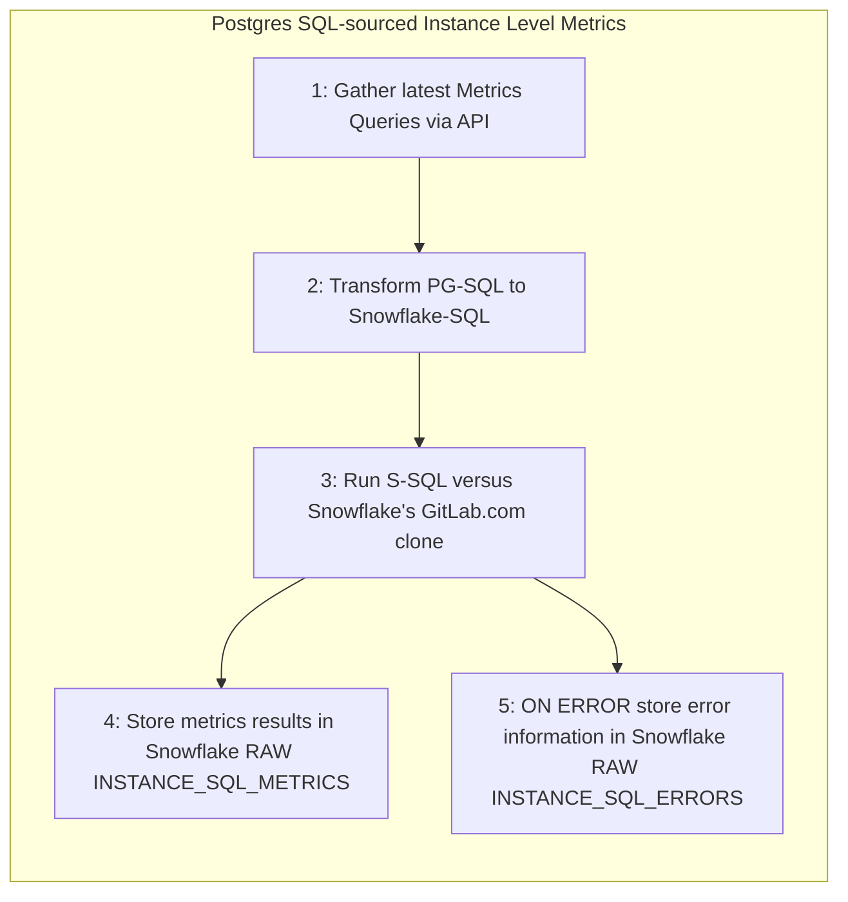

For more details on the data flow, check [Service pinge README.md](https://gitlab.com/gitlab-data/analytics/-/blob/master/extract/saas_usage_ping/README.md) file.

##### Redis based data flow

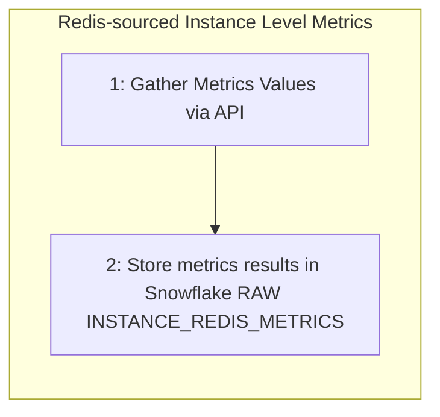

#### SaaS Namespace Service Ping

SaaS Namespace Service Ping produces metrics at a finer-level of granularity than SaaS Instance Service Ping. The process accesses a list of all namespaces in GitLab.com and loops through each namespace to generate ultimate-parent namespace-level usage metrics. The [`namespaces`](https://gitlab.com/gitlab-org/gitlab/-/blob/master/db/structure.sql) table provides input to the the program and for efficiency, a SQL SET OPERATION is used with SQL `GROUP BY` namespace-id instead of a traditional 1-by-1 namespace loop. **Final metrics output is stored at the ultimate parent namespace level**. A drawback with Namespace Service Ping is that only SQL-sourced metrics are currently available and Redis-sourced metrics such as `analytics_unique_visits.g_analytics_contribution` are currently unavailable.

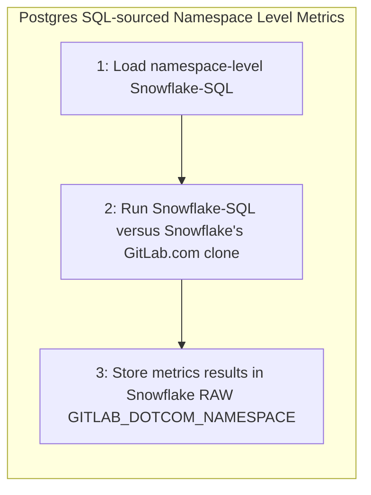

#### Metrics Gathering and Generation Process Pseudo-code

1. Assume the `GitLab.com` `Postgres` source data pipelines are running and fresh up-to-date data is available in Snowflake in `RAW.SAAS_USAGE_PING` and `PREP.SAAS_USAGE_PING` schemas, respectively
1. Begin [Service Ping python program](https://gitlab.com/gitlab-data/analytics/-/blob/master/extract/saas_usage_ping/usage_ping.py)
     1. Start **SQL-based** metrics generation
          1. Start Postgres SQL-sourced Metrics
               1. Grab the latest set of Postgres SQL-sourced (PG-SQL) metric queries from the [Metrics Dictionary API Query Endpoint](https://docs.gitlab.com/ee/api/usage_data.html#export-service-ping-sql-queries)
               1. Transform Instance-Level PG-SQL to Snowflake SQL (S-SQL) using the [python transformer](https://gitlab.com/gitlab-data/analytics/-/blob/master/extract/saas_usage_ping/transform_instance_level_queries_to_snowsql.py)
               1. Run S-SQL versus the SaaS GitLab.com clone data available in the Snowflake Data Warehouse and store the results in `RAW.SAAS_USAGE_PING.INSTANCE_SQL_METRICS`. In case of error, data will land in `RAW.SAAS_USAGE_PING.INSTANCE_SQL_ERRORS` table.
          1. Start **Redis-based** Metrics
                1. Call the Redis API
                1. Data is picked up and stored in a [JSON format](https://gitlab.com/-/snippets/2095831), the approximate size is around 2k lines, usually one file per load (at the moment, it is a weekly load) and the data is stored in `RAW.SAAS_USAGE_PING.INSTANCE_REDIS_METRICS`
     1. Start **Namespace-Level** metrics generation
          1. Grab the latest metrics queries from the [Namespace Queries JSON](https://gitlab.com/gitlab-data/analytics/-/blob/master/extract/saas_usage_ping/usage_ping_namespace_queries.json)
          1. Run the Namespace Queries versus the SaaS GitLab.com clone data available in the Snowflake Data Warehouse and store the results in `RAW.SAAS_USAGE_PING.GITLAB_DOTCOM_NAMESPACE`

### Phase 2: Metrics transformation to Trusted Data Model 

Once all of the source metrics are available in Snowflake `RAW.SAAS_USAGE_PING` schema, we begin dbt processing to transform the data into the Trusted Data Model format.
- [**SQL** based metrics dbt processing](https://dbt.gitlabdata.com/#!/model/model.gitlab_snowflake.saas_usage_ping_instance?g_v=1&g_i=%2Bsaas_usage_ping_instance%2B)
- [**Redis** based metrics dbt processing](https://dbt.gitlabdata.com/#!/model/model.gitlab_snowflake.instance_redis_metrics)
- [**Namespace**-level dbt processing](https://dbt.gitlabdata.com/#!/model/model.gitlab_snowflake.saas_usage_ping_namespace)

#### Known Limitations/Improvements

- Namespace-level Redis-source Metrics are not yet available
- Snowflake has redundant "legacy" service-ping processes and these need to be deprecated

### Service Ping Metrics Types

Within Service Ping, there are 2 main types of metrics supported:

- SQL metrics: metrics sourced from `Postgres` tables
- Redis metrics: metrics sourced from `Redis` based counters

<div style="width: 640px; height: 480px; margin: 10px; position: relative;"><iframe allowfullscreen frameborder="0" style="width:640px; height:480px" src="https://lucid.app/documents/embeddedchart/8e8decaf-a45c-4bc3-9fd5-6fa3dd1ea660" id="ZaD2gkT4TN7D"></iframe></div>


#### SQL Metrics Implementation

The SQL-based metrics workflow is the most complicated flow. SQL-based metrics are actually created by a SQL query run against the Postgres SQL database of the instance. For large tables, these queries can be very long to run. An example is for example the `counts.ci_builds` metric which is running a `COUNT(*)` on the ci_builds which is one of our largest (see dbt table containing more than 1 billion rows). The goal of this module will be to run against our Snowflake database instead of the postgres SQL database of our SaaS Instance.

The Product Intelligence team has created an API endpoint that enables us to retrieve all the SQL queries to run to calculate the metrics. Here is an example file.

A technical documentation about the API endpoint [is available here](https://docs.gitlab.com/ee/api/usage_data.html#export-service-ping-sql-queries)

Let's take a look at a few queries received in the JSON response:

```
 "counts": {
    "assignee_lists": "SELECT COUNT(\"lists\".\"id\") FROM \"lists\" WHERE \"lists\".\"list_type\" = 3",
    "boards": "SELECT COUNT(\"boards\".\"id\") FROM \"boards\"",
    "ci_builds": "SELECT COUNT(\"ci_builds\".\"id\") FROM \"ci_builds\" WHERE \"ci_builds\".\"type\" = 'Ci::Build'",
    "ci_internal_pipelines": "SELECT COUNT(\"ci_pipelines\".\"id\") FROM \"ci_pipelines\" WHERE (\"ci_pipelines\".\"source\" IN (1, 2, 3, 4, 5, 7, 8, 9, 10, 11, 12, 13) OR \"ci_pipelines\".\"source\" IS NULL)",
    "ci_external_pipelines": "SELECT COUNT(\"ci_pipelines\".\"id\") FROM \"ci_pipelines\" WHERE \"ci_pipelines\".\"source\" = 6",
    "ci_pipeline_config_auto_devops": "SELECT COUNT(\"ci_pipelines\".\"id\") FROM \"ci_pipelines\" WHERE \"ci_pipelines\".\"config_source\" = 2",
    "ci_pipeline_config_repository": "SELECT COUNT(\"ci_pipelines\".\"id\") FROM \"ci_pipelines\" WHERE \"ci_pipelines\".\"config_source\" = 1",
    "ci_runners": "SELECT COUNT(\"ci_runners\".\"id\") FROM \"ci_runners\"",
    "ci_triggers": "SELECT COUNT(\"ci_triggers\".\"id\") FROM \"ci_triggers\"",
```

So the goal would be to be able to run them against tables in Snowflake _(synced from GitLab Saas)_. We need to do so, to have tables that have the same column names and the same granularity as the ones in the Postgres SQL tables.

Here below, you see the way we currently transform the Postgres data in Snowflake:


As highlighted here, we created a `dedupe` layer that is exactly meeting this criteria. `dedupe` layer is handy mechanism in order to avoid duplicates and provide accurate data without any compromise. 

We have then identified the tables against which we can run the SQL-based metrics queries. We will then need to transform the SQL statements to query against these tables.

We have a script running that transforms this SQL statements :

```
"SELECT COUNT(\"ci_builds\".\"id\") 
   FROM \"ci_builds\" 
  WHERE \"ci_builds\".\"type\" = 'Ci::Build'",
```

to this SQL statement:

```
"SELECT 'counts.ci_builds'    AS counter_name,  
        COUNT(ci_builds.id)   AS counter_value, 
        TO_DATE(CURRENT_DATE) AS run_day   
   FROM prep.gitlab_dotcom.gitlab_dotcom_ci_builds_dedupe_source AS ci_builds  
  WHERE ci_builds.type = 'Ci::Build'"
```

We then run all these queries and store the results in a json that we send them to the table called `RAW.SAAS_USAGE_PING.INSTANCE_SQL_METRICS`. This table has the following columns:

- `query_map`: that stores all the queries run 
- `run_results`: that stores the results returns
- `ping_date`: date when the query got run
- `run_id`: unique identifier of the processing

For any error appeared, data is saved into `RAW.SAAS_USAGE_PING.INSTANCE_SQL_ERRORS` table. This table keeps data in `json` data type. On the top of the table, mechanism is build to incorporate any error in the `Trusted Data Model` and easily make any malfunction in the `SQL` processing visible. 


#### Redis Metrics Implementation

Redis counters are used to record high-frequency occurrences of some arbitrary situation happening in GitLab, that do not create a permanent record in our Database, for example when a user folds or unfolds the side bar. In such cases, the backend engineer will define a name that would represent a given situation, for example navigation_sidebar_opened, and also arbitrarily decide on the moment (by adding dedicated piece of code in existing execution path) when it happens.

The Product Intelligence team has created an API endpoint that allows the Data Team to retrieve all Redis metrics value at any time we want. An example of the JSON Response is available on the page [UsageDataNonSqlMetrics API](https://docs.gitlab.com/ee/api/usage_data.html#usagedatanonsqlmetrics-api). Note that `-3` means that the metrics is not redis so the API doesn't retrieve any value for it. Once the JSON response received, we store it in Snowflake in the table `RAW.SAAS_USAGE_PING.INSTANCE_REDIS_METRICS`. Additional technical documentation about the API endpoint [is available here](https://docs.gitlab.com/ee/api/usage_data.html#usagedatanonsqlmetrics-api). The table has the following columns:

- `jsontext`: that stores all the queries run 
- `ping_date`: date when the query got run
- `run_id`: unique identifier of the processing

### Airflow setup

We created a Airflow dag `saas-instance-usage-ping` run every Saturday that executes all the operations described below:

- fetching the queries from the API Endpoint
- transforming the queries to be able to run them against Snowflake dedupe layer
- run the queries
- store the results in Snowflake 

## From RAW to PROD database and Sisense

We currently do limited transformation once the data is stored in RAW. In the future, the data flow will look like that:

That means the data set created will be UNIONED with the current data pipeline in the model `prep_usage_data_flattened`.

---
layout: handbook-page-toc
title: "Sales Funnel"
---
## On this page

- TOC
{:toc}

{::options parse_block_html="true" /}

---
## Sales Funnel

The Sales Funnel is a core component of GitLab's Lead to Cash process and it tracks an inquiry from a potential customer all the way to a closed won opportunity. Along the way, a customer passes from a lead, to a marketing qualified lead, to a sales accepted opportunity, and finally to a closed won or lost opportunity. This handbook page provides analytical tools and resources to help GitLab team members analyze the entire sales funnel and generate insights. 

The goal of this page:

* Help you understand how to navigate through the [TD: Sales Funnel - Target vs. Actual Dashboard](https://app.periscopedata.com/app/gitlab/761665/TD:-Sales-Funnel---Target-vs.-Actual) and its derived dashboards.
* Help you understand the data models used to create the TD: Sales Funnel - Targets vs. Actuals Dashboard.
* Have you assess your understanding by taking a certification most applicable to your role at GitLab.
    * To learn more about how to use the dashboard, take the [Dashboard user certification](https://docs.google.com/forms/d/e/1FAIpQLScTU4iVXI0yw0QSDjZbznbIMmhZSs1GxCoTsVOlg1lQdgUSGg/viewform).
    * To learn more about developing Sisense dashboards, take the [Dashboard Developer certification](https://docs.google.com/forms/d/e/1FAIpQLSdWz4VNYM5ItjzmgeU6H3hafY_zycd2NkAlAM4sPXJCqrtoUw/viewform).
* And overall help everyone contribute!

### Release Train Cadence:

1. Requirements gathering due date: 1 week after the Sales Key Meeting.
1. Release shipped for UAT: 1 week before Sales Key Meeting.

### Maintenance Schedule:

1. As needed, Scheduled Maintenance will be performed every two weeks on Friday, from 9am to 11am EST.

### Quick Links
<div class="flex-row" markdown="0" style="height:80px">
  <a href="https://app.periscopedata.com/app/gitlab/761665/TD:-Sales-Funnel---Targets-vs.-Actuals" class="btn btn-purple" style="width:33%;height:100%;margin:5px;float:left;display:flex;justify-content:center;align-items:center;">TD: Sales Funnel - Targets vs. Actuals Dashboard</a>
  <a href="https://www.youtube.com/watch?v=AuMV-cq04cs&feature=youtu.be" class="btn btn-purple" style="width:33%;height:100%;margin:5px;float:left;display:flex;justify-content:center;align-items:center;">Sales Funnel Dimensional Model and Dashboard Training</a>
  <a href="https://app.periscopedata.com/app/gitlab/828239/TD:-Sales-Funnel-Management-View---Preloaded-Cuts" class="btn btn-purple" style="width:33%;height:100%;margin:5px;float:left;display:flex;justify-content:center;align-items:center;">TD: Sales Funnel Management View - Preloaded Cuts</a>
  <a href="https://app.periscopedata.com/app/gitlab/831911/TD:-Standard-Bookings-Cuts" class="btn btn-purple" style="width:33%;height:100%;margin:5px;float:left;display:flex;justify-content:center;align-items:center;">TD: Standard Bookings Cuts</a>
  <a href="https://www.youtube.com/watch?v=F4FwRcKb95w&feature=youtu.be" class="btn btn-purple" style="width:33%;height:100%;margin:5px;float:left;display:flex;justify-content:center;align-items:center;">Getting started using Sisense Discovery</a>
</div>
<br><br><br><br><br><br><br><br><br>

<style> #headerformat {
background-color: #6666c4; color: black; padding: 5px; text-align: center;
}
</style>
<h1 id="headerformat">Getting Started </h1>

To get started we want to make sure you understand:

* What KPIs/PIs are supported using this dashboard
* Key terms that will explain how we account for the metrics
* The data source behind the dashboard
* To explore further, you can create visual and analysis yourself in Sisense. A great way to start is using the Sisense Discovery tool. Want to get started in Sisense head here.
* To go even deeper, you can explore data in snowflake. The benefit of exploring in Snowflake is you can join to additional information (i.e. other data sources). Additional information on exploring in Snowflake can be found here.


<style> #headerformat {
background-color: #6666c4; color: black; padding: 5px; text-align: center;
}
</style>
<h1 id="headerformat">Key Terms, Metrics, KPIs/PIs, and Key Field and Business Logic </h1>

<details>
<summary markdown='span'>
  Key Terms
</summary>
Dimensions:

* [Order Type](https://about.gitlab.com/handbook/sales/sales-term-glossary/#order-type-20-field-values)
* **Sales Qualified Source:** How the opportunity was created.
* **Purchase Channel:** The method in which the account purchased.
* [GTM Strategy](https://about.gitlab.com/handbook/marketing/revenue-marketing/account-based-strategy/GL4300-and-MM4000./#accounts-are-identified-in-salesforce-by-the-gtm-strategy-field-in-salesforce) 
* **Focus Account:** These represent the accounts where our Account Based Marketing team is working closely with Sales and Field Marketing to specifically target. GTM Strategy values of Account Centric, Account Based - Net New, and Account Based - Expand GTM Strategy Accounts represent Focus Accounts.
* [Marketing Channel (Initial Source)](https://about.gitlab.com/handbook/marketing/marketing-operations/#initial-source)
* **Sales Hierarchy Live:** Sales Area > Sales Region > Location Region > Sales Segment
* **Sales Hierarchy Stamped:** Sales Area > Sales Region > Location Region > Sales Segment

</details>

<details>
<summary markdown='span'>
  Key Metrics, KPIs, and PIs
</summary>
Facts:

* **Marketing Qualified Lead (MQL):** Count of qualified leads that could become a sales opportunity. Today a person can MQL once, but in the future, a MQL can qualify multiple times as we nurture contacts. A MQL is a lead that has reached a certain threshold, we have determined to be 100 points accumulated, based on demographic/firmographic and/or behavioral information. The "MQL score" is comprised of various actions and/or profile data that are weighted with positive or negative point values. Every time a Person Score is updated, LeanData will run a check to see if the record needs to be processed through the flow.
* **Sales Accepted Opportunity (SAO):** An Opportunity that has a meeting set with a contact at a prospect who has authority to buy, or an initiative where GitLab can be the solution, or a fit that includes a use case and potential number of seats and a next step in the next 60 days. This opportunity has been validated and accepted by a sales rep that was generated by SDR.
* **SAO/MQL:** Snapshotted conversion rate of all MQLs that convert to SAOs in a month. Divide number of SAOs in a month by the number of MQLs in a month.
* **New Logos:** The number of first order accounts that we acquire.
* **Closed Won IACV (Net_ARR):** Bookings revenue for closed won deals.
* **Closed Won Deals:** The number of opportunities that have converted into revenue.
* **Win Rate:** Of the opportunities that get to resolution, how many do we win in a period.
* **ASP on New First Order Deals:** Average deal size of first order deals.
* **IACV (Net_ARR) Created:** The value of pipeline that was created on each day. Pipeline can change over time. This is the current pipeline based on creation date.
* **Cycle Time, SAO to Closed Won Deal:** Time it takes on average for an opportunity to reach conclusion for Closed Won deals.
* **SAO to Closed Won Conversion Rate:** Conversion rate of SAOs that convert to Closed Won deals on a monthly basis.
* **SAO to Closed Won - Closed Buckets:** Count of SAOs based on time it takes for SAO to reach conclusion for Closed Won deals.
</details>

<details>
<summary markdown='span'>
  Key Fields and Business Logic
</summary>
* There are three critical dates on opportunities to be aware of: created date, accepted date, and closed date. Created date is applicable when calculating the IACV created metrics. Accepted date is applicable when calculating the Sales Accepted Opportunity Metrics (SAOs). Closed date is applicable when calculating the closed won and lost related metrics. 
* GitLab does not have a specific trial tier for the Gold and Ultimate trials; however, it is helpful to think about trials in the context of product tiers when building the Enterprise Dimensional Model (EDM) and producing insights and analytics from the EDM. We use Ultimate - Trial and Gold - Trial values in our Product Tier Dimension to be able to easily report on and analyze trials across the Enterprise.
* Boolean flags are available to use in Sisense. These are helpful when creating charts that require repetitive filters.
1. `is_net_arr_closed_deal` - Calculate metrics such as Net_ARR from Closed Won and Closed Lost-Renewals.
1. `is_new_logo_first_order` - Calculate metrics such as Net_ARR from First Order Accounts that we acquire.
1. `is_net_arr_pipeline_created` - Calculate metrics such as Net_ARR from the pipeline that was created.
1. `is_win_rate_calc` - Fetch opportunities in scope for the win rate calculation.
1. `is_closed_won` -  Calculate metrics such as Net_ARR for Closed Won deals.
</details>

<style> #headerformat {
background-color: #6666c4; color: black; padding: 5px; text-align: center;}
</style>
<h1 id="headerformat">Understanding the Data Sources and Data Models</h1>
<br>
**TD: Sales Funnel - Target vs. Actual Dashboard** is created off report views generated from 3 primary mart views in Sisense, **[mart_crm_opportunity]**, **[mart_crm_person]**, and **[mart_sales_funnel_target]**. Sisense views allow us to reference a simple string of sql in as many charts as we want. This helps to take the guess work out for an end user in understanding logic behind calculations like New Logo Counts, or number of Sales Accepted Opportunity (SAOs) counts, and also takes the guesswork out of understanding which joins are possible.

To create your own dashboards, you can reference the following views available in Sisense:
* **[mart_crm_opportunity]** - mart table that joins the applicable facts and dimensions together to get a view of the opportunity section of the Sales Funnel.
* **[mart_crm_person]** - mart table that joins applicable facts and dimensions together to get a view of the marketing qualified lead section of the Sales Funnel.
* **[mart_sales_funnel_target]** - mart table that joins applicable facts and dimensions together to get a view of the Sales Funnel Targets.
* **[rpt_crm_opportunity_closed_period]** - report that pivots the **[mart_crm_opportunity]** view on the closed period and generaties useful date aggreation fields.
* **[rpt_crm_opportunity_accepted_period]** - report that pivots the **[mart_crm_opportunity]** view on the accepted period and generaties useful date aggreation fields.
* **[rpt_crm_opportunity_created_period]** - report that pivots the **[mart_crm_opportunity]** view on the created period and generaties useful date aggreation fields.
* **[rpt_sales_funnel_target]** - report that pivots the **[mart_sales_funnel_target]** view on the target period and generaties useful date aggreation fields. 
* **[rpt_crm_person_mql]** - report that filters **[mart_crm_person]** WHERE is_mql = 1 that is used to count MQLs.

This views takes into account the data models as seen in the Entity Relationship Diagram (ERD):

<div style="width: 640px; height: 480px; margin: 10px; position: relative;"><iframe allowfullscreen frameborder="0" style="width:640px; height:480px" src="https://lucid.app/documents/embeddedchart/b09f9e0a-e695-4cba-882d-981a93216293" id="7Da6Neo1dhab"></iframe></div>


<details>
<summary markdown='span'>
  Data Lineage
</summary>
* Data is sourced from Salesforce.com
* The dbt solution generates a dimensional model from RAW source data. The documentation and SQL for <a href = "https://dbt.gitlabdata.com/#!/model/model.gitlab_snowflake.mart_crm_opportunity">mart_crm_opportunity can be found here </a>, and the complete data lineages can be found at <a href = "https://dbt.gitlabdata.com/#!/model/model.gitlab_snowflake.mart_crm_opportunity?g_v=1&g_i=%2Bmart_crm_opportunity%2B"> dbt mart_crm_opportunity lineage chart </a>
* The dbt solution generates a dimensional model from RAW source data. The documentation and SQL for <a href = "https://dbt.gitlabdata.com/#!/model/model.gitlab_snowflake.mart_crm_person">mart_crm_person can be found here </a>, and the complete data lineages can be found at <a href = "https://dbt.gitlabdata.com/#!/model/model.gitlab_snowflake.mart_crm_person?g_v=1&g_i=%2Bmart_crm_person%2B"> dbt mart_crm_person lineage chart </a>
* The dbt solution generates a dimensional model from RAW source data. The documentation and SQL for <a href = "https://dbt.gitlabdata.com/#!/model/model.gitlab_snowflake.mart_sales_funnel_target">mart_sales_funnel_target can be found here </a>, and the complete data lineages can be found at <a href = "https://dbt.gitlabdata.com/#!/model/model.gitlab_snowflake.mart_sales_funnel_target?g_v=1&g_i=%2Bmart_sales_funnel_target%2B"> dbt mart_sales_funnel_target lineage chart </a>
</details>

<details>
<summary markdown='span'>
  Example Queries
</summary>
Let's calculate SAOs, MQLs, and pull the targets for SAOs using the Marts. You can use these queries in both Snowflkae and Sisense.
<br>
```sql
--select the targets for SAOs
SELECT 
  target_month,
  kpi_name,
  sales_segment_name_live,
  location_region_name_live,
  sales_region_name_live,
  sales_area_name_live,
  order_type_name,
  opportunity_source_name,
  SUM(allocated_target)   AS allocated_target
FROM "PROD"."COMMON_MART_SALES"."MART_SALES_FUNNEL_TARGET"
WHERE kpi_name = 'Stage 1 Opportunities'
GROUP BY 1,2,3,4,5,6,7,8
ORDER BY 1,2,3,4,5,6,7,8

--Count MQLs
SELECT 
  DATE_TRUNC('month',mql_date_first)  AS mql_month,
  COUNT(mql_date_first_id)            AS actual_mqls
FROM "PROD"."COMMON_MART_MARKETING"."MART_CRM_PERSON"
WHERE is_mql = 1
GROUP BY 1
ORDER BY 1 DESC

--Count SAOs
SELECT
  DATE_TRUNC('month',sales_accepted_date) AS sao_month,
  COUNT(*)                                AS actual_saos
FROM "PROD"."COMMON_MART_SALES"."MART_CRM_OPPORTUNITY"
WHERE is_sao = TRUE
GROUP BY 1
ORDER BY 1 DESC

```

</details>
<br>

<style> #headerformat {
background-color: #6666c4; color: black; padding: 5px; text-align: center;}
</style>
<h1 id="headerformat">Sales Funnel Standard Reports</h1>
<br>

<details>
<summary markdown='span'>
  Sales Funnel Management View - Preloaded Cuts
</summary>

The [TD: Sales Funnel Management View - Preloaded Cuts](https://app.periscopedata.com/app/gitlab/828239/TD:-Sales-Funnel-Management-View---Preloaded-Cuts) dashboard tracks the main 9 KPIs from the Sales Funnel:

1. Net ARR
1. New Logos
1. Pipeline Created
1. Sales Accepted Opportunities (SAO)
1. Marketing Qualified Leads (MQLs)
1. Trials
1. Average Sales Price (ASP)
1. MQLs to SAOs
1. Win Rate

The KPIs are compared to their respective targets at a quarter to date (QTD) pacing, slicing them by different dimensions. These cuts allow management to get a quick high level overview on how the business is performing across different dimensions. It answers the question of what areas of the business are on track and which need more attention.

Currently, the sales management cuts are powered by the following snippets (instructions on how to use them are in the description section of the snippet):

1. [main_qtd_view_sales_funnel](https://app.periscopedata.com/app/gitlab/snippet/main_qtd_view_sales_funnel/55d49d17d8cf4cc6bf976c61da2d0017/edit)
1. [ratio_qtd_view_sales_funnel](https://app.periscopedata.com/app/gitlab/snippet/ratio_qtd_view_sales_funnel/55d5211e130f45a29a3a1562307f95d9/edit)

The [sales management python module](https://gitlab.com/gitlab-data/periscope/-/tree/periscope/master/custom_modules/sales_management), along with the snippets, are used to visualize the reports in the BI layer.

</details>

<details>
<summary markdown='span'>
  Standard Bookings Cuts
</summary>

The [TD: Standard Bookings Cuts](https://app.periscopedata.com/app/gitlab/831911/TD:-Standard-Bookings-Cuts) dashboard tracks the performance of Booked Net ARR against the Previous Year (Year over Year, Y/Y) and against the quarterly and yearly financial target by different dimensions.

Each cut is composed of a Quarter View and a Fiscal Year View.

To use the dashboard select a Fiscal Quarter in the filters and any of the options of the `Drilldown` filter. The latter selects the granularity of the `Sales Segment Drilldown` field:

| Overall | Large - PubSec Breakdown | Large - Region Breakdown | Mid-Market Breakdown |
|     --         | --           | --              | --                |
|                |              | US East         | US East           |
|                |              | US West         | US West           |
|                |              | EMEA            | EMEA              |
|                |              | APAC            | APAC              |
|                |  Large       | Large           | Large             | 
|                |  PubSec      | PubSec          | PubSec            |
| Large + PubSec |              | Large + PubSec  | Large + PubSec    |
|                |              |                 | First Order Team  |
|                |              |                 | Territory (<500)  |       
| Mid - Market   | Mid - Market | Mid - Market    | Mid - Market      |
| SMB            | SMB          | SMB             | SMB               |
| WW             | WW           | WW              | WW                |

#### Key Fields and Business Logic

* [ATR (Available To Renew)](https://about.gitlab.com/handbook/sales/sales-term-glossary/#available-to-renew-atr)
* %ATR: Net ARR for a given category / subtotal ATR. E.g. when calculating %ATR for the segment SMB and growth type Contraction: `Net ARR for SMB | Contraction` / `ATR for SMB`
* TRX: Number of opportunities
* %MIX(ARR): Net ARR for a given category / subtotal ARR. E.g. when calculating %MIX(ARR) for the segment SMB and Deal Size 5-25k: `Net ARR for SMB | 5-25k` / `ARR for SMB`
* % of Bookings: Net ARR for a given category / total ARR for a given quarter
* % of Total Bookings: Net ARR for a given category / total ARR for a given category subtotal
* ProServ #: Number of opportunities with a proserv_amount different from zero
* [A R (Attach Rate)](https://about.gitlab.com/handbook/sales/performance-indicators/#proserve-deal-and-dollar-attach-rate)
* The `US East` row shown in the sales segment drilldown field is composed of both the `East` and `LATAM` region
* Sales segment drilldown = APAC is composed of all the regions that are not `East`, `West`, `LATAM` and `EMEA`
* Sales segment drilldown = SMB is composed of the segment SMB plus all the segments that are not `Large` and `Mid-Market`
* Channel Type = Fulfilled is composed of the Channel Type Fulfilled plus NULL/Missing Channel Type

</details>

<style> #headerformat {
background-color: #6666c4; color: black; padding: 5px; text-align: center;
}
</style>
<h1 id="headerformat">Additional Resources </h1>

<details>
<summary markdown='span'>
  Trusted Data Solution
</summary>

Sales Funnel models use the `sales_funnel` tag for Trusted Data tests and their results. This can be seen most easily using the [Trusted Data Dashboard](https://app.periscopedata.com/app/gitlab/756199/Trusted-Data-Dashboard)

See overview at [Trusted Data Framework](https://about.gitlab.com/handbook/business-technology/data-team/platform/#tdf)

[dbt guide examples](https://about.gitlab.com/handbook/business-technology/data-team/platform/dbt-guide/#trusted-data-framework) for
details and examples on implementing further tests
</details>

<details>
<summary markdown='span'>
  EDM Enterprise Dimensional Model Validations
</summary>
The [(WIP) Enterprise Dimensional Model Validation Dashboard](https://app.periscopedata.com/app/gitlab/760445/WIP:-Enterprise-Dimensional-Model-Validation-Dashboard) reports on latest Enterprise Dimensional model test and runs.
</details>

<details>
<summary markdown='span'>
  RAW Source Data Pipeline validations
</summary>
[Data Pipeline Health Validations](https://app.periscopedata.com/app/gitlab/715938/Data-Pipeline-Health-Dashboard)
</details>

<details>
<summary markdown='span'>
  Data Security Classification
</summary>
Much of the data within and supporting Sales Funnel Analysis is [Orange](/handbook/engineering/security/data-classification-standard.html#orange) or [Yellow](/handbook/engineering/security/data-classification-standard.html#yellow). This includes ORANGE customer metadata from the account and GitLab's Non public financial information, all of which shouldn't be publicly available. Care should be taken when sharing data from this dashboard to ensure that the detail stays within GitLab as an organization and that appropriate approvals are given for any external sharing. In addition, when working with row or record level customer metadata care should always be taken to avoid saving any data on personal devices or laptops. This data should remain in [Snowflake](/handbook/business-technology/data-team/platform/#data-warehouse) and [Sisense](/handbook/business-technology/data-team/platform/periscope/) and should ideally be shared only through those applications unless otherwise approved.

**ORANGE**

- Description: Customer and Personal data at the row or record level.
- Objects:
  - `dim_crm_person`
  - `dim_crm_account`

**YELLOW**

- Description: GitLab Financial data, which includes aggregations or totals.
- Objects:
  - `fct_crm_person`
  - `fct_crm_opportunity`
</details>

<details>
<summary markdown='span'>
  Solution Ownership
</summary>
* Source System Owner:
  * Salesforce: `@jbrennan1`
* Source System Subject Matter Expert:
  * Salesforce: `@jbrennan1`
* Data Team Subject Matter Expert: `@paul_armstrong` `@jeanpeguero` `@jjstark` `@iweeks`
</details>

---
layout: handbook-page-toc
title: "Trusted Data Solutions Dashboard"
---

## On this page
{:.no_toc}

- TOC
{:toc}

---
Coming Soon!
---
layout: handbook-page-toc
title: "Web Traffic Analysis"
---

## On this page
{:.no_toc}

- TOC
{:toc}

---

## Google Analytics web traffic analysis

Web Traffic Analysis helps to gain insights about visitors and their behavior on our websites to deliver better results. BigQuery and Google Analytics provide you the information needed to improve the website, and make it the best it can be.

**The following subdomains are included:**
- about.gitlab.com _(primary for marketing analysis)_
- docs.gitlab.com
- forum.gitlab.com
- customers.gitlab.com
- learn.gitlab.com

### Why is BigQuery data used to analyze Google Analytics Data?
- No more sampled data
- Unlimited amount of dimensions
- Combining different scopes in one report _(e.g.: session with hit)_
- Build custom Channel Grouping and correct data errors
- Combine Google Analytics data with third party data sources _(e.g.: trial pageviews with trial campaign members in Salesforce)_

### Quick Links:
- Learn Google Analytics fundamentals: [Analytics Academy Online Courses](https://analytics.google.com/analytics/academy/)
- Understand format and schema of BigQuery data: [BigQuery Export Schema - Columns](https://support.google.com/analytics/answer/3437719?hl=en)
- Information about Google Analytics implementation for GitLab public websites [Marketing Web Analytics - Inbound Mktg](https://about.gitlab.com/handbook/marketing/growth-marketing/inbound-marketing/analytics/#dimensions-vs-metrics)
- SaaS Trial Sisense dashboard using BigQuery data: [SaaS Trial Dashboard](https://app.periscopedata.com/app/gitlab/697554/SaaS-Trial-Dashboard)

### Data Caveats and Constraints
- Number of users (Nbr of users) will always have approx 0.1-0.2% discrepancy between BigQuery and Google Analytics 360 UI. This is because Google Analytics shows an approximation for users, Big Query is exact.
- When reporting on hit level data (e.g.: pageviews), you need to link `google_analytics_360.session_hit` table to `analytics.ga360_session_xf` in order to filter by session_date, as there it is currently not available on hit level data (this is WIP in [this](https://gitlab.com/gitlab-data/analytics/-/issues/7098) issue)

### Data Security Classification 

Google Analytics stores unique identifiers such as client id, visitor id that requires **ORANGE** classification

### Solution Ownership

- Source System Owner: `@shanerice`
- Marketing Strategy & Performance Subject Matter Expert: `@vjuhasz`
- Data Team Subject Matter Expert: `@paul_armstrong` `@jeanpeguero`

### Key Terms

- **Session** (aka visits): a group of user interactions with the website that take place within a given time frame. For example a single session can contain multiple page views, events, social interactions. The session expires at midnight and after a certain time of inactivity, that is **60 minutes** on GitLab subdomains.
- **Pageviews**: the number of times users view a page that has the Google Analytics tracking code inserted. This covers all page views; so if a user refreshes the page, or navigates away from the page and returns, these are all counted as additional page views.
- **Unique Pageviews**: The number of unique pageviews is calculated by counting a page viewed multiple times by the same user during the same session only one time. 
- **New Visitors**: New visitors/users are those users that have not visited your site before the time period specified
- **Returning Visitors**: Returning visitors/users made at least one visit to at least one page on the site previously. This is determined by whether Google Analytics can detect cookies, which indicate previous visits. If Google cannot detect a cookie one will be set for future recording, unless the user has disabled cookies in their personal browser preferences.
- **Bounce Rate**: it is given as a percentage and represents the number of visits when users leave the site after just one page; regardless of how they got to the site or how long they stayed on that page.
- **Hits**: interactions during a visit, including pageviews, events, and transactions
- **Events**: events help you measure activity that may not otherwise be recorded by the tracking code; these may include when a user plays a video, click on CTA etc.
- **Custom dimensions**: they enable you to record additional, non-standard data in Google Analytics, such as blog post tag, blog post type (author of blog post), etc

### Key Metrics, KPIs, and PIs

- **Sessions**: in order to properly query and match BigQuery web traffic data in Sisense with Google Analytics UI, you need to create a session id that overrides the midnight split: `CONCAT(visitor_id, CAST(visit_start_time AS STRING)`
- **Users**: calculating users should be based on visitor_id `COUNT(DISTINCT visitor_id)`. Google Analytics takes all rows into account while calculating users (unlike sessions)
- **New Users**: calculating users should be based on visitor_id `COUNT(DISTINCT visitor_id)` where `TOTAL_NEW_VISITS IS NOT NULL`
- **Pageviews**: this metric is based on hit level data and every row should be counted `COUNT(1)` where `HIT_TYPE = 'PAGE'`
- **Unique pageviews**: this metric is also based on hit level data, and in order to count the unique pageviews within a session, you have to concatenate the session id (explained in the _Sessions KPI_) with `PAGE_PATH` where `HIT_TYPE = 'PAGE'`. The results for all pages might have approx. -0.2% difference compared to Google Analytics UI.
- **Bounce rate**: `coming soon`


#### Key Fields and Business Logic
- `session_date`: every report including date dimension should be based on `session_date` instead of `visit_start_time`
- `visitor_id`: used to create session id and to calculate users
- `total_visits`: the number of sessions. This value is `1` for sessions with interaction events. The value is `null` if there are no interaction events in the session. Google Analytics shows interactive sessions only, this should be considered while querying nbr of sessions
- `hit_type`: type of the hit that can be `PAGE` or `EVENT`
- `page_path`: URL path of the page, _e.g.: /free-trial/_
- `host_name`: this is used to filter by the different subdomains _(about.gitlab.com, docs.gitlab.com, etc)_

#### Snippets

`Coming Soon` 

#### Reference SQL

The below SQL queries define the calculation of each main metric that is matching with Google Analytics UI results (All Data - Raw No Filters view)

**Nbr of sessions, users and new users by day in Sept 2020**

```sql
SELECT 
  DATE_TRUNC('day',session_date)::date                                                              AS visit_date,
  COUNT(DISTINCT IFF(total_visits=1, CONCAT(visitor_id, CAST(visit_start_time AS STRING)), NULL))   AS interactive_Sessions,
  COUNT(DISTINCT visitor_id)                                                                        AS users,
  COUNT(DISTINCT IFF(total_new_visits IS NOT NULL, visitor_id, NULL))                               AS new_users
FROM LEGACY.GA360_SESSION_XF
WHERE DATE_TRUNC('day',session_date)::date >= '09/01/2020'
  AND DATE_TRUNC('day',session_date)::date <= '09/30/2020'
GROUP BY 1
ORDER BY 1
```
**Nbr of total and trial pageviews by day from Feb 2020**

```sql

-- this subquery is needed in order to get the session_date for each unique session_id and link it to the hit level table
WITH ga_unique_sessions AS ( 

SELECT
 DISTINCT(CONCAT(visitor_id, CAST(visit_start_time AS STRING))) AS session_id,
 SESSION_DATE
FROM LEGACY.GA360_SESSION_XF 

-- total and trial pageview hits
), ga_pageview_hits AS ( 
  
SELECT
 CONCAT(visitor_id, CAST(visit_start_time AS STRING))           AS session_id,
 page_path,
 CASE
  WHEN page_path = '/free-trial/'
    THEN COUNT(1)
  ELSE 0
 END                                                            AS trial_pageviews,
 COUNT(1)                                                       AS total_pageviews
FROM LEGACY.GA360_SESSION_HIT
WHERE HIT_TYPE = 'PAGE'
GROUP BY 1,2
  
), final AS(
  
SELECT
 SESSION_DATE                                                   AS visit_date,
 SUM(trial_pageviews)                                           AS trial_pageviews,
 SUM(total_pageviews)                                           AS total_pageviews,
 COUNT(DISTINCT ga_pageview_hits.session_id,page_path )         AS unique_pageviews
FROM ga_pageview_hits
LEFT JOIN ga_unique_sessions
 ON ga_pageview_hits.session_id=ga_unique_sessions.session_id
WHERE DATE_TRUNC('day',SESSION_DATE)::date >= '2/1/2020'
GROUP BY 1
)

SELECT *
FROM final
```

#### Entity Relationship Diagrams

`Coming Soon` 

## Data Platform Solution

### Data Lineage

Google Analytics 360/ BigQuery data is based on `All Data - Raw No Filters` view that is using `(GTM-08:00) Los Angeles` Time zone. Google Analytics 360/BigQuery data is available from `19th Feb 2020` in Sisense. These are essential to know this while comparing your query results with Google Analytics 360 UI.

Each row in the Google Analytics BigQuery represents a single session.
There are a lot of dimensions and metrics on Google Analytics UI, this schema can be a bit overwhelming on database level. The below picture represents 2 sessions that helps to get a better understanding of the BigQuery data structure:

{: .shadow}

To get more clarity about BigQuery export schema, take a look at the below interactive tree map:


[*Source*](https://rpubs.com/Phippsy/bq-export)


There are **3 major BigQuery tables** that are crucial to perform web traffic analysis:

1. [analytics.ga360_session_xf](https://dbt.gitlabdata.com/#!/model/model.gitlab_snowflake.ga360_session_xf): session level data that is used to calculate nbr of sessions, users, unique visitors
1. [google_analytics_360.session_hit](https://dbt.gitlabdata.com/#!/source/source.gitlab_snowflake.google_analytics_360.session_hit): hit level data to calculate pageviews, events, etc
1. [ga360_session_custom_dimension_xf](https://dbt.gitlabdata.com/#!/model/model.gitlab_snowflake.ga360_session_custom_dimension_xf): for reporting on GitLab specific dimensions (this depends on the scope defined for each custom dimension, more info [here](https://support.google.com/analytics/answer/2709828?hl=en))


### DBT Solution

`Coming Soon` 

### Trusted Data Solution

`Coming Soon` 

### EDM Enterprise Dimensional Model Validations

`Coming Soon` 

### RAW Source Data Pipeline validations

`Coming Soon` 
 


---
layout: handbook-page-toc
title: "xMAU Analysis"
description: "xMAU is a single term to capture the various levels at which we capture Monthly Active Usage (MAU)"
---

## On this page
{:.no_toc}

- TOC
{:toc}

---

## xMAU Analysis

xMAU is a single term to capture the various levels at which we capture Monthly Active Usage (MAU), encompassing Action (AMAU), Group (GMAU), Stage (SMAU), and Total CMAU). In order to provide a useful single metric for product groups which maps well to product-wide Key Performance indicators, each xMAU metric cascades upwards in the order noted above.

xMAU metrics are derived from Usage Ping (Self-Managed instance-level granularity) and GitLab.com (SaaS namespace-level granularity). This Analytics Workflow enables the analysis of each level of xMAU metric across various segments of customers sets the foundation for reporting on [Reported, Estimated, and Projected](https://about.gitlab.com/handbook/product/performance-indicators/#three-versions-of-xMAU) metrics.

**The goal of this page:**
  * Help you understand how to navigate through the [Product Adoption Dashboard](https://app.periscopedata.com/app/gitlab/771580/WIP:-Executive-Dashboard)
  * Help you understand the data models used to Product Adoption Dashboard
  * Have you asess your understanding by taking a certification most applicable to your role at GitLab.
    * Assess your understanding of the dashboard solution, take the [Dashboard user certification](https://forms.gle/kY3cC6ZGzUhqY3mp9).
    * Dashboard Developer certification to come.
    * In addition, we recommend understanding our [methodology for recorded to estimated xMAU](/handbook/business-ops/data-team/data-catalog/xmau-analysis/estimation-xmau-algorithm.html)
  * And overall help everyone contribute!

### Quick Links
<div class="flex-row" markdown="0" style="height:80px">
  <a href="https://app.periscopedata.com/app/gitlab/771580/WIP:-Executive-Dashboard" class="btn btn-purple" style="width:20%;height:100%;margin:5px;float:left;display:flex;justify-content:center;align-items:center;">Product Adoption Dashboard</a>
  <a href="https://www.youtube.com/watch?v=F4FwRcKb95w&feature=youtu.be" class="btn btn-purple" style="width:20%;height:100%;margin:5px;float:left;display:flex;justify-content:center;align-items:center;">Getting started in SiSense</a>
  <a href="https://app.periscopedata.com/app/gitlab/793297/xMAU-Analysis-Workflow---Example-Queries-and-Visualizations" class="btn btn-purple" style="width:20%;height:100%;margin:5px;float:left;display:flex;justify-content:center;align-items:center;">xMAU Example Dashboard</a>
  <a href="https://about.gitlab.com/handbook/business-ops/data-team/data-catalog/xmau-analysis/estimation-xmau-algorithm.html" class="btn btn-purple" style="width:20%;height:100%;margin:5px;float:left;display:flex;justify-content:center;align-items:center;">Estimation Algorithm Page</a>
</div>
<br><br>

<style> #headerformat {
background-color: #6666c4; color: black; padding: 5px; text-align: center;
}
</style>
<h1 id="headerformat">Getting Started </h1>

1) Understand the key terms, metrics, KPIs/PIs
2) Understand the data models


### Key Terms
- **[Account](/handbook/sales/sales-term-glossary/)**
- **[Host](https://docs.gitlab.com/ee/development/telemetry/event_dictionary.html)**
- **[Instance](https://docs.gitlab.com/ee/development/telemetry/event_dictionary.html)**
- **Instance User Count** - the total number of users on an instance
- **[Paid User](/handbook/product/performance-indicators/#paid-user)**
- **[Product Tier](/handbook/marketing/strategic-marketing/tiers/#overview)**
- **[Usage Ping](https://docs.gitlab.com/ee/development/telemetry/event_dictionary.html)**
- **[Version](/handbook/sales/process/version-check/#what-is-the-functionality-of-the-gitlab-version-check)**

### Key Metrics, KPIs, and PIs

Explanations for the metrics below can be found on [the Product Team Performance Indicator page](/handbook/product/performance-indicators/#structure):
- **[Action Monthly Active Users (AMAU)](/handbook/product/performance-indicators/#action-monthly-active-users-amau)**
- **[Stage Monthly Active Users (SMAU)](/handbook/product/performance-indicators/#stage-monthly-active-users-smau)**
- **[Section Monthly Active Users (Section MAU)](/handbook/product/performance-indicators/#structure)**
- **[Section Total Monthly Active Users (Section CMAU)](https://about.gitlab.com/handbook/product/performance-indicators/#structure)**
- **[Combined Monthly Active Users (CMAU)](/handbook/product/performance-indicators/#structure)**

Each metric has three different versions (Recorded, Estimated, Projected), explained on
  - [the Product Team Performance Indicator page](/handbook/product/performance-indicators/#three-versions-of-xmau)
  - [the Sisense Style Guide](/handbook/business-ops/data-team/platform/sisense-style-guide/#recorded-and-calculated-data)
Currently, recorded metrics that have identified usage ping metrics have been charted on the Centralized Dashboard, but we are working on our first version of Estimated values [in this issue](https://gitlab.com/gitlab-data/analytics/-/issues/6547#note_429610192).

#### How xMAU are calculated ?

xMAU is calculated mainly thanks to Service Ping Data source. When the project started, stage and group Product Managers chose one specific service ping metric which produces their xMAU charts.

- [list of GMAU metrics used](https://app.periscopedata.com/app/gitlab/758607/Centralized-SMAU-GMAU-Dashboard?widget=12468487&udv=1146726)
- [list of SMAU metrics used](https://app.periscopedata.com/app/gitlab/758607/Centralized-SMAU-GMAU-Dashboard?widget=12468482&udv=1146726)

The current SSOT for the xMAU metrics is [this spreadsheet](https://docs.google.com/spreadsheets/d/1_b-BoKfrt2iH1dYUMYBxSw_CFpYiQ2W84XD3-AnfuwY/edit?usp=sharing) which is imported via Sheetload to our datawarehouse. That means that when updating the GMAU, SMAU columns for a specific metrics, the changes will propagate downstream to the xMAU charts updated in the handbook.

There is a plan for migrating this SSOT from this spreadsheet to the dictionary YAML files, [work to do is in this issue](https://gitlab.com/gitlab-data/analytics/-/issues/10106).

If you have more questions on the metrics definition, you should ask the Product Intelligence team. They are currently maintaining a Metric dictionary available [here](https://gitlab-org.gitlab.io/growth/product-intelligence/metric-dictionary/). Also if the metrics are database calculations, they are able to provide you with the SQL query run to generate the metrics value.

##### Date Range

For every instance (self-managed and Saas/GitLab.com), we use the last ping generated that month to calculate xMAU. Instances are randomly assigned a day of week to generate service pings, but that assigment is peristent over time. For example, if an instance is assigned Tuesdays to generate pings, it will always generate pings on Tuesdays. Since the day of week that pings are generated differs across instances, the exact date range captured in a 28-day counter will also differ.

Currently, the "last ping of the month" is determined by the date at the beginning of the week (Monday). (In SQL: `DATE_TRUNC('month', ping_created_at_week)`). As such, sometimes the "last ping of the month" does not technically happen during the month of measurement. Here is an example from August 2021:

| Ping Created Date | Ping Created Week | Is used for August 2021 xMAU |
| --- | --- | --- |
| `2021-08-05` | `2021-08-02` | FALSE |
| `2021-08-12` | `2021-08-09` | FALSE |
| `2021-08-19` | `2021-08-16` | FALSE |
| `2021-08-26` | `2021-08-23` | FALSE |
| `2021-09-02` | `2021-08-30` | TRUE |

#### Difference between xMAU and Paid xMAU

##### Paid xMAU Definition

Each of these above metrics will be calculated for xMAU and paid xMAU. Paid xMAU is currently defined as Monthly Active Users who "roll up to a paid instance for Self-Managed via Usage Ping data _or_ a paid namespace for SaaS via GitLab.com Postgres Database Imports in a 28 day rolling period". (See [Paid Stage Monthly Active Users - Paid SMAU](https://about.gitlab.com/handbook/product/performance-indicators/#paid-stage-monthly-active-users-paid-smau) as an example.)

Since GitLab Business functions currently do not have a standardized way to identified which namespaces or instances belong to an OSS, EDU, internal projects, or other subscriptions that have a paid plan type but do not contribute ARR, the current implementation of xMAU include users associated with these subscriptions as "paid".

##### Calculation of xMAU and Paid xMAU

We have 2 main data sources to calculate xMAU and paid xMAU, the Version App and the Gitlab.com Postgres database. The table below summarises which data source is used for those calculations.

|   Delivery   | xMAU         | Paid xMAU                   |
|--------------|--------------|-----------------------------|
| SaaS         | version app* | Gitlab.com Postgres Table** |
| Self-Managed | version app  | version app***              |

_Notes_:

\*: For SaaS xMAU, we use the payloads generated for gitlab.com. These payloads are easily identifiable since they are linked to an instance with uuid = `ea8bf810-1d6f-4a6a-b4fd-93e8cbd8b57f`

\*\*: For SaaS paid XMAU, we need to use Gitlab.com postgres table. The Usage Ping payloads generated from our Gitlab.com Instance gives us high-level statistics at an instance level. This is an aggregated number which can't be further broken down, for example by product tier, plan type, or namespace.
  * To be able to generate SaaS paid xMAU we need to replicate the xMAU counters with the replica of the Gitlab.com database which is stored in our data warehouse.
    * [Batch counters](https://docs.gitlab.com/ee/development/usage_ping/#ordinary-redis-counters) are simple SQL-generated counters. The SQL query used to generate the counters are accessible and easily recreated.
    * Unfortunately, this is not doable for every single counter. [Redis counters](https://docs.gitlab.com/ee/development/usage_ping/#redis-counters) are NOT SQL-generated counters. They also track actions that are not in the Postgres DB such as pageviews, or frontend interactions.
  * Therefore, only some metrics can be recreated using the Gitlab.com Postgres Replica. That means that for now, we are not able to calculate some of the SaaS Paid xMAU metrics like the Monitor Stage.

\*\*\*: To calculate paid xMAU on Self-Managed we use the `edition` field in the [Usage Ping Payload](https://docs.gitlab.com/ee/development/usage_ping/#example-usage-ping-payload), selecting only usage pings with `EEP`, `EES` and `EEU` edition. The edition value is derived from the [plan column in the license table in the licenseDot database at the time the license was generated](https://gitlab.com/gitlab-data/analytics/-/issues/7257#note_464118474). That means that currently we don't exclude EDU/OSS subscriptions from the paid xMAU calculations.

### Data Sources

Based on the explanations above, the 2 main data sources we are using are:

- Service Ping Data Source
- Gitlab.com Data Source

### Data marts

We have built a suite of datamarts that allow users to explore our different product data sources.

#### Mart Service Ping Usage Ping Data

The `mart_service_ping_product_usage_data` is the most comprehensive data model for all Service Ping data. This data model joins together Service Ping data with financial and GTM data sources such as subscription, CRM Account...

This allows users to retrieve usage data for all monthly and all-time metrics which are [defined here](/handbook/business-technology/data-team/data-catalog/xmau-analysis/product-manager-toolkit.html)

#### Mart Estimated xMAU

The mart `mart_estimated_xmau` is built in order to generate easily the estimated XMAU PIs. This model contains all the estimation logic which is explained [in this page](/handbook/business-technology/data-team/data-catalog/xmau-analysis/estimation-xmau-algorithm.html).

End-users can then use very simple charts to create their estimated xMAU chart:

```
SELECT 
reporting_month,
product_tier,
SUM(estimated_monthly_metric_value_sum)
FROM common_mart_product.mart_estimated_xmau
WHERE xmau_level = 'SMAU' AND stage_name = 'create'
GROUP BY 1,2```
```

A `mart_paid_estimated_xmau` datamart has been created to construct specifically paid xMAU charts

### Service Ping Data Pipeline

<div style="width: 640px; height: 480px; margin: 10px; position: relative;"><iframe allowfullscreen frameborder="0" style="width:640px; height:480px" src="https://lucid.app/documents/embeddedchart/7ccc1e4a-75fd-4d9f-bd80-8268c5d267b8" id="XKD2Se~QQWM_"></iframe></div>

### Sisense Snippets for Product Managers

We created [another page](/handbook/business-technology/data-team/data-catalog/xmau-analysis/product-manager-toolkit.html) which contains a comprehensive list of all the snippets that were created for Product Managers. We recommend you read this page for more information about this topic.

We also [created this dashboard](https://app.periscopedata.com/app/gitlab/793297/xMAU-Analysis-Workflow---Example-Queries-and-Visualisations) 
📊, full of examples on how to use these snippets.

#### How to update targets for a specific xMAU chart using these snippets ?

##### Implement your dynamic target values

It is now possible to get Monthly target values implemented in your SiSense chart for any of your Usage Ping Metrics. To do so, you will need to update the yml file where your Performance Indicator (xMAU or potentially any other PI coming from usage ping) and follow the example described below:

```
----
- name: Configure:Configure - Adoption PI - Number of projects with GitLab Managed Terraform State
  base_path: "/handbook/product/performance-indicators/ops-section-performance-indicators/"
  definition: A rolling count of the number of projects using GitLab Managed Terraform State in the last 28 days
  target: 6000 by end of Q1FY22
  target_name: projects_with_terraform_states
  monthly_recorded_targets:
    "2021-04-20": 6000
    "2020-11-01": 3000
    "2020-07-01": 700
  monthly_estimated_targets:
    "2021-05-01": 6000
    "2020-11-01": 3000
    "2020-07-01": 700
  org: Ops Section
```
<div class="panel panel-gitlab-purple">
<p class="panel-heading"><strong>How to fill correctly the target</strong></p>
<div class="panel-body">
<p>The  dates added to the yml sections are the end dates of each date interval. That means for example for the example below:
</p>

<code>
monthly_estimated_targets:<br>
  "2021-05-01": 6000<br>
  "2020-11-01": 3000<br>
  "2020-07-01": 700<br>
</code>
<p>
We will then have the following targets:
<ul>
  <li>From start_date to 2020-07-01, the target is 700</li>
  <li>From 2020-08-01 to 2020-11-01, the target is 3000</li>
  <li>From 2020-12-01 to 2020-05-01, the target is 6000</li>
</ul>


</p>
</div>
</div>

So you have 2 different sections in the yml definition that can be used:

<details>
  <summary markdown="span">monthly_recorded_targets</summary>

  If the PI is an estimated PI such as all xMAU charts. To visualize your chart with your dynamic target you will need <a href='https://app.periscopedata.com/app/gitlab/snippet/td_xmau_metrics_recorded_metric_value_with_total/558696a885b64c0194d7590c24a7391b/edit?'>to use this snippet</a><br>

  <a href='https://about.gitlab.com/handbook/business-ops/data-team/data-catalog/xmau-analysis/product-manager-toolkit.html'>More details about this snippet can be found here</a><br>
  <a href='https://app.periscopedata.com/app/gitlab/825261/WIP-[td_xmau]-monthly_targets?widget=11099255&udv=0'>
  Example of what can be done </a>

  <embed width="100%" height="400px" src="<%= signed_periscope_url(chart: 11125394, dashboard: 825261, embed: 'v2') %>"> 
</details>

<details>
  <summary markdown="span">monthly_estimated_targets</summary>

  If the PI you want to set target for is based on recorded values (without any estimations).
  To visualize your chart with your dynamic target you will need <a href='https://app.periscopedata.com/app/gitlab/snippet/td_xmau/5511efd3a1ee44728bac7a7c17fd737e/edit'>to use this snippet.</a>

  <a href='https://about.gitlab.com/handbook/business-ops/data-team/data-catalog/xmau-analysis/product-manager-toolkit.html'>More details about this snippet can be found here</a>
  <a href='https://app.periscopedata.com/app/gitlab/825261/WIP-[td_xmau]-monthly_targets?widget=11099255&udv=0'>
  Example of what can be done:</a>

  <embed width="100%" height="400px" src="<%= signed_periscope_url(chart: 11099255, dashboard: 825261, embed: 'v2') %>">
</details>

##### Using the snippet to get a static target
For all embedded PI/xMAU charts using our standardized snippets and visualisation, updating the target is a very easy 4-step process:

1. Go to the PI of interest and click on the sisense link

1. Click on Edit Chart

1. Change the last value (that's the target value - if you do a decimal it will increase by a certain percentage. If you type in a full number, that number will be the target line.)

1. Click the Save Button


## Entity Relationship Diagrams
One of our goals is to create a 1 model that easily provides all the data needed for analysis. As we continue to iterate on our solutions, we know that there will be information that isn't always available in this model! Here's where understanding the Entity Relationship Diagram helps. This model shows what tables are joined to create the layer you are accessing. This is really when you are looking to dive deeper and gain additional insight!

<!-- is the correct ERD? -->

| Diagram/Entity                                 | Grain                                               | Purpose                                                                              |
|------------------------------------------------|-----------------------------------------------------|--------------------------------------------------------------------------------------|
| [Fact Monthly Usage Ping Data ERD and Data Flow](https://app.lucidchart.com/lucidchart/invitations/accept/b1a46304-f878-4c90-9252-d76ce4015b7a) | host_id, instance_id, reporting_month, metrics_path | Provides insights into Feature Usage by various instance and subscription dimensions |


<details>
<summary><b>Data Classification</b></summary>

<p>Some data supporting xMAU Analysis is classified as [Orange](/handbook/engineering/security/data-classification-standard.html#orange) or [Yellow](/handbook/engineering/security/data-classification-standard.html#yellow). This includes ORANGE customer metadata from the account, contact data from Salesforce and Zuora and GitLab's Non public financial information, all of which shouldn't be publicly available. Care should be taken when sharing data from this dashboard to ensure that the detail stays within GitLab as an organization and that appropriate approvals are given for any external sharing. In addition, when working with row or record level customer metadata care should always be taken to avoid saving any data on personal devices or laptops. This data should remain in [Snowflake](/handbook/business-ops/data-team/platform/#data-warehouse) and [Sisense](/handbook/business-ops/data-team/platform/periscope/) and should ideally be shared only through those applications unless otherwise approved.
<p>

<b>ORANGE<b>
<!-- is this part applicable? -->
- Description: Customer and Personal data at the row or record level.
- Objects:
  - `dim_billing_accounts`
  - `dim_crm_accounts`
  - `usage_ping_mart`
</details>


<details>
<summary><b>### Solution Ownership</b></summary>
<br>
<p>
- Source System Owner:
    - Versions: `@jeromezng`
    - Gitlab.com: `TBD`
    - Salesforce: `@jbrennan1`
    - Zuora: `@andrew_murray`
- Source System Subject Matter Expert:
    - Versions: `@jeromezng`
    - Gitlab.com: `TBD`
    - Salesforce: `@jbrennan1`
    - Zuora: `@andrew_murray`
- Data Team Subject Matter Expert: `@mpeychet_` `@m_walker`
</p>
</detail>

### Self-Service Dashboard Solutions

<!-- Parul: These dashboards should be there own l2 page -->
| Dashboard                                                                                                    | Purpose |
| ------------------------------------------------------------------------------------------------------------ | ------- |
| Executive Overview - TBD | This dashboard presents an executive overview of the current status of all metrics. |
| Dev Section Analysis - TBD | This dashbaord presents a section overview of the current status of related metrics. |
| [DRAFT: Centralized Dashboard for Handbook Updates](https://app.periscopedata.com/app/gitlab/758607/WIP-SMAU-GMAU-Mathieu) | The charts on this dashboard are used for handbook embeds. |

## Trusted Data Solution

[Trusted Data Framework](https://about.gitlab.com/handbook/business-ops/data-team/direction/trusted-data/)

### Manual Data Validations

* [Manual Usage Ping Validation Dashboard](https://app.periscopedata.com/app/gitlab/762611/Manual-Usage-Ping-Validation)
* Version Trusted Data Dashboard

{:toc}

---

## xMAU Analysis

xMAU is a single term to capture the various levels at which we capture Monthly Active Usage (MAU), encompassing Action (AMAU), Group (GMAU), Stage (SMAU), and Total CMAU). In order to provide a useful single metric for product groups which maps well to product-wide Key Performance indicators, each xMAU metric cascades upwards in the order noted above.

xMAU metrics are derived from Usage Ping (Self-Managed instance-level granularity) and GitLab.com (SaaS namespace-level granularity). This Analytics Workflow enables the analysis of each level of xMAU metric across various segments of customers sets the foundation for reporting on [Reported, Estimated, and Projected](https://about.gitlab.com/handbook/product/performance-indicators/#three-versions-of-xMAU) metrics.

**The goal of this page:**
  * Help you understand how to navigate through the [Product Adoption Dashboard](https://app.periscopedata.com/app/gitlab/771580/WIP:-Executive-Dashboard)
  * Help you understand the data models used to Product Adoption Dashboard
  * Have you asess your understanding by taking a certification most applicable to your role at GitLab.
    * Assess your understanding of the dashboard solution, take the [Dashboard user certification](https://forms.gle/kY3cC6ZGzUhqY3mp9).
    * Dashboard Developer certification to come.
    * In addition, we recommend understanding our [methodology for recorded to estimated xMAU](/handbook/business-technology/data-team/data-catalog/xmau-analysis/estimation-xmau-algorithm.html)
  * And overall help everyone contribute!

### Quick Links
<div class="flex-row" markdown="0" style="height:80px">
  <a href="https://app.periscopedata.com/app/gitlab/771580/WIP:-Executive-Dashboard" class="btn btn-purple" style="width:20%;height:100%;margin:5px;float:left;display:flex;justify-content:center;align-items:center;">Product Adoption Dashboard</a>
  <a href="https://www.youtube.com/watch?v=F4FwRcKb95w&feature=youtu.be" class="btn btn-purple" style="width:20%;height:100%;margin:5px;float:left;display:flex;justify-content:center;align-items:center;">Getting started in SiSense</a>
  <a href="https://app.periscopedata.com/app/gitlab/793297/xMAU-Analysis-Workflow---Example-Queries-and-Visualizations" class="btn btn-purple" style="width:20%;height:100%;margin:5px;float:left;display:flex;justify-content:center;align-items:center;">xMAU Example Dashboard</a>
  <a href="https://about.gitlab.com/handbook/business-technology/data-team/data-catalog/xmau-analysis/estimation-xmau-algorithm.html" class="btn btn-purple" style="width:20%;height:100%;margin:5px;float:left;display:flex;justify-content:center;align-items:center;">Estimation Algorithm Page</a>
</div>
<br><br>

<style> #headerformat {
background-color: #6666c4; color: black; padding: 5px; text-align: center;
}
</style>
<h1 id="headerformat">Getting Started </h1>

1) Understand the key terms, metrics, KPIs/PIs
2) Understand the data models


### Key Terms
- **[Account](/handbook/sales/sales-term-glossary/)**
- **[Host](https://docs.gitlab.com/ee/development/telemetry/event_dictionary.html)**
- **[Instance](https://docs.gitlab.com/ee/development/telemetry/event_dictionary.html)**
- **Instance User Count** - the total number of users on an instance
- **[Paid User](/handbook/product/performance-indicators/#paid-user)**
- **[Product Tier](/handbook/marketing/strategic-marketing/tiers/#overview)**
- **[Usage Ping](https://docs.gitlab.com/ee/development/telemetry/event_dictionary.html)**
- **[Version](/handbook/sales/process/version-check/#what-is-the-functionality-of-the-gitlab-version-check)**

### Key Metrics, KPIs, and PIs

Explanations for the metrics below can be found on [the Product Team Performance Indicator page](/handbook/product/performance-indicators/#structure):
- **[Action Monthly Active Users (AMAU)](/handbook/product/performance-indicators/#action-monthly-active-users-amau)**
- **[Stage Monthly Active Users (SMAU)](/handbook/product/performance-indicators/#stage-monthly-active-users-smau)**
- **[Section Monthly Active Users (Section MAU)](/handbook/product/performance-indicators/#structure)**
- **[Section Total Monthly Active Users (Section CMAU)](https://about.gitlab.com/handbook/product/performance-indicators/#structure)**
- **[Total Monthly Active Users (CMAU)](/handbook/product/performance-indicators/#structure)**

Each metric has three different versions (Recorded, Estimated, Projected), explained on
  - [the Product Team Performance Indicator page](/handbook/product/performance-indicators/#three-versions-of-xmau)
  - [the Sisense Style Guide](/handbook/business-technology/data-team/platform/sisense-style-guide/#recorded-and-calculated-data)
Currently, recorded metrics that have identified usage ping metrics have been charted on the Centralized Dashboard, but we are working on our first version of Estimated values [in this issue](https://gitlab.com/gitlab-data/analytics/-/issues/6547#note_429610192).

### Difference between xMAU and Paid xMAU

#### Paid xMAU Definition

Each of these above metrics will be calculated for xMAU and paid xMAU. Paid xMAU is currently defined as Monthly Active Users who "roll up to a paid instance for Self-Managed via Usage Ping data _or_ a paid namespace for SaaS via GitLab.com Postgres Database Imports in a 28 day rolling period". (See [Paid Stage Monthly Active Users - Paid SMAU](https://about.gitlab.com/handbook/product/performance-indicators/#paid-stage-monthly-active-users-paid-smau) as an example.)

Since GitLab Business functions currently do not have a standardized way to identified which namespaces or instances belong to an OSS, EDU, internal projects, or other subscriptions that have a paid plan type but do not contribute ARR, the current implementation of xMAU include users associated with these subscriptions as "paid".

#### Calculation of xMAU and Paid xMAU

We have 2 main data sources to calculate xMAU and paid xMAU, the Version App and the GitLab.com Postgres database. The table below summarises which data source is used for those calculations.

|   Delivery   | xMAU         | Paid xMAU                   |
|--------------|--------------|-----------------------------|
| SaaS         | version app* | GitLab.com Postgres Table** |
| Self-Managed | version app  | version app***              |

_Notes_:

\*: For SaaS xMAU, we use the payloads generated for gitlab.com. These payloads are easily identifiable since they are linked to an instance with uuid = `ea8bf810-1d6f-4a6a-b4fd-93e8cbd8b57f`

\*\*: For SaaS paid XMAU, we need to use GitLab.com postgres table. The Usage Ping payloads generated from our GitLab.com Instance gives us high-level statistics at an instance level. This is an aggregated number which can't be further broken down, for example by product tier, plan type, or namespace.
  * To be able to generate SaaS paid xMAU we need to replicate the xMAU counters with the replica of the GitLab.com database which is stored in our data warehouse.
    * [Batch counters](https://docs.gitlab.com/ee/development/usage_ping/#ordinary-redis-counters) are simple SQL-generated counters. The SQL query used to generate the counters are accessible and easily recreated.
    * Unfortunately, this is not doable for every single counter. [Redis counters](https://docs.gitlab.com/ee/development/usage_ping/#redis-counters) are NOT SQL-generated counters. They also track actions that are not in the Postgres DB such as pageviews, or frontend interactions.
  * Therefore, only some metrics can be recreated using the GitLab.com Postgres Replica. That means that for now, we are not able to calculate some of the SaaS Paid xMAU metrics like the Monitor Stage.

\*\*\*: To calculate paid xMAU on Self-Managed we use the `edition` field in the [Usage Ping Payload](https://docs.gitlab.com/ee/development/usage_ping/#example-usage-ping-payload), selecting only usage pings with `EEP`, `EES` and `EEU` edition. The edition value is derived from the [plan column in the license table in the licenseDot database at the time the license was generated](https://gitlab.com/gitlab-data/analytics/-/issues/7257#note_464118474)

### Data Models and Snippets

We created 2 different data solutions:
- The [xmau_202011 snippet](https://app.periscopedata.com/app/gitlab/snippet/xmau_202011/5539c0e26d2d4b0aad82a176896d2d2f/edit) that allows PMs to chart quickly their XMAU metric to put in my group/personal dashboard or embed them in the Dashboard: [More info here]()
- The [mart_monthly_product_usage table](https://dbt.gitlabdata.com/#!/model/model.gitlab_snowflake.mart_monthly_product_usage). If PMs want to investigate more into the data, understand who their top users are, or break down the results by some other dimensions (size of the deal, size of the company, product tier...).

The Product Adoption Dashboard is created using 1 main snippet:


<!-- I would recommend changing the sql snippet to a view so people can see what the data looks like when they click on this link by hitting run  -->
#### [xmau_202011](https://app.periscopedata.com/app/gitlab/view/xmau_202011_example_all_tmau_view/5e845ed76f574567b892ecc8cd0ebfdb/edit)

NB: The link redirects you to a Sisense View using this snippet. By hitting the `RUN SQL` button, you will be able to see the dataset.

Some examples would help understand better the following explanations:

- [Estimated CMAU for Dev Section](https://app.periscopedata.com/app/gitlab/793297/xMAU-Analysis-Workflow---Example-Queries-and-Visualisations?widget=10690026&udv=0)
- [Estimated Paid GMAU for Release Management Group](https://app.periscopedata.com/app/gitlab/793297/xMAU-Analysis-Workflow---Example-Queries-and-Visualisations?widget=10690032&udv=0)
- [Estimated SMAU for Plan Stage by edition](https://app.periscopedata.com/app/gitlab/602123/Data-For-Product-Managers:-Supporting-Dashboard?widget=10634308&udv=953103)

This  snippet is mainly used to give estimated value for [estimated and recorded XMAU](https://app.periscopedata.com/app/gitlab/793297/xMAU-Analysis-Workflow---Example-Queries-and-Visualisations?widget=10690035&udv=0).

You need to declare 4 parameters to use it succesfully:

- **xmau_type**: to decide if you want to show All XMAU data or paid only. Values accepted are *'All'* or 'paid'
- **xmau_level**: to choose among one of these values: `'CMAU'`, `'UMAU'`, `'SMAU'`, `'GMAU'`
- **filter**: this depends on the value chosen for xmau_level:
  - CMAU: you can declare ``All`` or choose a section name (camel case, possible values are `'dev'`, `'enablement'`, `'ops'`, `'secure_protect'`)
  - SMAU: you can either choose a section name (camel case, possible values are `'dev'`, `'enablement'`, `'ops'`, `'secure_protect'`) or a stage_name (camel_case). The list of stage_names is shown in this [table](https://app.periscopedata.com/app/gitlab/789044/Estimation-Methodology-Experimentation-Dashboard?widget=10657566&udv=0)
  - GMAU: you can either choose a stage name (camel case, list of stage names are available here) or a group name (camel_case). The list of group names is shown in this [table](https://app.periscopedata.com/app/gitlab/789044/Estimation-Methodology-Experimentation-Dashboard?widget=10657566&udv=0)
- **target**: this allows you to define a target line in your chart. If you leave it empty it won't return anything. You can either create a static target line by just inputting the value you with to set as your target or a dynamic target line, by puting your monthly growth target (10% for example) as a decimal value (0.1 in this specific case)/

This snippet will return a compact table with a limited set of dimensions you can play with:

- **created_month**: reporting month
- **product_tier**: [see definition here](/handbook/marketing/strategic-marketing/tiers/#overview). This is representing the product_tier the instance is on, not the product_tier of the subscription linked to the instance. ('All', 'target' are also potential values)
- **delivery**: SaaS or Self-Managed ('All', 'target' are also potential values)
- **breakdown**: SaaS for delivery='SaaS'. delivery='Self-Managed' is split between `Recorded Self-Managed` and `Estimated Self-Managed`. That allows us to create XMAU charts following our design standards ([see example here](https://about.gitlab.com/handbook/product/performance-indicators/#estimated-combined-monthly-active-users-tmau)). Note that 'All', 'target' are also potential values
- **edition**: CE, EE or SaaS ('All', 'target' are also potential values)

And one measure:

- **mau_value**: which is the number of Active Users for the specific dimensions

If you want to read more about the Estimation Algorithm, more details about the current methodology and our vision [are available here](https://mp-add-predicted-page.about.gitlab-review.app/handbook/business-technology/data-team/data-catalog/xmau-analysis/predicted-xmau-algorithm.html)


#### [mart_monthly_product_usage](https://dbt.gitlabdata.com/#!/model/model.gitlab_snowflake.mart_monthly_product_usage)

This model joins together usage ping data with license, salesforce and zuora data. That means you will be able to play around with sales/financial and product data at the same time. You will be for example able to answer questions like:

* Top 10 Universities who are contributing the most to plan XMAU (number of users creating issues)
* Adoption Rate of a specific stage per month and per product tier
* verify SMAU split by industry

[The dbt model is well-documented](https://dbt.gitlabdata.com/#!/model/model.gitlab_snowflake.mart_monthly_product_usage) with a definition for each column. We also created [a dashboard which shows some questions](https://app.periscopedata.com/app/gitlab/793297/WIP:-MP-New-Product-Model---some-examples) that can be answered with this new model.

Basic SQL query to plot monthly Number of Users creating an issue.

```
SELECT
  reporting_month,
  main_edition,
  delivery,
  SUM(monthly_metric_value)
FROM legacy.mart_monthly_product_usage
WHERE metrics_path = 'usage_activity_by_stage_monthly.plan.issues'
GROUP BY 1,2,3
```

Basic query to extract Top 10 EDU/OSS subscriptions using the most the CI Pipelines feature:

```
SELECT
  host_name,
  license_id,
  ping_id,
  subscription_name_slugify,
  ping_product_tier,
  main_edition,
  monthly_metric_value
FROM legacy.mart_monthly_product_usage
WHERE metrics_path = 'usage_activity_by_stage_monthly.verify.ci_pipelines'
  -- snippet [last_month] is used to get the value from last calendar month only
  AND reporting_month = [last_month]
  AND delivery = 'Self-Managed'
  -- is_program_subscription is a boolean flag turned to TRUE for all subscriptions which are part of the EDU/OSS Program
  AND is_program_subscription
ORDER BY monthly_metric_value DESC
LIMIT 50
```

Basic query to plot monthly Number of users who created a deployments on Paid Self-Managed instances split by Salesforce Industry type

```
SELECT
  reporting_month,
  IFF(ultimate_parent_industry IS NOT NULL, ultimate_parent_industry, 'Unknown') AS ultimate_parent_industry,
  SUM(monthly_metric_value)
FROM legacy.mart_monthly_product_usage
WHERE metrics_path = 'usage_activity_by_stage_monthly.release.deployments'
  AND is_paid_subscription
GROUP BY 1,2
```

## Entity Relationship Diagrams
One of our goals is to create a 1 model that easily provides all the data needed for analysis. As we continue to iterate on our solutions, we know that there will be information that isn't always available in this model! Here's where understanding the Entity Relationship Diagram helps. This model shows what tables are joined to create the layer you are accessing. This is really when you are looking to dive deeper and gain additional insight!

<!-- is the correct ERD? -->

| Diagram/Entity                                 | Grain                                               | Purpose                                                                              |
|------------------------------------------------|-----------------------------------------------------|--------------------------------------------------------------------------------------|
| [Fact Monthly Usage Ping Data ERD and Data Flow](https://app.lucidchart.com/lucidchart/invitations/accept/b1a46304-f878-4c90-9252-d76ce4015b7a) | host_id, instance_id, reporting_month, metrics_path | Provides insights into Feature Usage by various instance and subscription dimensions |


<details>
<summary><b>Data Classification</b></summary>

<p>Some data supporting xMAU Analysis is classified as [Orange](/handbook/engineering/security/data-classification-standard.html#orange) or [Yellow](/handbook/engineering/security/data-classification-standard.html#yellow). This includes ORANGE customer metadata from the account, contact data from Salesforce and Zuora and GitLab's Non public financial information, all of which shouldn't be publicly available. Care should be taken when sharing data from this dashboard to ensure that the detail stays within GitLab as an organization and that appropriate approvals are given for any external sharing. In addition, when working with row or record level customer metadata care should always be taken to avoid saving any data on personal devices or laptops. This data should remain in [Snowflake](/handbook/business-technology/data-team/platform/#data-warehouse) and [Sisense](/handbook/business-technology/data-team/platform/periscope/) and should ideally be shared only through those applications unless otherwise approved.
<p>

<b>ORANGE<b>
<!-- is this part applicable? -->
- Description: Customer and Personal data at the row or record level.
- Objects:
  - `dim_billing_accounts`
  - `dim_crm_accounts`
  - `usage_ping_mart`
</details>


<details>
<summary><b>### Solution Ownership</b></summary>
<br>
<p>
- Source System Owner:
    - Versions: `@jeromezng`
    - GitLab.com: `TBD`
    - Salesforce: `@jbrennan1`
    - Zuora: `@andrew_murray`
- Source System Subject Matter Expert:
    - Versions: `@jeromezng`
    - GitLab.com: `TBD`
    - Salesforce: `@jbrennan1`
    - Zuora: `@andrew_murray`
- Data Team Subject Matter Expert: `@mpeychet_` `@m_walker`
</p>
</detail>

### Self-Service Dashboard Solutions

<!-- Parul: These dashboards should be there own l2 page -->
| Dashboard                                                                                                    | Purpose |
| ------------------------------------------------------------------------------------------------------------ | ------- |
| Executive Overview - TBD | This dashboard presents an executive overview of the current status of all metrics. |
| Dev Section Analysis - TBD | This dashbaord presents a section overview of the current status of related metrics. |
| [DRAFT: Centralized Dashboard for Handbook Updates](https://app.periscopedata.com/app/gitlab/758607/WIP-SMAU-GMAU-Mathieu) | The charts on this dashboard are used for handbook embeds. |


#### How to update targets for a specific xMAU chart using these snippets ?

For all embedded PI/xMAU charts using our standardized snippets and visualisation, updating the target is a very easy 4-step process:

1. Go to the PI of interest and click on the sisense link

1. Click on Edit Chart

1. Change the last value (that's the target value - if you do a decimal it will increase by a certain percentage. If you type in a full number, that number will be the target line.)

1. Click the Save Button


## Trusted Data Solution

[Trusted Data Framework](https://about.gitlab.com/handbook/business-technology/data-team/direction/trusted-data/)

### Manual Data Validations

* [Manual Usage Ping Validation Dashboard](https://app.periscopedata.com/app/gitlab/762611/Manual-Usage-Ping-Validation)
* Version Trusted Data Dashboard

---
layout: handbook-page-toc
title: "Predicted XMAU Algorithm"
---

### Prediction Algorithm Description

Per [our Performance Indicators page](https://about.gitlab.com/handbook/product/performance-indicators/#three-versions-of-xmau), we currently have 3 versions of xMAU. Predicted xMAU is meant to provide Product Leadership a sense for what usage will look like in 3 years at current growth rates.

The first proposed solution would be to calculate Predicted xMAU on a month M by applying the following formula :

```
Predicted xMAU(Month M) = Estimated xMAU(last month) + (current MoM Growth Amount x month_difference(between last month and month M))
```     

MoM growth Amount is calculated as the Average Monthly Absolute Growth Amount over the last quarter. 

So assuming, we see the following numbers for the Estimated Plan SMAU for the last 4 months.

| Month | Estimated SMAU |
|-------|----------------|
| M-3   | 94             |
| M-2   | 95             |
| M-1   | 97.5           |
| M     | 100            |

We have a Average MoM growth amount (M - (M-3) / 3) of 2 and a current value of 100. We would like to calculate the Predicted SMAU in 12 Months. 

```
Predicted Plan SMAU(Last Month + 12 Months) = Estimated Plan SMAU(Last Month) + (2 x 12) = 100 + 24 = 124
```

With the formula described above, we will get a Predicted Value for Plan SMAU in 12 Months of **124**.


### Adjustment to the growth rate for SaaS, Self-Managed CE, and Self-Managed EE

Growth trends between SaaS, CE and EE might vary widely. To account for this, the algorithm factors in the amount of usage for a given group across CE, EE, and SaaS, and adjusts the growth rate based on the average growth rate for each of those delivery types, respectively.

So let's calculate the Predicted SMAU for Plan in 12 Months. We have the following assumptions:

| Delivery  and Edition| SMAU | MoM Growth |
|-------|------|------------|
| CE    | 50   | 2%         |
| EE    | 20   | 4%         |
| SaaS  | 30   | 3%         |
| Total | 100  |            |

So we will calculate a different Predicted SMAU for CE, EE and SaaS, applying the same formula explained above:

```

Predicted SMAU, CE = 50 x (1+ (0.02 x 12)) = 50 x 1.24 = 62
Predicted SMAU, EE = 20 x (1+ (0.04 x 12)) = 20 x 1.48 = 30
Predicted SMAU, CE = 30 x (1+ (0.03 x 12)) = 30 x 1.63 = 41

Predicted SMAU = Predicted SMAU, CE + Predicted SMAU, EE + Predicted SMAU, SaaS = 62 + 30 + 41 = 133

```

So that will lead to a Predicted SMAU of 133 in 12 months.

A WIP Dashboard using this logic [is available here.](https://app.periscopedata.com/app/gitlab/798616/WIP-Linear-Predicted-Dashboard).

#### Next Steps

We are investigating different ways of approaching this problem. We have created [a dashboard summarizing](https://app.periscopedata.com/app/gitlab/799310/Predicted-XMAU:-Prophet-vs-Linear-Growth) the different options we have.

Additional options explored:

- Using a constant MoM Growth Rate: so applying every Month the same growth rate. That means that Predicted(Month + 1) = Predicted(Month) x MoM-Growth-Rate
- Using an external forecasting Python library called [Prophet](https://facebook.github.io/prophet/) to forecast growth based on previous month data. 

---
layout: handbook-page-toc
title: "Predicted XMAU Algorithm"
---

### xMAU Variations - Trusted Data Framework

xMAU KPIs are very important metrics that assess the health of the business and its growth. They are inspected with scrutinity during the Product Key Reviews held once a month. They are additionally showcased in the Product Performance Indicators Pages in the handbook.

For all of these reasons, the Data Team created a suite of tools (dashboards, alerts, custom tests) to allow direct KPI owners to easily monitor variations of the KPI and to potentially be alerted in case of extreme or suspicious trends.

#### Alerts in SiSense

SiSense has an alerting feature that allows users to send notifications whenever the result of a query is higher, equal or lower than a defined value/threshold.

We created a set of SQL alerts for the xMAU metrics that will help KPI owners to keep track of the variation of the 
metrics:

- **[td_xmau] Est. CMAU Variations Monitoring**: This alert is triggered if the MoM changes of the CMAU KPI is over +/- 10%
- **[td_xmau] Est. UMAU Variations Monitoring**: This alert is triggered if the MoM changes of the UMAU KPI is over +/- 10%
- **[td_xmau] Est. SMAU Variations Monitoring**: This alert is triggered if any of the Stages has a MoM absolute change over 10%. Stages with SMAU values lower than 1000 are excluded (we assume that those stages have newly instrumented SMAU metrics and are subject to extreme volatility at the beginning)
- **[td_xmau] Est. GMAU Variations Monitoring**: This alert is triggered if any of the Groups has a MoM absolute change over 10%. Groups with SMAU values lower than 1000 are excluded (we assume that those stages have newly instrumented SMAU metrics and are subject to extreme volatility at the beginning)

Those alerts are currently sent every Monday and every 1st day of a month.

#### Dashboard in SiSense

The Data Team created also this [TD xMAU Dashboard](https://app.periscopedata.com/app/gitlab/813157/WIP-TD-XMAU-Variations) that compiles a set of visualisations that will help understand quickly the health status of these KPIs.

<iframe class="dashboard-embed" src="https://app.periscopedata.com/shared/e906c513-f836-4651-a3df-de7f254146f4?" height="700"> </iframe>

#### Next steps

Currently, the alerts are sent to only one team member (Mathieu Peychet). We will need to come up with a list of users receiving the Alerts (our proposal will be to send it to Product Intelligence PM and Product Analytics Team). 

We are also experimenting with other solutions to make this alerting system, better and smarter:

- We are currently moving our estimated xMAU calculation to dbt.
- We plan to try [Great Expectations](https://greatexpectations.io/), which is a open source solution designed to create custom data testing.

---
layout: handbook-page-toc
title: "Data Development"
description: "This page defines the Data Development lifecycle"
---

## On this page

{:.no_toc .hidden-md .hidden-lg}

- TOC
{:toc .hidden-md .hidden-lg}

## Data Development at GitLab

GitLab deploys three distinct but interrelated approaches to build data solutions that help drive insights and business decisions. These approaches are complementary to one another and are focused on delivering results at a level of speed, quality, and reliability required by the business, problem being solved, and question being asked. The approaches are complementary and evolutionary in nature, enabling development in an earlier stage to be leveraged in a later stage if required. Data solutions developed at an early stage can be improved and enhanced to a later stage if there is sufficient business need to do so. All analysis follows the well-established [Data Analysis Process](/handbook/business-technology/data-team/organization/analytics/#data-analysis-process).

These three approachs "Ad-Hoc","Business Insights", and "Trusted Data". 

|  | Ad-hoc | Business Insights | Trusted Data |
| :-- | :-: | :-: | :-: |
| When To Use | **Directional / Urgent Analysis** | **Routine / Operational Analysis** | **Mission Critical Analysis** | 
| Visualization using [SiSense](/handbook/business-technology/data-team/platform/periscope) | optional | **required** | **required** |
| Built Using the [Enterprise Dimensional Model](/handbook/business-technology/data-team/platform/edw) | optional | optional | **required** |
| Registered in the [Data Catalog](/handbook/business-technology/data-team/data-catalog/) | optional | **required** | **required** |
| Follows [Trusted Data Development](/handbook/business-technology/data-team/data-development/#trusted-data-development) process | optional | optional | **required** |
| Tested using the [Trusted Data Framework](/handbook/business-technology/data-team/platform/#tdf) | optional | optional | **required** |
| Auditable w/linkage to source systems |  optional | optional | **required** |
| 'Trusted Data' Branded |  N/A |  N/A | **required** |
| 'Business Insights' Branded |  N/A | required | N/A |

### Ad-hoc Data Development

**Ad-hoc** is the typical first step of any analysis effort and results in the delivery of a report or dashboard for one-time or limited use. Ad-hoc development is performed when no existing data solution answers the questions being asked. Code developed for ad-hoc analysis is not written to be leveraged in a long-term solution, rather it is mean to deliver results quickly.  To complete ad-hoc analysis, Analysts typically write and run SQL queries versus the Enterprise Data Warehouse, extract data to analyze using tools like Sisense or Python, or perhaps leverage existing dashboards. At times, new data may need to be sourced from text files, spreadsheets, or other data sources. 

Most of the time the ad-hoc report solves for the immediate business need and no further action is required. However, sometimes the results of ad-hoc analysis yield results that require additional analysis. And at times, the results of ad-hoc analysis are important enough to warrant developing into a more reliable solution at which point a decision is made to create a Business Insights solution or Trusted Data solution.

### Business Insights Data Development

**Business Insights** constitute the majority of solutions where stable and reliable reports are required, but a structured enterprise dimensional model is not available yet. Business Insights solutions serve as the SSOT for their respective metrics and play an important role in the overall reporting landscape. 

Business Insights solutions differ from ad-hoc reports because they include quality validations such as data testing, code review, and registration in the Data Catalog. Business Insights solutions may leverage portions of the EDM, but will not be based entirely on it. However, when compared to a Trusted Data Solution, a Business Insights solution lacks complete test coverage and EDM coverage.

### Trusted Data Development

**Trusted Data** delivers the most complete, reliable, and accurate analytics available to an enterprise. Over time as an organization matures and value of analytics increases, Trusted Data evolves and development rigor also evolves, but the core steps remain consistent and include requirements gathering, design, iterative wireframing, testing, and operational monitoring.


#### Trusted Data Solution Criteria

All Trusted Data solutions must meet the following criteria:

1. The business problem is defined with clear revenue impact established
1. A [Data project](https://gitlab.com/gitlab-data/analytics/-/issues) Epic is created to manage development
1. Requirements and success criteria are captured and tracked in the Epic
1. Scope is defined for v1.0 and v1.1, with a release cycle established up-front (e.g. weekly, bi-weekly, monthly)
1. A Dashboard Wireframe is created in Lucid or Sisense and shared with users, iterating to "final draft"
1. The Dimensional Data Model is designed and integrated into the [Enterprise Dimensional Model Bus Matrix](https://docs.google.com/spreadsheets/d/1j3lHKR29AT1dH_jWeqEwjeO81RAXUfXauIfbZbX_2ME/edit#gid=742713121)
1. [Trusted Data Tests](https://about.gitlab.com/handbook/business-technology/data-team/platform/dbt-guide/#trusted-data-framework) are created and deployed
1. The solution enters a User Acceptance Testing phase, including data validations to source systems
1. The solution is registered in the [Data Catalog](/handbook/business-technology/data-team/data-catalog/)
1. The solution is deployed, including any required training and user enablement

---
layout: handbook-page-toc
title: "Data Team Data Management Page"
description: "The Data Management Page covers the content around managing, securing, and governing the Enterprise Data Platform and related activities."
---

## On this page
{:.no_toc .hidden-md .hidden-lg}

- TOC
{:toc .hidden-md .hidden-lg}

##  Welcome to the Data Management Page

This page covers practices and policies around managing, securing, and governing the [Enterprise Data Platform](https://about.gitlab.com/handbook/business-technology/data-team/platform/) and activities related to it. The technical components of the Enterprise Data Platform are listed in the [GitLab Tech Stack](/handbook/business-technology/tech-stack-applications/).


## Data Security Practices

The Enterprise Data Platform captures, processes, and stores [data collected from many systems](/handbook/business-technology/data-team/platform/#extract-and-load). Not all of this data is of the same importance and we use the [Critical System Tier](/handbook/engineering/security/security-assurance/security-risk/storm-program/critical-systems.html) framework and [Data Classification Standard](/handbook/engineering/security/data-classification-standard.html#security-and-privacy-controls) to help us determine what data is most important and how to best secure it.

### Sisense

We deploy a Role-Based Data Access Scheme in Sisense:

* [User Access is managed with Okta](/handbook/business-technology/data-team/platform/periscope/#accessing-sisense)
* Data Access is managed with [Roles](/handbook/business-technology/data-team/platform/periscope/#user-roles) and [Spaces](/handbook/business-technology/data-team/platform/periscope/#spaces)
* Each user is assigned a Sisense Role and this enables Data Access to dashboards and reports
* The Sisense scheme interacts with the Snowflake Data Access schema to ensure a user does not have a "back door" into data from either system

Additional controls include:

* [Unused Dashboards Are Archived](/handbook/business-technology/data-team/platform/periscope/#auto-archival-of-unused-dashboards)
* [System Access is managed with an API Key](/handbook/business-technology/data-team/platform/periscope/#sisense-api-key)

### Snowflake

We deploy a Role-Based Data Access Scheme in Snowflake:

* User Access is managed with Okta and [Access Requests are managed with GitLab](/handbook/business-technology/data-team/platform/#warehouse-access)
* Each user is assigned one more (Roles based on their job function)[/handbook/business-technology/data-team/platform/#snowflake-permissions-paradigm] and this configuration is managed with [Permifrost](/handbook/business-technology/data-team/platform/permifrost/)
* The Snowflake scheme interacts with the Sisense Data Access scheme to ensure a user does not have a "back door" into data from either system.

Additional controls include:

* Based on the Data Classification standard, [data is managed with Databases and Schemas](/handbook/business-technology/data-team/platform/#data-storage)
* Every query/user/process is assigned a [pre-defiend Warehouse, or Compute Resource](/handbook/business-technology/data-team/platform/#compute-resources)
* (Passwords are rotated)[/handbook/business-technology/data-team/platform/#passwords]

## General Data Security Controls

* For the purpose of defining Data Controls, the Enterprise Data Platform is a [Tier 1 system](/handbook/engineering/security/security-assurance/security-risk/storm-program/critical-systems.html). 
* `IMPORTANT`: [Customer Private RED data](/handbook/engineering/security/data-classification-standard.html#red) is prohibited from permanent storage in the Enterprise Data Platform.

| Control | RED | ORANGE | YELLOW |
| :-- | :-- | :-- | :-- |
| **General Data Controls** | | | |
| Data Registry Listing  | Required | Required | Recommended |
| Encryption At Rest | Required | Required | Required |
| Encryption In Transit | Required | Required | Required |
| Privacy Review | Required | Recommended | Not Required |
| Data Retention Procedures | Required | Recommended | Not Required |
| **Data Infrastructure Controls** | | | |
| Multi-Factor Authentication | Required | Required | Required |
| Role Based Access | Required | Required | Required |
| Access Logging | Required | Required | Recommended |
| **Data Warehouse Controls** | | | |
| Quarterly Snowflake User Audits | Required | Required | Required |
| Quarterly SiSense User Audits | Required  | Required | Required |
| Quarterly Change Management Review | Required  | Recommended | Not Required |
| Quarterly RED Data Scanner | Required | N/A | N/A |
| **Endpoint Devices** | | | |
| Anti-Malware | Required | Required | Required |
| Full-Disk Encryption | Required | Required | Required |
| Quarterly Data Purge | Required | Required | Required |


* **Data Infrastructure**: includes any systems with interact access or process data as part of a Data Warehouse and makes data available to end users.
* **Data Warehouse Controls**: The Enterprise Data Warehouse is a Tier 1 System.
* **Endpoint Devices**: All Endpoints Which Have Access To The Data Warehosue are Classified as Tier 1

## Quarterly Data Health and Security Audit

A **Quarterly Audit** is performed to validate system security, such as ensuring the right people have correct data access configuration and data pipelines are running correctly.

The process is supported by the [Quarterly Data Health and Security issue template](https://gitlab.com/gitlab-data/analytics/-/blob/master/.gitlab/issue_templates/Quarterly%20Data%20Health%20and%20Security%20Audit.md). 
 
Here is a sample checklist of activities:
 
* [ ] **Snowflake**
     - Deactivate off-boarded employees from Snowflake
     - All Snowflake accounts from GitLab team members that are off-boarded, should be deactived from the day they are off-boared. This activity checks for any active accounts for off-boared GitLab team members. Subsequently any active account will be deactivated. 
     - Deactivate any account, that has not logged-in within the past 60 days from the moment of performing an audit, from Snowflake.
     - Any named user Snowflake account that hasn't logged for more than 60 days will be deactivated. After deactivation, the user will be informed. If a GitLab team member wants to have access provsioned back again, a regular AR needs to be created. After manager approval the account will be activated. 
     - Validate all user accounts require multi-factor authentication.

* [ ] **Sisense**
     - Deactivate off-boarded employees from Sisense.
     - All Sisense accounts from GitLab team members that are off-boarded, should be deactived from the day they are off-boared. This activity checks for any active accounts for off-boared GitLab team members. Subsequently any active account will be deactivated. 
     - Deactivate any account, that has not logged-in within the past 60 days from the moment of performing an audit, from Sisense.
     - Any Sisense account that hasn't logged for more than 60 days will be deactivated. After deactivation, the user will be informed. If a GitLab team member wants to have access provsioned back again, a regular AR needs to be created. After manager approval the account will be activated. 
     -  Validate all user accounts require multi-factor authentication.
 
* [ ] **Trusted Data**
     - Review all Golden Record TD tests and make sure they're passing.
     - Review Data Siren to confirm known existence of RED data.
     - Generate a report of Business logic changes to the TD: Sales Funnel dashboard in the quarter. Business logic such as adding new dimensions, new facts, new marts, changing joins, adding new calculated fields.

---
layout: handbook-page-toc
title: "Data Quality"
description: "The GitLab Data Quality Program seeks to identify, monitor, and remediate problems with Data quality that effect GitLab's productivity and efficiency."
---

## On this page
{:.no_toc .hidden-md .hidden-lg}

- TOC
{:toc .hidden-md .hidden-lg}

<link rel="stylesheet" type="text/css" href="/stylesheets/biztech.css" />

## The Data Quality Program

The **GitLab Data Quality Program** focuses on improving GitLab's productivity and efficiency through continual improvement to Data.
The program works to accomplish this goal by creating reliable processes to identify, monitor, and fix Data problems.
The scope of Data Quality all GitLab managed data and is only bounded by availability of data in the [Enterprise Data Warehouse](https://about.gitlab.com/handbook/business-technology/data-team/platform/#our-data-stack) because the EDW provides the ability to scan and detect data quality issues over large volumes of data at scale and across multiple source systems.

**Do you have a Data Quality issue?** Please see [Data Quality Issue Workflow](/handbook/business-technology/data-team/how-we-work/#data-quality-issue-workflow) to get started.
{: .alert .alert-success}

## Types Of Data Quality Problems

Traditional Data Quality programs break down quality problems into several types, including completeness, accuracy, consistency, validity, uniqueness, and integrity, and more. 
These nuances can and do create confusion when dealing with non-Data Quality experts.
To simplify this problem, the GitLab Data Quality Program recognizes the following Data Quality problem types:

- **Inaccurate Data**: Inaccurate Data is data that does not match a real-world value it _should_ represent. 
An example of Inaccurate Data is a 3-digit US ZIPCODE.

- **Missing Data**: Missing Data is a NULL or empty field or record that _should_ exist.
An example of Missing Data is a NULL ZIPCODE value within an address record.

- **Duplicate Data**: Duplicate Data is the same data repeated when it should not be repeated.
Duplicate data can be complex to identify because duplicates can naturally occur based on how data is reported.
An example of Duplicate Data is two (almost) identical customer records in a CUSTOMER master table when both are linked to a single 'real world' customer.

## Data Quality System Components

The Data Quality System is composed of **Scorecards**, which help people monitor problems over time, and **Detection Rules**, which locate specific known problems with data.

- **Data Quality Scorecard** - The Data Quality Scorecard is a dashboard used by Data Customers and Data Creators. The Dashboard displays the overall quality of a subject area as measured by the status of individual Detection Rules for the subject area. Specific and indepdendent Data Quality Scorecards can and will be created for specific purposes. For example, we are actively developing a "Data Quality Scorecard - Product Usage Data" and anticipate developing a separate "Data Quality Scorecard - Zuora" to measure quality of our Zuora billing system.

- **Data Quality Detection Rule** - A Data Quality Detection Rule is a SQL-based test to check the quality of data in a field or row versus a pre-defined condition. To run a Detection Rule, data must already exist in the Enterprise Data Warehouse. Detection Rules are enumerated and only one test is expressed per SQL statement. Examples of Detection Rules are:
     - Detection Rule 1: Inaccurate Data - State Field in Account Location record
     - Detection Rule 2: Duplicate Data - Account Name in Account Master record
     - Detection Rule 3: Missing Data - License Key should exist for new Usage Ping submissions

### Operational Process

Every week, the Detection Rule “Batch” is run and output is saved in a persistent table. The persistent table includes a run date, detection rule identifier, and transaction id to enable linking to the source syste. The persistent table is the basis from which the Scorecard is generated.

### Fixing Data Quality Problems

**Remediation** is the process of fixing, correcting, or eliminating the quality problem. Remediation is owned by 'Data Creators', the person or team repsonsible for creating the source data. Identifying or helping to identify quality problems is the responsibility of 'Data Customers'.

### Product Data Quality Scorecard

**Purpose** - Product Data Quality Scorecard quantifies the Data Quality Issues with respect to the Product Usage Data. 

The Scorecard Dashboard contains visualizations that display the following information:
 - **Pass/Fail Percentage** of each of the Product Data Quality Detection rules. The Percentage of records passed is calculated by taking the Percentage of total number of records that have satisfy the condition or the data quality detection rule. The formula used for the Calculation is:
**((passed_record_count/processed_record_count)*100)**
 
Likewise, the Percentage of records failed is calculated by taking the percentage of total number of records that have failed to satisfy the condition or the data quality detection rule. 
**((failed_record_count/processed_record_count)*100)**

The Passing and Failing of a Detection rule is determined by comparing the percentage of records passed with that of the Threshold limit. As of now the threshold value is set to 50. The exact threshold value needs to be determined by the DRI. 

IF the **percentage of records passed > threshold limit** then the Status of Detection rule is **Green**. For example, if the percentage of records passed is 72%(which is more than 50%), it means that 72% of records have satisfied the Data Detection Rule/condition.

IF the **percentage of records passed < threshold limit** then the Status of Detection rule is **Red**. For example, if the percentage of records passed is 40%(which is less than 50%), it means that 60% of records have failed to satisfy the Data Detection Rule/condition. And they need attention and the data needs to be fixed by the Source teams.

 - **Trend Analysis Chart** indicates the change in Pass/Fail percentage of each of the Data Quality Detection Rules over the period of a week.

Kindly note that double clicking on the data points from the **Trend Analysis Chart** will navigate/drill-down to [TD: Product Data Quality Detailed Dashboard V1.0](https://app.periscopedata.com/app/gitlab/868646/TD:-Product-Data-Quality-Detailed-Dashboard-V1.0) that provides detailed information about the data rows and aggregated counts along with the Total ARR impacted for each of the Detection Rules.

 - **Summarized Counts for each day** shows the Total number of processed rows for each of the Daata Quality Detection Rule along with the Number of rows that Satisfy(pass) the rule/condition and that also do not satisfy(fail) the rule/condition for each day that is tracked by the Rule Run date.
 
The data on both the Dashboards - [TD: Product Data Quality Scorecard - Overview V1.0](https://app.periscopedata.com/app/gitlab/887191/TD:-Product-Data-Quality-Scorecard---Overview-V1.0) and [TD: Product Data Quality Detailed Dashboard V1.0](https://app.periscopedata.com/app/gitlab/868646/TD:-Product-Data-Quality-Detailed-Dashboard-V1.0) gets refreshed on a daily basis.

### Quick Links
<div class="flex-row" markdown="0" style="height:80px">
  <a href="https://app.periscopedata.com/app/gitlab/887191/TD:-Product-Data-Quality-Scorecard---Overview-V1.0" class="btn btn-purple" style="width:33%;height:100%;margin:5px;float:left;display:flex;justify-content:center;align-items:center;">TD: Product Data Quality Scorecard - Overview V1.0</a>
  <a href="https://app.periscopedata.com/app/gitlab/868646/TD:-Product-Data-Quality-Detailed-Dashboard-V1.0" class="btn btn-purple" style="width:33%;height:100%;margin:5px;float:left;display:flex;justify-content:center;align-items:center;">TD: Product Data Quality Detailed Dashboard V1.0</a>
</div>
<br><br>

The Data Quality Detection Rules that have currently been identified for Product usage data are: 

| Detection Rule ID | Rule Description | DRI |
| - | - | - |
|1|Missing instance types for Hostnames||
|2|Licenses with missing Subscription IDs||
|3|Subscriptions with missing Licenses||
|4|Subscriptions with Self-Managed plans having License Start dates in the future||
|5|Subscriptions with Self-Managed plans having License Start date greater than License Expire date||
|6|Expired License IDs with Subscription End Dates in the Past||
|7|SaaS Subscriptions with missing Namespace IDs|


## Additional Resources

### Guides and Books

- [Getting In Front Of Data](https://www.amazon.com/Getting-Front-Data-Does-What-ebook/dp/B01KTTJXZ4)
- [Non-Invasive Data Governance](https://www.amazon.com/Non-Invasive-Data-Governance-Robert-Seiner/dp/1935504851)
- [Data Lifecycle Management (DLM)](https://assets.red-gate.com/simple-talk/database-lifecycle-management-ebook.PDF) or equivalently robust approach.

#### SaaS Tools

Both Fivetran and Stitch, being managed services, provide their own data quality checks. Any problems with these data at extraction should be addressed to the vendor's support team.

#### Custom

We manage some extraction from third party tools through proprietary API connections and Airflow. Not all of these have methods available for data quality checks.

##### BambooHR

We [extract BambooHR data](https://gitlab.com/gitlab-data/analytics/tree/master/extract/bamboohr) via custom code. Our data quality checks include verifying a 200 response from the API and the existence of a minimum number of records in the JSON data.

##### Postgres Pipeline

Our own [Postgres_Pipeline](https://gitlab.com/gitlab-data/analytics/tree/master/extract/postgres_pipeline) (which handles data from gitlab.com, customers.gitlab.com, license.gitlab.com, version.gitlab.com) checks for agreement of row counts between the source and destination databases.

### Transformation Data Quality

We use dbt for all transformations in the warehouse. [We require tests on all new dbt models](/handbook/business-technology/data-team/#transformation) and regularly update tests as needed. These tests, as well as the extraction tests and checks, should be written in line with the data quality philosophy described above.

## [Data Pipeline Health Dashboard](https://app.periscopedata.com/app/gitlab/715938/Data-Pipeline-Health-Dashboard])

See [issue](https://gitlab.com/gitlab-data/analytics/-/issues/4808)

The first iteration has added with a focus on:

- SQL statements to test the daily record insert and update velocity of key tables (rowcount tests)
- SQL statements to test the aggregate totals of key fields of key tables  (column value tests)
- SQL statements to test the existence of key records of key tables  (golden record tests)
- A wireframe Dashboard to visualize these results in a simple manner

---
layout: handbook-page-toc
title: "Data Team Services"
description: "Data Team Services"
---

## On this page
{:.no_toc .hidden-md .hidden-lg}

- TOC
{:toc .hidden-md .hidden-lg}

{::options parse_block_html="true" /}

## Special Event On-Call

**Special Event On-Call** is a service provided by the Data Team tp provide an expedited rapid response capability when needed for short duration special events, such as an [executive planning session](/company/offsite/). Because the On-Call service requires significant effort and coordination to support, it is used rarely. The Data Team may not always be able to fulfill On-Call requests due to existing commitments and staff availability.

### How Does It Work?

Once the On-Call request is confirmed, the Data Team will setup a dedicated Event Slack channel for the event. Event attendees submit requests and receive responses using this channel and can expect an acknowledgement of the request within 30 minutes. Resolution time depends on the complexity of the request. The Data Team will respond to new requests with (a) an estimated time to complete the request and (b) a link to an issue for tracking. Requestors will be notified if the Data Team requires an extended amount of time to resolve a request.

At the end of the event the Data Team will:

- Deliver an Event summary report, including a list of issues created and their status
- Identify any issues that require follow-up
- Close the Slack channel

### Requesting On-Call Service

1. Create an issue in the [Data Team project](https://gitlab.com/gitlab-data/analytics/) at least 10 business days before the event.
1. Add the following detail into the Description:
    1. The event start date and end date
    1. The daily start time and end time
    1. The types of questions and subject categories (Finance, Sales, Growth, etc.) to address
    1. The total number of questions expected
    1. The estimated number of requestors using the Slack channel
1. Once  details are confirmed, the Data Team will develop a staffing model.
1. The Data Team will respond to you in the original issue with:
    1. The Slack channel to use for communication
    1. A staffing plan, including names and coverage times (please do not DM individuals and keep all communication within the established Slack channel)

### Internal Data Team Process

1. The Data Team manager will review the On-Call request and determine if it can be supported, given existing work commitments and staff availability.
1. If the request cannot be supported, the Data Team manager will respond to the requestor to collaborate on an alternative support plan.
1. If the request can be supported, the Data Team manager will:
    1. Create a staffing model, including names and coverage period
    1. Coordinate the staffing plan and coverage requirements to the affected Data Team members
    1. Notify affected project stakeholders regarding the potential impact to their projects
    1. Create a new Slack channel in the format: data-oncall-<event name>-<yyyy-mm>
    1. Update the original Issue with the Slack channel name and staffing model
    1. Pin the staffing plan and rotation schedule (including names) into the slack channel
    1. Confirm the model and plan with the original requestor

### On-Call Event Support Process

The Data Team On-Call support process uses a Tiering method to streamline communication and clarify responsibilities.

- **Tier 1** members are first-responders and are responsible for monitoring the Event Slack channel, acknowledging requests, responding to requests, creating issues, and resolving issues if possible.
- **Tier 2** members step in when called on by a Tier 1 member and help with requests the Tier 1 member is unable to address.

Tier 1 and Tier 2 members should remain in regular contact through the On-Call event. Tier 1 team members who need to take a break are responsible for identifying a qualified team member to take over Tier 1 responsibilities.

#### Tier 1 Responsibilities

1. Monitor the Event Slack channel during the pre-defined coverage period.
    1. Acknowledge new requests within 30 minutes of posting with a response such as "Request Received, We Are Working On It."
    1. Coordinate and communicate a more formal response within 1 hour of the original request and include:
    1. A link to a new issue that you will create on the requestors behalf (if not already created)
    1. A time estimate to resolve the issue (e.g. "We should have the answer for you in 1 hour.")
    1. A clear message if the issue is particularly complicated or may require hours to resolve (e.g. "This request will be difficult to address quickly and will require more time to resolve.")
1. Resolve all incoming requests if possible. If not possible, connect to a Tier 2 member for help.
1. Regularly provide updates to the requestor using Issue comments and, if particularly urgent, with updates into the Event Slack channel.

#### Tier 2 Responsibilities

1. Be available to support the Tier 1 member.
1. Periodically check the Event slack channel to stay abreast of the overall situation.
1. Alert the Tier 1 member when you need to take a break for an extended period of time.

---
layout: handbook-page-toc
title: "Data Team Direction"
---

## On this page
{:.no_toc .hidden-md .hidden-lg}

- TOC
{:toc .toc-list-icons .hidden-md .hidden-lg}

---

`This page contains forward-looking content and may not accurately reflect current-state or planned feature sets or capabilities.`

## Quarterly Objectives

### [FY22-Q1](https://gitlab.com/groups/gitlab-com/business-technology/-/epics/200#data) 

FY22-Q1 was a very important quarter for the Data Team because the team completed many initiatives started earlier in FY21, including the new organization model with Fusion Teams, the first major release of the Trusted Data solutions and Sales Funnel Dashboard, integration of Product Usage Data into Gainsight, among other things. The Team successfully delivered on all major commitments in the quarter and helped position itself for success and scale heading into Q2.

- [FY22-Q1 Retrospective](https://gitlab.com/gitlab-data/managers/-/issues/259)
- [FY22-Q1 Report Card](https://gitlab.com/gitlab-data/managers/-/issues/258)
- [FY22-Q1 Handbook Jamboree](https://gitlab.com/gitlab-data/analytics/-/issues/8281)


|  Theme | Objective | Notes and Key Results |
| :--- | :--- | :--- |
| Mature the Data Program | Objective 1: Define FY22 Fusion Teams, support Project Compass, report on internal stakeholder satisfaction with surveys, and make sure we have alignment on priority and deliverables. | Rolled-out Fusion Teams, XMAU Handbook Page, Gainsight SM Usage Data, and Marketing Data Mart |
| Level 2-Corporate Intelligence | Objective 2: Improve GTM Performance Management Efficiency | Shipped TD: Sales Funnel dashboard, Shipped Analytics Hub MVC |
| Level 2-Platform Maturity | Objective 3: Expand the Enterprise Data Platform to be more Reliable and Secure | Created v1 of the Quarterly Audit, Shipped Data Pump v1 |

### [FY22-Q2](https://gitlab.com/groups/gitlab-com/business-technology/-/epics/247#data)

- [FY22-Q2 Data Team Handbook Updates](https://gitlab.com/gitlab-data/analytics/-/issues/8600)
- FY22-Q2 Retrospective `Coming Soon`
- FY22-Q2 Report Card `Coming Soon`
- FY22-Q2 Handbook Jamboree  `Coming Soon`

|  Theme | Objective |
| :--- | :--- | 
| Level 2-Corporate Intelligence | Objective 1: Accelerate GTM Teams and Project Compass |
| Level 2-Corporate Intelligence | Objective 2: Enable GitLab to be a Public Company |
| Level 2-Platform Maturity | Objective 3: Improve Product Decision Quality and Accuracy with Trusted Data |

### [FY22-Q3](https://gitlab.com/groups/gitlab-com/business-technology/-/epics/248#data)

|  Theme | Objective |
| :--- | :--- | 
| Level 2-Corporate Intelligence | Objective 1: Accelerate GTM Teams and Project Compass |
| Level 2-Corporate Intelligence | Objective 2: Public Company Readiness |
| Level 2-Product & Customer Intelligence | Objective 3: Accelerate R&D Teams with Trusted Data |

## Strategy

As an important step towards achieving our [mission](/handbook/business-technology/data-team/#mission), meeting our [responsibilities](/handbook/business-technology/data-team/#responsibilities), and helping GitLab [become a successful public company](/handbook/being-a-public-company/), we are creating an Enterprise Data Platform (EDP), a single unified data and analytics stack, along with a broad suite of Data Programs such as Self-Serve Data and Data Quality. The EDP will power GitLab's KPIs, cross-functional reporting and analysis, and in general, allow all team members to make better decisions with trusted data. Over time, the EDP will further accelerate GitLab's analytics capabilities with features such as data publishing and products - enriched and aggregated data integrated into business systems or into the GitLab product for use by our customers. This acceleration happens through the development of "Data Flywheels", much like GitLab's [Open Core and Development Spend](https://about.gitlab.com/company/strategy/#dual-flywheels) flywheels.

### Data Flywheels

#### Customer & Product Intelligence Flywheel

The Customer & Product Intelligence Flywheel is focused on improving the Customer Experience and encompasses the data and analytics involved in user-product interactions, customer use cases, product development, product adoption, and most aspects of the [Customer Journey](https://about.gitlab.com/handbook/customer-success/vision/).

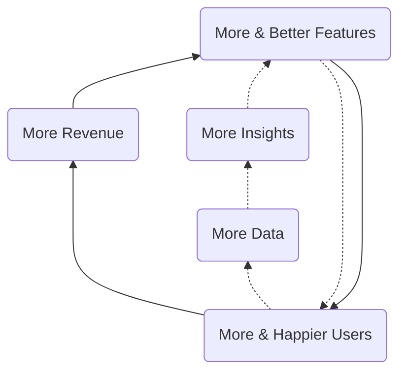

#### Corporate Intelligence

The Corporate Intelligence Flywheel is focused on improving (internal) Business Efficiency and this is accomplished by instrumenting, monitoring, and improving business workflows. Common outputs of Corporate Intelligence teams include performance dashboards, balanced scorecards, KPIs, MBOs, and related data-enabled frameworks.

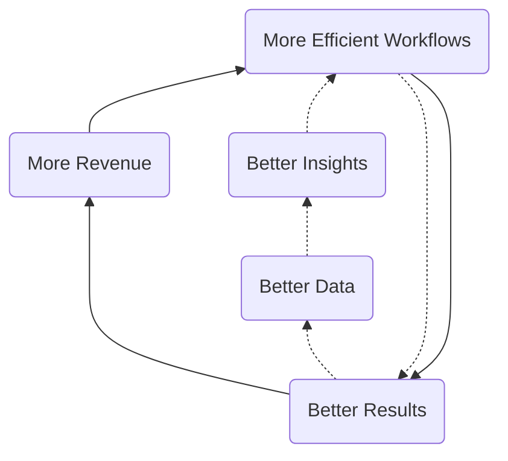

### Short-Term Direction

Measured in Quarters, our short-term direction is to help GitLab be a [public company](/handbook/being-a-public-company/) by reaching [Level 2 of the Data Capability Model](/handbook/business-technology/data-team/direction/#data-capability-model) with support for GitLab's [KPIs](/company/kpis/) and Self-Serve Data coverage of GitLab's two most important business processes: the _lead-to-cash_ cycle and the _product-release-to-adoption_ cycle.

In priority order, the elements of the EDP we are actively building include:

1. An [Enterprise Dimensional Model](/handbook/business-technology/data-team/platform/edw/) to serve as single-source-of-truth for reporting and analysis, including all of our Sisense dashboards and SQL analysis in Snowflake
1. A [Trusted Data Framework](/handbook/business-technology/data-team/platform/#tdf) to help ensure all of our Data Solutions are thoroughly tested, with automated ongoing validations
1. [Data Visualizations](/handbook/business-technology/data-team/platform/periscope/) to support performance analysis, including [KPIs](/company/kpis/).
1. A [Self-Service Data Program](/handbook/business-technology/data-team/direction/self-service/) to allow all GitLab teams to reliably access trusted data without requiring central Data Team involvement. Our three Self-Serve Data options are:
    1. **Dashboard Viewer** - GitLab team members login to the Sisense portal and access pre-built dashboards
       1. **Dashboard Developer** - GitLab team members certified in Sisense login to the Sisense portal and build their own Dashboards sourced from trusted data available in the Enterprise Dimensional Model
       1. **SQL Developer** - any GitLab team member certified in SQL Analysis writes their own SQL to query trusted data from the Enterprise Dimensional Model hosted in Snowflake

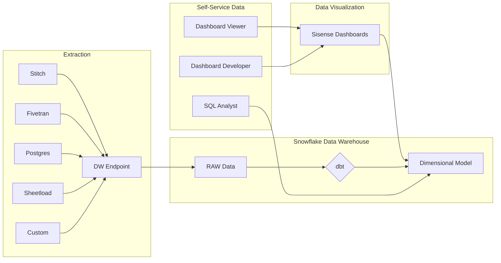

### Long-Term Direction

Measured in Years, our long-term direction is to extend the EDP with features found in a mature [Enterprise Data Platform](/handbook/business-technology/data-team/direction/#a-complete-enterprise-data-platform) such as master data management, a data lake, and advanced analytics. Also, once we have reached Level 2, we:

- want to find more ways to contribute to open-source data projects
- would like to work with [Meltano](https://meltano.com/) as a data pipeline and processing component
- want to integrate aspects of the EDP with GitLab.com to provide deep analytic capabilities to GitLab's customers
- provide DevOps Industry Benchmark Reports along the lines of [Okta's Business @ Work](https://www.okta.com/businesses-at-work/)
- revisit our overall data tech stack to ensure we have the required elements to reach Level 3

### Measuring Success

We will measure progress towards our short-term direction in the following ways:

1. [Data Team KPIs](/handbook/business-technology/data-team/direction/#data-team-kpis)
1. The business impact of our results as they align to the [Data Value Pyramid](/handbook/business-technology/data-team/direction/#data-value-pyramid)
1. The data features we provide as they map to the [Data Capability Model](/handbook/business-technology/data-team/direction/#data-capability-model)
1. The Data Team Quarterly Report Card

We have not yet defined criteria for measuring long-term progress.

#### Data Team KPIs

1. `All-Time` Number of Self-Service Data Customers Enabled
1. `Monthly` Number of active Self-Service Dashboard Developers
1. `Monthly` Number of active Self-Service SQL Developers
1. `Monthly` % of Dashboard Traffic From User Generated Content

## A Complete Enterprise Data Platform

The following table represents capabilities of a mature Enterprise Data Platform which can solve for the wide range of data and analytics needed by a large business. Not all capabilities listed are required to meet GitLab's short-term needs or known long-term needs. The decision to implement a given capability will be driven by a clear business need and the final result may differ significantly from the reference example.

|                                                                                                                               |                                                                                                    |                                                                                                     |
| ----------------------------------------------------------------------------------------------------------------------------- | -------------------------------------------------------------------------------------------------- | --------------------------------------------------------------------------------------------------- |
| [Data Architecture](https://en.wikipedia.org/wiki/Data_architecture)                                                          | [Data Security](https://en.wikipedia.org/wiki/Data_security)                                       | [Data Quality](https://en.wikipedia.org/wiki/Data_quality)                                          |
| [Descriptive](https://www.kdnuggets.com/2017/07/4-types-data-analytics.html)                                                  | [Diagnostic](https://www.kdnuggets.com/2017/07/4-types-data-analytics.html)                        | [Advanced Analytics](https://www.gartner.com/en/information-technology/glossary/advanced-analytics) |
| [Reporting](https://en.wikipedia.org/wiki/Report)                                                                             | [Dashboarding](https://www.microstrategy.com/us/resources/introductory-guides/business-dashboards) | [Self-Service](https://www.gartner.com/en/information-technology/glossary/self-service-analytics)               |
| [Operational Data Store](https://en.wikipedia.org/wiki/Operational_data_store)                                                | [Data Warehouse](https://en.wikipedia.org/wiki/Data_warehouse)                                     | [Data Lake](https://aws.amazon.com/big-data/datalakes-and-analytics/what-is-a-data-lake/)           |
| [Data Model Standards](https://en.wikipedia.org/wiki/Data_modeling)                                                           | [Enterprise Dimensional Model](https://en.wikipedia.org/wiki/Dimensional_modeling)                 | [Data Marts ](https://en.wikipedia.org/wiki/Data_mart)                                              |
| [Reference Data Management](https://en.wikipedia.org/wiki/Reference_data)                                                     | [Data Enrichment](https://www.redpointglobal.com/blog/what-is-data-enrichment)                     | [Master Data Management](https://en.wikipedia.org/wiki/Master_data)                                 |
| [Data Pipeline](https://www.alooma.com/blog/what-is-a-data-pipeline)                                                          | [Data Transformation](https://en.wikipedia.org/wiki/Data_transformation)                           | [Real-Time Data](https://en.wikipedia.org/wiki/Real-time_data)                                      |
| [Data Exports](https://www.qualtrics.com/support/survey-platform/data-and-analysis-module/data/download-data/export-formats/) | [Data Publishing](https://en.wikipedia.org/wiki/Open_data)                                         | [Data Products](https://hbr.org/2018/10/how-to-build-great-data-products)                           |
| [Data Taxonomy](https://www.nielsen.com/us/en/insights/resource/2019/why-you-need-a-data-taxonomy/)                           | [Data Catalog](https://www.alation.com/blog/what-is-a-data-catalog/)                               | [Data Portal](https://dataportals.org/)                                                             |

## Data Value Pyramid

We want to help all GitLab teams move up (or left-to-right in the diagram below) the [Data Value Pyramid](https://en.wikipedia.org/wiki/DIKW_pyramid) and turn basic metrics and counts into wisdom that helps them create better products for our customers, run our business more efficiently, and add new capabilities to our business model. Relative to the Data Value Pyramid, we are currently working primarily within the Data and Information stages.

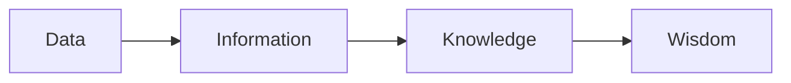

## Data Capability Model

The Data Capability Model is used to identify target state requirements to support [GitLab's Strategy](https://about.gitlab.com/company/strategy).

**To help GitLab become a public company, we need our lead-to-cash and public-facing metrics to reach Level 2 of the capability model.**

| Level                                                                                   | Characteristics                                                                                                                                                                        | Benefits                                                                                              |
| --------------------------------------------------------------------------------------- | -------------------------------------------------------------------------------------------------------------------------------------------------------------------------------------- | ----------------------------------------------------------------------------------------------------- |
| (5)Prescriptive                                                                         | Real-time complex analysis embedded in products, shape actions and perceptions; Data analytics is a strategic differentiator                                                           | New Data Products, Improved Decision ROI                                                              |
| (4)Predictive                                                                           | Data Science” Insight into what is likely to happen, Widespread and effortless analytics production, Enterprise Data Quality and Governance                                            | Reliable Customer Lifetime Value, Expansion & Churn Prediction, Product Embedded Analytics            |
| (3)Strategic                                                                            | Widespread & effortless drillable analysis, Drillable cross-functional scorecards, dashboards, Enterprise Data Warehouse                                                               | Customer 360 & Health Score, Predictable & Trusted Data Reporting, Robust Self-Service & Data @ Scale |
| (2)Advanced: [Reference Solution](/handbook/business-technology/data-team/direction/reference/) | Operational Automated Reports and Dashboards, Reliable and validated data with automated tests, Mixture of manual and automated integration, core integrated data with some Data silos | Trusted Data, Self-Service Data, Key Performance Indicators, Stable platform for expansion            |
| **(1)Reactive**                                                                         | Static lists and reports, Highly focused on history/lagging - last 30/90/365 days, Unpredictable velocity, minimal cross-functional analysis, Data Silos                               | Historical Tabular Reports, Data Visualization                                                        |
| (0)None                                                                                 | Inconsistent report generation, Results not widely trusted, No stable analytics infrastructure                                                                                         |                                                                                                       |

---
layout: handbook-page-toc
title: "Data Champion Program"
description: “Discover how GitLab uses a Data Champion Program in concert with the Data Team to promote data literacy and acumen”
---

## On this page
{:.no_toc .hidden-md .hidden-lg}

- TOC
{:toc .toc-list-icons .hidden-md .hidden-lg}

---

`This page contains forward-looking content and may not accurately reflect current-state or planned feature sets or capabilities.`

## Overview

The Data Champion Program is a modern solution to develop Data Acumen and Data Capabilities across an organization with existing team members. As opposed to relying on a central Data Team for all data needs, the Data Champion Program uses an inside-out and [train-the-trainer](https://www.toolshero.com/management/train-the-trainer/) approach to develop Data from within functional teams, leveraging expertise, content, and programs created by central Data Team experts.

The goals of the Data Champion Program include:

- Leveraging Data as a key company asset and helping everyone make their best decisions with data
- Creating a path for functional teams to become Data self-sufficient, including Self-Service Dashboard development and SQL Analysis
- Accelerating the adoption of data-driven techniques and approaches
- Improving Data Quality and Data Accountability
- Helping to grow an active Data community

## Approach

The Data Champion approach identifies one individual in each functional team to serve as (a) the Data DRI for their team and (b) as a [stable counterpart](/handbook/leadership/#stable-counterparts) to the Data Team. Data Team leadership and the Data Champion collaboratively develop a **Data Success Plan** to define vision, responsibilities, and objectives, taking into consideration the functional team's unique data needs, aptitudes, and existing data acumen. Among other things, the Plan establishes a training schedule covering GitLab Data Assets (reports, dashboards, data models), Self-Service Capabilities, and the Data Roadmap. To help develop Data Acumen within their team, the Data Champion has a responsibility to promote data practices through a local Data competency center.

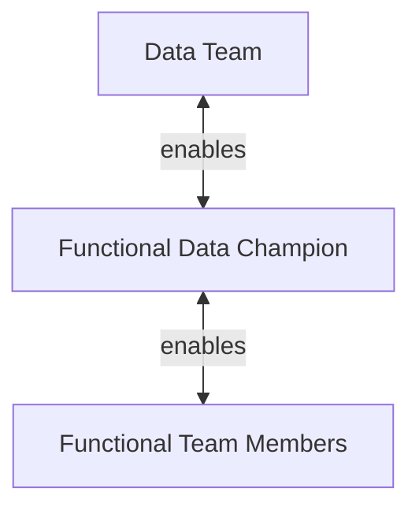

## Data Champion Responsibilities

1. Develop a Data Success Plan in coordination with the Data Team
1. Serve as Data DRI for their functional team, capturing all Data requests, including Data Quality problems
1. Prioritize and stack-rank Data Issues and Epics, ensuring the Data Issue Board remains up-to-date
1. Communicate priorities to the Data Team through the Issue Board
1. Develop a Data handbook page geared to their functional team audience, such as [Data For Product Managers](/handbook/business-technology/data-team/programs/data-for-product-managers/)
1. Regularly communicate and cascade data news and practices
1. Helps to improve Data Quality in source systems
1. Watch changes in source systems and help incorporate necessary updates in the Enterprise Data Warehouse

### Requirements

- Devote 1-2 hours per week to the program, flexing time as initiatives develop
- Commitment to developing personal and team Data competencies
- [Intermediate SQL](https://softwareengineering.stackexchange.com/questions/181651/are-these-sql-concepts-for-beginners-intermediate-or-advanced-developers) experience
- Data Visualization experience
- Data Modeling experience; [Zuora Example](https://knowledgecenter.zuora.com/CPQ/A_Zuora_CPQ/A2_Zuora4Salesforce_Object_Model), [Salesforce Example](https://developer.salesforce.com/docs/atlas.en-us.api.meta/api/sforce_api_erd_majors.htm)

## Program Target

| Area                                     | Current State                                                                      | Target State                                                                                                                                                                         |
| ---------------------------------------- | ---------------------------------------------------------------------------------- | ------------------------------------------------------------------------------------------------------------------------------------------------------------------------------------ |
| Data Prioritization for Functional Team  | Data Team                                                                          | Data Champion, supported with [Value Calculator](/handbook/business-technology/data-team/how-we-work/#data-team-value-calculator)                                                           |
| Data Issue Board for Functional Team     | Data Team                                                                          | Data Champion & Data Team maintain                                                                                                                                                   |
| Data DRI for Functional Team             | Does Not Exist                                                                     | Data Champion acts as Data DRI for their Functional Team                                                                                                                             |
| Data _for Functional Team_ Handbook      | No page exists                                                                     | Data Champion and Data Team maintain                                                                                                                                                 |
| Communicate Data News to Functional Team | No regular communication                                                           | Data Champion regularly attends Data Team meetings and passes relevant news to Functional Team                                                                                       |
| Sisense Training                         | Online Tutorials & periodic Live Training by Data Team                             | Data Champion customizes for Functional Team and provides required training                                                                                                          |
| Data Collection and Processing           | Data Team manages all Handbook documentation and helps to update dbt documentation | Data Champion stays up-to-date in source system quality and model changes and communicates necessary updates to Data Team for implementation, including helping to maintain handbook |
| Data Privacy and Protection              | Data, Legal, Security, and Compliance teams responsible for privacy review         | Data Champion helps Data, Legal, Security, and Compliance teams to understand data elements which may require privacy assessment and helps maintain appropriate documentation        |

---
layout: handbook-page-toc
title: "Data Program Level 2 Reference Solution"
---

## On this page
{:.no_toc}

- TOC
{:toc}

## Purpose

`This page contains forward-looking content and may not accurately reflect current-state or planned feature sets or capabilities.`

Public companies need to reliably and predictably share key financial, customer, and growth metrics as well as analyze lead-to-cash and product idea-to-adoption processes to continually improve business performance. These activities are supported by capabilities defined in **Level 2** of the [Data Capability Model](/handbook/business-technology/data-team/direction/index.html). To provide a realistic example and to serve as a reference for future development, this page presents the [Level 2 Data Solution](/handbook/business-technology/data-team/direction/#data-capability-model) for 'Product Geolocation Analysis'.

## Solution Overview - Product Geolocation Analysis

Understanding where your product is used around the world is an important step towards developing a more complete understanding of your customers, your product's global reach, and related location-aware insights.

This data solution delivers three [Self-Service Data](/handbook/business-technology/data-team/direction/self-service/) capabilities:

1. Dashboard Viewer - a new Sisense dashboard to visualize GitLab deployments by Country, Territory, Month, and Year (Self-Service Dashboard)
1. Dashboard Developer - a new Sisense data model containing the complete dimensional model components to build new dashboards and link existing dashboards to geolocation data
1. SQL Developer - a new Enterprise Dimensional Model subject area

From a Data Platform perspective, the solution delivers:

1. an extension to the Enterprise Dimensional Model for GeoLocation analysis
1. a new `dim_country` table
1. testing and data validation extensions to the Data Pipeline Health dashboard
1. ERDs, dbt models, and related platform components

Finally, this is the long-term automated solution for several ad-hoc issues completed over the past year, including:

- [Pull customer & user data by Country](https://gitlab.com/gitlab-data/analytics/-/issues/3614)
- [Country User Data](https://gitlab.com/gitlab-data/analytics/-/issues/4991)
- [Upload GeoLite2 Free Database with Sheetload](https://gitlab.com/gitlab-data/analytics/-/issues/3621)

### Knowledge Assessment & Certificates

The Self-Service Data Certificate program is based on the [Learning and Development Certification program](/handbook/people-group/learning-and-development/certifications/). The Self-Service Data program provides individual Certificates for each subject-oriented Dashboard Developer or SQL Developer Knowledge Assessment successfully completed. Links to the Knowledge Assessments are located in the appropriate sections below.

### Data Classification

[ORANGE](/handbook/engineering/security/data-classification-standard.html#orange)

- IP Address

### Solution Ownership

- Source System Owner: `@rparker2`
- Source System Subject Matter Expert: `@jeromezng`
- Data Team Subject Matter Expert: `@rparker2`

### Key Terms

- Territory - data can be visualized using [GitLab Sales Territories](/handbook/sales/territories/): AMER, APAC, EMEA
- Country - data can be visualized by [ISO Country](https://www.iso.org/iso-3166-country-codes.html)
- IP-to-Geolocation Mapping - mapping an [IP address to its geographic location](https://en.wikipedia.org/wiki/Geolocation) on a map

### Key Metrics, KPIs, and PIs

- number of Usage Pings By Country or Region By Month and Year
- number of GitLab.com Page Views By Country or Region By Month and Year
- KPIs - none defined
- PIs - none defined

## Self-Service Data Solution

### Self-Service Dashboard Viewer

| Dashboard                                 | Purpose                                                            |
| ----------------------------------------- | ------------------------------------------------------------------ |
| Worldwide Product Growth                  | Visualize the adoption of GitLab by country, region, and time.     |
| Data Health Dashboard for Geolocation Data | Data Health of the Geolocation data used to support this solution. |

### Self-Service Dashboard Developer

| Data Space | Description                                                                                                    |
| ---------- | -------------------------------------------------------------------------------------------------------------- |
| Global     | Contains a data model containing a 1-1 relationship with the Product Geolocation Analysis model detailed below |

#### Self-Service Dashboard Developer Certificate

To receive a Certificate, you will need to earn 100% on [the Self-Service Dashboard Developer Knowledge Assessment](https://docs.google.com/forms/d/e/1FAIpQLSeR4BI5RKj9X2fUYGlbtV-L6dUta3oNIWYaDY1X0gPcgzFMHA/viewform?usp=sf_link) and upload a screenshot of your new dashboard when prompted. Upon completion of the Knowledge Assessment, you will be emailed your responses and this email will serve as your Certificate.

### Self-Service SQL Analysis

#### Key Fields and Business Logic

- Data is sourced from usage-ping and snowplow.
- Usage-ping includes information about where the instance is HOSTED, not where the users of the host originate.
- Snowplow includes the best information we have available about where users are originating from.  Because some users deploy GitLab behind [VPNs](https://en.wikipedia.org/wiki/Virtual_private_network) or a similar proxy solution, the IP-to-Geolocation mapping from these sources may not be accurate. But it is still the best data source we have and represents our best source of truth.

#### Entity Relationship Diagrams

| Diagram/Entity                                                                                                     | Grain           | Purpose                                                                                                 | Keywords                                           |
| ------------------------------------------------------------------------------------------------------------------ | --------------- | ------------------------------------------------------------------------------------------------------- | -------------------------------------------------- |
| [Product Geolocation Analysis](https://app.lucidchart.com/documents/view/be5f5dc8-8ad5-4586-af53-93ff5e00f720/0_0) | Activity By Day | Dimensions and Facts that can be used to analyze GitLab usage  by country, territory, and time.         | dim_date, dim_country, fct_country_activity_by_day |
| dim_date                                                                                                           | Day             | Central dimension for all dates.                                                                        |                                                    |
| dim_country                                                                                                        | ISO_Country     | Central dimension for all countries and territories, sourced from ISO-3166 and GitLab Sales Territories |                                                    |

#### Reference SQL

All production SQL in Sisense or dbt must adhere to our [SQL Style Guide](/handbook/business-technology/data-team/platform/sql-style-guide/) for legibility and maintainability.

##### Page views by country by day for NORAM

```sql
SELECT
  f.date_key            AS date_key,
  dc.country_name       AS country_name,
  SUM(f.num_page_views) AS number_of_page_views
FROM fct_country_activity_by_day f
JOIN dim_country dc
  ON f.country_key = f.country_key
WHERE dc.reporting_region = 'NORAM'
```

##### Top 100 namespaces by country in 2020

```sql
SELECT
  dc.country_name       AS country_name,
  f.namespace_key       AS namespace_key,
  SUM(f.num_page_views) AS number_of_total_page_views
FROM fct_country_activity_by_day f
JOIN dim_country dc
  ON f.country_key = f.country_key
WHERE dd.year = 2020
GROUP BY dc.country_name, f.namespace_key
PARTITION BY dc.country_name LIMIT 100
```

#### Self-Service SQL Developer Certificate

To receive a Certificate, you will need to earn 100% on [the Self-Service SQL Developer Knowledge Assessment](https://docs.google.com/forms/d/e/1FAIpQLSc92q0yXvA31XmU-aoOPJl50zkQLrf4svSEkU4wbRQ2isMo8w/viewform?usp=sf_link) and upload a screenshot of your new SQL statement when prompted. Upon completion of the Knowledge Assessment, you will be emailed your responses and this email will serve as your Certificate.

## Data Platform Solution

The overall solution adheres to our [Enterprise Dimensional Model](/handbook/business-technology/data-team/platform/edw/) guidelines.

### Data Lineage

See [dbt documentation](https://www.getdbt.com/) for a complete lineage graph.

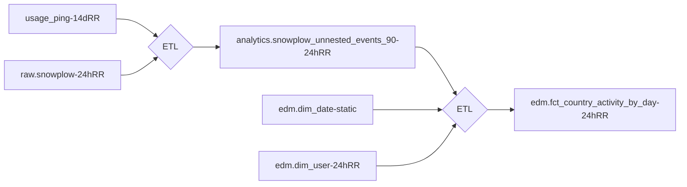

### DBT Solution

The [dbt solution](https://www.getdbt.com/) generates a dimensional model from RAW source data.

## Trusted Data Solution

### Enterprise Dimensional Model Validations

| Validation | Expected Result                                              |
| ---------- | ------------------------------------------------------------ |
| 1          | Total number of countries mapped does not exceed 300.        |
| 2          | Percentage of traffic from APAC is not greater than AMER.    |
| 3          | >40,000 # New fct_country_activity_by_day rows added by Day. |

### Source Data Pipeline validations

| Validation | Expected Result                                                           |
| ---------- | ------------------------------------------------------------------------- |
| 1          | New usage_ping data has been uploaded in last 14 days.                    |
| 2          | Total # of accounts represented by usage_ping data >= _expected result_. |
| 3          | Total # of accounts represented by snowplow data >= _expected result_.    |

---
layout: handbook-page-toc
title: "Self-Service Data"
---

## On this page
{:.no_toc .hidden-md .hidden-lg}

- TOC
{:toc .toc-list-icons .hidden-md .hidden-lg}

---

## Overview

`This page contains forward-looking content and may not accurately reflect current-state or planned feature sets or capabilities.`

[Data Democratization](https://www.alation.com/what-is-data-democratization/) is a common goal for Data Teams and can be difficult to achieve given the [variety, volume, velocity, and veracity](https://www.ibmbigdatahub.com/infographic/four-vs-big-data) of data to manage. Ultimately, all effective data democratization solutions must focus on the Data Customer and provide solutions that make data easy to find, easy to understand, and actionable:

- _easy to find_: Data Customers must be able to easily find data relevant to them
- _easy to understand_: Data must be labeled and organized in a consistent way using business-friendly terms and concepts
- _actionable_: Data must provide or help provide insights that support [decisions or action](http://www.onstartups.com/tabid/3339/bid/96738/Measuring-What-Matters-How-To-Pick-A-Good-Metric.aspx), towards delivering results

### GitLab Self-Service Data Program

The GitLab Self-Service Data program helps GitLab move faster with trusted data and helps the Data Team scale by providing four distinct, but complimentary capabilities:

- **[Data Catalog](/handbook/business-technology/data-team/direction/self-service/#data-catalog)** - the Data Catalog helps Data Customers find data definitions, dashboards, and models based on a subject area
- **[Dashboard Viewer](/handbook/business-technology/data-team/direction/self-service/#self-service-dashboard-viewer)** - all GitLab team members have _access_ to pre-build Dashboards through an always-on portal accessible from Okta
- **[Dashboard Developer](/handbook/business-technology/data-team/direction/self-service/#self-service-dashboard-developer)** - for GitLab team members who want to build their own data visualization charts or dashboards
- **[SQL Developer](/handbook/business-technology/data-team/direction/self-service/#self-service-sql-developer)** - for GitLab team members who are familiar with SQL and want to conduct their own SQL-based analysis

#### Summary of Self-Service Capabilities

|                                                                                          | [Dashboard Viewer](/handbook/business-technology/data-team/direction/self-service/#self-service-dashboard-viewer) | [Dashboard Developer](/handbook/business-technology/data-team/direction/self-service/#self-service-dashboard-developer) | [SQL Developer](/handbook/business-technology/data-team/direction/self-service/#self-service-sql-developer) |
| :--------------------------------------------------------------------------------------- | :--------------------------------------------------------------------------------------------------------: | :--------------------------------------------------------------------------------------------------------------: | :--------------------------------------------------------------------------------------------------: |
| Access Data Catalog                                                                      |                                                     Yes                                                    |                                                        Yes                                                       |                                                  Yes                                                 |
| Access Pre-Built Sisense Dashboards                                                      |                                                     Yes                                                    |                                                        Yes                                                       |                                                  Yes                                                 |
| Build New Sisense Dashboards                                                             |                                                     No                                                     |                                                        Yes                                                       |                                                  No                                                  |
| Write SQL to Explore Data                                                                |                                                     No                                                     |                                                        No                                                        |                                                  Yes                                                 |
| Requires [Certification](/handbook/people-group/learning-and-development/certifications/) |                                                     No                                                     |                                                        Yes                                                       |                                                  Yes                                                 |


### Data Catalog

The Data Catalog is published in the handbook and contains an index of data dashboards, models, and definitions organized by function. As part of the handbook, the Data Catalog helps drive alignment to common standards and single-source-of-truth data. As part of the Data Team handbook section, the Data Catalog is regularly updated with relevant content.

#### Data Catalog Structure

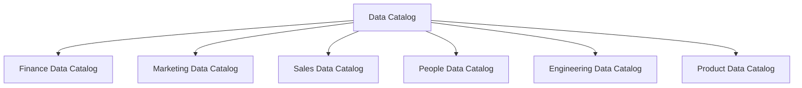

#### Data Catalog Handbook Page Contents

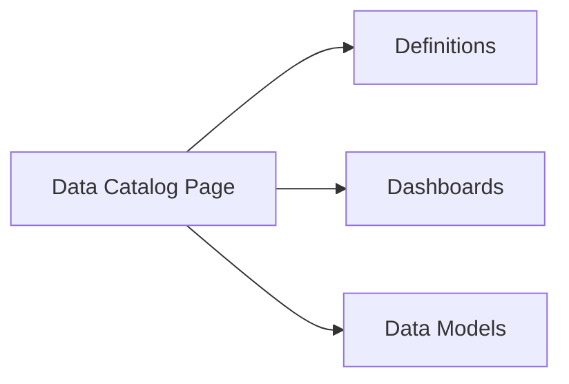

### Self-Service Dashboard Viewer

Self-Service Dashboard Viewer enables GitLab team members access to any pre-built dashboard published in Sisense.

Prerequisites:

- [ ] None

Access Requests:

- [ ] None Required - all GitLab team members are provided access during onboarding

### Self-Service Dashboard Developer

Self-Service Dashboard Developer provides Certified GitLab team members the ability to build their own dashboards using [Sisense Data Discovery](https://dtdocs.sisense.com/article/data-discovery) based on well-defined and validated [Kimball-standard](https://www.kimballgroup.com/data-warehouse-business-intelligence-resources/books/data-warehouse-dw-toolkit/) data models powered by the [Enterprise Dimensional Model](/handbook/business-technology/data-team/platform/edw/).

Prerequisites:

- [ ] Ability to read [data models](https://www.lucidchart.com/pages/er-diagrams)
- [ ] Prior experience developing reports and chart [data visualizations](https://datavizcatalogue.com/index.html)
- [ ] [Review Sisense Training](/handbook/business-technology/data-team/platform/periscope/)
- [ ] Pass a [Self-Service Dashboard Developer Knowledge Assessment](/handbook/people-group/learning-and-development/certifications/) from one of the Self-Service-ready Data Subject Areas published in the handbook

Access Requests:

- [ ] Open a [New Access Request](https://gitlab.com/gitlab-com/team-member-epics/access-requests/-/issues/new?issuable_template=New+Access+Request) and use the `Single Person Access Request`
- [ ] Include a link to the completed Knowledge Assessment
- [ ] Request Access to Snowflake

### Self-Service SQL Developer

Self-Service SQL Developer provides Certified GitLab team members a SQL prompt into the Snowflake Data Warehouse. Because not all of the data is currently modeled in a standard form, additional time may be required to perform research, read "RAW" data and unmodeled data, and learn from teams with more experience. As the Data Team builds the Enterprise Dimensional Model and delivers additional [Level 2 Solutions](/handbook/business-technology/data-team/direction/reference/) with SQL examples and data models, SQL Developer productivity will increase and SQL analysis will become easier and faster.

Prerequisites:

- [ ] [Intermediate SQL](https://softwareengineering.stackexchange.com/questions/181651/are-these-sql-concepts-for-beginners-intermediate-or-advanced-developers)
- [ ] Ability to navigate a [data dictionary](https://docs.snowflake.com/en/sql-reference/info-schema.html)
- [ ] Ability to read [data models](https://www.lucidchart.com/pages/er-diagrams) to write SQL
- [ ] Adhere to the [Data Team SQL Style Guide](/handbook/business-technology/data-team/platform/sql-style-guide/)
- [ ] Pass a [Self-Service SQL Developer Knowledge Assessment](/handbook/people-group/learning-and-development/certifications/) from one of the Self-Service-ready Data Subject Areas published in the handbook

Access Requests:

- [ ] Open a [New Access Request](https://gitlab.com/gitlab-com/team-member-epics/access-requests/-/issues/new?issuable_template=New+Access+Request) and use the `Single Person Access Request`
- [ ] Include a link to the completed Knowledge Assessment
- [ ] Request Access to Snowflake

---
layout: handbook-page-toc
title: "Data Team Documentation Guide"
description: "This documentation method is not currently used by the data team, but is still a good guide for how to think about the different types of documentation."
---

## On this page
{:.no_toc .hidden-md .hidden-lg}

- TOC
{:toc .toc-list-icons .hidden-md .hidden-lg}

{::options parse_block_html="true" /}

---

This documentation method is not currently used by the data team, but is still a good guide for how to think about the different types of documentation.

## Personas

There is a surfeit of information in the data team handbook. Not everything documented is meant for everyone who might read it. Even within the company we come from different backgrounds and are looking for different pieces of information.

To help readers orient themselves, we've created a series of 4 personas that we believe capture the majority of user types. These are as follows:

### Builder 🛠
{: #builder}

Key attributes of a Builder:

- You have strong SQL abilities for both querying and transforming data
- Have excellent data fluency
- Direct access to data (Snowflake Raw data)
- Strong domain knowledge
- Contributor / collaborator of documentation and analysis

Typical Roles:

- Data Engineer
- Core Data Analyst

### User 💻
{: #user}

Key attributes of a User:

- Low to mid-level SQL abilities for querying data
- Basic data fluency
- Direct access to data (Snowflake Raw data)
- Strong domain knowledge

Typical Roles:

- Distributed Analyst/Engineer
- Product Manager
- Engineering Manager

### Consumer 📊
{: #consumer}

Key attributes of a Consumer:

- Limited to No SQL ability
- Limited data fluency
- Strong domain knowledge
- Limited access to data (Sisense only)

Typical roles:

- People Manager
- Business Partner
- Non-data / technical individual contributor

### Champion 👑
{: #champion}

Key attributes of a Champion:

- Limited SQL ability and limited time
- Good domain knowledge but rely on direct reports for analytic insights
- Limited Access to data

Typical roles:

- Director/VP/CXO
- Investor

### Everyone 🌎
{: #everyone}

This is our catchall grouping in case something is relevant to all personas.

## Documentation Types

The [The Documentation System](https://documentation.divio.com/) details this more than we will here, but the general idea is that there are 4 types of documentation. Each of these are different and are written with different aims in mind. They are:

### Tutorials 🔍
{: #tutorials}

A tutorial:

- is learning-oriented
- allows the newcomer to get started
- is a lesson

Analogy: teaching a small child how to cook

### How-to guides 🏁
{: #howto}

A how-to guide:

- is goal-oriented
- shows how to solve a specific problem
- is a series of steps

Analogy: a recipe in a cookery book

### Explanation 💡
{: #explanation}

An explanation:

- is understanding-oriented
- explains
- provides background and context

Analogy: an article on culinary social history

### Reference 📚
{: #reference}

A reference guide:

- is information-oriented
- describes the machinery
- is accurate and complete

Analogy: a reference encyclopaedia article

## Usage

You'll notice there are emojis next to both the persona and documentation type headers. We use the emojis in the rest of the data team portion of the handbook to help readers quickly understand the audience and purpose of different sections. For example:

- 🛠🏁 Indicates this is a how-to guide probably for somebody on the data team. An example would be how to provision somebody in Snowflake
- 💻📚 Indicates this is a reference for our user persona. An example would be the tips and tricks section for working in Sisense
- 🌎💡 Indicates this is an explanation for all personas. An example would be the charter of the data team.

Note that the emojis will not be inclusive of everyone who may in fact be interested in the section. Our aim is only to provide a quick guide to help orient the reader for what they're reading.

## Contribution to the Data Team Handbook
Every team member on the Data Team is encouraged to contribute to the handbook. Everybody in the `@data-team` is a **[code owner](https://gitlab.com/gitlab-com/www-gitlab-com/-/blob/master/.gitlab/CODEOWNERS)** of our Data Team Handbook pages, but with duties:
1. All handbook changes are peer reviewed and not merged before a peer has provided their approval.
2. All MRs for handbook changes have an appropriate name which is important for tracking changes via the [Handbook Changelog](https://about.gitlab.com/handbook/CHANGELOG.html)). Please indicate that it's a Data Team handbook change.
3. Tag applicable team member(s) that the MR would directly impact and allow 24-48 hours for the team members to review. It is a good practice to have even the smallest changes to the handbook reviewed by at least one team member. 
4. Feel free to discuss/demo your handbook contribution during the Data Team demo meeting. 
---
layout: handbook-page-toc
title: 'GitLab Experimentation Best Practices'
description: "Experimentation allows us to learn and give the right experiences to our Customers, to create better value for Customers and GitLab."
---

## On this page
{:.no_toc .hidden-md .hidden-lg}

- TOC
{:toc .hidden-md .hidden-lg}

## Why Experimentation Best Practices?

Experimentation allows us to learn and give the right experiences to our Customers, to create better value for Customers and GitLab. Although experimentation seems straightforward, the risk of making inaccurate conclusions is too high, if an organization does not follow best practices.

For example, here are a couple of commonly made mis-steps while conducting experiments which can lead to inaccurate conclusions and decisions:

1. Peeking (article [here](https://gopractice.io/blog/peeking-problem/)): If we do not lock down the testing time period ahead of time, we end up with the peeking problem where we have side effects from checking the results and taking action before the A/B test is over. The more often you look at the intermediate results of the A/B testing with the readiness to make a decision, the higher the probability is that the criterion will show a statistically significant difference when there is none.
    1. 2 peeking cases double the p-value;
    2. 5 peeking sessions increase the p-value by a factor of 3.2;
2. Simpson’s Paradox: This can occur when we change the test group allocations in a disproportionate manner mid-test-flight. The latent segments in the test groups change their proportions when we change allocation percentages, inserting error into the results. More formally, [Simpson’s Paradox](https://plato.stanford.edu/entries/paradox-simpson/) is a statistical phenomenon where an association between two variables in a population emerges, disappears or reverses when the population is divided into subpopulations.  

To ensure we can maximize the value from our experimentation practices and reduce inaccuracy of decisions at GitLab, we recommend  following best practices across all experiments at GitLab. This document outlines the best practices to adopt at Gitlab. 


## Experimentation Planning

### Hypothesis: Define the upside

Before launching an experiment:

*   Define the business opportunity we are trying to improve
*   Explain how we are planning to enhance the business opportunity and why we want to take the particular approach. 
    *   If you have supporting data/analysis, document it. 
*   Document the control UI and flow and test wireframe/concept 


### Goals: Without goals, test measurement is meaningless

*   **Define the primary metric** that we want the experimentation to move. This is the metric we use to define the rollout scenario. 
    *   Ideally, this should be just one metric (2 metrics max) 
    *   Ideally, this should tie to a business KPI (e.g. greater ARR, paid user signups, etc)
    *   Define the expected change magnitude and the direction to calculate the sample size
    *   Decide one/two tail and duration of the test → based on sample size and based on direction/s we expect the KPI to change in
    *   Example: 
        *   Test concept: Reducing the number of steps in the new user sign up process
        *   The primary metric: Number of sign-ups and it would be ideal to tie to a profit driving KPI, such as # of paid users 
*   **Define the secondary metric(s)**: There are metrics that help us validate and understand in detail why and how the primary metric was impacted
    *   Secondary metrics help us cross-validate if the movement in the primary metric is real. 
    *   Since we use a high alpha of 5% or 10%, it is possible that impact to the primary metric was by chance, so the secondary metrics can help validate whether the change in the primary metric is real or not. As we improve the cadence of testing, this will become more important. 
        *   Example: 
            *   Test concept: Introduce a more prominent trial sign up button in the new user registration flow.
            *   Primary goal: **D90 conversion rate. **As more people sign up for trial in the new user flow, they can better understand the total value of our product and move our D90 conversion rate by 5%** **
            *   Possible Noise: If the primary metric did move by 5%, but if the number of new users signing up for trial didn't increase, then the increased D90 Conversion could be noise and needs further validation. 
*   **Define Guardrail metrics: This helps us ensure we are not harming the business in the long run for short-term gains. **
    *   These are metrics based that track the long term impact an experiment can have.
    *   Example: 
        *   When experimenting to increase trials during new user sign-up flow, we might want to set up D90 conversion or Trial to Paid conversion as a guard rail metric. 
        *   Another example is from a Social Media company where they define for a "notification disable rate" as a guard rail metric. They set a guard rail that says that every 1% lift in sessions/DAU from increased push notification, the "notification disable rate" increase should be within X%.
        *   Another Example: A SaaS company might set up a 12-month churn rate as a guard rail metric and revisit the analysis after 12 months. 


### Pre-analysis: do the calculations upfront

*   Validate the problem, opportunity, and approach using data (e.g. descriptive analysis)
    *   Example: There may not be significant value in testing email header copy change for a specific email type if the volume of this email is low. We will never achieve significance. In this case, consider pre/post or picking a higher traffic email type for testing. 
*   Calculate the sample size needed using one tail/two-tail, alpha (5%) , and power (80%). Determine experiment time period (how long to run the experiment) upfront. 
    *   Predetermine if you need to use a higher alpha for rollout decisions. 
*   Do a cost vs. benefit analysis of conducting the experiment. When the cost of experimentation is high in the organization and we have limited tech resources, we must be able to understand the potential upside from each test, so we are prioritizing the right ideas. 
    *   Calculate the potential yearly upside from this change as one of the company KPI. When that's not possible, define the upside to a KPI in terms of log value (like 0.01%, 0.01%, 0.1%, 1%, 10%, 100% impact), so we can make rough comparisons between different ideas. 
    *   Push for step function changes vs. incremental changes


### Experimentation set up plan:  How to setup the test

*   Determine the # of variants needed to help answer the business question we want to learn from the experiments (eg: A/B/n or MVT (multivariate) set up)  
*   Document the analysis plan including what hypothesis question can and can’t be answered. 
*   Define instrumentation needed (the additional tracking data you need on top of what's already available). 
    *   Specify tracking needs as critical or nice to have so developers can discuss and implement the new tracking based on effort and performance impact. 
*   Define the population you are testing on, including segmentation or exclusion criteria 
*   Document when you want to run the experiment in **the experiment calendar** and checks for conflicts  
*   Define the launch weights and ramp-up plan if experimenting in a critical path or impacts a large user base
    *   When ramping for high-risk test in a critical area, go from 1% to 5%/10% and then 50%
        *   Beware of the Simpson’s paradox and only analyze test periods where the weight allocation is proportional and comparable.
    *   Specify the success criteria for ramping
        *   Example: No significant impact to Primary metric, and we could detect a change as small as 5% (i.e. sensitivity) 

<span style="text-decoration:underline;">General Guidance for Test Group Sample Allocation Based on Risk and Critical Path</span>


<table>
  <tr>
   <td rowspan="2" colspan="2" >Experiment launch weights matrix on failure risk, and importance of feature and impacted population
   </td>
   <td colspan="3" >Critical path page or critical product feature
   </td>
  </tr>
  <tr>
   <td>L
   </td>
   <td>M
   </td>
   <td>H
   </td>
  </tr>
  <tr>
   <td rowspan="3" >Potential code risk for failure
   </td>
   <td>L
   </td>
   <td><p style="text-align: right">
50%</p>

   </td>
   <td><p style="text-align: right">
10%</p>

   </td>
   <td><p style="text-align: right">
5%</p>

   </td>
  </tr>
  <tr>
   <td>M
   </td>
   <td><p style="text-align: right">
10%</p>

   </td>
   <td><p style="text-align: right">
10%</p>

   </td>
   <td><p style="text-align: right">
5%</p>

   </td>
  </tr>
  <tr>
   <td>H
   </td>
   <td><p style="text-align: right">
10%</p>

   </td>
   <td><p style="text-align: right">
5%</p>

   </td>
   <td><p style="text-align: right">
1%</p>

   </td>
  </tr>
</table>


## Experiment Verification: 


### Experiment Validation Pre-Launch: Check that everything is in place 

*   After the functionality is built by Dev and data eng team, verify if the reporting data and UI works as intended in Dev or Pre production environment 
    *   Recommendation is to have any two out of Dev, QA and Analyst verify tracking and reporting
    *   Recommendation is to have any two of PM, QA and Analyst verify UI functionality
*   Paste the control and test experience screenshot in experiment documentation for future reference 


### Experiment Validation Post-Launch: Check that the results are flowing in as expected 

*   1 or 2 days after Go live, verify reporting data for the experiment is valid 
    *   Check for any skew in population assignment 
*   If you launched at 1% weight, take an initial read after 2 or 3 days and set to 5% or 10% weights as per the previously agreed plan.
    *   The 1% experiment’s goal is only to ensure “things don’t break” and not to get a read on the results.
*   If you launched at 5% or 10%, change the weights to 50% as per your initial plan
    *   Beware that the customer base could be different on weekdays/weekends, so analyze results in full week increments in case of weekly seasonality and in ful month increments in case of monthly seasonality
    *   The above will not apply for the 1% since the 1% test is not intended to get a read impact created by the experimental experience.


## Experimentation Analysis and Communication:

*   Ensure there is no bias in the assignment or experiment data
    *   When possible, automate these validations like assignment population bias
*   Analyze the test results using statistical significance
    *   Leverage the secondary metrics to validate and better understand how and why the test won. 
    *   Analyze results by key dimensions to understand the rollout scenario and find any significant performance difference by population cohort. 
        *   Beware of increased statistical noise when making multiple comparisons. So form the hypothesis before analysis for dimension level split or use adjusted P-value. 
*   Analyze the interaction results with any pre-identified interacting experiments that were live simultaneously as this test. 
*   Communicate results with statistical confidence: 
    *   When there is a significant impact, communicate the results with a confidence interval (@80%)
    *   When there is no significant impact, communicate the results with sensitivity, so the general audience can understand at what observed change %, can we have concluded results as statistically significant. 
*   Document results in handbook and detailed description of the test, ramp summary, key results, snapshot of metrics, Insights, and Next steps. 
*   Present the results to partners (Tech and Business) and analytical peers to gather additional insights and educate others on the learning. Document any follow-up analysis and insights. 
*   For PM: Ensure the experiment is rolled out or retired from code as per final result conclusions. 


## Institutionalize Insights from Experimentation:   

*   Along with business partners, present the detailed results in a broader org group to spur conversations on how others can benefit from learning and what actions other teams can take/collaborate to maximize value. 
*   Ensure all results are documented and searchable by function or product tag to ensure we don't repeat the same failed ideas. This enables us to do meta-analysis from multiple experiments to gather broader insights. 
    *   Ex: In a comparable company, we leveraged data from 2 dozen past examples to understand the relationship between increased notification type and notification disablement. 
    *   Ex. In a comparable company, using metadata from ~50 past results, we understood the session lift by increasing the volume of different email types. 
    *   Ex: In a comparable company, we leveraged ~8 past analyses to understand the incremental value of additional cross merchandising spots. 
    *   Growth team already documents [experiments results](https://about.gitlab.com/direction/growth/#growth-experiments-knowledge-base) in a centralized handbook page. We should adopt this practice across Gitlab in a centralized page. 


## Experimentation Governance:

*   Automated alert system: 
    *   Enable an automated alert system to monitor significant negative impact to primary metrics from experiments. This helps to avoid the need for results peeking. 
        *   We use P &lt;= 0.01 or P &lt;= 0.5 for two continuous days
    *   Enable automated alert if an experiment has consistently significant positive results for continuous x days (we used 3 days to reduce random wins) 
*   Review long-running experiments periodically to avoid performance impact on the product. 
*   Document any Experiment failures due to set up, tracking/data failure, wrong implementation, or conflicts/ experiment interactions. This enables us to monitor the health of the experiment platform. 
*   Create an experiment calendar, to enable conflict management and understand volume and velocity of experiments. 


## Opportunity Action Items for Consideration:

Note: Short term - means hours/days worth of effort. Long term means weeks/months worth of effort

Based on initial feedback and observations on current experiment platform capabilities, these are a list of action items I recommend we consider. It still needs to be consulted with impacted parties to ensure the gaps still exist and their priority. 

*   **Standardize sample size requirement with power calculations: (Priority H)**
    *   Short term: Define a standard sample size calculator using an alpha of (5% or 10%), one/two tail, and power of 80%
*   **Ensure result dashboard incorporate significance and confidence level (Priority H)**
    *   Short term: Incorporate significance calculation and confidence interval directly into Sisense Experiment analysis framework using Z test formulas or Python functions. 
*   **Ability to split test results by dimensions with adjusted P-value threshold: (Priority M)**
    *   Long-term: Explore alternative tools or data tracking to enable unrestricted metric/funnel/dimension evaluation for Experiments and split analysis by dimensions and filters.  
*   **Solve for Sample size problems (Priority H)**
    *   Short term: Ensure we define experiment sample size analysis using one-tail or two-tail to better accommodate for smaller sample sizes in experiments. 
    *   Short term: Leverage secondary metrics to build confidence in directional read on primary metrics.
    *   Short term: Use guard rail metric for long-term impact measurement by pausing the experiment after collecting enough samples and later measuring the impact on guard rail metric. 
    *   Long-term: Leverage Bayesian experiment analysis framework to communicate uncertainty in data for small sample size problems. 
*   **Automated bias validation of test results: (Priority M)**
    *   Short term: Explore how to automatically flag when experiments have weights or population bias in results
    *   Long term: Implement automated bias alerts when analyzing results. 
*   **Automated alerts for winning and Losing experiments:  (Priority L)**
    *   Short term: Explore how to create automated alerts for losing or consistently winning experiments based on P value and days the results remain significant. 
*   **Analyze randomization within and across experiments for any bias:  (Priority M)**
    *   Short term: Explore if we need to validate randomization bias within and across experiment allocation based on limitations with existing systems and analyze. 
    *   Long-term: Build automated systems to monitor bias continuously within and across experiments. 
*   **Experiment calendar: (Priority M)**
    *   Short term: Understand the current Experiment calendar and explore automated ways to validate accuracy of testing calendar by comparing against actual experiment assignment data. 
    *   Long term: We have a single system to record all the experiments running across the organization and the duration of experiments. Enable automated validation against actual test assignment data. 


## Tools Created for Analytics Use:

*   [Sample size calculator using power and varying confidence level](https://docs.google.com/spreadsheets/d/1KP_rDB3e6pJuOJwA59HcAUVpWUuzoPveaJiTH_PSviM/edit?usp=sharing)
*   [WIP: Built-in significance testing in Sisense experimentation dashboard (Proof of Concept)](https://app.periscopedata.com/app/gitlab/881004/WIP-Charan-sample-dashboard)


## References:

*   [Growth Experiments page:](https://about.gitlab.com/direction/growth/#growth-experiments-knowledge-base)<span style="text-decoration:underline;"> </span>Growth is already documenting experiment results in a centralized page.  
*   [Growth experiment dashboard](https://app.periscopedata.com/app/gitlab/860363/Experiment-Data-Validation) (By Dave) helps the team to quickly validate experiment data accuracy post launch. 
*   [7 Step A/B testing process](https://blog.optimizely.com/2016/08/10/7-step-ab-testing-process/) Need to invest time on planning, Design and QA
*   [A/B testing for a low traffic website  ](https://blog.optimizely.com/2016/05/17/ab-testing-for-low-traffic-websites/)
*   [Importance of test planning](https://optinmonster.com/ab-testing-best-practices/)


### <span style="text-decoration:underline;">Terminology:</span>

*   **Default Experience:** The experience a participant receives when not allocated to an experiment. This is the same as control experience in most cases. 
*   **Experiment calendar:**  A system to show the past, current and upcoming experiments along with population being tested, weights and Experiment duration. This could enable us to plan for conflits or analyze interactions between interacting experiments. 
*   **Sensitivity:** For the given population and it’s metric, what is the minimum change at we could have detected a significant threshold. 

---
layout: handbook-page-toc
title: "Data Team Calendar - Meetings"
description: "GitLab Data Team Calendar"
---

## On this page
{:.no_toc .hidden-md .hidden-lg}

- TOC
{:toc .toc-list-icons .hidden-md .hidden-lg}

{::options parse_block_html="true" /}

---

## Meetings

The [Data Team's Google Calendar](https://calendar.google.com/calendar?cid=Z2l0bGFiLmNvbV9kN2RsNDU3ZnJyOHA1OHBuM2s2M2VidW84b0Bncm91cC5jYWxlbmRhci5nb29nbGUuY29t) is the SSOT for team meetings.
It also includes relevant events in the data space.
Anyone can add events to it.
Many of the events on this calendar, including Monthly Key Reviews, do not require attendance and are FYI events.
When creating an event for the entire Data Team, it might be helpful to check their working hours in Google Calendar and discuss out of working hour meetings ahead of scheduling. Please consider alternating who is meeting after working hours when such meetings are necessary.

### No-Meetings Fridays

While we can't promise we'll never have meetings on Fridays, the team has adopted _[No Meetings Fridays](/handbook/communication/#no-meetings-fridays)_.

### Bias For The Maker's Schedule

Most Data Team members identify more strongly with the [Maker's Schedule over the Manager's Schedule](http://www.paulgraham.com/makersschedule.html) and we support this by:

- limiting individual contributor meeting exposure to no more than 20% of their time
- grouping our meetings into contiguous chunks instead of sprinkling them throughout the day or week
- holding most of our required recurring meetings on Tuesdays and Thursdays

### Meeting Protocol

The team follows _[GitLab meeting practices and standards](https://about.gitlab.com/company/culture/all-remote/meetings/)_.

- Every meeting has an agenda.
- Meeting topics are listed in priority order.
- Notes are added to the agenda inline with topics and questions.
- All agendas are stored in the _Data Team Meetings_ [shared drive](https://drive.google.com/drive/folders/1qXrwhZZWnFTl4GSQwv3H4hwCFD-V7LE9).

### Recurring Meetings

**Daily Standup**

Members of the data team use Geekbot for daily standups.
These standup notes are posted in [#data-daily](https://gitlab.slack.com/archives/CGG0VRJJ0/p1553619142000700).
When Geekbot asks, "What are you planning on working on today? Any blockers?" try answering with specific details, so that teammates can proactively unblock you.
Instead of "working on Salesforce stuff", consider "Adding Opportunity Owners for the `sfdc_opportunity_xf` model."
There is no pressure to respond to Geekbot as soon as it messages you.
Give responses to Geekbot that truly communicate to your team what you're working on that day, so that your team can help you understand if some priority has shifted or there is additional context you may need.

**Tuesday Planning and Results Meetings**

Every Tuesday from 1400-1700 UTC we focus on results delivery within the business-focused Fusion Teams and Platform Enhancements Team.
Data Team Leadership are expected to regularly attend most sessions and review all meeting agendas.
Because we work in [2-week milestone intervals](/handbook/business-ops/data-team/how-we-work/#milestone-planning), the focus of these _Tuesday_ meetings will change from week-to-week.

| Time (CET/UTC/ET/PT) | Meeting                                                                                                                                |
| :------------------- | :------------------------------------------------------------------------------------------------------------------------------------- |
| 1600/1400/1000/700   | [GTM Fusion Team Meeting](https://docs.google.com/document/d/1VaRo9qJvmG6YAR1pSAoetCqop2c807K6fjL2S9pIxGg/edit?usp=sharing)   |
| 1700/1500/1100/800   | [Product Fusion Team Meeting](https://docs.google.com/document/d/1cANv4hvrIt2V66yRJztzb_2tuDYOx1ashEzD2G69NbE/edit)        |
| 1800/1600/1200/900   | [Data Engineering Team Meeting](https://docs.google.com/document/d/1J6yPgnEpr2VXz2LFXNNA4w39UBaibtBrx8qE69H_xQY/edit) |

**DEMO Meetings**

Every Thursday we spend time focusing on our data stack and demonstrating solutions under development.

- Demo Meetings: Demonstrating working software and related content is a great way to align on the solution, build awareness, and increase knowledge. Demos can include SQL examples, handbook pages, dbt flows, ERDs, Dashboards, and any other relevant content. Screen sharing and walk-throughs are encouraged. Business stakeholders will be invited to demos when appropriate.

| Time (CET/UTC/ET/PT) | Meeting                                                                                                               |
| :------------------- | :-------------------------------------------------------------------------------------------------------------------- |
| 1700/1500/1100/800  | [Data Team Demos](https://docs.google.com/document/d/1XBAj5x0WziLpqTyGRRu3CsMTDyYx5vDYuBOqqjONbSQ/edit?usp=sharing)   |

**Monthly Meetings**

| Time (CET/UTC/ET/PT) | Day           | Meeting                                                                                                                       |
| :------------------- | :------------ | :---------------------------------------------------------------------------------------------------------------------------- |
| Varies | First Full Week | [All-Hands & Retrospective](https://docs.google.com/document/d/1tAx1K6wt2ufZglzBdJsiIAuYD4B0pKZK9ABckwHD6u8/edit?usp=sharing) |
| Varies | Last Friday | [Handbook Jamboree](https://gitlab.com/groups/gitlab-data/-/epics/248) |
| Varies | Varies | Monthly Pizza Party |

---
layout: handbook-page-toc
title: "Merge Request Roles and Responsibilities"
description: "GitLab Data Team MR responsibilities"
---

## On this page
{:.no_toc .hidden-md .hidden-lg}

- TOC
{:toc .toc-list-icons .hidden-md .hidden-lg}

{::options parse_block_html="true" /}

---

## <i class="fas fa-users fa-fw color-orange font-awesome" aria-hidden="true"></i>Merge Request Roles and Responsibilities

### Reviewer

All GitLab data team members can, and are encouraged to, perform code review on merge requests of colleagues and community contributors.
If you want to review merge requests, you can wait until someone assigns you one, but you are also more than welcome to browse the list of open merge requests and leave any feedback or questions you may have.

Note that while all team members can review all merge requests, the ability to _accept_ merge requests is restricted to maintainers.

The responsibility of a Reviewer is

- to review the technical implementation
- to ensure the code achieves the business goals
- to check the data quality of the data models created

#### Codeowner

Code ownership is a [feature of GitLab](https://gitlab.com/help/user/project/code_owners) that links a project member to specific folders and files in a project. It is meant to answer the questions "who can I ask about this code?" and "who should review changes to this code?".

Becoming a code owner is part of the journey to becoming a project maintainer. If you are the sole creator of a file, say a new dbt model set, you will be the de facto code owner for those files. If you wish to expand your ownership purview, follow these steps:

1. Create an MR to the [CODEOWNERS file](https://gitlab.com/gitlab-data/analytics/blob/master/CODEOWNERS) with the ownership change you wish to make
1. Work with the other code owners that already cover the area you wish to join to pair with them on at least 5 MRs that alter the code you wish to be responsible for
    - The MRs should not reflect only small changes to the code base, but also architectural ones and ones that create a fully functioning addition. It may take more than 5 MRs for this criteria to be reached
    - You will be the primary reviewer for all MR's assigned to the code owner
    - You will review the MR's as if you had the power to merge
    - Once you feel the MR is ready and you would have merged it, assign it to the code owner and comment that you would have merged the MR
    - The code owner will do a follow up review if necessary and either merge the MR or assign it to a maintainer for you
    - Document the MR in the original MR you created
1. Once the 5 MR threshold has been reached, the code owner will work with the applicant's manager to make a decision
1. If denied, close the MR and work with your manager for a period of no less than 3 months before applying again
1. If approved, assign the MR to a maintainer to merge. You will automatically be added to the Code Owner approval list once merged

### Maintainer

A maintainer in any of the data team projects is not synonymous with any job title.
Here, the data team takes from the precedent set forward by the engineering division on [the responsibilities of a maintainer](/handbook/engineering/workflow/code-review/#maintainer).
Every data team project has at least one maintainer, but most have multiple, and some projects (like Analytics) have separate maintainers for dbt and orchestration.

The responsibility of a Maintainer is to ensure that

- Data team processes are followed
- Final review on the MR

#### How to become a data team maintainer

We have guidelines for maintainership, but no concrete rules.
Maintainers should have an advanced understanding of the GitLab Data projects codebases.
Prior to applying for maintainership of a project, a person should gain a good feel for the codebase, expertise in one or more domains, and deep understanding of our coding standards. You're probably ready to become a maintainer when both of these statements feel true:

1. The MRs you've reviewed consistently make it through maintainer review without significant additionally required changes
1. The MRs you've created consistently make it through reviewer and maintainer review without significant required changes

If those subjective requirements are satisfied, this is the process to add yourself as a maintainer:

1. Create an issue in the relevant project with the title "Add <user> as project maintainer"
1. Add documentation to the issue for the following:
    - Explain why you are ready to take on the maintainer responsibility
    - Explain the scope of your maintainership (entire project, dbt, python, etc.)
    - Recent MR's that you have created and reviewed that you believe show your readiness
1. Once the issue is created, tag a maintainer who you'd like to be paired with for a formal review
1. The maintainer will have you pair with them on at least 10 merge requests
    - The MRs should show a diversity of scope, including architectural changes as well as complete, fully functioning feature releases with changes across many files and directories.
    - You will be the primary reviewer for these 10 MRs
    - You will review the MR's as if you had the power to merge
    - Once you feel the MR is ready and you would have merged it, assign it to the maintainer and comment that you would have merged the MR
    - The maintainer will do a follow up review if necessary and merge the MR for you
    - Document the MR in the issue you created
1. Once the 10 MR threshold has been reached, the maintainer will work with the applicant's manager to make a decision
1. If denied, close the issue and work with your manager for a period of no less than 3 months before applying again
1. If approved, create a MR to add the maintainership to your team page entry
1. Assign the MR to your manager and mention the existing maintainers of the relevant project (Infrastructure, Analytics, etc) and area (dbt, Airflow, etc.).
1. If the existing maintainers of the relevant group e.g., dbt, do not have significant objections, and if at least half of them agree that the reviewer is indeed ready, we've got ourselves a new maintainer!
1. An owner of the project will increase your privilege on the project

### Merge Request Workflow

The Data team operates as one team between the Data Analytics team and the Data Engineering team. Therefore, we expect for each MR that there are at least three people involved. See the below scenarios:

1. DA authors, DA reviews, DE Maintainer merges
1. DE authors, DA reviews, Maintainer merges
1. DE authors, DE reviews, Maintainer merges

Since the Data Engineering team is responsible for the Data platform, every MR request should include a Data Engineer.
 
 ---
layout: handbook-page-toc
title: "New Data Source"
description: "How to add a new data source"
---
 
## On this page
{:.no_toc .hidden-md .hidden-lg}
 
- TOC
{:toc .toc-list-icons .hidden-md .hidden-lg}
 
{::options parse_block_html="true" /}
 
---
 
This page describes in detail the process of adding new data sources to the data warehouse. The Data Team embraces any initiative of adding new data sources towards the data warehouse. We envision that data could lead towards value, but adding new data towards the data warehouse does not go with no costs.
 
Both the development (assigning resources from the Data Team, from other teams involved to support and also you as requestor) and keeping the data pipeline up and running (storage, compute resources, incident management, monitoring etc..) cost time and or money.
 
**Please, before request adding a new data source, take the following into account:**
- Is there a valid [business case](/handbook/business-technology/data-team/how-we-work/#data-team-value-calculator)?
   - Sometimes the business case is to comply with regulatory requirements.
   - Sometimes the business case is straightforward because value potential is clear above the investment costs.
   - Most of the time it’s hard to quantify, because either the value is unsure or the costs are unsure. Feel free to have an open and honest discussion with the Data Team. We have the experience and could help with the justification and this does not necessarily need to be a scientific calculation.
- The work is not done when data lands in the data warehouse. The data will 'just' land in the `raw` data layer, and this is not accessible by default for Sisense. Data need to be loaded downstream into the [Enterprise Dimensional Model](/handbook/business-technology/data-team/platform/edw/) (EDM) via dbt. Follow up needs to take place, and will come on top of the process described on this page.
   - Downstream modelling could be handled by the business team, because we embrace contribution on our data platform. Please note that extensive ([dbt-](/handbook/business-technology/data-team/platform/dbt-guide/), SQL- and data modelling knowledge is needed)
   - Downstream modelling could be handled by the Data Team. Planning needs to take place and priorities are set in line with company priorities. **This falls not within the scope of adding a new data source to the data warehouse**, thus this needs to be arranged subsequently. 
- Adding a new data source to the data warehouse is not an 1 off exercise. As soon as the data is extracted to the data warehouse, on a regular cadence (once week, once a day, multiple times per day, etc..) data will be refreshed. This means something can happen or can go wrong after the implementation. We will need a DRI from the source side (business and technical) to support this process when needed.
- Data could be used, outside of the EDM. I.e. by a Function Analyst, in the `raw` data layer. Raise an AR to get access to the raw data.
- When data ends up in the EDM, work is to be performed in Sisense by creating a dashboard. Also for doing this, some technical knowledge is required. 
- The data platform needs to get [access](/handbook/business-technology/data-team/platform/#data-team-access-to-data-sources) to the source system. Although this sounds obvious, this is not always straightforward.
 
## New data source
 
For adding a new data source, the workflow looks as follow (note, this is the [existing workflow](/handbook/business-technology/data-team/how-we-work/#workflow-summary) we use for all our work and made explicit here in the context of adding a new data source).
 
Process for adding a new data source:
 
| Stage (Label)               | Summery for new data source|
| --------------------------- | ------------------ |
| `workflow::1 - triage`      | All initial information will be provided by the requester and assessed by the Data Team |
| `workflow::2 - validation`  | A solution design and complete work breakdown for upcoming development will be created |
| `workflow::3 - scheduling`  | Once a quarter the Data Team OKRs are defined. Based on workload and priorities, new data sources could be incorporated in the next quarter OKRs |
| `workflow::4 - scheduled`   | Adding a new data source is on the list of next quarter OKRs. An epic will be created with all the work breakdown activities attached |
| `workflow::5 - development` | Development is in progres |
| `workflow::6 - review`      | Development is under review |
| `workflow::X - blocked`     | Development is blocked |

### workflow::1 - triage
Every new data source requests starts with an issue. This applies for data source that are already extracted, but needs to be extended and for completely new data sources. Please use the `New Data Source` [template](https://gitlab.com/gitlab-data/analytics/-/blob/master/.gitlab/issue_templates/New%20Data%20Source.md). All initial information will be provided by the requestor and assessed by the Data Team. Cross check will be performed if the data doesn't already exist in the data warehouse.
 
### workflow::2 - validation
All details regarding the new data source will be flashed out, with the goal of creating a full work breakdown.
 
#### Data scope
Based on the requirements, the data points that need to be extracted (i.e. which tables) will be determined. A total data scope must be given.
 
#### Extraction solution
The Data Team has different instruments available to extract data out of source systems (randomly ordered):
 
- Custom made (via Python)
- Fivetran
- Meltano
- Snowflake data share
- Stitch
 
The decision for which instrument to use, is **always** based on the combination of:
1. Implementation effort.
2. Maintenance effort.
3. Ability to extend and adjust.
 
Its the Data Team that determines which instrument is used. The following decision diagram is used to determine the right extraction solution:

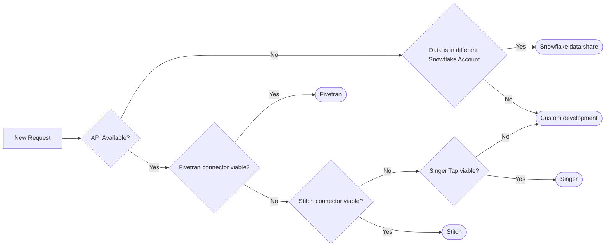

Custom development is a solution designed and developed by the GitLab Data Team. Examples of this are the current PGP and the Zuora Rev Pro extraction.   

#### Access request
Although it could be helpful to already provide the Data Team access to the source system, its not mandatory to raise an Access Request right now.

#### Work breakdown
End goal of the validation is to have a solution design and a complete work breakdown, with DRI's and size estimation attached. All the work that needs to be performed is stated down. We aim to have it on a level, where every work action could be converted to an issue with no larger T-Shirt size than `M` / `5/8` issue poins.
 
#### MNPI Data
It needs to be determined if there is MNPI data in the data sources and if this data is about to be extracted towards the Data Warehouse. If the data source contains MNPI and this data is extracted, change the issue label of the issue to `new data source MNPI`.

### workflow::3 - scheduling
Based on the business case, effort to implement, workload in the Data Team and Data Team priorities, the implementation will be scheduled. For scheduling we follow the GitLab Data Team Planning [Drumbeat](/handbook/business-technology/data-team/how-we-work/planning). This means that for every quarter, the Data Team determines when a new data source request will be picked up. When a new data source request remains in `scheduling`, it does not mean that it isn't on the radar of the Data Team. It means that it isn't been scheduled yet, because:
1. Defining the OKRs for the upcoming quarter didn't take place. Once a quarter the Data Team sets the OKRs for the next quarter.
2. It didn't fit in the OKRs for next quarter because of business case, effort to implement, workload in the Data Team and Data Team priorities.

### workflow::4 - scheduled
When a request for implementing a new data source is in scope for next quarter OKRs, the request is `scheduled`. An epic will be created with the issue attached to it. Based on the work breakdown all issues are created with the corresponding issue weight, label assigned `workflow::4 - scheduled`, the right milestone (if known) and attached to the epic.
 
### workflow::5 - development
When the execution of the work starts, the issue is in development and follows the regular development life cycle.

During the development, the Data Engineer aligns with all the stakeholders, about access to the data. Data access can be provided to the `raw` schema, depending on the data and the use case.

### workflow::6 - review
When the execution of the work is finished, the issue is in review and follows the regular development life cycle.
 
### workflow::X - blocked
When the execution could not continue due to the need of external intervention, the issue is `blocked`. There must be a clear problem statement given and the right people need to be assigned on the shortest notice possible.

---
layout: handbook-page-toc
title: "Data Team - Planning Drumbeat"
description: "GitLab Data Team OKR and Milestone planning process"
---

## On this page

{:.no_toc .hidden-md .hidden-lg}

- TOC
{:toc .toc-list-icons .hidden-md .hidden-lg}

{::options parse_block_html="true" /}

---

## Data Team Planning Drumbeat

The Data Team Planning Drumbeat is a pre-set sequence that happens every quarter. The Planning Drumbeat follows GitLab's financial year/quarter structure. The Data Team Planning looks as follows:

 <br>
[link to orginal](https://docs.google.com/spreadsheets/d/1hdJqCfDPR-LqTTRBy4JEQ-MbrL-RyNHzXaMzvsGWkSQ/edit#gid=0)

Milestone naming convention; Milestone FYxx-Qxx-MSxx. I.e. FY22-Q02-MS01 <br>
LT = Leadership Team (`@rparker2`, `@iweeks`, `@dvanrooijen2`, `@mlaanen`) <br>
DT = Data team (Product Fusion Team, GTM Fusion Team or Data Engineering Team)

The overall ambition is to **structure** why, when and what we are doing. 
- OKRs will lead to **why**
- Work breakdown will lead to **what**
- Milestone planning will lead to **when**

This top-down approach is leading, but not fully limited to the way we work. 


### OKR Planning

The Data Team OKRs aspire to align with Business Technology OKRs, Finance Division OKRs, and CEO OKRs, thereby aligning with the OKRs of the Divisions we support. Due to the nature of the the technical and data infrastructure work required to develop and operate an Enterprise Data Warehouse this will not always be the case.

By the end of a FQ, the Data Team will outline all actions that are required to succeed with our KRs and in helping other teams measure the success of their KRs. We do this via an issue in which everyone lays out all the steps they anticipate for each of the relevant actions. This is a great time for the team to raise any blockers or concerns they foresee. These should be recorded for future reference.

These OKRs drive ~60% of the work that the central data team does in a given quarter.
The remaining time is divided between urgent issues that come up and ad hoc/exploratory analyses.

Examples of OKR alignment _in-action_ includes:

1. [FY21-Q2 CEO](https://about.gitlab.com/company/okrs/fy21-q2/) Objective 2, aligns to [Data Team Objective 2](https://gitlab.com/groups/gitlab-com/business-ops/-/epics/80) for delivering automated data pipelines in support of Growth initiatives.
1. [FY21-Q2 CEO](https://about.gitlab.com/company/okrs/fy21-q2/) Objective 3, KR4 and KR5 align to [Data Team Objective 1](https://gitlab.com/groups/gitlab-com/business-ops/-/epics/79) to deliver a Finance ARR Data Mart.

### OKR Review

During the OKR Review, the Data Leadership Team reviews the current status of the current FQ KRs. The results of the OKRs are evaluated and propagated to next FQ OKRs where applicable.

### Work breakdown

The outcome of the work breakdown is a detailed description of the work to be performed, deliverables and responsibilities in the next quarter and is determined by:
1. Defined upcoming OKRs 
2. OKR Review
3. New / forward looking insights 
4. Team availability
5. Team member ambitions

The work breakdown is team effort and everyone is encouraged to contribute.

#### T-Shirt Sizing Approach

We use a T-Shirt sizing approach for quickly sizing the work required to deliver new issues, epics, and longer-term initiatives. The T-Shirt sizing approach is designed to support work breakdowns towards the creation of detailed work plans, but also intended to provide a sufficient level of detail to manage overall scope.

| Size | Dedicated Person Time | Weight (issue points) | Examples | 
| :--: | :--: | :-- |
| XS | < 1/2 Day | 1 | Update existing handbook page. #data research/response. New Trusted Data Test.
| S | < 1 Day | 2-3 | New handbook page; typical triage issue; New dashboard on top of existing models. 
| M | 1 Week | 5-8 | New dashboard requiring new models. New data source with Stitch or Fivetran.
| L | 2-3 Weeks | 13 | New fact table implementation & testing. Full XMAU solution.
| XL | 1-2 Months | 26 | New Data Pump to new system. New Data Source with complex source API.
| XXL | 2-4 Months | 52+ | New Dimensional Model subject area with New Data Sources.


### Milestone Planning

The data team works in two-week intervals, called milestones. 1 milestones per quarter will take three weeks long, because a quarter contains 13 weeks. The milestone that takes 3 weeks is the milestone that covers a major holiday or if the majority of the team is on vacation or at Contribute. Milestones start on Wednesdays and end on Tuesdays. This discourages last-minute merging on Fridays and allows the team to have milestone planning meetings at the top of the milestone.

Milestone planning should take into consideration:

- vacation timelines
- conference schedules
- team member availability
- team member work preferences (specialties are different from preferences)


The timeline for milestone planning is as follows:

- Meeting Preparation - Responsible Party: Milestone Planner
    - Investigate and flesh out open issues.
    - Assign issues to the milestone based on alignment with the Team Roadmap.
    - Note: Issues are not assigned to an individual at this stage, except where required.

| Day               | Current Milestone                                                                                                                                            | Next Milestone                                                                                                                                                                                                             |
| ----------------- | ------------------------------------------------------------------------------------------------------------------------------------------------------------ | -------------------------------------------------------------------------------------------------------------------------------------------------------------------------------------------------------------------------- |
| 0 - 1st Wednesday | **Milestone Start** <br><br>[Roll Milestone](https://gitlab.com/gitlab-data/analytics/issues/new?issuable_template=Milestone%20Rolling)                      | -                                                                                                                                                                                                                        |
| 7 - 1st Tuesday   | **Midpoint** <br><br>Any issues that are at risk of slipping from the milestone must be raised by the assignee                                               | -                                                                                                                                                                                                                        |
| 10 - 2nd Friday   | **The last day to submit MRs for review** <br><br>MRs must include documentation and testing to be ready to merge <br><br>No MRs are to be merged on Fridays, or on Thursday in the case of Family and Friends Day. | **Milestone is roughly final** <br><br>Milestone Planner verifies issue priority and team capacity for next milestone.                                                                                                     |
| 13 - 2nd Monday   | **Last day of Milestone** <br><br>Ready MRs can be merged                                                                                                    | -                                                                                                                                                                                                                        |
| 14 - 2nd Tuesday  | **Meeting Day** <br><br> All unfinished issues either need to be removed from milestones or rolled to the next                                               | **Milestone Planning** <br><br> Sync-meeting to perform retro perspective on the current milestone and align/start on the next milestone according to the created milestone planning. All unfinished issues either need to be removed from milestones or rolled to the next |

#### Goal of Planning Drumbeat

The goal of this process is to improve our ability to plan and estimate work through better understanding of our velocity.
During the milestone planning process, we assign [issue points](/handbook/business-technology/data-team/how-we-work/#issue-pointing), which are a good measure of consistency, as milestone over milestone should share an average.
Then we pull into the milestone based on when we think we can commit to the work being completed.
Then issues are prioritised according to our [standing priorities](/handbook/business-technology/data-team/how-we-work/#standing-priorities).

People will likely be working on no more than 2 issues at a time.

This approach has many benefits, including:

1. It helps ensure the highest priority projects are being completed
1. It can help leadership identify issues that are blocked
1. It provides leadership view into the work of the data team, including specialty analysts whose priorities are set from outside the data function
1. It encourages consistent throughput from team members
1. It makes clear to stakeholders where their ask is in priority
1. It makes clear to all team where their duty is in priority
1. It helps alleviate the pressure of planning the next milestone, as issues are already ranked

**The Planning drumbeat and execution is team-effort**

---
layout: handbook-page-toc
title: "Data Triage Guide"
description: "GitLab Data Triage Guide"
---

## On this page
{:.no_toc .hidden-md .hidden-lg}

- TOC
{:toc .toc-list-icons .hidden-md .hidden-lg}

{::options parse_block_html="true" /}

---

## <i class="fas fa-users fa-fw color-orange font-awesome" aria-hidden="true"></i>Data Triage

### Triager

The Data team has implemented the following triage schedule to take advantage of native timezones:

| UTC Day   | Data Analyst      | Data Engineer     |
| --------- | ----------------- | ----------------- |
| Sunday    | `@ken_aguilar`    | -                 |
| Monday    | `@chrissharp`     | `@vedprakash2021` |
| Tuesday   | `@chrissharp`     | `@paul_armstrong` |
| Wednesday | `@michellecooper` | `@rbacovic`       |
| Thursday  | `@ken_aguilar`    | `@laddula`        |
| Friday    | `@jeanpeguero`    | `@jjstark`        |

A team member who is off, on vacation, or working on a high priority project is responsible for finding coverage and communicating to the team who is taking over their coverage;
this should be updated on the [Data Team's Google Calendar](https://calendar.google.com/calendar?cid=Z2l0bGFiLmNvbV9kN2RsNDU3ZnJyOHA1OHBuM2s2M2VidW84b0Bncm91cC5jYWxlbmRhci5nb29nbGUuY29t). To avoid putting the _Monday workload_ on the same shoulders every week again, the Data Engineers will will rotate/exchange every now and then triage days in good collaboration on an ad-hoc basis.

Having dedicated triagers on the team helps address the bystander affect. The schedule shares clear daily ownership information but is not an on-call position. Through clear ownership, we create room for everyone else on the team to spend most of the day around deep work. The triager is encouraged to plan their day for the kind of work that can be accomplished successfully with this additional demand on time.

Data triagers are the first responders to requests and problems for the Data team.

- The Data Analyst triager is primarily responsible for responding to GitLab team member Requests whether via issue, which posts to **#data-triage**, or directly via slack in **#data**.
- The Data Engineer triager is primarily responsible for resolving problems with our data platform, which will either be in the **#analytics-pipelines** slack channel or on the [DE - Triage Errors board](https://gitlab.com/groups/gitlab-data/-/boards/1917859). Issues created from these errors should use the [DE Triage Errors issue template](https://gitlab.com/gitlab-data/analytics/issues/new?issuable_template=DE%20Triage%20Errors).
    - During the assigned triage day the Data Engineer should be primarily focused on active issues or the issues on the [DE - Triage Errors board](https://gitlab.com/groups/gitlab-data/-/boards/1917859).
- The Data Analyst and Data Engineer triagers are secondarily responsible for platform problems and GitLab team member requests respectively.
- For more information on responsibilities of a triager watch the [Data Engineer triage training session video](https://www.youtube.com/watch?v=0eGpgaQgEGg).

Many issues that come into the data team project from other GitLab team members need additional info and/or context in order to be understood, estimated, and prioritized.
It is the triager's priority to ask those questions and to surface issues sooner, rather than later.

**Note:**
The Data Analyst triager

- is not expected to know the answer to all the questions
- should cc (mention) other team members who are subject matter experts (SME) or [functional DRIs](/handbook/business-technology/data-team/#-team-organization) for their feedback
- should document any issues stumbled upon and help to disseminate knowledge amongst all team members

### How to Complete Data Triage

Create [an issue in the Data Team project](https://gitlab.com/gitlab-data/analytics/issues/new?issue%5Bassignee_id%5D=&issue%5Bmilestone_id%5D=&issuable_template=Data%20Triage). Task and duties are stated in the issue template. 

[Read](/handbook/business-technology/data-team/how-we-work/triage/) the FAQ and common issues.

### Triage Bot

Parts of triage are assisted by the [GitLab Triage Bot](https://gitlab.com/gitlab-org/gitlab-triage), which is setup in the Analytics project. The bot runs every hour and takes actions based on a set of rules defined in [a policies file](https://gitlab.com/gitlab-data/analytics/-/blob/master/.triage-policies.yml). The [GitLab Triage README](https://gitlab.com/gitlab-org/gitlab-triage#defining-a-policy) contains all documentation for the formatting and definition of rules.

Changes to the triage bot policy file should be tested in the MR by running the "dry-run:triage" CI job and inspecting the log output.  This CI job is a dry-run, meaning it will not actually take any actions in the project but will print out what would happen if the policy was actually executed.

### End of day wrap-up

In order to get better and be more efficient in daily triage, we wrap-up the work by the end of the day. The following information is provided by the Data Analyst and Data Engineer each day:
 
- Time Tracking: Listing down the time spent that day on triage and which activities are performed. The general idea is to gain an understanding on where the workload is, in order to optimize those activities. Please list down the work so it is useful for analysis purposes. I.e:
   - 2 hours solving data ingestion issue, for source x
   - 1 hours solving data transformation issue
   - 1 hour on solving a broken Sisense Dashboard
   - 1 hour triaging and re-routing (new) issues
   - 0.5 hour on answering Slack questions
- Groundhog Issues. Issues that occur on a regular basis are annoying and costing us unnecessary time. List down any issue that is popping up time after time. This is in order to find any spots in the current landscape to address.
 
A triage roundup will take place at the end of every milestone by the data leadership team to consolidate the milestones triage efforts. Please bear in mind the purpose of the information provided, to make it useful and improve Triage.

### GitLab.com DB structure changes
1 of the most important data source, that regularly changes, is the GitLab.com database. In order not to break the daily operation, changes to the database needs to be tracked and checked. Any change to the GitLab.com database, is made to the db/structure\.sql file. The Data Team gets notified, by applying labels to the MR, if a change to the db/structure\.sql is made, via the Danger Bot. 

A label `Data Warehouse::Impact Check` is added by the Danger Bot as call to action for the data team. 
- On triage, the Triager will [check](https://gitlab.com/gitlab-org/gitlab/-/merge_requests?scope=all&state=opened&label_name[]=Data%20Warehouse%3A%3AImpact%20Check) for MRs with label `Data Warehouse::Impact Check`.

The following actions are perfored by Data Team Triager:
- Every MR will be judged
   - If the changes to the SQL file are not causing a break in the operation, the label will be changed to `Data Warehouse::Not Impacted`.
   - If the changes to the SQL file causing a break in the operation:
      - The Label will be changed to `Data Warehouse::Impacted`
      - A new issue is opened in the `GitLab Data Team project`, assigned to the correct DRI and linked to the original MR. 
      - Impact will be determined in the issue.
      - Any MRs will be created to overcome loading issues, downstream dbt processing and Sisense usage.
      - According to the Merge of the GitLab.com MR, merge will be plannend.
      - All stakeholders will be informed.

Determination matrix: **

| Change | Call to action needed* |
| ------ | ------ |
| New table created | :x: |
| Table deleted | :white_check_mark: |
| Table renamed | :white_check_mark: | 
| Field added | :x: |
| Field removed | :white_check_mark: |
| Field name altered | :white_check_mark: |
| Field datatype altered | :question:|
| Constraints changed | :question: |

*We are not loading all the tables and columns by default. Thus if new tables or columns are added, we only will load these tables if there is a specific business request. Any change to the current structure that causes a potential break of operation needs to be determined. 

** Determination matrix is not extensive. Every MR should be checked carefully.  

### GitLab Postgres Database not accessible
In a scenario when gitlab cloned Postgres database is not accessible, the airflow task log is showing below error. 
```
sqlalchemy.exc.OperationalError: (psycopg2.OperationalError) FATAL:  the database system is starting up\n
b'FATAL:  the database system is starting up\n'
```
Follow the steps mentioned below. 

1. Open an issue using the DE Triage template.
2. Pause all the gitlab.com DAG named `gitlab_com_data_reconciliation_extract_load` , `gitlab_com_db_extract`,`gitlab_com_db_incremental_backfill`,`gitlab_com_scd_db_sync`.  The reason behind is to keep the alerting down and not use unwanted resources.
3. Look into the alert channel and search for the “GitLab Job has failed” to locate the alert. The sample alert will have content like below.
```
Firing 1 - GitLab Job has failed
The GitLab job "clone" resource "zlonk.datalytics.dailyx" has failed.
:chart: View Prometheus graph:label: Labels:
 Alertname: JobFailed
 Alert_type: symptom
 Env: gprd
 Environment: gprd
 Fqdn: blackbox-01-inf-gprd.c.gitlab-production.internal
 Job: clone
 Monitor: default
 Provider: gcp
 Region: us-east
 Resource: zlonk.datalytics.dailyx
 Severity: s3
 Shard: default
 Stage: main
 Tier: db
 Type: zlonk.postgres
Show less
```
4. Reach out to `@sre-oncall` slack handle to look into the issue also raise an incident request using [incident declare](https://about.gitlab.com/handbook/engineering/infrastructure/incident-management/#reporting-an-incident). This will create a production incident issue for the SRE on-call team to act upon also `cc @gitlab-data/engineers` for broader visibility of the incident. 
5. Link the Infra issue with the Triage Issue raised. 
6. Once the issue is resolved or confirmed from the `@sre-oncall` person or someone from the DBRE team, try re-running one of the failed tasks by clearing one alone to validate the stability of the connection.
7. For DAG `gitlab_com_scd_db_sync` , `gitlab_com_data_reconciliation_extract_load` and `gitlab_com_db_incremental_backfill` clear failed task so that it get picked up for run as these task runs only once in 24 hour window.In case we have missed the whole schedule, we re-trigger the DAG itself. 
8. If DBT runs for the day miss the source refreshes, then post notification in the #data channel for the delay in source freshness using triage template.


## Zuora Stitch Integration single or set of table-level reset
It could happen, in any case, to [reset the table](https://www.stitchdata.com/docs/troubleshooting/destinations/destination-loading-error-reference#snowflake-error-reference) in Stitch for the Zuora data pipeline, in order to backfill a table completely (i.e. new columns added to in the source, technical error etc).
Currently, Zuora Stitch integration does not provide [table level reset](https://www.stitchdata.com/docs/integrations/saas/zuora#zuora-feature-snapshot), and thus we have to perform a reset of all the tables in the integration. This will result in extra costs and risks.

To this below steps can be followed using which we have successfully done the table level reset. 
In this example, we have used Zuora `subscription` table, but this could be applied to any other table in the Stitch Zuora data pipeline.

#### Step 1:- Rename existing table with the date suffix to identity the backup, recommended format YYYYMMDD

    ALTER TABLE "RAW"."ZUORA_STITCH"."SUBSCRIPTION" RENAME TO "RAW"."ZUORA_STITCH"."SUBSCRIPTION_20210903";
    
#### Step 2:- Pause the regular integration.


#### Step 3:- Create a new integration Zuora-Subscription in Stitch.
While setting it up setup the extraction frequency to 30 minutes and date from extraction to 1st Jan 2012 to ensure all data gets pulled through.


#### Step 4:- Run the newly created integration..
Try running the newly created integration manually and wait for it to complete. Once completed then and it shows on the home page successfully. Once done Pause the newly integration task because we don't want any misaligned data while we follow the next steps.

#### Step 5:- Check for the records.
In the newly created table `"RAW"."ZUORASUBSCRIPTION"."SUBSCRIPTION"` cross-check the number of rows showing as loaded in the integration UI in stitch and loaded in the table is same.

#### Step 6:- Create the table in the main schema.
Move the newly loaded data to `ZUORA_STITCH` schema because the new integration will create the table in the `ZUORASUBSCRIPTION` as stated above in the image. 

    CREATE TABLE "RAW"."ZUORA_STITCH"."SUBSCRIPTION" CLONE  "RAW"."ZUORASUBSCRIPTION"."SUBSCRIPTION";
**Note:** Check for the primary key present in the table post clone or not if not check for the primary key in the [link](https://www.stitchdata.com/docs/integrations/saas/zuora#subscription) and add the constraints on those columns. 

#### Step 7:- Make records count check to ensure we don't have fewer records in the new table. 
    select count(*) from "RAW"."ZUORA_STITCH"."SUBSCRIPTION_20210903" where deleted = 'FALSE';
    select count(*) from "RAW"."ZUORA_STITCH"."SUBSCRIPTION" ;

#### Step 8:- Drop the new schema 
    DROP SCHEMA "RAW"."ZUORASUBSCRIPTION"  CASCADE ;

### Step 9:- Delete temp Zuora-Subscription integration and enable regular integration
### Step 10:- Run regular integration and validate
This is to ensure that error observed previously to the table is gone and data is getting populated in the table.
Check on duplicate ids due to 2 different extractors, to ensure the data is getting populated in the table correctly.

    select id, count(*) from "RAW"."ZUORA_STITCH"."SUBSCRIPTION"
    group by id
    having count(*) > 1
**Note** Refer to the [MR](https://gitlab.com/gitlab-data/analytics/-/issues/10065#note_668365681) for more information.

## Triage FAQ
**Is Data Triage 24/7 support or shift where we need to support it for 24 hours?** <br>
We need to work in our normal working hour perform the list of task mentioned for the triage day in the [Triage Template](https://gitlab.com/gitlab-data/analytics/-/issues/new?issuable_template=Data%20Triage&issue%5Bassignee_id%5D=&issue%5Bmilestone_id%5D=)

**If any issue is found do we directly jump to fix it in production or take it as part of the incident and solve it within the defined time?** <br>
On the Triage day the data team member present will look for all the failures, questions or errors in:
- The Slack-channels; #data-prom-alerts #analytics-pipelines and #data
- Newly added [issues](https://gitlab.com/groups/gitlab-data/-/boards/1917859?&label_name[]=Priority%3A%3A1-Ops&label_name[]=Triage)
- The TDF dashboard in [Sisense](https://app.periscopedata.com/app/gitlab/756199/Trusted-Data-Dashboard)

It includes all the failures since the last person did sign off and will create an issue for all the failures since then till the person signs off.
If any data pipeline has broken and there is expected to be a delay in getting data loaded or refreshed. The concerned team has to be notified using the [Triage Template](https://gitlab.com/gitlab-data/analytics/-/issues/new?

**Is there ETA for a different kind of issue?** <br>
If the pipeline is broken it needs to be fixed, currently we are working on defining SLO's for our data assets. For our data extraction pipelines, there is a comprehensive overview [here](/handbook/business-ops/data-team/platform/#extract-and-load/).

**If I work my normal hours on triage day i.e. till 11 AM of US timeline. What happens when the pipeline breaks post my normal hours and there is a delay in data availability?** <br>
Yes, the benefit of our presence is that we have a wide overage of hours. If the person who is on Triage is ahead of US timelines, we have an advantage of solving issues timely. The downside is that we have not full coverage that day for US timelines. This is an attention point towards the future. 

## Triage common issues
In this section we state down common issues and resolutions

| **Airflow Task failure!** |
|--|
| DAG `gitlab_com_db_extract` <br> Task `gitlab-com-dbt-incremental-source-freshness`  <br> |
| Background: This extract relies on a copy (replication) database of the GitLab.com environment. Its high likely that this is the root cause of a high replication [lag](https://prometheus-db.gprd.gitlab.net/graph?g0.expr=(pg_replication_lag)%20and%20on(instance)%20(pg_replication_is_replica%7Btype%3D~%22postgres-(archive)%22%7D%20%3D%3D%201)&g0.tab=0&g0.stacked=0&g0.range_input=1w&g1.expr=pg_long_running_transactions_age_in_seconds%7Btype%3D~%22postgres-(archive)%22%7D&g1.tab=0&g1.stacked=0&g1.range_input=6h). |
|More information of the setup [here](https://gitlab.com/gitlab-data/analytics/-/issues/8283#note_537332709). |
|Possible steps, resolution and actions: - Check for replication lag <br> - Pause the DAG if needed <br> - Check for data gaps <br> - Perform backfilling <br> - Reschedule the DAG |
|Note: The GitLab.com data source is a very important data source and commonly used. Please inform an update business stakeholders accordingly.|

### Useful regex 

##### Match lines where these terms do not exist 

`^(?!.*(<First term to find>|<Second term to find>)).*$`

e.g. For cleaning up Airflow logs: 

`^(?!.*(Failure in test|Database error)).*$`


---
layout: handbook-page-toc
title: "Data Team Learning and Resources"
description: "GitLab Data Team Library"
---

## On this page
{:.no_toc .hidden-md .hidden-lg}

- TOC
{:toc .toc-list-icons .hidden-md .hidden-lg}

{::options parse_block_html="true" /}

---

## Powered by GitLab Team Members

- [How Data Teams Do More With Less By Adopting Software Engineering Best Practices - Thomas's talk at the 2018 DataEngConf in NYC](https://www.youtube.com/watch?v=eu623QBwakc)
- [Slides from a similar talk by Taylor at the 2019 Music City Tech Conference in Nashville](https://docs.google.com/presentation/d/1oSdej0y7o5d4DKlyykmTEMbokr7sRIxMkFmw6Z8a270/edit?usp=sharing)
- [Locally Optimistic AMA: August 2019 with Taylor Murphy](https://www.youtube.com/watch?v=iT1uRdyXfd8)
- [4 Examples of the power of open source analytics](/blog/2019/04/15/open-source-analytics/)
- [Deploying your first dbt project with GitLab CI](https://www.youtube.com/watch?v=-XBIIY2pFpc&feature=youtu.be&t=1305)
- [DataOps in a Cloud Native World](https://www.youtube.com/watch?v=PLe9sovhtGA&list=PLFGfElNsQthaaqEAb6ceZvYnZgzSM50Kg&index=9&t=0s)
- [The Three Levels of Data Analysis- A Framework for Assessing Data Organization Maturity](/blog/2019/11/04/three-levels-data-analysis/)
- [How to Implement DataOps using GitLab](https://www.youtube.com/watch?v=GSEwkL5ZRNs)
- [Lessons learned managing the GitLab Data team](/blog/2020/02/10/lessons-learned-as-data-team-manager/)
- [Views on Vue Podcast with Jacob Schatz and Taylor Murphy](https://devchat.tv/views-on-vue/vov-030-how-we-use-vue-in-data-science-with-jacob-schatz-taylor-murphy-gitlab-team/)
- [How to do DataOps with GitLab - Customer Call](https://chorus.ai/meeting/702422?tab=summary&call=31D048F239B04C28A5E25208A104BFD6) (GitLab Internal)
- [GitLab for ML - Customer Call](https://chorus.ai/meeting/747939?call=08C9A333A729435CB2954FFDE3556BC0) (GitLab Internal)

## Recommended Reading, Listening, Watching

- [The AI Hierarchy of Needs](https://hackernoon.com/the-ai-hierarchy-of-needs-18f111fcc007)
- [Data Meta Metrics](https://caitlinhudon.com/2017/11/14/data-meta-metrics/)
- [Engineers Shouldn’t Write ETL](https://multithreaded.stitchfix.com/blog/2016/03/16/engineers-shouldnt-write-etl/)
- [The Startup Founder’s Guide to Analytics](https://thinkgrowth.org/the-startup-founders-guide-to-analytics-1d2176f20ac1)
- [Functional Data Engineering — a modern paradigm for batch data processing](https://medium.com/@maximebeauchemin/functional-data-engineering-a-modern-paradigm-for-batch-data-processing-2327ec32c42a)
- [Keep it SQL Stupid, a talk by Connor McArthur of Fishtown Analytics at DataEngConf SF '18 explaining dbt](https://www.youtube.com/watch?v=9VNh11qSfAo)
- [DevOps for AI](https://www.youtube.com/watch?v=HwZlGQuCTj4)
- [What Can Data Scientists Learn from DevOps](https://redmonk.com/dberkholz/2012/11/06/what-can-data-scientists-learn-from-devops/)
- [One Analyst's Guide for Going from Good to Great](https://blog.fishtownanalytics.com/one-analysts-guide-for-going-from-good-to-great-6697e67e37d9)
- The Value of Data: [Part 1](https://www.codingvc.com/the-value-of-data-part-1-using-data-as-a-competitive-advantage), [Part 2](https://www.codingvc.com/the-value-of-data-part-2-building-valuable-datasets), [Part 3](https://www.codingvc.com/the-value-of-data-part-3-data-business-models)
- [Building a Data Practice](https://www.locallyoptimistic.com/post/building-a-data-practice/)
- [Does my Startup Data Team Need a Data Engineer](https://blog.fishtownanalytics.com/does-my-startup-data-team-need-a-data-engineer-b6f4d68d7da9)
- [Data Science is different now](https://veekaybee.github.io/2019/02/13/data-science-is-different/) (Note: this is why GitLab doesn't have a Data Scientist yet.)
- [Why You Don't Need Data Scientists](https://medium.com/@kurtcagle/why-you-dont-need-data-scientists-a9654cc9f0e4)
- [Resources Written by dbt Community Members](https://discourse.getdbt.com/t/resources-written-by-community-members/276)
- [Is your company too dumb to be data-driven?](https://towardsdatascience.com/is-your-company-too-dumb-to-be-data-driven-696932d597c3)
- [What does "self-serve" analytics mean to you?](https://discourse.getdbt.com/t/what-does-self-serve-in-analytics-mean-to-you/712/5)
- [Models for integrating data science teams within organizations](https://medium.com/@djpardis/models-for-integrating-data-science-teams-within-organizations-7c5afa032ebd)
- [Building a Mature Analytics Workflow](https://blog.fishtownanalytics.com/building-a-mature-analytics-workflow/) (Note: this explains the "Analytics is a subfield of software engineering" premise.)
- [DataOps playlist on YouTube](https://www.youtube.com/playlist?list=PLVbsAdgZXvtyy6HVKCP0HChjCcq2oW3eK)

## Data Newsletters

- [Algos & Ethics](https://algosandethics.substack.com)
- [Calogica](https://calogica.com/signup)
- [The Carpentries](https://carpentries.topicbox.com/latest)
- [DataEng Weekly](http://dataengweekly.com/)
- [Data Elixir](https://dataelixir.com/)
- [Data is Plural](https://tinyletter.com/data-is-plural)
- [Data Science Roundup Newsletter](http://roundup.fishtownanalytics.com/)
- [Data Science Weekly](https://www.datascienceweekly.org/)
- [Lantrns Analytics (Product Analytics)](https://www.lantrns.co/product-analytics-newsletter/)
- [Music and Tech](https://angelddaz.substack.com)
- [Normcore Tech](https://vicki.substack.com)
- [NumLock News](https://numlock.substack.com)
- [One Shot Learning](https://buttondown.email/oneshotlearning)
- [SF Data](http://weekly.sfdata.io/)

## Data Blogs

- [Airbnb](https://airbnb.io)
- [Ask Good Questions](https://askgoodquestions.blog/)
- [Buffer Blog](https://data.buffer.com)
- [Calogica](https://calogica.com/blog)
- [Fishtown Analytics Blog](https://blog.fishtownanalytics.com)
- [Go Data Driven](https://blog.godatadriven.com)
- [MBA Mondays](https://avc.com/archive/#mba_mondays_archive)
- [Mode Analytics Blog](https://blog.modeanalytics.com/)
- [Multithreaded](https://multithreaded.stitchfix.com/)
- [Sisense Data Blog](https://www.periscopedata.com/blog)
- [Silota](http://www.silota.com/docs/recipes/)
- [Wes McKinney Blog](http://wesmckinney.com/archives.html)
- [Data Ops](https://medium.com/data-ops)
- [Retina AI Blog](https://retina.ai/blog/)
- [StitchFix Algorithms Blog](https://multithreaded.stitchfix.com/algorithms/blog/)
- [Five Thirty Eight](https://data.fivethirtyeight.com/)
- [Data.gov](https://www.data.gov/)

## Data Visualization Resources

- [Storytelling with Data](http://storytellingwithdata.com/)
- [Data Revelations](https://www.datarevelations.com/)
- [Data Visualization Catalogue](https://datavizcatalogue.com/)
- [Eager Eyes](https://eagereyes.org/)
- [FiveThirtyEight's DataLab](https://fivethirtyeight.com/features/)
- [Flowing Data](https://flowingdata.com/)
- [From Data to Viz](https://www.data-to-viz.com/)
- [Gravy Anecdote](http://gravyanecdote.com/)
- [JunkCharts](https://junkcharts.typepad.com/)
- [Make a Powerful Point](http://makeapowerfulpoint.com/)
- [Makeover Monday](http://www.makeovermonday.co.uk)
- [Perceptual Edge](https://perceptualedge.com/)
- [PolicyViz](https://policyviz.com/)
- [The Functional Art](http://www.thefunctionalart.com/)
- [The Pudding](https://pudding.cool/)
- [Visualising Data](http://www.visualisingdata.com/)
- [VizWiz](http://www.vizwiz.com/)
- [WTF Visualizations](http://viz.wtf/)

## Data Slack Communities

- [Data Viz Society](https://datavizsociety.slack.com)
- [Data Science Community](https://dscommunity.slack.com)
- [dbt](https://slack.getdbt.com)
- [Great Expectations](https://greatexpectations.io/slack)
- [Locally Optimistic](https://www.locallyoptimistic.com/community/)
- [Measure](ttps://docs.google.com/forms/d/e/1FAIpQLSdyAxOcI8z1EEiJDW4sGln-1GK9eJV8Y86eljX-uSlole0Vtg/viewform?c=0&w=1)
- [Meltano](https://join.slack.com/t/meltano/shared_invite/enQtNTM2NjEzNDY2MDgyLWI1N2EyZjA1N2FiNDBlNDE2OTg4YmI1N2I3OWVjOWI2MzIyYmJmMDQwMTY2MmUwZjNkMTBiYzhiZTI2M2IxMDc)
- [Open Data Community](https://opendatacommunity.slack.com)
- [Pachyderm](http://slack.pachyderm.io)
- [Prefect](https://prefect-community.slack.com/join/shared_invite/enQtODQ3MTA2MjI4OTgyLTliYjEyYzljNTc2OThlMDE4YmViYzk3NDU4Y2EzMWZiODM0NmU3NjM0NjIyNWY0MGIxOGQzODMxNDMxYWYyOTE)
- [PyCarolinas](https://pycarolinas.slack.com/join/shared_invite/enQtNjI4NTY0MzM5MDc5LWE2ZjI3YmFkNTAzOTM2NmYyMWUwMmYzZGFkYTY2ZjdkZWFmZDg0YzE0MjQzMzMzMzVhOWUwN2I3MTQwMTllMjY)
- [R for Data Analysis](https://r-data-team.slack.com)
- [Software Engineering Daily](http://softwaredaily.herokuapp.com)
- [The Data School](https://thedataschool.slack.com)

## Technical Learning Resources

- [Chris Albon](https://chrisalbon.com/#postgresql)
- [Mode SQL Tutorial](https://mode.com/sql-tutorial/introduction-to-sql/)
- [dbt Tutorial](https://tutorial.getdbt.com/tutorial/setting-up)
- [Technically.dev Post on SQL](https://technically.dev/posts/sql-for-the-rest-of-us.html)
- [Elements of Data Science](https://allendowney.github.io/ElementsOfDataScience/)
- [Machine Learning Resources](https://drive.google.com/drive/folders/1sOXWW-FujwKU2T-auG7KPR9h6xqDRx0z?usp=sharing) (GitLab Internal)
- [Codecademy](https://www.codecademy.com/learn/learn-sql)
- [DataQuest](https://www.dataquest.io/course/sql-fundamentals/)
- [Khan Academy](https://www.khanacademy.org/computing/computer-programming/sql)
- [HackerRank (Exercises)](https://www.hackerrank.com/domains/sql?filters%5Bstatus%5D%5B%5D=unsolved&badge_type=sql)
- [Udacity](https://www.udacity.com/course/intro-to-relational-databases--ud197)
- [Stanford University Mini-Courses](https://lagunita.stanford.edu/courses/DB/2014/SelfPaced/about)
- [The Data School by Chartio](https://dataschool.com/learn/inroduction-to-teaching-others-sql)
- [W3Schools](https://www.w3schools.com/sql/default.asp)

---
layout: handbook-page-toc
title: "Data Team Organization"
description: "GitLab Data Team Organization"
---

## On this page
{:.no_toc .hidden-md .hidden-lg}

- TOC
{:toc .toc-list-icons .hidden-md .hidden-lg}

{::options parse_block_html="true" /}

---

## Data Team Organization

The Data Team is organized into centers of technical and subject matter excellence, complemented by __Business-Focused__ and __Business-Involved__ teams responsible for delivering data solutions that we call [**Fusion Teams**](/handbook/business-technology/data-team/#data-fusion-teams). Complementing the Data Fusion Teams by providing a high-performance compute and storage layer, in addition to data sources, pipelines, and analytics tooling is the [Data Platform & Engineering Team](https://about.gitlab.com/handbook/business-technology/data-team/#the-data-platform--engineering-team). And complemeting the Data Teams bu providing advanced analytics is the [Data Science Team](/handbook/business-technology/data-team/#the-data-science-team). Read more about how the team is organized and how we work with the rest of GitLab in [How Data Works at GitLab](/handbook/business-technology/data-team/#how-data-works-at-gitlab).

### Data & Analytics Demos

Data & Analytics Demos are a great way for everyone involved in the Data Program to share progress, innovation, collaborate, and just have fun. Data & Analytics Demos are [held every Thursday](https://calendar.google.com/event?action=TEMPLATE&tmeid=Z2Zibm5rbWZvamptajYwOGs4dWI2ODk0c2tfMjAyMTA5MTZUMTUwMDAwWiBnaXRsYWIuY29tX2Q3ZGw0NTdmcnI4cDU4cG4zazYzZWJ1bzhvQGc&tmsrc=gitlab.com_d7dl457frr8p58pn3k63ebuo8o%40group.calendar.google.com&scp=ALL) and recordings are posted to the [GitLab Unfildered Data Team playlist](https://www.youtube.com/playlist?list=PL05JrBw4t0KrRVTZY33WEHv8SjlA_-keI). 

### Data Program Recruiting Video

We've put together a short [GitLab Data Recruiting](https://youtu.be/4DlwsBIPxUw) video to say "Hi" and give you some insight into how we work and what we work on. Enjoy!

## Data Fusion Team Organization

Data Fusion Teams are composed of team members from across the business and the Data Team. Read about the current [Data Fusion Teams](/handbook/business-technology/data-team/#data-fusion-teams) on our front page.

```mermaid
classDiagram
   GTM <|-- Platform
        GTM : + Business Partner
        GTM : + Function Analyst
        GTM : + Data Analyst
        GTM : + Analytics Engineer
    R_and_D <|-- Platform
        R_and_D : + Business Partner
        R_and_D : + Function Analyst
        R_and_D : + Data Analyst
        R_and_D : + Analytics Engineer
    G_and_A <|-- Platform
        G_and_A : + Business Partner
        G_and_A : + Function Analyst
        G_and_A : + Data Analyst
        G_and_A : + Analytics Engineer
    Platform : +Analytics Engineer
    Platform : +Data Engineer
  ```

### Fusion Team Assignments

| **GTM** | **R&D** | **G&A** |
| ----- | ----- | ----- |
| `@iweeks` _Lead/DRI_ | `@mlaanen` _Lead/DRI_  | `@iweeks` _DRI_                 | 
| `@ken_aguilar`       | `@snalamaru`           | `@pempey` _Lead_                |
| `@jeanpeguero`       | `@chrissharp`          | `@jjstark` Data Platform Team [Stable Counterpart](https://about.gitlab.com/handbook/leadership/#stable-counterparts)  |
| `@michellecooper`    | `@jeanpeguero ` GTM Fusion Team [Stable Counterpart](https://about.gitlab.com/handbook/leadership/#stable-counterparts)  |                                 |
| `@paul_armstrong` Data Platform Team [Stable Counterpart](https://about.gitlab.com/handbook/leadership/#stable-counterparts) |`@rbacovic` Data Platform Team [Stable Counterpart](https://about.gitlab.com/handbook/leadership/#stable-counterparts)  | |  

#### Data Platform Team Stable Counterpart

Following the GitLab [Stable Counterpart](https://about.gitlab.com/handbook/leadership/#stable-counterparts) principles, every **Fusion Team** have a **Data Platform Team** Stable Counterpart assigned. The Data Platform Stable Counterpart divides their time, work and priorities between the Data Platform Team and Fusion Team (general an average of 50% each). The Stable Counterpart is aware of the direction and priorities of the Fusion Team and when needed brought into discussion with the Data Platform Team. I.e. when there is a bigger demand than the Stable Counterpart can handle in the assigned availability or architectural direction needs to change. The Stable Counterpart recognize, flags and address this with the applicable stakeholders (in general the Lead/DRI of the Data Platform Team and the Fusion Team). 
						
### Fusion Team Operations

Critical to successful Data Fusion Teams are the following elements:

1. Regular and transparent Engagement with Business Partners and Data Champions through the [Data for GTM Series](https://docs.google.com/document/d/1m-SygSyUqEcfd276_Jb1ZARMXIb4Z8clDF0eoxmudyw/edit#) and [Data for R&D Series](https://docs.google.com/document/d/1CRIGdNATvRAuBsYnhpEfOJ6C64B7j8hPAI0g5C8EdlU/edit#).
1. Planning our Work through the [Data Team Planning Drumbeat](/handbook/business-technology/data-team/how-we-work/planning/)
1. Performing a regular CSAT survey to provide feedback to the Data Fusion Team towards the goal of continuous improvement

We encourage our stakeholders to follow along with our issue boards to understand the scope of work:

1. [GTM](https://gitlab.com/gitlab-data/analytics/-/issues?label_name%5B%5D=Team%3A%3AGTM)
2. [R&D](https://gitlab.com/gitlab-data/analytics/-/issues?label_name%5B%5D=Team%3A%3AR%26D)
3. G&A: [People](https://gitlab.com/groups/gitlab-data/-/boards/1435002?&label_name[]=People), Engineering Analytics `coming soon`
4. [Platform](https://gitlab.com/gitlab-data/analytics/-/issues?label_name%5B%5D=Team%3A%3AData+Platform)

## Data Roles and Career Development

### [Data Engineering](https://about.gitlab.com/job-families/finance/data-engineer)

```mermaid
  graph LR;
  subgraph Data Engineering Roles
    supe:de(Data Engineer)-->supe:sde(Senior Data Engineer);
    supe:sde(Senior Data Engineer)-->supe:fde(Staff Data Engineer);
  end

  click supe:de "https://about.gitlab.com/job-families/finance/data-engineer#data-engineer";
  click supe:sde "https://about.gitlab.com/job-families/finance/data-engineer#senior-data-engineer";
  click supe:fde "https://about.gitlab.com/job-families/finance/data-management#staff-data-engineer";
```

### [Data Analysis](https://about.gitlab.com/job-families/finance/data-analyst)

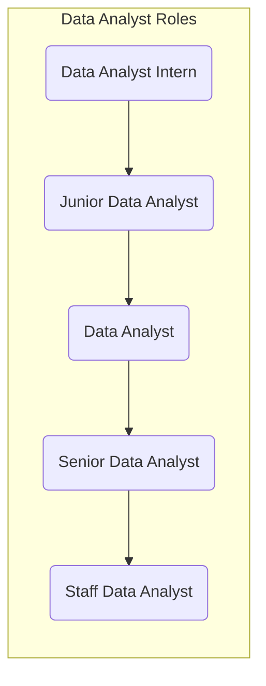

### [Data Science](https://about.gitlab.com/job-families/finance/data-scientist)

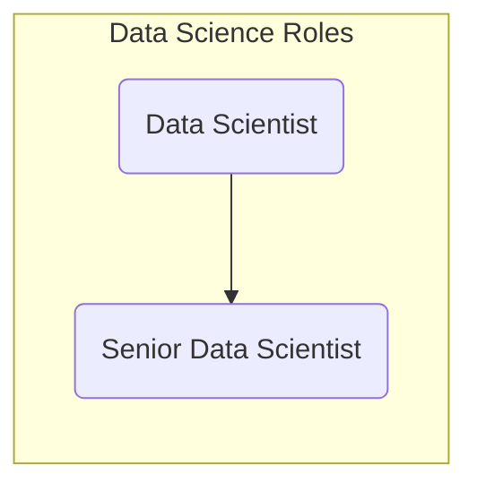

### [Analytics Engineering](https://about.gitlab.com/job-families/finance/analytics-engineer)

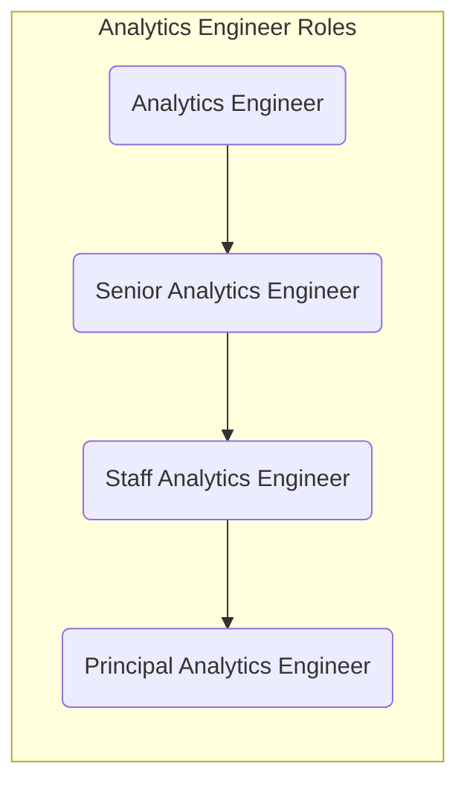

### [Data Management](https://about.gitlab.com/job-families/finance/manager-data)

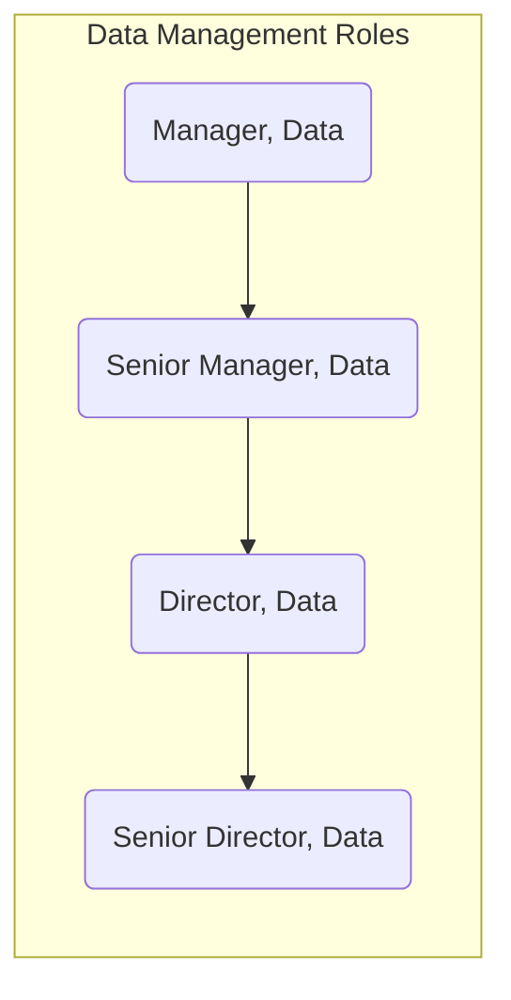

---
layout: handbook-page-toc
title: "Data Analytics Handbook"
description: "GitLab Data Analytics Team Handbook"
---

## On this page
{:.no_toc .hidden-md .hidden-lg}

- TOC
{:toc .toc-list-icons .hidden-md .hidden-lg}

{::options parse_block_html="true" /}

----

# Data Analytics at GitLab

The mission of the Data Analytics team is to **maximize** the impact of business decisions and strategy with data solutions that are trusted and scalable.

We do this by helping all GitLab teams move up the [**Data Value Pyramid**](/handbook/business-technology/data-team/direction/#data-value-pyramid) **by means of our** [**GitLab values**](/handbook/values/) and our [**Data Team Principles**](/handbook/business-technology/data-team/#data-team-principles).


## Data Analytics Responsibilities

Of the [Data Team's Responsibilities](/handbook/business-technology/data-team/#responsibilities) the **Data Analytics Team** is **directly responsible** for:
- Managing and governing the company's Key Performance Indicator definitions, database, and data visualizations
- Providing customizable Data Services, including Data Visualization, Data Modeling, Data Quality, and Data Integration
- Supporting the company's governance, risk, and compliance programs as they relate to Data & Analytics systems

Additionally, the **Data Analytics Team** supports the following responsibilities
- With the **Data Leadership Team**:
    - Defining and publishing a Data Strategy to help maximize the value of GitLab's Data Assets
    - Broadcasting regular updates about data deliverables, ongoing initiatives, and upcoming plans
- With the [**Data Engineering Team**](/handbook/business-technology/data-team/organization/engineering/#data-engineering-responsibilities):
    - Building and maintaining the company's central Enterprise Data Warehouse to support Reporting, Analysis, Dimensional Modeling, and Data Development for all GitLab teams
    - Developing Data Management features such as master data, reference data, data quality, data catalog, and data publishing
    - Providing Self-Service Data capabilities to help everyone leverage data and analytics
    - Helping to define and champion Data Quality practices and programs for GitLab data systems

## Handbook First on the Data Analytics Team

At GitLab we are [Handbook First](/handbook/handbook-usage/#why-handbook-first) and drive this by:
1. Helping our Business Partners (all GitLab team members) update the handbook with the most up-to-date and accurate information.
1. Reviewing content and ensure that the information in the handbook best represents the data, taking into account data sensitivity and security.
1. Updating the Data Team handbook section
    - with exciting Data Analytics content
        - Examples of upcoming content: `Data Visualization: Tips and Tricks` and `Data Storytelling`
    - to reflect changes in Data Team process or codebase  (and yes we get very excited about better processes and code! Who doesn't!)

---

## What Is Analytics And Why Do We Do It?

**Analytics** is the practice of turning **data** into [**information, knowledge, and wisdom**](/handbook/business-technology/data-team/direction/#data-value-pyramid) to:
1. **Improve Efficiency & Avoid Costs**
    1. Human Capital - Location Factor, Offer Accept Rate, Cost Per Hire
    1. Finance - ARR, New Pipeline Created, CC Failure Rate
    1. Sales Channel - Win Rate, Services Attach Rate,
    1. Marketing - Opportunities Created, Product Downloads
1. **Improve the Business Model**
    1. Product Intelligence - Sign-up Growth, New Features Delivered, Top Features
    1. Customer Analytics - Firmographics, Adoption Trends, Usage vs. Subscription
    1. Customer Purchasing Trends - Renewals, Upgrades, Downgrades
1. **Improve the Customer Experience**
    1. Data Products - Industry Benchmarks, Data APIs, Algorithms
    1. Data-Informed Process Improvements
    1. In-Product Insights

## Short Term Direction
Our short term goal for `FY21-2H` is to move GitLab up the [**Data Capability Model**](/handbook/business-technology/data-team/direction/#data-capability-model) from **Level (1) Reactive** to **Level (2) Advanced**.

To do this, the Data Analytics team will be:
- operating in [Data Fusion teams](https://about.gitlab.com/handbook/business-technology/data-team/organization/#fusion-teams) towards the same business goals at the same pace
- strengthening the [Data Analysis Process](/handbook/business-technology/data-team/organization/analytics/#data-analysis-process)
- advancing GitLab's [Data Visualization](https://datavizcatalogue.com/) & [Data Storytelling](https://www.forbes.com/sites/brentdykes/2016/03/31/data-storytelling-the-essential-data-science-skill-everyone-needs/#71f2f94852ad) skills


## Data Analysis Process

Data Analytics, Advanced Data Analytics, and Data Science all start with the `Data Analysis Process`.

The `Data Analysis Process` has five steps:

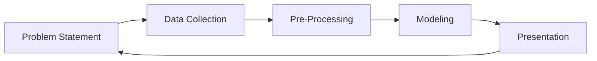

In Data Analytics, context is everything. It guides the way Data Analyst view the problem, the data, and the methodology taken to generate the data insights.

### Problem Statement

In the `Problem Statement` step, it is crucial that we **define the business problem** with the Business Partner. By clearly defining the business problem that the Business Partner is seeking data insights into, Data Analyst can set success criterias to ensure that the problem is **technically solvable with the data available** and to provide the **maximum business insight** into the problem.

### Data Collection

In the `Data Collection` step, it's important for Data Analyst to explore and understand the **Data Caveats** that may limit the impact or generalization of the analysis as well as to evaluate any **Data Biases** or **Data Concerns**. Understanding how the data is collected in each business system will ensure that we are reporting on accurate data in an appropriate manner. During this step, it's important to ensure that the **Data Types** are accurate for reliable transformations.

Therefore, this step is actually a part of a feedback loop with the source system owners. If a Data Team member finds that a data field is `missing` or `inaccurately captured`, it is the responsibility of anyone at GitLab to reach out to the source system owners and ask them to update or add the data field in question.

### Pre-Processing

In the `Pre-Processing` step, Data Analyst prepare and cleanse the data and exam the data quality to design the optimal **Data Structures** for scalable reporting. It's important in this step to review the model and ensure that the model is business-friendly.

### Modeling

In the `Modeling` step, we aim to create new data models in the [Enterprise Dimensional Model](/handbook/business-technology/data-team/platform/edw/) format for all GitLab team members. We start first with an **Entity Relationship Diagram (ERD)** to ensure that the new data structures reflect accurate business processes. All data models are reviewed by the [Data Engineering Team](/handbook/business-technology/data-team/organization/engineering/#data-engineering-responsibilities).

When GitLab reaches **Level (4) Predictive** of the [**Data Capability Model**](/handbook/business-technology/data-team/direction/#data-capability-model), this step will include [Exploratory Data Analysis](https://en.wikipedia.org/wiki/Exploratory_data_analysis) and Data Feature Engineering, which should include supervised & unsupervised machine learning techniques.

### Presentation

In the `Presentation` step, Data Analyst radiate in their **Data Storytelling** skills with strong **Data Visualizations**. Data Analyst recognizes that it is important to [package and display the actionable business insights to effectively communicate with stakeholders](https://www.forbes.com/sites/evamurray/2019/01/28/how-data-visualization-supports-communication/#3a8d1972cced). In fact, it is as vital as ensuring that the data solution, such as a Business Intelligence (BI) dashboards with drill-downs to show the granular reasoning behind the insights, has robust data quality checks for our Business Partners (all GitLab team members) to trust the data.

The wonderful thing about Data Analytics is that each insight should propagate a wave of additional business questions to solve, which then allows the `Data Analysis Process` to cycle again.

---
layout: handbook-page-toc
title: "Data Science Handbook"
description: "GitLab Data Science Team Handbook"
---

## On this page 
{:.no_toc .hidden-md .hidden-lg}

- TOC
{:toc .toc-list-icons .hidden-md .hidden-lg}

{::options parse_block_html="true" /}

----

# Data Science at GitLab 


The mission of the Data Science team is to help understand business, customers and products better with model-based insights.
The team accomplishes this mission by building machine learning models and analysing data to convert results into trusted and scalable products. 


## Projects

### Propensity to Buy

- Start Date: 2021-06-30
- [Project](https://gitlab.com/gitlab-data/propensity-to-buy)
- [Data Science Work breakdown](https://gitlab.com/groups/gitlab-data/-/epics/340)
- [Slack Channel](https://gitlab.slack.com/archives/C027EEYL8EL)

### Project Backlog

- Buy (Upsell) Predicted ARR
- Golden Journey - Growth Team - Hila Qu
- PtB.first order  - Growth Team - Hila Qu
- PtB.churn - Customer Success Team - David Sakamoto
- User Segmentation / persona activity, use cases - Product Team - Hila Qu
- Community Sentiment Analysis / twitter, facebook - Product Team
- GitLab MLOps Product Development - Product Team - Taylor
- Feature $ARR uplift prediction - Product Team - Anoop Dawar

### Data Science roadmap - executive summary


|  **Timeline** | **Deliverable** | **Value** | **Stakeholders** | **Expected Outcome** |
| :--------------- | :----------------- | :-------------- | :-------------- | :-------------- |
| FY-22 Q3 / Iterative | [Propensity to Expand (PtE)](https://gitlab.com/gitlab-data/propensity-to-expand) | Enables sales team to capture opportunities that increase ARR | Sales Team (Jake Bielecki) | TBD |
| FY-22 Q4 / Iterative | [Propensity to Contract (PtC)](https://gitlab.com/gitlab-data/propensity-to-contract) | Enables sales team to prevent reduction of ARR | Sales Team (Jake Bielecki) | TBD |
| FY-23 Q1 / Iterative | [User Segmentation (US)](https://gitlab.com/gitlab-data/user-segmentation) | Determines profiles of customers | Product Team (Hila Qu) | TBD |


# Data Science responsibilities 

- What exactly is data science?! Check out [this video](https://www.youtube.com/watch?v=wRbNExL0hv8) or [these slides](https://docs.google.com/presentation/d/1Y-V6bZ5w8Ms5yfMiuYCYZs9ald7Q5MxydYhSh9DWwwQ/edit?usp=sharing) for a quick overview.

- Responsibilities of data scientists are outlined [here](https://about.gitlab.com/job-families/finance/data-science/) 

- Additionally, the **Data Science Team** supports the following responsibilities:
    - With the **Data Leadership Team**:
        - Defining and publishing a Data Science roadmap to expand analytical capabilities
        - Broadcasting regular updates about data deliverables, ongoing initiatives, and upcoming plans
    - With the [**Data Engineering Team**](https://about.gitlab.com/handbook/business-technology/data-team/organization/engineering/#data-engineering-responsibilities):
        - Helping to define and champion Data Quality practices and programs for GitLab data systems


# Projects structure 

Data Scientists follow [Cross-Industry standard process for data mining (CRISP-DM)](https://en.wikipedia.org/wiki/Cross-industry_standard_process_for_data_mining) to deliver projects, which consists of 6 phases. More detailed breakdown of project structure and code examples can be found (here). 

### Business Understanding 

First step is to define business needs of end users of the project and success criteria. This phase includes gathering requirements, stakeholders interviews, defining vision, user stories for product and use cases for models. This phase is closely aligned with GitLab's [OKRs](https://about.gitlab.com/company/okrs/) and company's value - [Iteration](https://about.gitlab.com/handbook/values/#iteration)

### Data Understanding 

Data understanding is closely aligned with business understanding. It requires to define data sources that business already has in place and the ones that business does not. In this phase data scientists work closely with data engineers and data analysts to define any miscrepancies and risks. If there is a need to bring external data, request should be raised in this phase. 

### Data Preparation 

After defining business needs and data sources it is time to dive into the data! This phase requires conducting [Second data quality check] and [Exploratory data analysis]. At this stage, data scientists are gathering greater understanding of data, its types, correlations and distributions what will be useful in the next phase - modeling.

### Modeling 

Modeling refers to building machine learning model, which consists of training, testing and validating model. Based on Business Understanding phase initial algorithm should be picked and pre-processing should be defined. In this phase, outcomes from Data Preparation are needed as not all algorithms can work with all data types.

### Evaluation 

In this phase, performance of model is measured (if required in Business Understanding) and outcomes are presented to stakeholders and end users for feedback. This phase is strongly aligned with one of the GitLab's values - [Iteration](https://about.gitlab.com/handbook/values/#iteration) After feedback, data scientists iterate on above phases as long as business goal is met.

### Deployment / Productionalization

Once a viable prediction model has been created, the next step is to deploy the model in to the TBD data science production pipeline. This process automatically updates ("re-trains") the model as new data becomes available and generates predictions for all eligable records on a regular cadence.  

# Success Criteria 

Every data science project at GitLab starts and ends with success criteria. 

Success criteria is measured as follows: 

`value_provided = future_state - current_state`

We recognise two types of business outcomes from data science projects: direct and indirect impact.

## Direct Impact 

Projects with direct impact allow to translate project outcomes directly to monetary value. This usually can be achieved by optimisation projects which goal is to reduce time spent on process or increase revenue of company. Below provided examples of success criteria statement for direct impact: 

### Time Saved 

"Our project helped to reduce time spent on process X by 10 000 hours valued at $500k."

### Money earned 

"Our project brought new high-profile customers that brought extra $50 Million to annual revenue"

## Indirect impact 

Projects with indirect impact do not translate directly to monetary value, but provide platform for other decision makers to bring monetary value. These projects are usually the ones where critical insights are provided to stakeholders as scalable product and then used to increase capabilities of decision maker. Below provided examples of success criteria statement for indirect impact:

### Increased Visibility 

"Our project helped stakeholders increase decision making capabilities, which improved sales strategy by 10%."

### Unlock Insights 

"Our project enabled the product team to finally understand who our major customers are and the behaviors they exhibited. This knowledge helped to secure a new customer worth $1M ARR."

## Describing insights/outcome of the project 

Familiarising yourself with [Google's formula XYZ](https://www.youtube.com/watch?v=zrXZBkYzuZo) can help communicate insights and outcomes of the project in a more efficient way. Formula XYZ is a form of concise sentence that can be used to write down your achievements in resume. This structure has been established by Google and described as: "Accomplished [X] as measured by [Y], by doing [Z]."

X = should be replaced by verb that describes what you accomplished, For example: increased revenue/reduced costs/provided training etc 

Y = should be replaced by measure of your accomplishment. For example, if you increased revenue or reduced costs you could provide monetary value or percentage (Increased revenue by 10%) 

Z = should be replaced by verb that describes how did you accomplished the result you wish to describe. For example, accomplished ABC "by conducting detailed analysis"

Example of full sentence is below: 

Our project increased revenue [X] by 10% [Y] by conducting detailed analysis [Z] 

Please note that above formula is a suggestion only that may help to describe outcomes of the project in a more efficient and concise way.

# Data Science Tools at Gitlab

- **[Pre-configured JuypterLab Image](https://gitlab.com/gitlab-data/data-science)**: The data science team uses JupyterLab pre-configured with common python modules (pandas, numpy, etc.), native Snowflake connectivity, and git support. Working from a common framework allows us to create models and derive insights faster. This setup is freely available for anyone to use. Check out the the [Jupyter Guide](https://about.gitlab.com/handbook/business-technology/data-team/platform/jupyter-guide/) for additional information.

- **[gitlabds python tools](https://gitlab.com/gitlab-data/gitlabds/)**: Functions to help automate common data prep (dummy coding, outlier detection, variable reduction, etc.) and modeling tasks (i.e. evaluating model performance). Install directly via `pip install gitlabds` or use as part of the JupyterLab image above.

- **Modeling Templates** (**Coming Soon!**)


# Useful Data Science & Machine Learning Resources

- _Python Data Science Handbook_ by Jake VanderPlas: Great for beginngers looking to learn python and dip their toes into data science.

- _Python Machine Learning_ by Sebastian Raschka & Vahid Mirjalili: More advanced topics with the assumption of a basic level of python.

- _The Elements of Stastical Learning, Data Mining, Inference, and Prediction_ by Trevor Hastie, Robert Tibshirani, & Jerome Friedman: Great deep dive into all the statistics and logic behind many of the commonly used predictive techniques. Can be pretty stats/math heavy at time.

# Common Data Science Terms 

Below listed common data science terms that are used by team. 


**Data Science (DS)** - interdisciplinary field that uses computer science, statistical techniques and domain expertise to extract insights from data

**Machine Learning (ML)** - use and development of algorithms without being explicitly programmed to determine patterns in data

**Algorithm** -  sequence of computer-implementable instructions used to solve specific problem

**Feature** - single column in dataset that can be used for analysis, such as country, age etc. Sometimes refered to as variables or attributes 

**Feature Engineering** -  process of selecting, combining and transforming data into features

**Weight** - numerical value assigned to feature that determines it's strength

**Model** - an applied algorithm with weights determined by input data

**Imputation** - process of replacing missing data with substituted values

**Training** -  assigning weights in a model based on input data

**Testing** - comparing predicted values from trained model to actual values 

**Classification** - process of predicting categories for each data point 

**Regression** - process of predicting continuous numerical variable for each data point 

**Clustering** - process of definining groupings in dataset 


# Python vs SQL 

If you are familiar with structured Query Language (SQL), you may want to use clauses while doing your analysis in Python (with library pandas). Below listed Python's equivalents of popular SQL commands. 

Please note that below is not the only way to achieve your expected outcomes - there are many ways in Python to achieve the same result.  

## SELECT * FROM 

```python
#assuming you loaded your dataset as 'data' just put the name of dataframe into Jupyter's cell
data 
```

## SELECT col1, col2 FROM 


```python
columns = ['col1', 'col2']

data[columns]

#above can be combined in one code as follows:
data[['col1','col2']]

```

## COUNT

```python
#defines length of dataframe what equals to amount of rows
len(data)

#similar as above but additionally lists amount of columns
data.size
```

## LIMIT

```python
#lists first 5 rows 
data.head()

#if you want top 10 rows you can do it by adding number inside head() function
data.head(10)
```

## WHERE 

```python
#list all rows for which column1 has value greater than 1
condition = data['column1'] > 1

data[condition]

```

Please note that Python accepts combined conditions. Python's equivalent for AND is & and for OR is | 

## GROUP BY (with aggregation functions)

```python

#lists count of rows per column 1
data.groupby(['col1']).size()

#lists average value of rows per column1
data.groupby(['col1']).mean()

#lists min value of rows per column1
data.groupby(['col1']).min()

#lists max value of rows per column1
data.groupby(['col1']).max()

```


---
layout: handbook-page-toc
title: "Data Engineering Handbook"
description: "GitLab Data Engineering Team Handbook"
---

## On this page
{:.no_toc .hidden-md .hidden-lg}

- TOC
{:toc .toc-list-icons .hidden-md .hidden-lg}

{::options parse_block_html="true" /}

---

# Data Engineering at GitLab

The mission of the Data Engineering team is to build a secure and trusted data platform that makes it possible for **everyone to be an analyst** so that our _only_ limitations are the data or analysts themselves. We do this **by means of our [GitLab values](/handbook/values/)** and our **[Data Team Principles](/handbook/business-technology/data-team/#data-team-principles)**

## Data Engineering Responsibilities

Of the [Data Team's Responsibilities](/handbook/business-technology/data-team/#responsibilities) the Data Engineering team is directly responsible for:

- Building and maintaining the company's central Enterprise Data Warehouse to support Reporting, Analysis, Dimensional Modeling, and Data Development for all GitLab teams
- Integrating new data sources to enable analysis of subject areas, activities, and processes
- Building and maintaining an Enterprise Dimensional Model to enable Single Source of Truth results
- Developing Data Management features such as master data, reference data, data quality, data catalog, and data publishing
- Providing Self-Service Data capabilities to help everyone leverage data and analytics
- Help to define and champion Data Quality practices and programs for GitLab data systems
- Providing customizable Data Services, including Data Modeling, Data Quality, and Data Integration

## Handbook First on the Data Engineering Team

At GitLab we are [Handbook First](/handbook/handbook-usage/#why-handbook-first). Any changes to our codebase or process should have a handbook MR created before the work is started or concurrently with the MR to change the code.

For example: If we are adding a data source, we would first create the merge request to update our [the extract and load](/handbook/business-technology/data-team/platform/#extract-and-load) and [system diagram](/handbook/business-technology/data-team/platform/infrastructure/#system-diagram) sections of our handbook. This MR can be updated as the change is created and merged along with the change.

---

## Data Engineering Team Roles

In order to efficiently operate as a team we designate and assign the following responsibilities to members of the Data Engineering team. These assignments are not permanent, but do create a Directly Responsible Individual on the team for these responsibilities. The assigned Engineer is responsible for both maintenance and iterative improvement over these responsibilities.

### Production Operations

Production operations is always our [top standing priority](/handbook/business-technology/data-team/how-we-work/#standing-priorities) on the Data Engineering team and includes all technical operations that support or affect our production environment and the SLOs it supports. This includes, but is not limited to monitoring, testing, deployment, code reviews, and DevOps generally.

### Project Management and Planning

The Engineer assigned the Project Management and Planning responsibility oversees, directs, and improves our [workflow processes](/handbook/business-technology/data-team/how-we-work/#workflow-summary), [milestone planning](/handbook/business-technology/data-team/how-we-work/#milestone-planning), and issue triaging. They ensure that work is getting planned and completed efficiently and that the work being done appropriately supports and enables the goals of both the Data Team and GitLab.

### User Experience

This engineer is responsible for the usability of our data platform. As stated in the Data Engineering mission, we are building the platform for everyone. The assigned Engineer proactively finds and solutions around our data platform with special mind to those experiences that are the most difficult to use.

### Security, Compliance & Privacy

This role keeps our platform secure, private, and compliant and will be the point of contact for audit questions as well as the primary engineer responsible for reviewing changes that affect the security and privacy of our data platform. They should also be iteratively improving the security features of our platform.

### Data Warehouse Architecture

In order to keep our iterations inexpensive and increase the usability of our warehouse we have decided to implement a dimensional warehouse. This engineer is responsible for protecting the integrity of our warehouse architecture and leads the vision on where the architecture needs to be improved. All of these changes and protections should keep our customers, both internal an external, as their primary focus.

---
layout: handbook-page-toc
title: "Data Team Platform"
description: "GitLab Data Team Platform"
---

## On this page
{:.no_toc .hidden-md .hidden-lg}

- TOC
{:toc .toc-list-icons .hidden-md .hidden-lg}

{::options parse_block_html="true" /}

---

## <i class="fas fa-map-marked-alt fa-fw" style="color:rgb(107,79,187); font-size:.85em" aria-hidden="true"></i>Quick Links
 
- [Data Infrastructure](/handbook/business-technology/data-team/platform/infrastructure/)
- [Data pipelines](/handbook/business-technology/data-team/platform/pipelines/)
- [Data CI Jobs](/handbook/business-technology/data-team/platform/ci-jobs/)
- [dbt Guide](/handbook/business-technology/data-team/platform/dbt-guide/)
- [Enterprise Data Warehouse](/handbook/business-technology/data-team/platform/edw/)
- [Jupyter Guide](/handbook/business-technology/data-team/platform/jupyter-guide/)
- [Permifrost](/handbook/business-technology/data-team/platform/permifrost/)
- [Python Guide](/handbook/business-technology/data-team/platform/python-guide/)
- [Sisense (Periscope)](/handbook/business-technology/data-team/platform/periscope/)
- [Sisense Style Guide](/handbook/business-technology/data-team/platform/sisense-style-guide/)
- [Snowplow](/handbook/business-technology/data-team/platform/snowplow/)
- [SQL Style Guide](/handbook/business-technology/data-team/platform/sql-style-guide/)

## <i class="fas fa-cubes fa-fw" style="color:rgb(252,109,38); font-size:.85em" aria-hidden="true"></i>Our Data Stack


We use GitLab to operate and manage the analytics function.
Everything starts with an issue.
Changes are implemented via merge requests, including changes to our pipelines, extraction, loading, transformations, and parts of our analytics.

| Stage           |              Tool             |
| :-------------- | :---------------------------: |
| Extraction      |  Stitch, Fivetran, and Custom |
| Loading         |  Stitch, Fivetran, and Custom |
| Orchestration   |            Airflow            |
| Data Warehouse  |           Snowflake           |
| Transformations |     dbt and Python scripts    |
| Data Visualization | Sisense For Cloud Data Teams‎ |
| Advanced Analytics | jupyter‎ |

## <i class="fas fa-exchange-alt fa-fw" style="color:rgb(107,79,187); font-size:.85em" aria-hidden="true" id="extract-and-load"></i>Extract and Load

We currently use [Stitch](https://www.stitchdata.com) and [Fivetran](https://fivetran.com/) for most of our data sources. These are off-the-shelf ELT tools that remove the responsibility of building, maintaining, or orchestrating the movement of data from some data sources into our Snowflake data warehouse. We run a full-refresh of all of our Stitch/Fivetran data sources at the same time that we rotate our security credentials (approx every 90 days). Prior to running a full refresh we will drop all of the tables.

Stitch and Fivetran handle the start of the data pipeline themselves. This means that Airflow does not play a role in the orchestration of the Stitch- and Fivetran schedules.

For source ownership please see [the Tech Stack Applications sheet (internal only).](https://docs.google.com/spreadsheets/d/1mTNZHsK3TWzQdeFqkITKA0pHADjuurv37XMuHv12hDU/edit#gid=0)

### Data Sources

The following table indexes all of the RAW data sources we are loading into the data wareouse. We manage the development backlog and priorities in the [New Data Source/Pipeline Project Management](https://docs.google.com/spreadsheets/d/14uqsAIqRnyyL9Ta39QYwheXnf0k86yTTIKhrkY_1el8/edit#gid=0) sheet, with links to GitLab issues for up-to-date status and progress management. The [new data source handbook](/handbook/business-technology/data-team/how-we-work/new-data-source/) page describes how the Data Team handles any request for new data sources. 

**Key**
- Pipeline: The technology we use to replicate data.
- RF (Replication Frequency): How often we load new and updated data.
- Raw Schema: The schema in the `RAW` database where data is stored.
- Prep Schema: The schema in the `PREP` database where [source models](/handbook/business-technology/data-team/platform/dbt-guide/#source-models) are materialized.
- Audience: The primary users of the data.
- SLO: Service Level Objective. Our SLO is the time between real-time and the analysis displayed in the [data visualization tool](#visualization)
- `x` indicates undefined or not run

| [Data Source](/handbook/business-technology/data-team/platform/pipelines) | Pipeline | Raw Schema | Prep Schema | Audience | RF / SLO| MNPI | 
|------------:|:--------:|:---------:|:--------:|:-------:|:--------:|:--------:|
| Adaptive | Meltano | `tap_adaptive` | | Finance | | Yes | 
| [Airflow](https://airflow.apache.org/) | [Stitch](https://www.stitchdata.com/) | `airflow_stitch` | `airflow` |  Data Team | 24h / 24h | No |
| [BambooHR](https://www.bamboohr.com/) | [Airflow](https://airflow.gitlabdata.com/home) | `bamboohr` | `sensitive` | People | 12h / 24h | No |
| Clearbit | x | x | x | x / x | | No |
| [CustomersDot](https://customers.gitlab.com/) [ERD](https://gitlab.com/gitlab-org/customers-gitlab-com/-/blob/staging/doc/db_erd.pdf) | [pgp](https://gitlab.com/gitlab-data/analytics/-/tree/master/extract/postgres_pipeline) | `tap_postgres` | `customers` | Product | 24h / x |  No |
| [Demandbase](https://www.demandbase.com/) | [Snowflake task](/handbook/business-technology/data-team/platform/infrastructure/#automated-processes-loading-data-into-snowflake) | `demandbase` | `demandbase` | Marketing | 24h / x |  No |
| [Gitter](https://gitter.im/) | x | `gitter` | x | x | x |  No |
| [GitLab.com](/handbook/business-technology/data-team/platform/pipelines/#gitlab-postgres-database) | [pgp](https://gitlab.com/gitlab-data/analytics/-/tree/master/extract/postgres_pipeline) | `tap_postgres` | `gitlab_dotcom` | Product, Engineering | 6h / x |  No |
| GitLab Ops DB | [pgp](https://gitlab.com/gitlab-data/analytics/-/tree/master/extract/postgres_pipeline) | `tap_postgres` | `gitlab_ops` | Engineering | 6h / x |  No |
| GitLab Profiler DB | x | x | x | x | x / x |  No |
| [Google Analytics 360](https://marketingplatform.google.com/about/analytics-360/) | [Fivetran](https://fivetran.com/) | `google_analytics_360_fivetran` | `google_analytics_360` | Marketing | 6h / 32h |  No |
| [Google Cloud Billing](https://cloud.google.com/support/billing) | x | `gcp_billing` | `gcp_billing` | Engineering | x / x |  No |
| [Graphite API](https://graphite-api.readthedocs.io/en/latest/) | [Airflow](https://airflow.gitlabdata.com/home) | `engineering_extracts` | x | Engineering | 24h / 48h |  No |
| [Greenhouse](https://www.greenhouse.io/) | [Sheetload](https://gitlab.com/gitlab-data/analytics/tree/master/extract/sheetload) | `greenhouse` | `greenhouse` | People | 24h / 48h |  No |
| [Handbook YAML Files](https://gitlab.com/gitlab-data/analytics/-/tree/master/extract/gitlab_data_yaml) | [Airflow](https://airflow.gitlabdata.com/home) | `gitlab_data_yaml` | `gitlab_data_yaml` | Multiple | 8h / 24h | No |
| [Handbook MR Data](https://gitlab.com/gitlab-data/analytics/-/blob/master/dags/extract/handbook_mrs_extract.py) | [Airflow](https://airflow.gitlabdata.com/home) | `handbook` | `handbook` | Multiple | 24h / 24h | No |
| [Handbook Git Log Data](https://gitlab.com/gitlab-data/analytics/-/blob/master/dags/extract/values_page_extract.py) | [Airflow](https://airflow.gitlabdata.com/home) | `handbook` | `handbook` | Multiple | 1w / 1m |  No |
| [LicenseDot](https://license.gitlab.com/) [ERD](https://gitlab.com/gitlab-org/license-gitlab-com/-/blob/master/doc/db_erd.pdf) | [Automatic Process](/handbook/business-technology/data-team/platform/infrastructure/#automated-processes-loading-data-into-snowflake) | `license_db` | `license_db` | Product |  24 h / 48 h |  No |
| [Marketo](https://www.marketo.com/software/marketing-automation/) |  [Fivetran](https://fivetran.com/)  | `marketo` | x | Marketing | 24h / 24h |  No |
| [Netsuite](https://www.netsuite.com/portal/home.shtml) | [Fivetran](https://fivetran.com/) | `netsuite_fivetran` | `netsuite` | Finance | 6h / 24h | Yes |
| PMG | x | `pmg` | `pmg` | x | x / x | No |
| [PTO by Roots](https://www.tryroots.io/pto) | [Snowpipe](/handbook/business-technology/data-team/platform/infrastructure/#automated-processes-loading-data-into-snowflake) | `pto` | `gitlab_pto` | Engineering Productivity / People | 7 days / x | No |
| [Qualtrics](https://www.qualtrics.com/) | [Airflow](https://airflow.gitlabdata.com/home) | `qualitrics` | `qualtrics` | Marketing | 12h / 48h | No |
| [SaaS Usage Ping](https://gitlab.com/gitlab-data/analytics/-/tree/master/extract/saas_usage_ping) | [Airflow](https://airflow.gitlabdata.com/home) | `saas_usage_ping` | `saas_usage_ping` | Product | 1 week / x |  No |
| [Salesforce](https://www.salesforce.com/) | [Stitch](https://www.stitchdata.com/) | `salesforce_stitch` | `sfdc`| Sales | 6h / 24h |  Yes |
| [SheetLoad](/handbook/business-technology/data-team/platform/pipelines/#sheetload) | [SheetLoad](https://gitlab.com/gitlab-data/analytics/tree/master/extract/sheetload) | `sheetload` | `sheetload` | Multiple | 24h / 48h |  Yes |
| [Snowplow](https://snowplowanalytics.com/) | [Snowpipe](/handbook/business-technology/data-team/platform/snowplow/index.html#snowpipe) | `snowplow` | `snowplow` | Product | 15m / 24h |  No |
| [Thanos](https://thanos-query.ops.gitlab.net/graph)| [Snowflake Task](/handbook/business-technology/data-team/platform/infrastructure/#automated-processes-loading-data-into-snowflake) | `prometheus` | `prometheus` | Engineering |  24 h / x |  No |
| [Version DB](https://version.gitlab.com/users/sign_in) | [Automatic Process](/handbook/business-technology/data-team/platform/infrastructure/#automated-processes-loading-data-into-snowflake) | `version_db` | `version_db` | Product |  24 h / 48 h | No |
| [Xactly](https://www.xactlycorp.com) | [Meltano](https://meltano.com/) | `tap_xactly` | N/A | Sales | 24h / N/A |  Yes |
| [Zendesk](https://www.zendesk.com/) | [Stitch](https://www.stitchdata.com/) | `zendesk_stitch` | `zendesk` | Support | 6h / 24h |  No |
| [Zoom](https://zoom.us/) | [Meltano](https://meltano.com/) | `tap_zoom` | N/A | People | 24h / N/A |  No |
| [Zuora](https://www.zuora.com/) | [Stitch](https://www.stitchdata.com/) | `zuora_stitch` | `zuora` | Finance | 6h / 24h | Yes |
| [Zuora Revenue](https://knowledgecenter.zuora.com/Zuora_Revenue) | [Airflow](https://airflow.gitlabdata.com/home)  | `zuora_revenue` | `zuora_revenue` | Finance | 24h / 48h | Yes |
| [Zoominfo](https://www.zoominfo.com/) | [Snowflake Data Share](https://about.gitlab.com/handbook/business-technology/data-team/platform/pipelines/#snowflake-data-share)  | N/A | `zoominfo` | Analytics & Insights, Product, Sales, Marketing | 24h / N/A  |   |

### Adding new Data Fields

To add new fields to the BambooHR extract:

- Create a new issue in the Analytics project using the BambooHR template
- Gain approval from a Data Team Manager and the Compensation and Benefits Manager
- Once approved, assign to the Compensation and Benefits Manager and a Data Engineer who will verify the extract

### Data Team Access to Data Sources

In order to integrate new data sources into the data warehouse, specific members of the Data team will need admin-level access to data sources, both in the UI and through the API.
We need this admin-level access through the API in order to pull all the data needed to build the appropriately analyses and through the UI to compare the results of prepared analyses to the UI.

Sensitive data sources can be limited to no less than 1 data engineer and 1 data analyst having access to build the require reporting.
In some cases, it may only be 2 data engineers.
We will likely request an additional account for the automated extraction process.

Sensitive data is locked down through the security paradigms listed below;
Sisense will never have access to sensitive data, as Sisense does not have access to any data by default.
Sisense's access is always explicitly granted.

#### DataSiren

To ensure that the data team has a complete picture of where sensitive data is in the data warehouse, as well as make sure Sisense does not have access to sensitive data, a periodic scan of the data warehouse is made using dbt along with the internally-developed library of tools created as [`datasiren`](https://gitlab.com/gitlab-data/datasiren). This scan is currently executed weekly. The fine-grained results are stored in Snowflake in the `PREP.DATASIREN` schema and are not available in Periscope because of sensitivity reasons.  High-level results have been made available in Periscope, including the simple dashboard found [here](https://app.periscopedata.com/app/gitlab/793578/DataSiren).  

### Qualtrics Mailing List Data Pump / Qualtrics SheetLoad

The Qualtrics mailing list data pump process, also known in code as `Qualtrics SheetLoad`, enables emails to be uploaded to Qualtrics from the data warehouse without having to be downloaded onto a team member's machine first.  This process shares its name with SheetLoad because it looks through Google Sheets for files with names starting with `qualtrics_mailing_list`.  For each of the files it finds with an `id` column as the first column, it uploads that file to Snowflake.  The resulting table is then joined with the GitLab user table to retrieve email addresses.  The result is then uploaded to Qualtrics as a new mailing list.

During the process, the Google Sheet is updated to reflect the process' status.  The first column's name is set to `processing` when the process begins, and then is set to `processed` when the mailing list and contacts have been uploaded to Qualtrics.  Changing the column name informs the requester of the process' status, assists in debugging, and ensures that a mailing list is only created once for each spreadsheet.

The end user experience is described on the [UX Qualtrics page](/handbook/engineering/ux/qualtrics/#distributing-your-survey-to-gitlabcom-users).

#### Debugging

Attempting to reprocess a spreadsheet should usually be the first course of action when a spreadsheet has an error and there is no apparent issue with the request file itself.  Reprocessing has been necessary in the past when new GitLab plan names have been added to the `gitlab_api_formatted_contacts` dbt model, as well as when the Airflow task hangs when processing a file.  This process should only be performed with coordination or under request from the owner of the spreadsheet, to ensure that they are not using any partial mailing list created by the process, as well as not making any additional changes to the spreadsheet.

To reprocess a Qualtrics Mailing List request file:
    1. Disable the Qualtrics Sheetload DAG in Airflow. 
    1. Delete any mailing lists in Qualtrics that have been created from the erroring spreadsheet.  You should be able to log into Qualtrics using the `Qualtrics - API user` credentials and delete the mailing list.  The mailing list's name corresponds to the name of the spreadsheet file after `qualtrics_mailing_list.`, which should also be the same as the name of the tab in the spreadsheet file.
    1. Edit cell A1 of the erroring file to be `id`
    1. Enable the Qualtrics Sheetload DAG in Airflow again and let it run, closely monitoring the Airflow task log

### Snowplow Infrastructure

Refer to the [Snowplow Infrastructure page](/handbook/business-technology/data-team/platform/snowplow) for more information on our setup.

### Data Source Overviews

- [Customer Success Dashboards](https://drive.google.com/open?id=1FsgvELNmQ0ADEC1hFEKhWNA1OnH-INOJ)
- [Netsuite](https://www.youtube.com/watch?v=u2329sQrWDY)
    - [Netsuite and Campaign Data](https://drive.google.com/open?id=1KUMa8zICI9_jQDqdyN7mGSWSLdw97h5-)
- [Version (pings)](https://drive.google.com/file/d/1S8lNyMdC3oXfCdWhY69Lx-tUVdL9SPFe/view)
    - Note that up until October 2019, the data team referred to the entire **version** data source as "pings". However, usage ping is only one subset of the version data source which is why we now use "version" or "version app" to refer to the version.gitlab.com _data source_ and "usage data" or "usage pings" or "pings" to refer to the [specific usage data feature](https://docs.gitlab.com/ee/user/admin_area/settings/usage_statistics.html) of the version data source. In the context of Data extraction, when it comes to `Service ping` data ingestion, specific details should be found in the [Service ping](handbook/business-technology/data-team/platform/pipelines/index.html.md/#service-ping) page or in the [Readme.md](https://gitlab.com/gitlab-data/analytics/-/blob/master/extract/saas_usage_ping/README.md) page for Service ping
- [Salesforce](https://youtu.be/KwG3ylzWWWo)
- [Zendesk](https://drive.google.com/open?id=1oExE1ZM5IkXcq1hJIPouxlXSiafhRRua)

## <i class="fas fa-clock fa-fw" style="color:rgb(252,109,38); font-size:.85em" aria-hidden="true"></i>Orchestration

We use Airflow on Kubernetes for our orchestration. Our specific setup/implementation can be found [here](https://gitlab.com/gitlab-data/data-image). Also see the [Data Infrastructure](/handbook/business-technology/data-team/platform/infrastructure/) page for more information.

## <i class="fas fa-database fa-fw" style="color:rgb(107,79,187); font-size:.85em" aria-hidden="true" id="data-warehouse"></i>Data Warehouse

We currently use [Snowflake](https://docs.snowflake.net/manuals/index.html) as our data warehouse. The Enterprise Data Warehouse (EDW) is the single source of truth for GitLab's corporate data, performance analytics, and enterprise-wide data such as Key Performance Indicators. The EDW supports GitLab’s data-driven initiatives by providing all teams a common platform and framework for reporting, dashboarding, and analytics. With the exception of point-to-point application integrations all current and future data projects will be driven from the EDW. As a recipient of data from a variety of GitLab source systems, the EDW will also help inform and drive Data Quality best-practices, measures, and remediation to help ensure all decisions are made using the best data possible.

### Snowflake support portal access 

To get access to snowflake support portal, please follow the below steps.
- Register using gitlab email id to [community portal](https://community.snowflake.com/CommunitiesSelfReg)
- This registration will send a welcome email to gitlab mail with the subject `Welcome to the Snowflake Community`. In the mail it will ask you to finish the registration as part of that you will be asked to set your password for the community portal.
- Once done login again to your snowflake community account and on the home page, click `submit case`. For the first time, the user who do not have access to submit a case with snowflake. It will ask you to fill in the form for access. 
- In the form select the access for already snowflake customer. On the next page, it will ask for information `Account Name `, `Cloud Name`, and  `Region Name`. Below is one way to pull this information from the snowflake console.
    - `Account Name` - select CURRENT_ACCOUNT();
    - `Region Name`- select CURRENT_REGION();
    - `Cloud Name` - Based on the [region name](https://docs.snowflake.com/en/user-guide/admin-account-identifier.html#snowflake-region-ids)  value we can identify the cloud name. 
    
- Once done you should receive the acknowledgment mail with the subject `[Request received] Case#` instantly. In case you don't receive the mail resubmit the form. 
- Post that you will receive confirmation mail within 24 hours on your request with the subject line  `Case# -Self Register - Enable Case access`


### Warehouse Access

To gain access to the data warehouse:

- Create an issue in the [access requests project](https://gitlab.com/gitlab-com/team-member-epics/access-requests) documenting the level of access required.
- Do not request a shared account - each account must be tied to a user.
- We loosely follow the paradigm explained in [this blog post](https://blog.fishtownanalytics.com/how-we-configure-snowflake-fc13f1eb36c4) around permissioning users.
- When asking to mirror an existing account, please note that access to restricted SAFE data will **not** be provisioned/mirrored (currently provided via `restricted_safe` role). 

#### Accessing SAFE Data
All SAFE Data are stored in tables within seperate database schemas in Snowflake. Access to 1 table provides access to all SAFE tables. Access to SAFE data requires:

1. Your immediate manager's approval.
2. Departmental VP (or equivalent) approval.
3. Approval of the SAFE Dashboard Space Owner defined in the GitLab Dashboard Index.

To gain access to SAFE Data:

1. Create an [Access Request](https://gitlab.com/gitlab-com\team-member-epics/access-requests/-/issues\new?issuable_template=Individual_Bulk_Access_Request) and provide your needs and intent.
2. Request approval from your immediate manager, your Departmental VP (or equivalent), and the SAFE Space Owner defined in the [GitLab Dashboard Index](https://app.periscopedata.com/app/gitlab/910238/GitLab-Dashboard-Index) header. Approval is **not needed**, if you have an approval for SAFE Data [access](/handbook/business-technology/data-team/data-catalog/) in Sisense, that is not older than 60 days. Skip this step and link to the particular AR.
3. Once the request is approved, tag the Snowflake [provisioners](https://gitlab.com/gitlab-com/www-gitlab-com/-/blob/master/data/tech_stack.yml) and they will process the request.
4. After processing is complete you will be able to access SAFE Data (schemas) in Snowflake.

### Snowflake Permissions Paradigm

We use [Permifrost](https://gitlab.com/gitlab-data/permifrost/) to help manage permissions for Snowflake.
Our configuration file for our Snowflake instance is stored in [this roles.yml file](https://gitlab.com/gitlab-data/analytics/blob/master/permissions/snowflake/roles.yml).
Also available is our [handbook page on Permifrost](/handbook/business-technology/data-team/platform/permifrost/).

We follow this general strategy for role management:

- Every user has an associated user role
- Functional roles exist to represent common privilege sets (`analyst_finance`, `data_manager`, `product_manager`)
- Logical groups of data have their own object roles
- Object roles are assigned primarily to functional roles
- Higher privilege roles (`accountadmin`, `securityadmin`, `useradmin`, `sysadmin`) are assigned directly to users
- Service accounts have an identically named role
- Additional roles can be assigned either to the service account role or the service account itself, depending on usage and needs
- Individual privileges can be granted at the granularity of the table & view
- Warehouse usage can be granted to any role as needed, but granting to functional roles is recommended

#### User Roles

Every user will have their own user role that should match their user name.
Object level permissions (database, schemas, tables) in Snowflake can only be granted to roles.
Roles can be granted to users or to other roles.
We strive to have all privileges flow through the user role so that a user only has to use one role to interact with the database.
Exceptions are privileged roles such as `accountadmin`, `securityadmin`, `useradmin`, and `sysadmin`.
These roles grant higher access and should be intentionally selected when using.

#### Functional Roles

Functional roles represent a group of privileges and role grants that typically map to a job family.
The major exception is the analyst roles.
There are several variants of the analyst role which map to different areas of the organization.
These include `analyst_core`, `analyst_finance`, `analyst_people`, and more.
Analysts are assigned to relevant roles and are explicitly granted access to the schemas they need.

Functional roles can be created at any time.
It makes the most sense when there are multiple people who have very similar job families and permissions.

#### Object Roles

Object roles are for managing access to a set of data.
Typically these represent all of the data for a given source.
The `zuora` object role is an example.
This role grants access to the raw Zuora data coming from Stitch, and also to the source models in the `prep.zuora` schema.
When a user needs access to Zuora data, granting the `zuora` role to that user's user role is the easiest solution.
If for some reason access to the object role doesn't make sense, individual privileges can be granted at the granularity of a table.

#### Examples

This is an example role hierarchy for an Data Analyst, Core:

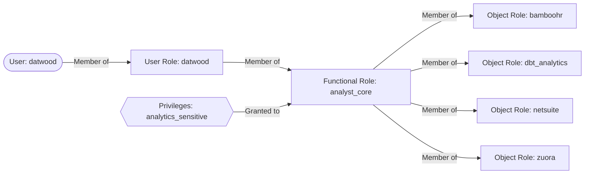

This is an example role hierarchy for an Data Engineer and Account Administrator:

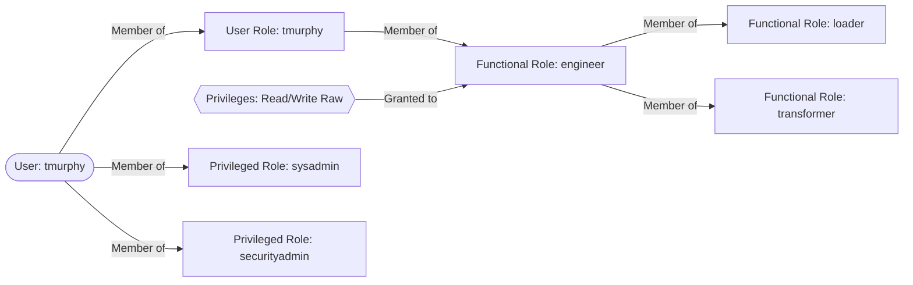

This is an example role hierarchy for a Security Operations Engineer:

```mermaid
graph LR
    A([User: ssichak]) -->|Member of| B[User Role: ssichak]
    A -->|Member of| C[Privileged Role: securityadmin]
```

<div class="panel panel-success">
**Managing Roles for Snowflake**
{: .panel-heading}
<div class="panel-body">

Here are the proper steps for provisioning a new user and user role:

- Make sure we have an issue in the GitLab Data Team project linking the original request with the `Provisioning` label applied
- Login to Snowflake and switch to `securityadmin` role
    - All roles should be under `securityadmin` ownership
- Copy the [`user_provision.sql`](https://gitlab.com/gitlab-data/analytics/-/blob/master/permissions/snowflake/user_provision.sql) script and replace the email, firstname, and lastname values in the initial block
- If a password is needed, use [Password Generator](https://passwordsgenerator.net/) to create one
    - Send username and password credentials to user with [One Time Secret](https://onetimesecret.com/) or via Slack
- Document in Snowflake [roles.yml](https://gitlab.com/gitlab-data/analytics/-/blob/master/permissions/snowflake/roles.yml) permifrost config file (this file is automatically loaded every day at 12:00a.m. UTC)
    - Add the user and user role you created
    - Assign the user role to new user
    - Assign any additional roles to user
- Ensure the user is assigned the application in Okta
- Ensure the user is assigned to the `okta-snowflake-users` [Google Group](https://groups.google.com/my-groups)

Here are the proper steps for deprovisioning existing user:

- Snowflake deprovision should be done via an offboarding issue or access request issue.
- Make sure we have an issue in the the GitLab Data Team project linking the original source request with the `Deprovisioning` label applied.
- Login to Snowflake and switch to `securityadmin` role
    - All roles should be under `securityadmin` ownership.
- Copy the [`user_deprovision.sql`](https://gitlab.com/gitlab-data/analytics/-/blob/master/permissions/snowflake/user_deprovision.sql) script and replace the USER_NAME. The reason for not removing and leaving the user in snowflake and setting disabled = TRUE is to have a record of when the user lost access.
- Remove the user from `okta-snowflake-users` [Google Group](https://groups.google.com/my-groups)
- Remove the user records in Snowflake [roles.yml](https://gitxlab.com/gitlab-data/analytics/-/blob/master/permissions/snowflake/roles.yml) permifrost config file (this file is automatically loaded every day at 12:00a.m. UTC)


</div>
</div>

For more information, watch this [recorded pairing session](https://youtu.be/-vpH0aSeO9c) (must be viewed as GitLab Unfiltered).

### Compute Resources

Compute resources in Snowflake are known as "warehouses".
To better track and monitor our credit consumption, we have created several warehouses depending on who is accessing the warehouse.
The names of the warehouse are appended with their size (`analyst_xs` for extra small)

| warehouse            | purpose                                                                                         | max query (minutes) |
| -------------------- | ----------------------------------------------------------------------------------------------- | ------------------- |
| `admin`              | This is for permission bot and other admin tasks                                                | 10                  |
| `airflow_testing_l`  | For testing Airflow locally                                                                     | 30                  |
| `analyst_*`          | These are for Data Analysts to use when querying the database or modeling data                  | 30                  |
| `engineer_*`         | These are for Data Engineers and the Manager to use when querying the database or modeling data | 30                  |
| `fivetran_warehouse` | This is exclusively for Fivetran to use                                                         | 30                  |
| `gitlab_postgres`    | This is for extraction jobs that pull from GitLab internal Postgres databases                   | 10                  |
| `grafana`            | This is exclusively for Grafana to use                                                          | 60                  |
| `loading`            | This is for our Extract and Load jobs                                                           | 60                  |
| `merge_request_*`    | These are scoped to GitLab CI for dbt jobs within a merge request                               | 60                  |
| `reporting`          | This is for the BI tool for querying. Note that Sisense enforces a 4 minute timeout.            | 30                  |
| `stitch`             | This is exclusively for Stitch to use                                                           | 30                  |
| `target_snowflake`   | This is for the Meltano team to test their Snowflake loader                                     | 5                   |
| `transforming_*`     | These are for production dbt jobs                                                               | 60                  |

If you're running into query time limits consider using a larger warehouse.

### Data Storage

We use three primary databases: `raw`, `prep`, and `prod`.
The `raw` database is where data is first loaded into Snowflake; the other databases are for data that is ready for analysis (or getting there).

There is a `snowflake` database, which contains information about the entire GitLab instance.
This includes all tables, views, queries, users, etc.

There is a `covid19` database, which is a shared database managed through the Snowflake Data Exchange.

There is a `testing_db` database, which is used for testing Permifrost.

All databases not defined in our [`roles.yml`](https://gitlab.com/gitlab-data/analytics/-/blob/master/permissions/snowflake/roles.yml) Permifrost file are removed on a weekly basis.

| Database | Viewable in Sisense |
|:-:|:-:|
| raw | No |
| prep | No |
| prod | Yes |

#### Raw

This database is not available to query in Sisense. No dbt models exist for this data. 

- Raw may contain sensitive data, so permissions need to be carefully controlled
- Data is stored in different schemas based on the source
- User access can be controlled by schema and tables

#### Prep

This database is not available to query in Sisense.

- [Source models](/handbook/business-technology/data-team/platform/dbt-guide/#source-models) are built in logical schemas corresponding to the data source (i.e. `sfdc`, `zuora`)
- PREPARATION - this is the default schema where dbt models are built
- SENSITIVE

#### Prod

This database and all schemas and tables in it are queryable by Sisense.

With the exception of `public`, and [`boneyard`](/handbook/business-technology/data-team/#mind-about-sheetload), all schemas are controlled by dbt.
See the [dbt guide](/handbook/business-technology/data-team/platform/dbt-guide) for more information.

#### Folder Structure in Analytics Project

The table below shows a mapping of how models stored within folders in the [`models/`](https://gitlab.com/gitlab-data/analytics/-/tree/master/transform/snowflake-dbt/models) directory in the analytics project will be materialized in the data warehouse. 

The source of truth for this is in the [`dbt_project.yml` configuration file](https://gitlab.com/gitlab-data/analytics/-/blob/master/transform/snowflake-dbt/dbt_project.yml).

| Folder in snowflake-dbt/models/ | db.schema | Details | Queryable in Sisense |
|-|-|-|:-:|
| common/ | prod.common | Top-level folder for facts and dimensions. Do not put models here. | Yes |
| common/prep/ | prep.preparation | Prep models used to create facts/dims. | No |
| common/sensitive/ | prep.sensitive | Facts/dims that contain sensitive data. | No |
| common/curate/ | prod.curate |  | Yes |
| common/prod/ | prod.common | Production fact/dim tables. | Yes |
| common_mapping/ | prod.common_mapping | Contains mapping, bridge, or look-up tables | Yes |
| common_mapping/prep/ | prod.common_mapping | Preparation tables for mapping, bridge, and look-up tables | Yes |
| marts/ | prod.`marts` | Contains mart-level data. | Yes |
| prep/ | prep.preparation | General preparation models for production. | No. |
| legacy/ | prod.legacy | Contains models built in a non-dimensional manner | Yes |
| sources/ | prep.`source` | Contains source models. Schema is based on data source | No |
| workspaces/ | prod.workspace_`workspace` | Contains workspace models that aren't subject to SQL or dbt standards.  | Yes |
| common/restricted | prod.restricted_`domain`_common | Top-level folder for restricted facts and dimensions. Equivalent of the regular common schema, but for restricted data. | Yes |
| common_mapping/resticted | prod.restricted_`domain`_common_mapping | Contains restricted mapping, bridge, or look-up tables. Equivelement of regular common mapping schema, but for restricted data. | Yes |
| marts/restricted | prod.restricted_`domain`_common_`marts` | Yes | 
| legacy/restricted | prod.restricted_`domain`_legacy | Contains restricted models built in a non-dimensional manner. Equivalent of the normal legacy schema, but for restricted data). | Yes |

#### Static

For data warehouse use cases that require us to store data for our users without updating it automatically with dbt we use the `STATIC` database. This also allows for analysts and other users to create their own data resources (tables, views, temporary tables). There is a sensitive schema for sensitive data within the static database. If your use case for static requires the use or storage of sensitive data please create an issue for the data engineers.

### Timezones

All timestamp data in the warehouse should be stored in UTC. The [default timezone](https://docs.snowflake.net/manuals/sql-reference/parameters.html#timezone) for a Snowflake sessions is PT, but we have overridden this so that UTC is the default. This means that when `current_timestamp()` is queried, the result is returned in UTC.

[Stitch explicitly converts](https://www.stitchdata.com/docs/data-structure/snowflake-data-loading-behavior#%0A%0A%09%0A%09%09%09%09%09a-column-contains-timestamp-data%0A%0A%09%09%09%09%0A%0A%0A) timestamps to UTC. Fivetran does this as well (confirmed via support chat).

The only exception to this rule is the use of pacific time to create date_id in fact tables, which should always be created by the `get_date_pt_id` dbt macro and labeled with the `_pt_id` suffix.

### Snapshots
{: #snapshots-definition}

We use the term snapshots in multiple places throughout the data team handbook and the term can be confusing depending on the context. Snapshots as defined by the dictionary is "a record of the contents of a storage location or data file at a given time". We strive to use this definition whenever we use the word.

#### dbt

The most common usage is in reference to [dbt snapshots](https://docs.getdbt.com/docs/snapshots). When dbt snapshots is run, it takes the state of the data based on a query specified by the user and updates a table that contains the full history of the state of the data. It has `valid_to` and `valid_from` fields indicating the time period for which that particular snapshot is valid. See the [dbt snapshots](/handbook/business-technology/data-team/platform/dbt-guide/#snapshots) section in our dbt guide for more technical information.

The tables generated and maintained by dbt snapshots are the raw historical snapshot tables. We will build downstream models on top of these raw historical snapshots for further querying. The [snapshots folder](https://gitlab.com/gitlab-data/analytics/tree/master/transform/snowflake-dbt/snapshots) is where we store the dbt models. One common model we may build is one that generate a single entry (i.e. a single snapshot) for a given day; this is useful when there are multiple snapshots taken in a 24 hour period. We also will build models to return the most current snapshot from the raw historical table.

#### Other uses

Our Greenhouse data can be thought of as a snapshot. We get a daily database dump provided by Greenhouse that we load into Snowflake. If we start taking dbt snapshots of these tables then we would be creating historical snapshots of the Greenhouse data.

The extracts we do for some [yaml files](https://gitlab.com/gitlab-data/analytics/tree/master/extract/gitlab_data_yaml) and for BambooHR can also be thought of as snapshots. This extraction works by taking the full file/table and storing it in its own, timestamped row in the warehouse. This means we have historical snapshots for these files/tables but these are not the same kind of snapshot as dbt. We'd have to do additional transformations to get the same `valid_to` and `valid_from` behavior.

#### Language

- Snapshot - The state of data at a specific point in time
- Take a snapshot - Run the job that takes the state of the data currently and stores it. Can be used in the dbt context. Not recommended to reference our yaml extract jobs - these would be "run the extract".
- Historical snapshots - A table that contains data for a given source table at multiple points in time. Most commonly used to reference dbt-generated snapshot tables. Can also be used to reference the yaml extract tables.
- Latest snapshot - The most current state of the data we have stored. For dbt snapshots these are the records that have null for the `valid_to`. For BambooHR and yaml extracts these correspond to the last time the extraction job was run. For Greenhouse raw, this represents the data as it is in the warehouse. Were we to start taking snapshots of the Greenhouse data the speaker would have to clarify if they mean the raw table or the latest record in the historical snapshots table.

### Backups

For an extra layer of robustness, we backup data from the warehouse into GCS (Google Cloud Storage). We execute the jobs using dbt's [`run-operation`](https://docs.getdbt.com/docs/using-operations) capabilities. Currently, we backup all of our snapshots daily and retain them for a period of 1 month. We implemented the basic instructions outlined in [this Calogica blog post](https://calogica.com/sql/snowflake/dbt/2019/09/09/snowflake-backup-s3.html).

### Admin

In order to keep Snowflake up and running, we perform administrative work.

#### Create Storage location

In order to load data into the data warehouse, data is usually read out of a storage bucket. To load from a bucket, that bucket must be added as part of an allow list in Snowflake and a `stage` must be created. 

First select all current storage locations. Copy the value under `property_value` where property=`STORAGE_ALLOWED_LOCATIONS`
```sql
DESC INTEGRATION GCS_INTEGRATION;
```

Paste the value in the query below, over `<<<<_paste_here_>>>>` + the value of the new bucket location. Values needs to be separated by a `,`.
```sql
ALTER INTEGRATION GCS_INTEGRATION 
SET STORAGE_ALLOWED_LOCATIONS = ('<<<<_paste_here_>>>>')
```

A new stage can then be created with the added storage location. 
```sql
CREATE STAGE "RAW"."PTO".pto_load
STORAGE_INTEGRATION = GCS_INTEGRATION URL = 'bucket location';
```

## <i class="fas fa-cogs fa-fw" style="color:rgb(252,109,38); font-size:.85em" aria-hidden="true"></i>Transformation

We use [dbt](https://www.getdbt.com/) for all of our transformations.
See our [dbt guide](/handbook/business-technology/data-team/platform/dbt-guide) for more details on why and how we use this tool.

## <i class="fas fa-check-double fa-fw" style="color:rgb(107,79,187); font-size:.85em" aria-hidden="true"></i>Trusted Data Framework
{: #tdf}

Data Customers expect Data Teams to provide data they can trust to make their important decisions. And Data Teams need to be confident in the quality of data they deliver. But this is a hard problem to solve: the [Enterprise Data Platform](/handbook/business-technology/data-team/direction/#a-complete-enterprise-data-platform) is complex and involves multiple stages of data processing and transformation, with tens to hundreds of developers and end-users actively changing and querying data 24 hours a day. The Trusted Data Framework (TDF) supports these quality and trust needs by defining a standard  framework for data testing and monitoring across data processing stages, accessible by technical teams _and business teams_. Implemented as a stand-alone module separate from existing data processing technology, the TDF fulfills the need for an independent data monitoring solution.

- Enable everyone to contribute to trusted data, not just analysts and engineers
- Enable data validations from top to bottom and across all stages of data processing
- Validate data from source system data pipelines
- Validate data transforms into dimensional models
- Validate critical company data
- Deployable independently from central data processing technology

### Key Terms

- Assertion or Test Case - An [individual test](https://en.wikipedia.org/wiki/Test_case#:~:text=In%20software%20engineering%2C%20a%20test,verify%20compliance%20with%20a%20specific) and the smallest unit of a test that can be performed. In TDF the test case is expressed either as a SQL statement or via a YAML configuration within SQL-compilation tool, dbt.
- Data Schema - The tables, columns, views, and other structural elements that make up a data subject area, create using [SQL Data Definition Language](https://en.wikipedia.org/wiki/Data_definition_language#:~:text=In%20the%20context%20of%20SQL,tables%2C%20indexes%2C%20and%20users.) (DDL).
- Golden Data - [Golden data](https://blogs.informatica.com/2015/05/08/golden-record/) is a data constant from a single field or a group of fields important to the business.
- Monitoring - [Tracking the results](https://www.edq.com/glossary/data-monitoring/#:~:text=Data%20monitoring%20is%20the%20process,using%20dashboards%2C%20alerts%20and%20reports.) of tests cases to help ensure data is ready for use.

### Trusted Data Components

The primary elements of the TDF include:

1. [A Virtuous Test Cycle](/handbook/business-technology/data-team/platform/#virtuous-test-cycle) that embeds quality as a normal part of daily data development, ranging from new data solutions to break-fix issue resolution.
1. [Test Cases Expressed As SQL and YAML](/handbook/business-technology/data-team/platform/#test-cases-expressed-as-sql-and-yaml) which can be developed by anyone.
1. The [Trusted Data Schema](/handbook/business-technology/data-team/platform/#trusted-data-schema) saves test results for monitoring and alerting, and long-term analysis towards the path of developing wisdom around business processes and data platform performance.
1. [Schema-to-Golden Record Coverage](/handbook/business-technology/data-team/platform/dbt-guide/#schema-to-golden-data-coverage) to provide broad coverage of the data warehouse domain, ranging from schema to critical "Golden" data.
1. The [Trusted Data Dashboard](/handbook/business-technology/data-team/platform/#trusted-data-dashboard), a _business-friendly_ dashboard to visualize overall test coverage, successes, and failures.
1. The [Test Run](/handbook/business-technology/data-team/platform/#test-run) is when a Test Cases are executed.
1. [Row Count test](/handbook/business-technology/data-team/platform/#row-count-test) to reconsile the amount of rows between source system and Snowflake

#### Virtuous Test Cycle

The TDF embraces business users as _the most important participant_ in establishing trusted data and uses a simple and accessible testing model. With SQL and YAML as a test agent, a broad group of people can contribute test cases. The test format is straightforward with simple PASS/FAIL results and just four test case types. Adoption grows quickly as TDF demonstrates value:

- Data Customers and Business Users learn the testing framework and create tests themselves
- Teams embrace testing as a valuable activity to include _at all times_, not as a last-minute activity
- The Data Team learns to add new tests as part of production-down retrospectives to more rapidly identify issues before they become large problems
- Teams develop operational rythms to continually develop new tests and expand test coverage

Over time, it is not uncommon to develop hundreds of tests cases which are run on a daily basis, continually validating data quality.

#### Test Cases Expressed As SQL and YAML

SQL is the universal language in databases and nearly everyone who works with data has some level of SQL competency. However, not everyone may be familiar with SQL and we don't want that to limit who can contribute. We use [dbt](/handbook/business-technology/data-team/platform/dbt-guide/) to support the TDF which enables the defining of tests via SQL _and_ YAML.

#### Trusted Data Schema

With all tests being run via dbt, storing tests results is simple. We store the results of every test run in the data warehouse. Storing test results enables a variety of valuable features, including:

- data visualization and pattern analysis test results (total tests run by date, PASS/FAIL rate by subject area, and so on)
- measurement of test coverage over a data subject or schema (number of tests by area)
- measurement of system quality improvements over time (an increase in the PASS rate)
- development of an alerting system based on test result

These test results are parsed and are available for querying in Sisense.

The schema we store all test results is: `WORKSPACE_DATA`. <br>
Note: This schema only containts views. 

#### Schema To Golden Record Coverage

The Data Warehouse environment can change quickly and the TDF supports predictability, stability, and quality with test coverage of the areas in the Data Warehouse that are most likely to change:

1. [Schema tests](/handbook/business-technology/data-team/platform/dbt-guide/#schema-tests) to validate the integrity of a schema
1. [Column Value tests](/handbook/business-technology/data-team/platform/dbt-guide/#column-value-tests) to determine if the data value in a column matches pre-defined thresholds or literals
1. [Rowcount tests](/handbook/business-technology/data-team/platform/dbt-guide/#rowcount-tests) to determine if the number of rows in a table over a pre-defined period of time match pre-defined thresholds or literals
1. [Golden Data tests](/handbook/business-technology/data-team/platform/dbt-guide/#golden-data-tests) to determine if pre-defined high-value data exists in a table

The implementation details of these tests are documented in our [dbt guide](/handbook/business-technology/data-team/platform/dbt-guide/#schema-to-golden-data-coverage).

#### Trusted Data Dashboard

The Trusted Data Dashboard in Sisense can be found [here](https://app.periscopedata.com/app/gitlab/756199/Trusted-Data-Dashboard)

#### Test Run

More to come.

#### Row Count Test

The row count tests reconciles the amount of rows between source database and target database by extracting data from source DB tables and load into Snowflake table and extract similar stats from Snowflake and perform comparison between source and target. Their is a challenge to have an exact match between source and target, because;
- There is timing difference.
- Data warehouse might keep history.
- Deletions takes place on source database.

Depending on the scenario, its advisable to check the row count not on the highest (table) level, but check the row counts on a lower granular level. This could be one or more fields with a logical distribution, but still on a aggregated level. An example could be an insert or update date in a table.

Based on the row counts from source and row counts on the target (Snowflake data warehouse), a reconciliation can take place to determine if all rows are loaded into the data warehouse. 

##### Row Count Tests PGP 

The framework is designed to handle execution of any kind of query to perform the test. As per the current architecture every query will create one Kubernetes pod, so grouping into one query reduces creation of the number of Kubernetes pods. For record count and data actual test between postgres DB and snowflake the approach followed  is grouping low volume source tables together and large volume source tables run as an individual task. 

A new yaml file is created which is supposed to do all types of reconciliation (so its not incorporated in the existing yaml extraction manifest). Manifest file combines a group of low volume tables together and a large volume table as individual tasks. Row count test comparisons from Postgres and snowflake are stored in a snowflake table named "PROD"."WORKSPACE_DATA"."PGP_SNOWFLAKE_COUNTS".

## <i class="fa fa-heart" style="color:rgb(252,109,38); font-size:.85em" aria-hidden="true"></i>Data Pump

```mermaid
graph LR

yml>pumps.yml]

dataModel[(data model)] --> o{{Airflow DAG}}

yml --> o
o --> S3

S3 --> workato{{Workato recipe}} --> target[(Target)]
```

In order to make it easy for anyone to send data from Snowflake to other applications in the GitLab tech stack we have partnered with the Enterprise Applications Integration Engineering team to create this data integration framework, which we are calling Data Pump. 

This is all orchestrated in the Data Pump [Airflow DAG](https://airflow.gitlabdata.com/tree?dag_id=data_pumps), which runs the pump, and is set to **run once daily at 05:00 UTC**.

### Adding a Data Pump

**Step 1:** Create a data model [using dbt](/handbook/business-ops/data-team/platform/dbt-guide/#using-dbt) in `/marts/pumps` (or `/marts/pumps_sensitive` if the model contains [RED or ORANGE Data](/handbook/engineering/security/data-classification-standard.html#data-classification-levels)), following our [SQL](/handbook/business-ops/data-team/platform/sql-style-guide/) and [dbt](/handbook/business-ops/data-team/platform/dbt-guide/#style-and-usage-guide) style and documentation standards. Create an MR using dbt model changes template. Once this is merged and appears in Snowflake in `PROD.PUMPS` or `PROD.PUMPS_SENSITIVE` you are ready for steps two and three.

**Step 2:** Add Model to [`pumps.yml`](https://gitlab.com/gitlab-data/analytics/-/blob/master/pump/pumps.yml) using the 'Pump Changes' MR template with the following attributes:
* model - the name of the model in dbt and snowflake
* timestamp_column - the name of the column that should be used to batch the data (or `null` if there is none and the table is small)
* sensitive - `True` if this model contains sensitive data and is in the pumps_sensitive directory and schema
* owner - your (or the business DRI's) gitlab handle

**Step 3:** Create an [integration issue in the integrations project](https://gitlab.com/gitlab-com/business-ops/enterprise-apps/integrations/integrations-work/-/issues/new) using the 'New Data Pump' issue template so that the Integration team can map and integrate the data into the target application.

## <i class="fas fa-toggle-on" style="color:rgb(107,79,187); font-size:.85em" aria-hidden="true"></i>Data Spigot

A Data Spigot is a concept/methodology to give external systems, access to Snowflake data in a controlled manner.  To give external systems access to Snowflake, the following controls are in place:
- A dedicated service account.
- A dedicated view (or views) only exposing the minimum required data. No Personally Identifiable Information (PII) may be disclosed.
- A dedicated role (or equivalent) with access to only the specified tables/views.
- A dedicated XS warehouse to limit and monitor costs.

The process for setting up a new Data Spigot is as follows:
1. Comply to the controls that are in place, as described above.
2. Add new Data Spigots to the table below:

| Connected system | Data scope | Database views | 
| ---------------- | ---------- | ------------- |
| Grafana          | Snowplow loading times | `prod.legacy.snowplow_page_views_all_grafana_spigot` |

## <i class="fas fa-chart-bar fa-fw" style="color:rgb(252,109,38); font-size:.85em" aria-hidden="true"></i>Visualization

We use [Sisense](https://www.periscopedata.com) as our Data Visualization and Business Intelligence tool. To request access, please follow submit an [access request](https://gitlab.com/gitlab-com/team-member-epics/access-requests/-/issues/new?issuable_template=New_Access_Request).

#### Meta Analyses for the Data Team

- [Sisense Usage! 📈](https://app.periscopedata.com/app/gitlab/410320/)
- [Sisense Account Optimization 💪](https://app.periscopedata.com/app/gitlab/410321/)
- [Sisense Account Maintenance 🗑️](https://app.periscopedata.com/app/gitlab/410322/)
- [dbt Event Logging](https://app.periscopedata.com/app/gitlab/420622/)
- [Snowflake Spend ️❄](https://app.periscopedata.com/app/gitlab/443349/)

## <i class="fas fa-user-lock fa-fw" style="color:rgb(107,79,187); font-size:.85em" aria-hidden="true"></i>Security

### Passwords

Per GitLab's password policy, we rotate service accounts that authenticate only via passwords every 90 days. A record of systems changed and where those passwords were updated is kept in [this Google Sheet](https://docs.google.com/spreadsheets/d/17T89cBIDLkMUa3rIw1GxS-QWFL7kjeLj2rCQGZLEpyA/edit?usp=sharing).

We also rotate Snowflake user passwords the first Sunday of every 3rd month of the year (January, April, July, October) via the [Snowflake Password Reset DAG](https://gitlab.com/gitlab-data/analytics/blob/master/dags/general/snowflake_password_reset.py).

### Software User Provisioning

The data team is responsible for provisioning users within the tools managed by the Data Team. This includes tools like Fivetran, Stitch, and Snowflake.

For Snowflake, we have a robust process documented in the [Snowflake Permissions Paradigm](/handbook/business-technology/data-team/platform/#snowflake-permissions-paradigm) section of this page.

For other tools, add users via the UI and in the appropriate [Google Group](https://groups.google.com/my-groups) if one exists.

---
layout: handbook-page-toc
title: "Data Team CI Jobs"
description: "GitLab Data Team CI Jobs"
---

## On this page
{:.no_toc .hidden-md .hidden-lg}

- TOC
{:toc .toc-list-icons .hidden-md .hidden-lg}

{::options parse_block_html="true" /}

---

This page documents the CI jobs used by the data team in Merge Requests in both the [Data Tests](https://gitlab.com/gitlab-data/data-tests) and [Analytics](https://gitlab.com/gitlab-data/analytics) projects.

## What to do if a pipeline fails 

* If a weekend has passed re-run any CLONE steps which were performed prior, every Saturday all old pipeline databases are dropped from SnowFlake. 
* Merge master branch. Due to how dbt handles packages pipelines can fail due to package failures which should always be handled in the latest branch. 
* Confirm [model selection syntax](https://docs.getdbt.com/reference/node-selection/syntax). In general, it is easiest to simply use the file names of the models you are changing. 
* If still uncertain, tag @gitlab-data/data-engineers (or any individual engineer if urgent assistance is required) on your issue and request assistance in resolving the issue.  

### Pipeline variables not being passed to the job

* There is currently an issue with the GitLab CI pipelines. Pipelines which require variables to be passed through to them only allow for this to happen once.
* This means that if you would like to test using the dbt models pipelines to run the process for a second time you should create a new pipeline. 
* The easiest way to do to this is to click the blue run pipeline button as below: 


# Analytics pipelines 

## Stages

CI jobs are grouped by stages.

### ❄️ Snowflake

These jobs are defined in [`.gitlab-ci.yml`](https://gitlab.com/gitlab-data/analytics/-/blob/master/.gitlab-ci.yml).

#### clone_prep_specific_schema

Run this if you need a clone of any schema available in the prep database. Specify which schema to clone with the `SCHEMA_NAME` variable. If the clone already exists, this will do nothing. 

#### clone_prod_specific_schema

Run this if you need a clone of any schema available in the prod database. Specify which schema to clone with the `SCHEMA_NAME` variable. If the clone already exists, this will do nothing. 

#### clone_prod

Runs automatically when the MR opens to be able to run any dbt jobs. Subsequent runs of this job will be fast as it only verifies if the clone exists. This is an empty clone of the `prod` and `prep` databases.

#### clone_prod_real

Run this if you need to do a real clone of the `prod` and `prep` databases. This is a full clone both databases.

#### clone_raw_full

Run this if you need to run extract, freshness, or snapshot jobs. Subsequent runs of this job will be fast as it only verifies if the clone exists.

### clone_raw_postgres_pipeline

Run this if you only need a clone of the raw `tap_postgres` schema in order to test changes to postgres pipeline or a manifest file.  If the raw clone already exists, this will do nothing.

### clone_raw_sheetload

Run this if you only need a clone of the raw `sheetload` schema in order to test changes or additions to sheetload.  If the raw clone already exists, this will do nothing.

### clone_raw_specific_schema

Run this if you need a clone of any other raw schema in order to test changes or additions. Specify which raw schema to clone with the `SCHEMA_NAME` variable. If the raw clone already exists, this will do nothing. 

#### force_clone_both

Run this if you want to force refresh raw, prod, and prep. This does a full clone of raw, but a shallow clone of `prep` and `prod`.

### 🚂 Extract

These jobs are defined in [`extract-ci.yml`](https://gitlab.com/gitlab-data/analytics/-/blob/master/extract/extract-ci.yml)

#### boneyard_sheetload

Run this if you want to test a new boneyard sheetload load. This requires the real `prod` and `prep` clones to be available.

#### sheetload

Run this if you want to test a new sheetload load. This jobs runs against the clone of `RAW`. Requires the `clone_raw` job to have been run.

#### pgp_test

With the exception of gitlab-ops DB, run this if you're adding or updating a postgres pipeline manifest. Requires a clone of RAW and the `MANIFEST_NAME` variable, possibly `TASK_INSTANCE` variable if it's an SCD table.

The `MANIFEST_NAME` is not the same as the manifest filename. Its the filename except postfix `_db_manifest.yaml`.

#### gitlab_ops_pgp_test

Run this if you're updating the gitlab-ops manifest file.  Requires a clone of RAW.  Does not require any variables, except possibly a `TASK_INSTANCE` variable if it's an SCD table.  This is separate from the `pgp_test` job because it requires a CloudSQL Proxy to be running in order to connect to the database.

### ⚙️ dbt Run

These jobs are defined in [`snowflake-dbt-ci.yml`](https://gitlab.com/gitlab-data/analytics/-/blob/master/transform/snowflake-dbt/snowflake-dbt-ci.yml)

> As part of a DBT Model Change MR, you need to trigger a pipeline job to test that your changes won't break anything in production. To trigger these jobs, go to the "Pipelines" tab at the bottom of this MR and click on the appropriate stage (dbt_run or dbt_misc).

These jobs are scoped to the `ci` target. This target selects a subset of data for the snowplow and version datasets.

Note that job artifacts are available for all dbt run jobs. These include the compiled code and the run results.

These jobs run against the primary `RAW` database.

Most dbt run jobs can be parameterized with a variable specifying dbt model that requires testing. Watch [this intro](https://youtu.be/l14N7l-Sco4) to see an example of how to set the variable.

The variable `DBT_MODELS` is a stand-in for any of the examples in [the dbt documentation on model selection syntax](https://docs.getdbt.com/docs/model-selection-syntax#section-specifying-models-to-run).

If you are testing changes to tests in the `data-tests` project, you can pass in `DATA_TEST_BRANCH` to the manual jobs along with the branch name. This will update the branch in the `packages.yml` for the data-tests package. This works for any job running `dbt test`.

You can also add `--fail-fast` to the end of the model selection to quickly end the dbt call at the first failure. Read the [dbt docs](https://docs.getdbt.com/reference/commands/run#failing-fast) for more information.

#### ➕🐭specify_model

Specify which model to run with the variable `DBT_MODELS`

#### ➕🦖specify_l_model

Specify which model to run using an L warehouse with the variable `DBT_MODELS`

#### ➕🐘specify_xl_model

Specify which model to run using an XL warehouse with the variable `DBT_MODELS`

#### ➖🐭specify_exclude

Specify which model to exclude with the variable `DBT_MODELS`

#### ➖🦖specify_l_exclude

Specify which model to exclude using an L warehouse with the variable `DBT_MODELS`

#### ➖🐘specify_xl_exclude

Specify which model to exclude using an XL warehouse with the variable `DBT_MODELS`

#### ➕🐭🥩specify_raw_model

Specify a dbt model against the clone of the RAW database. This jobs runs against the clone of `RAW`. Requires the `clone_raw` job to have been run. This is useful for the following scenarios:

* You have a new sheetload file that you're uploading. You can use this to test the sheetload dbt models in the same MR you're adding the sheet.
* You have a new gitlab.com or other pgp table you're adding. You can use this to test the dbt models in the same MR you're adding the table.
* You're adding a dbt snapshot and want to test models built on top of that snapshot.

#### ➕🌱specify_csv_seed

This job tests specific seed file.

Specify seed file with the variable `DBT_MODELS`.

#### ➕📸🥩specify_snapshot

Specify which snapshot to run with the variable `DBT_MODELS`.
This jobs runs against the clone of `RAW`. Requires the `clone_raw` job to have been run.

#### ➕📸🥩🦖specify_l_snapshot

Specify which snapshot to run with the variable `DBT_MODELS`.
This jobs runs against the clone of `RAW`, using a large SnowFlake warehouse. Requires the `clone_raw` job to have been run.

### 🛠 dbt Misc

These jobs are defined in [`snowflake-dbt-ci.yml`](https://gitlab.com/gitlab-data/analytics/-/blob/master/transform/snowflake-dbt/snowflake-dbt-ci.yml)

#### 🧠all_tests

Runs all of the tests

- Note: it is not necessary to run this job if you've run any of the dbt_run stage jobs as tests are included.

#### 💾data_tests

Runs only data tests

#### 🌻freshness

Runs source freshness test. This jobs runs against the clone of `RAW`. Requires the `clone_raw` job to have been run.

#### 🔍periscope_query

This job runs automatically and only appears when `.sql` files are changed. In its simplest form, the job will check to see if any of the currently changed models are queried in Periscope. If they are, the job will fail with a notification to check the relevant dashboard. If it is not queried, the job will succeed.

Current caveats with the job are:

- It will not tell you which dashboard to check
- It is not able to validate tables that are queried with any string interpolation syntax (i.e. `retention_[some_variable]`)
- It is not able to validate if a table is aliased via dbt

##### Explanation

This section explains how the periscope query works.

`git clone -b periscope/master --single-branch https://gitlab.com/gitlab-data/periscope.git --depth 1`

This clones the periscope project.

`git diff origin/$CI_MERGE_REQUEST_TARGET_BRANCH_NAME...HEAD --name-only | grep -iEo "(.*)\.sql" | sed -E 's/\.sql//' | awk -F '/' '{print tolower($NF)}' | sort | uniq > diff.txt`

This gets the list of files that have changed from the master branch (i.e. target branch) to the current commit (HEAD). It then finds (grep) only the sql files and substitutes (sed) the `.sql` with an empty string. Using `awk`, it then prints the lower-case of the last column of each line in a file (represented by $NF - which is the number of fields), using a slash (/) as a field separator. Since the output is directory/directory/filename and we make the assumption that most dbt models will write to a table named after its file name, this works as expected. It then sorts the results, gets the unique set, and writes it to a file called diff.txt.

`periscope_check.py`

This recursively searches the entire periscope repo for a string that matches a `from|join` statement from any of the 3 currently queryable schemas. It does some cleaning on files that match and creates a dictionary of table name mapping to all of the files it is referenced in. It then reads in `diff.txt` to do a lookup and write to comparison.txt and matches based on the model name.

`if (( $(cat comparison.txt | wc -l | tr -d ' ') > 0 )); then echo "Check these!" && cat comparison.txt && exit 1; else echo "All good" && exit 0; fi;`

This uses word count (wc) to see how many lines are in the comparison file. If there is more than zero it will print the lines and exit with a failure. If there are no lines it exits with a success.

#### safe_model_script

In order to ensure that all [SAFE](https://about.gitlab.com/handbook/legal/safe-framework/) data is being stored in appropriate schemas all models that are downstream of [source models with MNPI data](https://about.gitlab.com/handbook/business-technology/data-team/how-we-work/new-data-source/#mnpi-data) must either have an exception tag or be in a restricted schema in `PROD`. This CI Job checks for compliance with this state. If your MR fails this job it will likely either need to be audited and verified to be without change MNPI data and have the appropriate exception tags added, or models may need to be migrated to the appropriate restricted schema

#### schema_tests

Runs only schema tests

#### snapshots

Runs snapshots. This jobs runs against the clone of `RAW`. Requires the `clone_raw_full` job to have been run.

#### specify_tests

Runs specified model tests with the variable `DBT_MODELS`

### 🐍 Python

These jobs are defined in [`.gitlab-ci.yml`](https://gitlab.com/gitlab-data/analytics/-/blob/master/.gitlab-ci.yml).

There are several jobs that only appear when `.py` files have changed. All of them will run automatically on each new commit where `.py` files are present. Otherwise they are unavailable to run. Other jobs are:

#### permifrost_manual

Manual job to do a dry run of [Permifrost](https://gitlab.com/gitlab-data/permifrost/).

#### yaml_validation

Triggered when there is a change to `permissions/snowflake/roles.yml`. Validates that the YAML is correctly formatted.

### 🛑 Snowflake Stop

These jobs are defined in [`.gitlab-ci.yml`](https://gitlab.com/gitlab-data/analytics/-/blob/master/.gitlab-ci.yml).

#### clone_stop

Runs automatically when MR is merged or closed. Do not run manually.


# Data Test Pipelines 

All of the below run against the Prod DB using the changes provided in the repo. No cloning is needed to run the below. 

#### 🧠 all_tests_prod

Runs through all tests in the analytics & data tests repo. 

#### 💾 data_tests_prod

Runs through all of the data tests in the analytics & data tests repo's. 

#### schema_tests_prod

Runs through all of the schema tests in the analytics & data tests repo's. 

#### specify_tests_prod

Runs specified model tests with the variable `DBT_MODELS`

---
layout: handbook-page-toc
title: "dbt Guide"
description: "data build tool (dbt) Guide"
---

## On this page
{:.no_toc .hidden-md .hidden-lg}

- TOC
{:toc .toc-list-icons .hidden-md .hidden-lg}

{::options parse_block_html="true" /}

---

## Quick Links

[Primary Project](https://gitlab.com/gitlab-data/analytics/){:.btn .btn-purple-inv}
[dbt docs](https://dbt.gitlabdata.com/){:.btn .btn-purple-inv}

## What and why

dbt, short for [data build tool](https://www.getdbt.com/), is an [open source project](https://github.com/fishtown-analytics/dbt) for managing data transformations in a data warehouse. Once data is loaded into a warehouse, dbt enables teams to manage all data transformations required for driving analytics. It also comes with built in testing and documentation so we can have a high level of confidence in the tables we're generating and analyzing.

The following links will give you an excellent overview of what dbt is:

- [What, exactly, is dbt?](https://blog.getdbt.com/what--exactly--is-dbt-/) - This is a less technical overview for understanding the tool
- [What is dbt?](https://docs.getdbt.com/docs/introduction) - This is a bit more technical and comes straight from the docs

But why do we use dbt? There are several reasons.

First is that it is an open source tool with a vibrant community.
Choosing an open source tool enables us to collaborate with the larger data community and solve problems faster than had we gone with a proprietary solution.

Second, it was built with version control in mind.
For GitLab, this is essential since we use the product for building and running the company.

Third, it speaks the language of analysts - SQL.
This increases the number of people that can contribute since SQL is becoming such a critical part of many people's jobs.

Finally, it enables teams to move faster by integrating [testing and documentation](https://docs.getdbt.com/docs/building-a-dbt-project/building-models/#testing-and-documenting-models) from the start.

For even more information about the basics of dbt, see our [data analyst onboarding issue template](https://gitlab.com/gitlab-data/analytics/blob/master/.gitlab/issue_templates/Data%20Onboarding.md#what-is-dbt)

At times, we rely on dbt packages for some data transformation.
[Package management](https://docs.getdbt.com/docs/building-a-dbt-project/package-management/) is built-in to dbt.
A full list of packages available are on the [dbt Hub site](https://hub.getdbt.com).

## Running dbt

If you're interested in using dbt, the [dbt documentation has a great tutorial](https://tutorial.getdbt.com/tutorial/setting-up/) on getting setup to work on data from a fictional business called Jaffle Shop.

If you wish to use dbt and contribute to the data team project, you'll need to gain access to our Snowflake instance, which can be done via an [access request](/handbook/business-technology/team-member-enablement/onboarding-access-requests/access-requests/).

### Configuration

- Ensure you have access to our Snowflake instance
- Ensure you have [Make](https://en.wikipedia.org/wiki/Make_(software)) installed (should be installed on new Macs and with XCode)
- Create a folder in your home directory called `.dbt`
- In the `~/.dbt/` folder there should be a `profiles.yml`file that looks like this [sample profile](https://gitlab.com/gitlab-data/analytics/blob/master/admin/sample_profiles.yml)
- The smallest possible warehouse should be stored as an environment variable. Our dbt jobs use `SNOWFLAKE_TRANSFORM_WAREHOUSE` as the variable name to identify the warehouse. The environment variable can be set in the `.bashrc` or `.zshrc` file as follows:
    - `export SNOWFLAKE_TRANSFORM_WAREHOUSE="ANALYST_XS"`
    - In cases where more compute is required, the variable can be overwritten by adding `--vars '{warehouse_name: analyst_xl}'` to the dbt command
- Clone the [analytics project](https://gitlab.com/gitlab-data/analytics/)
- If running on Linux: 
  - Ensure you have [Docker installed](https://docs.docker.com/docker-for-mac/)

Note that many of these steps are done in the [onboarding script](https://gitlab.com/gitlab-data/analytics/-/blob/master/admin/onboarding_script.zsh) we recommend new analysts run.

### Venv Workflow
{: #Venv-workflow}

Recommended workflow for anyone running a Mac system. 

#### Using dbt

- Ensure you have the `DBT_PROFILE_PATH` environment variable set. This should be set if you've used the [onboarding_script.zsh](https://gitlab.com/gitlab-data/analytics/-/blob/master/admin/onboarding_script.zsh) (recommened to use this as this latest and updated regularly), but if not, you can set it in your `.bashrc` or `.zshrc` by adding `export DBT_PROFILE_PATH="/<your_root_dir/.dbt/"` to the file or simply running the same command in your local terminal session
- Ensure your SSH configuration is setup according to the [GitLab directions](https://gitlab.com/help/ssh/README). Your keys should be in `~/.ssh/` and the keys should have been generated with no password.
    - You will also need access to [this project](https://gitlab.com/gitlab-data/data-tests) to run `dbt deps` for our main project.
- **NB**: Ensure your default browser is set to chrome. The built-in SSO login only works with chrome 
- **NB**: Before running dbt for the first time run `make prepare-dbt`. This will ensure you have venv installed. 
- To start a `dbt` container and run commands from a shell inside of it, use `make run-dbt`
- This will automatically import everything `dbt` needs to run, including your local `profiles.yml` and repo files
- To see the docs for your current branch, run `make run-dbt-docs` and then visit `localhost:8081` in a web-browser. Note that this requires the `docs` profile to be configured in your `profiles.yml`

### Docker Workflow
{: #docker-workflow}

The below is the recommended workflow primarily for users running Linux as the venv workflow has fewer prerequisites and is considerably faster. 

To abstract away some of the complexity around handling `dbt` and its dependencies locally, the main [analytics project](https://gitlab.com/gitlab-data/analytics/) supports using `dbt` from within a `Docker` container.
We build the container from the [`data-image`](https://gitlab.com/gitlab-data/data-image) project.
There are commands within the `Makefile` to facilitate this, and if at any time you have questions about the various `make` commands and what they do, use `make help` to get a list of the commands and what each of them does.

Before your initial run (and whenever the containers get updated) make sure to run the following commands:

1. `make update-containers`
1. `make cleanup`

These commands will ensure you get the newest versions of the containers and generally clean up your local `Docker` environment.

#### Using dbt

- Ensure you have the `DBT_PROFILE_PATH` environment variable set. This should be set if you've used the [onboarding_script.zsh](https://gitlab.com/gitlab-data/analytics/-/blob/master/admin/onboarding_script.zsh) (recommened to use this as this latest and updated regularly) or   [onboarding_script.sh](https://gitlab.com/gitlab-data/analytics/blob/master/admin/onboarding_script.sh), but if not, you can set it in your `.bashrc` or `.zshrc` by adding `export DBT_PROFILE_PATH="/<your_root_dir/.dbt/"` to the file or simply running the same command in your local terminal session
- Ensure your SSH configuration is setup according to the [GitLab directions](https://gitlab.com/help/ssh/README). Your keys should be in `~/.ssh/` and the keys should have been generated with no password.
    - You will also need access to [this project](https://gitlab.com/gitlab-data/data-tests) to run `dbt deps` for our main project.
- To start a `dbt` container and run commands from a shell inside of it, use `make dbt-image`
- This will automatically import everything `dbt` needs to run, including your local `profiles.yml` and repo files
    - You may see some WARNINGS about missing variables (`GIT_BRANCH`, `KUBECONFIG`, `GOOGLE_APPLICATION_CREDENTIALS`, etc.). Unless you are developing on Airflow this is ok and expected.
- To see the docs for your current branch, run `make dbt-docs` and then visit `localhost:8081` in a web-browser. Note that this requires the `docs` profile to be configured in your `profiles.yml`
- Once inside of the `dbt` container, run any `dbt` commands as you normally would
- Changes that are made to any files in the repo will automatically be updated within the container. There is no need to restart the container when you change a file through your editor!

#### Command line cheat sheet

This is a simplified version of the [primary command reference](https://docs.getdbt.com/reference/dbt-commands/).

dbt specific:

- `dbt clean` - this will remove the `/dbt_modules` (populated when you run deps) and `/target` folder (populated when models are run)
- `dbt run` - regular run
- Model selection syntax ([source](https://docs.getdbt.com/docs/model-selection-syntax)). Specifying models can save you a lot of time by only running/testing the models that you think are relevant. However, there is a risk that you'll forget to specify an important upstream dependency so it's a good idea to understand the syntax thoroughly:
    - `dbt run --models modelname` - will only run modelname
    - `dbt run --models +modelname` - will run modelname and all parents
    - `dbt run --models modelname+` - will run modelname and all children
    - `dbt run --models +modelname+` - will run modelname, and all parents and children
    - `dbt run --models @modelname` - will run modelname, all parents, all children, AND all parents of all children
    - `dbt run --exclude modelname` - will run all models except modelname
    - Note that all of these work with folder selection syntax too:
        - `dbt run --models folder` - will run all models in a folder
        - `dbt run --models folder.subfolder` - will run all models in the subfolder
        - `dbt run --models +folder.subfolder` - will run all models in the subfolder and all parents
- `dbt run --full-refresh` - will refresh incremental models
- `dbt test` - will run custom data tests and schema tests; TIP: `dbt test` takes the same `--model` and `--exclude` syntax referenced for `dbt run`
- `dbt seed` - will load csv files specified in the `data-paths` [directory](https://gitlab.com/gitlab-data/analytics/-/tree/master/transform/snowflake-dbt/data) into the data warehouse. Also see the [seeds section of this guide](/handbook/business-technology/data-team/platform/dbt-guide/#seeds)
- `dbt compile` - compiles all models. This isn't a command you will need to run regularly. dbt will compile the models when you run any models.

    Works only if you've run the [onboarding script](https://gitlab.com/gitlab-data/analytics/-/blob/master/admin/onboarding_script.sh):
- `dbt_run_changed` - a function we've added to your computer that only runs models that have changed (this is accessible from within the docker container)
- `cycle_logs` - a function we've added to your computer to clear out the dbt logs (not accessible from within the docker container)
- `make dbt-docs` - a command that will spin up a local container to serve you the `dbt` docs in a web-browser, found at `localhost:8081`

### Configuration for contributing to dbt project

If you're interested in contributing to dbt, here's our recommended way of setting up your local environment to make it easy.

- Fork the [dbt project](https://github.com/fishtown-analytics/dbt) via the GitHub UI to your personal namespace
- Clone the project locally
- Create a virtual environment (venv) for dbt following these commands

    ```bash
    cd ~
    mkdir .venv # This should be in your root "~" directory
    python -m venv .venv/dbt
    source ~/.venv/dbt/bin/activate
    pip install dbt
    ```
- Consider adding `alias dbt!="source ~/.venv/dbt/bin/activate"` to your `.bashrc` or `.zshrc` to make it easy to start the virtual environment
- Navigate to the dbt project in the same terminal window - you should see `(dbt)` at the start of the command prompt
- Run `pip install -r editable_requirements.txt`. This will ensure when you run dbt locally in your venv you're using the code on your machine.
- Run `which dbt` to ensure it's pointing to the venv
- Develop code locally, commit your changes as you would, and push up to your namespace on GitHub

When you're ready to submit your code for a PR, ensure you've [signed their CLA](https://github.com/fishtown-analytics/dbt/blob/dev/0.15.1/CONTRIBUTING.md#signing-the-cla).

## Style and Usage Guide

### Model Structure

As we transition to a more Kimball-style warehouse, we are improving how we organize models in the warehouse and in our project structure.
The following sections will all be top-level directories under the `models` directory, which is a dbt default.
This structure is inspired by how Fishtown Analytics [structures their projects](https://discourse.getdbt.com/t/how-we-structure-our-dbt-projects/355).

<div class="panel panel-warning">
**Legacy Structure**
{: .panel-heading}

  <div class="panel-body">

  Prior to our focus on Kimball dimensional modeling, we took inspiration from the BEAM\* approach to modeling introduced in ["Agile Data Warehouse Design" by Corr and Stagnitto](https://books.google.com/books/about/Agile_Data_Warehouse_Design.html?id=TRWFmnv8jP0C&source=kp_book_description).
  Many of the existing models still follow that pattern.
  The information in this section is from previous iterations of the handbook.

  - The goal of a (final) `_xf` dbt model should be a `BEAM*` table, which means it follows the business event analysis & model structure and answers the who, what, where, when, how many, why, and how question combinations that measure the business.
  - `base models`- the only dbt models that reference the source table; base models have minimal transformational logic (usually limited to filtering out rows with data integrity issues or actively flagged not for analysis and renaming columns for easier analysis); can be found in the `legacy` schema; is used in `ref` statements by `end-user models`
  - `end-user models` - dbt models used for analysis. The final version of a model will likely be indicated with an `_xf` suffix when it’s goal is to be a `BEAM*` table. It should follow the business event analysis & model structure and answer the who, what, where, when, how many, why, and how question combinations that measure the business. End user models are found in the `legacy` schema.

  </div>
</div>

<div class="panel panel-success">
**FY21-Q4 Model Migration**
{: .panel-heading}

  <div class="panel-body">

  In FY21-Q4 the `prod` and `prep` databases were introduced to replace the `analytics` database. These 2 new databases will fully replace the `analytics` database.

  Local development was also switched from custom schemas to custom databases.

  </div>
</div>

#### Sources

All raw data will still be in the `RAW` database in Snowflake.
These raw tables are referred to as `source tables` or `raw tables`.
They are typically stored in a schema that indicates its original data source, e.g. `netsuite`

Sources are defined in dbt using a `sources.yml` file.

- We use a variable to reference the database in dbt sources, so that if we're testing changes in a Snowflake clone, the reference can be programmatically set
- When working with source tables with names that don't meet our usual convention or have unclear meanings, use identifiers to override source table names when the original is messy or confusing. ([Docs on using identifiers](https://docs.getdbt.com/reference/resource-properties/identifier/))

    ```yaml
    # Good
    tables:
      - name: bizible_attribution_touchpoint
        identifier: bizible2__bizible_attribution_touchpoint__c

    # Bad
    tables:
      - name: bizible2__bizible_attribution_touchpoint__c
    ```

##### Source Models

We are enforcing a very thin source layer on top of all raw data.
This directory is where the majority of source-specific transformations will be stored.
These are "base" models that pull directly from the raw data and do the prep work required to make facts and dimensions and should do _only_ the following:

- Rename fields to user-friendly names
- Cast columns to appropriate types
- Minimal transformations that are 100% guaranteed to be useful for the foreseeable future. An example of this is parsing out the Salesforce ID from a field known to have messy data.
- Placement in a logically named schema

Even in cases where the underlying raw data is perfectly cast and named, there should still exist a source model which enforces the formatting.
This is for the convenience of end users so they only have one place to look and it makes permissioning cleaner in situations where this perfect data is sensitive.

The following should not be done in a source model:

- Removing data
- Joining to other tables
- Transformations that fundamentally alter the meaning of a column

For all intents and purposes, the source models should be considered the "raw" data for the vast majority of users.

Key points to remember:

- These models will be written to a logically named schema in the `prep` database based on the data source type. For example:
    - Zuora data stored in `raw.zuora` would have source models in `prep.zuora`
    - GitLab.com data with tables stored in `raw.tap_postgres.gitlab_db_*` would have source models in `prep.gitlab_dotcom`
    - Customers.gitlab.com data with tables stored in `raw.tap_postgres.customers_db_*` would have source models in `prep.customers_db`
- These models should be organized by source - this will usually map to a schema in the raw database
- The name of source models should end with `_source`
- Only source models should select from source/raw tables
- Source models should not select from the `raw` database directly. Instead, they should reference sources with jinja, e.g. `FROM {{ source('bamboohr', 'job_info') }}`
- Only a single source model should be able to select from a given source table
- Source models should be placed in the `/models/sources/<data_source/` directory
- Source models should perform all necessary data type casting, using the `::` syntax when casting (You accomplish the same thing with fewer characters, and it presents as cleaner).
    - Ideally, source models should cast every column. Explicit is better than implicit. Test your assumptions
- Source models should perform all field naming to force field names to conform to standard field naming conventions
- Source fields that use reserved words must be renamed in Source models
- Source models for particularly large data should always end with an ORDER BY statement on a logical field (usually a relevant timestamp). This essentially defines the cluster key for the warehouse and will help to take advantage of [Snowflake's micro-partitioning](https://docs.snowflake.net/manuals/user-guide/tables-clustering-micropartitions.html).

For a visual of how the source models relate to the raw tables and how they can act as a clean layer for all downstream modeling, see the following chart:

```mermaid
graph LR

  subgraph "RAW Database"

    subgraph "tap_postgres Schema"
      GitLabRaw[GitLab Users Raw Table ]
      VersionRaw[Version DB Pings Raw Table ]
    end

    subgraph "zuora Schema"
      ZuoraRaw[Zuora Account Raw Table ]
    end

  end

  subgraph "PREP Database"

    subgraph "gitlab_dotcom Schema"
      GitLabRaw --> gitlabusers[GitLab Users Source Model ]
    end

    subgraph "version_db Schema"
      VersionRaw --> versionpings[Version DB Pings Source Model ]
    end

    subgraph "zuora Schema"
      ZuoraRaw --> ZuoraAccount[Zuora Account Source Model ]
    end

    subgraph "preparation Schema"
      dbtModels[More dbt models ]
      gitlabusers --> dbtModels
      versionpings --> dbtModels
      ZuoraAccount --> dbtModels
    end

  end

  subgraph "PROD Database"

    subgraph "common schema"
      dbtModels --> dbtModels2[More dbt models ]
      gitlabusers --> dbtModels2
      versionpings --> dbtModels2
      ZuoraAccount --> dbtModels2
    end

    subgraph "common_mapping schema"
      dbtModels --> dbtModels3[More dbt models ]
      gitlabusers --> dbtModels3
      versionpings --> dbtModels3
      ZuoraAccount --> dbtModels3
    end

  end
```

#### Sensitive Data

In some cases, there are columns whose raw values should not be exposed. This includes things like customer emails and names. There are legitimate reasons to need this data however, and the following is how we secure this data while still making it available to those with a legitimate need to know.

For a given model, the source format is followed as above. There is no hashing of columns in the source model. This should be treated the same as the raw data in terms of security and access.

Sensitive columns are documented in the `schema.yml` file using the `meta` key and setting `sensitive` equal to `true`. An example is as follows.

```yaml
  - name: sfdc_contact_source
    description: Source model for SFDC Contacts
    columns:
         - name: contact_id
           tests:
              - not_null
              - unique
         - name: contact_email
           meta:
              sensitive: true
         - name: contact_name
           meta:
              sensitive: true
```

Two separate models are then created from the source model: a sensitive and non-sensitive model.

The non-sensitive model uses a dbt macro called [`hash_sensitive_columns`](https://dbt.gitlabdata.com/#!/macro/macro.gitlab_snowflake.hash_sensitive_columns) which takes the source table and hashes all of the columns with `sensitive: true` in the `meta` field. There is no specific join key specified since all columns are hashed in the same way. Another column can be added in this model as a join key outside of the macro, if needed. The [`sfdc_contact`](https://dbt.gitlabdata.com/#!/model/model.gitlab_snowflake.sfdc_contact) model is a good example of this. 2 columns are hashed but an additional primary key of `contact_id` is specified.

In the sensitive model, the dbt macro [`nohash_sensitive_columns`](https://dbt.gitlabdata.com/#!/macro/macro.gitlab_snowflake.nohash_sensitive_columns) is used to create a join key. The macro takes the source table and a column as the join key and it returns the hashed column as the join key and the remaining columns unhashed. The [`sfdc_contact_pii` ](https://dbt.gitlabdata.com/#!/model/model.gitlab_snowflake.sfdc_contact_pii) model is a good example of the macro in use.

All hashing includes a [salt](https://en.wikipedia.org/wiki/Salt_(cryptography)) as well. These are specified via environment variables. There are different salts depending on the type of data. These are defined in the [`get_salt` macro](https://dbt.gitlabdata.com/#!/macro/macro.gitlab_snowflake.get_salt) and are also set when using the dbt container for local development.

In general, team members should not be permitted to see the salt used in the query string within the Snowflake UI.  In table models this goal is met by using the [Snowflake built-in `ENCRYPT` function](https://docs.snowflake.com/en/sql-reference/functions/encrypt.html). For models materialized into views, the `ENCRYPT` function seems to not work. Instead, a workaround using secure views is utilized.  A secure view limits DDL viewing to the owner only, thus limiting visibility of the hash.  To create a secure view, set `secure` equal to true in the [model configuration](/handbook/business-technology/data-team/platform/dbt-guide/#model-configuration). A view that utilizes the hashing functionality as described, but is not configured as a secure view, will likely not be queryable.

#### Staging

Prior to our implementation of Kimball modeling, most all of our models would have fallen into Staging category.

This directory is where the majority of business-specific transformations will be stored. This layer of modeling is considerably more complex than creating source models, and the models are highly tailored to the analytical needs of business.
This includes:

- Filtering irrelevant records
- Choosing columns required for analytics
- Renaming columns to represent abstract business concepts
- Joining to other tables
- Executing business logic
- Modelling of fct_* and dim_* tables following Kimball methodology

#### Dimensional Modeling

{: #dimensional}

Fact and dimensional tables are abstracted from the source data and represent entities and processes relevant to the business.
Information on why we're using Dimensional Modeling can be found in the [EDW portion of the handbook](/handbook/business-technology/data-team/platform/edw/).

##### Modeling Development Process

1. Extend the [dimension bus matrix](https://docs.google.com/spreadsheets/d/1j3lHKR29AT1dH_jWeqEwjeO81RAXUfXauIfbZbX_2ME/edit#gid=1372061550) as the blueprint for the EDM.
1. Add the table to the appropriate LucidChart ERD.
1. Deploy dimension tables. Each dimension also includes a common record entry of -1 key value to represent `unknown`
1. Create fact tables. Populate facts with correct dimension keys, and use the -1 key value for unknowable keys.

##### Naming Standards

It is critical to be intentional when organizing a self-service data environment, starting with naming conventions. The goal is to make navigating the data warehouse easy for beginner, intermediate, and advanced users. We make this possible by following these best practices:

1. FACT TABLES: `fct_<verb>` Facts represent events or real-world processes that occur. Facts can often be identified because they represent the action or 'verb'.  (e.g. session, transaction)
1. DIMENSION TABLES: `dim_<noun>` = dimension table. Dimensions provide descriptive context to the fact records. Dimensions can often be identified because they are 'nouns' such as a person, place, or thing (e.g. customer, employee) The dimension attributes act as 'adjectives'. (e.g. customer type, employee division)
1. Singular naming should be used, e.g. dim_customer, not dim_customers.
1. Use prefixes in table and column names to group like data. Data will remain logically grouped when sorted alphabetically, e.g. dim_geo_location, dim_geo_region, dim_geo_sub_region.
1. Use dimension table names in primary and foreign key naming. This makes it clear to the user what table will need to be joined to pull in additional attributes. For example, the primary key for dim_crm_account is dim_crm_account_id. If this field appears in fct_subscription, it will be named dim_crm_account_id to make it clear the user will need to join to dim_crm_account to get additional account details.

##### Modeling Requirements

- Typically, we will create the dimensions in the `common` schema first, and then the code that builds the fact tables references these common dimensions (LEFT JOIN) to ensure the common key is available. There are some situation where logically we are 100% confident every key that is in the fact table will be available in the dimension. This depends on the source of the dimension and any logic applied.
- Both facts and dimensions should be tested using [Trusted Data Framework (TDF)](/handbook/business-technology/data-team/platform/dbt-guide/#trusted-data-framework) tests.
    - For dimensions, we can test for the existence of the -1 (unknown) dimension_id, and total row counts.
    - For facts, we can test to ensure the number of records/rows is not expanded due to incorrect granularity joins, and can add a golden data test to pull the dimension attribute from the dimension table for the related fact record and compare to the expected value on the golden data record.
- fct_ and dim_ models should be materialized as tables to improve query performance,
- All dimensions must have:
    - An hashed surrogate key,
    - A natural unique key. This key value can be composed from multiple columns to generate uniqueness.
- Models are tested and documented in a schema.yml file in the same directory as the models,
- All facts and dimensions have the following audit columns:
    - revision_number - this is a manually incremented number representing a logical change in the model
    - created_by - this is a GitLab user id
    - updated_by - this is a GitLab user id
    - model_created_at timestamp - this is a static value for when the model was created
    - model_updated_at timestamp - this is the last time the model was updated by someone
    - dbt_created_at timestamp - this is populated by dbt when the table is created
    - dbt_updated_at timestamp - this is the date the data was last loaded. For most models, this will be the same as dbt_created_at with the exception of incremental models.
- The Prep(prep_) and mapping/look-up(map_) tables to support dimension tables should be created in `common_mapping` schema.
- Additional Bridge(bdg_) tables should reside in `common` schema. These tables act as intermediate tables to resolve many-to-many relationships between two tables.

##### ERD Requirements

- Generated in Lucidchart
- Embedded into the dbt docs for all relevant models as an iframe
- Cross-linking from the ERD to the dbt docs for the give model
- Proper relationship connections
- Primary and foreign keys listed
- At least 3-5 other columns that demonstrate the nature of the table and are unlikely to change
- Working SQL reference example

##### Additional Guidelines

The Dimensional Model is meant to be simple to use and designed for the user. Dimensional models are likely to be denormalized, as opposite to source models, making them easier to read and interpret, as well as allowing efficient querying by reducing the number of joins.

- Very often a CTE duplicated across two models qualifies to be a separate fct_/dim_ table

#### Marts

Mart models describe business entities and processes. They are often grouped by business unit: marketing, finance, product.

When a model is in this directory it communicates to business stake holders that the data is cleanly modelled and is ready for querying.

Following the naming convention for fact and dimension tables all marts should start with the prefix `mart_`.

Marts should not be built on top of other marts. Marts should be built on top of FCT and DIM tables.

#### Workspaces

We provide a space in the dbt project for code that is team specific and not meant to adhere to all of the coding and style guides. This is in an effort to help teams iterate faster using solutions that don't need to be more robust.

Within the project there is a `/models/workspaces/` folder where teams can create a folder of the style `workspace_<team>` to store their code. This code will not be reviewed by the Data Team for style. The only concern given prior to merge is whether it runs and if there are egregious inefficiencies in the code that could impact production runs.

To add a new space:

* Create an issue in the [`analytics`](https://gitlab.com/gitlab-data/analytics/) project and open a new merge request
* Create a new folder in [`/models/workspaces/`](https://gitlab.com/gitlab-data/analytics/-/tree/master/transform/snowflake-dbt/models/workspaces/) e.g. `workspace_security`
* Add an entry to to the [`dbt_project.yml`](https://gitlab.com/gitlab-data/analytics/-/blob/master/transform/snowflake-dbt/dbt_project.yml#L340) file for the new workspace. Include the schema it should write to:

    ```yaml
    # ------------------
    # Workspaces
    # ------------------
    workspaces:
      +tags: ["workspace"]

      workspace_security: # This maps to the folder in `/models/workspaces/`
        +schema: workspace_security # This is the schema in the `prod` database
    ```

* Add your `.sql` files to the folder
* Add any entries to the [CODEOWNERS file](https://gitlab.com/gitlab-data/analytics/-/blob/master/CODEOWNERS)
* Use the [dbt Workspace Changes](https://gitlab.com/gitlab-data/analytics/-/blob/master/.gitlab/merge_request_templates/dbt%20Workspace%20Changes.md) MR template and follow the instructions there to submit the MR for review and final merge

Newly added code will take up to 24 hours to appear in the data warehouse.

The Data Team reservers the right to reject code that will dramatically slow the production dbt run. If this happens, we will consider building a separate dbt execution job just for the workspaces.


### General

- Model names should be as obvious as possible and should use full words where possible, e.g. `accounts` instead of `accts`.

- Documenting and testing new data models is a part of the process of creating them. A new dbt model is not complete without tests and documentation.

- Follow the naming convention of `analysis type, data source (in alpha order, if multiple), thing, aggregation`

    ```sql
    -- Good
    retention_sfdc_zuora_customer_count.sql

    -- Bad
    retention.sql
    ```

- All `{{ ref('...') }}` statements should be placed in CTEs at the top of the file. (Think of these as import statements.)
    - This does not imply all CTE's that have a `{{ ref('...') }}` should be `SELECT *` only. It is ok to do additional manipulations in a CTE with a `ref` if it makes sense for the model

- If you want to separate out some complex SQL into a separate model, you absolutely should to keep things DRY and easier to understand. The config setting `materalized='ephemeral'` is one option which essentially treats the model like a CTE.

#### Model Configuration

There are multiple ways to provide configuration definitions for models.
The [dbt docs for configuring models](https://docs.getdbt.com/reference/model-configs/) provide a concise explanation of the ways to configure models.

Our guidelines for configuring models:

- The default materialization is `view`
- The default schema is `prep.preparation`.
- Disabling any model should always be done in the `dbt_project.yml` via the `+enabled: false` declaration
- Configs should be applied in the smallest number of locations:
    - If <50% of models in a directory require the same configuration, then configure the individual models
    - If >=50% of models in a directory require the same configuration, strongly consider setting a default in the `dbt_project.yml`, but think about whether that setting is a sensible default for any new models in the directory

##### Depends On

In normal usage, dbt knows the proper order to run all models based on the usage of the `{{ ref('...') }}` syntax. There are cases though where dbt doesn't know when a model should be run. A specific example is when we use the [`schema_union_all`](https://dbt.gitlabdata.com/#!/macro/macro.gitlab_snowflake.schema_union_all) or [`schema_union_limit`](https://dbt.gitlabdata.com/#!/macro/macro.gitlab_snowflake.schema_union_limit) macros. In this case, dbt thinks the model can run first because no explicit references are made at compilation time. To address this, a comment can be added in the file, after the configuration setting, to indicate which model it depends on:

     ```sql
      {{config({
          "materialized":"view"
        })
      }}

      -- depends on: {{ ref('snowplow_sessions') }}

      {{ schema_union_all('snowplow_', 'snowplow_sessions') }}
     ```

dbt will see the `ref` and build this model after the specified model.

#### Database and Schema Name Generation

In dbt, it is possible to generate custom database and schema names. This is used extensively in our project to control where a model is materialized and it changes depending on production or development use cases.

##### Databases
The default behavior is documented in the ["Using databases" section of the dbt documentation](https://docs.getdbt.com/docs/building-a-dbt-project/building-models/using-custom-database). A macro called `generate_database_name` determines the schema to write to.

We override the behavior of this macro with our own [`generate_database_name` definition](https://gitlab.com/gitlab-data/analytics/-/blob/master/transform/snowflake-dbt/macros/utils/generate_database_name.sql). This macro takes the configuration (target name and schema) supplied in the profiles.yml as well as the schema configuration provided in the model config to determine what the final schema should be.

##### Schemas
The default behavior is documented in the ["Using custom schemas" section of the dbt documentation](https://docs.getdbt.com/docs/using-custom-schemas). A macro called `generate_schema_name` determines the schema to write to.

We override the behavior of this macro with our own [`generate_schema_name` definition](https://gitlab.com/gitlab-data/analytics/-/blob/master/transform/snowflake-dbt/macros/utils/generate_schema_name.sql). This macro takes the configuration (target name and schema) supplied in the profiles.yml as well as the schema configuration provided in the model config to determine what the final schema should be.

##### Development behavior
In FY21-Q4, we switched to having development databases instead of schemas. This means that the schemas that are used in production match what is used in development, but the database location is different. dbt users should have their own scratch databases defined, such as `TMURPHY_PROD` and `TMURPHY_PREP`, where models are written to.

This switch is controlled by the target name defined in the `profies.yml` file. Local development should never have `prod` or `ci` as the target.

#### Macros

##### Naming conventions

* File name must match the macro name

##### Structure

* Macros should be documented in either the macros.yml file or in a macros.md file in descriptions are long
* Use the [arguments property](https://docs.getdbt.com/reference/macro-properties/) in macros.yml to describe the input variables

##### dbt-utils

In our dbt project we make use of the [dbt-utils package](https://github.com/fishtown-analytics/dbt-utils). This adds several macros that are commonly useful. Important ones to take note of:

- [group_by](https://github.com/fishtown-analytics/dbt-utils#group_by-source) - This macro build a group by statement for fields 1...N
- [star](https://github.com/fishtown-analytics/dbt-utils#star-source) - This macro pulls all the columns from a table excluding the columns listed in the except argument
- [surrogate_key](https://github.com/fishtown-analytics/dbt-utils#surrogate_key-source) - This macro takes a list of field names and returns a hash of the values to generate a unique key

### Seeds
{: #seeds}

Seeds are a way to load data from csv files into our data warehouse ([dbt documentation](https://docs.getdbt.com/docs/building-a-dbt-project/seeds/)).
Because these csv files are located in our dbt repository, they are version controlled and code reviewable.
This method is appropriate for loading static data which changes infrequently.
A csv file that’s up to ~1k lines long and less than a few kilobytes is probably a good candidate for use with the `dbt seed` command.

#### Organizing columns

When writing a base model, columns should have some logical ordering to them.
We encourage these 4 basic groupings:

- Primary data
- Foreign keys
- Logical data - This group can be subdivided further if needed
- Metadata

Primary data is the key information describing the table. The primary key should be in this group along with other relevant unique attributes such as name.

Foreign keys should be all the columns which point to another table.

Logical data is for additional data dimensions that describe the object in reference. For a Salesforce opportunity this would be the opportunity owner or contract value. Further logical groupings are encouraged if they make sense. For example, having a group of all the variations of contract value would make sense.

Within any group, the columns should be alphabetized on the alias name.

An exception to the grouping recommendation is when we control the extraction via a defined manifest file. A perfect example of this is our [gitlab.com manifest](https://gitlab.com/gitlab-data/analytics/blob/master/extract%2Fpostgres_pipeline%2Fmanifests%2Fgitlab_com_db_manifest.yaml) which defines which columns we extract from our application database. The base models for these tables can be ordered identically to the manifest as it's easier to compare diffs and ensure accuracy between files.

- Ordered alphabetically by alias within groups

    ```sql
    -- Good

    SELECT
      id                    AS account_id,
      name                  AS account_name,

      -- Foreign Keys
      ownerid               AS owner_id,
      pid                   AS parent_account_id,
      zid                   AS zuora_id,

      -- Logical Info
      opportunity_owner__c  AS opportunity_owner,
      account_owner__c      AS opportunity_owner_manager,
      owner_team_o__c       AS opportunity_owner_team,

      -- metadata
      isdeleted             AS is_deleted,
      lastactivitydate      AS last_activity_date
    FROM table
    ```

- Ordered alphabetically by alias without groups

    ```sql
    -- Less Good

    SELECT
      id                    AS account_id,
      name                  AS account_name,
      isdeleted             AS is_deleted,
      lastactivitydate      AS last_activity_date,
      opportunity_owner__c  AS opportunity_owner,
      account_owner__c      AS opportunity_owner_manager,
      owner_team_o__c       AS opportunity_owner_team,
      ownerid               AS owner_id,
      pid                   AS parent_account_id,
      zid                   AS zuora_id
    FROM table
    ```

- Ordered alphabetically by original name

    ```sql
    -- Bad

    SELECT
      account_owner__c      AS opportunity_owner_manager,
      id                    AS account_id,
      isdeleted             AS is_deleted,
      lastactivitydate      AS last_activity_date
      name                  AS account_name,
      opportunity_owner__c  AS opportunity_owner,
      owner_team_o__c       AS opportunity_owner_team,
      ownerid               AS owner_id,
      pid                   AS parent_account_id,
      zid                   AS zuora_id
    FROM table
    ```

### Tags

[Tags in dbt](https://docs.getdbt.com/reference/resource-configs/tags/) are a way to label different parts of a project. These tags can then be utilized when selecting sets of models, snapshots, or seeds to run.

Tags can be added in YAML files or in the config settings of any model. Review the [`dbt_project.yml`](https://gitlab.com/gitlab-data/analytics/-/blob/master/transform/snowflake-dbt/dbt_project.yml) file for several examples of how tags are used. Specific examples of adding tags for the [Trusted Data Framework](/handbook/business-technology/data-team/platform/dbt-guide/#tagging) are shown below.

Within the `analytics` and `data-tests` projects we enforce a Single Source of Truth for all tags. We use the [Valid Tags CSV](https://gitlab.com/gitlab-data/analytics/-/blob/master/transform/snowflake-dbt/data/valid_tags.csv) to document which tags are used. Within merge requets, there is a validation step within every dbt CI job that will check this csv against all tags used in the project and fail the job if there is a mismatch. In the future, we aim to include more metadata about tags within this csv file.

Be aware that tags applied at any level do not apply to any tests. Tags for tests have to be explicitly applied for every test within the `schema.yml` file.

### Trusted Data Framework

See the [Trusted Data Framework](/handbook/business-technology/data-team/platform/#tdf) section of our Platform page for a deeper dive into the philosophy behind the Trusted Data Framework.

#### Schema To Golden Data Coverage

We implement 5 categories of Trusted Data Framework (TDF) tests:

1. [Schema tests](/handbook/business-technology/data-team/platform/dbt-guide/#schema-tests) to validate the integrity of a schema
1. [Column Value tests](/handbook/business-technology/data-team/platform/dbt-guide/#column-value-tests) to determine if the data value in a column matches pre-defined thresholds or literals
1. [Rowcount tests](/handbook/business-technology/data-team/platform/dbt-guide/#rowcount-tests) to determine if the number of rows in a table over a pre-defined period of time match pre-defined thresholds or literals
1. [Golden Data tests](/handbook/business-technology/data-team/platform/dbt-guide/#golden-data-tests) to determine if pre-defined high-value data exists in a table
1. [Custom SQL tests](/handbook/business-technology/data-team/platform/dbt-guide/#custom-sql) any valid SQL that doesn't conform to the above categories

Our tests are stored in 2 primary places - either in a YAML file within our [main project](https://gitlab.com/gitlab-data/analytics) or within our [Data Tests](https://gitlab.com/gitlab-data/data-tests) project.

Schema and Column Value tests will usually be in the main project. These will be in `schema.yml` and `sources.yml` files in the same directory as the models they represent.

Rowcount, Golden Data, and any other custom SQL tests will always be in the [Data Tests](https://gitlab.com/gitlab-data/data-tests) project. This is a private project for internal GitLab use only.

##### Tagging

Tagging the tests is an important step in adding new tests. Labeling the test with a [dbt tag](https://docs.getdbt.com/reference/resource-configs/tags/) is how we parse and identify tests when building trusted data dashboards. There are 2 ways to tag tests depending on their type.

The first is by adding tags in the YAML definition. This can be done at the highest level of the YAML definition for source tests, or on the column level for model tests.

```yaml
## Source Labeling in sources.yml
version: 2

sources:
  - name: zuora
    tags: ["tdf","zuora"]

## Model Labeing in schema.yml
version: 2

models:
  - name: zuora_accounting_period_source
    description: Source layer for Zuora Accounting Periods for cleaning and renaming
    columns:
      - name: accounting_period_id
        tags: ["tdf","zuora"]
        tests:
          - not_null
          - unique
```

Each of these examples will apply the tags to all tests nested in the underlying hierarchy.

The second way of adding tags is via the `config` declaration at the top of a test file:

```sql
{{ config({
    "tags": ["tdf","zuora"]
    })
}}

WITH test AS (...)
```

##### General Guidance

- Every model should be tested in a `schema.yml` file
- At minimum, unique fields, not nullable fields, and foreign key constraints should be tested (if applicable)
- The output of dbt test should be pasted into MRs
- Any failing tests should be fixed or explained prior to requesting a review

#### Schema Tests

Schema tests are designed to validate the existence of known tables, columns, and other schema structures. Schema tests help identify planned and accidental schema changes.

All Schema Tests result in a PASS or FAIL status.

##### Schema Test Example

Purpose: This test validates critical tables exist in the Zuora Data Pipeline.

We've implemented schema tests as a [dbt macro](https://docs.getdbt.com/docs/building-a-dbt-project/jinja-macros/). This means that instead of writing SQL, a user can add the test by simply calling the macro. This is controlled by the [`raw_table_existence`](https://dbt.gitlabdata.com/#!/macro/macro.gitlab_snowflake.raw_table_existence) macro.

```sql
-- File: https://gitlab.com/gitlab-data/analytics/-/blob/master/transform/snowflake-dbt/tests/sources/zuora/existence/zuora_raw_source_table_existence.sql
{{ config({
    "tags": ["tdf","zuora"]
    })
}}

{{ raw_table_existence(
    'zuora_stitch',
    ['account', 'subscription', 'rateplancharge']
) }}
```

#### Column Value Tests

Column Value Tests determine if the data value in a column is within a pre-defined threshold or matches a known literal. Column Value Tests are the most common type of TDF test because they have a wide range of applications. Column Value tests are useful in the following scenarios:

- change management: pre-release and post-release testing
- ensuring sums/totals for important historical data meets previously reported results
- ensuring known "approved" data always exists

Column value tests can be added as both YAML and SQL. dbt natively has tests to assert that a column is not null, has unique values, only contains certain values, or that all values in a column are represented in another model (referential integrity).

We also use the [dbt-utils](https://github.com/fishtown-analytics/dbt-utils) package to add even more testing capabilities.

All Column Value Tests result in a PASS or FAIL status.

##### Column Value Test Example 1

Purpose: This test validates the account ID field in Zuora. This field is always 32 characters long and only has numbers and lowercase letters.

Because we use dbt, we have documentation for all of our source tables and most of our downstream modeled data. With in the yaml documentation files, we're able to add tests to individual columns.

```yaml
# File: https://gitlab.com/gitlab-data/analytics/-/blob/master/transform/snowflake-dbt/models/sources/zuora/sources.yml
    - name: account
    description: '{{ doc("zuora_account_source") }}'
    columns:
        - name: id
        description: Primary Key for Accounts
        tags: ["tdf","zuora"]
        tests:
            - dbt_utils.expression_is_true:
                expression: "id REGEXP '[0-9a-z]{32}'"
```

#### Rowcount Tests

The Rowcount test is a specialized type of Column Value test and is broken out because of its importance and utility. Rowcount tests determine if the number of rows in a table over a period of time meet expected pre-defined results. If data volumes change rapidly for legitimate reasons, rowcount tests will need to be updated appropriately.

##### Rowcount Test Example 1

Purpose: This test validates we always had 18,849 Zuora subscription records created in 2019.

This test is implemented as a [dbt macro](https://docs.getdbt.com/docs/building-a-dbt-project/jinja-macros/). This means that instead of writing SQL, a user can add the test by simply calling the macro. This is controlled by the [`source_rowcount`](https://dbt.gitlabdata.com/#!/macro/macro.gitlab_snowflake.source_rowcount) macro.

```sql
-- https://gitlab.com/gitlab-data/data-tests/-/blob/main/tests/sources/zuora/rowcount/zuora_subscription_source_rowcount_2019.sql
{{ config({
    "tags": ["tdf","zuora"]
    })
}}

{{ source_rowcount(
    'zuora',
    'subscription',
    18489,
    "autorenew = 'TRUE' and createddate > '2019-01-01' and createddate < '2020-01-01'"
) }}

```

##### Rowcount Test Example 2

Purpose: We have a fast-growing business and should always have at least 50 and at most 200 new Subscriptions loaded from the previous day. This is controlled by the [`model_new_reocrds_per_day`](https://dbt.gitlabdata.com/#!/macro/macro.gitlab_snowflake.model_new_rows_per_day) macro.

```sql
-- https://gitlab.com/gitlab-data/data-tests/-/blob/main/tests/sources/zuora/rowcount/zuora_subscription_source_model_new_records_per_day.sql
{{ config({
    "tags": ["tdf","zuora"],
    "severity": "warn",
    })
}}

{{ model_new_rows_per_day(
    'zuora_subscription_source',
    'created_date',
    50,
    200,
    "date_trunc('day',created_date) >= '2020-01-01'"
) }}

```

#### Golden Data Tests

Some data is so important it should always exist in your data warehouse and should never change: your top customer's record, the 2019 total global users count, the KPI result when you passed 1,000,000 subscriptions. Some of these cases can be solved by a developing new database capabilities, but this can be complicated and may not always match your existing data processing workflow. In addition, bugs can be accidentally added to data transforms or someone can accidentally run a bad UPDATE versus a critical production table. The Golden Data test is a specialized type of Column Value test that validates the existence of a known data literal and helps catch these problems when they occur.

Golden Data tests are implemented using CSVs. To preserve privacy and to enable users to encode any data they need to, we store the Golden Data CSVs in the [Data Tests](https://gitlab.com/gitlab-data/data-tests/-/tree/main/) project under the `/data` folder.  These files are imported into our production runs as a [dbt package](https://docs.getdbt.com/docs/building-a-dbt-project/package-management/) and uploaded in the `prep.tdf` schema.

Users can create a test that uses the Golden Data Macros to run the comparison.

##### Golden Data Test Examples

Purpose: ACME is our most important customer. This test validates ACME is always in our DIM_ACCOUNT table. This is controlled by the [`model_golden_data_comparison`](https://dbt.gitlabdata.com/#!/macro/macro.gitlab_snowflake.model_golden_data_comparison) macro.

```csv
-- dim_account_golden_data
account_name, account_status, account_currency, is_deleted, crm_id
ACME, Active, USD, FALSE, 0016100001BrzkTQZY
```

```sql
{{ config({
    "tags": ["tdf","dim_account"]
    })
}}

{{ model_golden_data_comparison('dim_account') }}
```

Similarly, if this same data exists in a source table in the RAW database, the format would be as shown below. This is controlled by the [`source_golden_data_comparison`](https://dbt.gitlabdata.com/#!/macro/macro.gitlab_snowflake.source_golden_data_comparison) macro.


```csv
-- sfdc_account_raw_golden_data
name, status, currency, deleted, id
ACME, Active, USD, FALSE, 0016100001BrzkTQZY
```

```sql
{{ config({
    "tags": ["tdf","sfdc"]
    })
}}

{{ source_golden_records_comparison('sfdc','account') }}
```

#### Custom SQL

You may have a test in mind that doesn't fit into any of the above categories. You can also write arbitrary SQL as a test. The key point to keep in mind is that the test is _passing_ if no rows are returned. If any rows are returned from the query, then the test would fail.

An example of this from the dbt docs:

```sql
{{ config({
    "tags": ["tdf","fct_payments"]
    })
}}

-- Refunds have a negative amount, so the total amount should always be >= 0.
-- Therefore return records where this isn't true to make the test fail
SELECT
    order_id,
    sum(amount) AS total_amount
FROM {{ ref('fct_payments' )}}
GROUP BY 1
HAVING total_amount < 0
```

Any valid SQL can be written here and any dbt models or source tables can be referenced.

#### Merge Request Workflow

There are a few scenarios to think about when adding or updating tests.

The first scenario is modifying or adding a test in a YAML file within our main project. This follows our standard MR workflow and nothing is different. Run the [CI jobs](/handbook/business-technology/data-team/platform/ci-jobs) as you normally would.

The second scenario is adding any test or golden data records within the `data-tests` project against tables that are being updated or added via an MR in the `analytics` project. This is the most common scenario. In this case, no pipelines need to be executed in the `data-tests` project MR. The regular dbt pipelines in the `analytics` MR can be run and the only change is the branch name of the `data-tests` project needs to be passed to the job via the `DATA_TEST_BRANCH` environment variable.

The third scenario is when tests are being added to the `data-tests` project, but no golden data CSV files are being updated or added, AND there is no corresponding MR in the `analytics` project. In this scenario, you will see some CI jobs that will run your tests against production data. This is useful for ensuring minor changes (such as syntax, tags, etc.) work.

The fourth scenario is when golden data CSV files are being added or updated and there is no corresponding `analytics` MR. In this case, we do not want to test against production as the golden data files are inserted into the database as tables. In this scenario, you will see additional CI jobs. There are some to create a clone of the warehouse, some to run dbt models stored in the `analytics` project against the clone, and some to run the tests against the clone.

This flowchart should give a rough guide of what to do. Follow the instructions in the relevant MR template in the project for more detailed instructions.

```mermaid
graph TD
  A[Do you want to add YAML or SQL tests?] -->|YAML| B[Open an Analytics MR <br/>and proceed as usual]
  A -->|SQL| C[Open a Data Tests MR]
  A -->|Both| D[Open an Analytics and Data Tests MR]


  D --> E[Run dbt jobs as usual in analytics <br/>but provide the branch name of the <br/> Data Tests project as `DATA_TEST_BRANCH`]

  C --> F[Are you updating or adding<br/> a Golden Data CSV?]

  F -->|Yes| G[Run a clone - full or shallow - then run dbt jobs]
  F -->|No| H[Run dbt jobs against production]
```

In the case where you have a merge request in `data-tests` and one in `analytics`, the `analytics` [MR should be set as a dependency](https://docs.gitlab.com/ee/user/project/merge_requests/merge_request_dependencies.html) of the `data-tests` MR. This means that the `analytics` MR must be merged prior the `data-tests` MR being merged.

#### Trusted Data Dashboard

The Trusted Data Dashboard is used to quickly evaluate the health of the Data Warehouse. The most important data is presented in a simple business-friendly way with clear color-coded content for test PASS or FAIL status.

<iframe class="dashboard-embed" src="https://app.periscopedata.com/shared/09d9881e-f5ac-474c-b5a3-cc21b2b96d33??embed=true" height="700"> </iframe>


### Snapshots
{: #snapshots}

Snapshots are a way to take point-in-time copies of source tables. dbt has [excellent documentation](https://docs.getdbt.com/docs/building-a-dbt-project/snapshots) on how the snapshots work.
Take note of how we [talk about and define snapshots](/handbook/business-technology/data-team/platform/#snapshots-definition).

#### Create snapshot tables with `dbt snapshot`

Snapshot definitions are stored in the [snapshots folder](https://gitlab.com/gitlab-data/analytics/tree/master/transform/snowflake-dbt/snapshots) of our dbt project.
We have organized the different snapshots by data source for easy discovery.

The following is an example of how we implement a snapshot:

```sql


    {{
        config(
          unique_key='id',
          strategy='timestamp',
          updated_at='systemmodstamp',
        )
    }}

    SELECT *
    FROM {{ source('salesforce', 'opportunity') }}


```

Key items to note:

- The database and schema are configured in `dbt_project.yml`. The database is an environmental variable while the schema is set to `snapshots`.
- _Always_ select from a source table. Even if some deduplication is required, a source table must be selected from, as selecting from a downstream dbt model is prone to failure
- As snapshots are stored in `RAW`, your role will need to be explicitly granted access to the schema or tables
- Follow the naming convention `{source_name}_{source_table_name}_snapshots` for your file name
- Avoid any transformations in snapshots aside from deduplication efforts. Always clean data downstream
- Unless you don't have a reliable `updated_at` field, always prefer using `timestamp` as a strategy (over `check`). Please find [documentation about strategy here](https://docs.getdbt.com/docs/building-a-dbt-project/snapshots)

##### Testing Snapshots

Testing of a snapshot can be done in a merge request using the [specify_snapshot](https://about.gitlab.com/handbook/business-technology/data-team/platform/ci-jobs/#specify_snapshot) CI job.
Engineers should test locally using Airflow, as the proper environment variables are handled based on the git branch.
Testing should NOT be done while on the master branch.
It is not recommended to test locally by setting the `SNOWFLAKE_SNAPSHOT_DATABASE` environment variable.
This should never be set to `RAW` as it will overwrite production data.

##### Snapshots and GDPR

Sometimes the data team receives requests to delete personal data from the Snowflake Data Warehouse, because of GDPR. To address these deletions, we use `dbt` macros. A macro scans all applicable data that needs to be removed, this also applies to snapshot tables.
 
There are 2 flavours:
1. The GDPR deletion request applies to all GitLab sources, and therefore all tables in the data warehouse need to be checked and updated. [Macro](https://dbt.gitlabdata.com/#!/macro/macro.gitlab_snowflake.gdpr_delete).
2. The GDPR deletion request applies to only GitLab.com related sources and therefore only Gitlab.com related tables in the data warehouse need to be checked and updated. [Macro](https://dbt.gitlabdata.com/#!/macro/macro.gitlab_snowflake.gdpr_delete_gitlab_dotcom)
 
Specific to the second flavour, check when creating a new snapshot model or rename an existing snapshot model, if the `dbt` macro covers the models involved. Check if the filtering in the macro applies to the applicable snapshot tables in case of a GDPR deletions request for Gitlab.com only related sources.

#### Make snapshots table available in prod database

Once a snapshot is taken, it becomes, and should be treated as, a [data source](/handbook/business-technology/data-team/platform/dbt-guide/#sources).

We currently follow the legacy method for generating models based on snapshots.
This means we don't have source models.
Base models for snapshots are available in the folder /models/snapshots of our dbt project.
Key items to note:

- Before writing a snapshot base model, don't forget to add it in the [sources.yml file](https://gitlab.com/gitlab-data/analytics/-/blob/master/transform/snowflake-dbt/models/snapshots/base/sources.yml) (keep this file sorted)
- The name of the table in the data warehouse should be consistent with our data warehouse design guideline. Ideally we would like to stick to `{source_name}_{source_table_name}_snapshots` as our naming convention. But dbt doesn't allow duplicated file names in projects. In order to avoid this the snapshot and the snapshot base model having the same name, we follow this pattern:
    - The name of the base model file will be the name of the source snapshot table to which we suffix `_base`. Ex: we have a `gitlab_dotcom_members_snapshots` snapshot file [here](https://gitlab.com/gitlab-data/analytics/-/blob/master/transform/snowflake-dbt/snapshots/gitlab_dotcom/gitlab_dotcom_members_snapshots.sql) and a base model of this snapshot [here](https://gitlab.com/gitlab-data/analytics/-/blob/master/transform/snowflake-dbt/models/snapshots/base/gitlab_dotcom_members_snapshots_base.sql) named `gitlab_dotcom_members_snapshots_base`.
    - We use the [dbt config alias argument](https://docs.getdbt.com/docs/building-a-dbt-project/building-models/using-custom-aliases/) to rename the table by removing the `_base` suffix and keep the table name clean
- If a base model built upon the snapshotted source table exists, please re-use the query that has been already written and apply the following modifications:
    - Remove the deduplication process, it is not necessary.
    - Always add `dbt_scd_id` as a primary key to your snapshot base model and rename it to something more explicit (documentation about snapshot meta-fields can be found [here](https://docs.getdbt.com/docs/building-a-dbt-project/snapshots/#snapshot-meta-fields))
    - Add columns `dbt_valid_from` and `dbt_valid_to` to your query
    - Good example [here with the snapshot base model](https://gitlab.com/gitlab-data/analytics/-/blob/master/transform/snowflake-dbt/models/snapshots/base/gitlab_dotcom_gitlab_subscriptions_snapshots_base.sql) and [the source model](https://gitlab.com/gitlab-data/analytics/-/blob/master/transform/snowflake-dbt/models/sources/gitlab_dotcom/gitlab_dotcom_gitlab_subscriptions_source.sql)


#### Building models on top of snapshots

In some cases there is a need to have a record per day, rather than a record per changed record with timeframe constraints `dbt_valid_from` and `dbt_valid_to`. In this case a technique called `date spining` can be used to create a model with daily snapshots.

In date spining, a snapshot model is joined to a date table based on `dbt_valid_from` and `dbt_valid_to`.
 A good example of daily snapshot model is [dim_subscriptions_snapshots table](https://gitlab.com/gitlab-data/analytics/-/blob/master/transform/snowflake-dbt/models/staging/common/dim_subscriptions_snapshots.sql) where [source model of zuora_subscription_snapshots](https://gitlab.com/gitlab-data/analytics/-/blob/master/transform/snowflake-dbt/snapshots/zuora/zuora_subscription_snapshots.sql) is joined to  [dim_dates](https://gitlab.com/gitlab-data/analytics/-/blob/master/transform/snowflake-dbt/models/staging/common/dim_dates.sql) based on `dbt_valid_from` and `dbt_valid_to`. This join results with one record per subscription per day with subscription version that was active on given day (called snapshot_date).

Another possibility to generate daily records is using [dbt utility function date_spine](https://github.com/fishtown-analytics/dbt-utils/blob/master/macros/datetime/date_spine.sql). We use this function currently to generate [date details source model](https://gitlab.com/gitlab-data/analytics/-/blob/master/transform/snowflake-dbt/models/sources/date/date_details_source.sql).

We also have a convenience macro [create_snapshot_base](https://gitlab.com/gitlab-data/analytics/-/blob/master/transform/snowflake-dbt/macros/utils/create_snapshot_base.sql) that utilizes date_spine to generate model with daily records out of any snapshot table. For example implementation look at [sfdc_opportunity_snapshots_base model](https://gitlab.com/gitlab-data/analytics/-/blob/master/transform/snowflake-dbt/models/snapshots/base/sfdc_opportunity_snapshots_base.sql).


#### Incremental models on top of snapshots

If you are using date spining to generate record for each day, consider materializing the model as [incremental](https://docs.getdbt.com/docs/building-a-dbt-project/building-models/configuring-incremental-models/). This way only new records will be added based on the snapshot_date condition. For an example implementation look at the [mart_arr_snapshots model](https://gitlab.com/gitlab-data/analytics/-/blob/master/transform/snowflake-dbt/models/marts/arr/mart_arr_snapshots.sql#L35)

### Testing Downstream Impact

As a way to manually test the downstream impact of the changes made to dbt models the `sisense_check.py` is included within the transform dbt project.  This script will check the [Periscope](https://gitlab.com/gitlab-data/periscope/-/tree/periscope/master) and [Sisense Safe](https://gitlab.com/gitlab-data/sisense-safe/-/tree/periscope/master) repositories for views, snippets, dashboards, and charts that reference any of a provided list of dbt models.  With the output of the this script individual views, snippets, and charts can be manually evaluated for column level impact.

To provide a list of models to check use the [`dbt list`](https://docs.getdbt.com/reference/commands/list) command with relevant conditions to output the desired set of models and export the list of a file named `to_check.txt`.
```
dbt list -m sfdc_account_source+ netsuite_transaction_lines_source+ --exclude date_details dim_date > to_check.txt
```

The script assumes that the Periscope and the Sisense Safe repositories are checked out in the same parent directory as the analytics repository.  If the repository is not checked out the script will not return any results, additionally if the repository is not up to date the results may be incomplete.   The script will check for nested references, a table is references in a snippet that is then referenced in a chart, adding the nested references to the output of the check.  However, the script will only check for direct database references in the following schemas:
- legacy
- boneyard
- common*
- restricted_safe*
- workspace*


Running the script will produce a JSON, `sisense_elements.json` file as an output that will contain the name of all of the views, snippets, dashboards, and charts that reference and of the models provided to check.

```json
"mart_arr": {
        "periscope-snippets": [
            "base_pricing_customer_overview.sql",
            "mrarr_base.sql",
            "nf_ptb_account_features.sql"
        ],
        "periscope-dashboards": {
            "Investor Relations": [
                "Licensed users -- Saas/self-managed",
                "Total ARPU Breakdown",
                "Customer (Parent Customer) Count by ARR Buckets"
            ]
        },
        "sisense-safe-dashboards": {
            "TD: ARR per Licensed User (ARPU)": [
                "Customer ARR by Product, Sales Segment, Account Owner Team",
                "Total ARPU Breakdown",
                "ARPU: Self-Managed by Customer Segment",
                "ARPU: Other by Customer Segment",
                "ARPU: Total"
            ],
        }
}
```

Views and snippets included in the output will be surrounded by square brackets `[]` and listed at the same level of the output as the models checked.

```json
    "[nf_ptb_account_features]": {
        "sisense-safe-dashboards": {
            "NF - WIP Sandbox": [
                "ARR per Periods - Extra data",
                "SMB - ARR per Periods - Extra data",
                "Current Period - PTB For Prediction"
            ]
        }
    }
```


---
layout: handbook-page-toc
title: "Enterprise Dimensional Model"
---

## On this page
{:.no_toc .hidden-md .hidden-lg}

- TOC
{:toc .hidden-md .hidden-lg}

{::options parse_block_html="true" /}

## Background

The Enterprise Dimensional Model (EDM) is GitLab's centralized data model, designed to enable and support the highest levels of accuracy and quality for reporting and analytics. The data model follows the [Kimball](https://www.kimballgroup.com/data-warehouse-business-intelligence-resources/kimball-techniques/dimensional-modeling-techniques/) technique, including a Bus Matrix and Entity Relationship Diagram. Dimensional Modeling is the third step of our overarching [Data Development Approach](https://about.gitlab.com/handbook/business-technology/data-team/organization/#development-approach) (after Requirements definition and UI Wireframing) and this overall approach enables us to repeatedly produce high-quality data solutions. The EDM is housed in our Snowflake [Enterprise Data Warehouse](https://about.gitlab.com/handbook/business-technology/data-team/platform/#our-data-stack) and is generated using [dbt](https://about.gitlab.com/handbook/business-technology/data-team/platform/dbt-guide/).

As of 2021-April, the EDM solves for Go-To-Market funnel analytics and is actively being expanded to solve for Product Usage analytics. Example SiSense dashboards powered by the EDM include:
- [TD: Sales Funnel](https://app.periscopedata.com/app/gitlab/761665/TD:-Sales-Funnel---Target-vs.-Actual)
- [TD: Customer Segmentation](https://app.periscopedata.com/app/gitlab/718514/TD:-Customer-Segmentation)
- [TD: Drillable Net Retention](https://app.periscopedata.com/app/gitlab/763726/TD:-Drillable-Net-Retention)
- [TD: Pricing Dashoard](https://app.periscopedata.com/app/gitlab/748119/TD:-Pricing-Dashboard---Customer-Overview)

### Primary Dimensional Modeling Artifacts
- The [Enterprise Bus Matrix](https://docs.google.com/spreadsheets/d/1j3lHKR29AT1dH_jWeqEwjeO81RAXUfXauIfbZbX_2ME/edit#gid=1372061550) consolidates all of our Fact and Dimension tables into an easy-to-use table and is patterned after the [Kimball bus matrix](https://www.kimballgroup.com/data-warehouse-business-intelligence-resources/kimball-techniques/kimball-data-warehouse-bus-architecture/).
- The [Enterprise Entity Relationship Diagram](https://lucid.app/lucidchart/12ee91c1-7ae5-4e99-96ae-bc51652dfa19/view?page=B47EyN20O.G6#) presents a unified entity-level view of the Fact and Dimension tables.
- The [Dimensional Modelling Development Process](https://about.gitlab.com/handbook/business-technology/data-team/platform/dbt-guide/#dimensional-modeling) covers our modeling standards, including naming conventions.

### The Enterprise Dimensional Model 'BIG PICTURE' Diagram
- We use Lucidchart's [ER diagram template](https://www.lucidchart.com/pages/er-diagrams) to build [Enterprise Entity Relationship Diagram](https://lucid.app/lucidchart/12ee91c1-7ae5-4e99-96ae-bc51652dfa19/view?page=B47EyN20O.G6#) source.

<div style="width: 640px; height: 480px; margin: 10px; position: relative;"><iframe allowfullscreen frameborder="0" style="width:640px; height:480px" src="https://lucid.app/documents/embeddedchart/12ee91c1-7ae5-4e99-96ae-bc51652dfa19" id="jBktl-f497ew"></iframe></div>

## What Is Dimensional Modeling?

Dimensional modeling is part of the Business Dimensional Lifecycle methodology developed by [Ralph Kimball](https://en.wikipedia.org/wiki/Ralph_Kimball) which includes a set of methods, techniques and concepts for use in data warehouse design.

_a logical design technique that seeks to present the data in a standard, intuitive framework that allows for high-performance access_

Dimensional Modeling is business process oriented and can be built in 4 steps:

1. Choose the business process e.g. track monthly revenue
1. Declare the grain e.g. per customer
1. Identify the dimensions
1. Identify the fact

### Fact and dimension tables

Dimensional modeling always uses the concepts of facts (measures), and dimensions (context).
Facts are typically (but not always) numeric values that can be aggregated, and dimensions are groups of hierarchies and descriptors that define the facts.

In the simplest version fact table is a central table and is linked to dimensional tables with foreign keys creating a star schema.
Star schema with dimensional tables linking to more dimensional tables are called snowflake schemas, multi fact tables schemas are called galaxies.

### Why is it worth using dimensional modeling 

- Dimensional Modeling has a few flavors, but the overall design is industry standard and has been used successfully for decades
- The FACT and DIM structures result in easy to understand and access data, suitable for business teams
- Dimensional modeling supports centralized implementation of business logic and consistent definitions across business users e.g. one source of truth of customer definition
- The design supports 'plug and play' of new subject areas and in fact the model grows in power as more dimensions are added

## Our Very First Iteration - Solving for ARR and Customer Counts

The initial iteration was proposed in [2019-December](https://gitlab.com/gitlab-data/managers/-/merge_requests/1) and we deployed a model to support ARR/ Customer counts in [2020-May](https://gitlab.com/groups/gitlab-data/-/epics/76). 

```mermaid
classDiagram
    fct_charges --|> dim_subscriptions
    fct_charges --|> dim_accounts
    fct_charges --|> dim_dates
    fct_charges --|> dim_product_details
    dim_accounts --|> dim_customers
    dim_subscriptions --|> dim_customers
    fct_invoice_items_agg <|-- fct_charges
    fct_invoice_items <|-- fct_charges
    fct_charges : +FK invoice_item_id
    fct_charges : +FK account_id
    fct_charges: +FK product_id
    fct_charges: +FK subscription_id,
    fct_charges: +FK effective_start_date_id,
    fct_charges: +FK effective_end_date_id,
    fct_charges: +FK product_details_id
    fct_charges : +PK charge_id
    fct_charges: mrr()
    fct_charges: rate_plan_name()
    fct_charges: rate_plan_charge_name()
    fct_invoice_items_agg: +PK charge_id
    fct_invoice_items_agg: charge_amount_sum()
    fct_invoice_items: +PK invoice_item_id
    class dim_accounts{
        PK: account_id
        FK: crm_id
        account_name()
        country()
    }
    class dim_subscriptions{
        PK: subscription_id
        FK: crm_id
        subscription_status()
    }
    class dim_dates {
        PK: date_id
    }
    class dim_customers {
        PK: crm_id
        customer_id
    }
    class dim_product_details {
        PK: product_details_id
    }
```

## Useful links and resources

- [dbt Discourse about Kimball dimensional modelling](https://discourse.getdbt.com/t/is-kimball-dimensional-modeling-still-relevant-in-a-modern-data-warehouse/225/6) in modern data warehouses including some important ideas why we should still use Kimball
- [Dimensional modelling manifesto](https://www.kimballgroup.com/1997/08/a-dimensional-modeling-manifesto/)
- [Dimensional Modelling techniques](https://www.kimballgroup.com/data-warehouse-business-intelligence-resources/kimball-techniques/dimensional-modeling-techniques/) by Kimball Group

---
layout: handbook-page-toc
title: "Data Infrastructure"
---

## On this page
{:.no_toc .hidden-md .hidden-lg}

- TOC
{:toc .hidden-md .hidden-lg}

{::options parse_block_html="true" /}

## Quick Links

[Airflow](https://airflow.gitlabdata.com){:.btn .btn-purple-inv}
[Data Image Project](https://gitlab.com/gitlab-data/data-image){:.btn .btn-purple-inv}
[GitLab Data Utils Project](https://gitlab.com/gitlab-data/gitlab-data-utils/){:.btn .btn-purple-inv}
[Python Guide](/handbook/business-technology/data-team/platform/python-guide){:.btn .btn-purple-inv}
[Meltano](/handbook/business-technology/data-team/platform/Meltano-Gitlab){:.btn .btn-purple-inv}

## System Diagram


### Editing the System Diagram

To edit the system diagram, go to the [Lucidchart document](https://lucid.app/lucidchart/4c787916-ccf2-43f5-963a-2e4adb222019/edit) and make the desired changes.  If the changes are contained in the red box, the changes should be automatically reflected in GitLab.  If the viewing area needs to be changed, then a new link will need to be generated using the [Lucidchart documentation to publish](https://lucidchart.zendesk.com/hc/en-us/articles/207300196-Publish-Your-Document), and an MR made to update the link used above to pull in the image.

## Airflow

We use Airflow for all Orchestration.

### Naming Conventions

Both DAG and task naming should be as descriptive as possible so that engineers and other users can understand what a DAG does both within and without the context of the airflow UI. Names should include information about what and how a DAG or task is doing. 

As an example consider the DAG and task naming for the `gitlab_com_db_extract` DAG, which has tasks with names like `gitlab-com-packages-package-files-db-incremental-pgp-extract`. It is tempting to avoid the redundancy between the task and DAG naming, but since we sometimes only see the task name (like in Slack or Prometheus errors, or when using 'Browse' in airflow) it ends up being helpful. 

Starting with Summer of 2021 we've introducted a more abbreviated, but hopefully equally descriptive way of describing some of the most common DAGs we create and this convention should be used in all DAG created since. Please use a prefix to indicate whats performed by that DAG. For example, if we had created the gitlab extract DAG after this convention it should be named `el_gitlab_com_db_extract` since it performs both extraction and loading phases, whereas `greenhouse_extract` would be `l_greenhouse` as it only loads extracted data from S3 into Snowflake.

List of prefix indicators
| Prefix | Indicator |
| ------ | --------- |
| `e`    | Extract   |
| `l`    | Load      |
| `t`    | Transform |
| `p`    | Pump      |
| `m`    | Metadata  |


### In Production

All DAGs are created using the `KubernetesPodOperator`, so the airflow pod itself has minimal dependencies and doesn't need to be restarted unless a major infrastructure change takes place.

There are 4 containers running in the current Airflow deployment as defined in the [deployment.yml](https://gitlab.com/gitlab-data/data-image/blob/master/airflow_image/manifests/deployment.yaml):

1. A sidecar container checks the repo activity feed for any merges to master. If there was one, the sidecar will reclone the repo so that Airflow runs the freshest DAGs.
1. The Airflow scheduler
1. The Airflow webserver
1. A cloudsql proxy that allows Airflow to connect to our cloudsql instance

#### Kubernetes Setup

We run in the `gitlab-analysis` project in Google Cloud Platform (GCP). Airflow runs in the `data-ops` cluster.

##### Nodepools

Within this cluster there are 4 nodepools: `highmem-pool`, `production-task-pool`, `testing-pool`, and `sdc-1`.  Each nodepool has a dedicated use for ease of monitoring and resource management.

1) `highmem-pool` - used to run the Airflow server, scheduler, and network components.  Autoscales from 1-2 nodes.  
2) `production-task-pool` - used to run most production Airflow tasks except SCD tasks.  Autoscales from 2-5 nodes.  
3) `sdc-1` - used to run production SCD extractions.  Autoscales from 1-3 nodes.  
4) `testing-pool` - a pool that does not usually have a running node, but is used to run engineer's locally-launced Airflow tasks.  Autoscales from 1-2 nodes.  

All nodepools except the `highmem-pool` have labels and [taints](https://kubernetes.io/docs/concepts/configuration/taint-and-toleration/) to manage which nodepool launches which Airflow task. For a task to be scheduled in a nodepool, a task must have nodeAffinity for the pool and it must have a toleration that matches the taint. See [this MR](https://gitlab.com/gitlab-data/analytics/merge_requests/2006/diffs) where we added the affinity and toleration for the Slowly-Changing Dimensions task for our postgres pipeline jobs.

#### Create Namespace

When the cluster gets created, it has by default one namespace associated with it named `default`. The airflow setup of the project requires two namespace setups in a production setup.
1) Default
2) Testing

Namespace:- In Kubernetes, namespaces provide a mechanism for isolating groups of resources within a single cluster. Names of resources need to be unique within a namespace, but not across namespaces. 

Setup the namespace and secret file once the cluster gets provisioned. `Default` namespace is present by default, and we only need to create the `testing` namespace.  [names_space_testing.yaml](https://gitlab.com/gitlab-data/data-image/-/blob/master/airflow_image/manifests/names_space_testing.yaml) contain information about the namespace details. 

Execute command `kubectl apply -f name_space_testing.yaml` from the folder `airflow_image/manifests/names_space_testing.yaml`. This should create give below as output `namespace/testing created`.

To validate the list of namespace created/present  use `kubectl get namespace`.

### Create kube secret 
After creating the namespace, create the airflow secret in both the namespace `default` and `testing`.
For the creation of secrets in `default` namespace use [kube_secret_default.yaml](https://gitlab.com/gitlab-data/data-image/-/blob/master/airflow_image/manifests/kube_secret_default.yaml) Execute below command `kubectl create -f kube_secret_default.yaml` from the directory `airflow_image/manifests`
Below output you should receive.
```
 secret/airflow created
```
To check for the secret have been created successfully. Use below command
`kubectl get secrets --namespace=default `.

Follow the same steps for Creating the airflow secret in the testing namespace. For the creation of secrets in `testing` namespace use [kube_secret_testing.yaml](https://gitlab.com/gitlab-data/data-image/-/blob/master/airflow_image/manifests/kube_secret_testing.yaml).

Execute below command `kubectl create -f kube_secret_testing.yaml` from the directory path  `airflow_image/manifests/`.

All the values for secret file is present in the 1 password data team secure vault as document add the value to the secret file from one that document. 
To edit the document in the testing  namespace use command  `kubectl edit secret airflow  -o yaml --namespace=testing`  and to create in default use `kubectl edit secret airflow  -o yaml`. 
**Note:-** This has to be executed and created before we try to apply deployment.yml file


##### DNS

To enable the URL airflow.gitlabdata.com to point to our cluster, a static IP was provisioned in the us-west1 region using the command `gcloud compute addresses create airflow-west --region=us-west1`. The IP generated was `35.233.169.210`. This is available by running `gcloud compute addresses list`. Note that the static IP must be a regional and not global IP for the TLS steps to work.

This was mapped to the domain in Route 53 by the infrastructure team, documented in [this issue](https://gitlab.com/gitlab-com/gl-infra/infrastructure/issues/9267).

##### TLS

A certificate was generated for the airflow.gitlabdata.com domain via [this infrastructure issue](https://gitlab.com/gitlab-com/gl-infra/infrastructure/issues/9205).
This certificate was saved to a kubernetes secret by running the command `kubectl create secret tls airflow-tls --cert=airflow.gitlabdata.com.chained.crt --key=airflow.gitlabdata.com.key` - these are the actual filenames for the chained certificate and key.
This created the secret `airflow-tls`.
The certificate files (site, chain, chained (site+chain), and key) are also stored in the Data Team Secure vault in 1password.

We decided to use the [NGINX Ingress Controller](https://kubernetes.github.io/ingress-nginx/) since it has excellent built-ins for redirecting and enforcing TLS.
To install NGINX into the cluster follow below steps:
1) If helm is not installed in system install it using command `brew install helm`.  
2) Then add nginx-stable version to helm repo using command `helm repo add nginx-stable https://helm.nginx.com/stable`.  
3) To get the latest version of stable use `helm repo update`.  This should give output similar to below 

    ```
    Hang tight while we grab the latest from your chart repositories...
    ...Successfully got an update from the "nginx-stable" chart repository
    ...Successfully got an update from the "ingress-nginx" chart repository
    Update Complete. ⎈Happy Helming!⎈
    ```

4) To check helm repo status use command `helm repo list`

  ```
  NAME         	URL
  ingress-nginx	https://kubernetes.github.io/ingress-nginx
  nginx-stable 	https://helm.nginx.com/stable`
  ```


5) Use command to `The NGINX Ingress Controller`  
  `helm install airflownginx nginx-stable/nginx-ingress --values nginx_values.yaml `
  It will provide output as below 
  ```
    NAME: airflownginx
    LAST DEPLOYED: Wed Oct 20 19:01:38 2021
    NAMESPACE: default
    STATUS: deployed
    REVISION: 1
    TEST SUITE: None
    NOTES:
    The NGINX Ingress Controller has been installed.  
  ```
 The [NGINX value file](https://gitlab.com/gitlab-data/data-image/-/blob/93b20e4286d2a383e46eac091c68d162156223bd/airflow_image/manifests/nginx_values.yaml) defines what the load balancer IP address is. The load balancer IP is set to the address generated in the previous section.
The values passed into the install command are expanded in the [controller-deployment.yaml file](https://github.com/helm/charts/blob/b7afaf9d8875f6aa1cfed4c0422cb28e51d823a3/stable/nginx-ingress/templates/controller-deployment.yaml#L111-L117).

If NGINX needs to be deleted and reinstalled that can be done via `helm delete airflownginx`.

The [ingress definition](https://gitlab.com/gitlab-data/data-image/-/blob/93b20e4286d2a383e46eac091c68d162156223bd/airflow_image/manifests/ingress.yml) was also updated with these settings:

- [force-ssl-redirect](https://kubernetes.github.io/ingress-nginx/user-guide/nginx-configuration/annotations/#server-side-https-enforcement-through-redirect) is true
- tls is set for airflow.gitlabdata.com using the `airflow-tls` kubernetes secret
- All traffic matching the host is sent to the `airflow-webserver` service and not the [default backend](https://kubernetes.github.io/ingress-nginx/user-guide/default-backend/)

Although not strictly necessary, it is cleaner to delete the ingress when applying changes. This can be done via the UI in GCP or via the command `kubectl delete ingress airflow-ingress`.
Applying the new configuration is done via the command `kubectl apply -f ingress.yaml`


### Viewing Airflow Logs in GCP

Airflow logs of all kinds can be found in the [Logs Explorer of Google Cloud](https://console.cloud.google.com/logs/query;query=resource.type%3D%22k8s_container%22?project=gitlab-analysis).  This application can be a little bit overwhelming with all of the different logs it collects, so here are some tips:
  * Make sure the `log fields` view is open.  This view is critical in filtering logs down to exactly what you're interested in, whether it be the webserver or a specific DAG run.  To open the view, go to `PAGE LAYOUT` in the top right and click on it and then make sure `Log fields` is checked.  The `Log fields` view shows up just to the left of the actual logs.
  * Using the `Log fields` view, you can filter to logs from specific processes.  The container_name is a great filter to use.  Most of the containers have to do with the airflow deployment itself.  If looking for a specific DAG run, then the container_name is `base` which is shared by all DAGs, so more filtering will need to be done.  The pod name is unique for each DAG, so the pod name can be filtered on if exploring a specific DAG run's logs.
  * To change the timeframe of the logs being viewed, there is a clock icon with the current timeframe displayed.  Click on that button and a new timeframe can be viewed based on a variety of options.

### GCP IAM
{: #gcp-iam}

It is recommended for Engineers to have the following permissions for GCP:

- Cloud SQL Admin
- Kubernetes Engine Admin
- Storage Admin

For developing with Airflow locally, Engineers will also need a service account. These credentials should point to a service account provisioned by your manager. The account should follow the same pattern as your email i.e. `tmurphy@gitlab-analysis.iam.gserviceaccount.com`. Recommended permissions are:

    * Cloud SQL Client
    * Kubernetes Engine Developer
    * Storage Object Creator
    * Storage Object Viewer

The service account key should be downloaded as JSON and sent to the user for secure storage on their computer.

#### Provisioning a Service Account

- Navigate to the [Service Account section of the gitlab-analysis GCP project](https://console.cloud.google.com/iam-admin/serviceaccounts?project=gitlab-analysis)
- Click `Create Service Account`
- For an individual user, the name should follow the first initial last name pattern
- Indicate it's a service account for a specific person
- Give the service account relevant permissions
- Grant the service account to the user
- Generate a JSON key for the service account and send to user

### Handling Failed Jobs

There should never be more than one failed DAG run visible for any DAG at one time. For incremental jobs that rely on the `execution_date`, such as the extract from the gitlab.com database, any failed DAGs need to have their task instances cleared so that they can be rerun once the fix has been applied.

For jobs that are not dependent on `execution_date` the job should be rerun manually when the fix is applied and the failed DAGrun(s) should be deleted. If there is a failed DAGrun for a DAG it should mean that the current state of that DAG is `broken` and needs to be fixed.

This will make it easier to glance at the list of DAGs in Airflow and immediately know what needs attention and what doesn't.

#### Backfills

If incremental runs are missed for a given DAG or there is missing data in a table, there are two ways to do a backfill. If the table is small and a backfill would be relatively quick then dropping the table and doing a full sync is an option. However, for times when a DAG is stopped due to upstream errors, this may not be possible when there are a large number of tables.

In the latter case, it is better to run the backfill command in the airflow scheduler pod container. The command is:

`airflow backfill gitlab_com_db_extract -s 2019-10-30T00:00:00 -e 2019-11-04T12:00:00 --delay_on_limit 30 --reset_dagruns`

This will clear any DAGruns and task instances that already exist for the given time frame while also generating any new DAGruns that don't exist for the time frame. The [Airflow documentation for the CLI](https://airflow.apache.org/cli.html#backfill) details what the flags are.

Consider using the `--task_regex` [flag](https://airflow.apache.org/docs/stable/cli-ref#backfill) to filter the tasks triggered. This is useful in the case of gitlab.com incremental loads where "pgp-extract" can be used to skip the downstream dbt tasks.

If DAG runs already exist for the timeframe that is being backfilled, the tasks may run concurrently when running the command above.  If the DAGs need to run serially:

- First turn off the scheduling of the DAG.
- Then go into the Airflow UI, go to Browse, click on DAG runs.  Then, use the search bar to filter to the DAG that is going to be backfilled.  Select all DAG runs that are going to be backfilled over and go to `Actions` --> `Delete`.
- Now, with the DAG runs deleted, airflow will run the tasks serially.  However, since the tasks are not deleted, Airflow will probably not actually run the tasks.  So, to clear the tasks, go to `Browse` --> `Task Instances` and use the search bar and sorting to select the task instances that need to be ran again.  With those task instances selected, go to `Actions` --> `Clear` to clear the state of those task instances.
- With that cleared up, go back to the DAG and turn scheduling back on.
- Then run the backfill command above, but leave off `--reset_dagruns` because there are no dagruns to reset.  This should make the backfill run serially.


### In Merge Requests

To facilitate the easier use of Airflow locally while still testing properly running our DAGs in Kubernetes, we use docker-compose to spin up local Airflow instances that then have the ability to run their DAG in Kubernetes using the KubernetesPodOperator. See the [Docker section](/handbook/business-technology/data-team/platform/infrastructure/#docker) to ensure you have the proper environment variables configured.

The flow from code change to testing in Airflow should look like this (this assumes there is already a DAG for that task):

1. Commit and push your code to the remote branch.
1. Run `make init-airflow` to spin up the postgres db container and init the Airflow tables, it will also create a generic Admin user. You will get an error if Docker is not running.
1. Run `make airflow` to spin up Airflow and attach a shell to one of the containers
1. Open a web browser and navigate to `localhost:8080` to see your own local webserver. A generic Admin user is automatically created for you in MR airflow instances with the username and password set to `admin`.
1. In the airflow shell, run a command to trigger the DAG/Task you want to test, for example `airflow run snowflake_load snowflake-load 2019-01-01` (as configured in the docker-compose file, all kube pods will be created in the `testing` namespace). Or if you want to run an entire DAG (for instance the `dbt` DAG to test the branching logic), the command would be something like `airflow backfill dbt -s 2019-01-01T00:00:00 -e 2019-01-01T00:00:00`.
1. Once the job is finished, you can navigate to the DAG/Task instance to review the logs.

There is also a `make help` command that describes what commands exist and what they do.

Some gotchas:

- Ensure you have the latest version of Docker. This will prevent errors like `ERROR: Version in “./docker-compose.yml” is unsupported.`
- If you're calling a new python script in your dag, ensure the file is executable by running `chmod +x your_python_file.py`. This will avoid permission denied errors.
- Ensure that any new secrets added in your dag are also in `kube_secrets.py`. This is the source of truth for which secrets Airflow uses. The actual secret value isn't stored in this file, just the pointers.
- If your images are outdated, use the command `docker pull <image_name>` to force a fresh pull of the latest images.
- If you get an error like: "could not find an available, non-overlapping IPv4 address pool among the defaults to assign to the network", try turning off any VPN you have running.

### Video Walk Throughs

- [Airflow pt 1](https://drive.google.com/open?id=1S03mMINXJFXekeixcJS2tN4T62qYchej)
- [Airflow pt 2](https://drive.google.com/open?id=1zZGtSZIvSwHvhu2sEgGm4LjvbLim5KME)
- [Airflow test environment](https://www.youtube.com/watch?v=zSyzCRVuJ18). The video explained the testing environment for `Airflow` and `pod` operators (`Kubernetes`) in `GCP`.

### Local Airflow Configuration.

All DAGs are created using the `KubernetesPodOperator` so while working from local we need a cluster where we should be able to spin the pod when running a task in local. In order to make this work we need to ensure we are connected through to a cluster. To connect to cluster use  `gcloud container clusters get-credentials data-ops --zone us-west1-a --project gitlab-analysis`. In order to make the local setup work in cluset we need to ensure that the we name `testing` namespace is created and `airflow` secret is also present in the testing namespace. The steps to create this is present above. 
Once you have these your local setup should be able to spin the pod in the cluster. 

#### Troubleshooting Local Airflow Config

#### No Such File or Directory: 'Users/(user)/google-cloud-sdk-bin/gcloud'

```
FileNotFoundError: [Errno 2] No such file or directory: '/Users/(user)/google-cloud-sdk/bin/gcloud': '/Users/(user)/google-cloud-sdk/bin/gcloud'
```

This is because the default install location for the Google Cloud SDK on a Mac is now the above,
but on linux, and in containers it is installed to `/usr/lib/google-cloud-sdk/bin/gcloud`. This value is passed
to the container from the `/.kube/config` file.

To correct this error all you need to do is edit your `/.kube/config` and update the command path parameter to where it will be in the container: `/usr/lib/google-cloud-sdk/bin/gcloud`
That file gets updated everytime you install the SDK or run this command: `gcloud container clusters get-credentials data-ops`.
See related [issue](https://gitlab.com/gitlab-data/analytics/-/issues/5012) for more info

### Project variables

Our current implementation uses the following project variables:

- SNOWFLAKE_ACCOUNT
- SNOWFLAKE_REPORT_WAREHOUSE
- SNOWFLAKE_{FLAVOR}_USER
- SNOWFLAKE_{FLAVOR}_PASSWORD
- SNOWFLAKE_{FLAVOR}_DATABASE
- SNOWFLAKE_{FLAVOR}_ROLE
- SNOWFLAKE_{FLAVOR}_WAREHOUSE

The following flavors are defined:

- `LOAD` flavor is used by the Extract & Load process
- `TRANSFORM` flavor is used by the Transform process
- `TEST` flavor for testing using Snowflake
- `PERMISSION` flavor for the permission bot
- `SYSADMIN` flavor for housekeeping tasks (like setting up review instances). This flavor doesn't define `SNOWFLAKE_SYSADMIN_DATABASE` and `SNOWFLAKE_SYSADMIN_WAREHOUSE`.

The following variables are set at the job level depending on the running environment **and should not be set in the project settings**.

- SNOWFLAKE_USER
- SNOWFLAKE_PASSWORD
- SNOWFLAKE_ROLE
- SNOWFLAKE_DATABASE
- SNOWFLAKE_WAREHOUSE

### Airflow Monitoring and Alerting

#### Monitoring

- Airflow metric values can be explored with [Thanos](https://thanos-query.ops.gitlab.net/graph?g0.range_input=2w&g0.max_source_resolution=0s&g0.expr=airflow_scheduler_heartbeat_interval&g0.tab=0).
- Airflow is monitored by our internal Prometheus cluster.  Prometheus monitors Airflow by making a GET request to the [`/admin/metrics` endpoint](https://airflow.gitlabdata.com/admin/metrics/) on a regular interval.
- The metrics endpoint exposes metrics which are made available by our customized version of [airflow-prometheus-exporter](https://gitlab.com/gitlab-data/airflow-prometheus-exporter) which is packaged into the GitLab Airflow Docker image.
- The package airflow-prometheus-exporter comes preconfigured to pull many different metrics about the airflow server, tasks, and DAGs.  The package can also pull metrics from what are known as [XComs](https://airflow.apache.org/docs/stable/concepts.html#concepts-xcom).  Tasks can pass data between each other using XComs.  When an XCom is returned from a task, it gets stored in the Airflow database.  The prometheus exporter reads the Airflow database and so is able to use XCom values as metrics.
- To make the KubernetesPodOperator return an XCom, first the task must have XCom passing enabled like [this one](https://gitlab.com/gitlab-data/analytics/-/blob/master/dags/extract/bamboohr_extract.py#L75).  The Airflow version we are on is between versions of how to enable XComs, which is why this one may have two different booleans to enable XCom passing.  After the KubernetesPodOperator has XComs enabled, the code it runs must write a json object to a specific file.  In order to make this easy and to abstract away where that file is, `gitlabdata.orchestration_utils.push_to_xcom_file` has been created.  This function takes a JSON object and writes it to the XCom file.  This function should only be called once per task. To use a value in an XCom as a metric, the metric must be a first-class member of the JSON object that is written to the XCom file.  For example, `{"record_count": 5, "other_record_count": 6}` would work if you want to use `record_count` and `other_record_count` as metrics.
- To enable the prometheus-exporter to use an XCom as a metric, simply add the name of the task and the name of the metric to [this configuration](https://gitlab.com/gitlab-data/data-image/-/blob/master/airflow_image/prometheus_config.yml).  If there is a metric that should be imported for all airflow tasks, then the task name `all` can be used.  Once the configuration is changed, for the metric to be visible, the airflow image will have to be rebuilt and redeployed as explained in the "Restart Deployment and Pods" section.

#### Alerting
- Alerts based on the metrics mentioned above are defined in the runbooks repository in the [`rules/airflow.yml` file](https://gitlab.com/gitlab-com/runbooks/-/blob/master/rules/airflow.yml).  A new alert can be added by adding to the `rules` list.  The `expr` element is a PromQL expression that should return 1 when alerting, and returns 0 otherwise.  The `for` element defines how long the expression must evaluate to `1` for before the Alert is actually triggered.  Labels should include a severity.  The severity is currently defined GitLab system-wide, so should be low severity for Airflow rules unless the GitLab infrastructure member on call should pay attention to it.  The `team` label ultimately determines which slack channel receives the alerts. The `team` label should be set to `data-analytics` for all alerts for the data team because `data-analytics` is the name of the team setup in [the runbook service catalog](https://gitlab.com/gitlab-com/runbooks/-/merge_requests/2738/diffs#e0a80850fadbbea8ae97d9821ef8037aa6b02348_122_122).
- Prometheus alerts assigned to the data-analytics team are sent to the `data-prom-alerts` Slack channel which should be investigated and addressed by the team member on triage.

### Common Airflow and Kubernetes Tasks

#### Tips

- We recommend aliasing `kubectl` as `kbc`

#### Debugging Airflow Problems

Sometimes things break and it's not clear what's happening. Here are some common things to check.

- Check the status of [GitLab.com](https://status.gitlab.com/) and [Google Cloud](https://status.cloud.google.com/)
- Review if there were recent merge requests to the [`analytics`](https://gitlab.com/gitlab-data/analytics/-/merge_requests?scope=all&utf8=%E2%9C%93&state=merged) or [`data-image`](https://gitlab.com/gitlab-data/data-tests/-/merge_requests?scope=all&utf8=%E2%9C%93&state=merged) projects
- Review the [Container Logs](https://console.cloud.google.com/logs/query?project=gitlab-analysis&query=%0A)
- [GKE Dashboard](https://console.cloud.google.com/monitoring/dashboards?project=gitlab-analysis) - Useful for understanding the current state
- [GCP Error Reporting](https://console.cloud.google.com/errors?time=P1D&order=COUNT_DESC&resolution=OPEN&resolution=ACKNOWLEDGED&project=gitlab-analysis) - This can be very useful for determining what errors are happening in Airflow and across the project
    - The GCP error report was useful when the [cluster was down in February 2020](https://gitlab.com/gitlab-data/analytics/issues/3757). The errors were reporting that the application was out of storage. This led to the fix described in [Managing Persistent Volume Claim](/handbook/business-technology/data-team/platform/infrastructure/#managing-pvc)
- Check the Workloads and Services & Ingress sections in the [Kubernetes section of GCP](https://console.cloud.google.com/kubernetes/list?project=gitlab-analysis). Notice if there are any warnings or errors there
- Run `kubectl get pods` and see if one labeled `airflow-deployment` comes back. Try to `exec` into the pod
- Run `kubectl get pods -A` and double check if there are any old or stale pods which may be causing a bottle neck in the namespace.

##### Semi-common Problems

* Logs are filled with `<task> had an event of type Pending` and the task never starts
  * Potentially caused by k8s being unable to pull the container from the registry. See [this issue](https://gitlab.com/gitlab-data/analytics/-/issues/6779) for a recent incident
  * Potentially caused by running out of resources in GKE

#### Connecting to the Kubernetes Airflow Cluster:

1. [Install Kubectl](https://kubernetes.io/docs/tasks/tools/install-kubectl/#install-with-homebrew-on-macos)

1. Connect it to the data team cluster by running -> `gcloud container clusters get-credentials data-ops --zone us-west1-a --project gitlab-analysis`

1. Run `kubectl get pods` and make sure it returns successfully

1. _ALL OF YOUR COMMANDS TOUCH PRODUCTION, THERE IS CURRENTLY NO TESTING ENVIRONMENT IN Kubernetes_. The canonical way to test is to use the local docker-compose setup.

#### Access Airflow Webserver UI

- `kubectl port-forward deployment/airflow-deployment 1234:8080`. You can now navigate to `localhost:1234` in a browser and it will take you to the webserver for the instance you port-forwarded to. Note: We no longer needd to do this as we now have a stable URL to access.

#### Updating Airflow

- Have an issue ready with key stakeholders alerted as to the timing of the upgrade. Give at least one day notice before moving forward with the upgrade
- Bump the version in the `airflow_image/Dockerfile`, the line looks like `ARG AIRFLOW_VERSION=<version_number>`
- Delete and recreate the deployment.  See the `Restart Deployment and Pods` section below for specific directions for this step.
- `exec` into one of the containers in the pod and run `airflow upgradedb`

#### View Resources

- `kubectl get all`. This will display any pods, deployments, replicasets, etc.
- `kubectl get pods` command to see a list of all pods in your current namespace.

#### View Persistent Volumes

- To see a list of persistent volumes or persistent volume claims (where the logs are stored), use the commands `kubectl get pv` and `kubectl get pvc` respectively. The command to get persistent volumes will show all volumes regardless of namespace, as persistent volumes don't belong to namespaces. Persistent volume claims do however belong to certain namespaces and therefore will only display ones within the namespace of your current context.

#### Restart Deployment and Pods

The resource manifests for kubernetes live in `airflow-image/manifests/`. To create or update these resources in kubernetes first run `kubectl delete deployment airflow-deployment` and then run `kubectl apply -f <manifest-file.yaml>`. Because we are using a persistent volume that can only be claimed by one pod at a time we can't use the usual `kubectl apply -f` for modifications. A fresh deployment must be set up each time.

- For example, if you need to force a pod restart, either because of Airflow lockup, continual restarts, or refresh the Airflow image the containers are using, run `kubectl delete deployment airflow-deployment`. This will wipe out any and all pods (including ones being run by airflow so be careful). Then from the `data-image` repository root folder, run `kubectl apply -f airflow_image/manifests/deployment.yaml` to send the manifest back up to Kubernetes and respawn the pods.

#### Access Shell with Pod
{: #access-pod}

- To get into a shell that exists in a kube pod, use the command `kubectl exec -ti <pod-name> -c <container-name> /bin/bash`. This will drop you into a shell within the pod and container that you chose. This can be useful if you want to run airflow commands directly within a shell instead of trying to do it through the webserver UI.

    - `kubectl exec -ti airflow-deployment-56658758-ssswj -c scheduler /bin/bash` Is an example command to access that pod and the container named `scheduler`. The container names are listed in `airflow_image/manifests/deployment.yaml`. This information is also available if you do `kubectl describe pod <pod-name>` thought it is harder to read.
        - Additional tip: there is no need to specify a resource type as a separate argument when passing arguments in resource/name form (e.g. 'kubectl get resource/<resource_name>' instead of 'kubectl get resource resource/<resource_name>'
    - You can also do this through docker compose commands when running containers locally e.g.:
    - To get into an existing, running container
        - `docker-compose exec airflow_scheduler bash`
    - To spin up and bash into it:
        - `docker-compose run airflow_scheduler bash`

- Things you might do once you're in a shell:

    - Trigger a specific task in a dag:
        - Template: `airflow run <dag> <task_name> <execution_date> -f -A`
        - Specific example: `airflow run dbt dbt-full-refresh 05-02T15:52:00+00:00  -f -A`
        - The `-f` flag forces it to rerun even if there was already a success or failure for that task_run, the `-A` flag forces it to ignore dependencies (aka doesn’t care that it wasn’t branched to upstream)

#### Updating Secrets

- The easiest way to update secrets in the prod environment is to use the command `kubectl edit secret airflow -o yaml`, this will open the secret in a text editor and you can edit it from there. New secrets must be base64 encoded, the easiest way to do this is to use `echo -n <secret> | base64 -`. There are some `null` values in the secret file when you edit it, for the file to save successfully you must change the `null` values to `""`, otherwise it won't save properly.
- When adding new secrets, also make sure to add the secret, with an appropriate value, to the testing environment.  The command for this is `kubectl edit secret airflow -o yaml --namespace testing`.  This command follows the same guidelines as those described above for production.  If you don't add new secrets to the testing environment, the DAGs that use them will not run when testing.

#### Stopping a Running DAG

- Navigate to the graph view of the dag in question
- Select the task in the graph view
- In the modal that pops up select either Mark Failed or Mark Success with the Downstream option selected.
- Confirm in the [Kubernetes workloads tab](https://console.cloud.google.com/kubernetes/workload?project=gitlab-analysis&workload_list_tablesize=50) that the relevant pod is stopped. Delete it if necessary.

#### Running specific tasks within a DAG

- Get a shell running within a container with the command `kubectl exec -ti <pod_name> -c <webserver|scheduler> /bin/bash`
- For the simplest cases, `airflow run <dag_id> <task_id> <execution_date>` will be sufficient.
- For more complex cases, such as when you need to run a `dbt full-refresh`, a few more flags are required. `airflow run dbt dbt-full-refresh <execution_date> -f -A`. The `-f` flag forces the task to run even if it is already marked as a success of failure. The `-A` flag tells it to run regardless of any dependencies it should have.

#### Setting/Changing an Airflow variable

- On occasion, we use Airflow variables.  An Airflow variable is used right now to override the data integrity checks on the BambooHR data extract.  Airflow variables are stored within the Airflow database and are easily accessible in code running in Airflow by `from airflow.models import Variable` and then getting the variable value with `Variable.get(variable_name)`.
- In order to set a variable or change its value, go into the Airflow UI.  Click on the "Admin" tab, and then "Variables."  To add a new variable, press the `+` button.  Type in the desired key and value.  If the value should be encrypted, check the box.  Then press save.  To edit a variable, click on the edit icon next to the variable of interest and change what you would like.  Then press save.
- For the BambooHR integrity check bypass specifically, the variable key should be `BAMBOOHR_SKIP_TEST`.  The value should be a comma-separated list of the names of the tables you would like to temporarily skip testing.  Once the BambooHR extract has succeeded, please either remove the variable or change the value to an empty string.

#### Managing Persistent Volume Claim and its Data
{: #managing-pvc}

The persistent volume claim for Airflow is defined in the [`persistent_volume.yaml` manifest](https://gitlab.com/gitlab-data/data-image/-/blob/master/airflow_image/manifests/persistent_volume.yaml). It is used in the [deployment for logs](https://gitlab.com/gitlab-data/data-image/-/blob/master/airflow_image/manifests/deployment.yaml#L25-27) and writes to the [`/usr/local/airflow/logs` directory](https://gitlab.com/gitlab-data/data-image/-/blob/master/airflow_image/manifests/deployment.yaml#L76-77). If the persistent volume claim is full, there are two solutions:

- Increase the volume available for the claim
- Delete data from the claim

##### Deleting Data

- [Exec into the airflow-deployment pod](/handbook/business-technology/data-team/platform/infrastructure/#access-pod)
- Navigate to the `logs` directory
- Delete files

##### Increase Claim Size

- Navigate to the [Object Browser](https://console.cloud.google.com/kubernetes/object/browser?project=gitlab-analysis) and find the claim for the DataOps cluster under core > PersistentVolume
- Click through on the PersistentVolume - it should be `pvc-<GUID>`
- Look at the YAML for that volume and find the `pdName` under `gcePersistentDisk`. This is the GCE Disk that will need to be updated
- Go to the [Compute Disks section of GCP](https://console.cloud.google.com/compute/disks?project=gitlab-analysis) and find the referenced disk
- Click through on that disk and edit it to update the size
- Go back to the YAML for the PersistentVolume and update `storage` which is under `spec: capcacity:`
- The claim size should now be increased

Alternatively, you can update the `persistent_volume.yaml` definition in the project. However, redeploying this _may_ delete the data already in the claim. This has not been tested yet.

## Postgres Pipeline 

### Development

To add new tables or fields to be pulled by postgres pipeline, the manifest file for the specific source database will need to be changed.  These manifest files are in a folder [here](https://gitlab.com/gitlab-data/analytics/-/tree/master/extract/postgres_pipeline/manifests).  To add a new table, add an item to the `tables` list.  The `import_db` value should match the other items in that manifest.  The `import_query` is executed directly against the source target database.  Where possible, make the import query incremental by adding a `WHERE` clause such as:

```sql
WHERE updated_at BETWEEN '{EXECUTION_DATE}'::timestamp - interval '{HOURS} hours'
AND '{EXECUTION_DATE}'::timestamp
```

The `export_schema` value should match the other items in the manifest.  The `export_table` value should match the name of the table being imported.  The `export_table_primary_key` should be set to the primary key of that specific table in the postgres database.  If the import query is not incremental, then add `advanced_metadata: true` which creates another column that differentiates when data was loaded.

After the manifest changes are made, create a merge request using the `add_manifest_tables` template.  Then follow the instructions there.

For further details on the technical implementation see the README [here](https://gitlab.com/gitlab-data/analytics/-/blob/master/extract/postgres_pipeline/README.md)


### Testing in Airflow

When testing postgres pipeline (pgp) locally in Airflow, there are a few things to keep in mind:

* A pool needs to exist for any pgp DAG. The pool can be added by going to Admin > Pools and then adding the same pools listed in https://airflow.gitlabdata.com/pool/list/


## Bash Scripting

- The data team maintains a [training on basic and advanced command line usage](https://gitlab.com/gitlab-data/managers/-/blob/master/training/command_line_training_guide.md).  This training also contains details about advanced bash scripting usage within the analytics repo.

## Docker

### Compose

We use Docker compose to [define and run](https://gitlab.com/gitlab-data/analytics/blob/master/docker-compose.yml) our different images and applications. These are activated by users via the [Makefile](https://gitlab.com/gitlab-data/analytics/blob/master/Makefile).

#### Environment Variables

There are a few environment variables you will need to properly use the Makefile and Docker Compose.

- `GIT_BRANCH` - typically a feature branch like `2112-my-feature`
- `KUBECONFIG` - Defines where Kubernetes credentials are stored on your local machine. `KUBECONFIG="/Users/tmurphy/.kube/config"`
- `GOOGLE_APPLICATION_CREDENTIALS` - CloudSQL credentials for connecting to GCP. Typically points to a JSON file - `GOOGLE_APPLICATION_CREDENTIALS="/Users/tmurphy/Projects/GitLab/gcloud_service_creds.json"`
    - These credentials should be provisioned following the instructions in the [GCP IAM section](/handbook/business-technology/data-team/platform/infrastructure/#gcp-iam)

### Images

#### Data

The `data_image` directory contains everything needed for building and pushing the `data-image`. If a binary needs to be installed it should be done in the Dockerfile directly, python packages should be added to the `requirements.txt` file and pinned to a confirmed working version.

#### Airflow

The `airflow_image` directory contains everything needed to build and push not only the `airflow-image` but also the corresponding Kubernetes deployment manifests. The only manual work that needs to be done for a fresh deployment is setting up an `airflow` secret. The required secrets can be found in `airflow_image/manifests/secret.template.yaml`.

The `default` airflow instance is the production instance, it uses the `airflow` postgres db. The `testing` instance uses the `airflow_testing` db.

The `default` instance logs are stored in `gs://gitlab-airflow/prod`, the `testing` instance logs are stored in `gs://gitlab-airflow/testing`

#### dbt

The `dbt_image` directory contains everything needed for building and pushing the `data-image`. If a binary needs to be installed it should be done in the Dockerfile directly, python packages should be added to the `requirements.txt` file and pinned to a confirmed working version. As this image is used by Data Analysts there should not be much more than dbt in the image.

### Creating New Images
{: #new-images}

Production images are only built when a git tag is pushed on the master branch. Our current release flow is as follows:

```
# Either on the master branch or in a feature branch run:
git tag v<sem_ver>

# Push the tag
git push origin $(git describe --tags --abbrev=0)
```

The build pipelines will automatically run. Make a new MR anywhere these images are referenced to update the tag.

## Python Housekeeping

There are multiple `make` commands and CI jobs designed to help keep the repo's python clean and maintainable. The following commands in the Makefile will help analyze the repo:

- `make lint` will run the `black` python linter and update files (this is not just a check)
- `make pylint` will run the pylint checker but will NOT check for code formatting, as we use `black` for this. This will check for duplicated code, possible errors, warnings, etc. General things to increase code quality. It ignores the DAGs dir as those are not expected to follow general code standards.
- `make radon` will test relevant python code for cyclomatic complexity and show functions or modules with a score of `B` or lower.
- `make xenon` will run a complexity check that returns a non-zero exit code if the threshold isn't met. It ignores the `shared_modules` and `transform` repos until they get deleted/deprecated or updated at a later date.

## Accessing peered VPCs

Some of the GitLab specific ELTs connect to databases which are in peered GCP projects, such as the usage ping. To allow connections, a few actions have been taken:

1. The Kubernetes cluster where the runner executes has been setup to use [IP aliasing](https://cloud.google.com/kubernetes-engine/docs/how-to/ip-aliases), so each pod gets a real routable IP within GCP.
1. A [VPC peering relationship](https://cloud.google.com/vpc/docs/vpc-peering) has been established between the two projects and their networks.
1. A firewall rule has been created in the upstream project to allow access from the runner Kubernetes cluster's pod subnet.

## Extractor Documentation

- [BambooHR](https://gitlab.com/gitlab-data/analytics/tree/master/extract/bamboohr)
- [Commit Stats (Engineering)](https://gitlab.com/gitlab-data/analytics/tree/master/extract/engineering)
- [Graphite (Engineering)](https://gitlab.com/gitlab-data/analytics/tree/master/extract/graphite)
- [SheetLoad](https://gitlab.com/gitlab-data/analytics/tree/master/extract/sheetload)
- [YML files from the handbook](https://gitlab.com/gitlab-data/analytics/tree/master/extract/gitlab_data_yaml)

## Updating the Runner

We execute our CI jobs in the [`gitlab-data` group](https://gitlab.com/groups/gitlab-data/-/settings/ci_cd) with Kubernetes via the `gitlab-analysis` GCP project. We have a group runner setup to share across all repos.

In the case where a new group runner token needs to be associated, or if we need to update the runner image. These are the basic steps. Note - since the release of helm 3, it is recommended that all of these commands be run in the Cloud Shell console in GCP. Navigate to the deployment for the runner (currently `gitlab-data-gitlab-runner`) and use the kubectl dropdown to enter the shell.

To get the credentials

`gcloud container clusters get-credentials bizops-runner --zone us-west1-a --project gitlab-analysis`

To see the helm releases

`helm list --namespace <namespace>`

To get the chart values for a specific release

`helm get values --namespace <namespace> <chartname>`

Prep commands

`helm repo add <chart> <url>`

`helm repo update`

To delete the runner

`helm delete --namespace <namespace> <chartname>`

To install the runner with the Helm chart

`helm install --namespace <namespace> --name <chartname> -f <valuesfile> <chartrepo/name>`

Example for updating the runner version or group token

```bash
helm list --namespace gitlab-data
helm get values --namespace gitlab-data gitlab-runner
helm get values --namespace gitlab-data gitlab-runner > values.yaml
helm repo add gitlab https://charts.gitlab.io
helm repo update
helm delete --namespace gitlab-data gitlab-runner
helm install --namespace gitlab-data --name gitlab-runner -f values.yaml gitlab/gitlab-runner
```

Our YAML configuration is as follows:

```yaml
affinity: {}
checkInterval: 30
concurrent: 10
gitlabUrl: https://gitlab.com
hostAliases: []
imagePullPolicy: IfNotPresent
metrics:
  enabled: true
nodeSelector: {}
podAnnotations: {}
podLabels: {}
rbac:
  clusterWideAccess: false
  create: false
  podSecurityPolicy:
    enabled: false
    resourceNames:
    - gitlab-runner
  serviceAccountName: gitlab-data-gitlab-runner
resources: {}
runnerRegistrationToken: <token found in https://gitlab.com/groups/gitlab-data/-/settings/ci_cd>
runners:
  builds: {}
  cache: {}
  helpers: {}
  image: ubuntu:16.04
  outputLimit: 4096
  pollTimeout: 180
  privileged: false
  services: {}
  tags: analytics,housekeeping
securityContext:
  fsGroup: 65533
  runAsUser: 100
```

## Automated Processes Loading Data into Snowflake

### Version DB and License DB Load Tasks

#### Source Postgres DB Data Export

There's a once-daily CI job that executes in the [version project](https://gitlab.com/gitlab-services/version-gitlab-com) as well as the [license project](https://gitlab.com/gitlab-org/license-gitlab-com/) that runs the database export [version script](https://gitlab.com/gitlab-services/version-gitlab-com/-/blob/master/scripts/data/export_data.sh) or [license script](https://gitlab.com/gitlab-org/license-gitlab-com/-/blob/master/scripts/data/export_data.sh) and exports CSV files to a GCS bucket.  These files are named `gitlab-version-{table_name}-{monday_of_week}` or `gitlab-license-{table_name}-{monday_of_week}` respectively.

#### Snowflake Stage

The GCS bucket where the version DB CSV files are being exported is setup in Snowflake as the stage `raw.version_db.version_dump`.  The GCS bucket where the license DB files are exported is setup as the stage `raw.license_db.license_dump`. This means from Snowflake, we can list all of the files, copy the data in the files into tables, and even delete files.

#### Column Matching and Table Generation

The CSV files are not self-describing. They do not have a column header to know what column is in which position.  Because of this, the tables in RAW need to have columns in order that exactly match what order the CSVs are in.  In order to easily create the tables, [this bash script](https://gitlab.com/gitlab-data/analytics/-/blob/master/load/miscellaneous/version_and_license_db/do_create_tables.sh) was created.  In order to generate the create statements:
1. Uncomment the declare statement of the desired database
1. Set the PATH_TO_MANIFESTS environment variable to have the path to your cloned version of the source sql folder.  For version db it should point to your cloned version of [this folder](https://gitlab.com/gitlab-services/version-gitlab-com/-/tree/master/scripts/data/sql).  For license db it should point to [this folder](https://gitlab.com/gitlab-org/license-gitlab-com/-/tree/master/scripts/data/sql).
1. Execute `do_create_tables.sh` and it should print out all of the create table statements.

#### Snowflake Tasks

The CSV files are being loaded daily from the Snowflake stage with snowflake tasks. The tasks were generated running SQL such as 

```sql
create or replace task users_load_task
       WAREHOUSE = LOADING
       SCHEDULE = '1440 minute'
       AS 
        COPY INTO users
        from @raw.version_db.version_dump/gitlab-version-users-
        file_format = (TYPE = CSV FIELD_OPTIONALLY_ENCLOSED_BY='"')
```

with the LOADER role.  These tasks run daily and load only new or updated files.  To see the task definitions, you can run `show tasks` as the LOADER role with the `version_db` or `license_db` schema as part of the context.

##### Task Monitoring

The tasks are being monitored with a dbt test that makes sure each task has ran successfully in the last day.  The version test and license test can be found in the internal data-tests project [here](https://gitlab.com/gitlab-data/data-tests/-/blob/main/tests/sources/version/version_load_task_test.sql) and [here](https://gitlab.com/gitlab-data/data-tests/-/blob/main/tests/sources/license/license_load_task_test.sql) respectively.  In order to diagnose problems with the tasks, you can query the `raw.snowflake.task_history_view` and inspect the `error_message` column on failed tasks.

### PTO by Roots Snowpipe

As described in [this issue](https://gitlab.com/gitlab-data/analytics/-/issues/5786), there is a process maintained by the people group that periodically queries the PTO by Roots API and dumps the results into a JSON file in the `gitlab-pto` GCS bucket.  This bucket is in the `gitlab-analysis` GCP project.  

To load this data into Snowflake, a Snowpipe for GCS was configured using this [Snowflake documentation](https://docs.snowflake.com/en/user-guide/data-load-snowpipe-auto-gcs.html).  A GCP pubsub topic named `gitlab-pto-snowpipe` was configured to receive a new message whenever a new file was written to the `gitlab-pto` bucket.  A GCP Pub/Sub subscription named `gitlab-pto-snowpipe` with delivery type `Pull` was created to subscribe to the `gitlab-pto-snowpipe` topic.

Then, a notification integration was created in Snowflake with the following command:

```sql
create notification integration pto_snowpipe_integration
    type = queue
    notification_provider = gcp_pubsub
    enabled = true
    gcp_pubsub_subscription_name = 'projects/gitlab-analysis/subscriptions/gitlab-pto-snowpipe';
```

The Snowpipe was then created using this command:

```sql
CREATE OR REPLACE PIPE raw.pto.gitlab_pto
    AUTO_INGEST = true
    INTEGRATION = 'PTO_SNOWPIPE_INTEGRATION'
    AS copy into raw.pto.gitlab_pto (jsontext, uploaded_at)
    from (select $1, current_timestamp() as uploaded_at from @raw.pto.pto_load)
    file_format=(type='json' strip_outer_array = true);
```

The Snowpipe was enabled so it successfully picks up any new files written to the `gitlab-pto` bucket:

```sql
alter pipe raw.pto.gitlab_pto enable;
```

#### Debugging

If there are any issues with the PTO snowpipe, check the status of the Snowpipe first.  This can be done in Snowflake by running

```sql
select SYSTEM$PIPE_STATUS('gitlab_pto');
```

### Demandbase Load Tasks

The Demandbase data load was implemented as part of [this issue](https://gitlab.com/gitlab-data/analytics/-/issues/7657).  Demandbase data is loaded daily, by Demandbase, in parquet format into a GCS bucket owned by Demandbase named `datastream-hosted-gitlab-3750`.  GitLab's Snowflake-GCS integration service account was granted permission to read and list files within this bucket to load data from Demandbase into Snowflake.

A Snowflake stage was created to interface with the Demandbase data:

```sql
CREATE STAGE "RAW".demandbase.data_stream 
STORAGE_INTEGRATION = GCS_INTEGRATION 
URL = 'gcs://datastream-hosted-gitlab-3750/datastream-gitlab/';
```

After, a Snowflake task for each demandbase relation was created to load from GCS into the Snowflake RAW database.  For example, the Snowflake task loading accounts was defined with:

```sql
create task demandbase_account_load_task
       WAREHOUSE = LOADING
       SCHEDULE = '1440 minute'
       AS 
copy into raw.demandbase.account (jsontext, uploaded_at) 
    from (select $1, current_timestamp() as uploaded_at from @raw.demandbase.data_stream/db1_accounts/)
    file_format=(type='parquet');
```

Then the task was enabled by running `alter task DEMANDBASE_ACCOUNT_LOAD_TASK resume;`.  Each task continues to run daily and loads any new files from GCS into the Snowflake `raw.demandbase` schema.

### Thanos Load Tasks

There is a process setup as part of [this issue](https://gitlab.com/gitlab-data/analytics/-/issues/7713) that pulls thanos metrics daily and writes them to a GCS bucket.

To pull the metrics into Snowflake from GCS, a stage was created:

```sql
CREATE STAGE "RAW"."PROMETHEUS".periodic_queries 
STORAGE_INTEGRATION = GCS_INTEGRATION URL = 'gcs://periodic-queries/';
```

A Snowflake task was then setup to load the new data files in daily:

```sql
create or replace task prometheus_load_task
       WAREHOUSE = LOADING
       SCHEDULE = '1440 minute'
       AS 
    copy into raw.prometheus.periodic_queries (jsontext, uploaded_at)
    from (select $1, current_timestamp() as uploaded_at from @raw.prometheus.periodic_queries)
    file_format=(type='json');
```

## Data Refresh

### Stitch-Managed Data

If a full refresh is required due to a failing test leading to an SLO breach, take time to investigate the root cause of the failing test. Make an [incident](/handbook/business-technology/data-team/how-we-work/#incidents) and document any findings before triggering the full refresh. It may also be useful to copy the data to another temporary table to allow the full refresh to continue unimpeded.

For data sources extracted by Stitch (see extraction table [on the platform page](/handbook/business-technology/data-team/platform/#extract-and-load)), the recommended way to do a full refresh is as follows:

* Ensure the Stitch replication job is not currently running.  Pause the integration so it won't start a run aside from this process.
* As the STITCH role, clone the target schema so the refresh process does not affect production in any way.  This can be done by running the following SQL and filling in the relevant schema name:

```sql
  create schema clone_<DATA_SCHEMA> clone <DATA_SCHEMA>;
```

* Run the following SQL query to get all tables (changing to the relevant schema):

```sql
SELECT
 'truncate table if exists clone_<DATA_SCHEMA>.' || LOWER(table_name) || ';'
FROM "RAW"."INFORMATION_SCHEMA".tables
WHERE LOWER(table_schema) = '<DATA_SCHEMA>';
```

* Run all of the truncate queries in Snowflake
* Back in Stitch, create a new integration of the desired type.  Make the name of the integration `Clone <Name of Old Integration>`.  For example, for Salesforce, the name of the integration would be `Clone SalesForce Stitch`.  Authenticate the integration and set up the extraction to match the extraction settings of the current Stitch job.
* Run the extraction
* When the extraction is done, all of the data should be in the `clone_<DATA_SCHEMA>` schema.  Perform some sanity check SQL queries to make sure the data looks as expected. Some Stitch data may arrive after the extraction job is complete, make sure to leave some time to ensure all data from Stitch has arrived.
* Swap the new data with the old data by retrieving the necessary sql for each table (replacing `<DATA_SCHEMA>` appropriately):

```sql
SELECT
 'ALTER TABLE <DATA_SCHEMA>.' || LOWER(table_name) || ' SWAP WITH clone_<DATA_SCHEMA>.' || LOWER(table_name) || ';'
FROM "RAW"."INFORMATION_SCHEMA".tables
WHERE LOWER(table_schema) = '<DATA_SCHEMA>';
```

* Execute each sql statement yielded by the above SQL
* Delete the cloned extraction job by going into the extraction -> Settings -> Delete
* Resume the old Stitch replication job so incremental data will start flowing again.
* ONLY when it is clear that the refreshed data is complete and as expected, drop the old data by running `drop schema clone_<DATA_SCHEMA> cascade;`.

### dbt models full refresh

Use `dbt_full_refresh` DAG to force dbt to rebuild the entire incremental model from scratch.

1. In Airflow set up Variable `DBT_MODEL_TO_FULL_REFRESH` with name of model(s) to refresh following [dbt model selection syntax](https://docs.getdbt.com/docs/running-a-dbt-project/command-line-interface/model-selection-syntax/).  For example, to refresh version models, the value would be `sources.version staging.version`.  To refresh gitlab_dotcom models, the value would be `sources.gitlab_dotcom staging.gitlab_dotcom`.
<br></br>
1. Turn on and trigger DAG to run.

dbt command that is run behind is

```
dbt run --profiles-dir profile --target prod --models DBT_MODEL_TO_FULL_REFRESH --full-refresh
```

## GitLab Data Utilities

This is a project for centralizing handy functions we use across the team. Project is <https://gitlab.com/gitlab-data/gitlab-data-utils>

### Cutting a release

1. Increment the minor version in setup.py.  The minor version is the second number, i.e. `1` in `0.1.0`.  Currently, updating only the minor version is supported.
1. Make an MR for this change and get it merged into master.
1. Checkout and pull master locally so you have the version change you just made.  From the root folder of `gitlab-data-utils`, run `make release`, this will make sure you don't have any pending changes and will push a new tag to the GitLab repo.  This in turn will run the pipeline to publish to pypi.
1. For consistency with pypi, cut a GitLab release with a command similar to this:
    ````
    curl --header 'Content-Type: application/json' --header "PRIVATE-TOKEN: <your-private-token>" \
     --data '{ "name": "GitLab Data Utilities v0.0.1", "tag_name": "v0.0.1", "description": "Initial tagged release"}' \
     --request POST https://gitlab.com/api/v4/projects/12846518/releases
     ````
1. Update the docker image as was done in [this merge request](https://gitlab.com/gitlab-data/data-image/-/merge_requests/98)

## Upgrading dbt for production

1. Have an issue ready with key stakeholders alerted as to the timing of the upgrade. Give at least one day notice before moving forward with the upgrade
1. Create a new `dbt-image` version following the instructions in the [Creating New Images](/handbook/business-technology/data-team/platform/infrastructure/#new-images) section
1. Make an MR to the analytics project and update the following items. See [this MR](https://gitlab.com/gitlab-data/analytics/-/merge_requests/3728/diffs) for an example
  * dbt-image in the following places:
    * airflow_utils.py
    * dbt_project.yml
    * snowflake-dbt-ci.yml
    * .gitlab-ci.yml
    * docker-compose.yml
  * any packages in `packages.yml`
  * `index.html` by doing the following:
    * load the docs site using the command `make dbt-docs`
    * view the source code for the page by either right-clicking and selecting "View Page Source", or hitting "CMD + u" on a Mac or "CTRL + u" on Linux
    * update everything from `<body>` to the bottom of the file
    * confirm there are no major changes in the code from `</head>` to the top of the file
1. Make an MR in the `data-tests` project to update the image version and `require-dbt-version`. See [this MR](https://gitlab.com/gitlab-data/data-tests/-/merge_requests/26/diffs) for an example
1. Run relevant dbt jobs based on any feature updates for the release
1. Once merged, notify everyone of the upgrade and monitor for any failing jobs or user issues

---
layout: handbook-page-toc
title: "Jupyter Guide"
description: "Guidance on interacting with SnowFlake internally using JupyterLab"
---

## On this page
{:.no_toc .hidden-md .hidden-lg}

- TOC
{:toc .toc-list-icons .hidden-md .hidden-lg}

---
See related [repository](https://gitlab.com/gitlab-data/data-science)

### Features 
- Common python DS/ML libraries (pandas, scikit-learn, sci-py, etc.)
- Natively connected to Snowflake using your dbt credentials. No login required!
- Git functionality: push and pull to Gitlab repos natively within JupyterLab ([requires ssh credentials](https://docs.gitlab.com/ee/ssh/index.html))
- Run any python file or notebook on your computer or in a Gitlab repo; the files do not have to be in the docker container
- Need a feature you use but don't see? Let us know on [#bt-data-science](https://gitlab.slack.com/archives/C027285JQ4E) and we can add it!

### Getting Started
You have two options when setting up jupyter via the data-science project. Choose from one of the following:
- **Full install (Recommended)**: Installs all libraries defined by the [Pipfile](https://gitlab.com/gitlab-data/data-science/-/blob/main/Pipfile), **_plus_** a complete anaconda install.
- **Lightweight install**: installs **_only_** the libraries defined by the [Pipfile](https://gitlab.com/gitlab-data/data-science/-/blob/main/Pipfile) and should be used if you already have a python environment on your local machine that you would like to use as the base image.

### Installation Instructions
1. Clone the repo to your local machine `git clone git@gitlab.com:gitlab-data/data-science.git`
2. Run `cd data-science`
3. Based on which version you would like to install, run one of the following:
    - **_For full install_**: run `make setup-jupyter-local`
    - **_For lightweight install_**: run `make setup-jupyter-local-no-conda` 
4. Run `make jupyter-local`
5. Jupyter should launch automatically. If it does not: 
   1. First make sure that Google Chrome is your default browser (go to "System Preferences", click "General" and choose Google Chrome from dropdown menu in section "Default web browser"). 
   2. Then, in Chrome, copy paste the url and token found in terminal once the docker image creates. It should look something like `http://127.0.0.1:8888/lab?token=5c7f7da79f4a0968501f087f3c79ee4dd8bd7a63e0f088a8`. The token will change each time you spin up the docker container.

#### Connecting to Snowflake
1. Make sure you have setup a `{User}/.dbt/profiles.yml` file which **does not** include your password. You can use the example provide [here](https://gitlab.com/gitlab-data/analytics/-/blob/master/admin/sample_profiles.yml) as reference
1. Run through the [auth_example notebook](https://gitlab.com/gitlab-data/data-science/-/blob/main/templates/auth_example.ipynb) in the repo to confirm that you have configured everything successfully. The first time you run it you will get a browser redirect to authenticate your snowflake credientials via Okta. After that, if you run the notebook again you should be able to query data from Snowflake.  
1. If you get an error then likely Snowflake is not properly configured on your machine. Please refer to the Snowflake and dbt sections of the [Data Onboarding Issue](https://gitlab.com/gitlab-data/analytics/-/blob/master/.gitlab/issue_templates/Data%20Onboarding.md). It is likely that your .dbt/profiles.yml is not setup correctly.


#### Mounting a local directory
By default, the local install will use the data-science folder as the root directory for jupyter. This is not terribly useful when all your code, data, and notebooks are in other locations on your computer. To change, this you will need to create and modify a jupyter notebook config file:
1. Run `jupyter-lab --generate-config`. This creates the file `/Users/{user}/.jupyter/jupyter_lab_config.py`
1. Browse to the file location and open it in an Editor
1. Search for the following line in the file: `#c.ServerApp.root_dir = ''` and replace with `c.ServerApp.root_dir = '/the/path/to/other/folder/'`. If unsure, set the value to your repo directory (i.e. `c.ServerApp.root_dir = '/Users/{user}/repos'`). Make sure you remove the `#` at the beginning of the line.
1. Make sure you use forward slashes in your path. Backslashes could be used if placed in double quotes, even if folder name contains spaces as such as `\yourUserName\Any Folder\More Folders\`
1. Rerun `make jupyter-local` from the data-science directory and your root directory should now be changed to what you specified above. 

#### Increasing Docker Memory Allocation
By default, docker will allocate 2GB of memory to run containers. This is likely not enough RAM to work with jupyter and python, as data is held in-memory. It is recommended you increase the docker memory allocation to avoid out-of-memory errors.
1. Open Docker dashboard.
1. Click on the gear icon in the upper right to show settings.
1. Under "Resources" allocate additional memory to be used by Docker. 8GB is recommended but you may have to increase it futher if working with large datasets.
1. Restart Docker. 

#### Setting Up Jupyter Extensions
- The data-science repo comes with many useful Jupyter Lab extensions pre-installed, including [git](https://github.com/jupyterlab/jupyterlab-git), [variable inspector](https://github.com/lckr/jupyterlab-variableInspector), [collapsible headings](https://github.com/aquirdTurtle/Collapsible_Headings), [execute time](https://github.com/deshaw/jupyterlab-execute-time), and [system monitor](https://github.com/jtpio/jupyterlab-system-monitor). 
- To get the most out of these (and to avoid having to configure them every time you run the container), create the following file: `/Users/{user}/.jupyter/lab/user-settings/@jupyterlab/notebook-extension/tracker.jupyterlab-settings`
- Within that file, paste the following and save: 

```
{
    "codeCellConfig": {
        "codeFolding": true,
        "lineNumbers": true,
    },
    
    "recordTiming": true,
    
}
```


### Interesting libraries included

#### Data/Model Analysis
* [ELI5](https://eli5.readthedocs.io/en/latest/overview.html#installation)
* [QuickDA](https://pypi.org/project/quickda/)
  
#### Visualisation tools: 

* [Plotly](https://plotly.com/python/)
* [Seaborn](https://seaborn.pydata.org/)

#### ML libraries
* [SKlearn](https://scikit-learn.org/stable/index.html)
* [Tensorflow](https://www.tensorflow.org/api_docs/python/tf)
* [Torch](https://pytorch.org/)
* [Py-earth](https://contrib.scikit-learn.org/py-earth/content.html) (linear and logistic regression) 
* [Prophet](https://facebook.github.io/prophet/docs/quick_start.html#python-api) (time series)
* [Autots](https://pypi.org/project/AutoTS/) (time series)
* [XGBoost](https://xgboost.readthedocs.io/en/latest/python/python_intro.html) (powerful black-box method) 

#### Easy concurrency 
* [Modin](https://modin.readthedocs.io/en/latest/#)
* [Dask](https://dask.org/) (must be self-installed)


#### GPU speedup
* [PlainML](https://github.com/plaidml/plaidml)

---
layout: handbook-page-toc
title: "Meltano At Gitlab"
---

## On this page
{:.no_toc .hidden-md .hidden-lg}

- TOC
{:toc .hidden-md .hidden-lg}

{::options parse_block_html="true" /}

## Quick Links

[Airflow](https://airflow.gitlabdata.com){:.btn .btn-purple-inv}
[Data Image Project](https://gitlab.com/gitlab-data/data-image){:.btn .btn-purple-inv}
[GitLab Data Utils Project](https://gitlab.com/gitlab-data/gitlab-data-utils/){:.btn .btn-purple-inv}
[Python Guide](/handbook/business-technology/data-team/platform/python-guide){:.btn .btn-purple-inv}

## Meltano

We run Meltano in its own Kubernetes cluster with in the `default` namespace. Currently 3 project repository is in place. The Kubernetes cluster is running [GCP as meltano-mashey](https://console.cloud.google.com/kubernetes/clusters/details/us-west1-a/meltano-mashey/details?project=gitlab-analysis). 

The UI of Meltano is not exposed to internet. To view the logs we have to look in the kubernetes container logs. It can be found under "LOGS" tab or under the overview page by selecting the `meltano-gitlab` cluster under workloads.

For Meltano we have the following repositories. 

|   | Repository | Description | 
| - | ---------- | ----------- |
| 1 | [Gitlab-data-meltano](https://gitlab.com/gitlab-data/gitlab-data-meltano) | his project hold infrastructure related code i.e. it hold kubernetes pods creation information in `gitlab-app.yaml` and configuration in `meltano.yml`. | 
| 2 | [meltano_taps](https://gitlab.com/gitlab-data/meltano_taps) |  This is primary repository which holds the TAP source code. It has at the moment source code for `TAP-XACTLY` and `TAP-ADAPTIVE ` | 
| 3 | [tap-zengrc](https://gitlab.com/gitlab-data/tap-zengrc) | This project which hold tap-zengrc source code.  | 

For new developed taps, we will create a new repository per tap, like the tap-zengrc. 

To update what extractors are being used, update the `meltano.yml` file in the main project [Gitlab-data-meltano](https://gitlab.com/gitlab-data/gitlab-data-meltano). Add a git tag after the change is merged and update the gitlab-app.yml kubernetes manifest to point to the new image.

Meltano uses Airflow internally and we use Cloud SQL as the metadata database. The [`meltano` database](https://console.cloud.google.com/sql/instances/meltano/overview?project=gitlab-analysis).
```
#Connect to the Kubernetes cluster from local(Prerequisites is Google cloud SDK installed). In case the command doesn't work then connect to GCP and select Cluster under Kubernetes and select connect to cluster. It will reveal the latest command. 
gcloud container clusters get-credentials meltano-mashey --zone us-west1-a --project gitlab-analysis
```
Currently in the setup we have below secret defined in the cluster. 
- cloud-sql
- meltano-db
- airflow
- tap-secrets
- airflow-db

#### Creating secret file 
```
kubectl create secret generic cloud-sql
kubectl create secret generic meltano-db
kubectl create secret generic airflow
kubectl create secret generic tap-secrets	
kubectl create secret generic airflow-db
```
#### Editing Secrets
```
kubectl edit secrets cloud-sql 
kubectl edit secrets meltano-db
kubectl edit secrets airflow
kubectl edit secrets tap-secrets
kubectl edit secrets airflow-db
```


### Exec into a container

```
kubectl exec -it gitlab-production-5dd4c79694-vwwtm  -c tap-xactly /bin/bash
```
**Notes:** The pod name might change so look for the pod name in either UI or  by using the command   `kubectl get pods`

```
# Applying the updated manifest does NOT require the namespace
kubectl apply  -f gitlab-app.yaml
```

```
# Delete the deployment of  namespace
kubectl delete   -f gitlab-app.yaml
```
Watch the [video](https://youtu.be/H7m99t4IghM) on walkthrough of `Meltano setup in GKE` 

## Add Config variable to meltano setup to be used by TAPs. 

Whenever we need to pass on the config to Meltano taps. We need to do the below 5 activity.  

1) Decide the unique variable name and add those variable values to the Kubernetes secret named `tap-secrets` in the [cluster](`https://console.cloud.google.com/kubernetes/clusters/details/us-west1-a/meltano-mashey/details?project=gitlab-analysis`).
The command to edit the secret file is `kubectl edit secret tap-secrets  -o yaml `  
2) Add those variables in the `gitlab-app.yaml` file using references like below. 
```
 # Kubernetes Secrets:: zengrc
        - name: ZENGRC_USERNAME # Keep it unique in the environment
          valueFrom:
            secretKeyRef:
              name: tap-secrets # this is the secret name under which we have added the secrets it can be any secret file present.
              key: ZENGRC_USERNAME # Keep it unique in the secret file.
        - name: ZENGRC_PASSWORD # Keep it unique in the environment
          valueFrom:
            secretKeyRef:
              name: tap-secrets # this is the secret name under which we have added the secrets it can be any secret file present.
              key: ZENGRC_PASSWORD # Keep it unique in the environment
```
3) After modifying the file, we need to apply the newly prepared deployment file to the cluster. In order to do this, we need to drop the existing deployment and apply the new one. Use below to command for the same. 
- `kubectl delete   -f gitlab-app.yaml`  to delete the existing deployment. 
- `kubectl apply  -f gitlab-app.yaml ` to apply the new deployment. 

4) Refer to these defined variables in the config file i.e. `meltano.yml` like below 
```
config:
  username: $ZENGRC_USERNAME
  password: $ZENGRC_PASSWORD
```

The reason for doing this is because the username and password is not a unique key in the environment it is being used by other taps as well so to pass on the correct TAPS config we pass the reference to the lube secret variable name.    
5) We need to ensure we copy the latest `meltano.yml` file to the container. using the below command. 
`kubectl cp meltano.yml default/<**pod-name**>:/projects`

Check everything is fine by running the schedule of all taps. 
`meltano schedule run zengrc-to-snowflake`

## Adding Tap to the meltano.yml file
At the moment the current setup is adding the tap information to [meltano.yml](https://gitlab.com/gitlab-data/gitlab-data-meltano/-/blob/main/meltano.yml) file by creating a MR. Once the required information is added to meltano.yml file follow below steps to enable the TAP. 
Below is the sample of Require Information we need to add for each TAP. 
```
## The Name of the TAP under plugins: -- > extractors:

- name: tap-zengrc
    namespace: tap_zengrc
    pip_url: git+https://gitlab.com/gitlab-data/tap-zengrc
    executable: tap-zengrc
    capabilities:
    - discover
    settings:
    - name: base_url
    - name: username
    - name: password
    config:
      base_url: https://gitlab.api.zengrc.com/api/v2    
## Schedules of the tap under schedules section
schedules:
- name: zengrc-to-snowflake
  extractor: tap-zengrc
  loader: target-snowflake
  transform: skip
  interval: '@daily'
  start_date: 2021-07-13
```
Then follow below steps to copy the meltano.yml to the running container. 
- Connect to the required cluster. In our case `meltano-mashey` which is current active cluster using command `gcloud container clusters get-credentials meltano-mashey --zone us-west1-a --project gitlab-analysis`
- Connect to the container using command `kubectl exec -it gitlab-production-5f8fd9ccb-npvxl  -c tap-xactly /bin/bash`. Note:- Pod name might change to get the correct pod name use `kubectl get pods`
- Copy modified meltano.yml to  container from local `kubectl cp meltano.yml default/gitlab-production-5f8fd9ccb-npvxl:/projects`
- Try running the schedule `meltano schedule run zengrc-to-snowflake` for the first time it will ask to install the extractor below is the error we got even in our session.
```
    meltano          | Running extract & load...
    meltano          | ELT could not be completed: Cannot start extractor: Executable 'tap-zengrc' could not be found. Extractor 'tap-zengrc' may not have been installed yet using `meltano install extractor tap-zengrc`, or the executable name may be incorrect.
    ELT could not be completed: Cannot start extractor: Executable 'tap-zengrc' could not be found. Extractor 'tap-zengrc' may not have been installed yet using `meltano install extractor tap-zengrc`, or the executable name may be incorrect.
```
- Post that installed the extractor
```
  root@gitlab-production-5f8fd9ccb-q6gt4:/projects# meltano install extractor tap-zengrc
  Installing 1 plugins...
  Installing extractor 'tap-zengrc'...
  Installed extractor 'tap-zengrc'
```
- Post that re run the command `meltano schedule run zengrc-to-snowflake` if this keep pushing data in snowflake then the TAP is working as expected. 


---
layout: handbook-page-toc
title: "Sisense For Cloud Data Teams‎"
description: "Sisense For Cloud Data Teams‎ at GitLab"
---

## On this page
{:.no_toc .hidden-md .hidden-lg}

- TOC
{:toc .toc-list-icons .hidden-md .hidden-lg}

{::options parse_block_html="true" /}

---

## <i class="fab fa-gitlab fa-fw icon-color font-awesome" aria-hidden="true"></i>Quick Links

[Sisense](https://app.periscopedata.com/app/gitlab/){:.btn .btn-purple-inv}
[dbt docs](https://dbt.gitlabdata.com/){:.btn .btn-purple-inv}

## <i class="fab fa-gitlab fa-fw icon-color font-awesome" aria-hidden="true"></i>Access

[Sisense](https://www.sisense.com/why-sisense/) is our enterprise standard data visualization application and is the only application approved for connecting to our [Enterprise Data Warehouse](/handbook/business-technology/data-team/platform/infrastructure/).

### Self-Service Dashboard Access

1. Everyone at GitLab is provided a **View-only** license to [Sisense](https://app.periscopedata.com/app).
1. View-only provides access all non-sensitive Dashboards, including those regularly reviewed during [Key Reviews](/handbook/key-review/).
1. Login to Sisense with [Okta](/handbook/business-technology/okta/).

### Self-Service Dashboard Development

1. An **Editor** license is required to develop Sisense reports and dashboards. Editor licenses cost money, so please [make sure you need one](/handbook/spending-company-money/) before requesting one. Keep in mind our [frugality value](/handbook/values/#frugality).
1. Using [Editor](https://drive.google.com/file/d/15tm_zomS2Ny6NdWiUNJlZ0_73THDiDww/view) effectively requires a bit of technical and data modeling experience.
1. Create an [access request](https://gitlab.com/gitlab-com/team-member-epics/access-requests/-/issues/new?issuable_template=Individual_Bulk_Access_Request), including identification of your correct [user role](/handbook/business-technology/data-team/platform/periscope/#user-roles).

### Reclaiming Licenses

1. The Data Team reviews licenses on a regular basis and reclaims those that have not been used for 90 days.
1. If you no longer require a View-only or Editor license, create a [Data Team Issue](https://gitlab.com/gitlab-data/analytics/) and we'll do the rest.

## <i class="fas fa-book fa-fw icon-color font-awesome" aria-hidden="true"></i>Training Resources

### Self-Service Dashboard Access

- [Accessing Sisense](https://drive.google.com/file/d/1FS5llpZlfvlFyYL-4kpP3YUgI98c_rKB/view?usp=sharing) (GitLab Internal)
- [Product Documentation](https://doc.periscopedata.com)
- [Getting Started](https://dtdocs.sisense.com/article/getting-started)
- [Getting Started - Viewers](https://dtdocs.sisense.com/article/getting-started-view)

### Self-Service Dashboard Development

- [Product Documentation](https://doc.periscopedata.com)
- [Getting Started](https://dtdocs.sisense.com/article/getting-started)
- [Getting Started - Self Service Dashboards](https://dtdocs.sisense.com/topic/getting-connected)
- [GitLab's Sisense Project](https://gitlab.com/gitlab-data/periscope)
- [GitLab's Sisense Editor Training](https://drive.google.com/file/d/15tm_zomS2Ny6NdWiUNJlZ0_73THDiDww/view?usp=sharing) (GitLab Internal)
- [Sisense Data Community](https://support.sisense.com/hc/en-us/community/topics/360001558233-Sisense-for-Cloud-Data-Teams)
- [Sisense Plotly Templates](https://github.com/Periscope-Services/plotly-templates/tree/periscope/master)

## Accessing Sisense

Everyone at GitLab has View-only access to [Sisense](https://app.periscopedata.com/app). Log in using [Okta](/handbook/business-technology/okta/). If you need elevated access, such as Editor permissions to create your own charts, create an [access request](https://gitlab.com/gitlab-com/team-member-epics/access-requests/-/issues/new?issuable_template=New+Access+Request). Also see the [user roles section](/handbook/business-technology/data-team/platform/periscope/#user-roles)

## <i class="fas fa-book fa-fw icon-color font-awesome" aria-hidden="true"></i>Sisense Resources

- [Sisense Project](https://gitlab.com/gitlab-data/periscope)
- [Sisense Training](https://drive.google.com/file/d/1FS5llpZlfvlFyYL-4kpP3YUgI98c_rKB/view?usp=sharing) (GitLab Internal)
- [Sisense Editor Training](https://drive.google.com/file/d/15tm_zomS2Ny6NdWiUNJlZ0_73THDiDww/view?usp=sharing) (GitLab Internal)
- [Sisense Data Onboarding: Creating and Analyzing Charts/Dashboards](https://www.youtube.com/watch?v=F4FwRcKb95w&feature=youtu.be)
- [Sisense Community](https://support.sisense.com/hc/en-us/community/topics/360001558233-Sisense-for-Cloud-Data-Teams)

## <i class="fas fa-chart-pie fa-fw icon-color font-awesome" aria-hidden="true"></i>Self-Service Dashboard Development

The goal of this section is to empower the reader to build their own Sisense dashboards that answer their questions about GitLab data. The examples given at the end are specific to the Product organization but are generalizable to any other team at GitLab.

### Sisense Basics

The first step to building your own Sisense dashboard is checking that you have the correct permissions.

After logging in to Sisense using Okta, you should see a `New Chart` button in the top right corner. If you don’t see anything, you only have View-only access and you should follow the instructions above to gain Editor access.

Once you can see `New Chart`, you can start creating your own dashboards! Find `Dashboards` on the left side nav bar and click the + icon to build one. Make sure to give it a name in order to keep our directory organized.

Once your dashboard is built and named, you can start adding charts by clicking `New Chart` in the top right. Now you’re ready to start writing queries.

### Finding the Right Data Sources

The next step to answering your data question is finding the relevant table(s) to query from. This requires knowing some background about our Snowflake data warehouse and the data sources which feed into it. There are 3 general types of data that we store in Snowflake: External, Internal Frontend, and Internal Backend.

##### External Data

External data is all of the data generated by third-party software we use at GitLab, but don’t store the production data ourselves. These sources include Salesforce, Zuora, Netsuite, Greenhouse, and BambooHR. We load this data into our data warehouse using APIs.

##### Internal Backend Data

GitLab.com is a Ruby on Rails app using a Postgres database on the backend. Each time a user on GitLab.com creates a new MR, issue, comment, milestone, etc., they create a new row in the database. The data team has written custom ELT to sync these Postgres tables into our data warehouse where they’re scrubbed for PII and made available to analyze.

For self-managed instances, we try to get weekly anonymized summaries of these backend databases using usage ping.

##### Internal Frontend Data

Additionally, we’ve enabled a tool called [Snowplow](https://snowplowanalytics.com) to track frontend interactions on gitlab.com. Snowplow has automatic page view tracking as well as form and link-click tracking. Snowplow sends metadata along with every event, including information about the user’s session and browser.

Note: Snowplow is also capable of capturing backend events but at the moment we’re primarily using it for javascript (frontend) tracking.
{: .alert .alert-info}

What’s the difference between frontend and backend data? Backend data is data that’s already being preserved in the application database because it serves some purpose for the application (MRs, issues, pipelines). In contrast, the primary purpose of frontend tracking is analytics.

<div class="panel panel-success">
**dbt Documentation**
{: .panel-heading}
<div class="panel-body">
Our [dbt Docs site](https://dbt.gitlabdata.com/) lists all of the tables available for querying in snowflake. Many of these are documented at both the table and column level, making it a great starting point for writing a query.
</div>
</div>

##### Discovery Datasets

Data discovery is a Sisense feature allowing users with limited SQL skills to create visualisations on specific data sets through a drag and drop interface.

We are currently testing this feature to understand its value. We have created some test discovery tests that are accessible to everyone in the company and allow them to build their charts without our assistance.

###### [GitLab.com Usage data events ](https://app.periscopedata.com/app/gitlab/view/gitlab_dotcom_usage_data_events/5e2fdc7953d34c2f98397d275ffbf1f4/edit)

This dataset is created upon [this model documented here](https://dbt.gitlabdata.com/#!/model/model.gitlab_snowflake.gitlab_dotcom_usage_data_events). Users will find all events performed by a specific namespace_id with extra metadata about this namespace.

Which questions you can answer with this dataset?

- Average number of events performed during the first 14 days after namespace creation
- Average number of stages discovered during the first 14 days after namespace creation
- Cohort views
- How many CI pipelines are run daily?
- How many paid namespaces are creating new milestones every month?

We have created a dashboard that contains some examples of visualisations that can be achieved.

To access this dataset, you have mainly 2 options:

- If you are on a dashboard, and you are granted with Editor Access, you can click on `New Chart` on the top right corner
- You can start create a new exploration by clicking on the compass icon on the left menu.

Once the Chart editor is open, click on the `Discovery Button` as shown below.


Find in the list menu the discovery dataset called `gitlab_dotcom_usage_data_events`


### Examples

**Question 1: **
We can use internal frontend data to answer this question since we're asking about page views. We can query Snowplow page views with like this:

```sql

```

Running this query in Sisense’s SQL editor will output a table in the chart section below the query. From there, Sisense offers you a variety of options for visualizing your data. A great way to learn about building charts is to watch this 10-minute [Data Onboarding](https://www.youtube.com/watch?v=F4FwRcKb95w&feature=youtu.be) video from Sisense.

This shows that about 110K users create a merge request every month.

**Question 3: How many "users" convert from one trial form to another in the last 30 days? (Conversion Funnel)**
We can use snowplow CTEs to query the two steps separately, then join them together.

```sql
WITH first_trial_form AS (
  SELECT
    user_snowplow_domain_id AS user_id,
    min_tstamp::DATE        AS day_of,
    min_tstamp              AS sent_at
  FROM analytics.snowplow_page_views_30 -- Change `_30` to `_all` if needed. For a custom date range, filter on derived_tstamp: `WHERE derived_tstamp BETWEEN '2019-10-01' AND '2019-12-01'
  WHERE page_url_path = '/-/trials/new'
),
second_trial_form AS (
  SELECT
    user_snowplow_domain_id AS user_id,
    derived_tstamp::DATE    AS day_of,
    derived_tstamp          AS sent_at
  FROM analytics.snowplow_unstructured_events_30
  WHERE event_name = 'submit_form'
    AND page_url = 'https://gitlab.com/-/trials/apply'
)
SELECT
  first_trial_form.day_of,
  COUNT(DISTINCT first_trial_form.user_id)   AS "View first trial form",
  COUNT(DISTINCT second_trial_form.user_id)  AS "Submit last trial form",
  COUNT(DISTINCT second_trial_form.user_id) * 100 / COUNT(DISTINCT first_trial_form.user_id) AS "Pct"
FROM first_trial_form
  LEFT JOIN second_trial_form
    ON first_trial_form.user_id = second_trial_form.user_id
    AND first_trial_form.day_of = second_trial_form.day_of
    AND first_trial_form.sent_at <= second_trial_form.sent_at
GROUP BY 1
ORDER BY 1
```

**Question 4: Which "status" tabs ('Open', 'Merged', etc) get clicked on the /merge_requests page?**
Similar to before, we can use snowplow data to measure the clicks and page views on the merge_requests page.

```sql
WITH link_clicks AS (
  SELECT
    TRY_PARSE_JSON(unstruct_event):"data":"data":"elementId"::VARCHAR AS element_id
  FROM analytics.snowplow_unstructured_events_30
  WHERE event_name = 'link_click'
    AND element_id IN ('state-closed', 'state-all', 'state-opened', 'state-merged')
    AND page_url_path LIKE '%/merge_requests'
)

SELECT
  element_id AS "Tab Name",
  COUNT(*)                                             AS "Total Clicks",
  COUNT(*) / (SELECT COUNT(*) FROM link_clicks) * 100  AS "Percent of Clicks"
FROM link_clicks
GROUP BY 1
ORDER BY 1
```

| Tab Name     | Total Clicks | Percent of Clicks |
| ------------ | ------------ | ----------------- |
| state-merged | 200923       | 65.304300         |
| state-opened | 50291        | 16.345700         |
| state-closed | 31957        | 10.386700         |
| state-all    | 24501        | 7.963400          |

Of all the clicks on these 4 tabs, 65% are to the "Merged" tab.

If we wanted to know how often these tabs are clicked _as a percentage of total page views_ to the merge requests page, we would make a few modifications to the query:

```sql
WITH link_clicks AS (
  SELECT
    TRY_PARSE_JSON(unstruct_event):"data":"data":"elementId"::VARCHAR AS element_id,
    COUNT(*)                                                          AS total_clicks
  FROM analytics.snowplow_unnested_events_30
  WHERE event_name = 'link_click'
    AND element_id IN ('state-closed', 'state-all', 'state-opened', 'state-merged')
    AND page_urlpath LIKE '%/merge_requests'
  GROUP BY 1
),

page_views AS (
  SELECT
    COUNT(*) AS total_views
  FROM analytics.snowplow_unnested_events_30
  WHERE event = 'page_view'
    AND page_urlpath LIKE '%/merge_requests'
)

SELECT
  link_clicks.element_id                                  AS "Tab Name",
  link_clicks.total_clicks / page_views.total_views * 100 AS "Percent of Page Views"
FROM link_clicks
  INNER JOIN page_views
    ON 1=1
```

| Tab Name     | Percent of Page Views |
| ------------ | --------------------- |
| state-merged | 5.423417              |
| state-opened | 1.357480              |
| state-closed | 0.862600              |
| state-all    | 0.661344              |

5 percent of page views on the merge requests page result in a click to the "Merged" tab.

### Sisense chart performance

If the Sisense chart has timed-out or is taking a long time to run, most likely, the SQL query used to generate the Sisense chart needs to be refactored for query optimization. Please [create an issue in the Data Team project](https://gitlab.com/gitlab-data/analytics/issues/new) for help.

## Official Badge for a Dashboard

Some dashboards in Sisense will include an Official Badge (similar to Twitter's Verified Checkmark).


That means these analyses have been reviewed by the data team for query accuracy.
Dashboards without the verified checkmark are not necessarily inaccurate;
they just haven't been reviewed by the data team.
Only members of the Data role can add or remove the Official Badge.

## Spaces

We have one Sisense [space](https://doc.periscopedata.com/article/spaces#article-title):

- GitLab

They connect to the data warehouse with different users- `periscope` and `periscope_sensitive` respectively.

Most work is present in the GitLab space, though some _extremely sensitive analyses_ will be limited to GitLab sensitive.
Examples of this may include analyses involving contractor and employee compensation and unanonymized interviewing data.

Spaces are organized with tags. Tags should map to function (Product, Marketing, Sales, etc) and subfunction (Create, Secure, Field Marketing, EMEA).
Tags should loosely match [issue labels](/handbook/business-technology/data-team/how-we-work/#issue-labeling) (no prioritization).
Tags are free. Make it as easy as possible for people to find the information they're looking for. At this time, tags cannot be deleted or renamed.

## Pushing Dashboards into Slack Automatically

Many folks will have some cadence on which they want to see dashboards;
for example, Product wants an update on opportunities lost of product reasons every week.
Where it is best that this info is piped into Slack on a regular cadence, you can take advantage of Slack's native `/remind` to print the URL.
If it does not appear that the dashboard is autorefreshing, please ping a [Sisense admin](/handbook/business-technology/tech-stack-applications/) to update the refresh schedule.

## <i class="fas fa-users fa-fw icon-color font-awesome" aria-hidden="true" id="user-roles"></i>User Roles
{:#user-roles}

There are three user roles (Access Levels) in Sisense: admin, SQL, and View Only.

The current status of Sisense licenses can be found in [the analytics project](https://gitlab.com/gitlab-data/analytics/blob/master/analyze/periscope_users.yml).

<div class="panel panel-info">
**Updating Users for Sisense**
{: .panel-heading}
<div class="panel-body">

- Inject jquery into the console (from [StackOverflow](https://stackoverflow.com/questions/45042129/how-can-i-use-jquery-in-the-firefox-scratchpad)):

```javascript
let jq = document.createElement("script");
jq.src = "https://ajax.googleapis.com/ajax/libs/jquery/3.2.1/jquery.min.js";
jq.onload = function() {
  //your code here
};
document.body.appendChild(jq);
```

- To get a list of all users from a list visible in the DOM, run this in the console, replacing the class name with the actual label.

```javascript
$('div.list_class_namer_replace_this').map(function(i, el) {
  return $(el).text()}
).toArray()
```

</div>
</div>

### Administrators

These users have the ability to provision new users, change permissions, and edit database connections. (Typical admin things)

Resource: [Onboarding Admins](https://www.youtube.com/watch?v=e-cZgf6zzlQ&feature=youtu.be)

### Editor access

The users have the ability to write SQL queries against the `analytics` and `analytics_staging` schemas of the `analytics` database that underlie charts and dashboards. They can also create or utilize SQL snippets to make this easier. **There are a limited number of SQL access licenses, so at this time we aim to limit teams to one per Director-led team. It will be up to the Director to decide on the best candidate on their team to have SQL access.**

### View-only users

These users can consume all existing dashboards. They can change filters on dashboards. Finally, they can take advantage of the [Drill Down](https://doc.periscopedata.com/article/drilldowns) functionality to dig into dashboards.

### Departmental Users

We have additional roles for further subdividing the Editor role. Certain charts should not be able to be edited by anyone. For example, the [Finance KPIs](https://app.periscopedata.com/app/gitlab/483606/) dashboard should only be able to be edited by members of the Data and Finance roles.

### Notes for when provisioning users

All users have View-only access privileges via Okta.

To upgrade a user, in the Sisense UI, navigate to the **Roles and Policies** section. Then add the user to the relevant group (Admin/Editor) and their Division (e.g. Marketing, Product, etc.) or Department (e.g. UX, Security, etc.).

Users will inherit the highest access from any group they are in. This is why all functions are by default View-only.

## New Dashboard Creation and Review Workflow

This section details the workflow of how to push a dashboard to "production" in Sisense. Currently, there is no functionality to have a MR-first workflow. This workflow is intended to ensure a high level of quality of all dashboards within the company. A dashboard is ready for production when the visuals, SQL, Python, and UX of the dashboard have been peer reviewed by a member of the Data Team and meet the standards detailed in the handbook.

1. Create a dashboard with `WIP:` as the name and add it to the `WIP` [topic](https://app.periscopedata.com/app/gitlab/topic/WIP/aba9378487ff48cf8b6e1c5413f8a7e6)
1. Utilize the documentation of [dbt](https://dbt.gitlabdata.com) and the warehouse to build your queries and charts
1. Once the dashboard is ready for review, create an MR [in the data team project](https://gitlab.com/gitlab-data/analytics) using the Sisense Dashboard Review template. You do not need to make any changes, and this _should_ be an empty MR.
1. Follow the instructions on the template
1. Assign the template to a member of the data team for review. If you don't know who to ping, use `@gitlab-data`.
1. Once all feedback has been given and applied, the data team member will update the text tile in the upper right corner detailing who created and reviewed the dashboard, when it was last updated, and cross-link relevant issues (See [Data Analysis Process](/handbook/business-technology/data-team/#data-analysis-process) for more details)
1. The data team member reviewer will:
    - Rename the dashboard to remove the `WIP:` label
    - Remove the dashboard from the `WIP` topic
    - Add the Approval Badge to the dashboard
    - Merge the MR if they have permissions or assign it to someone with merge rights
        - MR's can also be closed if there are no meaningful changes. In that case, the data team reviewer will add the label `Approved` to the MR before closing it

## Update to Existing Dashboard Workflow

This section details the workflow on how to make updates to existing dashboards that have already been through the Data Team Peer Review process. Once a dashboard is in production, incremental additions to the dashboard can be implemented by the Data Analyst and the DRI/Prioritization Owner without going through the entire New Dashboard Creation and Review Workflow. Please follow the below steps to update an existing dashboard.

1. Add `WIP:` to the title of the chart being updated. If a new chart is being added, add `WIP:` to the title.
1. Make changes to the existing chart or add a new chart in accordance with the SQL style guide and Sisense visualization best practices set forth in the New Dashboard Creation and Review Workflow.
1. Once the dashboard is ready for review by the DRI/Prioritization Owner, create a MR [in the data team project](https://gitlab.com/gitlab-data/analytics) using the Sisense Dashboard Review template. Ask the DRI/Prioritization Owner to complete their section of the MR located at the top. The Data Analyst should complete the Update to Existing Dashboard only section.
1. After the Business Stakeholder/DRI reviews and approves the update and you have completed the Update to Existing Dashboard checklist, you can remove the `WIP:` from the new or updated chart and close the MR.

## Add or Update Dashboards, Charts, Snippets, or Views via Merge Request

You can also make modifications to charts, snippets, or views with a merge request (MR) to the [GitLab Data - Periscope Project](https://gitlab.com/gitlab-data/periscope/-/tree/periscope/master). Please see this [example](https://gitlab.com/gitlab-data/periscope/-/merge_requests/60) or follow the steps below:

1. Submit the MR to the [GitLab Data - Periscope Project](https://gitlab.com/gitlab-data/periscope/-/tree/periscope/master)
1. Assign the MR to the owner of the Snippet/Dashboard/Chart/View
    - [Example of how to identify Snippet Owner in Periscope Project](https://gitlab.com/gitlab-data/periscope/-/blob/periscope/master/snippets/2020_hire_plan/2020_hire_plan.yaml#L3)
    - [Example of how to identify Snippet Owner in Sisense](https://app.periscopedata.com/app/gitlab/snippet/2020_hire_plan/55044747341f4f0f9b4f55c44ab20ea5/edit)
1. The owner must approve via the "Approve" button
1. cc @gitlab-data
1. A GitLab Data team member with merge access will merge it in

The sync from the project repo is bi-directional.

## Requesting Automatic Dashboard Refresh

You can request for an [automatic dashboard refresh](https://doc.periscopedata.com/article/dashboard-refresh) by [creating a Data team project issue](https://gitlab.com/gitlab-data/analytics/issues/new?issue%5Bassignee_id%5D=&issue%5Bmilestone_id%5D=&issuable_template=periscope_dashboard_refresh). You can use the issue template to request an automatic refresh over a specified interval for one specific dashboard or a bulk list of dashboards.

## <i class="far fa-object-group fa-fw icon-color font-awesome" aria-hidden="true"></i>Embedding Sisense Charts in the Handbook

The business unit, not the data team, is responsible for embedding these charts in the handbook.
Sisense has great [embed docs](https://doc.periscopedata.com/article/embed-api) and chat support through the app. There are three main ways to embed charts or dashboard in our handbook.

### Hardcoded HTML

You can always hardcode HTML in any file type that accepts it. `.html` files are the obvious example. But markdown (`.md`) and embedded ruby (`.erb`) files also allow fallback to regular HTML.

#### Dashboards

It is quite easy to embed a whole dashboard in the handbook.
To embed a dashboard, you must first make it an [Externally Shared Dashboard](https://doc.periscopedata.com/article/share-dashboards#CreateShare).
Then, you can add `?embed=true` to the URL string to make it an embed link.
Plug the URL into the following:

```
<iframe class="dashboard-embed" src="https://app.periscopedata.com/shared/string-of-numbers-here?embed=true" height="700"> </iframe>
```
Note when using dashboards from the SAFE space, making an Externally Shared Dashboard will make the dashboard available to anyone with the link and is not recommended.  
We aim to make sure that the dashboard does not require scroll within the handbook, so you will need to adjust the height value appropriately.
There is no way to do that programmatically.

#### Charts

Embedded charts in the handbook should always be generated using the `signed_periscope_url` helper function. This function will generate a signed URL for you automatically without needing a member of the data team to help you. This is especially convenient when experimenting with passing different data options to the Sisense API.  This helper function will return an error if attempting to embed a chart from the SAFE space.  It is recommended that only URLs be shared to charts that are within the SAFE space.

Note that your file must end in `.erb`. If you are working on a file which has a name `index.html.md` simply append `.erb` to create a filename of `index.html.md.erb`.

You simply pass the data as argument to the function. It can take any data required by the Sisense API, including sub-arrays and objects. The Sisense documentation has a [full list of options available for the embed API](https://doc.periscopedata.com/article/embed-api-options).

```
<embed width="100%" height="400px" src="<%= signed_periscope_url(chart: 6114177, dashboard: 463858, embed: 'v2') %>">
```

This method does not work in plain Markdown or HTML files because they do not execute code when rendering.

Tip: The embedded charts will not render locally, because the required PERISCOPE_EMBED_API_KEY is setup as a CI variable. To confirm the charts render correctly, launch the Review App within an MR.

### Performance Indicators YML

`data/performance_indicators.yml` is the basis for a system that automatically generates handbook pages with performance indicator content on them, according to a convention. If you give an object the `periscope_data` property with sub-values, the template will automatically generate a signed URL and write the HTML for you. It uses the same `signed_periscope_url` helper function as above. This helper function will return an error if attempting to embed a chart from the SAFE space.  It is recommended that only URLs be shared to charts that are within the SAFE space.

```
- name: MR Rate
  description: MR Rate is a monthly evaluation of how MRs on average an Development engineer performs.
  periscope_data:
    chart: 6114177
    dashboard: 463858
    embed: v2
  is_key: true
```

## Adding data _into_ Sisense through CSV or Google Sheets

There are a couple ways to upload data into Sisense through CSVs. All of these methods are documented and can be requested through [creating a data team project issue](https://gitlab.com/gitlab-data/analytics/issues/new?issue%5Bassignee_id%5D=&issue%5Bmilestone_id%5D=&issuable_template=CSV%20or%20GSheets%20Data%20Upload). Please click on the link to review your options.

If you still decide to [upload your CSV through Sisense](https://dtdocs.sisense.com/article/csv-upload), ensure that you are using the `Snowflake` database in the `New Chart` or `New Exploration` window. Otherwise, you should always default to `GitLab_(Use_this_one!)` to access the internal GitLab data models. Please see image below to understand how to change databases in Sisense:


Please remember not to upload personal or sensitive data into Sisense through the [Sisense CSV Upload functionality](https://doc.periscopedata.com/article/csv-upload) since this data will be publicly accessible by all GitLab team members.

## Pulling data _out_ of Sisense

There may be times in which you need to pull data out of Sisense.
If this is a one-off case, you can always download a CSV from the UI. Please note that the [CSV download](https://doc.periscopedata.com/article/csv-download) has a maximum size of 500MB and the query must complete within 4 minutes.
If you need to regularly pull this data into, for example, a sheet, you can expose the CSV's public URL by going to Edit > Chart Format > Advanced > Expose Public CSV URL.
Then in the sheet you can use `=importdata("PUBLICURLHERE")`

If the data you are trying to export is not sensitive, is larger than 500MB in size but less than a million rows, then [create a data team project issue](https://gitlab.com/gitlab-data/analytics/issues/new?issue%5Bassignee_id%5D=&issue%5Bmilestone_id%5D=&issuable_template=Data%20Download%20Request).

If you need to tool to manipulate text files, please consider [this list of command line tools for manipulating structured text data](https://github.com/dbohdan/structured-text-tools#dsv) or [these great resources](https://news.ycombinator.com/item?id=20848581).

## <i class="far fa-lightbulb fa-fw icon-color font-awesome" aria-hidden="true"></i>Tips and Tricks

#### Having a Dashboard that only presents the correct fiscal quarter information

You may want a dashboard that only filters to the current fiscal quarter or the next fiscal quarter. Sisense's off-the-shelf date filters cannot accommodate for custom fiscal years.

In your analysis, add the following: (update the `[datevalue]` with the date you're looking to have filtered)

```
LEFT JOIN analytics.date_details on current_date = date_actual
WHERE [datevalue] < last_day_of_fiscal_quarter
AND [datevalue] > first_day_of_fiscal_quarter
```

#### Filter out current month in dashboard queries

In most cases, you need to filter out the current month from your query and only report on completed months.
The current month is incomplete and showing these numbers can be misleading.
Please use the below statement in your dashboard query to filter out current month.

```
WHERE <month_column> < date_trunc('month', CURRENT_DATE)
```

#### Timezones

All timestamps in Snowflake [should be in UTC](/handbook/business-technology/data-team/platform/#timezones).

Sisense's [display time](https://doc.periscopedata.com/article/preferences-menu#Timezone) is set to PT (Pacific Time). This is aligned with the [communication guidelines](/handbook/communication/#writing-style-guidelines).

When using `[created_date=daterange]` Sisense uses the current_timestamp and converts it to PT for the comparison. For example, if on October 4th at 13:00 PT (20:00 UTC), you request data from the past 3 days, then Sisense will make the filter from  2019-10-02 07:00:00.000 to 2019-10-05 07:00:00.000. These times are in UTC and correspond to midnight at the start of 2019-10-02 in PT and midnight at the end of 2019-10-04 in PT - i.e. this is 3 full days for PT. If the database stores the values in UTC (which we do), then the comparison is exactly what you want.

The main thing you should worry about as an end-user is formatting the date for display in the chart. This can be done simply by converting the timestamp to PT with this syntax `[created_at:pst]`. You can also convert it to a date by appending `:date` like so `[created_at:pst:date]`. This is necessary when comparing dates in a source system such as Salesforce to what you see in Sisense.

The key things to remember are:

- Unless otherwise specified or declared, all dates from the database and in your queries will be in UTC
- The daterange filter in Sisense is based on Pacific time

#### Working with Date Range Filters

When you have an aggregated date that you want to use as a filter on a dashboard, you have to use the aggregated period as the `date range start` and one day less than the end of the aggregation as the `date range end` value.
Your date range start value can be mapped to your date period.


For the date range end, you need to create an additional column in your query to automatically calculate the end date based on the value selected in your aggregation filter. If we've been using `sfdc_opportunity_xf.close_date` as the date we care about, here is an example: `dateadd(day,-1,dateadd([aggregation],1,[sfdc_opportunity_xf.close_date:aggregation]))  as date_period_end`
Then add the mapping for the date range end.


#### Finding where a specific model is queried

All queries used to generate charts and snippets can be found in the [periscope/master](https://gitlab.com/gitlab-data/periscope/tree/periscope/master) branch of the [Sisense](https://gitlab.com/gitlab-data/periscope) project.
Enter your model or keyword of interest in the [search field](https://gitlab.com/search?utf8=%E2%9C%93&search=&group_id=&project_id=11096787&search_code=true&repository_ref=periscope%2Fmaster&nav_source=navbar) to find relevant queries.

#### Avoid unclear Visualizations

Pie charts are universally seen as a poor method of visualizing data. Read [this blog post](https://medium.com/@KristinHenry/in-defense-of-pie-charts-and-why-you-shouldnt-use-them-df2e8ccb5f76) as a primer on why not to use pie charts.

### High-Quality Image Exports

When exporting static charts out of Sisense, use the built-in export functionality instead of taking a screenshot. Exporting produces a higher-quality image with a transparent background. To export an image out of Persicope, select `More Options` in the top-right corner of any chart and then select `Download Image`.


### Sisense Housekeeping

Sisense operates as our Business Intelligence Tool and our Single Source of Truth. As our SSOT, Sisense requires us to maintain a very high level of cleanliness, tidiness, and accuracy.

It also requires that the dashboards created and/or approved by the data team are accurate and informative.
It also requires some periodic maintenance from the data team members.

Main Principles:

- All approved dashboards have to work (charts are all displaying) and show accurate data.
- All WIP dashboards created by Data team members have to be **Work in Progress**. That means the project is still ongoing and someone on the team is still planning to release this dashboard.
- We don't keep empty dashboards
- We don't keep untitled dashboards
- We don't keep dashboards which have SQL errors: either we fix the error or we archive the dashboard

#### Auto-archival of unused dashboards

At the moment, for all dashboards, the auto-archival feature is enabled. That means that if a dashboard is not viewed for more than 45 days, it will be automatically archived. An archived dashboard is not deleted and can be unarchived.

#### Monthly Sisense Cleanup

Entropy is a natural but avoidable state of a Business Intelligence Tool. In order to act against this tendency, the Data Team operates periodic Maintenance Operations in our Sisense space.

Every month, a Data Team member will take care of the maintenance. This could be proactively claimed one week before the end of each month during one of the Data Ops meetings.

The maintenance task has to be completed in the first week of every month. To do so, you have to open a new issue in the data team project and select the Sisense Cleanup Issue template. This template will give a list of tasks to complete. Once all of them are completed, you can close the issue.

## Sisense API Key

If for any reason the API Key needs to be rotated it needs to be rotated in the following places:

- [The Handbook Project](https://gitlab.com/gitlab-com/www-gitlab-com/)
- [The KPI Slides Project](https://gitlab.com/gitlab-com/kpi-slides/)
- Okta

Team members who work on the performance indicators page generation code will also need it, since they need it to be able to build the pages locally.

---
layout: handbook-page-toc
title: "Permifrost"
description: "Manage Snowflake Permissions"
---

## On this page
{:.no_toc .hidden-md .hidden-lg}

- TOC
{:toc .toc-list-icons .hidden-md .hidden-lg}

{::options parse_block_html="true" /}

---

## Quick Links

[Permifrost Project](https://gitlab.com/gitlab-data/permifrost/){:.btn .btn-purple-inv}
[PyPI](https://pypi.org/project/permifrost/){:.btn .btn-purple-inv}

## Permifrost

Permifrost is a python tool for managing permissions on a Snowflake data warehouse. The main documentation for using the tool is available in the project and on PyPI.

### Caveats and Errors

- Objects that exist but are not in the config file do not lead to errors
- Role/warehouse/database creation and deletion is not managed by permifrost
    - Removing entire roles from the file will __not__ delete them

### Development

Follow these steps to create and prepare your virtual environment.

```bash
# create a virtualenv
python -m venv ~/.venv/permifrost

# activate your virtualenv
source ~/.venv/permifrost/bin/activate

# install dependencies
pip install -r requirements.txt

# pip3 install all the development dependencies
pip install -e '.[dev]'
```

Once you've committed your changes, submit a merge request and update the default template.

### Release Process

#### Versioning

Permifrost uses [semver](https://semver.org/) as its version number scheme.

#### Prerequisites

Ensure you have the latest `master` branch locally before continuing.

```bash
git fetch origin
```

#### Workflow

Permifrost uses tags to create its artifacts. Pushing a new tag to the repository will publish it as docker images and a PyPI package.

1. Ensure your installation is up to date following the Development workflow outlined above

1. Execute the commands below:

    ```bash
    # create and checkout the `release-next` branch from `origin/master`
    git checkout -B release-next origin/master

    # view changelog (verify changes made match changes logged)
    changelog view

    # after the changelog has been validated, tag the release
    make type=minor release

      # If doing a patch release, run
      make type=patch release

      # If doing a major release, run
      make type=major release

    # ensure the tag once the tag has been created, check the version we just bumped to: e.g. `0.22.0` => `0.23.0`.
    git describe --tags --abbrev=0

    # push the tag upstream to trigger the release pipeline
    git push origin $(git describe --tags --abbrev=0)

    # push the release branch to merge the new version, then create a merge request
    git push origin release-next
    ```

1. Create a merge request from `release-next` targeting `master`

1. Make sure to check `delete the source branch when the changes are merged`

1. When the **publish** pipeline succeeds, the release is publicly available on [PyPI](https://pypi.org/project/permifrost/)

---
layout: handbook-page-toc
title: "Data pipelines"
---

## On this page
{:.no_toc .hidden-md .hidden-lg}

- TOC
{:toc .hidden-md .hidden-lg}

{::options parse_block_html="true" /}

## Background
The data warehouse contains source data from different source systems, via different extraction methodologies (i.e. Fivetran, Stich and Postgres pipeline). This page describes the different data sources and the way we extract this data via data pipelines.

## GitLab Postgres Database

There are **dedicated** gitlab.com _read_ replica database instances used for data pulls into Snowflake. There are 2 replicas available, with each having their own replication frequency and behavior.  

```mermaid
graph LR;
A[GitLab.com-DB-Live] -->|build_destroy_mechanism| B[GitLab.com-DB clone running on  port 25432]
    A --> |wal_files_mechanism| C(Gitlab.com-DB Live Replica)
    B --> | Data Engineering Pipeline SCD| D(Snowflake_DWH)
    B --> | Data Engineering Pipeline Incremental| D(Snowflake_DWH)
```

 - `GitLab.com-DB clone` will be destroyed at 10:30PM UTC and rebuilt at 11:15PM UTC. This results in an available time window between 00:00AM UTC to 11:30PM UTC to query this database. If data is extracted from this replica outside the window, an error will occur, but it will not result in any data loss.
- `Gitlab.com-DB Live Replica` is populated with data via WAL files continuously. 

Currently, to ensure a stable data-feed, both the incremental and full loads utilise the `GitLab.com-DB clone` instance. During development and tests activities, we faced issues with loading out of the `Gitlab.com-DB Live Replica` as a result of write and read actions at the same time (query conflicting). To increase the time for a query conflicting with recovery, there are `max_standby_archive_delay` and `max_standby_streaming_delay` settings. This should be configured on the server side and could result increasing lag on the replication process. We should avoid that and thus we are reading out of a more static data source.

[Runbook](https://gitlab.com/gitlab-com/runbooks/-/blob/master/docs/storage/fs/zfs/zlonk/README.md) entry of where to look for issue in the clone setup. 
### Monitoring/Alerting
Zlonk implements [job completion](https://gitlab.com/gitlab-com/runbooks/-/blob/master/docs/uncategorized/job_completion.md) monitoring. Alerts are funneled to the `#alerts` Slack channel with a S4 severity.
Alert something like [this](https://gitlab.slack.com/archives/C12RCNXK5/p1626695850455100) would be present. 
Alert generated: 
```
GitLab job has failed: The GitLab job "clone" resource "zlonk.." has failed.
Tier: db, Type: zlonk.postgres
```

We need to reach out to `@sre-oncall` on slack incase we see any issue with our pipeline where the postgress database of gitlab.com is not accessible. 


### Incremental and full loads

1. Incremental extract 
- This is the most convenient methodology, a minimal amount of records is transferred. Prerequisite is that there is a delta column available on the source table level
- +/- 120 tables are incrementally extracted
- Load time about 1 hour
- Executed every 6 hours
2. Full extract (at this moment +/- 100 tables & load tie about 4 hours)
- This is the alternative if no delta column is available on source table level, or if records are deleted in the source.
- +/- 100 tables are incrementally extracted
- Load time about 4 hours
- Executed every 24 hours

The extraction methodology is determined via the manifest file. 

### Manual Backfill of table from Postgres To Snowflake

This section is used only when we need to do a backfill for a table that has below condition satisfied of gitlab Postgres database. 
- Airflow task for the table has been completed to the latest date. 
- The data in the table is missing for a date or date range for which catch-up has already been completed. 
- If dropping the table and reloading will breach the SLO.

In the above case, we can use this approach to pull the data and load it to the snowflake target table. It has been done for one of the table in this [issue](https://gitlab.com/gitlab-data/analytics/-/merge_requests/5003)

Below is the step to be followed for the same. 

Step 1:- Connect to Kubernetes pod:<br>
 `kubectl exec -ti <pod_name> -c <webserver|scheduler> /bin/bash`.<br>

 In our current setup: <br>
 `kubectl exec -ti airflow-deployment-7484d899c6-tfm8v -c scheduler /bin/bash` 

As gcp client changed some things from time to time, you might encounter the following error: `Unable to connect to the server: x509: certificate signed by unknown authority`. To resolve this, run the following command:<br>
`gcloud container clusters get-credentials data-ops --zone us-west1-a --project gitlab-analysis` 

Step 2:- Established connection to Postgres using python library. This is required to go through the Kubernetes pod because we don't have access to Postgres directly. The table for which the data has to be extracted picks up the query from the respective manifest file. Below is the step to execute the query and fetch the output in the csv file. In this example, it is being done for table `experiment_subjects`
```
python3
import psycopg2
conn = psycopg2.connect(
host="",
database="",
user="",
password="",
port=,
options='-c statement_timeout=900000'
)
cur=conn.cursor()
sqlstr = "COPY (SELECT id , experiment_id, user_id, group_id, project_id, variant, created_at, updated_at, converted_at, context FROM experiment_subjects WHERE updated_at BETWEEN '2021-04-05T19:14:20'::timestamp AND '2021-04-26T10:08:16'::timestamp) TO STDOUT WITH CSV HEADER "
with open('experiment_subjects.csv','w') as f:
cur.copy_expert(sqlstr, f)
```
This will generate the file in the Kubernetes pod itself. 
Notes:- The credentials need to be picked up from the secure vault

Step 3: Upload the file using gsutil to GCS to postgres_pipeline
```
  gsutil cp experiment_subjects.csv gs://postgres_pipeline/
```
Step 4: Prepare the timestamp variable as we are not pushing this through the dataframe to enrich the file with _uploaded_at column. Hence it needs to be done using the command line.
```
  import time 
  print(time.time())
```
The value returned will be used while performing copy into snowflake as target table has _uploaded_at column which needs to be populated. 
Step 5: Read each column defined in the manifest file as below and add a _uploaded_at timestamp column to it like below. This needs to be executed in snowflake to validate the data is correct and it can also be used to do a certain audit. 
```
SELECT $1 as id ,
$2 as experiment_id,
$3 as user_id,
$4 as group_id,
$5 as project_id,
$6 as variant,
$7 as created_at,
$8 as updated_at,
$9 as converted_at,
$10 as context, '1621841251.8090081' as _uploaded_at
FROM `@stage`/experiment_subjects.csv ;
```
The stage is the Postgres pipeline stage.

Step 6: Load the data using copy into and load this data in RAW.tap_postgres.gitlab_db_experiment_subjects table.

### GitLab Database Schema Changes and DangerFile

The data engineering team maintains a Dangerfile in the main GitLab project [here](https://gitlab.com/gitlab-org/gitlab/-/blob/master/danger/datateam/Dangerfile) with the purpose of alerting the `@gitlab-data/engineers` group about any changes to the gitlab.com source schema definition file. Being notified about source schema changes is essential to avoiding errors in the extraction process from the GitLab.com database since extraction is based on running a series of select statements. The data engineer on triage for any given day is the DRI for investigating schema changes as well as creating issues for any needed action from the data team.

### Trusted data framework tests

On this data pipeline, 3 types of Trusted Data Framework tests are executed:
1. Source freshness.
2. Row-count tests.
3. Data actual tests.

 **Source freshness** is checked via the dbt functionality.
<br> **Row count** and **Data actual** are performed via an extra `DAG`, named `gitlab_com_data_reconciliation_extract_load` in Airflow and the results are stored in snowflake table named `RAW.TAP_POSTGRES.GITLAB_PGP_EXPORT`

## Service ping

Service Ping is a method for GitLab Inc to collect usage data about a given GitLab instance.
More information about `Service ping` (formerly known as `Usage ping`) from a Product perspective, should be found **[here](https://about.gitlab.com/handbook/customer-success/tam/usage-ping-faq/)**. Comprehensive guide with rich documentation is exposed in [Service Ping Guide](https://docs.gitlab.com/ee/development/service_ping/).

Service ping has two major varieties:
- Self-Managed Service Ping
- SaaS Service Ping

For more details refer to [4 types of service ping processes](https://about.gitlab.com/handbook/business-technology/data-team/data-catalog/saas-service-ping-automation/#4-types-of-service-ping-processes-run-versus-3-environments)

### Self-Managed Service Ping

Self-Managed Service Ping is loaded into the Data Warehouse from the Versions app and is stored in the `VERSION_DB` databases.

### SaaS Service Ping

SaaS Service Ping is loaded into Data Warehouse in two ways:
* using `SQL` statements from Gitlab `Postgres Database` Replica (`SQL-based`) and
* RestFUL API call from `Redis` (`Redis based`) 

Implementation details from Data team is shown under [Readme.md](https://gitlab.com/gitlab-data/analytics/-/blob/master/extract/saas_usage_ping/README.md#user-content-technical-implementation) file.


#### Loading instance SQL-based metrics

Data is loaded from `Postgres Sql` replica: The queries are version controlled in the very large JSON (couple of hundreds queries in the file) files present within this extract.  The queries are split out into two categories: instance queries and namespace queries. The instance queries generate data about `GitLab.com` as a whole, while the namespace queries generate data about each namespace on `GitLab.com`.
Data is stored in the tables (in the `RAW.SAAS_USAGE_PING` schema):
* `RAW.SAAS_USAGE_PING.INSTANCE_SQL_METRICS`
* `RAW.SAAS_USAGE_PING.INSTANCE_SQL_ERROR` - this table contains SQL command where error pops-up during data processing for SQL metrics.
* `RAW.SAAS_USAGE_PING.GITLAB_DOTCOM_NAMESPACE`

Details about implementation are exposed in **[sql-metrics-implementation](https://about.gitlab.com/handbook/business-technology/data-team/data-catalog/saas-service-ping-automation/#sql-metrics-implementation)**

#### Loading instance Redis based metrics

Data is downloaded via API, refer to API specification: [UsageDataNonSqlMetrics API](https://docs.gitlab.com/ee/api/usage_data.html#usagedatanonsqlmetrics-api). Stored in a `JSON` format, approximately size is around 2k lines. Usually, it is one file per load _(at the moment, it is a weekly load)_. The main purpose of loading data from Redis is to ensure fine granulation of metrics can't be fetched using SQL queries.
Data is stored in the table (in the `RAW.SAAS_USAGE_PING` schema): 
* `RAW.SAAS_USAGE_PING.INSTANCE_REDIS_METRICS`

Details about implementation are exposed in **[redis-metrics-implementation](https://about.gitlab.com/handbook/business-technology/data-team/data-catalog/saas-service-ping-automation/#redis-metrics-implementation)**

## SheetLoad

SheetLoad is the process by which a Google Sheets and CSVs from GCS or S3 can be ingested into the data warehouse.

Technical documentation on usage of SheetLoad can be found in the [readme](https://gitlab.com/gitlab-data/analytics/tree/master/extract/sheetload) in the data team project.

If you want to import a Google Sheet or CSV into the warehouse, please [make an issue](https://gitlab.com/gitlab-data/analytics/issues/new?issue%5Bassignee_id%5D=&issue%5Bmilestone_id%5D=) in the data team project using the "CSV or GSheets Data Upload" issue template. This template has detailed instructions depending on the type of data you want to import and what you may want to do with it.

### Considerations
{: #mind-about-sheetload}

SheetLoad should primarily be used for data whose canonical source is a spreadsheet - i.e. Sales quotas. If there is a source of this data that is not a spreadsheet, you should at least [make an issue for a new data source](https://gitlab.com/gitlab-data/analytics/-/issues/new?issuable_template=New%20Data%20Source) to get the data pulled automatically. However, if the spreadsheet is the SSOT for this data, then SheetLoad is the appropriate mechanism for getting it into the warehouse.

### Loading into Snowflake

SheetLoad is designed to make the table in the database an exact copy of the sheet from which it is loading. Whenever SheetLoad detects a change in the source sheet, it will drop the database table and recreate it in the image of the updated spreadsheet. This means that if columns are added, changed, etc. it will all be reflected in the database. Changes are detected within 24 hours.

### Preparing for SheetLoad

Except for where absolutely not possible, it is best that the SheetLoad sheet import from the original Google Sheet directly using the `importrange` function. This allows you to leave the upstream sheet alone while enabling you to format the SheetLoad version to be plain text. Any additional data type conversions or data cleanup can happen in the base dbt models. (This does not apply to the Boneyard.)

Some additional considerations for preparing the data for loading:

* format all numeric columns to have no commas or other symbols - 1000.46 instead of $1,000.46
* use simple headers where possible - `user_name` instead of `GitLab - User Name`
* use blank cells to indicate no data. blank cells are stored as `null` in the database.

### Modeling

Before regular SheetLoad data can be accessible by Sisense, it has to be modeled via dbt. A minimum of 2 models will be made for the sheet: a [source model](/handbook/business-technology/data-team/platform/dbt-guide/#source-models) and a [staging model](/handbook/business-technology/data-team/platform/dbt-guide/#staging). These will be made by a member of the data team once you've [made an issue](https://gitlab.com/gitlab-data/analytics/issues/new?issue%5Bassignee_id%5D=&issue%5Bmilestone_id%5D=) in the data team project.

### Boneyard

The `boneyard` schema is where data can be uploaded from a spreadsheet and it will be directly available for querying within Sisense. However, this is for instances where a one-off analysis is needed and/or you need to join this to data already in the warehouse. It is called Boneyard to highlight that this data is relevant only for an **_ad hoc/one off_** use case and will become stale within a relatively short period of time. We will periodically remove stale data from the `boneyard` schema.

### Certificates

If you are adding Certificates to SheetLoad, refer to the instructions in the [People Group page](/handbook/people-group/learning-and-development/certifications/#step-5-add-to-sheetload)

## Zuora Revenue 
Zuora Revenue is an application where you can automate the complicated revenue management process in compliance with the latest revenue standards (ASC 606 and IFRS 15).
As part of data pipeline for Zuora Revenue extraction process, we extract data using REST Call from Zuora Revenue BI views (created by Zuora Revenue in the product by default, we only use these views and could not create or alter these views).
The data entities for Zuora Revenue BI views are based on the key physical tables. Some BI views are similar to the physical tables on which they are based. Other BI views are derived from calculations based on the physical tables.   

### Zuora Network Architecture 
The Zuora system is placed behind a firewall. In order to get access through the firewall GitLab IP address needs to be allowlisted. The Kubernetes Engine does not have a static IP, hence an extra compute engine is in place, with a static IP to gain access to Zuora.


From this [list](https://knowledgecenter.zuora.com/Zuora_Revenue/Zuora_Revenue_BI_views) only below table are being loaded or had data for Gitlab in Zuora Revenue at the moment for integration. 

Below is the list of table which has data and which will be created in snowflake. The table which is not having data will not be created because the table definition provided by Zuora API is not on the column ordinal position but it alphabetical order, which makes column labeling incorrect.

|Serial No|Data entity in Zuora|Physical table In Zuora|View Name in Zuora|Table Name in SF|Has Records|Present in Snowflake|
|----|--------------------|-----------------------|-------------------|--------------|-------------|-----------|
|1|Account Type|RPRO_BI3_ACCT_TYPE_V|BI3_ACCT_TYPE|BI3_ACCT_TYPE|Yes|Yes|
|2|Accounting Pre-Summary|RPRO_BI3_RI_ACCT_SUMM_V|BI3_RI_ACCT_SUMM|BI3_RI_ACCT_SUMM|Yes|Yes|
|3|Approvals|RPRO_BI3_APPR_DTL_V|BI3_APPR_DTL|BI3_APPR_DTL|Yes|Yes|
|4|Bill|RPRO_BI3_RC_BILL_V|BI3_RC_BILL|BI3_RC_BILL|Yes|Yes|
|5|Calendar|RPRO_BI3_CALENDAR_V|BI3_CALENDAR|BI3_CALENDAR|Yes|Yes|
|6|Deleted Schedules|RPRO_BI3_RC_SCHD_DEL_V|BI3_RC_SCHD_DEL|BI3_RC_SCHD_DEL|Yes|Yes|
|7|Header|RPRO_BI3_RC_HEAD_V|BI3_RC_HEAD|BI3_RC_HEAD|Yes|Yes|
|8|Holds|RPRO_BI3_RC_HOLD_V|BI3_RC_HOLD|BI3_RC_HOLD|Yes|Yes|
|9|Lines|RPRO_BI3_RC_LNS_V|BI3_RC_LNS|BI3_RC_LNS|Yes|Yes|
|10|MJE|RPRO_BI3_MJE_V|BI3_MJE|BI3_MJE|Yes|Yes|
|11|POB|RPRO_BI3_RC_POB_V|BI3_RC_POB|BI3_RC_POB|Yes|Yes|
|12|Schedules|RPRO_BI3_RC_SCHD_V|BI3_RC_SCHD|BI3_RC_SCHD|Yes|Yes|
|13|Waterfall (Derived)|RPRO_BI3_WF_SUMM_V|BI3_WF_SUMM|BI3_WF_SUMM|Yes|No|
|14|Org|RPRO_BI3_ORG_V|BI3_ORG|BI3_ORG|No|No|
|15|Acct Summary (Derived)|RPRO_BI3_LN_ACCT_SUMM_V|BI3_LN_ACCT_SUMM|BI3_LN_ACCT_SUMM|No|No|
|16|Book|RPRO_BI3_BOOK_V|BI3_BOOK|BI3_BOOK|No|No|
|17|Cost|RPRO_BI3_RC_LN_COST_V|BI3_RC_LN_COST|BI3_RC_LN_COST |No|No|


### Zuora Revenue Extract 
<details>
  <summary markdown="span">Below is the information around the extraction of Zuora Revenue extraction pipeline, click here to expand</summary>

### Setup the environment in Compute engine 
Do SSH to the zuora compute engine using your service account.
Below is the server details in GCP 
https://console.cloud.google.com/compute/instancesDetail/zones/us-west1-a/instances/zuora-revenue-extract-server?project=gitlab-analysis&rif_reserved

 ssh -o UserKnownHostsFile=/dev/null -o CheckHostIP=no -o StrictHostKeyChecking=no -i $HOME/.ssh/google_compute_engine -A -p 22  <username>@<external_ip>


From separate terminal go to ` ~/repos/analytics/extract/zuora_revenue/src` directory and run below command to upload whole directory to compute engine. This directory contains the code for the extraction process.

gcloud compute scp --recurse src --zone "us-west1-a" zuora-revenue-extract-server:/home/vedprakash/zuora_revenue

This will upload the src folder from your branch your local to the compute engine branch. 

### Post connection and upload of file. 
`Step 1 `: Create a virtual environment inside the compute engine named --- `zuora-revenue-extract-venv` 

Keep the same name to keep the changes minimal. 

`python3 -m venv zuora-revenue-extract-venv`

`Step 2`: Activate the venv

`source /home/vedprakash/zuora-revenue-extract-venv/bin/activate` 

`Step 3`: Post that upgrade the pip

`pip install --upgrade pip`

`Step 4`: Go to src folder and install all the required package. 

`pip install -r requirements.txt`

`Notes:`  Step 1 to Step 4 is required only when the environment is crashed and we have got to build it from start not required for general operations. 

### Below Steps is required if we have accidentally deleted the GCS bucket folder, then we need to do below steps for each table. Also if there is requirement to add new table into the system then also we below steps can be used.


`Step 5`: Create the start_date_<table_name>.csv file which holds   table_name,load_date information.
For example for table BI3_MJE the file name will be 
 `start_date_BI3_MJE.csv` and file content will be below.

table_name,load_date   
BI3_ACCT_TYPE,                   
load_date for new table should be left blank because it will start to download the file from start. For other we can pick up the last load date from airflow log. 
For the current table below is the list of command to create the file, this can be done from local or from compute engine as well. 

```
echo "table_name,load_date
BI3_ACCT_TYPE," > start_date_BI3_ACCT_TYPE.csv
echo "table_name,load_date
BI3_APPR_DTL," > start_date_BI3_APPR_DTL.csv
echo "table_name,load_date
BI3_CALENDAR," > start_date_BI3_CALENDAR.csv
echo "table_name,load_date
BI3_MJE," > start_date_BI3_MJE.csv
echo "table_name,load_date
BI3_RC_BILL," > start_date_BI3_RC_BILL.csv
echo "table_name,load_date
BI3_RC_HEAD," > start_date_BI3_RC_HEAD.csv
echo "table_name,load_date
BI3_RC_HOLD," > start_date_BI3_RC_HOLD.csv
echo "table_name,load_date
BI3_RC_LNS," > start_date_BI3_RC_LNS.csv
echo "table_name,load_date
BI3_RC_POB," > start_date_BI3_RC_POB.csv
echo "table_name,load_date
BI3_RC_SCHD," > start_date_BI3_RC_SCHD.csv
echo "table_name,load_date
BI3_RC_SCHD_DEL," > start_date_BI3_RC_SCHD_DEL.csv
echo "table_name,load_date
BI3_RI_ACCT_SUMM," > start_date_BI3_RI_ACCT_SUMM.csv
```

This command create the file for each table and then putting required column name and value. 
The load_date is set to null because it will be treated as first run.   
`Note:` If we know the load date then place in `2016-07-26T00:00:00`  format `%Y-%m-%dT%H:%M:%S` for the particular table. 

`Step6`: Now we need to upload the file in staging area. Below is the set of command for upload each file to respective table in staging area. 

```
gsutil cp start_date_BI3_MJE.csv             gs://zuora_revpro_gitlab/RAW_DB/staging/BI3_MJE/
gsutil cp start_date_BI3_ACCT_TYPE.csv  gs://zuora_revpro_gitlab/RAW_DB/staging/BI3_ACCT_TYPE/
gsutil cp start_date_BI3_APPR_DTL.csv  gs://zuora_revpro_gitlab/RAW_DB/staging/BI3_APPR_DTL/
gsutil cp start_date_BI3_CALENDAR.csv  gs://zuora_revpro_gitlab/RAW_DB/staging/BI3_CALENDAR/
gsutil cp start_date_BI3_RC_BILL.csv  gs://zuora_revpro_gitlab/RAW_DB/staging/BI3_RC_BILL/
gsutil cp start_date_BI3_RC_HEAD.csv  gs://zuora_revpro_gitlab/RAW_DB/staging/BI3_RC_HEAD/
gsutil cp start_date_BI3_RC_HOLD.csv  gs://zuora_revpro_gitlab/RAW_DB/staging/BI3_RC_HOLD/
gsutil cp start_date_BI3_RC_LNS.csv  gs://zuora_revpro_gitlab/RAW_DB/staging/BI3_RC_LNS/
gsutil cp start_date_BI3_RC_POB.csv  gs://zuora_revpro_gitlab/RAW_DB/staging/BI3_RC_POB/
gsutil cp start_date_BI3_RC_SCHD.csv  gs://zuora_revpro_gitlab/RAW_DB/staging/BI3_RC_SCHD/
gsutil cp start_date_BI3_RC_SCHD_DEL.csv  gs://zuora_revpro_gitlab/RAW_DB/staging/BI3_RC_SCHD_DEL/
gsutil cp start_date_BI3_RI_ACCT_SUMM.csv  gs://zuora_revpro_gitlab/RAW_DB/staging/BI3_RI_ACCT_SUMM/
```

`Step 7`: To run the extract below variable needs to be declared in the .bash_profile file of the server.   
```     
    export zuora_bucket=""
    export zuora_dns=""
    export authorization_code=""
    export python_venv="source /home/vedprakash/zuora-revenue-extract-venv/bin/activate" #From step 2
    export zuora_extract_log="/home/vedprakash/zuora_revenue/src/logs/"
    export zuora_src="/home/vedprakash/zuora_revenue/src" #The path of source code
```
`Note:` The credentials is present in 1 password under `zuora_revenue_prod`.

`Step 8`: The last step is to do the schedule.Add below command to crontab. 
Once edited and ready add the required command to crontab of that machine. 
The current schedule is set to run at 02:00 AM UTC every day. 
```
00 02 * * * . $HOME/.bash_profile;$python_venv && cd $zuora_src && python3 extract_zuora_revenue.py -table_name BI3_ACCT_TYPE     -bucket_name $zuora_bucket -api_dns_name $zuora_dns -api_auth_code "$authorization_code" &>/tmp/mycommand.log
00 02 * * * . $HOME/.bash_profile;$python_venv && cd $zuora_src && python3 extract_zuora_revenue.py -table_name BI3_APPR_DTL      -bucket_name $zuora_bucket -api_dns_name $zuora_dns -api_auth_code "$authorization_code" &>/tmp/mycommand.log
00 02 * * * . $HOME/.bash_profile;$python_venv && cd $zuora_src && python3 extract_zuora_revenue.py -table_name BI3_CALENDAR      -bucket_name $zuora_bucket -api_dns_name $zuora_dns -api_auth_code "$authorization_code" &>/tmp/mycommand.log
00 02 * * * . $HOME/.bash_profile;$python_venv && cd $zuora_src && python3 extract_zuora_revenue.py -table_name BI3_MJE           -bucket_name $zuora_bucket -api_dns_name $zuora_dns -api_auth_code "$authorization_code" &>/tmp/mycommand.log
00 02 * * * . $HOME/.bash_profile;$python_venv && cd $zuora_src && python3 extract_zuora_revenue.py -table_name BI3_RC_BILL       -bucket_name $zuora_bucket -api_dns_name $zuora_dns -api_auth_code "$authorization_code" &>/tmp/mycommand.log
00 02 * * * . $HOME/.bash_profile;$python_venv && cd $zuora_src && python3 extract_zuora_revenue.py -table_name BI3_RC_HEAD       -bucket_name $zuora_bucket -api_dns_name $zuora_dns -api_auth_code "$authorization_code" &>/tmp/mycommand.log
00 02 * * * . $HOME/.bash_profile;$python_venv && cd $zuora_src && python3 extract_zuora_revenue.py -table_name BI3_RC_HOLD       -bucket_name $zuora_bucket -api_dns_name $zuora_dns -api_auth_code "$authorization_code" &>/tmp/mycommand.log
00 02 * * * . $HOME/.bash_profile;$python_venv && cd $zuora_src && python3 extract_zuora_revenue.py -table_name BI3_RC_LNS        -bucket_name $zuora_bucket -api_dns_name $zuora_dns -api_auth_code "$authorization_code" &>/tmp/mycommand.log
00 02 * * * . $HOME/.bash_profile;$python_venv && cd $zuora_src && python3 extract_zuora_revenue.py -table_name BI3_RC_POB        -bucket_name $zuora_bucket -api_dns_name $zuora_dns -api_auth_code "$authorization_code" &>/tmp/mycommand.log
00 02 * * * . $HOME/.bash_profile;$python_venv && cd $zuora_src && python3 extract_zuora_revenue.py -table_name BI3_RC_SCHD       -bucket_name $zuora_bucket -api_dns_name $zuora_dns -api_auth_code "$authorization_code" &>/tmp/mycommand.log
00 02 * * * . $HOME/.bash_profile;$python_venv && cd $zuora_src && python3 extract_zuora_revenue.py -table_name BI3_RC_SCHD_DEL   -bucket_name $zuora_bucket -api_dns_name $zuora_dns -api_auth_code "$authorization_code" &>/tmp/mycommand.log
00 02 * * * . $HOME/.bash_profile;$python_venv && cd $zuora_src && python3 extract_zuora_revenue.py -table_name BI3_RI_ACCT_SUMM  -bucket_name $zuora_bucket -api_dns_name $zuora_dns -api_auth_code "$authorization_code" &>/tmp/mycommand.log
```

## Zuora Extract Flow Chart 


At the end of the process below will be output. 
1) A success log file is present named `<table_name>_DD-MM-YYYY.log`  upload to path zuora_revpro_gitlab/RAW_DB/staging/<table_name>/<table_name>_DD-MM-YYYY.log.log. For example for table BI3_MJE the log file for the day will be named `BI3_MJE_21-06-2021.log` and it will be uploaded to the path `gs://zuora_revpro_gitlab/RAW_DB/staging/BI3_MJE/BI3_MJE_21-06-2021.log`
2) Any file for the date range wil be present in the GCS bucket. 
</details>

## In order to add table for extraction to Snowflake.
From this list if any table get the data and we need to add the entry to snowflake then we need to follow below steps.    
**Step 1:** Add the entry `extract/zuora_revenue/zuora_revenue_table_name.yml` to add task in the `zuora_revenue_load_snow` DAG.  
**Step 2:** For the respective table follow  Step 5, Step 6 and Step 8.
<br>**Step 3:** Pickup the column name from the file downloaded and set all column to varchar, then create the table in snowflake RAW.ZUORA_REVENUE schema.

**Notes:** Don't use the describe column API to create the table definition because the order of column in list may differ from original table definition. 


### For Derived table 
Zuora have provided view definition for the derived view. As extracting data from the derived view is not feasible in production. Hence for table BI3_WF_SUMM we prepare the data in the DBT model in PREP layer with the DDL provided from Zuora. The DDL definition is present in extract/zuora_revenue/README.md in repo. 

## Zoominfo
ZoomInfo is a go-to-market intelligence platform for B2B sales and marketing teams. The integrated cloud-based platform provides sellers and marketers with comprehensive information to help them find potential new customers. In order to get these kind of enrich data, Gitlab needs to send data as outbound towards Zoominfo and after processing GitLab will receive processed data as an inbound table via Snowflake data share from zoominfo.

The Zoominfo data pipeline is an automated bi-directional data pipeline, that leverage Snowflake data share methodology.

### Snowflake Data share.
[Snowflake data share] (https://docs.snowflake.com/en/user-guide/data-sharing-intro.html) enables sharing of snowflake database tables from one account and also allow to access to data shared from external accounts. This involves creating an outbound share of a database in their account and grant access to the snowflake table that needs to be shared to an external account using either web interface/SQL.

#### Snowflake Data Share using SQL.
Below are the steps followed for working on outbound/inbound shares via snowflake data share using SQL.

##### Outbound share using SQL.
For example database named `prod` with a schema named `share` and a table named `gitlab_user_outbound`is shared with consumer account `azitest`. Run below SQL's
to create outbound share.
* Step 1: Create a Share using role accountadmin.
    * USE ROLE accountadmin;
    * CREATE SHARE share_test;
* Step 2: Add database, schema and table to the Share by Granting Privileges.
    * GRANT USAGE ON DATABASE prod TO SHARE share_test;
    * GRANT USAGE ON SCHEMA prod.share TO SHARE share_test;
    * GRANT SELECT ON TABLE prod.share.gitlab_user_outbound TO SHARE share_test;
* Step 3: Add consumer account to the Share.
In order to add account to the share, consumer need to provide their account details and both consumer and provider accounts should be in the same snowflake region.
    * ALTER SHARE share_test ADD ACCOUNTS =‘azitest';

##### Inbound share using SQL.
For example share named `gitlab` is shared to us from account `azitest`, run below SQL to create database in snowflake and to access the tables and data in inbound share.

    * CREATE DATABASE zoominfo_inbound FROM SHARE azitest.gitlab;

#### Snowflake Data Share using snowflake web interface. 
Below are the steps followed for working on outbound/inbound shares via snowflake data share using Web interface. 
Use `accountadmin` role and navigate to shares page in the snowflake web interface to perform inbound/outbound data share tasks.


##### Outbound share using snowflake web interface.
* Step 1: To create a outbound share click on `outbound` icon and then on `+create` icon on shares page in the snowflake web interface.
* Step 2: Add secure share name, database, table/view details and then click on create button on the bottem. 


* Step 3: Add consumer account to the share and choose to create reader/full account and click on `add` button at the bottem. This will create a share and shares tables/views to consumer.


##### Inbound share using snowflake web interface.
Inbound shares can be viewed under Inbound tab under share page on the snowflake web interface. Inorder to access the tables and data in the inbound share, a shared database needs to be created. To create shared database click on `Create database from secure share` icon and provide database name, grant access to and click on `create database` button. This process creates database `zoominfo_inbound` in snowflake. Inbound tables and data can be accessed under this shared database in snowflake. Data from shared database is ingested into `prep`.


#### Architecture


##### Outbound table.
* `"PROD"."SHARE"."GITLAB_USER_OUTBOUND"` - Outbound table has Gitlab user information such as First name, Last name, email address and company name. Outbound table is shared only once to Zoominfo via Snowflake data share. The table is prepared via `dbt` so it will change over time. Its up to Zoominfo to ingest newly and updated data in this table.

##### Loading Inbound tables.  
Zoominfo sends inbound files to Gitlab via Snowflake data share. Shared database ZOOMINFO_INBOUND is created from inbound share using either the web interface or SQL. The inbound tables don't follow the standard architecture, where we ingest data in our raw layer and where `dbt` picks the data up for transformation. We handle the shared database as the `raw` database to avoid creating extra processes and make the pipeline more efficient. Data from inbound tables in ZOOMINFO_INBOUND is ingested into snowflake `prep` ​​using Snowflake Data Exchange loader. Below list of inbound tables are created in PREP database under 'zoominfo' schema.

* `"ZI_COMP_WITH_LINKAGES_GLOBAL"` -  International table has a list of all the companies they have information about. This is a one time share.
* `"ZI_REFERENCE_TECHS"` - Technograph table that has a list of technologies used by companies in their database.This is a one time share.
* `"GITLAB_CONTACT_ENHANCE"` - User table company matched table which appends company information to the user list Gitlab sends to zoominfo. Gitlab sends Zoominfo only once but the appended data can be refreshed quarterly. 

---
layout: handbook-page-toc
title: "Python Guide"
description: "It is our collective responsibility to enforce this Python Style Guide since our chosen linter does not catch everything."
---

## On this page
{:.no_toc .hidden-md .hidden-lg}

- TOC
{:toc .toc-list-icons .hidden-md .hidden-lg}

---

## Python Guide

**It is _our collective responsibility_ to enforce this Style Guide since our chosen linter does not catch everything.**

### Values

**Campsite rule** - As these guidelines are themselves a WIP, if you work with any code which does not currently adhere to the style guide update it when you see it.

#### Linting

We use [Black](https://github.com/ambv/black) as our linter. We use the default configuration.

There is a manual CI job in the `review` stage that will lint the entire repo and return a non-zero exit code if files need to be formatted. It is up to both the MR author and the reviewer to make sure that this job passes before the MR is merged. To lint the entire repo, just execute `black .` from the top of the repo.

##### Spacing

Following [PEP8](https://www.python.org/dev/peps/pep-0008/#blank-lines) we recommend you put blank lines around logical sections of code. When starting a `for` loop or `if/else` block, add a new line above the section to give the code some breathing room. Newlines are cheap - [brain time is expensive](https://blog.getdbt.com/write-better-sql-a-defense-of-group-by-1/).

#### Type Hints

All function signatures should contain type hints, including for the return type, even if it is `None`. This is good documentation and can also be used with [mypy](http://mypy-lang.org/) for type checking and error checking.

Examples:

```python
def foo(x: int, y: int) -> int:
    """
    Add two numbers together and return.
    """

    return x + y

def bar(some_str: str) -> None:
    """
    Print a string.
    """
    print(some_str)
    return
```

#### Import Order

Imports should follow the [PEP8](https://www.python.org/dev/peps/pep-0008/#imports) rules and furthermore should be ordered with any `import ...` statements coming before `from .... import ...`

Example:

```python
import logging
import sys
from os import environ

import pandas as pd
from requests import get

import some_local_module
from another_local_module import something
```

#### Docstrings

Docstrings should be used in every single function. Since we are using type hints in the function signature there is no requirement to describe each parameter.
Docstrings should use triple double-quotes and use complete sentences with punctuation.

Examples:

```python
def foo(x: int, y: int) -> int:
    """
    Add two numbers together and return the result.
    """

    return x + y

def bar(some_str: str) -> None:
    """
    Print a string.

    This is another proper sentence.
    """
    print(some_str)
    return
```

#### How to integrate Environment Variables

To make functions as reusable as possible, it is highly discouraged (unless there is a _very_ good reason) from using environment variables directly in functions (there is an example of this below).
Instead, the best practice is to either pass in the variable you want to use specifically or pass all of the environment variables in as a dictionary.
This allows you to pass in any dictionary and have it be compatible while also not requiring the variables to being defined at the environment level.

Examples:

```python
import os
from typing import Dict

## Don't do this!
def foo(x: int) -> int:
    """
    Add two numbers together and return.
    """

    return x + os.environ["y"]
foo(1)

## Do this!
env_vars = os.environ.copy() # The copy method returns a normal dict of the env vars.
def bar(some_str: str, another_string: str) -> None:
    """
    Print two strings concatenated together.
    """
    print(some_str + another_string)
    return
bar("foo", env_vars["bar"])

## Or do this!
def bar(some_str: str, env_vars: Dict[str, str]) -> None:
    """
    Print two strings concatenated together.
    """
    print(some_str + env_vars["another_string"])
    return
bar("foo", env_vars)

```

#### Package Aliases

We use a few standard aliases for common third-party packages. They are as follows:

- `import pandas as pd`
- `import numpy as np`

#### Variable Naming Conventions

Adding the type to the name is good self-documenting code.
When possible, always use descriptive naming for variables, especially with regards to data type. Here are some examples:

- `data_df` is a dataframe
- `params_dict` is a dictionary
- `retries_int` is an int
- `bash_command_str` is a string

If passing a constant through to a function, name each variable that is being passed so that it is clear what each thing is.

Lastly, try and avoid redundant variable naming.

Examples:

```python

def bar(some_str: str, another_string: str) -> None:
    """
    Print two strings concatenated together.
    """
    print(some_str + another_string)
    return

## Do this!
bar(some_str="foo", another_string="bar")

## Or do this!
some_str = "foo"
another_string = "bar"
bar(some_str, another_string)

## But don't do this!
bar(some_str=some_str, another_string=another_string)
```

#### Making your script executable

If your script is not able to be run even though you've just made it, it most likely needs to be executable. Run the following:

```bash
chmod 755 yourscript.py
```

For an explanation of chmod 755 read this [askubuntu page](https://askubuntu.com/questions/932713/what-is-the-difference-between-chmod-x-and-chmod-755).

#### Mutable default function arguments

Using mutable data structures as default arguments in functions can introduce bugs into your code. This is because a new mutable data structure is created once when the function is defined, and the data structure is used in each successive call.

Example:

```python
def append_to(element, to=[]):
    to.append(element)
    return to

my_list = append_to(12)
print(my_list)

my_other_list = append_to(42)
print(my_other_list)
```

Output:

```
[12]
[12, 42]
```

Reference: https://docs.python-guide.org/writing/gotchas/

#### Folder structure for new extracts

- All client specific logic should be stored in /extract, any API Clients which may be reused should be stored in /orchestration
- Pipeline specific operations should be stored in /extract.
- The folder structure in extract should include a file called `extract_{source}_{dataset_name}` like `extract_qualtrics_mailingsends` or `extract_qualtrics` if the script extracts multiple datasets. This script can be considered the main function of the extract, and is the file which gets run as the starting point of the extract DAG.

#### When not to use Python

Since this style guide is for the entire data team, it is important to remember that there is a time and place for using Python and it is usually outside of the data modeling phase.
Stick to SQL for data manipulation tasks where possible.

### Unit Testing

Pytest is used to run unit tests in the Analytics project.  The tests are executed from the root directory of the project with the `python_pytest` CI pipeline job.  The job produces a JUnit report of test results which is then processed by GitLab and displayed on merge requests.

#### Writing New Tests

New testing file names should follow the pattern `test_*.py` so they are found by pytest and easily recognizable in the repository. New testing files should be placed in a directory named `test`.  The test directory should share the same parent directory as the file that is being tested.

A testing file consists of one or more tests. An individual test is created by defining a function that has one or many plain Python `assert` statements.  If the asserts are all true, the test passes. If any asserts are false, then the test will fail.

When writing imports, it is important to remember that tests are executed from the root directory.  In the future, additional directories may be added to the PythonPath for ease of testing as need allows.


### Exception handling

When writing a python class to extract data from an API it is the responsibility of that class to highlight any errors in the API process. Data modelling, source freshness and formatting issues should be highlighted using dbt tests. 

Avoid use of general try/except blocks ie: 
```python
# Don't do this!
try:
   print("Do something")
except:
   print("Caught every type of exception")

# Do this 
while maximum_backoff_sec > (2 ** n):
    try:
        print("Do something")
    except APIError as gspread_error:
        if gspread_error.response.status_code in (429, 500, 502, 503):
            self.wait_exponential_backoff(n)
            n = n + 1
        else:
            raise
else:
    error(f"Max retries exceeded, giving up on {file_name}")
```


---
layout: handbook-page-toc
title: "SiSense Style Guide"
description: "SiSense Style Guide"
---

## On this page
{:.no_toc .hidden-md .hidden-lg}

- TOC
{:toc .toc-list-icons .hidden-md .hidden-lg}

---

## Overall Look and Feel

### KPI Charts

`under construction`

### Filterable Reports

`under construction`

### Choosing the Right Chart

`under construction`

## Colors, Labels, and Data Values

### Standard Color Pallete

SiSense charts use the standard GitLab color pallete.

### Rounding

To round or not to round? Know your audience. Present numbers suitable for your target audience and analysis use cases.
- Executive-level charts do not normally require multiple digits of precision and rounding to the nearest ten, hundred, or thousand is sufficient.
- Depending on the chart, 1 or 2 significant digits on percentages may be required for totals to equal 100%.
- In general except for currency, numbers should be displayed in their full form.

### Currency

- All currency is presented in USD.
- At $10,000 and above, each `000` is replaced with a k; example $10k instead of $10,000.
- At $1,000,000 and above, each `000,000` is replaced with a m; example $10m instead of $10,000,000.

### Data and Time 

Fiscal Dates should be extracted from the DIM_DATE dimension table.

Date formats must adhere to the [GitLab Writing Style Guidelines](https://about.gitlab.com/handbook/communication/#writing-style-guidelines):
- Dates are yyyy-mm-dd
- Time is presented as a 24 hour clock using UTC
- Fiscal Quarter is Qn, example Q1
- Fiscal Year is FYyy, example FY21
- Fiscal Year and Quarter is FYyy-Qn, example FY21-Q2 

### Recorded and Calculated Data

Data is prepared for presentation, or reporting, for a specific target audience and use case. **Recorded Data** is the basis for all **Calculated Data**.

```mermaid
graph LR;
	A[(Recorded Data)] --> B(Target Audience & Use Case);
	B --> |Estimation Factor| C[Estimated];
	B --> |Most-likely Scenarios| D[Forecasted];
	B --> |What-if Scenarios| E[Predicted];
```

- **Recorded Data** - "Factual" data which originates from a verifiable source and observable events. To aid in verification, recorded data commonly includes audit metadata such as the name of data creator/source, the date and time of data capture, and the location where the event occurred.
- **Estimated Data** - calculated data based on Recorded data plus an Estimation Factor. The Estimation Factor is typically based on historical data trends over a meaningful and relevant period of time. [Estimation](https://en.wikipedia.org/wiki/Estimation) is widely used across all industries and domains.
- **Forecasted Data** - calculated data based on historical Recorded data plus assessments based on "most-likely" future scenarios. [Forecasting](https://en.wikipedia.org/wiki/Forecasting) is commonly used in Financial Planning.
- **Predicted Data** - calculated data based on historical Recorded data plus assessments based on "what-if" future scenarios.


#### Presentation

Recorded data does not require special labeling, but Calculated data does. Calculated data should _always_ be:
- clearly labeled, such as in the chart title and legend (E.g. use "Estimated Seats" instead of "Seats")
- clearly identified in the chart elements (E.g. use different line styles when mixing Calculation types on the same chart)


## Custom Python Modules

Python modules help with maintaining reusable, quality and clean code in a single place.

To start / modify a custom python module start a MR in the [periscope/master branch of the Sisense project](https://gitlab.com/gitlab-data/periscope/-/tree/periscope/master). You can see the available custom modules in Sisense at any point at the left side menu of the Create Chart page.


Official documentation on Custom Modules can be found [HERE](https://dtdocs.sisense.com/article/custom-modules).

---
layout: handbook-page-toc
title: Snowplow
description: Snowplow Infrastructure Management
---

## On this page
{:.no_toc .hidden-md .hidden-lg}

- TOC
{:toc .toc-list-icons .hidden-md .hidden-lg}

### Snowplow Overview

Snowplow is an open source, event analytics platform. There is a business entity that runs SaaS for Snowplow and they also maintain the code for the open source product. The general [architecture overview of snowplow is on GitHub](https://github.com/snowplow/snowplow/#snowplow-technology-101) and has more detail on the basics of how it works and how it is set up.

In June of 2019, we switched sending Snowplow events from a third party to sending them to infrastructure managed by GitLab, documented on this page. From the perspective of the data team, not much changed from the third party implementation. Events are sent through the collector and enricher and dumped to S3.

#### GitLab Implementation

The original design document to move our Snowplow infrastructure from a 3rd-party hosting service to 1st-part is documented in the [Infrastructure design library](/handbook/engineering/infrastructure/library/snowplow/). This was written before the build was started and contains many of the assumptions and design decisions.

Snowplow is built with Terraform on AWS documented in the [gitlab-com-infrastructure project](https://ops.gitlab.net/gitlab-com/gitlab-com-infrastructure/blob/master/environments/aws-snowplow/README.md).

For a detailed walk-through of our setup, watch [this GitLab Unfiltered internal video](https://www.youtube.com/watch?v=fK9aw3bHFBg&feature=youtu.be).

``` mermaid
graph TD

  subgraph "Snowplow Trackers"
    Snowplow_JS
    Snowplow_Ruby
  end

  subgraph "Snowplow Collector Endpoint"
    Snowplow_JS --> snowplow.trx.gitlab.net
    Snowplow_Ruby --> snowplow.trx.gitlab.net
  end

  snowplow.trx.gitlab.net --> Load_Balancer
  Load_Balancer --> Snowplow_Collector
  subgraph "Auto Scaling Group"
    Snowplow_Collector
  end
  subgraph "Auto Scaling Group"
    Snowplow_Enricher
  end
  Snowplow_Collector -- Kinesis_snowplow_raw_good --> Snowplow_Enricher
  Snowplow_Collector -- Kinesis_snowplow_raw_bad -- Kinesis_Firehose_SnowPlowRawBad -- lambda --> Snowplow
  Snowplow_Enricher -- Kinesis_snowplow_enriched_good -- Kinesis_Firehose_SnowPlowEnrichedGood -- lambda --> Snowplow
  Snowplow_Enricher -- Kinesis_snowplow_enriched_bad -- Kinesis_Firehose_SnowPlowEnrichedBad -- lambda --> Snowplow

  subgraph "AWS S3"
    Snowplow(Snowplow Bucket)
  end

  subgraph "Snowflake Data Warehouse "
    Snowplow(Snowplow Bucket) -- Snowpipe --> SnowplowRaw
    subgraph "Prod DB "
      Legacy[Legacy Schema ]
    end
    subgraph "Prep DB"
      SnowplowDate -- dbt --> Legacy[Legacy Schema ]
    end
    subgraph "Raw DB"
      SnowplowRaw[Snowplow Source View ] -- dbt --> SnowplowDate[Snowplow Date Partitioned ]
      SnowplowRaw -- dbt snapshots  --> SnowplowRaw
      SnowplowRaw -- Snowplow Event Sample  --> SnowplowRaw
    end
  end

  subgraph "Sisense "
    Legacy-- Queries --> Sisense_data(Sisense )
  end
```

##### S3

Enriched events are stored in TSV format in the bucket `s3://gitlab-com-snowplow-events/output/`.
Bad events are stored as JSON in `s3://gitlab-com-snowplow-events/enriched-bad/`.
For both buckets, there are paths that follow a date format of `/YYYY/MM/DD/HH/<data>`.

#### Data Warehousing

#### Snowpipe

Once events are available in S3, we ingest them into the data warehouse using [Snowpipe](https://docs.snowflake.net/manuals/user-guide/data-load-snowpipe-intro.html#introduction-to-snowpipe). This is a feature of our Snowflake Data Warehouse.
An [Amazon SQS](https://aws.amazon.com/sqs/) event queue was set up for the good and bad event paths.

To run properly, Snowpipe needs a "stage" in Snowflake and a table to write to.
The good and bad S3 paths each have their own Stage within Snowflake.
These are named `gitlab_events` and `gitlab_bad_events`, respectively. They are owned by the `LOADER` role.

The create table statements for the good and bad events are as follows:

``` sql
-- Good Events
CREATE OR REPLACE TABLE snowplow.gitlab_events
(
    app_id                   VARCHAR,
    platform                 VARCHAR,
    etl_tstamp               VARCHAR,
    collector_tstamp         VARCHAR,
    dvce_created_tstamp      VARCHAR,
    event                    VARCHAR,
    event_id                 VARCHAR,
    txn_id                   VARCHAR,
    name_tracker             VARCHAR,
    v_tracker                VARCHAR,
    v_collector              VARCHAR,
    v_etl                    VARCHAR,
    user_id                  VARCHAR,
    user_ipaddress           VARCHAR,
    user_fingerprint         VARCHAR,
    domain_userid            VARCHAR,
    domain_sessionidx        VARCHAR,
    network_userid           VARCHAR,
    geo_country              VARCHAR,
    geo_region               VARCHAR,
    geo_city                 VARCHAR,
    geo_zipcode              VARCHAR,
    geo_latitude             VARCHAR,
    geo_longitude            VARCHAR,
    geo_region_name          VARCHAR,
    ip_isp                   VARCHAR,
    ip_organization          VARCHAR,
    ip_domain                VARCHAR,
    ip_netspeed              VARCHAR,
    page_url                 VARCHAR,
    page_title               VARCHAR,
    page_referrer            VARCHAR,
    page_urlscheme           VARCHAR,
    page_urlhost             VARCHAR,
    page_urlport             VARCHAR,
    page_urlpath             VARCHAR,
    page_urlquery            VARCHAR,
    page_urlfragment         VARCHAR,
    refr_urlscheme           VARCHAR,
    refr_urlhost             VARCHAR,
    refr_urlport             VARCHAR,
    refr_urlpath             VARCHAR,
    refr_urlquery            VARCHAR,
    refr_urlfragment         VARCHAR,
    refr_medium              VARCHAR,
    refr_source              VARCHAR,
    refr_term                VARCHAR,
    mkt_medium               VARCHAR,
    mkt_source               VARCHAR,
    mkt_term                 VARCHAR,
    mkt_content              VARCHAR,
    mkt_campaign             VARCHAR,
    contexts                 VARCHAR,
    se_category              VARCHAR,
    se_action                VARCHAR,
    se_label                 VARCHAR,
    se_property              VARCHAR,
    se_value                 VARCHAR,
    unstruct_event           VARCHAR,
    tr_orderid               VARCHAR,
    tr_affiliation           VARCHAR,
    tr_total                 VARCHAR,
    tr_tax                   VARCHAR,
    tr_shipping              VARCHAR,
    tr_city                  VARCHAR,
    tr_state                 VARCHAR,
    tr_country               VARCHAR,
    ti_orderid               VARCHAR,
    ti_sku                   VARCHAR,
    ti_name                  VARCHAR,
    ti_category              VARCHAR,
    ti_price                 VARCHAR,
    ti_quantity              VARCHAR,
    pp_xoffset_min           VARCHAR,
    pp_xoffset_max           VARCHAR,
    pp_yoffset_min           VARCHAR,
    pp_yoffset_max           VARCHAR,
    useragent                VARCHAR,
    br_name                  VARCHAR,
    br_family                VARCHAR,
    br_version               VARCHAR,
    br_type                  VARCHAR,
    br_renderengine          VARCHAR,
    br_lang                  VARCHAR,
    br_features_pdf          VARCHAR,
    br_features_flash        VARCHAR,
    br_features_java         VARCHAR,
    br_features_director     VARCHAR,
    br_features_quicktime    VARCHAR,
    br_features_realplayer   VARCHAR,
    br_features_windowsmedia VARCHAR,
    br_features_gears        VARCHAR,
    br_features_silverlight  VARCHAR,
    br_cookies               VARCHAR,
    br_colordepth            VARCHAR,
    br_viewwidth             VARCHAR,
    br_viewheight            VARCHAR,
    os_name                  VARCHAR,
    os_family                VARCHAR,
    os_manufacturer          VARCHAR,
    os_timezone              VARCHAR,
    dvce_type                VARCHAR,
    dvce_ismobile            VARCHAR,
    dvce_screenwidth         VARCHAR,
    dvce_screenheight        VARCHAR,
    doc_charset              VARCHAR,
    doc_width                VARCHAR,
    doc_height               VARCHAR,
    tr_currency              VARCHAR,
    tr_total_base            VARCHAR,
    tr_tax_base              VARCHAR,
    tr_shipping_base         VARCHAR,
    ti_currency              VARCHAR,
    ti_price_base            VARCHAR,
    base_currency            VARCHAR,
    geo_timezone             VARCHAR,
    mkt_clickid              VARCHAR,
    mkt_network              VARCHAR,
    etl_tags                 VARCHAR,
    dvce_sent_tstamp         VARCHAR,
    refr_domain_userid       VARCHAR,
    refr_dvce_tstamp         VARCHAR,
    derived_contexts         VARCHAR,
    domain_sessionid         VARCHAR,
    derived_tstamp           VARCHAR,
    event_vendor             VARCHAR,
    event_name               VARCHAR,
    event_format             VARCHAR,
    event_version            VARCHAR,
    event_fingerprint        VARCHAR,
    true_tstamp              VARCHAR,
    uploaded_at              TIMESTAMP_NTZ(9) DEFAULT CAST(CURRENT_TIMESTAMP() AS TIMESTAMP_NTZ(9))
)

-- Bad Events Table
CREATE OR REPLACE TABLE snowplow.gitlab_bad_events
(
    jsontext    VARIANT,
    uploaded_at TIMESTAMP_NTZ(9) DEFAULT CAST(CURRENT_TIMESTAMP() AS TIMESTAMP_NTZ(9))
);
```

Since TSV is not as straight-forward as CSV, a custom file format was created with the following statement:

``` sql
CREATE OR REPLACE FILE FORMAT snowplow_tsv TYPE = CSV FIELD_DELIMITER = '\t'
```

The actual pipe for good events was created using:

``` sql
CREATE OR REPLACE PIPE raw.snowplow.gitlab_good_event_pipe auto_ingest= TRUE AS
COPY INTO raw.snowplow.gitlab_events
    FROM (SELECT $1, $2, $3, $4, $5, $6, $7, $8, $9,$10,$11,$12,$13,$14,$15,$16,$17,$18,$19,$20,$21,$22,$23,$24,$25,$26,$27,$28,$29,$30,$31,$32,$33,$34,$35,$36,$37,$38,$39,$40,$41,$42,$43,$44,$45,$46,$47,$48,$49,$50,$51,$52,$53,$54,$55,$56,$57,$58,$59,$60,$61,$62,$63,$64,$65,$66,$67,$68,$69,$70,$71,$72,$73,$74,$75,$76,$77,$78,$79,$80,$81,$82,$83,$84,$85,$86,$87,$88,$89,$90,$91,$92,$93,$94,$95,$96,$97,$98,$99,100,101,102,103,104,105,106,107,108,109,110,111,112,113,114,115,116,117,118,119,120,121,122,123,124,125,126,127,128,129,130,131,AST(CURRENT_TIMESTAMP() AS TIMESTAMP_NTZ(9)) AS uploaded_at
          FROM @raw.snowplow.gitlab_events)
    FILE_FORMAT = (FORMAT_NAME = 'snowplow_tsv')
    ON_ERROR = 'skip_file';
```

This highlights the fact that JSON would be a better format. This could be a future iteration of the infrastructure.

The bad event pipe is created as follows:

``` sql
CREATE OR REPLACE PIPE raw.snowplow.gitlab_bad_event_pipe auto_ingest= TRUE AS
COPY INTO raw.snowplow.gitlab_bad_events (jsontext)
    FROM @raw.snowplow.gitlab_bad_events
    FILE_FORMAT = (TYPE = 'JSON');
```

To view pipes:

``` sql
SHOW PIPES IN raw.snowplow;
```

To describe a pipe:

``` sql
DESCRIBE PIPE raw.snowplow.gitlab_good_event_pipe;
```

To pause a running pipe:

``` sql
ALTER PIPE raw.snowplow.gitlab_good_event_pipe SET PIPE_EXECUTION_PAUSED = TRUE;
```

To force resume a pipe:

``` sql
SELECT system$pipe_force_resume('raw.snowplow.gitlab_good_event_pipe');
```

To check the status of a pipe

``` sql
SELECT system$pipe_status('raw.snowplow.gitlab_good_event_pipe');
```

To force a refresh of the stage so that snowpipe picks up older events:

``` sql
ALTER PIPE gitlab_good_event_pipe refresh;
```

#### dbt

To materialize data from the RAW database to PROD for querying, we have implemented a partitioning strategy within dbt. By default, the snowplow models and the [Fishtown snowplow package](https://github.com/fishtown-analytics/snowplow) will write to a schema scoped to the current month in the PREP database. For July 2019, the schema would be `snowplow_2019_07`.

Within each monthly partition all of the base models and the models generated by the package are written for all events that have a derived timestamp that matches the partition date. Different monthly partitions can be generated by passing in variables to dbt at run time:

`--vars '{"year": "2019", "month": "01", "part": "2019_01"}'`

Backfills are done via Airflow. The [`dbt_snowplow_backfill` DAG](https://gitlab.com/gitlab-data/analytics/blob/master/dags/transformation/dbt_snowplow_backfill.py) will generate a task for each month from July 2018 to the current month.

#### Do Not Track

Our snowplow tracking configuration and particular implementations respect the [Do Not Track (DNT) headers](https://en.wikipedia.org/wiki/Do_Not_Track) whenever it's present on a user's browser.
---
layout: handbook-page-toc
title: "SQL Style Guide"
description: "Since we don't have a linter, it is our collective responsibility to enforce this SQL Style Guide"
---

## On this page
{:.no_toc .hidden-md .hidden-lg}

- TOC
{:toc .toc-list-icons .hidden-md .hidden-lg}

---

## SQL Style Guide

**Since we don't have a linter, it is _our collective responsibility_ to enforce this Style Guide.**

### Field Naming and Reference Conventions

- Field names should all be lowercased.

- An `id`, `name`, or generally ambiguous value such as `type` should always be prefixed by what it is identifying or naming

    ```sql
    -- Good
    SELECT
      id    AS account_id,
      name  AS account_name,
      type  AS account_type,
      ...

    -- Bad
    SELECT
      id,
      name,
      type,
      ...

    ```

- When joining to any data from a different source, a field should be prefixed with the data source, e.g. `sfdc_account_id`, to avoid ambiguity

    ```sql
    -- Good
    SELECT
      sfdc_account.account_id   AS sfdc_account_id,
      zuora_account.account_id  AS zuora_account_id
    FROM sfdc_account
    LEFT JOIN zuora_account ON ...

    -- Bad
    SELECT
      sfdc_account.account_id,
      zuora_account.account_id  AS zuora_id
    FROM sfdc_account
    LEFT JOIN zuora_account ON ...
    ```

- When joining tables and referencing columns from both, strongly prefer to reference the full table name instead of an alias. When the table name is long (~20), try to rename the CTE if possible, and lastly consider aliasing to something descriptive.

    ```sql
    -- Good
    SELECT
      budget_forecast_cogs_opex.account_id,
      -- 15 more columns
      date_details.fiscal_year,
      date_details.fiscal_quarter,
      date_details.fiscal_quarter_name,
      cost_category.cost_category_level_1,
      cost_category.cost_category_level_2
    FROM budget_forecast_cogs_opex
    LEFT JOIN date_details
     ON date_details.first_day_of_month = budget_forecast_cogs_opex.accounting_period
    LEFT JOIN cost_category
     ON budget_forecast_cogs_opex.unique_account_name = cost_category.unique_account_name

    -- Ok, but not preferred. Consider renaming the CTE in lieu of aliasing
    SELECT
      bfcopex.account_id,
      -- 15 more columns
      date_details.fiscal_year,
      date_details.fiscal_quarter,
      date_details.fiscal_quarter_name,
      cost_category.cost_category_level_1,
      cost_category.cost_category_level_2
    FROM budget_forecast_cogs_opex bfcopex
    LEFT JOIN date_details
     ON date_details.first_day_of_month = bfcopex.accounting_period
    LEFT JOIN cost_category
     ON bfcopex.unique_account_name = cost_category.unique_account_name

    -- Bad
    SELECT
      a.*,
      -- 15 more columns
      b.fiscal_year,
      b.fiscal_quarter,
      b.fiscal_quarter_name,
      c.cost_category_level_1,
      c.cost_category_level_2
    FROM budget_forecast_cogs_opex a
    LEFT JOIN date_details b
     ON b.first_day_of_month = a.accounting_period
    LEFT JOIN cost_category c
     ON b.unique_account_name = c.unique_account_name
    ```

- All field names should be [snake-cased](https://en.wikipedia.org/wiki/Snake_case)

    ```sql
    -- Good
    SELECT
      dvcecreatedtstamp AS device_created_timestamp
    FROM table

    -- Bad
    SELECT
      dvcecreatedtstamp AS DeviceCreatedTimestamp
    FROM table
    ```

- Boolean field names should start with `has_`, `is_`, or `does_`

    ```sql
    -- Good
    SELECT
      deleted AS is_deleted,
      sla     AS has_sla
    FROM table

    -- Bad
    SELECT
      deleted,
      sla
    FROM table
    ```

- When transforming source data, use double quotes to identify case sensitive columns or columns that contain special characters different than "$" or "_". Double quotes aren't needed for capitalized field names, as this is how [Snowflake identifiers](https://docs.snowflake.com/en/sql-reference/identifiers-syntax.html) are handled internally.

    ```sql
         -- Good
         SELECT "First_Name_&_" AS first_name,

         -- Bad
         SELECT "FIRST_NAME" AS first_name,

    ```

**Dates**

- Timestamps should end with `_at`, e.g. `deal_closed_at`, and should always be in UTC
- Dates should end with `_date`, e.g. `deal_closed_date`
- Months should be indicated as such and should always be truncated to a date format, e.g. `deal_closed_month`
- Always avoid key words like `date` or `month` as a column name
- Prefer the explicit date function over `date_part`, but prefer `date_part` over `extract`, e.g. `DAYOFWEEK(created_at)` > `DATE_PART(dayofweek, 'created_at')` > `EXTRACT(dow FROM created_at)`
    - Note that selecting a date's part is different from truncating the date. `date_trunc('month', created_at)` will produce the calendar month ('2019-01-01' for '2019-01-25') while `SELECT date_part('month', '2019-01-25'::date)` will produce the number 1
- Be careful using [DATEDIFF](https://docs.snowflake.net/manuals/sql-reference/functions/datediff.html), as the results are often non-intuitive.
    - For example, `SELECT DATEDIFF('days', '2001-12-01 23:59:59.999', '2001-12-02 00:00:00.000')` returns `1` even though the timestamps are different by one millisecond.
    - Similarly, `SELECT DATEDIFF('days', '2001-12-01 00:00:00.001', '2001-12-01 23:59:59.999')` return `0` even though the timestamps are nearly an entire day apart.
    - Using the appropriate interval with the `DATEDIFF` function will ensure you are getting the right results. For example, `DATEDIFF('days', '2001-12-01 23:59:59.999', '2001-12-02 00:00:00.000')` will provide a `1 day interval` and `DATEDIFF('ms', '2001-12-01 23:59:59.999', '2001-12-02 00:00:00.000')` will provide a `1 millisecond interval`.

### Use CTEs (Common Table Expressions), not subqueries

- [CTEs make SQL more readable and are more performant](https://www.alisa-in.tech/post/2019-10-02-ctes/)
- Use CTEs to reference other tables. Think of these as import statements
- CTEs should be placed at the top of the query
- Where performance permits, CTEs should perform a single, logical unit of work
- CTE names should be as concise as possible while still being clear
    - Avoid long names like `replace_sfdc_account_id_with_master_record_id` and prefer a shorter name with a comment in the CTE. This will help avoid table aliasing in joins
- CTEs with confusing or noteable logic should be commented in file and documented in dbt docs
- CTEs that are duplicated across models should be pulled out into their own models
- Leave an empty row above and below the query statement
- CTEs should be formatted as follows:

    ```sql
    WITH events AS ( -- think of these select statements as your import statements.

      ...

    ), filtered_events AS ( -- CTE comments go here

      ...

    )

    SELECT * -- you should always aim to "select * from final" for your last model
    FROM filtered_events
    ```

### General

- Within a CTE, the entire SQL statement should be indented 4 spaces

    ```sql
    -- Good
    WITH my_data AS (

        SELECT *
        FROM prod.my_data
        WHERE filter = 'my_filter'

    )

    -- Bad
    WITH my_data AS (

      SELECT *
      FROM prod.my_data
      WHERE filter = 'my_filter'

    )
    ```

- Indentation within a query (e.g. columns, `JOIN` clauses, multi-line `GROUP BY`, etc.) should be indented 2 spaces

    ```
    -- Good
    SELECT
      column_name1,
      column_name2,
      column_name3
    FROM table_1
    JOIN table_2
      ON table_1.id = table_2.id
    WHERE clouds = true
      AND gem = true
    GROUP BY 1,2,3
    HAVING column_name1 > 0
      AND column_name2 > 0

    -- Bad
    SELECT
        column_name1,
        column_name2,
        column_name3
    FROM table_1
    JOIN table_2
        ON table_1.id = table_2.id
    WHERE clouds = true
        AND gem = true
    GROUP BY 1,2,3
    HAVING column_name1 > 0
        AND column_name2 > 0
    ```

- No tabs should be used - only spaces. Your editor should be setup to convert tabs to spaces - see our [onboarding template](https://gitlab.com/gitlab-data/analytics/-/blob/master/.gitlab/issue_templates/Data%20Onboarding.md#data-grip-configuration) for more details

- Lines of SQL should be no longer than 80 characters

- Commas should be at the end-of-line (EOL) as a right comma, with the exception of temporary filters in the `WHERE` clause for specific values.

    ```sql
    -- Good
    SELECT
      deleted       AS is_deleted, -- EOL right comma
      accountId     AS account_id
    FROM table
    WHERE is_deleted = false
      AND account_id NOT IN (
                             '232'
                             , '234' -- left comma
                             , '425'
                            )

    -- Bad
    SELECT
      deleted       AS is_deleted, -- EOL right comma
      accountId     AS account_id
    FROM table
    WHERE is_deleted = false
      AND account_id NOT IN ('232', '234', '425')

    ```

- When `SELECT`ing, always give each column its own row, with the exception of `SELECT *` which can be on a single row

- `DISTINCT` should be included on the same row as `SELECT`

- The `AS` keyword should be used when projecting a field or table name

- When aliasing use `AS`, strive to align the original column names on a single vertical line and the `AS` keyword on a separate vertical line

- Fields should be stated before aggregates / window functions

- Ordering and grouping by a number (eg. GROUP BY 1, 2) is preferred
    - When grouping by 3 or more columns in a dbt model, use the dbt-utils [`group_by` macro](/handbook/business-technology/data-team/platform/dbt-guide/#macros)

- Prefer `WHERE` to `HAVING` when either would suffice

- Prefer accessing JSON using the bracket syntax, e.g. `data_by_row['id']::bigint as id_value`

- **Never** use `USING` in joins because it produces inaccurate results in Snowflake. Create an account to view the [forum discussion on this topic.](https://community.snowflake.com/s/question/0D50Z00008WRZBBSA5/bug-with-join-using-)

- Prefer `UNION ALL` to `UNION`. This is because a `UNION` could indicate upstream data integrity issue that are better solved elsewhere.

- Prefer `!=` to `<>`. This is because `!=` is more common in other programming languages and reads like "not equal" which is how we're more likely to speak

- Consider performance. Understand the difference between `LIKE` vs `ILIKE`, `IS` vs `=`, and `NOT` vs `!` vs `<>`. Use appropriately

- Prefer `LOWER(column) LIKE '%match%'` to `column ILIKE '%Match%'`. This lowers the chance of stray capital letters leading to an unexpected result

- Familiarize yourself with [the DRY Principal](https://docs.getdbt.com/docs/design-patterns). Leverage CTEs, jinja and macros in dbt, and snippets in Sisense. If you type the same line twice, it needs to be maintained in two places

- **DO NOT OPTIMIZE FOR A SMALLER NUMBER OF LINES OF CODE. NEWLINES ARE CHEAP. [BRAIN TIME IS EXPENSIVE.](https://blog.getdbt.com/write-better-sql-a-defense-of-group-by-1/)**

### Data Types

- Use default data types and not aliases. Review the [Snowflake summary of data types](https://docs.snowflake.com/en/sql-reference/intro-summary-data-types.html) for more details. The defaults are:
    - `NUMBER` instead of `DECIMAL`, `NUMERIC`, `INTEGER`, `BIGINT`, etc.
    - `FLOAT` instead of `DOUBLE`, `REAL`, etc.
    - `VARCHAR` instead of `STRING`, `TEXT`, etc.
    - `TIMESTAMP` instead of `DATETIME`

The exception to this is for timestamps. Prefer `TIMESTAMP` to `TIME`. Note that the default for `TIMESTAMP` is `TIMESTAMP_NTZ` which does not include a time zone.

### Functions

- Function names and keywords should all be capitalized
- Prefer `IFNULL` TO `NVL`
- Prefer `IFF` to a single line `CASE` statement
- Prefer `IFF` to selecting a boolean statement `(amount < 10) AS is_less_than_ten`
- Consider simplifying a repetitive `CASE` statement where possible:

    ```sql
    -- OK
    CASE
      WHEN field_id = 1 THEN 'date'
      WHEN field_id = 2 THEN 'integer'
      WHEN field_id = 3 THEN 'currency'
      WHEN field_id = 4 THEN 'boolean'
      WHEN field_id = 5 THEN 'variant'
      WHEN field_id = 6 THEN 'text'
    END AS field_type

    -- Better
    CASE field_id
      WHEN 1 THEN 'date'
      WHEN 2 THEN 'integer'
      WHEN 3 THEN 'currency'
      WHEN 4 THEN 'boolean'
      WHEN 5 THEN 'variant'
      WHEN 6 THEN 'text'
    END AS field_type
    ```

### JOINs

- Be explicit when joining, e.g. use `LEFT JOIN` instead of `JOIN`. (Default joins are `INNER`)
- Prefix the table name to a column when joining, otherwise omit
- Specify the order of a join with the FROM table first and JOIN table second:

    ```sql
    -- Good
    FROM source
    LEFT JOIN other_source
      ON source.id = other_source.id
    WHERE ...

    -- Bad
    FROM source
    LEFT JOIN other_source
      ON other_source.id = source.id
    WHERE ...
    ```

### Example Code

- Putting it all together:

    ```sql
    WITH my_data AS (

        SELECT *
        FROM prod.my_data
        WHERE filter = 'my_filter'

    ), some_cte AS (

        SELECT DISTINCT
          id,
          other_field_1,
          other_field_2
        FROM prod.my_other_data

    ), final AS (

        SELECT
          data_by_row['id']::NUMBER  AS id_field,
          field_1                    AS detailed_field_1,
          field_2                    AS detailed_field_2,
          detailed_field_3,
          CASE
            WHEN cancellation_date IS NULL AND expiration_date IS NOT NULL
              THEN expiration_date
            WHEN cancellation_date IS NULL
              THEN start_date + 7
            ELSE cancellation_date
          END                        AS cancellation_date,
          LAG(detailed_field_3) OVER (
            PARTITION BY
              id_field,
              detailed_field_1
            ORDER BY cancellation_date
          )                          AS previous_detailed_field_3,
          SUM(field_4)               AS field_4_sum,
          MAX(field_5)               AS field_5_max
        FROM my_data
        LEFT JOIN some_cte
          ON my_data.id = some_cte.id
        WHERE field_1 = 'abc'
          AND (field_2 = 'def' OR field_2 = 'ghi')
        GROUP BY 1, 2, 3, 4, 5
        HAVING COUNT(*) > 1
        ORDER BY 4 DESC
    )

    SELECT *
    FROM final
    ```

### Commenting

- When making single line comments in a model use the `--` syntax
- When making multi-line comments in a model use the `/*  */` syntax
- Respect the character line limit when making comments. Move to a new line or to the model documentation if the comment is too long
- dbt model comments should live in the model documentation
- Calculations made in SQL should have a brief description of what's going on and a link to the handbook defining the metric (and how it's calculated)
- Instead of leaving `TODO` comments, create new issues for improvement

### Other SQL Style Guides

- [Brooklyn Data Co](https://github.com/brooklyn-data/co/blob/master/sql_style_guide.md)
- [Fishtown Analytics](https://github.com/fishtown-analytics/corp/blob/master/dbt_coding_conventions.md#sql-style-guide)
- [Matt Mazur](https://github.com/mattm/sql-style-guide)
- [Kickstarter](https://gist.github.com/fredbenenson/7bb92718e19138c20591)

---
layout: handbook-page-toc
title: "Data & Analytics Team Operating Principles"
description: "GitLab Data & Analytics Team Operating Principles Handbook"
---

## On this page
{:.no_toc .hidden-md .hidden-lg}

{::options parse_block_html="true" /}

----
## <i class="far fa-compass fa-fw color-orange font-awesome" aria-hidden="true"></i>Data & Analytics Operating Principles

**We are proud, yet humbled to be the Center of Excellence for Data & Analytics at one of the world’s most innovative companies.**

There are three **Data Team Operating Principles**: 
```mermaid
graph TD
  A[Data Team Operating Principles]
  A --> B[Build A Better Team] 
  A --> C[Deliver Results That Matter] 
  A --> D[Create Trusted & Scalable Data Solutions]
```

### Build A Better Team
- [CREDIT](/handbook/values/#credit)
- We treat everyone with respect
- We assume best intent towards GitLab success
- We are honest with ourselves and with each other
- We have permission to disagree, but must drive to commitment
- We don’t hide from difficult conversations
- We’re in this together as a team
- We tackle mistakes as a team and seek to get better

### Deliver Results That Matter
- Data-Driven First, Data-Informed Second, Principles & Stories Third
- We believe in built to last, not built too fast
- We operate with a [growth mindset](https://hbr.org/2016/01/what-having-a-growth-mindset-actually-means), continually raising the standard
- We don’t confuse activity with progress
- We know how our work aligns with strategic initiatives and how it will help our Business Partners deliver impactful results
- We go the extra mile to provide Context, Facts, and Insights
- We define expectations up front: Scope, Time, and Success Criteria
- We proactively engage with our Business Partners to ensure regular progress for important initiatives

###  Create Trusted & Scalable Data Solutions
- We all have a responsibility for Data Security and Data Quality
- We lead with well-tested and accurate Data Solutions
- We operate and maintain the production solutions we create
- We design for GitLab +2 years, while delivering for GitLab today
- We maximize the capabilities and services of our vendor-partners
- We believe the best way to align on a complex outcome is to picture it
- Automated tests are the best tests and we implement tests at every step of the data delivery process


### Additional beliefs held by the Data Team include:
* Everything can and should be defined in code and version controlled
* Data implementations should integrate best practices from DevOps into their workflow
* Partner with each Business function while having a high-quality, maintainable code base
* Open source our code, keeping data security and data sensitivity in mind 
* There is a single source of truth for every analytic question within a company, and it is also important to represent multiple perspectives to provide the most thorough data insights
* [Glue work](https://www.locallyoptimistic.com/post/glue-work/) is important for the health of the team and is recognized individually for the value it provides. We expect [everyone to contribute](/handbook/values/#mission). 
* Focus our limited resources where data will have the greatest impact
* All business users should be able to learn how to interpret and calculate simple statistics

---


---
layout: handbook-page-toc
title: "Data Team Programs"
description: "Data Programs."
---

## On this page
{:.no_toc .hidden-md .hidden-lg}

- TOC
{:toc .hidden-md .hidden-lg}

<link rel="stylesheet" type="text/css" href="/stylesheets/biztech.css" />

##  Welcome to the Data Programs Page

The Data Programs page contains information about the various programs we support, ranging from onboarding to day-to-day operations.

### Data Programs

| Program Name | Type | Purpose | 
| :--- | :--- |
| [Data for Finance](/handbook/business-technology/data-team/programs/data-for-finance/) | Operational | Information to help Financial Analysts |
| [Data for Product Managers](/handbook/business-technology/data-team/programs/data-for-product-managers/) | Operational | Information to help Product Managers |
| Data for Marketing Analysts | Information to help Marketing Analysts |
| [Data for Sales Analysts](/handbook/sales/field-operations/sales-strategy/) | Information to help Sales Analysts |
| Data Onboarding | 1-Time/Ad-Hoc | Training, provisioning, and enablement of Data Engineers, Analysts, or Developers, both inside of and outside of the central Data Team. |
| Data Slack Channel | Operational | Monitoring of the [#data](https://gitlab.slack.com/messages/data/) channel to address questions for team members across the company. | 
| [Data Triage](/handbook/business-technology/data-team/how-we-work/triage/) | Operational | Daily process to ensure the data platform remains available for analytics. |

#### Data Onboarding

If you are onboarding to GitLab and will be working in the Data Program as an Engineer, Analyst, or Developer, follow these steps:

1. Open a new issue in [GitLab Data Analytics](https://gitlab.com/gitlab-data/analytics/-/issues) with the `Data Onboarding` template.
1. Give the issue a descriptive name: `Your Name - Data Onboarding`
1. Assign the issue to your Manager to add/remove relevant content
