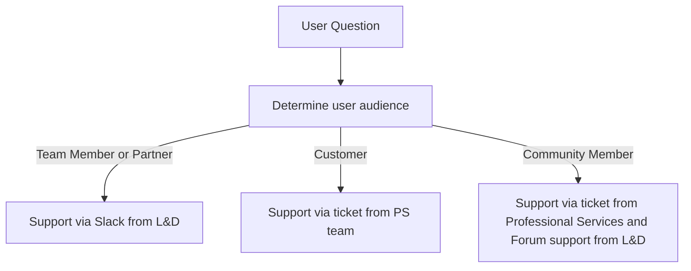
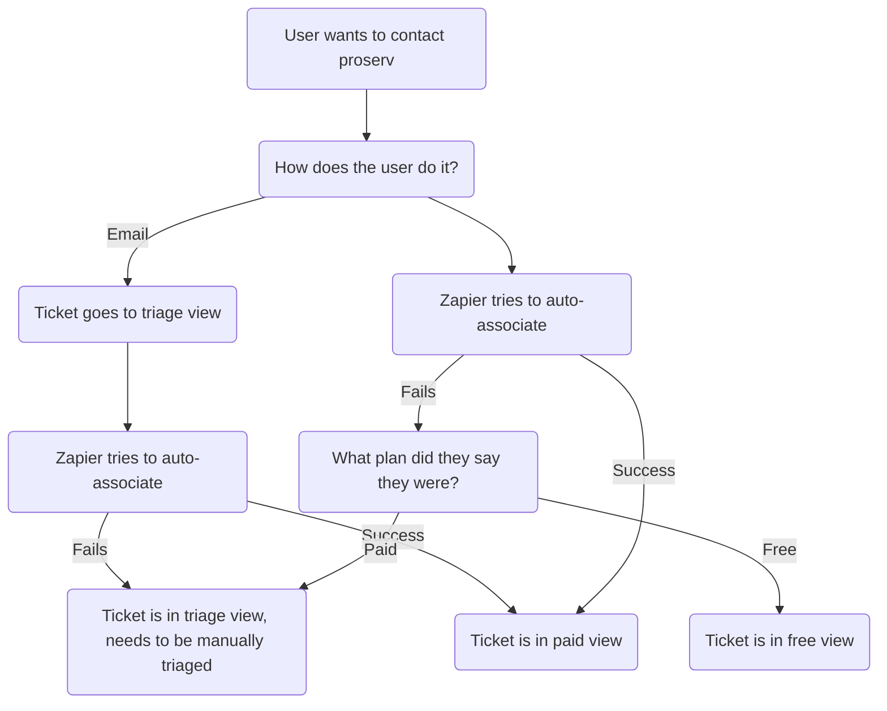
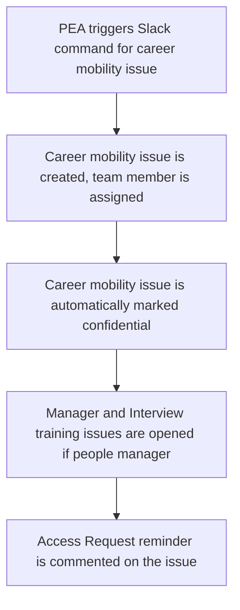
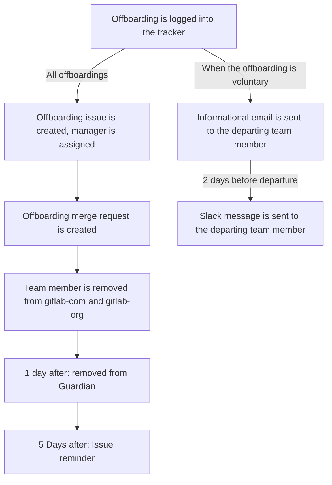
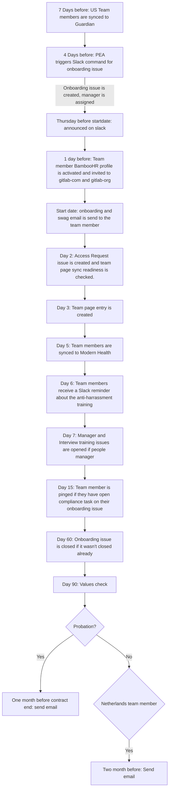
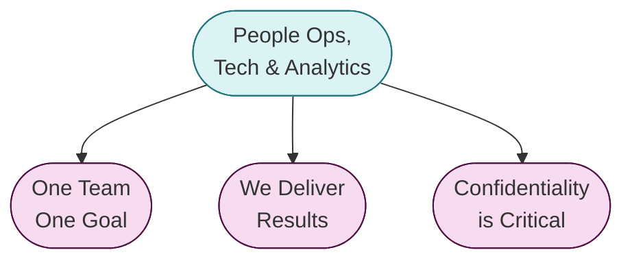
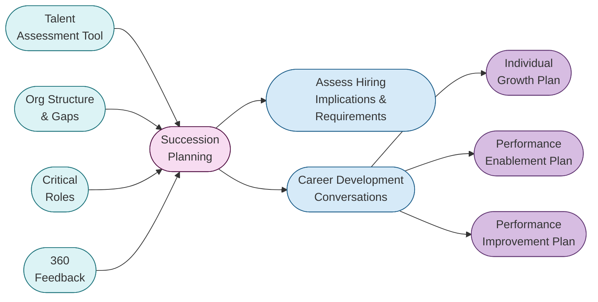

## Disaster Recovery Plan

When a natural disaster or weather event occurs in a location that is near the home of a team member, the People Specialist and People Experience Teams (known as the People Operations Team) will send a notification email to all relevant team members, using the [template](https://gitlab.com/gitlab-com/people-group/General/-/blob/master/.gitlab/email_templates/natural_disaster_notification.md) found in the People Group project.   

What is a natural disaster and when do these policies go into effect?  Generally speaking a natural disaster is an event which has the potential to pose a significant threat to human health and safety, property, critical infrastuctures and national security. These natural disasters may come without any warning or they could be driven by seasonal weather patterns.  Different countries around the world have various ways of declaring an "Natural Disaster".  For example the office of [Disaster Management in India](https://ndma.gov.in) is responsible for managing and declaring Natural Disasters.  In the United States of America the [Department of Homeland Security](https://www.dhs.gov/natural-disasters) is responsible for making these Disaster declarations and the federal response.

### Team member assistance

GitLab reimburses ground transport to all team members to get out of the location they are in, via a vendor of choice e.g.: Uber/ Taxify/ Lyft/ Via etc. to a safe location.  Team members should use expensify for all reimbursements. 

### Time Off From Work

Team members should focus on the safety of their families and themselves first and leverage GitLab's [time off policy](/handbook/paid-time-off/). Your manager may contact you on a relatively frequent basis while you are out, just to ensure you have everything you need during this time.

### Team member resources

We understand that these events can be extremely stressful for team members and their families. We encourage all team members to utilize our Modern Health services. Modern Health is a company-sponsored, confidential and free resource available to you and your dependants. Services include confidential counseling, financial information and resources, legal support and more. Please refer to our [Modern Health](/handbook/total-rewards/benefits/modern-health/) page in the handbook for more details.

If you have any questions about team member benefits coverage, please contact our total rewards team at total-rewards@gitlab.com

### People Operations Team procedures for Disaster Recovery Plan

1. We get notified of these incidents and disasters by team members affected as well as other team members at GitLab. We also have an automated bot that feeds the #disaster-recovery-plan slack channel, from the [Global Disaster Alerts and Coordination](https://gdacs.org/). We do not react the green or orange notifications, but do react and action any alerts that are highlighted as "red". 
1. Helpful tools for identifying a disaster
    - [Google Public Alerts](https://google.org/publicalerts/map)
1. This is a shared task amongst the overall People Operations Team, a member on this team will reach out in the timezone of the team members affected by a natural disaster/ etc. via email. 
1. Pull a report from BambooHR utilizing cities, states, countries or locality.
1. Compare this report to the team page, identify if anyone is missing.
1. Please review the template before sending and add country/ location specific links and information. You can use one of the templates available [here](https://gitlab.com/gitlab-com/people-group/people-operations/General/-/tree/master/.gitlab/email_templates).
1. To protect team member's privacy, only one email will be sent to all affected team members' Bcc'd. Please also cc `peoplepartners @gitlab.com`, `peopleops @gitlab.com` and `people-exp @gitlab.com`.
1. Send a separate email to the affected team members managers using this [template](.gitlab/email_templates/disaster_recovery_manager_email.md), CC'ing `peoplepartners @gitlab.com`, `peopleops@ gitlab.com` and `people-exp @gitlab.com`.
1. A Slack message will also be posted on the location Slack channel and if unavailable in the #team-member-updates channel or direct message. 
1. Once the emails have been sent, post a message in the `#disaster-recovery-plan` Slack channel, listing the number of team members affected. This channel will include leaders of legal, security and the people team. The People Operations or People Experience team will update the channel on their course of action and whether all team members have been reached during this process.
1. Using the previous BambooHR report, create columns for `email sent` and `team member responded` to manage the different affected team members responses (via email or Slack).
1. If there is no response from the team member/s within 24 hours, the People Operations Specialist and People Experience teams will send an email to the team member/s personal email address. Due to the vast number of time zones we operate in, and for transparency, please always cc peopleops@ gitlab.com in all communications.
1. If there is still no response after 48 hours, a People Operations Specialist or People Experience Associate will reach out to next-of-kin (this info can also be found in BambooHR) via email, and if no response, followed by a phone call. The People Operations Specialist or People Experience Associate will inform the team member's manager and [aligned People Business Partner](https://about.gitlab.com/handbook/people-group/#people-business-partner-alignment-to-division) on the current status. 
1. If there is no response after 72 hours, a People Operations Specialist or People Experience Associate will attempt to reach out via email and phone (as needed) to all emergency contacts listed in BambooHR.

---
layout: handbook-page-toc
title: "People Experience Team"
description: "This page lists all the processes and agreements for the People Experience team at GitLab."
---

## On this page
{:.no_toc .hidden-md .hidden-lg}

- TOC
{:toc .hidden-md .hidden-lg}

# People Experience Team

This page lists all the processes and agreements for the People Experience team. 

If you need our attention, please feel free to ping us on issues using `@gl-people-exp`.

# People Experience Team Availability

Holidays with no availability for onboarding/offboarding/career mobility issues:

| Date    | Reason |
|------------------- | --------------|
| 2021-11-29 | Family and Friends Day
| 2021-12-27 | Family and Friends Day
| 2022-01-03 | Family and Friends Day


### OOO Handover Process for People Experience Team

When going out of office, the People Experience Associate will open a PEA Handover OOO [issue](https://gitlab.com/gitlab-com/people-group/people-operations/General/-/blob/master/.gitlab/issue_templates/PEA_OOO_Handover_Issue.md).
1. Get assistance from the People Operation Specialist team for extra support.
1. For confidential items/tasks, please create a Google doc, share with the team, and link to the issue.

# People Experience Team Processes

The People Experience Associate will attempt to solve queries within the specific time zones and relevant SLA's. 

If the People Experience Associate is unable to complete a specific/urgent task, please post in the `#pea-team` Slack channel. Please handover any important tasks/messages to the next team member available. 

### Bi-Weekly Rotations 

Bi-Weekly, the People Experience Associate will open a [PEA Rotation Issue](https://gitlab.com/gitlab-com/people-group/General/-/blob/master/.gitlab/issue_templates/Weekly-Rotation-PEA.md).. This rotation issue lists what tasks the PEA will be accountable for, for the next 2 weeks. 

The following factors are considered when allocating in the issue:
- Scheduled PTO 
- The listed Tasks are split  fairly
- The use of PEA/POps Task Tracker to divide certain tasks

**The PEA will complete the below tasks within the designated SLA**
- Verification Of Employment 
- Anniversary Queries
- Other requests that come through the People-Exp email. 

#### Allocations for Onboarding

- Not time zone specific to ensure that all Associates learn all aspects to different countries during onboarding. 

#### Allocations for Offboarding

- Team has 12 hours to create and notify of the offboarding issue.
- Due to different time zones, the offboarding issue creation and task completion can be tagged team by the Associates. 

#### Allocations for Career Mobility 

- We always try and split evenly and fairly. 

### Audits and Quarterly Rotations

#### Issue Audits for Compliance

There are certain tasks that need to be completed by all the different departments and team members and we as the People Experience Team need to ensure to remain compliant in line with these tasks. Herewith a breakdown of the important compliance and team tasks:  

- Onboarding
This will be the responsibility of the People Experience Associate that is assigned to the specific team members onboarding. 

    - Ensure that the new team member has shared a screenshot of their FileVault disk encryption and computer serial number in the onboarding issue. 
    - Ensure that the new team member has acknowledged the 'Handbook' compliance task in the onboarding issue. 
    - Ensure that the manager tasks are completed prior to and after the new team member has started. 
    - Ensure that an onboarding buddy has been assigned to assist the new team member. 
    - Ping the relevant team members to call for a task to be completed in the onboarding issue.

- Offboarding

This will be the responsibility of the People Experience Associate that is assigned to the specific team members offboarding. 

    - Ensure that all the different departments complete their tasks within the 5 day due date. 
    - Immediate action is required from the People Experience Team and the IT Ops Team once the issue has been created. 
    - Ping the relevant team members to call for a task to be completed in the offboarding issue.
    - Confirm that a departure announcement has been made in #team-member-updates on Slack.

- Career Mobility 

This will be the responsibility of the People Experience Associate that is assigned to the specific team members career mobility issue. 

    - Check to see whether the team member that has migrated needs any guidance.
    - Ensure that the previous manager and current manager completes their respective tasks. 
    - The issue should be closed within 2 weeks of creation, ping the relevant team members to call for a task to be completed in the issue.

### Onboarding Audit

Cadence: Each new joiner.

This is a manual review of each new joiner's BambooHR profile that takes place within their first week of employment. This audit is intended to correct any profile errors and, for US team members only, to check that the I-9 has been completed and sort each team member into the correct Benefit Group. This task is handled by the respective People Experience Associate in the relevant rotation.

#### Audit Steps 

The People Experience Associates do not have full access to audit team members of the People Group. Please reach out to the BambooHR Provisioners for further assistance. 

#### Who to Onboard 

Check [Bamboo Onboarding Report](https://gitlab.bamboohr.com/reports/custom/Onboarding+Report/1966) to find out the list of new hire for the week or the relevant [issue board](https://gitlab.com/gitlab-com/team-member-epics/employment/-/boards/3350022) by use of the onboarding audit labels.

Note: Only the owner of the BambooHR report has power to edit the dates on the report for the current week so the issue board is the best way to view current team members who need the audit completed.

#### Process 

- Open the respective onboarding issue for the team member
- Log into BambooHR and check that team member has inserted their date of birth (check the information updates Inbox as there may be a pending request to update this information). Ping the team member on day 2 if this field has not been completed.
    - For US team members, ensure that the Social Security Number has been inserted correctly (xxx-xx-xxxx) (the dashes needs to be included to ensure that the sync to ADP happens with no issues)
- After verifying date of birth and SSN (if applicable), complete the following:

* Go to the team member’s Bamboo Profile > click “More” > Onboarding
* Import from template
* Go through each of the Onboarding Tasks

#### Audit Personal Tab

* DOB Audit: Check off if date of birth has been completed
* SSN Added?: Check off Social Security Number field (if applicable)
* GitLab Username: Check the GitLab username is correct in BambooHR by cross referencing the team members username in the onboarding issue. Update if not correct in BambooHR. The GitLab username is case sensitive but the `@` symbol is not necessary.

#### Audit Job Tab

* Start Date Audit: Documents tab > check that the signed contract is in the “Contracts & Changes” folder. 
   * Effective Date, Hire Date, Compensation & Job Information Effective Date, Employment Status: Check the hire date on the contract. If it is different, go back to the folder and search for a date change confirmation file (usually uploaded by Candidate Experience Specialist). 
   * If the signed letter is not in the folder: go to Greenhouse > search for team member > Activity Feed > Find CES > ping CES on Slack and ask for the date change confirmation to be uploaded.
* Division, Department, Cost Center: Should be the same as the manager’s.
    - ** Note in some instances the Department may differ to the managers. Please reach out to **BambooHR Provisioners** for further clarity if this should differ or whether this should be updated to match the manager. 
* Entity Check: Check to be sure that the team member was hired into the correct entity based on location and role. 
* [Payroll Type](https://about.gitlab.com/handbook/people-group/employment-solutions/): 
   - For all the entities the payroll type is Employee
   - For Remote and Global Upside it should be Employee-PEO
   - For Safeguard & CXC it should be Contractor-PEO 
   - For IT BV it should be Individual Contractor
* Audit Compensation:
   * Fill out the [onboarding calculator](https://docs.google.com/spreadsheets/d/1pch83tg59hEC-xnAzMuAOd6Da5GOAsnFBQ-1HNPbjtI/edit#gid=0)
   * Cross-check calculator results against Compensation, Pay Frequency, On Target Earnings, Currency Conversion fields
   * For Non-Sales, “On Target Earnings” should say “No”, no need to add the date
   * Effective Date should be the hire date.
   * Exchange Rate Effective Date is going to be 2020-12-01 until we revisit this again in 2021
   * Equity: Audit Shares field against contract or Greenhouse details.
   * Job Information: cross-check against contract 
   * If title has a speciality, add it under “Job Title Speciality”, for example, “Backend Engineer, Verify” - “Backend Engineer” will go under “Job Title” but “Verify” will go under “Job Title Speciality”
* Audit Options and Job Codes: audit job title and job code against this [list](https://docs.google.com/spreadsheets/d/1wUIvWrjErlGIlRLANomwqrQYOHPsklggATFbo0lElpU/edit#gid=1539740034)

#### Access Level Audit 

The Access Level field should only be updated if the team member is a manager or higher (leader, exec). If they are an IC, you can leave the level as is. The People Experience Associates do not have access to the `Access Level` field in BambooHR - this check should be left unchecked for the BambooHR Provisioners to complete in instances where the team member is not an IC.

**Process for BambooHR Provisioners:**
* Job tab > Settings icon > BambooHR Level:
* For Employees who are Managers of people: "Managers"
* For Contractors (independent or corp-to-corp): "Contractor Self-Service"
* For Contractors who are Managers of people: "Multiple Access Levels": "Contractor Self-Service" and "Managers"

#### Audit Locality & Region

* Personal tab > Audit Locality to match the city: 
* Check if the locality is on Greenhouse (Candidate City + URL for compensation calculator). If not:
* Check [distance of city to locality on Google Maps](https://www.google.com/maps/). Distance should not be more than 1 hour and 45 minutes during rush hour (8AM). Change the time to 8:00AM
* Audit Region

#### Sales Geo Differential

* Personal tab > Sales Geo Differential
* For non-sales : n/a Comp Calc
* For sales: pick the sales zone as per the [Location Factors Sheet](https://docs.google.com/spreadsheets/d/1wUIvWrjErlGIlRLANomwqrQYOHPsklggATFbo0lElpU/edit#gid=2134917912)

#### Payroll Change Report

The People Experience Associates have no access to this report. The **BambooHR Provisioners** will complete the following:

Reports (black heading on BHR) > Standard reports > Payroll change report > Change the date for the week > tick the team member’s name

#### Update GitLab and Turn off Notifications

* Go back to the onboarding issue of the team member >  complete the respective BambooHR related tasks 
* Turn off notifications for those team members that you aren't the assigned Experience associate for
* Be sure to update the onboarding audit label from `:: Waiting` to `:: Complete` 
* For **non-US team members**, there is no need to tag anyone from payroll in the issue

#### Only For US Team Members:

Wait for People Experience Team to tag you on the team member’s onboarding issue. Only audit the profile once the SSN has been added to the account. If not, comment on the onboarding issue and remind the team member on their 2nd day to add their SSN. 

**Additional steps to audit the profile of US team member:**

* SSN added?
   * Personal tab > make sure “National Identification Number Type” and “National Identification Number” are filled out
* I-9 Field
   * Personal tab > Once the SSN has been added, tick the I-9 Processed checkbox 
* Benefit Group
   * Check team member’s state (under Personal tab) against the [Benefit Group Cheat Sheet](https://docs.google.com/spreadsheets/d/1QU2rsFrrKSRQIrzWu2eqylK0HrNvt9FUhc_S5VQAVJ4/edit?ts=5d922f86#gid=0).
   * Update the Benefit Group in the `Benefits` tab to reflect the appropriate group
* Sync Employee to PlanSource Field (on Job tab) > tick PlanSource checkbox once you have updated Benefit Group.   
* Ready to Add to ADP
   * Comment on the onboarding issue, tagging US payroll Specialist to add to ADP.

#### Referral Bonus Audit
Cadence: Weekly

The People Experience team will be pinged in the `#peopleops-alerts` Slack channel to complete an audit of whether referral bonuses have been added to the referring team members profile in BambooHR (for referring new hires for the last 3 months). This is part of an [existing automation](https://about.gitlab.com/handbook/people-group/engineering/slack-integrations/#referral-bonus-reminders). 

The People Experience Associate will open the Greenhouse entry to confirm whether a referral was made for the new team member. If yes, proceed to the BambooHR profile of the referring team member and verify that a bonus has been added correctly as per the [referral requirements](https://about.gitlab.com/handbook/incentives/#referral-bonuses). 

**Over and above these audits, the Compliance Specialist will perform their own audits to ensure that certain tasks have been completed.**

#### Payroll Changes Report Audit
Cadence: Weekly

BambooHR creates a standard Payroll Change report to capture any changes processed on a team member's profile.

Process for auditing:

* At the end of each week, the BambooHR Provisioner downloads a csv of the payroll changes report through that day from BambooHR and imports it into the 'Payroll Changes Report Audit' spreadsheet in a new tab labelled with the corresponding date.
* Add a column for checkboxes and filter out any "Time off Taken" change types.
* Review each change captured in the report to ensure the change was intentional, inputted correctly, and proper processing was followed for the change. Once the change has been reviewed, it can be checked off on the report.

#### Emergency Contact Audit

A Sisense notification will be sent to the People Experience team everytime there is a missing BambooHR Emergency Contact. The People Experience Associate in the respective rotation will send an email using the [template](https://gitlab.com/gitlab-com/people-group/people-operations/General/-/blob/master/.gitlab/email_templates/missing-emergency-contact.md) available to notify team members to add their Emergency Contacts.


#### Quarterly Audits

These are audits that the People Experience Team will complete on a quarterly basis. The Sr. People Experience Associate will open the issue each quarter for these audits.

- Onboarding Issue Audit

The first quarter of the year (February 1 to April 30)
PEA team will need to perfom an audit on the tasks in this issue.

    - ensure compliance pieces are up-to-date
    - add any additional tasks based on OSAT feedback
    - remove any tasks that are unnecessary 
    - go through open issues to close/reach out

- Offboarding Issue Audit

The second quarter of the year (May 1- July 31)
PEA team will need to perform an audit on the tasks in this issue.

  - ensure de-provisioners are correctly listed
  - ensure systems are up-to-date
  - ensure tasks PEA tasks are up-to-date
  - remove any tasks that are unnecessary
  - go through open issues to close/reach out

- Career Mobility Audit

The third quarter of the year (August 1- October 31)
PEA team will need to perform an audit on the tasks in this issue

      - ensure compliance pieces are up-to-date
      - review and if applicable, apply, feedback from the career mobility survey
      - remove any tasks that are unnecessary
      - go through open issue to close/reach out

- Code of Conduct & Acknowledgement of Relocation Audit

The People Experience Team will complete a quarterly audit of which team members have not yet signed the Code of Conduct and Acknowledgement of Relocation in BambooHR. 

    - A quarterly report will be pulled from BambooHR for `Code of Conduct 2021` and `Acknowledgement of Relocation 2021` by the Associate in the respective rotation to check that all pending team member signatures have been completed. 
    - If it has not been signed by the team member, please select the option in BambooHR to send a reminder to the team member to sign. Please also follow up via Slack and ask the team member to sign accordingly.  **Reminder to not send reminders to team members on unpaid or parental leave**
    - If there are any issues, please escalate to the People Experience Team Lead for further guidance. 

- Anniversary Gift Stock Audit

The People Experience Team will complete a quarterly stock audit of the anniversary gift items in Printfection. To check to see what the current stock levels are, follow this process:

- Log into [Printfection](https://app.printfection.com/account/secure_login.php)
- Click on `Inventory`
- Then select the `Inventory levels` tab
- Scroll to find the applicable items (Tanuki Confetti Socks, Box Cut Vest, Travel Bag / Backpack)
- Once you click on the specific item, it will let you know how many stock items are currently available for the specific swag

If the stock is low/depleted, we will proceed with placing an order for new stock to the warehouse as follows:

- Log in to [Printfection](https://app.printfection.com/account/secure_login.php)
- Click on `Inventory`
- Select `Replenish Inventory`
- Click on `Green Replenish Inventory` button
- Complete the normal online ordering process (will be further updated when we need to order replenished stock)

- Access Level Audit

Cadence: Every Quarter / As per requirement of Security Audit Team

This audit is meant to identify and fix errors that occur during onboarding, termination, promotions, relocation, country conversion and any other changes that take place throughout the year to a team member's access level in BambooHR profile. This audit is handled by the BambooHR Provisioners. 

Process:

* Create a Manual Report using New Report Option. Name it as “Access Report.”
* This report should have the following fields in sequence:
    1. Employee #
    1. Last name, First name
    1. Work Email
    1. Status
    1. Hire Date
    1. Self-service access
    1. Job Title
    1. Reporting to
    1. Payroll Type
    1. Role
* Keep a count of the no. of people shown in the report. (A)
* Go to the “More” option and “Export Report as.” “Excel.”
* Go to Access Level - GitLab Google Sheet » File » Import » Upload » Select a file from your device » Insert New Sheet(s) » Import data
* Rename the new sheet in the following syntax - Access Level - 
* Add two new fields at the end of the report viz “Access Level” and “Additional.”
* Apply filter » Self-service access » Uncheck Yes » OK. Count the number of Team Members. (B)
* Once this selection is applied. You will get Future joining Team Members details and test accounts. Delete them all and turn off the filter. Count the no. of team members and note the same (C). This number should be (A) minus (B)
* Turn on the filter » Payroll Type » Uncheck Employee & Employee-PEO » OK.
* Fill “Contractor self-service” in the Access Level column for all the team members.
* Turn off the filter » Create a filter » Role » Uncheck Individual Contributor
* For Non-Contractors the “Access Level” will be Managers but for Contractors the “Access Level”  will be Contractor Self Service and “Additional” field should be Managers.
* Go to Settings » Access Levels » Levels. Here you will see all the special access levels with names.
* Select the special access levels one by one and check the team members profile mentioned in that level. Update their “Access Level” in the report accordingly.
* Turn off the filter » Search the name one by one » Update their Access Level according to the profile in the Access Level & Additional Column. Use “;” for multiple access levels.
* For rest of the team members fill the Access Level with “Employee self-service”

Note: A terminated team member on Garden Leave will still have the access level to prevent reporting issues. To prevent the access, IT Ops turns off the access via Okta manually as BambooHR is still active for team members.


### Weekly Reporting

#### Pulling of BambooHR Onboarding Data

Every Monday and Wednesday, the Associate in the rotation will pull the report that has been shared in BambooHR called `New Hires`. The data for the next 2 weeks will be added to the spreadsheet to ensure sufficient time in completing the pre-onboarding tasks. 

1. Open BHR and select the Onboarding Tracker Report
1. Click on the hire date until it is showing the hire dates in order
1. Highlight and copy the data of all the new hires starting the next week and following 
  - Keep name format as (Last Name, First Name)
1. Paste the data into the People Experience Onboarding Tracker at the bottom 
1. If a name is highlighted, this means the name is already on the tracker. Review that the hire date is the same and delete the highlighted field you just added. 
1. If the name is not highlighted this is a new add and keep the name on the tracker. 
1. **Important, if the team member is located in Japan, please immediately proceed with sending the required payroll documentation to the new hires personal email address.** Include Non US Payroll in the email correspondence for visibility. 

#### Weekly Moo Invites

Every week on Tuesday, the People Experience Associate in the rotation will send the invites to the new team members starting that week.
1. The  People Experience Associate will log into Moo
1. Go to Account
    1. On the left hand side, click People
1. Click the box that says, Invite A Person
1. Add the team member's first name, last name, work email
1. Select `employee` 
1. Send Invite

### Monthly Reporting

#### Retaining & Purging Form I-9

Per the [USCIS (United States Citizenship and Immigration Service](https://www.uscis.gov/i-9-central/complete-correct-form-i-9/retention-and-storage), form I-9, which is completed for all US-based team members, must be retained and purged according to the USCIS retention policies.

**Form I-9 must be retained as long as a team member is Active. If a US-based team member is Inactive, Form I-9 must be purged 3 years after a team member's start date _or_ 1 year after their departure date, whichever is later.**

Example 1: Team member Marie Curie's start date was 2017-01-01 and she departed the company on 2021-06-01. Her Form I-9 must be purged after 2022-06-01.

Example 2: Team member Matt Gandhi's start date was 2019-06-01 but he departed on 2019-12-15. His Form I-9 must be purged after 2022-06-01.

1. The People Experience team must run a monthly report in BambooHR to show all Inactive US-based team members and compare it to Guardian's Inactive team member report. 
1. The People Experience team confirm the correct purging dates in the Guarding report using the above formula to calculate how long Form I-9 must be kept for the relevant team members and then purge them after the calculated time period. 
1. When a team member has passed a purging date, the People Experience team must:

    - Login to Guardian and go to `Administration`.
    - Click on `Purge Data`
    - Select `Purge Employees & I9 Data` from the drop down
    - Click on the check box by the former team members name
    - Then click` purge` 
    - Review the team member's Verification folder in BambooHR to ensure that no form I-9 copies are present. Delete form I-9 if found. Receipt and confirmation of work eligibility do not need to be deleted.

### Letters of Employment and Employee Verification Requests

This lists the steps for the People Experience team to follow when receiving requests:

#### Letters of Employment 

Team Members are able to request a Letter of Employment using the [documented form](/handbook/people-group/frequent-requests/#letter-of-employment) for this purpose.  Once submitted they will receive an auto-populated document utilising the data housed in BambooHR i.e. compensation; length of tenure; nature of employment (full or part-time) etc. along with an indication that GitLab is an all remote company.

#### Employee Verifications

We may be contacted by different vendors who require a team members employment to be verified along with other personal information. 

Most importantly, check to see whether authorisation has been received from the team member that we may provide the personal information. If no authorisation form is attached, make contact with the team member via email or Slack to get the required consent. 
- If the vendor is asking for general information in the email, simply respond back to the email with the requested information. 
- If the vendor is requesting a form to be completed, complete the form via Docusign and encrypt the document before sending via email. 
- If the vendor is requesting a form to be completed for a US team member, forward this request on to the US Payroll team to have completed. 
- If you need additional figures that we do not have access to, send a message in the `payroll-peopleops` Slack channel to request the information needed to complete the form. 

In some instances, we may be contacted by certain Governmental institutions asking for clarity into termination / seperation reasons and agreements of a team member. Please forward these emails to the relevant People Business Partner that submitted the offboarding notification, as they will have full context into the reasons and agreements and will choose to respond if needed. 

#### Probation Period Rotation

The People Experience Associate in the `Probation Period` rotation, will complete the full process as per the steps listed in the [Probation Period](/handbook/people-group/contracts-probation-periods/#probation-period) section of the hanbook. If the weekly rotation has come to an end and not all confirmations have been received, the Associate in the next weeks rotation will follow up with team members managers.

#### Netherlands Certification of Good Conduct (VOG) Report 

THe first day of the month, the People Experience Associate in the assigned rotation, will ensure that the new Netherlands based team members hired in the previous month have uploaded their VOG. 

- There is a shared report in BambooHR called Netherlands VOG. Open that report.
**note** If need be, please adjust the dates by editing the report. 
- View the employees listed.
- Go to each team members profile, then to documents, then go to either employee uploads or contracts folder. Check for the letter.
- If a letter has been uploaded, there is nothing further you will need to do.
- If there is not a letter, please reach out to the team member to have them upload the letter. 

#### Deleting Team Member Data from Letter of Employment Rotation

Once a week, the People Experience Associate in the `deleting team member data` rotation will delete team members data submitted on the Letter of Employment response spreadsheet for the previous week.

### OSAT Team Member Feedback

Once a new team member has completed their onboarding, they are asked to complete the `Onboarding Survey` to share their experience. Based on the scores received, the People Experience Associate assigned to the specific team members onboarding, will complete the following:

- Score of 4 or higher: use own discretion based on the feedback received and see whether there are any improvements or changes that can be made to the onboarding template / onboarding process (this can be subjective). 
- Score of 3 or lower: reach out to the team member and schedule a feedback session to further discuss their concerns and feedback provided. 

### Onboarding Buddy Feedback

In the same survey, new team members are able to provide a score and feedback on their onboarding buddy. If the score and feedback received is constructive and valuable insights when the score is low, the People Experience Associate assigned to that specific team members onboarding, should reach out to the manager of the onboarding buddy and provide feedback in a polite and supportive way.  

### Onboarding Cohort Creation

During the last week of the month, the PEA in the assigned rotation will create a new slack public channel for the next month by following the below steps: 

1. Create a new public slack channel with the naming convention `month-year-new-hire-lounge` and add in the People Experience team to start
1. Next, you'll want to go into the `donut` app in Slack and select `Donut Channel Settings` and this will pop open in a new window
1. Navigate to the `Templates` tab on the top of the page, find `New Hire Cohort Watercooler` and select `Preview` then `Use Template`
1. Select `Use an existing channel`, type in to find the newly created slack channel you just made and select `Add Donut Channel`
1. You'll want to make sure that the Program Basics are set up to twice a week (Tuesday and Thursday) and the Next Send Date is for the first Tuesday of the month and that the Intros option is toggled to `On`. Hit `Save`. 
1. Next you'll want to navigate to the Topics Queue tab and select Shuffle to mix up the questions from all the different packs. 
1. You're going to create 4 (or 5, depending on how many weeks the month has) custom questions by clicking `Add a Topic` near the top of the page. All 4 of these are going to be the same question of `Do you have any questions regarding GitLab onboarding?` and feel free to add a fun gif to the prompt as well. 
1. You'll want to make sure that your 4 custom prompts are the questions for the Thursdays within the first month. After the first month, every prompt will be a purely social one. You can organize the prompts by dragging and dropping the questions to be in the order you'd like them to be. Remember to hit `Save` at the top of the page once done.
1. The last step for the Donut set up you'll need to do is locate the `Access` tab and make sure to add the entire People Experience team to the list of people who can modify the donut settings. Hit `Save`. 
1. Next, we'll want to set up a Slack Workflow so that anyone who is added to the slack channel will get [this message](https://gitlab.com/gitlab-com/people-group/people-operations/General/-/blob/master/.gitlab/email_templates/onboarding-cohorts-intro-slack-message.md). 
   - Open Slack
   - Select GitLab -> Tools -> Workflow Builder
   - Make sure you're on the `Templates` tab and select `Set up` on: A warm welcome for new teammates
   - Input the monthly onboarding cohort slack channel
   - Select `Edit` on the message text box and copy/paste the [intro message](https://gitlab.com/gitlab-com/people-group/people-operations/General/-/blob/master/.gitlab/email_templates/onboarding-cohorts-intro-slack-message.md) making sure to format it correctly to be visually pleasing. 
   - Rename the bot from `Welcome Bot` to `(Month) Onboarding Cohort Welcome Bot`
   - Hit Publish

### Anniversary Period Gift Process

People Experience Team process:
- Create the Anniversary Gift reports in BambooHR. You will create three serperate reports for 1, 3, and 5 year anniversaries. 
    This report should be formated: First Name, Prefered Name, Last Name, Hire Date, and Work Email
- Copy and Paste the reports into Google Sheets, and create three seprate tabs. These tabs will be named 1, 3, and 5 year anniversary. 
    Make sure to put 1 year anniversary in the 1 year  tab, and so on.  
- Log into [Printfection](https://app.printfection.com/account/secure_login.php)
- Click on `Campaigns` and select `Congrats on your (blank) anniversary`. There are 3 options, 1st, 3rd, 5th.  
- Select `Giveaways` and scroll to `Campaign summaries` section
- Click on the relevant campaign and then select the `Manage` tab
- Select the `Generate More Links` green button - Ensure you are in the correct Campaign - (1st, 3rd or 5th Year)
- Enter the number of links you would like to generate and click `Add links`
- Download the CSV of the links generated

- Import the CSV to the People Experience Team Google Drive `Anniversary Gifts 2020` folder
- Name the CSV to the applicable month that you are generating for
- Pull a report from BambooHR for all team members that only shows anniversary dates for the current month, utilizing filters within the BambooHR. 
- Add the list of names to the generated links sheet
- Select Add-Ons in the sheet > select Document Studio from the dropdown > open
- Select `Mail Merge with Gmail` and use the visual editor option to see the current text 
- Edit the relevant text applicable to the specific gift option and ensure that the fields are all correct
- Ensure to mark the ones that are not applicable to the email with an X in the Document Studio columns
- Once ready, click on `Ready to Merge` > Send emails now > Save 
- That's it! All team members will now be able to claim their anniversary swag

Tip for Printfection Site: Star and bell the relevant campaigns applicable to our team for further ease to search for. 

### Printfection Report for New Hire Swag

When a new team member starts, the New Hire Swag email is sent with a link to Printfection where new team members can order their swag. To keep track of the orders, the PEA will run a weekly report on Friday's. Please see the below steps on how to process the report:

- Log into Printfection 
- Click Report at the top right corner
- Select Run Orders Report
- Select "Welcome New Hire" from the drop down on the left hand side of the page under Campaign
- Click Generate Report at the top of the page
- You can download the report as a CSV and compare the report to the new hires for the week on the Onboarding tab of the People Operations/People Experience Associate tracker.

Should the PEA find any abuse of the link, they will need to report to the Manager, People Operations as well as the Senior Manager of Brand Activation.  

### TaNewKi Call Invites

The PEA in the rotation should review the onboarding tracker and send [email invitations](https://gitlab.com/gitlab-com/people-group/people-operations/General/-/blob/master/.gitlab/email_templates/tanewki_welcome_call.md) to new hires for the Ta'NEW'ki welcome call 2 weeks before their start date, if applicable.

### Regeling Internet Thuis form

New team members based in the Netherlands will send an email to people-exp@gitlab.com with the Regeling Internet Thuis form. The People Experience team will then forward this form to the payroll provider in the Netherlands via email. The contact information can be found in the People Ops 1Password vault, under "Payroll Contacts".

### Pulling Social Call Metrics 

The People Experience Associate will assigned to this task, will pull this report the first week of the month.

1. Open People Ops Zoom Account
1. On the left side, Under Admin > Click on Dashboard
1. Click on Meetings 
1. Select Past Meetings
1. Adjust the Calendar to reflect the timeframe (it will only work for one month) > Done
1. Type in the search bar the meeting ID - This can be found on the calendar invite. > Search
1. Select Export
1. Go to the downloads page. It will take a few minutes for the report to be ready, refresh your page if it is not loading. 
1. C+P this data into the `New Format` tab in the All-Time Data for Take a Break-Social Call Google Sheet. This is saved People Experience Google Shared Drive. 
1. You will need to do this for each of the topics (Open Topic, Gaming, FitLab, Parenthood, Mental Health Social Hour) 
1. Lastly, you'll open up a [new issue](https://gitlab.com/gitlab-com/people-group/people-operations/General/-/issues/new?issue%5Bmilestone_id%5D=) to summarize the metrics for the previous month tagging the whole team. 

### Slack Admin

The People Experience team have admin access to Slack and can assist team members with any PTO queries as per the process listed on the PTO Handbook [page](https://about.gitlab.com/handbook/paid-time-off/#instructions-for-people-ops-and-total-rewards-to-update-pto-by-roots-events). 

The People Experience team will also receive notifications of any news items from Slack, as well as sync issues between BambooHR and PTO by Roots. When receiving the email about issues with the sync, the People Experience Associate will verify whether it is a specific issue or whether it is related to a recent offboarding of a team member or if it is related to team members starting that week. The sync takes about 24 hours when it will then update to remove/add the specific team members. 

### Access Request Templates

When a new tool is [added to the Tech Stack](https://about.gitlab.com/handbook/business-technology/team-member-enablement/onboarding-access-requests/access-requests/#adding-access-request-process-for-a-new-item-in-the-tech-stack), the People Experience team is automatically pinged in the Access Request to create the relevant MR adding the tool to the offboarding template. 

- Important to check whether the tool should be in the main offboarding issue or if only a certain department/team will have access to the tool, in which case, this can be added to the specific department template. 

### Bonus Processing

Bonus Processing is completed by the Experience Associate who is on that rotation for the week via the issue. Below are the various types of bonuses that need to be processed.

#### Referral Bonuses

1. The Experience team will receive an email titled `Table Reminder: Referral Bonus` 
1. From here, the PEA will review the BambooHR profile of the team members in the email to ensure that bonus amount is correct for those they referred
1. After confirming the bonus amount is correct, the PEA will add the bonus information to the appropriate payroll changes spreadsheet (US, Non-US, or Canada)
1. Afterwards, adding the information into the payroll spreadsheet, be sure to edit the bonus line in BambooHR and add `Paid` to the beginning of it. 
1. Reply all in the email with "This has been processed." This step is to make the team aware that action has been taken on the `Table Reminder: Referral Bonus` email

#### Discretionary Bonuses 

1. Discretionary bonuses go through approvals via the Nominator bot. The Experience team will be notified of bonuses that need to be approved in the private slack channel `people-group-nominator-bot`
1. The PEA should review the nomination based off the criteria [here](https://about.gitlab.com/handbook/incentives/#valid-and-invalid-criteria-for-discretionary-bonuses) and make sure it's an appropriate bonus to approve - if there are any questions, make sure to ask for any clarification in the thread.
   - If for any reason, the bonus does not meet the criteria - reject the bonus in the slack channel and communicate to the nominator about why.
1. If the bonus meets the criteria, the PEA will approve the bonus in the slack channel and this feeds into BambooHR. You'll want to double check to make sure everything fed over correctly. 
1. After confirming everything fed over from the bot to BamboohR, the PEA will add the bonus information to the appropriate payroll changes spreadsheet (US, Non-US, or Canada)
1. Lastly, add a checkmark or any other emoji onto the Approval in the bot to signal that you have in fact completed this nomination and it's been processed.

_Note: If you received the same nomination twice (for the same person and the same reason), you may reject one. When you do this, please reach out to the team member who submitted the nomination to explain, and include the other nominator's name in the #team-member-updates announcement See more details in section for [multiple discretionary bonuses](/handbook/incentives/#multiple-discretionary-bonuses)._

#### Working Group Bonuses

1. [Working Group bonuses](https://about.gitlab.com/handbook/incentives/#working-group-bonus) are done through BambooHR and not the bot. The Experience team will receive an email from BambooHR saying there is a bonus that needs approval
1. The PEA will review and approve or deny the bonus in BambooHR 
1. Next, the PEA will add the bonus information to the appropriate payroll changes spreadsheet (US, Non-US, or Canada)

#### Acting Manager Bonuses

1. TBD

### 1Password Complete Recovery

As admins for 1Password, the People Experience team will get notified when an account recovery is requested by the IT Ops team. We do not need to take any action on these and can safely delete/ignore the email. The IT Ops team will complete the recovery.

### Legal Name Change Processing

Please follow process outlined [here](https://about.gitlab.com/handbook/people-group/frequent-requests/#name-change).

### Requesting signatures via DocuSign

We use [DocuSign](https://app.docusign.com/home) to request signatures on documents and follow the below process:

1. Click: Start > send an Envelope > get from cloud > google drive > select documents
1. Tick: Set signing order > Add recipients name and email > click ‘add recipient’ for additional signatories in relevant signing order
1. Email message (edit, if applicable): Hi {signatory}, please could you sign this document. Please let me know, if you have any questions. Kind regards, {your name}
1. Click: Next
1. Select signatory’s name in top left
1. Drag ‘signature’ and ‘date signed’ etc. to appropriate fields
1. Click: Send

---
layout: handbook-page-toc
title: "Engagement"
description: "GitLab uses engagement surveys to allow team members to provide feedback and leadership to gain insight."
---

## On this page
{:.no_toc .hidden-md .hidden-lg}

- TOC
{:toc .hidden-md .hidden-lg}

### Engagement Survey Overview

Team Member Engagement is important to the continued success of GitLab making the Engagement Survey an important element within the annual `People Group` calendar.  Engagement strategies have been shown to reduce attrition; improve productivity and efficiency; further embed the company values and ultimately enhance role satisfaction.  

We partner with [CultureAmp](https://www.cultureamp.com/) to run our Engagement Surveys. CultureAmp provides a platform to gather feedback confidentially, benchmark against external comparables, and uses algorithms to highlight which areas matter most to our team members.  

Engagement surveys are geared toward giving team members an opportunity to provide feedback in terms of their experience within GitLab touching on pertinent elements such as `Company Culture`, `Teamwork`, `Management` and `Wellbeing` among others.  

Feedback from the survey in turn allows Leadership within GitLab to gain insight into what is most important to team members, in particular what the business is doing well and what may need future iteration with the intention of improving the underlying team member experience and ensuring healthy levels of attrition are maintained.

#### Survey Confidentiality 
In an effort to ensure team member confidentiality is upheld, only managers with >5 respondents will be able to view quantitative results - this is carried across to demographic filtering in teams with population sizes which exceed the minimum too. The survey is wholly administered by Culture Amp on a secure external website and the survey data will not be stored on any local computer. If you'd like to know more, check out CultureAmp's [FAQ guide](https://support.cultureamp.com/hc/en-us/articles/204529829-Survey-participant-FAQs).


#### Survey Sections and Factors
The GitLab Team Member Engagement Survey is comprised of eleven sections each of which is aligned to a specific area of focus otherwise known as a factor.

The survey factors for FY19 through FY21 were as follows with each section including three to eight questions - the most recent survey was comprised of fifty-four questions in total building out the original forty-six to include insight gathering around COVID-19.  The format of the survey was predominantly Likert or Rating Scale with a handful of free text questions or comments toward the end. The favorable score is the percentage of participants who selected 'agree' and 'strongly agree'.
1. Section 01: GitLab Overall
1. Section 02: Company Confidence
1. Section 03: Our Leaders
1. Section 04: Your Manager
1. Section 05: Teamwork
1. Section 06: Your Role
1. Section 07: The Culture
1. Section 08: Growth and Development
1. Section 09: Wellbeing COVID-19
1. Section 10: Action
1. Section 11: Comments (Free Text)

### FY'22 Pulse Engagement Survey 


#### How We Determine "Pulse" Survey Questions

In FY'22 Q4 we launched our first "pulse" survey. To determine these questions we leveraged a combination of Culture Amp's "impact" feature + recommended focus areas + key themes related to the [Great Resignation](https://www.cultureamp.com/blog/the-great-resignation-turnover) (according to Culture Amp’s People Scientist teams) to determine which rating questions to include in the pulse survey.

Per CultureAmp’s insights related to the Great Resignation, we added questions related to:
- Focus on “Your Manager” (feedback from Manager, and overall manager performance)
- Inclusion
- The 5 overall Engagement factor questions

Culture Amp determines which questions are "focus recommendations" based on: impact on overall, favorable score, comparison to benchmarks. [Here](https://support.cultureamp.com/hc/en-us/articles/115001544965-Focus-Agent-Summary) is more information on how Culture Amp determines "focus" recommendations.

"Impact" is a word we use to refer to a statistical technique called a driver analysis. People Intelligence relies on a lot of data and analysis techniques, and one of the most powerful is Driver Analysis. Driver Analysis lets you focus on the most important drivers of outcomes for your culture. The questions that are identified as the top drivers are the questions that are most likely having the biggest impact on Engagement (or whatever measure you have set up as your outcome). So if you were able to improve your scores on these questions, you are likely to improve your Engagement score. You can find more information on how "impact" is determined [here](https://support.cultureamp.com/hc/en-us/articles/208026545-Impact-and-driver-analysis-FAQs).

In addition to leveraging insights from our Engagement Survey tool, Culture Amp, the People Group may add in a couple of additional questions particularly relevant to current business priorities, changes, and/or challenges. 

#### FY'22 Pulse Engagement Survey Questions
The FY'22 Pulse Engagement Survey included 19 rating questions and 3 open ended text questions. A complete list of questions can be found [here](https://docs.google.com/document/d/1i25j1t55NK48bkT2MJh-05pSOcKKU3QMrU5D4wknS5w/edit#).

#### FY'22 Pulse Engagement Survey Timeline

* 2021-11-04: Pulse Survey launch @ 8am PT
* 2021-11-18: Pulse Survey close @ 11pm PT
* 2021-11-22: High-level summary shared with CPO and PBPs
* 2021-11-29: High-level summary shared with e-group
* 2021-12-01: High-level summary release (company-wide)
* 2021-12-03: E-group division-level summary release 
* 2021-12-08: Training video (updated as needed) and results handbook update
* 2021-12-10 through 2021-12-31: Functional group action planning
* 2022-01-21: Functional action plans added to FY'23 Q1 OKRs and CultureAmp Action Planning Module added by E-Group leader and managers

_Note: Only team members hired on or before October 15, 2021 will be eligible to participate in the Pulse Engagement Survey._

#### Taking Action
Once the GitLab Team Member Engagement Survey has been closed out, reports will be dissementated to the E-Group and Divisional Heads for review i.e. only those with team populations >5.  These will form the basis of discussion when collaboratively compiling the people strategy for year ahead in conjunction with additional data such as attrition reports etc.

##### Timeline for Action Planning

* Each E-Group member will in collaboration with their respective People Business Partner (PBP) to identify one or two acton items to initiate coming out of the results review - these will be tracked and managed within CultureAmp moving forward using the [Action Framework](https://academy.cultureamp.com/hc/en-us/articles/115005387945-Take-action-with-action-framework).
* After action items have been identified at the E-Group level, all managers who recieved an engagement survey result report (AKA: managers with 5+ direct reports who responded to the survey) will also be asked to create an action plan in Culture Amp.  
* A manager may choose to align their action planning to their leader or division or they may choose to add a specific and separate action for their team. This will likely depend on the size/structure of the organization. 


#### Resources for Managers

[Managers Guide to Taking Action](https://academy.cultureamp.com/hc/en-us/articles/207302419-Manager-s-guide-to-taking-action-on-Engagement-survey-results)

[Take Action with Action Framework](https://academy.cultureamp.com/hc/en-us/articles/115005387945-Take-action-with-action-framework)


## Previous Engagement Survey Results 

### FY' 21 Engagement Survey
The GitLab Team Member Engagement Survey for 2020 (FY21) ran from 2020-11-16 to 2020-12-15 - questions and fine details can be found in the [following planning issue](https://gitlab.com/gitlab-com/people-group/General/-/issues/931).

Bar those who joined on or after 2020-11-01 the survey was extended to all GitLab Team members for completion.  Participation for the FY21 survey closed out at 92% with 1,127 team members having taken part.


#### Benchmarking and Reporting
The FY21 survey was benchmarked against New Tech 1,000+ 2020 in addition to being reviewed against the preceeding years results.  Preliminary reports were released on 2021-01-08 painting a broad overview afterwhich individual divisional reviews will take place in collaboration with the [People Business Partners (PBPs)](https://about.gitlab.com/job-families/people-ops/people-business-partner/) and respective Group Leaders.

#### Company Results (Overall)

| **Favourable** | **Neutral** | **Unfavourable** |
|---|---|---|
| 81% | 14% | 5% |

The benchmarked favourability score for New Tech 1,000+ 2020 was 73% placing GitLab 8% higher than the norm for this particular bracket.

#### Top Three Scores

| **Factor** | **Favourability Rating** |
| --- | --- | 
| Your Manager | 88% | 
| Wellbeing COVID-19 | 85% | 
| Culture | 84% | 


| **Question** | **Favourability Rating** |
| --- | --- |
| I am proud to work for GitLab | 93% |
| I feel supported when I need to take time off or make use of flexible working arrangements | 93% |
| I know how my work contributes to the goals of GitLab | 93% |

GitLab was rated between 5-13% percent higher than the industry benchmark i.e. New Tech +1,000 2020 across all three questions detailed above.

#### Bottom Three Scores

| **Factor** | **Favourability Rating** |
| --- | --- | 
| Our Leaders | 79% | 
| Growth & Development | 70% | 
| Action | 54% | 


| **Question** | **Favourability Rating** |
| --- | --- |
| I have been provided an opportunity to see and discuss prior engagement survey results  | 60% |
| The Learning & Development programs provided by GitLab help me grow my career | 47% |
| I have seen positive changes since the previous engagement survey | 39% |

GitLab scored 5% below the industry benchmark i.e. New Tech +1,000 2020 for the lowest scoring question surrounding positive changes however there was no comparative for the other two questions.

#### FY' 21 E-Group Focus Areas

- Action (though action is our lowest score we have seen improvement year over year and will continue to focus on this area)
- Growth & Development
- Compensation
- Resource Allocations

#### Questions and Support
The GitLab Team Member Engagement Survey is managed by the `People Operations Specialists`, if you require support or have any questions around the survey please be sure to reach out via `#people-connect`.


### FY' 20 Engagement Survey
The GitLab Team Member Engagement Survey for 2019 (FY20) ran from 2019-10-14 to 2019-11-04 - questions and fine details can be found in the [following planning issue](https://gitlab.com/gitlab-com/people-group/General/-/issues/503).

Bar those who joined on or after 2019-10-01 the survey was extended to all GitLab Team members for completion.  Participation for the FY20 survey closed out at 87% with 812 team members having taken part.

#### Benchmarking and Reporting
The FY20 survey was benchmarked against New Tech Size >500 2019 in addition to being reviewed against the preceeding years results.  Preliminary reports were released in the week of 2019-11-07 painting a broad overview afterwhich individual divisional reviews will take place in collaboration with the [People Business Partners (PBPs)](https://about.gitlab.com/job-families/people-ops/people-business-partner/) and respective Group Leaders.

#### Company Results (Overall)

| **Favourable** | **Neutral** | **Unfavourable** |
|---|---|---|
| 88% | 9% | 3% |

A benchmarked favourability score for New Tech Size >500 2019 was not available for this particular survey.

#### Top Three Scores

| **Factor** | **Favourability Rating** |
| --- | --- | 
| Culture | 87% | 
| Your Manager | 87% | 
| Teamwork | 86% | 


| **Question** | **Favourability Rating** |
| --- | --- |
| I would recommend GitLab as a great place to work | 95% |
| GitLab is in a position to really succeed over the next three years | 94% |
| I am proud to work for GitLab | 94% |

GitLab was rated between 11-17% higher than the industry benchmark i.e. New Tech Size >500 2019 across all three questions detailed above.

#### Bottom Three Scores

| **Factor** | **Favourability Rating** |
| --- | --- | 
| Your Role | 84% | 
| Growth & Development | 80% | 
| Action | 46% | 


| **Question** | **Favourability Rating** |
| --- | --- |
| I believe action will take place as a result of this survey  | 64% |
| I have been provided an opportunity to see and discuss prior engagement survey results | 46% |
| I have seen positive changes since the previous engagement survey | 29% |

GitLab scored 15% below the industry benchmark i.e. New Tech Size >500 2019 for the lowest scoring question surrounding positive changes however there was no comparative for the other two questions.

#### FY' 20 E-Group Focus Areas
- Taking action from areas guided by the GitLab Team Member Engagement Survey Results.
- Managerial encouragement of Team Member development.
- Total Compensation.

### FY' 19 Engagement Survey
The GitLab Team Member Engagement Survey for 2018 (FY19) ran from 2018-10-14 to 2018-11-04 - questions and fine details can be found in the [following planning issue](https://gitlab.com/gitlab-com/people-group/General/-/issues/240).

Bar those who joined on or after 2018-08-17 the survey was extended to all GitLab Team members for completion.  Participation for the FY19 survey closed out at 94% with 308 team members having taken part.

#### Benchmarking and Reporting
The FY19 survey was benchmarked against 2018 New Tech Size - Large Companies (500+).  Preliminary reports were released in the week of 2018-11-06 painting a broad overview afterwhich individual divisional reviews will take place in collaboration with the [People Business Partners (PBPs)](https://about.gitlab.com/job-families/people-ops/people-business-partner/) and respective Group Leaders.

#### Company Results (Overall)

| **Favourable** | **Neutral** | **Unfavourable** |
|---|---|---|
| 83% | 12% | 5% |

The benchmarked favourability score for 2018 New Tech Size - Large Companies (500+) was noted at 70% i.e. 13% lower than that of GitLab overall.

### Top Scoring Factors

| **Factor** | **Favourability Rating** |
| --- | --- | 
| Company Confidence | 84% | 
| Management | 84% |
| Collaboration and Communication | 84% | 
| Work / Life Balance | 84% | 

| **Question** | **Favourability Rating** |
| --- | --- |
| I am proud to work for GitLab | 95% |
| I know how my work contributes to the goals of GitLab | 94% |
| GitLab is really in a position to succeed over the next three years | 93% |

GitLab was rated between 4-14% percent higher than the industry benchmark i.e. 2018 New Tech Size - Large Companies (500+) across all three questions detailed above.

### Bottom Three Scores

| **Factor** | **Favourability Rating** |
| --- | --- | 
| Alignment and Involvement | 74% | 
| Feedback and Recognition | 63% | 
| Action | 41% | 


| **Question** | **Favourability Rating** |
| --- | --- |
| I believe my total compensation (base salary+any bonus+benefits+equity) is fair relative to similar roles at other companies | 43% |
| My manager or someone else has communicated clear actions based on recent team member survey results | 33% |
| I have seen positive changes taking place based on recent employee survey results | 32% |

GitLab scored 12% below the industry benchmark i.e. 2018 New Tech Size - Large Companies (500+) for the lowest scoring question surrounding positive changes however there was no comparative for the other two questions.

#### FY' 19 E-Group Focus Areas
- Taking action from areas guided by the GitLab Team Member Engagement Survey Results.
- Managerial encouragement of Team Member development.
- Total Compensation.

## People Operations Procedures 

### How to add sub-departments or other demographics not found in BambooHR

1. Open CultureAmp > Settings > Data Intergrations 
1. Select the blue `Sync Data` button 
1. Select Partial Upload
1. Click on Export Users > Export 
1. Update the information on the spreadsheet
1. Upload the spreadsheet into CultureAmp 
1. Select Next (bottom right corner)
   -  If you select Sync it will only Sync with BambooHR, regardless if you uploaded a file. 
1. Select Import Data 

You have now updated a demographic in CultureAmp! 

---
layout: handbook-page-toc
title: Talent Assessment 
description: "Overview of three critical pieces of GitLab's talent development program: performance, growth, and key talent."
---

## On this page
{:.no_toc .hidden-md .hidden-lg}

- TOC
{:toc .hidden-md .hidden-lg}

# Talent Assessment Program 
 
### Purpose

The purpose of the Talent Assessment Program is to identify and retain team members who drive the success of our organization. This is a top priority and strategic process for people managers at GitLab. Our Talent Assessment Program (which is a critical piece of our overall [Talent Development Program](/handbook/people-group/talent-development-program/)) serves as a mechanism to help mitigate a couple of our biggest company risks: [lack of performance management](/handbook/leadership/biggest-risks/#underperformance) and [losing key people](/handbook/leadership/biggest-risks/#key-people-leave). 

Additional key benefits of the Assessment Program include:

- Help facilitate career development conversations (and ensure they're occurring regularly)
- Ensure transparency and ongoing feedback between team members and their managers
- Discuss promotion readiness and plan promotions
- Succession planning
- Increase awareness of top talent across departments (during calibration sessions)


### Overview 

There are many talent assessment options, and we have opted to use a Performance/Growth Matrix (commonly known as "9-Box" in the US) and annually review Key Talent. 

GitLab's Performance/Growth Matrix is a type of talent assessment that forms part of our [Talent Development Program](https://about.gitlab.com/handbook/people-group/talent-development-program/). 

In addition to assessing Performance/Growth, we annually review Key Talent aligned with the criteria outlined below on this page. The combination of Performance/Growth and Key Talent assessments allow us to identify team members who drive the organization’s success and use our engagement tools to retain them. 


# The Performance/Growth Matrix

| Performance ↑ <br> Growth →  | **Developing Growth** | **Growing Growth** | **Exceeding Growth** |
|-----------------|---------------|---------------|----------------|
| **Exceeding** | **Box 5** Team member is performing well in their current job but needs to continue to grow in current role, or has not exhibited the willingness or ability to grow in the current role.| **Box 2** Team member performs well in their current job, makes valuable contributions and consistently demonstrates competencies required. They have shown willingness and/or ability to further grow in their role and they may be ready to take on additional responsibilities in the next 12 months. | **Box 1** Team member is developing faster than the demands of their current position and/or division. Team member has been given additional assignments and has demonstrated high-level commitment/achieved significant results. Team member is ready to broaden their skill set and take on significantly greater scope and responsibility |
| **Performing** | **Box 7** Team member is currently meeting expectations of their role. Team member is not willing or able to absorb greater scope, impact or complexity. | **Box 4** Team member is currently meeting expectations and has shown willingness or ability to further grow; may not be ready to absorb greater scope, impact or complexity in the next 12 months. | **Box 3** Team member is contributing as expected and is meeting performance expectations. They have shown willingness and/or ability to further grow in their role and they may be ready to take on additional responsibilities in the near future. |
| **Developing** | **Box 9** Team member is not meeting performance expectations and there is still more to learn in the current position. Team member has not been in the position long enough to adequately demonstrate the pillars of growth for a sustained period of time, or they do not have the willingness to further grow. | **Box 8** Team member has not been in the position long enough to adequately demonstrate their capacity (promotion, new to the role), or may have lost pace with changes in the organization. The team member has shown the willingness and/or ability to grow in the role. | **Box 6** The team member is not meeting the requirements of their current role, but has demonstrated willingness and ability to extend beyond scope once ramped, and/or is showing the willingness and ability to grow further with additional guidance or direction. The team member could be more successful in the current role with more direction/time to ramp, or in another role or department that more appropriately suits their skill set.|


This matrix is an individual assessment tool that evaluates both a team members current contribution to the organization and their potential level of contribution.
It is commonly used in succession planning as a method of evaluation an organization's talent pool, identifying potential leaders, and identifying any gaps or risks.
It is regularly considered a catalyst for robust dialogue (through a calibration process) and is considered more accurate than one person's opinion.
The performance/growth matrix can be a diagnostic tool for career development.

The matrix serves as a tool to help managers assess, develop, and coach their team members - ultimately resulting in an ability to more effectively and efficiently lead teams.

## What is "Performance"?

Performance includes both results and behaviors, and is broken into three areas: Developing, Performing, and Exceeding.

### Developing

**Please note that `Developing` should not be automatically associated with underperformance. As highlighted below, `Developing` can also be used for new hires or newly promoted team members that are still ramping up in their new roles. Your manager will provide example and detail to ensure the rationale behind the `Developing` rating is communicated.**

Based on the Job Family responsibilities, [values](https://about.gitlab.com/handbook/competencies/#values-competencies) and [remote working competencies](https://about.gitlab.com/handbook/competencies/#remote-work-competencies), team members in this category are not meeting all of the expectations. There is still more to learn and improve on in the current position to achieve the desired results. This may be due to the following: 

- The team member has not been in the position/at GitLab long enough to adequately demonstrate performance.
- The team member has been recently promoted and needs time to ramp up performance in the new role. 
- The team member may have lost pace with changes in the organization. 
- The team member is not committed to the job responsibilities and/or GitLab. 
- The team member finds it difficult to perform work in a way that is aligned with our values and/or competencies. 
- The team member's performance is aligned to our values and competencies, however, they lack results for Job Family responsibilities. 
- Team member was part of a recent [transfer](https://about.gitlab.com/handbook/people-group/promotions-transfers/#department-transfers) and is still learning how to be successful on their new team.

Examples: 

- The team member needs a lot of guidance from the manager with the majority of tasks to understand requirements and deliverables expected.
- The team member has not been in the position long enough to adequately demonstrate their capacity. For example, the team member was recently promoted or has changed roles and needs more time to ramp up.
- The team member is missing important due dates which is affecting the team, GitLab and/or customers. 
- The team member still needs to adapt remote working best practices. For example, the team member does not manage their own time or work to achieve results or may have difficulty with asyncronous communication. 
- The team member lacks (a part of) the knowledge, skills and abilities which are required for the role, resulting in a low quality of work being delivered.
- There is a significant mis-alignment (I.E. The team member struggles to collaborate with others, the team member does not work iteratively and key metrics are impacted, etc.) 

### Performing

Based on Job Family responsibilities, [values](https://about.gitlab.com/handbook/competencies/#values-competencies) and [remote working competencies](https://about.gitlab.com/handbook/competencies/#remote-work-competencies) team members in this category are “on track” and meeting all expectations. They can independently and competently perform all aspects of the Job Family responsibilities in a way that is aligned with our values and competencies. Their performance consistently meets the requirements, standards, or objectives of the job, and they can occasionally exceed expectations. They deliver results in a timely and accurate fashion. This performance may be expected as a result of: 

- The team member is consistent and stable in their performance.  
- The team member has the required knowledge, skills and abilities to perform in the role successfully and also applies values and competencies in their work.
- The team member has adapted to remote working and their knowledge, skills, and abilities align seamlessly to their role at GitLab. 

Examples: 
- Team member is a dependable member of the team. Their manager can trust them to achieve key metrics.
- Team member consistently works in accordance with our value and remote working competencies. 
- While consistently meeting expectations, the team member does not regularly exceed expectations.
- Team member does not frequently express interest in additional projects, responsibilities, or work outside of their immediate scope.
- The team member is exemplifying our values in their work, but might have some competencies to improve on. 

### Exceeding

Team members that are exceeding consistently surpass the demands of their current position. They demonstrate unique understanding of work beyond the assigned area of responsibility. They contribute to GitLab’s success by adding significant value well beyond Job Family requirements, [values](https://about.gitlab.com/handbook/competencies/#values-competencies), and [remote working competencies](https://about.gitlab.com/handbook/competencies/#remote-work-competencies). This performance may be expected as a result of: 

- Individual is developing more quickly than the demands of their current position. 
- They rise to the challenge when give additional assignments and achieve significant results.
- A “go-to” team member for their peers for tough problems and day-to-day guidance.
- High commitment and engagement to GitLab combined with extensive knowledge, skills, and abilities to perform in the role. 

Examples: 

- Constantly seeks opportunities to improve both self and organization. 
- The team members exemplify great ways of giving and receiving feedback - incorporating this directly in their work. 
- The team members are ambassadors for the values, take full ownership of delivering projects, and very rarely miss due dates. 

**Please note that an `Exceeding` assessment for the performance factor does not guarantee a promotion. While the performance factor is a consideration, there are several considerations that are reviewed when evaluating promotion readiness. Please work with your manager to align expectations.** 

### Expected Distribution Performance/Growth Company-Wide

Performance: 
- **Developing**: 10-15%, not yet meeting all of the expectations 
- **Performing**: 60-65%, “on track” and meeting expectations 
- **Exceeding**: 25%, consistently surpasses the demands of their current role

Growth:
- **Developing**: 10-15%
- **Growing**: 60-65%
- **Exceeding**: 25%

### The Performance Factor

While the primary objective of the performance axis of the Performance/Growth Matrix is to calibrate team member performance, this axis of the matrix also directly impacts the [Performance Factor](/handbook/total-rewards/compensation/compensation-review-cycle/#performance-factor), which is a determining factor in the annual compensation review. Please reference the [Total Rewards Performance Factor page](/handbook/total-rewards/compensation/compensation-review-cycle/#performance-factor) for more detail on compensation impact.

### Measuring Performance

How can managers determine whether their team members are Developing, Performing, or Exceeding? "The Performance Factor" is determined from several components outlined below. It is _optional_ to use [The Performance Factor Workheet](https://docs.google.com/spreadsheets/d/1HHe-Vb6y6F4HXsek3sObV4IVNAGaTvXGi_9fbatT0Uo/edit#gid=241716076) for weighing the different Performance Factors.

#### Job Family Responsibilities and Functional Competencies

Performance against Job Family responsibilities, requirements, performance indicators, and functional competencies (if applicable) should be weighted at 60%. 

* Review Job Families: Look at the Responsibilities section and how your team member is performing against those responsibilities 
    * Example: [Software Engineer in Test](/job-families/engineering/software-engineer-in-test/#responsibilities)
* Review Performance indicators per Job Family: Look at the Performance indicators.
    * Example: [Software Engineer in Test](/job-families/engineering/software-engineer-in-test/#performance-indicators)
* _(if applicable)_ [Functional Competencies](/handbook/competencies/#functional-competencies)

For management roles, please also review and consider the [levels](/company/team/structure/#levels) outlined in the Organizational Structure. 

#### GitLab Competencies

Performance against these competencies should be weighted at 40%. 

* [Values Competencies](/handbook/competencies/#values-competencies)
* [Remote Working Competencies](/handbook/competencies/#remote-work-competencies)
* _(if applicable)_ [Manager and Leadership Competencies](/handbook/competencies/#manager-and-leadership-competencies) 

## What is "Growth"?

While performance is focused on the past and present, growth is focused on the future. Because of the nature of the future-focus associated with growth, it is more difficult to measure than performance, and inherently more qualitative than quantitative. A key element in determining growth is the manager and leadership observation and experience working with team members. Managers can gauge team member growth against the expectations in their current role or their growth to take on different roles across GitLab. 

Growth refers to the ability and desire of a team member to successfully assume increasingly more broad or complex responsibilities and learn new skills, as compared to peers and the roles' responsibilities outlined in their respective Job Family. This could include the growth to move up to the next level in their job family, and/or a lateral move. 

The Growth assessment helps managers determine the best growth trajectory for their team members. The growth assessment will be used as input to leverage our engagement tools, offer lateral and upwards career opportunities and do succession planning.

Growth *can change* over time as team members develop new interests, as new opportunities for growth arise, and as team members continue to broaden their knowledge, skills, and abilities. 


### Measuring Growth

There are four primary pillars to consider when measuring growth:

| "Growth" Pillar | Definition |
| --------------- | ----------------- |
| Adaptability | Demonstrating a willingness and ability to learn new skills and apply them to be successful under new, tough, or difficult conditions. |
| Expandability | Expandability outside their areas (laterally or vertically), with the willingness and ability to take on a role of greater complexity, impact, and scope |
| Consistency | Demonstrating effective problem-solving capabilities, the consistent delivery of results over time in changing circumstances, and dependability in the commitments you make. |
| Self-Awareness | The depth to which an individual recognizes skills, strengths, weaknesses, blind spots, and is able to reflect and act to improve and invest in their own development. Judgment in decision-making is also a key element of self-awareness. Judgment can be seen through our level of self-awareness in several ways, including communication, collaboration, and results. Judgment can be defined as "The ability to make considered decisions or come to well thought-out conclusions", and to do this effectively, we need to have a heightened sense of self-awareness in terms of how our communication will come across and how decisions and conclusions drawn will impact others and their willingness to collaborate. |

Below under each pillar there are a few questions that managers should consider when assessing team member growth. Please note that the answer to all of these questions does not have to be `yes` to determine a team member is "exceeding" growth, the questions are here to help guide managers through the thought and evaluation process.  

#### Adaptability

1. Does the team member adapt to change well? (I.E. realignments, management changes, company changes, etc.)
1. Does the team member seek to learn new skills to further succeed in their role?
1. Has the team member demonstrated ability to learn new things effectively under pressure?

#### Expandability

1. Does the team member demonstrate interest in other areas outside of the immediate scope of their role?
1. Does the team member invest time in learning new skills that will help them grow (laterally or vertically)?
1. Has the team member volunteered for any "stretch" projects or initiatives? 
1. Does the team member coach, mentor, and/or influence others? 

#### Consistency

1. Does the team member consistently deliver results?
1. Does the team member follow through on their commitments? 
1. Is the team member dependable? 
1. If scope or timeline change, does the team member communicate the change and provide updates to stakeholders? 

#### Self-Awareness

1. Does the team member respond to feedback aligned with our [Receiving Feedback Guidelines](/handbook/people-group/guidance-on-feedback/#receiving-feedback)?
1. Does the team member acknowledge their strengths and areas of improvement?
1. Does the team member work towards closing gaps for their improvement areas? 
1. Does the team member demonstrate sound judgment in their decision-making?

### Growth Output

After assessing team member growth based on the four pillars outlined above, managers can determine whether team member growth is currently developing, growing, or exceeding. 

#### Developing

"Developing" growth generally refers to a team member who is not working at full growth against the roles and responsibilities outlined in their Job Family. There could be a variety of reasons for this, including:

* They are new to their role and did not have the time to demonstrate willingsness and/or ability aligned with the pillars of growth
* Lack of motivation to learn new skills or take on new projects
* Motivated to do what is needed in current job, not in what is required in a higher level
* Not expressing interest or demonstrating desire to move up or laterally 

Please note that "developing" growth *does not* equate to "developing" performance, but correlates with the pillars of growth outlined in the "measuring growth" section below. 

Examples:
- A team member is recently promoted or is new to the company, and hasn't had sufficient time to demonstrate the pillars of growth for a sustained period of time (and at the new level, if recently promoted) 
- A team member has actively expressed that they do not have an interest in learning new skills or take on new projects. In a day-to-day they show self-awareness but they have not shown great adaptability, expandability and consistency to further expand on their role and responsibilities. 

#### Growing

"Growing" growth generally refers to a team member who is growing in their current role and demonstrating interest in advancing (up or laterally) and they exhibit knowledge, skills, and abilities that indicate this. Team members with "growing" growth generally:

* Show interest in areas outside of their immediate scope occasionally
* Are comfortable in their current role
* Are a stable counterpart for other team members (especially for peers and more junior team members)
* Learn and apply new skills when the job calls for it; apply lessons learned to enhance success

Example: 
- A team member has demonstrated adaptability and expandability but has not been consistent in their results or self-awareness. This holds the team member back from growing to a higher level or taking on more complex responsibilities in their current role. 

#### Exceeding

"Exceeding" growth generally indicates that a team member will be ready for promotion within the next year (or when an opportunity arises). "Exceeding" growth team members:

* Frequently seek involvement in stretch project/projects outside of their scope
* Invest in their development; seek feedback to improve and applies that feedback on the job
* Demonstrate ability to learn new skills
* Actively pursue increased opportunities to influence decisions and inspire others

Example: 
- A team member has consistently and proactively looked for opportunities to fill gaps and take on stretch projects. When another team member left the team, you leaned on this team member to help keep projects moving forward until you found a suitable backfill. They regularly ask for feedback from peers and adapt their approach accordingly. This has given your team member skills beyond their current job requirements, and broader understanding of the business.

## Calibration Session Guidelines

The portion of the Performance/Growth matrix that often entails the most significant time commitment is the live calibration session of team members with leadership. The calibration session is very valuable to ensure consistency across the Job Family and level, raise any questions, and provide cross-departmental and/or cross-divisional feedback on team members to capture the assessment of different managers as opposed to the opinion of the direct manager exclusively. 

### Pre Work

It is **absolutely essential** that managers complete the required pre-work to ensure that the live calibration session is as efficient and productive as possible. Pre work includes:

- For calibration sessions you can leverage [this agenda template](https://docs.google.com/document/d/1zrlZSfdNXpSZ09uvDM71KxH42RWBJxa6U1QTCTw05iI/edit)
- Please ensure that the [Talent Assessment Calibration Sheet](https://docs.google.com/spreadsheets/d/1D8zO_Yat9pMmNoxSh61J4qg1IqRxCBJ58EsPEOOcZK0/edit) (found in the [Resources section](/handbook/people-group/talent-assessment/#resources)) is updated with initial Performance and Growth Assessments prior to the live calibration session. The [Talent Assessment Calibration Sheet](https://docs.google.com/spreadsheets/d/1D8zO_Yat9pMmNoxSh61J4qg1IqRxCBJ58EsPEOOcZK0/edit) will be considered the SSOT for final ratings, while the [agenda document](https://docs.google.com/document/d/1zrlZSfdNXpSZ09uvDM71KxH42RWBJxa6U1QTCTw05iI/edit) serves to help capture the “why” behind changes and provide a format to provide and review pre-work.
- Review the Job Family/Families that will be reviewed in detail
- Review our competencies 
    - [Values competencies](/handbook/competencies/#values-competencies)
    - [Remote work competencies](/handbook/competencies/#remote-work-competencies)
    - [Functional competencies](/handbook/competencies/#functional-competencies) _(if applicable)_
- Review our [Unconscious Bias](https://about.gitlab.com/company/culture/inclusion/unconscious-bias/) handbook page and consider watching our [Recognizing Bias Training](https://about.gitlab.com/company/culture/inclusion/unconscious-bias/#recognizing-bias-training) if you haven't already. 
- Review the [Performance/Growth Matrix Training Information](https://docs.google.com/presentation/d/151ys8xkOak9ifU9IPXQydZ44sb_BoMpMocWmjVonLHE/edit), which delves into definitions for each box. 
- Determine the appropriate box for each of your team members
- Add notes for each of your team members to the agenda, at least 12 hours before the session 
    - An example of notes could include:
        - 2-3 strengths/accomplishments (and supporting examples)
        - 2-3 improvement areas
        - Anything else noteworthy (I.E. recently promoted, COVID impact, etc.)
- Keep the [SBI Model](/handbook/people-group/guidance-on-feedback/#s-b-i-model) (Situation, Behavior, Impact) in mind when adding notes for strengths/accomplishments and improvement areas. Each point should include clear examples and blanket statements should be avoided. 
- Review the notes of your peers for other team members and add feedback/questions/thoughts for discussion
- If you did not attend the people manager live training session in August 2021, please watch the Performance/Growth Training video overview below:

<figure class="video_container">
  <iframe src="https://www.youtube.com/embed/siI3wRtQYQA" frameborder="0" allowfullscreen="true"> </iframe>
</figure>


### Calibration Session

The calibration session is one of the most important pieces of the Performance/Growth Matrix process, as it provides time for managers, their peers, and their manager to calibrate. Below are a few communication guidelines to ensure efficiency and fairness during the calibration session discussion. 

Starting in FY'23, we will implement a formal Talent Assesment tool. For the FY'22 cycle, we will leverage spreadsheets during calibration sessions for Performance, Growth, and Key Talent assessments. 

We ask that you use the [following template](https://docs.google.com/spreadsheets/d/1D8zO_Yat9pMmNoxSh61J4qg1IqRxCBJ58EsPEOOcZK0/edit#gid=0) for Performance/Growth assessment and calibration to ensure a format that is compatible for direct upload to BambooHR to minimize opportunity for error. Please reach out to your [People Business Partner](/handbook/people-group/#people-business-partner-alignment-to-division) if you have any questions.

#### Best Practices

* Be conscious of time and consider setting a (reasonable) time limit per team member being discussed. 
* Review program guidelines and avoid leniency bias.
* Refer to performance data that you may have taken on a team member throughout the past year - including 360 review feedback (if both team member and manager agree to include), performance against metrics over time, key accomplishments, etc.; this will help avoid bias like recency bias or the halo effect. Please note that when reviewing 360 data for the Q4 talent assessment, it's important to take into account areas in which the team member has improved. Two quarters is a fairly significant amount of time and team members have (hopefully) take action on improvement areas during this period, which should be reflected in the assessment. Managers and other participants in calibration discussions should be prepared with this information if asked how they determined a rating. 
* Leaders should feel comfortable highlighting team members in other functions
* Focus on discussing artifacts that are relevant to the performance factor and refrain from discussing artifacts that are not relevant to performance being developing, performing or exceeding. Examples of artifacts which are not relevant: upcoming maternity/parental leave, personal information/home situation or things that were confidentially shared and do not relate to performance. 
* Focus on facts and avoid blanket statements (I.E. [team member] has poor communication)
* **Ask questions and provide feedback!** This may seem obvious, but it is import aspect to help identify any potential bias

##### Who Do I Calibrate?

It is likely not necessary to discuss each team member in detail, particularly for larger groups. Calibration sessions typically focuses on gaps, outliers and areas that might require additional management attention and/or alignment. 

As a best practice, we should calibrate outliers. "Outliers" are typically considered to [Box 1 ("Exceeding Growth" and "Exceeding Performance") and Box 9 ("Developing Growth" and "Developing Performance")](https://about.gitlab.com/handbook/people-group/talent-assessment/). [People Business Partners](https://about.gitlab.com/handbook/people-group/#people-business-partner-alignment-to-division) and business leaders have discretion to expand this threshold as needed, but live calibration for team members in Box 1 and Box 9 should be the baseline across the board. 

A few additional reasons to consider calibrating beyond Box 1 and Box 9 are:

- Team members close to promotion
- Team members who have changed assessments from the previous fiscal year (I.E. "Performing Performance" to "Exceeding Performance")
- Team members in Box 3 ("Exceeding Growth" and "Performing Performance") to highlight potential development opportunities from peer groups
- Outliers based on Performance alone (I.E. everyone "Developing Performance" and everyone "Exceeding performance")

#### Topics To Avoid

While we want to encourage open and transparent conversation during calibration session, there are certain topics that should be avoided to ensure we respect team member privacy.

* Sharing whether team members are currently undergoing [formal performance remediation](/handbook/leadership/underperformance/#options-for-remediation). It is okay to share that team members are receiving coaching, but specifics pertaining to Written coaching, PIPs, etc. should be avoided. 
* Anything related to health (I.E. medical diagnoses, conditions, disabilities, etc.). It is okay to share that team members have a lot going on in their personal lives, but we should not go into detail. _Note that this applies for team member's friends/family as well._

## Identifying Action 

After the calibration sessions the performance and growth outcomes can be used as input for the following: 
* [Career Development Conversations](https://about.gitlab.com/handbook/leadership/1-1/#career-development-discussion-at-the-1-1)
* Promotion planning 
* Identifing [L&D opportunities](/handbook/people-group/learning-and-development/)
* Succession Planning

# Q4 Formal Talent Assessment 

## Timeline
Below is the high level timeline for the formal assessment in FY22-Q4. Different departments may have additional due dates built into the high level timeline, so please follow up with your [People Business Partner](https://about.gitlab.com/handbook/people-group/#people-business-partner-alignment-to-division) if you have any questions. 

- **2021-11-01:** Kick off Assessment cycles for Managers
- **2021-11-08 - 2021-12-03:** Time for calibration and finalising assessments
- **2021-12-06 - 2021-12-09:** Total Rewards and E-Group review
- **2021-12-10:** Final approvals of E-Group
- **2021-12-13 - 2022-01-31:** Managers can communicate Performance/Growth Factors to team members
- **2022-01-01:** Annual Compensation Review Kicks off for Managers

### Cadence

Our e-group completes Performance/Growth Matrix multiple times a year for their direct reports. The rest of GitLab does this _at least_ once per year in Q4, with a recommended informal mid-year checkin. The formal assessment would ideally take place in November prior to the [annual compensation review](/handbook/total-rewards/compensation/compensation-review-cycle/#annual-compensation-review). 

### Eligibility

Anyone hired on or before October 31st is eligible to participate in the Q4 Performance/Growth matrix annual review. However, if the team member being assessed has been with GitLab for a period of 3 months or less, it is likely that these team members will fall into `Developing` for performance and should not expect a compensation adjustment, although they are still eligible to be reviewed.

This is because team members generally need several months to get adjusted to their role and responsibilities, and we ideally would have hired the team member at their accurate market rate. 

While there are exceptions, this is the general guideline. 

### Matrix Assessment Timeline 

The Performance/Growth Matrix typically takes 4-6 weeks to complete from beginning to end. Steps are as follows:

1. Managers complete a Performance/Growth Matrix for their respective teams
1. Live session takes place for calibration with managers up to E-Group level
1. Executive Review (leadership meets to review the matrix results, key talent, promotion requests, development and performance actions, review discrepancies, and measure against previous matrix results)
1. Total Rewards performs an equality review. 
1. Final approval of E-Group member and Total Rewards. 
1. Performance and Growth results are communicated to team members. Managers can leverage [this template](https://docs.google.com/document/d/1XT1l1STUBilDdVGHXlCcmSE5ApxwVqO1Ln4Wk8e1Fpk/edit#) for communication. 
1. Annual Compensation review kicks off after Talent Assessment

## Mid-Year Check In

It is recommended (but not required) that managers have discussions on [Performance](https://about.gitlab.com/handbook/people-group/talent-assessment/#what-is-performance) and [Growth](https://about.gitlab.com/handbook/people-group/talent-assessment/#what-is-growth) with their team members early Q3 prior to the formal assessment in Q4. Benefits to having this second dedicated discussion are:

* To align 
* To provide a space for questions/clarification ahead of the formal assessment 
* To receive feedback from the team member on their own performance/growth 
* To provide feedback to the team member on their performance/growth
* To check in on progress from previous career discussions and goals
* To become more familiar and comfortable with discussing performance and growth

*Please document the mid-year discussion.* While the mid year assessment is not "formal" in the sense that it will not be the final assessment utilized to inform the annual compensation review and there will not be calibration sessions, it is important to capture what was discussed, feedback, and points addressed to help inform future discussions and assessments. This conversation can be documented in your 1:1 document, or alternatively, you may leverage [this template](https://docs.google.com/document/d/1ulyuazZpNAFnoOFDITo4fUHLDAX_bKhr242uG9x4yPE/edit#heading=h.j3xr5kqp6s24). 

#### Timeline

Mid-year conversations should be complete and documented by October 3, 2021 at the latest. Managers have a couple of options in terms of timeline and when to conduct these conversations:

1. Conduct a single conversation on Performance/Growth/and 360 feedback results aligned with the [360 feedback cycle timeline](/handbook/people-group/360-feedback/#timeline-fy22)
1. Conduct two separate conversations (one of Performance/Growth, and another on 360 feedback results after [reports come out](/handbook/people-group/360-feedback/#timeline-fy22)). If this option is chosen, 360 feedback results should be considered and reviewed to incorporate into Performance/Growth documentation after the fact to ensure we do not lose this data point. 

There will be a Manager training session on Performance and Growth delivered by PBPs on  **2021-08-02 (APAC/Americas) and 2021-08-03 (EMEA/Americas)**. "Growth" was previously referred to as "Potential". Training will be provided as we will be implementing "Growth" assessments company-wide this year.

_Note: Not all division chose to participate in the 360 feedback cycle for FY'22. This is completely fine, and we recommend that Performance/Growth conversations are conducted regardless leveraging other feedback and data points pertaining to Performance and Growth._

1. **2021-08-02 (APAC/Americas) and 2021-08-03 (EMEA/Americas)**: Manager training on Performance and Growth delivered by PBPs _(Note: "Growth" was previously referred to as "Potential". Training will be provided as we will be implementing "Growth" assessments company-wide this year.)_
1. **2021-08-04 - 2021-09-10**: Managers begin compiling any relevant data points/information to help facilitate the Performance/Growth and 360 feedback conversation with team members. Team members should also consider and reflect upon their own Performance and Growth ahead of the session.
1. **2021-09-11**: 360 reports become available for divisions that chose to participate. 
1. **2021-09-11 - 2021-10-04:** Manager and team members scheduling a synchronous discussion to discuss and document performance, growth, and 360 feedback results. 

## Communication 

In most companies the Performance/Growth Matrix is used exclusively as a management tool and results are not typically shared with team members. In the spirit of our transparency value, we want to encourage feedback with team members. **Discussion topics that arise during calibration sessions (or at any other point during the assessment process) are confidential. Please do not share with anyone other than each individual team member.**

The guidelines below are general guidelines and recommendations. However, *each department is at liberty to determine what works best for their groups in collaboration with their People Business Partner*. For all groups we recommend that managers communicate Performance and Growth factors. 

## Promotions During Assessment Cycle

The cut-off date to determine whether to assess team members at the pre-promotion level or post-promotion level for the FY'22 Q4 Talent Assessment cycle is **November 1, 2021** aligned with the cycle kick off. Guidelines are as follows: 

1. **If a team member is promoted with an effective date _on or before_ November 1, 2021, they should be assessed at the newly promoted level.** 
    * For example, if a Product Manager is promoted to Senior Product Manager with an effective date of October 15, 2021 in BambooHR (our SSOT for promotion effective dates), they will be assessed at the Senior Product Manager level for the Q4 Talent Assessment.  
1. **If a team member is promoted with an effective date _after_ November 1, 2021, they should be assessed at the pre-promotion level.**
    * For example, if a Backend Engineer is promoted to Senior Backend Engineer with an effective date of December 1, 2021, their pre-promotion assessment at the intermediate Backend Engineer level will remain.

It is important to note that because being promoted recognizes high performance both in terms of increased scope/responsibility and monetarily through compensation increase therefore a **promotion "resets" the performance factor evaluation**. 


## Best Practices for Communicating Performance/Growth Factors

After calibration sessions are done and performance and growth factors are determined, it’s time to communicate the final results with team members (after you have been notified that they have been approved by the E-Group). **Please refrain from communicating Performance factors until approval through the E-group level is communicated.** Having an extensive conversation on performance and growth with your team members is a great way to set them up for success going forward. We also want to take the opportunity to give them a perspective on their career development. Below we will take you through some of the best practices, but remember, if you are even in doubt please reach out to your manager or [People Business Partner](/handbook/people-group/#people-business-partner-alignment-to-division) for support. 

1. **Communicate performance and growth factors face-to-face over Zoom**. As a manager, this is the opportunity for you to have a conversation with your team member about their performance. Having the conversation over Zoom allows for you to have a dialogue with your team member (versus just sharing their performance and growth factor) and allows you to pick up other information, like tone and non-verbal cues which can tell you more about how someone is feeling during this conversation.

1. **Prepare for the call ahead of time.** As a manager, you should have prepared in advance of calibration discussions with your team members. Before communicating a team member’s [performance and growth factors](/handbook/total-rewards/compensation/compensation-review-cycle/#performance-factor), it’s beneficial to look back through your preparation document, notes, and anything relevant that was discussed as part of the calibration exercise. Be prepared with notes on the following: 
    * Areas the team member is doing well
    * Areas that need improvement
    * Provide specific examples for both strengths and improvement areas. The [SBI](/handbook/people-group/guidance-on-feedback/#s-b-i-model) (Situation - Behavior - Impact) model can be effective for delivering examples structured in a way that makes impact clear to team members. 
    * Think about recommendations and/or focus areas for a team member’s development

_To help facilitate the conversations we have put together a [Talent Assessment Template](https://docs.google.com/document/d/1XT1l1STUBilDdVGHXlCcmSE5ApxwVqO1Ln4Wk8e1Fpk/edit) which can be shared with the team member. The use of the template is highly recommended, but optional._

1. **Schedule a separate call or repurpose your [1:1](https://about.gitlab.com/handbook/leadership/1-1/) to discuss a team member’s performance factor**. The performance and growth factors should be communicated at the beginning of the meeting. This allows the team member time to ask questions, discuss their assessment, and most importantly, determine next steps.

1. **Protect the confidentiality of other team members** by avoiding saying things like “you were the only team member to be rated this performance factor.”

1. **Avoid making future promises** like, “In the next review, I will rate you X performance/growth factor.”

### Manager Scenarios - Performance & Growth 

**My team member is on a leave (protected leave or PTO) during the Talent Assessment period. How should I handle communication of their assessment?**

If they will be returning from leave before the due date to communicate [Talent Assessment results](/handbook/people-group/talent-assessment/#timeline), please wait until their return from leave to communicate their assessment. If they are returning from leave after the due date to communicate Talent Assessment results, you may email them to offer to discuss their assessment. If they do not reply or prefer to wait until their return, please respect that choice.


**My team member was on protected leave for a large portion of the Talent Assessment period. How should I factor this in when assessing them?**

It’s important to ensure you are assessing the team member's performance for their contributions while working during the assessment time period. There should be no adverse impact on their overall assessment due to being on leave for a portion of the period. During calibration, please remain vigilant to ensure no private details related to their time away are disclosed. Please reach out to your PBP to discuss the specific details related to your team member. 


**My team member was assessed as key talent last year, and is not for this assessment period. How should I handle communication with them?**

There is no guarantee that team members will retain their key talent assessment each assessment period. Make sure to explain the reasons why their key talent assessment has changed, including how we assess Key Talent and the [definition outlined in the Handbook](/handbook/people-group/talent-assessment/#key-talent).
Remember to end the conversation by discussing what your expectations are of key talent going forward. It’s important not to make promises about future assessments, but to focus on what makes a team member critical to the business, and how you, their manager, will support them.

**My team member was exceeding performance last assessment, and is not for this period. How should I communicate this change?**

It’s important to take a look at what may have changed since last year. Is your team member in a new role? On a new team? Did they take on bigger stretch assignments? 
Any of these factors can influence a team member’s performance. Be prepared with specific examples to share which support your performance assessment. The feedback conversation should also focus on what success looks like for the team member in the year to come and how you, as the manager, can support them with their goals. 

**I have just adopted a new team, and the previous manager is no longer at GitLab. How can I assess the performance of my team fairly?** 

You may be able to gather insights from your manager or cross functional stakeholders who have worked closely with the team member in the performance period. You may have access to the recent 360 feedback for each of your team members, as well as their talent assessment from last year to help inform your thinking. If you haven’t already, it’s important to ask the team member to share their own perspective on their accomplishments prior to you taking the role, so you are well prepared for the discussion of your assessment. 

**My team member does not agree with their placement in performance and growth. How should I approach this?** 

Remember that this conversation will be most effective if you are well prepared. If you haven’t yet, take an opportunity before the performance and growth conversation to understand their own assessment of their results.
During the performance and growth conversation, provide the opportunity for a dialogue with your team member. Remain open and curious about their perspective. Engage in active listening, ensuring that you aren’t planning your counterpoints while they are sharing. The expectation is not that the results will necessarily change but the insights they provide may shape how you both think about their growth and development path. 
If you feel a conversation might be particularly challenging, you may reach out to the TMR team or your PBP to role play the discussion and ensure you are prepared.

**My team member is exceeding growth expectations, how should I be thinking about their ongoing development?** 

Great! At GitLab team members have the opportunity to own their own development, and deserve a great manager (you) to facilitate it. Ask your team member to articulate where they would like to see their skills and career develop. You may have insights that help them refine those goals based on where you see the business going, as they will be most successful in gaining the experience they’re looking for if there are opportunities to align those goals with business goals. 
Using the [70-20-10 model for learning](/handbook/people-group/learning-and-development/#70-20-10-model-for-learning-and-development), help your team member identify experiential and formal learning opportunities, and consider connections you can facilitate that will support their growth.
The [Career Development handbook page](/handbook/people-group/learning-and-development/career-development/) has more ideas to help your team member craft a growth plan, including information on GitLab’s [Growth and Development benefit](/handbook/total-rewards/benefits/general-and-entity-benefits/growth-and-development/).

**In some divisions, we didn’t communicate Growth last year. How should we be communicating this?** 

First, ensure the team member understands what we mean when we say we are assessing Growth, including the [4 pillars](/handbook/people-group/talent-assessment/#what-is-growth) that you considered when making the assessment. Be prepared with specifics that led to your evaluation.
Remember, Growth can change over time as team members are promoted, develop new interests, as new opportunities for growth arise, and as team members continue to broaden their knowledge, skills, and abilities. Avoid making promises, but if your team member sees themselves in a higher position, help them understand behaviors you expect to be able to assess them differently next time.

**I received unexpected feedback about my team member from a crossfuntional stakeholder in my calibration session. What should I do?**

If you receive unexpected feedback during the calibration, ensure you really understand what happened, and what has been discussed with your team member so far. If someone has tried to help this team member in the past, how did it go? Can your peer provide specifics to help you understand the impact of the behaviors? Talk to your peer about the importance of using this feedback to help your team member grow, and make sure you have agreement on how you plan to deliver this message. 
During the discussion with your team member, be prepared to gain their perspective on the situation first. Listen actively and consider their point of view. When delivering the message, consider the root cause, focus on impact and alignment with our values, and end with a discussion on future actions that would be more successful. 
If and when appropriate, check in with your peer on how improvements are going. Be sure to stay close to the situation so you are in a position to deliver more timely feedback if the behavior is ongoing. 

**How do I assess team members in acting or interim roles?**

For team members who have assumed an [Acting or an Interim role](/handbook/people-group/promotions-transfers/#interim-and-acting-roles), we will assess team members aligned with their *permanent positions* (I.E. not the Acting or Interim position). 
As the Talent Assessment impacts compensation, and Acting/Interim periods are not permanent, in the instance that a team member does not end up moving into the Acting/Interim role permanently, we would not want to have their compensation impacted by a temporary position.

**My team member is performing at a high level in terms of results, but they struggle with behavioral alignment to one or more of our values. How do I take the “how” into account when I am assessing their performance and growth?** 

Review the handbook content on how we [measure Performance](/handbook/people-group/talent-assessment/#measuring-performance) and how we [measure Growth](/handbook/people-group/talent-assessment/#measuring-growth). When a high output/results-oriented team member is struggling with soft skills and/or behavior, this is oftentimes related to improvement areas in terms of alignment to our [values competencies](/handbook/people-group/talent-assessment/#gitlab-competencies), and/or our [Growth pillars](/handbook/people-group/talent-assessment/#measuring-growth) (particularly, but not limited to, Self-Awareness). Considering our measurement guidelines for Performance and Growth holistically, and be sure that your assessment takes all of our competencies, job family responsibilities, and pillars into account. 

**My team member has the skills to perform, but there are [will-based performance issues](/handbook/leadership/underperformance/#will-based-performance) that are impacting their ability or the team’s ability to succeed. How should I think about this in terms of assessing their performance?**

First, act early. Do not wait for a formal performance and growth assessment conversation to deliver feedback about your concerns. Be specific, and document your conversation. Loop in a TMR specialist for support as these conversations can be challenging. 
Review the definition of “Developing” performance. Note that one criteria that applies to this category is a team member who is struggling to perform in a way that is aligned to our values and competencies. Think about the specific behaviors or impacts of their work or how they are working that have led you to assess that they are not fully engaged. Despite having the skills, if your team member is not contributing at the level they are expected to be, you should consider that a performance issue in the way you would a skill based performance issue. Keep in mind that not addressing these challenges may be affecting your other team members, especially those who may be picking up the slack. We encourage to review the handbook page on [Underperformanece](/handbook/leadership/underperformance/#talent-assessment-and-managing-underperformance).


### Sample Script for Delivering a Talent Assessment

The script below is intended to help you structure your Performance and Growth conversation. Personalizing this conversation to reflect your authentic tone will make this a more effective conversation with your team member. 
 
"Thank you for taking some time today to discuss your Performance and Growth. I wanted to discuss your achievements and strengths, improvement areas, future development, and the final result of the talent assessment." 

"I assessed your performance factor as ****[Insert Performance factor]***:"
* ***Exceeding*** (consistently surpassing the demands of their current position)
* ***Performing*** (“on track” and meeting all expectations of current position)
* ***Developing*** (room to learn and grow, not currently meeting all expectations of current position)

"I assessed your performance as ***[Insert Performance Factor]*** because:"
*  I assessed your performance against your job responsibilities as ***[Insert Performance Factor]***.
    * Your strengths in your job responsibilities are [Insert strengths with supporting examples]
    * Your opportunities in your job responsibilities are [Insert opportunities with supporting examples]

* I assessed your performance against values and remote working (add management/leadership competencies if applicable) competencies as ***[Insert Performance Factor]***.
    * Your strengths in aligned competencies are [Insert strengths with supporting examples]
    * Your opportunities in aligned competencies are [Insert opportunities with supporting examples]

"I assessed your growth factor as ****[Insert Growth factor]***:"
* ***Exceeding*** (ready to take on more responsibilities within the next year (or when an opportunity arises))
* ***Growing*** (growing in current role, demonstrating interest in advancing (up or laterally) and they exhibit knowledge, skills, and abilities that indicate this.)
* ***Developing*** (not working at full growth against the roles and responsibilities)

"I assessed your growth as ***[Insert Growth Factor]*** because:"
*  I assessed your growth against the four pillars of growth as ***[Insert Growth Factor]***.
    * You have shown X, Y, Z [Insert strengths with supporting examples]
    * Your opportunities to further grow in your role are X, Y, Z are [Insert opportunities with supporting examples]

I'd like to thank you for your hard work, and I look forward to continuing to work together! Do you you have any questions? ***[Allow team member to ask questions and respond]*** 
As a next step, let's schedule some time to talk more about what you want to do in the future and create a career development plan together. 

### Sample Next Steps
The most important part of the performance factor discussion is to determine next steps in partnership with your team member. The team member should be the DRI for the next steps with support from you as their manager. 
Our [Career Development handbook page](/handbook/people-group/learning-and-development/career-development/) includes a lot of great information and resources on career development including [an individual growth plan template](https://docs.google.com/document/d/1ZjdIuK5mNpljiHnFMK4dvqfTOzV9iSJj66OtoYbniFM/edit) and [career development worksheet](/handbook/people-group/learning-and-development/career-development/#internal-resources-1) which should help provide structure and a plan for next steps. 
If you have any questions or concerns about next steps, please contact your manager and/or your [People Business Partner](/handbook/people-group/#people-business-partner-alignment-to-division). 

## FAQs 

### Performance/Growth Review General FAQs

* **Why does this matter to me?** <br> 
The Talent Assessment involves all team members and managers. 
    * Team Members are assessed according to [performance](/handbook/people-group/talent-assessment/#what-is-performance) and [growth](/handbook/people-group/talent-assessment/#what-is-growth). Team Members should be prepared to have a conversation with their manager about their performance and growth in **December/January** each year. <br>
    * Managers assess their team members' [performance](/handbook/people-group/talent-assessment/#what-is-performance) and [growth](/handbook/people-group/talent-assessment/#what-is-growth). Managers attend calibration meetings in which team members' ratings are discussed and evaluated to ensure consistency and minimize bias. Once the program closes, managers are responsible for communicating Performance/Growth Factor to team members.<br>

* **How does this impact the way I work at GitLab?** 
    * [The Performance Assessment](/handbook/people-group/talent-assessment/#what-is-performance) is an evaluation of your performance against [job family responsibilities](/handbook/people-group/talent-assessment/#job-family-responsibilities-and-functional-competencies) and [GitLab competencies](/handbook/people-group/talent-assessment/#gitlab-competencies) and [Growth](/handbook/people-group/talent-assessment/#what-is-growth) is evaluated against the 4 pillars of Growth. Both can help you determine strengths and improvement areas that you can apply in your day to day work/way you work.<br>

* **How does this impact the teams I lead?** 
    * As a manager, you assess your team members' [performance](/handbook/people-group/talent-assessment/#what-is-performance) and [growth](/handbook/people-group/talent-assessment/#what-is-growth). Managers attend calibration meetings in which team members' assessments are discussed and evaluated to ensure consistency and minimise bias. Once the program closes, managers are responsible for communicating Performance/Growth Factor to team members.<br>

* **Who I can reach out to in supporting me during Talent Assessments for my team?**  
    * You can reach out to your manager or your [aligned People Business Partner](/handbook/people-group/#people-business-partner-alignment-to-division). <br>

* **As a manager, when reviewing my team members, what is the difference between Developing and Underperformance?**
    * The "Developing" rating means that the team member is not (yet) meeting all of the responsibilities and competencies for the role. This can be for many reasons, including a recent start date. By contrast, [Underperformance](/handbook/leadership/underperformance/) involves *consistently* not meeting the goals and requirements of the job; GitLab follows specific processes to attempt to remediate. 
    * While everyone within the Developing category isn't automatically Underperforming, a team member who is Underperforming would also be grouped into the Developing category, because Performing is not an accurate assessment. 
    * Team members who are on a formal Underperformance remediation plan, such as a [Performance Improvement Plan](/handbook/leadership/underperformance/#performance-improvement-plan-pip), are not eligible for a compensation increase as a result of the [Annual Compensation Review](/handbook/total-rewards/compensation/compensation-review-cycle/).

* **How should I factor in COVID impact when assessing performance and growth?** 
    When assessing team members affected by COVID (reduced schedules, modified working hours, more extended time off, mental health impact, etc.), please keep in mind:

    -  Team members should be assessed at the _agreed upon and expected level_. For example, if manager and team member have agreed that the team member will be working at 80% for a period of time, the team member's performance should be assessed at 80% during that period (not at 100%).  
    - We should be looking _holistically_ at performance and growth. This performance review should assess the team member's last 12 months of tenure (or less if the team member has joined more recently). Please ensure you are mindful of [recency bias](https://en.wikipedia.org/wiki/Recency_bias), particularly for those team members who have struggled with COVID impact. 

    Team members: It is very important that you are transparent with your manager if you are experiencing significant impact from COVID that has affected your overall performance. Managers cannot be mindful of the points above during assessment periods if they are not aware and expectations are not aligned. If it is helpful, feel free to use the [COVID Self-Evaluation template](/handbook/total-rewards/benefits/covid-19/#self-evaluation) to facilitate a discussion with your manager.

* **Will my Growth assessment impact my compensation?** 
    Yes in FY22 both Performance, Growth and Key Talent Assessment can impact your Total Rewards. 

    If you have any questions, please reach out to your aligned [People Business Partner](/handbook/people-group/#people-business-partner-alignment-to-division). 

* **How is this different from what we did in the past?** <br>
    * **Talent Assessment Process:** Prior to FY21, GitLab did not have a unified company-wide talent assessment process. Some groups leveraged a 9-box format or skill/will matrices, but there was no formal program to support the review of team members. With the Performance/Growth process, talent-review cycles take place company-wide twice each year, using the same assessment template. <br>
    * **Changes to the Annual Compensation Review Program:** Prior to FY21, in preparation for the Annual compensation review, managers went through a process to assess team members' knowledge, skills, and abilities, summarized as their *compa group*. This was an input to the compensation review program, in addition to location factor changes, and cost of living adjustments. Starting FY21, the compa group assessment has been replaced with the Performance/Growth factor. Location factor changes will continue to be incorporated into the program. As of XXX date, we have removed cost-of-living adjustments. <br>


### Performance/Growth Communication FAQs
* **Can my performance factor be changed?**
    * After the Talent Assessment closes, the performance factor cannot be changed. You should work with your manager to develop a plan to develop your performance for future assessments.
* **Does this mean I am automatically getting an X% increase in the upcoming Annual Compensation Review?**
The Performance/Growth Factor is one of the factors considered in the [Annual Compensation review](/handbook/total-rewards/compensation/compensation-review-cycle/#annual-compensation-review). The recommended increases displayed in the handbook are there to ensure company wide consistency. The factors taken into account for the Annual Compensation Review are: 
    *   Your hire date (new hires hired after October 31st are ineligible for compensation review)
    *   Other compensation increases received over the last year
    *   Timing of promotion and/or role changes
    *   Your current placement within the compensation band
    *   Location factor 
    *   Role benchmark updates 
    *   Company budget for compensation increases
* **When is the next opportunity for my performance to be reviewed?**
    * Talent Assessments are performed twice per year -- one mid-year (Q2) and one at the end of fiscal year (Q4). 
* **What can I do to change my performance factor in the future?**
    * There are many things that you can do to change your performance factor in the future. Please work with your manager on a career development plan and discuss actions that can be taken to improve. 
* **Can my Growth rating be changed?**
    * After the Talent Assessment closes, your growth factor cannot be changed. Your manager assessed your growth factor and this would be an opportunity for you and your manager to align on your growth opportunities. This discussion can also be an input into your career development discussion. 
* **What can I do to change my Growth rating in the future?**
    * There are many things that a team member can do to change their growth factor in the future. Talk with your manager about how you might be able to develop a plan to increase your [expandability, adaptability, consistency and self-awareness](/handbook/people-group/talent-assessment/#measuring-growth). Do you currently possess all the skills needed for your current role? Have you identified what skills you would like to learn? Have you determined what your career goals are, and are you actively working towards those goals? Are there additional projects to take on, to stretch your current responsibilities and/or skills? These are some discussion questions that might help you and your manager align on a future plan for growth. 
* **My team member is currently on a performance remediation plan; how should I handle this?**
    *  You should continue to move forward with communicating their performance factor to them and use the meeting as an opportunity to reinforce the expectations of meeting the goals highlighted in the plan.
* **My team member has recently been promoted - but we assessed the Performance/Growth prior to the promotion. How do I communicate that to the team member?**
    *  The timing of a promotion can sometimes coincide with the Talent Assessment. It's important to discuss with the team member whether the talent assessment was based on the previous or new role. Being promoted recognizes high performance both in terms of increased scope/responsibility, and monetarily through compensation increase; therefore a **promotion "resets" the performance/growth factor evaluation** if the team member was assessed prior to the promotion. With the promotion, the job responsibilities and scope can change significantly; therefore a new assessment should be made at the next talent assessment period. We recommend you review the responsibilities of the new role and identify focus points for growth in the new role. 
 
## Succession Planning

The succession planning process starts with leaders doing a [performance/growth matrix](/handbook/people-group/performance-assessments-and-succession-planning/#the-performancepotential-matrix) of each of their direct reports.

The resulting charts are reviewed with peers, e.g. all other executives, all other senior leaders in the function, etc.

| Person    | Jane Doe | John Doe |
|-----------|---|---|
| Role      | Job Title  | Job Title  |
| Emergency (ER) | Someone who could take over this role if the current person were affected by a [lottery factor](/handbook/total-rewards/compensation/#competitive-rate) or had to take emergency leave |   |
| Ready Now (RN) | Someone who could be promoted into the role today  |   |
| Ready in less than 1 year (R1) | Someone who could be trained and elevated into the role in less than 1 year  |   |
| Ready in 1 year or more (R1+) | Someone who could be trained and elevated into the role in 1 year or more  |   |

## Resources

| Resource | Purpose |
| ------ | ------ |
| [Talent Assessment Calibration Sheet](https://docs.google.com/spreadsheets/d/1D8zO_Yat9pMmNoxSh61J4qg1IqRxCBJ58EsPEOOcZK0/edit#gid=0) | We ask that all managers use this consistent format for Performance/Growth assessment calibration and finalizing assessments to ensure we have a format that is compatible with uploading directly to BambooHR to minimize error. This sheet also includes a couple of columns for Key Talent assessment and nominations. Please note that [not all levels of management assess Key Talent](/people-group/talent-assessment/#process-to-determine-key-talent), so this will not apply for all people managers. If Key Talent is not assessed at your level, feel free to simply remove these columns. |
| [Talent Assessment Calibration Agenda Doc](https://docs.google.com/document/d/1zrlZSfdNXpSZ09uvDM71KxH42RWBJxa6U1QTCTw05iI/edit#heading=h.q1ptlqi506at) | This template can be used by managers to ensure similar pre-work, structure, and context to generate alignment ahead of live calibration sessions. The agenda is also recommend to ensure rationale behind potential assessment changes during calibration are recorded. |
| [Values competencies](/handbook/competencies/#values-competencies) | Values competenices form an important part of the Performance Factor evaluation and are important to review prior to beginning the assessment period. |
|[Remote work competencies](/handbook/competencies/#remote-work-competencies) | Remote work competenices form an important part of the Performance Factor evaluation and are important to review prior to beginning the assessment period. |
| [Functional competencies](/handbook/competencies/#functional-competencies) | Functional competenices (for groups that have them developmed) can also influence the Performance Factor and should be reviewed prior to the assessment period. |
| [Unconscious Bias](https://about.gitlab.com/company/culture/inclusion/unconscious-bias/) handbook page and [Recognizing Bias Training](https://about.gitlab.com/company/culture/inclusion/unconscious-bias/#recognizing-bias-training) | It is important to me mindful of unconscious bias always, and especially during talent reviews and assessments. It is highly recommended that you review the handook page and watch the training. |
| [Performance Factor](/handbook/total-rewards/compensation/compensation-review-cycle/#performance-factor) handbook page | This page is the SSOT to review the Performance Factor's impact on compensation. |

# Key Talent

## Key Talent Criteria  

Key Talent makes up roughly ~10% of the population. Key Talent represents team members who have a significant impact on GitLab's success. They deliver quality results which are instrumental in moving critical company initiatives forward, and do so consistently in alignment with our values. These team members are often recognized as experts in their current role. Team members, at any level, can be considered Key Talent if they meet at least one of the following criteria:

If the team member were to leave there would be:

- Critical disruption to the product
- Critical disruption to ARR ([Annual Recurring Revenue](/handbook/sales/sales-term-glossary/arr-in-practice/)) - including delays for customers
- Substantially impacts company ability to achieve significant milestones
- Substantial impact to a significant process
- Significant impact to the operation of the functional area

## Key Talent and Performance

Performance and being identified as key talent can influence one another, but they are _not directly related_. For example:

- A team member that has a performance assessment of [“exceeding”](/handbook/people-group/performance-assessments-and-succession-planning/#exceeding), is not automatically indicated as key talent. Perhaps they are doing exceptionally well in their role, but the impact to the business would not be considered “critical” if they were to leave.
- A team member that is new to the role and still ["developing"](/handbook/people-group/performance-assessments-and-succession-planning/#developing) could be identified as key talent if they work in an area of the business that is highly specialized and particularly difficult to hire for. 

_Note: Intentionally hoarding knowledge is in direct conflict with our [transparency value](/handbook/values/#transparency) and is viewed as a performance issue as we measure performance based on alignment with our values._

## Process To Determine Key Talent

The first time we assessed Key Talent in March FY'22, Key Talent was determined at the ["all-directs" level](https://about.gitlab.com/company/team/structure/#all-directs). The All-Directs group is made up of anyone who reports directly to the e-group. It is made up of some ICs, some managers, some directors, and some senior leaders. 

It is important to have a holistic view of all team members when determining who meets the key talent criteria, which is why we require a certain scope when assessing key talent in the organization. There are several factors that can help determine the level at which key talent should be assessed, including things like reporting lines and span of control. As a general rule, if a people manager meets the following requirements, key talent recommendations should start at their level:
- Senior Manager level or above
- 20+ direct and indirect reports

The process to determine Key Talent is as follows: 

   1. Senior Managers (if applicable), Directors, and Senior Directors can propose Key Talent to their manager and ultimately [All Directs](https://about.gitlab.com/company/team/structure/#all-directs) leader by highlighting team members in their division's key talent sheet. The fields that will be captured mirror [this template for the sheet](https://docs.google.com/spreadsheets/d/1D8zO_Yat9pMmNoxSh61J4qg1IqRxCBJ58EsPEOOcZK0/edit#gid=0) explaining how team members meet the Key Talent [criteria](/handbook/people-group/talent-assessment/#key-talent). 
   2. The Senior Manager (if applicable), Director, Senior Directors, VP, and People Business Partner (PBP) discuss and calibrate the Key Talent nominations.
   3. All proposals are gathered in one overview sheet for the Department. 
   4. The PBP can use this sheet to review distributions levels across diversity factors and department/team/division.
   5. A final proposal goes to the E-Group member who adds in their Key Talent and reviews for final approval on Division level.
   6. PBP and E-Group member deliver sheet to Total Rewards to be uploaded in BHR.

## Organizational Value

A very small portion of our business (roughly ~10% of the population) is considered to be key talent. As such, a team members’ value in the organization should not be determined based on whether or not they are identified as key talent. 

While some team members are identified as key talent, this does not mean the rest of our team is not valued and important to our organization’s success. Aligned with our [expected performance distribution](/handbook/people-group/performance-assessments-and-succession-planning/#expected-distribution-company-wide), approximately 60-65% of our team are core performers (or ["performing"](/handbook/people-group/performance-assessments-and-succession-planning/#performing)). Core performers are responsible for keeping things consistently moving forward. This group comprises the largest population in companies across the board for a reason and is an essential part of any organization’s success. 

## Impact of Being Identified as Key Talent 

We want to make sure we use engagement tools to retain Key Talent. A few of our primary engagement tools are: [Learning & Development](/handbook/people-group/learning-and-development/), growth opportunities and compensation.

* **Learning & Development:** We want to support the growth of Key Talent and their competencies, skills, and knowledge by providing them with the tools they need and the opportunities to progress their own personal and professional development goals. As a people manager it’s your priority to identify [L&D opportunities](/handbook/people-group/learning-and-development/) for your team. 
* **Growth Opportunities:** As a people manager, it’s important to have career conversations and identify growth opportunities with your team members. For Key Talent, it’s especially important to discuss their motivation and ambitions. Growth opportunities can be both horizontal and vertical. Examples of growth opportunities are: expanding the scope within a team member's current role, a lateral move to a new role, or a promotion to the next level.  
* **Compensation:** At GitLab, compensation = cash + equity + benefits. We have a [market based approach](/handbook/total-rewards/compensation/#market-based-approach) and differentiate pay based on performance. Our Annual Compensation Review Cycle and Annual Equity Refresh program allow us to differentiate compensation based on performance and for Key Talent. 
* **Succession Planning:** As team members identified as Key Talent are critical to roles that have a high impact on the company's success, it is important that we identify successors to avoid any single points of failure within the organization.

**Note that being considered or designated as a key talent one year, does not mean or guarantee that a team member will be considered or designated as a key talent moving forward.**

---
layout: handbook-page-toc
title: Promotions and Transfers
description: "Information and protocols related to GitLab promotions and transfers."
---

## On this page
{:.no_toc .hidden-md .hidden-lg}

- TOC
{:toc .hidden-md .hidden-lg}

## Introduction

At GitLab, we encourage team members to take control of their own career advancement. We have no minimum time in role requirements for promotions or transfers at GitLab with exception of roles in Sales Development where we have a guideline of twelve months tenure prior to promotion or transfer due to the nature of the role and ramping requirements. For all title changes, the team member should first speak with their manager to discuss a personal [professional development plan](/handbook/people-group/learning-and-development/career-development/). If you feel your title is not aligned with your skill level, come prepared with an explanation of how you believe you meet the proposed level and can satisfy the business need.

As a manager, please follow the following processes, discuss any proposed changes with either the People Business Partner or Chief People Officer, and do not make promises to the team member before the approvals are completed.

We recorded a training on this subject:

<figure class="video_container">
  <iframe src="https://www.youtube.com/embed/TNPLiYePJZ8" frameborder="0" allowfullscreen="true"> </iframe>
</figure>

## Definitions

- Promotions occur when a team member increases in level within the same job family. For example, a Backend Engineer is promoted to a Senior Backend Engineer. Similarly, a Senior Backend Engineer would receive a promotion by moving to a Staff Backend Engineer or Manager, Engineering.
- Transfers occur when someone changes job families. A Backend Engineer would transfer to a Site Reliability Engineer.
- Change in specialty has no impact to job family. Therefore, this is not a promotion or a transfer.

## Career Mobility Issue

A [Career Mobility Issue](https://gitlab.com/gitlab-com/people-group/people-operations/employment-templates/-/blob/master/.gitlab/issue_templates/career_mobility.md) is created when the one of the following criteria is met;

- Migration from Individual Contributor to Manager
- Migration from Manager to Individual Contributor
- Migration of Team

When a career mobility may not be needed (but can be requested);
- Team/Speciality change but no access request needed

## Career Mobility Issue Creation Process

The People Connect Team will notify the People Experience Team of a pending migration of a team member via @ mention in the Promotion/Transfer Tracker. The [People Experience Associate](https://about.gitlab.com/job-families/people-ops/people-experience-associate/) currently in the assignment rotation will assign the migration to an Associate in the People Exp/Ops Tracker.

The [Career Mobility Issue](https://gitlab.com/gitlab-com/people-group/people-operations/employment-templates/-/blob/master/.gitlab/issue_templates/career_mobility.md) will then be **created by the People Experience Associate** assigned by using the [automated Slack command](/handbook/people-group/engineering/employment-issues/#career-mobility-issues) three days prior to the effective date to allow for the managers to start preparing for the team members transition.

Important things to ensure:

1. Add a due date of two weeks from the migration effective date.
1. Check to see that the previous Manager and new Manager is listed correctly in the issue.
1. Complete all applicable tasks under the People Experience list.

## Important Tasks once Career Mobility has been finalised

1. This needs action from both the current and new managers to set the migrating team member up for success in their new role. This may include:

- Creating the correct Access Requests for systems needed and for systems no longer needed.
- Create any training issue that may be required.
- Reminding the team member to update their title on the team page, on their GitLab profile, in Zoom, in Slack and on professional networks like Linkedin. If relevant, remind them to order new business cards as well.
- If we are in the middle of company wide 360 reviews, it is encouraged that the current manager and new manager arrange a successful handover of the feedback, whether sync or async.

## Career Mobility Retrospective

The team member going through this transition and assigned to their Career Mobility issue have a set of tasks to complete. An important one is to create a retrospective thread within their Career Mobility issue, so that they and their respective previous and current managers can discuss any questions, comments, proposals and more about their issue within said issue. Retrospectives are used in many ways at GitLab, such as which are used after GitLab product [releases](/handbook/communication/#release-retrospectives-and-kickoffs) and describing the Product [retrospective workflow](/handbook/engineering/workflow/#retrospective). For the Career Mobility issue, simply comment in the issue, starting a thread titled **Retro thread** or **Retrospective**. Please feel free to ping your assigned People Experience Associate in your issue if you have any questions.

## Compliance

The People Experience Associate completes a bi-weekly audit of all career mobility issues that are still open and checks that all tasks have been completed by all members applicable. In the event that tasks are still outstanding, the People Experience Associate will ping the relevant team members within the transition issue to call for tasks to be completed.

Once all tasks have been completed and the issue is still open, the People Experience Associate will close the transition issue accordingly. The transitioning team member can also close the issue once satisfied all the tasks are complete.

All migration tasks by the applicable team members needs to be completed within 2 weeks of the migration start date.

## For Team Members: Transitioning To A New Manager

There are several situations at GitLab that could lead to team members changing managers, including promotions, lateral transfers, company restructuring, manager resignation, etc. The process of building a new relationship with a new manager can be uncertain at times, but there are resources to help this transition process go smoothly:

- [Transitioning 1-1s](/handbook/leadership/1-1/#transitioning-1-1s) is a very important part of manager transitions. This helps ensure the new manager is up to speed on important discussions, deliverables, etc. so this information does not get lost in the transition.
- The [career mobility template](https://docs.google.com/document/d/1iRbmS518CDjmhZEjvkaibqR1g0angWE83sWvtlH-elE/edit#heading=h.5ahg1o4v53q7) helps to ensure accomplishments, strengths, development areas, etc. are all captured with evidence moving forward. This makes sure career development progress continues and is not lost with manager changes. 
- Sharing your most recent 360 feedback review and most recent performance review with your new manager can also be a great way to align on your strengths and improvement areas and discuss how they can partner with you in developing both.

## BambooHR or Greenhouse Process

### Greenhouse

- Promotions or Applications to Manager level roles: All managers will need to apply for the open position in [Greenhouse](/handbook/hiring/interviewing/#internal-applicants). They will go through the interview and approval process in Greenhouse to ensure anyone who would want to apply has the opportunity.
    - Example: Senior Backend Engineer applies to become a Manager, Engineering
- Interim Roles: Interim roles at all levels should go through the Greenhouse interview process (regardless of the number of applicants for the role).
    - Example: Senior Backend Engineer applies to become a Manager, Engineering (interim)
- Lateral Transfers to a different job family: apply and approval through the Greenhouse [hiring process](/handbook/hiring/).
    - Example: Backend Engineer applies to a Site Reliability Engineering role.

#### Greenhouse Process Requirements

For any transfer being submitted through Greenhouse [hiring process](/handbook/hiring/), the following is required:

- The positions must be open for a minimum of 24 hours
- There must be a minimum of 2 interviews completed before moving to an offer for a candidate

### BambooHR

- Promotions for Individual Contributors in the same job family: reviewed and approved through the [BambooHR Approval Process](/handbook/people-group/promotions-transfers/#bamboohr-promotion-approval-process)
    - Example: Backend Engineer is promoted to Senior Backend Engineer.
- Change in Territory, Segment, or Specialty:
    - Reviewed and approved through the [BambooHR Approval Process](/handbook/people-group/promotions-transfers/#bamboohr-promotion-approval-process) for any change in territory, segment, or specialty when there is no change to the job family or level, there is no compensation or stock adjustment and no backfill request.
    - Apply and approval through the Greenhouse [hiring process](/handbook/hiring/) for any change in territory, segment, or specialty that requires a change in job family or level, change in compensation or stock adjustment or requires a backfill request.

### Promotions to Director and Above

- Approval through the [BambooHR Approval Process](/handbook/people-group/promotions-transfers/#bamboohr-promotion-approval-process) to ensure the CFO/CEO have insight and approval into leadership promotions.
    - The [e-group](https://about.gitlab.com/company/team/structure/#e-group) will review any promotion at Director level (or above) in their weekly meeting 3 months before the promotion is intended to take place and feedback may be provided to the individual and their manager to work on. This is to ensure consistent leadership qualities across the company. Exceptions to this timeline can be made at the e-group's discretion. We do not yet have a similar method to ensure consistency in external hires for Director (and above) roles but we hope to add it soon.
    - All Director level (or above) promotions will be reviewed by the [e-group](/company/team/structure/#e-group) on a quarterly basis at the e-group offsite. Proposed promotions must be added to the promotion tracker by the PBP no later than 10 business days before the e-group offsite is [scheduled](https://about.gitlab.com/company/offsite/#schedule) to occur. Proposed promotion will be assessed against the criteria outlined in our [Team Structure](/company/team/structure/), as well as the business need for the promotion, each of the [Values](/handbook/values/), [our competencies](/handbook/competencies/), and considerations.
    - The only exception to this process is when filling an open Director and above role with an existing GitLab team member for a role posted publicly that an internal team member applies for. If external candidates have been considered and interviewed, and the internal candidate earns the role through a standard hiring process (screening, full interview process) then the recruiter may make an offer to the candidate as soon as the offer is approved. There should be no difference in the timing or process of making and accepting an offer for open roles between internal and external candidates.
    - Please [use this template](https://docs.google.com/document/d/1BrUhW_9V8kE0MaiHDtqWOvjFLIwLYMEegSybBTuIHq0/edit#heading=h.o7rctrz9uxl7) for Director or above promotions, and share the final version with your People Business Partner so the promotion is added to the tracker for the e-group to review. If the promotion is approved and announced, update sharing access to the promotion doc to be accessible by anyone at GitLab.
    - Please also ensure that the team member's [job family](https://about.gitlab.com/handbook/hiring/job-families/#job-families) has been updated to include the new level and the role responsibilities in advance of the promotion going to the e-group for review.

## Interim and Acting Roles

### Interim (Engineering-Specific)

As part of the career development structure within the Engineering division, interim and acting role opportunities occasionally arise. For more information on how interim and acting roles fit into Engineering career development, please reference the [Engineering career development handbook page](/handbook/engineering/career-development/). For information on the interim and acting processes, please continue reading below.

#### Beginning Interim Period

As highlighted in the [BambooHR or Greenhouse Process](https://about.gitlab.com/handbook/people-group/promotions-transfers/#bamboohr-or-greenhouse-process) section, all interim roles (regardless of the number of applicants) should go through the Greenhouse application and interview process. The interview process steps will be determined by the hiring manager and next level leader. This will contain several steps of the standard [GitLab hiring process](https://about.gitlab.com/handbook/hiring/interviewing/#typical-hiring-timeline). The process for team members interested in applying for an interim role is as follows:

1. _Team Member_: Apply for the interim position in Greenhouse.

_Once a team member successfully completes the interview process and is selected for the interim period, the following steps should be taken to ensure the team member is set up for success in their interim role._

1. _CES_: Issue a [Letter of Adjustment](/handbook/hiring/talent-acquisition-framework/ces-contract-processes/#letter-of-adjustment) to finalize the beginning of the interim period. The Letter should include: interim job title, start date, and end date (if known). Letters of adjustment are important as this is the process by which Total Rewards is notified of change from Greenhouse.
1. _People Connect Team_: Update the team member's job title in BambooHR to reflect that they have started an interim role (I.E. `Senior Manager, Engineering (interim)`). This update serves as the SSOT for tracking interim start and end dates, in addition to providing transparency pertaining to who is currently executing in an interim role. Job code and job grade will remain the same, as interim periods have no impact on compensation.
1. _Current Manager_: A [Job Information Change Request](https://about.gitlab.com/handbook/people-group/promotions-transfers/#job-information-change-in-bamboohr) should be submitted to:
    - Move interim direct reports so the team member's interim direct reports are reporting to them in BambooHR. The change needs to be initiated by the current manager. The philosophy here is that if a team member has successfully gone through the interview process and has demonstrated they are ready/able for an interim period in a manager role, they have the required level of EQ and discretion to have direct reports in BambooHR. It is, of course, expected that should the interim period not end in promotion, the team member continue to treat confidential information confidentially.

#### Ending Interim Period

When the interim period comes to a close, one of two outcomes can occur:

1. The team member successfully completes the interim period aligned with [the success criteria](https://about.gitlab.com/handbook/engineering/career-development/#interim-manager) and moves into the interim role permanently.

- As a general guideline, the interim period should last no _less_ than 30 days, and no _more_ than 4 months .
- The hiring manager should [submit a formal promotion request](/handbook/people-group/promotions-transfers/#submit-a-promotion-request-in-bamboohr) via BambooHR including the promotion document to make the change official. The accomplishments leading up to the interim and during the interim can be used for the promotion document.

1. The team member does not complete the interim period successful or decides that the manager track is not something they want to pursue, and moves back to their role prior to the interim period.

- A feedback session between the team member and hiring manager should take place, so it is clear to the team member why the interim period was not successful.
- The manager should submit a [job information change request](https://about.gitlab.com/handbook/people-group/promotions-transfers/#job-information-change-in-bamboohr) in BambooHR to revert the team member's job title.
- Not successfully completing the interim period _does not_ mean the team member can not move into a similar role in the future

Irrespective of the outcome, when the interim period ends, the manager should review the [Criteria For Eligibility](/handbook/total-rewards/compensation/#criteria-for-eligibility) for the [Interim Bonus](/handbook/total-rewards/compensation/#calculation-of-interim-bonus) and [submit an interim bonus request](/handbook/total-rewards/compensation/#submitting) for the team member.

### Acting

A person "acting" in the role is someone who occupies a role temporarily and will move back to their original role after a set amount of time or other conditions. "Acting" in a role may be experimenting with the role as a part of determining an individual's career development path, or may be filling in for a vacant role while we hire someone to fill the role permanently. While interim is only applicable to the Engineering division, acting is used across GitLab.

_Interviews are not required role Acting roles as they generally do not end in promotion, nor are direct reports in BambooHR generally moved to Acting managers._ The process for selecting someone for an acting position is:

- Upcoming Acting roles will be discussed over Staff meetings.
- Leadership can gather interest from their team members for the upcoming acting roles.
- The hiring manager will determine the most suitable team member for the acting role.
- *Please make sure that the department head is in the loop and supportive of the acting period and candidate selected before moving forward.*

_When the acting period ends, the manager should review the [Criteria For Eligibility](/handbook/total-rewards/compensation/#criteria-for-eligibility) for the [Interim Bonus](/handbook/total-rewards/compensation/#calculation-of-interim-bonus) and [submit an interim bonus request](/handbook/incentives/#process-for-recommending-a-working-group-for-a-bonus-in-bamboohr) for the team member._

### Updating Acting or Interim Movements in BambooHR
If you recieve a job change or letter of adjustment to an interim or acting role here is how to process the change. 
1. Save the letter to Documents > Contracts folder - `Share with employee`
1. Review for compensation change 
1. Access Level 
    - Acting roles - No access change
    - Interim roles - Access changed (if required)
1. Update Job title (if required)
1. Update Manager (if required)
1. Update [Acting/Interim Tracker Spreadsheet](https://docs.google.com/spreadsheets/d/1Uoz0frqDYEDINeodeeKBGMFVzdTuoe4x63LpHxU9WMo/edit#gid=0)
1. Update [Transition Tracker Spreadsheet](https://docs.google.com/spreadsheets/d/10O0idnLKcE4MHaNSt9dcvRzTx0Q_G6klKcznvmgrJbY/edit#gid=1366346015) (if required) 

## For Managers: Requesting a Promotion or Compensation Change

Please note that promotions will [freeze](/handbook/total-rewards/compensation/compensation-review-cycle/#compensation-change-freeze) from 2020-12-01 to 2020-02-01 due to Annual Compensation Review. Please ensure all promotions are submitted to BambooHR by December 1st.

To promote or change compensation for one of your direct reports, do the following steps:

1. [Verify whether this promotion should be approved in BambooHR or Greenhouse](/handbook/people-group/promotions-transfers/#bamboohr-or-greenhouse-process). If BambooHR, continue. If Greenhouse, please reach out to the recruiter on the role.
1. [Create a Promotion or Compensation Change Document](/handbook/people-group/promotions-transfers/#creating-a-promotion-or-compensation-change-document)
1. [Recommend a Compensation Increase](/handbook/people-group/promotions-transfers/#recommend-a-compensation-increase)
1. [Submit a request in BambooHR](/handbook/people-group/promotions-transfers/#submit-a-promotion-request-in-bamboohr)

**Things to consider before you start the process:**

- There will be situations when an employee is ready to move to the next level through a promotion, however, due to the nature of the business, that particular role or next level may not be available for business reasons. For example, the employee is ready for a Manager or Director role, however, the business does not have the need, budget or scope for an additional manager/director at that time. The position may or may not become available in the future but it is not a guarantee.
- If the vacancy is being advertised via the [jobs page](https://about.gitlab.com/jobs/) the individual must submit an application for the role in order to be compliant with global anti-discrimination laws. Similarly, if there is no vacancy posting, one must be created and shared on the `#new-vacancies` slack channel so that everyone has the opportunity to apply and be considered.

### Creating a Promotion or Compensation Change Document

Create a google doc that outlines the criteria of the role. Make this document viewable and editable by all. If the criteria for promotion is not adequately described on the relevant vacancy description page, work on that first. Do not add compensation values to the google doc - only reasoning. Compensation values go into BambooHR only. Make the google doc accessible to anyone at GitLab who has the link. We have no minimum time in role for promotions at GitLab.

Tips for creating a promotion document:

- Promote based on performance, not based on potential
- Add evidence - try to remove feelings and use evidence: links to MRs, issues, or project work that clearly demonstrates the skills, knowledge, and abilities of the person.
- Feedback from other team members is _optional_ to include in promotion documents per the [promotion template](https://docs.google.com/document/d/1SavyZeQRXY4fOzv0Y7xMv4TiuWQIf51YtMptr_ZWFQs/edit#).

**Important Notes**:

- Do not solicit feedback for the purpose of the promotion document as this could be a violation of personal privacy. All feedback included should be feedback provided prior.
- All feedback included should be anonymized (unless it had already been made public - for example: a discretionary bonus, #thanks Slack channel, etc.).
- As Slack has a limited retention, consider capturing messages that may be useful for a promotion document.
- [Values](https://about.gitlab.com/handbook/values/) alignment - values are also very important when considering promotions. This is especially the case for anyone who is moving to Senior. As one moves into management, the importance compounds. Values thrive at a company only when we take them into consideration for hiring and promotions. Consider the job grade of the position in conjunction with the compentency table at the end of each section.
- For People Management roles - the team member should be prepared for management. This includes, at a minimum, the ability and willingness to provide honest and direct performance feedback and coaching, interviewing candidates with an ability to be decisive, ability to have difficult conversations, the ability to set direction, inspire, and motivate the team.
    - Note: People manager applications must be applied for through [Greenhouse](/handbook/hiring/interviewing/#internal-applicants).
- For Staff+ roles - the promotion document should include a section that describes the company need filled by the promotion.
- **Please ensure the promotion document has "comment" access enabled to `Anyone at GitLab who has the link`**

For compensation changes Only:

- Outline the reasons for the compensation increase, also tying the rationale to our values and the vacancy description.

##### General Promotion Document Template

The general promotion document serves as a baseline to outline what should be included in all promotion documents, irrespective of division, department, or role. Additional sections may be included depending on role-specific requirements (for example, in Engineering, it is common to have a "technical abilities" section.)

- [General Promotion Document: Template](https://docs.google.com/document/d/1SavyZeQRXY4fOzv0Y7xMv4TiuWQIf51YtMptr_ZWFQs/edit#)

As the audience are other GitLab team members, the text should be written in third person using the team member's name and appropriate pronouns (he/she/they) to highlight the work and skills as evidence of the team member's suitability for the role.

While this varies, most promotion documents should be roughly 4-6 pages in length (though it is possible to have a solid document with less!). Quality is more important than quantity for promotion documents; 20 pages of documentation should not be necessary if the team member is truly ready for a promotion. If unsure, refer to other recent relevant promotion documents and reach out to your manager.

- **Please ensure the promotion document has "comment" access enabled to `Anyone at GitLab who has the link`**

### Recommend a Compensation Increase

At GitLab, we ensure that promotions are impactful from the compensation perspective, stay within range of the compensation calculator, and are equitable to peers in the same role. As part of the BambooHR or Greenhouse request, the manager will be able to submit a recommended increase in cash compensation for their direct report using the compensation calculator. If you have any questions feel free to reach out to your People Business Partner or the Total Rewards Team.

#### Promotion 

- When a team member is promoted from one level to the next in the same job family, it is typical to be brought between the minimum and median of the compensation range.
- The Total Rewards Team typically recommends a 5%-10% increase as part of the promotion to cash compensation. Additional equity is fixed based on [stock options for promotions](/handbook/stock-options/#promotions).
    - Benchmarking data relays that typically [4-8% of your population will be promoted](https://www.shrm.org/ResourcesAndTools/business-solutions/Documents/Human-Capital-Report-All-Industries-All-FTEs.pdf) annually with an average of a [9.3% increase to base salary](https://www.worldatwork.org/docs/research-and-surveys/survey-brief-promotional-guidelines-2016.pdf).
- Any promotions with the following conditions will require additional justification to the Total Rewards team and executive approver. Please add the business justification as a comment in the BambooHR request.
    1. An increase of more than 10%
    1. The promotion exceeds the range in the compensation calculator (would be paid over the top end of the compensation range).

#### Transfer 

When reviewing compensation for a transfer in Greenhouse, the Total Rewards team will ensure internal equity among like roles ahead of approving the offer details using the following general guidelines: 

1. **Lateral Transfer (different or same job family, same grade)**: Typically we expect a team member to receive no increase or an increase in the amount of the benchmark differential for a lateral transfer. 
2. **Promotional Transfer (different or same job family, higher grade)**: We recommend a 5-10% increase (aligned to the promotional expected increase) and/or the difference in the benchmark for the transfer to a higher grade. 
3. **Other Transfer types**: There are other transfers that can be reviewed on a case by case basis. For example, if someone is transferring to a lower grade in a different or same job family, compensation may be adjusted down to ensure alignment to market rates for the role. Please tag the Total Rewards team in Greenhouse to conduct a review. 

### Submit a Promotion request in BambooHR

- Login to BambooHR.
- Select the team member you would like to adjust.
- On the top right-hand corner, click “Request a Change”.
- Select which type of change you are requesting.
    - Select “Compensation” if there is a salary change only
    - Select “Promotion” if there is a title change and a salary change involved.
    - Select “Job Information” if there is only a change in title
- When selecting the date, please note that People Connect Team will update the effective date to the beginning of the next applicable pay period after the promotion is fully approved.
- Enter in all applicable fields in the form, and then submit.
    - Note: The amount entered for the pay rate should be based on the number of pay periods for the team member. For example, if the team member is in the United States, the annual salary is divided by 24 to get the pay rate to be entered. If the employee is in the Netherlands, please divide by 12.96. The divisor can be found in the "Pay Frequency" field above "Comment for the Approver(s)" in the request form. For any questions on how to fill out the form, please reach out to People Ops Analysts.
- In the comments section please include:
    - The promotion document - the manager will ensure the promotion document is editable by those in the approval chain before submitting to the E-Group leader.
    - Any proposed change to variable compensation (if applicable)
    - If applicable, any business justification for an increase greater than 10% or above the compensation calculator.
- Once a promotion has been submitted, you can view the status of the promotion's approval from your [BambooHR Sent Requests](https://gitlab.bamboohr.com/inbox/sent_requests/) and navigating to the `Promotion` section. You will be asked within that process (and notified by your People Business Partner) to approve the recommended compensation changes before the process proceeds.
- Managers should not communicate any promotion or salary adjustment until the request has gone through the entire approval process and you receive an adjustment letter from People Connect Team.

### BambooHR Promotion Approval Process

This section describes the approval chain after a manager submits a promotion or compensation change request in BambooHR.

1. The indirect manager will review the promotion in BambooHR and will ensure the promotion document is editable by those in the approval chain before approving.
1. The People Business Partner (PBP) will then review the business case for promotion then they will ping the Total Rewards team to add the compensation notes (Review the [For People Business Partners](#for-people-business-partners-approving-promotions--compensation-changes) section below for details). The PBP will do a final check that the promotion document is editable by those in the approval chain before approving and submitting to the E-Group leader. 
1. The Total Rewards team will ensure the proposal adheres to the Global Compensation Calculator, with a comment outlining old compensation, new compensation, increase percentage, additional [stock options](/handbook/stock-options/#promotions), job code, rolling 12 month promotion rate for the department, if over the target for the rolling 12 month promotion rate also add the forward 12 month promotion plan for the department, and a link to the salary calculator. The Total Rewards team will also add the average compa ratio for the job code to serve as an additional data points for PBPs and managers. The People Business Partner will then approve the request if applicable.
1. The E-Group leader will review the entire proposal in BambooHR for approval. 
1. The CFO or CEO will review the request. If there are any questions, the CFO or CEO will add a comment outlining the specific concerns and the Total Rewards team will ensure follow-up within a week to escalate to the comp group or deny the request.
1. If the request is approved, the People Connect team will process the change on BambooHR and stage the [Letter of Adjustment](/handbook/people-group/promotions-transfers/#letter-of-adjustment) in DocuSign.
1. DocuSign will prompt the manager to discuss the promotion with the team member. The Manager will communicate the change to the team member in their `1-1 meeting by sharing the letter of adjustment on the call`. The Manager and the team member will process/sign the letter on the same call or any other scheduled call (in case of further disccussion about the promotion). Post acceptance by the team member, the Manager will announce the promotion on Slack **#team-member-updates** channel. In the announcment the manager will describe how the individual met the promotion criteria and include a link to the merge request where the individual's title is updated on the team page.
1. When announcing or discussing a promotion in the Slack **#team-member-updates** channel, *please include the link to the promotion Google Doc* to increase visibility for the reasons behind the promotion.
1. For change of departments or change of roles (individual contributor to managers), People Experience Associates will create a Career Mobility Issue.

#### Rolling 12-Month Promotion Business Justification Process

As part of the [BambooHR promotion approval process](/handbook/people-group/promotions-transfers/#bamboohr-promotion-approval-process) outlined above, Total Rewards checks that the department is within the 12% rolling promotion rate before approving the promotion from the Total Rewards side. This information is also accessible to all GitLab team members and can be [reviewed in Sisense](https://app.periscopedata.com/app/gitlab/756370/Promotion_Rate).

If a department is over the 12% promotion rolling rate, the following process should be followed:

1. Total Rewards will alert the People Business Partner (PBP) that the department or division requesting the promotion is over the 12% rolling rate.
1. PBP requests an overview of all promotions from the last rolling 12 months from Total Rewards provided in a Google sheet.
1. PBP aligns with department/division leaders to inquire about projected promotions for the next ~6 months (or longer) and adds this data to the sheet provided.
1. PBP and leaders analyze projected promotion data to outline a path to getting their department under the 12% rolling promotion target, or outline considerations as to why the group is over target (and why that is acceptable).
1. PBP and leaders analyze data provided by Total Rewards, reasons for promotions, etc. to identify trends and reasons that the rate is over the 12% cap to provide a `rationale` and `context` overview justification.
1. Once finalized with the department head, the PBP should share the sheet with the e-group leader for visbility/feedback.
1. The PBP adds the sheet as a comment to the promotion in BambooHR for visibility and ensure it is accessible by Total Rewards, CFO, and CEO.

### For People Business Partners: Approving Promotions & Compensation Changes

1. The People Business Partner (PBP) will receive an email titled `Promotion Request: [Team Member Name]`.
1. Confirm the [promotion document](/handbook/people-group/promotions-transfers/#creating-a-promotion-or-compensation-change-document) is included in the request.
1. Review the content of the promotion document.
    - Job family alignment
    - Values alignment
    - While not a requirement, some promotion documents also include: references from other team members and improvement areas
    - Check the sharing settings, as this should be readable by everyone at GitLab with a link
1. Review Bonuses received by the team member.
1. Ping the manager requesting the promotion via Slack to confirm that the department leader and E-Group leader are aware and supportive of the promotion.
1. Align with the Total Rewards in the private #promo_compensation Slack channel to ensure Compensation notes are added in BambooHR.
1. Cross-check Compensation adjustment in accordance with the [compensation calculator](https://comp-calculator.gitlab.net/users/sign_in).
1. We want for promotions and compensation changes in Engineering that they are approved by all leaders up to the CTO. As BambooHR has a limit in the amount of approvers use the Division specific slack channel to have approval of all leaders.
1. If an approver is skipped in BambooHR: Share the promotion information in the private Division-specific promotion Slack channel with an overview of:
    - Team member name
    - Promotion request (current job title and new job title)
    - Compensation notes (current compensation, proposed compensation, increase %, additional stock options, compensation calculator)
1. `@mention` the skipped department leader for approval in the Division-specific promotion Slack channel. Example: Promotion for Backend Engineer to Senior Backend Engineer. The BambooHR process includes the direct manager, department Director and CTO. The missing department leader here is the VP of Development. In this case `@mention` the VP of Development for approval.
1. PBP approves the promotion request in BambooHR.

### For People Connect Team: Processing Promotions & Compensation Changes

1. If the request is approved through BambooHR, the People Connect team will create the [Letter of Adjustment](/handbook/people-group/promotions-transfers/#letter-of-adjustment), whereas if the request is through Greenhouse the `People Experience Team will be notified via the People Experience team email` inbox that the [Letter of Adjustment](/handbook/hiring/talent-acquisition-framework/ces-contract-processes/#letter-of-adjustment) has been created by the CES team and signed. If this is the case, only data systems will need to be updated.
1. If the request comes through BambooHR, approve the request, then update the entries in BambooHR to ensure that there are the proper dates, amounts, job information. Also, ensure to add stock options to the job tab if applicable. If the team member is moving to a Manager position, update their access level in BambooHR.
1. Notify Payroll of the changes. This can be done in the following google docs: United States: "Payroll Changes", Everyone else: "Monthly payroll changes for non-US international team members". Payroll does not need to be notified for Contractors.
1. If the team member is in Sales or transferred to Sales, update the changes tab on the "Final Sales OTE FY 2020" google doc.

#### Letter of Adjustment

1. For all the [GitLab entities](https://about.gitlab.com/handbook/people-group/employment-solutions/#gitlab-entities) and [Independant Contractors](https://about.gitlab.com/handbook/people-group/employment-solutions/#team-members-hired-as-contractors-via-our-gitlab-it-bv-entity) create letter of adjustment as per the steps mentioned below. For [PEO's](https://about.gitlab.com/handbook/people-group/employment-solutions/#peo-professional-employer-organization-employer-of-record-and-not-a-gitlab-entity), check if a notification to the PEO is required for the creation of letter of adjustment. Currently only Remote Technology requires a notification to generate the letter of adjustment for their respective team members.  
1. Make a copy of the [Letter of Adjustment template](https://docs.google.com/document/d/1lxx92gGXL6hltRxKn0I6D8a8dHtvFBnElDf7dAlxkkQ/edit) and enter all applicable information based on the BambooHR request. The effective date is as follows:
    - For sales personnel with a variable change, the effective date is always the 1st of the month regardless of their entity.
    - For US team members, the effective date should be either the 1st or the 16th. If the [payroll cut off date](/handbook/finance/payroll/#payroll-cut-off-date) has passed for the current pay period, the effective date should be made for the start of the next pay period. The GitLab Inc and Federal Payroll calendar should be referenced when determining the effective date.
    - For example, if the change is being processed on June 22, since this date is before the payroll cut off date of June 23, the effective date should be June 16.
    - If the change instead is being processed on June 25, the effective date should be July 1 since this is after the payroll cut off date.
    - For Canada team members, the effective should be the start of the pay period closest to, but not after the [payroll cut off date](/handbook/finance/payroll/#payroll-cut-off-date) depending on when the change is processed. The GitLab Canada Corp Payroll calendar should be referenced when determining the effective date.
    - For example, if the change is being processed on June 15, since the payroll cut off date of June 6 has passed, this would go to the next pay period with cut off date of June 20. The corresponding start of the pay period for the June 20 cut off date is June 21 so June 21 should be the effective date.
    - For all other changes, the effective date should be the first of the current month if processed on or before the 8th of the month and the first of the next month if processed after the 8th of the month.
    - For example, if a GitLab Ltd team member has a change being processed on June 7, this would be effective June 1.
    - If the change was instead being processed on June 15, this would be effective July 1.
1. Stage the letter in DocuSign and add the following team members to sign:
    - Add radio button (Delete the additional one) for the `Total Rewards Analyst` to audit
    - Add radio button (Delete the additional one) for the Manager to communicate the change to the team member by sharing the letter of adjustment during the 1:1 Zoom call and then again add one radio button to (Delete the additional one) announce on the `#team-member-updates` Slack channel. 
    - Add signature field for the Total Rewards Authorized Signatory
    - Add signature field for the team member
    - Add sign date field for the team member
    - **Note:** Make sure that **a)** "Set signing order” option has been selected while preparing the doc, and **b)** Select radio button instead of checkboxes as only radio button allows you to select the required field/mandatory field option. This prohibits the Total Rewards Analysts and Manager to process the letter without checking the tasks on the letters.
1. Once signed by all parties, save the letter to the “Contracts & Changes” folder in BambooHR.
1. If some amount of onboarding in the new role or offboarding from the old role is required (for example a change in access levels to infrastructure systems; switch in groups and email aliases, etc.), notify People Experience Associates in the internal Promotions/Transfers spreadsheet tracker (using the `people-exp@gitlab.com` alias) and the People Experience Associates will create an associated [Career Mobility Issue](https://gitlab.com/gitlab-com/people-group/people-operations/employment-templates/-/blob/master/.gitlab/issue_templates/career_mobility.md) with the [Slack Command](/handbook/people-group/engineering/#internal-transition-issue-creation) list and track associated tasks for the previous and new manager. Tag or mention the aligned [People Business Partner](/handbook/people-group/#people-business-partner-alignment-to-division) in the Career Mobility Issue.
1. The previous manager will be prompted to create an [Access Removal Request Issue](https://gitlab.com/gitlab-com/team-member-epics/access-requests/blob/master/.gitlab/issue_templates/Access%20Removal%20Request.md) and the new manager will create an [Access Request Issue](https://gitlab.com/gitlab-com/team-member-epics/access-requests) to ensure the correct access is given for the new role and deprovisioned for the previous role, if need be.

**Note** Letter of adjustment is sent to team member's personal email address instead of GitLab email address to ensure a proper audit trail.  

## Demotions

To demote one of your direct reports, a manager should follow the following steps:

- The manager should discuss any performance issues or possible demotions with the People Business Partner in their scheduled meetings with a corresponding google doc.
- To initiate the process, the manager must obtain agreement from two levels of management.
- Proposed changes to a current vacancy description or a new vacancy description should be delivered with request for approval by the second level manager and the People Ops Manager.
- Demotions should also include a review of [compensation](/handbook/total-rewards/compensation/) and [stock options](/handbook/stock-options/#stock-options) in the google doc. Managers should consult with Total Rewards team on these topics; and of course always adhere to the Global Compensation Calculator.
- Once agreement is reached on the demotion and changes (if any) in compensation, the total rewards team will act as the point of escalation to have any demotion reviewed and approved by the Compensation Group once the relevant google doc is complete.
- Once approved, the manager informs the individual. Please cc people-exp@ gitlab.com  once the individual has been informed, to processes the changes in the relevant administrative systems, and stage a [Letter of Adjustment](https://docs.google.com/document/d/1lxx92gGXL6hltRxKn0I6D8a8dHtvFBnElDf7dAlxkkQ/edit).
- Changes in title are announced on the `#team-member-updates` Slack channel.
- The manager will initiate any necessary onboarding or offboarding.

## Job Information Change in BambooHR

Job information changes are anything that requires an update to the team member's profile in BambooHR that is not compensation related. The current manager is the person who needs to submit all job information change requests (including requests to change team member's manager).

**Process for the current manager:**

1. Login to Bamboo HR and select the direct report
1. In the Request Change dropdown, select Job information
    - Under "Effective Date" input the date the transfer to the new manager is effective.
    - Under "Department" input the new (if applicable) Department
    - Under "Reports To" search and select the name of the Hiring Manager
    - Under "Comment for Approvers" paste any additional relevant information.
    - Update the `Job Title Specialty` field (if applicable)

### For People Connect: Processing Job Information Change Requests

1. Audit the team member's department, division and cost center against the new manager's.
1. For US team members, the entity must also match with the manager's. For any changes in entity, update the payroll file.
1. In case of `Job Title Specialty` change requests. Notify People Experience Associates in the internal Transition Tracker spreadsheet tracker (using the `people-exp@gitlab.com` alias) and the People Experience Associates will create an associated [Career Mobility Issue](https://gitlab.com/gitlab-com/people-group/people-operations/employment-templates/-/blob/master/.gitlab/issue_templates/career_mobility.md) with the [Slack Command](/handbook/people-group/engineering/#internal-transition-issue-creation) list and track associated tasks for the previous and new manager. Tag or mention the aligned [People Business Partner](/handbook/people-group/#people-business-partner-alignment-to-division) in the Career Mobility Issue.

## Department Transfers

If you are interested in a vacancy, regardless of level, outside your department or general career progression, you can apply for a transfer through [Greenhouse](https://boards.greenhouse.io/gitlab) or the internal job board, link found on the #new-vacancies Slack channel.
 We have no minimum time in role requirements for transfers at GitLab.

**If and when you decide to officially apply for an internal position, please make sure your current manager is aware. Your official application is signaled by you applying to the open role or reaching out to the talent acquisition team. Informal conversations about the role do not require a team member to inform their manager. If you have concerns about communicating your interest in an internal role to your manager, please reach out to your People Business Partner.**

### For Internal Applicants

#### Different Job Family

- If you are interested in a transfer, simply submit an application for the new position. If you are not sure the new role is a good fit, schedule time with the hiring manager to learn more information about the role and the skills needed. If after that conversation you are interested in pursuing the internal opportunity, it is recommended that you inform your current manager of your intent to interview for a new role. While you do not need their permission to apply to the new role, we encourage you to be transparent with them. Most will appreciate that transparency since it's generally better than learning about your move from someone reaching out to them as a reference check. You can also use this as an opportunity to discuss the feedback that would be given to the potential new manager were they to seek it regarding your performance from your current and/or past managers. We understand that the desire to transfer may be related to various factors. If the factor is a desire NOT to work with your current manager, this can be a difficult conversation to have and shouldn't prevent you from pursuing a new role at GitLab.
- Transfers must go through the application process for the new position by applying on the [jobs page](https://gitlab.greenhouse.io/internal_job_board). The team member may go through the entire interview process outlined on the vacancy description. Common exceptions to the standard interview process are behavioral or "values alignment" stages. The Recruiter will document the reason behind alterations to the standard interview plan in the team member's Greenhouse profile.  If you have any questions about the role or the process, please reach out to your Department or Division's [People Business Partner](/handbook/people-group/#people-business-partner-alignment-to-division). In all cases, the applicable People Business Partner should be informed via email, before a transfer is confirmed.
- In the case of transfers, it is expected and required that the gaining manager will check with internal references at GitLab limited to the previous and current managers; please do not conduct internal reference checks with peers or direct reports. For questions or exceptions, please engage your recruiter and people business partner.
- It is recommended (but not required) that the applicant, current manager, or gaining manager create a private Slack channel to help coordinate the transfer. Invite anyone who will be involved such as the relevant managers, directors, people business partners, finance business partners, and recruiters for the current team and gaining team.
- If the current manager needs to backfill the role in Engineering they should follow [this process](/handbook/engineering/#rd-backfill--transfer-process). For other divisions they should work with their department leader, recruiter, and the Finance Business Partner to confirm that a backfill is available. When the transfer is confirmed, current manager should work with recruiter and Finance Partner to obtain a [GHP ID](/handbook/finance/financial-planning-and-analysis/#headcount-and-the-talent-acquisition-single-source-of-truth) for the backfill and open the role in Greenhouse.
- Before the offer is made the recruiter will confirm with the team member and the gaining manager that they have indeed reached out to the current manager. They will discuss the new internal opportunity and that an offer will be made to the team member.
- Talent Acquisition team will ensure that, if applicable, the position has been posted for at least three business days before an offer is made.
- [Compensation](/handbook/total-rewards/compensation/) and [stock options](/handbook/stock-options/#promotions) may be reviewed during the hiring process to reflect the new level and position.
- If after interviews, the manager and the GitLab team-member want to proceed with the transfer, internal references should be checked. While a manager cannot block a transfer, there is often good feedback that can help inform the decision. It is advised that the GitLab team-member talk to their manager to explain their preference for the new team and to understand the feedback that will be given to the new manager. It should also be noted, that performance requirements are not always equal across roles, so if a GitLab team-member struggles in one role, those weakness may not be as pronounced in the new role, and vice versa. However, if there are systemic performance problems unrelated to the specific role or team, a transfer is not the right solution.
- The Recruiter and Hiring Manager will review the offer details with the internal candidate and a [Letter of Adjustment](/handbook/people-group/promotions-transfers/#letter-of-adjustment) will be sent out by the Total Rewards team following the hiring process
- If the team member is transferred, the new manager will announce in the `#team-member-updates` Slack Channel and begin any additional onboarding or offboarding necessary. Before the new manager makes the transfer announcement they must confirm with the team members current manager that the current team has been informed about the team members new position and transfer.
- Team members changing functional roles should complete onboarding for the new function. For example, a Backend Engineer who transferring to become or work on Frontend work should do Frontend Engineer onboarding.

#### Same Job Family, Different Department or Specialty

If the team member is staying in the current benchmark for the Job Family, but changing their Specialty or Department (ex: moving from Plan to Secure or moving from Development to Infrastructure), the above steps will be followed. Solely the recruitment procedure might be shortened if the requirements for the role are the same. At a minimum we would ask for the hiring manager to have an interview with the team member.

If selected for the role, a [Letter of Adjustment](/handbook/people-group/promotions-transfers/#letter-of-adjustment) will be sent by the Total Rewards team outlining the changes to department and specialty for the Total Rewards team to process in BambooHR. If the current manager needs to backfill the role they should reach out to the Finance Partner.

### Internal Department Transfers

If you are interested in another position within your department and the manager is also your manager you must do the following;

- Present your proposition to your manager with a google doc.
- If the vacancy is advertised on the [jobs page](/jobs/), to be considered, you must submit an application. If there is no vacancy posting, one must be created and shared in the #new-vacancies channel so that everyone has the opportunity to apply and be considered.
- The manager will asses the function requirements; each level should be defined in the vacancy description.
- If approved, your manager will need to obtain approval from their manager, through the chain of command to the CEO.
- [Compensation](/handbook/total-rewards/compensation/) and [stock options](/handbook/stock-options/#stock-options) will be reevaluated to ensure it adheres to the compensation calculator. Don't send the proposal to the CEO until this part is included.
- If the team member is transferred, the manager will announce in the `#team-member-update` Slack channel and begin any additional onboarding or offboarding necessary.

## Internal Transfer Start Date

If a GitLab team-member is chosen for a new role, the managers should agree on a reasonable and speedy transfer plan. Up to 4 weeks is usually a reasonable period, but good judgment should be used on completing the transfer in a way that is the best interest of the company, impacted people, and projects.

The agreed upon transfer date should be reflected in the offer letter in Greenhouse to ensure transfer date alignment between current manager, new manager, and transferring team member.  This is essential to ensure that both teams are able to plan and be set up for success. It is important to note that it is typically the _former_ team of the team member that shuffles to ensure workload of the departing team member is covered while a backfill is hired for. This is to ensure a smooth and speedy transfer and a positive team member experience. When aligning on a start date, please also considering [payroll alignment](/handbook/people-group/promotions-transfers/#letter-of-adjustment) when selecting a start date. 

Delaying transfers should be avoided to ensure a good team member experience for the transferring individual, however, if due to extenuating circumstances a transfer date needs to be pushed out, both managers need to agree on a new transfer date to communicate to the team member. 

## Department Transfers Manager Initiated

If you are a manager wishing to recruit someone, the process is the same as a team member-initiated transfer. 

* We highly encourage the hiring manager to be transparent with the team member's current manager. Doing so will allow the current manager the maximal amount of time to plan for the transfer and speed up the overall process.
* The hiring manager should post the open role in internal public forums to attract all potentially interested candidates.
* It is highly discouraged to reach out to a potential candidate directly without talking to their manager first. The hiring manager should share their intention of reaching out to the current manager's team member to ensure transparency and awareness. 

#### When promotion is a consideration - Within Same Job Family

If a team member sees a vacancy posted that is the next level up within their [job family](/handbook/hiring/job-families/#job-families) (for example an Intermediate Frontend Engineer sees a vacancy for an Senior Frontend Engineer), the team member should have a conversation with their manager about exploring that opportunity. Once that discussion is completed the team member should follow the internal department transfers guidance above.

It is the manager’s responsibility to be honest with the team member about their performance as it relates their promotion readiness. If the manager agrees that the team member is ready, then they will be promoted to the next level. If they do not think the team member is ready for the promotion, they should walk through their career development document, as well as work on a promotion plan with the team member. The manager should be clear that the team member is not ready for the promotion at this time and what they need to work on. If the team member would still like to submit an application for the role after the conversation with their manager, they can apply and go through the same interview process as external candidates. The recruiter will confirm with the manager that the promotion readiness conversation has taken place before the internal interview process starts.

#### For Internal Applicants - Different Job Family

If the role is in a completely different job family (within their own division or in a completely different division, for example, if a Product Designer is interested in a Product Manager role), the team member must submit an application via the posting on GitLab’s [internal job board](https://app2.greenhouse.io/internal_job_board) on Greenhouse.

After the team member applies, the recruiter will reach out to the team member to connect regarding compensation for the role. In some cases, the compensation may be lower than the current one. Once the team member understands and agrees with the compensation for the new role, they can continue the interview process.

Internal and external candidates will have the same process with the same amount of interviews and when possible the same interviewers, with the exception of the full screening call (which will be instead a short conversation to discuss compensation, as mentioned above). However, if the internal applicant will be staying in the same division and the executive level interview is a part of the process, the executive may choose to skip their interview. All interview feedback and notes will be captured in the internal team member’s Greenhouse profile, which will be automatically hidden from the team member. After interviews are completed, internal “reference checks” will be completed with the applicant’s current manager by the new hiring manager.

It is recommended that team members inform their manager of their desire to move internally and their career aspirations. Your manager should not hear about your new opportunity from the new hiring manager; it should come from you prior to the new hiring manager checking in for references with the current manager.

If you are unsure of the role, set up a coffee chat with the hiring manager to introduce yourself. Express your interest in the role and your desire to learn more about the vacancy requirements and skills needed. If after that conversation you do not feel that you are qualified or comfortable making the move, ask the hiring manager to provide guidance on what you can do to develop yourself so you will be ready for the next opportunity. It may also be possible to set up an [internship for learning](/handbook/people-group/learning-and-development/career-development/#internship-for-learning) situation with the hiring manager.

#### Announcing Internal Promotions/Transfers

While the [Career Mobility Issue Issue](https://gitlab.com/gitlab-com/people-group/people-operations/employment-templates/-/blob/master/.gitlab/issue_templates/career_mobility.md) aims to kick off the logistics of switching roles, the guidelines below are meant to guide the communication of internal promotions and transitions to ensure consistency and alignment from all parties involved.

1. Prior to any company-wide announcement, the team member should be given the opportunity to share the news with their immediate team members.
1. The `new manager` should post the announcement in the `#team-member-updates` Slack channel. This should ideally happen (timezome permitting) on the <b>same day that the candidate signs their [Letter of Adjustment](/handbook/people-group/promotions-transfers/#letter-of-adjustment)</b>.
1. For cases where announcing on the same day the Letter of Adjustment is signed is not possible, the announcement should no more than 24 hours after the candidate has signed.
1. Following this initial announcement, the `current manager` can proceed with making this announcement in other relevant team-specific channels.

_NOTE: Though the Total Rewards and People Experience team may have visibility into promotions or transfers due to the administration of updating information as part of their roles, they should not communicate with the team member about their promotion/tranfer until an announcement has been made._--

#### Realignment of team members impacting multiple teams

Company priorities can change and occasionally some or all members of a team may be asked to transfer to high priority vacancies within other teams.

##### Realignment Considerations

Early and ongoing communication with affected teams is key to ensuring a successful realignment. Hiring managers should clearly articulate the business need and quantifiable benefits from the realignment, as well as position a team focus and roadmap that gives affected teams an understanding of how their future contributions will benefit GitLab.

Consideration should be given to impacts on [product category maturity](/direction/maturity/) commitments for teams with departing team members.

Relevant items that can assist include:

* Links to Team handbook page outlining goals and vision
* Roadmap, issue backlog, and links to key Epics.
* Staffing allocation plans
* Expected impact or success criteria

When possible, realignments should respect the [Product Development Timeline](https://about.gitlab.com/handbook/engineering/workflow/#product-development-timeline) to allow impacted teams to complete existing work.

##### Realignment Process

In cases where multiple individuals are asked to transfer to high priority roles:

1. Legal counsel and the People Business Partner for the group should be notified to align on the process and impact of the team member realignment.
1. Select a DRI to coordinate the overall realignment process. This DRI should work closely with their People Business Partner to ensure we comply with all local labor laws.
1. Document the realignment decision in a confidential issue with details such as impacted parties and reasoning for realignment.
1. Communicate the reassignment decision to effected team members. Emphasize this is not about poor performance, but rather a way to shift high value individuals to the highest priorities.
1. Organize one or more Team Pitch Office Hours meeting where individuals considering transfers can learn about teams that are hiring. Hiring managers should attend the office hours to talk about what is interesting about their teams. [Team Pitch Office Hours video](https://www.youtube.com/watch?v=-MgiUA7sAHU&feature=youtu.be)
1. Encourage individuals considering transfers to meet with hiring managers to get more information about the roles they are interested in.
1. Ask for and record the role each individual's transfer preference. Also ask for their second choice and third choice.
1. After individuals gave their preference, the skills/requirements of the roles will be matched to the skills of the individuals. For example: level, product/technical skills, potentially soft skills.
1. DRI work with People Business Partner to ensure all legal requirements are met as these vary between countries.
1. Ask hiring manager to approve transfer. If they don't approve look at the individual's first or second choice.
1. Once choices are finalized, approved, and rationale is documented, current manager should communicate the decision directly with individual impacted team members.
1. Current manager follows the standard process for [updating job information in BambooHR](/handbook/people-group/promotions-transfers/#job-information-change-in-bamboohr). _Before communicating company-wide, all changes should be reflected in BambooHR._
1. Move the confidential issue to the [Product project](https://gitlab.com/gitlab-com/Product), and label it with ~"realignment".
1. Product Leader announces the realignment in #product (for smaller realignments) or #company-fyi (for larger realignments)
1. The new manager follows the steps outlined for[announcing transfers](/handbook/people-group/promotions-transfers/#announcing-internal-promotionstransfers) in the handbook.
1. After the realignment the DRI opens a retrospective issue to gather feedback from affected teams in order to improve this process.
1. After the realignment the DRI makes the realignment issue public and closes it. This is because only planned realignments are [not public](https://about.gitlab.com/handbook/communication/#not-public). In cases where the issue does contain public information the DRI may choose to leave the issue confidential with a comment explaining the reason.

#### For People Success & Talent Acquisition Team

Vacancies will be posted internally using the Greenhouse internal job board for at least 3 business days. If a role is not posted internally there must be a business case documented in the HRIS file of the team member who received the new role. See [Department Transfers](/handbook/people-group/promotions-transfers/#department-transfers) for additional details.

More details can be found on the [Internal Applications](/handbook/hiring/interviewing/#internal-applicants) page and the [Letter of Adjustment](/handbook/people-group/promotions-transfers/#letter-of-adjustment) section.

### Leveling Up Your Skills

There are a number of different ways to enhance or add to your skill-set at GitLab, for example, if you do not feel like you meet the requirements for an inter-department transfer, discuss with your manager about allocating time to achieve this. This can be at any level. If you're learning to program, but aren't sure how to make the leap to becoming a developer, you could contribute to an open-source project like GitLab in your own time.

As detailed in our [Learning & Development Handbook](/handbook/people-group/learning-and-development/), team members will be supported in developing their skills and increasing their knowledge even if promotion is not their end goal.

---
layout: handbook-page-toc
title: Learning & Development
---

## On this page
{:.no_toc .hidden-md .hidden-lg}

- TOC
{:toc .hidden-md .hidden-lg}

## Overview

### Purpose

_Why we exist_

L&D is here to guide team members on their career journey by maintaining a culture of learning and development so that GitLab is a great place to work. We ensure team members can do their jobs so that GitLab can achieve results that make our customers and people happy. 

### Vision 

_Where are we going_

A future where GitLab is best in class organization for remote learning & development, recognized by industry leaders. A future where **everyone contributes** to a culture of curiosity driven by team members. 

### Mission

_What we do_

We equip & empower individual contributors and people leaders to access self-service learning that role models a culture of development. We do this by: 

- Focusing on skill-based learning 
- Enabling access to resources to improve career mobility 
- Developing learning journeys for teams throughout the organization

### Objectives

_Performance indicators_ 

1. Reduce voluntary attrition by 5% each year by measuring [exit survey data](https://about.gitlab.com/handbook/people-group/offboarding/#exit-survey) related to career development
2. Increase in 5% each year for the Growth & Development category of the [annual engagement survey](/handbook/people-group/engagement/)
3. Increase in access to career mobility: internal transfers, [promotions](/handbook/people-group/promotions-transfers/), job shadows, intern for learning, and professional development
4. Evidence of best in class remote learning & development (i.e. [Brandon Hall Awards](https://www.brandonhall.com/excellenceawards/index.html), Industry Speaking Events, Thought Leadership articles, etc.)

### Principles

1. **Meaningful and relevant content.** We deliver learning solutions that drive team member's development and growth to reach professional goals.

1. **Values aligned.** Our learning solutions reinforce GitLab’s [values](/handbook/values/), and foster continuous learning and curiosity.

1. **Diverse approaches to learning.** We apply a blended learning model for learning solutions that adapt to various learning needs.

1. **Community.** We make our L&D offerings available to the public, aligned to our mission that everyone can contribute.

### What are we not responsible for

1. Customer & Product Training
2. Designing, developing, and delivering all training to team members


### GitLab Learning Strategy & Roadmap

<figure class="video_container">
<iframe src="https://docs.google.com/presentation/d/e/2PACX-1vRBdQFDSp8MBSkekUzM-DItdPxr-ETEjrCq85fhET_cC-6nAJGfwuFE-aK3jwSLJylg6yX8N1THaHsk/embed?start=false&loop=false&delayms=3000" frameborder="0" width="960" height="569" allowfullscreen="true" mozallowfullscreen="true" webkitallowfullscreen="true"></iframe>
</figure>

**Learn more about our [FY22 Roadmap and curriculum](https://docs.google.com/spreadsheets/d/1DuJ_gWqh0oWyMkMPHKlFs-7eBX98g7oD3QUQfPPzHtQ/edit#gid=1557718375)**.

### Handbook First Training Content

All material in the handbook is considered training. The Learning & Development team pulls content from the handbook to build [handbook first learning content](/handbook/people-group/learning-and-development/interactive-learning). One of L&D's primary responsibilities is to ensure that content lives in the appropriate section in the handbook. In the below video, Sid, explains how the content of courses is not separated from the handbook to the L&D team. 

<figure class="video_container">
  <iframe width="560" height="315" src="https://www.youtube.com/embed/G57Wtt7M_no" frameborder="0" allow="accelerometer; autoplay; clipboard-write; encrypted-media; gyroscope; picture-in-picture" allowfullscreen></iframe>
</figure>


### L&D Organization

We are a small team, but we've got a big role to play at GitLab! 

* [Learning and Development Manager](/job-families/people-ops/learning-development/#learning--development-manager): [Josh Zimmerman](/company/team/#Josh_Zimmerman)
* [Learning and Development Generalist](/job-families/people-ops/learning-development-specialist/#learning--development-generalist): [Jacie Bandur](/company/team/#jbandur)
* [Learning and Development Associate](/job-families/people-ops/learning-development-specialist/#learning--development-associate): [Samantha Lee](/company/team/#slee24)
* [Instructional Designer](/job-families/people-ops/instructional-designer/): [Irina Grosu](https://gitlab.com/IrinaGrosu)
* [Learning System Administrator](/job-families/people-ops/learning-system-administrator/): [Jamie Allen](https://gitlab.com/jallen16)

## How to Communicate with Us

Slack: `#learninganddevelopment`

Email Us: `learning@gitlab.com`

[Request support/Collaborate on new learning content](/handbook/people-group/learning-and-development/work-with-us)

Please take 5 minutes for a survey to [tell us how do you prefer to learn](https://forms.gle/Hafkqygy6LfJxWFw6)!

## FY22 Learning and Development Calendar 

You can view the Learning & Development calendar, as well as other people group team calendars on the [People Group Page](https://about.gitlab.com/handbook/people-group/#team-calendars). 

## Learning Initiatives 

The L&D team hosts and organizes [learning initiatives](/handbook/people-group/learning-and-development/learning-initiatives/) to engage the GitLab team in opportunities to learn. The team is consistently iterating on and adding to these resources!

## Learning Opportunities 


### Growth & Development

Team members can take advantage of up to $10,000 USD per calendar year for [Growth & Development opportunities](/handbook/total-rewards/benefits/general-and-entity-benefits/growth-and-development/). This amount can be used for professional development, certifications, workshops, coaching, and much more!

### Career Development

Everyone's career development is different, but we have [outlined](/handbook/people-group/learning-and-development/career-development/) what it can look like at GitLab. Career development also includes our [GitLab coaching framework](/handbook/leadership/coaching/) to support managers in holding coaching discussions with their team. 

### Language Courses

Please review language course opportunities covered by the [GitLab Growth and Development Policy](/handbook/total-rewards/benefits/general-and-entity-benefits/#growth-and-development-benefit) for more information.

There is also a way to practice foreign languages and ask for advice in several Slack channels, each dedicated to a specific language. You can find all these channels by searching for channels starting with #lang. If you're missing a channel for your target language, feel free to create one and mention it in #whats-happening-at-gitlab so that fellow GitLab team-members can join too!

### Manager Enablement Programs

GitLab has a growing [resource](/handbook/people-group/learning-and-development/manager-development/) to enable all team members transitioning to a manager role. It contains a link to a checklist, readings, and a form to help learning and development customize your development as a manager.

The [Manager Challenge](/handbook/people-group/learning-and-development/manager-challenge/) is one of the first steps to building out a comprehensive manager enablement curriculum for People Leaders. We use daily challenges and the GitLab tool to facilitate async learning in a remote environment. We encourage new and tenured managers to sign up for an upcoming program to develop their ability to lead remote teams while learning from others in a collaborative setting. 

### Self-Paced Learning 

Take advantage of [LinkedIn Learning](/handbook/people-group/learning-and-development/linkedin-learning/), an online educational platform that team members have access too to help develop skills through expert-led course videos. 

### [GitLab Learn](https://gitlab.edcast.com/): EdCast Learning Experience Platform (LXP) 

We are currently in the process of implementing GitLab Learn, our [EdCast Learning Experience Platform (LXP)](/handbook/people-group/learning-and-development/gitlab-learn/). **The LXP launched internally for GitLab team members on 2021-01-11** This system is more than just a Learning Management System, it is a platform to help deliver engaging learning tailored to you and your role. It can direct to handbook pages, make recommendations for learning based on previous consumption, and serve interactive learning content. 

We are also in the process of launching LinkedIn Learning internally for all team members. Stay tuned for more details and the content will be supplemental to GitLab customized content and apply a [Handbook-first approach to interactive learning](/handbook/people-group/learning-and-development/interactive-learning/).

### Mentoring at GitLab

[Mentor relationships](/handbook/people-group/learning-and-development/mentor/) are an opportunity for individuals to learn from someone's personal experience, background, and perpsective. 

### Compliance Courses 

GitLab has several compliance courses and resources. Explore the [Compliance Courses](/handbook/people-group/learning-and-development/compliance-courses) page to learn more.

## New Learning Content at GitLab

We are always working to create more learning content for our team members. If you have a learning request that you would like the Learning & Development team to develop in partnership with your team, please fill out a `learning-and-development-request` issue template in our [issue tracker](https://gitlab.com/gitlab-com/people-group/learning-and-development/-/issues). Our team will review and set the priority for your request based on the scale and impact across the organization. Learning items that will be applied and used across the company will take priority. 

If you have developed the learning content and would like the Learning & Development team to review, fill out a `learning-and-development-review` issue template in our [issue tracker](https://gitlab.com/gitlab-com/people-group/learning-and-development/-/issues). 

Our team will review and set the priority for your content request or review based on the scale and impact across the organization. Learning items that will be applied and used across the company will take priority. 

### How the L&D team prioritizes requests: 
*  Evaluate the strategic impact of the learning session
*  Determine the level of work associated with the learning requirement
*  Assess the impacted audience groups of the session 
*  Identify measures of success 
*  Assess dates of delivery with course schedule and forecast future date

To request support from the L&D, please see the process for [how to work with us](/handbook/people-group/learning-and-development/work-with-us)

### L&D team sprints

The L&D team uses GitLab issue boards to track priorities, organize collaboration, and set due dates based on three-week sprints.

* The L&D team uses [this sprint issue board](https://gitlab.com/groups/gitlab-com/people-group/learning-development/-/boards/1958538) to track priority issues each quarter.
* The `open` list is a queue for issues that need to be addressed, but have not yet been assigned to a sprint, backlog, or priority.
* When a new issue is opened, it should be moved to either the `ld-backlog` or `ld-fyxx-q1-priority` list. This will determine if the issue is a priority for the current quarter, or a backlog issue to be addresses as time allows.
* The team maintains three milestones, one for each upcoming sprint. The sprints are organized with a milestone using the naming mechanism `L&D Sprint # (Date Range)`
* Issues can be moved from the `ld-backlog` or `ld-fyxx-q1-priority` list to the correct sprint when they are ready to be assigned/addressed.
* When an issue is closed, it should remain in the given milestone.
* At the end of the sprint, the milestone can be removed from the board, or the milestone list can be hidden on the issue board.
* The `L&D Requests` list should be used to organize requests for L&D support or courses coming from other teams.
* The `manager-challenge` list holds issues related to each Manager Challenge and can be hidden on the sprint board.
* The `advanced-software-engineering-course` list houses issues related to external software engineer courses can can be hidden on the sprint board.

Additional planning and notes around the sprint board can be found in [this issue.](https://gitlab.com/gitlab-com/people-group/learning-development/general/-/issues/111)

#### Best practices for using sprint boards and issues:

- Apply a burn-down chart with milestones to track time spent
- Create the issue in the sprint where the work starts
- When creating L&D content, apply one issue to one course when developing content. Maintain all course development material in the issue for organization. 
- Epics do not show up in the boards
- Apply a Storyboard template for course development
- Apply labels to manage different work and priorities (leadership requests, prioritized, p1-p3, triage, WIP, Backlog)
- Consider having GitLab team members vote on priority issues to determine need and interest in learning & development content
- Stack rank issues in the board based on priority if possible
- Use the Time Tracking feature on issues to track time spend. When opening a new issue, use the `/estimate` command to set an estimate for the project to be complete. After each working session, use the`/spend` command to track actual time spent.
- Consider using the `new-initiative` issue template when planning a new learning initiative, engagement program, or program idea
- Consider using the `content-scoping` issue template when proposing a new pathway, creating a new course, or building any new learning experience

 
### Top five training content development principles

If you are developing content to meet your learning needs or partnering with the L&D team, here are five key principles to consider when formulating a learning session: 

1. **Know Your Audience** - Analyze and assess the course audience. Ensure that all audience needs are accounted for at every level in the organization you are delivering the training too. 

2. **Define Learning Objectives** - Highlight the learner outcome. Consider developing two to three broad overall statements of what the audience will achieve. 

3. **Break Down Complex Information** - Consider breaking down complex information into easy to digest visuals or text. Reference the handbook but do not be afraid to create a visual representation or use storytelling for the audience.

4. **Engage the Learner** - Adults learn through practice and involvement. Consider using tools to engage learners in a virtual setting like [Mentimeter](https://www.mentimeter.com/) or [Kahoot](https://kahoot.com/business-u/) to stimulate interactivity. Ask the [L&D team](/handbook/people-group/learning-and-development/) for more insight on learning engagement tools. There is a lot you can leverage! 

5. **Implement Blended Learning Course Content** - Give the audience some pre-course work to read and review before the learning session. Use off-the-shelf resources and ensure the content is applicable to what will be covered in the session. Follow up with the audience following the session to gauge how they've applied what they've learned on the job through surveys and questionnaires. 

### Application of Adult Learning Theory

Adults learn differently in the workplace than in traditional learning environments or how they learned growing up. If you are developing training, consider applying principles related to Adult Learning Theories, those include: 

1. **Transformative learning:** The learning experience should aim to change the individual through transformative learning approaches. Start with learning experiences that appeal to your specific audience, and then move to activities that challenge assumptions and points of view.   

2. **Self-directed learning:** Most of the learning that adults do is outside the context of formal training, so there should be an emphasis on augmenting those informal learning experiences. Infuse applications of pre-reads and post-course follow up. Have the participants bring up examples of self-directed learning that they have taken that is related to the training course. 

3. **Experiential learning:** Adults learn through experiences and by doing. When designing a learning experience, apply activities to stimulate learning by doing through role-playing, simulations, virtual labs, case studies, etc. 

4. **Andragogy:** Recognize that adults learn differently than children. Design learning experiences with the assumption that your participants will come to the table with their own set of life experiences and motivations. Adults tend to direct their own learning, tend to learn better by doing, and will want to apply their learning to concrete situations as soon as possible. 

### Developing Learning Objectives

If you are developing training, add learning objectives to the beginning of the content to state a clear training outcome. A clear learning objective describes what the learner will do upon completion of a learning/training activity. Good learning objectives are what you want team members to learn or achieve. 

**Steps to creating learning objectives:** 
1. Identify the level of knowledge necessary to achieve the aim of the training. Use [Bloom's Taxonomy](https://tips.uark.edu/using-blooms-taxonomy/) to assist with writing practical learning objectives. 
2. Select an [action verb](https://www.bu.edu/cme/forms/RSS_forms/tips_for_writing_objectives.pdf). 
3. Create your very own objective
4. Check your objective. Make sure it includes these four pieces: audience, behavior, condition, and degree of mastery
5. Repeat these steps for each objective

**Sample learning objectives:** 
- By the end of the session, team members will be able to describe the steps taken to address underperformance
- Team members will be able to apply the GROW coaching model framework to coaching sessions with members of their team 
- After learning about the high-performance team-building model, team members will be able to determine the steps needed to reach high performance.

### 70-20-10 Model for Learning and Development

The L&D team uses a formula to describe the optimal sources of learning at GitLab. It shows that team members obtain 70 percent of the knowledge from job-related experiences, 20 percent from interactions with others, and 10 percent from formal learning events. The model is intended to show that hands-on experience (70 percent) can be one of the most beneficial for team members because it enables them to discover and refine their job-related skills. Team members learn from others (20 percent) through a variety of activities we offer every week. Lastly, the formula holds that only 10 percent of professional development comes from traditional live learning and eLearning events. 

### Instructional Design 101

The Learning & Development, [Field Enablement](/handbook/sales/field-operations/field-enablement/), and [Professional Services](/handbook/customer-success/professional-services-engineering/) team hosted an Instructional Design 101 session on 2020-10-28 to better understand concepts of adult learning theory and instructional design. Check out the video to learn how to apply instructional design to learning content. 

<figure class="video_container">
<iframe width="560" height="315" src="https://www.youtube.com/embed/Be8oRHp0E84" frameborder="0" allow="accelerometer; autoplay; clipboard-write; encrypted-media; gyroscope; picture-in-picture" allowfullscreen></iframe>
</figure>
 
 ### Learning Components - Definitions

| Term | Definition | Duration |
| ------ | ------ | ------ |
| Training | The action of teaching a team member a particular skill or behavior | Varies |
| Bite-sized learning | A short course to learn a skill. Bite-sized can be a compentent of training or a separate learning element (i.e. a video, a PDF cheat-sheet, an infographic) | Max 15 minutes, 5 to 10 minute average |
| Self-paced course | Learner has the control over the amount of material they want to consume and the duration of time needed to learn the new information. | Pre-defined by the designer (i.e. hours, days, etc.) |
| Curriculum | A series of learning paths that comprise a course of study on a skill-based topic | Varies |
| Certification | See definition on the [certification page](https://about.gitlab.com/handbook/people-group/learning-and-development/certifications/#certifications) | Varies |
| Learning Path | A chosen route taken by a learner through a range of learning activities to build knowledge progressivley | Varies |

This terminology is distinct from our Learning Experience Platform, GitLab Learn, which has it's own [glossary of terms](https://about.gitlab.com/handbook/people-group/learning-and-development/gitlab-learn/user/#understanding-content-in-gitlab-learn).


### Learning Delivery Methods - Definitions

| Term | Definition | Duration |
| ------ | ------ | ------ |
| Instructor-Led Training (ILT) | Practice of training and learning material between an instructor and learners. Face-to-face training (classroom training) | Varies |
| Virtual Instructor-Led Training (VILT) | Training that is delivered in a virtual enviornment (i.e. training in Zoom)| 1 to 3 hours |
| E-Learning | Learning based on traditional learning theories which takes place electronically, often via the Internet. | Varies |
| Blended Learning | Training that uses multiple methods to teach the new information to learners. It can includ ILTs, self-paced materials, VILT sessions, etc. | Varies |
| Webinar | A seminar conducted virtually to a large audience | 3+ hours | 
| Workshop | Hands-on or virtual demos, problem solving, tutorials where team members engage in discussion and activity on a particular subject | Varies |


---
layout: handbook-page-toc
title: Manager Challenge
---

## On this page
{:.no_toc .hidden-md .hidden-lg}

- TOC
{:toc .hidden-md .hidden-lg}

## Introduction

Welcome to the GitLab Manager Challenge page. The Learning and Development Team has iterated on the program and designed a new curriculum that incorporates elements of [Leadership](/handbook/leadership/) and the book [High Output Management](/handbook/leadership/#books/). 

L&D will be rolling out a new iteration of the program and the next Manager Challenge will start on 2022-02-07 to 2022-02-18. If you are interested in participating in October, you can [sign up on this issue](https://gitlab.com/gitlab-com/people-group/learning-development/challenges/-/issues/78). **Currently, the program is being offered to GitLab team members only.**

### Leadership Development Award   

The Manager Challenge was awarded a Gold Excellence in Leadership Development by the [Brandon Hall Group for the Best Unique and Innovative Leadership Development Program](http://www.brandonhall.com/excellenceawards/excellence-leadership.php?year=2021#BestUniqueorInnovativeLeadershipProgram). Brandon Hall operates the largest and longest running awards in Human Capital Management. The GitLab program was evaluated by a panel of learning and development veterans, senior industry experts, analysts, and executives. L&D is thrilled to have been recognized for this achievement! 

{: .shadow.medium.center}

### Team Member Time Investment Level

If you plan to participate in the Manager Challenge, please discuss with your manager. Let them know you are interested and will be dedicating the two weeks to actively participating. This is not like the [CEO Shadow program](/handbook/ceo/shadow/), but the Manager Challenge will **require a heavy time investment**. If you plan to participate, try to do everything you can to block one to two hours each day during the program. This is an intensive program with the goal of covering a lot of material in a short amount of time to increase knowledge retention! **There will be more synchronous activities this challenge due to feedback from past participants.**

Make the program part of your [career development](/handbook/people-group/learning-and-development/career-development/), and include in your [Individual Growth Plan](/handbook/people-group/learning-and-development/career-development/#internal-resources-1).

L&D will be making some significant changes to the program in the meantime, but expect to dedicate 1 hour (daily challenges) to and 1.5 hours (live learnings) each day during the program. Some participants, request additional time to complete the async activities so please plan accordingly. 

All details relating to the next iteration of the Manager Challenge program can be found on this page. 

<figure class="video_container">
<iframe src="https://docs.google.com/presentation/d/e/2PACX-1vRAwJfDTpSrjif5SxoE7Wsge3D501ENSyHucL4xmORypSSlsdCPIReeV3tKaiCinv_G7yHIKQh5ljA6/embed?start=false&loop=false&delayms=3000" frameborder="0" width="960" height="569" allowfullscreen="true" mozallowfullscreen="true" webkitallowfullscreen="true"></iframe>
</figure>

### Manager Challenge Learning Objectives

You may be asking yourself what you will achieve by taking part in the Manager Challenge program! Our goal is that participants walk away with the following skills after completing the four-week challenge: 
- Improve your team performance by strengthening management skills
- Develop a management style that incorporates a whole-person approach to leading others
- Apply and learn GitLab Leadership best practices into your management role
- Demonstrate the application of High Output Management principles 
- Evaluate difficult management situations with greater certainty in your decisions
- Practice emotional intelligence to improve leadership and build more effective relationships with your people
- Build an inclusive environment for your people that is built on trust

Below is a video L&D recorded with Sid on manager enablement: 
<!-- blank line -->
<figure class="video_container">
  <iframe width="560" height="315" src="https://www.youtube.com/embed/jsWDGiSUsA0" frameborder="0" allow="accelerometer; autoplay; clipboard-write; encrypted-media; gyroscope; picture-in-picture" allowfullscreen></iframe>
</figure>
<!-- blank line -->

### Overview

**What** 

The Manager Challenge Program is a blended learning approach that incorporates self-paced daily challenges and live learning sessions to build foundational management skills. The program incorporates leadership assessments, interactive live learning sessions, and digital learning. 

**Why** 

The program is intended to build a set of baseline skills that complement our values to enable Managers to lead teams at GitLab. 

**How will it help**

Learn the basic principles of what it means to be a manager using a whole-person approach to leadership. The curriculum was built using principles from the book High Output Management, interviews with senior leaders, and GitLab management practices. 

**What do I need to do**

Set aside time each day to participate in the challenge (1 hour) and live learning sessions (1 hour 20 minutes). Complete the weekly learning evaluations, comment on the challenge issues, and fill your individual growth plan. If you are unable to prioritize the training for the 2 weeks, please consider signing up for a session at a later date or discuss additional options with the L&D team. In addition, there will also be async learning options for participants that are unable to attend the live learning sessions. 

### Challenge Issue explainer video 

See the video below for a quick overview of how we use GitLab to facilitate manager enablement 

<!-- blank line -->
<figure class="video_container">
     <iframe width="560" height="315" src="https://www.youtube.com/embed/VTMQiCgvEDg" frameborder="0" allow="accelerometer; autoplay; clipboard-write; encrypted-media; gyroscope; picture-in-picture" allowfullscreen></iframe>
</figure>
<!-- blank line -->

### Week 1

The below curriculum will be updated for the October program: 

During week one we will discuss **The Art of Management** at GitLab. Information covered in week one can be found on the following handbook pages:  
- [Leadership ](/handbook/leadership/)
- [Building High Performing Teams](/handbook/leadership/build-high-performing-teams/)
- [SOCIAL STYLES](/handbook/leadership/emotional-intelligence/social-styles/)
- [All Remote Management](/company/culture/all-remote/management/)
- [Building Trust](/handbook/leadership/building-trust/)
- [Effective Delegation](/handbook/leadership/effective-delegation/)

| Day     | Challenge Topic | Length of Time   |  Format | Activity |
|---------|-----------------|------------------|---------|---------|
| Day 1    | Live Learning - Kickoff Call: What It Means to Be a Manager/Leader at GitLab | 50 minutes | Live Learning Session | <br> * Management at Gitlab 101 * Scenario exploration |
| Day 2    | Getting to know yourself and team members | 1 hour | Self-paced Daily Challenge | <br> *Complete the learning pathway <br> *Define what it means to be a manager at GitLab |
| Day 3    | Building high performing teams | 1 hour | Self-paced Daily Challenge | <br> *Explore & determine where your team is in the high performance model <br> *Complete the learning pathway |
| Day 4    | Live Learning - The Art of Management and Building High Performing Teams | 1hr 20 minutes | Live Learning | <br> *Group excercise to develop a high performing team <br> *Networking with other managers at Gitlab |
| Day 5    | Manager action plan & weekly evaluation | 30 minutes | Self-paced writing & evaluation | <br> * Fill in the Individual Growth Plan based on the week's activities and self-reflection <br> *Complete the weekly evaluation <br> *Catch up on weekly challenges

### Week 2

The below curriculum will be updated for the October program: 

During week two we will discuss **Effective Communications with Your Team**. Information covered in week two can be found on the following handbook pages and external sites: 
- [Leadership ](/handbook/leadership/)
- [1-1](/handbook/leadership/1-1/)
- [Guidance on Feedback](/handbook/people-group/guidance-on-feedback/)
- [GitLab Communication](/handbook/communication/)
- [Crucial Conversations](https://www.goodreads.com/book/show/15014.Crucial_Conversations)
- [Embracing Asynchronous Communication](/company/culture/all-remote/asynchronous/)

| Day     | Challenge Topic | Length of Time   |  Format | Activity | 
|---------|-----------------|------------------|---------|---------|
| Day 6   | Running an Effective 1:1 (Frequency, format, topics, etc) | 1 hour | Self-paced Daily Challenge | <br> *Share tips on how to make a 1-1 successful <br> *Define difficult 1:1 topics <br> *Giving & Receiving Feedback <br> *Crucial Conversations |
| Day 7   | Live Learning Session - Coaching and Feedback Scenarios. Hear from the CEO | 1 hour | Live Learning Session | <br> *Real Life Scenarios </br> * Hear from the Audience <br> * GitLab CEO will be joining one of the sessions to do a Q&A on leadership/management at GitLab |
| Day 8   | Cross-Cultural Collaboration and the Building an Inclusive Team | 1 hour | Self-paced Daily Challenge | <br> * Cross-Cultural Collaboration <br> * Managing in a Global Team <br> * Building Trust |
| Day 9   | Live Learning - Putting it All Together | 1 hr 20 minutes | Live Learning | <br> *Live learning that includes Social Learning activity with role playing on crucial conversations, a bias for async, feedback, coaching, DBI  and 1-1's <br> * Networking |
| Day 10  | Individual Growth Plan & weekly evaluation | 30 minutes | Self-paced writing & evaluation | <br> * Fill in the Individual Growth Plan based on the week's activities and self-reflection <br> *Complete the weekly evaluation <br> *Catch up on weekly challenges <br> |

### Week 3

The final week will be a catch-up week for anyone who missed some of the async activities. In addition, L&D will be hosting a retrospective with all participants so that L&D can better understand what went well, what could be improved, and actions for the future. 


### Individual Growth Plan

Throughout the program, we ask that managers to create or refine their [Individual Growth Plan](https://about.gitlab.com/handbook/people-group/learning-and-development/career-development/#internal-resources-1). We encourage Managers to self-reflect on their professional development as a people leader and identify areas where they can advance their skills. 
The document is intended to be a starting point for managers to document where they can improve as a people leader.

### Buddy Program

A buddy program will be encouraged for Managers during the program. Managers can select their buddies and complete the async activities together. It can also serve as an opportunity for Managers and team members participating to get to know one another. 

### Post Manager Challenge

L&D is continuing to iterate on continuing education opportunities to build management skills for leading remote teams at GitLab. For the January 2021 Challenge, we piloted [TrustMetryx](https://www.xmetryx.com/) to participants that were interested in trying out the tool. 

Trust Metryx is a behavioral change software that accelerates the development of remote team leaders. It helps leaders build trust and create lasting change by reducing friction, lowering stress, and improving performance. Checkout the [three-minute video](https://vimeo.com/493930605) to learn more about TrustMetryx. 

The tool accelerates your development as a manager/leader by: 
- Helping you identify behaviors that get in the way of team performance wellbeing
- Making it easy for leaders to excel at guiding your team to create the small behavioral nudges that drive continuous improvement
- Enabling you to track your progress creating an inclusive team culture built on trust by providing a specific measurable outcome in terms of team relationship strength
- Also includes **Brainware Academy** - a library of behavioral science-based micro-courses, nudges, and team relationship coaching tips. Brainware Academy helps you develop the skills to navigate relationship challenges and lead with Trust. 

TrustMetryx compliments and builds on the basic principles of what it means to be a manager using the whole-person approach to leadership covered in the Manager Challenge. TrustMetryx gives you a data driven approach to ensuring that you’re embracing GitLab values and creating an inclusive team culture built on trust.

**What do I need to do?**
Learn more about Building Trust with Remote Teams from the co-founder of TrustMetryx by watching the recording of the [Learning Speaker Series](https://www.youtube.com/watch?v=hHMDY77upAE&feature=emb_title). Review [the onboarding plan](https://drive.google.com/file/d/1S1ynUb8bwpit-e03IP1e6uURYzOgI5KF/view?usp=sharing) for the use of TrustMetryx. 

#### Interested in Using TrustMetryx

If you are interested in using TrustMetryx, please contact the `#learninganddevelopment` team. Managers can use the [Growth & Development fund](https://about.gitlab.com/handbook/total-rewards/benefits/general-and-entity-benefits/growth-and-development/) to expense the price for their teams for the [under $1,000 benefit](/handbook/total-rewards/benefits/general-and-entity-benefits/growth-and-development/#how-to-apply-for-growth-and-development-benefits). 

## Self-paced Learning

Team members have access to [LinkedIn Learning](https://about.gitlab.com/handbook/people-group/learning-and-development/linkedin-learning/) for access to self-paced learning content. The Learning & Development team has developed a learning path in GitLab Learn with curated self-paced content that can benefit [people leaders](https://gitlab.edcast.com/channel/leadership-development) to access anytime. 

## FAQs (Frequently Asked Questions) for the Manager Challenge program

1. **What is the Manager Challenge Program?**
     - The program is intended to build a set of baseline management skills through micro habits and daily practices over 2 weeks. It is a blended learning approach that combines self-paced and live learning sessions. It is intended to build leadership and management skills based on the book High Output Management and GitLab remote management & leadership best practices. 
1. **Do I have to participate?**
     - We strongly recommend that all managers that sign up for the program complete the daily challenges and actively participate. All new managers are strongly encouraged to participate in their first year of leading teams. 
1. **Have we done this program in the past?**
    - We launched the pilot in September 2020, and have completed programs in January and May of 2021
1. **What is required of me?**
     - Async activities can be done self-paced or with a buddy. Live Learning sessions are not required to attend but highly encouraged in order to build relationship with managers across the organization
1. **Is there an async option for the live learnings?**
     - Yes, the program will include async learning options for those that are unable to make the live learning sessions. 
1. **I have a lot of management experience, will this help?**
     - No matter your level or tenure as a manager, we can all take time out of our busy days to grow our management and leadership skills. The more practice the better and we hope that you will find the program applicable to your job.
1. **What skills will I be building?**
     - You will be building a range of skills that include: coaching, managing performance, crucial conversations, feedback, building an inclusive culture, developing high performing teams, getting to know your team, and much more!  
1. **How does this complement our values?**
     - All of the challenges will reinforce our values by applying management techniques to lead teams in a remote environment. In the weekly charts above, each day or topic will have a [values competency](/handbook/competencies/#list) that you can expect to improve upon. 
1. **Is the content in the slides in the Handbook?**
     - Yes! All of the content will be in the Handbook. We are creating Google Slides to visualize the content for the challenges but all of it will live in the handbook. 
1. **What if I can’t attend a Live Learning session or complete a challenge?**
     - If you miss a challenge or live learning session you can go back and complete the challenge anytime. Each SSOT page for material covered will be linked on this page. The live learning recordings will be on the respective SSOT page (ex. the recording for the Week 3 Coaching live learning will be on the [Coaching page](/handbook/leadership/coaching/)). 
1. **What if I am out of the office for part of the program?**
     - As long as you complete the challenge and let the Learning and Development know when you have completed them, it is okay to be out of the office during the program. 
1. **I'm not a Manager, can I still participate?**
     - No, right now, we are prioritizing current people leaders. 
1. **How will participation be tracked?**
     - Each challenge will be in the form of an Issue. The details of the challenge will be laid out in the issue. We ask that participants complete the challenge asynchronously and comment on the issue according to the challenge prompt. 
1. **Will I receive a certification?**
     - Yes! Once you complete all challenges, attend the live learning sessions, and complete the self-reflection activities, you will receive the "GitLab Managers Challenge" certificate.

## Manager Challenge Certification

Following the completion of the GitLab Manager Challenge program, participants will be [awarded a certification](/handbook/people-group/learning-and-development/certifications/)! The certification will be sent to a team member who has completed at least 80% of the daily challenges. Once a team member receives a certification, they can post it on their LinkedIn Profile. 

## Testimonials

What people leaders at GitLab learned during the program: 

1. "It's okay to make mistakes. I'm not ashamed to say this but there are managers that participated in this challenge that I almost idolized and thought wow, they are the perfect manager. But then I hear concerns and fears they have and it makes me realize no one is perfect. We are all just trying to be the best we can be and that's all we can do."
2. "Managing is all about the team, its members, and the results generated by trust and collaboration fostered from its own members. A manager's job is to create an environment where trust and collaboration can thrive, set the vision, and serve the members in removing any obstacles allowing them to grow into the best possible version of themselves."
3. "The handbook has so much content, its easy to forget how much tactical information can be found right at your fingertips."
4. "Team performance is cyclical. Perceived regressions aren't bad, but rather a reflection of change in team dynamics. Look for the types of questions people are asking to know how to respond."
5. "The handbook is a great resource with tons of information on being a manager, having hard conversations, and helping teams grow."
6. "For me, these are good reminders of what are the best practices to adopt as a Manager.  I am always exploring, what are ways we can do tasks better and faster.  With that said, as a manager, we need to be sure my people and others are part of the process."
7. "I learned that there are so many amazing managers here at GitLab. Each of the days' comments were treasure troves into how to approach something differently or new techniques that others have found success with."
8. "If you are struggling with something, chances are that other managers have faced the same challenges, so it's good to connect with others and learn from each other!"
9. "A person's culture has tangible impacts on what they hear. Therefore, tailoring a message needs to account for the knowledge and skills of the person as well as account for their cultural background. In other words, there's no such thing as one-size-fits-all communication."
10. "It's possible to be a great remote manager"

## Learning and Development Team 

### Organizing Epics and Issues 

The Manager Challenge Pilot is set up within the GitLab Tool. We are using Epics, Sub Epics, and Issues. There is one main Epic for the whole program, a Sub Epic for each week, and then an Issue for each day. 

**Example of Manager Challenge Pilot Set Up:**

[Manager Challenge Pilot - Epic](https://gitlab.com/groups/gitlab-com/people-group/learning-development/-/epics/1)

[Week 1 - Manager Challenge Pilot - Sub Epic](https://gitlab.com/groups/gitlab-com/people-group/learning-development/-/epics/2)

[Manager Challenge Project](https://gitlab.com/gitlab-com/people-group/learning-development/manager-challenge)

[Manager Challenge Program Pilot: Day 1 - Issue](https://gitlab.com/gitlab-com/people-group/learning-development/manager-challenge/-/issues/1)

**Learning & Development Team Tasks** 

- A week before the program starts: 
   - Create the Epic: Manager Challenge - [Month] [Year] 
   - Create the Sub Epics for each week: Manager Challenge - Week 1 
- Daily
   - Create the Day's Issue in the [Manager Challenge Project](https://gitlab.com/gitlab-com/people-group/learning-development/manager-challenge) using the [manager-challenge-daily-template](https://gitlab.com/gitlab-com/people-group/learning-development/manager-challenge/-/blob/master/.gitlab/issue_templates/manager-challenge-daily-template.md) 
   - Monitor the issue comments to respond to questions as well as keep track of participation 

### Communication 

The modes of communication during the challenge include Slack and GitLab. Ensure that there is a specific channel in Slack set up for challenge members, as well as a group tag in GitLab. 

Each day, once the issue is opened, add the group tag to the issue so participants receive an email notification that the daily issue is ready. For the pilot, the tag was `@gl-manager-challenge-pilot`. 

The Slack channel for the pilot program was `#manager-challenge-pilot`. Each day, once the issue was opened, a message was posted in the Slack channel with a link to the day's issue. 

### Scheduling 

**Live Learning Sessions** 

Each week of the challenge has one day of live learning sessions. Depending on the locations of the participants, it can be determined how many sessions are held on the Thursday of each week.  

Approximate times for the live sessions to ensure timezone coverage include: 7:30 am PT, 1:00 pm PT, and 6:30 pm PT. 

### Retrospective Sessions

After the challenge has been completed, it is suggested to have a live retrospective where participants can come and share any feedback about the program. The time(s) this is scheduled for can be the same as the live learning sessions were during the challenge. 

For the pilot Manager Challenge program, the Learning & Development team held a [retrospective session](https://docs.google.com/document/d/1ecuYFRA2oMqpXbGeaK-VIB8AeX98dJJ2-W-wcYUzaXg/edit?userstoinvite=nadia%40gitlab.com&ts=5f7eb88b) to discuss with participants how we can iterate and improve the program moving forward. [Anonymous feedback and ratings](https://docs.google.com/spreadsheets/d/1iUqcs-kSmXf1ol_lio7TJYcn7VHEGHrNcacW3KQwyKg/edit#gid=314035882) were captured throughout the pilot challenge. Each week participants filled out a learning evaluation form for the weekly challenges and overall program.  

<figure class="video_container">
<iframe width="560" height="315" src="https://www.youtube.com/embed/v_ohUbaRFFw" frameborder="0" allow="accelerometer; autoplay; clipboard-write; encrypted-media; gyroscope; picture-in-picture" allowfullscreen></iframe> 
</figure>


## Pilot Program 

In September 2020, the L&D team piloted the Manager Challenge to a group of People Leaders in People Success, Engineering, and Product. Learn more about the pilot content by [reviewing the pilot epic](https://gitlab.com/groups/gitlab-com/people-group/learning-development/-/epics/1). 

Pilot Program: 
- 12 Daily Challenges (20 minutes)
- 4 Live Learning Sessions (1 hour)
- 4 Weekly Self Evaluations and Reflections (10 minutes)
- Certification Upon Completion

Pilot Kickoff Video: 

<!-- blank line -->
<figure class="video_container">
  <iframe src="https://www.youtube.com/embed/gSMrv9CiqOk" frameborder="0" allowfullscreen="true"> </iframe>
</figure>
<!-- blank line -->

## Previous Manager Challenges

- [2021 May Manager Challenge](https://gitlab.com/groups/gitlab-com/people-group/learning-development/-/epics/38)
- [2021 January Manager Challenge](https://gitlab.com/groups/gitlab-com/people-group/learning-development/-/epics/26)
- [2020 September Manager Challenge Pilot](https://gitlab.com/groups/gitlab-com/people-group/learning-development/-/epics/1)


---
layout: handbook-page-toc
title: Manager Challenge Alumni 
---

## On this page
{:.no_toc .hidden-md .hidden-lg}

- TOC
{:toc .hidden-md .hidden-lg}

## Introduction

## Continuous Learning Opportunities For Manager Challenge Participants

### Manager Challenge Alumni Channel

### Self-paced Learning

Recommended LinkedIn Learning Courses

GitLab Learn - EdCast

### Professional Coaching

As a team member, you have access to multiple avenues for professional coaching to enhance leadership skills. A coach can help a leader identify skills to be developed, key strengths, and strategies for improvement. [Coaching](/handbook/leadership/coaching/) can focus on achieving goals within a leader's current job or move in new direction. 

GitLab offers the following benefits for team members to receive coaching: 

1. [Modern Health Coach](https://about.gitlab.com/handbook/total-rewards/benefits/modern-health/): Through GitLab, you have access to 5 coaching sessions and 6 therapy sessions at no cost to you. It's an easy to use resource for people leaders interested in exploring coaching for the first time, or for leaders who want to be reacuainted with a coach. 

2. [Growth & Development Budget](https://about.gitlab.com/handbook/total-rewards/benefits/general-and-entity-benefits/growth-and-development/): Team members have access to up $10,000 USD to use for professional development, including coaching. Managers can find coaches and use the funds for personalized leadership coaching that is action-oriented for professional development. 

### LifeLabs Learning

GitLab L&D is exploring additional management training with [LifeLabs Learning](https://lifelabslearning.com/). More details to come. 

### Leadership Chats

Join the [Leadership Chats](/handbook/people-group/learning-and-development/manager-challenge/leadership-chats/) which are monthly calls for people leaders at GitLab. These forums are a great way for managers to continue the discussion following the Manager Challenge program. 

## Aspiring Managers Resources

- Slack Channel

### Self Paced Learning 

### Coffee Chat with Manager Challenge Alumni

If you are interested in participating in the [Manager Challenge program](/handbook/people-group/learning-and-development/manager-challenge/), feel free to schedule a coffee chat with any of the Manager Challenge alumni. You can review the list of alumni below. The chats are helpful to gain a better understanding of the program, what to expect, and how to participate. 

## List of past Manager Challenge Participants

---
layout: handbook-page-toc
title: Leadership Chats
---

## On this page
{:.no_toc .hidden-md .hidden-lg}

- TOC
{:toc .hidden-md .hidden-lg}

## Introduction

Leadership Chats are monthly calls for people leaders at GitLab. All people leaders at GitLab are invited to join these calls. The sessions will not be recorded nor shared. Goals of these synchronous sessions include:

1. Provide a safe space for managers at GitLab to connect across teams about leadership topics
1. Build connections and mentor relationships between new and existing managers
1. Ease transition for new managers into their roles
1. Increase collaboration and coaching across teams on common and difficult issues that managers face
1. Encourage social conversations about topics outside of work
1. Provide continuous social learning opportunities following the [manager challenge program](/handbook/people-group/learning-and-development/manager-challenge)

Some topics that managers can expect to discuss during these sessions include:

1. Challenges faced as a [manager of an all-remote team](/company/culture/all-remote/being-a-great-remote-manager/)
1. [Crucial conversations](/handbook/leadership/crucial-conversations/): how to have them, what works, what doesn't
1. Work and life balance as a manager
1. [Professional development](/handbook/people-group/learning-and-development/career-development/) as both a manager and for direct reports
1. Enabling [GitLab culture](/company/culture/#culture-at-gitlab)
1. Relationship and [trust building](/handbook/leadership/building-trust/)
1. More topics proposed on the leadership call [issue board](https://gitlab.com/gitlab-com/people-group/leaders-leancoffee-topics/-/boards/965643)


## Background

Lean Manager Coffee Chats have historically been a place for managers at GitLab to get together and talk about crucial conversations, challenges, and joys of being a people leader. These conversations were held using a [lean coffee structure](https://theagileist.wordpress.com/2019/01/31/remote-retrospective-using-lean-coffee/) with topics generated by team members on the [manager lean coffee chat issue board](https://gitlab.com/gitlab-com/people-group/leaders-leancoffee-topics/-/boards/965643).

In the last quarter of FY21, the Learning and Development team began to brainstorm ideas for how these calls can continue to serve managers at GitLab, especially upon completion of the [manager challenge program](/handbook/people-group/learning-and-development/manager-challenge). You can read more about the planning and collaboration with managers in [this issue](https://gitlab.com/gitlab-com/people-group/learning-development/general/-/issues/123)


## Meeting cadence

Leadership Chats are hosted 1x per month, with 2-3 sessions each time to accommodate multiple time zones. These calls are lead by managers attending the call.

We hope that managers can find a day or time at least 1x per quarter to attend!

| Month | Week and Day | Meeting Times | Conversation Type |
| ----- | ----- | ----- | ----- |
| 1st month of the quarter | Third Wednesday | 12pm UTC Tuesday, 9pm UTC Tuesday, 4am UTC Wednesday | independent manager conversation |
| 2nd month of the quarter | Third Tuesday | 12pm UTC Tuesday, 9pm UTC Tuesday, 4am UTC Wednesday | independent manager conversation |
| 3rd month of the quarter | Third Thursday | 12pm UTC Thursday, 9pm UTC Thursday, 4am UTC Friday | independent manager conversation |


## Attendance

Leadership Chats are on the GitLab Team calendar. If you're having trouble finding the meeting, reach out to the L&D team in the [learning and development Slack channel](https://app.slack.com/client/T02592416/CMRAWQ97W) for support. Team members can also submit an [access request](/handbook/business-technology/team-member-enablement/onboarding-access-requests/access-requests/#slack-google-groups-1password-vaults-or-groups-access-requests) to be added to the `managers@gitlab.com` email group so you can attend the Leadership Chats. 

Since the meetings are not recorded, you can review the [meeting agenda](https://docs.google.com/document/d/1Hq9CykJn3EvYI5XblntORSIaheCdmyqYsqiHdrlHbHE/edit) to catch up on missed conversations.

### How to propose a conversation idea

If you have an idea or topic you'd like to discuss during these conversations, please open an issue on the `management-leancoffee-topics` [issue board](https://gitlab.com/gitlab-com/people-group/leaders-leancoffee-topics/-/boards/965643) and add the `new-topics` label to your issue. 

Please review current issues on this board to avoid duplication. If you find an existing topic that interests you, vote on the issue using the `thumbs-up` emoji.

### How are meeting topics choosen?

Before each Leadership Chat session, the L&D team will populate the agenda with 3-5 topics for discussion. If your group of managers feels strongly about one of these topics, run with it! If you'd rather discuss something else, that's okay, too! These topics are meant to help get discussion going and are not required.

If you have an idea you feel strongly about that you'd like to discuss, please add it to the [meeting agenda](https://docs.google.com/document/d/1Hq9CykJn3EvYI5XblntORSIaheCdmyqYsqiHdrlHbHE/edit) for the session you plan to attend.

### Before the meeting

If time allows, take the following action **before** each Leadership Chat you plan to attend:

1. Contribute a new topic idea to the issue board
1. Upvote any topics you'd like to talk about
1. Add a topic you're passionate about to the agenda to review
1. Let another manager at GitLab know you're attending, and invite them to join you!

### After the meeting

If time, take the following action **after** each Leadership Chat you attend:

1. Based on your groups discussion, comment major takeaways or action items on the related issues
1. Move any issues you've discussed to the `discussed-topics` list on the issue board
1. Consider having a 1:1 coffee chat with another manager that you talked with during the call
1. Invite another manger you know to attend the next session!


## Meeting Logistics

The following steps are outlined for the logistics purposes for the L&D team to effectively organize and host these meetings.

#### Zoom meetings

1. Leadership Chats meetings are scheduled on the team meetings calendar
1. L&D led conversations should be hosted by the L&D team. Other conversations do not require a host.

#### Agenda and Issue Board Maintence

The meeting agenda can be found in the [L&D Google Drive](https://docs.google.com/document/d/1Hq9CykJn3EvYI5XblntORSIaheCdmyqYsqiHdrlHbHE/edit). Before each session, the L&D team should:

1. Update the days and times of the month's meetings in the agenda
1. Briefly review the notes from the following session. If any notes correlate to a current topic on the issue board, move that issue to the `discussed-topics` list.
1. Review contributed ideas to the [issue board](https://gitlab.com/gitlab-com/people-group/leaders-leancoffee-topics/-/boards/965643) in the `new-topics` list. Pull 3-5 topics for discussion and add them to the top of the agenda. Link the corresponding issues from the issue board to the agenda.


---
layout: handbook-page-toc
title: "Handbook-First Approach to Interactive Learning"
description: "All elearning courses tied to the Field Certification Program will utilize the Handbook as the Single Source of Truth (SSOT)"
---

## On this page
{:.no_toc .hidden-md .hidden-lg}

- TOC
{:toc .hidden-md .hidden-lg}

## Handbook First Learning Model

All elearning courses at GitLab will utilize the Handbook as the Single Source of Truth (SSOT). 


## Handbook-First Interactive Learning Examples

### Field Enablement 
The GitLab Field Enablement team uses a handbook-first approach to learning in their [Field Certification Program](/handbook/sales/training/field-certification/) 

For example, in order to learn more about a particular topic tied to the Field Certification, learners will be able to refer to the Handbook within the elearning course instead of having to open a new browser tab and manually navigating to the Handbook.

The Field Enablement team will utilize the Articulate 360 Storyline Suite as the main course authoring tool. In Storyline, a [Handbook-first approach](/company/culture/all-remote/handbook-first-documentation/#gitlab-knowledge-assessment-handbook-first-documentation) is achieved by adding a web object on a slide so learners can access the Handbook on that particular topic.

### Learning and Development

The L&D team hosts [Mini and Extended Challanges](https://about.gitlab.com/handbook/people-group/learning-and-development/#gitlab-mini-and-extended-challenges) to engage team members in bite sized learning about a specific topic. Participants in the challenge collaborate on issues and are driven to the handbook to review learning content.


## Interactivity in E-learning

Interactivity such as games, drag-and-drop, matching, and other interactive components in a published elearning course will not be accessible via the Handbook; however, all information conveyed to learners through the elearning course will have an associated Handbook page as needed. This will make sure that despite the interactivity of the elearning course, learners will have access to all topics covered in the Field Certification program via the Handbook.

## Course Development Workflow

Instructional designers will use the ADDIE instructional systems design (ISD) framework to design and develop Field Certification courses using Articulate 360. The workflow of course development will be as follows:
1. Create learning objectives
1. Design storyboard and get SME buy in
1. Outline course Handbook page 
1. Develop elearning
1. Conduct a course Alpha
1. Incorporate feedback
1. Conduct a course Beta (as needed)
1. Publish course in LXP
1. Announce course launch
1. Enroll learners (as needed)

## Documenting learning content in the handbook

Our goal is that each course will have an associated Handbook page including learning objectives, static learning content, quizzes, and applicable links.

Consider the following when documenting course content in the handbook:

1. Outline clear learning objectives
1. Make content discoverable. For example, leadership content should not live in the Learning and Development handbook, but instead in the [Leadership handbook](/handbook/leadership/)
1. Embed relevant YouTube videos in the handbook
1. Link to knowledge assessments
1. Cross reference any additional handbook content with links

## Building handbook first learning content in the EdCast LXP

Content in the EdCast LXP at GitLab will adopt this handbook-first approach to learning. You can read more best practices about building content in the LXP in our [GitLab Learn admin docs](/handbook/people-group/learning-and-development/gitlab-learn/admin). Examples of ways that the handbook is utilized for learning in the LXP include:

- SmartCards linking to specific handbook pages
- Pathways leading learners through related handbook pages to train on a specific skill or content area
- iFrames displaying content from the handbook directly in the LXP
- Assessments and learning checks referring back to content in the handbook to check for understanding

<figure class="video_container">
<iframe src="https://docs.google.com/presentation/d/e/2PACX-1vTfoGoGjXNlVNJs86aBniKhimx2-23wlDw40UJrGB6170GAcQeceB3naGrTgwqgsx-IKsybgLQV61Lf/embed?start=true&loop=false&delayms=3000" frameborder="0" width="960" height="569" allowfullscreen="true" mozallowfullscreen="true" webkitallowfullscreen="true"></iframe>
</figure>

### Handbook First Video

The following best practices should be followed when using video to create handbook first learning material.

1. Upload recorded video to the GitLab Unfiltered channel
1. Embed videos into the handbook on the appropriate content page
1. Ensure that embedded videos have a sub-header on the page. This will be an essential piece when linking to the handbook using SmartCards or iframes. Here is an [example of this layout](/company/culture/all-remote/mental-health/#do-not-celebrate-working-long-hours).
1. Add videos to SmartCards by linking to these sub headers
1. Build iframes to display video by linking to these sub headers

#### Private Video

The following best practices should be followed when building learning content that includes private or internal only video.

1. Professional services shares recordings of live learning sessions directly with customers involved in each specific training via a Zoom link and recording password. These videos are not published on YouTube or to the handbook. Future iterations will include using EdCast to store and share these recordings using private Groups.

#### Why not use the GitLab Unfiltered API in EdCast?

Not all video on the GitLab Unfiltered channel is handbook first. In order to be sure that video in EdCast aligns with the handbook first best practices outlined above, we've elected to turn off the GitLab Unfiltered API in EdCast. 

### Learning Video Best Practices

In addition to making video learning content handbook first, consider these best practices when recording video training or delivering live training:

1. Turn on [Zoom closed captionining and live transcription](https://support.zoom.us/hc/en-us/articles/207279736-Closed-captioning-and-live-transcription)
1. Whenever possible, upload public videos to YouTube and use the YouTube link to share video on EdCast. This allows users to enable YouTube `closed caption` feature
1. Upload `.vtt` files with video content added to Rise courses using Articulate360 to include closed captions within the course.
1. The L&D team collaborates with Marketing Ops to use the tool Smartling to hard code closed captions to video that is not uploaded to YouTube. Video files should be shared with the Markteting Ops team who can support collaboration with Smartling. Expect anywhere between 1 day to 1 week turnaround on the video transcription based on the video length.

### Handbook first course example

Below is an outlined example of how the field enablement team created a handbook first learning course for the EdCast LXP using Articulate 360.

1. **Introduction** The course begins with an introduction, explaining to the learner what the objectives are and how to navigate the course content
1. **Video** Videos are embedded in the handbook and linked from the LXP
1. **iFrames** iFrames display content directly from the GitLab handbook. Before each iframe, a short description sets the expectation of the learner, time needed to read the handbook section, and a direct link to the handbook to open in a new tab
1. **Intellectual property** Intellectual property is linked directly to the course. Relevant handbook pages are linked and displayed in iframes when appropriate 
1. **Interactive Learning** Interactive learning provides opportunities for quick learning checks and does not introduce new material

### Building courses with Articulate360

Articulate360 is a powerful course creation tool. Below are a set of best practices and tips for creating handbook first courses using Articulate360:

1. Our team has a GitLab branded template that can be used for course creation. The template has GitLab colored theme, buttons, and font. You can use this by clicking on the `Course Template` > `Duplicate` > and then rename using your course title
1. Use [iframes](/handbook/people-group/learning-and-development/interactive-learning/#using-iframes-to-display-the-GitLab-handbook) to display sections of the GitLab handbook in your course

#### Using iframes to display the GitLab handbook

This [training video](https://youtu.be/wlLKZz3vSAk
) provides an example of how iframes can be used to display sections of the handbook in a Rise 360 course.

<iframe width="560" height="315" src="https://www.youtube.com/embed/wlLKZz3vSAk" frameborder="0" allow="accelerometer; autoplay; clipboard-write; encrypted-media; gyroscope; picture-in-picture" allowfullscreen></iframe>

In the team Articulate - Rise 360 license, there is a block template for iframes. You can access this template in the the `block templates` section and add your iframe code directly.


##### iframe tag examples

Consider copying and pasting the iframe tag below to apply the strategies outlined in the training. GitLab team members can access [this Google doc resource](https://docs.google.com/document/d/1HvikZayptzqT8kFFB_EPdiXBl04iYsnRzwFKGKgLVxI/edit) for ease of access to iframe tags that can be copied and edited when building courses using Articulate360 tools.

1. `<iframe src="link-to-your-page" title="title for iframe metadata" scrolling="no" height="XX"></iframe>`


### Examples of what is not considered handbook first

Avoiding these examples can help ensure that the content you're producing follows a handbook first approach

| Example | Suggested handbook first improvement |
| ----- | ----- |
| Introducing new content within a course or Pathway | Add new content to an existing handbook page, or open a new page to document |
| Directly uploading a video to the LXP | Upload the video first to GitLab Unfiltered, emebed on the correct handbook page, and either display in an Articulate course via iframe or link from a SmartCard in the LXP |

### Identified challenges with handbook first learning

- iframes can break if the page or subsection of the linked handbook is updated
- Updates to courses that are saved as SCORM files must be updated in the course creation tool and then reuploaded to the EdCast platform
- When iframes are not used, the user needs to navigate to text and video content in the handbook on a new internet tab
- New handbook/docs pages may need to be created in cases where videos should be included in a learning path


---
layout: handbook-page-toc
title: GitLab 101 Tool Certification
---

## On this page
{:.no_toc .hidden-md .hidden-lg}

- TOC
{:toc .hidden-md .hidden-lg}

## Introduction

Welcome to the GitLab 101 Tool certification page! Here you will find our 101 course on how to use GitLab. 

Please visit GitLab Learn and create an account to complete the [GitLab 101 Certification](https://gitlab.edcast.com/pathways/copy-of-gitlab-certification) and earn the GitLab 101 Badge!

### Who can benefit from this 101 training?

Everyone at GitLab needs to know how to use GitLab and be technical to some level. This training is geared toward GitLab team members who are in non-engineering roles (i.e. talent acquisition, peopleops, marketing, finance, etc) and/or have not used a DevOps tool like GitLab before. This can also be helpful for non-engineering people outside of GitLab wanting to learn how to use GitLab for personal projects.

###  When should this training be completed?

This GitLab 101 training should be completed within 30 days of joining GitLab to help you be successful and impactful in your role while using GitLab as a tool.

###  What do you need to get started?

To get started with the GitLab 101 Tool Certification you will need:

* to have your GitLab Account set up
* your Laptop
* WiFi
* 2-3 hours (this course can be completed either in one sitting or lesson by lesson)

## Objectives

1. Learn common technical terms used at GitLab
1. Learn how to open, comment on, and move GitLab Issues
1. Learn how to create a GitLab Merge Request

## Lesson 1: Technical Terminology

### What is GitLab

GitLab is a web-based DevOps lifecycle tool that provides a Git-repository manager providing wiki, issue-tracking and CI/CD pipeline features, using an open-source license.

Summarized: GitLab is a complete DevOps platform, delivered as a single application.

This will make more sense once you understand all of the terminology.

### Terminology
1. Board 
   1. **Definition:** make it possible to visualize and manage lists of issues which can be defined by one of three ways: Labels, Team members, and Milestones.
1. Branch
   1. **Definition:** a version of a project’s working tree. You create a branch for each set of related changes you make. This keeps each set of changes separate from each other, allowing changes to be made in parallel, without affecting each other.
1. Commit
   1. **Definition:** a change, or set of changes, to one or more files in the source code on a given Git branch. A commit allows you to mark the project in its current state as a kind of snapshot in time.
   1. **Example:** This is a [commit](https://gitlab.com/gitlab-com/www-gitlab-com/-/commit/e539128d235c084199047788d121141777a7fe2c).
1. DevOps
   1. **Definition:** is a set of practices that combines software development and information-technology operations which aims to shorten the systems development life cycle and provide continuous delivery with high software quality.
1. Epic
   1. **Definition:** provides a way to organize and manage a set of issues and sub-epics that share the same theme.
   1. **Example:** This is an [epic](https://gitlab.com/groups/gitlab-com/people-group/learning-development/-/epics/15).
1. Git
   1. **Definition:** is a distributed version-control system for tracking changes in source code during software development. It is designed for coordinating work among programmers, but it can be used to track changes in any set of files.
1. Groups
   1. **Definition:** are used to manage one or more related projects at the same time. You can use groups to manage permissions for your projects. If someone has access to the group (it’s a member of the group), they get access to all the projects, issues, and merge requests  in the group.
   1. **Example:** This is a [group](https://gitlab.com/gitlab-com).
1. Handbook-first approach
   1. **Definition:** it’s a process that describes documenting in the handbook before taking an action, without using other forms of communication. This ensures no duplication and having the Handbook up to date.
1. Issue
   1. **Definition:** the fundamental medium for collaborating on ideas and planning work in GitLab
   1. **Example:** This is an [Issue](https://gitlab.com/gitlab-com/people-group/gitlab-tool-training/-/issues/1).
1. Labels
   1. **Definition:** They help you organize and tag your work so you can track and find the work items you’re interested in. You can use descriptive titles like bug, feature request, or docs, as well as customizable colors.
   1. **More information on:** [labels](https://docs.gitlab.com/ee/user/project/labels.html).
1. Local
   1. **Definition:** your machine. You can also use GitLab locally, on your machine, not just in the browser.
   1. **Example:** If someone says to do something locally that means to open the terminal on your computer to make a change.
1. Markdown
   1. **Definition:** a lightweight markup language with plain-text-formatting syntax. Its design allows it to be converted to many output formats, but the original tool by the same name only supports HTML.
   1. **Example:** Take a look at our [GitLab Markdown Guide](/handbook/markdown-guide/)
1. Milestones
   1. **Definition:** are a way to track issues and merge requests created to achieve a broader goal in a certain period of time. They allow you to organize issues and merge requests into a cohesive group, with an optional start date and an optional due date.
   1. **More information on:** [milestones](https://docs.gitlab.com/ee/user/project/milestones/)
1. Merge Request
   1. **Definition:** allows you to visualize and collaborate on the proposed changes to source code that exist as commits on a given Git branch. A Merge Request (MR) is the basis of GitLab as a code collaboration and version control platform. It is as simple as the name implies: a request to merge one branch into another.
   1. **Example:** This is a [Merge Request](https://gitlab.com/gitlab-com/www-gitlab-com/-/merge_requests/40563#0c7def9794ef444dbc7eb560126846353b630886).
1. Open Source
   1. **Definition:** denotes software for which the original source code is made freely available and may be redistributed and modified.
   1. **Example:** Our GitLab [handbook](/handbook/) is open source because anyone can make changes and contribute to it.
1. Project
   1. **Definition:** used for hosting your codebase, as an issue tracker, collaborate on code, and continuously build, test, and deploy your app with built-in GitLab CI/CD.
   1. **Example:** This is a [project](https://gitlab.com/gitlab-com/people-group/gitlab-tool-training).
1. Source Code
   1. **Definition:** a text listing of commands to be compiled or assembled into an executable computer program.
1. SSH Key (SSH = Secure Shell)
   1. **Definition:** a cryptographic network protocol for operating network services securely over an unsecured network.
1. Terminal
   1. **Definition:** is a command line input console used for entering data into, and displaying or printing data from a computer or a computing system.
1. To-Do lists
   1. **Definition:** are lists of issues, merge requests or epics where you were mentioned in.
1. Weight
   1. **Definition:** allow you to get a better idea of how much time, value or complexity a given issue has or will cost.
   1. **More information on:** [issue weights](https://docs.gitlab.com/ee/user/project/issues/issue_weight.html)

### Most Common Terms at GitLab

All of these terms will be used at GitLab, but the most common ones are:

* Project
* Issue
* Merge Request (MR)

### Practice Your Knowledge

Before taking the quiz, practice your knowledge on technical terminology with these [flashcards](https://www.cram.com/flashcards/technical-terminology-12355727).

To use the flashcards, click on the link above. You can review the flashcards in a variety of different ways. You can use them like normal (virtual) index card flashcards with the vocab word on the front and click on the index card to reveal the definition on the back. You can also use the other flashcard functions like Memorize and Test.

### Quiz - Lesson 1: Technical Terminology

Please complete the Lesson 2 assessment in [GitLab Learn](https://gitlab.edcast.com/pathways/copy-of-gitlab-certification)

## Lesson 2: GitLab Issues

### What is a GitLab Issue

As you learned in the technical terminology portion, a GitLab Issue is the fundamental medium for collaborating on ideas and planning work in GitLab. That means if you are working on a project or idea and want to collaborate with other team members, you can open an issue to do that.

### How to open a GitLab Issue

To open a GitLab issue:

1. Navigate to the project where you want to open the issue
   1. **How do you know what project to use?** - Find the project that is most relevant to the issue you want to create. For example if you wanted to open an issue on something relating to our [benefits](/handbook/total-rewards/benefits/), you would open an issue in the Total Rewards project. If you do open an issue in an incorrect project, you can move it. We will cover that as the next topic.
1. Select "Issues" in the left hand side
1. Click the green "New issue" button in the top right
1. Add in a Title for the issue
1. In the Description add any relevant information
1. Click the "preview" button at the top of the issue box to preview your issue and make sure you have formatted everything correctly
1. Decide whether the issue needs to be confidential or not
   1. **How do you know if your issue should be confidential or not?** [Transparency](/handbook/values/#transparency) is one of our values so we try to be open about as many things as possible. Only use confidential issues, if the issue must contain [non-public information](/handbook/communication/#not-public).
1. Assign the issue to the relevant person (that might be you!)
1. If relevant: assign a milestone
1. If relevant: add a label (or multiple)
1. If relevant: add a weight
1. If relevant: add a due date
1. Click the green "Submit issue" at the bottom

#### Video: How to open a GitLab Issue (~8 minutes)


<figure class="video_container">
  <iframe src="https://player.vimeo.com/video/484212044" width="640" height="360" frameborder="0" allow="autoplay; fullscreen" allowfullscreen></iframe>
</figure>

### How to move a GitLab Issue

It's possible that an issue will be opened in an incorrect project. If that happens, it is easy to move it to the correct project.

To move a GitLab issue:

1. Navigate to the issue you want to move
1. In the right hand menu bar, scroll all the way to the bottom
1. Select "Move issue"
1. Search for the project you want to move it to and click on it
1. Click the blue "Move" button
1. It will move the issue, and the link will change according to the new location of the issue

#### Video: How to move a GitLab Issue (~2 minutes)

<figure class="video_container">
  <iframe src="https://player.vimeo.com/video/491217472" width="640" height="360" frameborder="0" allow="autoplay; fullscreen" allowfullscreen></iframe>
</figure>

### How to comment on a GitLab Issue

To comment on a GitLab issue:

1. Open the issue that you want to comment on
1. If there are other comments, scroll to the bottom and add your comment there
1. It is also possible that you may want to reply to someone's comment that is already on the issue. To do this, you will click the speech balloon on their comment (when you hover over it it will say "reply to comment") and it will add a box for you to type your reply.
1. When you are done typing your comment, click the green "Comment" button to add it to the issue


### How to search for a GitLab Issue

Knowing how to search for a GitLab issue can be very helpful, especially if you had been looking at it but hadn't made a comment or been tagged in it. If you know some key words that were in the issue, you should be able to find it! Here's how:

1. Go to [gitlab.com](https://gitlab.com/)
1. In the top right click on the search bar
1. Type in text you want to search for and hit enter
1. On the next screen, select the group the issue is in that you are searching for. In this instance the group is `people-group`
1. Then, select the project the issue is in that you are searching for. In this instance the project is `gitlab-tool-training`
1. Click on the "issues" tab under the search bar to see all issues with the text you are searching for in that specific group and project. 

This [docs resource](https://docs.gitlab.com/ee/user/search/) has helpful tips on searching for an Issue.

#### Video: How to search for a GitLab Issue (~4 minutes)

<figure class="video_container">
  <iframe src="https://player.vimeo.com/video/537384017" width="640" height="400" frameborder="0" allow="autoplay; fullscreen; picture-in-picture" allowfullscreen></iframe>
</figure>

### GitLab Issue Labels and Issue Boards

Tags or labels are used to help sort and search for GitLab Issues.

Each GitLab Project has an Issue Board. These can be set up similar to how a kanban board would look. You can add different lists to the Issue Board based on "labels" in the project.

#### Video: GitLab Issue Labels and Issue Boards (~4 minutes)

<figure class="video_container">
  <iframe src="https://player.vimeo.com/video/491218462" width="640" height="360" frameborder="0" allow="autoplay; fullscreen" allowfullscreen></iframe>
</figure>

### Other Helpful Tips for Issues
   1. Marking issues as "Confidential" - This means everyone at GitLab still has access to see the issue. People outside of GitLab would not have access to view the issue, though.

### Quiz - Lesson 2: GitLab Issues

Please complete the Lesson 2 assessment in [GitLab Learn](https://gitlab.edcast.com/pathways/copy-of-gitlab-certification)

## Lesson 3: GitLab Merge Requests

### What is a GitLab Merge Request

As you learned in the technical terminology portion, a GitLab Merge Request (MR) is a request to merge one branch into another. We want to reiterate that this is a "request" meaning you aren't going to break GitLab with just submitting your MR.

### How to create a GitLab Merge Request (i.e. How to make an update to the handbook)

To create a merge request:

1. Find the page of the [handbook](/handbook/) that you want to make the change to. (ex. [Learning & Development](/handbook/people-group/learning-and-development/))
1. Once you are on the page you want to make a change to, scroll all the way to the bottom and select "View page source"
1. This will redirect you to the file on the [www-gitlab-com](https://gitlab.com/gitlab-com/www-gitlab-com) project
1. Then you will need to click the blue "Edit" button
1. Select the soft wrap/no wrap button in the top right (just above the text box) to how you prefer
1. Find the portion of the page you were wanting to change and make your proposed changes.
1. Update the "Commit message" - this should describe the changes you made in a few words (ex. Add Values Certification to Page)
1. Update the "Target Branch" - this will be similar to the commit message, but shorter and using dashes instead of spaces. Every branch name must be unique.
1. Click "Commit changes" - don't worry, this will just create your merge request, it will not make your changes reflect right away (someone still has to merge it before your changes will be reflected).
1. On the next page the "Title" will auto populate as the Commit message from the previous page
1. Answer the questions in the "Description section"
1. Assign the merge request to your manager for review
1. Click "submit merge request"

#### Video: How to create a GitLab Merge Request (~10 minutes)

<figure class="video_container">
  <iframe src="https://www.youtube.com/embed/etgjyJ0SSUM" frameborder="0" allowfullscreen="true"> </iframe>
</figure>

### How to search for a GitLab Merge Request

You can search for a GitLab Merge Request in the same way as you search for a GitLab Issue [outlined above](/handbook/people-group/learning-and-development/gitlab-101/#how-to-search-for-a-gitlab-issue). The only difference is to select the "Merge requests" button in the top right, rather than the Issues button.

### Helpful Tips for Merge Requests
   1. Who can merge your Merge Request (MR)? - your manager should have the ability to merge (i.e. [maintainer access](https://docs.gitlab.com/ee/user/permissions.html#project-members-permissions)). If they don't have the ability to merge, they will know who you can assign it to for review/merging.
      1. If you assign your MR to someone who isn't a Maintainer, there will be a yellow triangle with an exclamation point by their picture.
   1. Soft Wrap - when you are editing your MR, you can either select soft wrap or no wrap. If you select "soft wrap" you will be able to see all of the text in one screen. If you select "no wrap" (which is the default) you will have to scroll to the right if the text on the line is wider than the page.
   1. Squash Commits - when obtaining a merge request, there is an option to enable or disable [“Squash commits when merge request is accepted”](https://docs.gitlab.com/ee/user/project/merge_requests/squash_and_merge.html). If enabled, it combines all your merge request’s commits into one and retain a clean history.
   1. Delete Branch - when creating or editing your merge request, you can also select the [“Delete source branch when merge request accepted”](https://docs.gitlab.com/ee/user/project/merge_requests/getting_started.html#deleting-the-source-branch) option.

### Quiz - Lesson 3: GitLab Merge Requests

Please complete the Lesson 3 assessment in [GitLab Learn](https://gitlab.edcast.com/pathways/copy-of-gitlab-certification)

To become certified in GitLab 101, you will have to pass (with at least an 80%) all three Lessons including: Technical Terminology, GitLab Issues, and GitLab Merge Requests.

## Feedback

We are always trying to improve. Please let us know what you thought of this GitLab 101 course by filling out our [feedback form in GitLab Learn](https://gitlab.edcast.com/pathways/copy-of-gitlab-certification/cards/1424490).

---
layout: handbook-page-toc
title: GitLab Learn
description: “Discover GitLab Learn, a Learning Experience Platform for the GitLab community”
---

## On this page
{:.no_toc .hidden-md .hidden-lg}

- TOC
{:toc .hidden-md .hidden-lg}

# GitLab Learn

## What is EdCast?

GitLab uses EdCast, a Learning Experience Platform (LXP). Our EdCast instance is named [GitLab Learn](https://gitlab.edcast.com/). At GitLab, we believe [everyone can contribute](https://about.gitlab.com/company/mission/#mission), and our LXP is no different. [Everyone can contribute to GitLab Learn!](/handbook/people-group/learning-and-development/gitlab-learn/contribute/) 

You can read more about the mission and vision of the LXP on the [EdCast About Page](https://www.edcast.com/corp/about-us/).

Users of GitLab Learn can find support in our [user docs](/handbook/people-group/learning-and-development/gitlab-learn/user/). 

Administrators can find best practices and workflows for creating and managing content in our [admin docs](/handbook/people-group/learning-and-development/gitlab-learn/admin/).

### What is a LXP?

A learning experience platform, or LXP, is [defined by EdCast](https://www.edcast.com/corp/blog/what-is-an-lxp/#:~:text=It%20brings%20together%20internal%2C%20external,the%20content%20to%20the%20user.) as a platform that "brings together internal, external, formal and informal sources of learning and knowledge in a simple, easy to use interface (UI), driving an intuitive user experience (UX).  A key feature is that an LXP should use Artificial Intelligence and Machine Learning (AI/ML) to personalize the content to the user. An LXP should be available on the web, and on a mobile device, anytime, anywhere."

## GitLab's Long Term Strategic Vision for the LXP

Our long term goal for [GitLab Learn](https://about.gitlab.com/learn/) is to create a centralized learning hub for all learning material produced by GitLab. This includes:

1. Training for team members that is available to the wider community
1. Internal training for team members
1. Professional services training for customers and partners
1. Learning material for GitLab program members, like the GitLab for Education program
1. Technical marketing and education content

All learning handbook follows our [handbook first learning best practices](https://about.gitlab.com/handbook/people-group/learning-and-development/interactive-learning/) and aligns with our [GitLab CREDIT values.](https://about.gitlab.com/handbook/values/). The LXP is [team member](/handbook/people-group/learning-and-development/gitlab-learn/contribute/) and community driven with content on an open platform for all to consume! 

### Brandon Hall Award

The launch of the GitLab Learn LXP was awarded a Silver Excellence in Learning by the [Brandon Hall Group](http://www.brandonhall.com/excellenceawards/) for the Best Launch of a Corporate Learning University. 

{: .shadow.medium.center}

#### A note about naming

Review the following terms to get familiar with language used in this documentation.

| Term | Definition |
| ----- | ----- |
| EdCast | The vendor we're collaborating with to create GitLab Learn. |
| GitLab Learn | The GitLab EdCast instance |
| Learning Experience Platform (LXP) | The type of learning platform that GitLab is using to organize learning content. Learn more in the [L&D handbook](https://about.gitlab.com/handbook/people-group/learning-and-development/#gitlab-learn-edcast-learning-experience-platform-lxp) |


## What will GitLab Learn do for the GitLab community?

GitLab has invested in the LXP to enable our team members, partners, customers, and the broader community a personalized, self-service learning platform to enable handbook- first continuous learning. GitLab Learn will do the following for GitLab: 

- **Aggregate** all knowledge and learning content into one system for easier accessibilitiy 
- **Curate & Create** content that is [handbook first with interactivity](/handbook/people-group/learning-and-development/interactive-learning/)
- **Recommend** learning based on individual community member preferences
- **Learn & Guide** community members on how to develop new skills through step-by-step guides through individual learning styles
- **Automate** learning for personalized learning recommendations
- **Scale** learning to the wider GitLab community
- **On-Demand**, **Self-Paced** learning
- **Reduce** manual tasks associated with scaling
- **Enhance** training to be delivered in a fun and engaging way (erase your preconceived notions of LMS or LXP systems!)
- **Dogfood** the same LXP system that will be used for customer training offerings

### Why should GitLab teams add professional development material to GitLab Learn?

If your team has created learning paths or curated external resources for team member professional development, we highly suggest adding this content to the LXP. 

By using the LXP to administer learning, your team can:

1. Track completion and engagement of learning material
1. Share earned badges and certifications externally on your LinkedIn profile
1. Provide interactive learning modalities that feature handbook first material that can be applied to various learning styles
1. Develop balanced curated and customized learning content that addresses functional competency gaps 
1. Manage all of your learning content in one place with a focus on peer learning
1. Suggest related training based on previously completed or viewed content using machine learning in the EdCast platform
1. Enable other team members and community members to access learning content

If you're a GitLab team member looking to collaborate with the Learning and Development team in adding content to GitLab Learn, please review the process on our [work with us handbook page](/handbook/people-group/learning-and-development/work-with-us).


## Handbook first approach to the LXP

The GitLab LXP uses a [handbook first](https://about.gitlab.com/handbook/handbook-usage/#why-handbook-first) approach for all learning content, using the handbook as our single source of truth for learning content. Contributors to the LXP will use the platform to [find and curate](/handbook/people-group/learning-and-development/interactive-learning/) relevant content that exists in the handbook using a structured process. 

## Governance

[Implementation of the EdCast LXP](/handbook/people-group/learning-and-development/gitlab-learn/implementation) at GitLab requires cross-functional collaboration across organizations to serve various audience needs. In the spirit of driving clarity, visibility, and accountability, we've identified DRIs for the roles and responsibilities outlined below.

Overall LXP Implementation DRI: Josh Zimmerman Learning & Development

### Steering Committee

| Name | Team | Executive Sponsor |
| ------ | ------ | ------ |
| David Somers | Field Enablement | David Hong |
| Kendra Marquart | Professional Services | Michael Lutz/David Sakamoto |
| Josh Zimmerman | L&D | Wendy Barnes |
| David Somers | Channel/Partner Enablement | Michelle Hodges | 
| Tye David | Marketing | Harsh Jawharkar | 

### Audience Workstreams

- GitLab Team Members
- Partners
- Customers
- Community Members

### LXP Project DRIs

| Gap | Description | DRI |
| ------ | ------ | ------ |
| Exec alignment | Need to be 100% aligned with LXP vision with Sid and e-group | David Somers |
| Content QA - Handbook Alignment | Responsible for ensuring that all content on the LXP is handbook first, especially since content is regularly updated in the handbook and with the use of Articulate 360 (third party tool)  | Samantha Lee |
| Content look and feel | Ensuring that all content has a similar look and feel, unified across Field Enablement, Partner Enablement, Community, Marketing, L&D, etc. | Samantha Lee |
| Legal | Alignment with legal on EdCast features and capabilities for compliance of course content | Robert Nalen |
| Branding | Need to have an EdCast designer that develops the look and feel  that is the same for partners, customers, and team members. Need logo, name, SEO, landing page, card styles, css style files, etc. | Samantha Lee, collaborating with Tye Davis |
| Marketing | Coordination with marketing team on larger marketing strategy and tactics (i.e. do we have campaigns, where is the landing page, what is the SEO, how does this fit into pipeline, third party content providers (Coursera)) | Samantha Lee  |
| Manager Functionality & Reporting | Need to determine how managers can monitor team member learning paths and dashboard of training completion | Learning and Development Team |
| System Design | Should the owner of systems settings be organized at the highest level, not by department? | Learning and Development Team |
| Content Strategy | Need to determine what the content categories are across the organization | TBD |
| Content Management | Will content be managed by respective departments or will this be done a centralized level? | Learning and Development team |
| Assessments | Standardization of assessment look and feel across the organization | Related content owner |
| Notifications | Determine how customers, partners, and team members will receive notifications and who owns the notification process to respective parties | Learning and Development team |
| Support | Determine how technical issues and questions about the LXP will be managed | Learning and Development and Professional Services teams |
| `www.about.gitlab.com/learn` Alignment | Determine how the LXP will be linked with the [GitLab Learn landing page](https://gitlab.com/groups/gitlab-com/marketing/-/epics/954#note_429575616) | Tye Davis |


### Core Team Members and Roles

| Name | Team at GitLab |
| ----- | ----- |
| Christopher Nelson | IT |
| Josh Zimmerman | Learning and Development |
| Jacie Bandur | Learning and Development |
| Samantha Lee | Learning and Development |
| David Somers | Field Enablement |
| John Blevins | Field Enablement |
| Kris Reynolds | Field Enablement |
| Monica Jacobs | Field Enablement |
| Tanuja Paruchuri | Field Enablement |
| Kelley Shirazi | Field Enablement |
| Pallavi Daliparthi | Field Enablement |
| Thabo Bopape | Field Enablement |
| Emelie Rodriguez | Field Enablement |
| Christina Hupy | Marketing Enablement |
| Christopher Wang | Marketing Enablement |
| Christine Yoshida | Professional Services |
| Kendra Marquart | Professional Services |
| Wakae McLaurin | Professional Services |
| Ed Cepulis | Channel Enablement |
| Kim Jaeger | Channel Enablement |
| Honora Duncan | Channel Enablement |
| Evon Collett | Channel Enablement |
| Boughty Canton | Channel Enablement |
| Tye Davis | Technical Marketing |
| Julia Lake | Security/Legal |
| Lynsey Sayers | Security/Legal |


## Platform Roles and Permissions

The EdCast platform enables creating of custom user roles. This section outlines our roles, identifies the permissions of each role, and provides clarity on the audience that has access to or can request these roles.

The following permissions are available on the platform and can be set to the `on` or `off` status for each role:

1. Create comment
1. Like content
1. Bookmark content
1. Mark as complete
1. Assign content
1. Dismiss content
1. Dismiss assignment
1. Add to pathway
1. Create group
1. Create group admin
1. Create channel
1. Disable user follow
1. Can rate
1. Share
1. Show user manager
1. Show content manager
1. Assign roles
1. Create content
1. Create text card
1. Promote a card
1. Create a journey
1. Create podcast
1. Curate content
1. Create role
1. Create leap
1. Update leap
1. Delete leap
1. Pin content
1. View card analytics
1. Get leaderboard information
1. User opt out of leaderboard
1. Create Livestream/AMA
1. Upload
1. Upload content cover images
1. Enable edgraph
1. Custom labels
1. Publish links
1. Change author
1. Bypass curation
1. Developer
1. Upload scorm content
1. Use dynamic selection
1. Perfect your pitch
1. Copy content
1. Mark as private
1. Manage content
1. Manage group content
1. Manage channels
1. Manage users
1. Manage group users
1. Manage analytics
1. Manage channel analytics
1. Manage group analytics

## How to request elevated role permissions in EdCast

Follow the steps outlined in the handbook to open an [individual access request for the desired elevated role in EdCast](/handbook/business-technology/team-member-enablement/onboarding-access-requests/access-requests/) and assign the AR to `@slee24`.


### Platform Administrator

#### Permissions

| Permission | Status |
| ----- | ----- |
| All Permissions | On |

#### Platform Administrator user group

The `Platform Administrator` role is reserved for team members involved in overall platform management and organization. The Learning and Development team manages the GitLab Learn instance. This entire team should have `Platform Administrator` rights. 

In addition, the Professional Services team uses the platform extensively for paid and unpaid certifications, so some PS team members might require `Platform Administrator` access. Others heavily involved in the building and maintence of GitLab Learn can request this access level. 

| Team Member Name | Team |
| ----- | ----- |
| Josh Zimmerman | Learning and Development |
| Jacie Bandur | Learning and Development |
| Samantha Lee | Learning and Development |
| Christine Yoshida | Professional Services |
| Kendra Marquart | Professional Services |
| Wakae McLaurin | Professional Services

#### Task examples

| Platform Administrator Responsibility | DRI |
| ----- | ----- |
| LinkedIn Learning integration and licenses | Jacie Bandur |
| Discover page organization. content promotion, and custom carousel creation | Samantha Lee |
| Platform login permissions | Samantha Lee |
| Notification settings | Samantha Lee |
| Paid certifications | Christine Yoshida |

#### Requesting support from Platform Administrators

Content Adminitrators and Learning Evangelists might request support from the `Platform Administrators` for platform updates and content promotion. Communication should be done in Slack via the #learninganddevelopment channel. Example scenarios where `Platform Administrators` might need to be involved include:

1. Content to be featured on Discover Page
1. A new learning group created for a GitLab Team
1. LinkedIn Learning access and course recommendations
1. Enrollment in a paid certification

### Content Administrator

#### Permissions

| Permission | Status |
| ----- | ----- |
| Create comment | On |
| Like content | On |
| Bookmark content | On |
| Mark as complete | On |
| Assign content | On |
| Dismiss content | On |
| Dismiss assignment | On |
| Add to pathway | On |
| Create group | On |
| Create group admin | On |
| Create channel | On |
| Disable user follow | On |
| Can rate | On |
| Share | On |
| Show user manager | On |
| Show content manager | On |
| Assign roles | Off |
| Create content | On |
| Create text card | On |
| Promote a card | On |
| Create a journey | On |
| Create podcast | On |
| Curate content | On |
| Create role | Off |
| Create leap | On |
| Update leap | On |
| Delete leap | On |
| Pin content | On |
| View card analytics | On |
| Get leaderboard information | On |
| User opt out of leaderboard | On |
| Create Livestream/AMA | On |
| Upload | On |
| Upload content cover images | On |
| Enable edgraph | On |
| Custom labels | On |
| Publish links | On |
| Change author | On |
| Bypass curation | On |
| Developer | Off |
| Upload scorm content | On |
| Use dynamic selection | On |
| Perfect your pitch | On |
| Copy content | On |
| Mark as private | On |
| Manage content | On |
| Manage group content | On |
| Manage channels | On |
| Manage users | Off |
| Manage group users | On |
| Manage analytics | On |
| Manage channel analytics | On |
| Manage group analytics | On |

#### Content Administrator user group

`Content administrators` are granted permissions to follow most processes outline in the [GitLab Learn admin handbook](/handbook/people-group/learning-and-development/gitlab-learn/admin). This admin group should feel confident in doing these admin tasks without needing to gain approval from other content or platform administrators. If there is a change made that might impact users in another group or team, the admin should gain approval via Slack in the #learninganddevelopment channel.

| Team Member Name | Team |
| ----- | ----- |
| Kelley Shirazi | Field Enablement |
| John Blevins | Field Enablement |

#### Task examples

| Category | Approved Tasks |
| ----- | ----- |
| Content Upload - SmartCards, Pathways, and Journeys | Upload/Edit/Manage learning content based on platform best practices, Share content with Groups and Channels |
| Groups | Create/Edit/Manage Groups, Set up Dynamic Group Workflows |
| Channels | Create/Edit/Manage Channels |


### Learning Evangelist

#### Permissions

| Permission | Status |
| ----- | ----- |
| Create comment | Off |
| Like content | Off |
| Bookmark content | Off |
| Mark as complete | Off |
| Assign content | On |
| Dismiss content | Off |
| Dismiss assignment | Off |
| Add to pathway | On |
| Create group | Off |
| Create group admin | Off |
| Create channel | Off |
| Disable user follow | On|
| Can rate | Off |
| Share | Off |
| Show user manager | Off |
| Show content manager | Off |
| Assign roles | Off |
| Create content | On |
| Create text card | On |
| Promote a card | On |
| Create a journey | On |
| Create podcast | On |
| Curate content | On |
| Create role | Off |
| Create leap | On |
| Update leap | On |
| Delete leap | On |
| Pin content | On |
| View card analytics | Off |
| Get leaderboard information | On |
| User opt out of leaderboard | Off |
| Create Livestream/AMA | Off |
| Upload | On |
| Upload content cover images | On |
| Enable edgraph | Off |
| Custom labels | On |
| Publish links | On |
| Change author | On |
| Bypass curation | On |
| Developer | Off |
| Upload scorm content | On |
| Use dynamic selection | On |
| Perfect your pitch | Off |
| Copy content | Off |
| Mark as private | On |
| Manage content | Off |
| Manage group content | Off |
| Manage channels | Off |
| Manage users | Off |
| Manage group users | Off |
| Manage analytics | Off |
| Manage channel analytics | Off |
| Manage group analytics | Off |

#### Learning Evangelist user group

The `Learning Evangelist` role is reserved for team members who have successfully completed the [Learning Evangelist Pathway](/handbook/people-group/learning-and-development/gitlab-learn/contribute/team-member-contributions/) in GitLab Learn. This Pathway trains users on how to contribute branded, handbook-first content to the platform. This role is only granted to users who also have the `GitLab Team Members` role enabled.

#### Task examples

- A GitLab team member contributes an interesting article they read about remote leadership
- A manager uploads a learning pathway to train their team on a new skill or tool


### Curator

#### Permissions

| Permission | Status |
| ----- | ----- |
| Create comment | Off |
| Like content | Off |
| Bookmark content | Off |
| Mark as complete | Off |
| Assign content | Off |
| Dismiss content | Off |
| Dismiss assignment | Off |
| Add to pathway | On |
| Create group | Off |
| Create group admin | Off |
| Create channel | Off |
| Disable user follow | Off|
| Can rate | Off |
| Share | Off |
| Show user manager | Off |
| Show content manager | Off |
| Assign roles | Off |
| Create content | Off |
| Create text card | Off |
| Promote a card | Off |
| Create a journey | On |
| Create podcast | Off |
| Curate content | On |
| Create role | Off |
| Create leap | On |
| Update leap | On |
| Delete leap | On |
| Pin content | Off |
| View card analytics | Off |
| Get leaderboard information | Off |
| User opt out of leaderboard | Off |
| Upload | Off |
| Upload content cover images | Off |
| Enable edgraph | Off |
| Custom labels | On |
| Publish links | Off |
| Change author | Off |
| Bypass curation | Off |
| Developer | Off |
| Upload scorm content | Off |
| Use dynamic selection | Off |
| Perfect your pitch | Off |
| Copy content | Off |
| Mark as private | On |
| Manage content | Off |
| Manage group content | Off |
| Manage channels | Off |
| Manage users | Off |
| Manage group users | Off |
| Manage analytics | Off |
| Manage channel analytics | Off |
| Manage group analytics | Off |

#### Curator user group

The `Curator` role is for GitLab team members who are intersted in curating existing content on GitLab Learn for their team, speifically content from LinkedIn Learning. This role can be useful for teams who want to suggest LinkedIn Learning content for their team, but do not need to create or contribute new learning content like a Learning Evangelist. This role is only granted to users who also have the `GitLab Team Members` role enabled.


### Member

#### Permissions

| Permission | Status |
| ----- | ----- |
| Create comment | On |
| Like content | On |
| Bookmark content | On |
| Mark as complete | On |
| Assign content | Off |
| Dismiss content | On |
| Dismiss assignment | Off |
| Add to pathway | Off |
| Create group | Off |
| Create group admin | Off |
| Create channel | Off |
| Disable user follow | On |
| Can rate | On |
| Share | On |
| Show user manager | Off |
| Show content manager | Off |
| Assign roles | Off |
| Create content | Off |
| Create text card | Off |
| Promote a card | Off |
| Create a journey | Off |
| Create podcast | Off |
| Curate content | Off |
| Create role | Off |
| Create leap | Off |
| Update leap | Off |
| Delete leap | Off |
| Pin content | Off |
| View card analytics | Off |
| Get leaderboard information | On |
| User opt out of leaderboard | On |
| Upload | Off |
| Upload content cover images | Off |
| Enable edgraph | Off |
| Custom labels | Off |
| Publish links | Off |
| Change author | Off |
| Bypass curation | Off |
| Developer | Off |
| Upload scorm content | Off |
| Use dynamic selection | Off |
| Perfect your pitch | Off |
| Copy content | Off |
| Mark as private | Off |
| Manage content | Off |
| Manage group content | Off |
| Manage channels | Off |
| Manage users | Off |
| Manage group users | Off |
| Manage analytics | Off |
| Manage channel analytics | Off |
| Manage group analytics | Off |

#### Member user group

The `Member` role is assigned to all platform users automatically upon signing up to the platfomr. This includes GitLab team members, customers, and community members.


### EdGraph: Reporting Access

The `EdGraph: Reporting Access` role allows users to view data analtyics and reports in the EdGraph platform. This role will enable EdGraph to appear in the user's waffle menu via the EdCast platform.

#### Permissions

| Permissions | Status |
| ----- | ----- |
| Enable EdGraph | On |
| All other permissions | Off |

#### EdGraph: Reporting Access user group

Our team is working on iterating analytics management from GitLab Learn to be visible in Sisense. Right now, the implementation team has this role provisioned on their accounts. However, it will be deprecated or restricted to Platform Administrators when the transition to Sisense is complete.

#### Task examples

- View broad analytics of the platform, including engaged users, course completions, etc.
- Build and pull custom reports on specific SmartCards, Pathways, and Journeys


### Manager

#### Permissions

| Permission | Status |
| ----- | ----- |
| Create comment | Off |
| Like content | Off |
| Bookmark content | Off |
| Mark as complete | Off |
| Assign content | On |
| Dismiss content | Off |
| Dismiss assignment | Off |
| Add to pathway | Off |
| Create group | Off |
| Create group admin | Off |
| Create channel | Off |
| Disable user follow | Off |
| Can rate | Off |
| Share | On |
| Show user manager | On |
| Show content manager | On |
| Assign roles | Off |
| Create content | Off |
| Create text card | Off |
| Promote a card | Off |
| Create a journey | Off |
| Create podcast | Off |
| Curate content | Off |
| Create role | Off |
| Create leap | Off |
| Update leap | Off |
| Delete leap | Off |
| Pin content | Off |
| View card analytics | Off |
| Get leaderboard information | Off |
| User opt out of leaderboard | Off |
| Upload | Off |
| Upload content cover images | Off |
| Enable edgraph | Off |
| Custom labels | Off |
| Publish links | Off |
| Change author | Off |
| Bypass curation | Off |
| Developer | Off |
| Upload scorm content | Off |
| Use dynamic selection | Off |
| Perfect your pitch | Off |
| Copy content | Off |
| Mark as private | Off |
| Manage content | Off |
| Manage group content | Off |
| Manage channels | Off |
| Manage users | Off |
| Manage group users | Off |
| Manage analytics | Off |
| Manage channel analytics | Off |
| Manage group analytics | Off |

#### Manager user group

The `Manager` role is reserved for GitLab Managers who are interested in assigning content to their team in GitLab Learn. This role is only granted to users who also have the `GitLab Team Members` role enabled.

#### Task examples

- Assign learning to direct reports

### Group_Admin

The `Group_Admin` role is assigned to users who manage a Group in EdCast.

#### Permissions

| Permission | Status |
| ----- | ----- |
| Create comment | Off |
| Like content | Off |
| Bookmark content | Off |
| Mark as complete | Off |
| Assign content | Off |
| Dismiss content | Off |
| Dismiss assignment | Off |
| Add to pathway | Off |
| Create group | On |
| Create group admin | On |
| Create channel | Off |
| Disable user follow | Off |
| Can rate | Off |
| Share | Off |
| Show user manager | On |
| Show content manager | Off |
| Assign roles | Off |
| Create content | Off |
| Create text card | Off |
| Promote a card | Off |
| Create a journey | Off |
| Create podcast | Off |
| Curate content | Off |
| Create role | Off |
| Create leap | Off |
| Update leap | Off |
| Delete leap | Off |
| Pin content | Off |
| View card analytics | Off |
| Get leaderboard information | Off |
| User opt out of leaderboard | Off |
| Upload | Off |
| Upload content cover images | Off |
| Enable edgraph | Off |
| Custom labels | Off |
| Publish links | Off |
| Change author | Off |
| Bypass curation | Off |
| Developer | Off |
| Upload scorm content | Off |
| Use dynamic selection | Off |
| Perfect your pitch | Off |
| Copy content | Off |
| Mark as private | Off |
| Manage content | Off |
| Manage group content | On |
| Manage channels | Off |
| Manage users | Off |
| Manage group users | On |
| Manage analytics | Off |
| Manage channel analytics | Off |
| Manage group analytics | On |

### Group_Leader

The `Group_Admin` role is assigned to users who support the `Group_Admin` by contributing to group curation. This role is often paired with the `Curator` or `Learning Evangelist` role.

#### Permissions

| Permission | Status |
| ----- | ----- |
| Create comment | Off |
| Like content | Off |
| Bookmark content | Off |
| Mark as complete | Off |
| Assign content | Off |
| Dismiss content | Off |
| Dismiss assignment | Off |
| Add to pathway | Off |
| Create group | Off |
| Create group admin | Off |
| Create channel | Off |
| Disable user follow | Off |
| Can rate | Off |
| Share | Off |
| Show user manager | Off |
| Show content manager | Off |
| Assign roles | Off |
| Create content | Off |
| Create text card | Off |
| Promote a card | Off |
| Create a journey | Off |
| Create podcast | Off |
| Curate content | Off |
| Create role | Off |
| Create leap | Off |
| Update leap | Off |
| Delete leap | Off |
| Pin content | Off |
| View card analytics | Off |
| Get leaderboard information | Off |
| User opt out of leaderboard | Off |
| Upload | Off |
| Upload content cover images | Off |
| Enable edgraph | Off |
| Custom labels | Off |
| Publish links | Off |
| Change author | Off |
| Bypass curation | Off |
| Developer | Off |
| Upload scorm content | Off |
| Use dynamic selection | Off |
| Perfect your pitch | Off |
| Copy content | Off |
| Mark as private | Off |
| Manage content | Off |
| Manage group content | On |
| Manage channels | Off |
| Manage users | Off |
| Manage group users | Off |
| Manage analytics | Off |
| Manage channel analytics | Off |
| Manage group analytics | Off |

### Custom Role: Partner

The `Custom Role: Partner` role is not yet defined and will be revisited upon phase 3 of the EdCast launch to include GitLab Partners.

### Custom Role: Customer

The `Custom Role: Customer` role is not yet defined and will be revisited upon phase 2 of the EdCast launch to include GitLab Customers.

---
layout: handbook-page-toc
title: GitLab Learn Implementation
---

## On this page
{:.no_toc .hidden-md .hidden-lg}

- TOC
{:toc .hidden-md .hidden-lg}


# Implementation of the EdCast LXP


## Go Live Dates and Rolling Wave Plan

GitLab has created a three phase plan for the implementation of the EdCast LXP.

| Phase | Timeline | Audience | Status |
| ----- | ----- | ----- | ----- |
| Phase 1 | Q4FY21 | Field certification program (GitLab Account Executives (AEs), Strategic Account Leaders (SALs), Solution Architects (SAs), and Technical Account Managers (TAMs) | Complete |
| Phase 2 | Q1FY22 | All GitLab team members | Completed |
| Phase 3 | Q1FY22 | GitLab customers and wider community members | In progress |
| Phase 4 | TBD | GitLab Partners migratie from Impartner LMS to EdCast LXP | In progress |
| Phase 5 | TBD | GitLab for Education program members |


## Business Readiness

Review the slides below to understand how the GitLab team is organizing our business readiness plan for the LXP launch.

<figure class="video_container">
<iframe src="https://docs.google.com/presentation/d/1TY-gmS_-IPvYBh1FeJyK6qAyNtcikLx799UMluwUYnQ/edit#slide=id.gaedb85dfe7_1_98" frameborder="0" width="960" height="569" allowfullscreen="true" mozallowfullscreen="true" webkitallowfullscreen="true"></iframe>
</figure>


## Project Management using GitLab

The LXP Implementation team uses [GitLab issue boards](https://gitlab.com/gitlab-com/people-group/learning-development/edcast-lxp-implementation/-/boards) and [GitLab Epics](https://gitlab.com/groups/gitlab-com/-/epics/918) to track and collaborate on the roll out of the EdCast LXP.


---
layout: handbook-page-toc
title: EdCast LXP Bootcamp
---

## On this page
{:.no_toc .hidden-md .hidden-lg}

- TOC
{:toc .hidden-md .hidden-lg}

# EdCast LXP Bootcamp

## Training Structure

### HPA Training Site

EdCast uses their platform to organize and deliver training content to members of the core team in a learning platform called HPA. If new members are onboarded to GitLab and need to access training materials in HPA, they should work with the core team and EdCast account manager to be authenticated.

Core team members can access the HPA learning materials at [https://hpa.edcast.com](https://hpa.edcast.com/).

All bootcamp content from the HPA is also accessible to GitLab team members only via Google Drive. We've listed each training below with a brief explanation of the content covered in each training.

### Training Session Structure

The GitLab team meets with the EdCast team frequently to train and implement the system. The following meeting formats are used to collaborate:

- Weekly Standup Meetings: Hosted one time per week by EdCast, these meetings are meant to be a short, 30 mintute check in and update on progress made and questions to address
- Weekly Implementation Status Meeting: Hosted one time per week by EdCast, these meetings are meant to review blockers, address big questions, and determine next steps in implementation
- Daily GitLab Huddle: Hosted one time per day by EdCast, these meetings are meant to be working Q&A sessions with the EdCast team and are optional.
- Marketplace Meetings: The Professional Services team meets with EdCast to train on and implement the EdCast Marketplace features for external audiences
- Additional Meetings: Individuals or small groups with specific use cases may host additional trainings and meetings with EdCast

If you would like to be added to any of the implementation meetings, please reach out to the core team in the [#proj-lxp-edcast Slack channel](https://app.slack.com/client/T02592416/C010VVAT48Y).

### Team Communication

The EdCast implementation team uses the [#proj-lxp-edcast Slack channel](https://app.slack.com/client/T02592416/C010VVAT48Y) to collaborate. The [Bootcamp Planning Issue](https://gitlab.com/gitlab-com/business-ops/Business-Operations/-/issues/655) was used to define and organizd bootcamp sessions.

## Bootcamp Training Materials

### GitLab Bootcamp Directory

In addition to HPA and the bootcamp Google Drive, the [GitLab Bootcamp Topic Overview](https://docs.google.com/spreadsheets/d/1nSRNQljFvxOaiADcG97AFYrAj_6b5vcXI0O9vDDF2TM/edit#gid=3560912) serves as a resource to organize training recordings and can be viewed by GitLab team members.

### Administrator

#### Summary

GitLab team members using EdCast in the following capacity should complete the Administration bootcamp materials listed below:

- Onboarding learners, managing learner accounts
- Content release management
- Customization of the front end UI
- Adjustment of user settings and access
- Platform integrations with third party tools

#### Key Topics and Training Recordings

| Key Topic and Recording Link | Training Summary |
| ----- | ----- |
| [Admin Foundations Google Folder](https://drive.google.com/drive/folders/1KCJjozx0U_iA3-Tc_t2ojXeCveWn6QHk) | Main storage folder |
| [Understanding the difference between a Learning Experience Platform (LXP) and a Learning Management System (LMS)](https://drive.google.com/file/d/1rpxY8yU9hvleiTrXuFT_j7t8n31J-RCi/view) | Introduction to the LXP & who EdCast is |
| [Management of platform integrations](https://drive.google.com/file/d/1XkMejw3PYSkMYylSuEaYytHW9zg0TdQk/view) | Integrations with systems or content providers |
| [Front end UI Admin UI configuration](https://drive.google.com/file/d/1pRbuvkML1jPe3lzdCA-2rBI0AJ1Whfu_/view) | General difference between front-end & back-end UI |
| [Release Management](https://drive.google.com/file/d/1_ey-iJcx8hDNTBWlkMcOS1MP3PrDc3ZK/view) | Management of enabled features and functionality |
| [Front End and User Provisioning](https://hpa.edcast.com/insights/admin-bootcamp-10152020-mp4) | Branding, customization, and user provisioning|
| [User Management](https://hpa.edcast.com/insights/gitlab-admin) | User authentication, onboarding, roles and RBAC |
| [EdCast Groups](https://hpa.edcast.com/insights/gitlab-admin-bootcamp) | Understanding how to create and use learner groups |
| [Governance Features](https://hpa.edcast.com/insights/gitlab-admin-bootcamp) | Governance implementation and settings |
| [Notifications](https://hpa.edcast.com/insights/gitlab-bootcamp) | Management of notifications for users in EdCast |
| [Gamification Features](https://hpa.edcast.com/insights/gitlab-bootcamp-gamifications-mp4) | How to incorporate gamification |
| [Mobile Configuration Features](https://hpa.edcast.com/insights/mobile-lxp) | How to configure mobile setup |
| [User Analytics](https://www.youtube.com/watch?v=Mfa4gGotiKE) | Analytics settings and access |


### Curator

#### Summary

GitLab team members using EdCast in the following capacity should complete the Curator bootcamp materials listed below:

- Creation of content in the platform
- Curation of content
- Understanding types of learning content in Edcast - Smartcards, Pathways, Journeys, Channels
- Organizing and leveraging user groups
- Curation of the discover page

#### Key Topics and Training Recordings

| Key Topic and Recording Link | Training Summary |
| ----- | ----- |
| [Curator Foundations Google Drive](https://drive.google.com/drive/folders/1u-uTgLgWnbDfUbr7dbPH-3lV0TImSf_e) | Main storage folder |
| [Content Architecture](https://drive.google.com/file/d/1IeUap0u4LfF0rp9HJJ6IoAUpjjLmdMY6/view) | How EdCast content is organized |
| [Creation and Curation](https://drive.google.com/file/d/1hPloTJf0y31Wn-7pZcTiheo6gXQe56hB/view) | How to create and curate content |
| Content Assets | TBD |
| Smartcards | TBD |
| Pathways | TBD |
| Journeys | TBD |
| Channels | TBD |
| Groups | TBD |
| Discover Page | TBD |


### Marketplace Foundations

#### Summary

GitLab team members using EdCast in the following capacity should complete the Marketplace bootcamp materials listed below:

- Monetizing courses in EdCast to an external audience
- Creation and delivery of course certifications to be shared externally

#### Key Topics and Training Recordings

| Key Topic and Recording Link | Training Summary |
| ----- | ----- |
| [Marketplace Foundations Google Drive](https://drive.google.com/drive/folders/1nT1Su0__FISKHb6h845v1lmuUhwOcVr3) | Main storage folder |

## Additional Resources

### Governance

EdCast provides an outline of suggestions and best practices for role organization and governance in the platform. The GitLab team has used this document to plan and organize our core team and steering committee for project-wide decision making.

- [Governance Features](https://drive.google.com/file/d/1usxt8lO9nQk2yhUcHzKwSGaqYpJ-GP_N/view)

### Branding Resources

EdCast has provided the following guideslines and resources for branding in their system, and should be shared with our GitLab brand and design teams when requesting their support.

- [Color Customization Guide](https://drive.google.com/file/d/1BAk0YQzDUZFabtemxBi9h-JeAU__95Xd/view)
- [LXP Image Guidelines](https://drive.google.com/file/d/1VTsEGDd9_kLag8YuU9iSwWcEnACJl3CB/view)

### EdCast API

Information about the EdCast API and product integrations can be found at their docs site, [docs.edcast.com](https://docs.edcast.com/docs)

---
layout: handbook-page-toc
title: GitLab Learn Admin Documentation
---

## On this page
{:.no_toc .hidden-md .hidden-lg}

- TOC
{:toc .hidden-md .hidden-lg}


# Navigating GitLab Learn Admin Content

On this page, team members working in the GitLab Learn platform will find documented processes and best practices for content creation. The page is split into the following sections.

| Title | Purpose |
| ----- | ----- | 
| [Best practices for content creation and organization](/handbook/people-group/learning-and-development/gitlab-learn/admin/#best-practices-for-content-creation-and-organization) | Outlines best practices for creating on-brand, handbook first learning content in GitLab learn. Please get familiar with this section before creating or organizing content in GitLab Learn. |
| [Processes, management, and maintenance of content in EdCast](/handbook/people-group/learning-and-development/gitlab-learn/admin/#processes-management-and-maintence-of-content-in-edcast) | Outlines processes in the frontend and backend of GitLab Learn that are used to create, edit, and maintain content |
| [Reporting](/handbook/people-group/learning-and-development/gitlab-learn/admin/#reporting) | Includes key links and trainings in EdGraph |
| [Moderation](/handbook/people-group/learning-and-development/gitlab-learn/admin/#moderation) | TBD |
| [Support](/handbook/people-group/learning-and-development/gitlab-learn/admin/#support)| Includes support workflows for users and templates for contacting EdCast support |

Questions? Please reach out to the [L&D team in Slack](https://app.slack.com/client/T02592416/CMRAWQ97W/thread/CAEEVBR2M-1608029461.344100).

## Best practices for content creation and organization

If you're just getting started using EdCast, watch this short overview of the user experience in the platform and how new learning content fits into this design.

<iframe width="560" height="315" src="https://www.youtube.com/embed/Hm7SLOiV08o" frameborder="0" allow="accelerometer; autoplay; clipboard-write; encrypted-media; gyroscope; picture-in-picture" allowfullscreen></iframe>


### Contributing learning content

Definitions and examples of SmartCards, Journeys, Pathways, Channels, Carousels, Channels, and Groups can be found in our [GitLab Learn contribution docs](/handbook/people-group/learning-and-development/gitlab-learn/contribute/#learning-content-in-the-lxp)

Before reviewing the documented best practices below, take time to watch these recorded video examples of how content is contributed to GitLab Learn. These demos will help familiarize you with the terminology and structure of content in the platform and give context to the documented best practices.


#### Examples: Contributing content to GitLab Learn


##### Contribute an interesting article or video

<iframe width="560" height="315" src="https://www.youtube.com/embed/0cvYt5o3sWk" frameborder="0" allow="accelerometer; autoplay; clipboard-write; encrypted-media; gyroscope; picture-in-picture" allowfullscreen></iframe>


##### Contribute a new Pathway or Journey

<iframe width="560" height="315" src="https://www.youtube.com/embed/cuhI8Plcrbo" frameborder="0" allow="accelerometer; autoplay; clipboard-write; encrypted-media; gyroscope; picture-in-picture" allowfullscreen></iframe>

### Content creation best practices

#### Applicable to all content

1. URLs for SmartCards are generated automatically by the title that is first entered for the content and cannot be deleted or edited. This applies to all content in the platform, including Journeys, Channels, and Groups, so take care to properly name content when you're creating it for the first time for the most accurate URL. If content is deleted, that URL can no longer be used.
1. Add clarifying language to explain progressive unlocking when used in both Pathways and Journeys. Some examples are included below:
     - `Welcome to the GitLab 101 Certification! By completing this badge, you'll earn the GitLab 101 badge to share on your GitLab Learn and LinkedIn Profile. This training is geared toward GitLab team members and the wider community who are in non-engineering roles (i.e. recruiting, peopleops, marketing, finance, etc) and/or have not used a DevOps tool like GitLab before. This can also be helpful for non-engineering people outside of GitLab wanting to learn how to use GitLab for personal projects. You'll see that some of the SmartCards in this learning path are currently 'locked' - to unlock these SmartCards, please start with the first card in the pathway. When you've completed that card, the next card will unlock it for you to access.`
     - `Welcome to the GitLab Values badge! By completing this badge, you'll earn the GitLab Values badge to share on your GitLab Learn and LinkedIn Profile. You'll see that some of the SmartCards in this learning path are currently 'locked' - to unlock these SmartCards, please start with the first card in the pathway. When you've completed that card, the next card will unlock it for you to access.To earn your GitLab Values badge, complete all the SmartCards in this pathway as well as pass the corresponding quiz with at least an 80%.`

#### SmartCards

1. SmartCards created in a Pathway or Journey are only discoverable from within that pathway or Journey. Create SmartCards with quizzes, polls, or other action items from learners from within the Journey or Pathway
1. Create content based SmartCards independently from a Journey or Pathway so that content can be repurposed and discovered
1. Always set an estimated time to finish for each SmartCard, as this is used to give an accurate guess on how long the content will take to consume

Check out this video of a few of these SmartCard best practices in action:

<iframe width="560" height="315" src="https://www.youtube.com/embed/bORBlaaOwD8" title="YouTube video player" frameborder="0" allow="accelerometer; autoplay; clipboard-write; encrypted-media; gyroscope; picture-in-picture" allowfullscreen></iframe>

#### Pathways

1. The `Mark as Complete` setting platform-wide is set to `auto-mark as complete`. This setting allows our integration with LinkedIn Learning to track content completed on the LinkedIn platform itself and should not be changed. As a result, if you'd like users to manually mark content as complete, please be sure to select `Manually` at the Pathway setting to override the `auto-mark as complete` setting. Otherwise, leave Pathways to the `Automatically` mark as complete setting.
1. Badges can be awarded upon completion of a Pathway.
1. Enable `lock` functions for pathways where you want learners to go through the content in a specific order. For locked pathways, leave the first SmartCard unlocked, and lock all subsequent Smartcards.
1. Enable `leap` functions for pathways where you want to redirect the learner based on how they perform on a quiz. For example, if a user passes a quiz, they can leap to the next SmartCard, but if they fail, they can be directed back to a SmartCard to review content before taking the quiz again.
1. End Pathways that earn a badge with the sharing a [GitLab Learn badge SmartCard](https://gitlab.edcast.com/pathways/gitlab-certification/cards/1045949)
1. Consider ending Pathways with a SmartCard that provides next steps for learning. This could be a call to action to take a similar Pathway or follow a Channel.

##### Lock and Leap Example

In the GitLab 101 certification, a user must first read the handbook page on technical terminology, then take the knowledge assessment. If the user passes the quiz, they will leap to the next SmartCard, which brings them to the next handbook section. If the user fails, they will leap back to the initial SmartCard to review the quiz content. In the same pathway, we have a short poll used as a knowledge check. In this case, if the user answers either correctly or incorrectly, they move forward through the locked SmartCards as normal without any using leap functionality.

Watch this video example that explains the use of lock and leap in a Pathway:

<iframe width="560" height="315" src="https://www.youtube.com/embed/qQRhuGK8QVs" frameborder="0" allow="accelerometer; autoplay; clipboard-write; encrypted-media; gyroscope; picture-in-picture" allowfullscreen></iframe>

#### Journeys

1. Badges can be awarded upon the completion of a Journey
1. End Journeys that earn a badge with the sharing a [GitLab Learn badge SmartCard](https://gitlab.edcast.com/pathways/gitlab-certification/cards/1045949)
1. Consider ending Pathways with a SmartCard that provides next steps for learning. This could be a call to action to take a similar Pathway or follow a Channel.
1. Refer to the best practices for Pathways above when building Pathways that create a Journey.


### Order of Operations for Content Creation

This section defines how to restrict content to specific audiences on GitLab Learn. Since GitLab Learn is available to both internal and external audiences, it's important to understand who can access your content. Whenever possible, we should make learning public to align with our [transparency value](/handbook/values/#transparency), but in some cases, learning will only be accessible to team members or may require payment.

#### Step 1: Determine if content is `public` or `private`

| Content Type | Definition | Example Audience |
| ----- | ----- | ----- |
| `private` | Content is only visible to a specific audience | Content for the GitLab team or customers only |
| `public` | Content is discoverable and visible to all learners in the platform | Content for wider community members |

Watch this video that explains the difference between public and private content in GitLab Learn:

<iframe width="560" height="315" src="https://www.youtube.com/embed/MDu7CbyNHj8" frameborder="0" allow="accelerometer; autoplay; clipboard-write; encrypted-media; gyroscope; picture-in-picture" allowfullscreen></iframe>

#### Step 2: Build smartcards depending on content status 

This video outlines the three scenarios for building public versus private content outlined below:

<iframe width="560" height="315" src="https://www.youtube.com/embed/__6zr0C3Dmk" frameborder="0" allow="accelerometer; autoplay; clipboard-write; encrypted-media; gyroscope; picture-in-picture" allowfullscreen></iframe>

##### Building `public` content

1. Build SmartCards independently of any Pathways or Journey
1. Make sure the `private` content checkbox is unchecked for SmartCards, Pathways, and Journeys
1. Add SmartCards to relevant Pathways, Journeys, Channels, and Groups

**Example:** L&D creates a publicly available course called GitLab 101. The SmartCards for this course link to the handbook and should be public to all users in the platform. The team will create each SmartCard independently in the EdCast platform, then add them all to a Pathway. Quizzes for the course will be created within the Pathway to utilize progressive unlocking features. The course can be broadcasted on public channels for new learners to discover the content.

##### Building `private` content 

1. Build Smartcards within a Pathway or Journey
1. Make sure the `private` content checkbox is checked for SmartCards, Pathways, and Journeys
1. Assign or share content directly to an individual user, private Group, or private Channel

**Example:** L&D uploads a compliance course with graded content for a specific group of learners. Since it is graded, interactive content, we want this path to only be assigned to the GitLab team. SmartCards will be built within a private Pathway that will be assigned directly to team members via a Group. In the future, the team might create a public course without the graded elements that could be public for the wider community.

**Important Note:** If you share `private` content on a `public` channel, anyone following that channel will be able to view the content. If you need to restrict content, please be sure only to share `private` content with `private` channels AND groups.

##### Building content with both `public` and `private` elements

If parts of the content are for a certain audience and parts are available to all learners

1. Create a Pathway and confirm the `private` content checkbox is checked
1. Create `private` content in SmartCards in a Pathway
1. Create `public` content in a SmartCard outside of the private Pathway
1. Assign Pathway to specific learners or groups

**Example:** L&D hosts a [manager challenge course](/handbook/people-group/learning-and-development/manager-challenge/) with graded content for a specific group of learners. The team wants the manager content available for the wider community but needs the graded content to be restricted to assigned learners. SmartCards with public content will be built independently of any Pathway, then added to the private manager challenge Pathway. SmartCards with private content will be built within the private manager challenge Pathway. This private Pathway will be assigned to specific audiences and the wider community can discover content in SmartCards.

There is also the option to organize these public SmartCards into a second Pathway that the wider community can access without the graded requirements. Perhaps a quick quiz or poll could be utilized here instead. 

#### Step 3: Sharing private content with the right audience

Once you've built your `public` or `private` content, you'll need to share with the correct audiences.

##### Overview

Please review these key structures and how they can impact **who can access your content**.

**Important Note: The first line in the table below is the ONLY way to ensure your content is truly restricted to a specific audience.**

| Content Type | Shared With | Who can Access | 
| ----- | ----- | ----- |
| Private | Private Group or Private Channel | Only members of that Group or people added to the Channel |
| Public | Public Group or Public Channel | Anyone in the Group or Channel and discoverable via search |
| Private | Public Group or Public Channel | Anyone can join the public Group or Channel, therefor anyone can see your content |

##### Explanation of `public` and `private` content

With the combination of `private` content, Groups, and Channels, you can restrict content to certain audiences in GitLab Learn. This is an essential EdCast feature for the GitLab team, as we're using GitLab Learn to share content across internal and external audiences. Examples include:

1. Sales enablement content that is for internal audiences only
1. Training platforms for specific teams that are for specific team members only
1. Professional Services content that is for paid customers only

Below outlines use case examples when using `private` Groups, Channels, and content. It's important to understand how stacking `public`/`private` content with `public`/`private` Channels and Groups will impact user access.

1. Begin by reviewing the steps above that explain how to mark content as `public` or `private`
1. `private` content can be shared with Groups and Channels
1. If you share `private` content with a `private` Group, only members of that Group can access the content. Be sure this Group is **not** open so that non-designated users can't join the Group. An example of this use case is the Field Enablement team, who creates trainings that are shared only with the `GitLab Internal Team Members` group, or with Professional Services, who create trainings that are shared with specific customer groups.
1. If you share `private` content with a `public` Group, only that Group can access the content, **but anyone can join the group**. This use case can be used if you want to organize users with similar interests into a Group, but make the Group available for anyone to join.
1. If you share `private` content with a `private` Channel, only followers of that Channel can see the content. This is a great way to organize and curate content for specific audiences. For example, before launching our entire course catalog, the L&D team will restrict our external content offerings on GitLab Learn to 3 courses. However, we still want all our material to be available to GitLab team members. To do this, we can create a `private` Channel and share that Channel with the `GitLab Internal Team Members` Group. This will ensure that the content on the `private` Channel can only be seen by members of the `private` Group. Later, we can make this Channel `public` and share with all users.
1. If you share `private` content with a `public` Channel, only followers of that Channel can see the content, **but anyone can follow the Channel**. This is a similar use case as sharing `private` content with a `public` group. If you'd like to organize users with similar interests by inviting them to follow a `public` Channel, this use case might work.


### Badges

Badges are available with the creation of both pathways and journeys and are awarded to the learner on the EdCast platform upon completing a set Pathway or Journey. Badges can also be [shared by the learner](/handbook/people-group/learning-and-development/gitlab-learn/user/#sharing-your-gitlab-learn-badges) on their LinkedIn profiles.

Teams should choose to use a badge to recognize learners achievements when:

- Learning Pathways are completed
- Journeys that do not require an official certification or accreditation 
- Setting goals, motivating behaviors, representing achievements, and communicating success

Follow the steps below for [creating a badge in EdCast](/handbook/people-group/learning-and-development/gitlab-learn/admin/#creating-a-badge)

Watch this video to review how to add badges to a Pathway or Journey:

<iframe width="560" height="315" src="https://www.youtube.com/embed/VnBSYZ8Cbws" frameborder="0" allow="accelerometer; autoplay; clipboard-write; encrypted-media; gyroscope; picture-in-picture" allowfullscreen></iframe>


### Image guidelines

Images in the LXP enable us to: 

- maintain a look and feel that aligns with the GitLab brand
- help users identify different kinds of content in the platform

The following outlines best practices for choosing images to use in the LXP. When content is created in the LXP in any form, an image or placeholder is automatically generated. Follow these best practices to update these placeholder images before publishing new content.

#### Choosing photographs

The GitLab team will use the following photographers on [Unsplash.com](https://unsplash.com/) for images in the LXP.

- [LinkedIn Sales Navigator](https://unsplash.com/@linkedinsalesnavigator)
- [WOCintech](https://unsplash.com/@wocintechchat)

Future photographers will be added as needed.

If you're looking for pre-approved images for your content, please review the [GitLab Learn photo drive](https://drive.google.com/drive/folders/1GvE-MUtHzGbZ9KX-16bsTvwFDn-Cd4hy?ths=true).

Keep the following in mind when choosing a photograph:

1. Look for opportunities to demonstrate [GitLab culture](/company/culture/). For example, consider choosing an image of a learner working on their laptop to reflect [all-remote work](/company/culture/all-remote/), two people working together to demonstrate [collaboration](https://about.gitlab.com/handbook/values/#collaboration), or a family or small group of friends learning together to reflect [friends and family first, work second](/handbook/values/#family-and-friends-first-work-second)
1. Choose inclusive images that reflect our values of [Diversity, Inclusion, and Belonging](/company/culture/inclusion/)
1. Look for opportunities to use images that demonstrate learning. This could include virtual classroom discussion, social learning/networking, working on a project, use of mobile, leadership talks, etc. 
1. Avoid images of large groups as it could make content look out of date
1. Keep the focal point of the image in the middle to enable better cropping and addition of the image overlays described below

#### Images for SmartCards

SmartCards without an image uploaded will either generate a random image from the EdCast system or will show no image at all. Both cases don't align with the look and feel of GitLab Learn. Follow one of the two options below when adding images to SmartCards

1. Preferred Option: Upload a GitLab image from the [SmartCard image folder](https://drive.google.com/drive/u/1/folders/1r3Z0bLvwwswSHF550kSLsdr9kvivkql8?ths=true). This will hard code an image to the SmartCard that will not change.
1. Secondary Option: Use the image generated from the web source on a link SmartCard. This is a secondary option because if the image on the site your link is from changes, the SmartCard will either populate with a random image from EdCast or provide no image at all, both of which negatively impact the overall look and feel of GitLab Learn.

#### Images for Journeys and Pathways

Journeys and Pathways will be identified with a white graphic image overlay and the GitLab logo using either black or white text. Here's an example:


[Example of images in Canva](https://www.canva.com/design/DAEQ-5KGqe4/7JF_Fz8qV2a0owZDQGLlcw/view?utm_content=DAEQ-5KGqe4&utm_campaign=designshare&utm_medium=link&utm_source=publishsharelink)

We've organized a [GitLab Learn photo drive](https://drive.google.com/drive/folders/1GvE-MUtHzGbZ9KX-16bsTvwFDn-Cd4hy?ths=true) so that contributors to GitLab Learn can access pre-edited photos to upload.

#### Images for Channels

Channels will be identified with a branded banner image with a custom Tanuki in the center. Here's an example:


This [basic Channel image in Canva](https://www.canva.com/design/DAEQ_HWFcFs/238nynM1dCJOSWUrrecCqA/view?utm_content=DAEQ_HWFcFs&utm_campaign=designshare&utm_medium=link&utm_source=publishsharelink) can be used for any Channel in the platform.

The LXP implementation team will collaborate with the brand team to customize the Channel images to fit specific content when necessary.

You can find pre-approved Channel images in the [GitLab Learn photo drive](https://drive.google.com/drive/folders/1GvE-MUtHzGbZ9KX-16bsTvwFDn-Cd4hy?ths=true)

#### Images for Groups

Groups will be identified with images that use a purple graphic overlay on the left side of the image, with the GitLab logo and white text. Here's an example of multiple Groups displayed on the Discover page:


[Example of images in Canva](https://www.canva.com/design/DAEQ-q4s2pY/soqq_hq3ND1oUNh7x6KPHA/view?utm_content=DAEQ-q4s2pY&utm_campaign=designshare&utm_medium=link&utm_source=publishsharelink)

You can find pre-approved Group images in the [GitLab Learn photo drive](https://drive.google.com/drive/folders/1GvE-MUtHzGbZ9KX-16bsTvwFDn-Cd4hy?ths=true)

#### Profile photos

Individual learners are responsible for uploading their own profile and banner photos.


### Peer review content before publishing

It's important to have another member of your team review your content before making it live on the platform. Consider using this process to review content in the LXP. If your team decides on a different peer-review process, please document on this page.

#### Prior to peer review

1. The content creator or curator builds the content in the LXP, including opening SmartCards, branded images, and organizing Pathways and Journeys
1. Mark content to `save for later`, which leaves it in a draft state (not yet published)
1. Team collaborates in Slack to find a reviewer for their private content by sharing the direct link to EdCast
1. Reviewer uses the following checklist to confirm that content is ready to be shared with the wider GitLab Learn audience:

#### Peer reviewing for GitLab Learning Evangelists

When completing a peer review, Learning Evangelists can

1. Ask the L&D team for support, or
1. Ask another Learning Advocate

As new team members are onboarded as Learning Evangelists, the L&D team will serve as the primary peer reviewers for contributed content. As the Learning Evangelists get more confident in the platform, a process will be developed to share and review content together. For now, please reach out to the L&D team in the [#learninganddevelopment Slack channel](https://app.slack.com/client/T02592416/CMRAWQ97W) and request for your learning content to be reviewed.

#### Content review checklist items

To be reviewed in the front end of GitLab Learn

1. Click into the `edit` mode to review content in each Journey or Pathway
1. Content is organized in a Pathway or Journey
1. Name is clear and identifies what the learner will achieve upon completion
1. Description of the Pathway or Journey clearly defines the content
1. Images are branded based on correct image guidelines
1. Learning level is set
1. Badge status is set and uploaded
1. Each SmartCard has a clear description
1. Content is compliant with the [DIB quality check process](/culture/inclusion/#diversity-inclusion-and-belonging-quality-check-learning--development-and-external-training)

To be reviewed in the EdCast backend:

1. Language is specified
1. Tags are added based on related content keywords
1. Relevant channels are included
1. User taxonomy topics are chosen

When the peer-review is complete, content should be switched on by the content creator to the `published` state.

### Sharing content

Content can be shared either using the `Share` or `Restrict` options. The key difference between each method is outlined below:

| Method | User Experience | Usage Example |
| ----- | ----- | ----- |
| `Share` | User gets a notification about content | The content creator wants the user to know about new learning they can take or they are required to take |
| `Restrict` | User does not get a notification about content | The content creator wants to provide access to learners, but does not want to trigger a notification or plans to share in a different way, like a Slack announcement |


#### Assigning Content

If a course is required by specific users to complete, it's best pracitce to assign that learning to the user. Below are some important considerations to make when assigning content

1. Learning Evangeslists, Content Administrators, and Platform Administrators in GitLab Learn can make learning assignments. Navigate to the SmartCard, Pathway, or Journey you want to assign and click the 3 dots on the top right corner of the card. Here you have the option to `Assign`. You can assign to individuals, groups, or channels. Assigning to the `GitLab Internal Team Members` group is the most common use case for required GitLab trainings.
1. When learning is assigned, users get an email notification to alert them about the newly assigned item
1. When making an assignment, you can add a message. This message appears in the email subject line of the assignment notification email
1. You can also add a start and due date to the assignment. 
1. Notifications about the upcoming due dates on assigned content are pushed to users 6 days before, 2 days before, and on the due date of the assignment
1. When assinging content, consider the following
     1. Is it absolutely required by the learner? If not, use the `Share` method instead of making an assignment
     1. Assign content during the work week, during a time where as many team members as possible will see the assignment email and/or Slack announcements about the newly assigned contnet


#### Using groups

Groups are best utilized to organize learners around a specific quality. Examples include role and team. Consider these best practices when creating a group:

1. Decide if your group is private or public. Private groups cannot be discovered by learners who are not members of the group. These are best used when you want to organize a group of only your direct team members. Public groups are discoverable by any learner on the platform. These are best used when you'd like to broadcast the group to a wide audience
1. If groups are not marked private, then members can click the option to join. If you want to make them visible and share with everyone, do not mark the group as private
1. Groups can be used to assign content to a specific group of people. Learning can be assigned to all members of a group
1. Content can be shared privately with one or more groups. When it's not shared with someone outside of that group, they won't discover it
1. When new members are added to a group, they will automatically be assigned all content that has been assigned to that group
1. Groups offer a space to create a community of learners around a similar topic or goal
1. All groups must have a group administrator that will take responsibility for managing content in the group, curating new content for the group, and creating new ways to maintain a community. Group admin are encouraged to open an MR to this page and add best practices for group management

##### Inviting new members to groups

Engage learners in groups using the following practices

1. Learners automatically added by the HRIS integration from BambooHR to groups based on their role in the organization
1. Manually adding users to groups by navigating to the group and clicking the `invite` option
1. Broadcast open groups on the Discover page to invite new members

##### Dynamic Group Workflows

Dynamic group workflows automatically add users to groups based on user account settings. The integration with BambooHR allows GitLab team members to be sorted by team, role, location, etc. All data available to sort by in dynamic group workflows can be viewed in the `User` section under the `Accounts` tab. 

The following steps describe the process for creating a new dynamic group workflow.

1. Login to the EdCast admin panel
1. Under the `Accounts` tab, click on `Dynamic Group Management`
1. This panel shows the status of all current dynamic group workflows, if the workflows are enabled, name, date created, and their owner. There is also the option to run, edit, view, or delete existing workflows.
1. Create a new workflow by clicking the `add new` button
1. Give a name to your workflow. It is best practice to make sure the name indicates what users will be moving through the workflow. Considering naming the workflow the same as the related group.
1. Use the `Criteria` tab to set the conditions of your workflow. These are set up similar to an `if` or `if, then` statement.
1. Choose a `column`. This data correlates directly to the columns of data pulled in from BambooHR for team members, listed on the `Users` admin page.
1. Set a condition. For example, use the `Equals` condition to indicate that the column variable you picked is `true`.
1. Choose a variable from the data `column` to sort by. For example, if you choose the `Role` column, your condition choices here will be `manager`, `individual contributor`, and `leader`.
1. The option exists to add multiple rules if you need to make your workflow drill down into a more specific cross-section of people. Use the `add rule` button to create another condition for your workflow.
1. In the `Configuration` tab, decide where this workflow will add users. Choose to create a new group, create a custom group, or add to an existing group.
1. Click `Save`. This will **not** run your workflow.
1. After saving, you'll return to the main `Dynamic Group Management` page. The new workflow will appear at the top of the list.
1. To run the workflow, toggle the button in the `Enable` column so that the workflow is `on`. Then, click the play button in the `Actions` column. This will start to run your workflow.
1. The EdCast platform runs these workflows on a certain cadence, so your groups might not populate right away. Check back on your workflow over the course of a few hours to confirm the workflow has run as expected.
1. Workflows in the `on` state will continuously, adding new users to your group as they join the platform.
1. To stop the workflow, navigate to this `Dynamic Group Management` page and toggle your workflow to the `off` status.

Here is an example of a dynamic group workflow that pulls all GitLab team members into an existing group:


###### Dynamic group workflows for team members

When building a dynamic group workflow for team members, be sure to include the following two rules

1. `Department` should be set to the specific department you're sorting by. This will fill the group with team members who fit that department in BambooHR.
2. `GitLab Internal` should be set to `t`, or `true`. This will make sure that only team members are added to this group.

#### Broadcasting on Channels

Channels are used to collect and broadcast information based on like content. Users can follow channels to stay up to date on all new learning content in a specific area of interest. 

1. Use Channels to share content with a wider audience. For example, if the L&D team created a training on effective communication for the GitLab team and assigned it to the GitLab team group, the same content could be shared on a Remote Communication Channel so the wider community could train on this course as well
1. Channels should have a clear title and description that defines what content the user will find in the channel
1. SmartCards, Pathways, and Journeys can be shared to channels upon creation or can be added to relevant channels later on
1. Channels can have multiple curators to encourage collaboration and content sharing

#### How Learning Evangelists can share content

Learning Evangelists can use the following processes to broadcast or highlight their contributed content

1. Raise attention to new content with the L&D team via Slack. The team will help you determine the best Carousels, Groups, or Channels to broadcast your content
1. Share content with a Group you're a part of, like your team
1. Share content to a Channel with a relevant topic, like Remote Work Foundations

#### Utilising team profiles to share content

The L&D team can also set up specific team profiles in Edcast that can be used for sharing content. For example, the [GitLab Learning Team](https://gitlab.edcast.com/@gitlablearning507/content) profile is the author for a number of pathways created by members of the L&D team. Using team branding helps give content a more official look and feel, which can be useful for adding credibility to mandatory content and make it clear from whereabouts in the business it was sourced. Whilst not everyone may recognise the individual team member who created a smartcard, using a team profile makes it clear which team is responsible.

The credentials of the team profile can also be shared within teams to help in the monitoring of comments and engagement with the content.

To request the creation of a team profile, please post in the #learninganddevelopment slack channel with details of what you would like the profile to be called and and an image to be used for the profile picture.

### Adding collaborators to your pathway

Learning evangelists can add other Learning Evangelists as collaborators to Pathways or Journeys they create. In order to do this:

1. In the Pathway or Journey settings, add the person you'd like to collaborate with to the `Collaborators` field
1. Reach out to the #learninganddevelopment Slack channel to ensure that this person has `Collaborator` permissions
1. Collaborate together by creating SmartCards in the same Pathway or Journey

Please note that collaborators **cannot** edit existing SmartCards if they are not the author.

A workaround for this limitation is outlined below. If you'd like a `Collaborator` to edit existing SmartCards in a Pathway:

1. The original author of the Pathway can change the author to the desired `Collaborator`
1. The `Collaborator` will then have access to edit any SmartCards that are created **inside** the Pathway
1. If the `Collaborator` needs to edit SmartCards that were created outside of the Pathway, they will need to be changed to the author on each of these SmartCards
1. When the `Collaborator` is done editing, they can change the author of the Pathway back to the original author

### Designing the discover page

The discover page is the page where learners will land upon logging into the LXP. On this page, users can discover new content, navigate to their followed channels, find their groups, and more.

The discover page can be leveraged by admin to: 

- advertise new learning opportunities
- share new channels
- highlight learning from specific users

The discover page is also curated based on the user. For example, if a carousel appears on the discover page that includes private groups, only groups that the user is a part of will appear.

Use these best practices when designing and updating the discover page in EdCast:

1. Consider multiple user perspectives when adding static content to the discover page. For example, the first iteration of the discover page includes links to EdCast user docs, which is relevant for all users in their first few times accessing the platform 
1. Use custom carousels to organize content by topic. Carousels can display either channels or users
1. Custom carousels with channels should be clearly named and invite the learner to explore a specific topic
1. Custom carousels with users should feature engaged learners and leaders in the platform 
1. Leverage a carousel of groups by creating SmartCards that link directly to groups that you want to highlight


## Processes, management, and maintenance of content in EdCast

This section documents specific workflows in EdCast that admin will use when creating and maintaining content. As the LXP implementation team discovers new ways to utilize EdCast, these processes should be updated. All admin should consider opening an MR to this page and workflows as they explore new tools in the platform.

### Journeys, Pathways, and SmartCards

#### Create a Journey

1. Click the `Create` button in the top navigation bar
1. Choose to create a `Journey`
1. This will open a pop-up on the page where you'll create your Journey.
1. It's important to review the [order of operations for public and private content creation](/handbook/people-group/learning-and-development/gitlab-learn/admin/#order-of-operations-for-content-creation) at this point to determine the best place to create Pathways and SmartCards for your Journey
1. Fill in the `title`, `description`, `level`, and `tags` for your Journey
1. Decide if your Journey will use a [badge](/handbook/people-group/learning-and-development/gitlab-learn/admin/#choosing-between-a-badge-or-certification) and mark the `badge` setting as necessary
1. Decide if you'd like your Journey to be `Self Paced` or `Progressive Unlocking`
1. Update your Journey image based on the [image guidelines](/handbook/people-group/learning-and-development/gitlab-learn/admin/#images-for-journeys-and-pathways)
1. Either build out Pathways and SmartCards from within the Journey or add content you've already created. Drag and drop Pathways and Smartcards to determine the desired order
1. Choose to `Save for Later` to be reviewed or `Publish` for content to be available on the platform.

#### Create a Pathway

1. Click the `Create` button in the top navigation bar
1. Choose to create a `Pathway`
1. This will open a pop-up on the page where you'll create your Pathway.
1. It's important to review the [order of operations for public and private content creation](/handbook/people-group/learning-and-development/gitlab-learn/admin/#order-of-operations-for-content-creation) at this point to determine the best place to create Pathways and SmartCards for your Pathway
1. Fill in the `title`, `description`, `level`, and `tags` for your Pathway
1. Decide if your Journey will use a [badge](/handbook/people-group/learning-and-development/gitlab-learn/admin/#choosing-between-a-badge-or-certification) and mark the `badge` setting as necessary
Update your Journey image based on the [image guidelines](/handbook/people-group/learning-and-development/gitlab-learn/admin/#images-for-journeys-and-pathways)
1. Either build out new SmartCards from within the Pathway or add content you've already created. Drag and drop Pathways and Smartcards to determine the desired order
1. Choose to `Save for Later` to be reviewed or `Publish` for content to be available on the platform.
1. Document all quiz questions and answers in a Google doc. Since you cannot edit or view quizzes after they've been taken by a user, this will help you make edits quickly if necessary

#### Create a Smartcard

1. Click the `Create` button in the top navigation bar
1. Choose to create a `SmartCard`
1. Choose the type of content you'd like to share
1. Each content type requires a different set of requirements to be provided. Follow the prompts based on each content type
1. Be sure to add a `title`, `duration`, `tags` and `level` to all SmartCards
1. Click `Create`

#### Create a Project SmartCard

Project SmartCards are used to collect URL project submissions from users. Use cases for the GitLab team could include submitting a blog post, Google doc link, or Issue/MR link.

<iframe width="560" height="315" src="https://www.youtube.com/embed/lM-bxY8wN9U" title="YouTube video player" frameborder="0" allow="accelerometer; autoplay; clipboard-write; encrypted-media; gyroscope; picture-in-picture" allowfullscreen></iframe>

1. Create a new SmartCard either within a Pathway or Journey or as an independent SmartCard
1. Choose the `Project Card` option at the top of the SmartCard
1. Enter a descriptive title and a set of instructions for what the learner will be uploading to this card
1. Upload an image that will appear in Pathways, Journeys, and Carousels that this SmartCard is shared to based on the GitLab Learn image guidelines
1. Choose your grading scale. You can set the grading to be either `A-F`, `0-10`, or `0-100`
1. Choose the Submitter options. This will define who can submit a project on this card. It is advised that you choose only `Assignees` if your team does not have capacity to grade/assess projects that could be submitted by any community or team member.
1. Choose the grader of the project. This will be who is assigned to grade submissions. Your options are either the `Assignor`, `Author` (of the SmartCard), or `Manager`. The `Manager` assignment will only work for team members, as our community does not have manager data uploaded into the system
1. Follow best practices above to share and mark content private as required
1. Add descriptive tags to help users search for this content
1. Add a duration for how long it should take for users to complete this project
1. Choose the `Content Type` to indicate what kind of project will be submitted. `Other` is an option if your project doesn't fit one of the offered project types
1. Click `Create` to save your SmartCard.
1. It's important to note that as the **author** you will not see the option to submit a project. You can test out the user view by asking a team member to look at the card. You can see the behavior of project cards from the non-author perspective in the [training video](https://youtu.be/lM-bxY8wN9U) displayed above.
1. Project cards are not marked as `complete` until the submission is graded. Using the Lock and Leap function in combination with Project Cards will hault the user at the incomplete Project Card until their submission is graded.


#### Using iframes and the Rich Text Editor (RTE) EdCast feature

EdCast has enabled a Rich Text Editor(RTE) that enables iframes in text SmartCards. This is a great way to create [handbook first learning content](/handbook/people-group/learning-and-development/interactive-learning) directly in GitLab Learn. 

To use the RTE:

1. Navigate to the Discover page, or click into the Pathway where you want to create the text card
1. Click the `Create` button and choose `SmartCard`. When choosing the type of SmartCard to create, choose the `Text` option.
1. Include your iframe directly in the text box on the text card. For best practices for building iframes, refer to how we use [iframes in Articulate360](/handbook/people-group/learning-and-development/interactive-learning/#using-iframes-to-display-the-gitlab-handbook)
1. If you'd like to upload a photo, you can do so in the text card. This photo will be used as the thumbnail image on the card when it appears in Pathways, Journeys, etc.

If you have access to our Sandbox instance, you can see a couple of examples there. This is an example of [no scrolling](https://gitlabsandbox.edcast.com/insights/using-iframes-for-handbook-first-learning) which can be used to focus on a specific section or a video. This is an example of [scrolling](https://gitlabsandbox.edcast.com/insights/test-learning) if you are wanting to include an entire handbook page. 

### Editing Journeys, Pathways, and SmartCards

Moderation and limited editing occur in the admin backend. The following steps outline how to access these limited edits and moderate Journeys, Pathways, and SmartCards.

#### Making edits in the admin panel

1. Login to Edcast and navigate to the `admin` panel
1. Click on the `content` tab
1. Choose either the `SmartCards`, `Journeys`, or `Pathways`
1. In each tab, you'll find a list display of all the content in each type. From this list, you can:
     - View data about the content, like creation date, creator, title, tags, related channels, and state
     - Promote content using the toggle on/off option
     - Delete content using the trash icon
     - Edit backend content information by clicking on the pencil icon

##### Limitations of backend content editing

Edits that you'd like to made related to the arrangement of content in the LXP will be done in the front end. The following are examples of edits you **cannot** make in the admin section and will need to use the EdCast front end to edit:

- Arrangement of SmartCards in a Pathway, or Pathways in a Journey
- Badging information

#### Editing Pathways and Journeys after users have completed the Pathway or Journey

The following section outlines the behavior/user experience when accessing edited content, how to make edits to existing Pathways and Journeys, and the limitations this editing process.

##### Limitations

- Quizzes that have been completed by users cannot be edited.
- Administrators cannot see quizzes once they have been completed

##### Behavior of editing Pathways and Journeys

When a user completes a Pathway or Journey, the following will occur:

1. User will see 100% completion on the course
1. Course appears in the `Completed` section of their `My Learning Profile`
1. Any badges associated with the course are added to the user profile
1. Completed status is marked as `Complete` in the EdGraph data sets
1. Percentage completed status is marked as `100%` in the EdGraph data sets

When new content is added to a Pathway or Journey after a user has already completed that Pathway or Journey:

1. User will see an updated percentage completion on the course, reflecting the number of SmartCards they have completed. For example, if the original course had 3 SmartCards and 1 new SmartCard was added, the user's completion will change from `100%` to `75%`
1. Course will appear in the `Current` section of their `My Learning Profile`
1. Any badges previously earned **will remain on the user profile**
1. Completed status **remains as `Complete`** in the EdGraph data sets
1. Percentage completed status is updated to the new percentage completion total in the EdGraph data sets
1. User will get a bell notification in the platform indicating that new content was added to a Pathway or Journey they already completed

When a user returns to/completes a Pathway or Journey after new content is added:

1. User will again see 100% completion on the course
1. Course appears again in the `Completed` section of their `My Learning Profile`
1. Any badges previously earned will remain on the user profile
1. Completed status remains as `Complete` in the EdGraph data sets
1. Percentage completed status is marked again as `100%` in the EdGraph data sets


##### Best Practices

1. In most cases, when making updates to Pathways and Journeys, make the updates directly to the existing Pathway and Journey in EdCast
1. If the course is entirely new content, or a significant fraction of the material is being updated or added, consider creating a new course and either leaving the original version or deprecating it in the system by removing all sharing settings and marking it as `Private`
1. After adding content, include the following line in the Pathway or Journey description

`As of [YYYY-MM-DD], this [Pathway/Journey] has new material! Please review any SmartCards that are not marked as Complete to earn 100% completion. Any badges earned from this course previously will not be changed or removed`
1. Quizzes can be added to Pathways and Journeys, but they cannot be edited once a user has completed it. If you need to edit or remove a quiz from an existing pathway, please follow the process below


##### Removing or Editing Quizzes in a Pathway or Journey

1. This original Pathway/Journey is considered your Version 1 or V1. Click the three dots in the top right corner of the Pathway and choose `Make a Copy`. This new copy is now considered your Version 2 or V2.
1. Navigate to your `Profile` page and click `Content` to view the V2 Pathway. This will be titled automatically as `Copy Of {Pathway Name}`
1. Return to the V1 of your Pathway and rename it as `DEPRECATED V1: {Pathway Name}`
1. Now, you must remove the Pathway from any related Channels, Groups, or Assignments in order to keep users from finding it. Do **NOT** delete the V1 Pathway as this will remove any user data related to the Pathway.
1. After removing any Channels, Groups, or Assignments from the Pathway, mark the Pathway as `private`.
1. Return to the V2 of your Pathway and rename it to the correct title of the Pathway
1. Make necessary updates to the V2 Pathway quizzes.
1. This V2 Pathway is now the most up to date version of the Pathway content. Reshare this new V2 Pathway with any related Channels, Groups, or Assignments. 
1. After resharing the new pathway, include the following line in the description

`As of [YYYY-MM-DD] this pathway has been updated. For any users who were already in progress on this pathway, your completion % may have decreased or you may no longer be able to access some smartcards. Please review any previously completed quizzes in the pathway and ensure they are complete to restore your progress.`

1. Refer to the Reporting section of this admin page to understand how the combination of reports from V1 and V2 Pathways will give a full picture of completion.
1. If you need to update V2 or versions beyond of a Pathway, follow this same process but replace the version names with `VX` or `version X` where `X` is the correct version number.


### Channels

#### Creating a new channel

1. Login to Edcast and navigate to the `admin` panel
1. Click on the `content` tab
1. Click on `channels`
1. Click on `add channel`
1. In the `setup` tab, define the following for your channel:
     - Name: This is the name users will see on the discover page and across the top of the channel
     - Description: Provide a short text description about content this channel will broadcast
     - Profile image: Refer to the image guidelines below 
     - Topics: Add at least 3 topics to categorize content that will be in this channel. This will help users discover the channel in the platform
     - Provider: Define who is creating the channel or where the content is coming from. For example, 'GitLab Field Enablement Team'. This step is not required.
     - Provider Image: Add an image to correspond with the provider above. This step is not required. This image will overwrite the channel image
     - Private, Open, Allow Follow, and Automated Pin Cards: Confirm all permissions
1. Click `save channel`
1. After you click `save channel`, the following tabs will open for editing: `content`, `people` and `carousels`
1. These tabs will allow you to further define permissions for your channel. These are not required to create your channel, but will help customize and organize content. 

**Documentation Note:** For the purposes of MVC documentation, the L&D team will stop channel documentation here and iterate in the future as we discover how customization within these additional tabs can be leveraged.

#### Editing an existing channel

1. Login to Edcast and navigate to the `admin` panel
1. Click on the `content` tab
1. Click on `channels`
1. Here, you can turn the `promotion` tab on or off if you'd like to promote the channel
1. You have the option to delete or view the history of the channel, see the title, and related user information
1. Locate the channel you'd like to edit in the list. Click on the small pencil button to edit. 
1. Follow the steps above for `Creating a new channel` to make any edits or updates to the existing channel

#### Creating custom carousels on a channel

Custom carousels in a channel can help organize and guide users to highlighted content. Content needs to first be shared to the channel to add to a custom carousel. Content can be shared to multiple custom carousels.

1. Login to Edcast and navigate to the `admin` panel
1. Click on the `content` tab
1. Click on `channels`
1. Locate the channel you'd like to edit in the list. Click on the small pencil button to edit. 
1. Click on the `carousels` tab on the top right corner
1. From here, you can `enable` or `disable` existing carousels
1. You can also create new carousels here. Enter the name of your new carousel and click on the `create carousel` button 
1. When the new carousel has been created, click the small pencil button to edit.
1. Click the `add item` box to add content to that carousel. Remember that only shared content to the specific channel will appear here.
1. The changes will save automatically. Navigate to the channel in the GitLab Learn front end and refresh the page to see your changes

#### Curating a channel as a Curator

[GitLab Learn Curators](https://about.gitlab.com/handbook/people-group/learning-and-development/gitlab-learn/contribute/team-member-contributions/#become-a-gitlab-learn-curator) can organize and curate content on a channel using the EdCast front end. Below are the outlined steps and training video for this process:
<!-- blank line -->
<figure class="video_container">
  <iframe src="https://www.youtube.com/embed/P3hyrcfmIsw" frameborder="0" allowfullscreen="true"> </iframe>
</figure>
<!-- blank line -->
1. Open the channel where you're added as a `Curator`
1. After you've shared related content to the channel, click into the `edit` button on the channel level
1. Scroll down to open the `Advanced Settings` option
1. Scroll down to the `Content Categories` section. Here, you will see all the existing carousels on your channel. All channels will automatically have the following carousels turned on: SmartCards, Pathways, Journeys, Courses and Streams
1. Toggle these automatic carousels on and off as needed
1. To add a new carousel, enter the name of your carousel and click the `+add` button
1. Edit this carousel by clicking into the pencil that appears to the right of the toggle enable/disable button
1. Here, you can search and select any card shared to that channel to appear in the carousel

It's best practice to create these custom carousel on a channel rather than use the automatic options as these provide a more curated and specific experience for the learner.

#### Featuring content in a channel

On a channel’s homepage you have the option to feature content you may want to highlight. This might be new or important content, or you could create a smartcard to act as a guide for other content in the channel.

1. First, add the content you’d like to feature to the channel. Follow the instructions above in `Editing an existing channel`
2. Open the channel, ensuring you have the `ALL` tab selected. This will display all content shared in the channel, organised by carousel.
3. Locate the carousel containing the content you’d like to feature. Click the small pencil button to edit.
4. Hover over the relevant smartcard then click to feature/ un-feature the content.
5. Click back
6. The content will now be featured at the top of the channel, you can feature multiple cards if you like.

### Carousels

#### Creating a custom carousel

1. Login to Edcast and navigate to the `admin` panel
1. Click on the `content` tab
1. Click on `custom carousels`
1. Choose `select type` and decide on the type of channel you'd like to create. You can feature users, SmartCards, or channels in a carousel
1. Add a name to the carousel. This name will appear on the discover page above the carousel and should indicate what the learner will find or achieve in this carousel
1. Click `create carousel`
1. This will open a tab where you can further build the carousel
1. If you create a carousel of smart cards, use the `default` rectangular shape for display. If you create a carousel of channels, use the `classic icon` shape for display
1. Add relevant channels or SmartCards by searching and clicking on the content you'd like to feature. You can drag and drop these items to arrange the order and delete unnecessary content using the trash icon
1. When you've completed your carousel, click the `done` button
1. Return to the `custom carousels` tab and be sure the enable/disable tab is `on` for it to appear on the discover page. If you'd like to save the carousel to be featured at a later date, leave this tab in the `off` mode

#### Editing existing custom carousels

1. Login to Edcast and navigate to the `admin` panel
1. Click on the `content` tab
1. Click on `custom carousels`
1. Here, you can edit and enable/disable carousels. Disabled carousels will not be visible on the Discover page
1. Click on the pencil icon
1. In editing a carousel, you can change the style and add channels, users, or SmartCards. When you're done editing, click the `done` button to save your changes 
1. You can update the name of your carousel. Click the `update carousel name` button to save your changes


### Editing the Discover page

1. Login to Edcast and navigate to the `admin` panel
1. Click on the `settings` tab
1. Click on `configuration`
1. Navigate to the `discover` tab
1. On this page, you can
     - Drag and drop carousels to edit their arrangement on the discover page
     - Rename built-in carousels
     - Toggle built-in carousels to be on or off


### Creating a badge

Badges are used in the EdCast platform to award learners who have finished a Pathway or Journey. Badges can be shared in the EdCast platform and externally on learner's LinkedIn profiles. Use the GitLab [requesting design help process](/handbook/marketing/corporate-marketing/brand-activation/brand-standards/#requesting-design-help) to request a new badge.

#### Adding a badge to EdCast

1. If necessary, collaborate with the brand team to [create a new badge](/handbook/marketing/corporate-marketing/brand-activation/brand-guidelines/#requesting-design-help). Otherwise, locate the existing badge file. The ideal specs for the badge is a square image of 300x300 pixels.
1. Email `support@edcast.com` with the request to upload the file to the platform
1. Navigate to the pathway or journey you'd like to add the badge to. In the `create` or `edit` tab, navigate to the `badge` setting
1. Mark the check box to indicate that `Upon completing this pathway/journey, assignee will get a badge`
1. Decide if you'd like to unlock the badge after a quiz, and mark the checkbox if needed
1. Click on the badge you'd like to associate with the course
1. Add a badge name
1. Click the `done` button

### Changing user permissions

GitLab team members can complete the [Learning Evangelist or Learning Curator pathways](/handbook/people-group/learning-and-development/gitlab-learn/contribute/team-member-contributions/) to earn `Learning Evangelist` status in GitLab Learn. This role will enable team members to create and curate existing and new content for audiences on GitLab Learn.

Team members can also request access to view EdGraph reports.

After a team member has completed the Access Request process for any elevated permissions beyond the basic `member` role (except EdGraph):

1. Confirm the user has earned the Learning Evangelist badge by navigating to their profile. The easier way to do this is from the admin panel. Go to `Accounts` -> `Users` then search for the user using their email. From here, click on the user's name, which will redirect you to their account in GitLab Learn.
1. Review the `Badges` section for the Learning Evangelist or Learning Curator badge. If the badge appears here, then the user has completed the learning path. This step does not apply for the EdGraph access.
1. Return to the admin panel. Still in the `Users` section, relocate the user. Click on `Role`. This should show the current roles this user has.
1. Under their current roles, there is the option to `Add New Role`. In the drop down menu, select `Learning Evangelist` or `Learning Curator`  then hit `Save`.
1. Alert the user they now have Learning Evangelist permissions in GitLab Learn and can begin contributing content. If they need support, remind them to reach out in the #learninganddevelopment Slack channel.

After a team memebr has completd the Access Request process for `EdGraph` permissions:

1. Navigate to the admin panel. In the `Users` section, locate the user. Click on `Role`. This should show the current roles this user has.
1. Under their current roles, there is the option to `Add New Role`. In the drop down menu, select  `EdGraph: Reporting Access` then hit `Save`.
1. Ask the user to log into GitLab Learn and launch `EdGraph` from the waffle navigation. Alert the user that they won't see anything once they launch the app. This only triggers the new user in EdGraph. Ask the user to notify you once they've launched the app
1. After they've launched EdGraph, coordinate with the EdCast team via email to add each user as a viewer of relevant GitLab data in EdGraph. This is not a permission that our admin have and must be done via the EdCast team.
1. Once the user permissions are added, share relevant dashbaords with each new users. It's best practice to share a direct link to the user via an issue or Slack.

## Reporting

We use EdGraph, hosted by Domo, to provide pre-built and custom reports for users on GitLab Learn. EdGraph is powered by data sets that are stored in a system called [EdData](https://docs.edcast.com/docs/eddata). This documentation is important to review to understand what variables and attributes are captured in the data lake, and how you can access and combine these points.

### EdGraph Key Dashboards

EdGraph comes with 6 dashboards, pre-populated with 5-10 reports each. These reports are some of the most commonly requested data arrangements requested by EdCast customers. These reports can be filtered, copied, saved, and shared and are a great jumping point for customization of existing data sets.

Each dashboard and the corresponding reports in that dashboard can be found on the [EdGraph documentation page](https://docs.edcast.com/docs/edgraph)

EdGraph also has a [CEP Reports dashboard](https://edcast-536.domo.com/page/1847096296) that includes reports for the CEP/Marketplace systems.

### GitLab Custom Dashboards

EdGraph has the option of building custom dashboards to organize data and reports in a central location. These dashboards are great for teams to organize commonly accessed reports and share results with leadership.

Below is a list of current custom dashboards used by the LXP team:

1. [Field Sales Reports](https://edcast-536.domo.com/page/1094270617)
1. [GitLab Learn Key Reports - All Users](https://edcast-536.domo.com/page/2188975)
1. [DIB Certification Completions](https://edcast-536.domo.com/page/2098296181)
1. [GitLab Learn Key Reports - Team Members](https://edcast-536.domo.com/page/1036257110)
1. [Product Management Channel](https://edcast-536.domo.com/page/742179426)
1. [Legal Team Training Reports](https://edcast-536.domo.com/page/196772994)
1. [PEA Team Reports](https://edcast-536.domo.com/page/1118869179)
1. [Technical Marketing Course Completions](https://edcast-536.domo.com/page/1575621296)

To access to any of the above reports, please [request EdGraph access](/handbook/people-group/learning-and-development/gitlab-learn/admin/#how-to-get-edgraph-access)

### How to get EdGraph Access

Follow the steps outlined in the handbook to open an [individual access request for the `EdGraph` role in EdCast](/handbook/business-technology/team-member-enablement/onboarding-access-requests/access-requests/). First obtain manager approval on this AR, then assign the AR to `@jallen16`.

Once processed, you'll be able to be added as a collaborator on reports in EdGraph. Please work with the L&D team to be sure the essential reports are shared to your account.

### Useful Training

1. This [Google Drive](https://drive.google.com/drive/u/1/folders/1RMqJqYNwO2KMjnDKb5FwNxvwDHCcmbk6) contains recordings of office hours with EdCast that have a heavy focus on reporting using EdGraph and are great training resources for team members looking to build and access reports using the tool.
1. [2021-04-02 EdGraph training](https://drive.google.com/file/d/1AIqtuWA3ttErKT-9iZXnpbthSfRLcWg_/view?usp=sharing) - building custom reports, drilling down into data sets, sharing dashboards, and general Q&A.

### Building Custom Reports

#### Using key dashboards to build customs reports

Existing reports on EdGraph key dashboards can be filtered and saved to create and share custom, specialized reports. Recorded examples of this functionality are included below.

[Video Training: How to create a custom report using EdGraph](https://youtu.be/ofqAjoUkJuM)

##### Using data sets to build custom reports

This process is currently being built by the L&D, Field Enablement and PeopleOps team at GitLab. Additional information can be found in previous office hours recordings in this [Google Drive folder](https://drive.google.com/drive/u/1/folders/1RMqJqYNwO2KMjnDKb5FwNxvwDHCcmbk6) 

### Building Custom Dashboards

#### Create a new dashboard

1. Go to the [EdGraph Domo site](https://edcast-536.domo.com/page/-100000)
1. In the top navigation click the circle icon with a `+` sign in the center and choose `Dashboard`
1. Give a name to your dashboard. This can be edited later.
1. Your dashboard will automatically open, with instructions to do 3 different steps: Add Content, Resize and move, and Add styling.
1. The vertical navigation bar on the right side of the page has style elements you can drag and drop on to your dashboard. These elements will house text, images, and reports and enable you to organize them on the page to communicate key information to the dashboard viewer.
1. Building your dashboard requires a combination of sharing content to the dashboard and arranging it using these style elements. Further customization and styling can be done to add brand alignment, colors, etc. Training for this will be included in future iterations.
1. In the vertical navigation bar, you'll see the option to add `Header`, `Layout`, `Card`, `Image`, `Text` and `Border`. Review the use case for each element in the chart below:

| Element | Use |
| ----- | ----- | 
| Header | Text header to give titles on your dashboard | 
| Layout | Built-in organization options for multiple report cards | 
| Card | A single report card | 
| Image | Upload and display an image to the dashboard | 
| Text | Add a textbox |
| Border | Add a solid horizontal line to delineate space on the dashboard | 

{Video training coming soon}

#### Share reports to a dashboard

1. Navigate to the report you want to share. This could be a built-in report from one of the EdGraph dashboards, or a custom report you've already built.
1. Click the drop down toggle image in the top right hand corner of the report and select `Save As`. This will create a copy of the original report and save the copy to your selected dashboard.
1. Rename the report how you'd like and add a description if needed.
1. From the drop down menu, select the dashboard you'd like to save the report to. 
1. The `Take me to the new card when I'm done` option is auto-checked. If you'd like to stay on the current page in EdGraph, remember to uncheck this box. If you'd like to automatically go to this new report, keep the box checked.
1. Click `Save`
1. Navigate to the dashboard where the report was saved. The report will appear in the `Appendix` section at the bottom of the report. From here, you can edit and filter the report, change the display, and stylize/arrange the report on your dashboard.

{Video training coming soon}

#### Style a dashboard

Stylized dashboards can:

1. tell a story with data
1. organize data by learning experience, audience, and other factors
1. quickly communicate key results to stakeholders.

This training video demonstrates some of the stylized additions you can make to your dashboards. Please not this is not an expansive training and that taking time to explore Domo and EdGraph is one of the best ways to try out different dashboard style options and arrangements. 

{Video training coming soon}

#### Add users to a dashboard

1. First, ensure the user has access to EdGraph. Review steps below to correctly add users to EdGraph using an access request.
1. Navigate to the dashboard or report you'd like to share. In the top navigation bar, you'll see an `add user` button, next to a set of profile images or empty circles that illustrate users already on that report.
1. Click the `add user` button and the option to share will appear in a pop-up
1. Add the user name, name, or email address of the person you'd like to share this report with
1. Add a note to the shared messaage
1. If you'd like this event to trigger an email, keep the box selected to send an email. If not, unclick the box
1. Click the `Share` button
1. Shared users now have access to view reports or dashboards shared with them. Note that the LXP implementation team are `editors` in EdGraph, but other users are `participants`. Participants cannot edit or manipulate data, they can only drill down and see the graphs and results you've curated.


### L&D Monthly Reporting

Outlined below are the steps for completing the monthly report in the [FY22 GC Metrics sheet](https://docs.google.com/spreadsheets/d/1NxY5VWJlsQsOWmQrNAGPr7IIJ2Sa8qixXY7Et0cj45k/edit#gid=0)

**Report 1: % team members utilizing the LXP**

1. Divide [current team members in the GitLab internal team members group](https://gitlab.edcast.com/teams/gitlab-internal-team-members-everyone) by [total team members](https://about.gitlab.com/company/team/)

**Report 2: % team members as active users on LXP**

1. Check [actively engaged team members by month report](https://edcast-536.domo.com/page/1036257110/kpis/details/1712202093) for past month total
1. Divide past month total / [current team members in the GitLab internal team members group](https://gitlab.edcast.com/teams/gitlab-internal-team-members-everyone)

Note: An "Actively Engaged User" represents someone who has both signed in and performed at least one activity listed in EdCast [Performance Metrics](https://docs.edcast.com/docs/performance-metrics).

**Report 3: % of Team Members enrolled (but not completed) in 1 course**

This report currently **cannot be generated via the EdGraph reporting tool**.

The limitation casued by reporting in EdGraph is due to the fact that the `Overall Assignment Progression` report shows not started/started/completed data for **assigned content only**. While this metric would provide insight into completion of compliance courses, it will not provide information about how many team members are self-selecting courses based on their career development goals and interests. Based on these limitations, the L&D team will leave this metric unreported until we can find a solution within EdGraph.

Ideal report requirements:

1. `GitLab Internal` = `t` or use of the Internal Team Members group
1. Sort by `Content Stucture` to show only `Journeys` and `Pathways`
1. Sort by `Performance` to include `started` (we don't need to include `completed` here as that is captured in other reports)
1. Enable date range to narrow report on a monthly basis
1. Filter to show total users who appear in this data set at least 1 time - ideally filter by user to show a count of how many Pathways or Journeys they have `started` but not completed in for the specific month.

**Report 4: Team Members who completed 1+ course, all time**

1. Open [team members who complete 1+ course all time/per month report](https://edcast-536.domo.com/page/1036257110/kpis/details/1671460122)
1. Click `edit in analyzer`
1. Confirm filters: 
     - `GitLab Internal` = `t`
     - `User Full Name` = `Select All` then hit `Apply`
1. Set date range to `All Time`
1. Click `Save` and exit the `analyzer`
1. Export as a CSV file
1. `Rows` value - 1 = team members who completed 1+ course all time

Note: Completed courses is equal to total completions of Journeys and Pathways in GitLab Learn

**Report 5: Team Members who completed 1+ course, per month**

1. Open [team members who complete 1+ course all time/per month report](https://edcast-536.domo.com/page/1036257110/kpis/details/1671460122)
1. Click `edit in analyzer`
1. Confirm filters: 
     - `GitLab Internal` = `t`
     - `User Full Name` = `Select All` then hit `Apply`
1. Set date range to `Between` then choose first and last days of the desired month
1. Click `Save` and exit the `analyzer`
1. Export as a CSV file
1. `Rows` value - 1 = team members who completed 1+ course in the specified month

Note: Completed courses is equal to total completions of Journeys and Pathways in GitLab Learn

**Report 6: Total courses completed by team members**

1. Open [total courses completed by team members all time/per month report](https://edcast-536.domo.com/page/1036257110/kpis/details/1142844710)
1. Confirm `GitLab Internal` = `t` filter is applied to remove non-team members
1. Add total completions for Pathway and Journey for the desired month

Note: Completed courses is equal to total completions of Journeys and Pathways in GitLab Learn

**Report 7: Courses completed by non-team members**

1. Open [total courses completed by non-team members all time/per month report](https://edcast-536.domo.com/page/2188975/kpis/details/276276984)
1. Confirm `Non-GitLab` filter is applied to remove team members from total count
1. Add total completions for Pathway and Journey for the desired month


#### Other training

These training materials are for team members who need to access custom reports on EdGraph and are for internal use only.

1. [PBP training for DIB certification completions](https://drive.google.com/drive/folders/1t4YCkrqoGYrfOTJA1DeMkGhQyEW-PJwZ?usp=sharing)


## Support

### Temporary Support Model

The temporary support process across the Professional Services and Learning and Development Teams to enable and support all users is outlined below.



#### SLAs for temporary support workflow

GitLab team members should work towards responding to internal and external requests for support based on the following SLAs:

| Audience | Support Method | SLA |
| ----- | ----- | ----- |
| Team Members | Slack support from L&D team | 2 business days |
| Partners | Slack support from L&D team | 2 business days |
| Customers | Zendesk support from PS team | TBD by PS Team |
| Community Members | Zendesk support from PS or L&D teams | 1 week |
| Community Members | Fourm support from L&D team | 1 week |

Workflows, email templates, and outlines below will remain the same for this temporary support model.

### End-goal Support Model

This section outlines workflows and processes that the GitLab team uses to provide support to GitLab Learn users.

Due to the diversity in audience on the GitLab Learn platform, support is managed and supported by multiple teams at GitLab.

This workflow will be implemented when the LXP implementation team has adequate staffing for platform administration.


### Pathways for user support

#### Team member support via Slack

##### Slack workflow

GitLab team members are directed to seek support for the GitLab Learn platform in the #learninganddevelopment Slack channel. From this channel, the Learning and Development team will answer questions and support with platform issues. The L&D team monitors the #learninganddevelopment Slack thread daily. If questions are posed that L&D cannot solve, they will engage EdCast for further support via email.

Field sales team members might naturally reach out to existing channels of support from the Field Enablement team for their specific content. If Field Enablement questions are posted in the Learning and Development Slack channel, the team will route inquiries to the correct team member.

This chart outlines common questions and triage actions taken by the L&D team:

| Question Topic | Triage |
| ----- | ----- |
| Platform Permissions or Functionality | Check admin panel and engage EdCast when necessary |
| Learning Content | Support 1:1 in Slack |
| Content contribution process | Direct to Learning Evangelist Pathway |
| Field Enablement or Professional Services content | Tag FE and PS DRIs |


#### Customers and community members support via Zendesk

Zendesk will be our main hub for providing user support for external audiences on GitLab Learn. 

Customers and community members will be directed to open a ticket using the professional services contact form.

The following workflow outlines how new tickets are directed to the appropriate Zendesk view:



##### Customer support workflow using Zendesk(Paid Users)

The workflow for customers using the LXP will be determined by the Professional Services team via the `paid` Zendesk view.

##### Community support workflow using Zendesk (Free Users)

Zendesk tickets from users with free GitLab accounts or without a GitLab.com account will be routed to the `free` view and processed by the LXP admin.

When providing support to community members, please review the `Support for frequently asked questions` section below for common workflows and templates used to provide free support.

#### Community Forum Support (Paid and Free Users)

The GitLab Community Forum has a category entitled `GitLab Learn` for users to connect and ask questions about GitLab Learn. Responses to this category will be managed by the LXP admin.

Below are a collection of key questions and answers posted on the forum. Consider linking to these threads when providing support on the forum, in Zendesk, or in Slack.

Important considerations when responding to questions in the forum:

1. If you need personal information from the user, direct them to open a ticket. This could include problems with logging in, accessing their account, or updating accout information.
1. Whenever possible, link back to the [GitLab Learn user docs](/handbook/people-group/learning-and-development/gitlab-learn/user/) in your response. If the information you're sharing isn't documented on that page, add it.
1. Review other ways to [use and interact with users on the forum](/handbook/marketing/community-relations/community-operations/#forum-uses)


### Support for frequently asked questions

The following Zendesk macros are set up in the Professional Services Zendesk view to provide efficient support to free and paid users:

| FAQ | Macro Title| 
| ----- | ----- |
| Team member opens a Zendesk ticket for support | Send `Professional Services -> Team-member-ticket` macro in Zendesk |
| How do I share my GitLab Learn badges externally? | Send `Professional Services -> Share-badge` macro in Zendesk |
| I'm having trouble creating an account/logging in to my account on GitLab Learn | Send `Professional Services -> Login-problems` macro in Zendesk |
| I can't see all the content in a Pathway or Journey on GitLab Learn. | Send `Professional Services -> Content-Not-Seen` |
| I found a mistake in GitLab Learn - how do I report it? | Send `Professional Services -> Report-a-Problem` macro in Zendesk |
| How do I contribute to GitLab Learn? | Send `Professional Services -> Contribute` macro in Zendesk |

### Delete users from GitLab Learn

This process will delete the user from EdCast, EdGraph and the CEP Marketplace.

1. Document the deletion request in [this Google sheet](https://docs.google.com/spreadsheets/d/1lncdFnLYa3eY_v503abvGviVzVh5fwllbvqrbYMFdss/edit#gid=920552359), visable only to some GitLab team members
1. Open the `admin` panel 
1. Find the user via email
1. Select the checkbox associated with the user account and click the `Delete User` button
1. Confirm `Yes` or `No` that you'd like to delete the user
1. The deletion should happen real time, but could take up to 30 minutes to actually remove the accounts. 
If you can't confirm the deletion was immediate, wait 30 minutes and check in the admin panel for confirmation before following up with the user.
1. Confirm via email or Zendesk ticket with the user that their account has been deleted

### Automatic email templates

The following are email templates generated automatically either via Zendesk or Gmail and are meant to point users to the correct pathways for support.

The `gitlablearn@gmail.com` will trigger a new professional services Zendesk ticket for each email. The email inbox is managed by the L&D team but is not monitored, and Zendesk is instead used to provide support.

#### Zendesk macro for free users

```
Hello,

Thanks for contacting GitLab Support with your questions about the GitLab Learn platform.

Please note, you have opened this ticket through our paid support channel and we were unable to automatically determine your GitLab.com subscription. If you do not have a subscription, or you are on a trial, be aware that only **community support** is included; consider searching for and posting your question in our [community forum](https://forum.gitlab.com/) if you haven't already.

If you're looking for support regarding a frequently asked question, please take a moment to review our [GitLab Learn user documentation](https://about.gitlab.com/handbook/people-group/learning-and-development/gitlab-learn/user/).

The Learning and Development team will address community member support questions as capacity allows.

For additional information on our support policies and the community-driven support resources available to you, please see our [statement of support](https://about.gitlab.com/support/statement-of-support.html#free-plan-users).


If you believe that you received this response in error and already have a GitLab.com subscription, please reply with the organization or subscriber name and the email address the subscription was purchased under.

Sincerely, 

The GitLab Learning and Development Team
```

### Admin Support

This section outlines workflows and processes that the GitLab Learn admin can use to obtain support from EdCast.

Administrators added to the Enterprise Support Community can view our team [Cases](https://edcast-support.force.com/s/case/Case/00B6g00000ChvBYEAZ) in the portal to track and respond directly to tickest with the EdCast support team.

#### Submitting a feature request to EdCast

Submit a feature request to EdCast by either

1. Opening a ticket in the [Enterprise Support Community](https://edcast-support.force.com/s/)
1. Email `support@edcast.com` using the below template, adding as much detail as possinble:

```
1. Indicate the Enhancement Request Subject Area:

- Admin Functionality
- SmartCards / Journeys / Pathways
- Search
- Taxonomy
- Language
- Analytics / Reporting
- Users / Onboarding
- Group Management
- Content Curation 
- Integrations
- Notifications
- Mobile 
- Other
 
2. In what way would the Enhancement Request enhance or impact your business(align use case)
- [ ] Quality / Performance improvements
- [ ] Will drive usage, engagement and adoption
- [ ] Will improve overall usability / UX
- [ ] Will improve or enhance business outcomes
- [ ] Affects ability to achieve specific business goals (specify)
- [ ] Affects planned rollout, adoption and initiatives.
- [ ] Other
 
3. Enhancement Description - Please provide a detailed description of the business problem and use cases. Specify affected user flow, steps to recreate the scenario, add screenshots/videos.
 
4. Expected Outcome - Please provide a detailed description of what the expected outcome of the enhancement request would be. Please specify how these outcomes help achieve business goal(s), 
5. Why is this feature important (State the business impact)

6. What is the level of urgency and expected timeframe? In months & quarters. If possible, quantify the value associated with business impact. (Remember, if everything is urgent then nothing is!)
```


#### Engaging EdCast's support team for platform issues

##### Web Incidents

Submit a feature request to EdCast by either

1. Opening a ticket in the [Enterprise Support Community](https://edcast-support.force.com/s/)
1. Email `support@edcast.com` using the below template, adding as much detail as possinble:

```
 
1. Incident Details
- Date / time of the incident
- User Information 
- No of users affected
 
2. Subject Area 
- Admin Functionality
- SmartCards / Journeys / Pathways
- Search
- Taxonomy
- Language
- Analytics / Reporting
- Users / Onboarding
- Group Management
- Content Curation 
- Integrations
- Notifications
- Other
 
3. Incident Description - Please provide a detailed description.

4. Are you able to reproduce this incident in test environment (Yes/ No)

5. What are the steps to reproduce this incident

6. What are the expected results

7. What was the actual results

8. Attach any screenshots or video recording of the incident

9. Any additional information that you would like to share with the support team
 ```

##### Mobile Incidents

Submit a feature request to EdCast by either

1. Opening a ticket in the [Enterprise Support Community](https://edcast-support.force.com/s/)
1. Email `support@edcast.com` using the below template, adding as much detail as possinble:

```
Below is the information that would be needed when opening a “mobile” related support ticket.
 
- Incident Details
- Date / time of the incident
- User Information -
- Mobile platform - Android or iOS
- Version number of the app
- No of users affected

2. Incident Description - Please provide a detailed description.

3. Are you able to reproduce this incident in test environment (Yes/ No)

4. What are the steps to reproduce this incident

5. What are the expected results

6. What was the actual results

7. Attach any screenshots or video recording of the incident

8. Any additional information that you would like to share with the support team

```

##### Reporting performance issues on edcast.com

Submit a feature request to EdCast by either

1. Opening a ticket in the [Enterprise Support Community](https://edcast-support.force.com/s/)
1. Email `support@edcast.com` using the below template, adding as much detail as possinble:

``` 
1. Incident Details
- Date / time of the incident
- User Information - user credentials
- No of users that are encountering the same behavior
- Location - is the incident isolated to user’s location or is it global
 
2. Subject Area 
- Admin Functionality
- SmartCards / Journeys / Pathways
- Search
- Taxonomy
- Language
- Analytics / Reporting
- Users / Onboarding
- Group Management
- Content Curation 
- Integrations
- Notifications
- Other
 
3. Incident Description - Please provide a detailed description.

4. Are you able to reproduce this incident in test environment (Yes/ No)

5. What are the steps to reproduce this incident

6. What are the expected results

7. What was the actual results

8. Please provide video recording of the user behavior

9. Please provide a (HAR) file. 

10. Any additional information that you would like to share with the support team
```

## Moderation

Users on the GitLab Learn platform are expected to follow our [GitLab Code of Conduct](https://about.gitlab.com/community/contribute/code-of-conduct/). The following processes will be implemented to enforce our CoC when violated on the GitLab Learn platform.

#### Moderation DRI

Moderation of user activity on the GitLab learn platform will be maintained by the Learning and Development team.

#### Moderation Workflows

1. Navigate to the EdCast admin panel
1. Click on `Content` -> `Reported Content` or `Reported Comment`
1. Options for reported content/comments include to `unreport` which will remove the reported flag and keep content/comments available to users, or `trash` which will delete the content from the platform.
1. Triage the reported content starting at the bottom of the list to address reports as they have come in.
1. Click the name link in the column titled `Content Title` to review the reported content. Clicking this link will open the content in a new tab. After reviewing the content, take the following actions:
1. If the content is **not** in violation of our CoC, but is reported as a technical issue, refer to the correct section of the admin documentation to resolve the issue and click the `unreport` button.
1. If the content is in clear violation of our CoC, take the following actions:
     1. Open a confidential issue on the EdCast Moderation issue board. Use the `moderation` issue template and fill in relevant user information.
     1. In the issue, determine appropriate action for the user's account.
     1. If the user is to be suspended, email the user with the `CoC Violation` email template, suspend the user's GitLab Learn account, and close the issue. Add the issue to the `suspended-account` list on the issue board.
     1. If the user is not to be suspended, email the user with the `CoC Moderation` email template keep the issue open. Add the issue to the `active-account` list on the issue board
     1. Choose the `trash` option to remove the content
1. If it is unclear if the content is in violation of our CoC, take the following actions:
     1. Open an issue on the EdCast Moderation issue board. Use the `moderation` issue template and fill in relevant user information
     1. In the issue, determine appropriate action for the user's account.
     1. Collaborate with the L&D and security team to determine the appropriate action for the user's account
     1. If the user is to be suspended, email the user with the `CoC Violation` email template, suspend the user's GitLab Learn account, and close the issue. Add the issue to the `suspended-account` list on the issue board.
     1. If the user is not to be suspended, email the user with the `CoC Moteration` email template keep the issue open. Add the issue to the `active-account` list on the issue board

##### CoC Violation email template

```
Dear {{user.firstname}}

Please note that your account on GitLab Learn has been suspended due to unacceptable behavior that does not follow or [GitLab Community Code of Conduct](https://about.gitlab.com/community/contribute/code-of-conduct/).

{{Add details on which content was flagged and removed}}

If you have any questions, please respond to this email.

Sincerely,

{{agent.firstname}}

```

##### CoC Moderation email template


```
Dear {{user.firstname}}

Please note that your {SmartCard/Comment/Other Content} has been removed as it does not follow the guidelines in our [GitLab Community Code of Conduct](https://about.gitlab.com/community/contribute/code-of-conduct/).

{{Add details on which content was flagged and removed}}

If you have any questions, please respond to this email.

Sincerely,

{{agent.firstname}}

```


---
layout: handbook-page-toc
title: GitLab Learn User Documentation
description: "The following resources can be used by learners in the GitLab Learn platform to help navigate the login process, explore new content and more."
---
<style>
.benImg{
  max-width: 50%;
}
</style>


## On this page
{:.no_toc .hidden-md .hidden-lg}

- TOC
{:toc .hidden-md .hidden-lg}


## GitLab Learn Users

The following resources can be used by learners in the [GitLab Learn](https://gitlab.edcast.com/) platform to help navigate the login process, explore new content, and more.

**If you need support accessing GitLab Learn, have questions about content, need to edit or remove your account, or have feedback to provide, please [submit a ticket](https://support.gitlab.com/hc/en-us/requests/new?ticket_form_id=360000647759).**

#### A note about naming

Review the following terms to get familiar with language used in this documentation.

| Term | Definition |
| ----- | ----- |
| EdCast | The vendor we're collaborating with to create GitLab Learn. |
| GitLab Learn | GitLab's EdCast instance |
| Learning Experience Platform (LXP) | The type of learning platform that GitLab is using to organize learning content. Learn more in the [L&D handbook](/handbook/people-group/learning-and-development/#gitlab-learn-edcast-learning-experience-platform-lxp) |

## Support options for GitLab Learn users

If you're looking for support in getting your questions answered, please refer to the following resources:

| Audience | Support |
| ----- | ----- |
| GitLab team members | Please reach out to the L&D team in Slack for support via the [#learninganddevelopment channel](https://app.slack.com/client/T02592416/CMRAWQ97W/thread/C6H8647PS-1611605514.007500) |
| Customers | Please [submit a support ticket](https://support.gitlab.com/hc/en-us/requests/new?ticket_form_id=360000647759) for help from our Support or Professional Services team |
| Community Members | Please post your question in the in the [GitLab Community Forum](https://forum.gitlab.com/c/gitlab-learn/42) or [submit a support ticket](https://support.gitlab.com/hc/en-us/requests/new?ticket_form_id=360000647759). |


### First time login to GitLab Learn

When you log on to [GitLab Learn](https://gitlab.edcast.com/) for the first time, you'll be prompted through the account setup process. The platform will use your answers to suggest new learning content based on your interests and expertise.

Use the following URL to access the GitLab Learn Platform: [gitlab.edcast.com](https://gitlab.edcast.com/)

Below is a [first time login training video](https://www.youtube.com/watch?v=uE-1KRFArpA&feature=youtu.be) to walk you through each step.

<iframe width="560" height="315" src="https://www.youtube.com/embed/uE-1KRFArpA" frameborder="0" allow="accelerometer; autoplay; clipboard-write; encrypted-media; gyroscope; picture-in-picture" allowfullscreen></iframe>

GitLab Learn first time login steps:

1. GitLab team members should choose `LogIn with GitLab Team Members SSO` via Okta. Non-team members should choose `LogIn with Email and Password`.
1. Enter your first and last name
1. Upload a profile photo. This step is optional at this phase of the sign on process and can be uploaded/edited within the platform at a later date
1. Click `Next Step`
1. Add up to 3 learning goals to your profile. Use the search bar to locate learning goals in the platform. These learning goals can be about any topic you are interested in learning about. Some examples could be `product marketing`, `technical writing`, or `leadership`. If you need help determining your learning goals, reach out to the [L&D team in slack](https://app.slack.com/client/T02592416/CMRAWQ97W)
1. When adding learning goals, you may get an error that reads `The goal you are trying to add does not exist`. This indicates that the goal you've entered does not yet exist in the database. Consider using a different learning goal or phrase. 
1. Click `Next Step`
1. Add skills to your profile. These skills should reflect your own expertise
1. Click `Next Step`
1. At this point, you will be dropped into the GitLab Learn platform on the Discover page, and can begin to explore GitLab learning content! 


Please note that at this time, the only option for authentication to GitLab Learn by users who are not GitLab team members will be using an email and password .


### Getting familiar with the platform

Watch this [video tour](https://youtu.be/hlChYGZcaNc) of the GitLab Learn platform to get familiar with what you'll see upon logging in.

<iframe width="560" height="315" src="https://www.youtube.com/embed/hlChYGZcaNc" frameborder="0" allow="accelerometer; autoplay; clipboard-write; encrypted-media; gyroscope; picture-in-picture" allowfullscreen></iframe>

#### Navigating the discover page

When you first log into GitLab Learn, you'll arrive on the Discover page. This page will:

- Introduce you to trending topics on the platform and among other GitLab learners
- Provide quick access to your learning paths and assigned content
- Explore content channels to discover content you might be interested in
- Highlight initiatives from the GitLab L&D team and other content creators


### Using the top navigation bar

There are many resources you can access using this top navigation from any page in the platform.


#### My Learning Plan

In your learning plan, you can view:

- courses assigned to you
- courses you've enrolled in or followed

#### GitLab Learn Support Resources

This navgation bar links to the following support resources:

1. [GitLab Docs](https://docs.gitlab.com/)
1. [GitLab Support Ticket](https://support.gitlab.com/hc/en-us)
1. [GitLab Handbook](/handbook/)
1. User Documentation and Trainings (on this page)

#### Search bar

Use the search bar to find new content and other learner profiles in the LXP. [Additional search strategies](/handbook/people-group/learning-and-development/gitlab-learn/user/#finding-new-learning-content) are outlined below.

#### Notifications

View notifications to see when new content is assigned to you, when users have commented on something you follow, and more.

#### Your Profile

Access your [GitLab Learn profile page](/handbook/people-group/learning-and-development/gitlab-learn/user/#setting-up-your-profile-page).


### Setting up your profile page

You can edit and customize your profile page from within the platform using the following steps.

If you'd rather watch a video of how to update your GitLab Learn profile, click [here](https://www.youtube.com/watch?v=WkO-5_QfyPE&feature=youtu.be) or watch the video below.

<iframe width="560" height="315" src="https://www.youtube.com/embed/WkO-5_QfyPE" frameborder="0" allow="accelerometer; autoplay; clipboard-write; encrypted-media; gyroscope; picture-in-picture" allowfullscreen></iframe>

1. In the top navigation bar, locate your name and profile image. This will link to your profile page
1. On your profile, you can review your dashboard, content, learning plan, and more
1. In the top right corner of the screen, click `Edit Profile`
1. Confirm you are viewing the `Account Details` tab
1. From this page, you can edit and update the following information:
     - First and last name
     - Bio
     - Login information
     - Handle
     - Preferred language
     - Profile and banner image
     - Job title

### Using the Manager Dashboard

GitLab managers can use the Manager Dashboard to track learning progress of their direct reports who've added them as their manager in GitLab Learn. Find the dashboard by clicking on the navigation waffle then choose `Manager Dashboard`.

Managers can encourage their team to add their managers to GitLab Learn by going to `My Dashboard` -> `My Organization` then adding their manager.

<div style="text-align: center;display: block;">

</div>


Watch the short video recording below to see how the dashboard can help managers track and encourage their team to take time to learn.

<!-- blank line -->
<figure class="video_container">
  <iframe src="https://www.youtube.com/embed/mTC9hNqynNk" frameborder="0" allowfullscreen="true"> </iframe>
</figure>
<!-- blank line -->


**Read the [Metrics Overview] section below if you prefer to read this material.**

#### Important tips for managers

1. Click on team members photo in each tabe to filter data by team membr
1. Use the `date` and `assignments` filters in the top right hand corner of the report to set date restrictions
1. You cannot download data as a CSV or other file type from the Manager Dashboard. If you need this kind of report, work with the L&D team to build a report using EdGraph.
1. The `Cards Completed` metric on the `Overview` tab will indicate the **total number of times any card was completed** by your team member. For example: if 2 teams members each complete a pathway that has 10 total cards, this metric will show 20 card completions. This count is not useful for understanding how many total courses or trainings are actually completed by your team.
1. Send a reminder to complete assigned content by clicking the `Assignments` tab. Then click the `Send Reminder` button next to the relevant assignment. Select which members you'd like to recieve the custom reminder. Reminders can be customized for users who have `Not Started` and are `In Progress` on any given assignment

#### Metrics overview

There are 4 tabs on the Manager Dashboard. The purposes of each tab is outlined below. Watch the [short video linked above] if you prefer to watch and listen to this information.

| Tab Title | Purpose |
| ----- | ----- |
| Overview | High level metrics of all direct reports |
| Learning Plan | View in-progress learning for each direct report |
| Assignments | View assignment progression and send reminders for each direct report (For both self-assigned and manager assigned content)|
| Learning History | View all content completed by each direct report |

Managers can see the following metrics on their dashboard for their direct reports.

| Metric | Description | Application of Metric |
| ----- | ----- | ----- |
| Overall Activity | All events completed by direct reports | Platform activity including cards completed, contributed, bookmarks, comments, likes, etc. |
| Cards Completed | Total cards completed by direct reports | Content consumed |
| Cards Contributed | Net new cards added by direct reports | Overall contribution |
| Points Scored | Aggregate of team's leaderboard points | Engagement metric |
| Learning Hours | Time spent learning determiend by each SmartCard | Engagement metric |
| Assignments Overdue | Number of assignments made to direct reports not completed by due date | Follow up/reminder required |
| Cards Shared | Total cards shared with other users | Engagement metric |
| Top Learning Goals | Top learning goals from direct reports | Learning needs analysis |
| % completed of courses | Visual bar of percentage of course completed for each direct report | Learner behavior and interest |
| Total assigned | Total assigned content to direct reports | Required content totals |
| In Progress assignments | Number of started but not completed assignments | Reminders may be necessary |

#### Assigning content to team members

If your team have added you as a Manager in GitLab Learn, you are able to assign content that you recommend they complete. Content can be assigned to the whole team, or specific individuals.

1. Identify the piece of content you would like to assign - this can be an individual smartcard, a pathway, or a journey.
2. In the top of the card, click the `⋮` symbol in the top right corner of the card and click `Assign`.
3. In the new window, choose the users who you'd like to assign the content to.
4. If you want to send a message with the Assignment, fill out the `Include Message` field. This will display in the email notification the Assignee receives.
5. If applicable, enter Start/ Due dates.
6. Click `Assign`. This will send an email notification and generate a notification in GitLab Learn to let the user know.

Remember, you can review your team's progress with any assigned pieces of content using the Manager Dashboard.

### User privacy in GitLab Learn

Please review the following about user privacy when it comes to learning content in GitLab Learn:

1. Users can hide themselves from the Leaderboard if they don't wish to appear on this report. To do so, navigate to your profile, click `Edit Profile` and in the `Account Details` tab, check the box next to `Hide me from Leaderboards`
1. Bookmarked content is not visible by other users on GitLab Learn. You can access your own bookmarked courses by navigating to your profile page, clicking `Content` then choosing `Bookmarked` in the table on the left side of the screen.

### Understanding content in GitLab Learn

<iframe width="560" height="315" src="https://www.youtube.com/embed/pJzj4l3tG-4" frameborder="0" allow="accelerometer; autoplay; clipboard-write; encrypted-media; gyroscope; picture-in-picture" allowfullscreen></iframe>

Learning material is built and organized in the GitLab Learn LXP to help you follow a clear path. This is created using Smartcards, Pathways, and Journeys. More information on this content can be found on the [GitLab Learn contribution page](/handbook/people-group/learning-and-development/gitlab-learn/contribute) and in [this video training](https://youtu.be/pJzj4l3tG-4)

Please note this terminology is relating specifically to GitLab Learn and is distinct from the [Learning Components and Learning Delivery Methods definitions](https://about.gitlab.com/handbook/people-group/learning-and-development/#learning-delivery-methods---definitions) used by the Learning & Development team.

| Content Type | Purpose | Example |
| ----- | ----- | ----- |
| Journey | A collection of learning pathways | The Field Enablement team uses a journey to organize all content in the field certification. |
| Pathway | A single learning pathway | In the DIB certification, one required piece includes the reivew of a YouTube Video, reading 1 handbook page, and answering a short quiz. All 3 steps are contained in one pathway. |
| Smartcard | A single unit of learning content | One video, a 5 minute handbook read, a poll, and more. These are the basic units of learning content in the LXP and are used to build pathways and journeys. |

In addition, learing content and users are organized in the LXP to help you discover new learning material and follow learners interested in similar topics. The following strucutres organize content and users.

| Content Type | Purpose | Example |
| ----- | ----- | ----- |
| Carousel | Carousels are horizontal containers of related channels or content assets. | On the Discover page, you might see a carousel of featured DevOps pathways and smartcards |
| Channel | Channels are the principal way in which content (SmartCards, Pathways, and Journeys) are broadcasted to learners. | A series of SmartCards, Pathways, and Journeys on Agile Project Management |
| Group | Organize learners with a common job title, team, or interest | A group is organized for all GitLab team members to access the correct anti-harassment course | 


### Finding new learning content

There are many ways to search GitLab Learn for new learning content.

1. **Use the search bar.** This search feature will allow you to search by key word, username, or topic. This search bar is helpful if you're looking for material on a certain topic, or you're interested in seeing what your team members are learning.

1. **Follow Channels** Channels organize content based on topic. Find Channels you're interested in by searchin for a specific topic or expertise. You can follow these channels and be notified when new contnet is shared.

1. **Use the `More` option in the top navigation bar.** This waffle icon will allow you to sort through content based on users, groups, and more. If you'd like to learn more about the types of content in the LXP, reivew the [LXP contribution process](/handbook/people-group/learning-and-development/gitlab-learn/contribute)

Watch [this training](https://youtu.be/vGhtuY_gIEw) to review strategies for finding new learning content in GitLab Learn:

<iframe width="560" height="315" src="https://www.youtube.com/embed/vGhtuY_gIEw" frameborder="0" allow="accelerometer; autoplay; clipboard-write; encrypted-media; gyroscope; picture-in-picture" allowfullscreen></iframe>

## Sharing your GitLab Learn Badges

When completing our pathways and journeys on the GitLab Learn platform, you will have opportunity to earn badges. 

For a video walkthrough on sharing your badge to LinkedIn watch the following video: 

<iframe width="560" height="315" src="https://www.youtube.com/embed/zej2pLuwCok" frameborder="0" allow="accelerometer; autoplay; clipboard-write; encrypted-media; gyroscope; picture-in-picture" allowfullscreen></iframe>

## Reporting content in violation of the GitLab Code of Conduct

GitLab Learn users are encouraged to report content on the platform that is in violation of the [GitLab Code of Conduct](/community/contribute/code-of-conduct/). 

Steps for reporting GitLab Learn content:

1. To report content, click on the navigation symbol (3 vertical dots) in the SmartCard and choose the `Report It` option.
1. To report comments, click on the navigation symbol (3 vertical dots) to the right of the comment and choose the `Report It` option.

When reporting any content, you'll be asked if the content fits one of the following conditions. Please select the condition that is most applicable.
1. `Technical issues with opening the content`
1. `I think its fake, spam, or scam`
1. `I think its an inappropriate comment`

There is also an option to add more context around what is wrong with the content. Please feel encouraged to add any additional information in this section to help our team moderate.

From here, the GitLab L&D team will moderate and remove comments and content in violation of our CoC.

## Reporting content errors in GitLab Learn

Learners in the platform might come across errors like spelling mistakes, broken links, or information that is not up to date. Please help our team by reporting these errors by open an issue using the template `gitlab-learn-error-report` on the [lxp-contributions issue board](https://gitlab.com/gitlab-com/people-group/learning-development/lxp-contributions/-/issues)

## Frequently asked questions


### When will content in GitLab Learn be available for the entire GitLab team, customers, and community members?

The LXP implementation team is planning a phased rollout of the platform to multiple GitLab audiences. Please watch this page for future updates.

### Where is the content in the LXP stored?

Content in GitLab Learn is developed using a [handbook first](/handbook/people-group/learning-and-development/interactive-learning/) approach. All learning content is stored in the handbook. Teams at GitLab use additional tools like Articulate 360 and Rise to build interactive courses.

In addition to GitLab learning material stored in the handbook, GitLab team members will have access to off the shelf learning opportunity from other vendors and organizations, like LinkedIn Learning and WILL Learning.

### How can I contribute?

The contribution process to the LXP is being built, and you can follow updates in the [learning and development handbook](/handbook/people-group/learning-and-development/gitlab-learn/contribute/).

### How do I share a GitLab Learn badge externally?

Please review [this SmartCard](https://gitlab.edcast.com/insights/ECL-15365c36-f581-47fd-8c43-bf6d85e61656) to learn the process for how to share a GitLab Learn badge on LinkedIn.

### I can't mark a SmartCard as complete - what should I do?

Please review the steps for [submitting a support ticket](/handbook/people-group/learning-and-development/gitlab-learn/user/#support-options-for-gitlab-learn-users)

### I'm having trouble logging in or making a new account on GitLab Learn.

Please review the steps for [submitting a support ticket](/handbook/people-group/learning-and-development/gitlab-learn/user/#support-options-for-gitlab-learn-users).

### I can't see all the content in a Pathway or Journey on GitLab Learn.

Please note that some content in the Pathway is restricted to internal team members, specific audiences, or paid customers. If you believe you're having trouble accessing public content, please review the steps for [submitting a support ticket](/handbook/people-group/learning-and-development/gitlab-learn/user/#support-options-for-gitlab-learn-users).

### I found a mistake on GitLab Learn - how do I let someone know?

Thanks for helping us keep the content in GitLab Learn up to date! Please refer to the [reporting an error on GitLab Learn handbook section above](/handbook/people-group/learning-and-development/gitlab-learn/user/#reporting-content-errors-in-gitlab-learn) for instructions.

### I'm having trouble viewing a course. All I can see is a blank screen.

This could be caused by your pop-up blocker or chrome extension. Please try the following steps to access the course material:

1. Use the preferred Chrome browser
1. Open the course in an incognito window

### How do I delete my account?

To delete your GitLab Learn account and related data, please [submit a ticket](https://support.gitlab.com/hc/en-us/requests/new?ticket_form_id=360000647759) and note your request.

### I can't load or access content on GitLab Learn

This typically means the connection is being disrupted and the sign on is not transferring from one page to the next. Try clearing your cache and cookies and attempt to click the orange Enroll button again.

In addition, confirm you're using Google Chrome, the preferred browser.

If you're still facing problems, please [submit a ticket](https://support.gitlab.com/hc/en-us/requests/new?ticket_form_id=360000647759) 

### I did not receive a confirmation or password reset email

For help with your account, please [submit a ticket](https://support.gitlab.com/hc/en-us/requests/new?ticket_form_id=360000647759) and note your request.

## Have additional questions about GitLab Learn?

Questions from team members about the LXP can be directed to the Learning and Development team via the [#learninganddevelopment Slack channel](https://app.slack.com/client/T02592416/CMRAWQ97W). Community members should post on the [GitLab Community Forum](https://forum.gitlab.com/c/gitlab-learn/42) or [submit a support ticket](https://support.gitlab.com/hc/en-us/requests/new?ticket_form_id=360000647759).


---
layout: handbook-page-toc
title: Contribute to GitLab Learn
description: "Learn how team members and our wider community can contribute learning content to the Learning Experience Platform (LXP)."
---

## On this page
{:.no_toc .hidden-md .hidden-lg}

- TOC
{:toc .hidden-md .hidden-lg}


## Handbook First Learning Content in GitLab Learn

Content in the LXP is created using a handbook first approach to learning. This means that all learning content that users can access in the LXP can be found in the handbook. A [handbook first approach to learning](/handbook/people-group/learning-and-development/interactive-learning) in the LXP ensures:

- all voices and contributions are heard
- barriers to contributions are removed or reduced
- the organization maintains a single source of truth

The steps for [how to contribute content to the LXP](/handbook/people-group/learning-and-development/gitlab-learn/#how-to-contribute) outlines examples of how users can create handbook first learning content.


## How to Contribute

Both team members and our wider community can contribute learning content to the LXP. At this time, the community contribution process is a work in progress, as the platform has not yet been launched to the wider community.

You'll find related processes for team members and community members interested in contributing content below.

| Audience | Contribution Process |
| ----- | ----- |
| GitLab Team Members | [Become a GitLab Learning Evangelist](/handbook/people-group/learning-and-development/gitlab-learn/contribute/team-member-contributions) |
| Wider Community Members | [Contribute to the LXP](/handbook/people-group/learning-and-development/gitlab-learn/contribute/community-contributions) |


### Why create a contribution process?

The EdCast platform does not require content to be reviewed before publishing for all learners. Similar to our contribution process to GitLab, we're building a contribution process that both enables learners to contribute and incorporates a system to check for accuracy and quality. In addition, democratizing learning in this way will enable diversity in the voices we hear from in the platform and alleviate an overwhelm of content upload that would otherwise be required of a few team members.


## Learning content in the LXP

It's important for all content contributors to understand how learning material is created and organized in GitLab Learn. Review the following notes and videos to get a sense of how the platform is built and how content is shared with and discovered by users.

EdCast organizes content in the LXP in three major types of content buckets. When contributing to the LXP, it's important to consider which of these three types might be best to organize content and guide learners to their learning objectives.

<iframe width="560" height="315" src="https://www.youtube.com/embed/dx_nev99a9o" frameborder="0" allow="accelerometer; autoplay; clipboard-write; encrypted-media; gyroscope; picture-in-picture" allowfullscreen></iframe>

### SmartCards

SmartCards are the basic unit of information in the LXP. They are used to direct learners to explore specific pieces of content in the handbook, watch recorded videos, or complete quick knowledge checks and assessments. Content in the LXP is built and arranged with SmartCards.

#### Examples of SmartCard content

- Links to GitLab handbook pages, documentation pages, and YouTube videos
- Links to external articles and resources that can supplement handbook resources
- Advertising/sharing a live Learner Speaker Series being hosted for GitLab team members, or a public AMA with our Product team. These can also be used for members to sign up to attend live learning sessions
- Polling a group of users to get their feedback on an interactive course on Emotional Intelligence
- Assessing learnings with a short quiz/knowledge check after reading a set of handbook pages
- Space for learners to upload and share submissions to projects, like a slide deck or animated video they've created


### Pathway

A Pathway is a collection of SmartCards organized as a learning path.

#### Examples of Pathway content

- A set of 6 handbook pages (SmartCards) readers should review in sequence to gain a stronger understanding of one topic


### Journey

A Journey is a structured sequence of SmartCards and Pathways.

#### Examples of Journey content

- A set of multiple pathways a user must work through in order to earn a certification, for example GitLab 101 or GitLab 201


## Organizing content in the LXP

Content in the LXP is organized using the following structures. Learners use these structures to discover new content.

### Carousels

Carousels are horizontal containers of related channels or content assets.

### Examples of Carousel organization

- A carousel could be curated to display 3 different journey's related to Emotional Intelligence


### Channels

Channels are the principal way in which content (SmartCards, Pathways, and Journeys) are broadcast to learners throughout the LXP. Channels can be customizable based on the vision of the learners using the LXP. 

#### Examples of Channel organization

- A series of SmartCards, Pathways, and Journeys on Agile Project Management


### Group

Groups are a collection of people with similar characteristics or learning interests.

#### Examples of Group organization

- The Marketing team organizes a group of program managers to participate in a specific journey


---
layout: handbook-page-toc
title: Contribute to the Learning Experience Platform (LXP)
decscription: "Contribution process for wider community members"
---

## On this page
{:.no_toc .hidden-md .hidden-lg}

- TOC
{:toc .hidden-md .hidden-lg}

## Contributing to GitLab Learn

At GitLab, [everyone can contribute](/company/mission/#mission). This section outlines the contributions process to the GitLab Learn LXP by members of our wider community.

### Why contribute?

GitLab community members should feel welcomed and encouraged to contribute to the GitLab Learn LXP. The ability to contribute to GitLab Learn democratizes learning and enables our team members, customers, and community members to contribute to the growth of learning opportunities at GitLab. Some benefits for contributors include:

1. Share the work you've created to teach others how to use GitLab
1. Curate existing information that has helped you or others learn to use GitLab
1. Share information you've created about working remotely
1. Establish yourself as a subject matter expert within our learning community
1. Share learning pathways and other instructional design materials you've created
1. Enable organizations to learn about GitLab using innovative learning methods

### Contribution Examples

Review these examples for when you might consider contributing to GitLab Learn:

1. You find an article about working remotely that taught you a new skill or perspective
1. You've contributed to a GitLab handbook page that helps users use GitLab for project management
1. You've recorded a demo showing how you or your team uses GitLab that you'd like to share

### How to Contribute

1. Curate your learning material. Review the examples above for inspiration on how to get started.
1. Review our guidelines for [handbook first learning](/handbook/people-group/learning-and-development/interactive-learning/) to develop an understanding of how we build content for GitLab Learn.
1. Open an issue on the [lxp-contributions issue board](https://gitlab.com/gitlab-com/people-group/learning-development/lxp-contributions/-/boards) using the template `lxp_contribution`.
1. Fill out the issue template to the best of your ability. The more information and justification you provide on the issue, the better!
1. The L&D team will moderate this issue board and use the ideas and resources provided on this board to design learning material for GitLab Learn. Please watch for direct tags from the L&D team in order to collaborate on your contribution issue!

### Future of contributing to the LXP

The GitLab Learning and Development team is iterating on the process for external audiences, including customers and community members, to contribute to GitLab Learn. As we iterate and scale, this process will change. We're always open to feedback on this process. If you have feedback, please reach out to our team via email at `learning@gitlab.com`.


---
layout: handbook-page-toc
title: Become a GitLab Learning Evangelist
description: "Contribution process for GitLab team members"
---

## On this page
{:.no_toc .hidden-md .hidden-lg}

- TOC
{:toc .hidden-md .hidden-lg}

## Contributing to GitLab Learn as a Team Member

Team members have two paths they can follow to contribute learning content to the GitLab Learn platform. Review these scenarioes to decide which role best fits your needs. Scroll down on this page to learn more about each role.

| Scenario | Contributor Role |
| ----- | ----- |
| I want to make suggestions to team members on what existing learning material might be best for their professional development journey. For example, I want to pull together some LinkedIn Learning courses that would help them develop new skills | [Become a Learning Curator](https://gitlab.edcast.com/pathways/ECL-5bcdc812-5b76-4921-b483-5846ba5acd79) |
| I'd like you create a brand new learning pathway for team members or the wider community. I plan on creating my own content, recording videos, designing handbook pages, and more to deliver this course | [Become a Learning Evangelist](https://gitlab.edcast.com/pathways/ECL-f9be1e50-ba17-46b3-af33-731d19b3ffcd) |

## Become a GitLab Learning Curator

Curators in GitLab Learn can organize existing learning content in their specific team Groups or Channels to broadcast, organize, and encourage professional development. This role is perfect for PBPs, leaders, or managers who'd like to make suggestions to their team regarding what LinkedIn Learning courses might be most beneficial!

### GitLab Learn Curator Pathway

Earn the [Learning Curator badge in GitLab Learn](https://gitlab.edcast.com/pathways/ECL-5bcdc812-5b76-4921-b483-5846ba5acd79)

Upon completion of this learning path, GitLab Team members will earn the Learning Curator badge and be granted platform permissions that will allow them to curate learning content.


### Add the `Curator` role to your EdCast profile

Follow the steps outlined in the handbook to open an [individual access request for the `Curator` role in EdCast](/handbook/business-technology/team-member-enablement/onboarding-access-requests/access-requests/). First assign this AR to your manager for approval and to alert your manager that you've taken the relevant pathway and will be curating content for your team. After approval from your manager, please assign the AR to `@jallen16`.

Once processed, you're ready to start curating content on your team's channel! Please reach out in the [#learninganddevelopment Slack channel](https://app.slack.com/client/T02592416/CMRAWQ97W) if you need additional support.


## Become a GitLab Learning Evangelist

The Learning and Development team has created an opportunity for GitLab Team Members to become learning content contributors, called Learning Evangelists, in the GitLab Learn platform.

We've created a learning path to become a GitLab Learning Evangelist to

1. Ensure that all content contributors are trained on the EdCast platform
1. Communicate how handbook first is applied to e-learning content 
1. Ensure that content across the platform is cohesive and avoids repetition
1. Democratize the learning process and provide space for all voices to be heard
1. Keep content and look and feel of the platform aligned with overall brand

**Why become a Learning Evangelist?**

Learning Evangelists in GitLab Learn have the opportunity to:

1. Be the face of learning for your team and organization
1. Dedicate your passion for learning and developing others by contributing content to the LXP
1. Influence team members to take time out to learn new skills, build courses for the community, and feature training material for all to consume!


### GitLab Learning Evangelist Learning Pathway

Earn the [Learning Evangelist badge GitLab Learn](https://gitlab.edcast.com/pathways/learning-evangelist-training).

Upon completion of this learning path, GitLab Team members will earn the Learning Evangelist badge and be granted platform permissions that will allow them to contribute learning content.

### Add the `Learning Evangelist` role to your EdCast profile

Follow the steps outlined in the handbook to open an [individual access request for the `Learning Evangelist` role in EdCast](/handbook/business-technology/team-member-enablement/onboarding-access-requests/access-requests/). First assign this AR to your manager for approval and to alert your manager that you've taken the relevant pathway and will be creating and contributing learning content for your team. After approval from your manager, please assign the AR to `@jallen16`.

Once processed, you're ready to start contributing content to GitLab Learn! Please reach out in the [#learninganddevelopment Slack channel](https://app.slack.com/client/T02592416/CMRAWQ97W) if you need additional support.


### After earning the Learning Evangelist Badge

After you've passed the final learning assessment and earned the GitLab Learning Evangelist badge, you're ready to start contributing to GitLab Learn!

The Learning and Development team will monitor your progress on the learning path and update your platform permissions when you've earned the badge. If you've completed the learning path but have not had your permissions updated yet, please reach out to the L&D team in Slack for support.


## FAQ from Learning Evangelists

1. Is there a required amount of content I need to contribute?
1. Can I access Articulate 360 or other authoring tools?
1. Where should I go if I have questions or need support with the GitLab Learn platform?

---
layout: handbook-page-toc
title: Work with the Learning and Development Team
---

## On this page
{:.no_toc .hidden-md .hidden-lg}

- TOC
{:toc .hidden-md .hidden-lg}


## Available Learning and Development Support

The Learning and Development team is available to support GitLab teams in the following capacities. Requests will be evaluated as they come in based on team's capacity for support, business impact, correlation to company OKRs, and number of impacted users.

| Support Model | When to use this process |
| ----- | ----- |
| Hosting a Live Learning event | You'd like to **host** an internal Live Learning session |
| Creating a Learning Hub for your team | You'd like to build a new Channel in GitLab Learn to curate professional development content for your team |
| Creating a new learning pathway | Create a new learning pathway or course for any audience |
| Uploading to GitLab Learn | Add new or existing learning content to the GitLab Learn LXP |
| Integrating external content to GitLab Learn | Add off-the-shelf learning from another provider to GitLab Learn |
| Requesting content review | L&D review of your learning content for handbook first, adult learning theory, and bias for async alignment |
| Requesting new content creation | You'd like the L&D team to **create** or **host** learning content for your team |


### Host a Live Learning event

Anyone at GitLab should feel empowered to host a learning session. Why would you want to host a live learning event? Maybe **you** are the expert on something. Or maybe you just want to learn more about a specific topic and share those learnings with more people. 

To host a live learning event, start by opening an issue in the Learning and Development [general project](https://gitlab.com/gitlab-com/people-group/learning-development/general/-/issues) using the `live_learning` template. All steps should be outlined on this template.  

**Examples of past Live Learning events**: 
- [Introduction to Coaching](/handbook/leadership/coaching/#introduction-to-coaching-1)
- [Being an Ally](/company/culture/inclusion/being-an-ally/#ally-training)

### Creating a Learning Hub for your team

Check out this discussion between Product and L&D understand how your team can use GitLab Learn to create a Learning Hub for your team:

<iframe width="560" height="315" src="https://www.youtube.com/embed/xERAnmwW0G0" frameborder="0" allow="accelerometer; autoplay; clipboard-write; encrypted-media; gyroscope; picture-in-picture" allowfullscreen></iframe>

We work closely with leaders across GitLab to develop landing pages for learning material that is tailored to specific departments and teams. By creating [Channels in GitLab Learn](/handbook/people-group/learning-and-development/gitlab-learn/admin/#broadcasting-on-channels), teams can contribute, curate, organize, and suggest professional development opportunities for their team members.  Some scenarios where you might want to build a Channel include:

1. You have multiple LinkedIn Learning courses you'd like to showcase
1. You'd like to track what courses your team is completing
1. You'd like a single spot to send team members who are looking for professional development courses

Here are some examples of Channels that teams have created in GitLab Learn to serve as a Learning Hub for their department or team:

1. [Product Manager Learning Hub](https://gitlab.edcast.com/channel/gitlab-product-team-learning-hub)
1. [Support Team Learning Hub](https://gitlab.edcast.com/channel/gitlab-support-team-professional-development)
1. [Marketing Team Learning Hub](https://gitlab.edcast.com/channel/gitlab-marketing-learning-hub)
1. [Finance Team Learning Hub](https://gitlab.edcast.com/channel/gitlab-finance-learning-hub)
1. [Solution Architect Learning Hub](https://gitlab.edcast.com/channel/gitlab-solution-architect-learning-hub)

To create a Learning Hub for your team using a Channel in GitLab Learn, complete these two steps:

1. Open an issue in the Learning and Development [general project](https://gitlab.com/gitlab-com/people-group/learning-development/general/-/issues) using the `new_channel` [template](https://gitlab.com/gitlab-com/people-group/learning-development/general/-/issues/new?issuable_template=new_channel). All steps should be outlined on this template. 
1. Take the [Learning Curator training](https://gitlab.edcast.com/pathways/learning-curator-training) in GitLab Learn 

**In future iterations, the L&D team will enable team members and managers to curate and promote content on these channels without needing to involve the L&D team.**

### Create a new learning pathway

Anyone team at GitLab is encoruaged to build new learning pathways. Some scenarios where you might want to build a pathway include:

1. Create career development path for your team. Example: [Marketing team GitLab badges](https://gitlab.edcast.com/channel/gitlab-marketing-learning-hub)
1. Build a training for internal and/or external audiences on your role. Example: [GitLab Technical Writing Fundamentals](https://gitlab.edcast.com/pathways/ECL-02528ee2-c334-4e16-abf3-e9d8b8260de4)
1. Develop a course that educates on remote work best practices. Example: [Bias towards Async Communication](https://gitlab.edcast.com/pathways/ECL-d28057c0-d024-41b0-a89d-9e4d5a024932)
1. Organize content you've found externally, like articles, videos, or podcasts. Example: [Product Managers Learning Topics](https://gitlab.edcast.com/channel/gitlab-product-team-learning-hub)

Before you start the process to build content for a learning pathway, it's important that you ensure an existing pathway with the same content or style does not exist. Below are some strategies you can use to search existing content and check for duplication **before** you start building content.

1. Use the search feature on [GitLab Learn](https://gitlab.edcast.com/) to search for keywords related to your topic. Use the `Content Source` filter to show only `User Generated Content`. This will display any content related to that keyword that GitLab team members have already contributed to the platform. Consider reusing existing material in the platform if it's relevant to your learning goals
1. Using the same search feature, apply `Content Source` filter to show only `LinkedIn Learning`. If you're creating a training with a focus on team member development, consider using or including an existing LinkedIn Learning course on the topic
1. Using the same search feature, apply `Content Source` filter to show only `GitLab Unfiltered`. This will display any Unfiltered content that related to the keyword and can be included in your pathway.
1. All learning in GitLab Learn is [handbook first](/handbook/people-group/learning-and-development/interactive-learning/). Search the handbook for existing content pages and material. The [leadership handbook pages](/handbook/leadership/) and [all-remote guide](/company/culture/all-remote/guide/) are often a great place to start, especially when creating material for team members. Add relevant content to these handbook pages before creating a brand new page, and use the handbook as a SSoT for your pathway.

After you've done a complete search of existing material that you can integrate into your pathway creation, you should start building the remainder of the content your pathway needs.

To create a new learning pathway and to add that pathway to GitLab Learn, start by building the course content in the handbook. Once the content is ready, open an issue in the Learning and Development [general project](https://gitlab.com/gitlab-com/people-group/learning-development/general/-/issues) using the `new_pathway` [template](https://gitlab.com/gitlab-com/people-group/learning-development/general/-/issues/new?issuable_template=new_pathway).  

**Timeline and expectations**

|Action | Timeline |
| ----- | ----- |
| Build course content in the handbook | this is up to your team, but please build the content before opening a `new_pathway` issue |
| Open a `new_pathway` [issue](https://gitlab.com/gitlab-com/people-group/learning-development/general/-/issues/new#) | 5 weeks prior to launch |
| Start collaboration on pathway needs with L&D team | 4 week prior to launch |
| Implement changes on handbook based on L&D feedback | 3 weeks prior to launch |
| Complete [Learning Evangelist training](https://gitlab.edcast.com/pathways/ECL-f9be1e50-ba17-46b3-af33-731d19b3ffcd) in GitLab Learn | 3 weeks prior to launch |
| First iteration of conent upload to GitLab Learn | 2 weeks prior to launch |
| [Peer review](https://about.gitlab.com/handbook/people-group/learning-and-development/gitlab-learn/admin/#peer-review-content-before-publishing) or L&D review of content in GitLab Learn | 1 week prior to launch |
| Make final edits based on peer review | 1 week prior to launch |
| Launch your course | approx. **5 weeks** after opening the `new_pathway` issue with the L&D team |


### Integrate external content to GitLab Learn

Teams might be interested in integrating external training platforms and resources into GitLab Learn. Integrating these trainings into GitLab Learn can be a great way to keep learning resources for team members in one place and to track completions.

To start looking into the potential of integrating an external learning source into GitLab Learn, start by opening an issue in the Learning and Development [general project](https://gitlab.com/gitlab-com/people-group/learning-development/general/-/issues) using the `external_learning_content` template. All steps should be outlined on this template.  


### Request content review

The process for L&D content review is being built.

**Timeline and expectations**

Timeline and expectations for this type of request are currently a WIP.


### Request new content creation or L&D support

The process for requesting content from L&D is being built.

**Timeline and expectations**

Timeline and expectations for this type of request are currently a WIP.


---
layout: handbook-page-toc
title: Career Development
description: "It is the lifelong process of managing learning, work, leisure and transitions in order to move toward a personally determined and evolving preferred future."
---

## On this page
{:.no_toc .hidden-md .hidden-lg}

- TOC
{:toc .hidden-md .hidden-lg}

## What is Career Development

It is the lifelong process of managing learning, work, leisure and transitions in order to move toward a personally determined and evolving preferred future.

### Roles and Responsibilities

Team Member Owned
 - Take charge of your own development and career
 - Close the skill gap for current and future positions
 - Seize development and stretch opportunities
 - Remember there are no promises or guarantees of a promotion

Manager Facilitated
- Take time with team members to discuss their career aspirations
- Listen and provide feedback, ideas and contacts
- Make choices to support their development

GitLab Supported
- Communicate future direction and skills requirements
- Provide information and tools when applicable
- Communicate internal opportunities

70-20-10 Rule for Development
- 70% of your development should come from on-the-job and action learning.  This can include development experiences like managing a project, serving on a cross-functional team, taking on a new task, job shadowing, job rotation, etc.
- 20% of your development should come from interactions with others.  This includes having a mentor, being a mentor, coaching, participating in communities of practice, serving as a leader in your organization, etc.
- 10% of your development should come from training, including classes, seminars, webinars, podcasts, reading, conferences, etc. Here is an example of the Enablement stage's process for applying for the [professional development budget](/handbook/engineering/development/enablement/processes/budget_approval.html).

Additional Questions to Think About
- Do you have any overused strengths or underdeveloped skills that might cause your career to stall or derail?
- Considering feedback from others, are you perceived to have the skills required for the business needs of the future? If not, how could you shape that perception in a favorable direction?
- How can you leverage your current skills and talents for your future aspirations?
- What skills or talents are missing to qualify you for your future aspirations?
- Does your feedback from others tell you anything about how feasible your aspirations are?
- Do you currently have the skills and talents needed for the future business needs?  If not what can you do now to get ready?

### Internal Resources

#### Growth and Development Benefit

Review the total rewards handbook for details on how to use the [GitLab Growth and Development benefit](/handbook/total-rewards/benefits/general-and-entity-benefits/#growth-and-development-benefit) for GitLab team members.

#### Internship for Learning

If your manager has coverage, you can spend a percentage of your time working (through an 'internship') with another team.

This could be for any reason: maybe you want to broaden your skills or maybe you've done that work before and find it interesting.

If your team has someone working part-time on it, it's on the manager of that team to ensure that the person has the support and training they need, so they don't get stuck. Maybe that's a buddy system, or maybe it's just encouragement to use existing Slack channels - whatever works for the individuals involved.

##### How does this work?

**What percentage of time should be allocated?** Well, 10% time and 20% time are reasonably common. As long as you and your manager have the capacity the decision is theirs and yours.

**What about the team losing a person for X% of the time? How are they supposed to get work done?**
Each manager needs to manage the capacity of their team appropriately. If all of the team are 'at work' (no one is on PTO, or parental leave, or off sick), and the team still can't afford X% of one person's time - that team might be over capacity.

**Can I join a team where I have no experience or skills in that area?**
That's up to the managers involved. It may be that the first step is to spend some time without producing anything in particular - in which case, it's possible that the [Growth and Development Benefit](/handbook/total-rewards/benefits/general-and-entity-benefits/#growth-and-development-benefit) may be a better fit (or it might not.)

**How long does an internship of this nature last?**
This will vary from team to team, but typically 6 weeks to 3 months depending on the goals for your internship.

**This sounds great but how do I initiate this process?**
First step is to discuss this with your manager at your next 1:1. Come prepared with your proposal highlighting what skills you want to learn/enhance and the amount of time you think you will need. Remember, this should be of benefit to you and GitLab. You and your manager will need to collaborate on how you both can make this happen which may also involve discussing it further with the manager of the team you may be looking to transfer to. All discussions will be done transparently with you. Be mindful though that the business needs may mean a move can't happen immediately.

**How do I find a mentor?**
On the [team page](/company/team), you can see who is willing to be a mentor by looking at the associated [expertise](/company/team/structure/#expert) on their entry.

**Does completing an internship guarantee me a role on the team?**
Completing an internship through this program does not guarantee an internal transfer. For example, there may not be enough
allocated headcount in the time-frame in which you complete your internship.

If at the end of your internship, you are interested in transferring teams please follow the guidelines in [Internal Department Transfers](/handbook/people-group/promotions-transfers/#internal-department-transfers).

##### Starting Your New Internship

Please create a new issue in the [Training project](https://gitlab.com/gitlab-com/people-ops/Training/issues/new), choose the `internship_for_learning` template, and fill out the placeholders.

No internship for learning should be approved without both managers having a conversation and agreeing upong the percentage of time the team member will spending on the internship. Also, the team members manager may has discretion not to approve the internship for learning if there are team member performance issues.

Once you've agreed upon the internship goals, both managers should inform their respective groups' People Business Partner.

##### Recommendations

We recommend that, at any given time, each [team](/company/team/structure/#team-and-team-members) is handling only one intern. This is to allow for an efficient and focused mentorship without impacting the capacity of the team. You can, of course, adjust this depending on the size of the team but please consider the impact of mentoring when scheduling internships.

#### Individual Growth Plan 

The [Individual Growth Plan (IGP)](https://docs.google.com/document/d/1ZjdIuK5mNpljiHnFMK4dvqfTOzV9iSJj66OtoYbniFM/edit) is a great way to take initiative of your career growth. 

Maybe you aren't sure where to start or you are having trouble filling out your IGP, we recommend watching the [How to Develop your Career Plan](https://www.linkedin.com/learning/how-to-develop-your-career-plan/introduction?u=2255073) course on LinkedIn Learning. 

Steps: 
1. Open the [Individual Growth Plan (IGP) Template](https://docs.google.com/document/d/1ZjdIuK5mNpljiHnFMK4dvqfTOzV9iSJj66OtoYbniFM/edit)
1. Make a copy of the template + save to your drive
1. Fill out the template 
1. Review with your manager 
1. Start working towards your goals! 

##### GitLab Team Member Using the IGP

The video below is an interivew with a GitLab team member who has used the Individual Growth Plan in their career development. 

<iframe width="560" height="315" src="https://www.youtube.com/embed/0ih0lMoKxN0" title="YouTube video player" frameborder="0" allow="accelerometer; autoplay; clipboard-write; encrypted-media; gyroscope; picture-in-picture" allowfullscreen></iframe>

##### IGP Live Learning

The video below is a recording of the Live Learning that took place in August 2021 as part of our Career Development [Skill of the Month](/handbook/people-group/learning-and-development/learning-initiatives/#fy22-topic-outline). 

<iframe width="560" height="315" src="https://www.youtube.com/embed/dJezH0ToqLk" title="YouTube video player" frameborder="0" allow="accelerometer; autoplay; clipboard-write; encrypted-media; gyroscope; picture-in-picture" allowfullscreen></iframe>

#### Tracking your Accomplishments 

Some people may call it a "brag sheet" some call it a CREDIT Tracker, either way, it's a great place to put all of your accomplishments and positive feedback. We encourage you to utizlize the Accomplishment tracker in conjunction with the IGP and GitLab Epics. 

Steps: 
1. Go to the [Accomplishment Tracker Template](https://docs.google.com/document/d/1tBjEbX-p4MYinEsdU-91KDQ_BJkihwrBKZ0n9yfdLjo/edit?usp=sharing)
1. Make a copy + save to your drive
1. Start filling it out (check out the video below for a walkthrough)

##### Using your Accomplishment Tracker

<iframe width="560" height="315" src="https://www.youtube.com/embed/p4a60slPg5k" title="YouTube video player" frameborder="0" allow="accelerometer; autoplay; clipboard-write; encrypted-media; gyroscope; picture-in-picture" allowfullscreen></iframe>

### External Resources some with no cost

- [Stanford's Centre for Professional Development](http://scpd.stanford.edu/home)
- [Yale Open Courseware](https://oyc.yale.edu/)
- [MIT Open Courseware](https://ocw.mit.edu/index.htm)
- [Notre Dame Open Courseware](https://www.edx.org/school/notredamex)

- [WorkLife with Adam Grant Podcast](https://www.ted.com/series/worklife_with_adam_grant)

- [Dose of Leadership with Richard Rierson - Authentic & Courageous Leadership Development](https://www.stitcher.com/podcast/dose-of-leadership-podcast)

### Career Development Handbook Learning Session

On 2021-08-18 Samantha Lee and Jacie Bandur on the Learning & Development team had a handbook learning session with Eric Johnson, CTO, about career development. 

<figure class="video_container">
  <iframe src="https://www.youtube.com/embed/hYahDZ9nIWA" frameborder="0" allowfullscreen="true"> </iframe>
</figure>

### Internal Resources

During our Career Development workshops at Contribute, May 2019 we took team members through tips to creating a clear growth (aka development) plan. Below are the resources from that session:

- [Career Development Workshop, slides](https://docs.google.com/presentation/d/1yY0ofMGgzN07ylTAnRP5geFnWcgUYkiVlcIyR54tpD0/edit#slide=id.g29a70c6c35_0_68)
- [Individual Growth Plan template](https://docs.google.com/document/d/1ZjdIuK5mNpljiHnFMK4dvqfTOzV9iSJj66OtoYbniFM/edit)
- [Tips for Creating Effective Growth Plans](https://docs.google.com/document/d/1O45gRkQqUa3dEgjJXGwdBE7iZbBI22EPC7zrkS3T4dM/edit)
- [Talent Assessment template](https://docs.google.com/document/d/1XT1l1STUBilDdVGHXlCcmSE5ApxwVqO1Ln4Wk8e1Fpk/edit)
- [Individual Development Plan in Security](/handbook/engineering/security/individual-development-plan.html)

### Internal Opportunities to expand exposure

There are various internal opportunities to expand a team member's exposure to multiple parts of the organization.  These include:

- Participation in a [Team Member Resource Group (TMRG)](https://about.gitlab.com/company/culture/inclusion/erg-guide/)
- Work on a [Working Group (WG)](https://about.gitlab.com/company/team/structure/working-groups/)
- Do an [apprenticeship](https://about.gitlab.com/handbook/engineering/career-development/#apprenticeship-for-learning) on another team
- Writing for the [GitLab Blog](https://about.gitlab.com/handbook/marketing/blog/unfiltered/)
- Apply to do the [CEO shadow program](https://about.gitlab.com/handbook/ceo/shadow/) for two weeks
- When appropriate and possible, attending some of the staff meetings of the team members manager's manager

### Having Career Development Conversations

#### Having Career Development Conversations with your Manager

The video below is a recording of the Live Learning that took place in August 2021 as part of our Career Development [Skill of the Month](/handbook/people-group/learning-and-development/learning-initiatives/#fy22-topic-outline). 

<figure class="video_container">
  <iframe src="https://www.youtube.com/embed/JA3NNTGoELU" frameborder="0" allowfullscreen="true"> </iframe>
</figure>

#### Having Career Development Conversations with your Team

The video below is a recording of the Live Learning that took place in August 2021 as part of our Career Development [Skill of the Month](/handbook/people-group/learning-and-development/learning-initiatives/#fy22-topic-outline). 

<figure class="video_container">
  <iframe src="https://www.youtube.com/embed/f1T2KKlrZCY" frameborder="0" allowfullscreen="true"> </iframe>
</figure>

### Career Development Conversation Acknowledgements

Career development is a key factor in team member engagement and role satisfaction. As part of the FY'20 GitLab annual [engagement survey results](/handbook/people-group/engagement/) it was clear that team members want to have meaningful conversations with their managers on an annual basis or even more frequently. Starting in FY'22 we will be tracking career development conversations via BambooHR. 

#### Cadence

This process is just an acknowledgement by the team member that they have had career conversations. Aligned with the Performance/Potential [matrix cadence](/handbook/people-group/performance-assessments-and-succession-planning/#regular-cadence), formal career conversations will ideally happen twice per year:

* Once in Q2
* Once in Q4

The bi-annual cadence is not required, but recommended. Some team members may prefer annual career conversations, other team members may prefer more informal check-ins quarterly. This is a personal decision that should be made between team member and manager. The minimal recommended cadence for career development conversations is annnually, the most frequency recommended cadence is quarterly. 

#### Process 

_Please note that while managers can facilitate career development conversations with team members and help guide growth plans by using our [internal resources](/handbook/people-group/learning-and-development/career-development/#internal-resources),  managers cannot complete the acknowledgement process for team members. The team member is responsible for the acknowledgement in BambooHR._

Starting FY'22 (exact date is TBD) team members will receive a notice via BambooHR to acknowledge that a career conversation has occurred. By signing the acknowledgement you are confirming that you have indeed had a career development conversation during the specified time period (Q2 or Q4 respectively).

*  This is not mandatory, however we highly encourage all team members to discuss their career goals with their manager.
*  There is not one right way to document a career development conversation. Some team members may use their 1:1 document to capture the conversation and actions, others may use the [tools provided above](/handbook/people-group/learning-and-development/career-development/#internal-resources) to help guide the conversation, or a team member may use their own personal template or process to have a career development conversation.
*  There is no timeline or deadline on this process, however, the goal is for all team members to acknowledge at least one career development conversation in FY'22. 
*  If you have not had a career conversation yet it is up to you to schedule a time to review and discuss with your manager.  
*  If you are new to GitLab the recommendation is that you start career conversations after your first 90 days.
*  Career conversations should not be confused with promotion conversations. Team members who do not want to increase their scope of work or be promoted, but are performing, should not feel pressured to move up or out. Career conversations can also focus on helping team members identify projects or other activities that keep the team member engaged and learning new skills. _Please note that development can also include lateral moves, or moving to another speciality within the same job family and job level._  

<figure class="video_container">
  <iframe src="https://www.youtube.com/embed/xUNupnJyTNY" frameborder="0" allowfullscreen="true"> </iframe>
</figure>

### Career Mapping and Development
{:#career-mapping-and-development}

We have started this process at GitLab by defining Junior, Senior and Staff advancement levels. Career Mapping helps GitLab team-members to understand and develop the skills they need to achieve their goals, giving them clear criteria.
Mapping helps managers and leaders internally develop the skills and knowledge they need to achieve future business goals. The key to this is to identify the key skills, knowledge, and abilities needed to master each level. Another essential tool is a career development plan, here are some examples:

- [Career Plan](https://docs.google.com/document/d/1hJIzMnVhEz3X4k24oAwNnlgGhBeQ518Cps9kLVRRoWQ/edit)
- [Template  - Development Scorecard](https://docs.google.com/spreadsheets/d/1DBrukzzsV6InaCkZf8_ngLeTcLQ9uj6ynE93qLmHkQA/edit#gid=1677297587)
- [Career Plan Template](https://performancemanager.successfactors.com/doc/po/develop_employee/carsample.html)

Managers should discuss career development at least once a month at the [1:1](/handbook/leadership/1-1/) and then support their team members with creating a plan to help them achieve their career goals. If you would to know more about this please checkout the [career mapping course video](https://www.youtube.com/watch?v=YoZH5Hhygc4)

### The Relationship Between Learning and Development and Promotion

As is highlighted in our [Leadership](/handbook/leadership/1-1/#key-points) section, GitLab team members should not feel pressure to climb the proverbial ladder. We recognize that not everyone wants to advance or move to a new level, and that is supported. Developing one's skills and promotion at the company are not mutually exclusive.

It is perfectly acceptable to seek out learning and development opportunities — to sharpen one's understanding of a coding language to better understand a function, etc. — yet not strive for promotion beyond your current role. Some team members are happier and more productive without managing a team, for example.

As detailed in GitLab's [Definition of Diversity, Inclusion & Belonging ](/company/culture/inclusion/), we recognize that unique characteristics and experiences form how we as individuals approach challenges and solve problems. They also shape how we view success in our individual careers and lives. Not everyone views promotion as a measure of success, and team members will not be thought less of or penalized for holding this view.

As part of GitLab's [Transparency](/handbook/values/#transparency) value, team members are encouraged to be open and honest with their manager. You are encouraged to learn and develop your skills without pressure to in turn seek promotion. If you feel you are not being supported in this way, please visit the [Need Help?](/handbook/people-group/#reach-peopleops) portion of the People Group Handbook.

#### Recomendations for Managers to support the learning of team members

Managers should support their direct reports with career and professional development goals. Managers can help direct reports by implementing the following into their [1-1](/handbook/leadership/1-1/), team meetings, and async communications. 

- Encourage team members to incorporate learning and professional development into their [Individual Growth Plan](/handbook/people-group/learning-and-development/career-development/#internal-resources-1) or using [Gitlab Epics to track career development](/handbook/people-group/learning-and-development/career-development/#use-gitlab-epics-to-track-your-career-development). 
- Utilize the [Growth & Development Benefit](/handbook/total-rewards/benefits/general-and-entity-benefits/growth-and-development/) for professional development opportunities
- Ensure that direct reports prioritize learning, and support different learning styles: 
     - Recommend blocking time to take [time out to learn](/handbook/people-group/learning-and-development/learning-initiatives/#take-time-out-to-learn-campaign). This can be on a weekly, monthly, or quarterly basis; whatever works best for the reports learning goals. 
    - Organize communities of learning within your team and cross-functional ones to encourage [social learning.](/handbook/people-group/learning-and-development/learning-initiatives/#social-learning-through-live-learning)
    - Be the example for your team by sharing career and professional development pursuits you are currently looking into and completing in synchronous and asynchronous communications. 
- Create a team or functional [Learning Hub](/handbook/people-group/learning-and-development/work-with-us/#creating-a-learning-hub-for-your-team) on [GitLab Learn](/handbook/people-group/learning-and-development/gitlab-learn/) to organize team learning paths and activities to promote self-service and self-paced learning. 
    - Curate content in GitLab by reviewing offerings in [LinkedIn Learning](/handbook/people-group/learning-and-development/linkedin-learning/), the Handbook, external vendors, and open-source material that apply to the role and skills needed for the team. 
    - Document learning in a centralized knowledge base in GitLab Learn and a Handbook page. 


### E-Group Performance Enablement Review

Effective FY21, each member of the E-Group will have a performance conversation with their direct manager, the [CEO](/company/team/#sytses), at the beginning of the new fiscal year. These conversations will assess alignment to each of our [credit values](https://about.gitlab.com/handbook/values/#credit), performance and personal development.
 
The E-Group will follow a similar process to our GitLab team member process with the additional requirement of a [self review](https://docs.google.com/document/d/1pi-nv6NtMejosVOXlr1O4rZGxmGUzuN01OMnXn5dxKU/edit#). 

**Performance Factors**

- Developing in role i.e. you are new to company / new to role  or there is performance development required
- Performing in role i.e. you are meeting all requirements
- Exceeding in role i.e. you are knocking it out of the park

**Compensation Reviews**

When conducting compensation reviews for the E-Group, GitLab will review two items: 
1. Alignment to market rates 
1. Performance factors 

### Use GitLab Epics to track your career development

Epics are a great way to [transparently](/handbook/values/#transparency) and [efficiently](/handbook/values/#efficiency) track your work and map learning back to your [results](/handbook/values/#results).

Here are some ways you can use Epics when organizing your career development work. Here are two examples from the Learning and Development team: [Example 1](https://gitlab.com/groups/gitlab-com/people-group/learning-development/-/epics/43), [Example 2](https://gitlab.com/groups/gitlab-com/people-group/learning-development/-/epics/47)

Below is a short video from the L&D team reviewing how and why you might choose to use epics for career development tracking:

<iframe width="560" height="315" src="https://www.youtube.com/embed/xuisSgBQtaU" title="YouTube video player" frameborder="0" allow="accelerometer; autoplay; clipboard-write; encrypted-media; gyroscope; picture-in-picture" allowfullscreen></iframe>

1. Open an epic in a personal or team project
1. Use the description to highlight your learning goals, ideal programs or resources you want to review, considerations when planning, etc.
1. Open issues to track actions you'll take as a result or inspriationo of learning resources you've used
1. Add those issues as related to your epic. If you can't add the related issues becuase they are in differnet projects, consider starting a new thread in the epic that links to any and all issues that are a result of, or impacted by, your career development work

### Skill of the Month

In August 2021 we are holding a Career Development Skill of the Month. All items are linked in the [FY22 Skill of the Month](https://gitlab.edcast.com/channel/skill-of-the-month-fy22) GitLab Learn Channel. All of the Async AMA Issues can be found in the [Career Development Interviews 2021 Epic](https://gitlab.com/groups/gitlab-com/people-group/learning-development/-/epics/68). More will be added to this section as we go through the weeks of the month. 

#### Week 1 

**Topic: Career Development for GitLab Team Members**

- [Career Development with Pattie Egan](https://gitlab.edcast.com/pathways/career-development-with-pattie-egan) 
- [Career Development with Darren Murph](https://gitlab.edcast.com/pathways/career-development-with-darren-murph) 

#### Week 2 

**Topic: Individual Growth Plan** 

- [Career Development with Nicolas Dular](https://gitlab.edcast.com/pathways/career-development-with-nicolas-dular )
- [Career Development with Rebecca Spainhower](https://gitlab.edcast.com/pathways/career-development-with-rebecca-spainhower )
- [Building an Individual Growth Plan](https://gitlab.edcast.com/pathways/building-an-individual-growth-plan) 
- [Using the Individual Growth Plan Interview](/handbook/people-group/learning-and-development/career-development/#gitlab-team-member-using-the-igp) 
- [Using the Achievement Tracker](/handbook/people-group/learning-and-development/career-development/#using-your-accomplishment-tracker) 
- [Using Epics to Track Career Development](/handbook/people-group/learning-and-development/career-development/#use-gitlab-epics-to-track-your-career-development) 
- Live Session: Individual Growth Plan 
   - 2021-08-11 @ 6am PT
   - 2021-08-11 @ 1pm PT 
   - 2021-08-11 @ 6pm PT 
   - [Recording of call](/handbook/people-group/learning-and-development/career-development/#igp-live-learning)

#### Week 3 

**Topic: Having Career Conversations with Your Manager**

- [Career Development with Brittany Rohde](https://gitlab.edcast.com/pathways/career-development-with-brittany-rohde)
- [Career Development with Christopher Wang](https://gitlab.edcast.com/pathways/career-development-with-christopher-wang)
- [Career Development with Brendan O'Leary](https://gitlab.edcast.com/pathways/career-development-with-brendan-o-leary)
- Live Session: Having Career Conversations with Your Manager 
   - 2021-08-11 @ 6am PT
   - 2021-08-11 @ 1pm PT 
   - 2021-08-11 @ 6pm PT 
   - [Recording of call](/handbook/people-group/learning-and-development/career-development/#having-career-development-conversations-with-your-manager)

#### Week 4 

**Topic: Having Career Conversations with Your Team Members**

- [Career Development with Diana Stanley](https://gitlab.edcast.com/pathways/ECL-3b8242ee-8583-4dbd-80b1-e337d812d406)
- Career Conversations with your Team
   - [Eric Johnson](https://www.youtube.com/watch?v=hYahDZ9nIWA)
   - [Darva Satcher](https://www.youtube.com/watch?v=F7br2CqkjGE)
   - [Jane Gianoutsos](https://www.youtube.com/watch?v=PA3Cb51aNrA)
- [Career Development Framework interview with Kenny Johnston](https://www.youtube.com/watch?v=dNZjmf68UIg)
- Live Session: Having Career Conversations with Your Team Members
   - 2021-08-11 @ 12am PT 
   - 2021-08-11 @ 6am PT
   - 2021-08-11 @ 1pm PT 
   - [Recording of call](/handbook/people-group/learning-and-development/career-development/#having-career-development-conversations-with-your-team)

#### Week 5

- [Career Development with Sherrod Patching](https://gitlab.edcast.com/pathways/career-development-with-sherrod-patching)

---
layout: handbook-page-toc
title: "New to Leadership and Management"
description: "In this section we will review various topics that impact new managers. For first time managers sometimes the transition from a high performing individual to leading a team can be challenging."
---

## On this page
{:.no_toc .hidden-md .hidden-lg}

- TOC
{:toc .hidden-md .hidden-lg}

## New to leadership and management

In this section we will review various topics that impact new managers. For first time managers sometimes the transition from a high performing individual to leading a team can be challenging. One of the biggest challenges is that many new managers are taking over teams that they were once a member of and have already formed friendships. Although it can be hard to separate your new role from your past role it is important that you make the change. You will need to accept that you are in a different role and your mindset will have to shift from an individual contributor to manager.

### Managers are responsible for:

* Planning how to meet team goals or OKRs
* Organizing workloads amongst team members
* Hiring and staffing the team to meet goals
* Engagement and development of current team members
* Performance management and the ability to address issues quickly and early
* Driving an inclusive culture
* Displaying GitLab values
* Using clear and concise communication

### As a new manager you need to know:

*  Your actions or inactions are a reflection on you and the company
*  As a leader, you set the tone for your entire team
*  The key to successful leadership is influence, not authority [Ken Blanchard](https://leaderchat.org/2010/08/11/4-keys-to-better-leadership/)
*  It's not the job you Do, it's How you Do the job.

There are some great articles regarding being new to leadership. Please review the following links for additional reading.

*  [15 Tips for New Managers](https://www.thebalancecareers.com/tips-for-new-managers-part-1-2275957)
*  [Becoming a Manager: What No One Tells You](https://www.jodymichael.com/blog/becoming-manager-no-one-tells/)
*  [How to Transition From Solo Expert to Effective Manager](https://www.thebalancecareers.com/transitioning-from-solo-expert-to-effective-manager-4116889)
*  [Functions of Managers](https://www.cliffsnotes.com/study-guides/principles-of-management/the-nature-of-management/functions-of-managers)
*  [The Mental Shift From Individual Contributor to Manager](https://greatmanager.co/the-mental-shift-from-individual-contributor-to-manager-df89b4421713)

## Legalities of Hiring

If you have not yet reviewed the [Hiring Pages](/handbook/hiring/#hiring-pages) in the handbook please familiarize yourself with the information. This page is a great overview of job families, vacancies, country hiring guidelines and etc...  A best practice once you are a manager is to schedule time with your aligned recruiter and sourcer.  In this meeting you can provide an overview of your team, potential hiring opportunities and sourcing strategies.  Talent Acquisition alignment can be found [here](/handbook/hiring/recruiting-alignment/)

As a manager you are now responsible for hiring team members to fill open vacancies.  You most likely have already been involved in interviewing candidates for GitLab, however now you are the decision maker on who is hired onto your team and into GitLab.  As a manager you should be mindful of the following:

*  Everyone on your interview team has completed the interview training at GitLab
*  You understand what to say and what not to say during an [interview](/handbook/hiring/interviewing/)
*  If unsure, don't ask it
*  Don't make promises or imply anything
*  Ask consistent questions of all candidates
*  Here is a great article to reference for additional information [Keep the interview legal](https://hiring.monster.com/employer-resources/talent-acquisition-strategies/interviewing-candidates/legal-job-interview-questions/)

### Harassment

You are responsible as a manager to create and sustain a work environment in which all GitLab team members understand and know the ethical and legal behaivor that is required of them. As a manager you need to familiarize yourself with the  [Code of Business Conduct & Ethics](https://ir.gitlab.com/static-files/7d8c7eb3-cb17-4d68-a607-1b7a1fa1c95d).  One issue managers may face is harassment.  GitLab's [Anti-Harassment](/handbook/anti-harassment/) policy makes it clear that team members have a right to a harassment-free work environment.  For further details regarding harassment please read the [Anti-Harassment Policy](/handbook/anti-harassment/).  As a manager if are made aware of or witness any form of harassment you must  reach out to your aligned people business parter immediately to discuss the issue.  You can find your aligned people business partner on the [People Business Partner Alignment](/handbook/people-group/#people-business-partner-alignment-to-division) section of the handbook. Take a moment and review both the [People Group](/handbook/people-group/#how-to-report-violations)'s reporting section, as well as the [Questions, Reporting and Effect of Violations](https://ir.gitlab.com/static-files/7d8c7eb3-cb17-4d68-a607-1b7a1fa1c95d) section of the Code of Ethics to familiarize yourself with the reporting and investigation process.

### Discrimination

You are responsible as a manager in ensuring that all team members are treated consistently.  Please familiarize yourself with the [Discrimination](/handbook/anti-harassment/#discrimination) section of the Anti-Harassment policy.  Like harassment a manager is required to immediately reach out to their aligned People Business Partner if they believe any discrimination has occurred.  As a hiring manager here a few questions you can ask yourself to ensure all team members are treated consistently:

*  Am I holding this team member to stricter or different performance and behavioral standards than their peers?
*  Am I treating this team member differently than I am treating team members with similar skills, abilities and accomplishments?
*  Have all team members been given the necessary resources to be successful?
*  Is recognition and appreciation being applied in a balanced way?

### Non-retaliation

GitLab is committed to a work environment that is free of harassment, discrimination and non-retaliation.  Please review and familarize yourself with the [commitment to non-retaliation](https://ir.gitlab.com/static-files/7d8c7eb3-cb17-4d68-a607-1b7a1fa1c95d).

If managers have any questions regarding their role related to the above topics, process or other related questions please schedule time with your people business partner.  Your people business parter is here to help guide you and provide counsel related to all team member related issues.

### Diversity, Inclusion & Belonging

 A link to the Building an Inclusive Remote Culture can be found here at [Building an Inclusive Remote Culture](/company/culture/inclusion/building-diversity-and-inclusion/#introduction).  Make sure you review the [Tips for Managers](/company/culture/inclusion/building-diversity-and-inclusion/#tips-for-managers)

---
layout: handbook-page-toc
title: Learning & Development Newsletter
---

## On this page
{:.no_toc .hidden-md .hidden-lg}

- TOC
{:toc .hidden-md .hidden-lg}

## Overview

This page covers the process our Learning and Development (L&D) team follows for creating the quarterly L&D Newsletter! 

To see currently availble editions of our L&D Newsletter, see our [Learning Culture]() page. 

## Newsletter Process 

The newsletter is live **on the first Wednesday of each Quarter.**  

We build the newsletter in an issue in the [Learning & Development Newsletter project](https://gitlab.com/gitlab-com/people-group/learning-development/newsletter). The process for the issue includes: 
- The issue for the upcoming newsletter is opened at least three weeks before the publish date. 
- Relevant stakeholders/contributors are tagged in the issue each month to provide content or review suggested content in the outline. 
- Once the outline is complete, L&D team drafts the newsletter in a WIP MR. 
- Reviewers provide feedback no later than 3 pm CT two business days before the planned go-live date to allow time for revisions.
- L&D Team announces the newsletter via slack on go live date. 
- Once the newsletter goes live, the L&D Team sends a slack notification in the #whats-happening-at-gitlab, #learninganddevelopment, and #managers Slack channels 
- Once the newsletter is live, the L&D team closes out the planning issue.  

## Past Newsletters

- [FY21 Q4 Learning & Development Newsletter](/handbook/people-group/learning-and-development/newsletter/FY21-Q4/)
- [FY22-Q1 Learning & Development Newsletter](/handbook/people-group/learning-and-development/newsletter/FY22-Q1/)
- [FY22-Q2 Learning & Development Newsletter](/handbook/people-group/learning-and-development/newsletter/FY22-Q2/)
- [FY22-Q3 Learning & Development Newsletter](/handbook/people-group/learning-and-development/newsletter/FY22-Q3/)
- [FY22-Q4 Learning & Development Newsletter](/handbook/people-group/learning-and-development/newsletter/FY22-Q4/)

### Template

The following template is the typical template for each newsletter. When creating the newsletter, the template can be copied, pasted, and then filled in accordingly. 

```
---
layout: handbook-page-toc
title: {add date - ex. FY21-Q3} L&D Newsletter
---

{add brief intro}

## Recap of Q[3]

* {add a bulleted list}

Past Live Learning sessions can be found on our [Learning & Development Page](https://about.gitlab.com/handbook/people-group/learning-and-development/#live-learning). 

## Upcoming in [Q4] 

* {add a bulleted list}

Sign up for our upcoming Live Learning events in [Q4] by using [Signup Genius?]()

## Learning Spotlight 

* {add a bulleted list}

## Video 

[embed video]

## Department Spotlight 

* {add a bulleted list}

## Learn from Leadership 

* {add a bulleted list}

## Learner Spotlight  

* {add a bulleted list}

## Learning Tips 

* Set aside 2 hours per week to work on personal development
* {add a bulleted list}

## Other Enablement Initiatives

* {add a bulleted list}

## Discussion 

If you would like to discuss items related to this newsletter, please see the related [issue](). 

```

---
layout: handbook-page-toc
title: Mental Health Newsletter
---

## On this page
{:.no_toc .hidden-md .hidden-lg}

- TOC
{:toc .hidden-md .hidden-lg}


## Overview

The Learning and Development team at GitLab is working to educate the team on how they can [manage burnout](https://gitlab.com/groups/gitlab-com/people-group/learning-development/-/epics/24). This quarterly newsletter is part of a larger effort to increase conversation about taking care of our mental health, increasing awareness of existing resources available to the GitLab team, and enable managers to support their team.

### Long term goals

1. Normalize the discussion about mental health across the GitLab team.
1. Increase access to and awareness of existing mental health resources for the GitLab team.
1. Understand how our asynchronous culture can contribute to improved mental health for team members, specifically by decreasing the total number of synchronous meetings for team members.
1. Increase documentation about mental health management resources in our handbook by collaborating and sharing strategies and tools that work

### Ideas for future newsletters

Below is a running list of ideas and topics that can be incorporated into this quarterly newsletter. If you have ideas of what you'd like to see, please open a merge request and add to this page!

1. Leadership discussions about mental wellness and what mental wellness means to them, how it has impacted them in the past and what they have learnt.
1. Interview with other team members to dicuss strategies and experiences
1. Meditation resources
1. Journal prompts and tools
1. Book clubs or suggested outside readings or podcasts

## Newsletter process

This newsletter is shared on the third to last Thursday of each quarter. This cadence comes 3 weeks before the [L&D newsletter](/handbook/people-group/learning-and-development/newsletter/) is shared, to avoid confusion or an overload of information.

The newsletter is planned using both issues in the [Mental Health project](https://gitlab.com/gitlab-com/people-group/learning-development/mental-health) and merge requests to the `www-gitlab-com` project. The planning process includes the following steps:

1. Open a WIP merge request to begin a new newsletter page 3 weeks before publish date
1. Open an issue to hold discussion and feedback related to the newsletter
1. Relevant stakeholders/contributors are tagged in the merge request each month to provide content or review suggested content in the outline
1. Reviewers provide feedback no later than 3 pm CT two business days before the planned go-live date to allow time for revisions
1. L&D Team announces the newsletter via slack on go-live date.
1. Once the newsletter goes live, the L&D Team sends a slack notification in the #whats-happening-at-gitlab, #learninganddevelopment, and #managers Slack channels

## Past newsletters

1. [FY21-Q4 Mental Health Newsletter](/handbook/people-group/learning-and-development/newsletter/mental-health-newsletter/FY21-Q4/)
1. [FY22-Q1 Mental Health Newsletter](/handbook/people-group/learning-and-development/newsletter/mental-health-newsletter/FY22-Q1/)
1. [FY22-Q2 Mental Health Newsletter](/handbook/people-group/learning-and-development/newsletter/mental-health-newsletter/FY22-Q2/)
1. [FY22-Q3 Mental Health Newsletter](/handbook/people-group/learning-and-development/newsletter/mental-health-newsletter/FY22-Q3/)

## Merge request template

```
---
layout: handbook-page-toc
title: {add date - ex. FY21-Q3} L&D Mental Health Newsletter
---

{brief intro}


## GitLab Resource Feature

{Highlight a health benefit from GitLab related to mental health, with a focus on Modern Health and our PTO policy}


## Taking time for mental health

{Highlight additional external or internal resources team members can use to manage mental health}


## Leadership feature 

{Emebd short recorded discussion with leadership or another GitLab team member about burnout management}

## Manager resources

{Highlight resources managers can use to enable their team in supporting their mental health}

## Team member resources

## Discussion 

If you would like to discuss items related to this newsletter, please see the related [issue](). 

```

---
layout: handbook-page-toc
title: FY22-Q3 L&D Mental Health Newsletter
---

## On this page
{:.no_toc .hidden-md .hidden-lg}

- TOC
{:toc .hidden-md .hidden-lg}


Thanks for reading the 4th edition of the Mental Health newsletter from the GitLab L&D team!

This edition of the newsletter also features a visual highlight newsletter that was shared with team members in Slack.

{: .medium.center}


## GitLab Resource Feature

Have you heard of Modern Health benefits offered to GitLab team members? Check out the [Modern Health handbook page](/handbook/total-rewards/benefits/modern-health/#what-does-modern-health-offer) if you're not aware of the benefit details!

Modern health for team members includes:

1. Personalized Plan: Take a well-being assessment and review which tools may be most helpful for you.
1. Professional Support including 5 coaching sessions
1. 6 therapy sessions
1. A learning library with resources about preventing burnout, managing stress, and coping with anxiety or depression based on our evidence-based digital programs.
1. Live community sessions called Circles led by Modern Health therapists and coaches

If you have questions about Modern Health, post in the #people-connect Slack channel! 


## Taking time for mental health

2021-10-10 was World Mental Health day. Spring Health shared a one-page guide called [Supporting Mental Health in an Unequal World](https://drive.google.com/file/d/12tytq8qMp4TO4DovKTkrO4ZtNkfvDNbx/view?usp=sharing) that shares data about the inequeties of mental health and health care around the globe, and what you can do to help remove stigmas about mental health.

## Manager resources

You might have seen posts in the #whats-happening-at-gitlab in September from the L&D team about LinkedIn Wellness Week. These posts highlighted a few short LinkedIn Learning videos that might help break up your day and re-focus your attention on your work and your surroundings.

Managers can consider re-sharing theses short videos this week in their team Slack channels!

| Post Topic | Video Links |
| ----- | ----- |
|  | [three mindful breaths](https://www.linkedin.com/learning/mindful-meditations-for-work-and-life/three-breaths-practice?u=2255073), 2 minutes, and [preparing yourself for mental agility](https://www.linkedin.com/learning/cultivating-mental-agility/physically-preparing-yourself-for-mental-agility-2?u=2255073), 4 minutes |
|  | [Simple shifts for sleep success](https://www.linkedin.com/learning/sleep-is-your-superpower/simple-shifts-for-sleep-success), 4 min and [Relax your brain](https://www.linkedin.com/learning/creativity-tips-for-all-weekly/relax-your-brain), 5 min |
|  | [desk hip stretches](https://www.linkedin.com/learning/chair-work-yoga-fitness-and-stretching-at-your-desk/hip-stretches), 5 min and [seated mountain pose](https://www.linkedin.com/learning/chair-work-yoga-fitness-and-stretching-at-your-desk/seated-mountain), 3 min  |

+(post 2 has been omitted as it was a time-sensitive webinar event)


## Discussion 

If you would like to discuss items related to this newsletter, please see the related [issue](https://gitlab.com/gitlab-com/people-group/learning-development/mental-health/-/issues/3). 

---
layout: handbook-page-toc
title: FY22-Q2 L&D Mental Health Newsletter
---

## On this page
{:.no_toc .hidden-md .hidden-lg}

- TOC
{:toc .hidden-md .hidden-lg}

## Mental Health Newsletter, Edition 3!

Hello, GitLab Team! Welcome to 3rd edition of the GitLab Mental Health newsletter! If you're interested in learning more about the intentions of this newsletter, check out our [goals](/handbook/people-group/learning-and-development/newsletter/mental-health-newsletter/#long-term-goals) listed in the handbook.

And, if this is your first time reading the Mental Health Newsletter, be sure to check out [past editions](/handbook/people-group/learning-and-development/newsletter/mental-health-newsletter/#past-newsletters) for great information about team member resources to prevent burnout and support mental wellbeing.


## Leadership feature

Did you know that L&D hosts a [CEO handbook learning session](/handbook/people-group/learning-and-development/learning-initiatives/#ceo-handbook-learning-sessions) with Sid on a weekly basis? During these calls, we invite team members to join small-group conversations that dive deep into specific topics in our leadership handbook, or topics that are relevant to team member success.

During a recent session, the L&D team and other mental health advocates at GitLab talked to Sid about his experience with returning to work after time off, managing burnout, and addressing imposter syndrome. Check out the meeting recording below or on the [mental health handbook page](/company/culture/all-remote/mental-health/#introduction).

<!-- blank line -->
<figure class="video_container">
  <iframe src="https://www.youtube.com/embed/od_KdZqc69k" frameborder="0" allowfullscreen="true"> </iframe>
</figure>
<!-- blank line -->


## Live Speaker Series about Rest Ethic

The L&D team was happy to welcome John Fitch back to speak to GitLab for a second Live Speaker series! We [first hosted John back in December 2020](/company/culture/all-remote/mental-health/#rest-and-time-off-are-productive) where we discussed the importance of taking time off.

During this second visit to GitLab, John spoke to manager enablement of time off and the ways that rest impacts both or productivity and engagement at work.

We were lucky to host John for 2 separate sessions. You can find both recordings on the [mental health handbook page](/company/culture/all-remote/mental-health/#your-rest-ethic-is-as-important-as-your-work-ethic). Here's the recording from our second session!

<!-- blank line -->
<figure class="video_container">
  <iframe src="https://www.youtube.com/embed/acVRU5UjJEo?start=04" frameborder="0" allowfullscreen="true"> </iframe>
</figure>
<!-- blank line -->

### Want to hear from more speakers about mental wellness?

If you have a suggestion for, or a connection to, a speaker you'd like to see come to GitLab and speak about mental health, time off, resilience, or other topics around team member wellbeing, please tag `@slee24` on the [discussion issue](https://gitlab.com/gitlab-com/people-group/learning-development/general/-/issues/275) for this newsletter.

## GitLab Resource Feature

[Modern Health](https://about.gitlab.com/handbook/total-rewards/benefits/modern-health/#what-does-modern-health-offer) includes multiple benefits for team members. Here's a screenshot of the handbook from 2021-07-07 to highlight the current offerings:


We're using this newsletter to highlight [Modern Health Circles](https://circles.modernhealth.com/). Circles are live community sessions designed to help you proactively improve your mental health.

**Access to circles is unlimited!** So, take a second and check out their current circles to see what might feel like a good fit for your needs and interests. If you'd like, consider asking a colleague to attend a Circle with you, or share which Circles you might attend in your team Slack channel.

### Featured Modern Health Circles (as of 2021-07-07)

- [Foundations of Mental Health](https://circles.modernhealth.com/series/foundations)
- [Honoring LGBTQ+ Voices](https://circles.modernhealth.com/series/honoring-lgbtq-voices)
- [Black Lives Matter](https://circles.modernhealth.com/series/black-lives-matter)
- [Healing Asian Communities](https://circles.modernhealth.com/series/healing-asian-communities)
- [Covid-19 Resilience and Moving Forward](https://circles.modernhealth.com/series/covid-19-resilience-moving-forward)
- [Coping with the Covid Crisis in India](https://circles.modernhealth.com/series/coping-with-covid-india)
- [Healing Latinx/Hispanic Communities](https://circles.modernhealth.com/series/healing-hispanic-communities)


## Learning opportunities to improve team member wellbeing

Having [crucial conversations](/handbook/leadership/crucial-conversations/) both in and outside of work have a massive impact on our mental health.

In May 2021, the University of Michigan hosted a crucial conversation about mental health where they discussed ["prioritizing mental health, educating and advocating for resources and policies, and creating an uplifting environment for everyone."](https://publicengagement.umich.edu/crucial-conversations-mental-health-awareness/)

<iframe width="560" height="315" src="https://www.youtube.com/embed/L8SOfJZ6tjY" title="YouTube video player" frameborder="0" allow="accelerometer; autoplay; clipboard-write; encrypted-media; gyroscope; picture-in-picture" allowfullscreen></iframe>

Having open, safe conversations like this can be challenging and nerve wracking. Stigmas around mental health make it hard to bring up with our managers, colleagues, friends, and family. Equipping yourself with tools and strategies to have effective and safe crucial conversations can improve the discussions we have at GitLab about mental health and team member wellbeing.

The L&D team is certified to deliver the [Crucial Conversations](https://www.vitalsmarts.com/crucial-conversations-training/) training for interested team members. Read more about the program in this [crucial conversations blog post](https://about.gitlab.com/blog/2021/02/18/crucial-conversations/). If you're interested in the training, we encourage you to [fill out the interest form](/handbook/total-rewards/benefits/general-and-entity-benefits/growth-and-development/#crucial-conversations-training) to participate in the next internal training, happening in October.


## Discussion and Feedback

Do you have questions about mental health resources at GitLab? Or maybe you have a thought or resource that came up for you after reading this newsletter? Here's how to reach out:

| Question | Where to Learn More | Where to Ask a Question|
| ----- | ----- | ----- |
| GitLab PTO policy | [PTO Policy Handbook](/handbook/paid-time-off/) | [#people-connect Slack channel](https://app.slack.com/client/T02592416/C02360SQQFR/thread/C5P8T9VQX-1587584276.009700) |
| Learning opportunities about mental health and burnout management | [Mental Health Handbook Page](/company/culture/all-remote/mental-health/#introduction) | [#learninganddevelopment Slack channel](https://app.slack.com/client/T02592416/CMRAWQ97W/thread/CETG54GQ0-1609232817.392300) |
| Ideas, contrbutions, and feedback about this newsletter | [Newsletter handbook page](/handbook/people-group/learning-and-development/newsletter/mental-health-newsletter) | [Discussion Issue](https://gitlab.com/gitlab-com/people-group/learning-development/general/-/issues/275) |

---
layout: handbook-page-toc
title: FY21-Q4 L&D Mental Health Newsletter
---

## Thanks for reading the first edition of the GitLab mental health awareness newsletter!

Thanks for taking the time to read the first quarterly Mental Health newsletter from the GitLab Learning and Development team!

After hosting [Mental Health Awareness week](https://about.gitlab.com/blog/2020/12/21/gitlab-mental-health-awareness-week-recap/) at the end of 2020, we heard from the GitLab team that a continued conversation about mental health would help provide resources, encourage conversation, and avoid burnout long-term.

To consistently support team members in addressing signs of burnout, we hope this newsletter will

1. Highlight resources you can access as a GitLab team member to support your mental health
1. Organize external resources we think you might find helpful
1. Encourage you to have conversations about mental health, taking time off, and managing burnout with your team and colleagues
1. Empower managers to support their team members 

## Leadership feature 

This quarter, the L&D team met with Wendy Barnes, Chief People Officer at GitLab, to ask a few questions about how team members can best manage burnout in an all-remote workplace.

Here's what we asked Wendy:

1. What strategies can team members use to manage burnout?
	
1. How can managers support their team members in taking time off?

1.  How can managers help prevent burnout?


<iframe width="560" height="315" src="https://www.youtube.com/embed/oN8lzhQmFf4" frameborder="0" allow="accelerometer; autoplay; clipboard-write; encrypted-media; gyroscope; picture-in-picture" allowfullscreen></iframe>

## GitLab Resource Feature

[GitLab Paid Time Off Policy](/handbook/paid-time-off/)

Taking time off is important for managing burnout, and returning to work after a holiday or extended bread can feel overwhelming.

If you haven't recently reviewed our PTO policy, here are a few key points to review:

1. [A GitLab team member's guide to time off](/handbook/paid-time-off/#a-gitlab-team-members-guide-to-time-off)
1. [Communicating your time off](/handbook/paid-time-off/#communicating-your-time-off)
1. [Covid-19 medical leave policy](/handbook/total-rewards/benefits/covid-19/#covid-19-medical-leave-policy)

It's important to remember that [rest and time off is productive](/company/culture/all-remote/mental-health/#rest-and-time-off-are-productive). In December, we welcomed John Fitch, co-author of [Time Off](https://www.timeoffbook.com/), for a live speaker series discussing how time off can be used as a tool to manage burnout.

If you haven't watched the recording yet, take some time to do so:

<iframe width="560" height="315" src="https://www.youtube.com/embed/BDvpoouM-us" frameborder="0" allow="accelerometer; autoplay; clipboard-write; encrypted-media; gyroscope; picture-in-picture" allowfullscreen></iframe>

During the interview, John touches on the following topics:

1. Examples of how taking time off can look and feel, and the positive impact this time has on our overall work performance mental health
1. How managers can support and lead team members to take time off
1. Strategies for returning from time off to make the most of the perspectives and time for reflection you've gained


## Mental health awareness self-paced learning pathway in GitLab Learn

Did you miss mental health awareness week in early December? Are you interested in revisiting the information? Or maybe you're new to the GitLab team and ready to learn about what resources exist to help you manage burnout.

The L&D team has transformed the content from our December 2020 Mental Health Awareness week into a self-paced learning path in our new learning experience platform, GitLab Learn. The pathway includes additions to resources that were built during the awareness week, handbook merge request that were contributed as a result of discussions during our live speaker series, and new recorded interviews with leadership.

You can view the course in the GitLab Learn platform. Once you log in, search for `Mental Heath Awareness at GitLab` or check the `Featured Pathways` section on the main Discover page.

Here's a sneak peek of the content you can explore in the course:

- PTO policy review
- Live learning recording with John Fitch, author of Time Off
- Discussions about burnout, and assessments you can use to support yourself and your team

Take some time to explore our new GitLab Learn platform with this Managing Burnout self-paced learning path!


## Team member resources

On January 11th, the L&D team launched access to LinkedIn Learning for GitLab team members! In the LinkedIn Learning catalog, there are lots of courses and resources you can access to learn how to manage burnout, prioritize your mental health, and care for yourself and others during stressful times. Below are a few LinkedIn Learning courses we suggest you check out! You can access all LinkedIn Learning content from the GitLab Learn platform.

Suggested Courses:

1. [Enhancing Resilience](https://gitlab.edcast.com/insights/ECL-f474ffd0-9e4d-400f-814c-98637d66c8e4)
1. [Supporting your Mental Health while Working from Home](https://gitlab.edcast.com/insights/ECL-41f42b4f-ad92-4591-8e3a-1c6a780074fc)
1. [Avoiding Burnout](https://gitlab.edcast.com/insights/ECL-e3cc686b-d8f9-4e97-a301-81a4fb5bb591)
1. [Mindful Meditations for Work and Life](https://gitlab.edcast.com/insights/ECL-a4175ec6-4c2a-42fe-82db-1e34f6cfe7e9)


## Manager resources

People leaders can encourage and coach their team in taking time off to manage burnout. Here are a few strategies that manager can use to demonstrate why managing burnout is so important:

1. Lead by example. Take time off yourself, and when you're off, unplug from work
1. Use [PTO by Roots](/handbook/paid-time-off/#pto-by-roots) to communicate your time off
1. When you come back from time off, share photos and stories about what you did while you were away. Consider having a [social call](/handbook/communication/#social-call) with your team, or using a [Slack bot](/handbook/communication/#slackbots) like [GeekBot](https://geekbot.com/) to connect asynchronously. Not only can this time help demonstrate to your team the value of taking time off, but it can help [build trust](/handbook/leadership/building-trust/)
1. Help your team prepare to take time off. Use time in a 1:1 or Slack conversation to assess priorities leading up to a long time away to determine what should be the focus, what can wait, and what the rest of the team can take on. This can help your team feel less overwhelmed as they prepare to take time off and help them feel confident in truly unplugging
1. Ask questions and take time to listen to stories about your team member's time off when they return


## Discussion 

Have questions about mental health resources at GitLab? Or maybe you have a thought or resource that came up for you after reading this newsletter? Here's how to reach out:

| Question | Where to Ask |
| ----- | ----- |
| GitLab PTO policy | [#total-rewards Slack channel](https://app.slack.com/client/T02592416/CTVK60M32/thread/CETG54GQ0-1609232817.392300) |
| Learning opportunities about mental health and burnout management | [#learninganddevelopment Slack channel](https://app.slack.com/client/T02592416/CMRAWQ97W/thread/CETG54GQ0-1609232817.392300) |
| Ideas, contrbutions, and feedback about this newsletter | [Discussion Issue](https://gitlab.com/gitlab-com/people-group/learning-development/mental-health/-/issues/1) |


---
layout: handbook-page-toc
title: FY22-Q1 L&D Mental Health Newsletter
---

Thanks for tuning in to the 2nd edition of the GitLab Mental Health newsletter! If you're interested in learning more about the intentions of this newsletter, check out our [goals](/handbook/people-group/learning-and-development/newsletter/mental-health-newsletter/#long-term-goals) listed in the handbook.

## GitLab Resource Feature

Recently, the GitLab team member [modern health benefit](/handbook/total-rewards/benefits/modern-health/) was updated to include [therapy sessions](/handbook/total-rewards/benefits/modern-health/#care). These sessions were added in addition to existing coaching sessions. 

You can learn more about what Modern Health is all about in this [short interview with their CEO and founder](https://youtu.be/-oUb3RcQB3M), or sign up directly in the [Modern Health web platform or mobile app](https://www.joinmodernhealth.com/).

<iframe width="560" height="315" src="https://www.youtube.com/embed/-oUb3RcQB3M" title="YouTube video player" frameborder="0" allow="accelerometer; autoplay; clipboard-write; encrypted-media; gyroscope; picture-in-picture" allowfullscreen></iframe>

If you have questions about how this benefit works, please reach out to the [total rewards team in Slack](https://app.slack.com/client/T02592416/CTVK60M32)


## Taking time for mental health

During the month of March, the Learning and Development team encouraged team members to check out the [Time Off pathway in GitLab Learn](https://gitlab.edcast.com/pathways/time-off-is-productive-develop-your-rest-ethic). This pathway is featured on the [Mental Wellness channel](https://gitlab.edcast.com/channel/mental-wellness) and includes resources like:

1. A course by John Fitch called [Time Off: Design your Rest Ethic](https://gitlab.edcast.com/pathways/time-off-is-productive-develop-your-rest-ethic/cards/1286463)
1. LinkedIn Learning courses on [Mindful Stress Management](https://gitlab.edcast.com/pathways/time-off-is-productive-develop-your-rest-ethic/cards/1257710) and [How to create a life of meaning and purpose](https://gitlab.edcast.com/pathways/time-off-is-productive-develop-your-rest-ethic/cards/1257713)
1. A call to action to contribute to our handbook section entitled [Your rest ethic is as important as your work ethic](/company/culture/all-remote/mental-health/#your-rest-ethic-is-as-important-as-your-work-ethic)


Take some time this month to learn strategies about how you can build your own rest ethic. Remember that team members can use the [Growth and Development benefit](/handbook/total-rewards/benefits/general-and-entity-benefits/#growth-and-development-benefit) to expense courses like the Time Off: Design your Rest Ethic course linked above.

And, keep an eye out for upcoming opportunities to connect with John Fitch and continute the discussion about building a rest ethic for yourself and your team.


## Manager resources

1. We've revamped the [Leadership Chats](/handbook/people-group/learning-and-development/manager-challenge/leadership-chats/) at GitLab to be a safe space for managers to connect and talk about challenging things at work. If you're looking for a space to connect and share experiences with managers across the organization, consider joining one of the sessions hosted each month.
1. Remember that taking [time off](https://about.gitlab.com/handbook/paid-time-off/) is critical to your own success. Take a moment now to schedule time off for the next quarter.
1. The next time that you schedule [time off](https://about.gitlab.com/handbook/paid-time-off/) for yourself, consider sharing with your team what you did to refresh and reset during your time away from work.
1. Read this article shared in the [#mental_health_aware Slack channel this past month](https://app.slack.com/client/T02592416/C834CM4HW) about [being realistic about the time you have](https://hbr.org/2021/03/be-more-realistic-about-the-time-you-have)

## Team member resources and reminders

1. Take a moment to schedule some [time off](https://about.gitlab.com/handbook/paid-time-off/) in the coming weeks to help you reset and rest as we gear up for Q2
1. The [Calm app](https://www.calm.com/) has a fantastic [YouTube channel](https://www.youtube.com/c/calm/featured) with meditations, stories, and discussions about mindfulness practices
1. Here's a great [lo-fi music playlist to turn on in the background while you're working today](https://youtu.be/n_wbIhJIQTU)
1. Join the L&D team in the [#walk-and-learn Slack channel](/handbook/people-group/learning-and-development/linkedin-learning/#walk-and-learn) to practice the April [Skill of the Month](/handbook/people-group/learning-and-development/learning-initiatives/#skill-of-the-month), Managing Stress.

If you can, take a break to [do nothing with Lebron James for 30 seconds](https://youtu.be/LwgnzCLy8Mk)

<iframe width="560" height="315" src="https://www.youtube.com/embed/LwgnzCLy8Mk" title="YouTube video player" frameborder="0" allow="accelerometer; autoplay; clipboard-write; encrypted-media; gyroscope; picture-in-picture" allowfullscreen></iframe>
 
## Discussion 

If you would like to discuss items related to this newsletter, please see the related [issue](https://gitlab.com/gitlab-com/people-group/learning-development/mental-health/-/issues/2). 

---
layout: handbook-page-toc
title: FY22-Q3 Learning & Development Newsletter
---

## On this page
{:.no_toc .hidden-md .hidden-lg}

- TOC
{:toc .hidden-md .hidden-lg}

Welcome to the GitLab Learning & Development (L&D) newsletter! The purpose of the L&D newsletter is to enable a culture of curiosity and continuous learning that *prioritizes learning* with a [growth mindset](/handbook/values/#growth-mindset) for team members. The quarterly newsletter will raise awareness of what learning initiatives took place in the past quarter, insight into what's coming next, learning tips, and encourage participation. We will also feature leadership and learner profiles that highlight what our community has done to learn new skills. Consider this a forum to hear from others across GitLab on what learning has done for them. 

You can find more information on the [structure and process](/handbook/people-group/learning-and-development/newsletter/) for the L&D newsletter, as well as links to [past L&D Newsletters](/handbook/people-group/learning-and-development/newsletter/#past-newsletters). 

## Skill of the Month Spotlight 

<figure class="video_container">
  <iframe width="560" height="315" src="https://www.youtube.com/embed/FAi4BU0ZeCU" frameborder="0" allow="accelerometer; autoplay; clipboard-write; encrypted-media; gyroscope; picture-in-picture" allowfullscreen></iframe>
</figure>

In August we are hosting a focused skill of the month around Career Development. 

What you can expect this month: 

* Videos each week to learn more about team members career development. 
* Live Learning sessions to learn more about our Individual Growth Plan, Having a Career Conversation with Your Manager, and Having a Career Conversation with your Direct Reports 
* Asynchronous course recommendations to help you in your career develpment 

Want to learn more and follow along this month? Check out and follow the [FY22 Skill of the Month Channel](https://gitlab.edcast.com/channel/skill-of-the-month-fy22) in GitLab Learn. 

## Learn from Leadership 

This month's Learn from Leadership looks a little different than [previous months](/handbook/people-group/learning-and-development/newsletter/#past-newsletters). August 2021 is our [Career Development](/handbook/people-group/learning-and-development/career-development/) Skill of the Month, so each week we will be releasing videos from 2 team members at GitLab discussing Career Development. This week we are learning from Pattie Egan, Vice President, People Operations, Technology & Analytics, and Darren Murph, Head of Remote. 

<figure class="video_container">
  <iframe width="560" height="315" src="https://www.youtube.com/embed/k8k1xYtlo6U" frameborder="0" allow="accelerometer; autoplay; clipboard-write; encrypted-media; gyroscope; picture-in-picture" allowfullscreen></iframe>
</figure>

Pattie has been with GitLab since March 2021 (2021-03). Learn more about her career development in the video above. Check out the [corresponding pathway](https://gitlab.edcast.com/pathways/career-development-with-pattie-egan) in GitLab Learn to see the video and add questions for Pattie to her Async AMA Issue. 

<figure class="video_container">
  <iframe width="560" height="315" src="https://www.youtube.com/embed/J9n0F22d0eU" frameborder="0" allow="accelerometer; autoplay; clipboard-write; encrypted-media; gyroscope; picture-in-picture" allowfullscreen></iframe>
</figure>

Darren has been with GitLab since July 2019 (2019-07) as our Head of Remote. Learn more about his career development in the video above. Check out the [corresponding pathway](https://gitlab.edcast.com/pathways/career-development-with-darren-murph) in GitLab Learn to see the video and add questions for Darren to his Async AMA Issue. 

## Recap of Q2

* [FY22-Q2 Mental Health Newsletter](/handbook/people-group/learning-and-development/newsletter/mental-health-newsletter/FY22-Q2/) 
* [John Fitch - Your Rest Ethic is as Important as your Work Ethic](/company/culture/all-remote/mental-health/#your-rest-ethic-is-as-important-as-your-work-ethic)
* [CEO Handbook Learning Sessions](/handbook/people-group/learning-and-development/learning-initiatives/#ceo-handbook-learning-sessions)
* [Women at GitLab Mentorship Program](/company/culture/inclusion/tmrg-gitlab-women/mentorship-program/)

Past Live Learning sessions can be found on our [Learning & Development Page](https://about.gitlab.com/handbook/people-group/learning-and-development/#live-learning). 


## Upcoming in Q3 

* Skill of the Month
   * August - Career Development 
   * September - Manager of One 
   * October - Emotional Intelligence
* Crucial Conversations - October 
   * If you are interested, [sign up here](https://docs.google.com/forms/d/e/1FAIpQLScFLrxgWNjS8Vc3QeNgZ7DKvU8HIRxZ8FQdb0TB12VxJ2HCVQ/viewform). 


## Career Develpment 

Throughout the month we will be covering a variety of different topics. A great place to get started is filling out your Individual Growth Plan and setting up an Epic to track career develpment as well as an Achievement Tracker. 

Week 2 in August will be all about setting up your career development. Check out the videos below to learn more. 

### Epics for Tracking Career Development 

<figure class="video_container">
  <iframe width="560" height="315" src="https://www.youtube.com/embed/xuisSgBQtaU" frameborder="0" allow="accelerometer; autoplay; clipboard-write; encrypted-media; gyroscope; picture-in-picture" allowfullscreen></iframe>
</figure>

You can learn more in the [Epics for Career Development handbook section](https://about.gitlab.com/handbook/people-group/learning-and-development/career-development/#use-gitlab-epics-to-track-your-career-development). 

### Individual Growth Plan 

<figure class="video_container">
  <iframe width="560" height="315" src="https://www.youtube.com/embed/0ih0lMoKxN0" frameborder="0" allow="accelerometer; autoplay; clipboard-write; encrypted-media; gyroscope; picture-in-picture" allowfullscreen></iframe>
</figure>

You can learn more in the [Individual Growth Plan handbook section](/handbook/people-group/learning-and-development/career-development/#individual-growth-plan). 

### Achievement Tracker 

<figure class="video_container">
  <iframe width="560" height="315" src="https://www.youtube.com/embed/p4a60slPg5k" frameborder="0" allow="accelerometer; autoplay; clipboard-write; encrypted-media; gyroscope; picture-in-picture" allowfullscreen></iframe>
</figure>

You can learn more in the [Achievement Tracker handbook section](/handbook/people-group/learning-and-development/career-development/#tracking-your-accomplishments). 

## Department Spotlight 

This month we are highlighting a project the Diversity, Inclusion, & Belonging (DIB) Team is working on around how everything connects. 

- Can you tell us a little bit about the DIB Story project you have been working on? 
   - Liam: We are creating a piece which will live in the handbook to show the breadth that DIB has and can ultimately have. We have had some amazing success stories both within the direct DIB team but with team members who truly become extensions of the DIB Team. DIB is everyone's job  and the story shows how this is applicable. 
- What steps can we take to work towards the DIB Story as a company? 
   - Liam: I think understanding your role in DIB at GitLab is important and that’s what this will hopefully help with. Being open to learning more about DIB and taking the actions you are comfortable with to help move the needle. Whether thats ensuring you have more coffee chats to ensure you are bringing in diverse perspectives into your work or leading a TMRG, these actions all help achieve the ultimate goal of creating an environment where everyone belongs. 
- What is the ultimate goal of implementing the DIB Story?  
   - Liam: That people will see how a spark of an idea can influence Diversity, Inclusion and Belonging. To show the organisation how big the DIB team is when everyone gets involved . To encourage people to use there voice in what way they are comfortable to help influence the DIB Journey. 
- Are there resources where team members can learn more about this? 
   - Liam: This will soon be a handbook page but also the [DIB page](/company/culture/inclusion/) has lots of information on how you can get involved more with DIB at Gitlab. 


## Learning at GitLab  

When it comes to learning, maybe you aren't sure where to start. Here are some great options: 

* Set aside 2 hours per week to work on personal development
* Check out the [Certified Associate for team members](https://gitlab.edcast.com/pathways/copy-of-gitlab-certified-associate-pathway) training
* Take a look at our [Recommended LinkedIn Learning Courses Channel](https://gitlab.edcast.com/channel/recommended-linkedin-learning-courses). You will find courses recommended by our L&D Team as well as your GitLab Team Member peers. 
* We want to know more about how you prefer to learn. Please take [this short survey](https://forms.gle/aoojWtLwRoTrqa3d9) so we can better meet the needs of your learning style. 


### Team Member Contributions 

We love that our team members have been contributing to GitLab Learn by making courses and putting together learning hubs. If you want to contribute as well, take our Learning Evangelist Pathway. 

1. [Technical Writing Fundamentals](https://gitlab.edcast.com/pathways/ECL-02528ee2-c334-4e16-abf3-e9d8b8260de4)
1. [Marketing Learning Hub and GitLab Marketing Badges](https://gitlab.edcast.com/channel/gitlab-marketing-learning-hub)


## Discussion 

If you would like to discuss items related to this newsletter, please see the related [issue](https://gitlab.com/gitlab-com/people-group/learning-development/newsletter/-/issues/12). 

---
layout: handbook-page-toc
title: FY22-Q2 Learning & Development Newsletter
---

<figure class="video_container">
  <iframe width="560" height="315" src="https://www.youtube.com/embed/YSk10qIFUao" frameborder="0" allow="accelerometer; autoplay; clipboard-write; encrypted-media; gyroscope; picture-in-picture" allowfullscreen></iframe>
</figure>

Welcome to the GitLab Learning & Development (L&D) newsletter! The purpose of the L&D newsletter is to enable a culture of curiosity and continuous learning that *prioritizes learning* with a [growth mindset](/handbook/values/#growth-mindset) for team members. The quarterly newsletter will raise awareness of what learning initiatives took place in the past quarter, insight into what's coming next, learning tips, and encourage participation. We will also feature leadership and learner profiles that highlight what our community has done to learn new skills. Consider this a forum to hear from others across GitLab on what learning has done for them. 

You can find more information on the [structure and process](/handbook/people-group/learning-and-development/newsletter/) for the L&D newsletter, as well as links to [past L&D Newsletters](/handbook/people-group/learning-and-development/newsletter/#past-newsletters). 

## Learn from Leadership 

This quarter we are learning from [Christie Lenneville](/company/team/#clenneville). 

<figure class="video_container">
  <iframe width="560" height="315" src="https://www.youtube.com/embed/ZSc4UnzqN1Y" frameborder="0" allow="accelerometer; autoplay; clipboard-write; encrypted-media; gyroscope; picture-in-picture" allowfullscreen></iframe>
</figure>

Check out Christie's favorite learning resource from the past year - [Executive Leadership LinkedIn Learning Course](https://www.linkedin.com/learning/executive-leadership/take-action-to-lead?u=2255073).  

**Is there a leader at GitLab that you want to learn more about?** To nominate someone for our Learn from Leadership section in our next newsletter, use [this nomination form](https://docs.google.com/forms/d/e/1FAIpQLSeuOIH2r_gaQlv6woW96_8BfjBUbzWxLuxoZA7TW-MXz7cT0g/viewform). 

## Learner Spotlight   

Our Learner Spotlight for this quarter is [Viktor Nagy](https://about.gitlab.com/company/team/#nagyv-gitlab). We would like to thank [Kevin Chu](https://about.gitlab.com/company/team/#kbychu) for nominating Viktor! Continue reading to learn more about Viktor and how he prioritizes learning.  

* **What is your current role at GitLab?** 
   * _Viktor_: Senior Product Manager, Configure
* **How long have you been a GitLab team member?** 
   * _Viktor_: Since 2019-09-02
* **How do you make time for learning in your normal day-to-day?** 
   * _Viktor_: I am up for learning almost all day and if a learning opportunity finds me, I try to grab it. Moreover, living in Europe allows me to start work around 10 and only rarely have meetings before 13:00. As a result, when I have a longer term, more demanding learning project (let it be a book or a course), I can easily set up time for it in my morning and early work hours.
* **Why do you make learning a priority?** 
   * _Viktor_: Why not? To me learning is not about the profession or about career, but about what I want. Thankfully, I love my job a lot, as a result, I don’t mind learning related things either, but I really approach the topic from the point of view of my basic motivations and aspirations. I learn because I want something. I want to build a better world.
* **What is your preferred learning style? (Different learning styles - Visual: You prefer using pictures, images, and spatial understanding. Auditory: You prefer using sound and music. Kinesthetic: You prefer using your body, hands and sense of touch. Reading/Writing: You prefer using words, both in speech and writing.)** 
   * _Viktor_: I have learned that the brain is actually a locomotor organ, and the best way to develop our brain is together with movement. Sometime this is hard (“how to add movement to the jobs to be done theory?”), but even then I can take a walk, and discuss the topic with someone. Beyond that I try to speak/write about everything that I have learned or even during the process, this allows me to think through and understand the topic much better, and I can get feedback about my understanding and opinion too. Finally, as I approach learning from my personal motivations, I try to put everything into practice. The most exciting part of this is making philosophy a practice!
* **Have you taken advantage of GitLab’s [Growth & Development Benefit](/handbook/total-rewards/benefits/general-and-entity-benefits/growth-and-development/)? If so, what program/course have you completed or what conference(s) have you attended?** 
   * _Viktor_: Yes, multiple times. I took part in product management related training, got reimbursed on book costs, and even hired an English teacher to improve my grammar.
* **Have you recently completed a course? If so, which course (or courses) did you complete and why?** 
   * _Viktor_: I’m currently participating in a [Game Theory course from Coursera](https://www.coursera.org/learn/game-theory-1/home/welcome). I have learned advanced Game Theory during my PhD, and this is actually just a refresher for me. I have a theory that I would like to model properly to be able to publish it in a scientific journal, and I need to polish my game theory and math knowledge for that. 
* **Do you have a favorite or recommended course for others?** 
   * _Viktor_: Only in Hungarian. I think that learning always starts with oneself, and the best way to avoid all the crap in this realm is to focus on the amazing wisdom of philosophy. There is an outstanding Hungarian research institute with philosophy classes that I would recommend to everyone, Fontanus Központ.
* **What advice would you give someone who is struggling to make learning a priority?** 
   * _Viktor_: Ask yourself what do you want? Then check if your daily routine is aligned with your aspirations, and fix your life. Learning might be part of it or not.
* **Anything else you would like to share about learning?**
   * _Viktor_: One of the biggest philosophers I know about is Socrates, from Ancient Greece, apparently he said that “an unexamined life is not worth living”. Learning provides the tools to examine our lives.

**Do you know a team member that places an emphasis on learning?** To nominate someone for our Learner Spotlight for our next newsletter, use [this nomination form](https://docs.google.com/forms/d/e/1FAIpQLSfi72ONbp8UcUXDCL__TPAoCEEGH4K_9i1-ZQN7yh_YzlVx0w/viewform). 

## Department Spotlight 

This quarter's team spotlight is on the [Team Member Relations](/handbook/people-group/#team-member-relations-specialist) Team. 

- **What is the goal of the Team Member Relations team?** 

   - Team Member Relations provides all Team Members with a safe environment to discuss workplace issues.  Our main goal is to strengthen relationships and collaboration through identifying and resolving issues, and providing support, coaching and consultation during performance management/improvement efforts and interpersonal conflicts.  

- **Can you run through the team & what different functions do?** 

   - Currently, Team Member Relations consists of Amy Tisdale who supports Team Members in North America and David Cives who supports Team Members in EMEA and APAC.  
  
- **When should/do Team Members reach out to Team Member Relations?** 

   - Team Members can reach out with questions related to coaching, performance management/improvement or interpersonal conflict.  The sooner we know about the concern, the sooner we can help. To learn about how to engage with the team, please review [“Discussing Private Concerns”](/handbook/people-group/#discussing-private-concerns). If you prefer to remain anonymous, you can instead report any concerns via [Lighthouse](/handbook/people-group/#how-to-report-violations). 

- **When should/do people leaders reach out to Team Member Relations?** 

   - People Leaders may reach out to Team Member Relations to receive coaching and guidance regarding a performance, conduct, or interpersonal concern.  Team Member Relations will discuss the situation and recommend solutions and next steps.   

   - When in doubt, reach out.  Before the concern escalates, talk it through with your Team Member Relations Specialist.  

- **Important handbook pages relating to Team Member Relations**

   - Please review the [Team Member Relations Specialist](/handbook/people-group/#team-member-relations-specialist) portion of the handbook.  

- **Why is it important to reach out to Team Member Relations?**

   - Resolving concerns quickly and proactively helps GitLab remain an employer of choice and a success in the marketplace.  

**Is there a team at GitLab you want to learn more about?** Each quarter we will feature a different team and what they do here at GitLab. Leave a comment on the [dicussion issue] if there is a team you would like to see featured or if you would like your team to be featured! 

## Upcoming in FY22-Q2 

Our L&D team will have a variety of learning initiatives throughout the quarter to help reinforce our culture of learning. 

* Crucial Conversations 
   * Samatha will train as a Crucial Conversations trainer 
   * We plan to deliver the training to one group this quarter 
* [Skill of the Month](/handbook/people-group/learning-and-development/learning-initiatives/#skill-of-the-month) 
   * May - Effective Communication
   * June - Coaching 
   * July - Culture of Feedback 
* [Manager Challenge Program (May)](/handbook/people-group/learning-and-development/manager-challenge/)
* [Field Manager Development Program](/handbook/sales/field-manager-development/)
* [Mental Health Newsletter](/handbook/people-group/learning-and-development/newsletter/mental-health-newsletter/FY22-Q1/)
* [Develop Learning Hubs in GitLab Learn](https://about.gitlab.com/handbook/people-group/learning-and-development/work-with-us/#creating-a-learning-hub-for-your-team)
* Planning a [Women at GitLab Mentorship program](https://gitlab.com/gitlab-com/people-group/learning-development/general/-/issues/122) as a second iteration to the Women in Sales Mentorship Pilot. 
* [Learning speaker series](https://about.gitlab.com/handbook/people-group/learning-and-development/learning-initiatives/#learning-speaker-series-overview) on [manager enablement of mental wellness and building a rest ethic with John Fitch](https://www.google.com/url?q=https://docs.google.com/document/d/1E766piNneGCLod4LdT3_8wGd_i0Bj2w8T8BXCWbsqM8/edit&sa=D&source=calendar&ust=1620568745675000&usg=AOvVaw16iuM0GgUClxZNkOyLXJMD).

**Note:** More learning activities may be added throughout the quarter. To stay up to date, please join our [#learninganddevelopment](https://app.slack.com/client/T02592416/CMRAWQ97W) Slack Channel and follow the [GitLab Learning & Development](https://gitlab.edcast.com/channel/gitlab-learning-development) channel in GitLab Learn. 

## Recap of FY22-Q1

FY22-Q1 was full of Learning Initiatives by the Learning & Development Team. If you missed them or want to go back and review anything, here is an outline of what took place: 

* Launched our first [LXP and LinkedIn Learning survey](https://gitlab.com/gitlab-com/people-group/learning-development/general/-/issues/205)
* [Bias Towards Asynchronous Communication](https://gitlab.edcast.com/pathways/ECL-d28057c0-d024-41b0-a89d-9e4d5a024932) self-paced learning path launched in GitLab Learn
* Jacie trained as Crucial Conversation trainer, Samantha completed Crucial Conversations certification
   * If you are interested in completing the Crucial Conversations training, please fill out [this interest form](https://docs.google.com/forms/d/e/1FAIpQLSdqwibbQZs-zL-IX9aq9Yzgozm-y3i0Vwh59T8T1nR74mxmFQ/viewform)
* Collaborated with Sales Enablement on [Interview Training](https://gitlab.com/gitlab-com/people-group/learning-development/training-curriculum/-/issues/3) 
* Shared [internal Rest Ethic and mental wellness training campaign](https://gitlab.com/gitlab-com/people-group/learning-development/general/-/issues/198)
* Launched [Skill of the Month](https://about.gitlab.com/handbook/people-group/learning-and-development/learning-initiatives/#skill-of-the-month)
* Launched [Walk & Learn](https://about.gitlab.com/handbook/people-group/learning-and-development/linkedin-learning/#walk-and-learn)
* Created 2 new Job Families for our team! 
   * [Instructional Designer](https://about.gitlab.com/job-families/people-ops/instructional-designer/)
   * [Learning System Administrator](https://about.gitlab.com/job-families/people-ops/learning-system-administrator/)
* Mental Health Newsletter {add link when published}
* [LinkedIn Learning Cohorts](https://about.gitlab.com/handbook/people-group/learning-and-development/linkedin-learning/#linkedin-learning-cohorts)

### New and Updated Leadership Pages 

The following videos are examples of the [CEO Handbook Learning Sessions](/handbook/people-group/learning-and-development/learning-initiatives/#ceo-handbook-learning-sessions) the L&D Team is doing to uplevel the Leadership handbook pages. 

<figure class="video_container">
  <iframe width="560" height="315" src="https://www.youtube.com/embed/CHs8NxRSGPw" frameborder="0" allow="accelerometer; autoplay; clipboard-write; encrypted-media; gyroscope; picture-in-picture" allowfullscreen></iframe>
</figure>

If you want to learn more on this topic, see the [High Output Management](/handbook/leadership/high-output-management/#applying-high-output-management) handbook page. 

<figure class="video_container">
  <iframe width="560" height="315" src="https://www.youtube.com/embed/-mLpytnQtlY" frameborder="0" allow="accelerometer; autoplay; clipboard-write; encrypted-media; gyroscope; picture-in-picture" allowfullscreen></iframe>
</figure>

If you want to learn more on this topic, see the [Managing Underperformance](/handbook/leadership/underperformance/#managing-underperformance-handbook-learning-session) handbook page. 

### Learning & Development Blog Posts 

* [Building an All-Remote Management Enablement Program](https://about.gitlab.com/blog/2021/02/19/manager-training/) 
* [Having crucial conversations on an all-remote team](https://about.gitlab.com/blog/2021/02/18/crucial-conversations/)

## Learning Spotlight 

Skill of the Month launched in April and will continue thorughout FY22. April's skill of the month was Managing Stress, you can still find the courses and resources recommended for this topic in the [Skill of the Month (FY22) Channel](https://gitlab.edcast.com/channel/skill-of-the-month-fy22) on GitLab Learn. The May skill of the month is **Effective Communication**. 

You can do two things at once by taking a course from the Skill of the Month recomendation and participate in the Walk and Learn initiative. If you aren't intersted in any of the courses for skill of the month. Join the [#walk-and-learn](https://app.slack.com/client/T02592416/C01T24NNZ4G) Slack channel to see what other things your peers are learning about. 

## Learning Tips 

We want to remind you to [take time out to learn](/handbook/people-group/learning-and-development/#take-time-out-to-learn-campaign)! [Focus Fridays](/handbook/communication/#focus-fridays) have been extended **indefinitely** and are a great time to focus on learning. Consider blocking off a few hours each week on Fridays to learn new skills for your role at GitLab. 

There are plenty of courses on GitLab Learn as well as LinkedIn Learning that you can access. Check out our [recommended LinkedIn Learning courses](/handbook/people-group/learning-and-development/linkedin-learning/)! If you find a course that you think should be on the recommendation list, make an MR to the list and ask a L&D Team member in the `#learninganddevelopment` Slack Channel to merge. 

## Other Enablement Initiatives

* Check out the monthly [Field Flash Newsletter](/handbook/sales/field-communications/field-flash-newsletter/#past-newsletters)
* The Diversity, Inclusion, & Belonging Team has a newsletter. Search your inbox for the subject line `DIB - Diversity, Inclusion and Belonging Quarterly Newsletter`. 

## Discussion 

If you would like to discuss items related to this newsletter, please see the [related discussion issue](https://gitlab.com/gitlab-com/people-group/learning-development/newsletter/-/issues/10).

---
layout: handbook-page-toc
title: FY21-Q4 Learning & Development Newsletter
---

Welcome to the first GitLab Learning & Development (L&D) newsletter! The purpose of the L&D newsletter is to enable a culture of curiosity and continuous learning that *prioritizes learning* with a [growth mindset](/handbook/values/#growth-mindset) for team members. The quarterly newsletter will raise awareness of what learning initiatives took place in the past quarter, insight into what's coming next, learning tips, and encourage participation. We will also feature leadership and learner profiles that highlight what our community has done to learn new skills. Consider this a forum to hear from others across GitLab on what learning has done for them.  

For more information on the structure and process for the L&D newsletter, see [this handbook page](/handbook/people-group/learning-and-development/newsletter/).

## Learn from Leadership 

This quarter we are learning from [Sid Sijbrandij, CEO](/company/team/#sytses). 

<figure class="video_container">
  <iframe width="560" height="315" src="https://www.youtube.com/embed/vIyz8RMc1Ts" frameborder="0" allow="accelerometer; autoplay; clipboard-write; encrypted-media; gyroscope; picture-in-picture" allowfullscreen></iframe>
</figure>

### Five Fast Facts from our Interview with Sid

1. Favorite Book: [High Output Management](https://www.amazon.com/High-Output-Management-Andrew-Grove/dp/0679762884/ref=sr_1_3?dchild=1&hvadid=78065379167018&hvbmt=be&hvdev=c&hvqmt=e&keywords=high+output+management+book&qid=1603985339&sr=8-3&tag=mh0b-20) 
1. Preferred Learning Style: Read/Write
1. Role Model(s): Amazon (AWS), SpaceX 
1. What are you doing to grow?: has coaches, utilizes his board performance review, reads books, asks a lot of questions 
1. Handbook page to check out: The [Leadership Page](/handbook/leadership/) 

Is there a leader at GitLab that you want to learn more about? To nominate someone for our Learn from Leadership section in our next newsletter, use [this nomination form](https://docs.google.com/forms/d/e/1FAIpQLSeuOIH2r_gaQlv6woW96_8BfjBUbzWxLuxoZA7TW-MXz7cT0g/viewform). 

## Learner Spotlight   

Our Learner Spotlight for this quarter is [Kris Reynolds](/company/team/#kreykrey). Kris is a Manager of Field Enablement Programs. She also recently utilized [GitLab's Tuition Reimbursement program](/handbook/total-rewards/benefits/general-and-entity-benefits/#growth-and-development-benefit). 

<figure class="video_container">
<iframe src="https://docs.google.com/presentation/d/e/2PACX-1vTHzCdtdjH5W7AG2pa3yilT0spTYG6UDwelBCvgvLifFZGvQTGInWVBq17X78Cj4X1Hjy5ChmlhK9TQ/embed?start=false&loop=false&delayms=3000" frameborder="0" width="960" height="569" allowfullscreen="true" mozallowfullscreen="true" webkitallowfullscreen="true"></iframe>
</figure>

* **Which university/program were you a student in?**
   * _Kris_: I completed the [Performance Leadership Certificate from Cornell University](https://www.ecornell.com/certificates/leadership-and-strategic-management/performance-leadership/).  
* **What made you decide to do that program?**
   * _Kris_: I chose this program because it aligned with skills I listed in my Individual Growth Plan. I really liked this program because it was flexible and you could choose different courses from the catalog to create a certificate that made sense for you.  You can check out the [courses I chose](https://docs.google.com/document/d/1h_nSe9FV7wTPtJMOXy_qPvLpITrf10P0LH1PQxnEQco/edit?usp=sharing).
* **How will completing this program help you in your role at GitLab?**
   * _Kris_: We don’t have enough time to talk about all of the benefits! At a high level, this program provided me a framework to help me organize my thoughts and to lead learning initiatives and a high-performing team to tackle the enablement challenges that come our way! 
* **What is one thing you have learned so far in your program that has been beneficial?**
   * _Kris_: The Change Management course was something that I was able to lean into right away. So many of our learning programs require some behavioral change and thinking through a change management plan from the beginning helps the field understand why we are doing this and why we are doing this right now! 
* **When will your program be completed?**
   * _Kris_: I completed the program in July of this year, and it took about 12 weeks.
* **What advice would you give someone who is thinking about participating in GitLab's tuition reimbursement program?**
   * _Kris_: GitLab offers [$10K for your education](/handbook/total-rewards/benefits/general-and-entity-benefits/#growth-and-development-benefit), and it’s like free money! More people should take advantage of the program. It worked with my manager and the process was pretty easy. 
* **Anything else you would like to share on the tuition reimbursement program?**
   * _Kris_: There are so many amazing programs out there! Take a look and talk to your manager today, why wait? Every day is a great day for learning. I understand everyone is busy, but it really is worth the time investment in yourself.  

Do you know a team member that places an emphasis on learning? To nominate someone for our Learner Spotlight for our next newsletter, use [this nomination form](https://docs.google.com/forms/d/e/1FAIpQLSfi72ONbp8UcUXDCL__TPAoCEEGH4K_9i1-ZQN7yh_YzlVx0w/viewform). 

## Department Spotlight 

The L&D Team has three team members that focus on enabling a culture of learning by making it a priority for team member growth and development. 

We would like to introduce you to our L&D Team! 

<figure class="video_container">
<iframe src="https://docs.google.com/presentation/d/e/2PACX-1vT7oZf3KL_AAAblfZEs1WkivFVupxF5HtkUDgANQbsi4OzkHyM1cbaVgEGQ6WugvhloX9JwfS0slxYr/embed?start=false&loop=false&delayms=3000" frameborder="0" width="960" height="569" allowfullscreen="true" mozallowfullscreen="true" webkitallowfullscreen="true"></iframe>
</figure>

If you would like to learn more about L&D at GitLab, visit our [handbook page](/handbook/people-group/learning-and-development/). 

Each quarter we will feature a different team and what they do here at GitLab. 

## Recap of FY21-Q3

* 26 managers participated in our [Manager Challenge Pilot](/handbook/people-group/learning-and-development/manager-challenge/#pilot-program). This was the first program of its kind at GitLab and it was developed in an effort to reinforce our values and to enable our people leader to manage remotely. We are currently making iterations and plan to roll out in early 2021! 
   * If you would like to learn about what the participants thought of the program, check out [the retrospectives](/handbook/people-group/learning-and-development/manager-challenge/#retrospective-sessions). 
* The [How to Manage a Remote Team](https://www.coursera.org/learn/remote-team-management) Course on Coursera Launched in September! To date, 157 people have completed the course and 8,814 have enrolled! 
* The first Monthly Continuous Learning Call took place on 2020-10-21. If you missed it or wanted to watch again, you can do that [here](/handbook/people-group/learning-and-development/learning-initiatives/#past-monthly-continuous-learning-call). 

## Upcoming in FY21-Q4 

Our L&D team will have a variety of learning initiatives throughout the quarter to help reinforce our culture of learning. 

**Live Learning Sessions**

[Live learning](/handbook/people-group/learning-and-development/#live-learning) sessions are one of the ways we provide learning opportunities to team members. GitLab team members [can sign up here](https://www.signupgenius.com/go/10c0d4faeae2ca7f4c70-fy21q4) for any of our Q4 live learning sessions. If we add more courses throughout the quarter, they will be added there as well. 

* 2020-11-10: Live Learning - [Belonging](/company/culture/inclusion/#gitlabs-definition-of-diversity-inclusion--belonging) 
* 2020-12-03: Live Learning - [Introduction to Coaching](/handbook/leadership/coaching/) 

**Challenges**

[Challenges](/handbook/people-group/learning-and-development/#gitlab-mini-and-extended-challenges) can cover a range of topics and they are intended to introduce, reinforce, and build new skills and habits through behavior change. In Q4, L&D is launching a one-week challenge that all team members can attend and a comprehensive manager challenge focused on people leaders. 

* 2020-11-16 - 2020-11-20: One-Week Challenge - [Psychological Safety](/handbook/leadership/emotional-intelligence/psychological-safety/#one-week-challenge) 
   * [Sign Up Here](https://www.signupgenius.com/go/10c0d4faeae2ca7f4c70-oneweek) 
* 2021-01 - [Manager Challenge](/handbook/people-group/learning-and-development/manager-challenge/) 
   * If you are interested in joining the January launch, [sign up here](https://gitlab.com/gitlab-com/people-group/learning-development/manager-challenge/-/issues/21)! 

**Monthly Continuous Learning Call**

Every month, the L&D team hosts a [Monthly Continuous Learning Call](/handbook/people-group/learning-and-development/#monthly-continuous-learning-call). During these calls, we highlight all of the initatives taking place within the learning space at GitLab. Our upcoming calls for Q4 are outlined below: 

* 2020-11-18 @ 1:00 PM PST 
* 2020-12-16 @ 7:00 AM PST
* 2020-01-20 @ 1:00 PM PST 

**Other Events**

* 2020-11-12: [Learning Speaker Series](/handbook/people-group/learning-and-development/learning-initiatives/#learning-speaker-series-overview) - Building Trust
   * Learn more about the speaker: [Dr. Jeb Hurley](https://docs.google.com/presentation/d/1zyRgYcq3s1esbZ4gTNnqvoEjjFdjOp1EI8-YRBlC2_0/edit#slide=id.ga637fcc0e9_0_145) 
   * An invite was sent to all GitLab Team Members from the GitLab Team Meetings calendar. 
* 2020-12-01: DIB Certification
* 2020-12: Learning Speaker Series - Managing Mental Health & Burnout
   * An invite will be sent from the GitLab Team Meetings calendar when the date is finalized. 

**Note:** More learning activities may be added throughout the quarter. To stay up to date, please join our [#learninganddevelopment](https://app.slack.com/client/T02592416/CMRAWQ97W) Slack Channel. 

## Learning Spotlight 

More ways you can continue to learn throughout the quarter: 

* LinkedIn Learning [Diversity, Inclusion, & Belonging for All](https://www.linkedin.com/learning/paths/diversity-inclusion-and-belonging-for-all) learning path is free for anyone to take through the end of the year!  

## Learning Tips 

We want to remind you to [take time out to learn](/handbook/people-group/learning-and-development/#take-time-out-to-learn-campaign)! Focus Fridays are a great time to focus on learning. Consider blocking off a few hours each week to learn new skills for your role at GitLab

Are you having a hard time finding or making time for learning? The Potentiality article outlines [seven ways to make time for learning](https://thepotentiality.com/seven-ways-to-make-time-for-learning/). 

### Seven Ways to Make Time for Learning

- **Find motivation** - Start making time for learning by beginning with a topic – any topic – that “lights you up” and ignites your purpose.
- **Start small** - Maybe you can’t imagine fitting a Master's program into your life right now, but you can imagine reading a book or some articles about co-operatives and exploring a few relevant massive open online courses (MOOCS) about leading social impact.
- **Create buy-in** - HBR’s Rachael O’Meara recommends that you create a vision statement that can answer this question: “who will I become as a result of this investment of my time and resources?” 
- **Make time** - Time blocks, argues Fast Company’s Gwen Moran, are more effective than to-do lists because they force you to put what needs to be done in the proper place for the right amount of time.
- **Find space** - Changing your environment can shift your perspective and open your mind to formal and informal learning. 
- **Be disciplined** - Most employees don’t follow through with learning experiences because they aren’t fun, aren’t relevant and no one is holding them accountable to finish. You will require unbreakable self-discipline (or something approaching it) to follow-through with your commitment to learning
- **Share the value** - An easy way to do this is through journaling about what you learned from the experience.

## Other Enablement Initiatives

* Check out the monthly [Field Flash Newsletter](/handbook/sales/field-communications/field-flash-newsletter/#past-newsletters)
* The Diversity, Inclusion, & Belonging Team launched a newsletter last week. Search your inbox for the subject line `DIB - Diversity, Inclusion and Belonging Quarterly Newsletter`. 
* The [#mental_health_aware](https://app.slack.com/client/T02592416/C834CM4HW/thread/C834CM4HW-1604325012.091700) Slack channel is organizing a bi-monthly call to connect about mental health awareness. Check out their Slack channel for announcements about the next call.
* [Walk and Talk Calls](/handbook/communication/#walk-and-talk-calls) are a great way for teams to stay active during the day and build trust during calls. Consider applying this call format with your team!

## Discussion 

If you would like to discuss items related to this newsletter, please see the related [issue](https://gitlab.com/gitlab-com/people-group/learning-development/newsletter/-/issues/6).

---
layout: handbook-page-toc
title: FY22-Q4 L&D Newsletter
---

Welcome to the last GitLab Learning & Development (L&D) Newsletter! The purpose of the L&D newsletter is to enable a culture of curiosity and continuous learning that *prioritizes learning* with a [growth mindset](/handbook/values/#growth-mindset) for team members. We are currently evaluating how to give more frequent updates on what our team is working on. 

You can find links to [past L&D Newsletters](/handbook/people-group/learning-and-development/newsletter/#past-newsletters). 

## Recap of Q3

* [Crucial Conversations Cohort 2](/handbook/people-group/learning-and-development/learning-initiatives/#crucial-conversations) 
* [FY22-Q3 Mental Health Newsletter](/handbook/people-group/learning-and-development/newsletter/mental-health-newsletter/FY22-Q3/) 
* [People Group Learning Hub](https://gitlab.edcast.com/channel/people-group-learning-hub) in GitLab Learn
* [Development Learning Hub (https://gitlab.edcast.com/channel/gitlab-development-learning-hub) in GitLab Learn
* [Improved mentorship documentation for team members](https://about.gitlab.com/handbook/people-group/learning-and-development/mentor/)
* [2nd iteraton of Women at GitLab mentorship program](https://about.gitlab.com/company/culture/inclusion/tmrg-gitlab-women/mentorship-program/)
* Completed the [Fifth Iteration of the Manager Challenge](https://about.gitlab.com/handbook/people-group/learning-and-development/manager-challenge/), and over 20 [Managers and Aspiring Managers](https://docs.google.com/presentation/d/1s_yNEKLVDJ-nYTsvD568lpz1Bfan6qIZoZrY0ZEEkHI/edit#slide=id.gd2286d9050_0_7) completed the training!

## Upcoming in Q4

* Crucial Conversations Cohort with the Security Team
* [LifeLabs Learning](https://lifelabslearning.com/) Pilot (More Details to Come!) 
* 3 Live Speaker Series - watch the team member calendar for invites!
     1. November: Discussing building internal culture with team members at Google
     1. November: Managing on a remote team
     1. December: Mental health awareness week speakers December 13th to 16th

## Learning Spotlight 

[Crucial Conversations](/handbook/leadership/crucial-conversations/) is a great way to kickstart your learning! 

If you are interested in participating in Crucial Conversations in the future, please fill out [this form](https://docs.google.com/forms/d/e/1FAIpQLSdqwibbQZs-zL-IX9aq9Yzgozm-y3i0Vwh59T8T1nR74mxmFQ/viewform). If you would like your team to go through the trianing together, please reach out to our team in the `#learninganddevelopment` Slack Channel. 

## Learning Tips 

If you aren't sure where to start with learning, try out **LinkedIn Learning**. You can go to the website and search by skill or interest and it will bring up all related courses. 

Some recommendations of where to find LinkedIn Learning courses: 

* [Skill of the Month Channel](https://gitlab.edcast.com/channel/skill-of-the-month-fy22) has a variety of different LinkedIn Learning courses broken up by topic 
* [Recommended LinkedIn Learning Courses](https://gitlab.edcast.com/channel/recommended-linkedin-learning-courses) Channel has courses your GitLab team members have taken and also top LinkedIn Learning courses in 2021 
* Take a look at what we did for our [Career Development Skill of the Month](/handbook/people-group/learning-and-development/career-development/#skill-of-the-month) 
* Use the [LinkedIn Learning website](https://www.linkedin.com/learning/) to search for any courses that you may be interested in.
* The [Announcements Channel](https://gitlab.edcast.com/channel/gitlab-corporate-channel) in Edcast highlights some of the new LinkedIn Learning content that's added to the platform every week! Once you have taken a course, feel free to share it with your peers or in a slack channel with other GitLab Team Members! 

## Discussion 

If you would like to discuss items related to this newsletter, please see the related [issue](https://gitlab.com/gitlab-com/people-group/learning-development/newsletter/-/issues/13). 

---
layout: handbook-page-toc
title: FY22-Q1 Learning & Development Newsletter
---

Welcome to the GitLab Learning & Development (L&D) newsletter! The purpose of the L&D newsletter is to enable a culture of curiosity and continuous learning that *prioritizes learning* with a [growth mindset](/handbook/values/#growth-mindset) for team members. The quarterly newsletter will raise awareness of what learning initiatives took place in the past quarter, insight into what's coming next, learning tips, and encourage participation. We will also feature leadership and learner profiles that highlight what our community has done to learn new skills. Consider this a forum to hear from others across GitLab on what learning has done for them. 

You can find more information on the [structure and process](/handbook/people-group/learning-and-development/newsletter/) for the L&D newsletter, as well as links to [past L&D Newsletters](/handbook/people-group/learning-and-development/newsletter/#past-newsletters). 

## Learn from Leadership 

This quarter we are learning from [Robin Schulman](/company/team/#rschulman). 

<figure class="video_container">
  <iframe width="560" height="315" src="https://docs.google.com/presentation/d/e/2PACX-1vTkjuhFvtlpq4XkZWRFcHWuCW3TpVccNHW7OC7vGCiDZm8u7g3TgaZipsfuRK74rs0ODFS4k3lTOxiD/embed?start=false&loop=false&delayms=3000" frameborder="0" allow="accelerometer; autoplay; clipboard-write; encrypted-media; gyroscope; picture-in-picture" allowfullscreen></iframe>
</figure>

**Q: What has your career journey looked like to date?**

- _Robin_: I graduated from NYU film school, and worked for several years in the film industry and then in technology before deciding to go to law school. I have always been drawn towards technology, having grown up in a house with every Apple computer but the Lisa.
- _Robin_: After receiving my law degree I joined a Bay Area law firm that specializes in working  with technology clients. After several years of working closely with clients in a variety of technology fields, I was recruited to Adobe’s legal team, and then went on to join New Relic as their General Counsel. The intersection of law and technology continues to fascinate me. I especially enjoy the challenge of my role at GitLab, given the speed of constant innovation and the juxtaposition against traditional legal constructs. 
- _Robin_: I’m drawn to GitLab’s Values, especially our transparency, which I believe dovetails with many of the reasons behind various legal structures and requirements. 

**Q: What’s the biggest career risk you’ve ever taken?**

- _Robin_: The biggest career risk I have taken was deciding to change careers and go to law school.

**Q: What’s the best book you’ve read in the past year or favorite book in general?**

- _Robin_: I am currently reading “[Undaunted: Overcoming Doubt and Doubters](https://www.amazon.com/Undaunted-Overcoming-Doubters-Kara-Goldin/dp/1400220289)” by Kara Goldin, the CEO of Hint Water. 

**Q: What is your preferred learning style? (Different learning styles - Visual: You prefer using pictures, images, and spatial understanding. Auditory: You prefer using sound and music. Kinesthetic: You prefer using your body, hands and sense of touch. Reading/Writing: You prefer using words, both in speech and writing.)**

- _Robin_: I use a combination of all learning styles. I find that I remember things best when I write them down.
 
**Q: Why do you think learning is important?**

- _Robin_: I think learning is important because we work in technology where things are constantly evolving. There is a boundless need for information and learning. I’m not sure you could name an industry where technology isn’t involved. I especially love learning about how our customers are using our product to innovate in their own fields.  

**Q: What is one thing you wish you would have learned sooner in your career?**

- _Robin_: That you are not going to know all the answers off the top of your head all of the time and that it’s okay not to know as long as you ask questions to arrive at the right result and know where to find the answer. If your gut is telling you something or urging you to ask the question, you are probably onto something. It’s better to speak up than to wait until things are too far down the line.

**Q: Can you name a person who has had a tremendous impact on you as a leader? Maybe someone who has been a mentor to you. Why and how did this person impact your life.** 

- _Robin_: I am deeply influenced by the former General Counsel at Adobe. Early on, he told me I would one day be a successful General Counsel/Chief Legal Officer and gave me a lot of encouragement and valuable counsel over the years. He loved hearing about my adventures at a young, quickly growing public company and was never further away than a quick text. My role as a CLO can be a lonely one so having someone who has “been there, done that” was invaluable to my career evolution. So much so that I make it a priority to provide the same for anyone who is in a similar place on their career trajectory. 
- _Robin_: Also, my husband. Years ago when I was deciding whether to accept my first General Counsel role, he asked me how I would feel if I turned it down and then I heard about the person who ended up taking the job. It made my choice incredibly clear :-) 
- _Robin_: People are the most impactful when they push themselves beyond the familiar and comfortable. He has always supported me and that has allowed me to feel secure in expanding my comfort zone. 

**Q: What are you doing to ensure you continue to grow and develop as a leader?**

- _Robin_: Listen. I learn from the people I collaborate with every day - both in and outside of GitLab. It’s not about telling people how or what to be. It’s listening and trying to help them strategically problem-solve.
- _Robin_: As an organization grows and scales, it’s imperative not to outsource your understanding. While delegation is necessary for a company to scale, I believe an effective leader can delegate successfully while remaining aware of and close to the issues that people are working on.

**Q: Is there anything else you would like to tell us about Leadership at GitLab?**

- _Robin_: Leadership is a mindset, not a title. Individuals can be leaders. Here at GitLab, people can lead in their subject matter expertise, or on certain projects as DRIs or in the activities they are involved in (i.e. TMRGs). If leadership is something that interests you but is not part of your day-to-day role, look for opportunities outside of that. 
- _Robin_: Ask for help when you need it. Too often people won’t ask for help because they view it as a weakness. 
- _Robin_: Two things that have been key at GitLab for me are: the lack of political culture here and transparency so people understand how decisions are made and arrived at.  

**Fun Facts about Robin**

- You can find me in my favorite slack channel: `#dog` 
- In my free time, I love spending time with my family and baking. I made homemade bagels for the first time last year. 

**Is there a leader at GitLab that you want to learn more about?** To nominate someone for our Learn from Leadership section in our next newsletter, use [this nomination form](https://docs.google.com/forms/d/e/1FAIpQLSeuOIH2r_gaQlv6woW96_8BfjBUbzWxLuxoZA7TW-MXz7cT0g/viewform). 

## Learner Spotlight   

Our Learner Spotlight for this quarter is [John Long](https://about.gitlab.com/company/team/#john_long). We would like to thank [Aric Buerer](https://about.gitlab.com/company/team/#abuerer) for nominating John! Continue reading to learn more about John and how he prioritizes learning.  

* **What is your current role at GitLab?** 
   * _John_: I am a Senior Support Engineer.
* **How long have you been a GitLab team member?** 
   * _John_: I have been a GitLab team member for 1 year and 1 month.
* **How do you make time for learning in your normal day-to-day?** 
   * _John_: In order to make time for learning, I block time off in my calendar. This allows me to have free time that I can use to complete courses on various learning platforms.
* **Why do you make learning a priority?** 
   * _John_: I do not currently see myself in the position I want to retire in. In order for me to get to where I want to be, I have to focus on learning. Learning new skills is not just to get ahead in my current position, but to prepare for my next.
* **What is your preferred learning style? (Different learning styles - Visual: You prefer using pictures, images, and spatial understanding. Auditory: You prefer using sound and music. Kinesthetic: You prefer using your body, hands and sense of touch. Reading/Writing: You prefer using words, both in speech and writing.)** 
   * _John_: I learn best by seeing - Visual - and doing - Kinesthetic. I prefer to watch how-to videos with examples of how to do something. This allows me to process and figure out how it works.
* **Have you recently completed a course? If so, which course (or courses) did you complete and why?** 
   * _John_: Within a few hours of getting the LinkedIn Learning license, I began to take advantage of this new learning avenue.
I started with [Quality Standards in Customer Service](https://www.linkedin.com/learning/quality-standards-in-customer-service-4/quality-matters-in-customer-service). I am interested in moving into management at some point in my career and feel taking courses geared towards success in customer service, as well as courses in management, will help me get to my goal. LinkedIn Learning offers plentiful resources for this career track.
   * _John_: Next, I completed [Ruby Essential Training Part 1: The Basics](https://www.linkedin.com/learning/ruby-essential-training-part-1-the-basics/learn-the-basics-of-ruby). I am decently familiar with Ruby at this point, but I am still mostly self taught. I thought I would take a more introductory course to fill in any missing pieces and help take my skills to the next level.
* **Do you have a favorite or recommended course for others?** 
   * _John_: The absolute best course I have taken thus far in my career was Ansible 101. This course is expensive, and I skipped the certification as that adds even more cost, but the content and design of the course was engaging. 
* **What advice would you give someone who is struggling to make learning a priority?** 
   * _John_: Try and schedule the time. Blocking off the calendar can help make time for learning. Try and find something engaging and interesting to you. It can also be helpful to take a course with a friend or co-worker.
* **Anything else you would like to share about learning?**
   * _John_: Learning is one of the most important things we do. It doesn’t have to be work related. Everything we know we have learned. There is a lot left to learn. Our whole lives are spent learning. Learning can be fun, but can sometimes be boring. Always try to make the best of it and get the most out of it that you can. Sometimes you learn something that you take for granted and do not give the course the attention it deserves. Then when you need the knowledge or skills from that course, it’s not there. Sometimes there are courses that we must take that may seem boring, uninteresting, or unrelated to us specifically. But, having the skills or knowledge from that course could make a big impact on someone else in the future.

**Do you know a team member that places an emphasis on learning?** To nominate someone for our Learner Spotlight for our next newsletter, use [this nomination form](https://docs.google.com/forms/d/e/1FAIpQLSfi72ONbp8UcUXDCL__TPAoCEEGH4K_9i1-ZQN7yh_YzlVx0w/viewform). 

## Department Spotlight 

This quarter's team spotlight is on the [Diversity, Inclusion, & Belonging](/company/culture/inclusion/) (DIB) Team. The DIB Team has two team members that focus on building an environment where all team members feel they belong. They do this by making sure team members feel: they are recognized, allowed to express their thoughts, have the ability to make contributions and are able to bring their best selves to work every day. 

<figure class="video_container">
  <iframe width="560" height="315" src="https://docs.google.com/presentation/d/e/2PACX-1vQaZj9jgdFsujXcEcSPh0G5fLh67uiqfZ7NOaGk3rQBwnz-aVtP4HNe7lbIh9fnZO-0rlsDfbNdTDPD/embed?start=false&loop=false&delayms=3000" frameborder="0" allow="accelerometer; autoplay; clipboard-write; encrypted-media; gyroscope; picture-in-picture" allowfullscreen></iframe>
</figure>

The DIB Team has worked on many projects to date, including, but not limited to: 

* Live Learning Sessions:  
   * [Being Inclusive](/company/culture/inclusion/being-inclusive/#inclusion-training)
   * [Being an Ally](/company/culture/inclusion/being-an-ally/#ally-training)
   * [Recognizing Bias](/company/culture/inclusion/unconscious-bias/#recognizing-bias-training)
   * [Belonging](https://www.youtube.com/watch?v=WZun1ktIQiw)
* Diversity, Inclusion, and Belonging Certification & Training
   * [Handbook Page](/company/culture/inclusion/dib-training/)
   * [Course in GitLab Learn](https://gitlab.edcast.com/journey/dib-training-certification)

**Is there a team at GitLab you want to learn more about?** Each quarter we will feature a different team and what they do here at GitLab. Leave a comment on the [dicussion issue](https://gitlab.com/gitlab-com/people-group/learning-development/newsletter/-/issues/8) if there is a team you would like to see featured or if you would like your team to be featured! 

## Upcoming in FY22-Q1 

Our L&D team will have a variety of learning initiatives throughout the quarter to help reinforce our culture of learning. 

* Continuation of [support for managing burnout](https://gitlab.com/groups/gitlab-com/people-group/learning-development/-/epics/24)
* [Mentorship opportunities at GitLab](https://gitlab.com/groups/gitlab-com/people-group/learning-development/-/epics/16)
* New resource coming soon: [Tuition reimbursement suggested program list](https://gitlab.com/gitlab-com/people-group/learning-development/general/-/issues/163)
* GitLab Learn BINGO 
   * Anyone is welcome to join our upcoming Learning BINGO challenge to become more familiar with GitLab Learn and LinkedIn Learning. The challenge will last two weeks where you will have the opportunity to complete items to get a "BINGO" and earn a new badge on GitLab Learn!
* Another Manager Challenge planning to launch in March
* [CEO Handbook Learning Sessions](/handbook/people-group/learning-and-development/learning-initiatives/#ceo-handbook-learning-sessions)
* Crucial Conversations Certification will be completed by L&D Team Members to be able to provide training across the company later in the FY22! 
* We will be transitioning from [Monthly Continuous Learning Calls](/handbook/people-group/learning-and-development/learning-initiatives/#monthly-continuous-learning-call-overview) to a Learning & Development Group Conversation. Our first Group Conversation will be 2021-04-13!  
* GitLab Learn launch to external audiences!

**Note:** More learning activities may be added throughout the quarter. To stay up to date, please join our [#learninganddevelopment](https://app.slack.com/client/T02592416/CMRAWQ97W) Slack Channel and follow the [GitLab Learning & Development](https://gitlab.edcast.com/channel/gitlab-learning-development) channel in GitLab Learn. 

## Recap of FY21-Q4

FY21-Q4 was full of Learning Initiatives by the Learning & Development Team. If you missed them or want to go back and review anything, here is an outline of what took place: 

* 2020-11-10: Live Learning - [Belonging](/company/culture/inclusion/#gitlabs-definition-of-diversity-inclusion--belonging)
* 2020-11-12: Learning Speaker Series - [Building Trust](/handbook/leadership/building-trust/#learning-speaker-series---building-trust-with-remote-teams) 
* 2020-11-16 - 2020-11-20 - [Psychological Safety - One Week Challenge](/handbook/leadership/emotional-intelligence/psychological-safety/#one-week-challenge)
* 2020-12-03: Live Learning - [Introduction to Coaching](/handbook/leadership/coaching/) 
* 2020-12-07 - 2020-12-11 - Mental Health Awareness Campaign  
   * [Mental Health Awareness Week Recap](https://about.gitlab.com/blog/2020/12/21/gitlab-mental-health-awareness-week-recap/)
   * 2020-12-10: Learning Speaker Series - [Managing Mental Health & Burnout](https://about.gitlab.com/company/culture/all-remote/mental-health/#rest-and-time-off-are-productive)
   * [Mental Health Awareness Newsletter](/handbook/people-group/learning-and-development/newsletter/mental-health-newsletter/FY21-Q4/) 
* 2020-12-14 Launched a new Learning Initiative - [CEO Handbook Learning Sessions](/handbook/people-group/learning-and-development/learning-initiatives/#ceo-handbook-learning-sessions) 
* 2021-01 - [Manager Challenge](/handbook/people-group/learning-and-development/manager-challenge/) - currently in progress
* 2021-01-11 - GitLab Learn Internal Launch
* 2021-01-11 - LinkedIn Learning Launch 
* [Monthly Continuous Learning Calls](/handbook/people-group/learning-and-development/learning-initiatives/#past-monthly-continuous-learning-call)
   * [2020-11-18](https://www.youtube.com/watch?v=tWZ3iVyb-4E&feature=youtu.be)
   * [2020-12-16](https://www.youtube.com/watch?v=DQdzXFu9Nbc) 
   * [2021-01-20](https://www.youtube.com/watch?v=pnc4FqHk_a0)

### New and Updated Leadership Pages 

The L&D Team has been adding more content to the leadership handbook pages and doing [CEO Handbook Learning Sessions](/handbook/people-group/learning-and-development/learning-initiatives/#ceo-handbook-learning-sessions). You can see an outline of the leadership pages below. 

* [Building Trust](/handbook/leadership/building-trust/)
* [Coaching](/handbook/leadership/coaching/)
* [Compensation Review Conversations](/handbook/leadership/compensation-review-conversations/)
* [Crucial Converations](/handbook/leadership/crucial-conversations/)
* [Effective Delegation](/handbook/leadership/effective-delegation/)
* [Emotional Intelligence](/handbook/leadership/emotional-intelligence/)
   * [Psychological Safety](/handbook/leadership/emotional-intelligence/psychological-safety/)
   * [Social Styles](/handbook/leadership/emotional-intelligence/social-styles/)
* [High Output Management](/handbook/leadership/high-output-management/)
* [High Performing Teams](/handbook/leadership/build-high-performing-teams/) 
* [Making Decisions](/handbook/leadership/making-decisions/)
* [Managing Conflict](/handbook/leadership/managing-conflict/) 
   * [Leading through Adversity](/handbook/leadership/managing-conflict/leading-through-adversity/)
* [No Matrix Organization](/handbook/leadership/no-matrix-organization/)
* [Underperformance](/handbook/leadership/no-matrix-organization/) (moved to be a sub-page of Leadership)
* [Workforce Planning](/handbook/leadership/workforce-planning/)

The following video is an example of the [CEO Handbook Learning Sessions](/handbook/people-group/learning-and-development/learning-initiatives/#ceo-handbook-learning-sessions) the L&D Team is doing to uplevel the Leadership handbook pages. 

<figure class="video_container">
  <iframe width="560" height="315" src="https://www.youtube.com/embed/_okcPC9YucA" frameborder="0" allow="accelerometer; autoplay; clipboard-write; encrypted-media; gyroscope; picture-in-picture" allowfullscreen></iframe>
</figure>

### Learning & Development Blog Posts 

* [GitLab Mental Health Awareness Recap](https://about.gitlab.com/blog/2020/12/21/gitlab-mental-health-awareness-week-recap/) 
* [Building a Handbook First Remote Learning Culture](https://about.gitlab.com/blog/2020/12/22/building-a-handbook-first-remote-learning-culture/)

## Learning Spotlight 

More ways you can continue to learn throughout the quarter: 

* Access [GitLab Learn](https://gitlab.edcast.com/)! 
* Access a LinkedIn Learning Licenses. We have outlined a [variety of different courses](/handbook/people-group/learning-and-development/linkedin-learning/) that you can take. 

## Learning Tips 

We want to remind you to [take time out to learn](/handbook/people-group/learning-and-development/#take-time-out-to-learn-campaign)! [Focus Fridays](/handbook/communication/#focus-fridays) have been extended to 2021-04-30 and are a great time to focus on learning. Consider blocking off a few hours each week on Fridays to learn new skills for your role at GitLab. 

There are plenty of courses on GitLab Learn as well as LinkedIn Learning that you can access. Check out our [recommended LinkedIn Learning courses](/handbook/people-group/learning-and-development/linkedin-learning/)! If you find a course that you think should be on the recommendation list, make an MR to the list and ask a L&D Team member in the `#learninganddevelopment` Slack Channel to merge. 

## Other Enablement Initiatives

* Check out the monthly [Field Flash Newsletter](/handbook/sales/field-communications/field-flash-newsletter/#past-newsletters)
* The Diversity, Inclusion, & Belonging Team has a newsletter. Search your inbox for the subject line `DIB - Diversity, Inclusion and Belonging Quarterly Newsletter`. 

## Discussion 

If you would like to discuss items related to this newsletter, please see the [related discussion issue](https://gitlab.com/gitlab-com/people-group/learning-development/newsletter/-/issues/8).

---
layout: handbook-page-toc
title: Transitioning to a manager role
---

## On this page
{:.no_toc .hidden-md .hidden-lg}

- TOC
{:toc .hidden-md .hidden-lg}

### Transitioning to a manager role

Your first few months as a manager at GitLab can be exhilarating. They can also be challenging, especially when you need to quickly identify what is important for your success.

Some of the challenges you might face are:

* Navigating changing relationships
* Finding the balance between managing and contributing
* Using delegation effectively
* Making strategic decisions
* Finding resources and support 

[Research by HR consultancy DDI](https://www.management-issues.com/news/3917/dealing-with-a-promotion-is-as-stressful-as-divorce/) has shown, that your transition may be one of the most demanding life experiences that you will ever endure. However, the satisfaction of leading teams to success makes that journey worthwhile and inspiring.

To reach that success, you will need a network of support, templates, tools, and training. At GitLab, we develop and iterate upon an engaging pathway that enables managers to lead teams to success. This pathway begins with a **[Becoming a GitLab Manager issue](https://gitlab.com/gitlab-com/people-group/Training/-/blob/master/.gitlab/issue_templates/becoming-a-gitlab-manager.md)**. This checklist will ensure that, as a new manager, you have a strong foundation, with all the tactical resources available. The Learning and Development team, your leader, and a peer network of experienced colleagues are ready to support you.

#### Finding the balance between contributing and managing 

Let’s take a closer look at just two of the challenges you might face. The first is finding a balance between contributing and managing.

By doing too much of the team’s work yourself, you may deprive team members of the means to improve themselves and make them overly dependent upon you. You also risk facing burnout. One solution is to change the way you contribute to your employees’ efforts. Instead of doing a piece of work for them, ask them to take small iterative steps.

For example, a team member has a project but has no idea where to start, so they ask you for help. 

You could show them how you would start it, but that could lead to a long-term dependency. Your team may internalize that they should always ask you before starting something. Instead, try telling them that they should comment an issue with five ideas by 10 a.m. the next day, and you will respond with your comments/suggestions by 10 a.m. the following day. This may be the same amount of work for you at first, but over time it will shift. Your team will begin to take smaller steps on their own, and allow you more time to focus on providing guidance and course correction.

#### Navigating the complexity of managing your former peers

If you have been promoted to a manager role, a second challenge you might face is navigating the complexity of managing your former peers. 

The key to making this transition smooth is to be inclusive and communicate with your team and external collaborators. During your first few weeks as a new manager, try to identify a few small decisions you can make fairly quickly, but defer bigger ones until you’ve been in the role longer and have time to gather input from everyone. For example, set up a new schedule and agenda for team meetings, this is a small change but it clearly establishes your role as manager. 

Also, in the first few weeks, take actions that establish your credibility and indicate how you’ll work as a manager. One of the best ways is to meet with your team, as a group and individually, and share with them your management style or review your Manager [README](/handbook/leadership/#your-individual-readme).

During this type of transition, it’s easy to become overly focused on your former peers. Don’t forget to build relationships with your new leader and schedule coffee chats with other stakeholders across the organization.

#### The "Becoming a GitLab Manager" issue, support, and resources

There are many more challenges that you could face as a new manager. The goal of this program is to provide a foundation for your success and enable you to overcome those challenges.  

As a manager, you can lead your team to learn, grow and succeed. Following their progress and acknowledging their development can be the most rewarding aspect of your work. As issues arise, you can lean on a support network and receive guidance from experienced colleagues. This support consists of recurring Managers' coffee chats, dedicated slack channels, training modules, templates, leaders/mentors, and People Ops Business Partners all ready to answer questions and provide you with guidance.

The **[Becoming a GitLab Manager issue](https://gitlab.com/gitlab-com/people-group/Training/-/blob/master/.gitlab/issue_templates/becoming-a-gitlab-manager.md)** is a launchpad, and it can connect you with crucial information about being a manager at GitLab. This issue is created automatically during the [career mobility process](https://about.gitlab.com/handbook/people-group/promotions-transfers/#career-mobility-issue-creation-process), however, you can also assign it to yourself (Please ensure you use your legal name in the title). It is designed to ensure you start your journey as a manager with all the resources training available.  This checklist will evolve as we iterate upon it and continue to build this program. Your contributions as a new manager are essential, please submit a merge request with ideas for improvement.

If you have questions as you work your way through this checklist please ask them in [#managers](https://gitlab.slack.com/messages/C5Z55R5J5/details/) Slack channel.

## Becoming a GitLab Manager Issue Retrospective

An important task is to create a retrospective thread within the Becoming a GitLab Manager issue, so that the team member can log any questions, comments, proposals and more about their issue. Retrospectives are used in many ways at GitLab, such as which are used after GitLab product [releases](/handbook/communication/#release-retrospectives-and-kickoffs) and describing the Product [retrospective workflow](/handbook/engineering/workflow/#retrospective). For the Becoming a GitLab Manager issue, simply comment in the issue, starting a thread titled **Retro thread** or **Retrospective**. Feel free to please ask any questions in the [#managers](https://gitlab.slack.com/messages/C5Z55R5J5/details/) Slack channel.

#### Coaching remote work practices

Do not assume that team members understand good remote work practices. GitLab managers are [expected](/company/team/structure/#management-group) to [coach](/handbook/leadership/coaching/) their reports to utilize [asyncronous communication](/company/culture/all-remote/management/#asynchronous), be [handbook-first](/handbook/handbook-usage/#why-handbook-first), design an [optimal workspace](/company/culture/all-remote/workspace/), and understand the importance of [self-learning and self-service](/company/culture/all-remote/self-service/). 

Leaders should ensure that new remote hires read a [getting started guide](/company/culture/all-remote/getting-started/), and make themselves available to answer questions throughout one's journey with the company. 

#### Create a personalized learning pathway
Take a moment to reflect on where you are in this transition. Then use this [google form](https://forms.gle/WUpxZNG2VcYFQLon9) to add your thoughts about the challenges you face, how you plan to overcome them, and what resources you have found helpful so far. The Learning and Development team will review this feedback to personalize your development pathway as a manager at GitLab. This may include developing custom training modules, pairing you with a mentor, or providing you with opportunities to practice skills.

#### Participate in the Manager Challenge program
The GitLab Learning & Development runs a quarterly [manager enablement program](/handbook/people-group/learning-and-development/manager-challenge/) to equip new and existing managers with a set of skills to managing all-remote teams. The program covers foundational management practices. One of the key benefits of the program is networking and social learning. You will learn from other managers and build a sense of community across people leaders at GitLab. Sign-up for the [next cohort](/handbook/people-group/learning-and-development/manager-challenge/#introduction)! 

### Transitioning to a Manager Video
<!-- blank line -->
<figure class="video_container">
    <iframe src="https://www.youtube.com/embed/g7ZnhQYsrIU" frameborder="0" allowfullscreen="true"> </iframe>
  </figure>
  <!-- blank line -->

**Content Sources:** 

* [How to Manage Your Former Peers, Harvard Business Review](https://hbr.org/2012/12/how-to-manage-your-former-peer)
* [Coping successfully with your transition, Lynda.com](https://www.lynda.com/Business-Skills-tutorials/Coping-successfully-your-transition/119004/132715-4.html)
* [Are You A First-Time Manager? Here Are 5 Essential Tips for Success!, Inc.com](https://www.inc.com/melissa-lamson/5-success-strategies-for-first-time-managers.html)
* [Use This Tactic To Avoid Burnout As A New Manager, American Management Association](https://playbook.amanet.org/training-articles-avoid-burnout-new-manager/)

---
layout: handbook-page-toc
title: Our L&D Team
---

## On this page
{:.no_toc .hidden-md .hidden-lg}

- TOC
{:toc .hidden-md .hidden-lg}

## Introduction 

While our team loves making learning and development content for the rest of the organization, we also love learning and growing ourselves. This page is meant to serve as a resource for the L&D team to explore, learn, and grow. We encourage all L&D Team Members to add to this page as you find additional resources.   

The content should be accessible at no cost but anything requiring payment [can be reimbursed following the GitLab Growth and Development policy](/handbook/total-rewards/benefits/general-and-entity-benefits/growth-and-development/).

## New Learning and Development Team Memebers 

All new Learning and Development (L&D) team members complete our [team onboarding issue](https://gitlab.com/gitlab-com/people-group/learning-development/general/-/blob/master/.gitlab/issue_templates/new-learning-and-development-team-member.md) in addition to the company onboarding issue to get more familiarized with our team and L&D at GitLab.  

## Books 

- [The Art and Science of Competency Models](https://www.amazon.com/Art-Science-Competency-Models-Organizations/dp/0787946028)
- [High Output Management](https://www.amazon.com/High-Output-Management-Andrew-Grove/dp/0679762884/ref=sr_1_3?dchild=1&keywords=high+performance+management&qid=1613747463&s=books&sr=1-3)
- [Design for How People Learn](https://www.amazon.com/Design-People-Learn-Voices-Matter/dp/0134211286/ref=sr_1_7?dchild=1&keywords=Adult+Learning&qid=1613753198&sr=8-7)
- [Learning in Adulthood](https://www.amazon.com/Learning-Adulthood-Comprehensive-Guide-Fourth/dp/1119490480/ref=sr_1_2_sspa?dchild=1&keywords=Adult+Learning&qid=1613753198&sr=8-2-spons&psc=1&spLa=ZW5jcnlwdGVkUXVhbGlmaWVyPUExWjJEUDVTVElFV1lFJmVuY3J5cHRlZElkPUEwODUxOTAzMUFISkxPQUFXNkVZMyZlbmNyeXB0ZWRBZElkPUEwNjEyMzIwU1hTVFdGT0ZLN0hMJndpZGdldE5hbWU9c3BfYXRmJmFjdGlvbj1jbGlja1JlZGlyZWN0JmRvTm90TG9nQ2xpY2s9dHJ1ZQ==)

## Blogs 

- [eLearning Industry](https://elearningindustry.com/)
- [Training Industry](https://trainingindustry.com/blog)
- [Nigel Paine Learning Blog](https://www.nigelpaine.com/blog/)

## Podcasts 

- [The Future of Learning and Development](https://podcasts.apple.com/us/podcast/the-future-of-learning-and-development-podcast/id1505100929)
- [The Business of Learning](https://podcasts.apple.com/us/podcast/the-business-of-learning/id1372123987?mt=2)
- [Chief Learning Officer Podcast](https://chieflearningofficer.libsyn.com/)

## Newsletters 

- [Workplaceless](https://www.workplaceless.com/)
- [Quantum Workplace](https://www.quantumworkplace.com/future-of-work-subscribe)

## Courses & Certifications

- [Crucial Conversations](https://www.vitalsmarts.com/crucial-conversations-training/)
- [Crucial Conversations Instructor Certification](https://www.vitalsmarts.com/crucial-conversations-training/)
- [Association for Talent Development Certifications](https://www.td.org/education-courses/certificate-programs)
- [Senior Professional in Human Resources](https://www.hrci.org/our-programs/our-certifications/sphr)

## Resources 

**Learning Objectives**
- [How to Write Clear Learning Objectives](http://www.bu.edu/cme/forms/RSS_forms/tips_for_writing_objectives.pdf)
- [Using Bloom’s Taxonomy to Write Effective Learning Objectives](https://tips.uark.edu/using-blooms-taxonomy/)

**Thought Leadership**
- [Learning Pool](https://learningpool.com/)
- [Chief Learning Officer](https://www.chieflearningofficer.com/)
- [Emerald Works](https://emeraldworks.com/)

## LinkedIn Learning Courses
- [Become an L&D Professional](https://www.linkedin.com/learning/paths/become-an-l-d-professional-4?)
- [Organizational Learning & Development](https://www.linkedin.com/learning/organizational-learning-and-development/make-your-l-d-a-true-business-partner?)
- [Developing a Learning Mindset](https://www.linkedin.com/learning/developing-a-learning-mindset/welcome?)
- [The Future of Workplace Learning](https://www.linkedin.com/learning/the-future-of-workplace-learning/why-workplace-learning-matters?)
- [Build a Company Learning & Development Program](https://www.linkedin.com/learning/paths/build-a-company-learning-and-development-program)
- [Tips for Learner Engagement](https://www.linkedin.com/learning/tips-for-learner-engagement/)

## Conferences and Events 

- [Network Placeless](https://www.workplaceless.com/networkplaceless)
- [DevLearn](https://devlearn.com/)
- [Association for Talent Development](https://www.td.org/events)

---
layout: handbook-page-toc
title: "LinkedIn Learning"
---

## On this page
{:.no_toc .hidden-md .hidden-lg}

- TOC
{:toc .hidden-md .hidden-lg}

## Overview

In January 2021, GitLab implemented LinkedIn Learning to provide our team members with more off the shelf learning resources. With a growing company, the needs for learning are growing as well and we are excited to provide this opportunity to our team members.  

## Benefit of LinkedIn Learning

Utilizing LinkedIn Learning will be beneficial to your professional development. With access to LinkedIn Learning, you will be able to access over 8,000 courses on many different topics. 

### How to incorporate LinkedIn Learning into your day-to-day role 

We encourage all team members to [take time out to learn](/handbook/people-group/learning-and-development/learning-initiatives/#take-time-out-to-learn-campaign). If you are working on a project and realize you need to know more about a certain topic or a certain tool, you can go to GitLab Learn and search for LinkedIn Learning couses to see if there are resources avialble to you. 

### Take Time out to Learn

You can take time to learn about something that will help you in your current role. You can learn about things that can help you in a future role (maybe you are an aspiring manager). You can learn more to improve current skills or learn entirely new skills. You can also take time to learn about things that are fun for you like graphic design, drawing, or mindfulness. 

Finding courses and skills to learn just got easier with access to LinkedIn Learning. We have a [take time out to learn campaign](/handbook/people-group/learning-and-development/learning-initiatives/#take-time-out-to-learn-campaign) where we encourage our team members to take time out of their work week to learn. Focus Fridays create designated meeting-free space within our weeks and are a great opportunity to take time out to learn.

### Walk and Learn

With the LinkedIn Learning app, team members can download audio-only versions of courses and take learning on the go. We're piloting a new initiative during the month of April 2021 encouraging team members to take learning with them while they walk.

#### Why should you try a Walk and Learn?

1. Some team members might feel like their weeks are too busy to build in time for learning, or that professional development falls off their priority list. We hope this initiative helps team members think creatively about how they can make time for learning
1. Auditory learners might feel that LinkedIn learning isn't a good fit for them, since courses are often created with video. The `audio-only` download option can help remove the added distraction of video and let learners focus just on listening

#### Walk and Learn Goals

1. 20 team members will complete 1 walk and talk session and post in the #walk-and-talk Slack channel during the month of April 2021
1. Average time spent on LinkedIn Learning by team members in April will reach 1.4 hour target

#### Here's how you can participate:

1. Join the [#walk-and-learn Slack channel](https://app.slack.com/client/T02592416/C01T24NNZ4G)
1. Browse courses on the app, or check out [recommended learning paths for all team members](/handbook/people-group/learning-and-development/linkedin-learning/#recommended-learning-paths) and [skill of the month](/handbook/people-group/learning-and-development/learning-initiatives/#skill-of-the-month) outlined on this page
1. Download the `audio-only` version of the course you want to listen to
1. Get walking! Aim to take 2 walks per week when you tune into your LinkedIn Learning course. Use the `:walking:` emoji in your Slack status with the status `Going on a #walk-and-learn!` to let people know you're participating in the initiative!
1. If you'd like, post a photo of your walk or a screenshot or link of the course you're listening to in the channel

#### How can I participate if I can't walk?

No problem! The goal of this initiative is to combine learning with something that makes you feel recharged and reenergized. If you aren't able to walk or are looking for another option to participate, check out these additional ways you can integrate learning into your daily practice!

- Stretch and Learn: Take learning with you to your mat! Try some light stretches while you listen to the course audio out loud. We suggest using your phone speaker or Bluetooth headphones for this as traditional cords headphones might get in the way.
- Get Outside and Learn: Find a chair, bench, grass, or any comfy spot to sit outside while you listen to a course. Just getting outside into some fresh air and changing the scenery from your desk can help you feel refreshed and recharged while you're learning
- Move another way: If walking is challenging and you prefer to bike, roll, run, pool walk, etc - make that your movement and bring the audio learning with you!


## Recommended Learning Paths

We have outlined recommended LinkedIn Learning paths for different roles at GitLab. We also have a [Recommended LinkedIn Learning Courses](https://gitlab.edcast.com/channel/recommended-linkedin-learning-courses) channel in GitLab Learn to showcase popular and recommended courses among GitLab Team Members. These links will take you to GitLab Learn and if you decide to take the course it will open a new tab for the course in LinkedIn Learning. This is not an exhaustive list, but it is a good start if you are new to using the tool. 

### All Team Members 
- [Confronting Bias: Thriving Across our Differences](https://gitlab.edcast.com/insights/ECL-393c827e-4175-46e2-bdfb-768c7cb49f27)
- [Diversity, Inclusion, and Belonging](https://gitlab.edcast.com/insights/ECL-6de0468c-8f07-4cb8-8cca-4ab2de0dfd07)
- [Supporting your mental health while working from home](https://gitlab.edcast.com/insights/ECL-41f42b4f-ad92-4591-8e3a-1c6a780074fc)
- [Psychological Safety: Clear Blocks to Innovation, Collaboration, and Risk-Taking](https://gitlab.edcast.com/insights/ECL-2c1083e4-2e40-4778-9d3c-4bc86145420b)

### Aspiring People Leaders 
- [Leading Yourself](https://gitlab.edcast.com/insights/ECL-4bb8cdde-b9be-4c99-99a7-129956cd712d)
- [Make the move from individual contributor to manager](https://gitlab.edcast.com/insights/ECL-baffb269-3b6e-4288-a134-dfb7f3ff4fcc) 
- [Leading without Formal Authority](https://gitlab.edcast.com/insights/ECL-ae279fc1-1bb6-48a0-8c02-a549ec6f2b30)
- [Being a good mentor](https://gitlab.edcast.com/insights/ECL-aa4516de-3675-4eb5-8751-49b1d8f3bfa9)
- [Developing credibility as a leader](https://gitlab.edcast.com/insights/ECL-c1f3ddb3-fa12-41a2-9a04-fce688965b8f)

### People Leaders
- [Building High Performance Teams](https://gitlab.edcast.com/insights/ECL-735601ad-b5ea-4ae3-894e-d49cd47540b8)
- [Developing your Emotional Intelligence](https://gitlab.edcast.com/insights/ECL-b5c78da2-0dfb-4a90-aedd-c6cf825ca46e)
- [Using feedback to drive performance](https://gitlab.edcast.com/insights/ECL-84ae3443-83e0-417e-916a-19c43606941d)
- [Delegating Tasks](https://gitlab.edcast.com/insights/ECL-fbda05e5-ad98-401e-a6a9-6dd0c9c678f5)
- [Coaching and Developing Employees](https://gitlab.edcast.com/insights/ECL-98941f0d-58dc-46ab-bbe6-90fbef4270bf)
- [Change Management Foundations](https://gitlab.edcast.com/insights/ECL-263cc353-0596-4173-8471-e8ed52251864)
- [Inclusive Leadership](https://gitlab.edcast.com/insights/ECL-c2ba0aa4-11fb-4a06-bae0-ad480265fc31)
- [Transitioning from Manager to Leader](https://gitlab.edcast.com/insights/ECL-56c23d97-8ece-4f13-8422-46c4604b4839)

### Senior Leaders and Executives 
- [Executive Leadership](https://gitlab.edcast.com/insights/ECL-59d436b8-bcc4-4d16-bfce-a34de7d34853)
- [Crisis Communication](https://gitlab.edcast.com/insights/ECL-25407918-174a-4fc6-8a0e-55ad239ce582)
- [Developing Executive Presence](https://gitlab.edcast.com/insights/ECL-1766101d-3f71-41c9-9632-8062e3e42492)
- [Executive Decision Making](https://gitlab.edcast.com/insights/ECL-02cb7a4e-f8ec-4150-9d22-fa80e8b12cdb)
- [Risk Taking for Leaders](https://gitlab.edcast.com/insights/ECL-96775828-7b6e-4e0c-a9dc-5fd8c31457ee)
- [Leading Globally](https://gitlab.edcast.com/insights/ECL-2ed336c8-ef0d-42be-8c28-c8ce7ab58dbb)
- [Succession Planning](https://gitlab.edcast.com/insights/ECL-952712ae-c141-41ce-bc45-74fa2016c8bd)
- [Diversity: The best resources for achieving business goals](https://gitlab.edcast.com/insights/ECL-9ef8bd9d-f8b6-40d0-ae95-e0e8e315c97f)
- [Managing experienced managers](https://gitlab.edcast.com/insights/ECL-ac19941f-f53b-4c27-8193-48ff7ceb8a41)

### Professional Development 

All are outlined under [Continuing Education (CEU)](https://www.linkedin.com/learning/topics/continuing-education-ceu?u=2255073) on LinkedIn Learning. 

- [Society for Human Resource Management (SHRM) professional development credits (PDCs)](https://www.linkedin.com/learning/topics/society-for-human-resource-management-shrm?u=2255073) 
- [Project Management Institute (PMI)](https://www.linkedin.com/learning/topics/project-management-institute-pmi?u=2255073)
- [HR Certification Institute (HRCI)](https://www.linkedin.com/learning/topics/hr-certification-institute-hrci?u=2255073) 
- [Computing Technology Industry Association (CompTIA)](https://www.linkedin.com/learning/topics/computing-technology-industry-association-comptia?u=2255073) 
- [International Institute of Business Analysis (IIBA)](https://www.linkedin.com/learning/topics/international-institute-of-business-analysis-iiba?u=2255073) 
- [NASBA Continuing Professional Education (CPE)](https://www.linkedin.com/learning/topics/nasba-continuing-professional-education-cpe?u=2255073)

## How to access LinkedIn Learning

Please follow this process for requesting access to a license for paid LinkedIn Learning content: 

1. Ensure your GitLab email address is on your LinkedIn Profile  
1. Fill out an [access request](https://about.gitlab.com/handbook/business-technology/team-member-enablement/onboarding-access-requests/access-requests/#individual-or-bulk-access-request)
1. You will receive an email notification from LinkedIn Learning once you have been added to the system. 
1. To access LinkedIn Learning content, go to our learning platform, [GitLab Learn](https://gitlab.edcast.com/) and search for skills or topics you want to learn more about. When you select a LinkedIn Learning course it will open a new tab with the course directly on LinkedIn Learning. 

## Searching for LinkedIn Learning Courses

1. Open [GitLab Learn](https://gitlab.edcast.com/)
1. Click the search bar at the top and type in what you are looking for
1. If you want to filter down to LinkedIn Learning courses specifically, you can click “All Filters” in the top right. Then check the “LinkedIn Learning” box and click “Apply” (this will pull in only Linkedin Learning courses on the topic you are looking for) 
1. Once you have found the course you are interested in, select that smartcard 
1. On the smartcard click "view more" and this will open a separate tab with the LinkedIn Learning course 
1. Click "play" to begin the course 

<iframe width="560" height="315" src="https://www.youtube.com/embed/luoLfUJHhrc" frameborder="0" allow="accelerometer; autoplay; clipboard-write; encrypted-media; gyroscope; picture-in-picture" allowfullscreen></iframe>

## Sharing Your LinkedIn Learning Certificate

Once you have completed a course on LinkedIn Learning, you will recieve a certificate. You will have the option to download and/or share it on your LinkedIn Profile. The video below walks thorugh how to do both. 

<iframe width="560" height="315" src="https://www.youtube.com/embed/GpWhSB-qrF0" frameborder="0" allow="accelerometer; autoplay; clipboard-write; encrypted-media; gyroscope; picture-in-picture" allowfullscreen></iframe>

## LinkedIn Learning Cohorts

Self-organizing a cohort to complete a LinkedIn Learning course together can be a great way to keep each other accountable, discuss your learning, and connect with new team members. Similar to our [book clubs](/handbook/leadership/book-clubs/), we encourage team members to organize LinkedIn Learning cohorts to learn together.

Use this checklist when organizing your LinkedIn Learning cohort. Here is an example of how the [GitLab Women TMRG organized and implemented a LinkedIn Learning cohort](https://gitlab.com/gitlab-com/women-tmrg/-/issues/10).

1. Organize a cohort of learners. Consider reaching out to your team, the #what's-happening-at-GitLab channel, or a TMRG you're part of. Pose the opportunity to learn together and see what response you get!
1. Explore courses on LinkedIn Learning. We have suggestions on this page for all team members, but feel free to get specific in an area you're passionate about!
1. Vote or decide on a cousre to take together. 
1. Set a completion goal. Be realistic with how much time you have to learn each week. Consider a 2 or 3 month completion goal.
1. Decide how you want to collaborate. You may want to meet bi-weekly to discuss synchronously or use issues to collabrate async.
1. Build your learning pathway in GitLab Learn. Curate existing LinkedIn Learning SmartCards into the pathway you'd like to create. Consider adding a badge to the pathway as well. Documentation for building pathways can be found in our [GitLab Learn admin docs](/handbook/people-group/learning-and-development/gitlab-learn/admin/)
1. Choose a facilitator. This facilitator is expected to organize discussion issues, set due dates, and send preriodic reminders to the cohort to keep members accountable
1. Create a temporary Slack channel. This space can be used as a place to remind members about upcoming deadlines, plan synchronous calls, and ask questions. 
1. Have a celebration! When you've completed the course, consider having a celebration to recap your learning, share takeaways, and recognize your accomplishments. Share your takeaways and badges on your LinkedIn profile if you'd like!

## Learning and Development Team

The L&D Team will provision and deprovision access to LinkedIn Learning. If you are on the L&D Team and would like to learn more about LinkedIn Learning, we recommend the [Getting Started as a LinkedIn Learning Admin](https://gitlab.edcast.com/insights/ECL-743da12d-7ead-4d9f-8deb-62a6c93c0790) course. 

### Provisioning Access 

The L&D Team will provision access to team members who want access to paid content on LinkedIn Learning by going through the following steps: 

1. Log in to LinkedIn Learning 
1. Click "Go to Admin" in the top right 
1. Hover over the "+" in the top right and click "Add Learners" 
1. Click "Add new users" and then "Add new users by email" 
1. Enter team members GitLab email address 
1. Click "Confirm" in the bottom right 

If you are on the L&D Team, you can watch a [video walkthrough](https://drive.google.com/file/d/17N8g2llYGAgenx1R0W-MPebiKO6xQG9j/view?usp=sharing) of the provisioning process when adding team members via email (not CSV upload). 

### Deprovisioning Access 

The L&D Team will deprovision access to LinkedIn Learning to team members who leave GitLab by going through the following steps: 

1. Log in to LinkedIn Learning 
1. Click "Go to Admin" in the top right 
1. Use the search bar to search by name or email 
1. Click the three dots at the right end of the row with their name
1. Click "Manage licenses" 
1. Under "Assign a license" change the selection to "No license" 
1. Click "Confirm"

If you are on the L&D Team, you can watch a [video walkthrough](https://drive.google.com/file/d/1x0jhZ09xLN2VHMD_pc-ZUQu3FmXivg7e/view?usp=sharing) of the deprovisioning process. 

### Collections

The L&D Team or other sub-admins can create content Collections in LinkedIn Learning by going through the following steps: 

1. Log in to LinkedIn Learning 
1. Click "Go to Admin" in the top right 
1. Click "Content" on the top bar 
1. Click "+ Add" on the right and select "Create Collection" 
1. Click "Create New"
1. Fill out the fields on the form that pops up 
1. Click "Create" 
1. Click "Add Content" and then "Search for Content" 
1. Type in some key words or course titles to find courses to add to the Collection 
1. Click "Save & Publish" 
1. At this point you can share with others or you can "X" out of the message and share with groups later following the directions below. 

If you are on the L&D Team, you can watch a [video walkthrough](https://drive.google.com/drive/folders/186oiYAHEQV9QLXqocBnmTsPl-MhygDvW) of the deprovisioning process. 

#### Sharing Collections 

You can share collections with groups or with all team members by going through the following steps: 

1. Log in to LinkedIn Learning 
1. Click "Go to Admin" in the top right 
1. Click "Content" on the top bar. All current Collections and Learning paths will be listed there. 
1. Next to the Collection you want to share click the "Share" button
1. Click "Recommend on LinkedIn Learning" 
1. Add recipients you want to share the content with (this could be a group or set of groups or all GitLab Team Members)
1. Add in a message so team members know why they are recieving this content recommendation 
1. Add a due date if that applies 
1. Click "Send" 

If you are on the L&D Team, you can watch a [video walkthrough](https://drive.google.com/drive/folders/186oiYAHEQV9QLXqocBnmTsPl-MhygDvW) of the deprovisioning process. 

## User access process with the EdCast

All GitLab Learn users will be able to access free content on LinkedIn Learning. 

If you have activated a LinkedIn Learning license, you will also be able to access the paid content on LinkedIn Learning. You can find LinkedIn Learning courses by going to GitLab Learn and utilizing the search bar at the top to search for a topic or skill. 

## Sub Admins

All of our [People Business Partners](/handbook/people-group/#people-business-partner-alignment-to-division) are set up as sub-admins for the groups they over see. 

We recommend that all sub-admins take the [Getting Started as a LinkedIn Admin](https://www.linkedin.com/learning/getting-started-as-a-linkedin-learning-admin/). If you do not have time to take the full 1 hour course, here are the videos we recommend watching to learn how to recommend content to your groups and pull reports: 

1. [Recommend Content](https://www.linkedin.com/learning/getting-started-as-a-linkedin-learning-admin/recommend-content-8370321?u=2255073) (5m)
1. [Create and Share Collections](https://www.linkedin.com/learning/getting-started-as-a-linkedin-learning-admin/create-and-share-collections-8372286?u=2255073) (7m)
1. [Create and Share Learning Paths](https://www.linkedin.com/learning/getting-started-as-a-linkedin-learning-admin/create-and-share-learning-paths-8373276?u=2255073) (5m)
1. [Analytics and Reports](https://www.linkedin.com/learning/getting-started-as-a-linkedin-learning-admin/analytics-and-reports?u=2255073) (4m)
1. [Skill Insights](https://www.linkedin.com/learning/getting-started-as-a-linkedin-learning-admin/skill-insights?u=2255073) (3m)

If you would like to request access to be a sub-admin, please reach out to our team in the `#learninganddevelopment` Slack channel. 

### Reporting

For People Business Partners that are helping groups track LinkedIn usage for OKR purposes or otherwise, these are steps that can be followed after sub-admin access is provisioned. 

1. Login to LinkedIn Learning
1. Hover over the `Insights` tab at the top of the page, and then click `Dashboards`
1. Click on the `Reports` tab

From here, the report you download will depend on exactly what you are looking to track. LinkedIn Learning has many different reports available depending on the data you are looking to analyize. 

A couple of useful reports and their functionality are:
1. `Learner Management` report can help determine the number of team members in a given division/department with activated licenses (and also provides visibilty into who _does not_ have their license activated)
1. `Learner Summary` report can help you review which users in a specific group are using LinkedIn Learning, hours spent within the platform, number of logins, etc.


## Groups and Sub-Groups

In LinkedIn Learning we have set up groups and sub-groups. The groups are equal to departments in BambooHR. The sub-groups under each group are equal to divisions within each department in BambooHR. 

Sub-admins are set up for each group and sub-group based on the [People Business Partner alignment](https://about.gitlab.com/handbook/people-group/#people-business-partner-alignment-to-division). 

Current groups and sub-groups are outlined below: 

- CEO 
- Engineering
   - Customer Support
   - Development
   - Incubation Engineering
   - Infrastructure
   - Quality
   - Security
   - UX
- Finance 
   - Accounting
   - Business Technology
   - Finance
- Legal 
- Marketing 
   - Awareness
   - Brand Activation
   - Campaigns
   - CMO Executive
   - Communications
   - Community Relations
   - Content Marketing
   - Digital Design
   - Digital Marketing
   - Field Marketing
   - Marketing Ops
   - Partner Marketing
   - Product Marketing
   - Sales Development
   - Search Marketing 
- Meltano 
- People Group 
   - Learning and Development (this group is mainly used for testing things if that is needed)
   - People Success 
   - Talent Acquisition 
- Product 
   - Product Management
- Sales
   - Alliances
   - Channel
   - Commercial Sales
   - Consulting Delivery
   - Customer Success
   - Education Delivery
   - Enterprise Sales
   - Field Operations
   - Practice Management

### Updating Groups 

Groups and sub-groups in LinkedIn Learning are updated on a monthly basis. (Note: Updates, such as internal transfers and promtions, are made in BambooHR each month on the 1st and 16th.) We utilize this [google sheet template](https://docs.google.com/spreadsheets/d/10vbUvv-iAA1Mx1X_zousfSTxoDf8KnPJ0ROGpbiU2w8/edit#gid=0) for uploading data with a CSV file.  

The Learning & Development Generalist will be tagged on any [department name change issue](https://gitlab.com/gitlab-com/Finance-Division/finance/-/blob/master/.gitlab/issue_templates/dept_change.md) to update relevant groups in LinkedIn Learning. 

## Coordination with EdCast

### Set Up 

Our integration and configuration was set up in conjunction with our partners from both EdCast and LinkedIn Learning using the [Integration Guide](https://docs.microsoft.com/en-us/linkedin/learning/lms-integrations/integration-docs/edcast) and the [Configuration Guide](https://business.linkedin.com/content/dam/me/learning/en-us/pdfs/LinkedIn-Learning-EdCast-configuration-guide.pdf). 

## LinkedIn Learning KPIs 

- Engagement survey scores for L&D
- Number of courses taken
- % of licenses used
- Average number of courses each person takes

## FAQs 

- I didn't recieve an invite for LinkedIn Learning. What should I do? 
   - Please reach out to the Learning and Development team in slack in the `#learninganddevelopment` channel. 
- I recieved an invite for LinkedIn Learning, but can no longer find it. What should I do? 
   - You can search your inbox for the subject `subject line`. If you still can't find the email, please reach out to the Learning and Development team in slack in the `#learninganddevelopment` channel. 
- I can't find LinkedIn Learning courses in GitLab Learn. What should I do? 
   - If you cannot access LinkedIn Learning content in GitLab Learn, it is likely because you have not activated a LinkedIn Learning license. First, comfirm that you have activated a LinkedIn Learning license. You can do that by going to [LinkedIn Learning]() to see if you have an account. If you do not have a license or an invite, please reach out to the Learning and Development team in slack in the `#learninganddevelopment` channel. 
- How do I access content in LinkedIn Learning? 
   - To access LinkedIn Learning content we recommend that you go to our GitLab Learn platform and search for skills and topics you want to learn more about that way. You can filter content to only show LinkedIn Learning content. 

---
layout: handbook-page-toc
title: Learning Initiatives
description: "The Learning & Development team is rolling out learning programs to enable a culture of curiosity and continual learning."
---

## On this page
{:.no_toc .hidden-md .hidden-lg}

- TOC
{:toc .hidden-md .hidden-lg}

## Learning Initiatives Introduction

The Learning & Development team is rolling out learning programs to enable a [culture of curiosity and continual learning](/handbook/values/#growth-mindset). The learning initiatives are intended to provide a forum for team members to come together to learn about all of the activities taking place in the learning space, as well as hear from leaders internally and externally on various leadership topics.

## Learning Sessions

### Live Learning

Live Learning sessions will be conducted on a monthly basis. There will be a Zoom video conference set up for each session. Official dates and topics will be added to the schedule below as confirmed. If you were unable to attend a live learning session but still want to learn, check out our past live learning sessions below. At GitLab we [give agency](/handbook/values/#give-agency), but if you are attending Live Learning sessions, you will be asked to be engaged and participate with your full attention.

<details>
  <summary markdown='span'>
    Format for Live Learning Sessions
  </summary>

<b>Format for 25 minute sessions:</b>

<ul>
<li>10 minutes - introduction/content</li> 
<li>10-15 minutes - Q&A</li>
</ul>

<b>Format for 50 minute sessions (times below are approximate):</b>

<ul>
<li>10-15 minutes - introduction/content</li>
<li>10-20 minutes - breakout session</li>
<li>10-20 minutes - debrief</li>
<li>5 minutes - conclusion</li>
</ul>

</details>

<details>
  <summary markdown='span'>
    Live Learning Schedule
  </summary>

<b>The upcoming Live Learning schedule is as follows:</b>

<ul>
<li>January - 3 Week Manager Challenge</li>
</ul>

</details>


<details>
  <summary markdown='span'>
    Past Live Learning Sessions
  </summary>

<b>2020</b>

<ul>
<li>January - <a href="https://youtu.be/crkPeOjkqTQ">Compensation Review: Manager Cycle (Compaas)</a></li>
<li>January - <a href="/company/culture/inclusion/being-an-ally/">Ally Training</a></li>
<li>February - <a href="/handbook/people-group/guidance-on-feedback/#receiving-feedback">Receiving Feedback</a></li>
<li>June - <a href="/handbook/people-group/guidance-on-feedback/#guidelines-for-delivering-feedback">Delivering Feedback</a></li>
<li>June - <a href="/company/culture/inclusion/unconscious-bias/">Recognizing Bias</a></li>
<li>September - <a href="/handbook/people-group/learning-and-development/manager-challenge/#pilot-program">Manager Challenge Pilot</a></li>
<li>November - <a href="https://www.youtube.com/watch?v=WZun1ktIQiw">Belonging</a></li>
<li>November - <a href="/handbook/leadership/emotional-intelligence/psychological-safety/#one-week-challenge">One Week Challenge - Psychological Safety</a></li>
<li>December - <a href="/handbook/leadership/coaching/#introduction-to-coaching-1">Introduction to Coaching</a></li>
</ul>

<b>2019</b>

<ul>
<li>November - <a href="/company/culture/all-remote/effective-communication/">Communicating Effectively & Responsibly Through Text</a></li>
<li>December - <a href="/company/culture/inclusion/being-inclusive/">Inclusion Training</a></li>
</ul>

</details>


### Social Learning Through Live Learning

Social Learning is the cornerstone for how L&D designs, develops, and delivers live learning sessions. Social learning focuses on how team members interact with peers for just-in-time learning and skill acquisition through knowledge retention. Live learnings serve as an opportunity for team members to build relationships and a sense of community with team members. Social Learning occurs when team members come together in a virtual forum synchronously to learn from others through networking, breakout groups, storytelling, lessons learned reflection, and collaboration on solving scenarios with role playing. The live learnings enables learners to pull knowledge fro experts and peers within the organization instead of having knowledge pushed to them. 

Example of a Social Learning Live Learning Session on [Building High Performing Teams](/handbook/leadership/build-high-performing-teams/)

<figure class="video_container">
  <iframe src="https://www.youtube.com/embed/aezVF1nOBWc" frameborder="0" allowfullscreen="true"> </iframe>
</figure>

Social Learning can also occur in GitLab's Learning Experience Platform - [GitLab Learn](https://gitlab.edcast.com/) and asynchronous forums using GitLab. (i.e. [Manager Challenge](https://gitlab.com/groups/gitlab-com/people-group/learning-development/-/epics/26))

## Learning & Development Monthly Announcements

In FY22 Q1 and Q2, the L&D team noticed low attendance and participation in the team's group conversations. These monthly announcements are an interation on the group conversations. The goals of these announcements include:

1. Announce upcoming L&D programs for team members
1. Field async questions about L&D and from the team
1. Increase participation from team members in all time zones

### Monthly Announcement Strucutre

Monthly Announcements from the L&D team are a 3-part announcement. This includes:

1. Async AMA issue for sharing upcoming opportunities, key results, and threaded discussion
2. Short, 3 minute video recorded using Loom and shared via Slack

Future iterations of the announcement will include:

1. Using Bananatag to share the content via email with the team and Email that highlights opportunities and results
1. Leveraging relationships with managers and PBPs to share in division specific channels

### Preparation checklist for GitLab team members

1. Record short video using Loom that highlights 2-3 opportunities coming up and 1-2 key results from the previous month
1. Open and populate an issue using the `monthly-announcement` template. Collaborate with L&D team to include all important events in this issue body.
1. Post video, link to slides, and link to AMA issue in Slack on the first Tuesday of the month in the #whats-happening-at-gitlab Slack channel
1. Share the post from the #whats-happening-at-gitlab channel to 
     - the #ceo channel and tag Sid
     - the #managers channel and ask managers to share with their teams
     - the PBPs and ask to amplify with division leadership

### Schedule

Monthly announcements are shared by the L&D team on the first Tuesday of each month. Below, you'll find links to previous announcement materials.

| Month | Video Link | Async AMA | Total Views | Total Comments |
| ----- | ----- | ----- | ----- | ----- |
| 2021-09 | [Video](https://www.loom.com/share/a087f45f78134f04a8260fd181cead53) | [Issue](https://gitlab.com/gitlab-com/people-group/learning-development/general/-/issues/305)| 44 | 1 |
| 2021-10 | [Video](https://www.loom.com/share/eee099e204a54769a050babee0b67c6c) | [Issue](https://gitlab.com/gitlab-com/people-group/learning-development/general/-/issues/324) | 32 | 0 |
| 2021-11 | [Video](https://www.loom.com/share/a30aecc6bec8449cb391b9f9fb4a4775) | [Issue](https://gitlab.com/gitlab-com/people-group/learning-development/general/-/issues/338) | 59 | 1 |
| 2021-12 | - | - | - | - |
| 2022-01 | - | - | - | - |


### Results

The following metrics will be used to measure results of the L&D monthly announcements

| Metric | Monthly Goal |
| ----- | ----- | 
| Total Loom Video Views | 20% of company | 
| Total comments/questions posted on the issue | 10 | 


## Learning Speaker Series Overview

The L&D team hosts a monthly Learning Speaker Series call, open to all team members. The calls serve to provide a space where senior executives and mid-level people leaders can share relevant topics to engage and teach team members lessons learned from their own careers and answer relevant L&D related questions. We also hope to use this forum for external speakers to teach topics on relevant skills for team members.

### Goals

1. Provide a forum where team members can hear from established leaders on how they've managed their career and lessons learned to share with the wider community.

### Examples of Call Topics

This list of topics can be used as a starting point for brainstorming content and connecting with individuals to feature during Learning Speaker Series calls. This is not an exhasutive list - please add new ideas to this list as they come up in each monthly call!

- L&D Initiatives
- Leading Teams
- Managing Remote Teams
- Managing Underperformance
- Crucial Conversations
- Coaching
- Leadership Best Practices
- Developing Emotional Intelligence
- Developing High Performing Teams
- Managing Conflict

### Past Learning Speaker Series calls

Check out recordings of previous Learning Speaker Series calls!

- 2020-11-19 [Building Trust with Remote Teams Learning Speaker Series](https://www.youtube.com/watch?v=hHMDY77upAE&feature=youtu.be)
- 2020-12-10 [Managing Burnout with Time Off](/company/culture/all-remote/mental-health/#rest-and-time-off-are-productive)

### Hosting a Learning Speaker Series call

The following process outlines steps for the L&D team to take when planning and implementing the calls.

Anyone or any team can host a Learning Speaker Series for the organization! If interested and there is a topic & speaker lined up, please fill out a [Learning & Development Request template](https://gitlab.com/gitlab-com/people-group/learning-development/general/-/blob/master/.gitlab/issue_templates/learning-and-development-request.md) to begin the process.

**Planning Issue Template:** Open a `learning-speaker-series` issue template in the L&D [General Project](https://gitlab.com/gitlab-com/people-group/learning-development/general/-/blob/master/.gitlab/issue_templates/learning-speaker-series.md) to host a session. Steps outlined below are also included in the issue template and are included here as reference.

1. Collaborate with exec team, mid-level people leaders, and other interested GitLab Team members to gauge interest and availability to be featured in the call. Be mindful to include diverse voices from across the GitLab team.
1. Determine if this is an internal or external speaker for the series call. If external speaker, ensure that the speaker has been validated and that the topic covered aligns with our values. External speaker presentations need to aling with how we deliver group conversations.
1. Post in the [#people-connect Slack channel](https://app.slack.com/client/T02592416/C0SNC8F2N/thread/C0SNC8F2N-1602618225.269200) to coordinate a Zoom meeting on the company calendar. This meeting should be set up to live stream to the GitLab unfiltered YouTube channel. Consider hosting the call at least 2 times to best accommodate for multiple time zones.
1. Test Zoom functionality with the speaker at least two business days before event.
    - If external speaker, ensure they have downloaded [Zoom](https://zoom.us/support/download).
    - Have speaker test [audio and video](/handbook/tools-and-tips/zoom/#how-to-test-audio-and-video-in-zoom).
    - Check that speaker will be able to [share a presentation](/handbook/tools-and-tips/zoom/#how-to-share-a-presentation-in-zoom) if necessary.
1. Send speaker calendar invite with all details for the call (including, but not limited to, Zoom link, agenda, slides, etc.).
1. Create slide deck for presentation. Make a copy of a previous month's presention in the [Continuous Learning Campaign Google Folder](https://drive.google.com/drive/folders/1d4ksJXBMrATATxN0QyJ4FA6hzchMNdvb?usp=sharing)
1. Open a feedback issue for questions and comments to be shared asynchronously.
1. Coordinate an announcement of the call in the #company-fyi Slack channel from Sid or another executive/manager who will be featured that month. The post should be shared 1 business day before the call. This post should include a link to the slide deck and coresponding issue. See notes below for a template that can be shared.

#### Text for CEO share in #company-fyi channel

`Join the Learning and Development team on [DATE] for the Learning Speaker Series Call. This month's call features [PERSON] and their experience with [BACKGROUND}. You can review the slide deck for the call [HERE], and post questions you might have in the call adenga doc [HERE]. Looking forward to seeing you there!`

## Learning & Development Quarterly Newsletter

The L&D team also hosts and develops a [quarterly newsletter](/handbook/people-group/learning-and-development/newsletter/) for the community.

## Mental Health Quarterly Newsletter

The L&D team publishes a [quarterly mental health newsletter](/handbook/people-group/learning-and-development/newsletter/mental-health-newsletter) for team members and the wider community.

## Take Time Out To Learn Campaign

[Focus Friday's](/handbook/communication/#focus-fridays) are a great benefit at GitLab. We try to schedule minimal meetings on Fridays to catch up on work and grow our skills professionally. Use Focus Fridays to take time out to learn. Team members can work with their manager through a [career development conversation](/handbook/leadership/1-1/#career-development-discussion-at-the-1-1) to determine what skills that want to grow in the future. Aspirations can be documented in an [individual growth plan](/handbook/people-group/learning-and-development/career-development/#internal-resources). 

From there, identify what will be needed to attain the new skills and consider using the [Growth and Development Benefit](/handbook/total-rewards/benefits/general-and-entity-benefits/#growth-and-development-benefit) or [expensing professional development opportunities such as coaching, worskshops, conferencces, self-service learning, etc.](/handbook/total-rewards/benefits/general-and-entity-benefits/growth-and-development/#types-of-growth-and-development-reimbursements). Another option you can utilize to learn more is [LinkedIn Learning](/handbook/people-group/learning-and-development/linkedin-learning/). GitLab has a number of LinkedIn Learning licenses for team members. Block time off your calendar every week or month to devote to learning new skills. Share what you are learning with team members and in the #learninganddevelopment slack channel. 

In a [discussion with Darren Murph, Head of Remote at GitLab, about his career development](https://gitlab.edcast.com/pathways/career-development-with-darren-murph/cards/7123731), Darren called out the importance of taking time out to learn, reminding the team that career development is "not something that comes around the fringes of work - it is work". The Take Time out to Learn initiative leans into this idea.

Consider documenting the steps you are going to take learn new skills in the individual growth plan. Check in with your manager and ask for accountablity from them to help you stay aligned with goals. 


## Mini-Challenge

Mini-challenges are 1 week learning opportunities that utilitze a combination of GitLab issues, live learning sessions, and Slack to organize a group of learners around a specific topic. Mini-challenges are advertised to team members via slack and require interested learners to opt in. Participation in issue discussion questions and in live learning sessions (synchronous and asynchronous) are is tracked by the L&D team or challenge organizer. Upon completion of the challenge, participants are awareded a certification. The L&D team has used the mini-challenge model to engage learners on topics like psychological safety.

In addition to the use of GitLab, each mini-challenge includes a dedicated Slack channel to organize conversation, share new issue links, and provide space for team members to ask questions.

Examples of current and past challanges can be found in the [Learning and Development project](https://gitlab.com/gitlab-com/people-group/learning-development/challenges)

### GitLab Mini and Extended Challenges

All of GitLab's Learning and Development programs use the [GitLab tool to facilitate learning](https://gitlab.com/groups/gitlab-com/people-group/learning-development/-/epics/1). One way we do that is with the use of daily challenges. Daily challenges are a proven strategy for implementing new habits for our team members. Daily challenges can cover a range of topics, and they are intended to introduce behavior changes that will stick. In September of 2020, we launched a [Four Week Manager Challenge program](/handbook/people-group/learning-and-development/manager-challenge/) that consisted of daily challenges and live learning events to strengthen foundational management skills. In November of 2020, we launched a [One Week Challenge on Psychological Safety](/handbook/leadership/emotional-intelligence/psychological-safety/#one-week-challenge). 

**Sample structure of a challenge:**
- Length of challenge: 1 week (But can be for as long as 4 weeks)
- Sample challenge topic: Giving Feedback
- Daily challenges: 20-minute daily challenge (Monday through Friday)
- Live Learning: Optional live learning session at the end of the week to revisit the challenges covered
- Self-Reflection: At the end of the week, have participants complete a self-reflection exercise
- Certification/Badging: Option to award participants with a certification or badge

## Internal Learning Campaigns

Learning campaigns at GitLab have an asynchronous focus and are used to raise awareness around a specific topic or set of resources. These campaigns are inspired by the structure of a learning challenge but without the required engagement or tracking. For example, the L&D team is using a learning campaign structure to host a [mental health awareness week](https://gitlab.com/gitlab-com/people-group/learning-development/general/-/issues/156)

Learning campaigns use a combination of GitLab issues and Slack announcements to raise awareness and spark discussion. Following the campaign, the L&D team will aggregate comments and resources that have surfaced and document in the handbook. Learning campaigns can be used to build buzz around a live speaker series or to start conversation about a common question or issue that GitLab team members are facing.

### Management Tip of the Week

Weekly Slack messages that are posted in the #managers channel with quick, practical management advice to help people leaders do their job better, delivered weekly on Thrusday's. Sample topics include:
- LinkedIn Learning Courses, articles, GitLab Learn, handbook pages, etc. 
- Training announcements
- External webinars
- Management thought leadership


## CEO Handbook Learning Sessions

GitLab's Handbook pages grow every day. Each page serves as GitLab's primary source of [learning and development material](/handbook/people-group/learning-and-development/#handbook-first-training-content). Throughout FY22, the L&D team and the CEO will hold recorded interactive learning sessions to analyze Handbook pages. The goal of the sessions will be to incorporate more video-based learning into the handbook.

Three types of CEO handbook learning sessions:

1. **Handbook Readout:** Bit-sized recording where the L&D team and the CEO review what is on the page. (5 minute video)
1. **Handbook Discussion:** Interactive discussion where L&D facilitates an engaging conversation with the CEO and e-group members. We openly discuss the concepts on the page and allow senior leaders to share best practices implementing them. (25 minute video)
1. **Handbook Interview:** The Learning and Development team will create new pages, create sub-pages, or update existing pages based on interview topics discussed during a targeted Q&A. The video will serve as the foundation for new learning content at GitLab.

The video below from Sid and L&D further explains the concepts:
<figure class="video_container"><iframe src="https://www.youtube.com/embed/cB301JaYnsw" height="315" width="560"></iframe></figure>Steps for L&D Team when setting up a CEO Handbook Learning Session:

Preparing for the Call: 

1. Review topic relevant Handbook pages.
1. Determine what topics you want to cover each week
1. Research the respective page that will be discussed or section of a page
1. Complete some work on the page before the session if you can, create an MR that clarifies information or asks Sid for clarity on the topic discussed.
1. Set up a meeting with CEO through EBA. Invite other e-group members if applicable.
1. Create an agenda with talking points and areas to emphasize during video recording with CEO
1. Send Sid the agenda in the #CEO channel at least 24 hours in advance 
1. Hold a handbook learning session and ensure the discussion is fluid and interactive with open and honest dialogue.

During the Call: 

1. Give Sid and other speakers, if applicable, a few minutes at the beginning of the call to populate answers. 
1. Once everyone is ready, stream to YouTube Live. 
1. Make the title of the agenda, the same as the YouTube Video. 
1. Do a quick introduction. 
1. Go through the questions on the agenda. 
1. If questions come up during the interview, add them to the end of the agenda if there is time
1. When there’s nothing on the agenda left, thank him for his time and end the live stream. 

After the Call:  

1. Determine if L&D can create bite-sized videos with the content. Post bite-sized and long-form video on YouTube Unfiltered channel
1. Update Unfiltered page with more information after the Live Stream. See the the description in this [example video](https://www.youtube.com/watch?v=_okcPC9YucA).
1. Edit the live stream thumbnail with a [Title Page](https://docs.google.com/presentation/d/13Pj3bxYK6FFSsiMx2vOAcsB0C6ctl_1lqFH6E5MtgGE/edit#slide=id.gb1c2c2e157_0_115) for each topic. Here is [the template](https://docs.google.com/presentation/d/13Pj3bxYK6FFSsiMx2vOAcsB0C6ctl_1lqFH6E5MtgGE/edit#slide=id.gb1c2c2e157_0_115) for the videos. Write out a new title, screenshot the image, and update thumbnail. 
1. Embed video on the related Handbook page.
1. Edit page with new content, create sub-page, send MR in the CEO channel with a proposal for an interactive handbook discussion.

List of CEO Handbook Learning Sessions:

1. [Common misperceptions about Iteration](https://www.youtube.com/watch?v=nXfKtnVUhvQ)
1. [No Matrix Organization](https://www.youtube.com/watch?v=E_wegGRv4mA)
1. [Making Decisions](https://www.youtube.com/watch?v=-by6ohMIi_M&feature=emb_title)
1. [Individual Contributor Leadership](https://www.youtube.com/watch?v=d0x-JH3aolM)
1. [Bias Towards Asynchronous Communication](https://www.youtube.com/watch?v=_okcPC9YucA&feature=emb_title)
1. [High Output Management](https://about.gitlab.com/handbook/leadership/high-output-management/#applying-high-output-management)
1. [Giving and Receiving Feedback](https://www.youtube.com/watch?v=vL864Zg2sm4&t=731s)
1. [Managing Underperformance](https://www.youtube.com/watch?v=-mLpytnQtlY&t=637s)
1. [Transitioning from IC to Manager - Engineering](https://www.youtube.com/watch?v=Zeull-tdy6o) 
1. [Manager Mention Merge Requests](https://www.youtube.com/watch?v=e1sTOtveNOk)
1. [Working Groups](/company/team/structure/working-groups/#ceo-handbook-learning-discussion-on-working-groups)
1. [Skip Level Meetings](https://www.youtube.com/watch?v=kAxp0Mam-Rw)
1. [Product Strategy](https://www.youtube.com/watch?v=yI29xFAgKoA)
1. [Mental Wellness Discussion](https://www.youtube.com/watch?v=od_KdZqc69k)

## Skill of the Month 

The L&D team outlines a skill of the month for team members to learn more about a particular topic. This provides team members with direction about what topics to learn more about and where to find information on these topics. This initiative begins in April 2021. 

### Goals

1. Get team members engaged with our learning platforms (GitLab Learn and LinkedIn Learning). 
1. Provide opportunities for Growth and Development. 
1. Encourage team members to take time out to learn. 

### FY22 Topic Outline

This is the list of topics that will be the focus in FY22. Each skill of the month can be found in the [Skill of the Month (FY22)](https://gitlab.edcast.com/channel/skill-of-the-month-fy22) channel on [GitLab Learn](https://gitlab.edcast.com/). 

- April: Managing Stress
- May: Effective Communication
- June: Coaching
- July: Culture of Feedback
- August: Career Development
- September: Manager of One
- October: Emotional Intelligence
- November: [topic TBD]
- December: [topic TBD]
- January: [topic TBD]

### Organizing a Skill of the Month 

The following process outlines steps for the L&D team to take when planning and implementing the Skill of the Month.

Anyone or any team can recommend a topic for the future! If interested, please fill out a [Learning & Development Request template](https://gitlab.com/gitlab-com/people-group/learning-development/general/-/blob/master/.gitlab/issue_templates/learning-and-development-request.md) to begin the process.

**Planning Issue Template:** Open a `skill-of-the-month` issue template in the L&D [General Project](https://gitlab.com/gitlab-com/people-group/learning-development/general/-/tree/master). Steps are outlined in the issue template.

## People Group Self-Care Check in Calls

This optional call occurs weekly on Wednesday and is a space for the People Group to check-in weekly on our own self-care practices. This initiative is currently in a pilot state and we're iterating on the best format. Other teams at GitLab should feel encouraged to adpot a similar call format if they are interested. [Calm](https://www.calm.com/business/blog) offers great blogs and articles about self-care strategies, and a webinar they hosted in March 2021 inspired the start of these weekly social self-care calls.

This call does not have an agenda because the intention is to hold a safe space where peole can speak openly without focusing on documenting discussions.

Call Structure:

- First 10 minutes: Optional share-out of what you've done this week or this day to care for your self. Participants can share verbally or in the Zoom chat
- Second 10 minutes: Discuss one question prompt about self-care, mental wellness, and general wellbeing. The goal is to get participants thinking about how they can integrate self-care strategies into their daily practice

### Example self-care discussion questions

1. What have you managed well in the past year?
1. What brought you joy today? This week? This month?
1. How do you feel at this moment? Why?
1. What advice do you give others? Do you follow it for yourself?
1. When the people I spend time with do ____ or say ____, I feel energized.
1. How do you move past unpleasant thoughts, experiences, or discussions?
1. What do you do that makes you feel most like yourself? Why?

## Crucial Conversations

Two members of the GitLab Learning & Development Team are certified to deliver Crucial Conversations Training. You can learn more about the importance of Crucial Converations at GitLab on our [Crucial Conversations](/handbook/leadership/crucial-conversations/) handbook page. 

If you complete Crucial Conversations training with one of our in house certified trainers, you can utilize our [growth and development budget](/handbook/total-rewards/benefits/general-and-entity-benefits/growth-and-development/#crucial-conversations-training). 

### What to Expect 

The video below gives an overview of what the Crucial Conversations training looks like. 

<figure class="video_container">
  <iframe width="560" height="315" src="https://www.youtube.com/embed/UX-ArZJJJ1U" frameborder="0" allow="accelerometer; autoplay; clipboard-write; encrypted-media; gyroscope; picture-in-picture" allowfullscreen></iframe>
</figure>

A detailed training outline is included below:

**Total program length:** 4 Weeks
**Time commitment per week:** Approx 2 hours self-paced and 1 hour live practice session

| Week Number | Topic | Commitment |
| ----- | ----- | ----- |
| 1 | Get Unstuck, Master my Stories 1, and Master my Stories 2 | 3 hours |
| 2 | Start with Heart, State my Path | 3 hours |
| 3 | Make it Safe, Learn to Look, and Seek Mutual Purpose | 3 hours |
| 4 | Explore Other's Paths, Move to Action | 3 hours |

Training weeks will run Wednesday-Wednesday, with 1 live trainings hosted each week. Upon completion of the 4 week training, you will earn an official Crucical Conversations certification from Crucial Learning.

### Upcoming Sessions 

If you are a GitLab Team Member and interested in participating in the course, you can fill out our [Crucial Conversations interest form](https://docs.google.com/forms/d/e/1FAIpQLSdqwibbQZs-zL-IX9aq9Yzgozm-y3i0Vwh59T8T1nR74mxmFQ/viewform). 

**FY22** 

- 2021-12: Security department course
- FY23-Q1: Exact dates to be confirmed

### Setting up the Training 

1. Use the Crucial Conversations [Course Manager Tool](https://training.vitalsmarts.com/learn/sign_out?client=gitlab) and [Course Manager Guide].
1. Ensure we have a sign up link from crucial conversations. 
1. Once we have the link, send the invite email to all team members interested in the program. 
1. Add all cohort participants to the [#crucial-conversations](https://app.slack.com/client/T02592416/C0258087472) Slack channel
1. Add all participants to the live event calendar invites 
1. Create a subfolder in the [Crucial Conversations](https://drive.google.com/drive/u/1/folders/144sRv0ap4Gwp4IcM_mtkK83c4toVGJZJ?ths=true) Google Drive to organize cohort materials
1. Use the [live session template](https://docs.google.com/presentation/d/1cXLjK_9_7ndngmgW_5z4yKcLx7iCxZSNgvEVZ7fNJEs/edit?usp=sharing) to organize GitLab-customized Crucial Conversation scenarios for each live session

## New team member Slack training

This training is a 10 day, automated message training via Slack to introduce new team members to key strategies for using Slack at GitLab. All content in the training is based on documentation in the [Slack handbook](/handbook/communication/#slack).

[Learn more about the Slack training and sign up here](/handbook/people-group/learning-and-development/learning-initiatives/slack-training).

Please note: Existing team members are welcome to sign up for the new team member Slack training, as long as they understand the content is directed to brand new Slack users.

## Past Initiatives


### Monthly Continuous Learning Call Overview

The Learning and Development (L&D) team previously hosted a monthly Monthly Continuous Learning call. The series was intended to showcase all of the L&D initatives taking place at GitLab as well as provide a space for team members to ask questions. The series was replaced in FY22 with involvement in company-wide Group Conversations in an effor to increase participation and attendance in the calls.

#### Goals

1. Spur a culture of curiosity and continuous learning by highlighting all the initiatives we have taking place in learning & development.
1. Increase engagement and improve team member satisfaction and productivity by advancing understanding of available L&D resources

Additional background information on this initiaitve is available in the [Monthly Continuous Learning Call issue](https://gitlab.com/gitlab-com/people-group/learning-development/general/-/issues/96)

#### Past Monthly Continuous Learning Call

Check out recordings of previous Learning Speaker Series calls!

- [2020-10-21 Monthly Continuous Learning Call](https://www.youtube.com/watch?v=nfF9OI566uo&list=PL05JrBw4t0Kqz6UXFu_2ELLubpKzg_pOe&index=32)
- [2020-11-18 Monthly Continuous Learning Call](https://youtu.be/tWZ3iVyb-4E)
- [2020-12-16 Monthly Continuous Learning Call](https://www.youtube.com/watch?v=DQdzXFu9Nbc)
- [2021-01-20 Monthly Continuous Learning Call](https://www.youtube.com/watch?v=pnc4FqHk_a0)

#### Hosting a Monthly Continuous Learning Call

The following process outlines steps for the L&D team to take each month when planning and implementing monthly calls.

**Planning Issue Template:** Open an Monthly Continuous Learning Call issue template in the L&D Project. Steps outlined below are also included in the issue template and are included here as reference.

1. Post in the [#people-connect Slack channel](https://app.slack.com/client/T02592416/C02360SQQFR) to coordinate a Zoom meeting on the company calendar. This meeting should be set up to live stream to the GitLab unfiltered YouTube channel. Consider hosting the call at least 2 times to best accommodate for multiple time zones.
1. Create slide deck for presentation. Make a copy of a previous month's presention in the [Continuous Learning Campaign Google Folder](https://drive.google.com/drive/folders/1d4ksJXBMrATATxN0QyJ4FA6hzchMNdvb?usp=sharing)
1. Coordinate slide deck with appropriate enablement audiences (i.e DIB, Field Enablement, Professional Services, Marketing Enablement, etc)
1. Update slide deck for presentation with feedback from coordinated audiences
1. Open a feedback issue for questions and comments to be shared asynchronously.
1. Coordinate an announcement of the call in the #company-fyi Slack channel from Sid or another executive/manager who will be featured that month. The post should be shared 1 business day before the call. This post should include a link to the slide deck and coresponding issue. See notes below for a template that can be shared.

##### Text for CEO share in #company-fyi channel

`Join the Learning and Development team on [DATE] for the Monthly Continuous Learning Call. This month's call is all about [TOPIC]. You can review the slide deck for the call [HERE], and post questions you might have in the call adenga doc [HERE]. Looking forward to seeing you there!`

---
layout: handbook-page-toc
title: Slack Training
description: "Details on how to sign up for an in-app Slack training for new team members at GitLab"
---

## On this page
{:.no_toc .hidden-md .hidden-lg}

- TOC
{:toc .hidden-md .hidden-lg}

## Sign-up

Please review the learning objectives, requirements, and training details before signing up.

Sign up for the Slack training by completing [this Google form](https://docs.google.com/forms/d/e/1FAIpQLSe1pBLLFYOuoAyKssl9BtVGNlQXP08YYcudrlsKu0lic6apWQ/viewform?usp=sf_link). After completing the form, the Learning and Development team will reach out with next steps.

## Learning Objectives

GitLab team members participating in this training will:

1. Build confidence in their ability to use Slack as a form of informal and formal communication at GitLab.
1. Improve efficiency using tools built into the Slack app.
1. Contribute to reaching our target of [percent of messages that are not DMs](/handbook/communication/#why-we-track--of-messages-that-are-not-dms).
1. Review and reinforce GitLab values within the scope of Slack.

## Requirements

1. You're a GitLab team member (this is not available to external learners)
1. You can commit ~5 minutes per day for 10 business days to review and take action on tasks in Slack
1. You commit to completeing a post-training Google form to provide feedback on your experience

No prior experience with Slack or GitLab is needed to participate. The content reviewed is directed to brand new users in the GitLab Slack instance, however, team members are welcome to participate regardless of time at the company.

If you meet these requirements, please use [this Google form](https://docs.google.com/forms/d/e/1FAIpQLSe1pBLLFYOuoAyKssl9BtVGNlQXP08YYcudrlsKu0lic6apWQ/viewform?usp=sf_link) to sign-up.

## Training Details

Here's what to expect in the Slack training:

1. After signing up, you'll be added to a training cohort. The current goal is to run at least one cohort per month.
1. 3 days before the training begins, you'll be added to a group direct message with a notification of the training start date and first instructions
1. The training will run for 10 business days
1. Each day, you'll get one direct message with your daily task instructions
1. Messages will be scheduled by the L&D team and are triggered to send at 2pm UTC

## Metrics

We measure success using the following metrics:

| Metrics | How we measure | Goal |
| ----- | ----- | ----- |
| Percentage of new team members who complete the training per quarter | Completions of end of program survey | 30% |
|  Impact on target of [percent of messages that are not DMs](/handbook/communication/#why-we-track--of-messages-that-are-not-dms) | Tracked on [Slack handbook page](/handbook/communication/#why-we-track--of-messages-that-are-not-dms) | Correlation of course completions and target |

## Future improvements

The following topics will be prioritized in future iterations of this training:

1. Increase automation - explore tools and plugins that can automatically assign and trigger this training based on team member start date
1. Improve metrics - track impact of training on team member behavior in Slack

## Questions

Reach out in the [#learninganddevelopment Slack channel](https://app.slack.com/client/T02592416/CMRAWQ97W) with any questions.


---
layout: handbook-page-toc
title: GitLab 201 Tool Certification
---

## On this page
{:.no_toc .hidden-md .hidden-lg}

- TOC
{:toc .hidden-md .hidden-lg}

## Introduction

Welcome to the GitLab 201 Tool certification page! This is a self-paced course consisting of reading material, video tutorials and knowledge assessments at the end of each lesson. To become certified in GitLab 201, participants will have to pass all 3 lessons with at least 80%. We recommend that courses are completed and passed in order.

Please visit GitLab Learn and create an account to complete the [GitLab 201 Certification](https://gitlab.edcast.com/pathways/copy-of-gitlab-certification-this) and earn the GitLab 201 Badge!

### Who can benefit from this 201 training?

Everyone at GitLab needs to know how to use GitLab and be technical to some level. This training is geared toward GitLab team members who are in non-engineering roles (i.e. talent acquisition, peopleops, marketing, finance, etc) and/or have not used a DevOps tool like GitLab before. This can also be helpful for non-engineering people outside of GitLab wanting to learn how to use GitLab for personal projects.

### Prerequsites

[GitLab 101 Tool Certification](/handbook/people-group/learning-and-development/gitlab-101/)

### What do you need to get started?
To get started with the GitLab 201 Tool Certification, you will need:

- A laptop

- Wifi

- 2 hours (this course can be completed in one sitting or lesson by lesson)

### Objectives
1. Learn how to create epics
1. Learn how to review and make suggestions to a merge request
1. Learn how to create a new handbook page

## Lesson 1: Epics

Epics let you manage your portfolio of projects more efficiently and with less effort by tracking groups of issues that share a theme, across projects and milestones. Epics are great for [project management](/handbook/marketing/project-management-guidelines/epics/) as they help to better [enhance your workflow](https://about.gitlab.com/blog/2020/01/21/epics-three-features-accelerate-your-workflow/).

### Uses

1. Suppose your team is working on a project/OKR that involves multiple discussions throughout different issues created in distinct projects within a Group.  With epics, you can track all the related activities that together contribute to that single project/OKR.
1. Track when the work for the group of issues is targeted to begin, and when it’s targeted to end.
1. Discuss and collaborate on ideas and scope at a high level.
1. Helps to report on the health status of the different issues attached.

### How to create an epic

Epics are created on group level. To create an epic, navigate to the project’s group, on the left panel,

1. Click ‘epics’
1. Then click ‘New epic’
1. Type in the title of the epic and click create epic
1. This epic is referred to as the parent epic

You may choose to mark confidential by selecting Make this epic confidential checkbox.

### Video: How to create an epic (~2 minutes)

<figure class="video_container">
  <iframe src="https://www.youtube.com/embed/hxUmalpYHF4" frameborder="0" allowfullscreen="true"> </iframe>
</figure>

### Child epics

A child epic is a sub epic created within the parent epic. You may think about it like a folder with sub folders and multiple files. Child epics may be added to a parent epic.


To add a child epic:
1. Navigate to the parent epic, click the add dropdown button
1. Click Add an epic
1. Type in the title
1. Create epic

### Video: How to create a child epic (~2 minutes)

<figure class="video_container">
  <iframe src="https://www.youtube.com/embed/2OjWGpOsBsM" frameborder="0" allowfullscreen="true"> </iframe>
</figure>

### How to link epics and issues

An epic contains a list of issues and an issue can be associated with at most one epic. When you add an issue that’s already linked to an epic, the issue is automatically unlinked from its current parent.

### How to add an issue to an epic

In the epic, click the Add dropdown button.


1. Click Add an existing issue
1. Either paste the link of the issue or enter the issue id
1. If there are multiple issues to be added, press the spacebar and repeat this step
1. Click Add


### Add an epic to an issue:

For an existing issue, navigate to the side bar,


click epic, type in the title of the epic you want to add and then select it from the drop down menu.


Once the desired epic has been selected, it will be shown on the issue like this:


### Helpful Tips:

**Issues** - medium for collaborating on ideas and planning work in GitLab

**Boards** - set up similar to how a kanban board would look. An issue board shows you what issues your team is working on, who is assigned to each, and where in the workflow those issues are.

**Epic** - helps to track issues across multiple projects efficiently. Epics give a high level view of the health status of different issues attached to that epic.

### Quiz - Lesson 1: Epics

Please complete the Lesson 1 assessment in [GitLab Learn](https://gitlab.edcast.com/pathways/copy-of-gitlab-certification-this)


## Lesson 2: Merge Requests

In GitLab 101, we learned how to [create merge requests](/handbook/people-group/learning-and-development/gitlab-101/#lesson-3-gitlab-merge-requests). In this lesson, we will dive deeper into merge requests.

### Reviewing a merge request

You can review a merge request to provide feedback to the author. You can start a review in the merge request diff. Diff is the view of changes to a file between branches or commits.

To review a merge request:
Click on the "Changes" tab in the merge request.

Click on the line you want to comment on, using the 'add a comment icon'


Write your comment in the dialogue box and click on the start a review button.


To add more comments to a review, start writing a comment as normal and click the ‘Add to review’ button.

To resolve a thread, when replying to a comment, click the checkbox to resolve thread.

Click "submit review" to publish all documents.


### Suggesting changes to a merge request

You can suggest changes in the merge request diff threads. The Merge Request author is able to apply these suggestions with a click, which will generate a commit in the merge request.

Choose a line to be changed, click add a comment icon


Then click on the Insert suggestion icon in the toolbar


In the comment, add your suggestion to the pre-populated code block


Click "Start a review" to add your comment to a review, or "Add comment now" to add the comment immediately.

The suggestion in the comment can be applied by the merge request author directly from the merge request.

Once the suggestion has been applied, a new commit will be created and the suggested change will be pushed to the merge request's branch.

### WIP/Draft merge requests

If you are still working on a merge request and not ready for it to be merged, add `WIP: ` or `Draft: ` to the start of the merge request’s title, this will prevent the merge request from being merged.

To update a WIP MR, in the changes tab, click on the pencil icon to edit the merge request.


Make your changes.  Click "commit changes".

When you are ready for it to be merged, simply remove the `WIP: ` or `Draft: ` prefix from the title of the MR.

Save changes, and assign the merge request to the DRI of the page.

### Quiz - Lesson 2: Merge Requests

Please complete the Lesson 2 assessment in [GitLab Learn](https://gitlab.edcast.com/pathways/copy-of-gitlab-certification-this)


## Lesson 3: How to create a new handbook page

Before creating a new handbook page, ensure the information does not already exist in the handbook or if it can be added to an existing page.

### Video: How to create a new handbook page and WIP MR (~9 minutes)

<figure class="video_container">
  <iframe src="https://www.youtube.com/embed/HBgdX1YuM3s" frameborder="0" allowfullscreen="true"> </iframe>
</figure>

### How to create a new handbook page
1. Navigate to www-gitlab-com project

1. Click on sites - handbook - source - handbook

1. Navigate to the specific folder that will house the new page

1. In that folder, click the + icon and select new file

1. Name the file path and ensure it ends in `/index.html.md`.

1. To ensure the page is set up correctly, copy/paste the following to the top of your new handbook page. Remember to edit appropriately.

```
---
layout: handbook-page-toc
title: "[insert title of your page]"
description: "[insert a short sentence to appear as part of search results]"
---

## On this page
{:.no_toc .hidden-md .hidden-lg}

- TOC
{:toc .hidden-md .hidden-lg}
```

1. Type in the commit message and click `commit changes`.

1. Update the merge request template and assign the merge request to the appropriate revieweer.

### Helpful tips for updating the handbook

1. To locate the handbook on gitlab.com, navigate to `www-gitlab-com` project, click sites - handbook - source - handbook. Click the section of the handbook you want to navigate to (eg people group, marketing), the folders are arranged alphabetically.

1. The [markdown guide](/handbook/markdown-guide/#markdown-style-guide-for-aboutgitlabcom) page contains useful tips for updating the handbook, such as adding images, embedding documents and much more.

1. If you don’t know how to do something - find another instance of it in the handbook. For example, if you want to add a table to the handbook. Navigate to a section of the handbook that contains a table, the [People Group](/handbook/people-group/) page is a good example. Click `view source` to see how the table looks. You may copy/paste, then edit to suit your needs.

### Quiz - Lesson 3: How to create a new handbook page

Please complete the Lesson 3 assessment in [GitLab Learn](https://gitlab.edcast.com/pathways/copy-of-gitlab-certification-this)


To become certified in GitLab 201, you will have to pass (with at least an 80%) all three lessons.

## Feedback
We are always trying to improve. Please let us know what you thought of this GitLab 201 course by filling out our [feedback form in GitLab Learn](https://gitlab.edcast.com/pathways/copy-of-gitlab-certification-this/cards/1424490).

---
layout: handbook-page-toc
title: Compliance Courses
---

## On this page
{:.no_toc .hidden-md .hidden-lg}

- TOC
{:toc .hidden-md .hidden-lg}

## Introduction

Welcome to the Learning & Development (L&D) page at GitLab! L&D is an essential part of any organization's growth, success, and overall business strategy. We want to support the growth of our GitLab team-members' competencies, skills, and knowledge by providing them with the tools they need and the opportunities to progress their own personal and professional development. 

## Compliance Courses 

GitLab has several compliance courses and resources. Explore the drop-downs below to learn more. 

| Training     | Tool  | Frequency   |  Responsible Team   | 
|---------|-----------------|------------------|------------------|  
| [Anti-Harassment](/handbook/anti-harassment/)    | WILL Interactive | Onboarding <br> Varies based on Location | Learning & Development | 
| [Security](/handbook/security/#training-delivery)    | KnowBe4 | Onboarding <br> Annually by the end of August | Security | 
| Compliance    | Navex | Annual | Legal | 

## WILL Interactive

All team members, regardless of location, are required to take harassment prevention training. All new team members will have a task during their onboarding to complete this training using [Will Interactive's Platform](https://learning.willinteractive.com/) within the first 30 days of hire. Additionally, on all new team members' 6th day with GitLab, they will recieve a Slack message reminder to complete the training. 

Once you get to that step in your onboarding, please do the following:

Please review our [Anti-Harassment Policy](/handbook/anti-harassment/) which outlines guidelines, reporting, and disciplinary action. 

We have four separate trainings, but you only need to complete one of them. For managers, leaders, and all team members in Connecticut (regardless of role), the course is 2 hours long. For all other GitLab Team Members, the course is 1 hour long. There are separate courses for U.S. and non-U.S. due to states in the U.S. requiring a "gated" course. You do not need to complete the course in one sitting as you can stop and come back to it. Just ensure it is completed within your first 30 days at GitLab. Click on the Harassment Prevention training that aligns with your role (Supervisor or Team Member) and location (U.S. or Non-U.S.): 

| Your Role     | Your Location  | Course to Take  |
|---------|-----------------|------------------| 
| Supervisor | Not in the United States | [**Anti-Harassment Training for Non-U.S. Supervisors**](https://docs.google.com/document/d/1iPJtkEWpqHijkrRDqcw_khW4eFNMFCRG2wWs0rLvzPQ/edit?usp=sharing) |
| Individual Contributor | Not in the United States | [**Anti-Harassment Training for Non-U.S. Team Members**](https://docs.google.com/document/d/1UNgLozq4KhnJwoE4Fuw_ygFzMchTriYfjyNAwXycs0s/edit?usp=sharing) |
| Individual Contributor | In the United States and NOT in Connecticut | [**Anti-Harassment Training for U.S. Team Members**](https://docs.google.com/document/d/1Nm1GxbjTixS7goig0YuyXUPibYqKFRtFD1xVvxiR06o/edit?usp=sharing) | 
| Individual Contributor | In the United States and IN Connecticut | [**Anti-Harassment Training for U.S. Supervisors**](https://docs.google.com/document/d/17QLry3O0T_FNZV69QBJfjcYOhag0f8HwHBxCH9vTlaQ/edit?usp=sharing) | 
| Supervisor | In the United States | [**Anti-Harassment Training for U.S. Supervisors**](https://docs.google.com/document/d/17QLry3O0T_FNZV69QBJfjcYOhag0f8HwHBxCH9vTlaQ/edit?usp=sharing) | 

1. Once you are in WILL Learning by clicking the correct link for the course you are taking, click on the *Sign Up Now* link
1. Enter in your name and **GitLab email address**
1. Create a password
1. You may be sent a link via email to verify your account
1. Once you have logged in successfully, you will be taken to the course you selected. 
   1. You can use the navigation bar at the top right-hand side of the screen for volume and screen settings. To the left and right of the center screen, you should see this symbol: > which you can click on to move forward and back through the training.
1. Once completed, please log into BambooHR and upload a copy of your certificate in the *Employee Uploads* folder (Under the "My Info" tab, navigate to the "Documents" tab and click the Upload button).
1. You may also keep a record of the certificate for your own files. To create the certificate, click on *view* in the course title, scroll down to *users* then click on *completion certificates* to download the PDFs. 

If a Team Member moves from an individual contributor role to a manager role, they will be assigned a New Manager Enablement issue to work through. In this issue, it will be verified if they have completed the correct level of harassment prevention training. If the team member has completed the "Team Member" level of the training, they will have to take the "Supervisor" level of the training as well.

If you accidently click on multiple courses, please reach out to the Learning & Development team in the `#learninganddevelopment` slack channel so we can work with WILL Interactive to update on the backend. 

### Processing Steps for L&D Team

#### Tracking 

The L&D Team performs bi-weekly audits of team members that have completed the training. This will be done by opening an issue in the Learning & Development [general project](https://gitlab.com/gitlab-com/people-group/learning-development/general/-/issues) and following the steps outlined in the `anti-harassment-training-tracking` [issue template](https://gitlab.com/gitlab-com/people-group/learning-development/general/-/blob/master/.gitlab/issue_templates/anti-harassment-training-tracking.md). 

#### Checking WILL Interactive for Offboarded Team Members

When tagged in an offboarding issue, follow these steps to check the completion/license status of appropriate anti-harassment courses in the WILL Learning platform.

The following steps are outlined in this [private recording that can be found in the L&D Google Drive](https://drive.google.com/file/d/1dQPL321XtliHdzo8fuwxqcX9f8maaM-b/view?usp=sharing). 

This step must be completed for each offboarding issue, as GitLab pays per license in WILL Learning. This compliance check ensures that GitLab is aware of, and making use of, all paid licenses.

1. Navigate to the offboarding issue. Copy the user's email address.
1. Collect Start Date: Linked to the offboarding issue is a merge request to remove the team member from relevant pages. Review the MR change log to check the start date of the team member. This start date will indicate which WILL Learning course the team member would have completed.
1. Collect Location Information: On the same MR, make note of the team member's location.
1. Collect Management Information: On the offboarding issue, check for the individual's title at GitLab and determine if they were a manager of people. If you cannot tell from the offboarding issue, check their Slack profile or refer to the GitLab Org Chart.
1. Open the WILL Learning platform.
1. Based on the team member's location, management level, and start date, navigate to the WILL Learning course, they would have been invited to take. For example, a team member who manages people joined GitLab in 2019, and lives outside of the USA would have been invited to take the `2019 Anti-Harassment Training for Supervisors` course. Click the `MANAGE` button to enter the course.
1. Check for Completion: The following steps should be taken to determine the current status of the individual's WILL Learning license - either `Finished`, `In Progress`, or `Not Started`. Please note - if the user does not appear in the first WILL Learning course you check, attempt to look for the user in other appropriate courses. Note that at this time, there is no function in the WILL Learning platform to search all courses at once.

     1. If a search for the user's email address returns a `Finished` status, check the de-provisioned box on the offboarding issue and comment on the issue `WILL Learning course finished, no license to revoke`
     1. If a search for the user's email address returns an `In Progress` status, check the de-provisioned box on the offboarding issue and comment on the issue `WILL Learning in progress, cannot revoke license`. Email our WILL Learning account representative to request a refund of the license.
     1. If a search for the user's email address returns a `Not Started` status, check the de-provisioned box on the offboarding issue and comment on the issue `WILL Learning in progress, cannot revoke license`. Email our WILL Learning account representative to request a refund of the license.
     1. If a search for the user's email address returns no results, follow the next steps to revoke the license.

1. Revoke License: The following steps should be taken if you cannot find a record of the course status for the offboarding team member.

     1. Within the appropriate WILL Learning course, click `Invite Participants`
     1. Under the `Pending Invitations` section, click `View All`
     1. Search the page using the team member's email address
     1. If the user's name appears in the `Pending Invitations` section, click the `revoke` link to remove their access to the license
     1. On the offboarding issue, check the de-provisioned box and comment on the issue `WILL Learning course not started, license revoked`

1. When you have completed this process, be sure to shut off notifications on the offboarding issue to avoid inbox noise.

#### Supporting New Managers of People at GitLab

When new team members join the GitLab team as managers of people, the L&D team reminds them to take the assigned WILL Learning anti-harassment course.

1. The employment bot will open a new issue for team members who are joining as managers of people
1. Comment on this issue and tag the new manager with a friendly reminder to take their anti-harassment WILL Learning course.
1. You can use the steps in the `Checking Compliance for Offboarded Team Members` section to determine if the new manager has completed the course
1. If the user has already completed the course, consider posting a friendly thanks on their employment issue.
1. Unfollow the employment issue to avoid future inbox noise.

#### Supporting Transitioning team members to Managers of People

When current team members transition to roles and become managers of people, the L&D team assigns a new anti-harassment course in WILL Learning for the team member to complete.

1. The employment bot will open a new issue for team members who are transitioning to managers of people
1. Find the user's location using their Slack or GitLab profile
1. In WILL Learning, navigate to the appropriate training for supervisors based on this geographical area.
1. In the course, click `Invite Participants` and copy the shareable link
1. On the employment issue, comment using the following template: `Hello [NAME]! Please follow this link [COURSE LINK] to complete  the [COURSE NAME] in WILL Learning. Thanks!`
1. Follow the steps above in the `Checking Compliance for Offboarded Team Members` section to determine if this team member has completed the individual anti-harassment course in their previous role. If they did not complete the course, follow the steps to revoke their license.

### Payment Process

Please follow the following payment process when purchasing new licenses from WILL Interactive: 

1. Request an invoice from WILL Interactive
1. Once you have recieved the invoice from our WILL Interactive representative, send the PDF to `gitlab @ supplierinvoices.com` and cc other team members on the [Learning & Development Job Family](https://about.gitlab.com/job-families/people-ops/learning-development/) as well as the WILL Interactive representative. 
1. The Learning & Development Generalist will recieve an email from Tipalti to approve the invoice 
1. Once the L&D Generalist approves, it will go to the Principal Accounting Officer to approve 
1. Once fully approved, the payment will go out in the weeks payment run 

If you have questions throughout the process, reach out to the Senior Accounts Payable Specilaist via the `#finance` Slack channel. 

## Compliance Next 

The Compliance Next community offers free membership and comes with tons of excellent resources and tools for compliance professionals and people interested in learning more about the compliance space.  

You can create a free account on the [Compliance Next](https://www.navexglobal.com/compliancenext/) website using your own credentials. 

One of the most unique aspects of Compliance Next is connecting directly with experts and peers. The platform offers different types of educational resources that you can watch, read, and use—all of which provide the ability to comment and ask questions to compliance professionals and communinity members.

If you have any questions or need further help, please ping people ops in the `#people-connect` channel in slack.

---
layout: handbook-page-toc
title: "People Group Systems Architecture"
description: "Information about GitLab's People Group systems and how they are all linked together."
---

## On this page

{:.no_toc}

- TOC
{:toc}

## Overview
On this page you can find an overview of all the integrations that go into and out of our HR systems. We opted for a mermaid chart so others can easily edit this graph.

```mermaid
flowchart TD
    A[Greenhouse]
    B[BambooHR]
    C[GitLab]
    D[Modern Health]
    E[PTO by Roots]
    F[LawLogix]
    G[Okta]
    H[Culture Amp]
    I[Assessment Tool]
    J[Nominator Bot]
    K[Guide by Resource.io]
    L[EdCast - GitLab Learn]
    N[ADP]
    O[Lumity]
    P[Compensation Calculator]
    Q[Interview Schedule]
    R[LinkedIn]
    S[Navex Global]
    T[Compaas]
    U[Slack]
    V[Snowflake]
    W[DocuSign]
    X[Glassdoor]
    Y[Zoom]
    Z[Expensify]
    AA[Netsuite]

    A --> P 
    linkStyle 0 stroke-width:2px,fill:none,stroke:green;
    A <--> K
    linkStyle 1 stroke-width:2px,fill:none,stroke:blue;
    A <--> W
    linkStyle 1 stroke-width:2px,fill:none,stroke:blue;
    A --> U
    linkStyle 0 stroke-width:2px,fill:none,stroke:green;
    A --> X
    linkStyle 0 stroke-width:2px,fill:none,stroke:green;
    A --> V
    linkStyle 0 stroke-width:2px,fill:none,stroke:green;
    Y --> A
    linkStyle 0 stroke-width:2px,fill:none,stroke:green;


    B --> N
    linkStyle 2 stroke-width:2px,fill:none,stroke:black;
    B --> O
    linkStyle 3 stroke-width:2px,fill:none,stroke:black;
    A --> B
    linkStyle 4 stroke-width:2px,fill:none,stroke:blue;
    B --> C
    linkStyle 5 stroke-width:2px,fill:none,stroke:blue;
    B --> D
    linkStyle 6 stroke-width:2px,fill:none,stroke:red;
    B --> F
    linkStyle 7 stroke-width:2px,fill:none,stroke:red;
    B --> G
    linkStyle 8 stroke-width:2px,fill:none,stroke:black;
    B --> H
    linkStyle 9 stroke-width:2px,fill:none,stroke:black;
    B <--> I
    linkStyle 10 stroke-width:2px,fill:none,stroke:blue;
    B <--> J
    linkStyle 11 stroke-width:2px,fill:none,stroke:blue;
    B <--> Z
    linkStyle 11 stroke-width:2px,fill:none,stroke:blue;
    B <--> AA
    linkStyle 11 stroke-width:2px,fill:none,stroke:blue;

    E --> B
    linkStyle 12 stroke-width:2px,fill:none,stroke:blue;
    
    A <--> Q
    linkStyle 13 stroke-width:2px,fill:none,stroke:blue;
    B --> L
    linkStyle 14 stroke-width:2px,fill:none,stroke:black;
    A <--> R
    linkStyle 15 stroke-width:2px,fill:none,stroke:black;
    B --> S
    linkStyle 16 stroke-width:2px,fill:none,stroke:red;
    B --> T 
    linkStyle 17 stroke-width:2px,fill:none,stroke:black;
```



## Integrations
### BambooHR

| Service | Type of integration | Direction | Handbook link |
| ------ | ------ | -----|----------------------|
| ADP | TBD | TBD |TBD |
| Lumity | TBD | TBD | TBD |
| GitLab | API | one-way (reads from BambooHR) | [link](https://about.gitlab.com/handbook/people-group/engineering/employment-issues/) |
| Modern Health | SFTP Upload | one-way (reads from BambooHR) | [link](https://about.gitlab.com/handbook/people-group/engineering/miscellaneous/#team-members-to-modern-health) |
| LawLogix | SFTP Upload | one-way (reads from BambooHR) |[link](https://about.gitlab.com/handbook/people-group/engineering/miscellaneous/#team-members-to-lawlogix-i9) |
| Okta | TBD | TBD |TBD |
| Culture Amp | TBD | TBD |TBD |
| Assessment Tool | API |  two-way (reads and writes from/to BambooHR) |[link](https://about.gitlab.com/handbook/people-group/engineering/assessment-tool/#data-used-from-bamboohr) |
| Nominator bot | API | two-way (reads and writes from/to BambooHR) |[link](https://about.gitlab.com/handbook/people-group/engineering/slack-integrations/#nominator) |
| EdCast - GitLab Learn | TBD | TBD |TBD |
| Navex Global| SFTP Upload | one-way (reads from BambooHR) |TBD |
| Compaas | TBD | one-way (reads from BambooHR) |TBD |
| Expensify | Workato (API) | one-way (reads from BambooHR) | TBD |
| Netsuite | Workato (API) | one-way (reads from BambooHR) | TBD |

### Greenhouse

| Service | Type | Direction | Handbook link |
| ------ | ------ | ---------|------------------|
| BambooHR | API | two-way (writes and reads on both services) | [link](/handbook/people-group/engineering/gh-bhr-sync/#overview) |
| Compensation Calculator | Webhooks | one-way (Greenhouse sends webhooks)| [link](https://gitlab.com/gitlab-com/people-group/peopleops-eng/compensation-calculator/#access-to-compensation-calculator) |
| DocuSign | API | TBD | TBD |
| Glassdoor | API | TBD | TBD |
| Guide by Resource.io | API | two-way | TBD |
| Interview Schedule | API | two-way | TBD |
| LinkedIn | API | TBD | TBD |
| Okta | TBD | TBD | TBD |
| Snowflake | TBD | TBD | TBD |
| Zoom | TBD | TBD | TBD |

---
layout: handbook-page-toc
title: "Visas"
description: "Information on travel visas, visa letters, and immigration to the Netherlands. "
---

## On this page
{:.no_toc .hidden-md .hidden-lg}

- TOC
{:toc .hidden-md .hidden-lg}

Although this page is all about Visas and how to apply for them, kindly keep in mind that GitLab does not  offer any form of Work Sponsorship anywhere in the world. We do have guidance below on how we provide sponsorship in the [Netherlands](/handbook/people-group/visas/#right-to-immigrate-to-the-netherlands), but we do not offer this in any other location at this time. We are also not in a position to transfer existing Work permit's at this time.

## Expensing

You can expense:

- Cost of the VISA
- Cost of pictures for the VISA
- Cost of a lawyer to help you with the application
- Cost of postage
- Cost of applying for the [30% ruling](#30-ruling-in-the-netherlands)

You can _not_ expense relocation costs.

## Visa Contacts

For assistance with any employment or relocation visa please reach out to the People Ops Manager. Point of contact for Contribute and travel visas is TBD.

## Travel Visas

### Arranging a visa for travel

In some cases when traveling to a conference or summit you might need to arrange a visa to enter that specific country.

Always **check the website of the Embassy of the Country you want to visit** located in your home country. They will have the most updated information on whether or not you need a visa and what is needed for your application. In some instances you can travel under a visa waiver program (e.g. [ESTA](https://esta.cbp.dhs.gov/esta/)) in other cases you might need to arrange a tourist or business visa. Read their website carefully and ask People Ops Specialists if you need any help with acquiring the needed documents for your application.

We gladly organize and pay for local legal assistance, especially if you are at high risk of having a long process.

#### Tips & Tricks for visa arrangements <a name="visa-tips"></a>

- **Make sure to start on time with your arrangements for a visa**. It can take up to 3-4 **months** to acquire a US visa, as an example. Consider this recent example that several team members faced when they were arranging their visa to come to the summit in Austin in May of 2016. First, there was a delay of weeks to a month between the time they called to make an appointment at a US embassy and the date of the actual appointment. In some cases, the application then moved through the process with no issues and the visa was ready within two weeks. In other cases, the visa application was marked for "administrative processing" which can take up to 60 days, and is pretty much a [black hole in terms of information and process](https://www.quora.com/How-do-I-expedite-the-administrative-process-for-the-U-S-visa).
- Check if your passport is still valid long enough.
- Give priority to arranging your visa, it can take time to get an appointment to apply at the Embassy.
- Double check if you have all needed document and information. Ask People Ops Specialists to help you check this if you like.
- Think of the answers you will give during your visa interview; it can influence your visa approval/denial.
- Once the dates for a conference or summit are set start asap with your application if you have needed a
special visa in previous situations, just to give yourself enough time and room for errors if they arise.

##### Timeline guide for visa applications

_Please note that the below timeline is just a guide, and you should always check the guidance on the official website of the embassy for the country you are applying to before making your application or traveling to an interview._

- **6 months beforehand**: make appointment at embassy, and start gathering all necessary paperwork, forms, certificates, pictures, etc.
   - Sometimes you might call the embassy, and be told that you do not need to schedule an interview so far ahead of your trip. Don't take their word for it, since that advice is typically made with the "typical, best case"  process in mind and for example in the case of the USA does not account for the possibility of a black hole "administrative processing" period. In other words, make sure you get an appointment as early as possible.
   - If the country where the embassy/consulate is located where you are going for your application is listed as anything other than "High Income" by the [World Bank's "Little Data Book"](https://openknowledge.worldbank.org/bitstream/handle/10986/23968/9781464808340.pdf?sequence=4&isAllowed=y) then it is likely that the embassy/consulate there has a [high tendency to say "no" to visa applications](http://www.alllaw.com/articles/nolo/us-immigration/harder-get-visa-from-certain-countries.html). We recommend to engage the services of a local lawyer who is familiar with the embassy process to help check that your paperwork is in order, and to practice interview questions. You're also welcome to ask for support when you are in a "High Income" country. People Ops can help you with this.
- **3 months beforehand** (or earlier if indicated by the embassy you are applying to): go to embassy for interview.
- **2 months beforehand**: if you have not received your visa by now, contact your local lawyer again, and/or People Ops, to see if anything can be done to expedite the process.

## Dutch Work Permits

Some of our GitLab team-members in the Netherlands have a "werkvergunning" or work permit under the [highly skilled migrants](https://ind.nl/en/work/working_in_the_Netherlands/Pages/Highly-skilled-migrant.aspx) category of the Immigration and Naturalization Service (IND).

- GitLab is a recognized organization ("erkend referent") with the IND, and Savvy provides support with respect to applying for new visas / permits or extending existing ones.
- Work permits must be renewed at the end of each contract period, but at minimum once every 5 years.
- At the time of applying for permit renewal, the application must satisfy various criteria including an age-dependent [minimum salary requirement](https://ind.nl/en/Pages/required-amounts-income-requirement.aspx) (with a step at age 30, also see this [handy table](https://ind.nl/en/Documents/Which_amount_applies_to_my_highly_skilled_migrant.pdf)). This requirement should be taken into consideration when issuing a new contract, since the contract can be made valid for just a year or for an indefinite period; thus triggering more or less frequent re-applications for work permit extensions. Permit extensions cannot be applied for when the current permit is still valid for more than 6 months.

Here is a [generally but not authoritative helpful guide](http://www.expatica.com/nl/visas-and-permits/When-your-residence-permit-expires-or-you-want-to-leave-the-Netherlands_108416.html) on considerations around permit extensions.

1. Some important notes before you arrange travel / depart to the Netherlands:
- **A direct flight to the Netherlands is required, indirect travel may result in entry refusal**

#### 30% Ruling in the Netherlands

The [30% reimbursement ruling](https://www.iamsterdam.com/en/living/take-care-of-official-matters/highly-skilled-migrants/thirty-percent-ruling) (better known as the 30% ruling) is a tax advantage for highly skilled migrants moving to the Netherlands. This benefit, granted for five years, allows them to receive 30% of their employment income tax free. As an example, when your employment income is EUR 60,000; the 30% ruling ensures a net pay of EUR 18,000. The remainder of EUR 42,000 is subject to Dutch taxes. In addition, when being entitled to the 30% ruling you can exclude your savings from Dutch income tax (which can be beneficial once you have exercised your stock options).

The 30% ruling is a mutual application filed by the employee and GitLab BV as the employer. During the onboarding procedure a [questionnaire](https://docs.google.com/document/d/1Ok6LS9T4P6tnPu2N6BDRDeveOYzd1ILpkbQRhl911w4/edit?ts=5caf1bca) is shared in order to gather the necessary information to file the application for the 30% ruling. People Ops shares the 30% ruling questionnaire and supporting documentation with  HRSavvy (the company that supports GitLab with visas and payroll in the Netherlands). HR Savvy will subsequently apply for the 30% ruling. There are some conditions to be satisfied to be granted the 30% ruling.

1. The employee has to be hired as an employee.
1. The employer and employee have to agree in writing that the 30% ruling is applicable (addendum to the employment agreement).
1. The employee has to transfer or to be recruited abroad by a Dutch employer. In two years before being hired by a Dutch employer, the employee must be living outside of the Netherlands for more than 16 months, at a minimal distance of 150 kilometers from the Dutch border.
1. The employee must have specific experience or expertise that is not or rarely available in the Netherlands.
1. The gross annual salary has to surpass a minimum (adjusted annually).

**The decision from the Dutch Tax Authorities can take up to four months.** Once your 30% ruling is granted, the application will be made retroactively in the payroll administration to your starting date. Read more from the Dutch tax authorities by clicking this [link](https://www.belastingdienst.nl/wps/wcm/connect/bldcontenten/belastingdienst/individuals/living_and_working/working_in_another_country_temporarily/you_are_coming_to_work_in_the_netherlands/30_facility_for_incoming_employees/).

Here is [an approximate net-salary calculator in The Netherlands](https://relocate.me/net-pay-calculators/the-netherlands) to reckon additional salary payment with 30% ruling.


#### Transferring the 30% Ruling from a Previous Employer

The 30% ruling is a tax advantage granted for five years, which means that you can carry this over to a new employer if your new role still fulfills the requirements of the 30% ruling. Note that you are only allowed to transfer the 30% ruling when there is a gap of maximum three months between your previous employment and your employment at GitLab BV. The 30% ruling questionnaire includes a section where you can state that you have already been entitled to the 30% ruling. Transferring the 30% ruling tends to be faster since your qualifications were already assessed at your previous employment.

#### BSN Number

A [BSN number](https://www.iamsterdam.com/en/living/take-care-of-official-matters/registration/citizen-service-number) is like a citizen number. It is required so new team members can be added to the B.V. Netherlands payroll. It's also required for things like health insurance and opening a bank account.

There are two options to get a BSN number in the Netherlands:

1. Getting a BSN number at the municipality. This process will take at least 1-4 weeks. There are no costs involved with registering and receiving a BSN at the municipality.

1. Getting a BSN number at your local [Expat center](https://www.iamexpat.nl/expat-info/organisations/expat-centres).
It is possible to make an appointment within 2 weeks.

### Right to Immigrate to the Netherlands

Everyone that meets the following requirements can request to immigrate and relocate to the Netherlands, but you will also still need to pass the formal visa application process to qualify. The three requirements are:

1. When using the [compensation calculator](/handbook/total-rewards/compensation/compensation-calculator/calculator/) you must meet the Dutch salary requirement for [highly skilled migrants for 3 more years](https://ind.nl/en/Pages/required-amounts-income-requirement.aspx#Application_for_residence_permit_highly_skilled_migrant_and_European_Blue_Card)
- Note, that the Dutch government has a higher requirement for team members aged 30 and above. The age related wage requirement does not increase when reaching 30 if you already have an approved migrant visa (with the same employer).
- The following pay elements are not included in the salary criterion and can't be used to meet the mimimum salary requirement: Vacation allowance; the value of payment made in kind; Uncertain, non-regular pay elements (for example overtime allowances, variable boni and payments from funds).
- _Note: This calculation should be based on what GitLab *would* pay the team member in the Netherlands in accordance with the compensation calculator, *not* based on the team member's current salary._
1. You have been a team member at GitLab for one year.
1. You are not on a Performance Improvement Plan (PIP).

Tenure of less than 1 year at GitLab may be possibly waived as a requirement if:
  - You are a member of a(n [underrepresented](https://about.gitlab.com/company/culture/inclusion/#definitions)) group that is unsafe or in any way mistreated in your country.
  - Violence in your country does not provide a safe environment.

If you meet these requirements, kindly read our [Relocation](https://about.gitlab.com/handbook/people-group/relocation/) handbook page, as well as our specific [Netherlands section](/handbook/people-group/relocation/#relocating-to-the-netherlands), to ensure that your request is evaluated and approved following our protocols. **Please email peopleops@ gitlab.com if you have any questions.**

If you do not meet one or more of the above requirements, please file a request with your manager and indicate clearly which requirements you meet and which ones you do not meet. All situations will be reviewed on a case by case basis. If you receive full manager approval, please forward that approval to peopleops @gitlab.com at the start of the process. **Manager approval to proceed does not ensure that you will be approved to relocate and immigrate.**

<figure class="video_container">
  <iframe src="https://www.youtube.com/embed/w_CRpuPwO0o" frameborder="0" allowfullscreen="true"> </iframe>
</figure>

Sid and Marin discuss the history of GitLab's right to immigrate to the Netherlands.

---
layout: handbook-page-toc
title: "People Compliance at GitLab"
description: "The People Compliance team at GitLab implements compliance initiatives related to team member personal information, document retention, and data protection."
---

## On this page
{:.no_toc .hidden-md .hidden-lg}

- TOC
{:toc .hidden-md .hidden-lg}

## People Compliance Mission

People Compliance works collaboratively with multiple functional teams throughout the GitLab organization. We partner to manage and protect the privacy of our People's (team members) personal information, all relevant documents through data retention policies, and understanding all global compliance requirements to help meet internal and stakeholder expectations. Our primary partners are the entire People Group, Legal team, and Business Operations team. 

## Contact the Compliance Team

* Email
   * `people-compliance@gitlab.com`
* Tag us in GitLab
   * `@gl-peoplecompliance`
* Slack
   * The #people-connect Slack channel is the best place for questions relating to our team.

## Defining People Compliance

People compliance (or HR compliance in other organizations) is a process of defining policies and procedures to ensure our employment and work practices demonstrate a thorough understanding of applicable laws and regulations, while also being aware of GitLab's larger People Group objectives. These practices include our sourcing, screening, interviewing, hiring, onboarding, and offboarding stages. It also includes safeguarding confidential team member people data while employed.

We at GitLab face increasing people complexities as the number of employment laws and regulations are consistently on the rise, and the risk of penalties for non-compliance has perhaps never been greater. When developing people policies and procedures, GitLab has to remember, for example, that:

- GitLab must follow all employment laws, including applicable global regulations and all US federal, state, and local regulations.
- GitLab may be subject to an audit from an enforcing agency that may levy heavy fines and penalties for non-compliance.
- Not knowing or understanding your compliance obligations is not an acceptable legal defense.

Understanding GitLab's strategic priorities lays the foundation for a better understanding of how compliance concerns may impact decisions. People Group goals should be designed to support company strategy, yet they must also consider different scenarios and the people compliance implications. People compliance practices will refine and influence activities such as hiring, employee development, and retention. 

## People Compliance FY22 Goals

* Complete United States-related People Compliance Assessment by external vendor
* Partial Global People Compliance Assessment by external vendor (starting with 5 entities)
* Non-discriminatory Hiring assessment & Affirmative Action Program (see our [People Compliance Reporting](/handbook/people-group/people-compliance/people-compliance-reporting/) page)
* Recommendations, procedures, and audits put in place from above assessments

## People Compliance Core Competencies & Responsibilities

All Responsibilities are listed in the [People Compliance job family page](https://about.gitlab.com/job-families/people-ops/people-compliance/), and they can be summarized as follows:

1. To identify needs and propose strategies to collaborate and support the enablement of compliant protocols.
1. Implement compliance initiatives and templates that can be utilised for initiatives including: document retention policy for team member information, data protection and annual training on these. 
1. Support team members, managers and teams to ensure they are aligned with our policies.
1. Iterate to simplify and ensure processes are efficient and automated as much as possible.  
1. Ensure that all People Group and GitLab team member's personal information is secure and can pass key audits. 

## How we work

Our [People Compliance Issue Board](https://gitlab.com/gitlab-com/people-group/compliance/-/boards/2082154) serves as the single source of truth on the People Compliance team's priorities. If you have a request for the People Compliance team, please [open a Compliance Request issue](https://gitlab.com/gitlab-com/people-group/compliance/-/issues/new?issue) and we will review and prioritize.

### Labels

Please see the [README.md](https://gitlab.com/gitlab-com/people-group/compliance/-/blob/master/README.md) in the People Compliance project listing our current status and communication labels. The main workflow stages are as follows:

**Stages**

- `workflow::triage`: New issue and no triaging has been done on the issue.
- `workflow::research`: Issue currently being scoped/considered but are not being actively worked on yet.
- `workflow::in progress`: We are working on this now, towards our due date.
- `workflow::blocked`: We worked on the issue and waiting for a response or another issue or MR to unblock us.
- `workflow::backlog`: Adding to the backlog of work todo and add a due date.
- `workflow::done`

## Relevant Handbook Pages

* [Privacy](/handbook/legal/privacy/) and [Privacy Laws and GitLab](/handbook/legal/privacy/privacy-laws.html) - More information on GitLab's privacy practices.
* [Employee Privacy Policy](/handbook/legal/privacy/employee-privacy-policy/) - GitLab's policy for how we handle the personal information of our team members.
* [Records Retention Policy](/handbook/legal/record-retention-policy/) - GitLab's policy on the implementation of procedures, best practices, and tools to promote consistent life cycle management of GitLab records.
* [Data Classification Policy](/handbook/engineering/security/data-classification-standard.html) - GitLab's Security Compliance policies related to data retention and disposal.
* [Data Protection Impact Assessment (DPIA) Policy](/handbook/legal/privacy/dpia-policy) - GitLab's policies related to Data Protection.
* [GitLab Audit Committee](/handbook/board-meetings/committees/audit/) - Information regarding GitLab's Audit Committee of the Board of Directors of GitLab Inc. 
* [Total Rewards Audits](/handbook/people-group/people-experience-team/index.html.md) - Information on some of our People Group audits.

## Performance Indicators

#### [Annual Mandated HR Reporting](https://about.gitlab.com/handbook/people-group/people-success-performance-indicators/#compliance-annual-mandated-hr-reporting)

This PI encompasses the 100% completion of all mandated, annual HR reports to all relevant Offices and Departments, most commonly being related to United States HR-related reports.

* [People Compliance Reporting](/handbook/people-group/people-compliance/people-compliance-reporting/)

#### [People Data and HRIS Compliance](https://about.gitlab.com/handbook/people-group/people-success-performance-indicators/#compliance-people-data-and-hris-compliance)

This PI encompasses the 100% accuracy of personal information held in our HRIS for all team members under a GitLab entity or PEO. This PI also has as a goal to have documented and communicated policies for personal information data retention within our HRIS, their 100% implementation and 100% compliance.

* [HRIS Compliance](/handbook/people-group/people-compliance/hris-compliance/)

#### [Onboarding Issue Audits](https://about.gitlab.com/handbook/people-group/people-success-performance-indicators/#onboarding-issue-audits)

This PI encompasses the 100% implementation of quarterly audits for onboarding issues and their related closure rates.

* [People Compliance Audits](/handbook/people-group/people-compliance/people-compliance-audits/)

<details markdown="1">

<summary>Meet the People Compliance team</summary>

## Meet the People Compliance team

[**Cassiana Gudgenov**](https://about.gitlab.com/company/team/#cgudgenov)

* Title: People Compliance Specialist
* GitLab handle: @cgudgenov
* Slack handle: @cassiana gudgenov

</details>

---
layout: handbook-page-toc
title: "People Compliance Audits"
description: "The People Compliance team at GitLab is the DRI for monthly and quarterly audits related to the team member life cycle."
---

## On this page
{:.no_toc .hidden-md .hidden-lg}

- TOC
{:toc .hidden-md .hidden-lg}

## People Compliance Audits

The People Compliance team is the point of contact for Legal, Security Compliance and Internal audit-related queries that include any type of personal team member information or documents.

## Monthly Audits

### Onboarding Issues

- Completion and closure of all onboarding issues within 30 days of start date

### Onboarding Requirements by Jurisdiction

- I-9 completion for all US-based team members
- I-9 accuracy I-9 for all US-based team members
- I-9 documentation saved correctly in BambooHR
- I-9 data retention compliance in I-9 system and BambooHR
- Eligibility of work confirmed for all team members
- Proof of eligibility of work documented correctly in BambooHR
- Accuracy of team page due to onboarding
- Completion of PIAA for all team members
- Documentation of correct approvals if team members request exclusions to PIAA

### Offboarding Issues

- Completion and closure of all offboarding issues within 30 days of offboarding date
- Signature, documentation and retention of all offboarding agreements
- Accuracy of offboarding information properly logged in HRIS
- Accuracy of team page due to offboarding

### Career Mobility Issues

### Referral Bonuses

## Quarterly Audits

### Country Conversion

Documentation added/changed during a Country Conversion, including: mutual termination agreements, accurate probation period notifications, accurate leave accruals.

## Ongoing and Ad-Hoc Audits

Ongoing audits and compliance initiatives in Total Rewards, People Operations, and Talent Acquisition to include offer approvals, I9 compliance, onboarding, offboarding, various systems, information transfer.


---
layout: handbook-page-toc
title: "HRIS Compliance"
description: "The People Compliance team ensures compliance in the all team member-related document storage and retention in our HRIS."
---

## On this page
{:.no_toc .hidden-md .hidden-lg}

- TOC
{:toc .hidden-md .hidden-lg}

---
layout: handbook-page-toc
title: "People Compliance Reporting"
description: "The People Compliance team manages and ensure that all mandated HR-related reporting are completed swiftly and submitted accurately."
---

## On this page
{:.no_toc .hidden-md .hidden-lg}

- TOC
{:toc .hidden-md .hidden-lg}

# United States

## EEO-1

The [EEO-1 Component 1](https://www.eeoc.gov/employers/eeo-1-data-collection) report is a mandatory annual data collection that requires all private sector employers with 100 or more employees, and federal contractors with 50 or more employees meeting certain criteria, to submit demographic workforce data, including data by race/ethnicity, sex and job categories.

The normal EEO-1 reporting deadline is March 31 every year. The EEOC did not open the filing system in 2020 at all and in 2021, due to additional delays, they did not open the filing system until April 26, 2021 and it closes July 19, 2021. We continue to work under the assumption that 2020 and 2021 were unusual years and that 2022 will be back to business as usual. At this point in time, the EEOC has not addressed the scenario for 2022, but we always plan for the normal March 31 deadline. 

## AAP 

According to United States Federal regulation [41 CFR § 60-2.10](https://www.ecfr.gov/cgi-bin/text-idx?SID=e0353318617a8ade7d25fbafc465539c&mc=true&tpl=/ecfrbrowse/Title41/41cfr60-2_main_02.tpl), "an affirmative action program is a management tool designed to ensure equal employment opportunity. A central premise underlying affirmative action is that, absent discrimination, over time a contractor's workforce, generally, will reflect the gender, racial and ethnic profile of the labor pools from which the contractor recruits and selects. Affirmative action programs contain a diagnostic component which includes a number of quantitative analyses designed to evaluate the composition of the workforce of the contractor and compare it to the composition of the relevant labor pools. Affirmative action programs (AAP) also include action-oriented programs. If women and minorities are not being employed at a rate to be expected given their availability in the relevant labor pool, the contractor's affirmative action program includes specific practical steps designed to address this underutilization. Effective affirmative action programs also include internal auditing and reporting systems as a means of measuring the contractor's progress toward achieving the workforce that would be expected in the absence of discrimination." 

The US Department of Labor's Office of Federal Contract Compliance Programs (OFCCP) enforces the Executive Order 11246, as amended; Section 503 of the Rehabilitation Act of 1973, as amended; and the affirmative action provisions (Section 4212) of the Vietnam Era Veterans' Readjustment Assistance Act, as amended. Taken together, these laws ban discrimination and require federal contractors and subcontractors to take affirmative action to ensure that all individuals have an equal opportunity for employment, without regard to race, color, religion, sex, national origin, disability or status as a Vietnam era or special disabled veteran.

Our AAP is developed using the same start month every year. In 2021, we gathered data to file our AAP for our Fiscal Year 2022 (February 1, 2021 to January 31, 2022). Next February 2022, we will file our AAP for our FY23 (February 1, 2022 – January 31, 2023.) The AAP report is kept on file internally and shared with the OFCCP in the case of an audit.

## VETS-4212 

The U.S. Department of Labor's Veterans' Employment and Training Service (VETS) and Office of Federal Contractor Compliance Programs (OFCCP) have supported affirmative actions to employ and advance in employment of covered veterans since 2008. As legislatively mandated under 38 U.S. Code Section 4212, codified at 41 CFR 61-300, contractors and subcontractors who enter into, or modify a contract or subcontract with the federal government, and whose contract meets the criteria set forth in the above legislation / regulations, are required to report annually on their affirmative action efforts in employing veterans. Data reported through form [VETS-4212](https://www.dol.gov/agencies/vets/programs/vets4212) is used by OFCCP in compliance evaluations.

The VETS deadline is September 30 every year. Our VETS data set is combined with our EEO data set.

## Other State Reports 

### California Pay Data Report

On September 30, 2020, CA Governor Newsom signed into law Senate Bill 973, which creates massive pay reporting requirements for employers. As of 2021, California employers are required to submit annual information on its employees’ pay data by gender, race, and ethnicity to the state’s Department of Fair Employment and Housing (DFEH).  

Specifically, the new law requires employers, (a) with 100 or more employees; and (b) that must file an annual Employer Information Report (EEO-1) under federal law, to submit an annual report to the DFEH that includes the number of employees (and the hours they worked):

- By race, ethnicity, and sex;
- In each of the Job Categories in the federal EEO-1 Report; and
- Whose annual earnings fall within each of the pay bands used by the United States Bureau of Labor Statistics in the Occupational Employment Statistics survey.

Employers must create a "snapshot" that counts all of the individuals in each job category by race, ethnicity and sex employed during a single pay period of the employer's choice between October 1 and December 31 of the reporting year. Our California Pay Data Report was submitted by the deadline of March 31, 2021 and will be due anually every March 31 going forward.

### Illinois SB 1480 

Illinois’ SB 1480 requires employers to make their EEO-1 reports public beginning in early 2023. There are no details on if it’s the exact EEO-1 report or if they’ll require a different type of filing to make that public on their state-run website. The reporting structure and what is required is still pending approval by the Secretary of State. In addition, IL will have a Pay Data reporting component. What that reporting looks like and what fields would be required are also unknown at this time. The requirements for both IL reports begin January 1, 2023, so there will be additional information given nearer to that date.

Illinois employers will also need to begin reviewing and potentially modifying their compensation practices immediately to obtain an equal pay registration certificate, which will be required as of March 24, 2024. To apply for an equal pay registration certificate, employers will be required to submit the following to the Illinois Department of Labor:

- Compliance statement: An equal pay act compliance statement, signed by a corporate officer, legal counsel, or authorized agent of the business;
- Employer Information Report EEO-1: If required to file an EEO-1 report with the EEOC, a copy of the organization’s most recently filed EEO-1 report for each IL county in which the business has a facility or employee(s);
- List of employees: Separated by gender and race/ethnicity categories as reported in the business’s most recently filed EEO-1 report and the total wages as defined by Section 2 of the Illinois Wage Payment and Collection Act paid to each employee during the past calendar year.

---
layout: handbook-page-toc
title: People Group Career Development
description: "Learn about learning and development opportunities for members of the People Group to develop skills advance their careers."
---
## On this page
{:.no_toc .hidden-md .hidden-lg}

- TOC
{:toc .hidden-md .hidden-lg}

## People Group Learning Hub

Click here to visit the [People Group Learning Hub in GitLab Learn])https://gitlab.edcast.com/channel/people-group-learning-hub)!

It's important for members of the People Group to [take time to learn](/handbook/people-group/learning-and-development/learning-initiatives/#take-time-out-to-learn-campaign) and prioritize their personal and professional development as members of the GitLab team. Use the [People Group Learning Hub](https://gitlab.edcast.com/channel/people-group-learning-hub) to view suggested courses fron LinkedIn Learning, the GitLab Handbook, and other sources specific to each People Group department. You'll also find suggested training that crosses all departments, including leadership development, diversity, inclusion, and belonging, and team member wellbeing.

## Where should I start?

Not sure how to get started? Use these steps to determine the best place to start on your career development journey.

1. Get clear on your goals using an [Individual Growth Plan](https://about.gitlab.com/handbook/people-group/learning-and-development/career-development/#individual-growth-plan). Discuss these plans with your manager and ask for their input on how you can develop in your role. 
1. Set a recurring time block of at least 1 hour per week to work on professional development. Communicate when you're taking this time to your manager and team

## Suggested training for People Group Career Development

### Values-Aligned Skill Development

1. [Creating a culture of collaboration](https://gitlab.edcast.com/insights/creating-a-culture-of-collaboration)
1. [Goal Setting: Objectives and Key Results](https://gitlab.edcast.com/insights/goal)
1. [Managing your Energy](https://gitlab.edcast.com/insights/managing-your-energy)
1. [Inclusive Mindset for Committed Allies](https://gitlab.edcast.com/insights/inclusive-mindset)
1. [Communicating with Transparency](https://gitlab.edcast.com/insights/communicating-with-transparency)

### Talent Aquisition

1. [Communication Foundations](https://gitlab.edcast.com/insights/communication)
1. [Employer Branding on LinkedIn](https://gitlab.edcast.com/insights/employer)
1. [Content Marketing Foundations](https://gitlab.edcast.com/insights/content-marketing-foundations)


### People Ops

1. [Human Resources: Protecting Confidentiality](https://gitlab.edcast.com/insights/human)
1. [Learning Document Retention and Data Management](https://gitlab.edcast.com/insights/learning-document)
1. [GDPR Compliance: Essential Training](https://gitlab.edcast.com/insights/gdpr-compliance)


### Total Rewards

1. [Human Resources: Pay Strategy](https://gitlab.edcast.com/insights/human-resources-pay)
1. [Human Resources: Compensation and Benefits](https://gitlab.edcast.com/insights/human-resources-compensation)
1. [Rewarding Employee Performance](https://gitlab.edcast.com/insights/rewarding)
1. [Helping your employees meet Retirement Goals](https://gitlab.edcast.com/insights/helping)

### People Success

1. [Meeting Facilitation](https://gitlab.edcast.com/insights/meeting)
1. [Communicating with Empathy](https://gitlab.edcast.com/insights/communicating-with-empathy)


### Becoming a People Group Leader

1. [Collaborative Leadership](https://gitlab.edcast.com/insights/collaborative)
1. [Essential Lessons for First Time Managers](https://gitlab.edcast.com/insights/essential-lessons)
1. [Leadership Mindsets](https://gitlab.edcast.com/insights/leadership-mindsets)
1. [Hiring and Supporting Neurodiversity in the Workplace](https://gitlab.edcast.com/insights/hiring-and)
1. [Improving your Leadership Communications](https://gitlab.edcast.com/insights/improving-your)
1. [Transformational Leadership](https://gitlab.edcast.com/insights/transformational)
1. [Human Resources: Leadership and Strategic Impact](https://gitlab.edcast.com/insights/human-resources-leadership)

### Wellbeing

1. [Mental Wellness Discussion - L&D Session](https://gitlab.edcast.com/insights/mental-wellness)
1. [Avoiding Burnout](https://gitlab.edcast.com/insights/avoiding)
1. [Enhancing Resilience](https://gitlab.edcast.com/insights/enhancing)
1. [Overcoming Imposter Syndrome](https://gitlab.edcast.com/insights/overcoming-imposter)


## Career development tips from the People Group

You're invited to open an MR on this page and add your best tips and recommendations for career development at GitLab and on the People team!

1. "I set a 2 hour time block recurring every Friday on my calendar for professional development. I usually spent this time updating my IGP or working on a LinkedIn Learning course. If I have a Friday off, I usually shorted the time block to 1 hour and move it to Thursday of that week - this way, I still prioritize learning even on short weeks!" Samantha Lee, L&D 
1. 
1. 
 

## How to Contribute

If you've taken a great course or read a helpful article that has helped you grow in your role in the People Group, there are 2 ways you can contribute.

1. Open an MR and add it to this page
1. Become a [Learning Curator](https://gitlab.edcast.com/pathways/ECL-5bcdc812-5b76-4921-b483-5846ba5acd79) and help curate content for other team members on the People Group Learning Hub

---
layout: handbook-page-toc
title: "Frequently Requested"
description: "Descriptions of frequent requests to the People Group and how to proceed"
---

## On this page
{:.no_toc .hidden-md .hidden-lg}

- TOC
{:toc .hidden-md .hidden-lg}

Frequent requests that the team often receive may be answered below.  Please take a look before reaching out to the team.

## Team Directory
{: #directory}

GitLab uses Slack profiles as an internal team directory, where team members can add their personal contact details, such as email, phone numbers, or addresses. This is your one-stop directory for phone numbers and addresses (in case you want to send your teammate an awesome card!). Feel free to add your information to your Slack profile (this is completely opt-in!) by clicking on "GitLab" at the top left corner of Slack, "Profile & Account", then "Add Profile" (for the first time making changes) or "Edit Profile" (if your account is already set up) to make any changes!

- Please make sure that your address and phone information are written in such a way that your teammates can reach you from a different country. So, for example, include `+[country code]` in front of your phone number.

## Letter of Employment
{: #letter-of-employment}

If you need a letter from GitLab verifying your employment/contractor status or that you work remotely, please submit this [form](https://docs.google.com/forms/d/e/1FAIpQLSeop7IJJtN9OWasZl9S992sH5iNio0j916SJa0mBDgc2-2hNA/viewform). The letter will  be generated and sent to the team member directly as per this [automation](/handbook/people-group/engineering/miscellaneous/#letter-of-employment). 

The Letter includes the following data points from your BambooHR record; 
- Team Member Name
- GitLab Entity 
- Pay Amount and Frequency 
- Title
- Full Time or Part Time
- Hire Date
- Employment Status
- Probationary Status (if applicable)

If you are a GitLab GmbH employee, please fill out this [form](https://docs.google.com/forms/d/e/1FAIpQLSfiFggqUAA12U_9NV52BLIuuOi7x7oBznIP2iaCcMQYcM39Ag/viewform). The People Experience team will verify the details, and then forward to the team member. 

If you are a GitLab Ltd - UK employee, please fill out this [form](https://docs.google.com/forms/d/e/1FAIpQLSdbWZGR1qtcSx5O9zhi7DmKokC8ww-pOyrqJjpBR69c_jQ_5Q/viewform). The People Experience team will verify the details, and then forward to the team member. 

If you are a PEO employee kindly reach out to the PEO for a letter of employment. If you require internal assistance on this matter please reach out to the People Experience team. 

In addition, if the request comes from a third party, the People Experience team will always verify that the information is appropriate to share and check with you if you have given authorization to share any personal information.

## Employment History Verification (Current Team Members) 

If you need People Operations to complete an employment verification form, usually for the purposes of a loan or security access, please have the relevant company or organization request this by emailing `people-exp@gitlab.com` for Non US team members and `uspayroll@gitlab.com` for US team members. In the event that you are employed via a **PEO** (SafeGuard, Global Upside, CXC. Remote etc) you must request the information directly from them, if you require assistance on the contact details please email `peopleops@gitlab.com`.

The People Experience or Payroll team will complete the requested documents using DocuSign or ensure that the information is sent in an encrypted format. Requests for any information not in BambooHR, the People Experience team will make contact with the relevant department, usually Payroll via private Slack channel.

The People Experience team will always verify and check with you to be sure that you have given authorization to share any personal information, if a signed consent form is not included in the request.

## Employment History Verification (Previous Team Members) 

If former team members need employment verification all requests should be sent to peopleops@gitlab.com.  People Ops will only confirm the following:

- start date
- end date
- job title or positions held

Managers should not complete employment verification for any team members. Instead, they should direct all inquiries to People Ops. Team members can provide personal references following [company guidelines](/handbook/people-group/frequent-requests/#reference-request).

## Request for GitLab's phone number
Team members often are asked for a company phone number to complete a mortgage application, loan request or similar application.  Our company phone number is outlined on the [GitLab Communication page](/handbook/communication/#phone-number) but this phone number will direct the caller to make the request via email.  If the requester requires speaking to a human, please email total-rewards@gitlab and someone on the Total Rewards team will provide their phone number based on availability.

## Reference Request
{: #reference-request}

You do not need permission from GitLab to give a personal reference, but GitLab team members are not authorized to speak on behalf of the company to complete reference requests for GitLab team members no longer working for GitLab. If a team member would like to give a personal reference based on their experience with the former team member, it must be preceded by a statement that the reference is not speaking on behalf of the company. To reinforce this fact, personal references should never be on company letterhead, and telephone references should never be on company time. Remember to always be truthful in reference checks, and instead of giving a majority negative reference, refuse to provide one. Negative references can result in legal action in some jurisdictions.

If an ex team member acted in a way which is against our [Code of Conduct](https://about.gitlab.com/handbook/legal/gitlab-code-of-business-conduct-and-ethics/), GitLab may do a company wide request not to provide a reference.

## Paperwork (Werkgeversverklaring) people may need to obtain a mortgage in the Netherlands

When your employment contract is for a fixed period of time (e.g. 12 months) you'll need a "werkgeversverklaring".
This document describes your salary and states that your employer expects to continue to employ
you after the contract expires (assuming the performance of the team member doesn't degrade).
This document has to be filled in by hand, preferably using blue ink, and must be signed
and stamped. If there is no stamp (as is the case for GitLab) an extra letter (also signed)
must be supplied that states the employer has no stamp. While the language of these
documents doesn't matter, the use of Dutch is preferred.

Team members also have to provide a copy of a payslip that clearly states their
monthly salary and also their annual salary. These numbers must match the numbers on
the "werkgeversverklaring" down to the decimals. Mortgage providers may also require
you to provide information about your financial status, usually in the form of a report/screenshot
of your total financial status (including any savings you have). The requirements for
this seem to vary a bit between mortgage providers.

If you need a werkgeversverklaring, be sure to reach out to `people-connect@gitlab.com`. The People team will then forward the request to our Payroll Vendor in the Netherlands, to ensure the document is created in Dutch.

## Business Cards
{: #business-cards}

Business cards can be ordered through Moo. Please let People Experience team know if you have not received access to your account on Moo by the end of your first week with GitLab. Place the order using your own payment and add it to your expense report. If you need any assistance, let a People Experience team know.

Once you are logged in, follow these steps to create your cards:

1. Select your currency in the upper right corner to ensure that your shipment is sent from the correct location.
1. Select the "+" sign in the upper right corner of your screen. (If you don't see the "+" sign then go to [this URL](https://www.moo.com/mbs/products/business-cards)).
1. Select "Business Cards".
1. Select your template (one has the Twitter & Tanuki symbol and cannot be removed, and one is free of those symbols).
1. Enter your information into the card.
1. Please remember to choose rounded corners.
1. Add the card to your cart and order! We ask for a default of 50 cards unless you are meeting with customers regularly.
1. Add the cards to your expense report under 'office supplies'.

### Business Cards - India

Since MOO ships business cards from outside India via DHL, DHL is mandatorily required to perform "Know Your Customer" (KYC) checks before delivery.
If you are a team member residing in India, please consider using the following tips while ordering business cards from MOO.

- Avoid filling in the "Company name" field when checking out your order to prevent the shipment being sent in the company's name instead of your name. It is only necessary to fill the "First Name" and "Last Name" fields.
- For verification, DHL matches the name and address on your proof of ID with the name and address in your consignment. So, when providing the address for delivery, make sure to provide the same address as on one of your proofs of ID.
- In a scenario where you do not have any ID associated with the address you intend to provide, consider shipping the item in the name of somebody who holds a valid proof of ID at that address, like a relative or a friend.
- Please check out the list of [valid KYC documents](https://dhlindia-kyc.com/forms/valid-kyc-docs.aspx#ind-indian) before placing the order.
- In the event that DHL charges Import Duty for the cards, you may proceed with paying the amount and expensing the amount through your normal expense process.

### Business Cards-Special Characters
-If you are a team member who needs business cards with special characters, please reach out to the People Experience Team (people-connect@gitlab.com)and indicate how you would like the layout to look like.
-The People Experience Coordinator will inform the Moo team to make the template available on Moo. This takes 24-48 hours
-Once the template is available, the People Experience Coordinator will advice you and you can proceed and place your order.

## Japan Daycare Eligibility Documentation

In Japan, for a team member to qualify for subsidized day care, they need to demonstrate that they are working and need a certified document from their employer confirming their employment status.

- Team member: Fill out the daycare documentation with all the necessary details and only leave out the employer bit. Send this document via email to Non US Payroll (nonuspayroll@gitlab.com)
- Non US Payroll: Submit the document to our local payroll provider in Japan for completion
- Local Payroll provider: Send the filled in form back to Non US Payroll
- Non US Payroll: Forward the completed document to the team member 

## Name Change

Our HRIS (human resource management system) is BambooHR and it is our Single Source of Truth for team member personal information, including your [Legal Name](https://en.wikipedia.org/wiki/Legal_name). To initiate a request to have your legal name changed in BambooHR, please complete the following:

- Team member: Open an access request issue following our [handbook instructions](/handbook/business-ops/team-member-enablement/onboarding-access-requests/access-requests/#individual-or-bulk-access-request) to request to change your name and all other applicable systems.
- Team member: Email people-connect@gitlab.com, total-rewards@gitlab.com, and payroll@gitlab.com linking your access request issue and including legal documents with proof of your requested new name. Legal documents will be reviewed on a case-by-case basis and People Ops will request additional documentation if warranted. 
    - For US-based team members, an updated Social Security card is preferrable.
       - We ask for an updated Social Security card to insure tax records and payroll are aligned. 
    - For non-US team members, please provide a legal document showing your new name, with the approving regional or federal goverment listed.
- People Experience: Complete all to do steps in the [Access Request](https://gitlab.com/gitlab-com/team-member-epics/access-requests/-/blob/master/.gitlab/issue_templates/Name_change_request.md)

## Reporting Requests
All requests for BambooHR-related data or reports with personal people data should be made through an [Access Request issue](https://gitlab.com/gitlab-com/team-member-epics/access-requests).

1. The Access Request should define exactly what type of personal data is requested, and also define if:
- This will be a one-time request.
- This will be an ongoing request and the requestor needs access to be able to run a report themselves.
1. Please assign all such requests to the People Operations Specialists and ping the team in the comments section of the issue using the `@gl-peopleops` tag.


## Netherlands: Certificate of Good Conduct
1. Once a new team member starts, they will receive an e-mail from an organization called Justis (noreply@justis.nl). This is initiated by HR Savvy.
- The team member needs to follow the steps in this e-mail to request the certificate of good conduct
1. The certificate will then be sent within a couple of weeks to the team member’s home address
1. The team member needs to email their certificate to hr@savvy-group.eu and upload it to BambooHR under the Documents tab, Verification folder
1. Any costs related to this process can get reimbursed by submitting them as an expense. Please follow the process as described on the [expenses handbook page](/handbook/finance/expenses/#-expense-policy).

## Germany: 'Arbeitsbescheinigung' - form sent by Bundesagentur fuer Arbeit
This form is a verification of former employment sent by the Federal Employment Agency in Germany. It is mandatory for employers to fill this form in and currently only available in German language.
- Please email the form to peopleops@gitlab.com and the People Operations Team will work on completing the form. Please allow some time for this, as various information from different stakeholders is required.
- The People Operations Specialist emails the form to nonuspayroll@gitlab.com to fill in salary related information.
- The People Operations Specialist fills in fields using BambooHR and if applicable reaches out to teammemberrelations@gitlab.com with questions relating to the termination.
- Our legal council in Germany can support with questions to make sure the form is filled in correctly. In order for our legal council to review the form, please include the following documents in the email: Employment Contract, Termination letter/agreement and reasons for termination. Please find the contact details in the PeopleOps vault in 1password. 
- As the form requires a company stamp and a wet signature, the People Operations Specialists sends the filled in form by email to our Director of Tax, so it can get signed, stamped and posted to the previous team member. Please include the address the form should get posted to in the email.

---
layout: handbook-page-toc
title: "Team Member Relations at GitLab"
description: "The Team Member Relations team at GitLab ensures that team members feel safe and have a point of contact for all confidential discussions."
---

## On this page
{:.no_toc .hidden-md .hidden-lg}

- TOC
{:toc .hidden-md .hidden-lg}

## Team Member Relations Specialist

The team member relations specialist is responsible for facilitiating and resolving all people matter related team member issues. They will also assist in creating and informing team members of policies that are fair and consistent for all GitLab team members. As part of the people group the team member relations specialist works with both the manager and team member in an intermediary function to understand and help resolve workplace issues. The team member relations specialist can also help coach and advise managers and team members on policies and processes.

Team member relation issues can range from simple coaching questions to serious code of conduct violations. We classify these different level of team member cases by tiers. Example of issues/cases by tier level:

**Tier 1**

- Coaching support
- Performance Management
- Unprofessional behavior
- Relocation concerns
- Absenteeism

**Tier 2**

- [Job abandonment](/handbook/people-policies/#job-abandonment)
- Manager/team member conflict resolution
- Team member/team member conflict resolution

**Tier 3**

- Ethic Violations
- Harrassment
- Retaliation
- Any Code of Conduct Violation

All Tier 3 cases will be managed together with Legal and the TMR specialist.

### Discussing Private Concerns

Team members who would like to discuss a private matter should send an email requesting support from our Team Member Relations Specialist to teammemberrelations@gitlab.com.  Please include the following in your email:

 - Subject Line should be  "New Request for assistance"
 - Name of Team member requesting support (Name of the person sending the email)
 - Name of Team member(s) involved in the matter
 - Team members location (example Orlando, Florida or Berlin, Germany) for managers who are requesting support regarding a team member issue on their team please use the location of the team member and not your location. 
 - Tier level as listed above
 - Job title of team member requesting support
 - Division
 - Department
 - Brief description of type support needed. Example - I am looking for guidance for managing a team members' performance.

The Team Member Relations Specialist will reach out within 24 hours from when the request was sent via email during the business week.  

GitLab also offers a [Harassment Complaint Form](https://docs.google.com/document/d/1Xk5SXvh2kpO-w-TdykiczjhXNrEBjbMwDQHEt6lMhIk/edit?usp=sharing) that any team member may use to document any instance of any type of workplace harassment. Simply copy the form, fill it out with your information and send it to our Team Member Relations Specialist at `teammemberrelations@gitlab.com`.

Team members and the team member relations specialist should both respond to questions or queries via slack or email within 24 hours to continue making progress on the issue and get to a timely resolution. For US team members relations, GitLab has a US-based Team Member Relations Specialist. For EMEA and APAC team members relations, GitLab has an EMEA-based Team Member Relations Specialist.

For urgent requests that need immediate attention please ask for urgent assistance by sending a message marked URGENT to `teammemberrelations@gitlab.com` and in the #people-connect Slack channel. If you do not receive support in a timely manner, below is the escalation path:

- Vice President of People Operations, Technology and Analytics
- Chief People Officer

An urgent request would be something that needs immediate attention like team members safety or a code of conduct violation.

## Team Member Relations Philosophy

GitLab believes in preserving the dignity of each team member and expects everyone to treat others with fairness, respect, and transparency.  We encourage mutual responsibility for constructive work relationships and communication, information sharing, problem solving and a safe neutral processs through which differences can be resolved.  Direct and honest communication is strongly encouraged between all team members regardless of title or level and per our values we [do not pull rank](https://about.gitlab.com/handbook/values/#dont-pull-rank). Such communication is likely to enhance understanding, avoid misunderstandings and create rapid solutions to concerns.  

We have built this philosophy to focus on these 4 pillars in line with our values:

- [Collaboration](https://about.gitlab.com/handbook/values/#collaboration)
- [Diversity, Inclusion & Belonging](https://about.gitlab.com/handbook/values/#diversity-inclusion)
- [Results](https://about.gitlab.com/handbook/values/#results)
- [Transparency](https://about.gitlab.com/handbook/values/#transparency)

## Commitments

- We are committed to providing a safe environment for all GitLab team members to achieve maximum career development and goal achievement.
- We are committed to treating each team member as an individual and providing a workplace where communication is transparent and where problems can be discussed and resolved in a mutually respectful environment. To foster this environment we take into account individual team member circumstances and the individual team member while balancing the needs of the business.  

## Team Member Relations Function

To support our team members, GitLab has established a [Team member relations group](https://about.gitlab.com/handbook/people-group/#team-member-relations-specialist) to assist team members and their leaders with resolving work related issues.  The Team Member Relations Specialist (TMR) respects the privacy of all team members and treats discussions with the fullest degree of confidentiality possible.  We have incorporated our [Values](https://about.gitlab.com/handbook/values/) and the [Code of Conduct](https://about.gitlab.com/handbook/legal/gitlab-code-of-business-conduct-and-ethics/) into our team member relations practices and philosophy.  We believe that by communicating with each other directly and transparently, we can continue to resolve any difficulties that may arise and continue to make GitLab a great place to work.  

### For Team Members

The team member relations function provides all GitLab team members an avenue to express workplace concerns and to resolve conflicts in a safe and unbiased forum.  

- Team members can express themselves openly and freely without fear of retaliation.
- Professional behavior and conduct is expected from all team members.  As a reminder use judgement in your conversations with other team members.  We encourage all team members to [provide direct feedback](https://about.gitlab.com/handbook/leadership/#sts=Giving%20Feedback) to each other. The team member relations group is here to listen to team members concerns in an unbiased, open and professional manner. 
- Team members can discuss [reasonable accommodations](/handbook/people-policies/inc-usa/#reasonable-accommodation) or any related questions.

### For Managers

Team member relations provides guidance to managers in their efforts to improve team member performance or to correct unacceptable personal behaviors.  Managers are responsible for setting priorities and motivating their team members.  They are also responsible for ensuring the care of their team members as well as meeting GitLab's goals.  These two things can be done simultaneously.  As managers it is considered one of your primary responsibilities to understand GitLab's [Code of Conduct](https://about.gitlab.com/handbook/legal/gitlab-code-of-business-conduct-and-ethics/), [Values](https://about.gitlab.com/handbook/values/) and [People Group](https://about.gitlab.com/handbook/people-group/) policies and processes.  People managers are responsible for upholding compliance on the their teams and considering the best interest of the business.  If a manager is made aware of a situation that potentially runs afoul of the Code of Conduct, Values and People Group processes or policy they should immediately reach out to the [team member relations specialist](https://about.gitlab.com/handbook/people-group/#team-member-relations-specialist).  If uncertain about a specific policy or procedure, the manager should reach out to a leader, their [aligned PBP](https://about.gitlab.com/handbook/people-group/#people-business-partner-alignment-to-division) or the Team member relation specialist for further clarification.  When in doubt, it is always best to ask.  

## Team Member Performance Improvement Management Guiding Principles

A critical responsibility within the role of a GitLab leader is to spend the time required to truly understand the causes of the performance issue and how to address them properly.  GitLab managers will determine if the performance concerns are skill-based or behavior (will)-based to determine next steps.  Below are the definitions of both skill- and will-based performance concerns. 

### Skill-based performance management

- Team member lacks the technical knowledge or capability to be successful in the role
- Team member is unable to prioritize work effectively
- Team member lacks the understanding on how to complete tasks
- Team member exhibits difficulties working with team members and/or communicating effectively

Sometimes skill-based issues appear as a will-based or behavior concern.  However, after delving into the cause for the behavior, the leader may find a skill-based gap causing the disruptive behavior.  The team member may be embarrassed or concerned about their ineffectiveness or ability to perform their role and may react in a way that is inappropriate.

The following are a few recommendations for a manager to address skill-based performance issues:

- Provide the team member with additional training
- Provide the team member with a mentor or buddy
- Provide the team member with clear directions and examples

If the team member is still not making progress after the manager has provided additional resources or coaching please review the [underperformance page in the handbook](https://about.gitlab.com/handbook/leadership/underperformance/) for next steps. 

### Will-based performance management

Will-based issues are described as undesirable behavior that impedes the success of the Team Member, the Team, and/or GitLab as a whole.  The leader may hear about the behaviors from others or experience the undesirable behavior directly.   It is important that the manager address the concerns right away.  While "will" issues can be disruptive, there are different levels of severity which must be considered when determining next steps.  The tiers below are examples and are not exhaustive, and should be used for comparision purposes to determine the impact to GitLab.

**Tier 2** - Misconduct resulting in limited material risk to GitLab

- Violations of the company code of conduct (excluding harassment and discrimination)
- Team member uses inappropriate language that others may find offensive
- Team members behavior creates a negative or toxic team environment
- Behavior continues even after coaching from manager

For Tier 2 level concerns, the Manager should reach out and discuss with the team member relations specialist immediately.  

**Tier 1** - Gross misconduct or a violation with serious implications to GitLab.    

- Violates a law/regulation (theft, fraud, drug use, etc.)
- Poses a serious operational, reputational, or financial risk to GitLab
- Poses significant health or safety risks
- Harassment
- Severe and/or pervasive language or conduct that could be perceived as discriminatory or creating a hostile work environment

Since situations differ, managers should immediately reach out to a team member relations specialist for guidance before taking any action.  If unable to contact the team member relations specialist directly, please follow the [escalation path listed in the handbook](https://about.gitlab.com/handbook/people-group/)

Please review the [underperformance](https://about.gitlab.com/handbook/leadership/underperformance/) page in the handbook for further information regarding managing team member performance.  

### Reasonable Accommodation Management

The Team Member Relations team will receive and manage all requests or discussions for [reasonable accommodation](/handbook/people-policies/inc-usa/#reasonable-accommodation), on a global scale. The Team Member Relations team will follow the stated accommodation process as listed in the People Operations Internal Handbook, [Reasonable Accommodations](https://gl-people-operations.gitlab.io/internal-handbook/team_member_relations/reasonable_accommodation/) section.


---
layout: handbook-page-toc
title: "Sales Diversity Inclusion & Belonging Initiatives"
description: "The GitLab Women in Sales Mentorship Program pilot aims to create and cultivate mentorship opportunities for women in the Sales division."
---

## On this page
{:.no_toc .hidden-md .hidden-lg}

- TOC
{:toc .hidden-md .hidden-lg}

# Sales Diversity Inclusion & Belonging Initatives

## Women in Sales Mentorship Program Pilot

As discussed in [GitLab’s Remote Playbook](https://about.gitlab.com/company/culture/all-remote/), the intentionality behind communication, especially in remote settings, is a critical element of success. This pilot program aims to support GitLab’s communications plan by purposefully creating and cultivating opportunities for mentors, mentees, and connection. 

The goal of the Women in Sales Pilot Program is to provide mentorship opportunities to women in Sales as a ***pilot***. If successful, we will consider an expansion to other groups across the company. In the spirit of [iteration](/handbook/values/#iteration), we would like to get started soon and expand and improve as we go. 

## Program Benefits

***Mentees:***
* Increased visibility with leadership
* Increased professional development opportunities
* Career coaching and guidance
* Opportunity to form relationships with leaders on other teams

***Mentors:***
* Faster feedback loop between team members and leadership
* Opportunity to form relationships with team members in other departments
* Opportunity to support Women at GitLab and live our values

## Program Structure

### 1:1 Coaching Sessions

The program proposes a mentor/mentee relationship between selected applicants on the sales team and mentors in leadership roles across the company. Sessions will take place every other week for 30-minutes and will last for _up to 3 months (with the possibility of an extension)_, as long as both mentors and mentees remain engaged. The mentor/mentee relationship will be cross-divisional, meaning that both parties will have the opportunity to work with and learn from team members outside of your respective divisions. 

### Coaching Panels

Every 3 weeks a panelist of mentors will host a `Coaching Panel` to discuss several topics mentees indicated to be of interest as a group. There will be pre-work for mentees prior to Coaching Panels (I.E. reading an article, an expert of the first chapter of a book, etc.) to help stimulate discussion and basic understanding of the topic to be discussed. We will share material to review at least one week prior to the sessions. 

Coaching panels will be held over Zoom with Q&A on the identified topic. They will be moderated by the program managers. As Coaching Panels are an extension of mentorship sessions with the wider pilot group, they will not be livestreamed. 

Potential Coaching Panel topics include:

| Topic | Explanation  | Panelists| Date  |
|----------------|--------|------------------|-----------------|
| Effective Mentor/Mentee Partnerships | Mentee expectations, How mentors can help drive a productive career conversation, identification and selection of a personal development goal | All Mentors | 2020/07/08 |
| Leadership @ all levels in Sales | Goal setting, accountability, influence and collaboration | David Sakamoto, Craig Mestel, Michelle Hodges and Mark Rogge | 2020/08/24 |
| Career Transitions | Transitioning into a manager role; leadership pipeline; career inflection points | Eric Brinkman, Mike Pyle, Robin Schulman and Ryan O'Nell |  2020/10/13 |
| Crucial Conversations | Identifying key conversation moments and how to have those conversations successfully | Michael McBride, Bryan Wise and Danielle Morrill |2020/07/27|
| Work/Life Integration | Balancing family, friends, and careers in leadership | Kristen Lawrence, Dale Brown, Carol Teskey and Brandon Jung | 2020/09/23 |

### Program Communications

All program communications will be sent through the slack channel #women-in-sales-mentorship-pilot including any pre reading before coaching panels. 

### Timeline

We will continue iterating on the pilot as we go, but the initial structure will be:

| Phase                         | Timeline  |
|-----------------------------------|-----------------|
| Application Process for Mentors and Mentees | May 7 - May 21, 2020 |
| Selection and program topic identification* | May 22 - 28, 2020 |
| Mentor Program Kick-Off Meeting to review: expectation setting, mentor/mentee roles, program structure details, etc. | June 10, 2020 |
| Continued mentorship and implementation of concepts discussed in day-to-day | mid June - mid September 2020  |
| Feedback survey at the midpoint of the pilot program <br> * [Survey for Mentees](https://docs.google.com/forms/d/1kh1jv5MkRkcpXfMczF0y3z0KOszM1EaS0A_gZfGH4LY/edit) <br> * [Survey for Mentors](https://docs.google.com/forms/d/10XFCHYTBICdruNUphLZGdUiPLn-7GhgHoilUhfTl1nA/edit) | end July 2020 |
| Feedback survey at the end of the pilot program | end September 2020 |


## Engagement Criteria

The program will last for up to 3-months if both the mentor and the mentee remain engaged. Being engaged in the program will be defined as:

* Attending all scheduled sessions
* Actively participating in all sessions
* Preparing for calls (mentees will drive agenda)
* Implementing learnings (namely for mentees) 

## First Iteration Program Participants 

|Mentor  | Mentee  |
|-----------------------------------|-----------------|
| **Michael McBride** CRO| **Helen Mason** Area Sales Manager, SMB |
| **Robin Schulman** CLO| **Madeline Hennessy** Area Sales Manager, SMB |
| **Brandon Jung** VP, Alliances| **Allison Mueller** Strategic Account Leader |
| **Mike Pyle** VP, Enterprise | **Alyssa Belardi** Account Executive - Mid Market |
| **Carol Teskey** Sr. Director, People Success | **Christine Yoshida** Manager, Professional Services Practice |
| **Danielle Morrill** Head of Corporate Marketing|  **Tanuja Paruchuri** Senior Program Manager, Sales Enablement|
| **Mark Rogge** Director, Regional Sales|  **Taylor Medlin** Solutions Architect |
| **Dale Richard Brown** Principal Accounting Officer| **Amy Brandenburg** Technology Partner Manager |
| **Michelle Hodges** VP of Global Channels| **Susannah Reed** Strategic Account Leader|
| **Bryan Wise** VP, IT|  **Sophie Pouliquen** Senior Technical Account Manager |
| **Eric Brinkman** Senior Director, Product Management| **Jenna McCarthy** Technical Account Manager|
| **Kristen Lawrence** Director, Customer Success|  **Chloe Whitestone** Technical Account Manager|
| **Craig Mestel** VP, Finance |  **Kyla Gradin** Account Executive - Mid Market|
| **David Sakamoto** VP, Customer Success|  **Annette Kristensen** Strategic Account Leader |
| **Ryan O'Nell** VP, Commercial Sales |  **Katherine Evans** Strategic Account Leader |
| **Ryan O'Nell** VP, Commercial Sales| **Anja Loether** Strategic Account Leader |


## Success Metrics

* 80 or greater NPS score across mentors and mentees (9's or 10's for the following question: _"Overall, I would recommend this program to another GitLab team member"_ at the end of the pilot program survey).
* 100% participation in program-related calls
* Addtional criteria to be added once we gather intial feedback from selected participants

## Application Process

### Mentees

**Eligibility:** 
* You are in the Sales organization (i.e. Enterprise Sales, Commercial Sales, Customer Success, Channels, Alliances, or Field Operations)
* You have been with GitLab for at least 3 months at the time of application 

**Considerations:**

Applications will be prioritized on a few different factors including:
* Job grade with higher levels prioritized
* Team members on a management career track
* Performance in current role


***If you meet the eligibility criteria and are interested in applying, please fill out the [Mentee Google Form application](https://forms.gle/BRqvr7nBCedvsXz2A)! Applications are due by May 21st!***

### Mentors

You are eligible to apply for the program if you meet the requirements below:
* You have been with GitLab for at least 3 months at the time of application 
* In a role with a [job grade](/handbook/total-rewards/compensation/compensation-calculator/#gitlab-job-grades) of 10 or above (10 indicates you are in a "director" level role)

***If you meet the eligibility criteria and are interested in applying, please fill out the [Mentor Google Form application](https://forms.gle/eSoFesdtHhq2xo4J6)! Applications are due by May 21st!***

## FAQ

* <b> Q. Why is this program just for women? <b>
* A. Across GitLab’s 5 primary divisions (Engineering, G&A, Marketing, Product, and Sales) 4 out of 5 of the divisions have a significantly higher number of men in management roles versus women.
* While each participant will set the priorities for their mentor discussions, we are intentional with this cohort as we encourage discussions to include challenges, opportunities and issues unique to women in sales. We aim to keep removing barriers to those discussions and ensure transparent engagement across GitLab.

* <b> Q. Why is this program just for Sales? <b>
* A. We needed to chose a place to start to validate that a mentorship model/framework would deliver the intended value to the mentees and mentors. When we looked at the data, women in Sales represented one of the lowest percentages in management and leadership when compared to the other functional areas. Additionally, Women in Sales were vocal about seeking out this opportunity. If this pilot is successful, we hope to expand for our second iteration.

* <b> Q. Does participation in this program guarantee a promotion? <b>
* A. No, participation in this program does not guarantee a promotion. Benefits for mentees include: Increased visibility with leadership in various areas of the organization, increased professional development opportunities, career coaching and guidance, and opportunity to form relationships with leaders on other teams. You can review these benefits in the [Program Benefits](https://gitlab.com/-/ide/project/gitlab-com/www-gitlab-com/edit/master/-/source/handbook/people-group/women-in-sales-mentorship-pilot-program/index.html.md#program-benefits) section above. 


Interested in what other mentorship opportunities exist at GitLab? Check out the [Minorities in Tech](https://about.gitlab.com/company/culture/inclusion/erg-minorities-in-tech/mentoring/) pilot program! 

## Reverse Ask Me Anything

For details on hosting and scheduling a Reverse AMA, please visit the [Reverse AMA section](/handbook/communication/ask-me-anything/#reverse-ask-me-anything) in the Handbook.

---
layout: handbook-page-toc
title: Directly Responsible Individuals
description: "Directly Responsible Individuals (DRIs) at GitLab own particular projects, initiatives, or activity."
---

## On this page
{:.no_toc .hidden-md .hidden-lg}

- TOC
{:toc .hidden-md .hidden-lg}

## What is a directly responsible individual?

[Apple coined the term](http://fortune.com/2011/08/25/how-apple-works-inside-the-worlds-biggest-startup/) "directly responsible individual" (DRI) to refer to the one person with whom the buck stopped on any given project. 
The idea is that every project is assigned a DRI who is ultimately held accountable for the success (or failure) of that project.

They likely won't be the only person working on their assigned project, but it's ["up to that person to get it done or find the resources needed."](https://originalfuzz.com/blogs/magazine/83782148-the-directly-responsible-individual)

The DRI might be a manager or team leader, they might even be an executive. 
Or, they may themselves be individually responsible for fulfilling all the needs of their project. 
The selection of a DRI and their specific role will vary based on their own skillset and the requirements of their assigned task. 
What's most important is that they're empowered.
We may [disagree, commit, and disagree](/handbook/values/#disagree-commit-and-disagree), but we all have to achieve results on every decision while it stands, even when if trying to have it changed.

## Empowering DRIs

It is important to understand that DRIs do not owe anyone an explanation for their decisions. If you force a DRI to explain too much, you'll create incentives to ship projects under the radar. The fear of falling into a perpetual loop of explaining can [derail a DRI](/handbook/values/#five-dysfunctions), and cause people to defer rather than working with a [bias for action](/handbook/values/#bias-for-action).

We would much rather foster a culture where DRIs are willing to put their ideas in the open. This enables feedback from a broad range of diverse perspectives, which the DRI can take into account and choose how (if at all) it shapes their thinking.

<!-- blank line -->
<figure class="video_container">
  <iframe src="https://www.youtube.com/embed/jdN5mj5ieLk?start=1775" frameborder="0" allowfullscreen="true"> </iframe>
</figure>
<!-- blank line -->

As part of a Harvard Business School case study [interview](https://youtu.be/jdN5mj5ieLk) (shown above), GitLab co-founder and CEO Sid Sijbrandij spoke with Professor Prithwiraj Choudhury on various elements of GitLab's all-remote structure, including a question on DRIs.

> How do we get the best of consensus organizations? When we're about to make a decision, we [tell everyone](/handbook/communication/#making-a-companywide-announcement). Everyone can give input.
>
> How we keep the best of hierarchical organizations is by having a DRI — one person who will decide.
>
> Now, there's one tricky thing here. If you make the DRI convince or explain their decision too much to all the people who provided input, **you'll get projects that fly under the radar**. I've seen this in a lot of companies.
>
> Very explicitly, a DRI [at GitLab] does not have to explain why they're making a decision, and they absolutely do not have to convince other people. 
>
> So, you get to provide input, but you don't have the right to feeling heard or being considered in the eventual decision. 

## DRIs and our Values

**At the end of the day, it's about [results](/handbook/values/#results) and [efficiency](/handbook/values/#efficiency).** 
DRIs work conceptually because they leave no room for ambiguity about who has the final say on all questions that arise within a project or team.

**Assigning one, ultimately responsible person to a project might seem to impair our ability to [collaborate](/handbook/values/#collaboration) effectively at first glance, but that's misleading.** 
The DRI should be wholly invested in their assignment and welcome collaboration in order to succeed. 
While they're empowered to make all final decisions, they should know how and when to trust in the experience and judgment of their teams and peers.

**Of course, when things do go wrong, it's also the DRI who (usually) takes the fall** as was the case when Scott Forestall, then iOS senior vice president, was forced to resign after he ["refused to sign the letter apologizing"](http://fortune.com/2012/10/29/inside-apples-major-shakeup/) for Apple's infamously error-laden Maps app redesign in 2011.

## Characteristics of a Project DRI

DRIs are most often assigned at the task-level. For example, when building a new product feature [the Product Manager is the DRI for the prioritization and the Engineering Manager is the DRI for delivery](/handbook/product/product-processes/#working-with-your-group). As [managers of one](/handbook/values/#managers-of-one) GitLab team members are most often the DRI for the tasks they accomplish. 


At times, someone may be a DRI for an entire process or project. Because this comes with additional responsibility, there are some suggested characteristics to keep in mind when assigning the DRI. 
[Mike Brown](http://brainzooming.com/about-brainzooming/mike-brown/) in his November 2015 article, [Project Management – 8 Characteristics of a DRI](http://brainzooming.com/project-management-8-chracteristics-of-a-dri/25340/), lists the following:

1. Detail-orientated without ever losing a strong strategic perspective.
1. Calm under the pressure of implementation and deadlines.
1. A strong listener with great skill at asking questions.
1. Able to vary the direction of project (or tactic or task) in smart ways to keep moving toward the objective.
1. Adept at anticipating potential problems and addressing them early.
1. Able to successfully interact at senior and junior levels within the organization.
1. Resilient in order to recover from setbacks.
1. Consistent in how they respond to comparable situations.

The DRI is also part of a team, a team needs to be motivated and aligned on achieving the steps to get to success. 
The DRI will also be responsible for making sure the team gets there.

## Communication and feedback

A DRI should be able to articulate the objectives, check progress and give and receive feedback. 
This will ensure the DRI can change direction or plan ahead to avoid any setbacks.

At GitLab we communicate and work [asynchronously](/company/culture/all-remote/management/#asynchronous), you can read more about it on [this page](/handbook/communication/).

One thing to consider when a DRI needs to give or receive feedback is that they may not be the actual manager of the other members of the team. 

Giving or receiving feedback is tough and we have looked at this in our previous [Guidance on Feedback Training](/handbook/people-group/guidance-on-feedback/). See also GitLab's [guide to communicating effectively and responsibly through text](/company/culture/all-remote/effective-communication/). 

## DRI, Consulted, Informed (DCI)

Different organizations use different methods of assigning responsibility; one of the most popular is the [RACI Matrix](https://en.wikipedia.org/wiki/Responsibility_assignment_matrix), which outlines who the Responsible-Accountable-Consulted-Informed people should be on a decision or project.

GitLab's implementation of a DRI for decision-making means that we have evolved the RACI matrix to DCI (DRI, Consulted, Informed).

The **Responsible** and **Accountable** person is the **DRI**, the **Consulted** people are those whose opinions are sought, typically subject-matter experts; and with whom there is two-way communication. and **Informed** people are those who are kept up-to-date on progress, often only on completion of the task or deliverable; and with whom there is just one-way communication. Given that [**Everyone Can Contribute**](/company/mission/#mission), **Informed** people also includes **Everyone**.

# Circumstances Requiring the Rare Need for Approvals

There are circumstances where we do approvals for coordination or have a decision maker who is not the DRI. These are extremely rare. It is the responsibility of the DRI to recognize the need for this and to continue to move the project forward. Most of these circumstances will happen in instances in which initiatives:

- Involve 3-or-more functions
- Could have a large financial impact
- Could present significant risk to the business
- Have business reputation considerations
- Have multiple success considerations (for instance, increase iACV through a product change AND maintain customer NPS)

Examples include:

- A large cross-functional initiative that has significant reputational or financial implications for the GitLab and its users, such as a pricing initiative
- The rollout of a major policy change that requires multiple functions to align on a coordinated response (for example, legal, marketing, finance), such as changes to the Terms of Service

In these instances, another person may own the final decision, but this doesn't mean that key process steps should be skipped and other key stakeholders shouldn't be involved in ensuring a successful outcome. If a DRI is not considering key stakeholder feedback, executing without adequately planning for success, and saying, "the E-Group approved this," it is worth pausing and considering whether key steps are being missed or additional items should be considered. The DRI is still responsible for successful execution once a decision is made. If the DRI disagrees with a decision, it is this person's responsibility to make a compelling case to the decision maker in order to change the decision marker's mind. If this can't be done within a reasonable period of time, the DRI should [disagree and commit](/handbook/values/#transparency-competency). 

## Further reading

1. [How well does Apple's DRI model work in practice](https://www.forbes.com/sites/quora/2012/10/02/how-well-does-apples-directly-responsible-individual-dri-model-work-in-practice/#4d83402d194c)
1. [Matthew Mamet, DRI](https://medium.com/@mmamet/directly-responsible-individuals-f5009f465da4)
1. [Communicating effectively and responsibly through text](/company/culture/all-remote/effective-communication/)
1. [GitLab Handbook, Guidance on Feedback](/handbook/people-group/guidance-on-feedback/)

---
layout: handbook-page-toc
title: "People Group READMEs"
description: "The READMEs for the People Group team at GitLab can be found on this page."
---

## People Group READMEs

- [Ashley Jones's README](/handbook/people-group/readmes/asjones/)
- [Cassiana Gudgenov's README (People Compliance Partner)](/handbook/people-group/readmes/cgudgenov)


---
layout: markdown_page
title: "Cassiana Gudgenov's README"
description: "This page is Cassiana Gudgenov's README and is intended to be helpful when interacting with her."
---

## On this page
{:.no_toc}

- TOC
{:toc}

<!-- This template will help you build out your very own GitLab README, a great tool for transparently letting others know what it's like to work with you, and how you prefer to be communicated with. Each section is optional. You can remove those you aren't comfortable filling out, and add sections that are germane to you. --> 

Hi! 👋 I'm **Cassiana Gudgenov, People Compliance Partner** 

## Related Pages

* [Cassiana's GitLab team page entry](/company/team/#cgudgenov) and [pets entry](/company/team-pets/#110-marbles-kitty)
* [Cassiana's GitLab contribution graph](https://gitlab.com/cgudgenov)
* [Cassiana's LinkedIn profile](https://www.linkedin.com/in/cassianagudgenov/)

## About Me

- I was born and raised in Montréal, Québec, Canada 🇨🇦
- I'm a lifelong learner who loves to get lost in subjects that interest me
- I'm enthusiastic and empathetic
- I joined GitLab in Feb 2019 
- I love British comedy and rom coms 😀
- My favorite GitLab value is [Iteration](/handbook/values/#iteration)
- My 5 favorite sub-values are: 
    - [Don't wait](https://about.gitlab.com/handbook/values/#dont-wait) 
    - [Family and friends first, work second](https://about.gitlab.com/handbook/values/#family-and-friends-first-work-second) 
    - [Embracing Neurodiversity](https://about.gitlab.com/handbook/values/#embracing-neurodiversity)
    - [Freedom and Responsibility over Rigidity](https://about.gitlab.com/handbook/values/#freedom-and-responsibility-over-rigidity)
    - [Assume Positive Intent](https://about.gitlab.com/handbook/values/#assume-positive-intent)

### Myers-Briggs / 16 Personalities

🔗[**INFP**: Mediator](https://www.16personalities.com/infp-personality)

A Mediator (INFP) is someone who possesses the Introverted, Intuitive, Feeling, and Prospecting personality traits. These personality types tend to be "quiet, open-minded, and imaginative, and they apply a caring and creative approach to everything they do".

### DiSC Profile

🔗[**S**: The Supporter](https://www.crystalknows.com/disc/s-personality-type)

People with the S (Supporter) personality type tend to be "calm, patient and respectful". I also connect with the IS (Harmonizer) type as someone who is often described as "warm, even-tempered, accepting, positive and joyful".

## Strengths

* Solving problems and responding to questions with patience and understanding.
* Being attentive to the needs and concerns of others, and considering impact when making decisions.
* Asking for and taking constructive, direct feedback.
* Taking ownership and following up.
* Collaborating across teams.
* Driven by [efficiency](/handbook/values/#efficiency) and [results](/handbook/values/#results). 
* Taking metrics and OKRs very seriously, and finding healthy ways to achieve them.
* Measuring the capabilities of others in an positive, encouraging, and optimistic way.
* Reminding others to stop working, taking time off, and encouraging others to remain healthy (mentally and physically) and friends & family-first. 

## Growth Opportunities

* Sharing negative feedback in a clear, direct way as soon as there’s an issue that needs to be addressed. 
* Understanding that some decisions may be unpopular, but are ultimately necessary for the growth of everyone involved. Many times difficult decisions are necessary and beneficial, overall.

## My Working Style

* I prefer long, uninterrupted windows of time for [deep work](/company/culture/all-remote/asynchronous/#mental-health). I disable **all** notifications on my Mac and on my phone. This allows me to focus deeply on one task at a time, which is a more [efficient](/handbook/values/#efficiency) way of working than attempting to [multitask](https://signalvnoise.com/posts/1589-multitasking-is-the-fastest-way-to-mediocrity). In return, I will devote my full attention to your request and respond thoughtfully, with context and passion. 
* Unless specifically mentioned, I don’t expect immediate responses from anyone. I [respect others’ time](/handbook/communication/#be-respectful-of-others-time) and want you to have the space for a thoughtful response.
* I embrace [asynchronous workflows](/company/culture/all-remote/asynchronous/). I prefer variety in my workday [as opposed to routine](/handbook/values/#freedom-and-responsibility-over-rigidity). I work best when leveraging a [non-linear workday](/company/culture/all-remote/non-linear-workday/), maximizing daylight hours for being outdoors (if weather permits), hopefully traveling and exploring a new place. 
* I have many strong opinions, but they’re [weakly held](https://blog.codinghorror.com/strong-opinions-weakly-held/). I love finding a new perspective that makes me change my opinion, because it means that I’ve gotten a chance to learn something substantive and new. This also means that I expect my working style will evolve over time. 
* When scheduling a meeting, please share an agenda beforehand (unless it is a coffee chat). I like to be able to come prepared to discuss the topics and have issues/MRs or announcements pulled up for reference. 
* If I have a recommendation backed up by experience or people ops/compliance knowledge, I am happy to speak up. 
* I want to earn your trust. I want to allow you the space to take risks, be vulnerable with me, and also tell me when I could be doing something better. [Psychological safety](https://about.gitlab.com/handbook/leadership/emotional-intelligence/psychological-safety/) is extremely important to me.
* Partnerships are invaluable. Life is more fun with community, working together to achieve common goals.
 
### My Availability

* My calendar is viewable to anyone at GitLab, so feel free to schedule a call without asking, as I will move if I cannot accomodate your original time/date. 
* My Slack is always updated with what I'm doing, and my daily and long-term availabilities are up to date in my calendar. 
* I sometimes work weird hours, to accomodate my needs, but I try not to work long hours. 
* Feel free to schedule a coffee chat ☕ with me. I love talking about all things relating to movies, travel, cooking, neurodiversity and people ops! 

### What I am Working on

* I'm also working on continiously improving GitLab's [People Compliance](/handbook/people-group/people-compliance/), if you would like us to work on something specific or have a problem we can help resolve, please open an issue in the [People Compliance Issue Tracker](https://gitlab.com/gitlab-com/people-group/compliance/-/issues). 

## What I Assume about Others

* [Positive intent](/handbook/values/#assume-positive-intent). 😁
* You’ll ask for my input and help if it’s needed. 
* You have more going on than the one thing we're discussing. 
* Work is absolutely not the most important thing in your life. I assume that there are [cherished relationships](/handbook/values/#family-and-friends-first-work-second) and personal interests that are more important to your happiness, and it’s hard to be happy with your job when work detracts from those things. 
* Everyone is likely fighting a battle we know nothing about. 💛

---
layout: markdown_page
title: "Ashley Jones's README"
description: "This page is Ashley Jones's readme and is intended to be helpful when interacting with her."
---

This page is intended to help others understand what it might be like to work with me, especially people who haven’t worked with me before. 

It’s also a well-intentioned effort at building some trust by being intentionally vulnerable, and to share my ideas of a good working relationship to reduce the anxiety of people who might be on my team.

Please feel free to contribute to this page by creating a merge request. 

## About me

I have been working for GitLab since September of 2019 as a Candidate Experience Specialist, being promoted to the Candidate Experience Team Lead in May of 2020. I live in Lansing, Michigan (EST) and have two dogs, Chandler and Monica, that make an appearance in the #dog slack channel every once in a while. 

I am a true crime junkie and will happily talk about it at any time. I enjoy kayaking or spending time at the beach/pool with a drink in my hand. Also, I am a Disney maniac and a Potterhead to add (Slytherin, obviously).

## Availability 

My typical working hours are 8:00 am to 4:00 pm est as noted in my Google hours, however, I am always available to adjust my schedule or attend meetings outside of those hours if needed and notice is given.

## How I Operate

Once I have something to do, it is on my mind until I have completed it so I will do it immediately, if not the first thing the next day. I do not expect that of everyone else as I love how GitLab is async and appreciate the same respect. I assume everyone prioritizes tasks based on company, department, and team needs. 

You have my trust and respect until you give me a reason to doubt it. I believe everyone works at GitLab for a reason and is 100% capable of doing their jobs. 

If you need my assistance or for me to contribute to an issue/MR/email/slack discussion, please tag me and specifically call out what you need from me. If there is not a specific callout, I will assume it’s an 'FYI' notification and will read when I have the chance. 

No topic is off the table or prohibited to discuss in my eyes. If you want to talk about religion, relationships, family, personal things, or anything work-related - I am all ears and open for a mature, adult conversation. 

I have a very good memory but it’s definitely not perfect. Once I complete a task, I essentially "dump" it from my brain. I may need you to remind me of the background details during the discussion at times.

## Meetings

Please share an agenda beforehand. I like to be able to come prepared to discuss the topics and have issues/MRs or announcements pulled up for reference. This also helps me cut down on personal chit chat, if necessary. I will talk with you about your personal life, animals, family, etc. for as long as you’ll let me and then we will run out of time. If I know we only have 1 topic to cover, I’ll chat it up. But if I know you have 4-5 items to cover with me, I will keep it short and sweet to make sure I’m making good use of your time.

## Best Way to Contact Me

I do not have email on my phone. If there is something important outside of my working hours that needs my attention, please @ me or DM me in Slack.

---
layout: handbook-page-toc
title: "Values Check In"
description: "Information about GitLab's Values Check-In Process which occur 90 days after start date, at a role change, and at anniversary milestones."
---

## On this page
{:.no_toc}

- TOC
{:toc}

## Values Check-In Survey

### Overview

The GitLab values check-in process is geared toward ensuring that team members not only feel supported and enabled but that their experience of GitLab as a work environment is aligned to the [six core values](https://about.gitlab.com/handbook/values/) of the organization.

It is important to note that a values check-in is not a performance evaluation mechanism and that any discussions pertaining to [career development](https://about.gitlab.com/handbook/people-group/learning-and-development/career-development/) and / or [underperformance](https://about.gitlab.com/handbook/leadership/underperformance/) should be coordinated by the direct manager of the team member involved while sensitive information should be relayed through the relevant departmental People Business Partner (PBP).

There are various points within a team members journey with GitLab at which they will be asked to complete a values check-in survey i.e. ninety days from a team members start-date; when a team member transitions into a new role, team or department; on celebration of a first, third or fifth anniversary.

The feedback received from the values check-in survey is ultimately utilised to iterate on various programs and mechanisms housed within the People Success Team such as [Onboarding](https://about.gitlab.com/handbook/people-group/general-onboarding/) or [Career Mobility](https://about.gitlab.com/handbook/people-group/promotions-transfers/) while encouraging the development of new initiatives that will ensure continuous improvement of the team member experience.

Positive by-products of the values check-in process include increased team member retention and ensuring cross-organizational value alignment.  It also serves as a great opportunity to reiterate the importance of the GitLab values and encourage completion of the [GitLab Values Knowledge Assessment](https://about.gitlab.com/handbook/values/#gitlab-values-knowledge-assessment).


### Links to the various Values Check-In Surveys

[Values Check-In (Ninety Days)](https://docs.google.com/forms/d/e/1FAIpQLSd71MxvRaBjhaxSiFW0qo0blULu9jQ0ypkU7zPEU3p-IimpIQ/viewform)
[Values Check-In (Career Mobility)](https://docs.google.com/forms/d/e/1FAIpQLSciWfxj_Wj0IgbVzylpPKM9WEFyc0z4sD0cN6GfAn9tNyQi_A/viewform)
Values Check-In (Anniversary Milestone)

### What to Expect

1. Recent hires can anticipate receipt of an [automated email](https://about.gitlab.com/handbook/people-group/engineering/onboarding/#values-check-in-email) from the People Experience Team which includes a link to the values check-in survey at the ninety day or three month mark of their tenure at GitLab.  It is requested that the form is completed within two weeks of receipt and a feedback session between the team member be arranged.

1. The values check-in for career mobility is housed with the [Career Mobility Issue](https://gitlab.com/gitlab-com/people-group/people-operations/employment-templates/-/blob/master/.gitlab/issue_templates/career_mobility.md) which is geared toward ensuring a seamless transition to a new role. This is one of the first tasks for the team member within the issue as it is important so as to avoid a memory bias i.e. levelling and sharpening.

1. Anniversary celebrants will receive their survey via email within the relevant month of celebration i.e. at the one, three and five year marks.


---
layout: handbook-page-toc
title: "GitLab Offboarding FAQ"
description: "Common Questions about the Offboarding Process"
---

## On this page
{:.no_toc .hidden-md .hidden-lg}

- TOC
{:toc .hidden-md .hidden-lg}

### Timing

#### When will my offboarding issue be created?

It will be created on your last day, the People Experience Associate assigned to your offboarding will create the offboarding issue at 12 pm (your) local time. 

#### Is there anything I need to do to get my offboarding issue created?

No, there is nothing you need to action. The People Experience Associate handling your offboarding will be responsible. 

#### When will my access be deactivated? 

Your access will be deactivated on your last day, when the offboarding issue is created. 

#### Can I provide my own update in the Team Member Updates Slack Channel?

Departing team members are encouraged to work with their Manager to compile and release an announcement in the #team-member-updates channel.  This should only take place once there is complete alignment with your leadership around the timelines involved and the impacted team/stakeholders have been informed.

A guideline and template for managers has been provided in the [Communicating Departures Company-Wide](https://about.gitlab.com/handbook/people-group/offboarding/#communicating-departures-company-wide) section of the Offboarding Guidelines which highlights options to add a little color to the announcement e.g. favourite contribution to the handbook in addition to outlining what [information should and should not](https://about.gitlab.com/handbook/people-group/offboarding/#what-do-we-share).

#### When will I recieve access to the Slack Channel `#gitlab-alumni`?

If you are [eligible](/handbook/people-group/offboarding/#gitlab-alumni-program) for the Alumni channel, the People Experience team will submit a Access Request during the offboarding process. A team member will recieve an email within 3 business days after offboarding. 

#### Is there anything I need to do before my last day?

The following can be used as a guide on what actions could need to be taken before your last day:

- Unassign / Reassign any open projects, issues or merge requests to other team members or your manager. Use the [Global Search](https://docs.google.com/spreadsheets/d/1kVpBWDgxEp3zLyurE5Q9zpeDrGjWcDB7wb11uBl89ZQ/edit#gid=0) function and search your gitlab handle. 
- [Install JAMF](https://about.gitlab.com/handbook/business-ops/team-member-enablement/onboarding-access-requests/endpoint-management/#installing-jamf) to assist the IT OPs team (if not already done).
- Schedule a meeting with one of the IT Ops team members (depending on your region) for 30-60 minutes before your scheduled offboarding **time**. 
    - Marc DiSabatino - https://calendly.com/mdisabatino - US time zone
    - Paul Laurinavicius - https://calendly.com/plaurinavicius - EMEA time zone
    - Steve Ladgrove - https://calendly.com/sladgrove - APAC time zone
- Copy over any personal passwords currently stored in 1Password (this will be disabled once offboarding is processed and you will no longer have any access to any of your personal passwords).
- Prepare a handover document for your team / manager. 
- Notify customers and introduce them to the team member that will be assisting them going forward (if applicable). 
- If you feel comfortable, send a message in the `team-member-updates` Slack channel notifying everyone of your departure. 
- Set up accounts that you'll need access to after your last day. Ensure your personal email address is up to date with these accounts. They may include:
  - ADP (payroll): https://workforcenow.adp.com
  - Lumity (US Health Benefits): https://login.lumity.com
  - Betterment (US 401(k)): https://wwws.betterment.com/app/login
  - Carta (Stock options): https://login.app.carta.com/credentials/login/

### IT Ops - Laptops

#### Do I need to wipe my laptop?

A laptop wipe/reset is **required** once you have been offboarded. Please ensure to set up a meeting with the IT OPs team on your last day to complete the laptop wipe. Please under **no circumstance** should you perform your own disk wipe on the laptop. Please send an email to `it-help@gitlab.com` if you have any questions regarding this.

#### Can I purchase my laptop from GitLab?

IT Ops will contact you after your last day to determine if this is a possibility. You can view the Laptop buy back policy [here.](https://about.gitlab.com/handbook/business-technology/team-member-enablement/onboarding-access-requests/#laptop-buy-back-policy)

### Compensation - Payroll

#### CXC & GitLab Contractors (only)

Please reach out to the Payroll team `nonuspayroll@gitlab.com` before your last day (ideally one week before) to get your final pay computation in order to submit your invoice before access is deprovisioned.

#### When will I receive my final pay?

This will vary depending on location and entity. Please refer to [Payroll Pay Date Handbook Page](https://about.gitlab.com/handbook/finance/payroll/#pay-date). If you have any additonal questions please contact `NONuspayroll@gitlab.com` or `USpayroll@gitlab.com` (depending on your location). 

#### When will I receive (if applicable) commission payment(s)?

Any final commissions earned up until your last working day will be paid (directly deposited) at the end of the next month. Commissions are paid one month in arrears, so for example, if your last day is January 7, any January commissions would be paid at the end of February. If you have any questions on this payment, please contact Sales Commissions at `sales-comp@gitlab.com`. 

#### When do I submit my final reimbursable expenses?

Please create your final expense report to Expensify (for employees), OR, please file any outstanding expenses with your final invoice (for contractors), so these can be reimbursed to you in a timely manner. We ask that you submit these at least one week before your departure date.

#### How do I submit reimbursable expenses if I don’t have a GitLab access to Expensify?

Finance provides an invoice template that can be emailed to your personal email. Return the completed form to `uspayroll@gitlab.com`

#### Other Reimbursements, Refunds or Repurchasements

- Please review our [Loan Policy](/handbook/legal/gitlab-code-of-business-conduct-and-ethics/#loans) if it applies to you. Please also note that in the event that a loan is approved, a legal contract, in accordance to the team member's state, local or federal laws regarding loans and repayment of loans during employment, will be created by the Legal team. It will lay out the complete loan terms, repayment and refunding policy if applicable. If you leave GitLab with any loan balance not yet repaid, it will be refunded to GitLab, if applicable and legally allowed, as laid out in the terms of the original contract and with support from the Payroll team.
- Please review our [Unpaid Leave](/handbook/paid-time-off/#unpaid-leave-of-absence) section regarding payments in error. 
- Please review our policy regarding [Repurchasing Unvested Shares](/handbook/stock-options/#exercising-your-options).

### Total Rewards - Benefits 

#### When will my benefits coverage end?

Typically, benefits coverage ends at the end of the month during which you leave.

#### How will my stock options be managed? What will happen to my stock options if I have been at GitLab less than a year at my date of departure? 

All information is on the [Stock Options](/handbook/stock-options/) handbook page, specifically the [Exercise Window after Termination](/handbook/stock-options/#exercise-window-after-termination) section.

#### What happens to my Growth and Development Benefit?

More information can be found in the [Growth and Development](/handbook/total-rewards/benefits/general-and-entity-benefits/growth-and-development/#recoupment-of-growth-and-development-reimbursements) Reimbusement section, which states that if you voluntarily terminate employment with GitLab, any expenses or reimbursement related to this benefit will be refunded to GitLab.

### USA

If you are a US-based team member, your benefits will cease on last day of the month of your departure. You are eligible for [Consolidated Omnibus Budget Reconciliation Act (“COBRA”)](https://www.dol.gov/sites/dolgov/files/ebsa/about-ebsa/our-activities/resource-center/faqs/cobra-continuation-health-coverage-consumer.pdf), the COBRA administrator has been notified and will send out the paperwork to your home address on file. More information on timelines and contact information for our COBRA administrator can be found in the [COBRA section](/handbook/total-rewards/benefits/general-and-entity-benefits/inc-benefits-us/#cobra).  You may also be eligible under the Patient Protection and Affordable Care Act (“PPACA”) for subsidized health care options via the marketplace. If you are interested it is important that you sign up with the market place well before the 15th of the month to have coverage for the following month. Under the Health Insurance Portability and Accountability Act of 1996 (HIPAA), if you need a certificate of credible coverage please download it from your current carrier's online portal or request it from the Compensation & Benefits team by emailing `total-rewards@ gitlab.com`. If you move, please email `people-connect@ gitlab.com` so that we can keep your address up to date in BambooHR.

#### How do I roll over my retirement account and funds?

Contact our 401(k) administrative vendor directly to get more information about this process. More information can be found on the [401(k)](/handbook/total-rewards/benefits/general-and-entity-benefits/inc-benefits-us/#401k-plan) section and [401(k) Rollover](/handbook/total-rewards/benefits/general-and-entity-benefits/inc-benefits-us/#401k-rollover) section of the US Benefits handbook page.

#### What about my HSA/FSA Account(s)?

All information on HSA/FSA accounts is in the [WEX (Discovery Benefits)](/handbook/total-rewards/benefits/general-and-entity-benefits/inc-benefits-us/#wex-discovery-benefits-health-savings-accounts-and-flexible-spending-accounts) section of the US Benefits handbook page.

#### What about my Supplemental Life Insurance?

Please review our [Cigna Supplemental Life Insurance/AD&D](/handbook/total-rewards/benefits/general-and-entity-benefits/inc-benefits-us/#cigna-supplemental-life-insuranceadd) section.

### Canada

If you are a Canada-based team member, your benefits will cease on your last day of work.

There may be options to convert elements of your benefit plan to individual coverage, without medical questions. You can contact the insurance company (Canada Life), or our brokers (SC Insurance), and plan Admin App (Collage) noted below for more information about your options. These options are typically available for only a limited period of time after your coverage terminates (typically either 30 or 60 days).

Canada Life: call 800.957.9777 and additional information is found [here](https://www.greatwestlife.com/common/contact/phone-directory.html)
SC Insurance: email `info@scinsurance.ca` or call 416.259.1166.
Collage: email `benefits.admin@collage.c`o or call 800.651.9632.

If there are any issues that they cannot help with, please contact the Total Rewards team by emailing `total-rewards@gitlab.com`.


### Other

#### What if I move?

If you move, please email `people-connect@gitlab.com` so that the People Experience team can keep your address up to date in BambooHR. 


---
layout: handbook-page-toc
title: "GitLab Offboarding"
description: "Offboarding procedures for all stakeholders"
---

## On this page
{:.no_toc .hidden-md .hidden-lg}

- TOC
{:toc .hidden-md .hidden-lg}

## Offboarding Overview

Facilitation of the offboarding process is shared by the GitLab [People Business Partners (PBPs)](https://about.gitlab.com/job-families/people-ops/people-business-partner/), [People Operations Specialists](https://about.gitlab.com/job-families/people-ops/people-operations/), [People Experience Team](https://about.gitlab.com/job-families/people-ops/people-experience-associate/), [Team Member Relations Specialist](https://about.gitlab.com/job-families/people-ops/people-operations/) and various [Tech Stack Provisioners](https://about.gitlab.com/handbook/business-ops/tech-stack-applications/).

If you have any questions about the offboarding process, please review the Offboarding [FAQ page](/handbook/people-group/offboarding/faq.html). 

The process to be followed will be guided by the nature of the offboarding at hand i.e. either **Voluntary** or **Involuntary** - both of which have been described in greater detail below.  Each of the stakeholders listed play a critical role in ensuring that offboarding takes place in a manner that is efficient and best serves the unique needs and sensitivities surrounding the respective team members situation.

## Starting the Process

Offboarding officially commences once an [Offboarding Issue](https://gitlab.com/gitlab-com/people-group/people-operations/employment-templates/-/blob/master/.gitlab/issue_templates/offboarding.md) has been created by the People Experience Team.  This action is triggered by the submission of an [Offboarding Workflow Form](https://docs.google.com/forms/d/e/1FAIpQLScBBnV7bKKVkqfTk9Aq9sfSB_r85SKTxt0_mC6RhbRwU3DtSA/viewform) by the People Business Partner (PBP) responsible for overseeing the division in which the departing team member is based.

The form includes the following fields all of which will guide the People Experience Team in terms of when the process should commence and whether any factors unique to the offboarding in question should be kept in mind e.g. Garden Leave or Day to Turn Off Access.

| Form Element | Guidelines | 
| --- | --- |
| Team Member Name | As Detailed on BambooHR |
| Job Title | As Detailed on BambooHR | 
| Termination Date | As Determined by PBP / Manager and Team Member |
| Garden Leave | Where Applicable (Non-US) |
| Last Working Day | Where Applicable (US) |
| Type of Offboarding | Voluntary or Involuntary | 
| Regrettable vs Non-Regrettable | Further Detail Below |
| Offboarding Reason | Further Detail Below | 
| Eligible for Rehire | Yes / No |
| Eligible for Alumni Channel | Yes / No | 
| Team Member Location | As per BambooHR | 
| Exit Interview Owner | PBP / Specialist |

When completing the form in instances of Voluntary Offboarding i.e. as a result of Team Member Resignation, the People Business Partner along with the Manager of the departing Team Member will need to give consideration to whether the offboarding could be considered Regrettable or Non-Regrettable - the explainations below should be used to guide the outcome:

**Regrettable Offboarding**
- Departure has a significant negative impact on the Company / Customer(s) / Project(s) / Team.
- Team Member was a good and consistent performer both in terms of results and behaviours i.e. upholding the GitLab Values.

**Non-Regrettable Offboarding**
- Departure has a minimal impact on the Company / Customer(s) / Project(s) / Team.
- Team Member has not been meeting expectations due to Conduct / Culture (Values) Misalignment / Performance Concerns.

The table below details the circumstances under which a Team Member will or will not be eligible for future rehire based on the primary reason for offboarding:

| Offboarding Reason | Re-Hire Eligibility |
| ------ | ------ |
| Relocation | Yes |
| Career Development | Yes |
| Elimination of Position | Yes |
| Compensation | Yes |
| Attendance | with Review |
| Values Misalignment | with Review |
| Job Satisfaction | with Review |
| Knowledge, Skills, and Ability | with Review |
| Mutual Decision | with Review |
| Other | with Review |
| Performance | with Review |
| Not a fit for the role | with Review |
| [Conduct](https://about.gitlab.com/handbook/legal/gitlab-code-of-business-conduct-and-ethics/)| No |
| [Job Abandonment](https://about.gitlab.com/handbook/people-policies/#job-abandonment) | No |

Opening of the offboarding issue which will in turn begin the process of systems de-provisioning will be aligned to the information presented by the People Business Partner within the Offboarding Workflow i.e. Termination Date / Last Working Day.

The People Experience Team endeavours to initiate the process within twelve hours of notification - sooner where possible however in instances of involuntary termination will work with IT Ops to ensure preliminary de-provisioning happens as required.

## Compliance

The People Experience Associates complete a weekly audit of all offboarding issues opened within that specific week and check that all tasks have been completed by all Departments. In the event that tasks are still outstanding, the People Experience Associate will ping the relevant Team Members / Departments within the offboarding issue to call for tasks to be completed.

Once all tasks have been completed, the People Experience Associate will close the offboarding issue and mark as completed in the offboarding tracker.

All offboarding tasks by all Departments need to be completed within 5 days of the offboarding due date. For systems that are more critical and time sensitive, these will be completed within the first 24 hours (example 1Password, Okta, Slack) by the relevant Departments. Information about application & system deprovisioners can be found on the [Tech Stack Applications](/handbook/business-ops/tech-stack-applications/) handbook page.

## Voluntary Offboarding

A voluntary offboarding occurs when a team member informs his or her manager of a resignation. The choice to leave GitLab was their decision.

If you are a current team member and you are thinking about resigning from GitLab, we encourage you to speak with your manager, your assigned PBP, or another trusted team member to discuss your reasons for wanting to leave. At GitLab we want to ensure that all issues team members are facing are discussed and resolved before a resignation decision has been made.  This will allow GitLab the ability to address concerns and in return foster a great work environment.

If resignation is the only solution after you have discussed your concerns, please communicate your intention to resign to your manager. We would advise you to review your employment contract for the statutory notice period and determine your last working day. Then with your manager you can discuss the time needed to work on a handover/transition. If there’s no notice period included in your employment contract we would advise that you provide GitLab 2 weeks of notice. Depending on the situation and local laws, GitLab may choose to provide you payment in lieu of notice.  Hereafter please review the below process which will be followed for a voluntary resignation. 

### Voluntary Process

1. **Team Member**: Team members are requested to provide an agreed upon notice of their intention to separate from the company to allow a reasonable amount of time to transfer ongoing workloads.
1. **Team Member** If you are employed via one of our [Professional Employer Organization/ Employer of Record and not a GitLab entity](https://about.gitlab.com/handbook/people-group/employment-solutions/#peo-professional-employer-organization-employer-of-record-and-not-a-gitlab-entity), please forward your resignation to the PEO for their process and record keeping. 
1. **Team Member**: The team member should provide a written resignation letter or email notification to their manager.
1. **Team Member**: Please review and action the steps listed on the [Team Member Enablment Offboarding Laptop page](https://about.gitlab.com/handbook/business-technology/team-member-enablement/gitlab-laptop-offboarding/) 
1. **Team Member**: The team member should arrange a meeting with the respective IT Ops team member on their last day (30-60 minutes before the scheduled offboarding time) to complete the laptop wipe:
    - Marc DiSabatino - AMER time zone
    - Paul Laurinavicius - EMEA time zone
    - Steve Ladgrove - APAC time zone
1. **PBP**: Upon receipt of the resignation, the manager will notify the People Business Partner (PBP) by sending a copy of the resignation email/letter.
    * A discussion with the  manager and PBP should also happen if needed to determine what led up to the resignation.
    * The PBP will acknowledge the receipt of the resignation with the team member confirming the last working day. Feel free to reference this [example email](https://docs.google.com/document/d/1rZvczqEuyyFDAzjheiF4LpcLuvj9fFd6maPOSDwkYpQ/edit).
    * **If the team member is located in a country with statutory holiday allowance**, the holiday taken should be confirmed with the manager and team member via email and then filed in BambooHR.
    * Once that has been done an Acknowledgement Letter can be prepared, which will depend on the `location` and `employment status` of the team member.
    * A couple of examples can be reviewed here: [GitLab Ltd (UK) Resignation Acknowledgement](https://docs.google.com/document/d/1zV1qnZmjQaNZ3QUjrLOtod-FbboNCPmYdqCLIAc7aos/edit) and [GitLab BV (Netherlands) Resignation Acknowledgement](https://docs.google.com/document/d/1-9hCL2Xs5po4lZ19L2vrcmGxQIYRD-Emyci3F63kt0c/edit). 

    _Note: For GitLab UK team members, payroll can pay up to and including the 5th day of the following month. For example, if a team member's last day is February 2nd, the team member can receive their final pay for this in January's payroll._
1. **PBP**:The PBP will complete the [Offboarding Form](https://forms.gle/HzUAVCgTJ4v5HSSA9), which includes all information needed to process the termination for the team member. Once submitted, a summary of the response will be posted to the `#offboardings` Slack channel so all stakeholders can acknowledge the offboarding. 
    - **Important** When submitting the form please ensure to use PST format, even applicable to team members located in EMEA and APAC regions. See the below as a guide or alternatively [this conversion chart](https://24timezones.com/difference/amsterdam/pacific): For Example, If a team member is located in Japan their offboarding issue will be created at 04:00 PM their regional time (APAC, EMEA, AMER) or 12pm their regional time on Friday. on their last day of employment.
1. **PBP**: The PBP will also inform the team member that they will receive an invitation in the next 48 hours (After Offboarding form has been submitted) from CultureAmp to complete an exit survey. 
1. **PBP**: PBP will forward the resignation email to the People Experience team at `people-exp@gitlab.com`, the People Operations Specialist team email inbox `peopleops@gitlab.com`, as well as to the payroll lead. The PBP will indicate the last day, reason for resignation, and rehire eligibility in the email. 
_Note: If the team member has a contract with a co-employer, the payroll lead will forward the email to the contact at the co-employer._
1. **Experience**: The People Experience will save a pdf of the resignation email to the team member's BambooHR profile in their `Contracts & Changes` folder. 
1. **Specialist**: The Specialist handling the exit interview / survey process will add their name to column `AC` in the offboarding [People Exp/Ops Tracker](https://docs.google.com/spreadsheets/d/1Z45eOZ2rCRIKgGae3eOKQ8lhIbAPikSs5gLz3V8Kh9U/edit?ts=5e18b512#gid=488708224) as a DRI, or ping the other Specialists to be certain that there is a fair balance and rotation of who is the DRI.

1. **Experience**: The People Experience Team will determine who will create the offboarding issue according to the [offboarding guidelines](/handbook/people-group/offboarding/offboarding_guidelines/), and confirm this in the [People Exp/Ops Tracker](https://docs.google.com/spreadsheets/d/1Z45eOZ2rCRIKgGae3eOKQ8lhIbAPikSs5gLz3V8Kh9U/edit?ts=5e18b512#gid=0).
    
    * _Note: For resignations from Director-level and above, or for departures that have significant context pre-dating the exit interview that can help make the discussion more effective, the [People Business Partner](https://about.gitlab.com/handbook/people-group/#people-business-partner-alignment-to-division) will send out the exit survey and conduct the exit interview._     
    
1. **Specialist**: The People Specialist will review the team members calendar and add an exit interview event to their calendar. The invite will include a message about how this interview is optional. A brief training on how to start and conduct exit interviews can be found [here](https://docs.google.com/presentation/d/1QCd6QLKcgCEzncJ2zdeDsnA6zlWFAmZre69Q1LKycJ0/edit?usp=sharing) (internal only)
      * An offboarding email will be sent [automatically](https://about.gitlab.com/handbook/people-group/engineering/offboarding/#voluntary-offboarding-email) to the team member once the offboarding form has been submitted. 
      * The assigned People Specialist will then send out the Exit Survey via Culture Amp (using the Exit Survey template in Culture Amp) and communicate with the departing team member to mention that they would like to schedule a non-mandatory exit interview, to occur during the team member's notice period.
      * To send the Exit Survey, log into Culture Amp and click on `Surveys` from the top menu bar. Select `Exit Survey` and select the `start` exit button - this will allow the People Specialist to assign the survey to the departing team member.
      * Review the team members calendar and add an invite for an exit interview. In the event description add the following [note](https://gitlab.com/gitlab-com/people-group/people-operations/General/-/blob/master/.gitlab/email_templates/exit-interview-template.md). This is to ensure the team member knows this interview is optional. 
      * Remind the departing team member it is necessary to complete the [Exit Survey](#exit-survey) _prior_ to the Exit Interview so it can be discussed.
      * Before the exit interview the interviewer (The People Specialist and/or People Business Partner) should make sure to carve out time to review the Exit Survey answers and prepare for the interview. If any voilations to our Code of Conduct are mentioned in the exit survey, these should be discussed first in the exit interview. 
      * Once the exit interview has been completed and all notes entered, the assigned People Specialist will ping the PBP in the `#pbp-peopleops` Slack channel to confirm that the notes have been added and that the Exit Interview has been completed. This ping will occur within 48 hours of the exit interview.
1. **Experience**: The People Experience team member will reach out to the departing team member directly to confirm the time at which they can proceed with the creation of the [offboarding issue](https://gitlab.com/gitlab-com/people-group/people-operations/employment-templates/-/blob/master/.gitlab/issue_templates/offboarding.md) on the team member's last day. **Offboardings will see issues being created automatically at the latest 4:00pm their regional time, at which point de-provisioning will commence, unless there are unavoidable circumstances for a later offboarding.**

### Updating Key Offboarding Dates
In the case an offboarding date needs to be updated, follow the next steps. 
1. Make a comment in the appropriate thread in the `#offboarding` channel. 
1. Ping the `@people-exp` to update the following places. 
   1. Offboarding tracker 
   1. BambooHR 
   1. Notify Payroll of the changes 
1. Save the email confirmation of the new offboarding dates in the `Termination` folder. 

### Exit Survey

The Exit Survey provides team members with the opportunity to freely express views about working at GitLab.
People Operations Specialists will send the [CultureAmp](https://www.cultureamp.com/) survey to all team members who are leaving voluntarily. If a team member leaves during a short notice and an exit interview cannot be scheduled prior to the team member leaving, one maybe scheduled after their offboarding date. 

The People Specialist & the team member may proactively set up time to discuss their responses and ask for further information. Exit interviews are not mandatory, however your input will help provide GitLab with information regarding what is working well and what can be improved. Please point team member to the [Offboarding FAQ page](/handbook/people-group/offboarding/faq.html).

#### Exit Survey - Inactive Team Member
Follow this process to send out an exit survey to an inactive team member;

1. Log into CultureAmp > Settings > Users.
1. Search for the former team member in the inactive list. 
1. Select the `activate` user option - This will add them to CultureAmp until the next data sync. The sync runs daily at 1 am PDT. 
1. Update the email address to the team member personal email. 
1. Search the former team member in the active list and select `send invite` on the right side of their name.
1. Open the Exit Survey and follow normal exit survey steps. 


#### Exit Survey Reporting on Culture Amp.(For Culture Amp Admins)

Culture Amp Exit Survey now has an additional "Reporting to" demographic. Initially, for reporting purposes we were using the "Manager" demographic which is no longer used on our account, i.e the data that syncs across from BambooHR is the "Reports to" field. However, this was not enabled on the actual exit survey. The "Manager" demographic was disabled on 19th November 2019. For reporting purposes, Culture Amp admins should use the "Reporting to" demographic while running reports on Culture Amp for team members who left after 19th November 2019 and the "Manager" Demographic for team members who left prior to that date.

## GitLab Alumni Program

All offboarding may request to be added to the Slack channel `gitlab-alumni` by requesting through the PBP who can review the request and confirm to the People Experience Associate who can open an [access request](https://gitlab.com/gitlab-com/team-member-epics/access-requests/-/issues/new?issuable_template=slack_googlegroup_1Passwordgroupvault) on behalf of the former team member.
Reasons that someone would not be permitted to join would be due to involuntary offboarding for extreme behavior or a violation of our [Code of Conduct](https://about.gitlab.com/handbook/legal/gitlab-code-of-business-conduct-and-ethics/).
Underperformance or other causes for involuntary offboarding are not a reason to exclude someone from the alumni program. 
The purpose of this channel is to network and socialize with team members.
Joining the channel is voluntary and subject to GitLab's [Code of Conduct](/community/contribute/code-of-conduct/).

GitLab, the company, monitors the channel and can remove people from it at their sole discretion.
The GitLab [code of conduct](https://about.gitlab.com/community/contribute/code-of-conduct/) is enforced in the channel.

## Involuntary Offboarding

Involuntary offboarding of any team member is never easy. We've created some guidelines and information to make this process as humane as we can. Beyond the points outlined below, make sure to refer to our guidelines on [underperformance](/handbook/leadership/underperformance), as well as the [offboarding issue](https://gitlab.com/gitlab-com/people-group/people-operations/employment-templates/-/blob/master/.gitlab/issue_templates/offboarding.md).

If the need for Involuntary offboarding arises, the process is as indicated below:

#### Last Working Day or Garden Leave

Team members on `Last Working Date` or `Garden leave` will have no access to GitLab systems and may not be required to do any work on GitLab's behalf, but will still be active on payroll through the termination date. The People Experience team will generate the offboarding issue at the end of the team member's last working day, as per notification from the  Team Member Relations Specialist (TMR) or the People Business Partner (PBP). Once the `Last Working Day` or Garden leave expires the team member will be officially offboarded from GitLab.  Prior to the offboarding issue and the overall process for the term listed below.  The PBP will complete the following:

`Last Working Day` - Only for US Team members


*  ***TMR***: TMR will have a legal/CPO review of the planned offboarding.
*  ***TMR***: TMR will inform payroll, compensation and benefits, security and the stock administration of the date the team member will have access suspended and the official offboarding date prior to the start of the official offboarding issue.  The TMR can either inform the group via the confidential #offboardings channel 1-2 days prior to the scheduled exit or via a zoom call.  
*  ***TMR***: TMR will work with the People Experience Team to ensure the offboarding issue has the correct dates and all GitLab offboarding team members in payroll, compensation and benefits, security and stock administration have been communicated to and understand the correct offboarding date. 

_Note: The offboarding process will remain the same as listed below in the `Involuntary Process` section below. The People Specialist will notify the team via the confidential #offboardings Slack channel to start turning off the team member's access._ 

### Involuntary Process

The manager and the team member should have walked through the guidelines on [underperformance](/handbook/leadership/underperformance) before reaching this point.

1. ***Manager***: Reach out to the their TMR specialist for assistance.
    * TMR will ask about what the performance issues have been, how they have been attempted to be addressed, and review all manager/team member documentation.
    * Once the review has been completed and the decision has been made to offboard the team member, the TMR will partner with the People Specialists to coordinate the offboarding of the team member.
1. ***TMR***: The TMR will notify the People Operations Specialist team of the offboarding by posting in the `#Offboardings` confidential Slack channel. The TMR will indicate the team member's name, last day, reason for resignation, and rehire eligibility. The first Specialist to respond to the post will be the Specialist that partners with the TMR for the offboarding process.<br>
_Note: If the team member has a contract with a co-employer, the payroll lead will forward the email to the contact at the co-employer._
1. ***TMR***: The TMR will create a private Slack channel that will include the PBP, Manager, and Leader of the organization to review the offboarding and agreed upon offboarding date. 
1. ***Specialist***: If applicable, the TMR will prepare the severance agreement in preparation for the call between the TMR specialist, Manager, and team member. Additional guidelines for the preparation of this agreement can be found below in the [Separation and Release of Claims Agreements](#separation-agreement) section. To determine whether or not a severance agreement is applicable, please refer to the `Severance Elgibility` guidelines accessible by PBPs, and Team Member Relations Specialist.
1. ***Manager***: Once the date and time is confirmed, the manager will schedule time with the team member and send the TMR specialist a _private and separate calendar invite_ with the Zoom details for the meeting with the team member to share the news of the offboarding. 
1. ***Payroll***: If the team member is employed by a PEO/entity with statutory leave requirements, review if any time off needs to be paid on the last paycheck by looking in BambooHR in the `Time Off` section.
1. ***People Experience Associate***: The PEA will confirm and coordinate the date and time of the offboarding and who will be available to assist with the offboarding. At this stage, the name of the departing team member is ***not*** yet shared. To share this information, the People Business Partner will complete the [Offboarding Form](https://forms.gle/HzUAVCgTJ4v5HSSA9). Once submitted a summary of the response will be posted to the `#offboarding` Slack channel. 
 
1. ***TMR/Manager***: Discuss best mode of communicating the bad news to the team member. This discussion can happen via a private chat-channel, but it is best to be done via video.
1. ***TMR/Manager***: Decide who will handle which part of the conversation, and if desired, practice it.
    * If needed the TMR will provide the manager with a script for the offboarding meeting. 
1. ***TMR/Manager***: If the team member who is being terminated is a people manager, a _communication plan for the team_ regarding the departure should be in place before the offboarding proceeds. The communication plan should include: identification of an interim leader, (ideally) a scheduled meeting with the interim leader for the direct reports, a scheduled team call to announce the current manager's departure and the interim leadership, and finally an announcement in the `#team-member-updates` Slack channel to share with the wider team. 
   * Important: 
      * Informing the team and answering questions should be the top priority.
      * No announcement should be made in the `#team-member-updates` Slack channel until the team call has been completed.
      * In most cases, a team call can occur the same day of the offboarding. If necessary, the offboarding can be announced in the `#team-member-updates` Slack channel the following day.
1. ***TMR/Manager***: Decide what offboarding actions need to be taken _before_ the call (e.g. revoke admin permissions), or _during_ the call (e.g. revoke Slack and Gmail access), and which ones can wait until later. You can reference the [offboarding issue template](https://gitlab.com/gitlab-com/people-group/people-operations/employment-templates/blob/master/.gitlab/issue_templates/offboarding.md) for the full list of actions. This conversation should take place in the private Slack channel with PBP, Manager and Leader.
1. ***TMR***: If the team member is a risk to the production environment, the TMR should privately reach out to the `Infrastructure Managers` to determine who will be available to assist with the offboarding. Once an infrastructure team member has been identified, they should be added to the private calendar invite sent to People Experience, Security, and Payroll to hold the time for the team member offboarding. Once the offboarding conversation starts the TMR will privately Slack the infrastructure contact the name of the team member to start the offboarding process.

When on the call...

1. ***Manager***: Deliver the bad news up-front, do not beat around the bush and prolong the inevitable pain for everyone involved. The Manager will make it clear that the decision is final, but will also explain what led to this decision and will point to the process that was followed to reach this decision. A sample leading sentence can be: 

_"Thanks for joining the call, [team member name].
Unfortunately, the reason I wanted to speak with you is because we have decided that we have to let you go and end your employment / contract with GitLab because of xyz."_

1. ***TMR***: As soon as the conversation begins, the TMR will complete the offboarding form which will post to `#offboardings` Slack channel with the name of the team member to immediately start the offboarding process.
1. ***People Operations Specialist***:The assigned People Specialist send out the Offboarding Informational Email according to the appropriate template. Current templates include [USA](https://gitlab.com/gitlab-com/people-group/General/-/blob/master/.gitlab/email_templates/Offboarding_Involuntary_USA.md),[Canada](https://gitlab.com/gitlab-com/people-group/General/-/blob/master/.gitlab/email_templates/Offboarding_Involuntary_Canada.md) and[Other countries](https://gitlab.com/gitlab-com/people-group/General/-/blob/master/.gitlab/email_templates/Offboarding_Involuntary_Other_countries.md)
1. ***Manager***: Hand the call over to the TMR to continue. 
1. ***TMR***: The TMR will also make it clear that the decision is final, but also will genuinely listen to the team member's side of the story since there may be useful lessons in what they say for the rest of the team e.g. regarding hiring and vetting practices.
1. ***TMR***: Make sure to communicate the [practical points](#offboarding-points) from the offboarding memo outlined below.
1. ***TMR***: Once the conversation is complete, the TMR will stage the severance document in DocuSign for review and signatures.
                                                                
### Hold for In-Vol Offboarding
This form is used to help coordinate all necessary stakeholders for an involuntary offboarding. This will allow all stakeholders to be on standby to offboard the team member effeciently to prevent any possible security threats. 

This form is located in the Offboarding Channel shortcuts. 

- **Date of Offboarding**
- **Time of Offboarding PST**  
- Location
- Anything else we should know 

## Last Minute Offboardings
1. **People Operations** (Experience & Specialists): If the offboarding is requested on the same day as the termination date, ensure the time of the offboarding creation on the spreadsheet is after the time submitted. You may need to adjust it to ensure the automation picks up the entry. For example: An offboarding form is submitted at 5:00 pm PST - the offboarding creation time should be no earlier than 5:00pm PST. 
1. Terminate the team member in BambooHR 
1. Fill in Exit Impact 
1. Intiate the Okta import 
   -Okta entitlements are driven based on BambooHR status. Therefore to remove the user in Okta, the best way to set off that workflow is to force an Import from BambooHR into Okta. To do this, log into the Okta dashboard and select Admin in the upper-right hand side of the page. Once on the Okta Admin dashboard, select Applications, search and select BambooHR Admin, go to the Import tab and click the Import Now button. This will force an import, and you should see a message that a user has been removed after processing completes. (This will not be the case if the team member is placed on Garden Leave).

## Critical Points During Offboarding Call
{: #offboarding-points}

The following points need to be covered for any team member:
1. Final Pay: "Your final check (or invoice period) is for the pay period of X and includes X days of pay”.
1. Company Property: “Please return all property as explained in the handbook, also please delete GitLab’s email connection from your phone”.
1. Business Expenses: “Please create your final expense report to Expensify (for employees), OR, please file any outstanding expenses with your final invoice (for contractors), so these can be reimbursed to you in a timely manner”.
1. Confidentiality and Non-Disclosure: “We know you are a professional, please keep in mind the agreement you signed when you were hired”.
1. If you would like GitLab to share your personal email with the rest of the company, please send an email to People Ops or a farewell message that can be forwarded on your behalf.

The following points need to be covered for US-based employees:
1. COBRA: “Your benefits will cease on last day of the month you are eligible for Consolidated Omnibus Budget Reconciliation Act (“COBRA”), the carrier (Lumity) has been notified and the carrier will send out the paperwork to your home address on file”.
1. PPACA: "You may also be eligible under the Patient Protection and Affordable Care Act (“PPACA”) for subsidized health care options via the marketplace.
If you are interested it is important that you sign up with the market place well before the 15th of the month to have coverage for the following month”.
1. HIPAA: " Under the Health Insurance Portability and Accountability Act of 1996 (HIPAA), if you need a certificate of credible coverage please download it from your current carrier's online portal or request it from People Ops”.
1. Unemployment insurance: "It is up to your state's labor agency (in CA: EDD) to decide if you are eligible for unemployment insurance”.
1. Please remember to keep GitLab informed: "If you move I want to be sure your W-2 gets to you at the end of the year.
You may also contact X at GitLab (provide phone number and email address) with any other questions that you may have" (consider inviting them to contact you at anytime for any reason).

### Sample Offboarding Memo

If appropriate (to be determined by conversation with the manager, the Group Executive, and People Ops), use the following [offboarding memo](https://docs.google.com/document/d/11Uk8p4VJrLnDD5IAtbTwswPUUEnmeEOazS1kJMhOu70/edit?usp=sharing), which is provided here as an openly viewable Google Doc, but of course needs to be personalized and tailored to each individual's situation.
As written, it is applicable to US-based employees only.

### Separation and Release of Claims Agreements
{: #separation-agreement}

Separation and Release of Claims Agreements ***do not*** apply for all offboardings. To review in which cases they do/do not apply, please reference the `Severance Eligibility` document accessible by People Specialists and PBPs. In the case that a severance agreement is applicable, the steps below should be followed:

### Severance Process for US-based Team Members

1. ***TMR***: The TMR Partner/Specialist assigned to the particular offboarding case at hand should select the appropriate severance template. Options include: Non-California over 40, California over 40, Non-California under 40, California under 40. 
1. ***TMR***: The TMR Partner/Specialist should make a copy of the template and save it in the `Copies of Individual Severance Agreements` folder. 
1. ***TMR***: The TMR Partner/Specialist should fill out the document. 
1. ***TMR***: The TMR Partner/Specialist will ping the stock team in the stock option section of the document. 
1. ***TMR***: The TMR Partner/Specialist will share with the PBP and Legal for final review/approval. 
1. ***TMR***: The TMR Partner/Specialist will stage the document in DocuSign for signatures. Please note that depending on the template used, team members have a limited amount of time to sign the Separation and Release of Claims Agreement.


*  When staging the document for signatures, please note:
    *  Remember to send the document to the team member's _personal_ email address
    *  Select the `assign signature order` option in DocuSign to ensure the team member signs the document first
    *  All US (Inc.) severance agreements should be signed by Pattie Egan, VP of People Operations.  If Pattie is unavailable then Wendy Nice Barnes, CPO will be responsible for signing.
    * US (Federal LLC.) severance agreements need to be signed by an appropriate team member within the Federal Entity. 
    
1. ***TMR***: When the signed document is received, the TMR should upload it to the team member's BambooHR profile in the `termination` folder
1. ***TMR***: As a final step, the TMR specialist will email the appropriate uspayroll@gitlab or nonuspayroll@gitlab and total rewards that the final severance agreement has been uploaded to the team members BambooHR Folder under signed documents.  

_Important Notes:_
* Separation pay is not paid until the ex-team member signs the document and the revocation period has passed.
* We treat team members equally and therefore do not take tenure into consideration when determining separation pay unless legally required. We know that other companies sometimes gives higher separation pay to longer tenure. We think that a short tenure can be harder to explain to a next employer and with a shorter tenure you might have less stock option upside, maybe you have not even reached your vesting cliff.

* Make sure you understand the rules for over 40.
* You must use language in your exit meeting that is in no way forceful of the ex-team member to sign the agreement. Use phrasing such as “if you choose to sign”; “you have a right to have legal council review this document before you sign”, etc.


### Team member leave during an investigation

For team members who will be placed on leave during an investigation please follow the process below:  

1. **TMR**: Communicates with Legal, Aligned PBP regarding the decision to place a team member on leave and disable accounts during an investigation.
1. **TMR**: TMR completes the Suspension bot in the '#offboarding' slack channel to request IT and People Ops support for disabling a team members accounts. This can be found by selecting the lightning bolt or shortcut button in slack in the `#offboarding` channel. Once you complete the form, a message will post to the slack channel, in this message thread you will find a message with a link to another form. This form is only needed/used when a team member is returning from leave. 
1. **TMR**: TMR coordinates with IT and the People experience team in the same manner as an involuntary term to be able to disable accounts when a team member is informed of the decision.
1. **TMR**: TMR schedules a call with the teammember and manager to inform them of the decision to place the team member on leave while an investigation occurs.
1. **TMR**: TMR informs the manager and PBP when the conversation is completed and accounts are disabled.  During this period managers will not have access to the team members accounts.
1. **TMR**: TMR notifies IT that an Out Of Office message needs to be set on the account and include the message that the team member is OOO and please reach out to their manager.. 
1. **TMR**: TMR send the team member to their personal email the "Team member Suspension letter" via DocuSign.  The TMR will upload this document to the team members BambooHR file in the performance folder.
1. **TMR**: TMR once the investigation is completed the TMR will inform the aligned PBP and manager of the final decision.  If the team member is to be returned to work the TMR will reach out and schedule time to meet with the team member. 
1. **TMR**: If the team member is returning to work the TMR complete the suspension bot (The form will be located in the orginal slack thread) to notify IT and People Ops that the team member will be returning from leave and the date that accounts should be enabled.

For more information please review the handook page regarding the [Leave during investigations](https://about.gitlab.com/handbook/leadership/underperformance/#team-member-leave-during-an-investigation).

#### Process for Team Members Outside of the US

_To be documented_ 

## Communicating Departures Company-Wide

As explained briefly in the [offboarding issue](https://gitlab.com/gitlab-com/people-group/people-operations/employment-templates/blob/master/.gitlab/issue_templates/offboarding.md), GitLab does not provide any context around why people are leaving when they do.
However as mentioned in the procedures, for [voluntary offboarding](/handbook/people-group/offboarding/#voluntary-offboarding), the team member can work with their manager on sharing a company-wide message about their departure. 

Once the news has been shared with the team member’s team and other stakeholders, and messaging is agreed upon between the departing team members and their manager, the departing team member’s manager shares the following message company-wide about the team member’s upcoming departure in the `#team-member-updates` Slack channel. 
Managers can use this template as a guide on how to communicate a team member’s upcoming departure:

```
I want to share that [team member’s name] ([group] [role]) will be leaving GitLab, and [his/her/their] last day is (date of their last day). (Context to add about the team member’s time at GitLab - examples: their favorite contribution to the handbook or they can use the update to express gratitude towards teams and individuals that have made their experience at GitLab positive.) I would like to take this opportunity to thank (team member's name) for their contributions and wish them all the best for the future. If you have questions about tasks or projects that need to be picked up, please let me know. If you have concerns, please bring them up with your manager. To keep in touch with (team member's name) he/she/they can be reached at (contact info - e.g. LinkedIn, email, etc.)
```

If someone is let go involuntarily, this generally cannot be shared since it affects the individual's privacy and job performance is intentionally kept [between an
individual and their manager](/handbook/communication/#not-public).


If you are not close to an employee's offboarding, it may seem unnecessarily swift.
Please remember that these decisions are never made without following the above process to come to a positive resolution first - we need to protect the interests of the individual as well as the company, and offboarding is a last resort.
According to our values [negative feedback is 1-1 between you and your manager](/handbook/values/#negative-feedback-is-1-1) and we are limited in what we can share about private employee issues.
Please discuss any concerns you have about another employee's offboarding with your manager or your People Business Partner.

Given the expectations and responsibility that come with a VP and above position, when there is an involuntary offboarding for one of these positions, additional context for the personnel change can be provided to the organization.  

Silence is unpleasant. It's unpleasant because we are human, which means that we are generally curious and genuinely interested in the well-being of our team members.

Is it _more_ unpleasant in a remote setting? Probably not.
When people are all in the same office building, they can "kinda sorta" know what may be coming because of the grapevine, the water cooler, and so on. When the news hits it might be less of a shock - only because of unprofessional behavior in the first place.
But at larger companies with multiple office buildings, departures will tend to come as more of a surprise and with less context (at least to the people in other buildings).

## What Do We Share?

We strive to maintain personal information regarding all team members private, this includes information regarding a team members voluntary or involuntary departure from GitLab.
However, a manager with the consent and approval of the departing team member can share more details with the GitLab team regarding the decision to leave GitLab.

For a voluntary departure a team member may have chosen to leave for many different reasons, career development, promotion, a new role or career path, dislike remote work, etc.
For example, a team member may tell their manager that they really miss being in an office environment and remote work is not suitable for their personality.
Based on that decision they have taken another opportunity that allows them to go to an office.

If the departing team member gives their manager permission to share that information then the manager will share while making the departure announcement on the team call.
We want all GitLab team-members to be engaged, happy and fulfilled in their work and if remote work, the requirements of the job or the role it self are not fulfilling we wish our team members the best of luck in their next endeavor.

Regarding involuntary offboarding, certain information can also be shared with the GitLab team regarding the departure.
Some team members do not thrive or enjoy the work that they were hired to do.
For example after starting at GitLab a team member quickly learns they have no desire or interest to learn Git or work with Git.  This doesn't make them a bad person, it just means they don't have the interest for the role and based on that the decision was made to exit the company.
Again, we want all team members to enjoy and thrive in their work and that may or may not be at GitLab.

The departing team member may work with their manager to author a goodbye message for voluntary offboarding:
  1. Work with your manager on the message that your manager will share in `#team-member-updates` on Slack. 
  2. Send it to your manager for approval. If, as a manager, you are in doubt about the message - please reach out to your manager or [aligned People Business Partner](https://about.gitlab.com/handbook/people-group/#people-business-partner-alignment-to-division) for additional review.
  3. Managers are encouraged to use the suggested template (above link) and have the space to add more color wherever they see fit.

In some instances there will be no further clarification on why a team member has departed, if there are concerns you can address those with your manager.
Different levels of transparency will exist based on maintaining respectful treatment for all departures.
Having team members leave may be a learning opportunity for some, but should not be a point of gossip for anyone.
Managers will need to balance the opportunity for learning with the expectation of privacy and consult their People Business Partner should they have questions.

Transparency is one of our values.
In the case of offboarding transparency [can be painfully specific, calling out an employee’s flaws, while inviting more questions and gossip](https://outline.com/PTGkER).
We opt to share the feedback only with peers and reports of the person since we balance transparency with our value of collaboration and negative is 1-1.

## Turnover Data

GitLab's [turnover data](https://app.periscopedata.com/app/gitlab/482006/People-KPIs?widget=6251791&udv=904340) is only viewable internally.


## Managing the Offboarding Tasks

#### Offboarding Issue
To track all tool deprovisioning, please open an offboarding issue following the [offboarding guidelines](/handbook/people-group/offboarding/offboarding_guidelines/).

#### Returning Property to GitLab

As part of offboarding, any GitLab property valued above 1,000 USD needs to be returned to GitLab. 

For laptops, please refer to the [Laptop Buy Back Policy](/handbook/business-ops/team-member-enablement/onboarding-access-requests/#laptop-buy-back-policy) which states that team-members have the option to buy back their existing laptops either when it gets refreshed for a new one, or when the team member is offboarding. If the team member has completed 1 calendar year or more at GitLab at the time of laptop refresh or offboarding, they can opt to keep their laptop at no cost. If the team member hasn't completed 1 calendar year at GitLab at that time, they have the option to purchase their laptop for current market value.

To return your laptop to GitLab, please contact itops@gitlab.com immediately upon offboarding.

#### Expensify
This section of the Accounting Department.

To remove someone from Expensify Log in to [Expensify](https://www.expensify.com/signin) and go to "Settings" in the left sidebar.
Select the right policy based upon the entity that employs the team member. Select "People" in the left menu.
Select the individual's name and click "Remove".
If the person has a company credit card assigned to them please notify Finance before un-assigning it.


### Retrospective for Managers
For involuntary offboardings it is optional to do a retrospective on the hiring, onboarding and coaching/communication of the departing team member. As a manager, you can use [this template](https://docs.google.com/document/d/1AWth5o_sagDTwQ92FJr7WDHPNezEg6-BgRY6Tafejgo/edit?usp=sharing) for a retrospective. Please share the filled out template with your manager as well as the [People Business Partner](https://about.gitlab.com/handbook/people-group/#people-business-partner-alignment-to-division) for your group.

Within the Engineering division this is a **required process** because it causes hiring managers to reflect on what led to the ultimate decision of parting ways with the team member, and how that might be prevented during future hiring processes.

#### Evaluation

1. How could this outcome have been avoided?
2. Were there early signs that were missed?
3. In retrospect, what questions should have been asked to bring awareness and
  ownership to performance issues?
For example, "How would you compare yourself relative to your peers?"
People are surprisingly honest here.


## Declination (Prior to Day 1 and up to Day 5)

Should a new hire be onboarded by the People Experience team, but: 

* Communicate very close to their start date that they have declined to continue, or
* Decline on their first day, or within their first 5 days, then

This is not seen as a true offboarding, but there are still relevant steps to take.

1. The People Experience Associate will manually create a skeletal [offboarding issue](https://gitlab.com/gitlab-com/people-group/people-operations/employment-templates/-/blob/master/.gitlab/issue_templates/offboarding.md) and only include deprovisioning tasks that are applicable to the access that was given up to that point.
1. The People Experience Associate will inform the [team member with ownership rights](https://about.gitlab.com/job-families/people-ops/people-operations/#director-global-people-operations) of BambooHR to delete the team members' BambooHR profile entirely by messaging them in the private People Ops Slack channel.

## PEO Offboarding Guidelines

As part of the [country conversion process](/handbook/people-group/employment-solutions/#country-conversions), the People Specialist team obtains information from our PEOs in each country regarding offboarding processes and requirements.

## US Unemployment Claim Management

In the United States, unemployment insurance provides benefits to GitLab team members who have lost their jobs through no fault of their own. The purpose is to provide temporary financial assistance to employees who meet certain requirements. Unemployment insurance is administered at the state level in compliance with federal law. Each state establishes its own rules with respect to amounts, duration and eligibility for unemployment insurance.

Unemployment insurance is funded by employer contributions. Most states also have state unemployment taxes. With a few exceptions, employers typically pay the state unemployment taxes as well. Individual states establish eligibility requirements for unemployment benefits. To be eligible, employees are required to meet state requirements for earnings and for time worked during the base period. In some cases, the state may ask for more extensive wage details on a claim. 

The People Operations Specialist team own the US Unemployment Claim process. Ashley Jameson is the GitLab US Unemployment Claim Designate since she is US-based, for this US process and she can be reached at `peopleops@gitlab.com`.

When unemployment claims are received, usually by [company mail](/handbook/eba/#company-mail), they will be sent and reviewed by the GitLab US Unemployment Claim Designate. The designate will:

- Review all claims and protest when appropriate to help minimize increases to GitLab's
unemployment rate, according to the [People Ops internal handbook](https://gl-people-operations.gitlab.io/internal-handbook/) process.
- Audit quarterly unemployment reports to ensure that claims are valid and that charges are contested, when appropriate.

### Reporting a False Unemployment Claim

If you are a full-time team member and you are contacted by your state's Unemployment Commission to discuss your request for unemployment benefits, you may be a victim of unemployment claim fraud. Before giving out any information to the caller, please confirm that you are speaking with an agency employee. If you confirm with your state's Unemployment Commission that there is a fraudulent claim, please report it via email to `peopleops@gitlab.com`. Additionally here is a link to the [U.S Department of Labor Report Unemployment Insurance Fraud](https://www.dol.gov/agencies/eta/unemployment-insurance-payment-accuracy/report-unemployment-insurance-fraud), which lists additional information.


---
layout: handbook-page-toc
title: "GitLab Offboarding Guidelines"
description: "Offboarding process and steps on the backend"
---

## On this page
{:.no_toc .hidden-md .hidden-lg}

- TOC
{:toc .hidden-md .hidden-lg}

The [People Experience Associate](/job-families/people-ops/people-experience-associate/) in the relevant [rotation](/handbook/people-group/people-experience-team/#weeklyrotation) will assign the offboarding team member to a People Experience Associate from within the offboarding [tracker](https://docs.google.com/spreadsheets/d/1Z45eOZ2rCRIKgGae3eOKQ8lhIbAPikSs5gLz3V8Kh9U/edit?ts=5e7a2c42#gid=989170380). Once assigned, the assigned People Experience Associate creates the [offboarding issue](https://gitlab.com/gitlab-com/people-group/employment/-/blob/master/.gitlab/issue_templates/offboarding.md), within 12 hours of the offboarding date (may be sooner once the relevant Associate in the rotation is online) as is stipulated in the #offboarding Slack channel submitted by the People Business Partner. Many other teams work to deprovision access including the ITOps team, this should be regarded as urgent and expected to be completed in 5 working days with the exception of [Laptop returns](/handbook/business-ops/team-member-enablement/onboarding-access-requests/#returning-oldoffboarded-laptops), which can take 2 - 4 weeks.

## Offboarding Process

### Notice of Offboarding

The offboarding process kicks off once the People Business Partner completes the [Offboarding Workflow Form](https://docs.google.com/forms/d/e/1FAIpQLScBBnV7bKKVkqfTk9Aq9sfSB_r85SKTxt0_mC6RhbRwU3DtSA/viewform), which is also included in the `#offboardings` Slack channel. This workflow should include information around the offboarding type, the exact date on which it will be effective i.e. immediate or future dated and whether or not the team member in question will be placed on Garden Leave.  The team members status should immediately be updated in BambooHR to either `Notice Period` or `Garden Leave` where applicable, and thereafter set for termination using the data in the tracker as per this [process](https://about.gitlab.com/handbook/people-group/offboarding/offboarding_guidelines/#updating-bamboohr). `Notice Period` is defined as the period of work after someone has voluntarily resigned from GitLab. `Garden Leave` can be found with additional details in the [handbook](https://about.gitlab.com/handbook/people-group/offboarding/#leave-of-absence-or-garden-leave) and will be confirmed by the People Business Partner.

People Business Partners are encouraged to provide reasonable notice that an offboarding will be taking place to allow for adequate planning both on the part of the People Experience Team and the Tech Provisioners involved.

In support of the People Experience Teams efforts to remain both compliant and efficient, offboardings which are scheduled will commence at 4PM in their regional timezone (EMEA, JAPAC, and NORAM) and 12pm in their regional timezone on Friday. at which point de-provisioning will commence - in instances where it may be tricky to have cut-off initiated at this time, we encourage team members or People Business Partners to advise the People Experiece team of an updated date and time.

Should the offboarding fall on a day when the People Experience Team is [unavailable](https://about.gitlab.com/handbook/people-group/people-experience-team/), The People Experience Associate will create a private Slack channel with the team member's manager and team member and discuss offboarding options. 

### Updating BambooHR
1. Click on the setting gear symbol in the right hand corner and set employee to terminated, which will prompt for the following information:
   1. Effective Date
   1. Employment Status
   1. Termination Type
   1. Termination Reason - Ensure the PBP gives you a reason listed within BambooHR
   1. Eligible for Rehire
1. Add exit impact below Employment Status table
1. If the team member is within their probation period, delete the "End of Probation Period" and "Active" entries. The top entry in the Employment Status table should be the "Termination" entry.

### Creating the Offboarding Issue

Offboarding issues are now created [automatically](https://about.gitlab.com/handbook/people-group/engineering/offboarding/#scheduled-offboarding-issue-creation) using the data from the People Exp / Ops Tracker which is provided by the People Business Partner when submitting the form. **It is essential that the date and time inserted in the tracker is accurate as this will be the time in which the employment bot will open the offboarding issue**

The relevant People Experience Associate will be pinged in Slack once the offboarding issue is created, and automatically assign the People Experience Associate. The ping will include a link to the new offboarding issue.

Note: If the team member is transitioning to a [temporarily positioned contractor](/handbook/people-group/general-onboarding/consultants/), please proceed with the full offboarding and create a separate onboarding issue to grant only specific temporary access for what they would need to fulfill their contractual obligations.

#### Creating the Offboarding Issue Manually

In the event that the offboarding issue is not automatically opened or an urgent issue is needed to be opened, the People Experience Associate can open the offboarding issue manually, by following the steps below:

1. In Slack, go to your profile as if you were going to send a Slack message to yourself. Type the command `/pops run offboarding BambooHR_ID_number` (not Employee ID #). This number is found in the team member's BambooHR profile URL, after `id=`. It is a 5-digit number. An example of the command would be `/pops run offboarding 00000`. If BambooHR's API is down, this ChatOps command will fail and will need to be created manually.
1. You will be pinged in Slack once the offboarding issue is created, which usually takes 30 seconds or so. The ping will include a link to the offboarding issue and merge request removing from team page.
1. You will need to check the Department, GitLab Email Address and GitLab Handle within the issue is correct.

## Tools Offboarding

### Google Workspace

IT Ops will follow the below steps to set up an auto-response that notifies the sender that the team member they are trying to reach is no longer with GitLab and who to contact.

   1. Navigate to Google admin portal and search for the email account.
   1. Unsuspend the account, reset sign in cookies, reset password, do not email the password. 
   1. Move account into the Former Team Memebers Organizational Unit. 
   1. Use GAM to set a Out of Office Message on the account
   1. Add the [appropriate template](https://gitlab.com/gitlab-com/people-group/people-operations/employment-templates/-/blob/master/email_templates/offboarding_rejection.md) per team member's department under the `Customize rejection notice`

The Out of Office message will stay on the account for 90 days, aftewards ITOPs will follow up and archive the account in the G-Suite vault.

### Slack

- Bots

IT Ops check if the team member has created any bots before disabling the account. Go to [Slack](https://gitlab.slack.com/apps/manage) or on your admin Slack profile click Menu >> Configure Apps >> Custom Integrations >> Bots and search through the bots' list for the team member.
If a bot exists, please DM the manager to confirm if the bot should be removed.

- Custom Emojis

There is currently a task listed in the offboarding template for the People Experience Associate handling the offboarding to search for and remove any custom emoji for the offboarded team member. Herewith the steps to complete:

1. Select the dropdown in Slack where it states GitLab
1. Select Settings and Administration
1. Customize GitLab
1. Ensure that you are under the Emoji tab
1. Search for the team members name 
1. If there is a custom emoji, select the `x` next to the emoji listed to delete
1. Select confirm to delete permanently from the GitLab Slack workspace

### Team Page

As per the [automation](https://about.gitlab.com/handbook/people-group/engineering/offboarding/#offboarding-merge-request) in place, a merge request is automatically created to remove the team member from the team page. This will update the following:

- Removing the individual file from the data/team_members/person directory
- Removing the picture used in the previous file
- Adjusting the reports_to in case the offboarded team member had reports
- Removing the pet picture in case the team member had any
- Removing the pet page entry
- Update the CODEOWNERS file: change to the manager or remove if the manager is already a codeowner for that file

The People Experience Associate will need to complete:

- Remove the team members ReadMe

## Offboarding Compliance

The People Experience Associates in the relevant rotation will complete a weekly audit of all offboarding issues opened within that specific week and check that all tasks have been completed by all Team Member and/or Departments. In the event that tasks are still outstanding, the People Experience Associate will ping the relevant Departments within the offboarding issue to call for tasks to be completed.

Once all tasks have been completed, the People Experience Associate will close the offboarding issue and mark as completed in the offboarding tracker.

All offboarding tasks by all Departments need to be completed within 5 days of the offboarding date. For systems that are more critical and time sensitive, these will be completed within the first 24 hours (example 1Password, Okta, Slack) by the relevant Departments. Information about application & system deprovisioners can be found on the [Tech Stack Applications handbook page](/handbook/business-ops/tech-stack-applications/).

To ensure a successful completion of the offboarding issue, it is important that all tasks are checked off, whether the system/tool is applicable to the offboarding team member or not. Checking the box indicates one of the following:

- I have revoked team member access to this particular system/tool
- I have checked and this team member was not given access to this particular the system/tool

---
layout: handbook-page-toc
title: 360 Feedback
description: >-
  360 Feedback is an opportunity where managers, direct reports, and cross
  functional team members will give feedback to each other.
---

## On this page
{:.no_toc .hidden-md .hidden-lg}

- TOC
{:toc .hidden-md .hidden-lg}

## 360 Feedback

360 Feedback is an opportunity where managers, direct reports, and cross functional team members will give feedback to each other. There will not be ratings associated with the feedback. This is about investing in each other to help our team members succeed and grow, while also receiving valuable feedback for our own development.

**Next 360 Feedback Cycle**

Historically, we have one 360 feedback cycle per year.  
In Q3 FY'22 we will launch our next 360 feedback cycle. From the People Group we encourage team members to gather feedback from peers, their manager and team members.

### Timeline FY22 

| Start Date  | End Date   | Event                                      | Length  |
|-------------|------------|--------------------------------------------|---------|
| 2021-07-28  | -          | AMA                                        |         |
| 2021-08-02  | -          | Launch Date                                |         |
| 2021-08-02  | 2021-08-15 | Nomination Phase                      | 14      |
| 2021-08-16  | 2021-09-10 12PM PST | Feedback Phase                          | 28      |
| 2021-09-11  | 2021-09-19 | Review Phase            | 7       |
| 2021-09-20  | 2021-10-04 | Discussion Phase  | 14       |


- August 2nd, 2021 - Survey Launch
- **Nomination Phase** (2 weeks) - Team member nominates peers, manager, and any direct reports they have. Managers can adjust the peer nominations at this time and whenever the nominations are set the manager or a Culture Amp admin can launch the individual review.
- **Feedback Phase** (4 weeks) - Team member, managers, and peers complete reviews for themselves and each other. Managers will have visibility into all self and peer reviews for their direct reports as they are completed. All team members will be moved from feedback phase to review phase at 12 PST on September 10th. This is a manual task that the People Ops Specialist will complete.
- **Review Phase** (1 week) -  at the close of the 360 feedback session CultureAmp will open the feedback report for the coach to review and share with the team member. 
- **Discussion Phase** (2 Weeks) - Manager and team member schedule a 360 [feedback meeting](https://about.gitlab.com/handbook/people-group/360-feedback/#360-feedback-conversation).
- October 3rd  - Closing the cycle
- Date TBD - Feedback Retrospective issue can be found [here](https://gitlab.com/gitlab-com/people-group/people-operations/General/-/issues/1269).

_Please note: for 360 feedback cycle we will only include team members with a hire date of before June 1st in the automatic email communications. If you are a team member with a hire date of post June 1st and you want to be added, please reach out to [People Connect](/handbook/people-group/people-connect/) to be manually added._

**If for an extenuating circumstance you are in need of an extention for any of the phases outlined above, please reach out to [People Connect](/handbook/people-group/people-connect/).**

### 360 via Culture Amp 

We utilize the tool [Culture Amp](https://gitlab.cultureamp.com/) to administer 360 Feedback. The 360 Feedback cycle in CultureAmp exists of a Self review, Manager review and Peer reviews. 

Managers will be assigned as the coach for their direct reports. It is important that all managers review and send out the 360 feedback within 48 hours once the survey closes and you are sent the results.

- If a team member is in the process of migrating to a new role, the current manager and new manager should arrange a successful handover of the feedback, whether sync or async.
- If your manager changes throughout the 360 process, please contact [People Connect](https://about.gitlab.com/handbook/people-group/people-connect/) to make this change on Culture Amp.

We have recorded a training overview of the 360 process via Culture Amp for your review and created a slide-deck to provide [guidance on 360-Feedback](https://docs.google.com/presentation/d/1YxnAWDO0GPSWX5hDepgwMOohT0ZsGzqmUHxvBpaHf7E/edit#slide=id.g77644d9eff_0_0), kindly review before you give feedback.
<figure class="video_container"><iframe src="https://www.youtube.com/embed/zQvNeUX-x5I"></iframe></figure>

### Goal of 360 feedback 
Feedback received in a 360 review can be used for organizational growth, team development and your own personal development. Here are 5 ways that team members can benefit from a 360 review.

- Increased Self Awareness - Gives a team member insight into their behavior and how they are perceived by others. They have a deeper understanding when you compare your self review with the review of your team members.
- Balanced View - Since feedback is received from team members across GitLab and not just your manager it provides a fair and more accurate picture to the team member.
- Leverages Strengths - A 360 helps you identify your strengths in which you can then build your development plan for continued growth and success.
- Uncovers Blind Spots - This enables a team member to understand behaviors they are exhibiting, but never noticed themselves. Highlighting these blind spots allows a team member to focus on those overlooked behaviors.
- Development of Skills - A 360 gives a team member a starting point for creating a development plan. It encourages individual accountability and gives team members control over their own career path.

A 360 review also ties into our core values of Collaboration, Efficiency and Transparency.

#### 360 questions

During this 360 review we will be using the Individual Effectiveness 360 survey. This follows a Start, Stop, Continue format. The questions in the survey are: 

- Start: What is one thing that (X or you) could start doing to help your team to succeed?
- Continue: What do you believe (X or you) excel(s) at that should be continued?
- Stop: What do you believe are (X's or your) biggest opportunities to improve that could make a real difference?
- Open question: Please add anything else, not listed above, that you'd like to continue, improve or do more of.

#### Multiselect options
To help guide team members in giving feedback, CultureAmp is offering options under the Start, Stop, Continue questions. When giving feedback you can select up to three options that you would say are applicable. If there are no options that match your feedback please use the option "Other". Hereafter you can elaborate in the comments. 

The options shown are: 
- Collaboration: Communicating information, ideas and concepts clearly. Working well with a range of people from across the business.
- Feedback: Actively giving, seeking and responding positively to thoughtful feedback.
- Inclusion: Involving others. Inviting people to contribute their opinions and ideas.
- Iteration: Experimenting with innovative ideas and approaches / being open to new ways of doing things.
- Results: Producing high quality work. Providing practical solutions to problems and finding ways to make improvements. Taking the lead and showing ownership of issues. Demonstrating a bias for action.
- Growth mindset: Eager to learn and committed to ongoing development.
- Efficiency: Prioritizing work and managing time well.
- Transparency: Actively keeping people informed about what is happening. Being open and transparent.
- Technical Competence: Demonstrating a high level of domain, functional and/or technical capability. 
- Other. 

### Resources for Coaches 
1. [360 survey overview for coaches](https://support.cultureamp.com/hc/en-us/articles/115005117369-Individual-Effectiveness-Coach-s-guide-to-360s)
1. [Coach's guide to taking action on Effectiveness 360 surveys](https://support.cultureamp.com/hc/en-us/articles/208687485-Coach-s-guide-to-taking-action-on-Effectiveness-360-surveys)

#### Checklist for Coaches 
Utilize this checklist to ensure all necessary steps are accomplished during the 360 process. 

1. **Reviewers** - Check with the team member to see who they have nominated for reviewers 
1. Provide **Feedback** - As a coach, you may have been nominated to give feedback to your team member
1. Review Feedback and [**Share Report**](https://about.gitlab.com/handbook/people-group/360-feedback/#sharing-the-report-as-a-manager)
1. Conduct [**Feedback Conversation** ](https://about.gitlab.com/handbook/people-group/360-feedback/#360-feedback-conversation)
1. **Take Action** on the feedback 
1. **Complete** the 360 process 

### Reviewer Nomination Process 
In Culture Amp, a reviewer is anyone who is requested to provide feedback for a team member. 

**If you are unsure who to nominate as a reviewer, consider saving your nominations as a `Draft` in CultureAmp.** This will allow you to sign back in and add or delete your nominations. 

Reviewers can be managers, direct reports or co-workers. Here are some best practices for selecting reviewers:

- Nominate your manager, all of your direct reports (if applicable) and a selection of around three peers. Three peers is not a hard limit but we want to make sure the process remains managable for all.  
- If you are in heavily cross-functional or in leadership roles, ensure you have cross-functional representation in line with your level of collaboration.
- Search for team members using their email or last name, as CultureAmp does not support listing Preferred Name, only Legal Name and Email.
- Reviewers need to be in a position to provide meaningful feedback, supported by examples, that will help you find a focus.
- Choose people who you have worked closely with for at least 3 months. An exception is where you may have worked very closely with someone, say on a project, but for a shorter amount of time.
- Select reviewers who will provide you with honest and perhaps even "difficult to hear" feedback.


Remember you want to hear honest feedback so select reviewers you know will provide you meaningful data. In general, comments should be to the point and include specific examples. Helping your team member understand the impact of what they are, or are not doing, is an important part of making that feedback actionable. Feedback will be anonymous, however each team member is given a unique email link to provide feedback so please do not share. In Culture Amp reviewers are listed in 3 categories:

- Manager
- Direct Reports
- Co-worker

Feedback will not be tied back to a specific reviewer, however you only have 1 manager so you know that any feedback in that section came from directly from your manager. If you nominated 10 team members to provide feedback all 10 will be listed however any feedback is not tied directly back to a specific team member.

## Training Material on Giving and Receiving Feedback
Below there's an extensive list with existing content that has been created for giving and receiving feedback. Before participating in the 360 Feedback process we recommend to review the below content: 
- [The importance of Feedback](/handbook/people-group/guidance-on-feedback/)
- [Giving and Receiving Feedback including CEO Learning Session](/handbook/people-group/guidance-on-feedback/#guidance-on-giving-and-receiving-feedback)
- [Responding to Negative Feedback](/handbook/leadership/#responding-to-negative-feedback)
- [Radical Candor](/handbook/people-group/guidance-on-feedback/#radical-candor)
- [SBI Model](/handbook/people-group/guidance-on-feedback/#s-b-i-model)
If you want to further learn, we recommend watching these recorded Live Learning Sessions:
- [Live Learning Session on Delivering Feedback](/handbook/people-group/guidance-on-feedback/#live-learning-session-on-delivering-feedback)
- [Live Learning Session on Receiving Feedback](/handbook/people-group/guidance-on-feedback/#live-learning-session-on-receiving-feedback)


### Giving Feedback in 360s
Besides the above content this section will talk about giving feedback specifically in the 360 Feedback process.

If you feel overwhelmed by the number of team members that have requested feedback from you, keep in mind that you are providing your team members with a gift: the ability to learn and grow from the feedback they receive. However, you may not have feedback related to each of the questions asked. That is ok. If you don't have anything meaningful to provide, you can put not-applicable. Focus on the team members and the questions for which you have meaningful and helpful feedback. 
If you feel like you are not in a position to complete a meaningful review in general, please let the team member know, so they can possibly select another reviewer instead. Be mindful of your own bandwidth when providing reviews: Start with your core group, and expand from there as capacity allows. 

**General Tips:**

- It is ok to skip a question by typing N/A if you don't have meaningful feedback in that area. Don't create a "story" where there is none.
- Prepare - Think about the individual beforehand. What do you value in them as a co-worker? Where do you think are their biggest opportunities to improve?
- Speak from your own experience - avoid "I've heard..." statements.
- Be specific - provide examples wherever possible and avoid general statements like "really good" or "difficult to work with"
- Keep it actionable- always describe behaviors, not traits. Focus on what the person can actually do something about going forward (i.e. more of, less of, keep doing - "it would be good to see more of X as it leads to Y".)
- Be respectful AND honest - development feedback can at times be challenging to give. Keep in mind the purpose of the survey is for development and not to judge or evaluate performance.
- Try to explain the why? Thinking through the "why" of the feedback will help you provide better and more meaningful feedback.
- Try to avoid comparing different team members and rather look at a person's progress, comparing them against themselves only.
    - Ex: Person X's performance in January compared to their performance in May, as opposed to person X's performance compared to person Z's performance.
- Team members have very different backgrounds, personalities, strengths and other elements that dictate their performance. The most important thing is that they are making progress and this should be encouraged.
- Try to complete feedback for 1 or 2 people a day, versus waiting until the last minute. Spending 10-20 minutes a day on this can make thinking through and writing the feedback less overwhelming.
- If you have submitted your requests for feedback in Culture Amp and need to make a change (add or remove a reviewer(s)), please reach out to [People Connect](https://about.gitlab.com/handbook/people-group/people-connect/)with the requested changes and we will update your profile if still within the deadline where changes can occur.
- If you receive an overwhelming amount of feedback requests, prioritize the requests based on the team members you work most closely with (I.E. the people you feel you can provide the most meaningful and holistic feedback to). Feedback is a gift and you should try to provide meaningful feedback to as many requesters as possible, but be mindful of your own bandwidth as well. Start with your core group, and expand from there as capacity allows. 

#### Bias

- At this moment in time we do not have any integration tools in Culture Amp to help us combat bias. As an alternative and to help with this we have 2 Culture Amp training courses. One for [team members](https://www.cultureamptraining.com/participate-in-a-performance-cycle-for-employees/481210) and the other for [managers](https://www.cultureamptraining.com/performance-for-managers/437360). These training courses will combat bias.

### Receiving Feedback in 360s

Be open to engaging in the conversation. Your peers have taken the time to provide you with their feedback. And the purpose of this feedback is to help you develop and reach your full potential. The perception they have of you is important information for you to have and to build into an action plan.

Before going into the conversation and reviewing feedback, check out the page on [receiving feedback](/handbook/people-group/guidance-on-feedback/#receiving-feedback).

Be accepting of positive feedback. Instead of deflecting compliments, hear and internalise them. They are strong indicators of where you have successfully developed your skills. Remember to maintain a focus on them so you can continue to develop the skill.

During the 360 Feedback meeting:
- Breathe!
- Assume positive intent
- Avoid your first response as chances are it may be defensive
- Ask lots of questions to fully understand the feedback
- Ask for time to process the feedback and come back with any follow up questions & / or action
- Say thank you for their time

If you would like to learn more, we held a [Receiving Feedback Live Learning course](/handbook/people-group/guidance-on-feedback/#receiving-feedback) on 2020-02-25.

### Guidance for Managers
The feedback that your team member receives may reinforce excellent or under performance you have already observed, but shouldn't be the only data point you use in evaluating performance. In cases where you’ve identified your top performer, we should learn from what makes that person successful to share with others. In cases where unsatisfactory performance is identified, you should also address that timely and honestly. The feedback included through the 360 process may help in talking through examples of strengths or improvement areas, but you should not wait for the 360 Feedback process to address performance matters.

### Sharing the report as a Manager
Once the survey closes for managers we advise to send out the completed review to their direct reports within 48 hours. 

1. Log into CultureAmp and view your tasks 
1. Select a team member and `preview feedback`
1. Once you are satisfied with the feedback you can select `Share` and this will send the report to the team member 
1. Coaches are asked to schedule a time within the next two weeks to go over the results and as a follow up create an [Individual Growth Plan](https://about.gitlab.com/handbook/people-group/learning-and-development/career-development/#individual-growth-plan). 


Giving and receiving feedback can be hard for both the manager and the team members. Remember to be open-minded and calm. Be open-minded to the fact that others may see something that you do not. If you disagree with the feedback, others may be seeing something that you are not aware of- we called these blind spots earlier. Allow for the fact that others may be right, and use that possibility to look within yourself. Managers, feedback should never be a surprise! It is meant to guide, mentor, support, enhance, and help the team member grow. Try and maintain the model that feedback is a gift- it is data. More data is always better because it provides us with choices we wouldn't otherwise have.

### 360 Feedback Conversation

This section outlines the conversation for a manager to have with their direct report after the cycle has closed. Peer feedback is not meant to evaluate performance specifically, but instead assist in giving feedback to help the team member grow and develop within their role.

We recorded a training on this subject:
<figure class="video_container"><iframe src="https://www.youtube.com/embed/VK8cA8nYcoY"></iframe></figure>

- No surprises. Team members should not hear about positive feedback or performance in need of improvement for the first time at the 360 feedback meeting. Team members should have regular [1:1s](/handbook/leadership/1-1/) where this is discussed. However, if new information is uncovered during the 360 Feedback process, you should discuss that new data.
- The overall aim is providing meaningful feedback. Don't allow the feedback meeting (document and conversation) to (d)evolve into a "todo" list.
- Managers should send the results within 48 hours of the survey closing so they can prepare and come to the meeting with questions and discussion points.
- Make sure you (Manager) are also prepared for the discussion, write down some notes and key points you want to make. What are the major themes coming out of the feedback?
- Make time to talk about the future [career development](/handbook/leadership/1-1/#career-development-discussion-at-the-1-1) and development opportunities. 
- This should be a conversation, try to avoid doing all the talking and get feedback from the team member. As a manager, you can help your team member process and understand the feedback, helping to avoid over/under reactions or defensiveness. Ask questions such as:
    1. Is there feedback that you received that is surprising or upsetting to you?
    1. After reading your feedback, what are the areas you would like to focus on and how can I help?
    1. How can I be a better manager for you?
    1. What are you hoping to achieve at GitLab this coming year?
- Avoid the [horns and halo effects of recent events](https://www.thebalance.com/effective-performance-review-tips-1918842), and instead make sure to take a step back to review the entire review period.
- Make sure you discuss _positive_ aspects of performance, but avoid using the ["feedback sandwich"](https://www.officevibe.com/blog/employee-feedback-examples) to mask an honest conversation about areas that need improvement
- Follow Up. Did you discuss pathways to career progress, or specific points of attention for improving performance? Make sure you add them to the top of the 1:1 doc so as to remind yourselves to follow up every so often.
- Managers should also share the themes of the feedback they received with their teams. Making yourself open and vulnerable can help the rest of the team understand that it is ok to get hard feedback and we can grow from it. It also enlists the team is helping you grow.
- Consider asking each team member to share the top 2-3 Themes from their feedback, what they plan to do now, and how the team can help.
- If there are areas that were indicated over the 360s that need immediate improvement, are not aligned with our values or go against our [Code of Business Conduct and Ethics for Directors, Officers, Employees and Contractors](https://ir.gitlab.com/static-files/7d8c7eb3-cb17-4d68-a607-1b7a1fa1c95d), please reach out to our [Team Member Relations Specialist](https://about.gitlab.com/handbook/people-group/) via teammemberrelations@gitlab.com.

### Action Plans

Once feedback has been delivered, a manager and direct report both have the option to create an Action Plan in Culture Amp. This part of the process is up to the manager’s discretion, and you may also choose to follow up in 1:1 meetings or via other processes.

#### Action Plan in Culture Amp

- Have your direct report click the flag icon to the left of any items they want to work on. This makes those items available in the “Action plan” interface.
- Discuss with your direct report and choose one area to focus on. Managers and their direct reports have identical views and options at this step.
- Work together to create an action title, description, and due date. Once submitted, this will appear as the “focus” item in the Action Plan area.

Examples of actions to take following the conversation and depending on area of focus:

- Attend a training / webinar
- Shadow a team member
- Connect with a mentor
- Complete a course
- Read an article / book on the topic
- Take on a project / task for exposure

### Sharing 360 Feedback outside of the 360 Feedback Cycle

If a team member becomes a manager to direct reports after the 360 Feedback cycle has completed, and would like to see their new direct reports' 360 Feedback reports, the new manager must reach out to the direct reports directly to ask permission for either the previous manager to download and send the reports, or for the direct reports to download their own reports and send them directly to the new manager. Any approval should be in writing by email, not Slack.

Detailed instructions for sharing this report can be found [here](https://support.cultureamp.com/hc/en-us/articles/115005797129-Share-feedback-report-in-Individual-effectiveness-360-). 

## Common Questions 

Troubleshooting for common questions during the 360 process. 

1. I had a manager update during the 360 process, and I would like them to be my coach, how can I update this? 
- Reach out in `#people-connect` and request a coach update. Please provide the new coach's email address. 

1. I will be out on PTO during the nomination period; what can I do? 
- You have two options 
    1. Your manager/coach can update your nominations in CultureAmp -Or-
    1. You can email `#people-connect` with the email addresses of your nominations. 

1. I submitted my 360 nominations but I want to make an adjustment, what can I do? 
   1. First, sign into CultureAmp to see if you submitted your nominations or if you saved them as a draft. If it is in draft mode you can adjust the nominations yourself. 
   1. If it has been submitted - reach out to your coach/manager. They are able to make these adjustments within CultureAmp. 
   1. If you coach/manager is not available to make these changes, send an email the people-connect@gitlab.com with the names and changes you would like to make. 


---
layout: handbook-page-toc
title: "Gender and Sexual Orientation Identity Definitions and FAQ"
description: "Gender and sexual identity definitions, frequently asked questions, and resources"
---

## On this page
{:.no_toc .hidden-md .hidden-lg}

- TOC
{:toc .hidden-md .hidden-lg}

The content on this page is inspired by [other sites](#additional-resources) with glossaries and FAQs. It should be noted that many LGBTQ+ terms don't have complete alignment and can have different meanings and nuance in different communities. This is a glossary of terms with some broadly accepted definitions.

The reasons for creating a Gender and Sexual Orientation Identity page in the GitLab handbook:

1. Many organizations, including the [HRC][hrc], have put careful thought and effort into how these delicate concepts can be explained with clarity, fairness, and respect. At GitLab we should leverage this work.
2. Adding it as readable content rather than directing to a new website means this information is searchable within the handbook for folks who are looking for answers as well as making sections directly linkable from elsewhere in the handbook, in issues, slack, etc.
3. GitLab has employees from around the globe, where the language used may be different. This gives all employees the opportunity to establish a common language framework to help create a healthy, supportive, and inclusive environment.

### Additional resources

* [GitLab Ally Resources](/handbook/communication/ally-resources/)
* [Diversity, Inclusion and Belonging at GitLab](https://about.gitlab.com/company/culture/inclusion/)
* [Human Rights Campaign website][hrc]
  * [HRC Sexual Orientation and Gender Identity Definitions](https://www.hrc.org/resources/sexual-orientation-and-gender-identity-terminology-and-definitions)
  * [HRC Transgender FAQ](https://www.hrc.org/resources/transgender-faq)
* [The Genderbread Person](https://www.itspronouncedmetrosexual.com/2018/10/the-genderbread-person-v4/)
* [A comprehensive list of LGBTQ+ term definitions](https://www.itspronouncedmetrosexual.com/2013/01/a-comprehensive-list-of-lgbtq-term-definitions/)
* [We Are Family Lesbian, Gay and Bisexual Glossary of Terms](https://www.wearefamilycharleston.org/lgbt-glossary-az)
* [NYU LGBTQ Terminology](https://www.nyu.edu/students/communities-and-groups/student-diversity/lesbian-gay-bisexual-transgender-and-queer-student-center/glossary-of-important-lgbt-terms.html)
* [UC Davis LGBTQIA Resource Center Glossary](https://lgbtqia.ucdavis.edu/educated/glossary)
* [Things not to say to a trans person](https://www.youtube.com/watch?v=pvBwWeG4Rpc)

## Definitions

#### Gender identity

A person's internal perception of their own gender and the words they use to label themselves. A person may identify as a woman, or a man, a blend of the two (keep reading for more information on this), or neither. A person's gender identity may or may not be the same as their sex assigned at birth.

In our HRIS (Human Resource Information System) [BambooHR](/handbook/people-group/systems-architecture/#bamboohr), we have two self-identification fields related to Gender, which we ask our team members to complete during the onboarding process, although it is completely optional. We have one **Gender** field with only two options. This field is a default field in the HRIS and is not inclusive due to the fact that it is primarily used for mandatory Governmental reports and data classification. 

At GitLab, we have the additional **Other Gender Options** field, which currently has a number of options for our team members to choose if you would like to. If you would like an additional option added, please contact our DIB team at `diversityinclusion@gitlab.com`. We are transparent in our results in our anonymous [Identity Data](https://about.gitlab.com/company/culture/inclusion/identity-data/).

#### Gender expression

A person's external display of their gender identity through clothing, grooming, behavior, etc. Gender expression commonly falls on a spectrum between feminine, androgynous, and masculine.

#### Cisgender

Cisgender or cis, refers to a person whose gender identity and/or expression generally aligns with the typical expectations of their sex assigned at birth.

#### Transgender

Transgender or "trans", is an umbrella term for people whose gender identity and/or expression generally differs from typical expectations of their sex assigned at birth. For example, along with trans men and trans women, people who identify genderqueer, non-binary, or genderfluid can be also identified as transgender. Transgender people may or may not choose to alter their bodies hormonally and/or surgically.

There are many people who choose to socially identify as transgender, or "trans" and it is a big part of who they are. Many people are transgender and choose to keep it hidden, as they want to be known as the gender they feel most comfortable with.

Some people may be visibly transgender. It is important that you do not address them by the gender and pronouns you _think_ they are based on physical appearance. If you are not sure, use gender-neutral pronouns (they/them).

#### Trans man

An identity that describes a man who was assigned a female gender at birth. The term female-to-male transgender, abbreviated as FTM or F2M, is also used by some transgender people.

#### Trans woman

An identity that describes a woman who was assigned a male gender at birth. The term male-to-female transgender, abbreviated as MTF or M2F, is also used by some transgender people.

#### Genderqueer

Genderqueer is an umbrella term to refer to gender identities that differ from the binary identities of male and female, including gender non-conforming and non-binary identities. People who identify as genderqueer may see themselves as a combination of both male and female, neither male nor female, different genders at different times or as no specific gender at all.

There can be an overlap between genderqueer, gender non-conforming, non-binary, and genderfluid, but they are not interchangeable terms. You should not use these terms to refer to someone unless they have self-identified with the term(s).

Genderqueer, gender non-conforming, non-binary, and genderfluid people may or may not identify as lesbian, gay, bisexual, transgender, or queer.

#### Gender non-conforming (GNC)

Gender non-conforming is an umbrella term for gender identities and expressions that don't conform to typical gender expectations and falls outside of or in between the feminine and masculine binary.

#### Non-binary

Non-binary refers to gender identities other than the traditional female and male "binary" identities.

#### Genderfluid

Genderfluid is a gender identity where someone sees themselves as male, female, or non-binary at different times or under different circumstances. Some people like to express different sides of themselves depending on who they are with or where they are.

#### Transition or transitioning

Gender transition is a process of changing to align more closely with one's gender identity. It is not a one-time event but involves many steps over time to change social, medical, and/or legal aspects of one's life such as name, appearance, and pronouns. Transitioning can involve talking to friends, family, and coworkers, changing legal and medical documents, and/or medical intervention such as taking hormones or undergoing surgeries. It's important to understand that not everyone who transitions chooses to change their body and some people may choose to change some parts of their body but not others in order to feel comfortable within themselves.

#### Gender dysphoria

[Gender dysphoria](https://www.psychiatry.org/patients-families/gender-dysphoria) is a clinical diagnosis in the American Psychiatric Association's Diagnostic and Statistical Manual of Mental Disorders (DSM) that refers to undue pain and distress experienced when a person's gender assigned at birth is different from their gender identity.

### Sexual orientation

The enduring pattern of emotional, romantic, and/or sexual attraction (or lack of attraction) to other people. Sexual orientation is an inherent, unchanging attribute (i.e. not a preference or a choice.) People do change how they describe and/or understand their own sexual orientation.

### Some common terms to describe Sexual orientation include:

#### Homosexual

Describes a person who is attracted to the same gender. In some regions, "homosexual" is [considered offensive](https://www.nytimes.com/2014/03/23/fashion/gays-lesbians-the-term-homosexual.html) due to its history as a clinical term used to marginalize LBGT people.

#### Asexual or ace

Not sexually attracted to anyone. Asexual folks can still have happy, healthy, romantic, and loving relationships with other people and can also be gay, bisexual, pansexual, etc.

#### Aromantic or aro

Not romantically attracted to anyone. As with asexual people, aromantic people can still be happy
and have healthy relationships with other people.

#### Heterosexual/straight

Attracted to the sex/gender opposite their own on the spectrum.

#### Demisexual

Doesn't experience sexual attraction to someone unless they have a deep, emotional connection with them.

#### Gay

Attraction primarily to members of the same sex/gender. This term has historically been used for men specifically, but is often a more widely used term for both men and women.

#### Lesbian

Describes a woman whose sexual orientation is primarily geared towards other women.

#### Bisexual

Attracted to more than one gender or gender identity. Although the prefix "bi" strictly means "two", it is inaccurate to say that all bisexual people are only attracted to two genders (i.e. male and female). More commonly, people who identify as bi are attracted to multiple gender identities, including
trans/non-binary identities.

#### Pansexual

Attracted to the person rather than their sex, gender, or gender identity. Pansexual people commonly describe their pattern of attraction as being interested in “[hearts, not parts](https://pairedlife.com/gender-sexuality/Bisexuality-vs-Pansexuality-What-is-the-Difference).”

#### Queer

Often used as a term for someone who is gay, but more recently has become popular as an umbrella term for someone who identifies as anything other than straight/cisgender.

Some people also choose the labels ‘queer’ or ‘fluid’ as a way of expressing themselves by their own personal feelings.

Make sure that you use queer as an _adjective_ and not as a noun. Good examples:

- "Amy is a queer developer."
- "Amy is queer."

But something like "Amy is **a** queer" is offensive.

#### QUILTBAG

QUILTBAG is a comprehensive, newer term that stands for queer and questioning, unsure, intersex, lesbian, transgender and two-spirit, bisexual, asexual and aromantic, and gay and genderqueer. It is a easier way to say LGBTQ+ as well as being a bit more inclusive. It was first coined in October 2006 by Sadie Lee in *Diva Magazine*.

## Frequently Asked Questions

### What’s the difference between sex and gender?

Sex and gender are often seen as the same thing but in reality, [sex and gender are distinct](https://www.medicalnewstoday.com/articles/232363.php).

Sex can refer to a person's anatomy and physiology, which can include phenotype, internal and external genitalia, gonads, hormone levels, chromosomes, epigenetics, etc... Maybe people believe sex is binary (either male or female) but in reality, sex is a non-binary construct where [1 in 1500 people are born intersex](http://www.isna.org/faq/frequency).

Gender refers to the social norms, emotions, and behaviors that are associated with being female, male, androgynous, or others. Gender traits can vary greatly depending on the time period and cultural context. It's important to remember that gender is not an inherently natural thing, but rather a social construct that varies from society to society.

### What’s the difference between being transgender and being gay?

Transgender is a gender identity while gay is a sexual orientation. They are two different concepts. Someone can be transgender while being straight, gay, bisexual, or another sexual orientation. Similarly, someone can be gay and be cis, trans, genderqueer, or another gender identity.

### What's the difference between being bisexual and pansexual?

Both [gay](#gay) and [straight](#heterosexualstraight) refer to sexual orientations in which a person is primarily attracted to only one gender. Bi- and pan- are sexual orientations in which a person is attracted to multiple genders. [Bisexual](#bisexual) tends to refer to attraction to multiple sexes, genders, and/or gender identities. [Pansexual](#pansexual) tends to refer to being attracted to a person, rather than their sex, gender, and/or gender identity.

This FAQ on [bisexual vs pansexual orientations](https://pairedlife.com/gender-sexuality/Bisexuality-vs-Pansexuality-What-is-the-Difference) goes into more details.

Bi- and pan- can be very similar so it is ultimately up to the individual as to which they identify as.

### What’s the difference between cross-dressing and being transgender?

Cross-dressing is a specific form of gender expression that involves wearing clothing, accessories, etc. that is traditionally not associated with one's gender. Cross-dressing does not imply anything about a person's gender identity or sexual orientation.

Transgender is an umbrella term to refer to and capture all non-traditional gender identities and expressions. As such, people who cross-dress may also identify as transgender however, the distinction between being trans and cross-dressing should be noted. Cross-dressing is a temporary activity, while transgender is a state of permanence. It is best to use the term preferred by the individual.

### Is being transgender a mental disorder?

No, being transgender is not a mental illness.

Transgender people can experience a mental illness known as [gender dysphoria](/handbook/people-group/gender-pronouns/index.html#gender-dysphoria), however not all trans people have this experience, so being trans in and of itself is not a mental illness.

This [Vox article on transgender mental health](https://www.vox.com/identities/2016/5/13/17938120/transgender-people-mental-illness-health-care) says it well,

> "The AMA, APA, and other medical experts agree that letting someone transition, which can entail medical treatments like hormone therapy and gender-affirming surgeries, without social stigma is the main treatment for gender dysphoria. In this way, being trans isn’t the medical condition; living as trans is in fact the treatment to the medical condition."

### Do all people who transition have surgery?

No, not all transgender people desire medical transition such as hormone therapy and surgeries. Additionally, some trans people do desire medical transition, but cannot afford it. [They are still trans none the less](https://www.vox.com/identities/2016/5/13/17938114/transgender-people-transitioning-surgery-medical).

As [HRC says well](https://www.hrc.org/resources/transgender-faq),

> "Many transgender people cannot afford medical treatment nor can they access it. In light of these injustices, it is important that civil rights and protections are extended to all transgender people equally, regardless of their medical histories. It’s also critical to continue advocating for full access to health care coverage for transgender people."

### How do I know which pronouns to use?

Simple, just ask :)

Asking for someone's pronouns is the same as asking for their name. In the same way that you wouldn't assume what someone's name is and start calling them by a name that wasn't theirs, you shouldn't assume someone's pronouns.

In English, there are [many common pronouns](https://uwm.edu/lgbtrc/support/gender-pronouns/) such as the singular they/them and ze/hir/hirs. To learn more see this [Time article on pronouns](http://time.com/4327915/gender-neutral-pronouns/).

### What if I accidentally use the wrong pronouns?

Quickly apologize, correct yourself and move on. Don't make a big deal out of it. It happens.

### Can someone be fired for being transgender, gay, etc.?

The answer to this question, unfortunately, largely depends on where you are in the world. At GitLab, you will not get fired for any of the following reasons, no matter where you are:

Race, color, religion, national origin, sex (including pregnancy), age, disability, HIV status, sexual orientation, gender identity, marital status, past or present military service, or any other status protected by the laws or regulations in the locations where we operate.

Please review our [anti-discrimination guidelines](/handbook/anti-harassment/#discrimination) for more information on what is not tolerated at GitLab.

[hrc]: https://www.hrc.org/

---
layout: handbook-page-toc
title: Guidance on Feedback
description: "GitLab's views and directions on how to give and receive feedback."
---

## On this page
{:.no_toc .hidden-md .hidden-lg}

- TOC
{:toc .hidden-md .hidden-lg}

# Importance of Feedback 

* Keeps everyone on track 
* Helps avoid major mistakes 
* Form better relationships 
* Motivates people
* Promotes personal & professional growth by establishing a Growth Mindset
* Enables a friendly work environment 
* Enables leaders to set the standard
* Instills trust amongst the team

Feedback conversations are the core of personal and professional growth for our team members and ourselves. According to research conducted by [TruQu](https://truqu.com/en/blogs/the-importance-of-a-feedback-culture-and-how-you-can-build-it-in-the-workplace/):
- Constructive and timely feedback can **improve performance up to 39%**
- When people receive appreciative feedback or recognition, they are **69% more motivated to deliver high performance**
- 4/10 employees are **actively disengaged when they get little or no feedback**
- When we engage in and document feedback more frequently, we **reduce the anxiety** of feedback and **reduce the potential for "surprises**" 

# Types of Feedback

Feedback can come in the form of **"praise"** for things team members do well, and in the form of **"tips"** pertaining to improvement areas. At GitLab, we encourage both types of feedback on a regular basis!

A few ways in which feedback is provided at GitLab are:

* [360 Feedback](/handbook/people-group/360-feedback/)
* Regularly during 1:1s (you can find details about that by going to the [1-1 page](/handbook/leadership/1-1/))
* "365 feedback" - Feedback should be given 365 days a year and largely it’s done verbally and directly; not escalated.
* [TrustMetryx](https://trustmetryx.com) - behavioral science based feedback measuring relationship strength between teams and among teammates.

## Guidance on Giving and Receiving Feedback

Sid (GitLab CEO and Co-founder) and the Learning & Development team discuss guidance on giving and reciving feedback during a [CEO Handbook Learning Session](https://docs.google.com/presentation/d/1u6k4ILLBjLOaGk1ZyuNa2U2qr-XiGZL0AhUjOQRtvVI/edit#slide=id.p1). During the discussion, they discuss the following topics: 

1. How to create an environment where team members can approach each other with feedback
2. Why it is important to give regular feedback
3. Why you should give feedback right away
4. How iteration enables feedback
5. Creating an environment built for feedback

<figure class="video_container">
  <iframe width="560" height="315" src="https://www.youtube.com/embed/vL864Zg2sm4" frameborder="0" allow="accelerometer; autoplay; clipboard-write; encrypted-media; gyroscope; picture-in-picture" allowfullscreen></iframe>
</figure>

> Give constructive feedback in the smallest group as possible, be specific by discussing an example. Make the discussion improvement orientated and make sure you deliver feeback when your not upset. (Sid Sijbrandij, GitLab CEO and co-founder)

## Feedback on Improvement Areas

Feedback on improvement areas can sometimes feel like this:


### Fear and Holding Back

Giving feedback can be a scary process which makes it hard to do. This is because there are fears of damaging the relationship, being wrong, losing face or hurting the person. Holding back on providing feedback because you feel it isn't your place (if you are a peer) or believing it won't make a difference are also some reasons why we hold back.  

The consequences of holding back can have a significant impact to GitLab's culture. Patrick Lencioni, in his book [The Five Dysfunctions of a Team (2002)](https://www.tablegroup.com/books/dysfunctions) cites the following five consequences:

- Inattention to Results
- Avoidance of Accountability
- Lack of Commitment
- Fear of Conflict
- Absence of Trust

### Embracing Feedback
“In teamwork, silence isn’t golden, it’s deadly.“ ~Mark Sanborn

The habit of seeking feedback may not be easy to develop, but failing to seek honest input from your team can lead to reduced psychological safety, loss of trust, the deterioration of relationships, and ultimately disengagement. The impact on the performance and well-being of your team carries a heavy price.

In this video, [Dr. Jeb Hurley](https://linkedin.com/in/jebhurley), Co-founder of Xmetryx, takes a look at why some leaders choose to avoid feedback, even when they have ample evidence that shows its benefits. He discusses why, if you want to play like a champion, you must become hungry for feedback and learn to give it as well as receive it wisely. 

<figure class="video_container">
  <iframe width="560" height="315" src="https://player.vimeo.com/video/546933765" frameborder="0" allow="accelerometer; autoplay; clipboard-write; encrypted-media; gyroscope; picture-in-picture" allowfullscreen></iframe>
</figure>

For additional reading, here’s an article on how [Brain Science is Turning Feedback Inside-Out](https://www.onehabit.blog/brain-science-is-turning-team-feedback-inside-out/)

Note: The entire Remote Team Leadership Micro-course is part of a TrustMetryx subscription. [Learn more](https://about.gitlab.com/handbook/people-group/learning-and-development/manager-challenge/#interested-in-using-trustmetryx)

### Elements of Getting it Right


### Radical Candor™

"Radical Candor™ just means Care Personally AND Challenge Directly.
Why does something so simple feel radical?" [Source](https://www.radicalcandor.com/).
There is a video below from Kim Malone Scott titled **Radical Candor-The Surprising Secret to being a good Boss** which explains this crucial element of getting feedback right.

<figure class="video_container">
  <iframe src="https://www.youtube.com/embed/4yODalLQ2lM" frameborder="0" allowfullscreen="true"> </iframe>
</figure>

Radical Candor can be applied to giving constructive feedback: 

<figure class="video_container">
  <iframe src="https://www.youtube.com/embed/0YaXSbLqork" frameborder="0" allowfullscreen="true"> </iframe>
</figure>

### What Comes First, Honesty or Trust?

For many, it is more comfortable to give feedback to, and receive feedback from, those with whom you have already established trust. Somehow, the trust makes it easier to assume good intent and to be boldly honest with each other.  Often, however, we need to provide feedback benefiting from trust before that trust has been earned.  
- **Task based trust before relationship/behavior based trust**:  While earning trust, it is more comfortable to give and receive task based feedback. It is easier to tell someone that there is a typo in something they have written than to tell someone their leadership is ineffective because they micromanage, for example. However, it can be surprising to realize how giving feedback can build trust. Sometimes, starting with the task based feedback can lead to more transformational behavior feedback.
- **Building Trust**:  Building trust on teams can be difficult but deserves attention and focus. Many of the suggestions in the handbook around team communication help with this. As a team, reading [The Advantage](https://www.amazon.com/Advantage-Enhanced-Organizational-Everything-Business-ebook/dp/B006ORWT3Y)  will provide you with some helpful hints for discussions you can have together to build trust.
- **Candidness Builds Trust**: Believe it or not, being candid with someone can actually build trust. Don't you get a little frustrated when returning home from a social engagement only to realize that you have a strawberry seed in your teeth.  Why didn't anyone tell you?  The same is true at work. When someone is willing to give you feedback that helps you be more effective, you can begin to trust that person more. You know they are willing to be honest with you, even when there is no direct advantage to them for doing so. Most would certainly trust that person more than the person who says it behind their back instead.  Let's be honest with each other.

### Hard Conversations

It is inevitable that at some point difficult feedback will need to be given. This type of feedback is actually extremely valuable if delivered correctly. Another important factor is to consider the individual and be prepared for how they might react. You may receive one or a combination of the following responses:

- Attack Mode: defensiveness, anger
- Silent Fuming
- Speaking openly, honestly and effectively

The last point is what we want everyone to be able to do. The best way to ensure you deliver feedback is to be prepared. You can do this by asking yourself some questions beforehand. These will help you to balance heart and mind, such as:

- What do I really want for myself?
- What do I really want for the other(s)?
- What do I really want for the relationship?
- How would I behave if I really wanted these results?

### Preparing to Give Candid Feedback

Consider:
- **Root Cause**: What are the behaviors I’ve experienced? What is the core issue? What would improve the relationship between you and the other person/ team?
- **Impact**: What is the effect/impact of the behaviors on you/others (positive or negative)? How is the behavior not aligned with GitLab's values? Cost/benefits to the person or team?
- **Suggestions/Actions**: What do you want the person(s) to do differently; what actions could they take?
- **Communication Styles/Culture Map**:  Could the individual’s background affect the way they prefer to receive feedback? Reading The [Culture Map](https://erinmeyer.com/book/) can help you understand the communication and feedback styles of different countries. Something very useful at GitLab.

### Guidelines for Delivering Feedback 

1. Have positive intent 
   * If you have the intent to hurt someone and not to help them, reconsider giving the feedback. 
   * Harsh feedback does not help people thrive and excel. 
1. Use Radical Candor™
   * Care Personally AND Challenge Directly 
1. Make it a frequent event and do it in real time
   * Don’t wait until performance reviews to deliver 
1. Avoid using absolutes 
   * For Example: "You always." "You never show up to meetings on time.") 
1. Feedback should be both positive and constructive 
   * It is recommended to use a 4:1 ratio of positive to constructive 
1. Use the [Situation-Behavior-Impact (S-B-I) Model](#s-b-i-model)
1. Allow the feedback receiver time to reflect 

## All Feedback 

The following suggestions, considerations, and models can be applied and used as a guideline when providing both positive feedback and feedback on improvement areas. Recognition is also an essential element of feedback. 

### S-B-I Model

The Situation-Behavior-Impact (S-B-I) Model helps structure feedback in a manner that makes it easily understandable.

**Situation** - Define the when and where by anchoring in time and place.

**Behavior** -  Describe the observable behavior and how it was applied.

**Impact** - Describe how the other person’s action affected you or others experiences and thinking.

For a more in-depth look at how to apply this model see [The Situation-Behavior-Impact-Feedback Framework](https://medium.com/pm101/the-situation-behavior-impact-feedback-framework-e20ce52c9357), an external blog post that has a bit more detail and some examples.

### Cross-Cultural Feedback Considerations

Invest time in learning about how to most effectively communicate feedback to team members. One of the interesting things about thanking people is that culturally and personally some people prefer more or less public thanks. We should get to know our team members well enough to understand how best to share positive feedback.

GitLab has team members from many different cultures and backgrounds. Everyone responds to things differently. You may need to adapt your tone and style according to the individual and the relationship you have with them. Some things to think about are:

- Do you need to build relationship before candor is comfortable?
- Consider comfort with direct vs indirect feedback
- Is their communication generally explicit or implicit?
- Influence of hierarchy in direct feedback?

We recommend you review [GitLab's Cross-Cultural Collaboration Guide](https://about.gitlab.com/company/culture/cross-culture-collaboration-guide/)!

### Documenting Feedback 

**Why it's important to document:**

* Ensures both giver and receiver are on the same page; No Surprises! 
* Provides focus and helps track progress
* Lays the ground for self reflections and performance discussions
* Supports decision making

**Where to document:**

* In 1:1 meeting agendas
* Culture Amp
* Performance evaluation tool
* Thanks Slack channel

### Live Learning Session on Delivering Feedback 

On 2020-06-08 we held three Live Learning sessions to cover how to deliver feedback effectively using the guidelines above. This recording is from the second session and includes content as well as a Q&A portion. The content in the video below follows along with this [slide deck](https://docs.google.com/presentation/d/1Wz8hr98CTiaytz1yIxG-D7H1P1eCm7ejnUl8O9YANEU/edit?usp=sharing) and [meeting agenda](https://docs.google.com/document/d/1wpS1kfRitFuBXihU-Z0fRkzEbtN1mx5z6bpJlqb1N1Y/edit?usp=sharing). We also used Mentimeter during the sessions to ask the attendees questions. Team members can view the [Mentimeter results](https://docs.google.com/spreadsheets/d/1gpxH80LNbXRUQdb9fFxlFDB-1QuGeO4D0XmaNNly1Fw/edit?usp=sharing). 

<figure class="video_container">
  <iframe src="https://www.youtube.com/embed/KSp4jIN2W5E" frameborder="0" allowfullscreen="true"> </iframe>
</figure>

## Receiving Feedback

Receiving feedback well is an important skill to have not just at work, but in life in general. Receiving constructive and even positive feedback can be difficult. Our brains want to protect us from any potential dangers, and receiving feedback can be perceived by the brain as a physical threat. We have outlined some guidelines and tips to help with this. 

### Guidelines for Receiving Feedback

1. Assume positive intent 
   * This is likely uncomfortable for the feedback giver as well 
1. Be an active listener 
   * This is hard because our brains want us to run away 
   * Slow down and really take the time to listen to what the other person is saying so you can reflect on it 
1. Be respectful
   * Give them your full attention 
1. Ask questions 
   * It’s okay to take time to reflect on it and then come back with questions at a later time 
1. Show appreciation
   * Say thank you and mean it 
1. Reflect on the feedback
   * Take time to reflect on what you have heard and then think about the action 
   * Pitfall: Over-engineering or overdoing the response
1. Make a decision 
   * What are the most impactful actions you can take - prioritize
   * Who has what responsibility in follow up (i.e. giver/receiver)? Both.

## Modeling a Culture of Feedback Manager Competency 

In an all-remote organization, Managers model a culture of feedback that promotes ongoing feedback that happens throughout the year. Feedback does not have to wait until performance evaluations, it can happen anytime and in real-time. Managers can develop their people through positive and constructive forms of feedback. 

**Skills and behavior of the modeling a culture of feedback manager competency:**

- Solicits and is open to feedback
- Promotes a culture of ongoing feedback that occurs any time of year and is done in real-time
- Creates a welcoming environment for feedback and enables team members to value open discussions and debates where they continually learn from one another
- Turns challenges into learning opportunities
- Champions a team environment where feedback occurs all the time and is not done one or twice a year during performance review cycles 

### Live Learning Session on Receiving Feedback 

On 2020-02-25 we held three Live Learning sessions to cover how to receive feedback effectively using the guidelines above. This recording is from the first session and includes content as well as a Q&A portion. The content follows along with this [slide deck](https://docs.google.com/presentation/d/1yziTxwnAHD6vA1deSPf4DCwGLNYRijAmHiYcdoAxOmo/edit?usp=sharing), and the Q&A follows along with this [meeting agenda](https://docs.google.com/document/d/1k5ja-8qJRMnguVOUOOsMUAQ2PEbXiuDBsbpstJPkSEo/edit?usp=sharing).

<figure class="video_container">
  <iframe src="https://www.youtube.com/embed/ZdUMoI1jMvI" frameborder="0" allowfullscreen="true"> </iframe>
</figure>

## Recognition 

While not always immediately thought of as a form of feedback, recognition is one of the most essential forms of providing feedback in the workplace. 

### How To Recognize Team Members

When giving credit to team members, it is important to be precise about both their accomplishment and the impact of their accomplishment. Please review the example below:

**General Feedback:**

_"Thank you First Last for helping to troubleshoot sessions on XYZ tickets so we could resolve them inside SLO."_

**Precise Feedback That Includes impact:**

_"Thank you First Last for helping to troubleshoot sessions on XYZ tickets so we could resolve them inside SLO. This really helps to make customers happier with our solutions and also helped our team to learn how to resolve things like this faster in the future."_

### What is "Recognition" Worthy?
"What is worthy of recognition?" is a question we sometimes ask ourselves. The table below illustrates a few examples of recognition reasons and forms in which we can recognize each other synchronously and asynchronously. 


| What should team members be recognized for? | Async Recognition Examples | Sync Recognition Examples |
| ------ | ------ | ------ |
| If I hear or see any team member within or outside of my immediate team, **excelling with respect to CREDIT** | Thank You Channel or another Slack Channel (Send followup email, cc'ing their manager. Emails are more permanent than Slack.  Also, managers can use this feedback when evaluating their team members towards the end of the year), Comment in a related issue (cc'ing their manager), Add highlights section to weekly team meetings, Add high-fives section to retrospectives | Sync Team Meeting,  Skip Level Meetings |
| If a team member has **gone through a significant challenge** but remained transparent in explaining those challenges | Slack Private DM | Sync 1-1 |
|If a team member(s) completes a **high impact Epic / Issue either quickly** or that they **worked on over multiple releases**. | Team Slack Channel, Feature Slack Channel, Comment in the related Epic / Issue, Add highlights section to weekly team meetings, Add high-fives section to retrospectives | Sync 1-1, Sync Weekly Team Meetings,  Skip Level Meetings |
| If a team member has **recently undergone a reorganization**.  Truth be told, these reorganizations create stronger, **super team members** :wink: with a breadth of knowledge across the codebase and does have some positive impact.  This deserves a thank you for being agile and flexible for GitLab and for all of their contributions and accomplishments from their original team  | Slack Private DMs, Team Slack Channels, Feature Slack Channels| Weekly Team Meetings, Skip Level Meetings |  
| Any **impactful Security / Quality achievement** | Team Slack Channels, Feature Slack Channels, Add highlights section to weekly team meetings, Add high-fives section to retrospectives | Weekly Team Meetings, Skip Level Meetings |
| **Engagement with a Community Contributor** on a very large MR | Team Slack Channels, Add highlights section to weekly team meetings, Add high-fives section to retrospectives | Weekly Team Meetings, Skip Level Meetings |

### Giving Recognition In Skip Level Meetings  

At least quarterly, team members attend [Skip Level](/handbook/leadership/skip-levels/) Meetings. It is recommended that some preparation be done prior to this meeting to learn about the communication style and personality of the team members attending. Skip Level Meetings provide a great opportunity to congratulate team members on their accomplishments and to personally thank them for their work. 

### Where to Give Recognition

Recognition can be given in a variety of forums: 

- Post a message in the #thanks channel for team member recognition
- Share an update of the team member(s) recognition during the next team meeting
- Highlight the recognition of the team members during a group conversation with the broader organization 
- Showcase the recognition during an e-group meeting to executives
- Consider a [discretionary bonus per team member](/handbook/incentives/#discretionary-bonuses-per-team-member/) as a form of superior recognition 
- Managers can also recognize team members during 1-1 meetings

### Beware Of Saying "Thank You" Too Much
Take a moment to identify situations in which you or your team are saying "Thank You" to the same person or team **too often**. Recognition is essential, but if it becomes very frequent, it can start to be perceived as less sincere. 

If the same team member or team is going above and beyond their job responsibility on a regular basis, the best way to say thank you is to recognize this pattern of overachievement. 


## Further Information

- [Your Employees Want the Negative Feedback you hate to Give](https://hbr.org/2014/01/your-employees-want-the-negative-feedback-you-hate-to-give)
- [Principles of Charity](https://en.wikipedia.org/wiki/Principle_of_charity)
- [Difficult Conversations: How to Discuss What Matters Most](https://www.goodreads.com/book/show/774088.Difficult_Conversations)
- [The Culture Map](https://www.amazon.com/Culture-Map-Breaking-Invisible-Boundaries/dp/1610392507)
- On 2018-02-15, we recorded a training on [Peer to Peer Feedback](https://www.youtube.com/watch?v=yzjAeu7RpU8&feature=emb_logo)

## Helpful Tools
- [Hofstede Country Comparison Tool](https://www.hofstede-insights.com/country-comparison/)

---
layout: handbook-page-toc
title: "GitLab Internal Acceptable Use Policy"
description: "This policy specifies requirements related to the use of GitLab computing resources and data assets"
---

## On this page
{:.no_toc .hidden-md .hidden-lg}

- TOC
{:toc .hidden-md .hidden-lg}

## Purpose

This policy specifies requirements related to the use of GitLab computing resources and data assets by GitLab team members so as to protect our customers, team members, contractors, company, and other partners from harm caused by both deliberate and inadvertent misuse. Our intention in publishing this policy is to outline information security guidelines intended to protect GitLab assets, not to impose restrictions.

It is the responsibility of every member of our Community to interact with GitLab computing resources and data in a secure manner and to that end we provide the following acceptable use standards related to computing resources, company and customer data, mobile and tablet devices, and removable and external media storage devices.

## Scope

This policy applies to all GitLab team-members, contractors, advisors, and contracted parties interacting with GitLab computing resources and accessing company or customer data.

## Roles & Responsibilities:

| Role  | Responsibility | 
|-----------|-----------|
| GitLab Team Members | Responsible for following the requirements in this procedure |
| Security, Legal and PeopleOps | Responsible for implementing and executing this procedure | 
| Security, Legal and PeopleOps (Code Owners) | Responsible for approving significant changes and exceptions to this procedure |

## Procedure

### Acceptable Use and Security Requirements of Computing Resources at GitLab

GitLab-managed assets are provided to conduct GitLab business with consideration given for limited personal use. Our company uses global electronic communications and resources as routine parts of our business activities. It is essential that electronic resources used to perform company business are protected to ensure that these resources are accessible for business purposes and operated in a cost-effective manner, that our company’s reputation is protected, and that we minimize the potential for legal risk.

Those receiving GitLab-provided assets are responsible for exercising good judgment when using GitLab-managed computers and accessing GitLab-managed data.

As per the [onboarding issue procedures](https://gitlab.com/gitlab-com/people-group/people-operations/employment-templates/blob/master/.gitlab/issue_templates/onboarding.md) outlined in our handbook, evidence of device encryption and device serial number must be provided to IT Ops prior to the completion of onboarding period.

[We are currently working on rolling out JAMF for MAC Laptops](https://gitlab.com/gitlab-com/business-ops/mac-laptop-management/-/issues/18). Once implemented, all MAC laptops procured by GitLab will come configured with [JAMF](/handbook/business-ops/team-member-enablement/onboarding-access-requests/endpoint-management/). GitLab team members procuring and expensing MAC Laptops will require [JAMF](/handbook/business-ops/team-member-enablement/onboarding-access-requests/endpoint-management/) to be installed.

### Security and Proprietary Information

All GitLab data is categorized and must be handled in accordance with the [Data Classification Standard](/handbook/engineering/security/data-classification-standard.html). All computing assets that connect to any part of the GitLab network, or 3rd party services that are used by GitLab, must comply with the applicable standards.

### Freeware, Browser Extensions, Add-ons and Plugins
[Freeware, browser extensions, add-ons and plugins](https://about.gitlab.com/handbook/tools-and-tips/other-apps/#browser-extensions) can pose a risk to GitLab as they may contain viruses, spyware or adware. The use of freeware could result in the loss of GitLab data and the inability to protect the data in accordance with GitLab security and privacy requirements. Not all freeware contains malware, but team members should carefully consider the terms of service and [types of data](/handbook/engineering/security/data-classification-standard.html) that will be shared before installing anything on your computer.    

Security reserves the right to execute security reviews against this software and dissallow use if they do not meet GitLab's [security and privacy](/handbook/engineering/security/security-assurance/security-risk/third-party-minimum-security-standards.html) expectations. 

### Unacceptable Use

Team members and contractors may **not** use GitLab-managed resources for activities that are illegal or prohibited under applicable law, no matter the circumstances.

### Unacceptable System and Network Activities

Prohibited system and network activities include, but are not limited to, the following:

- Violations of the rights of any person or company protected by copyright, trade secret, patent or other intellectual property, or similar laws or regulations.
- Unauthorized copying, distribution, or use of copyrighted material.
- Exporting software, technical information, encryption software, or technology in violation of international or national export control laws.
- Intentional introduction of malicious programs into GitLab networks or any GitLab-managed computing device.
- Intentional misuse of any GitLab-managed computing device or GitLab networks (e.g. for cryptocurrency mining, botnet control, etc.).
- Sharing your credentials for any GitLab-managed computer or 3rd party service that GitLab uses with others, or allowing use of your account or a GitLab-managed computer by others. This prohibition does not apply to single-sign-on or similar technologies, the use of which is approved.
- Using a GitLab computing asset to procure or transmit material that is in violation of sexual harassment policies or that creates a hostile workplace.
- Making fraudulent offers of products, items, or services originating from any GitLab account.
- Intentionally accessing data or logging into a computer or account that the team member or contractor is not authorized to access, or disrupting network communication, computer processing, or access.
- Executing any form of network monitoring that intercepts data not intended for the team member’s or contractor's computer, except when troubleshooting networking issues for the benefit of GitLab.
- Circumventing user authentication or security of any computer host, network, or account used by GitLab.
- Tunneling between network segments or security zones (e.g., `gprd`, `gstg`, `ops`, `ci`), except when troubleshooting issues for the benefit of GitLab.
- Given the potential sensitivity of the data contained in screenshot images, the use of tools that capture and share screenshots to hosted sites online is prohibited without the explicit approval of the Security and Legal Departments.  Screenshots should be stored locally or within Google drive folders associated with your GitLab.com account. Access to these drives and files should be managed in accordance with our [Access Control policy](/handbook/engineering/security/#access-management-process), and handled according to our [Data Classification Policy](/handbook/engineering/security/data-classification-standard.html). Tools such as [Lightshot](https://app.prntscr.com/en/index.html), where upload functionality cannot be disabled and could result in inadvertant uploads, should not be used.

### Unacceptable Email and Communications Activities

Forwarding of confidential business emails or documents to personal external email addresses is prohibited.

> Note: GitLab may retrieve messages from archives and servers without prior notice if GitLab has sufficient reason to do so. If deemed necessary, this investigation will be conducted with the knowledge and approval of the Security, People Business Partners, and Legal Departments.

In addition to following the [Team Member Social Media Policy](/handbook/marketing/team-member-social-media-policy/), when utilizing social media think about the effects of statements that you make. Keep in mind that these transmissions are permanent and easily transferable, and can affect our company’s reputation and relationships with team members and customers. When using social media tools like blogs, Facebook, Twitter or wikis, ensure that you do not make comments on behalf of GitLab without proper authorization. Also, you must not disclose our company’s confidential or proprietary information about our business, our suppliers, or our customers.

### Return of GitLab-Owned Assets

All GitLab-owned computing resources must be [returned](/handbook/people-group/offboarding/#returning-property-to-gitlab) upon separation from the company.

### Bring-Your-Own-Device (BYOD)

As a general rule, non-company devices are not permitted to access company assets. While there are some exceptions listed below, access to RED classified data is, as defined by the [GitLab Data Classification Policy](/handbook/engineering/security/data-classification-standard.html), still prohibited.

The exceptions are as follows:

#### Personal Mobile Phone and Tablet Usage

All personal mobile computing devices used to access GitLab-managed data, including but not limited to email and GitLab.com, must be passcode-enabled. 2FA will be enforced by the Security team for all employee and contractor GitLab.com and Google Workspace accounts. Mobile computing best practices dictate that these devices should be running the latest version of the operating system available, and all new patches applied. For assistance with determining the suitability of your mobile device, please contact the Security Team.

#### Unable to Use Company Laptop

For new employees who have not received a company laptop, there are [exception processes](/handbook/business-ops/team-member-enablement/onboarding-access-requests/#exception-processes) for using non-company devices.

The same exception processes apply in the case of a corporate laptop being unavailable due to loss, theft or disrepair. See [lost or stolen procedures](/handbook/security/#panic-email) for additional information. While the exception processes are considered a temporary solution, you still need to make sure the non-company system meets [basic configuration standards](/handbook/security/#laptop-or-desktop-system-configuration), and a Microsoft Windows system is still not allowed access under any circumstances.

### Mobile Messaging

All GitLab-related conversations need to take place in Slack. It is strongly recommended that the official Slack application, or Slack web application, are used for mobile messaging. Downloads are available for [iOS](https://itunes.apple.com/app/slack-app/id618783545?ls=1&mt=8) and [Android](https://play.google.com/store/apps/details?id=com.Slack). While it may be more convenient to use an integrated chat application that puts all of your conversations in one place, the use of these applications can unintentionally lead to work-related conversations crossing platforms, or being sent to external contacts. The use of Slack for all work communications assists with our security and compliance efforts. For example, in the case of an incident response issue, it may be necessary to review a conversation to understand the order in which events occurred, or to provide evidence that the chain of custody has been maintained for forensic evidence during a handoff.

For [video calls](/handbook/communication/#video-calls), and as a back-up to Slack, we prefer Zoom. Zoom chats are an acceptable alternative to Slack when in a video call. If the conversation is interesting to others or may be needed for a retrospective, consider recording the call.

### Use of External Media on Company Assets

The use of removable and external storage devices such as USB flash drives and external backup drives on company-managed devices is not officially sanctioned. If there is a business need for the use of an external storage device, such as a flash drive or an external hard drive on company devices, please contact the Security Team to determine the most suitable encryption-enabled device. All external and removable storage devices must be encrypted and protected by a passcode.

### Lost or Stolen Procedures

GitLab provides a `panic@gitlab.com` email address and a [lost or stolen procedure](/handbook/security/#panic-email) for team members to use in situations that require an immediate security response. Should a team member lose a device such as a thumb drive, Yubikey, mobile phone, tablet, laptop, etc. that contains their credentials or other GitLab-sensitive data, they should send an email to `panic@gitlab.com` right away. When the production and security teams receive an email sent to this address it will be handled immediately. Using this address provides an excellent way to limit the damage caused by a loss of one of these devices.

GitLab reserves the right to request documentation of the theft and/or a related police report in the case of a stolen laptop.

### Policy Compliance

Compliance with this policy will be verified through various methods, including but not limited to, automated reporting, audits, and feedback to the policy owner.

Any team member or contractor found to be in violation of this policy may be subject to disciplinary action, up to and including termination of employment, or contractual agreement.

### Consultations

To consult with the Security Team, use the appropriate contact: `security@gitlab.com`, or create an issue in the [Security Compliance tracker](https://gitlab.com/gitlab-com/gl-security/security-assurance/sec-compliance/compliance/issues).

## Exceptions

Exceptions to this policy must be approved by Security, Legal and PeopleOps Departments.

- [Onboarding Issue](https://gitlab.com/gitlab-com/people-group/people-operations/employment-templates/blob/master/.gitlab/issue_templates/onboarding.md)
- [Data Classification Policy](/handbook/engineering/security/data-classification-standard.html)
- [Asset return procedure](/handbook/people-group/offboarding/#returning-property-to-gitlab)
- [Lost or stolen asset procedure](/handbook/security/#panic-email)

---
layout: handbook-page-toc
title: "GiveLab Volunteer Initiatives"
description: "Discover GitLab's volunteering opportunities with GiveLab"
---

## On this page
{:.no_toc .hidden-md .hidden-lg}

- TOC
{:toc .hidden-md .hidden-lg}

### About GiveLab
Throughout the course of the year, GitLab encourages team members to take part in various sponsorship and volunteer initiatives that support and ultimately uplift their local communities.  As with our unique ways of working, GitLab and its team members have identified and sought out opportunities for impact that speak back not only to our [values](/handbook/values/) but our [all-remote](/company/culture/all-remote/guide/) nature.

Along with documenting our active programs within the handbook team members can create awareness and initiate a call to action through the `#givelab` Slack Channel, extending awareness to our team member community which spans over sixty-five countries!  

### Global Volunteer Month
Though many of the GiveLab initiatives are ongoing, December is `Global Volunteer Month` at GitLab and an opportunity for everyone to contribute in a socially meaningful way.

Team members are encouraged to take part in an initiative within their local community whether it be serving at a local soup kitchen; offering to support the build of a website for a non-profit organisation; arranging the clean-up of your nearest park or compiling a small box of much needed items for children in an underprivileged community.

#### Taking Part
1. If you would like to take part in `Global Volunteer Month` please be sure to join the `#givelab` Slack Channel by mid-November and share information around the initiative you have in mind.
1. Be sure to highlight the location of the inititative along with the unique needs that may apply - once you have posted, be sure to share the thread in your location channel if one is available (this is a great way to gather support and additional hands).
1. Communicate with your Manager! Be sure to let your team know when you will be OOO (Out of Office) supporting your cause.
1. Showcase the initiative and your contributions by sharing feedback and images both in #givelab and on social media - it is important to tag `@gitlab` and use `#givelab` when doing so though as posts may be shared from time-to-time taking into account current demands.
1. Give yourself a pat on the back. Thank you for taking part and helping to spread some love!

### GitLab Donation Drives
The first `GitLab Donation Drive` in 2020 started as an internal challenge to GitLab team members to donate 5,000 meals to [US Food Banks](https://www.feedingamerica.org/find-your-local-foodbank) over the course of a week. This initiative quickly gained traction and saw over 100,000 meals being donated across 19 countries. 2021's campaign expanded to include any type of donation, including donations of time as part of [Global Volunteer Month](#global-volunteer-month).

### Be the Bridge
The [People Operations](/job-families/people-ops/people-operations/) and [Diversity, Inclusion and Belonging (DIB)](/job-families/people-ops/diversity-inclusion-partner/) teams collaborated to establish the [Be the Bridge Program](/company/culture/inclusion/be-the-bridge-program/) which is geared toward creating opportunities for those external to GitLab to establish a mentor relationship with a GitLab team member who will be able to offer insights, share knowledge about open source and answer pertinent questions.

### Upstream Diversity Working Group
Having identified a talent gap in both the technology and the university system which speaks predominantly to Underrepresented Groups, the [Upstream Diversity Working Group](/handbook/incentives/#add-on-bonus-for-select-underrepresented-groups) was established.

Geared toward knowledge sharing, the [recently piloted program](/handbook/engineering/volunteer-coaches-for-urgs/) sees GitLab team members extending their technical skills and time to those in Underrepresented Groups (URGs) with a view to creating `future career opportunities` for them within the technology sector.  The program mobilises GitLab team members to serve as `coaches` in partnership with [Latinitas](https://latinitasmagazine.org/); [FreeCodeCamp](https://www.freecodecamp.org/) and [re:Learn](https://relearn.ng/).

### Trusted Interns
As a pioneer in the `all-remote` space, GitLab is uniquely leveraged to prepare youth around the globe for the `future of work`. Recently, GitLab Alumni Jean du Plessis, in collaboration with Trusted Interns as part of [The Knowledge Trust](https://knowledgetrust.org/) which places a focus on making jobs more accessible to South African Youth, presented a webinar around [Preparing for your First Remote Job](https://knowledgetrust.org/trusted-interns-webinar-jean-du-plessis-prepare-for-your-first-remote-job/).

This was a springboard for around 650 South African Youth from within the Trusted Interns program to complete the [GitLab All-Remote Certification](/company/culture/all-remote/remote-certification/).

### Rails Girls
On multiple occasions, GitLab has supported [Rails Girls](http://railsgirls.com/kumasi_2020.html) an organisation geared toward providing tools and creating a sense of community for women in the technology space - enabling them to grow their knowledge base and build out their ideas.  The most recent event supported was the `Rails Girls Kumasi` [Ruby on Rails Workshop](http://railsgirls.com/kumasi_2020.html) - be sure to check out this [GitLab Unfiltered](https://www.youtube.com/watch?v=E5pe2jrOZpc) video to see our very own Abubakar Siddiq Ango, Developer Evangalism Program Manager in action!

### Recent Team Member Participation
GitLab encourages team members to set time aside to take part in local volunteer initiatives within their respective communities.  Here are a few of the of projects our team members have lent hands or resources to of late:

[Operation Warm](https://www.operationwarm.org/) providing warmth, confidence and hope to children in need through the gift of brand-new winter coats. Over the last 20 years, Operation Warm and our partners have used the coat as a bridge for families in need to access everything from flu shots to new books.

[Fontanus Research Center](https://epale.ec.europa.eu/en/organisations/fontanus-center-ltd) which aims to create new, efficient and interdisciplinary educational methodologies.

[National Charity League](https://www.nationalcharityleague.org/) a multi-generational philanthropic organization of mother and daughters who volunteer close to three million hours annually to over 6,000 charities in the United States.

[Hack for She](https://hackforshe.tech/) a completely virtual hackathon aimed to find solutions to Women’s problems.


----

Return to the [People Group Handbook](/handbook/people-group/).

---
layout: handbook-page-toc
title: "GitLab People Connect"
---

<link rel="stylesheet" type="text/css" href="/stylesheets/people-connect.css" />

## On this page
{:.no_toc .hidden-md .hidden-lg}

- TOC
{:toc .hidden-md .hidden-lg}

## <i class="far fa-paper-plane"></i> Connect with Us

GitLab Team Members can now reach out to us at the touch of a button via our #people-connect Slack Channel or by direct messaging the People Connect Bot.

If you are external to GitLab but have a question for our team be sure to hit the email button below.

<div class="large-button-container" markdown="0">
  <a href="https://gitlab.slack.com/archives/C02360SQQFR" class="btn btn-purple-inv large-button">#people-connect</a>
  <a href="https://gitlab.slack.com/app_redirect?app=A023FJVH54M" class="btn btn-purple-inv large-button">Direct Message</a>
  <a href="mailto:people-connect@gitlab.com" class="btn btn-purple-inv large-button">Email</a>
</div>

### Introduction

People Connect is GitLab's centralized team member support model that provides a single point of contact (SPOC) for all people-related questions and requests - taking the guesswork out of finding answers that may not be immediately apparent in the handbook, while creating space for team members to remain productive and focused on what they do best.

Moving away from a multi-channel support model team members can now route all people-centric questions and requests directly to the People Connect team in one of two ways i.e. via the #people-connect Slack Channel (public) or by messaging the People Connect Bot (private).

### Areas of Support

Team Members are encouraged to reach out to People Connect around any topic that could be considered 'employment related' such as compensation, benefits and equity; leave accruals; onboarding processes; bonus nominations; country hiring; relocations; the growth and development benefit; name changes etc.

People Connect provides team member support for all of the functional areas within the [People Group](https://about.gitlab.com/handbook/people-group/) including Total Rewards; Diversity Inclusion and Belonging; Learning and Development; People Operations; the People Business Partners and Employment Solutions.

Additionally our team of generalists are equally able to support queries and requests that are external but in many ways still related to the People Group such as Expense Reporting (Accounts Payable) and Payroll.

### Interacting with People Connect

#### Our Team

People Connect is comprised of both generalists and specialists from within the People Operations fold - all of whom have a broad knowledge of all things people within the context of our unique all-remote environment.

The team collaborates intensively with various internal and external stakeholders to ensure that the GitLab Handbook is consistently maintained, working to ensure that all employment-related information is easily accessible to all whether entity-based or through a PEO.

#### People Connect Manifesto

* Every team member interaction is an **opportunity** to **empower** and **educate**.
* A **spirit of learning** and a **commitment to service** are the heartbeat of People Connect.
* We **share knowledge** and **grow together** - working to keep one another **accountable** and **informed**.
* Service Desk centricity means **in-issue interactions** only always being mindful of **team member privacy** and **data protection**.
* Label and Enable.

#### Service Desk

Our service desk was created by the [People Group Engineering Team](https://about.gitlab.com/handbook/people-group/engineering/) using or [dogfooding](https://about.gitlab.com/handbook/values/#dogfooding) our own product. You can read more about the **People Connect Bot** [here](https://about.gitlab.com/handbook/people-group/engineering/people-connect-bot/#people-connect-bot)

#### Methods of Engagement

| Interaction Type | Communication Mechanism |
| ----- | ----- |
| **Public**: Interaction **does not** include Personal Data or Sensitive Information | **#people-connect** |
| **Private**: Interaction **does** include Personal Data or Sensitive Information | **People Connect Bot (App)** |

GitLab remains a [Handbook First](https://about.gitlab.com/handbook/handbook-usage/#why-handbook-first) organization. However, in instances where the answer to a people-related question is not apparent, the next port of call would be People Connect.

In the interests of [knowledge sharing](https://about.gitlab.com/handbook/values/#findability) and [transparency](https://about.gitlab.com/handbook/values/#transparency) team members are encouraged to use **#people-connect** [by default](https://about.gitlab.com/handbook/communication/#avoid-direct-messages) when initiating an interaction with the team.

Should the interaction include **personal data or potentially sensitive information** team members **must** direct message the **People Connect Bot** which can be found by searching the 'apps' section of Slack. This can be found at the bottom of the left pane.

#### What to Expect (SLA)

Once a team member has submitted a question or request using one of the two available methods of engagement, they can anticipate acknowledgement in the thread of their original interaction within ≤ 4 hours.

People Connect rests on a tiered model which categorizes inbound queries and requests according to nature and complexity this in turn should guide the anticipated resolution time unless otherwise specified by the responding generalist.

On occasion team member interactions i.e. ≤ 1% require the direct input of a Subject Matter Expert (SME), calling for complete hand-off to a Center of Expertise (COE) - in such instances the interaction will be categorized as a Tier 03 with the responding generalist initiating the hand-off in a period ≤ 24 hours.

| Tier | Query Type | Resolution Time |
| --- | --- | --- |
| **Tier 01** | First Line Resolution e.g. Administrative Support or Transactional Requests | ≤ 24 Hours |
| **Tier 02** | Semi-Complex Resolution e.g. Root Cause Analysis or Solution Finding | ≤ 72 Hours |
| **Tier 03** | Center of Expertise Hand-Off e.g. Policy Exception or Significant Process Change | ≤ 24 Hours |

### Team Member Satisfaction

The People Connect model was compiled with our team members and their experience of GitLabs all-remote workplace in mind - making feedback an important element in ensuring our efforts and iterations are consistently aligned to the broader [company values](https://about.gitlab.com/handbook/values/).

At the resolution of each interaction that runs through our service desk team members will receive a quick two question 'satisfaction pulse' from the People Connect Bot.

### Metrics

* Team Member Satisfaction
* Ticket Volume by Category
* Tickets Opened vs Tickets Resolved
* Ticket Distribution
* Ticket Resolution per Tier
* Average Ticket Resolution Time

---
layout: handbook-page-toc
title: "Celebrations and Significant Life Events"
description: "Review different ways GitLab celebrates its team members."
---

## On this page
{:.no_toc .hidden-md .hidden-lg}

- TOC
{:toc .hidden-md .hidden-lg}

## Celebrations

### GitLab Anniversary
At GitLab we like to acknowledge and celebrate team member milestones and contributions.  This means that those celebrating their first, third, fifth and tenth hire-date anniversary will receive a token of acknowledgement.

Along with this, all celebrants regardless of length of tenure will receive a mention in the **#team-member-updates** channel which allows the greater GitLab community to share in the celebration!

#### Anniversary Gifts
On the last day of the month of celebration, team members can anticipate an email with a unique link which will lead them to the GitLab Anniversary Gift ordering portal where they can make the relevant size and shipping selections (where applicable).

The average shipping time taking into account current restrictions as a result of global events is three weeks.  In an instance where an order has been placed and not received we encourage team members to reach out to People Connect in the **#people-connect** channel.

| Year | Gift | 
| --- | --- | 
| **Year 01** | Celebratory Confetti Tanuki Socks (Unique to the Anniversary Program) |
| **Year 03** | GitLab Tanuki Vest |
| **Year 05** | Travel Bag / Backpack |
| **Year 10** | $500 Travel Grant |

### Team Member Birthdays
GitLab encourages team members to take a day of vacation on their special day in alignment with our **[Paid Time Off Policy](https://about.gitlab.com/handbook/paid-time-off/#a-gitlab-team-members-guide-to-time-off)**.  If your celebration happens to fall over a weekend please be sure to take an alternate day such as the Friday prior or the Monday after.

Kindly note that team members are welcome to send cards or tokens of acknowledgement to celebrants in their personal capacity however the People Experience Team is unable to do so on behalf of GitLab; a Team or an Individual Team Member.

## Significant Life Events
### Flowers and Gift Ordering
Managers are able to send Gifts and Flowers on behalf of their team members in acknowledgment of significant life events such as the birth of a little one; well wishes ahead of surgery, or the loss of a loved one. Generally we wouldn't send over gifts or flowers for (public) holidays that would not relate to a significant life event. If ever in doubt reach out to your manager to check before purchasing any gifts or flowers. 

The event in question must pertain to a GitLab Team Member or the immediate family of a GitLab Team Member and will be allocated to the respective team members departmental budget - the spend range for significant life events is **$75 to $125**. 

Managers can facilitate the ordering of Flowers or Gifts for delivery, but please note that you are unable to send restaurant gift cards at this time.  In an instance where you would like to extend the offer of a meal or food delivery service, this will need to be expensed by the recipient for reimbursement.

Recommended sites:
- [1-800 Flowers](https://www.1800flowers.com/) 
- [Flora Queen](https://www.floraqueen.com/) 

The budget for sending these gifts will come from the department budget of the gift-receiving team member. 

To make sure the reports in Expensify are routed correctly, managers will need to be sure to fill in the correct division and department. Managers will also need to be sure to use `FY22_EmployeeGiftsFlowers` in the `classification` section of the expense.  

For any further questions regarding expensing of flowers or gifts, please reach out to the AP team at `ap@gitlab.com`

** Please note: The intended recipient will need to provide their residential address directly for the purposes of flower / gift delivery - personal information may not be disclosed without team member consent.  

### Sending an E-Card

Another nice way to celebrate someone, express your appreciation or show support to a team member is by creating an e-card and having team members sign the card via DocuSign. Have have fun with this, get creative when making the card using google docs, google slides or a program of your choice.
An example can be found [here](https://documentcloud.adobe.com/link/track?uri=urn:aaid:scds:US:6034eed9-38e3-440e-bf5a-297905e13f06).
Once you have your card created:

1. Upload the document to DocuSign
1. Once uploaded, assign signatures to those individuals that you would like to sign and then send the request to those individuals
1. When an individual has signed you will get an email notification
1. After you have all of your signatures then download the document from DocuSign
1. Slack or email the card to the recipient


---
layout: handbook-page-toc
title: "People Experience Shadow Program"
description: "The purpose of the PEA Shadow Program is to allow any team member to get a better understanding of what the role looks like and all involved on a daily basis."
---

## On this page
{:.no_toc .hidden-md .hidden-lg}

- TOC
{:toc .hidden-md .hidden-lg}

### Purpose:

The purpose of the PEA Shadow Program is to allow any team member to get a better understanding of what the role looks like and all involved on a daily basis. This is also a great way to promote collaboration and transparency across all teams. The shadower is encouraged to share any suggestions along the way on how things could be improved to create a better experience for all.

### Timeline

The Shadow program is currently scheduled over a 2 - 3 week period. 

### Topics:

- Onboarding
- Offboarding
- Career Mobility
- Probation Period
- General Queries (Slack and by email)
- Anniversary gifts 
- Every day gifts and flowers

### Shadow Program Process

1. If anyone is interested in joining the People Experience Shadow program, simply send a request to `people-connect@gitlab.com` or send a request in the `#people-connect` Slack channel.
1. It is important that the team member requests approval from their respective manager to join the shadow program. 
1. Once we have received interest from a team member to join the program, the People Experience team will decide on a start date and communicate this to the team member.
1. Prior to the start date (day before is fine), the team member needs to complete the following:
- Complete the [GitLab Tools 101 Training](/handbook/people-group/learning-and-development/gitlab-101/)
- Ensure that you are subscribed to the #people-connect & #pea-team Slack channel.
1. On the start date, the People Experience team will create the [PEA Shadow Issue](https://gitlab.com/gitlab-com/people-group/people-operations/employment-templates/-/blob/master/.gitlab/issue_templates/people_experience_team_shadow.md) and assign to the respective team member.  
1. At the end of the Shadow program, the People Experience team and Shadower will provide feedback on the process and each others particpation in the program to ensure the success and continous growth within the roles. The Feedback Form can be found in the People Experience folder in the shared Drive. 

### Previous Shadow Program Joiners

- Catarina Ferreira - participated in June / July 2020
- Kike Adio - participated in June / July 2020
- Evan Mathis - participated in March 2021

Any new shadowers are encouraged to connect with previous participants in the program for insights and guidance. 

---
layout: handbook-page-toc
title: "People Group Engineering"
description: "Information about GitLab's People Group Engineering team and its projects, workflow, and sources of data."
---

## On this page

{:.no_toc}

- TOC
{:toc}

## Overview

As GitLab continues to scale, our need for tools and automation to manage our growth expands
along with it. To help the People Group, we have a People Group Engineering team, that consists out of [People Group Fullstack Engineers](https://about.gitlab.com/job-families/people-ops/people-ops-fullstack-engineer/) to make our team more efficient and improve the effectiveness of our
core [People Group](/handbook/people-group/).

Responsibilities include (but are not limited to):

- Automation and API integrations in talent acquisition
- Employment issues automation
- Integrations to assure SSoT
- Manage the code that runs the [Employment Bot](https://gitlab.com/employment-bot)

### Working with us

If you'd like to request engineering assistance with an issue, bug fixes, urgent requests related to People Group processes
or tools ([like BambooHR](/handbook/people-group/#using-bamboohr)) or anything relating to People Group Engineering, please start by
[creating an issue](https://gitlab.com/gitlab-com/people-group/peopleops-eng/people-operations-engineering/-/issues/new)
in the People Group Engineering project. All issues are reviewed and prioritised to a specific [milestone](https://gitlab.com/groups/gitlab-com/people-group/peopleops-eng/-/milestones). If you require general support with MR's, kindly collaborate with all of GitLab team members in #mr-buddies in slack.

### Report bugs

If you want to report bugs about existing integrations, you can use any of the following templates:
- [Bug with a /pops command](https://gitlab.com/gitlab-com/people-group/peopleops-eng/employment-automation/-/issues/new?issuable_template=bug_pops_command)
- [Bug with the Greenhouse <> BambooHR sync](https://gitlab.com/gitlab-com/people-group/peopleops-eng/employment-automation/-/issues/new?issuable_template=bug_with_greenhouse_bamboo_sync)

#### Urgent attention

We have monitoring setup in case some of our applications are no longer accessible. This is the case for the [compensation calculator](https://comp-calculator.gitlab.net/), the [nominator bot](https://nominatorbot.gitlab.net/) and the [assessment tool](https://assessment.gitlab.net/). This will trigger text messages to the People Group Engineer(s). If you need our immediate attention, feel free to use our #people-connect-eng Slack channel. Avoid pinging people directly unless there is a real urgency to the matter.

### Our workflow

The [People Group Engineering board](https://gitlab.com/gitlab-com/people-group/people-operations-engineering/-/boards/1312849)
serves as the single source of truth on the engineering team's priorities. Issues follow a linear sequence, with a `Workflow::`
label indicating an issue's current status:

1. `Workflow::Triage`: Issues start here. Issues in triage must be further defined before they're able to
   be made ready for development. Once the problem and a proposal for solving it is defined to the point where an
   engineer can begin work, it can be moved to `Workflow::Ready for Development`.
1. `Workflow::Ready for Development`: Issues that are groomed and are ready for an engineer to begin work. They're
   well defined in terms of the problem, and have a proposal that's defined enough for us to begin work; not every detail
   needs to have been defined, but an engineer should be able to start work on this issue by reading the issue description alone.
1. `Workflow::Next Up`: These issues are determined as the next ones that we should work on. We try to keep this list to about 4 / engineer
in the team.
1. `Workflow::In Progress`: Issues that are actively being worked on by a developer.
1. `Workflow::Verification`: Issues that have engineering work complete and ready for evaluation. At this point, the developed solution
   should be evaluated (by the issue reporter or another stakeholder) to verify that it solves the original problem.
   - Once signed off, the issue can be closed.

There are three more states an issue can be placed in:
- `Workflow::Waiting`: Issues that are waiting from input from someone or are waiting on a dependency. These are
   issues that need input or progress from others before they can progress.
- `Workflow::Blocked`: These issues are either blocked by another issue or by missing API endpoints. The People
Ops Engineer always adds the reason why an issue is moved to blocked.
- `Workflow::On Hold`: These issues are currently on hold and the requester has been informed about this. It is still an important idea but there may not be capacity or resources to move the request forward. When a change in capacity and/or resources happens, we will re-evaluate the status of the ticket.

#### Triaging new tickets

We have a [performance indicator](https://about.gitlab.com/handbook/people-group/people-success-performance-indicators/#people-group-engineering-new-requests-are-triaged) 
set to having new tickets being triaged within 7 working days. Everyone in the People Engineering team can triage new tickets. What we do when a new ticket comes in:

- check if everything in the template is filled in, if not ask the author to fill it in and add the label `Workflow::Waiting`
- check if we have any follow up questions for the creator, if we do, ping the author of the issue and ask them the questions, add the label `Workflow::Waiting`
- determine the project labels (for example `~p-compensation-calculator`, `~p-assessment-tool`, etc)
- determine the priority label (see [priorities](https://about.gitlab.com/handbook/people-group/engineering/#priorities))
- determine the team label `PopsEng::Team::People Success`, `PopsEng::Team::People Operations`, etc). You can also find a GitLab board, with the issues sorted by team [here](https://gitlab.com/groups/gitlab-com/people-group/peopleops-eng/-/boards/3107533).
- determine if it is a new project `~PopsEng::New Project` or a bug `~PopsEng::Bug` or an addition to an existing project or integration `~PopsEng::Addition`
- when we have all the information needed to start working on the ticket, label it with either `Workflow::Ready for Development` or `Workflow::Next Up`

Note: for bugs, we have another [performance indicator](https://about.gitlab.com/handbook/people-group/people-success-performance-indicators/#people-group-engineering-bug-to-first-action)
that requires us to take action within one working day. This is because often a bug in any of the integrations would lead to inefficiences and manual work
for the People Group.

#### Priorities

Before we state a ticket as fully triaged, we need to have the following information:
- is it compliance related?
- how often does the problem occur?  Daily, weekly, monthly, annually?
- how many team members are affected by this?
- what is the manual effort (in time) currently required to accomplish this work today?

With that knowledge in mind we determine the priority of a ticket, with the following table:

| Priority Level               | Compliance | Impact                       | Occurrence               | Project involved                      |
| --------------               | ---------- |-----------------             | ---------------          |-----------------------                |
| p1 (`~PopsEng::Priority::1`) | yes        | Any                          | daily, weekly or monthly | n/a                                   |
| p1 (`~PopsEng::Priority::1`) | no         | OKR progression              | n/a                      | n/a                                   |
| p2 (`~PopsEng::Priority::2`) | no         | Company                      | daily, weekly            | comp calc, nom bot or assessment tool |
| p3 (`~PopsEng::Priority::3`) | no         | Division, Department or Team | daily, weekly            | nom bot or assessment tool            |
| p4 (`~PopsEng::Priority::4`) | no         | Any                          | daily, weekly          | n/a                                   |
| p5 (`~PopsEng::Priority::5`) | no         | Any                          | monthly, yearly        | n/a                                   |

Our issues will be labeled according to the priority level. Anything that falls outside of the table won't be labeled with a priority and will be added to our backlog and worked after priority items are completed.  As this is a first iteration, we will review those without labels to see if they should've been labeled differently and if we need to rework this table.

#### Kanban

Currently we moved away from monthly milestone and are trying out a Kanban approach for our work. The board
can be found [here](https://gitlab.com/groups/gitlab-com/people-group/peopleops-eng/-/boards/2641488). The column 
`Workflow::Next Up` is the one that determines our next work.

The People Engineering team, tries to keep that column at about 4 tickets / engineer, so it's clear what our next
priorities are. To determine what gets moved into that column, we use our priority labels. However there are two 
exceptions on the priority labels:
- issues labeled `bug`: these are tickets that often need to be fixed asap as this is usual an existing project or integration that is broken
- issues labeled `code maintenance`: these are tickets like library updates or refactors that we need to plan in to make sure our code stays up to standards and secure

### Review process

1. Assign your merge request to anyone in the People Group Engineering team
1. They will review it. Once the review is done, they will assign it back to you.
1. If the merge request was not approved yet, address the feedback and assign it back to the reviewer.
1. Continue the previous two steps until the merge request is approved.
1. If you have merge rights, merge the merge request. If you don't have merge rights, ask the reviewer to merge it.

## Current projects

We've build several automations and tools to support our People Group. In the following pages, you can find more details about all the different projects or automations we've created:

### Team member's employment

- [Greenhouse <> BambooHR Sync](/handbook/people-group/engineering/gh-bhr-sync/)
- [Onboarding Automations](/handbook/people-group/engineering/onboarding/)
- [Career Mobility Automations](/handbook/people-group/engineering/career-mobility/)
- [Offboarding Automations](/handbook/people-group/engineering/offboarding/)

### Supportive tools for People Group

- [Nominator Bot](/handbook/people-group/engineering/nominatorbot/)
- [Compensation Calculator](https://gitlab.com/gitlab-com/people-group/peopleops-eng/compensation-calculator/)
- [Inclusive Language Check on Job Families](/handbook/hiring/job-families/#inclusive-language-check)
- [BambooHR Audit](/handbook/people-group/engineering/bamboo-audit/)
- [People Ops Internal Handbook](/handbook/people-group/engineering/pops-internal-handbook/)
- [People Connect Bot](/handbook/people-group/engineering/people-connect-bot)

### Uncategorized

- [Smaller syncs](/handbook/people-group/engineering/miscellaneous/)
- [Slack Integrations](/handbook/people-group/engineering/slack-integrations/)

## Data

### Single Source of truth

For all automations we use 2 main sources:
-  BambooHR: their database acts as the single source of truth for everything related to the team
member. We make use of a [fork](https://gitlab.com/gitlab-com/people-ops/bamboozled/) from the
[Bamboozled](https://github.com/Skookum/bamboozled) Ruby gem, and interact with BambooHR using a
 bot user with limited access to employee details.
 - Greenhouse: this is our single source of truth for everything related to candidates (so before
 they are hired). We make use of a [fork](https://gitlab.com/gitlab-com/people-group/peopleops-eng/greenhouse_io/) from the
[Greenhouse](https://github.com/grnhse/greenhouse_io) Ruby gem, and interact with Greenhouse using a
 user with access to candidates details.

If any other sources are used for a specific integration or automation, it is mentioned on the section.

### Confidentiality

When a project uses API tokens with a certain level of access, we mirror
the public project to a private project on [ops.gitlab.net](https://ops.gitlab.net/).
These projects are only used to execute the scheduled jobs. For all planning, coding
and collaboration we use the public projects.

## Access to ChatOps for PeopleOps Team

Before the PeopleOps team member can excute the chat commands mentioned on this page, they need
to be invited to the [employment-automation](https://ops.gitlab.net/gitlab-people-engineering/employment-automation/)
project. This can be done by the owners of the project.

Once you are a member of the project, you can run any `/pops` command. The PeopleOps bot will respond that you
first have to connect your GitLab account. You can click the provided URL and authorize. Now you are able to run
the `/pops` commands.

---
layout: handbook-page-toc
title: Greenhouse <> BambooHR sync
description: "Information on the Greenhouse and BambooHR sync for GitLab team members and their profiles."
---

## On this page

{:.no_toc}

- TOC
{:toc}

## Overview

Considering our single source of truth for team member data is BambooHR, we need to make sure that applicants
are created in BambooHR once they are hired. We created a custom sync between Greenhouse and BambooHR to avoid
manual work adding the right data from one system to the other.

Whenever a candidate is marked as hired, a webhook is send to the [conservatory app](https://gitlab.com/gitlab-com/people-group/peopleops-eng/conservatory).

### Synced fields

The sync is a one-way sync. We take the data from Greenhouse and add it to BambooHR. Some fields on BambooHR are calculated fields by using data
from Greenhouse.

| Greenhouse Data | BambooHR Data |
| --------------- | ------------- |
| `first_name` (Applicant data) - the preferred name | `firstName` |
| `last_name` (Applicant data) | `lastName` |
| the part in `first_name` that's between quotes (Applicant data) | `preferredName` |
| the part in `last_name` that's between quotes (Applicant data) | `customPreferredLastName` |
| `candidate_country` (Offer data) | `country` |
| `state_of_team_member` (Offer data) | `state` |
| `starts_at` (Offer data) | `hireDate` |
| `email_addresses.personal` (Applicant data) | `homeEmail` |
| `department` (Offer data) | `department` |
| `division` (Offer data) | `division` |
| `employment_type` (Offer data) | `customFullOrPartTime` |
| `id` (Greenhouse Applicant) | `customCandidateID` |
| Mapped through `candidate_country` to the right value | `customPayFrequency` |
| Mapped through `candidate_country` to the right value | `customRegion` |
| Copied from the `hiring_manager` | `customCostCenter` |
| `locality` (Offer data) | `customLocality` |
| `specialty` (Offer data) | `customJobTitleSpeciality` |
| `level_of_role` (Offer data) | `customRole` |
| Mapped by Greenhouse entity using [this file](https://gitlab.com/gitlab-com/www-gitlab-com/-/blob/master/data/entity_mapper.yml) | `customEmployeeCorptoCorp` |
| `starts_at` (Offer data) | `customHireDate` |
| `stock_options` (Offer data) | `customShares1` |
| `stock_options` (Offer data) | `customTotal` |
| `rsu_$_value` (Offer data) | `customRSUValue` |
| `entity` (Offer data) | `customInc/BV` |
| "Hired" (Hardcoded value - not from Greenhouse) | `customNotes` |
| `starts_at` (Offer data) | `date` |
| `job_title` (Offer data, can only be synced if the title exists on BambooHR) | `jobTitle` |
| `hiring_manager` (Offer data) | `reportsTo` |
| `starts_at` (Offer data) | `startDate` |
| Mapped by Greenhouse entity using [this file](https://gitlab.com/gitlab-com/www-gitlab-com/-/blob/master/data/entity_mapper.yml) | `location` |
| `salary` (Offer data) / `pay_frequency` | `rate` |
| If contractor -> Contract, else -> Salary | `type` |
| "Exempt" (Hardcoded value - not from Greenhouse) | `exempt` |
| "Hire" (Hardcoded value - not from Greenhouse) | `reason` |
| Depends on contractor or pay frequency | `paidPer` |
| Mapped through `candidate_country` to the right value | `paySchedule` |
| Mapped by using the local currency to the USD rate | `customCurrencyConversionFactor` |
| Latest revision date of the currency conversion file | `customConversionEffectiveDate` |
| `starts_at` (Offer data) | `customEffectiveDate2` |
| `starts_at` (Offer data) | `customEffectiveDate3` |
| `salary` * `customCurrencyConversionFactor` | `customUSDAnnualSalary` |
| `salary` with `currency` | `customLocalAnnualSalary` |
| `starts_at` (Offer data) | `customDate` |
| Mapped by Greenhouse offer entity using [this file](https://gitlab.com/gitlab-com/www-gitlab-com/-/blob/master/data/entity_mapper.yml) | `customType` |
| Hardcoded to `RSU`, `ISO`, or `International` | `customType1` |
| Hardcoded to `Stock Options` or `Restricted Stock Units` | `customShareVehicle` |
| (Hardcoded value - not from Greenhouse) | `customReason` |
| Yes | `customVariablePay` |
| `bonus_currency_&_amount_(amount_per_year_as_defined_by_previous_field)` (Offer data) | `customAnnualAmountLocal` |
| `customAnnualAmountLocal` * customCurrencyConversionFactor | `customAnnualAmountUSD` |
| `customAnnualAmountUSD` * `customUSDAnnualSalary` | `customOTEUSD` |
| `customVariablePay` * `salary` | `customOTELocal` |
| `job_code` (Offer data, can only be synced if the job code exists on BambooHR | `customJobCode` |
| `job_grade` (Offer data) | `customJobGrade` |
| `sales_geo_differential` (Offer data) | `customSalesGeoDifferential` |
| `ghp_id` (Offer data) | `customNumber` |
| `starts_at` (Offer data) | `customBonusdate` |
| `signing_bonus_currency_&_amount` (Offer data) | `customBonusAmount` |
| "Signing Bonus" (Hardcoded value - not from Greenhouse) | `customBonustype` |
| "Paid Signing Bonus" (Hardcoded value - not from Greenhouse) | `customBonuscomments` |
| `family_relationship` (Offer data) | `customRelationship` |
| A new employment status row is added and the value is set to `Active` | `employmentStatus` |
| `starts_at` (Offer data) | `customEffectiveDate6` |
| Mapped through `candidate_country` to the right value | `customPayFrequency2` |
| `job_code` (Offer data, can only be synced if the job code exists on BambooHR | `customJobCode2` |
| `job_grade` (Offer data) | `customJobGrade2` |

Besides syncing the above fields, we also sync:

- Documents between Greenhouse and BambooHR. The documents we sync are in the `attachments` on the
candidate itself. We only sync the signed offer letter and the resume. The signed offer letter is
synced to the `Contracts & Changes` and the resume is synced to the `Resumes and Applications`
folder on BambooHR. They are set to be shared with the new team member.
- Employment Status: these are different depending on which entity is linked to the team member.
It follows the process that is outlined in the [handbook](/handbook/people-group/general-onboarding/onboarding-processes/#adding-a-new-team-member-to-bamboohr). When there are changes in probations, a
change should also be made to [this file](https://gitlab.com/gitlab-com/www-gitlab-com/-/blob/master/data/entity_mapper.yml).
- Country-specific accrual policies are set on BambooHR using the `country` and `state` listed on Greenhouse.

When required data is missing, the system is set up to send a Slack message about
this applicant. Currently these candidates will need to be synced manually.

### Progress

Currently the sync went through two iterations and has replaced most (but not all) manual work for the People Experience and Total Rewards teams.
Open issues can be found [here](https://gitlab.com/groups/gitlab-com/people-group/peopleops-eng/-/issues?scope=all&utf8=%E2%9C%93&state=opened&label_name%5B%5D=f-gh-bhr-sync).
If you want to add another field to the sync, feel free to [create a new issue](https://gitlab.com/gitlab-com/people-group/peopleops-eng/people-operations-engineering/-/issues/new).

### Missing Team Member

In case a hire wasn't synced, the People Experience team can execute the following
Slack command:

```
/pops run syncnewhire <id_in_greenhouse>
```

This will sync this person as it is described aboved. You can find the team member's ID in Greenhouse by looking at the URL for the member in Greenhouse. It is an 11-digit number listed between /people/ and the ? symbol. It is recommended that you
also create a [GitLab issue](https://gitlab.com/gitlab-com/people-group/peopleops-eng/employment-automation/issues/new?issuable_template=bug_with_greenhouse_bamboo_sync) so the team can investigate what went wrong.

---
layout: handbook-page-toc
title: Career Mobility Automation Flow
description: "Information on the automations we have in place to support the People Operations and People Experience team with career mobility related tasks."
---

## On this page

{:.no_toc}

- TOC
{:toc}

# Introduction

The People Group Engineering team aims to reduce as much manual work as possible. One of the areas we have done this, is everything related to the employment automation flow.

# Career Mobility

Note: this section only discusses items in the offboarding where People Engineering was involved. You can read more about promotions and trasfer at GitLab on [this handbook page](/handbook/people-group/promotions-transfers/)

## Timeline Flow



## Career Mobility issue creation

The Slack command used by the People Experience Associate for career mobility issues is:

```
/pops run careermobility <id_in_BambooHR_URL>
```

The Slack command triggers a pipeline in the `employment` project, which will
run the job `transition`, and reply with a link to the newly created Career Mobility
issue. The issue will be automatically assigned to the following people:

- People Experience Associate who ran the command
- the team member
- the previous manager of the team member
- the new manager of the team member
- the People Business Partner for the team member's department or division

This issue is added to the [team member's epic](/handbook/people-group/engineering/employment-issues#epics).

## Make confidential
Sometimes, issues are created by humans instead of a bot, in this case they can forget to mark the issue as confidential. We run a daily pipeline to mark issues as confidential in the `training` project. This includes manager and interview training issues as the `employment` project is internal to GitLab team members anyway.

## Manager and Interview training issues

This is the same as the manager an interview training issues we create for onboarding. Except that for onboarding we only create it after day 7 and for career mobility we create it at the same time as the career mobility issue.

Read [here](/handbook/people-group/engineering/onboarding#manager-and-interview-training-issues)

## Access request reminders

A job is scheduled to run once per day to look for career mobility issues that have been opened for 5 days. If the team member for whom a career mobility issue was opened has not been mentioned in any access requests since their career mobility issue was opened, an note is created on the career mobility issue to remind the participants to create the necessary access requests.

---
layout: handbook-page-toc
title: "People Group Engineering - Bamboo Audit"
description: "Information about the automated BambooHR Audit we perform on a weekly and monthly basis."
---

## On this page

{:.no_toc}

- TOC
{:toc}

## Overview
To assure our SSoT data in BambooHR is always correct and compliant we run audits on this data. People Engineering
is [helping to move this from a manual process to a automated process](https://gitlab.com/gitlab-com/people-group/peopleops-eng/people-group-engineering/-/issues/289). 

## Weekly New hires
Every Wednesday at 10AM UTC, we run the audit on all the team members who started the week before. A spreadsheet is created 
in a Google Drive folder that is shared with Total Rewards and the VP People Operations, Technology & Analytics. In the
spreadsheet we will list all the team members that we audited and mark the columns that need to be checked.

## Monthly all Team Members
Every first of the month at 10AM UTC, we run the audit on all the active team members at GitLab. A spreadsheet is created 
in a Google Drive folder that is shared with Total Rewards and the VP People Operations, Technology & Analytics. In the spreadsheet
we will list all the team members that we audited _and_ that had something marked as _needs to be checked_.

## GitLab usernames

Often times, team members won't follow the procedure outlined on the [tools and tips page](/handbook/tools-and-tips/#change-your-username-at-gitlabcom) to change their GitLab username. This leads to inaccurate or outdated data in BambooHR.

To remedy this situation, every Wednesday, we audit all GitLab usernames stored on BambooHR (`customGitLabUsername` field) and verify that those usernames are members of the [gitlab-com group](https://gitlab.com/groups/gitlab-com/-/group_members). When a BambooHR `customGitLabUsername` is not in the group, a message is automatically sent in `#peopleops-alerts` on Slack.

---
layout: handbook-page-toc
title: People Connect bot
description: Information on Slack People Connect bot created by the People Engineering team.
---

## On this page
{:.no_toc}

- TOC
  {:toc}

# People Connect Bot

We're using a custom Slack app, the [People Connect Bot](https://gitlab.com/gitlab-com/people-group/peopleops-eng/people-connect-bot/)
to setup the connection between Slack and GitLab Service Desk for the People Experience team.

Although the bot can technically be added to any channel, code-wise the bot is setup to only read the messages from:

- the public #people-connect channel
- the DM channel one start with the bot.

Every time someone adds a new message to this channel or in the DM, the bot will pick this up and create a new issue on the private GitLab People Connect project. This project is also set up to use Service Desk with a specific email.

When a PEA adds a note to an issue started by a Slack comment, a GitLab webhook will be 
triggered to the People Connect bot and this will add the note as a comment on the Slack
thread. When the team member replies, this will trigger a note on the ongoing issue and so 
on.

In case the PEA closes the issue and the team member replies to the thread, the issue will
be reopened. This way no issue gets lost.

## Connection to BambooHR

There is a read connection between BambooHR and the People Connect bot. When a new issue
is created on GitLab (either triggered through Slack or email), this will be augmented with labels related to the team member's:
- department
- division
- tenure
- region

So for example if someone in their first week in People Success wrote a message asking something to the bot, the following labels would be added:

- `Department::People Success`
- `Division::People Group`
- `Tenure:: < 6 months`
- `Region::JAPAC`

This means we have read access to those fields on BambooHR.

## Survey

Once the People Connect team labels an issue with the label `Status::Resolved`, a survey will be send to the team member who started the request. This answers to the survey are transformed into labels and also added to the issue. For example `Survey::Satisfaction::Neutral`, would be added if someone answers they felt neutral to how happy they were with the interaction.

Currently this only works for issues that were started by a Slack message or DM. We are aiming to have this enabled for issues started by email by 2021-07-07. We will then send the survey retro-actively for those who might have already had an issue labeled as resolved.

## Requests and or bugs

Issues with the bot and/or feedback about the process can be created [here](https://gitlab.com/gitlab-com/people-group/peopleops-eng/people-connect-bot/-/issues/new)

---
layout: handbook-page-toc
title: Offboarding Automation Flow
description: "Information on the automations we have in place to support the People Operations and People Experience team with offboarding related tasks."
---

## On this page

{:.no_toc}

- TOC
{:toc}

# Introduction
The People Group Engineering team aims to reduce as much manual work as possible. One of the areas we have done this, is everything related to the employment automation flow.

# Offboarding
Note: this section only discusses items in the offboarding where People Engineering was involved. You can read more about offboarding at GitLab on [this handbook page](/handbook/people-group/offboarding/)

## Timeline Flow


## Automations

### Voluntary offboarding email

When a team member voluntarily leaves GitLab, an email going over the offboarding interview and frequently asked questions is automatically sent to them.

The pipeline is scheduled to run every hour and scan the offboarding spreadsheet for new rows since the last run. For each row, an email is sent to the departing team member using different templates depending on the team member's country.

### Scheduled offboarding issue creation

Every 15 minutes, a pipeline scans the offboarding spreadsheet for rows where the `Garden Leave (Non-US) Start Date`/`Last Working Day (US only) Start Date` occurred within the past 15 minutes. If neither are specified, `Termination Effective Date` is used as a fallback. For each row matching this criterion, it will perform the same actions as if a People Experience Associate ran `/pops run offboarding <id_in_BambooHR_URL>` (see [Manually initiated offboarding issue creation](#manually-initiated-offboarding-issue-creation) and [Offboarding merge request](#offboarding-merge-request) sections).

The manual process is kept as a backup process should the automation fail or for exceptional cases where a team member offboarding cannot be added to the offboarding spreadsheet.

### Manually initiated offboarding issue creation

The Slack command used by the People Experience Associate for offboarding issues is:

```
/pops run offboarding <id_in_BambooHR_URL>
```

The offboarding issue will be automatically assigned to the People Experience Associate
who ran the command and the outgoing team member's Manager.

The job then grabs various details of the outgoing team member, like country of
residence, entity through which they are hired, division, department, job title
etc. For each of these details, it checks for the existence of a task file in
the [`offboarding_tasks` folder](https://gitlab.com/gitlab-com/people-group/people-operations/employment-templates/-/tree/master/.gitlab%2Fissue_templates%2Foffboarding_tasks)
of the `employment` project. These tasks files are of the format
`country_<country name>.md`, `entity_<entity name>.md`, `division_<division name>.md`,
`department_<department name>.md`, etc. If such a file is found, it includes
contents of those files also in the offboarding issue.

This issue is added to the [team member's epic](/handbook/people-group/engineering/employment-issues#epics).

### Offboarding merge request

The `offboarding` command will also create a merge request to the `www-gitlab-com` project. This MR
includes:
- Removing the individual file from the `data/team_members/person` directory
- Removing the picture used in the previous file
- Adjusting the `reports_to` in case the offboarded team member had reports
- Removing the pet picture in case the team member had any
- Update the CODEOWNERS file: change to the manager or remove if the manager is already a codeowner for that file

### Remove from Guardian

When a team member leaves GitLab they also need to be _terminated_ on Guardian. We have a daily check for offboarded team members. Every day we check if there are any new offboarding issues created for the day before. For those, we check if the team member is located in the United States. If there are matches, we create a file with the following naming convention: `04_employee_termination_mmddyyhhmmss.csv` and add the users employee id and their end date to the file. This is then uploaded to Guardian so they can process it.

You can read more about how team members are added to Guardian [here](/handbook/people-group/engineering/onboarding#sync-to-guardian).

### Redirect rule reminder

When a team member is offboarded, there's a redirect rule that is setup on Google Workspace for
the outgoing team member. After 5 days this redirect rule needs to be removed.
To make sure this isn't forgotten, a scheduled pipeline is set up for the bot to leave a
GitLab issue comment reminding the People Experience Associates to removes the rule.

Currently, the pipeline is scheduled to run everyday at 04:00 AM UTC. It will comment on
all the offboarding issues created 5 days before the current date.

---
layout: handbook-page-toc
title: Onboarding Automation Flow
description: "Information on the automations we have in place to support the People Operations and People Experience team with onboarding related tasks."
---

## On this page

{:.no_toc}

- TOC
{:toc}

# Introduction

The People Group Engineering team aims to reduce as much manual work as possible. One of the areas we have done this, is everything related to the employment automation flow.
Everything on this page, assumes the team member is already present in BambooHR. To read more about how they get synced to BambooHR, you can read [this handbook section](/handbook/people-group/engineering/gh-bhr-sync).

# Onboarding

Note: this section only discusses items in the onboarding where People Engineering was involved. You can read more about onboarding at GitLab on [this handbook page](/handbook/people-group/general-onboarding/)

## Timeline Flow



## Sync to Guardian

I-9 forms are used to verify the identity and employment authorization of individuals hired for employment in the United States. All U.S. employers must properly complete Form I-9 for each individual they hire for employment in the United States. At GitLab we use [Guardian](https://www.Guardian.com/products/meet-guardian/) to help us with this process.

To avoid manually having to manage team members to this tool, there is a custom sync set up between BambooHR and Guardian. This sync works with uploading CSV files to them. There are 4 different files to be uploaded in the process, two of them are fully automated and two need a trigger from a People Experience Associate.

Note: this only looks at team members with "United States" as their listed country in BambooHR. All other team members are ignored for this sync.

### New hires

This syncs the new hires to Guardian and is fully automated. Every day we check which team members have a start date in 7 days. If there are team members, we create a file with the following naming convention: `01_employee_add_mmddyyhhmmss.csv`. For every eligible team member the following information is added to the file:

- hire date: the date they start working at GitLab
- employee id: the unique employee ID that has been assigned to them in BambooHR (not to be confused with the ID of the user in BambooHR)
- legal entity: either `GitLab Inc` or `GitLab Federal LLC`. This depends on what is filled in on the `location` field in BambooHR.
- first and last name
- personal email address

Note that if a team member is added as a last minute hire (in this case defined as with less then 7 days to their start date), the team member will not be picked up by the sync. However a People Experience Associate can run the following command in Slack so that a new team member upload file is created to Guardian:

`/pops run uploadtoi9 <ID_IN_BambooHR_URL>`

### Update hires

This syncs updates to Guardian. If a change happens in hire date, legal entity or the team member's name, this change needs to be reflected on Guardian as well. This one needs to be triggered by a People Experience Associate by running the following Slack command:

`/pops run reuploadtoi9 <ID_IN_BambooHR_URL>`

This will trigger a pipeline that fetches the team member on BambooHR. A file with the following naming convention is created: `02_employee_update_mmddyyhhmmss.csv`. The same fields as for new hires are added to this file. Once done, the file is uploaded to Guardian where they process it.

### Rehired team member

This syncs rehires to Guardian. A rehire is defined as a team member who has a previous I-9 record in Guardian that was terminated and the employee is being rehired. This one needs to be triggered by a People Experience Associate by running the following Slack command:

`/pops run rehirei9 <ID_IN_BambooHR_URL>`

This will trigger a pipeline that fetches the team member on BambooHR. A file with the following naming convention is created: `03_employee_rehire_mmddyyhhmmss.csv`. The same fields as for new hires are added to this file except that there is also a column `rehire` added where the value is set to `yes`. Once done, the file is uploaded to Guardian where they process it.

If an I-9 is not on record in Guardian then you will need to run New Hire Pops command above.

## Onboarding issue creation
The onboarding issue creation is a semi-automated process. Meaning that it needs to be triggered by a People Experience Associate to be started. The way they trigger this is by using a Slack command:

```
/pops run onboarding <id_in_BambooHR_URL>
```

The onboarding issue will be automatically assigned to the People Experience Associate
who ran the command and the incoming team member's Manager.

The onboarding tasks that are applicable to all team members are listed in the
general [`onboarding.md`](https://gitlab.com/gitlab-com/people-group/people-operations/employment-templates/-/blob/master/.gitlab/issue_templates/onboarding.md)
file. It will be included by default in the onboarding issue.

The job then grabs various details of the incoming team member, like country of
residence, entity through which they are hired, division, department, job title
etc. For each of these details, it checks for the existence of a task file in
the [`onboarding_tasks` folder](https://gitlab.com/gitlab-com/people-group/people-operations/employment-templates/-/tree/master/.gitlab/issue_templates/onboarding_tasks)
of the `employment` project. These tasks files are of the format
`country_<country name>.md`, `entity_<entity name>.md`, `division_<division name>.md`,
`department_<department name>.md`, `role_<exact job title>.md`, etc. If such a file is found, it includes
contents of those files also in the onboarding issue.

Role templates don't take seniority into level. For example SDR 1, 2, or 3 would all receive the SDR template.

If you receive a question from a manager about why a template was not linked in an onboarding issue, be sure to check the naming convention of the template and ensure everything matches up in BambooHR with the entity, division, department, etc. If everything looks like it's matched up, reach out to the People Group Engineer for additional assistance.

Note: If a People Experience Associate needs to create the onboarding issue for interns, they can use the same Slack command.

This issue is added to the [team member's epic](/handbook/people-group/engineering/employment-issues#epics).

If you want to read more about how employment issues are set up, please read [this section](/handbook/people-group/engineering/employment-issues).

## Joining announcement

A scheduled pipeline is configured to automatically send a message containing a
list of all new team members who are joining GitLab in the following week. It
includes details like name, email address, joining date, and their job title.
The message also includes a link to a [Sisense chart](https://app.periscopedata.com/app/gitlab/503779) containing a
detailed breakdown and overview of the hiring process over time.

While we create this message, we check if there are any team members that have
"missing data". When they do, the message, is sent to `#peopleops-alerts`. This
way, the People Experience associate, can make sure the data is added and run the
following command to re-run the pipeline:

```
/pops run joiningannouncement
```

When there is no missing data, the message is posted directly to `#team-member-updates`.

Currently, the pipeline is scheduled to be run at 08:00 AM UTC every
Thursday.

## Invited to GitLab.com
We run a scheduled pipeline every day that invites team members starting the following day to the two main GitLab groups:

- gitlab-com
- gitlab-org

The invite email is send to their `GitLab` email address which they will get access to the next day.

## Enable self-service
Our team members are expected to update their BambooHR profile on their first day at GitLab. To be able to do that they need to have `self-service` access level enable on BambooHR. We run a scheduled pipeline every day that enables this for team members starting the following day.

## Onboarding Email

This is the [email](https://gitlab.com/gitlab-com/people-group/people-operations/employment-templates/-/tree/master/email_templates) that is sent to our team members on the morning of their first day of employment (based upon the onboarding date in the issue title). The email is cc'd to `people-exp@domain`.

Every day we run 3 scheduled pipelines. They are each set up for a specific region:

- Americas at 10 AM UTC
- EMEA at 4 AM UTC
- JAPAC at 6 PM UTC

For the JAPAC pipeline, it will fetch the team members with a start date for the next day (timezones).
For the EMEA and Americas pipeline, it will fetch all the team members that have a start day equal
to the current day (so who is starting today). The pipeline then filters out the ones for the region
they need to send the email to. This all is to ensure we don't send out the email too late or too early.
The region of the team member is determined from the region that is on their BambooHR profile. This is the
first iteration, if we need to split it up by country, we can rework the current implementation.

We fetch some other data besides the region as well:

- their onboarding issue URL
- their name

This data is used to populate the email that we then send to them. The email address used to send the email is `onboarding@domain` and is set with a `reply-to: people-exp@domain` as nobody monitors replies to `onboarding@`. The email address is strictly used for automation.

## Swag Email

This is the [email](https://gitlab.com/gitlab-com/people-group/people-operations/employment-templates/-/blob/master/email_templates/swag_email.md) that is sent on the first day of a new team member so they receive the code to get a discount at the swag store. The email is cc'd to `people-exp@domain`.

Every day at 9 AM UTC we run a scheduled pipeline. This pipeline will fetch all the eligible team members. An eligible team
member means:

- Team member who is on their first day of employment at GitLab

The email address used to send the email is `onboarding@domain` and is set with a `reply-to: people-exp@domain` as nobody
monitors replies to `onboarding@domain`. The email address is strictly used for automation.


## Access Request issue creation

To get access to the tools our team members need for their job, an Access Request (AR)
issue needs to be created. To make sure our team members experience a good onboarding,
we automated this process by creating the AR Role based entitlement issue
with the bot.

Every day we run 3 scheduled pipelines. They are each set up for a specific region:
- Americas at 10 AM UTC
- EMEA at 4 AM UTC
- JAPAC at 6 PM UTC

For the JAPAC pipeline, it will fetch the team members with a start date for the current day (timezones).
For the EMEA and Americas pipeline, it will fetch all the team members that have a start day equal
to the previous day (so who started yesterday). The pipeline then filters out the ones for the region
they need to send the email to. This all is to ensure we don't create the issue too late or too early.
The region of the team member is determined from the region that is on their BambooHR profile.

For all these members it will check if it is possible to create an Access Request
issue. It will only work for the members with roles that have a set template in the
[role baseline access requests tasks directory](https://gitlab.com/gitlab-com/team-member-epics/access-requests/tree/master/.gitlab/issue_templates/role_baseline_access_request_tasks).

The templates are created on a role level and can be created for the specialty level as well. For example
if you have a person with the role `Security Engineer, Strategic Security`. The code will look for two templates:
`role_security_engineer.md` and `role_security_engineer_strategic_security.md`. Note: you don't need to have both created,
but if there are two, the code will use both to create the issue, if there is just one, it will create the one it can find.

The issue will be created in the [AR project](https://gitlab.com/gitlab-com/team-member-epics/access-requests).

The bot will announce in Slack (#peopleops-alerts) the list of people that we were able to
create the AR. As well as the list of people (with their role) that we weren't
able to create the AR for. This way we can connect with the teams so they can add a template for this role.

For those that we can not create an issue, the Employment bot will leave a comment on the onboarding issue. In this comment the manager is tagged to inform them and we ask them to create the issue and if needed to create a template for future hires.

Note: People Operations is not responsible for creating or maintaining the templates, each team
is responsible for creating the templates for their roles. This is also explained in the
[README](https://gitlab.com/gitlab-com/team-member-epics/access-requests/blob/master/README.md) of the project.

Here's a video with the People Group Engineer going over the AR automation. They discuss
how it works and how a template can be added.
<figure class="video_container"><iframe src="https://www.youtube.com/embed/aPe77q23OE8" width="560" height="315"></iframe></figure>

## Team page readiness check
Every day at 09AM UTC, we have a pipeline running that fetches all the team members that started yesterday and check if they can be synced to the team page. Currently the only required item to 
determine if we can sync them is that they need to have a GitLab username.

If we can't determine their GitLab username (from the issue or from their BambooHR profile) we 
will leave an issue note on the onboarding issue asking them to fill in their BambooHR profile correctly.

## Sync to team page
Every day at 09AM UTC, we have a pipeline running that syncs our new team members to the `www-gitlab-com` project, so that they show up on the team page.

We fetch all the new team members with a start date of the day before yesterday and check if they opted-in on
being synced to the team page. Opt-in happens by setting `Export Name/Location to Team Page?` to `Yes` on their BambooHR profile. This is a task on day one for the new team member.

If they selected yes, we grab some data (name, job title, start date, department and country) and format it,
so it can be added to the team page entry. If they did not opt-in, we still add an entry to the team page.
However that entry is anonymized. For every new team member, we commit a new file in the `data/team_members` directory.

We then create a merge request on `www-gitlab-com` project so it can be merged.

The merge request is assigned to the People Experience Team and they set it to merge when the pipeline succeeds.

In case team members did not fill in the required data, we won't be able to sync them. A People Experience Associate
can later on sync them with the following Slack command:

`/pops run teampageindividual <bamboo_id>`.

This will spin up a pipeline and fetch the details. Note that if the team member was synced already, it will abort the sync.

## Sync to Modern Health
[Modern Health](/handbook/total-rewards/benefits/modern-health) needs a weekly update about all our active
team members. This proces has been automated by using their `Upload to AWS S3` functionality. Every Friday
at 1PM UTC we run a scheduled job. This job fetches all the active team members from BambooHR and stores
the following in a CSV file:

- First name
- Last name
- Work email
- Employee ID
- Department
- Start Date

This CSV file is then uploaded to a S3 bucket that is maintained by Modern Health. They process the file
so the team members can have access to Modern Health.

## Slack reminder for the anti-harrassment training
We have a daily pipeline that checks everyday who started 6 days ago. For those team members, we send a reminder
that they have to complete the anti-harrassment training.

## Manager and Interview training issues
There's a scheduled pipeline that runs every day that checks for hires that started a week ago.
For those hires we will look if the incoming
team member is a people manager. Currently there's no exact field
on BambooHR for us to check this. The way we do this is by by looking
at their job title. If it **starts** with any of the following:

- `Team Lead`
- `Manager`
- `Senior Manager`
- `Director`
- `Senior Director`
- `Chief`
- `VP`
- `Vice President`

We also consider the person a people manager when the job title **ends** with:

- `Area Sales Manager`

We create the Interview Training and Becoming a Manager issues in the
[People Group Training project](https://gitlab.com/gitlab-com/people-group/Training).

## Onboarding compliance checks
We run a scheduled pipeline every day that fetches our team members that are on their 15th day of employment at GitLab. We look on their onboarding issue if they have any compliance tasks open.

A compliance task is marked with the `:red-circle` icon. If they have any open tasks the onboarding bot will tag the user asking to finish the open tasks.
## Onboarding issue closing

It is expected that onboarding issues be completed and closed within 30 days of
opening. To remind team members about this, we are using the `due date`
functionality in GitLab issues. When an onboarding issue is created, we
automatically calculate the due date by adding 31 days to their start date.
GitLab will send a reminder notification email to all the assignees of the issue
near the due date.

In addition to this due date, team members get an additional 30 days to complete
and close the onboarding issue. In total, a team member gets around 60 days
to complete their onboarding issue.

We have a scheduled pipeline to close the outdated issues (issues that
have been open for more than 60 days). This pipeline will add a comment on the
issue that it is being automatically closed and what the team members should do
if they have onboarding tasks remaining.

Currently, the pipeline is scheduled to be run at 09:30 PM on every Friday. It
will close all the onboarding issues created before 60 days from that date.

## Values-check in Email

This is the [email](/handbook/people-group/values-check-in/) that is sent to our team members after 90 days of employment.

Every day at 10 AM UTC we run a scheduled pipeline. This pipeline will fetch all the team members that are eligible to get this values check-in.
For every eligible team member we send out two emails:

- one to the team member
- one to the team member's manager: this is determined by the manager for the team member on BambooHR

The email address used to send the email is `peoplespecialists@domain` and is set with a `reply-to: peopleops@domain` as nobody monitors replies to `peoplespecialists@domain`. The email address is strictly used for automation.

## Probation Ending Email

This is the [email](https://gitlab.com/gitlab-com/people-group/General/-/blob/master/.gitlab/email_templates/probation_ending_manager.md)
that is sent when a probation period is about to end for a team member. The email is sent to the team member's manager and CC'd to `people-exp@domain`

Every day at 9 AM UTC we run a scheduled pipeline. This pipeline will fetch all the eligible team members. An eligible team
member means:

- the country listed on their BambooHR profile is a country that uses probation
- they have probation that will end in 14 days

The email address used to send the email is `onboarding@domain` and is set with a `reply-to: people-exp@domain` as nobody
monitors replies to `onboarding@domain`. The email address is strictly used for automation.

## Netherlands Contract Ending Email

This is the [email](https://gitlab.com/gitlab-com/people-group/General/-/blob/master/.gitlab/email_templates/netherlands_temp_contract_renewal.md) that is sent to the team member's manager two months before the team member's contract end. The email is cc'd to `peopleops@domain` and the relevant People Business Partner.

Every day at 9 AM UTC we run a scheduled pipeline. This pipeline will fetch all the eligible team members. An eligible team
member means:

- Team member who lives in the Netherlands
- and who's temporary contract ends in two months.

The email address used to send the email is `peoplespecialists@domain` and is set with a `reply-to: peopleops@domain` as nobody monitors replies to `peoplespecialists@domain`. The email address is strictly used for automation.

---
layout: handbook-page-toc
title: People Engineering Howtos
description: "Information on GitLab's email automation process related to People Group tasks."
---

## On this page

{:.no_toc}

- TOC
{:toc}

## Overview

People Operations team sends out several emails for different reasons. When possible, we try to automate these.

## Updating the onboarding email template

If changes are required to the onboarding email template, proceed with following the steps below:

- Browse to the MJML [page](https://mjml.io/try-it-live/)
- Open the MJML onboarding [template](https://gitlab.com/gitlab-com/people-group/people-operations/employment-templates/-/blob/master/email_templates/onboarding_email.mjml), as well as the html [version](https://gitlab.com/gitlab-com/people-group/people-operations/employment-templates/-/blob/master/email_templates/onboarding_email.html)
- Copy and paste the template into MJML website on the left
- Make the relevant changes and then select `View HTML` on the top left hand side of the website.
- Copy the HTML version to the HTML template.
- Copy and pasted the MJML version from the browser to the MJML template.
- Submit Merge Request like normal with the updates.
---
layout: handbook-page-toc
title: Employment Issues
description: "Information on the commands used to create our onboarding, offboarding, and career mobility issues."
---

## On this page

{:.no_toc}

- TOC
{:toc}

## Employment issues

People Experience Associates make use of GitLab's [ChatOps](https://docs.gitlab.com/ee/ci/chatops/)
functionality to automate creation of Onboarding, Offboarding and Career Mobility issues. By executing a
Slack command a pipeline is triggered in the `employment-automation` project, which runs the
related job and replies with a link to the newly created issue.

When these employment issues are created, we also add it to the team member's epic. If there's no
existing epic yet, we create one in the [Team Member Project](https://gitlab.com/gitlab-com/team-member-epics/).
The epic has the team member's name as the title and this is also how we do the lookup for the epic.

The templates used for the creation of the issues and the issues itself are in two different projects. Templates live within the [`people-group`](https://gitlab.com/gitlab-com/people-group/people-operations/employment-templates/-/tree/master/.gitlab/issue_templates), while the issues live in the [`Team Member Epics`](https://gitlab.com/gitlab-com/team-member-epics/employment/-/issues) group. The templates are public but the issues remain private. Any updates to the templates can be done in the [Employment Templates](https://gitlab.com/gitlab-com/people-group/people-operations/employment-templates/-/tree/master/.gitlab/issue_templates) project.

### Onboarding issues

See [this section](/handbook/people-group/engineering/employment/#onboarding-issue-creation/)

### Offboarding issues

See [this section](/handbook/people-group/engineering/offboarding#offboarding-issue-creation)

### Career Mobility issues

See [this section](/handbook/people-group/engineering/career-mobility#career-mobility-issue-creation)

### Epics

We add all the employment issues for the team member in
one epic. To declutter the epics, we set up automation to close these epics.

We have a scheduled pipeline to close those epics that
have no open issues linked to them. This pipeline will add a comment on the
epic that it is being automatically closed.

Currently, the pipeline is scheduled to be run at 11:00 AM UTC on every Wednesday

Note that when a new issue is added to a closed epic, we will re-open the epic.

---
layout: handbook-page-toc
title: "People Group Engineering"
description: "Information about the limited access internal handbook People Operations has."
---

## On this page

{:.no_toc}

- TOC
{:toc}

## Overview
Some of our processes can not be made public and we can't even share them internally. 
For those reasons, People Operations has a internal handbook, where only a limited amount
of people have access.

The project is hosted outside of the `gitlab-com` group (for access reasons) and is available 
[here](https://gitlab.com/gl-people-operations/internal-handbook). However, you need to be 
invited to have access.

Once you have access to the project, you will also have access to the People Operations internal
[handbook](https://gl-people-operations.gitlab.io/internal-handbook/).

## Usage
Only to be used for items that we can't share in the internal only or public handbook. This 
should contain very limit amount of information.

## Get access
Create an access request and assign it to the Director, People Operations. They will add you
as a member to the project. Once you have access to the project, you will also have access 
to the hosted page.

---
layout: handbook-page-toc
title: Miscellaneous
description: "Information on automations related to syncing to our team page, job families, and more."
---

## On this page

{:.no_toc}

- TOC
{:toc}

## Team page entry Specialty field

Once/day we run a pipeline that syncs the specialty field for team members within the Engineering and Product division. This
means that if team members edit that field in the file, this will result in the sync overwriting when it runs again. The reason
for this is that we consider BambooHR as the single source of truth for this data. Thus team members and managers will need to
make adjustments in BambooHR first and this will be automatically propagated in the team page entry.

To determine what to fill in for the specialty, we first look at the multi-select specialty field. If there is nothing present in
this field, we look at the single select specialty field.

## Parental leave PTO to BambooHR

From 2020-12-18 we will do a daily check to see if any new Parental leave PTO was requested for the day before on PTO by Roots. If there are any PTO events created on that day, we will add 3 employment statuses to the team member's BambooHR profile:
- One with the status `Parental Leave` with the date the start date of the PTO event
- One with the status `End of Parental Leave` with the date the end of the PTO event
- One with the status `Active` with the date the end date of the PTO event + 1

## Sensitive data compliant PTO by Roots export

Every week, a scheduled job queries all PTO events occurring during a ±4 week time frame. Sensitive information (eg. the _type_ of PTO taken) is then filtered out from these PTO events. The compliant data is then uploaded to a Google Cloud Storage bucket for the data analytics team to consume.

The data team then makes a subset of this information available via Sisense to allow team members to create more accurate charts for metrics like _number of merge requests per team member over a 30-day period_.

## Netherlands accrual adjustments

A scheduled job runs on January first and for each team member located in the Netherlands, if their `Employee Accruals` balance is negative, it is set back to 0 days.

A similar scheduled job also runs on July first, but in this case, for each team member located in the Netherlands, if their `Employee Accruals` balance exceeds 10 days, it is set back to 10 days.

## Set closed training issues to confidential

Once per day, closed issues in the [training project](https://gitlab.com/gitlab-com/people-group/Training) are automatically marked as confidential for compliance.

## Letter of employment

Every hour, a scheduled job checks the letter of employment requests spreadsheet for new entries. For each entry, a letter of employment will be generated using the team member's BambooHR data. The letter is then sent directly to the team member's work email address.

## CXC contract renewal email

Every day, a scheduled job looks for team members with a CXC contract expiring in two weeks. An email is sent to each of those team members to remind them of the contract renewal process. The GitLab CXC point of contact (email listed in the `CXC_CONTACT_EMAIL` environment variable) is also copied on this email as a reminder to initiate the renewal process on their end.

## Entities sync

Once per week, BambooHR locations are synced to GitLab groups. Team members are then added to the correct group. The list of groups (entities) can be found in the [entities project](https://gitlab.com/gitlab-com/entities).

When creating a merge request or issue that affects all members of a given GitLab entity, all members with direct membership can be pinged using `@gitlab-com/entities/<entity-name>`.

eg. for Canada Corp, use `@gitlab-com/entities/canada-corp`.

## On-call scheduling spreadsheet

On the first day of each month, we populate a spreadsheet including information for team members who have been at GitLab for more than 3 months. The spreadsheet is used by engineering to plan for on-call availability.

Synced fields are sourced from BambooHR and the team file.

- Name
- Job title
- Division
- Department
- Subdepartment
- Role
- City
- Country
- State/province
- Weekend availability

---
layout: handbook-page-toc
title: Slack
description: Information on Slack automations created by the People Engineering team.
---

## On this page
{:.no_toc}

- TOC
{:toc}

## Integrations

For several smaller automations we use integrations with Slack. On this
page you can find an overview of all the integrations we've set up. Most
of these integrations use a Slack bot named `PeopleOps Bot`.

#### Anniversary announcements

A scheduled pipeline is configured to automatically send a message
congratulating all team members celebrating a work anniversary that week to the
Slack channel `#team-member-updates`. The message will contain list of all such
team members and the number of years they are celebrating at GitLab.

Currently, the pipeline is scheduled to be run at 10:00 AM UTC on every
Thursday.

#### Birthday announcements

Every monday morning, a scheduled pipeline is configured to automatically send a message
congratulating team members celebrating their birthday that week to the
`#celebrations` Slack channel. Only team members who have opted-into GitLab birthdays
on their Slack profile will be listed in the congratulatory message.

To opt-in, follow these steps on Slack

1. Click on your profile photo in the top right corner
1. Click on `Edit profile`
1. Scroll down to the `GitLab Birthdays` field and select `Yes`

#### Parental Leave Welcome Back

A scheduled pipeline runs every day to check who's coming back from parental leave in 3 days.
For those team members we send them a Direct Message reminding them that they can take more
PTO if needed and links to the handbook related to coming back after parental leave.

For this pipeline we have a direct integration with PTO by Roots.

#### Informing People Experience Associates about details missing in BambooHR for upcoming new hires

For the new hire announcements to be accurate, it is required to ensure the
BambooHR details of team members joining the following week is as complete as
possible. To help PeopleOps team in this task, another scheduled pipeline is
run to verify if the BambooHR details of all incoming team members is complete.
This pipeline notifies Since People Experience Associates in `#people-connect-alerts` channel
about people whose details are missing and the details that are missing for each
person.

Since People Experience Associates should have enough time to fix these missing
details before new hire announcements are sent, it is necessary this job should
be run an adequate amount of time before the new hire announcements job is run.
Currently, the pipeline is scheduled to be run at 02:00 PM on every Wednesday.

### Offboarding sheet

There's a Google sheet that keeps track of team members that need to be offboarded.
The integration checks daily if anyone needs to be offboarded today or tomorrow. When
people need to be offboarded, it will post a message saying so with a link to that
Google Sheet. This is posted to the private Slack channel `people_exp_ops` with no
personal information in the message.

### Employment survey

Whenever a team member fills in on of the following surveys, the form entrance
is put into a slack message to the private Slack channel `employment-survey`. This way the
People Experience team can discuss and take action.
- Onboarding Survey
- Values Check-In
- Career Mobility Value Check-In
- Career Mobility Satisfactory Survey

### Referral bonus reminders

A scheduled pipeline is configured to automatically send a message
in the `#people-connect-alerts` Slack channel listing all team members who reached
their 3 month work anniversary that week. For each anniversary, the team member's
BambooHR and Greenhouse profiles are linked so that the people experience team
can check if the listed team members were referred. For those that were referred, the 
people experience team will then assign bonuses to the referrers.

The pipeline is scheduled to be run at 10:00 AM UTC every Friday.

---
layout: handbook-page-toc
title: Nominator bot
description: Information on Slack Nominator bot created by the People Engineering team.
---

## On this page

{:.no_toc}

- TOC
{:toc}

# Nominator

We're using a custom Slack app, the [Nominatorbot](https://gitlab.com/gitlab-com/people-group/peopleops-eng/nominatorbot/)
that team members can use to nominate other team members for discretionary bonuses.

To nominate someone you type in `/nominate`. The bot will open a dialog
with additional details to fill in. Once filled in, you can submit the dialog. This data
will be stored in a database and is sent through Slack to the nominee's manager.

The manager can then decide to approve or reject this nomination. 

On approval, the bot will send this nomination to the second level manager and the People Group. Each of them have to approve. On the final approval, it is added to BambooHR in the
bonus table. The nominator AND the manager of the nominee are also updated about a final approval.
The manager will receive a message with the full nomination and will be asked to share this with the
nominee and to share it in the #team-members-update channel on Slack.

On rejection, an additional modal will pop-up asking for the rejection reason. This reason is
only to be used in an aggregated way to get details about why nominations are rejected. This is
not shared with anyone else or shown in the Home views. The nominator will see that the nomination
was rejected but they won't see why. The bot will send a message to the person who rejected asking
to share feedback with the nominator.
 
## Features

### Update a nomination

Since 2021-03-05 all approvers also have the uption to `update` a nomination. Sometimes
the nomination although valid, doesn't contain enough information. By clicking the update button the
approver can edit the nomination message. Once updated, it can be approved (or rejected) and it will be
send to the next approver with the updated message.

### Retrigger the approver

Sometimes a nomination is "stuck" with an approver. A nominator can use the home section of the nominatorbot
to let the bot send a new message to the person who needs to approve. We only allow a retrigger when:

- the nomination has not been approved or rejected yet
- AND the nomination was either created more than 24 hours ago or the last review has happened more than 24 hours ago
- AND in case a retrigger was already send out, it also needs to be more than 24 hours ago

Please be mindful using this retrigger functionality. There could be a valid reason why the approver is taking a few days
to approve or reject the nomination.

### Follow the state of a nomination as a manager

When you've approved a nomination and you want to be able to follow up the nomination. In the home section of the
nominator bot, there is a button `Reviewed Nominations`. Upon clicking that button a list will be loaded with all
the nominations you've reviewed and their current status.

## Frequenty asked questions

### How can I nominate someone?

Anywhere in Slack, just type `/nominate` and a modal should open where you can submit the form. 
Alternatively, you can go to the Home tab of the `Nominator` and click the `Nominate!` button. This 
will do the same as when you just type `/nominate`. 

### I don't seem to be able to submit my nomination?

Sometimes people report that Slack does not allow them to submit the nomination. Please make sure to
check you've filled in all the fields. It's not always clear you need to scroll down to fill in the 
`How does this meet the criteria?` question as well.

### I nominated someone recently and I still haven't heard back?

The first step you should do is have a look at the Nominator's Home section in Slack. There you 
will see a list of all the nominations you've made and what the status is. For every nomination we show:

- the nominee
- the status 
- values
- the message

The status is what you can use to see where the nomination might be stuck. Different options:

- Waiting for manager approval: this means that the manager of the nominee has not approved it yet. 
- Waiting for second level approval: this means that the manager of the manager of the nominee has not approved it yet.
- Waiting for People Group approval: this means that someone from the People Group team still need to approve it

There are also the following statuses, although at this point the nomination approval flow is wrapped up:
- Rejected: sadly the nomination was rejected. The bot doesn't reach out when this happens, as we ask the rejector to reach out
- Approved: great news, this means the nomination was approved. The bot should've reached out to let you know about this.

Secondly, if the current person who needs to approve has been notified of a nomination more than 24hours ago, you can use the
`Remind Approver` button next to the nomination in this home section. This will ping the current approver by starting a thread on
the original message with the following message:

`:waves: <@#{channel}> Friendly ping not to forget about this nomination.`

If all of the above doesn't help you move the process forward, feel free to reach out to someone from People Group Engineering. 
We will need the name of the nominee, please only do this in DM.

### I approved a nomination but I haven't heard back?

First thing to note is that only the manager of the nominee will hear back when the nomination is fully approved. So if you're the second level approver, you will not get any notifications.

However, every approver will have a section in the Nominator's Home tab on Slack where they can see all the nominations they've approved. 

1. In Slack, open the Nominator conversation
1. Click on the `Home` tab
1. Click on `Reviewed nominations`

This will load all the nominations you've reviewed, you will be able to see the state that nominations are in. These states are all the 
same as mentioned in the above `I nominated someone recently and I still haven't heard back?` question.

## Actions performed by engineers
### Offboarding
When a people manager offboards, it could be that the person still had pending nominations.
To make sure these don't get stuck, we are pinged in the offboarding issue and we have to 
run the following snippet on the production shell:

```
/cnb/lifecycle/launcher bundle exec rake offboarding:run[BAMBOO_ID]
```

This will do a lookup on nominations that are pending for a manager or second level manager approver
and will resend the nomination approval to the new manager.

To take into account:
- you can only perform this if the reports have been assigned new managers
- if you're uncomfortable running an executing script, you can first to the `dry run` version: `/cnb/lifecycle/launcher bundle exec rake offboarding:dry_run[BAMBOO_ID]`. This will print out the 
nominations that we would retrigger.

Don't forget to check off the task on the offboarding issue so the People Experience team knows it's been done.

## Requests and or bugs

Upcoming iterations can be found [here](https://gitlab.com/groups/gitlab-com/people-group/peopleops-eng/-/boards/1655060?scope=all&utf8=%E2%9C%93&state=opened&label_name%5B%5D=p-nominatorbot)
Issues with the bot and/or feedback about the process can be created [here](https://gitlab.com/gitlab-com/people-group/peopleops-eng/nominatorbot/-/issues/new?issue%5Bassignee_id%5D=&issue%5Bmilestone_id%5D=). We welcome contributions to the project!

---
layout: handbook-page-toc
title: "GitLab Onboarding"
description: "Onboarding at GitLab and Onboarding Issue Templates"
---

## On this page
{:.no_toc .hidden-md .hidden-lg}

- TOC
{:toc .hidden-md .hidden-lg}

# Onboarding at GitLab

Onboarding is [incredibly important](/company/culture/all-remote/onboarding/) at GitLab. We don't expect you to hit the ground running from day one.

We highly recommend taking at least two full weeks for onboarding and only in week three starting with team specific onboarding and training. Please feel free to participate in your team's work in your first two weeks, but don't feel like you have to contribute heavily.

All onboarding steps are in the [onboarding issue template](https://gitlab.com/gitlab-com/people-group/people-operations/employment-templates/blob/master/.gitlab/issue_templates/onboarding.md) which is owned by the People Experience Team. The onboarding process for the new team member is [self-driven and self-learning](/handbook/values/#self-service-and-self-learning), whilst also remaining as [asynchronous](/handbook/values/#bias-towards-asynchronous-communication) as possible settling into the remote life at GitLab.

At GitLab we take great pride in [dogfooding](https://about.gitlab.com/handbook/values/#dogfooding) our own product, that is why all onboarding tasks are completed in a GitLab issue. First of all, what is an issue? You can learn more about what an issue is [here](https://docs.gitlab.com/ee/user/project/issues/).

The People Experience Associate assigned to the team members specific onboarding will [open](https://about.gitlab.com/handbook/people-group/general-onboarding/onboarding-processes/#onboarding-issue-creation) the onboarding issue at least 4 days prior to the hire date.

Each onboarding issue has a main section that contains tasks relevant to all GitLab team-members and a due date of 30 days. Below the main section are department and role-specific tasks. Some roles and departments have tasks that link to a supplemental issue template or an additional onboarding page.  Reach out to your [onboarding buddy](/handbook/people-group/general-onboarding/onboarding-buddies/) or other GitLab team members if you need help understanding or completing any of your tasks.

Through onboarding issues, you should gain access to our team member [baseline entitlements](/handbook/engineering/security/#baseline-role-based-entitlements-access-runbooks--issue-templates). On Day 2 of onboarding an [Access Request](/handbook/people-group/engineering/#access-request-issue-creation) will be generated, if a template has been created for the role. Access requests are owned by the IT team. If you have any access requests related questions, please reach out to #it-help in Slack.

In certain instances, the People Experience team may not be able to assist with onboardings due to a national holiday or Family and Friends Day. These specific dates are documented in the People Experience team [Handbook page](https://about.gitlab.com/handbook/people-group/people-experience-team/#people-experience-team-availability).

## <i class="fab fa-gitlab fa-fw" style="color:rgb(252,109,38); font-size:.85em" aria-hidden="true"></i> TaNewKi Welcome Call
{: #tanuki-orange}

The People Experience Team hosts a pre-onboarding call known as the Ta-New-Ki call (a play on the abstract Tanuki i.e. Japanese raccoon dog you will find in our logo).  The purpose of this call, which is hosted in Zoom, is to give soon to onboard team members the chance to meet / socialise and to provide an opportunity to ask any lingering questions ahead of their start date.  Internally we refer to this as an AMA (Ask Me Anything) call. **This call is open to all current team members, hiring managers.**

This call occurs every two weeks on Thursday at two times to account for timezones.
- 11:00/23:00 **PM** PT
- 08:30 **AM** PT

* For current team members: To add the invite to your calendar, review the GitLab Team Meeting Calendar.
* For future team members: You will receive an email with the future dates.

Please note that this call will take a place a week or two before your actual start date.

### Agenda
General Topics Coveraged

- Introductions
- Review the onboarding process on Day 1
- Share the onboarding template with new team members
- Encourage team members to take their time
- Self Driven and self service
- Questions from the new team members

### Sending out the TaNEWki Call Invite:
- Invites are sent by the People Experience Associate. This email should be sent out at least one week before the call.
1. Open the Ta"NEW"ki Folder located People Experience/Ops Shared Drive>People Experience>Ta"NEW"ki Call
1. Update the google form to include the next two TaNEWki call dates (EMEA and AMER times)
1. Use this [email template](https://gitlab.com/gitlab-com/people-group/General/-/blob/master/.gitlab/email_templates/tanewki_welcome_call.md)
1. Add the new team members emails to the BCC line and CC the People Experience Team.
1. The People Experience Team can check who will be attending the call by looking at the Google Form.
1. Once new hires have completed the form an auto-response (via Document Studio) will reply with the zoom link and the date selected.


## Onboarding Cohorts

As a way to create a connection and social element from day one, all new team members from the specific hiring month will be [added to a Slack channel](https://about.gitlab.com/handbook/people-group/people-experience-team/#onboarding-cohort-creation). This will be linked to the Donut Watercooler App, which prompt different questions for team members to answer weekly on a Tuesday and a Thursday. These questions will also be used as a general onboarding check-in. 

To be more inclusive to all team members across the world and embracing our [bias towards asynchronous communication](https://about.gitlab.com/handbook/values/#bias-towards-asynchronous-communication), the onboarding cohorts has been created async.

## Slack Channel Support for New Team Members

By default, all new team members are added to the below Slack channels from day 1 to ensure that they are able to ask any questions or for assistance in the correct channels upfront:

- #new_team_members (go say hi and introduce yourself)
- #people-connect (anything relating to People Operations such as onboarding, GitLab Unfiltered channel, etc)
- #diversity_inclusion_and_belonging (connect with other team members to find out more about what we do in Diversity, Inclusion and Belonging)
- #it_help (any IT related support needed, such as issues with laptop, 1Password, Okta, JAMF, etc)
- #expense-reporting-inquiries (need some info on your expenses, what can be expensed, approving expenses, etc)
- #payroll (have any questions on your salary payments, payslips, etc)
- #questions (anything that the Handbook can't help with)
- #donut-be-strangers (need some help setting up a coffee chat)
- #team-member-updates (new team member, anniversaries, goodbyes, bonuses)
- #thanks (want to acknowledge and thank someone at GitLab, this is the channel)
- #totalrewards (any queries regarding your benefits in your location)
- #whats-happening-at-gitlab (all important updates/reminders/notifications related to GitLab)

## Managers of New Team Members

An issue is created for new team members at least 4 business days prior to their start date. The Manager and a People Experience Associate will be assigned to this issue. **Managers, People Experience and IT Ops** all have tasks that need to be completed **prior to the start date** to ensure a smooth and successful onboarding process. For questions or help with any of these tasks feel free to reach out in the issue by mentioning `@people-exp` or adding a question in the `#people-connect` Slack channel.

### <i class="fas fa-tasks fa-fw color-orange font-awesome"></i>Compliance

The [People Experience Associate](https://about.gitlab.com/job-families/people-ops/people-experience-associate/) completes a monthly audit of all open onboarding issues to ensure that the new team member, manager and People Experience team tasks are completed. More importantly, there are certain tasks which need to be completed  in line with our company compliance (security, payroll, etc).

If any tasks are still outstanding, the People Experience Associate will ping the relevant members on the issue requesting action on the items or checking whether the issue can be closed.

*It remains the responsibility of the People Experience Associate to close the issue and remain compliant.*

The employment bot will automatically close any onboarding issues still open after 60 days.

### <i class="fas fa-tasks fa-fw color-orange font-awesome"></i>Completing Onboarding Issue

First of all, what is an issue? You can learn more about what an issue is [here](https://docs.gitlab.com/ee/user/project/issues/). 

To ensure a successful completion of the onboarding issue, it is important that all tasks are checked off, whether the task is applicable to the onboarding team member or not. Checking the box indicates one of the following:

* I have completed this task
* I have checked and this task is not applicable to me

### Onboarding Issue Template Links

These templates are used by the People Experience team to onboard new team members.

- [All GitLab team-members](https://gitlab.com/gitlab-com/people-group/people-operations/employment-templates/-/blob/master/.gitlab/issue_templates/onboarding.md)
- [Intern](https://gitlab.com/gitlab-com/people-group/people-operations/employment-templates/-/blob/master/.gitlab/issue_templates/onboarding_intern_engineering.md)

#### <i class="fas fa-suitcase fa-fw color-orange font-awesome"></i>Role Specific Templates

These are added to the "All Team Member" Template

- [People Managers](https://gitlab.com/gitlab-com/people-group/people-operations/employment-templates/-/blob/master/.gitlab/issue_templates/onboarding_tasks/people_manager.md)
- [Engineering, such as Developers, Build, Infrastructure, etc.](https://gitlab.com/gitlab-com/people-group/people-operations/employment-templates/blob/master/.gitlab/issue_templates/onboarding.md#for-engineering-such-as-developers-build-infrastructure-etc-only)
- [Development](https://gitlab.com/gitlab-com/people-group/people-operations/employment-templates/-/blob/master/.gitlab/issue_templates/onboarding_tasks/department_development.md)
- [Production and Database Engineering](https://gitlab.com/gitlab-com/people-group/people-operations/employment-templates/-/blob/master/.gitlab/issue_templates/onboarding.md#production-and-database-engineering)
- [Database Engineering](https://gitlab.com/gitlab-com/people-group/people-operations/employment-templates/-/blob/master/.gitlab/issue_templates/onboarding.md#database-engineering)
- [Support](https://gitlab.com/gitlab-com/people-group/people-operations/employment-templates/-/blob/master/.gitlab/issue_templates/onboarding_tasks/department_customer_support.md)
- [Product Design](https://gitlab.com/gitlab-com/people-group/people-operations/employment-templates/-/blob/master/.gitlab/issue_templates/onboarding.md#product-designers)
- [Product Design Managers](https://gitlab.com/gitlab-com/people-group/people-operations/employment-templates/-/blob/master/.gitlab/issue_templates/onboarding.md#product-design-managers)
- [Frontend Engineering](https://gitlab.com/gitlab-com/people-group/people-operations/employment-templates/-/blob/master/.gitlab/issue_templates/onboarding.md#frontend-engineers)
- [Product Management](https://gitlab.com/gitlab-com/people-group/people-operations/employment-templates/-/blob/master/.gitlab/issue_templates/onboarding_tasks/department_product_management.md)
- [UX Researchers](https://gitlab.com/gitlab-com/people-group/people-operations/employment-templates/-/blob/master/.gitlab/issue_templates/onboarding_tasks/department_ux/role_ux_researcher.md)
- [Marketing Design](https://gitlab.com/gitlab-com/people-group/people-operations/employment-templates/-/blob/master/.gitlab/issue_templates/onboarding.md#marketing-design)
- [Security](https://gitlab.com/gitlab-com/people-group/people-operations/employment-templates/-/blob/master/.gitlab/issue_templates/onboarding_tasks/department_security.md)
- [Finance](https://gitlab.com/gitlab-com/people-group/people-operations/employment-templates/-/blob/master/.gitlab/issue_templates/onboarding_tasks/department_finance.md)
- [Legal](https://gitlab.com/gitlab-com/people-group/people-operations/employment-templates/-/blob/master/.gitlab/issue_templates/onboarding_tasks/department_legal.md)
- [People Success](https://gitlab.com/gitlab-com/people-group/people-operations/employment-templates/-/blob/master/.gitlab/issue_templates/onboarding_tasks/department_people_success.md)
- [Talent Acquisition](https://gitlab.com/gitlab-com/people-group/people-operations/employment-templates/-/blob/master/.gitlab/issue_templates/onboarding_tasks/department_talent-acquisition.md)
- [Core Team members](https://gitlab.com/gitlab-com/people-group/people-operations/employment-templates/-/blob/master/.gitlab/issue_templates/core_team_onboarding.md)
- [Technical Writers](https://gitlab.com/gitlab-com/people-group/people-operations/employment-templates/-/blob/master/.gitlab/issue_templates/onboarding.md#technical-writers)
- [Marketing non-SDR](https://gitlab.com/gitlab-com/people-group/people-operations/employment-templates/-/blob/master/.gitlab/issue_templates/onboarding.md#marketing-department-non-sdr-roles)
- [Sales Development Representatives](https://gitlab.com/gitlab-com/people-group/people-operations/employment-templates/blob/master/.gitlab/issue_templates/onboarding.md#for-outbound-sdrs-only)
- [Commercial Sales](https://gitlab.com/gitlab-com/people-group/people-operations/employment-templates/-/blob/master/.gitlab/issue_templates/onboarding_tasks/department_commercial_sales.md)
- [Enterprise Sales](https://gitlab.com/gitlab-com/people-group/people-operations/employment-templates/-/blob/master/.gitlab/issue_templates/onboarding_tasks/department_enterprise_sales.md)
- [Customer success](https://gitlab.com/gitlab-com/people-group/people-operations/employment-templates/-/blob/master/.gitlab/issue_templates/onboarding_tasks/department_customer_success.md)
- [Channel](https://gitlab.com/gitlab-com/people-group/people-operations/employment-templates/-/blob/master/.gitlab/issue_templates/onboarding_tasks/department_channel.md)
- [Alliances](https://gitlab.com/gitlab-com/people-group/people-operations/employment-templates/-/blob/master/.gitlab/issue_templates/onboarding_tasks/department_alliances.md)
- [Business Operations](https://gitlab.com/gitlab-com/people-group/people-operations/employment-templates/-/blob/master/.gitlab/issue_templates/onboarding_tasks/department_business_operations.md)
- [Demand Generation](https://gitlab.com/gitlab-com/people-group/people-operations/employment-templates/-/blob/master/.gitlab/issue_templates/onboarding_tasks/department_demand_generation.md)
- [Technical Account Manager](https://gitlab.com/gitlab-com/people-group/people-operations/employment-templates/-/blob/master/.gitlab/issue_templates/onboarding_tasks/department_customer_success/role_technical_account_manager.md)

#### Country Specific Templates
- [Australia](https://gitlab.com/gitlab-com/people-group/people-operations/employment-templates/-/blob/master/.gitlab/issue_templates/onboarding_tasks/country_australia.md)
- [Belgium](https://gitlab.com/gitlab-com/people-group/people-operations/employment-templates/-/blob/master/.gitlab/issue_templates/onboarding_tasks/country_belgium.md)
- [Canada](https://gitlab.com/gitlab-com/people-group/people-operations/employment-templates/-/blob/master/.gitlab/issue_templates/onboarding_tasks/country_canada.md)
- [Germany](https://gitlab.com/gitlab-com/people-group/people-operations/employment-templates/-/blob/master/.gitlab/issue_templates/onboarding_tasks/country_germany.md)
- [Hungary](https://gitlab.com/gitlab-com/people-group/people-operations/employment-templates/-/blob/master/.gitlab/issue_templates/onboarding_tasks/country_hungary.md)
- [India](https://gitlab.com/gitlab-com/people-group/people-operations/employment-templates/-/blob/master/.gitlab/issue_templates/onboarding_tasks/country_india.md)
- [Ireland](https://gitlab.com/gitlab-com/people-group/people-operations/employment-templates/-/blob/master/.gitlab/issue_templates/onboarding_tasks/country_ireland.md)
- [Japan](https://gitlab.com/gitlab-com/people-group/people-operations/employment-templates/-/blob/master/.gitlab/issue_templates/onboarding_tasks/before_starting_japan.md)
- [Netherlands](https://gitlab.com/gitlab-com/people-group/people-operations/employment-templates/-/blob/master/.gitlab/issue_templates/onboarding_tasks/country_netherlands.md)
- [New Zealand](https://gitlab.com/gitlab-com/people-group/people-operations/employment-templates/-/blob/master/.gitlab/issue_templates/onboarding_tasks/country_new_zealand.md)
- [Nigeria](https://gitlab.com/gitlab-com/people-group/people-operations/employment-templates/-/blob/master/.gitlab/issue_templates/onboarding_tasks/country_nigeria.md)
- [South Africa](https://gitlab.com/gitlab-com/people-group/people-operations/employment-templates/-/blob/master/.gitlab/issue_templates/onboarding_tasks/country_south_africa.md)
- [United Kingdom](https://gitlab.com/gitlab-com/people-group/people-operations/employment-templates/-/blob/master/.gitlab/issue_templates/onboarding_tasks/country_united_kingdom.md)
- [United States](https://gitlab.com/gitlab-com/people-group/people-operations/employment-templates/-/blob/master/.gitlab/issue_templates/onboarding_tasks/country_united_states.md)

### Supplemental onboarding issue templates

* [Interviewing training issue](https://gitlab.com/gitlab-com/people-group/Training/blob/master/.gitlab/issue_templates/interview_training.md)
* [Monitor group onboarding issue](https://gitlab.com/gitlab-org/monitor/onboarding/blob/master/.gitlab/issue_templates/Monitor_Onboarding.md)
* [Becoming a GitLab manager issue](https://gitlab.com/gitlab-com/people-group/Training/-/blob/master/.gitlab/issue_templates/becoming-a-gitlab-manager.md)
* [Production engineering onboarding issue](https://gitlab.com/gitlab-com/gl-infra/infrastructure/blob/master/.gitlab/issue_templates/onboarding_template.md)
* [Security products technical onboarding issue](https://gitlab.com/gitlab-org/secure/onboarding/blob/master/.gitlab/issue_templates/Technical_Onboarding.md)
* [Support engineer onboarding issue](https://gitlab.com/gitlab-com/support/support-training/blob/master/.gitlab/issue_templates/New%20Support%20Team%20Member%20Start%20Here.md)

### Additional onboarding pages

* [Developer onboarding](/handbook/developer-onboarding/)
* [GitLab onboarding buddies](/handbook/people-group/general-onboarding/onboarding-buddies/)
* [GitLab Onboarding Feedback](/handbook/people-group/general-onboarding/onboarding-feedback/)
* [Merge Request buddies](/handbook/people-group/general-onboarding/mr-buddies/)
* [Onboarding Processes](/handbook/people-group/general-onboarding/onboarding-processes/)
* [Quality team onboarding](/handbook/engineering/quality/onboarding/)
* [Sales team onboarding](/handbook/sales/onboarding/)
* [Support team onboarding](/handbook/support/training/)
* [SRE onboarding](/handbook/engineering/infrastructure/team/reliability/sre-onboarding/)
* [Product Designer onboarding](/handbook/engineering/ux/uxdesigner-onboarding/)
* [UX Researcher onboarding](/handbook/engineering/ux/uxresearcher-onboarding/)

---
layout: handbook-page-toc
title: GitLab Onboarding Buddies
description: Onboarding Responsibilities and Process
---

## On this page
{:.no_toc .hidden-md .hidden-lg}

- TOC
{:toc .hidden-md .hidden-lg}

## Onboarding Buddies

Onboarding buddies are crucial to making the onboarding experience for a new GitLab team-member a positive one. [New Job Anxiety](http://www.classycareergirl.com/2017/02/new-job-anxiety-conquer/) is a reality for many people, and the adjustment to GitLab might be particularly challenging for new GitLab team-members who may not be used to our [all-remote](/company/culture/all-remote/) culture. That's why it's important that all new GitLab team-members be assigned a buddy who is ready, willing, and excited to assist with the onboarding process.

Not only are buddies helpful to someone that has just started with GitLab, but also to a team member transitioning to a new role within GitLab. When someone migrates to a new team / department, it is highly recommended that managers assign a Career Mobility buddy in the issue to help support the team members that are busy migrating.

## Buddy Responsibilities

1. **The first and most important thing a buddy should do is schedule a call with the GitLab team-member.** You can do this in the days leading up to a new team member starting at GitLab by asking their manager for the new starter's personal email address. Introduce yourself and ask them when a good time to schedule an initial coffee chat would be. Consider picking a time towards the end of their first day so they have time to digest some of the onboarding issue and can come to the coffee chat with questions. We attempt to match (as best as possible, anyway) time zones between the GitLab team-member and their buddy so that as soon as the GitLab team-member logs on, you, the buddy, can be there ready and waiting to welcome them to the team.
1. **Check how far the new GitLab team-member has gotten in their onboarding / career mobility issue.** The onboarding / career mobility issue that all new/transitioning GitLab team-members are assigned can be overwhelming at first glance, particularly on the first day of work. Check to see how much, if any, the GitLab team-member has done by the time your call happens, and offer some direction or advice on areas the team member may be having trouble with.
1. **Suggest helpful handbook pages.** Chances are that you've discovered some particularly helpful pages in the handbook during your time at GitLab. Point them out to the new GitLab team-member, and help them get used to navigating the handbook. Some examples might include:
    - [GitLab's guide for starting a remote role](/company/culture/all-remote/getting-started/)
    - [The tools page](/handbook/tools-and-tips)
    - [The internal-only org chart](https://comp-calculator.gitlab.net/org_chart)
    - [The positioning FAQ](/handbook/positioning-faq)
1. **Remind them about introducing themselves.** Remind the new team member to introduce themselves in the Slack channel `#new_team_members` or relevant team channel. Encourage them to write a little personal note, and if they're comfortable, include a photo or two!
1. **Encourage them to organize a group call with other new hires.** New GitLab team-members who are used to (or prefer) a more conventional new hire orientation — frequently hosted in group settings in colocated organizations — [may feel a lack of early bonding](/company/culture/all-remote/learning-and-development/). Encourage them to organize a group call with other new hires in order to walk through onboarding together, while learning about new personalities and [departments of the company](/company/team/structure/).
1. **Introduce them to Slack.** Slack may seem like it's ubiquitous, but that doesn't necessarily mean the new GitLab team-member will have had experience using it before. Since it's a central part of how we communicate at GitLab, consider showing them around, and give them some pointers about [how we use it](/handbook/communication/#chat).
    - Be sure to suggest [location channels](/handbook/communication/chat/#location-channels-loc_) and [Social Slack Groups](/handbook/communication/chat/#social-groups) where they can immediately plug in with other team members who appreciate similar things.
1. **Ask where they need help and connect them with the experts**. Buddies should make the effort to connect new GitLab team-members with subject matter experts if your assigned team member requests additional help in a given area. Examples are below.
    - For new GitLab team-members who have not worked in a [remote organization](/company/culture/all-remote/) before, they may need assistance in thinking through an ideal [workspace](/company/culture/all-remote/workspace/) and embracing [informal communication](/company/culture/all-remote/informal-communication/). Consider asking seasoned remote colleagues in the `#remote` Slack channel to reach out and answer questions.
    - If they're new to [Git](/learn/), consider asking experts in the `#git-help` Slack channel to reach out and offer a tutorial.
    - If they're new to [Markdown](/blog/2018/08/17/gitlab-markdown-tutorial/), consider asking experts in the `#content` Slack channel to reach out and offer support.
1. **Help with the team page.** For less technical new hires, adding themselves to the [team page](/company/team/) might feel like the most daunting task on the onboarding issue. Offer to help with the process. This doesn't necessarily have to happen on day one, but you should let them know that you're available to help if and when they need it. Consider scheduling a second meeting later in the week to walk them through [the process](/handbook/git-page-update/#11-add-yourself-to-the-team-page)
    - In particular, help them to create their SSH key as this tends to be a sticking point for many new hires. You can also show them [Lyle's walkthrough](https://youtu.be/_FIOhk03VtM).
1. **Check in regularly.** You may very well be the first friend the new GitLab team-member makes on the team. Checking in with them regularly will help them feel welcome and supported. Reach out via Slack, and schedule at least two follow-up calls for the week after their start date, and at least one follow-up call for the rest of the first month. But since it differs from one person to another, you may also ask them if they prefer more or less frequent calls per week.
1. **Provide backup if needed**. If you plan to be out (e.g. [vacation](/handbook/paid-time-off/), [company business](/handbook/travel/), [events](/events/), etc.) during a new GitLab team-member's first few weeks, please ensure that a backup onboarding buddy is available to offer support.

## Buddy Program

In an effort to recognize buddies who go above and beyond to support new / transitioning team members and help them feel welcome, we have implemented a Buddy Program. Once every quarter, the People Experience team will evaluate the onboarding / career mobility buddy feedback provided in the [Onboarding Survey](https://docs.google.com/forms/d/1sigbOqWKuEtGyLROghvivgWErRnfbUI1_-57XhAwu_8/edit) or [Career Mobility Survey](https://docs.google.com/forms/d/e/1FAIpQLSdhH9vJ_Ztf0fR6MI3U165EJn6mytBk2gbC2wG0B381IpBfyw/viewform) filled out by the team members after their first 30 days at GitLab or 14 days after transition to the new role. To qualify, the buddy needs to receive a score of 3 or higher to be entered into a raffle at the end of the quarter.

The People Experience team will randomly select 3 winners giveaway link to order a prize from our swag collection (approx $25 value).

- If the new team member does not complete the **Onboarding Survey** or **Career Mobility Survey**, the buddy will not be entered into the raffle.
- In case of a buddy being selected twice, a re-draw will take place.

## How Can I Become An Onboarding Buddy?

Buddy assignation is the new team member's manager's responsibility as outlined in the [onboarding issue](https://gitlab.com/gitlab-com/people-group/people-operations/employment-templates/-/blob/master/.gitlab/issue_templates/onboarding.md) as the very first `Before Starting at GitLab` manager task. If you have been at GitLab 3+ months and are interested in participating in the Onboarding Buddy Program, please express your interest to your manager.

## Example Email Template

This is an example template you can use to introduce yourself to a new team member as their onboarding buddy.

```
Hey {name}, and welcome to GitLab!

My name's {your name} and I'm your Onboarding Buddy! I wanted to introduce myself and explain what my role will be in terms of your onboarding. We're really excited to have you join us.

{ Talk about some of the things you've worked on at GitLab, a bit about your role and what you do for fun! Link to your personal README if you have one. }

During your onboarding I will be your point of contact for any questions you have about onboarding, your role, or where to find information that you might need.
I can also help with any technical issues like setting up the GitLab Development Kit. { Delete this line if new starter is not in Engineering Division }
I'll also point you in the direction of some fun social channels in Slack to help you meet as many people as possible! (My personal favourites are #dog, #dad_jokes and #all-caps.)

The most important thing we need to do prior to your start is to organize a coffee chat for your first day so we can get to know each other a bit and I can make sure I cover everything I need to. Do you know roughly what your working hours will be on day 1? I'll send you an invite for a Zoom call to your personal email address since your GitLab account won't be active until your first day.

That's all I can think of right now, but don't hesitate to ask any questions that you might have before your start date if you would like. I'm happy to help and thrilled to have you joining us!

Looking forward to meeting you and working together!
```

## That's it!

That's all there is to it! Thanks for your help welcoming the newest GitLab team-member to the team and getting them on board. If you have questions that are not answered on this page, please [reach out to People Ops](/handbook/people-group/)!

## Procedures

### Onboarding Buddies Procedures for People Experience

1. Open a new issue for the Onboarding/Career Mobility Buddy Quarterly raffle using the available [template](https://gitlab.com/gitlab-com/people-group/General/-/blob/master/.gitlab/issue_templates/quarterly_onboarding_buddy_winner.md). This allows the People Experience Associates to track the progress of outstanding tasks and iterations.
1. Go through the relevant names in the OSAT Survey [results](https://docs.google.com/spreadsheets/d/1sAaQntIaQAnj8Z1NY6WRyQGRIyIoKa_6TratKWtScdo/edit#gid=63110344) and Career Mobility Survey [results](https://docs.google.com/spreadsheets/d/1rxrtgxZUrSVHwBj3ZGtn8UUDV32juBknlx6BKQBjHTE/edit#gid=1057162945) sheet.
1. Create a new tab in the `Onboarding Buddy Raffle Names` [spreadsheet](https://docs.google.com/spreadsheets/d/17_DKxVvT277YnJcEnN-j4Th8I_WmSAUo9GJ4Znh_xPk/edit#gid=525713889) in Google Drive for the respective quarter and add the relevant onboarding buddy names.
1. Make a comment in the top of the spreadsheet marking which rows from the survey results are being used.
1. Place all names in the wheel of names and design according to GitLab colors.
1. Record yourself spinning the wheel of names for the winners of the raffle.
    - (To Record yourself)[https://support.apple.com/en-us/HT208721], use Command, Shift, 5 on your keyboard to record your screen. 
1. Post the recording and announcement of the winners in the #whats-happening-at-gitlab Slack channel - making sure to tag the winners.
1. Once the draw has taken place, send the winners an email with the Printfection link in order to redeem their prize. The link can be found in the People Operations 1Password vault under `Gift & Flower Vendors` - `Printfection Onboarding Buddy Prize Link`

---
layout: handbook-page-toc
title: TaNewKi Tips
description: A guide for new team members
---

## On this page
{:.no_toc .hidden-md .hidden-lg}

- TOC
{:toc .hidden-md .hidden-lg}


## <i class="fab fa-gitlab fa-fw" style="color:rgb(252,109,38); font-size:.85em" aria-hidden="true"></i> Welcome!
{: #tanuki-orange}

Hello! We could not be more excited to have you at GitLab. This page is here to help walk you through what you can expect before and during your first few weeks as a new team member. 


## <i class="fab fa-gitlab fa-fw" style="color:rgb(252,109,38); font-size:.85em" aria-hidden="true"></i> Meet the People Experience Team! 
{: #tanuki-orange}

[The People Experience Team](https://about.gitlab.com/handbook/people-group/people-experience-team/) is here to help guide you in your journey here at GitLab. A member of the team will be assigned to your Onboarding Issue, and will be there to provide guidance as you begin onboarding. You can learn more about us below by reading our bios on the team page. 

- [Alex Venter, People Experience Associate](https://about.gitlab.com/company/team/#alex_venter)
- [Nitin Upadhyay, Sr. People Experience Associate](https://about.gitlab.com/company/team/#nutaurus)
- [Ashley Jones, Sr. People Experience Associate](https://about.gitlab.com/company/team/#asjones)
- [Emily Mowry, Sr. People Experience Associate](https://about.gitlab.com/company/team/#Mowry)
- [Beverley Rufener, Manager, People Operations](https://about.gitlab.com/company/team/#brufener)


## <i class="fab fa-gitlab fa-fw" style="color:rgb(252,109,38); font-size:.85em" aria-hidden="true"></i> Timeline 
{: #tanuki-orange}
After you sign your offer and complete your background check and references, you can expect your onboarding to go like this: 

### Before you start
{: .gitlab-orange}

1. Sign your offer, and be on the lookout for your :email: Welcome Email from the Candidate Experience Specialist team. You can read about the team on [this handbook page](https://about.gitlab.com/handbook/hiring/talent-acquisition-framework/coordinator/).
    - This email will contain all pertainent information such as how to order your office equipment and most importantly your laptop. The IT team also has a very handy, handbook page [you can review](https://about.gitlab.com/handbook/business-technology/team-member-enablement/onboarding-access-requests/#laptops).
    - Please note,when you receive your laptop, make sure to **not** sign into the laptop with your personal Apple ID. You will be asked to create an Apple ID on day one with your GitLab email address. 
1. If you are being employed by one of GitLab's US entities, either GitLab, Inc or GitLab, Fed, you will need to [complete your I9 via LawLogix](https://about.gitlab.com/handbook/people-group/general-onboarding/onboarding-processes/#timing-of-i-9). You will receive an email from LawLogix. This email will walk you through the process of completing the I9. 
1. If you live in Germany, South Korea, Japan, France, or the UK you will need to be on a lookout from an email from the People Experience Team (via DocuSign or directly from the team) to complete some payroll documents. 
1. The next email you will receive, is a [TaNEWki call](https://about.gitlab.com/handbook/people-group/general-onboarding/#tanuki-orange) invite. We hope you can join us! This Zoom call addresses those first day nerves and gives you some time to meet other new team members. You will see this invite sent to you 1-2 weeks before your start date. 
1. You may receive an email from Okta (our SAAS application portal) with an invite to register. **Please ignore this email** until you receive your onboarding welcome email on your first day with us. This will ensure that no issues are experienced with your access levels on your first day. 

### First day
{: .gitlab-orange}

1. **When should you log on for day one?** Unless you have worked out a specific time with your manager, feel free to start your day when you feel comfortable starting. We love non-linear work days but you have to [find what works for you](https://about.gitlab.com/company/culture/all-remote/non-linear-workday/#find-what-works-for-you).
1. The first thing you'll want to do is check your personal email where you will have received an onboarding email from GitLab with directions on how to access Okta, your GitLab email and all other applications. Most of GitLab applications are accessed through Okta so make sure you follow the directions in the email in order. 
1. Once you accept your GitLab access invites, you'll be able to open up and see your own personalized version of the [onboarding issue](https://gitlab.com/gitlab-com/people-group/people-operations/employment-templates/-/blob/master/.gitlab/issue_templates/onboarding.md). 

## <i class="fab fa-gitlab fa-fw" style="color:rgb(252,109,38); font-size:.85em" aria-hidden="true"></i> Helpful Tools
{: #tanuki-purple} 

1. [TaNEWki Tips](https://about.gitlab.com/handbook/people-group/general-onboarding/tanewki-tips/) - This page is here to help walk you through what you can expect before and during your first few weeks as a new team member.
1. [Select and Speak - Text to Speech](https://chrome.google.com/webstore/detail/read-aloud-a-text-to-spee/hdhinadidafjejdhmfkjgnolgimiaplp?hl=en)
1. [Read Aloud: A Text to Speech Voice Reader](https://chrome.google.com/webstore/detail/select-and-speak-text-to/gfjopfpjmkcfgjpogepmdjmcnihfpokn?hl=en)
1. [Spectacle App for Mac](https://www.spectacleapp.com/) - Move and resize windows with ease
1. [OneTab](https://www.one-tab.com/) - Tab organizer for Chrome, Firefox, Edge, or Safari

## <i class="fab fa-gitlab fa-fw" style="color:rgb(252,109,38); font-size:.85em" aria-hidden="true"></i> Equipment and Expenses
{: #tanuki-purple} 

If you're nearing your start date and still haven't received your laptop, please reach out to people-exp@gitlab.com for us to check in with the IT department and see where your laptop is in transit. 

New user to Mac, don't worry, many of us were also first time users. When you get your laptop, feel free to explore and get used to using your Macbook (just remembering not to set up an Apple ID). There is this really great [Handbook page](https://about.gitlab.com/handbook/tools-and-tips/mac/) that share different helpful tips and many helpful [YouTube video's](https://www.youtube.com/watch?v=PlruI5ryP8Q). 

GitLab utitilizes Expensify as our team member [expense](https://about.gitlab.com/handbook/finance/expenses/) reimbursement tool. All team members will have access to Expensify within 2 days from their hire date. If you didn't receive an email from Expensify for your access, please contact `ap@gitlab.com`. 

There are a few commonly expensed items among new hires that are listed below and a guide to how they can be categorized within Expensify.

| Item| Expensify Category| 
|:---------------|:---------------:|
| Desk | Office Equipment  | 
| Keyboard    | Office Equipment         |
| Monitor     | Office Equipment         | 
| Mouse | Office Equipment | 
| Headphones | Office Equipment | 
| Computer Case | Office Supplies | 
| Monthly Internet Subscription | Telecom Internet | 

## <i class="fab fa-gitlab fa-fw" style="color:rgb(252,109,38); font-size:.85em" aria-hidden="true"></i> Onboarding Expectations
{: #tanuki-purple}  

1. As an all remote company, it is important to remember that we all work in different time zones, [asynchronous communication](https://about.gitlab.com/company/culture/all-remote/asynchronous/#introduction) is key to ensure that everyone is included. Don't feel like you need to stay up late at night or early morning to keep up with your fellow team members, this is where we pride oursleves on [our async way](https://about.gitlab.com/company/culture/all-remote/asynchronous/). **This means that you may not have meetings on your first day, or your first week but it's not because we're not excited to have you here. It's just our way of working!** 
1. Take your time! There is a lot to go through, and you may feel like you have to get to everything each day. If you do great! If not, that's great too.    
   - The entire onboarding issue is [self-paced and self-learning](https://about.gitlab.com/handbook/values/#self-service-and-self-learning) however, anything marked with a big red dot - 🔴 - should be completed with importance on the assigned day it is under.
1. You are going to be overwhelmed when looking at your onboarding issue. This feeling is completely normal. But remember that your manager, onboarding buddy, assigned People Experience Associate, and the entire company are here to help you if you need it. 
    - Two of the best Slack channels to get yourself into to ask questions are `#it-help` and `#people-connect`
1. There is a lot of Handbook content in this issue, that can at times require quite a bit of reading. Consider enabling one of the helpful text to speech tools in the Helpful Tools section above.
1. We use Slack as our formal/informal communications tool. This allows us to communicate with our team members, teams and wider company. New to Slack? No problem! This [quick start guide](https://slack.com/intl/en-za/help/articles/360059928654-How-to-use-Slack--your-quick-start-guide) will share all the helpful tips on getting you started. 
1. We do not use the standard operating software and instead have a business account with Google Workspace. We use the [Gmail](https://workspace.google.com/intl/en/products/gmail/) feature to retrieve our emails, we use [Drive](https://workspace.google.com/intl/en/products/drive/) to store all our important documents, and Google [Docs](https://workspace.google.com/intl/en/products/docs/)/[Sheets](https://workspace.google.com/intl/en/products/sheets/) for anything we need to document. 

{::options parse_block_html="true" /}

<i class="fab fa-gitlab" style="color:rgb(107,79,187); font-size:.85em" aria-hidden="true"></i>&nbsp;&nbsp;
Want to learn more about Onboarding from current team members? View their feedback [here](https://about.gitlab.com/handbook/people-group/general-onboarding/onboarding-feedback)!
&nbsp;&nbsp;<i class="fab fa-gitlab" style="color:rgb(107,79,187); font-size:.85em" aria-hidden="true"></i>
{: .alert .alert-webcast}

## <i class="fab fa-gitlab fa-fw" style="color:rgb(252,109,38); font-size:.85em" aria-hidden="true"></i> Frequently Asked Questions

### Equipment and Expenses
**Q: Am I able to buy things prior to my start date then expense once started?**

A: Absolutely! We recommend reviewing our [expenses](https://about.gitlab.com/handbook/finance/expenses/) handbook page about items are are expensable vs. non-expensable. 

**Q: I haven't received my GitLab issued laptop yet. Is it okay to use a personal one until it arrives?**

A: Yes. You can absolutely use a personal laptop until your GitLab one arrives. You'll want to hold off on doing any of the hardware Security practices found in your onboarding issue until you have your GitLab laptop though. 

**Q: I purchased my own laptop for work. How do I go about expensing it?**

A: You will get access to Expensify during your first week and you'll want to submit your receipts for reimbursemnt through the program. 

**Q: I would like to work in a co-working space instead of my home. Is that possible?** 

A: It is! You'll just want to make sure to review our co-working space details listed out [here](https://about.gitlab.com/handbook/finance/expenses/#-coworking-or-external-office--space) before signing any agreements.

### HR Based Questions 
**Q: When will my first paycheck be?** 

A: Depending on where you are located, you can find the payroll cut off dates [here](https://about.gitlab.com/handbook/finance/payroll/#payroll-cut-off-dates) and when you can expect to receive your first paycheck.

**Q: I have preplanned vacations or commitments, how should I handle this upon starting and ensuring the PTO?**

A: That's absolutely okay. You'll want to make sure to talk with your manager as soon as you can about the days to make sure appropriate coverage is there and then once you get access to Slack, you'll be able to submit your time off in [PTO Roots](https://about.gitlab.com/handbook/paid-time-off/#pto-by-roots). 

**Q: How long do I have to enroll in benefits?** 

A: You have 30 days from your start date to enroll in benefits. Even if you enroll on that 30th day, benefits coverage backdates to your start date.

### Stock 
**Q: When will I receive access to Schwab?**

A: Once the board approves your grant, you will receive an email to create your account in Schwab and accept your grants.

**Q: Is the value of the restricted stock anchored to the share price at the time I signed the contract?**

A: You will receive the dollar figure listed on your contract, however the number of RSUs will be dependent upon the share price at the board meeting your grant is approved at.


### Access
**Q: I received an email from Okta about access, do I need to do anything with it?**

A: You won't need to action anything until day one! We are going to want you to review your `Welcome to GitLab Onboarding` email first and follow the instructions within that email to make sure that all your access is set up correctly. This will include creating your GitLab account, getting access to your GitLab email, and all other systems!

### GitLab Culture
**Q: Any tips for working in a remote environment and keeping myself engaged and productive?**

A: GitLab has an entire team dedicated to providing the best tools to be successful at an all remote company. We highly suggest reviewing our [playbook](https://about.gitlab.com/company/culture/all-remote/).

**Q: What is Family & Friend's Day?**

A: In an ongoing pandemic with COVID-19 affecting many of our team members, we want to ensure that people are making their well-being a top priority and that we are living out our values, to emphasize this we will coordinate a monthly "Family and Friends Day". On this day, we will close the doors to the GitLab virtual office, reschedule all meetings, and have a publicly visible shutdown. You can read up more about it and view the schedule in our [Handbook](https://about.gitlab.com/company/family-and-friends-day/).

---
layout: handbook-page-toc
title: "GitLab Onboarding Feedback"
description: "Onboarding Feedback"
---

## On this page
{:.no_toc .hidden-md .hidden-lg}

- TOC
{:toc .hidden-md .hidden-lg}

# Onboarding Feedback 

Wondering if you are doing okay with your onboarding? Need some suggestions or guidance? Then this is the right page, let's hear from team members who share their onboarding experience and any helpful tips! 

### Eduardo Guillen

<!-- blank line -->
<figure class="video_container">
  <iframe width="560" height="315" src="https://www.youtube.com/embed/E0Lj_JhXzy0" title="YouTube video player" frameborder="0" allow="accelerometer; autoplay; clipboard-write; encrypted-media; gyroscope; picture-in-picture" allowfullscreen></iframe>
</figure>
<!-- blank line -->

### Daniel Diniz

<!-- blank line -->
<figure class="video_container">
  <iframe width="560" height="315" src="https://www.youtube.com/embed/vVe2UhSgkQc" title="YouTube video player" frameborder="0" allow="accelerometer; autoplay; clipboard-write; encrypted-media; gyroscope; picture-in-picture" allowfullscreen></iframe>
</figure>
<!-- blank line -->


## Team Member Video Process

Did you have a blast during your onboarding? Or just want to share some helpful tips that you learned during your onboarding? Then why not share this with our new team members. Simply create a short video of yourself! 

### Things to possibly include:

- General onboarding experience (from the tasks, to the people, to your feelings)
- What went well
- What didn't go as well (if you want to)
- General tips to any new team members watching the video's
- Really anything you want to mention about the onboarding experience

### Timing

It's great that you are wanting to share your experience, anything up to 10 minutes should be good! Keeping it short and sweet is always best to keep your audience’s attention :)  

### Notes

- All video's shared will be uploaded to the GitLab Unfiltered Channel and to this Handbook page. 
- Once you have recorded your video, please reach out to the People Experience team in the [#people-connect Slack channel](https://gitlab.slack.com/archives/C02360SQQFR) or by email: `people-exp@gitlab.com`. 

---
layout: markdown_page
title: "Merge Request Buddies"
description: "Merge request buddies at GitLab"
---

Merge Request buddies are available to help other team members who need help with merge requests that will update the GitLab handbook or website. Whether you are learning how to use the GitLab Web IDE, make updates to the handbook and website locally, or need answers to other Git and GitLab questions, Merge Request buddies are here to help.

For [more serious problems](/handbook/about/on-call/#when-to-escalate-an-issue), especially ones that are time sensitive or prohibiting access to important information, there is an [escalation process](/handbook/about/on-call/) to reach out to team members who are on-call to help resolve the problem.

Note: This role should not be confused with [Merge Request Coach](/job-families/expert/merge-request-coach/). The main goal of a Merge Request Coach is to help
[merge requests from the community](https://gitlab.com/gitlab-org/gitlab-ce/merge_requests?label_name[]=Community%20contribution)
get merged into GitLab.


## Find a Merge Request Buddy

Visit the [GitLab Team page](/company/team/) and search for 'Merge Request Buddy', or ask on Slack in `#mr-buddies`.

## Become a Merge Request Buddy

If you're comfortable using Git and GitLab and want to help team members troubleshoot problems and accelerate their learning, please follow these steps to indicate your availability as a `Merge Request Buddy`:

1. Find your entry in the [team.yml](/handbook/git-page-update/#11-add-yourself-to-the-team-page) file.
1. Add `Merge Request Buddy` to the `departments` section in your entry (keeping your existing departments):

   ```
   departments:
     - ...
     - Merge Request Buddy
   ```

1. Add the following code above the `story` section in your entry:

   ```
   expertise:  |
      <li><a href="/handbook/people-group/general-onboarding/mr-buddies/">Merge Request Buddy</a></li>
   ```

1. If you already have an `expertise` section, add the list item portion of the above code:

   ```
   <li><a href="/handbook/people-group/general-onboarding/mr-buddies/">Merge Request Buddy</a></li>
   ```

---
layout: handbook-page-toc
title: "People Operations, Technology & Analytics Team Operating Principles"
description: "GitLab People Operations, Technology & Analytics Team Operating Principles Handbook"
---

## On this page
{:.no_toc .hidden-md .hidden-lg}

- TOC
{:toc .hidden-md .hidden-lg}

----
## People Operations, Technology & Analytics Operating Principles

**Our primary goal is to support GitLab team members through their entire lifecycle with dignity.**

There are three **People Operations, Technology & Analytics Operating Principles**: 



### One Team, One Goal
- [CREDIT](/handbook/values/#credit)
- We listen to each other’s ideas and are open & honest with each other
- We treat everyone with dignity and respect
- We assume positive intent towards GitLab's success
- We can agree to disagree, but we move forward as one team committed to our common goal
- We don’t hide from difficult conversations
- We critique our process, tackle mistakes as a team, and seek to get better
- We are invested in our team members development
- We honor our commitments
- We have fun!

### We Deliver Results
- We know how our work aligns with strategic initiatives and how it will help the People Group deliver impactful results
- We maximize the capabilities and services of our vendor-partners
- We actively look for ways to improve existing processes


### Confidentiality is Critical
- We all have a responsibility for People Data Security, Compliance and Confidentiality
- The confidential information we have access to must always be processed fairly and lawfully, and limited to only what is necessary
- Confidential information is never shared other than strict and specific guidelines and processes, according to our [Privacy Policy](https://about.gitlab.com/handbook/legal/privacy/employee-privacy-policy/)


### Additional beliefs held by the People Ops, Tech & Analytics Team include:


---
layout: handbook-page-toc
title: "Talent Development Program"
description: "Information on GitLab's Talent Development Program to ensure ongoing success across all teams."
---

## On this page
{:.no_toc .hidden-md .hidden-lg}

- TOC
{:toc .hidden-md .hidden-lg}

## Why a Talent Development Program is vital for GitLab

As we continue to scale, we want to be intentional about Talent Development. Investing in a Talent Development Program creates the opportunity for GitLab to build diverse, flexible and versatile teams, as well as of the utmost importance to ongoing success across all teams.

GitLab's Talent Development Program includes the following initiatives:
- [Talent Assessment Tool](/handbook/people-group/performance-assessments-and-succession-planning/)
- [360 Feedback](/handbook/people-group/360-feedback/)
- [Organisational Structure and gaps](https://about.gitlab.com/company/team/structure/)
- [Performance Assessments and Succession Planning](/handbook/people-group/performance-assessments-and-succession-planning/)
- [Career Development Conversations](/handbook/leadership/1-1/#career-development-discussion-at-the-1-1)
- [Performance Improvement Plans (PIP)](/handbook/leadership/underperformance/#options-for-remediation)
- [Performance Enablement Review](/handbook/people-group/learning-and-development/career-development/#performance-enablement-review)
- [Individual Growth Plan](https://docs.google.com/document/d/1ZjdIuK5mNpljiHnFMK4dvqfTOzV9iSJj66OtoYbniFM/edit)
- [Engagement Survey](/handbook/people-group/engagement/)
- [Annual Compensation Review](/handbook/total-rewards/compensation/compensation-review-cycle/#annual-compensation-review)

### Talent Development Program Chart




We are using this [Talent Development Program issue](https://gitlab.com/gitlab-com/people-group/General/-/issues/719) to work on the content and overall planning of this page and the program. Follow along and please contribute!  

---
layout: handbook-page-toc
title: People Group Vision
description: "GitLab's People Group vision."
---

## On this page
{:.no_toc .hidden-md .hidden-lg}

- TOC
{:toc .hidden-md .hidden-lg}

## Engaged team

1. Visibility in eNPS across the company on a rolling basis, per division and team.
  1. If eNPS is off asked more detailed questions, while staying concise and DRY.
  1. Consistently and quickly address shortfalls with training sessions.
  1. Have a yearly [12 question engagement survey](http://www.goalbusters.net/uploads/2/2/0/4/22040464/gallup_q12.pdf) for more robust engagement data.
  1. Be respectful of people's time, only ask detailed and frequent queries when actionable/needed.
1. Above average retention of underrepresented team members.

## Industry leading hiring practices

1. Attract and hire people that are a great fit for the role and our company.
1. Make sure candidates have a great experience.
1. Make effective hiring decisions.
  1. Test candidates during the interview process to ensure we hire the most capable people, not just those who happen to interview well.
  1. Hire the right person for the right role at the right time.
  1. Consider local pay in sourcing and hiring.
1. Data driven hiring process.
1. Sourcing for all positions:
  1. 80% outbound
  1. 20% inbound
1. Actively hire globally.
1. Define a candidate centric interview process.
  1. Review Interview questions with a team when creating the position.
  1. Regularly evaluate interview questions with team for effectiveness based on data from previous candidates and competencies required for the position.
  1. Evaluate interviewers for effectiveness based on data from previous candidates and hired team members ([ELO rating](https://en.wikipedia.org/wiki/Elo_rating_system) for interviewers). Everyone at GitLab should be able to [conduct interviews](https://gitlab.com/gitlab-com/peopleops/issues/305).

## Be a preferred employer

1. Leverage brand awareness, established channels and network to promote and communicate the successes and challenges of a fully distributed model.
1. Organize an all-remote conference.
1. Be globally recognized as the first and the largest all-remote company and the thought leader.
1. Increase recognition and distinction from competitors.

## Effective onboarding

1. Ensure every team member has an engaging, educational, and enjoyable onboarding experience (onboarding NPS).
1. Offer people [money to leave](https://www.bloomberg.com/news/articles/2008-09-16/why-zappos-offers-new-hires-2-000-to-quitbusinessweek-business-news-stock-market-and-financial-advice).
1. Detect underperformance during onboarding.
1. Incorporate more social team connection and automation into onboarding process.
  1. Provide training about git on the command line that is interactive instead of intimidating.
  1. Create opportunities for more personal connection and investment in the individual.

## GitLab workflow

1. Have clear processes to maintain compliance with all mandates.
1. Be as flexible as possible while keeping the organization safe from harm
1. Using product and processes (issue boards and sprints).
1. Create and deliver product aligned with the business.
1. Default to [transparency](/handbook/values/#transparency). Only make something confidential if it is explicitly so.

## Compliant

1. Establish a clear set of governance and procedural obligations to maintain compliance with all local, state, federal and country specific mandates.
1. Leverage visa's as a talent acquisition and retention tool (unique that you can prove by contributing (rather than by credentials), and that we will hire you in other countries).
1. Living campus in the Netherlands for recent immigrants.

## Learning & Development

1. Create career paths for people to clearly see future opportunities, describe how and when to get there.
1. Create (leadership) development programs regarded as best in class and a reason to join the company.
1. Have a lightweight self serve process to add courses.
1. Let people show off what courses they did and [gamify](https://en.wikipedia.org/wiki/Gamification) it.
1. Courses are used extensively by the wider community (users, contributors, resellers, candidates).
1. Have tests that are easy to make and take.
1. Great volume of new and updated courses.
1. Record every course and make available to everyone.
1. Have [plenty of guest speakers and cover broad subjects](http://tomtunguz.com/continuing-education-picasso/)

## Compensation

1. Develop a model regarded as fair, competitive, and attractive for each respective cohort (Individual, Manager, Executive, Sales).
1. Reward people for results.
1. Encourage model behaviors using incentive programs.
1. Pay what we need to get and keep great people.
1. Preference for low cost locations; communicate this as a representation of our values (Frugality, but also Diversity).

## Benefits

1. Demonstrate care for the health and welfare of team members.
1. Create wellness program that can be implemented remotely for all team members.
1. Attractive and responsible employer that provides freedom and equality while getting the maximum out of every dollar spent.
1. Freedom for the team member (no 401k employer contribution, etc.)
  1. Team member interested 401k: 100 base, 10 payment, 10 employer match, 110 total
  1. Team member not interested: 100 base, 100 total
  1. Fair solution: 110 base for both, provide resources for everyone without a 401k to talk to a financial advisor.
1. Freelancers and employees treated as similar as possible within the law.

---
layout: handbook-page-toc
title: "People Group Project Program"
description: "Any GitLab People Success or Talent Acquisition team members may participate in projects listed in the People Group Project Program issue board."
---

## On this page
{:.no_toc .hidden-md .hidden-lg}

- TOC
{:toc .hidden-md .hidden-lg}

## Who can participate

Any team member of the People or Talent Acquisition departments may submit, or participate in projects. Please discuss with your direct manager before taking on one of the projects listed in the issues below. Project work is entirely voluntary, and there should be no pressure for you to feel like you need to participate.  Working across different teams is an excellent way to develop your career and see what other team members in the People and Talent Acquisition departments are working on.

## Adding a project

Whenever adding a project to the [issue board](https://gitlab.com/gitlab-com/people-group/people-project-program/-/issues/new?issue%5Bassignee_id%5D=&issue%5Bmilestone_id%5D=), please be cognizant of the following:

- Does any portion of the project require access to confidential material? Is it absolutely necessary to get assistance on this project?  If so make sure the team members assisting in the project have signed an NDA
- Does the project require access permisions to something that the team member may not have? Remember to create an access request for the team member.  Please make sure access is removed once the project is complete.
- How much time should the project take? Notate this in the issue.
- Is there a deadline on the project? If so, what is the due date?  Add this to the issue.
- Who is the DRI for the project?  Make sure the issue is assigned to the DRI and the main point of contact on the project. Also add the tag of the team that the project falls in
- What does success look like?  Please define what's expected of the project volunteer up front so the project owner and volunteer have clear goals before committing.

## Participating in a project

Participating in a project is entirely voluntary.  Please make sure to check in with your manager before picking up a project to ensure that your bandwidth might not change suddenly with an internal project on your own team.

To participate in a project take the following steps:

- Find a project in the [issue tracker](https://gitlab.com/gitlab-com/people-group/people-project-program/-/issues)
- Contact the DRI of the project to let them know you would like to assist in the project.
- Ensure you have the right tools, and time to work on the project
- Add yourself as an assignee to the issue, and comment in the issue that you are working on the project.
- If at anytime you must stop work on the project, make sure to inform the DRI, comment in the issue that you are no longer working on it, and unassign yourself from the issue.
- Once the project is complete, contact the DRI to ensure it completed to satisfaction and that no last minute edits are needed. Close the issue, and add the tag ppp-completed.


---
layout: handbook-page-toc
title: "Content library - life at GitLab"
---

# Welcome to the life at GitLab content library

This content library is a curated list of blog posts, articles, videos, awards, and quick facts that help tell the story of life at GitLab.

# How to use the content library

Whether you're on the Talent Acquisition team or another team at GitLab, we want all team members to have the information they need to spread the word about GitLab and what it's like to work here.

Use this content library as a resource whenever you're acting as a talent ambassador for GitLab: When you're sharing on social media, having conversations with people in your network, speaking at an event, etc.

# Life at GitLab at a glance

## Quick facts

| Fact | To date 2021-03 |
| ------ | ------ |
| Headcount | 1,400+ |
| Countries | 65+ |
| Remote team members | 100% |
| Pets | 300+ |

Source: [GitLab team page](/company/team/)

## Key messages about life at GitLab

- We're one of the largest all-remote companies in the world, and we've intentionally built our culture this way from our founding year.
- GitLab is a place where you can contribute from almost anywhere around the globe.
- We have an incredibly unique culture and working environment that's unlike any company you've experienced. This is an ambitious, productive team that embraces a [set of shared ​values and behaviors](/handbook/values/)​ in everything we do.
- More about [life at GitLab and our culture](/company/culture/).


## Key messages about diversity, inclusion, and belonging (DIB) at GitLab

- Diversity, inclusion, and belonging (DIB) are fundamental to the success of GitLab. We infuse DIB in every way possible in all that we do.
- We strive for a transparent environment where all globally dispersed voices are heard and welcomed. We strive for an environment where people can show up as their full selves each day and can contribute to their best ability. And with over 100,000 organizations utilizing GitLab across the globe, we strive for a team that is representative of our users.
- At GitLab, we have team member resource groups (TMRGs), inclusive benefits, training and development, an inclusive hiring process, outreach initiatives to underrepresented groups, a Global DIB Advisory Group, and more.
- More about [DIB at GitLab](/company/culture/inclusion/).

# Awards and lists recognizing GitLab as a great place to work

These awards and lists recognize GitLab's unique culture and help us spread the word about why this is such a great place to work. Here are the latest:

- [Best Tech Companies For Remote Jobs in 2021 according to Glassdoor, Forbes](https://www.forbes.com/sites/louiscolumbus/2020/12/20/the-best-tech-companies-for-remote-jobs-in-2021-according-to-glassdoor/?sh=2922f81c2ceb)
- [Fortune's Best Small & Medium Workplaces in 2020](https://www.greatplacetowork.com/best-workplaces/smb/2020?category=medium)
- [Great Place to Work Certified, 2020-2021](https://www.greatplacetowork.com/certified-company/7013799)
- [Best Engingeering Departments, Comparably, 2021](https://www.businessinsider.com/companies-with-the-best-engineering-teams-according-to-employees-comparably-2021-4#here-is-the-full-list-of-companies-with-the-best-engineering-departments-26)
- [Best Startup Employers in 2020, Forbes](https://www.forbes.com/americas-best-startup-employers/#46146ae96527)
- [Cloud 100 List, Forbes, 2020](https://www.forbes.com/cloud100/#12ceb6e35f94)
- [No. 2 top private employer via Hired's Brand Health Report, 2020](https://www-forbes-com.cdn.ampproject.org/c/s/www.forbes.com/sites/johnkoetsier/2020/09/22/the-top-40-brands-people-want-to-work-for-in-the-tech-industry/amp/)
- [Happiest Employees, Comparably, 2020](https://www.businessinsider.com/top-companies-employees-happy-fulfilled-comparably-2020-10)
- [Best Perks and Benefits, Comparably, 2020](https://www.businessinsider.com/comparably-big-companies-best-perks-employee-benefits-2020-10)
- [Best Compensation, Comparably, 2020](https://www.businessinsider.com/best-paying-big-companies-comparably-salary-2020-10)
- [Best Work Life Balance, Comparably, 2020](https://www.businessinsider.com/best-companies-if-you-want-to-achieve-work-life-balance-2020-10)
- [Top 100 Remote Work Companies 2020, FlexJobs](https://www.flexjobs.com/blog/post/100-top-companies-with-remote-jobs-2020/)
- [Best Workplaces in 2019, Inc.](/blog/2019/05/16/building-an-award-winning-culture-at-gitlab/)
- [18 Great Companies For Millennials in the San Francisco Area](https://www.comparably.com/articles/18-great-companies-for-millennials-in-the-san-francisco-area/)
- [Best Company Culture, Comparably, 2019](https://www.comparably.com/news/best-company-culture-2019/)
- [Best Companies for Women, Comparably, 2019](https://www.comparably.com/news/best-companies-for-women-2019/)
- [Best Companies for Diversity, Comparably, 2019](https://www.comparably.com/news/best-companies-for-diversity-2019/)

# Articles

Coming soon: A curated list of the latest and greatest articles about GitLab, organized by topic and theme.

For a daily digest of press about GitLab, as well as more detailed regional content, please follow the #newswire channel on Slack.

# Blogs

Coming soon: Our team members have written blogs on numerous topics that are helpful to share with potential candidates and anyone interested in life at GitLab. Here's a curated list of some of the best blog posts to share, organized by topic and theme.

# Videos

There are a number of videos on our [corporate YouTube channel](https://www.youtube.com/gitlab), as well as the GitLab Unfiltered YouTube channel about working at GitLab. Here's a list of some top videos to share.

## General life at GitLab videos

- [Why work remotely?](https://youtu.be/GKMUs7WXm-E)
- [Everyone can contribute](https://youtu.be/kkn32x0POTE)
- [GitLab's core values](https://youtu.be/_8DFFHYAtj8)
- [This is GitLab](https://youtu.be/5QeHmiMFhDE)
- [What is GitLab?](https://youtu.be/MqL6BMOySIQ)
- [Working remotely at GitLab](https://youtu.be/NoFLJLJ7abE)


## Logos, company description, team photos

If you're in need of an official GitLab logo, company description, green screens, or other press-related assets, refer to [the press kit](/press/press-kit/) on the GitLab website.


# Contribute to the content library

This content library is a work in progress. See something that's missing or want to contribute to it? Submit a merge request and tag @bchurch.

[Return to the main talent brand page.](/handbook/people-group/employment-branding/)

---
layout: handbook-page-toc
title: "Process for employer awards"
---

Employer (or "workplace") awards and lists recognize GitLab's unique culture and help us spread the word about why this is such a great place to work. This page outlines the process to apply for and manage these award programs.

# Overview of employer awards process

The Talent Brand Manager works closely with the Corporate Communications team and the Highwire PR team (`#external-comms` Slack channel) on the employer/workplace awards process.

*Employer awards definition:* Any external award program focused on recognizing best workplaces, company culture, or team member experience.

Some awards and recognition lists are determined by the program organizers without input from GitLab, but many require an application and sometimes a team member survey. There is often a cost associated with applying for larger award programs. The Talent Acquisition team does not currently have designated budget for these costs for FY22, so the Talent Brand Manager will work with the Corporate Communications team to determine what will fit in the overall awards budget for each quarter.

## Awards we've won

[Here's a list](/handbook/people-group/employment-branding/content-library/#awards-and-lists-recognizing-gitlab-as-a-great-place-to-work) of the awards we've recently won. The Talent Brand Manager maintains this list.

## Determining which awards to apply for

[This epic](https://gitlab.com/groups/gitlab-com/marketing/-/epics/565) tracks issues for the awards we've applied for in the past, as well as the main awards we consider annually. This epic also includes Diversity, Inclusion, and Belonging (DIB) awards, which are managed by the DIB team.

We focus our efforts on awards that are either global or regionally focused. We avoid local (e.g. Best Workplaces in the New York Metro Area) because we're a global company and do not want our talent brand to be associated with one city or metro area.

## Application process

Steps for the Talent Brand Manager:

1. When an award application deadline is upcoming, the Highwire PR team typically opens an issue for the Corporate Communications team about the upcoming deadlines, as well as any "early bird" pricing options. They will tag you in the issue (or via Slack) if this is a workplace award or has a culture component.
1. Review the application (typically in a Google Doc in the issue), draft responses where possible, and tag any other team members who will need to have input to the responses (e.g. Tag the DIB team for a DIB-related question).
1. If the application requires demographic (e.g. headcounts) or detailed benefits information: Create a Google Sheet with the info needed and clear instructions, and send a message to the `#total-rewards` Slack channel to request the info. It's best to allow a 2-week turnaround time for most awards when possible, and at least 4 weeks for extensive applications (like Great Place to Work).
1. If the application requires information that you don't know and that's not in the handbook: Tag the appropriate team to ask for input on the Google Doc application. Note: Lots of typical application answers can be found in the [handbook](/handbook/). See the `'helpful links'` section below.
1. When the application Google Doc is fully completed, tag Jenn for review before submitting.
1. If GitLab is recognized, share with the VP of Talent Acquisition and Chief People Officer, and work with the Corporate Communications team to open the approriate issues in the Corporate Marketing project for promoting the win both internally and externally.
1. Once wins are public, be sure to equip the Talent Acquisition team with any suggested candidate messaging to promote the win. Also update the [awards list](/handbook/people-group/employment-branding/content-library/#awards-and-lists-recognizing-gitlab-as-a-great-place-to-work) in the content library.


## Awards that require a survey of team members

Steps for the Talent Brand Manager:

1. Open an issue for the survey administration in the Corporate Marketing project, including all details and due dates.
1. Work with the Corporate Communications team (`#external-comms` Slack channel) and the People Group to determine a good date range to run the survey (taking into consideration other internal surveys, events, end of quarter/year, etc. to ensure maximum response rate). Note: We've experienced "survey fatigue" and low response rates when two surveys are run within the same month.
1. To get a list of emails to set up the survey, send a request in the `#total-rewards` Slack channel with an overview of the request. They will respond with a spreadsheet, so be sure to include the format you need the emails in (e.g. First name, last name, email address).
1. When you're setting up the survey, if the email invite subject line is editable, consider changing it to `"Take the survey: [award name]"` or something more actionable so that team members will recognize it in their inbox. Change the `"From"` field to `"GitLab"` if possible.
1. If the survey audience is the entire company, give the IT team advanced notice (in the #it_help Slack channel) to ensure no issues with the email going through.
1. Create a second issue for team members about the survey, explaining the details about the award, instructions for the survey, etc. [Here's an issue](https://gitlab.com/gitlab-com/marketing/corporate_marketing/corporate-marketing/-/issues/4096) that can be replicated for future surveys.
1. On the day of the survey launch, send out a message in Slack (typically `#whats-happening-at-gitlab`, but this depends on survey audience) letting the team know the survey is launching that day, and include the link to the associated issue where they can ask questions.
1. If needed to encourage higher participation, send follow-up reminders until the survey closes. Consider asking the Corporate Communications team send a follow-up reminder so that the message comes from multiple voices.

## Helpful links for applications

Content for award applications can often be found in the GitLab handbook, including:

- [General benefits information](/handbook/total-rewards/benefits/)
- [Our culture](/company/culture/)
- [Company history](/company/history/)
- [Company values](/handbook/values/)
- [Job FAQs](/jobs/faq/)
- [DIB programs](/company/culture/inclusion/)
- [All-remote work](/company/culture/all-remote/)
- [GitLab's press kit](/press/press-kit/)

# Return to the main Talent Brand page

Return to the main [talent brand handbook](/handbook/people-group/employment-branding/).


---
layout: handbook-page-toc
title: "Process for Tracking and Escalating Glassdoor Reviews"
---

# Tracking reviews

The Talent Acquisition Operations and Insights team tracks Glassdoor reviews on a regular basis. We share this info regularly through:
- People Group Key Review monthly
- Direct escalations of negative reviews - require immediate action or response
- Talent Acquisition team meeting - sharing hiring-related themes that have come up

# Responding to reviews

We respond to ~50% of positive "company" reviews, and we respond to most negative "company" reviews (see ["when we do not respond" list](/handbook/people-group/employment-branding/glassdoor-escalation/#when-we-do-not-respond)). The reason we don't respond to every review is because this becomes very redundant, can appear inauthentic, and does not align with our efficiency value. We also do not respond to "interview" reviews.

## When we do not respond

- When there is not enough content in the review (whether it is positive or negative) to respond in a meaningful way.
- When there is sensitive company information or personal details of team members (names, details about a personnel issue, etc.). In these cases, the Talent Brand Manager will consult with the PBP and Legal teams to determine whether a review warrants a review.
- When the review is a duplicate of a recent review that we responded to.

## Who should respond

- Positive reviews related to a specific team OR GitLab in general: The Talent Brand Manager will respond.
- Negative reviews related to a specific team: A leader or manager from that team or department will respond.
- Negative reviews about GitLab or our culture in general, at the company level: A People Business Partner or member of the People Group (in rare cases, CPO)
- Reviews about our hiring or interview process: A member of the Talent Acquisition team will respond (in rare cases, VP of Talent Acquisition)

# Escalation and response process

## Escalating and responding to company reviews

The Talent Brand Manager monitors reviews on a weekly basis, and responds directly to ~50% of positive reviews on a bi-weekly basis. When the Talent Brand Manager sees a negative review posted, here is the process to ensure the review is escalated and responded to as soon as possible:

1. Open an issue in the Talent Brand project using the "Glassdoor" issue template.
1. Determine the team or department the review is talking about, the status of the poster (current team member or former team member), and where the person is located.
1. Draft a proposed response for review.
1. Based on the department, tag the appropriate People Business Partner or talent acquisition lead in the issue to offer additional context and review the response draft.
1. Determine the right escalation path within that specific department so that the leaders can be tagged and made aware.
1. Tag the Chief People Officer, VP of Talent Acquisition, and Senior Director of People Success for awareness.
1. Get feedback and approval from the impacted department, and work with the People Business Partner or talent acquisition lead to determine who is going to respond on behalf of the team. See [Who Should Respond](/#who-should-respond) section below.

## Escalating and responding to interview reviews

1. We do not currently respond to interview reviews unless there is negative feedback that can be addressed with a response. If necessary, use the same issue template and process we use for company reviews.
1. When there is an interview review that contains feedback that may be helpful for iterating on our internal processes, the Talent Brand Manager will escalate this feedback by tagging the approproate hiring team, Talent Acquisition team (CES), or People Business Partner via the issue.

# How to post a response

After we've determined who will respond to the review and the response draft has been approved:
1. Talent Brand Manager: Grant admin access to the responder via Glassdoor (this will generate an email invite). The responder should have an account with their GitLab email.
1. Responder: Accept the invite and login to the Employer Center on Glassdoor.
1. Responder: Navigate to the review (via the direct link in the associated issue) and you should now see a "response" box below the review. Paste the response in this box. The job title associated with your account will show up on the response, but not your name. If you'd like to show your name, be sure to include it in the text box of your response.
1. Responder: Comment in the issue to confirm the response has been posted.
1. Talent Brand Manager or PBP: If there is no further internal action needed, close the issue.

# More about our presence on Glassdoor

For more details about how we manage our Glassdoor presence, [return to the main Talent Brand page](/handbook/people-group/employment-branding/#glassdoor).


